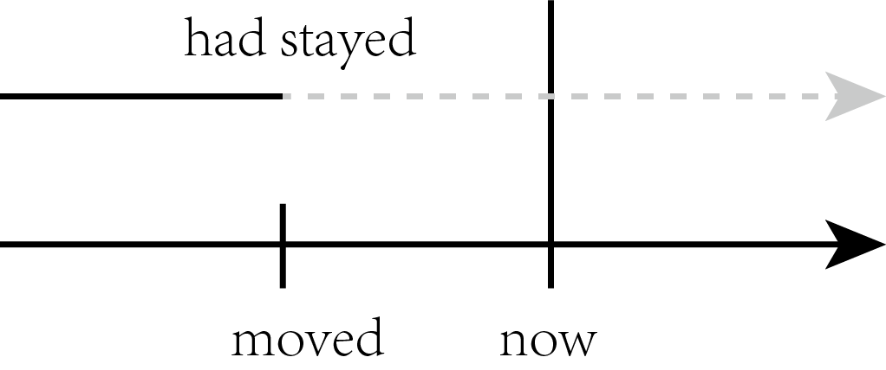
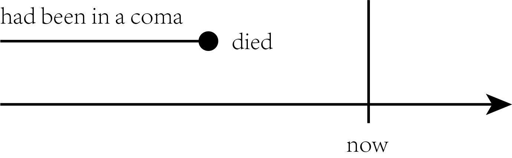

title:: 更远的过去 →(延续到)→ 过去 → 还可能延续到未来 : had done

-
- 表示一个动作或状态, 在过去的某一时间B之前已经开始，一直持续到时间B，并且还未结束, 并有可能继续持续下去。
  background-color:: #264c9b
	-
	- > I **had stayed** in America for two years when he **moved** here.
	  他搬到美国时，我在这里已经生活了两年了。
	  -> stayed发生在moved之前，即过去的过去，并且在moved之后还将会继续下去，因此用" had done " had stayed。
	  {:height 79, :width 252}
	- 当然，也可以谈一般的情况, 就把主句和从句中的时态, 都改为"一般时".
	  We **have studied** English for six years when we **enter** college.
	- > Former Japanese Prime Minister Keizo Obuchi, **who had been in a coma（昏迷）for six weeks, died of** a cerebral（大脑的）infarction（梗塞）at a Tokyo hospital.
	  日本前首相小渊惠三，在昏迷了长达六个星期后，因患脑梗塞死于东京的一家医院。
	  {:height 82, :width 331}
	- >There had been fifty colleges in our city up till 1993.
	  到1993年时，我们的城市里已经有了50所大学。
	-