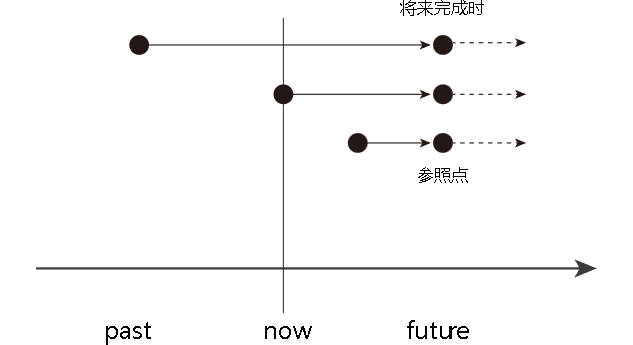

title:: 某事件 → (延续到) 将来某时刻 → 并可能继续延续下去 : will have done

- 某事件 → (延续到) 将来某时刻 → 并可能继续延续下去
- {:height 209, :width 439}
-
	- **I will have taught English** in New Oriental School for five years **by the end of next month**. 到下个月底之前，我在新东方学校教英语将满五年了。
	- **I will have waited for her for two hours** when she arrives at 2 o’clock **this afternoon**. 她今天下午两点钟到达的时候，我就将已经等她两个小时了。
-