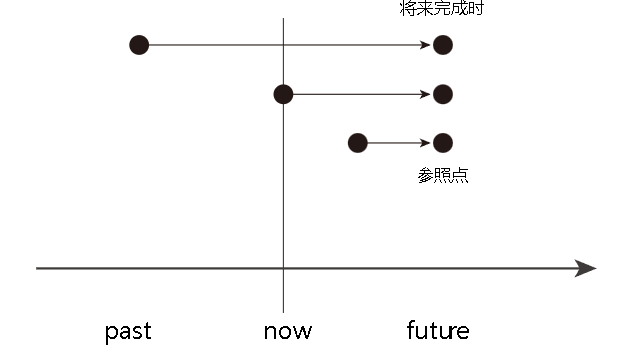
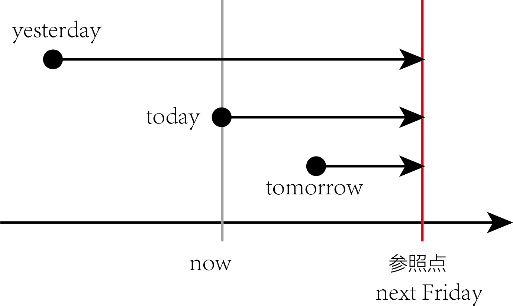

title:: 表示 从"将来之前"(过去, 现在, 将来A时刻) →(延续,重复到)→ "将来"B时刻 : 用 will have done (将来完成时)

- {:height 184, :width 416}
- 动作开始的时间并不重要，关键是说话人是站在将来的某一时间点(参照点), 来谈某动作的完成情况。
	- #+BEGIN_QUOTE
	  比如:  到下个星期五之前，我们将完成五门考试。
	    起始时间? → 五门考试 → 下周五(终点时间)
	  
	   那么"起始时间"就有下面三种可能:
	  
	  + We **started** our exam **yesterday** and we **will have taken** five exams **by next Friday**.
	  + We **have started** our exam **today** and we **will have taken** five exams **by next Friday**.
	  + We **will start** our exam **tomorrow** and we **will have taken** five exams **by next Friday**.
	  
	  {:height 229, :width 375} 
	  #+END_QUOTE
	- 事实上, 事情从什么时候开始并不重要, 说话人想要强调的是: 事件在未来某一刻结束时, 一共耗时了多久.
	-
	-
-
-
-