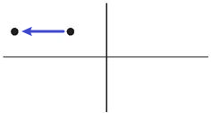

-
- 过去 (回顾→) 更远的过去 : 用 had done
  background-color:: #264c9b
- 就是站在“过去时间”的角度, "回顾"更远的另一个过去.
  表示一个事件从这个"更远的过去", 持续到"离现在较近的过去"。
- 即: **必须先有一个"过去时"(必须明确给出)，然后以这个"过去时"作为参照的时间点，来谈论更远的过去，此时这个更远的过去才能用" had done "。**因此，" had done "是一个不能独立使用的时态，它必须依附于一个在上下文中出现的" did "。
- 
	-
-
	- > After many frustrating years, the man **grew tired of** looking for The Precious Present. He **had read** all the latest books. He **had looked** in the mirror and into the faces of other people. He **had looked for it** at the tops of mountains and in cold dark caves. …​
	  → **grew表示过去，而接下来的一系列活动, 都是发生在grew之前的，所以都用了" had done "**，说成had read, had looked in, had looked for, had searched, had gone, had wanted和had exhausted等。
	- > This **Was** My Mother. …​ **He had left for home** that morning and would not be back, she was told. …​ then told us that when she was 18 she **had loved** a young medical student with all her heart. …​
	  -> 作者说This **Was** My Mother，**过去时was表明“母亲”已经不在人世，那么后面的经历都是过去的，这个was就为下文的" had done "奠定了“过去”的时间视角。**
	  在翻译时，如果把This Was My Mother简单直白地译成“这是我的母亲”，那么显然没有译出was的含义。我们不妨把它译成“回忆母亲”，用“回忆”表明母亲已不在人世——与英语的was有异曲同工之妙。
	  -> **如果作者在文章的一开头用了"一般现在时"的is，向读者表明，他的祖母还没有去世，所以，说话的时间视角是“现在”，那么下文中要“回顾”过去的经历时，就自然会用到" have done "**（比如has been, have known, has discussed, has died, has kept和has ever seen），**而不可能出现" had done "。**
	- > Once there she sat silent and thinking for many days, then **told** us that when she was 18 she **had loved** a young medical student with all her heart.
	  -> 这里的 **had love 发生在过去的动作told之前，所以用了" had done "。**
	- > **She had never seen him since** /and then **she had read in a newspaper that** he was going to attend the old settlers' convention.
	  -> 含有since的主句中一般是用" have done "，但这里用了" had done " had never seen，这是因为**这里的since所表示的时间段, 不是到目前说话时为止，而是到当时为止——即她去世时为止。所以，要用" had done "**。
	- > She **had kept** that pathetic burden(v.) in her heart [64 years] without any of us suspecting it.
	  -> **这里的had kept是相对于was(去世前)而言的，是在was之前持续了64年，所以用了" had done "。**
	- > She **would write letters to** school-mates **who had been dead 40 years** and **wonder** why they never answered.
	  -> 这里的 had been dead 是相对于过去的动作would write而言的，所以用了" had done "。
	- > **I had an idea of** what being a member of Parliament was like. **I had been** on a local authority for four years, and as a journalist and as a political activist **I had visited** the House of Commons, so it’s more or less what I expected.
	  -> A：你担任下院议员到现在已有五六个星期了，当议员和你以前所想象的是一样的吗？
	  B：我以前就知道当议员会是什么样的，因为我在当地的政府部门工作过四年，而且曾经以记者和政治活动家的身份与国会下院打过交道。所以，议员的工作跟我以前想象的差不多。
	  **先有了 had an idea，所以后文再往"更远过去"回顾, 就得用" had done " had been 和 had visited。**
	- > A: It was my grandmother’s birthday yesterday.
	  B: Is she old?
	  A: Well, **by the time** we **lit up** the last candle on her birthday cake, the first one **had gone out**!
	  A：昨天是我奶奶的生日。
	  B：她年纪很大吗？
	  A：哦，等我们点完她生日蛋糕上的最后一支蜡烛时，第一支蜡烛都已经烧完了！
	  **had gone out 发生在 lit 之前.**
	  -> **所以可以看出, by the time常常可以与" had done "搭配使用，具体结构是： had done ＋ (by the time＋ did)**。
	- #+BEGIN_QUOTE
	  She **felt** suitably humble 方式状 just as she____when he **had first taken a good look at** her, hair waved and golden, nails red and pointed.
	  
	  A．had √
	  B．had had
	  C．would have had
	  D．has had
	  
	  她举止谦逊、得体，就像他当初见到她时，她所表现的那样。她的头发依然是波浪形、金黄色的，指甲涂成了红色，尖尖的。
	  
	  **主句谓语felt用的是" did ", when从句谓语had taken用的是" had done "。 说明 first take a good look 先发生, fell后发生.
	  **
	  那么as引导的"方式状语从句"的谓语, 需要用什么时态? **显然，as引导的从句的谓语动作, 发生在felt之前，故也要用" had done ".** 因而可以排除C和D选项。
	  
	  → **A选项, 是一个省略形式，完整的谓语应该是had done，done可以省去。这里的done代替了felt。**因此，真正的谓语是had felt，相当于说as she had felt humble，即表示“就像他当初见到她时，她感到谦卑那样”。
	  
	  → B选项, had had是一个完整的谓语，谓语动词是后一个had，但该句中没有“had（有）”的意思。于是本题只能填A选项即had。
	  #+END_QUOTE
	-
-