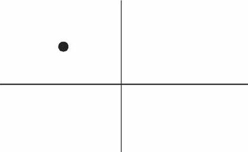
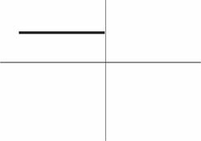

title:: 过去 + 短暂动作/状态 ← did, 并需要指明"具体的时间点"

-
- 要表达"过去"发生的"短暂"动作或状态, 就用"did". 
  background-color:: #264c9b
	- 并且, ==需要指明"具体的时间点 （a specific point of time in the past）"==. 比如 yesterday, last pring（去年春天）等.
	- 另外注意，==这些时间状语之前不需加介词==，比如不能说：at last night ×，in last year × 或 in three years ago × 等等。
		- {:height 76, :width 133}
		- I began(v.) to learn English **ten years ago**.  <- 虽然学英语是个长期状态, 但begin是个==短暂的动作==.
		- **He was late(a.) for school** this morning. <- ==短暂状态==.  并且指明了时间点
		- **I was tired(a.)** last night, so I went to bed early. <- ==短暂状态==
	-
	- 但是很多时候, 句子里没有明确的"过去时间点"，那么如果根据上下文地语境, 能推断出某个动作是在"过去"发生的，也要用"did"。
- ---
- 注意区别 : 1."did"+for时间段 :表示 动作早在历史上结束了,如恐龙早已灭绝; 2."have/has done" + for时间段:动作延续到现在,如人类还将继续繁衍下去.
  background-color:: #264c9b
	- =="did" + for时间段 : 表示动作在过去已经结束，并没有延续到现在.==
		- {:height 61, :width 112}
		- She **lived(v.) in our town** for three years. 动作没有延续到现在. 现在已经不住这里了.
		- Its final resting place **remained(v.) a mystery** for more than 70 years. ← 因为现在“泰坦尼克”号的沉没地点已被发现，所以remained终止于过去，而并没有延续到现在。
		-
	- =="have/has done" + for时间段 : 表明动作延续到现在，并且还有可能延续下去。==
		- {:height 60, :width 140}
		- She **has lived(v.) in our town** for three years.  表明她现在还住在这里，并且还可能继续延续下去。
		- ==既然事件延续到了现在，因此可以在时间状语for three years的后面填上一个now==: She has lived(v.) in our town for three years **now**.
		  ==而"did"中则不能这样加now==, 因为"did"中的动作没有延续到现在(now), 就像恐龙早就在古代灭绝了!
- ---
- 注意区别: 1.过去时:过去是那样,现在已经不是那样了,已经变了. 2.现在时:过去是那样,现在依然是那样, 没变.
  background-color:: #264c9b
	- ==时代变了,现在已经完全不同于以往了 -> 用"过去时"==
	- ==一如以往,没变, 用-> "现在时"==
		- **I didn’t know** you were her mother. 我刚才不知道…​ ← 之前不知道, 现在已经知道了, 所以"之前的不知道"就是 didn’t know.
		- You: Sorry, **I didn’t realize** you could hear it. 抱歉，我没想到你能听得见。
		- **I forgot(v.)** to bring your sth back. ← 之前忘了, 但现在想起来了.
		  **I forgot to do**…​. 我忘记做某事 ← 之前忘了, 但现在想起来了.
			- > ==“我忘记”还可以说成 : It slipped my mind==…​。
			  Oh, no. **It must’ve slipped my mind**. 哦，不会吧！我一定是忘记了。
		- **I forget the meaning** of the word. ← 我"现在"依然不知道, 用 "现在时"
		- **I thought…​** 我本来还以为…
		  Harry: **I thought(v.**) it was you. 我刚才就觉得那个人像你。
		- **I really thought(v.) that** I’d win the match. 我（本来 过去）真的以为这个比赛我会赢的。
		  **I really think(v.) that** I will win the match. <- 我现在依然这么想. I think 相当于 I have an opinion（我这么认为），表示自己的观点.
		- Sally: **Was** Marie. ← 刚才在我身边的那位是玛丽. (现在 marie 已经走了)
		- **It is nice** to meet you. ← 当两人见面刚刚认识时说.
		  **It was nice** meeting you. ← 在两人聊天结束后说，因为已经认识过了, 所以就要用过去时态 was 了. ==注意: 在这个告别时说“认识”, 用的是动名词 meeting，而不是不定式 to meet。==
			- > 或者说成 **It was nice** talking 动名 to you. ← 这里同样是用了"did" was。因为经过聊天后，“认识（meet）”或“聊天（talk）”都已成为刚刚的过去，所以自然要用 was 而不是 is。
			- ==上面两句告别用语, 可以分别简化成: Nice meeting you. 和 Nice talking to you.==
		- Ted: Hey, **that was fun**. Thanks for the lesson! 通过was就表明“学溜冰“这个活动刚刚结束.
		  如果是在"活动进行的过程中"说“真有趣”，那谓语就应该用 is , 说成 that is fun。
		- Mr. Dean: And it’s not as cheap as the last apartment we saw(v.) . ... But that apartment **was**(v.) dark and dingy. And it **was**(v.) in a dangerous neighborhood.
		  <- 上一个公寓“暗（dark）”和“脏（dingy）”，这种状况显然是不会很快改变的, 为什么这里不用一般时 do, 而用过去时 was 呢? 因为 这里的 was 是与前面的 saw 相一致的, 即上一个公寓是在“过去看（saw）”的，那么有关上一个公寓的一切情况, 在说话者看来就都“停留”在过去了。
		- Excuse me. **I believe I__(be) here first.** Do you mind waiting your turn? ← 遇到有人插队, 你说"我想我比你先来这里的。你能排队等候吗？" . 这里应该用 **I believe I was(v.) here first**.
		-
	-