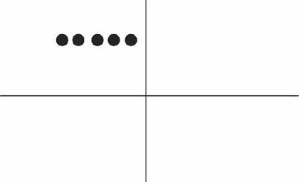

-
- 你想表示重复活动/状态（expressing a regularly occurring event）→ 用"do"
  background-color:: #264c9b
	- **I go to the gym** twice a week. 我每周去两次健身房。 ← 表示"习惯的动作"
	- **I like rice** for dinner. ← 表示"习惯的状态"
-
- "==do==" → 无法表示明确的时间段(开始/结束), 即 ==入点, 出点, 都未知==
  background-color:: #264c9b
	- **I swim 1,000 meters** every afternoon. <- 1. 无论过去还是未来, 都是每天1000米. 2. ==至于这个习惯, 是从什么时候开始有的, 未来何时会结束, 即"入点"和"出点"在哪里? 不知道. 因为这不是"do"能够表达的出来的. 即"do"无法向我们展示一个明确具体的时间段。==
	- {:height 89, :width 197}
	- I winter swim for about four years. ×
	  I winter swim since 1984. ×
	  <- 这两句是错的, 因为 do 无法表达出动作时间的入点和出点, 所以不能加时间段 (for...,  since...)!
	-
- 而==完成进行时== → 可以明确表示"从过去一直持续到目前为止", ==即 "入点"不可知, "出点"可知(即 now).==
  background-color:: #264c9b
	- **I have been swimming 1,000 meters** every afternoon. "完成进行时"可以表达出时间段, 所以这句话就可能含有"潜台词"了 -- 也许“我”打算以后改变一下游泳锻炼的计划.
	- {:height 44, :width 187}
	-
-