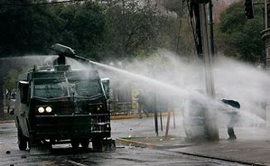
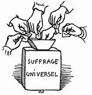
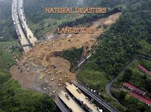
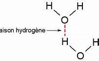
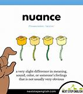

= eco 2020-05-30
:toc:

---

== Rule(v.) [by fear] 被恐惧统治  词汇解说

(2020-05-30 / China / Hong Kong’s freedoms: Rule by fear)

China’s national-security bill for Hong Kong *is* an attempt *to terrify* 使恐惧；使十分害怕；使惊吓

It *could turn* the territory *into* a Sino-American battleground

May 28th 2020 | HONG KONG

THE ARMOURED vehicles 装甲车 of China’s security forces *have not rolled* 发出持续的声音;启动；开动 onto Hong Kong’s streets, as last year officials in Beijing *hinted* they *might* [amid anti-government turmoil(n.) 动乱；骚动；混乱；焦虑 in the territory]. But [late in May] Chinese officials *may have done more than* their troops would have to kill the notion 观念；信念；理解 of a “high degree of autonomy” in Hong Kong, which *was promised* when it returned to China in 1997. As Chinese legislators *gathered* in the capital *for* an annual 每年的；一年一次的；年度的, coronavirus-delayed meeting, the body’s standing(a.)长期存在的；永久性的；常设的 committee *dropped a bombshell* 出乎意料的事情，意外消息（常指不幸）;金发美女.

1. roll : v. to move or make sth move from side to side （使）摇摆，摇晃 /to make a long continuous sound 发出持续的声音 /when a machine rolls or sb rolls it, it operates 启动；开动
- Thunder rolled(v.). 雷声隆隆。

1. turmoil [ˈtɜrmɔɪl] n. [不可数名词, 单数] a state of great anxiety and confusion 动乱；骚动；混乱；焦虑
- emotional/mental/*political turmoil* 纷乱的情绪；精神上的混乱；政治动乱
- THE ARMOURED vehicles of China’s security forces *have not rolled* onto Hong Kong’s streets, as last year officials in Beijing *hinted* 暗示 {they *might* [amid anti-government turmoil(n.) in the territory 领土；版图；领地]}. +

1. notion   : *~ (that...) /~ (of sth)* an idea, a belief or an understanding of sth 观念；信念；理解
- a political system *based on the notions of equality and liberty* 建立在自由平等观念基础上的政治体系
- the notion of a “high degree of autonomy” in Hong Kong.

1. standing : a. existing or arranged permanently, not formed or made for a particular situation 长期存在的；永久性的；常设的
- a standing army 常备军
- *a standing committee* 常务委员会

1. bombshell : /ˈbɑːmʃel/ n. an event or a piece of news which is unexpected and usually unpleasant 出乎意料的事情，意外消息（常指不幸） /*a blond(e) bombshell* : a very attractive woman with blonde hair 金发美女 +
=> bomb, 炸弹。shell, 弹壳。
- The news of his death *came as a bombshell*. 他去世的消息令人震惊。
- the body’s standing(a.) committee *dropped* a bombshell. 全国人大常委会投下了一枚重磅炸弹。

The committee *said* it *had reached a “decision”* that China *would impose* a national-security law *on* Hong Kong. The territory’s own legislature *would have no role* in drafting(v.) it. The bill *would prevent* and *punish* “any conduct that *seriously endangers* national security”, *including* separatism 分裂主义; 独立主义, subversion 颠覆企图 of state power, terrorism and “activities by foreign and overseas forces” that “*interfere*” 干涉；干预；介入 in Hong Kong’s affairs. It *could be promulgated* 宣布，颁布，发布（新法律或体制） in Hong Kong *as early as* late June.

1. separatism : /ˈseprətɪzəm/ N-UNCOUNT Separatism is the beliefs and activities of separatists. 分裂主义; 独立主义

1. subversion : N-UNCOUNT Subversion is the attempt to weaken or destroy a political system or a government. 颠覆企图 +
=> sub-,在下，-vert,转，词源同 verse,convert.引申词义颠覆，暗中破坏等。

1. interfere : v. [ VN ] ~ (in sth) to get involved in and try to influence a situation that does not concern you, in a way that annoys other people 干涉；干预；介入
- The police are very unwilling *to interfere in family problems*. 警方很不情愿插手家庭问题。
- “activities by foreign and overseas forces” that “*interfere*”(v.) in Hong Kong’s affairs.

1. promulgate /ˈprɑːmlɡeɪt/ v. to announce a new law or system officially or publicly 宣布，颁布，发布（新法律或体制） /[ usually passive ] to spread an idea, a belief, etc. among many people 传播；传扬；宣传 +
=> 来源于拉丁语中由前缀pro-(前,公开)和动词mulgere(榨取,挤奶)组成的复合动词promulgare(公布,发布)。 词根词缀： *pro-前,公开 + mulg榨取,挤奶(词根mulg和单词milk（奶；挤奶）同源)* + -ate动词词尾 *由挤奶时乳汁向外发散喷洒的状态，抽象引申为“发布，发表”之义。* 同源词：emulsion
- It *could be promulgated* in Hong Kong *as early as* late June. 它最早可于六月底在香港公布。

America *is not waiting*. On May 27th its secretary of state, Mike Pompeo, *declared that* “facts on the ground” 当场；在现场；（尤指）在处于战火中的人之中 *showed* Hong Kong *was* no longer autonomous 自治的；有自治权的. This *opens* a new front 前线；前方 in the intensifying 加强; 强化 struggle between China and America. Mr Pompeo’s words(n.) *mean that* `主` what many businesses in Hong Kong *had once treated as* unthinkable 不可思议的；难以置信的 `谓` *is becoming* more possible. Namely, America *could decide* to impose(v.) the same tariffs, trade restrictions and visa requirements *on* Hong Kong *as it does* on the rest of China. That *would cause* as much 同样多的, 同样的 [*if not more* 就算不比...多，至少和...一样的(同样的） distress in the territory *than* the draconian(a.)德拉古式的；严酷的；残忍的 new bill].

1. *on the ground* : in the place where sth is happening and among the people who are in the situation, especially a war 当场；在现场；（尤指）在处于战火中的人之中
- *On the ground*, there are hopes that the fighting will soon stop. 战火中的人都希望战斗尽快结束。
- There's a lot of support for the policy *on the ground*. 这一政策得到相关人员的普遍支持。
- “*facts on the ground*” showed(v.) Hong Kong *was* no longer autonomous. “事实”表明hk不再是自治的。

1. autonomous : a. ( of a country, a region or an organization 国家、地区、组织 ) able to govern itself or control its own affairs 自治的；有自治权的
- an autonomous republic/state/province 自治共和国╱州╱省

1. front : n. [ Cusually sing. ] an area where fighting takes place during a war 前线；前方
- More British troops *have been sent to the front*. 更多的英国部队已派往前线。
- This *opens* a new front in the intensifying struggle between China and America. 这为中美之间日益激烈的斗争, 开辟了一条新的战争前线。

1. draconian :  /drəˈkoʊniən/  a. ( formal ) ( of a law, punishment, etc. 法律、惩罚等 ) extremely cruel and severe 德拉古式的；严酷的；残忍的
- That *would cause* as much if not more distress in the territory *than* the draconian(a.) new bill. 这将比严苛的新法案在香港造成更大(如果不是更大的话)的痛苦。

1. as much 同样多的, 同样的

1. *if not more than* 意思是：就算不比...多，至少和...一样的(同样的）
- *A is as import as B, if not more than, at least the same.*
翻译，A跟B一样重要，如果A没有B重要，至少也一样。
- I am at least the same age as Robert *if I am not older than him*.
- That *would cause* as much [*if not more* distress in the territory *than* the draconian(a.) new bill]. +
这将在香港引起与严厉的新法案同样多的痛苦，如果不是更多痛苦的话。

Officials in Beijing and Hong Kong *have gone into overdrive* 过度驱使，使过度工作;加倍努力（或紧张） to reassure(v.)使…安心；打消…的疑虑 foreign investors in the international city. Carrie Lam, its chief executive, *used to say [in private] that* if the central government *were* to impose(v.) a national-security law in this way, the perception 看法；见解 *would be* highly negative. Now she *finds herself 发觉自己的处境 arguing that* by *targeting* acts of secession （地区或集团从所属的国家或上级集团的）退出，脱离 and interference by “external forces” (*never defined*), the new law *is doing foreign business a favour*. Last year’s open defiance(n.)违抗；反抗；拒绝服从 of the police by protesters *will no longer be tolerated*. Hong Kong *can go back to business*.

1. overdrive : v. 过度驱使，使过度工作 n. （汽车的）超速档；极度忙碌 /(PHRASE) 加倍努力（或紧张） If you *go into overdrive*, you begin to work very hard or perform a particular activity in a very intense way.
- to be *in overdrive* 超速驾驶
- Officials in Beijing and Hong Kong *have gone into overdrive* to reassure(v.) foreign investors in the international city. 北京和香港的官员们, 都在不遗余力地安抚这座国际大都市的外国投资者。

1.  perception : [不可数名词, 可数名词] ~ (that…) (formal) an idea, a belief or an image you have as a result of how you see or understand sth 看法；见解
- a campaign to change *public perception* of the police
改变警察公众形象的运动
- if the central government *were* to impose(v.) a national-security law in this way, the perception *would be* highly negative. 如果中央政府以这种方式实施国家安全法，人们的看法将非常负面。

1. find oneself 后面可以接现在分词doing或过去分词done的形式，意思是：发觉自己的处境。现在分词表示主动含义；过去分词就是表示被动含义。例如： +
- Then *I found myself surrounded* by half a dozen boys.然后我发现六个男孩围者自己。
- *Dick found himself walking* in the direction of Mike's place.Dick不知不觉的朝Mike的住处走去。

1. secession :  /sɪˈseʃn/  *~ (from sth)* the fact of an area or group becoming independent from the country or larger group that it belongs to （地区或集团从所属的国家或上级集团的）退出，脱离
-  ...*the Ukraine's secession* from the Soviet Union.
...乌克兰之退出苏联。 +

1. defiance /dɪˈfaɪəns/ n. open refusal to obey sb/sth 违抗；反抗；拒绝服从 +
=> 来自defy的名词形式。
- a look/an act/a gesture of defiance 反抗的神色╱行动╱表示 +
- Last year’s open defiance(n.) of the police by protesters *will no longer be tolerated*. 去年抗议者公开违抗警察的行为, 将不再被容忍。 +
image:../../+ img_单词图片/d/defiance.jpg[100,100]

*Briefing* 给（某人）指示；向（某人）介绍情况 diplomats 外交官, businesspeople and journalists on May 25th, China’s foreign-affairs commissioner （委员会的）委员，专员，特派员 in the territory, Xie Feng, *said* the new law *would merely plug* a legal “loophole” （法律、合同等的）漏洞，空子 *exploited by* a “small minority of criminals” *backed by* dark foreign forces *bent on* 决心要做，一心想做（通常指坏事） splitting(v.)分裂，使分裂（成不同的派别） China. Foreign investors and other business folk, Mr Xie *purred* （愉快或满意地）低沉柔和地讲话；轻声招呼;（猫）发出呼噜声，惬意地打呼噜, *had no reason to panic*. On a more threatening note 正式文件；票据；证明书, he *suggested that* `主` anyone who *did sound the alarm* 敲警钟,发警报 `谓` *was out 试图得到（或做） to block* China’s development. Mr Xie *urged* his audience *to await* “details” of the proposed 提议；建议 legislation 法规；法律;立法；制订法律 -- then people *would see* there was nothing to worry about.

1. brief : v. *~ sb (on/about sth)* to give sb information about sth so that they are prepared to deal with it 给（某人）指示；向（某人）介绍情况
- *Briefing* diplomats, businesspeople and journalists. 向外交官、商人和记者们做简报

1. commissioner :  (usually Commissioner) a member of a commission (= an official group of people who are responsible for controlling sth or finding out about sth) （委员会的）委员，专员，特派员 / the head of a government department in some countries （政府部门的）首长，长官
- *the agriculture/health, etc. commissioner* 农业、卫生等厅长
-

1. loophole : n. *~ (in sth)* a mistake in the way a law, contract, etc. has been written which enables people to legally avoid doing sth that the law, contract, etc. had intended them to do （法律、合同等的）漏洞，空子 +
=> 原指墙上的小洞，后用于比喻义漏洞。
- *a legal loophole* 法律的漏洞 +
image:../../+ img_单词图片/l/loophole.jpg[100,100]

1. *bent on sth/on doing sth* : determined to do sth (usually sth bad) 决心要做，一心想做（通常指坏事）
- She seems *bent on making life difficult for me*. 她似乎专门和我过不去。
- the new law *would merely plug* 堵塞；封堵 a legal “loophole” *exploited by* a “small minority of criminals” *backed by* dark foreign forces *bent on* splitting(v.) China. +
新法律只是填补了一个法律“漏洞”，这个“漏洞”被一小部分“罪犯”利用，而这些“罪犯”受到一心要分裂中国的黑暗外国势力的支持。

1. split : v.  to divide, or to make a group of people divide, into smaller groups that have very different opinions 分裂，使分裂（成不同的派别）
- The committee *split*(v.)) over government subsidies. 在政府补贴的问题上，委员会出现了相互对立的意见。 +
image:../../+ img_单词图片/s/split.jpg[100,100]

1. purr : [pə] v. to speak in a low and gentle voice, for example to show you are happy or satisfied, or because you want to attract sb or get them to do sth （愉快或满意地）低沉柔和地讲话；轻声招呼 / （猫）发出呼噜声，惬意地打呼噜
- Foreign investors and other business folk, Mr Xie *purred*, had no reason to panic. +

1. note : [可数名词] an official document with a particular purpose 正式文件；票据；证明书
- *a sick note* from your doctor 医生开据的病假证明

1. *be out for sth/to do sth* : to be trying to get or do sth 试图得到（或做）
- *She's out for* what she can get (= trying to get something for herself) .
她力图得到自己能得的。
- The company *is out to capture* the Canadian market.
这家公司竭尽全力抢滩加拿大市场。
- On a more threatening note, he *suggested that* anyone who *did sound* the alarm *was out to block* China’s development. +
在一篇更具威胁性的记录中，他表示，任何发出警告的人都是为了阻止中国的发展。

1. propose : v. (formal) to suggest a plan, an idea, etc. for people to think about and decide on 提议；建议
- *What would you propose*? 你想提什么建议？
- Mr Xie *urged* his audience *to await* “details” of the proposed legislation. 敦促他的听众等待立法提案的“细节”

Yet 正如 *as* Margaret Ng, a barrister 出庭律师，大律师，辩护律师（在英国有资格出席上级法庭进行辩护） and former member of Hong Kong’s quasi 准；类似-parliament 准议会, the Legislative Council (Legco), *points out*, the details *are* “almost irrelevant(a.)无关紧要的；不相关的”. The proposed law, she *says*, *would blow(v.)炸开 a hole* [*both*] in the handover （权力、责任等的）移交，移交期;（某人或某物的）交出，上交 agreement that China *signed with* Britain, [*and*] in China’s own mini-constitution for Hong Kong, the Basic Law. *It is fundamental* to Hong Kong’s guarantees *that* it *makes* its own criminal laws /and *that* people in the territory *may be punished* only under Hong Kong law by Hong Kong agencies.

1. barrister : /ˈbærɪstər/ a lawyer in Britain who has the right to argue cases in the higher courts of law 出庭律师，大律师，辩护律师（在英国有资格出席上级法庭进行辩护） +
=> 来自bar, 杆，棍。指用杆条隔开法官与律师，代指律师。-ster, 人。 +
在英国，律师分成两种：barrister和solicitor。 +
barrister是出庭律师、大律师，具有上庭辩护的资格，常根据其发音称为“巴律师”； +
solicitor是事务律师，只能办理法律事务，不能上庭辩护，常根据其发音称为“沙律师”。 +
barrister中的bar指的是庭审现场中将法庭和旁听席分开的围栏，因此barrister的字面意思就是有资格越过围栏，上庭辩护的律师。 +
image:../../+ img_单词图片/b/barrister.jpg[100,100]

1. quasi-  : /'kweizai/ pref. 准；类似（用以构成复合词） /that appears to be sth but is not really so 类似 /partly; almost 半；准 +
=> 来自拉丁语quasi, 看起来相似， 类似。其中qua 来自PIE*kwo, 表疑问， 词源同quality,quantity,how,who,-si 来自PIE*swe,自身，自己，词源同self.见quasar,quasi-science.
- *a quasi-official body* 半官方机构
- a quasi-scientific explanation 貌似科学的解释

1. irrelevant : a.  *~ (to sth/sb)* not important to or connected with a situation 无关紧要的；不相关的
- *totally/completely/largely irrelevant* 完全 / 绝对 / 基本上无关紧要
- Yet 正如 *as* Margaret Ng, a barrister and former member of Hong Kong’s quasi-parliament, the Legislative Council (Legco), *points out*, the details *are* “almost irrelevant(a.)”. +
然而，正如香港准议会——立法会的前议员、律师吴霭仪(Margaret Ng)所指出的，细节“几乎无关紧要”。

1. blow : v. [+ 副词或介词短语] to be moved by the wind, sb's breath, etc.; to move sth in this way （被）刮动，吹动 /[动词 + 名词短语] to break sth open with explosives 炸开
- The safe *had been blown* by the thieves. 保险柜被窃贼炸开了。
- The proposed law, she *says*, *would blow(v.) a hole* [*both*] in the handover agreement that China *signed with* Britain, [*and*] in China’s own mini-constitution for Hong Kong, the Basic Law. +
她说，拟议的法律, 将在中国与英国签署的移交协议和中国自己的香港小宪法《基本法》中, 炸开一个洞。

1. handover : n. the act of moving power or responsibility from one person or group to another; the period during which this is done （权力、责任等的）移交，移交期 /the act of giving a person or thing to sb in authority （某人或某物的）交出，上交
- *the smooth handover of power* from a military to a civilian government
从军政府到文人政府的权力的顺利移交

The new bill *would wreck* 毁灭；毁掉;使（船舶）失事；使遇难；使下沉 that. True, the central government *is making use of* a clause （法律文件等的）条款 in the Basic Law that *allows it to legislate(v.)制定法律；立法 for* Hong Kong. But that *is permitted* only in matters *relating to* diplomacy, defence and “other matters outside the limits” of Hong Kong’s autonomy. Democrats in Hong Kong *argue that* the proposed bill *is* within Hong Kong’s scope. Article 23 of the Basic Law *says* Hong Kong *should enact 颁布;通过（法律） laws* “on its own” *against* treason 危害国家罪，叛国罪（如战时通敌）, secession （地区或集团从所属的国家或上级集团的）退出，脱离, sedition 煽动叛乱的言论（或行动） and subversion 颠覆；暗中破坏, as well as 也,又 *to prohibit* （尤指以法令）禁止 ties between Hong Kong bodies and foreign political organisations (though `主` an attempt *to do so* in 2003 `谓` *was abandoned* after a huge protest).

1. wreck : v.to damage or destroy sth 破坏；损坏；毁坏 /*~ sth (for sb)* to spoil sth completely 毁灭；毁掉/ [常用被动态] to damage a ship so much that it sinks or can no longer sail 使（船舶）失事；使遇难；使下沉
- *The building had been wrecked* by the explosion.
那座楼房被炸毁了。
- A serious injury *nearly wrecked his career*.
一次重伤差点儿葬送了他的前程。
- The new bill *would wreck* that. 新法案将破坏这一点。 +

1. enact v. [常用被动态](law 律) to pass a law 通过（法律）
- legislation *enacted by parliament*
由议会通过的法律

1. treason : n.   /ˈtriːzn/ ( ˌhigh ˈtreason ) [ U ] the crime of doing sth that could cause danger to your country, such as helping its enemies during a war 危害国家罪，叛国罪（如战时通敌） +
=> 来自拉丁语 tradere,转移，移 交，词源同 tradition,betray.引申词义叛国罪。
- a treasonable act 叛国行为

1. sedition  /sɪˈdɪʃn/ n. [ U ] ( formal ) the use of words or actions that are intended to encourage people to oppose a government 煽动叛乱的言论（或行动） +
=> sed-,分开，来自 se-在元音前的异体形式，-it,走，词源同 exit,transit.比较前缀 re-在元音前的 异化形式 redolent,olfactory.字面意思即分开走，使分开，引申词义煽动叛乱。
- seditious(a.) activity 煽动叛乱的活动

1. subversion: [动词 + 名词短语, 单独使用的动词] to try to destroy the authority of a political, religious, etc. system by attacking it secretly or indirectly 颠覆；暗中破坏 /[动词 + 名词短语] to try to destroy a person's belief in sth or sb 使背叛；使变节；策反
- Article 23 of the Basic Law *says* Hong Kong *should enact laws* “on its own” *against* treason 危害国家罪，叛国罪（如战时通敌）, secession （地区或集团从所属的国家或上级集团的）退出，脱离, sedition 煽动叛乱的言论（或行动） and subversion  (对政府或政治体系的)颠覆，暗中破坏, as well as 也,又 *to prohibit* ties between Hong Kong bodies and foreign political organisations.  +
《基本法》第23条规定，香港应“自行”制定法律，打击叛国罪、分裂国家罪、煽动叛乱罪和颠覆罪，并禁止香港机构与外国政治组织建立联系.

The central government, then, *has* no legal authority 权力；威权；当权（地位） *to add* a national-security law *to* the Basic Law’s annexe （文件的）附件，附录;附属建筑物；附加建筑物. Hong Kong’s Bar Association 律师协会,律师公会 *also points to* a lack of any assurance that the new bill *will comply 遵从；服从；顺从 with* the International Covenant(n.)承诺；合同；协约；（尤指定期付款的）契约 on Civil and Political Rights, which the Basic Law *pledges*(v.)保证给予（或做）；正式承诺 to uphold(v.)支持，维护（正义等）.

1. annexe : n. [ˈænɪks] (formal) an extra section of a document （文件的）附件，附录 /a building that is added to, or is near, a larger one and that provides extra living or work space 附属建筑物；附加建筑物 +
=> an（=ad，去）+nex（系、绑, 见connect）→绑在一起→合并 词源解析：nex←拉丁语nectere（系、绑） 同源词：connect（连接），nexus（关系） 衍生词：annexation（合并） +

1. Bar Association 律师协会,律师公会

1. covenant : |ˈkʌvənənt| n. a promise to sb, or a legal agreement, especially one to pay a regular amount of money to sb/sth 承诺；合同；协约；（尤指定期付款的）契约 +
=> co-, 强调。-ven, 来，词源同venue,convene(开会)。即召集开会后形成的协议，条约。 +
- God's covenant with Abraham
上帝与亚伯拉罕的立约 +

1. pledge : v. *~ sth (to sb/sth)* to formally promise to give or do sth 保证给予（或做）；正式承诺 / *~ sb/yourself (to sth)* to make sb or yourself formally promise to do sth 使保证；使发誓 +
=> 来自PIE*del,长的，词源同long,play,plight.引申词义请求，许诺，誓言等。
- The government *pledged their support* for the plan.
政府保证支持这项计划。
- *They were all pledged* to secrecy. 他们都宣誓保密。
- Hong Kong’s Bar Association *also points to* a lack of any assurance that the new bill *will comply with* the International Covenant(n.) on Civil and Political Rights, which the Basic Law *pledges*(v.) to uphold(v.). +
香港大律师公会(Bar Association)还指出，新法案缺乏任何保证，无法确保它符合《公民权利和政治权利国际公约》(International Covenant on Civil and Political Rights)。《基本法》承诺要维护《国际公约》。 +
image:../../+ img_单词图片/p/pledge.jpg[100,100]

1. uphold : v. to support sth that you think is right and make sure that it continues to exist 支持，维护（正义等）
-  We have a duty *to uphold the law*.
维护法律是我们的责任。

There is a final breach （对法规等的）违背，违犯 of Hong Kong’s legal and other norms. Mainland organisations *may be set up* [in the territory] *to “safeguard”* national security and *oversee* the new legislation. The implications *are* profound(a.)巨大的；深切的；深远的, including the possible stationing 派驻；使驻扎 in Hong Kong of China’s secret police. It is hard *to imagine* how their will(n.) *would not prevail*(v.)普遍存在；盛行；流行 in any matter *relating to* interpretation 理解；解释；说明;演绎；演奏方式；表演方式 of the new bill /and who *should be targeted*. The Basic Law *says* no arm of the central government *may interfere* in the administration of Hong Kong’s own affairs. But secret agents *do*, *such as* those who *grabbed* a Hong Kong bookseller in 2015 and *spirited 偷偷带走；让人不可思议地弄走 him away* to the mainland.

1. breach : n. [可数名词, 不可数名词] *~ of sth* a failure to do sth that must be done by law （对法规等的）违背，违犯 /~ of sth an action that breaks an agreement to behave in a particular way 破坏；辜负 +
=> 词源同break.
- They are *in breach of Article 119*. 他们违犯了第119条。
- *a breach of confidence/trust* 泄密；背信

1. profound : a. very great; felt or experienced very strongly 巨大的；深切的；深远的 /(medical 医) very serious; complete 严重的；完全的；彻底的 +
=> 来自拉丁语profundus,深的，无底的，来自pro-,向前，朝向，fundus,底部，词源同fundamental,bottom.引申词义深邃的，深远的等。拼写受found影响。
- My father's death *had a profound effect on us all*.
父亲的去世深深地影响了我们全家。
- profound disability 严重残疾
- *The implications are profound*(a.), including the possible stationing in Hong Kong of China’s secret police. 其影响是深远的，包括中国秘密警察可能在香港驻扎。

1. station : v. to send sb, especially from one of the armed forces, to work in a place for a period of time 派驻；使驻扎 /*~ sb/yourself…* (formal) to go somewhere and stand or sit there, especially to wait for sth; to send sb somewhere to do this 到某处站（或坐）；把…安置到（某处）
- troops *stationed(v.) abroad* 驻扎在国外的部队
- *She stationed(v.) herself* at the window to await his return. 她待在窗前等他回来。

1. prevail : v. *~ (in/among sth)* to exist or be very common at a particular time or in a particular place 普遍存在；盛行；流行 +
=> pre-,在前，领先，-vail,价值，.力量，词源同avail,value.即在力量上超过，胜利，引申词义盛行，流行等。
- *Those beliefs still prevail*(v.) among certain social groups. 这些信念在某些社会群体中仍很盛行。
- It is hard *to imagine* how their will(n.) *would not prevail*(v.) in any matter *relating to* interpretation of the new bill /and who *should be targeted*. +
很难想象在任何与解释新条例草案有关的问题上，他们的意愿如何不会占上风? 以及谁应该成为目标。

1. spirit : v. [动词 + 名词短语 + 副词或介词短语] to take sb/sth away in a quick, secret or mysterious way 偷偷带走；让人不可思议地弄走
- But secret agents *do*, *such as* those who *grabbed* a Hong Kong bookseller in 2015 and *spirited him away* to the mainland.
但特工们却能做到，比如那些在2015年抓了一个香港书商并把他偷偷带到了大陆的人。

Three broad and interconnected （使类似的事物）相联系，相互联系，相互连接 sets of questions *now need answers*. First, how *will* Hong Kongers *react*? 随着 *As* coronavirus restrictions *ease*, *will* anger *erupt* on the streets again? Second, how *will* companies (*doing business* in Hong Kong) *respond*? *Can* Hong Kong *continue to serve as* a global hub for finance, commerce and the media -- a place *comfortably apart from* mainland China? Or will firms *up sticks* 突然迁居 and *run for* Singapore or even Taiwan? *Can* China, indeed, *count on* Hong Kong *as* the pre-eminent(a.)杰出的；出类拔萃的；卓越的 place *to raise* “red” capital *for* its firms? Lastly 最后一点；最后, what steps *might follow* from Mr Pompeo’s pronouncement? What impact on the calculations 算计；自私的打算 of both citizens and businesses in Hong Kong (*might* America’s actions *have*)?

1. up sticks : (British English) (North Amercian English pull up stakes) (informal) to suddenly move from your house and go to live somewhere else 突然迁居 /stick  [可数名词] a thin piece of wood that has fallen or been broken from a tree 枝条；枯枝；柴火棍儿
- will firms *up sticks* and *run for* Singapore or even Taiwan?  企业会不会挺身向新加坡甚至台湾进军?

1. *run for it* : (often used in orders 常用于命令) to run in order to escape from sb/sth 逃跑

1. *count on  sb/sth* : to trust sb to do sth or to be sure that sth will happen 依赖，依靠，指望（某人做某事）；确信（某事会发生）
- *I'm counting on you* to help me. 我就靠你帮我啦。
- *Can* China, indeed, *count on* Hong Kong *as* the pre-eminent(a.) place *to raise* “red” capital *for* its firms? +
中国真的指望香港成为为其企业筹集“红色”资本的首选之地吗?

1. pre-eminent : a. (formal) more important, more successful or of a higher standard than others 杰出的；出类拔萃的；卓越的
- Dickens *was pre-eminent*(a.) among English writers of his day. 狄更斯在其同时期英国作家中最为出色。

1. lastly : ad. used to introduce the final point that you want to make 最后一点；最后 /at the end; after all the other things that you have mentioned 最后；最后提及
- *Lastly*, I'd like to ask you about your plans. 最后，我想问一下你们的计划。
- *Lastly*, add the lemon juice. 最后，再加柠檬汁。

1. calculation : n. [不可数名词](disapproving) careful planning for yourself without caring about other people 算计；自私的打算
- an act of *cold calculation* 冷酷无情的算计
- What impact on the calculations of both citizens and businesses in Hong Kong (*might* America’s actions *have*)?  美国的行动会有的对香港市民和企业的打算, 会产生什么影响?

For Hong Kong’s young, the identity of a generation *was forged* in last year’s protests. These *began* in June in opposition to a draft bill that *would have allowed* Hong Kongers (*accused of crimes* in China) *to be extradited* 引渡（嫌犯或罪犯）, without recourse(n.)依靠；依赖；求助, *to* the mainland. The protests *quickly snowballed 滚雪球般迅速增大（或趋于严重、变得重要等） into* a broader rebellion 谋反；叛乱；反叛 against both the local and central government. Over time they *became* more violent -- participants *began using* slings(n.)（悬挂或起吊重物的）吊索，吊链，吊带 ；投石器；抛掷, arrows and petrol bombs *against* the police, who *became* ever readier(a.)愿意迅速做某事（或给某物）；急于行动 *to resort(v.)诉诸；求助于；依靠 to* tear-gas, rubber bullets, water cannon 水炮（警方用以驱散人群） and occasional live rounds 一次射击；一发子弹. Hong Kong *had seen* nothing like it since the Communist Party itself *instigated 煽动；唆使；鼓动;使（正式）开始；使发生 riots* in the British colony in the 1960s.

1. For Hong Kong’s young, the identity of a generation *was forged* in last year’s protests. 对hk年轻人来说，一代人的身份是在去年的抗议活动中形成的。

1. extradite : |ˈekstrədaɪt| v.  *~ sb (to…) (from…)* : to officially send back sb who has been accused or found guilty of a crime to the country where the crime was committed 引渡（嫌犯或罪犯） +
=> ex-, 向外。-trad, 转让，移交，词源同betray, tradition.

1. recourse :  /ˈriːkɔːrs/  n. [ U ] ( formal ) the fact of having to, or being able to, use sth that can provide help in a difficult situation 依靠；依赖；求助
=> re-,向后，往回，-cour,跑，词源同 course,current.即跑回来，引申词义求助，依靠。
- *Your only recourse* is legal action. 你的唯一依靠就是诉诸法律。
- The government, when necessary, *has recourse*(n.) to the armed forces. 政府在必要时可以动用军队。
- These *began* in June in opposition （强烈的）反对，反抗，对抗 to a draft bill that *would have allowed* Hong Kongers (*accused of crimes* in China) *to be extradited*, without recourse(n.), *to* the mainland. +
这些行动始于6月份，目的是反对一项法案草案，该草案将允许被控在中国犯罪的hk人被引渡到大陆，而没有求助的机会。 +

1. snowball : v. [单独使用的动词] if a problem, a plan, an activity, etc. snowballs , it quickly becomes much bigger, more serious, more important, etc. 滚雪球般迅速增大（或趋于严重、变得重要等）
- The protests *quickly snowballed into* a broader rebellion against both the local and central government. +
抗议活动迅速升级为针对地方和中央政府的更大范围的叛乱。

1. rebellion : n. *~ (against sb/sth)* [不可数名词, 可数名词] an attempt by some of the people in a country to change their government, using violence 谋反；叛乱；反叛 +

1. sling : /slɪŋ/ n. [机] a device consisting of a band, ropes, etc. for holding and lifting heavy objects （悬挂或起吊重物的）吊索，吊链，吊带 ；投石器；抛掷 /vt. 用投石器投掷；吊起
- The engine was lifted *in a sling(n.) of steel rope*.
引擎用钢丝吊索吊了起来。 +

1. ready : a. [名词前不可用] *~ (for/with sth) | ~ (to do sth)* willing and quick to do or give sth 愿意迅速做某事（或给某物）；急于行动
- I was very angry and *ready(a.) for a fight*. 我非常生气，想打一架。
- She's always *ready(a.) with advice*. 她总是乐于提出建议。

1. *resort(v.) to sth* :  to make use of sth, especially sth bad, as a means of achieving sth, often because there is no other possible solution 诉诸；求助于；依靠
- They felt obliged *to resort to violence*. 他们觉得有必要诉诸暴力。
- Over time they *became* more violent -- participants *began using* slings(n.), arrows and petrol bombs *against* the police, who *became ever readier(a.) to resort(v.) to* tear-gas, rubber bullets, water cannon and occasional live rounds. +
随着时间的推移，他们变得越来越暴力——参与者开始使用投石器(弹弓)、弓箭和汽油弹来对付警察，而警察则变得更愿意使用催泪弹、橡皮子弹、高压水枪，偶尔还会使用实弹。

1. *water cannon* : a machine that produces a powerful flow of water, used by the police to control crowds of people 水炮（警方用以驱散人群） +

1. round : n. a single shot from a gun; a bullet for one shot 一次射击；一发子弹
- *They fired several rounds*(n.) at the crowd.
他们朝人群开了几枪。

1. *live round* : （枪、炮）实弹：与教练弹相对，具有实际杀伤力的弹药

1. instigate : v. (especially British English) to make sth start or happen, usually sth official 使（正式）开始；使发生 /to cause sth bad to happen 煽动；唆使；鼓动
- The government *has instigated a programme of economic reform*. 政府已实施了经济改革方案。
- They were accused of *instigating racial violence*. 他们被控煽动种族暴力。
- Hong Kong *had seen* nothing like it *since* the Communist Party itself *instigated(v.) riots* in the British colony in the 1960s. +
自上世纪60年代the Communist Party在香港这个英国殖民地煽动骚乱以来，香港从未发生过类似事件。

The protests *eventually ebbed* 衰弱；衰退；减退;落潮；退潮 last year *as* activists *turned their attention to* elections for the territory’s district councils, the only tier(n.)级；阶；层;阶层；等级 of government *fully elected* by universal suffrage(n.)选举权；投票权. Pro-democracy candidates *swept them [in a landslide （山坡或悬崖的）崩塌，塌方，滑坡，地滑; 一方选票占压倒多数的选举；一方占绝对优势的选举]*, a powerful rebuff(n.)粗暴回绝；生硬的拒绝 to the establishment （通常反对变革的）当权派，权势集团；（统称）权威人士 and its backers in Beijing. A point *had been made*, and many protesters *returned to* their work or studies. Then, in January, when life *looked like* returning to something *closer to* normal, the pandemic *struck*. The authorities *handled it well* -- there *have been* only four deaths from covid-19. An unintended blessing(n.)好事；有益之事 *was that* the cycles of confrontation 对抗；对峙；冲突 *subsided*(v.)趋于平静；平息；减弱；消退;(水)回落；减退 as people *became cautious about* leaving(v.) their homes.

1. tier : n. a row or layer of sth that has several rows or layers placed one above the other 级；阶；层 /one of several levels in an organization or a system 阶层；等级
- a wedding cake *with three tiers* 三层的结婚蛋糕
- *a two-tier system* of management 两级管理制
- The protests *eventually ebbed* last year *as* activists 积极分子；活跃分子 *turned their attention to* elections for the territory’s district councils, the only tier(n.) of government *fully elected* by universal suffrage(n.). +
去年，随着活动人士将注意力转向地方议会选举，抗议活动最终消退。地方议会是香港唯一由普选产生的一级政府。 +

1. suffrage : [ˈsʌfrɪdʒ]  n.[不可数名词] the right to vote in political elections 选举权；投票权 +
=> 来自 sub,在 下，向上，-frag,碎开，碎片，词源同 break,fragment.来自古希腊古罗马时期用碎瓦片碎骨片 投票的习俗。比较 ostracism,用碎骨片投票驱逐。 +
该词由sub（下面，在这里变为suf，与后面的f一致）+fragor（碰撞、叫喊、喧闹）构成，意思是在底下大声喊叫，通过声音来表示赞同，就像我们现在举手表示赞同一样。
- *universal suffrage* (= the right of all adults to vote)
普选权
- women's suffrage 妇女的选举权 +

1. landslide : |ˈlændslaɪd| n. an election in which one person or party gets very many more votes than the other people or parties 一方选票占压倒多数的选举；一方占绝对优势的选举 / ( also landfall) a mass of earth, rock, etc. that falls down the slope of a mountain or a cliff （山坡或悬崖的）崩塌，塌方，滑坡，地滑
- She was expected *to win by a landslide* . 预计她会以压倒多数的选票获胜。 +

1. rebuff : [rɪˈbʌf] n. (formal) an unkind refusal of a friendly offer, request or suggestion 粗暴回绝；生硬的拒绝 +
=> re-,向后，往回，-buff,喷，拟声词。比喻用法。
- Her offer of help *was met with a sharp rebuff*. 她主动帮忙，却遭到断然拒绝。
- Pro-democracy candidates *swept them [in a landslide]*, a powerful rebuff(n.) to the establishment and its backers in Beijing. +
民主派候选人以压倒性优势获胜，这是对bj当局及其支持者的有力拒绝。

1. establishment : (usually the Establishment) [单数名词 +单数/复数 动词](often disapproving) the people in a society or a profession who have influence and power and who usually do not support change （通常反对变革的）当权派，权势集团；（统称）权威人士
- the medical/military/political, etc. establishment
医学界、军界、政界等当权派

1. blessing : n. something that is good or helpful 好事；有益之事
- Lack of traffic is *one of the blessings* of country life.
往来车辆少是乡村生活的一大好处。
- *It's a blessing* that nobody was in the house at the time. 幸好当时屋子里没人。
- An unintended blessing(n.) *was that* the cycles of confrontation *subsided*(v.) as people *became cautious about* leaving(v.) their homes. +
一个意想不到的好处是，随着人们对离开自己的家变得谨慎起来(由于新冠病毒)，民政对抗的循环也消退了。

1. subside : |səbˈsaɪd| v. to become calmer or quieter 趋于平静；平息；减弱；消退 /(of water 水) to go back to a normal level 回落；减退 /(of land or a building 地面或建筑物) to sink to a lower level; to sink lower into the ground 下沉；沉降；下陷
- I took an aspirin and *the pain gradually subsided*.
我服了一片阿司匹林，疼痛逐渐缓解了。
- The flood waters *gradually subsided*. 洪水缓缓回落。

But the central government *will not let bygones(n.)过去的（不愉快的）事; 往事 be bygones*(a.)(很久以前的；以往的) 过去的事就让它过去吧. It *has been tightening* the screws 螺丝钉；螺丝;（对螺丝的）旋拧 *on* Hong Kong all year. In January President Xi Jinping *installed*(v.)（常以正式仪式）使就职，任命 a loyalist(n.)（尤指在变动时期对统治者、政府或政党）忠诚的人, Luo Huining, *to head* the central government’s outpost(n.)前哨（基地） in Hong Kong, the Liaison(n.)联络；联系;联络员；联系人 Office. [Once] it *was supposed* merely to facilitate(v.)促进；促使；使便利 mainland enterprises’ dealings. Instead, it *has grown to become* Hong Kong’s pre-eminent 杰出的；出类拔萃的；卓越的 centre of power. Its networks *run through* business, civil society, schools, newspapers and political parties. It *controls* Hong Kong’s largest publisher and bookstore chain.

1. bygone : a. [只用于名词前] happening or existing a long time ago 很久以前的；以往的 / n.过去的（不愉快的）事; 往事;
- *a bygone age/era* 一个过去的时代 / 历史时期
- But the central government *will not let* bygones(n.) *be bygones*(v.). 然而中央政府, 不会让过去不愉快的的事情, 就这么过去。

1. *LET BYGONES BE BYGONES* : to decide to forget about disagreements that happened in the past 过去的事就让它过去吧

1. It *has been tightening* （使）变紧，更加牢固 the screws 螺丝钉；螺丝 *on* Hong Kong all year. 一年来，它一直在给香港施加压力。

1. install : v. *~ sb (as sth)* to put sb in a new position of authority, often with an official ceremony （常以正式仪式）使就职，任命 /to make sb/yourself comfortable in a particular place or position 安顿；安置
- *He was installed as President* last May. 他于去年五月份正式就任总统。
- *We installed ourselves* in the front row. 我们舒舒服服地坐进了前排。

1. loyalist : n. a person who is loyal to the ruler or government, or to a political party, especially during a time of change （尤指在变动时期对统治者、政府或政党）忠诚的人

1. outpost : n. a small military camp away from the main army, used for watching an enemy's movements, etc. 前哨（基地）

1. Liaison : [liˈeɪzɑ:n] n.  *~ (between A and B)* a relationship between two organizations or different departments in an organization, involving the exchange of information or ideas 联络；联系 /[可数名词] *~ (to/with sb/sth)* a person whose job is to make sure there is a good relationship between two groups or organizations 联络员；联系人 +
=> 来自拉丁语ligare,绑定，连结，词源同ligament,oblige.引申词义联络，联系。
- Our role is *to ensure liaison(n.) between schools and parents*. 我们的作用是确保学校与家长间的联系。
- *the White House liaison* to organized labor 白宫与工人组织的联络人
- In January President Xi Jinping *installed*(v.) a loyalist(n.), Luo Huining, *to head* the central government’s outpost(n.) in Hong Kong, the Liaison(n.) Office. +
今年1月，国家主席x任命忠于他的Luo Huining, 来领导中央政府在香港的联络处。(任中央人民政府驻香港特别行政区联络办公室主任，国务院港澳事务办公室副主任（兼任）) +

1. facilitate : |fəˈsɪlɪteɪt| v. [动词 + 名词短语](formal) to make an action or a process possible or easier 促进；促使；使便利
- The new trade agreement *should facilitate(v.) more rapid economic growth*. 新贸易协定应当会加快经济发展。
- [Once] it *was supposed* merely to facilitate(v.) mainland enterprises’ dealings. Instead, it *has grown to become* Hong Kong’s pre-eminent centre of power. +
曾经，它被认为仅仅是为了方便内地企业的交易。相反，它已成长为香港卓越的权力中心。

In China’s provinces and major cities, the party secretary *wields* 拥有，运用，行使，支配（权力等）;挥，操，使用（武器、工具等） the real power -- governors and mayors *are* secondary. So it is in Hong Kong. Once, the Liaison Office *was barely heard*. Now it *pronounces* on nearly everything and *regularly denounces* 谴责；指责；斥责 the pro-democracy camp. In April, when legal experts *reminded* the office *that* Article 22 of the Basic Law *forbids* interference by mainland entities *in* Hong Kong’s domestic affairs, the office *said* it *was exempt from* this rule. The Hong Kong government *appeared embarrassed* at first. But Mrs Lam *later backed* the Liaison Office’s position -- *confirming*, by doing so, *that* it *held more sway*(n.)统治；势力；支配；控制；影响;摇摆；摆动 than her government.

1. wield : v. to have and use power, authority, etc. 拥有，运用，行使，支配（权力等） /to hold sth, ready to use it as a weapon or tool 挥，操，使用（武器、工具等）
- *She wields(v.) enormous power* within the party. 她操纵着党内大权。

1. denounce : v. *~ sb/sth (as sth)* to strongly criticize sb/sth that you think is wrong, illegal, etc. 谴责；指责；斥责
- She *publicly denounced* the government's handling of the crisis. 她公开谴责政府处理这场危机的方式。
- In China’s provinces and major cities, the party secretary *wields* the real power -- governors and mayors *are* secondary. So it is in Hong Kong. Once, the Liaison Office *was barely heard*. Now it *pronounces* on nearly everything and *regularly denounces* the pro-democracy camp. +
在中国的省份和主要城市，党委书记掌握实权——省长和市长是次要的。香港也是如此。曾经，几乎听不到联络处的声音。现在它几乎对所有事情都发表意见，并定期谴责亲民主阵营。

1. sway : n. (literary) power or influence over sb 统治；势力；支配；控制；影响 /a movement from side to side 摇摆；摆动
- Rebel forces *hold sway*(n.) over much of the island. 该岛很大一部分控制在叛军手里。
- In April, when legal experts *reminded* the office *that* Article 22 of the Basic Law *forbids* interference by mainland entities *in* Hong Kong’s domestic affairs, the office *said* it *was exempt from* this rule. The Hong Kong government *appeared embarrassed* at first. But Mrs Lam *later backed* the Liaison Office’s position -- *confirming*, by doing so, *that* it *held more sway*(n.) than her government. +
今年4月，当法律专家提醒说, 香港基本法第22条禁止内地实体干涉香港内政时，香港特别行政区基本法办公室表示，它不受这一规定的约束。香港政府起初显得很尴尬。但林太后来支持了联络处的立场 -- 通过这样做，证实联络处比她的政府更有影响力。 +

Also that month, 15 grandees(n.) 大人物；显要人物;（旧时西班牙或葡萄牙的）大公 of the pro-democracy movement, including Martin Lee, Hong Kong’s best-known champion 斗争者；捍卫者；声援者；拥护者, and Ms Ng, the barrister  出庭律师，大律师，辩护律师（在英国有资格出席上级法庭进行辩护）, *were arrested* and *accused of* unlawful assembly(n.)集会；（统称）集会者. [To many Hong Kongers] the simultaneous(a.)同时发生（或进行）的；同步的 rounding up 围捕；围剿;将…聚拢起来；使聚集 of so many luminaries(n.)专家；权威；有影响的人物 *smacked 用巴掌打；掴 of* 有…味道；带有…意味 instructions from Beijing. [In May] the mainland *intervened(v.)出面；介入;阻碍；阻挠；干扰 angrily* when an exam for school leavers(n.)(离去者) 中学毕业生 *invited* 招致（尤指坏事） a nuanced(a.)（意义、声音、颜色、感情等方面的）细微差别 view of Japan’s role in China’s pre-communist history. At China’s instruction, Legco *is debating （尤指正式）讨论，辩论 a law* against insults 辱骂；侮辱；冒犯 to the national anthem 国歌；（组织或群体的）社歌，团歌 (at international football matches, Hong Kong fans often *boo* the song).

1. assembly : n. [不可数名词, 可数名词] the meeting together of a group of people for a particular purpose; a group of people who meet together for a particular purpose 集会；（统称）集会者
- They were fighting for *freedom of speech* and *freedom of assembly*.
他们为言论自由和集会自由而斗争。
- Also that month, 15 grandees 大人物；显要人物 of the pro-democracy movement, including Martin Lee, Hong Kong’s best-known champion 斗争者；捍卫者, and Ms Ng, the barrister 出庭律师，大律师，辩护律师（在英国有资格出席上级法庭进行辩护）, *were arrested* and *accused of* unlawful assembly. +
就在同月，15名民主运动的要人被捕，并被控非法集会，其中包括香港最知名的律师 Martin Lee 和大律师Ng。

1. *round sb/sth up* :if police or soldiers *round up* a group of people, they find them and arrest or capture them 围捕；围剿 /to find and gather together people, animals or things 将…聚拢起来；使聚集
- [To many Hong Kongers] the simultaneous(a.)同时发生（或进行）的；同步的 *rounding up* of so many luminaries 专家；权威；有影响的人物 smacked of instructions from Beijing.
- [To many Hong Kongers] the simultaneous(a.) rounding up of so many luminaries(n.) *smacked of* instructions from Beijing. +
对许多香港人来说，同时围捕这么多名人的行动，带有北京指示的意味。

1. luminary : [ˈlumɪneri]  n. a person who is an expert or a great influence in a special area or activity 专家；权威；有影响的人物

1. *smack(v.) of sth* : to seem to contain or involve a particular unpleasant quality 有…味道；带有…意味 / smack : v. 用巴掌打；掴
- Her behaviour *smacks(v.) of hypocrisy*. 她的行为有点虚伪。
- Today's announcement *smacks(v.) of a government cover-up*. 今天的声明颇有政府想掩盖事实的味道。

1. intervene :  |ˌɪntəˈvi:n; 美 -tərˈv-| v. [单独使用的动词] ~ (in sth) to become involved in a situation in order to improve or help it 出面；介入 / to happen in a way that delays sth or prevents it from happening 阻碍；阻挠；干扰
- The President *intervened personally* in the crisis. 总统亲自出面处理这场危机。
- They were planning to get married and then *the war intervened*. 他们正准备结婚，不巧却因爆发战事而受阻。
- [In May] the mainland *intervened(v.) angrily* when an exam for school leavers(n.) *invited* a nuanced view of Japan’s role in China’s pre-communist history. +
今年5月，一场针对毕业生的考试, 引发了对"日本在中国前共产主义历史中所扮演角色"的微妙看法，中国大陆愤怒地进行了干预。 +

1. leaver : n.  (often in compounds 常构成复合词) a person who is leaving a place 离去者
- *school-leavers* 中学毕业生

1. invite : to make sth, especially sth bad or unpleasant, likely to happen 招致（尤指坏事） +
同义词 ask for
- Such comments *are just inviting(v.) trouble*.
这种评论简直是在自找麻烦。

1. nuance : |ˈnju:ɑ:ns; 美 ˈnu:-| n. [可数名词, 不可数名词] a very slight difference in meaning, sound, colour or sb's feelings that is not usually very obvious （意义、声音、颜色、感情等方面的）细微差别 +
=> 来自法语nuance,细微差别，云影，来自拉丁语nubes,云朵，水气，词源同nebula,nimbus. 引申词义云彩的阴影，云影的细微差别。
- He watched her face intently *to catch(v.) every nuance of expression*.
他认真地注视着她的脸，捕捉每一丝细微的表情变化。
- [In May] the mainland *intervened(v.) angrily* when an exam for school leavers(n.) *invited* a nuanced(a.) view of Japan’s role in China’s pre-communist history. +

1.  Legco  : Legislative Council 立法委员会

1. debate : v. to discuss sth, especially formally, before making a decision or finding a solution （尤指正式）讨论，辩论
- Politicians *will be debating the bill* later this week.
政界将在本周晚些时候讨论这个议案。
- At China’s instruction, Legco *is debating a law* against insults to the national anthem (at international football matches, Hong Kong fans often *boo* the song). +
在中国的指示下，立法会正在讨论一项禁止侮辱国歌的法律(在国际足球比赛中，香港球迷经常对国歌发出嘘声)。

That law had its second reading （法案、议案的）二读 on May 27th. `主` People (*who had planned to gather* near Legco *to protest against* it and the new national-security bill) `谓` *were kept away* 避免接近；远离；勿靠近 by hundreds of police. [At demonstrations 集会示威；游行示威 elsewhere] police *fired* pepper 胡椒粉 bullets and *rounded up* 围捕 more than 360 people, including schoolchildren in uniform. *As* with attempted protests on May 24th (pictured), the first of any size this year, a new police tactic *was* apparent: *move hard and fast*, *swamp*(v.)淹；淹没 the area and *make mass arrests*.

Given 考虑到；鉴于 such methods, *it is hard to predict* whether protests *can grow*. Young Hong Kongers *face* dismal 忧郁的；悲哀的,凄凉的；惨淡的；阴沉的(天或外表) job prospects and *see* the space for political expression *rapidly shrinking*(v.)（使）缩水，收缩，缩小，皱缩. They *may see little* to lose(v.) in one last summer of defiance(n.)违抗；反抗；拒绝服从(即defy的名词形式) before *facing* the full wrath(n.)盛怒；震怒 of new anti-subversion 颠覆；暗中破坏 laws. But [目的状 *to control* covid-19] all public gatherings(n.)公共集会 *are banned*, which *makes it easier* for the police *to stop* protests. The restriction *will remain in place* at least until June 4th, the anniversary 周年纪念日 of the crushing 压破，压碎; 镇压 of the Tiananmen Square protests in 1989 which Hong Kongers *traditionally mark* 纪念；庆贺 with a mass vigil(n.)（看望病人、祷告、抗议等的）不眠时间；（尤指）值夜，守夜祈祷. Police *have refused* permission for the usual event. Thereafter 之后；此后；以后, police *will reject* 拒绝接受；不予考虑 many applications for protests, *as they(指香港警察) did* last year *citing* 提及（原因）；举出（示例）；列举 possible violence. +
此后，警方将拒绝许多抗议申请，就像他们去年"以可能发生暴力为由"所做的那样。

-  wrath => 来自 PIE*wreit,弯，转，扭曲，词源同 wreath,writhe.引申词义愤怒，尤指神的愤怒。
- vigil : |ˈvɪdʒɪl| n. [可数名词, 不可数名词] a period of time when people stay awake, especially at night, in order to watch a sick person, say prayers, protest, etc. （看望病人、祷告、抗议等的）不眠时间；（尤指）值夜，守夜祈祷 +
=> 来自拉丁语 vigil,警醒，看守，来自 PIE*weg,活力，词源同 vigor,wake.引申词义守夜，值夜。 +

- cite : v. *~ sth (as sth)* to mention sth as a reason or an example, or in order to support what you are saying 提及（原因）；举出（示例）；列举 /to speak or write the exact words from a book, an author, etc. 引用；引述；援引 +
-> *He cited* his heavy workload *as the reason* for his breakdown. 他说繁重的工作负荷是导致他累垮的原因。

Furthermore, support for demonstrations 集会示威；游行示威 *may be ebbing* 衰弱；衰退；减退;退潮. Last year the biggest ones *attracted* up to 2m people. This week office-workers *groaned* 呻吟；叹息；哼哼;抱怨；发牢骚 when managers *urged* them -- once again -- *to work from home* because of the risk of disruption 扰乱；使中断；打乱 to transport(n.)交通运输系统;（用交通工具）运输，运送，输送 by protesters. After last year’s chaos and this year’s anti-virus measures, much of Hong Kong *is desperate(a.)非常需要；极想；渴望 for* normal life. Some ordinary folk with little interest in politics or love for China *have cheered* 欢呼；喝彩；加油 news of the national-security legislation  法规；法律;立法；制订法律.

-  groan : |grəʊn; 美 groʊn| v. *~ (at/with sth)* to make a long deep sound because you are annoyed, upset or in pain, or with pleasure 呻吟；叹息；哼哼 +
-> They were all *moaning and groaning* (= complaining) about the amount of work they had.
他们对工作量都怨声载道。 +
-> His parents were beginning *to groan about* the price of college tuition. 他的父母开始抱怨大学的学费太贵。 +

- desperate : |ˈdespərət| a. *~ (for sth) | ~ (to do sth)* needing or wanting sth very much 非常需要；极想；渴望 / desperate: （因绝望而）不惜冒险的，不顾一切的，拼命的 +
=> de-离开,分离 + -sper-希望 + -ate形容词词尾 +
-> *He was so desperate(a.) for a job* he would have done anything. 他当时太想找份工作了，什么事都愿意干。

A bellwether 征兆；征兆；风向标, 前导;系铃的公羊 of public support for street action *will be* July 1st, the anniversary of the start of Chinese rule and a traditional day of protests. If many *turn out* 出席（某项活动）；在场, then it *could be* another long, hot summer. But after the arrests of nearly 9,000 people for offences(n.)违法行为；犯罪；罪行 *related to* the unrest(n.)动荡；动乱；骚动, many of the most ardent(a.)热烈的；激情的 demonstrators （集会或游行的）示威者 *may be* out of action 不能工作；失去作用；停止运转. Some *have fled to* Taiwan.

-  bellwether : n. [常用单数形式] something that is used as a sign of what will happen in the future 征兆；前导 / wether  阉羊，阉过的公羊

- *turn out* : to be present at an event 出席（某项活动）；在场 /to point away from the centre 向外；朝外 +
-> A vast crowd *turned out* to watch the procession. 有一大群人出来观看游行队伍。 +
-> Her toes *turn out*. 她的脚趾向外撇。 +

- ardent :|ˈɑ:dnt; 美 ˈɑ:rdnt| a. very enthusiastic and showing strong feelings about sth/sb 热烈的；激情的 +
同义词 passionate +
-> *an ardent(a.) supporter* of European unity 欧洲统一的热烈支持者

*As for* 至于，就…方面说来 business, Hong Kong’s foreign chambers of commerce 商会 *were unusually vocal(a.)大声表达的；直言不讳的;嗓音的；发声的 against* last year’s extradition 引渡（嫌犯或罪犯） bill *but now seem to be* more muted. Mainland firms *will certainly grin(v.) 露齿而笑；咧着嘴笑；龇着牙笑 and bear* it, and they *are becoming* the backbone 支柱；骨干；基础;脊梁骨；脊柱 of Hong Kong’s economy. The number of foreign firms with their Asian headquarters in Hong Kong *fell* last year. But in 2018 the number of mainland businesses with offices of any kind in the city *eclipsed*(v.)(日)食;(月)食遮住…的光; 使失色；使相形见绌；使丧失重要性the number of American firms for the first time (see first chart). Mainland companies *accounted for* 73% of the Hong Kong stockmarket at the end of last year, *compared with* 60% five years before. Many mainland firms *also turn to* the city [when *selling* their bonds] (see second chart). In 2018 they *were responsible for* about 70% of the corporate bonds 公司债券 *issued* in Hong Kong, *says* Natixis, a French bank.

- A *chamber of commerce* is an organization of businessmen that promotes local commercial interests. 商会 /chamber （议会的）议院 +

随着 *As* tensions *grow* between China and America, `主` Chinese firms *seeking to raise 筹募；征集；召集 capital abroad* 在海外融资 `谓` *are increasingly drawn （向某个方向）移动，行进; 吸引；招引；使感兴趣 to* Hong Kong *rather than* New York. Baidu, an online-search giant, *may even delist(v.)（公司）退市;把(公司的股票)摘牌 from NASDAQ* and *offer* its shares in the territory instead. Other Chinese tech firms, including NetEase, Ctrip 携程 and JD.com, *may follow* Alibaba *in seeking* a secondary listing 二次上市 in Hong Kong. At the other end of the territory’s business spectrum 光谱 *is* refugee 避难者；逃亡者；难民 capital 外逃资本 that *has escaped* the mainland *to avoid* scrutiny(n.)仔细检查；认真彻底的审查 by the Chinese government. But if you *are* an individual *hiding your money* from officials on the mainland, “*I’m not even sure* you are still in Hong Kong by now,” says one observer 观察家；观察员；评论员.

- draw : v. to move in the direction mentioned （向某个方向）移动，行进 / *~ sb (to sth)* : to attract or interest sb 吸引；招引；使感兴趣 +
-> The train *drew into the station*. 火车徐徐驶入车站。 +
-> (figurative)Her retirement *is drawing near*. 她快退休了。 +
-> The course *draws students* from all over the country.
这课程吸引着来自全国各地的学生。

- *refugee capital*  外逃资本

`主` The chances （尤指希望发生的事的）可能性 of national-security laws *ensnaring*(v.)使入陷阱（或圈套、困境） foreign businesspeople `系` *may be* remote(a.)细微的；微小的;偏远的；偏僻的. Yet `主` fear `谓` *had already been causing* some *to have* second thoughts 重新考虑; 再思，再三仔细的考虑, even before the announcement about the security law. British businesses *say* they *are struggling to persuade* executives *to move to* Hong Kong. The cruel detention 拘留；扣押；监禁 in China of Michael Kovrig and Michael Spavor, two Canadians who *have been held* since December 2018 作为 *as* pawns(n.)人质;（国际象棋的）兵，卒;被利用的人；走卒;典当；抵押 *against* America’s bid(n.)努力争取 *to extradite*(v.)引渡（嫌犯或罪犯） the daughter of Huawei’s founder *from* Vancouver 温哥华, *deters*(v.)制止；阻止；威慑；使不敢 some long-time residents of Hong Kong *from crossing* the border *into* the mainland. *As* a foreign official *puts it* 正如...所言: “Two foreigners *have been detained* without a specific charge *for* more than 530 days. And we *are told* 被告知 everything *is strictly according to* law. So *my question is*: *is this the way* the national-security laws *work*? *Are* these the institutions （大学、银行等规模大的）机构 *that are coming to* Hong Kong?”

- ensnare : |ɪnˈsneə(r); 美 ɪnˈsner| v. [动词 + 名词短语](formal) to make sb/sth unable to escape from a difficult situation or from a person who wants to control them 使入陷阱（或圈套、困境）/ensnare : （捕鸟、兽的）陷阱，罗网，套子 +
同义词 trap +
=> en-, 进入，使。snare, 圈套，罗网。 +
-> young homeless people *who become ensnared*(v.) in a life of crime 陷入犯罪活动的无家可归的年轻人

- remote :a. ~ (from sth) far away from places where other people live 偏远的；偏僻的 /not very great 细微的；微小的 +
-> *There is still a remote chance* that they will find her alive. 他们仍然有一线希望能把她活着找到。

- pawn => 来自古法语peon,兵，卒，来自拉丁语pedonem,步兵，来自拉丁语pedis,脚，来自PIE*ped,脚，词源同foot,biped.最初用于国际象棋卒，后引申词义走卒。 +

- bid : n. *~ (for sth) | ~ (to do sth)* (used especially in newspapers 尤用于报章) an effort to do sth or to obtain sth 努力争取 /bid : v. to offer to pay a particular price for sth, especially at an auction 出（价）；（尤指拍卖中）喊价 +
-> *a bid for power* 权力之争 +

Eyes now *are* on Washington. `主` Mr Pompeo’s decision *to notify* （正式）通报，通知 Congress *that* Hong Kong *is* no longer autonomous(a.)自治的；有自治权的 `谓` *sets* a potent(a.)有强效的；有力的；烈性的；影响身心的 legal mechanism 方法；机制 *in motion* 让…动起来. The Hong Kong Policy 政策；方针 Act of 1992, *amended 修正，修订（法律文件、声明等） and toughened* 加强，强化（法律、规定等） last year, *allows* the American government *to treat* Hong Kong *as* a separate entity for trade and other purposes, *as long as* 只要  it *is* demonstrably 明显地；可表明地；可论证地；可证明地 freer(a.) *than* the rest of China. The White House *must now lead* a multi-agency 多机构 discussion *about* which of Hong Kong’s privileges *to revoke*(v.)取消，废除，撤销（许可、法律、协议等）.

- potent : |ˈpəʊtnt; 美 ˈpoʊ-| a.  having a strong effect on your body or mind 有强效的；有力的；烈性的；影响身心的 /powerful 强大的；强有力的 +
-> *a potent drug*  猛药 +
-> *a potent argument* 有力的论据
-> *a potent force* 强大的力量

- *set/put sth in motion* : to start sth moving 让…动起来 +
-> They *set the machinery in motion*. 他们将机器开动起来。+
-> `主` Mr Pompeo’s decision *to notify* （正式）通报，通知 Congress *that* Hong Kong *is* no longer autonomous(a.)自治的；有自治权的 `谓` *sets* a potent(a.)有强效的；有力的；烈性的；影响身心的 legal mechanism 方法；机制 *in motion* 让…动起来. +
蓬佩奥决定通知国会，香港不再自治，这一决定启动了一个强有力的法律机制。

`主` Any moves(n.)行动 *to end* Hong Kong’s special privileges `谓` *pose* 造成（威胁、问题等）；引起；产生 a dilemma （进退两难的）窘境，困境. America *could apply* anti-dumping 反倾销政策的 measures and other tariffs *on* the territory. But they *are* hard *to deploy* 部署，调度（军队或武器）;有效地利用；调动 with precision /and *would not greatly affect* mainland interests, *says* James Green, who *was* the head of trade policy at the American embassy in Beijing until 2018. `主` Some speculation 推测；猜测；推断 -- *including* talk 传言 of Mr Trump *using* an executive order *to make it* more difficult *to convert* Hong Kong dollars *into* greenbacks 美钞 -- `系` *is hard to credit*(v.)相信（尤指令人惊奇或意外的事物）, because it *would involve* using(v.) legal powers *usually reserved 保留；贮备;预订，预约（座位、席位、房间等） for* pariah  被社会遗弃者；贱民 states like Iran or North Korea.

-  credit : v. (British English) (used mainly in questions and negative sentences 主要用于疑问句和否定句) to believe sth, especially sth surprising or unexpected 相信（尤指令人惊奇或意外的事物） +
-> He's been promoted -- *would you credit(v.) it*? 他被提升了，你相信吗？

- reserve : v. *~ sth (for sb/sth)* to keep sth for sb/sth, so that it cannot be used by any other person or for any other reason 保留；贮备 +
-> These seats *are reserved for* special guests. 这些座位是留给贵宾的。

- pariah : |pəˈraɪə| a person who is not acceptable to society and is avoided by everyone 被社会遗弃者；贱民

Among more likely measures *are* the imposition （新法律或规则等的）颁布，实施；（新税的）征收 of sanctions 制裁 on officials who *abuse* human rights in Hong Kong, *such as* by *denying* them visas and *freezing* 冻结（资金、银行账户等） their assets. Another possible step *involves* *changes to* Hong Kong’s status *as* a partner *trusted* to enforce(v.)强制执行，强行实施（法律或规定） controls on the export of sensitive items and technologies. American officials *grumble  咕哝；嘟囔；发牢骚 that* shell companies in the territory *are shipping* controlled(a.)（受法律或规则）限制的，控制的，管制的 items *to* Iran or mainland China, and *say* Hong Kong *seems* nervous(a.) of *working closely with* America *in case* 以防；以防万一 that *angers* China. And the Senate *is mulling*(v.)认真琢磨，反复思考（计划、建议等） a bipartisan(a.)两党的；涉及两党的 bill that *calls for* （公开）要求 sanctions 制裁 against banks that *have dealings with* human-rights abusers in Hong Kong. Measures *could even include* cutting off access to America’s financial system.

- imposition : n. [不可数名词] the act of introducing sth such as a new law or rule, or a new tax （新法律或规则等的）颁布，实施；（新税的）征收 +
-> *the imposition* of martial law 戒严令的实施

- Another possible step *involves* *changes to* Hong Kong’s status *as* a partner *trusted* to enforce(v.)强制执行，强行实施（法律或规定） controls on the export of sensitive items and technologies. +
另一项可能的措施是改变香港作为合作伙伴的地位，相信香港可以对敏感物品和技术的出口实施管制。 /另一个可能的步骤是改变香港作为可信赖的合作伙伴的地位，以对敏感物品和技术的出口实施控制。

1. mull :[mʌl] :  *mull sth over* : to spend time thinking carefully about a plan or proposal 认真琢磨，反复思考（计划、建议等）
consider +
-> I need some time *to mull it over* before making a decision. 在作出决定之前我需要一些时间来认真琢磨一下。

- bipartisan : |ˌbaɪpɑ:tɪˈzæn; 美 ˌbaɪˈpɑ:rtɪzn| a. involving two political parties 两党的；涉及两党的 +
-> *a bipartisan policy*  两党都支持的政策

Mr Trump *may be* cautious. He *signed* last year’s bill, which *amended* the Hong Kong Policy Act *to give it more teeth* 牙；齿; (官方组织、法律等的)威力，效力, but only reluctantly. (He *had earlier suggested* he *might veto*(v.)行使否决权；拒绝认可；禁止 it *to promote* a trade deal with China.) He *may balk(v.) 畏缩；回避 at* an escalation 逐步扩大，不断恶化，加剧. But but these *are* febrile(a.)狂热的, unpredictable times in the Sino-American relationship and American politics. *As* a congressional staffer *puts it*, `主` television scenes of heads *being cracked* 砸开；破开；砸碎；打碎;重击；猛击 on Hong Kong’s streets `谓` *could play into* the “whole Democratic notion that President Trump *is soft* on autocrats 独裁者；专制统治者；专制君主 and *weak* on human rights.” So `主` more dramatic (变化、事情等)突然的；巨大的；令人吃惊的 steps by America `谓` *are growing* more likely, as `主` accusations in Beijing of foreign meddling  管闲事；干涉；干预 `谓` *grow* shriller(a.)(声音或嗓音)刺耳的；尖声的；尖厉的(比较级). *Not only* are Hong Kong’s freedoms in peril 严重危险;祸害；险情. *So too* are badly strained 紧张的；不友好的 ties between the two great powers *on which* its future *most depends*.

- veto : |ˈvi:təʊ; 美 -toʊ|v. to stop sth from happening or being done by using your official authority (= by using your veto ) 行使否决权；拒绝认可；禁止 /to refuse to accept or do what sb has suggested 拒不接受；反对；否定 +
-> Plans for the dam *have been vetoed* by the Environmental Protection Agency.
修建大坝的计划已被环境保护局否决。

- baulk :|bɔ:k| v.  *~ (at sth)* to be unwilling to do sth or become involved in sth because it is difficult, dangerous, etc. 畏缩；回避 / (马)逡巡不前；突然拒绝前行（如跳越障碍物等）+
-> Many parents *may baulk(v.) at* the idea of paying $100 for a pair of shoes. 许多做父母的可能不愿出100块钱买一双鞋。 +

- febrile |ˈfi:braɪl; North American English also ˈfeb-| a. (formal) nervous, excited and very active 狂热的 /(medical 医) (of an illness 疾病) caused by fever 发热引起的；热性的；发热的 +
-> a product of *her febrile imagination* 她狂想的产物 +

-  shrill : |ʃrɪl| a. (of sounds or voices 声音或嗓音) very high and loud, in an unpleasant way 刺耳的；尖声的；尖厉的 /loud and determined but often unreasonable 闹着非要…不可的；不依不饶的 +
同义词 piercing +
-> *a shrill(a.) voice* 刺耳的嗓音 +
-> *shrill(a.) demands/protests* 坚持要求；拼命反对

- So `主` more dramatic (变化、事情等)突然的；巨大的；令人吃惊的 steps by America `谓` *are growing* more likely, *as* `主` accusations in Beijing of foreign meddling  管闲事；干涉；干预 `谓` *grow* shriller(a.)(声音或嗓音)刺耳的；尖声的；尖厉的(比较级). +
因此，随着北京对外国干预的指责越来越尖锐，美国采取更激进措施的可能性就越来越大。

- strained : a. (of a situation 状况) not relaxed or friendly 紧张的；不友好的 +
同义词 tense +
-> *There was a strained atmosphere* throughout the meeting.
会议自始至终气氛紧张。

---

== Rule(v.) [by fear]

(2020-05-30 / China / Hong Kong’s freedoms: Rule by fear)

China’s national-security bill for Hong Kong is an attempt to terrify

It could turn the territory into a Sino-American battleground

May 28th 2020 | HONG KONG

THE ARMOURED vehicles of China’s security forces have not rolled onto Hong Kong’s streets, as last year officials in Beijing hinted they might [amid anti-government turmoil(n.) in the territory]. But [late in May] Chinese officials may have done more than their troops would have to kill the notion of a “high degree of autonomy” in Hong Kong, which was promised when it returned to China in 1997. As Chinese legislators gathered in the capital for an annual, coronavirus-delayed meeting, the body’s standing(a.) committee dropped a bombshell.

The committee said it had reached a “decision” that China would impose a national-security law on Hong Kong. The territory’s own legislature would have no role in drafting(v.) it. The bill would prevent and punish “any conduct that seriously endangers national security”, including separatism, subversion of state power, terrorism and “activities by foreign and overseas forces” that “interfere” in Hong Kong’s affairs. It could be promulgated in Hong Kong as early as late June.

America is not waiting. On May 27th its secretary of state, Mike Pompeo, declared that “facts on the ground” showed Hong Kong was no longer autonomous. This opens a new front in the intensifying struggle between China and America. Mr Pompeo’s words(n.) mean that `主` what many businesses in Hong Kong had once treated as unthinkable `谓` is becoming more possible. Namely, America could decide to impose(v.) the same tariffs, trade restrictions and visa requirements on Hong Kong as it does on the rest of China. That would cause as much [if not more distress in the territory than the draconian(a.) new bill].

Officials in Beijing and Hong Kong have gone into overdrive to reassure(v.) foreign investors in the international city. Carrie Lam, its chief executive, used to say [in private] that if the central government were to impose(v.) a national-security law in this way, the perception would be highly negative. Now she finds herself arguing that by targeting acts of secession and interference by “external forces” (never defined), the new law is doing foreign business a favour. Last year’s open defiance(n.) of the police by protesters will no longer be tolerated. Hong Kong can go back to business.

Briefing diplomats, businesspeople and journalists on May 25th, China’s foreign-affairs commissioner in the territory, Xie Feng, said the new law would merely plug a legal “loophole” exploited by a “small minority of criminals” backed by dark foreign forces bent on splitting(v.) China. Foreign investors and other business folk, Mr Xie purred, had no reason to panic. On a more threatening note, he suggested that anyone who did sound the alarm was out to block China’s development. Mr Xie urged his audience to await “details” of the proposed legislation -- then people would see there was nothing to worry about.

Yet 正如 as Margaret Ng, a barrister and former member of Hong Kong’s quasi-parliament, the Legislative Council (Legco), points out, the details are “almost irrelevant(a.)”. The proposed law, she says, would blow(v.) a hole [both] in the handover agreement that China signed with Britain, [and] in China’s own mini-constitution for Hong Kong, the Basic Law. It is fundamental to Hong Kong’s guarantees that it makes its own criminal laws /and that people in the territory may be punished only under Hong Kong law by Hong Kong agencies.

The new bill would wreck that. True, the central government is making use of a clause in the Basic Law that allows it to legislate for Hong Kong. But that is permitted only in matters relating to diplomacy, defence and “other matters outside the limits” of Hong Kong’s autonomy. Democrats in Hong Kong argue that the proposed bill is within Hong Kong’s scope. Article 23 of the Basic Law says Hong Kong should enact laws “on its own” against treason, secession, sedition and subversion, as well as 也,又 to prohibit ties between Hong Kong bodies and foreign political organisations (though `主` an attempt to do so in 2003 `谓` was abandoned after a huge protest).

The central government, then, has no legal authority to add a national-security law to the Basic Law’s annexe. Hong Kong’s Bar Association also points to a lack of any assurance that the new bill will comply with the International Covenant(n.) on Civil and Political Rights, which the Basic Law pledges(v.) to uphold(v.).

There is a final breach of Hong Kong’s legal and other norms. Mainland organisations may be set up [in the territory] to “safeguard” national security and oversee the new legislation. The implications are profound(a.), including the possible stationing in Hong Kong of China’s secret police. It is hard to imagine how their will(n.) would not prevail(v.) in any matter relating to interpretation of the new bill /and who should be targeted. The Basic Law says no arm of the central government may interfere in the administration of Hong Kong’s own affairs. But secret agents do, such as those who grabbed a Hong Kong bookseller in 2015 and spirited him away to the mainland.

Three broad and interconnected sets of questions now need answers. First, how will Hong Kongers react? 随着 As coronavirus restrictions ease, will anger erupt on the streets again? Second, how will companies (doing business in Hong Kong) respond? Can Hong Kong continue to serve as a global hub for finance, commerce and the media -- a place comfortably apart from mainland China? Or will firms up sticks and run for Singapore or even Taiwan? Can China, indeed, count on Hong Kong as the pre-eminent(a.) place to raise “red” capital for its firms? Lastly, what steps might follow from Mr Pompeo’s pronouncement? What impact on the calculations of both citizens and businesses in Hong Kong (might America’s actions have)?

For Hong Kong’s young, the identity of a generation was forged in last year’s protests. These began in June in opposition to a draft bill that would have allowed Hong Kongers (accused of crimes in China) to be extradited, without recourse(n.), to the mainland. The protests quickly snowballed into a broader rebellion against both the local and central government. Over time they became more violent -- participants began using slings(n.), arrows and petrol bombs against the police, who became ever readier(a.) to resort(v.) to tear-gas, rubber bullets, water cannon and occasional live rounds. Hong Kong had seen nothing like it since the Communist Party itself instigated riots in the British colony in the 1960s.

The protests eventually ebbed last year as activists turned their attention to elections for the territory’s district councils, the only tier(n.) of government fully elected by universal suffrage(n.). Pro-democracy candidates swept them [in a landslide], a powerful rebuff(n.) to the establishment and its backers in Beijing. A point had been made, and many protesters returned to their work or studies. Then, in January, when life looked like returning to something closer to normal, the pandemic struck. The authorities handled it well -- there have been only four deaths from covid-19. An unintended blessing(n.) was that the cycles of confrontation subsided(v.) as people became cautious about leaving(v.) their homes.

But the central government will not let bygones(n.) be bygones(v.). It has been tightening the screws on Hong Kong all year. In January President Xi Jinping installed(v.) a loyalist(n.), Luo Huining, to head the central government’s outpost(n.) in Hong Kong, the Liaison(n.) Office. [Once] it was supposed merely to facilitate(v.) mainland enterprises’ dealings. Instead, it has grown to become Hong Kong’s pre-eminent centre of power. Its networks run through business, civil society, schools, newspapers and political parties. It controls Hong Kong’s largest publisher and bookstore chain.

In China’s provinces and major cities, the party secretary wields the real power -- governors and mayors are secondary. So it is in Hong Kong. Once, the Liaison Office was barely heard. Now it pronounces on nearly everything and regularly denounces the pro-democracy camp. In April, when legal experts reminded the office that Article 22 of the Basic Law forbids interference by mainland entities in Hong Kong’s domestic affairs, the office said it was exempt from this rule. The Hong Kong government appeared embarrassed at first. But Mrs Lam later backed the Liaison Office’s position -- confirming, by doing so, that it held more sway(n.) than her government.

Also that month, 15 grandees(n.) of the pro-democracy movement, including Martin Lee, Hong Kong’s best-known champion, and Ms Ng, the barrister, were arrested and accused of unlawful assembly(n.). [To many Hong Kongers] the simultaneous(a.) rounding up of so many luminaries(n.) smacked of instructions from Beijing. [In May] the mainland intervened(v.) angrily when an exam for school leavers(n.) invited a nuanced(a.) view of Japan’s role in China’s pre-communist history. At China’s instruction, Legco is debating a law against insults to the national anthem (at international football matches, Hong Kong fans often boo the song).

That law had its second reading on May 27th. `主` People who had planned to gather near Legco to protest against it and the new national-security bill `谓` were kept away by hundreds of police. [At demonstrations elsewhere] police fired pepper bullets and rounded up more than 360 people, including schoolchildren in uniform. As with attempted protests on May 24th (pictured), the first of any size this year, a new police tactic was apparent: move hard and fast, swamp(v.) the area and make mass arrests.

Given such methods, it is hard to predict whether protests can grow. Young Hong Kongers face dismal(a.) job prospects and see the space for political expression rapidly shrinking(v.). They may see little to lose in one last summer of defiance before facing the full wrath(n.) of new anti-subversion laws. But [to control covid-19] all public gatherings(n.) are banned, which makes it easier for the police to stop protests. The restriction will remain in place at least until June 4th, the anniversary of the crushing of the Tiananmen Square protests in 1989 which Hong Kongers traditionally mark with a mass vigil(n.). Police have refused permission for the usual event. Thereafter, police will reject many applications for protests, as they did last year citing(v.) possible violence.

Furthermore, support for demonstrations may be ebbing. Last year the biggest ones attracted up to 2m people. This week office-workers groaned when managers urged them -- once again -- to work from home because of the risk of disruption to transport(n.) by protesters. After last year’s chaos and this year’s anti-virus measures, much of Hong Kong is desperate(a.) for normal life. Some ordinary folk with little interest in politics or love for China have cheered news of the national-security legislation.

A bellwether of public support for street action will be July 1st, the anniversary of the start of Chinese rule and a traditional day of protests. If many turn out, then it could be another long, hot summer. But after the arrests of nearly 9,000 people for offences(n.) related to the unrest, many of the most ardent(a.) demonstrators may be out of action. Some have fled to Taiwan.

As for business, Hong Kong’s foreign chambers of commerce were unusually vocal(a.) against last year’s extradition bill but now seem to be more muted. Mainland firms will certainly grin(v.) and bear it, and they are becoming the backbone of Hong Kong’s economy. The number of foreign firms with their Asian headquarters in Hong Kong fell last year. But in 2018 the number of mainland businesses with offices of any kind in the city eclipsed the number of American firms for the first time (see first chart). Mainland companies accounted for 73% of the Hong Kong stockmarket at the end of last year, compared with 60% five years before. Many mainland firms also turn to the city when selling their bonds (see second chart). In 2018 they were responsible for about 70% of the corporate bonds issued in Hong Kong, says Natixis, a French bank.

As tensions grow between China and America, `主` Chinese firms seeking to raise capital abroad `谓` are increasingly drawn to Hong Kong rather than New York. Baidu, an online-search giant, may even delist from NASDAQ and offer its shares in the territory instead. Other Chinese tech firms, including NetEase, Ctrip and JD.com, may follow Alibaba in seeking a secondary listing(n.) in Hong Kong. At the other end of the territory’s business spectrum is refugee capital(n.) that has escaped the mainland to avoid scrutiny by the Chinese government. But if you are an individual hiding your money from officials on the mainland, “I’m not even sure you are still in Hong Kong by now,” says one observer.

`主` The chances of national-security laws ensnaring foreign businesspeople `谓` may be remote. Yet fear(n.) had already been causing some to have second thoughts, even before the announcement about the security law. British businesses say they are struggling to persuade executives to move to Hong Kong. The cruel detention in China of Michael Kovrig and Michael Spavor, two Canadians who have been held since December 2018 as pawns(n.) against America’s bid(n.) to extradite the daughter of Huawei’s founder from Vancouver, deters some long-time residents of Hong Kong from crossing the border into the mainland. As a foreign official puts it: “Two foreigners have been detained without a specific charge for more than 530 days. And we are told everything is strictly according to law. So my question is: is this the way the national-security laws work? Are these the institutions that are coming to Hong Kong?”

Eyes now are on Washington. `主` Mr Pompeo’s decision to notify Congress that Hong Kong is no longer autonomous `谓` sets a potent legal mechanism in motion. The Hong Kong Policy Act of 1992, amended and toughened last year, allows the American government to treat Hong Kong as a separate entity for trade and other purposes, as long as it is demonstrably freer than the rest of China. The White House must now lead a multi-agency discussion about which of Hong Kong’s privileges to revoke(v.).

`主` Any moves(n.) to end Hong Kong’s special privileges `谓` pose a dilemma. America could apply anti-dumping measures and other tariffs on the territory. But they are hard to deploy with precision and would not greatly affect mainland interests, says James Green, who was the head of trade policy at the American embassy in Beijing until 2018. `主` Some speculation -- including talk(n.) of Mr Trump using an executive order to make it more difficult to convert Hong Kong dollars into greenbacks -- `系` is hard to credit(v.), because it would involve using(v.) legal powers usually reserved for pariah(n.) states like Iran or North Korea.

Among more likely measures are the imposition of sanctions on officials who abuse human rights in Hong Kong, such as by denying them visas and freezing their assets. Another possible step involves changes to Hong Kong’s status as a partner trusted(v.) to enforce(v.) controls on the export of sensitive items and technologies. American officials grumble that shell companies in the territory are shipping controlled(a.) items to Iran or mainland China, and say Hong Kong seems nervous(a.) of working closely with America in case that angers China. And the Senate is mulling a bipartisan(a.) bill that calls for sanctions against banks that have dealings with human-rights abusers in Hong Kong. Measures could even include cutting off access to America’s financial system.

Mr Trump may be cautious. He signed last year’s bill, which amended the Hong Kong Policy Act to give it more teeth, but only reluctantly. (He had earlier suggested he might veto it to promote a trade deal with China.) He may balk(v.) at an escalation. But but these are febrile(a.), unpredictable times in the Sino-American relationship and American politics. As a congressional staffer puts it, `主` television scenes of heads being cracked on Hong Kong’s streets `谓` could play into the “whole Democratic notion that President Trump is soft on autocrats and weak on human rights.” So `主` more dramatic steps by America `谓` are growing more likely, 随着 as `主` accusations in Beijing of foreign meddling `谓` grow shriller(a.). Not only are Hong Kong’s freedoms in peril. So too are badly strained(a.) ties between the two great powers on which its future most depends.

