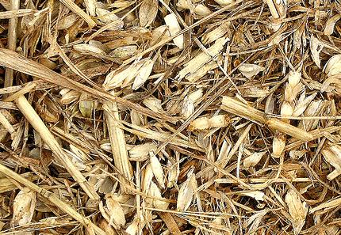
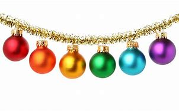

= eco 2020-06-20
:toc:

---

== Fashion victims 词汇解说

(eco 2020-6-20 / Business / Luxury in the pandemic: Fashion victims)

How slow times [in the luxury world] *will separate* the bling 奢华高档的首饰或服装 *from* the chaff 谷壳；糠

Posh 上流社会的；上等人的;优雅豪华的；富丽堂皇的 purveyors 提供者；供应商；供应公司 *are having to rethink* their business model [in a hurry]

Jun 20th 2020 | PARIS

- chaff : /tʃɑːf/ => 来自PIE*gep, 咬，咀嚼，词源同jaw, jowl. +

- purveyor : /pərˈveɪər/ ( formal ) a person or company that supplies sth 提供者；供应商；供应公司

- 时尚的受害者 +
奢侈品世界, 将以多慢的速度, 将奢华与糟粕区分开来 +
时髦的供应商们, 不得不赶紧重新思考他们的商业模式

MILAN  米兰（意大利北部城市）, PARIS or New York [this time of year] *would usually be teeming(v.)充满，遍布，到处都是（移动着的人、动物等） with* fashionistas 时装设计师；穿着入时的人(复数) *scrambling to get from* `the Balenciaga 巴黎世家(品牌) show` *to* `the Chanel party`. Not in 2020. Fashion weeks *have been cancelled*, *repurposed*(v.)（为适合新用途）对…稍加修改，略微改动 *as* posh catwalk （时装表演时供模特儿用的）狭长表演台，T形台 webinars 网络研讨会；在线会议. `主` Shops *selling* Hermès ties and Prada pumps 轻软舞鞋；轻便帆布鞋 `谓` *are only just reopening*, *wondering* what to do with `stock （商店的）现货，存货，库存 of pre-covid-19 vintage`  特定年份（或地方）酿制的酒；酿造年份. `主` Instagram influencers 有影响力的人 normally on hand `*to feed* 喂养；饲养; 满足（需要、愿望、欲望等） the hype` （电视、广播等中言过其实的）促销广告，促销讨论 `谓` *have nothing to snap* 拍照；摄影.

- teem : [ V ] ( of rain 雨 ) to fall heavily 倾注；倾泻 +
=> 来自古英语 teman,生育，繁殖，来自 Proto-Germanic*taumjan,拉，引导，来自 PIE*deuk,拉， 引导，词源同 team,duct.引申词义充满，大量。

- *TEEM WITH STH* : ( usu be *teeming with sth* ) to be full of people, animals, etc. moving around 充满，遍布，到处都是（移动着的人、动物等）

- fashionista : /ˌfæʃnˈiːstə/ n. ( used especially in newspapers 尤用于报章 ) a fashion designer , or a person who is always dressed in a fashionable way 时装设计师；穿着入时的人

- repurpose : v. /ˌriːˈpɜːpəs/ [ VN ] to change sth slightly in order to make it suitable for a new purpose （为适合新用途）对…稍加修改，略微改动

- webinar : /ˈwebɪnɑːr/ N an interactive seminar conducted over the World Wide Web 网络研讨会  +
=> 缩合词：web + seminar.  seminar 研讨会；培训会 => 来自 semen,种子，-arium, 表地方。

- pump : ( BrE ) a light soft shoe that you wear for dancing or exercise 轻软舞鞋；轻便帆布鞋 / 抽水机；泵；打气筒  +
-> ballet pumps 芭蕾舞鞋 +
image:../../+ img_单词图片/p/pump.jpg[100,100]

- vintage : /ˈvɪntɪdʒ/ the wine that was produced in a particular year or place; the year in which it was produced 特定年份（或地方）酿制的酒；酿造年份 / [ usually sing. ] the period or season of gathering grapes for making wine 采摘葡萄酿酒的期间（或季节）；葡萄收获期（或季节） +
=> 来自拉丁语 vindemia,葡萄收割，葡萄生产，vin-,葡萄，de-,向下，取下，-em,拿，带，词源 同 example.引申词义特定年份收割的葡萄，上等葡萄酒，佳酿，引申词义经典的，典型的。 +
-> *the 1999 vintage*. 1999年酿制的葡萄酒

- 每年的这个时候，米兰、巴黎或纽约, 通常都挤满了从巴黎世家(Balenciaga)时装秀, 赶赴香奈儿(Chanel)派对的时尚达人。但在2020年却不是这样了。时装周已被取消，改成了时髦的t台网络研讨会。爱马仕(Hermes)领带, 和普拉达(Prada)高跟鞋店, 刚刚重新开张，不知道如何处理covid-19爆发前的库存。Instagram上的有影响力的人士, 通常用来为奢侈品的广告炒作提供支持, 现在却没什么可拍照的。

The world of personal luxury goods -- *from* handbags and `haute 时髦的；高级的 couture`(n.)时装设计制作；时装 *to* `diamond rings` and `pricey Swiss watches` -- *has been* in hibernation 冬眠,蛰伏. [At the height of the pandemic between March and May] sales *slumped （价格、价值、数量等）骤降，猛跌，锐减 by 75% or so* on a year earlier, *according to* the Boston Consulting Group. They *have slowly picked up* （贸易或经济）好转，改善 as Asia, then Europe and America, *started reopening*. Even so, the outlook for the luxury world *is far from glittering* 辉煌的；成功的;灿烂夺目的；闪闪发光的.

- couture : /kuˈtʊr/ n. [ U ] ( from French ) the design and production of expensive and fashionable clothes; these clothes 时装设计制作；时装 +
=>  来自拉丁词consuere, 缝制，来自su-, 缝，词源同sew, suture. -t, 过去分词后缀。 +
-> *a couture(n.) evening dress* 昂贵时髦的晚礼服 +
image:../../+ img_单词图片/c/couture.jpg[100,100]

- hibernate => 来自hiems,冬天，雪，词源同hiemal,Himalaya.引申词义冬眠，蛰伏。

- 个人奢侈品的世界——从手提包、高级时装到钻石戒指和昂贵的瑞士手表——已经进入了冬眠期。根据波士顿咨询集团的数据，在疫情最严重的三月到五月间，销售量比一年前下降了75%左右。随着亚洲，然后是欧洲和美国开始重新开放，它们已经慢慢复苏。即便如此，奢侈品行业的前景也远非光明。

The global recession 经济衰退；经济萎缩 *hangs over* a sector (*fuelled 给…提供燃料 by* consumer confidence). Beyond that `short-term shock`, the industry *is facing* an overhaul 彻底检修；全面改革（制度、方法等） *in* `how its baubles 低廉花哨的首饰 *are made*`, where they *are sold* and *to whom*. `主` Trends (*once expected(v.) to play out* （使）（戏剧性的事件）逐渐发生；（使）展开 over a decade) `谓` *may unfold* （使）展开；打开;（使）逐渐展现；展示；透露 in mere quarters. Rapid change *has set(v.) nerves jangling*(v.)刺激，烦扰（神经）；（使）烦躁不安 in a business (*meant to exude*(v.)流露，显露（感觉或品质）；（感觉或品质）显现 timeless tradition).

- bauble :  /ˈbɔːbl/ 低廉花哨的首饰; /圣诞树装饰球 +

- jangle : /ˈdʒæŋɡl/ v.（使）发出金属撞击声，发出丁零当啷的刺耳声 / if your nerves jangle , or if sb/sth jangles them, you feel anxious or upset 刺激，烦扰（神经）；（使）烦躁不安

- exude : /ɪɡˈzuːd/ v. if you exude a particular feeling or quality, or it exudes from you, people can easily see that you have it 流露，显露（感觉或品质）；（感觉或品质）显现 / 流出，渗出（液体）；散发出（气味）；（从某处）渗出，散发出来 +
-> She *exuded(v.) confidence*. 她显得信心十足。

- 全球衰退笼罩着一个由消费者信心推动的行业。除了短期的冲击之外，该行业还面临着一场彻底的改革，包括其产品的制造方式、销售地点和买家。一度被认为会持续10年的趋势, 可能会在短短几个季度内就显现出来。在这个本应彰显永恒传统的行业，快速的变化让人神经紧张。

*Start with* `who is buying(v.) and where`. Although most purveyors of luxury *are* European (with `America home` to `some of the lesser marques` 知名品牌), most of their customers *come from Asia*. Asians *bought* more than half of the €281bn ($315bn) `in bling(n.)奢华高档的首饰或服装 sold` [last year]. Chinese buyers alone *have gone from* 1% of purchases in 2000 *to 35%* last year, *according to* Bain, another consultancy. But most of that -- perhaps 70% -- *was purchased overseas*, often on jaunts （短途）游览，旅行 to Europe. Just over `a tenth` of all luxury sales *were actually booked* in mainland China.

- jaunt : /dʒɔːnt/ n.  （短途）游览，旅行 +
=> 词源不详，可能同jump,跳。引申词义颠簸，痛苦的行程，这也是该词原先的词义，后来用于指短途旅行，游览，欢快的行程。字母m,n音变，比较home,haunt,lamp,lantern.

- 先从"谁在哪里购买"开始。尽管大多数奢侈品供应商都是欧洲人(美国是一些较小品牌的大本营)，但他们的大多数客户都来自亚洲。去年售出的2810亿欧元(合3150亿美元)珠宝中，亚洲人购买了一半以上。另一家咨询公司贝恩(Bain)的数据显示，仅中国买家就从2000年时的占总购买量的1%, 上升到去年的35%。但其中大部分(大约70%)是在海外购买的(而非在中国本土购买的)，通常是在去欧洲的短途旅行中购买的。在所有奢侈品销售中，只有略高于十分之一的销售是在中国大陆完成的。

Unless `intercontinental 洲际的；洲与洲之间的 tourism` 旅游业；观光业 *rebounds(v.)回升；反弹 faster than expected*, new ways *will have to be found* to get Euro-chic 时髦的；优雅的；雅致的 into Chinese hands. Firms *hope that* `shopping sprees`(n.)（常指过分）玩乐，作乐；纵乐;一阵，一通（犯罪活动） *will simply move* from Paris to Shanghai. In the short run 态势；状况；趋势；动向, this *might boost margins* 利润；利润幅度；毛利: `主` the likes of `Louis Vuitton` (part of LVMH, the biggest luxury group) and Gucci (part of Kering, another French giant) `谓` *charge* 收（费）；（向…）要价 a third more in China *than* in Europe *for* the same products. `主` *Closing* `a few flagship stores` in high-rent tourism hotspots *such as* Paris or Milan, which usually *sell* half their stock *to* tourists, `谓` *could save firms money* in property costs.

- spree : /spriː/ n. a short period of time that you spend doing one particular activity that you enjoy, but often too much of it （常指过分）玩乐，作乐；纵乐 / ( used especially in newspapers 尤用于报章 ) a period of activity, especially criminal activity 一阵，一通（犯罪活动） +
=> 俚语，可能来自法语 espirt,精神，生机勃勃，词源同 spirit.引申词义玩乐，狂欢。 +
.. *a shopping/spending spree* 狂购一气；痛痛快快花一通钱
.. to go on *a killing spree* 一阵杀戮

- 除非, 洲际旅游业的反弹速度快于预期，否则就必须找到新的方法，让中国人掌握欧洲时尚。公司希望购物狂潮能从巴黎转移到上海。从短期来看，这可能会提高利润率:像路易威登(路易威登是世界上最大的奢侈品集团路易威登的一部分)和古驰(古驰是另一家法国巨头开云集团的一部分)这样的品牌，同样的产品在中国的售价比在欧洲高出三分之一。在巴黎或米兰等高租金旅游热点地区，关闭几家旗舰店可以为企业节省房地产成本。这些地方通常会将一半的存货卖给游客。

Yet `主` any boost to margins `系` *may be* short-lived 短暂的. The difference between European and Chinese prices *has narrowed*. Those (in China) *have been declining* 因为 as ① `apps *make* international price comparisons *easier*` and ② `主` firms *woo*(v.)争取…的支持；寻求…的赞同;(男子)追求（异性）；求爱 shoppers 购物者 (*facing ever more restrictions* from Chinese authorities *on* `bringing luxury items home from abroad`). And `主` more shops on the mainland, in cities (they *would once have deemed* 认为；视为；相信 déclassé 失去社会地位或身份的), `谓` *may diminish* 减少；（使）减弱，缩减；降低;贬低；贬损；轻视 the aura 气氛；氛围；气质 of exclusivity 排他性；专有权；独特性 (that `主` *shopping*(v.) on `Avenue （城镇的）大街;林荫道（尤指通往大住宅者） Montaigne in Paris` or `New York’s Fifth Avenue` `谓` *confers* 授予（奖项、学位、荣誉或权利）). The de facto 实际上存在的（不一定合法） discounts *were aimed at* luring(v.) buyers *to* the West [precisely for that reason].

- aura :  /ˈɔːrə/  n. *~ (of sth)* a feeling or particular quality that is very noticeable and seems to surround a person or place 气氛；氛围；气质 +
=> 同air. 来自通灵术语，指人身上所流露出来的一种微妙的东西，类似我们所说的气场。 +
->  She always *has an aura of confidence*. 她总是满有信心的样子。

- *de facto*  : adj.   /ˌdeɪ ˈfæktəʊ/ [ usually before noun ] ( from Latin formal ) existing as a fact although it may not be legally accepted as existing 实际上存在的（不一定合法） +
-> The general *took de facto control of the country*. 这位将军实际上控制了整个国家。

- 然而，任何对利润率的提振都可能是短暂的。由于app能使国际间的比价变得更容易，再加上这些奢侈品厂商对中国消费者的追求 -- 这些消费者面临着中国政府对从国外代购奢侈品越来越多的限制 -- 因此中国的奢侈品价格一直在下降。
欧洲和中国之间的价格差距已经缩小。由于app使国际间的比价, 变得更容易，而且由于中国政府对从国外购买奢侈品的限制越来越多，中国的奢侈品价格一直在下降。此外，在中国大陆那些曾经被他们视为“低端城市”的城市里开越来越多的奢侈品店, 可能会削弱在巴黎蒙田大道(Avenue Montaigne)或纽约第五大道(Fifth Avenue)购物所带来的奢华气息。正是出于这个原因, 实际上的的折扣就是旨在吸引买家到西方来购物。

The pandemic *has accelerated* other trends. `主` Online sales of luxury goods, at 7-8% of the total [on average], `系` *are* around half those of `mass-market 面向大众的；适销对路的 fashion retailers` like H&M and Zara. The closure of shops *has, predictably, eased* 减轻；缓解 some of `the reservations 保留意见 (brands *may have*)` (about `*selling* their wares *on the internet*`). LVMH *has said* `主` online purchases `系` *are “significantly higher”* as `a share of sales` *than* pre-pandemic. `主` Sales(n.) through `department stores` 百货公司 -- which *are in terrible financial shape*, notably in America -- `谓` *are also likely to shrink* （使）缩水，收缩，缩小，皱缩.

- 疫情加速了其他趋势。奢侈品的在线销售额, 平均占总销售额的7-8%，大约是H&M和Zara等大众市场时尚零售商的一半。不出所料，实体商店的关闭, 缓解了品牌们对"在互联网上销售商品"的一些保留意见。路威酩轩表示，与疫情前相比，网上购物在销售额中所占的比例“显著提高”。百货商店的销售额--它们的财务状况很糟糕，尤其是在美国--也有可能会萎缩。

Meanwhile, costs *may rise*. Though they *love to show off* 卖弄，炫耀 `in-house （公司或机构）内部存在的，内部进行的 “artisans”` 工匠；手艺人 `*stitching* 缝；缝补 handbags` and the like, even `the poshest 上流社会的；上等人的;优雅豪华的；富丽堂皇的(最高级) maisons` 公司；（法）商店；房屋；家庭 *quietly outsource*(v.)把…外包;交外办理 some of their production. Many *rely on* outsiders *for* more than half their products. These suppliers *are* often `small family firms` in Italy, which *went into* the pandemic *with* `slim 苗条的；纤细的;微薄的；不足的；少的 margins` and `slimmer financial buffers` 缓冲物. Luxury groups *are now having to assist  帮助；协助；援助 them financially* in a hurry *lest* 免得；以免 they *disappear [for good 永久地]*.

- 与此同时，成本可能会上升。尽管他们喜欢炫耀内部的“工匠”缝制手提包之类的东西，但即使是最上层的设计师也悄悄地外包了一些生产。许多公司一半以上的产品, 依赖于外人。这些供应商通常是意大利的小型家族企业，在疫情期间, 这些小的家族企业的利润微薄，财务缓冲也更少。奢侈品集团现在不得不匆忙在财务上帮助他们，以免他们永远消失。

All this *paints* 在…上刷油漆;给人以…印象；把…描绘成 `a drab 单调乏味的；无光彩的；无生气的 financial picture`. Sales *are forecast*(v.)预测；预报(过去分词同形) *to fall(v.) by a third* in 2020, and *recover* only by 2022 at the earliest. That *will crimp* 妨碍（或阻止）…的发展;烫发；使（头发）拳曲；使（头发）成波形 margins, since luxury firms’ costs(n.) *are largely fixed*. `Rents *must still be paid*` and `brands *advertised*` （为…）做广告；登广告 -- the poshest ones *spend* the best part of $1bn a year [on marketing] -- even as `sales *droop*`.

- drab : /dræb/  =>  来自drape, 布匹，未浸染着色过的布匹。引申词义单调的。

-  forecast : 过去式 forecast或forecasted; 过去分词 forecast或forecasted

-  crimp : /krɪmp/ v.n. 烫发；使（头发）拳曲；使（头发）成波形; / 把（织物或纸）压出皱纹；使起皱; / ( NAmE informal ) to restrict the growth or development of sth 妨碍（或阻止）…的发展  +
=> 词源同crisp, crinkle. +

- 所有这些都描绘了一幅单调乏味的财务景象。2020年的销量, 预计将下降三分之一，最早也要到2022年才能恢复。这会抑制利润，因为奢侈品公司的成本基本上是固定的。即使在销售额下降的情况下，租金也仍然要支付，品牌也依然要做广告——在营销上, 最高档的品牌每年要花费10亿美元。

In many industries, `主` `squished 发出嘎吱声；压坏，压扁 margins` and `falling sales` `谓` *might lead to* a slew 大量；许多 of takeovers 收购；接收；接管. Few *expect* that to happen in luxury. Most of the big players *have* healthy balance-sheets 资产负债表 and *are expected to find ways* to return to profitability 盈利能力 (see chart 2). Many smaller marques 知名品牌（尤指汽车） *are controlled by founders* or their families, who *are loth*(a.)不情愿；不乐意；勉强 *to sell* in a downturn （商业经济的）衰退，下降，衰退期. If anything 如果有什么不同的话, 如果有什么区别的话, consolidation 巩固; 变坚固;合并 *might slow*; *all eyes are on* whether LVMH *will complete* its $17bn takeover of Tiffany, an American jeweller, *agreed* [weeks before covid-19 struck].

- slew : /sluː/ [ sing. ] ~ of sth ( informal ) ( especially NAmE ) a large number or amount of sth 大量；许多 +
=> 来自爱尔兰语 sluagh,军队，队伍，词源同 slogan.引申词义许多，大量。

- loath 等于loth : /loʊθ/ ( loth ) ~ to do sth ( formal ) not willing to do sth 不情愿；不乐意；勉强 +
=> 词源同lead,lode.并引申词义离别，伤心，最后到厌恶，讨厌。

- 在许多行业，利润缩水和销售额下降, 可能会导致大量收购。很少有人认为奢侈品行业会出现这种情况。大多数的大公司都拥有健康的资产负债表，并有望找到恢复盈利的方法(见表2)。许多小型品牌由创始人或家族控制，他们不愿在低迷时期出售。如果说有什么不同的话，那就是整合可能会放缓；所有人的目光都集中在LVMH是否会完成其对美国珠宝商蒂芙尼的170亿美元的收购，这笔交易是在新冠肺炎爆发前几周达成的。

Not all parts of the industry *are equally vulnerable*. In a crisis, buyers *stick to* more established brands. “They *want* the best of the best,” *says* Luca Solca of Bernstein, a broker 经纪人；掮客. *Good news*, then, *for* the likes of Louis Vuitton and Chanel, which *have [in fact] pushed up prices* in recent months. In contrast, `主` brands *hoping for a turnaround* 好转；起色；转机 in their fortunes -- Burberry *is* a perennial 长久的；持续的；反复出现的 candidate -- `系` *are less able to gain* the attention 兴趣；关注 (a relaunch 重新推出；重新发布 *might otherwise garner*(v.) 获得，得到，收集（信息、支持等）).

- garner : /ˈɡɑːrnər/ v. [ VN ] ( formal ) to obtain or collect sth such as information, support, etc. 获得，得到，收集（信息、支持等） +
=> 来自granary的拼写变体，词源同grain, 原指谷仓。后用做动词，指收集。

- 并非所有行业都同样脆弱。在危机中，买家会选择更成熟的品牌。伯恩斯坦的经纪人卢卡•索尔卡说:“他们想要最好中的最好。”那么，对于路易威登(Louis Vuitton)和香奈儿(Chanel)等品牌来说，这是个好消息。事实上，近几个月来，它们推高了奢侈品的价格。相比之下，希望扭亏为盈的品牌-巴宝莉(Burberry)会长期处在一个候选者阵营中 -- 它更难获得"重新发布可能会获得的关注"。

Some segments 部分；份；片；段;（柑橘、柠檬等的）瓣 *have also been hit harder* than others. Perfumes and cosmetics 化妆品；美容品 *have held up 维持;保持良好 best*: a lockdown *is* no reason `*to forgo*(v.)放弃，弃绝（想做的事或想得之物） a skincare(n.)（用化妆品）护肤，皮肤护理 regime`, apparently 据…所知；看来；显然. Fashion houses （从事某种生意的）公司，机构 *face bigger problems*, 因为 as `cooped-up 被禁锢的 fashionistas` 时装设计师；穿着入时的人 *see* less need `*to replenish* 补充；重新装满 their wardrobes`. Worse, unlike jewellery or handbags, surplus 过剩的；剩余的；多余的 stock of apparel  （商店出售的）衣服，服装 *is rapidly going out of style*. `Overt 公开的；明显的；不隐瞒的 discounts` *are frowned 皱眉；蹙额 upon* 不赞成；不同意；不许可 in luxury *for fear of* `cheapening(v.)使丧失威信；使贬低;使贬值 precious brands`. Most (at risk) *are* `fancy watchmakers` like Richemont, which *attract* sellers [at `fairs` （评比农畜产品的）集市 and `trade shows` 商品展销会；商品交易会] that *have now been cancelled*.

- forgo : /fɔːrˈɡoʊ/ => for-, 完全的。go, 走，离开。引申词义放弃，弃绝。

- overt : /oʊˈvɜːrt,ˈoʊvɜːrt/ => 它的反义词covert（隐蔽的，暗地里的）则源自另一古法语动词covrir（遮盖）的过去分词covert。

- *frown on/upon sb/sth* : to disapprove of sb/sth 不赞成；不同意；不许可

- 一些行业受到的冲击, 也比其他行业更大。香水和化妆品表现最好:显然，禁闭并不是放弃护肤品的理由。时装公司面临着更大的问题，因为被禁足的爱打扮的时尚人士认为, 不太需要补充他们的衣柜。更糟糕的是，与珠宝或手袋不同，积压的服装库存, 正使这些衣服在迅速过时。在奢侈品行业，公开的折扣是不受欢迎的，因为他们担心这会使珍贵的品牌贬值。面临风险最大的是历峰(Richemont)等高档钟表制造商，它们在交易会和贸易展上吸引卖家，而这些展会和交易会现在已经被取消。

The question *is* whether { [*amid* this shake-up(n.)（机构的）重大调整，重组] `主` the luxury world `谓` *can keep its grip on* the wallets 钱包 of `the world’s big spenders` 花钱…的人}. `主` Fears(n.) that consumers *would opt(v.)选择；挑选 for* `a more ascetic 过清苦生活的；（尤指）苦行的；禁欲的 post-pandemic future` `谓` *are dissipating* （使）消散，消失；驱散: `主` reports of “revenge 报复；报仇 shopping” [as China *emerged from lockdown*] `谓` *implies that* {rich folks’ appetite for `status 地位；身份；职位 symbols` *remains intact*(a.) 完好无损；完整}. But these worries *are being replaced by* those over Chinese shoppers (*developing* a taste *for* `nascent 新生的；萌芽的；未成熟的 local brands`), *at the expense(费用；价钱)在牺牲（或损害）…的情况下 of* the old-world stalwarts （政党等组织的）忠诚拥护者，坚定分子.

- ascetic : /əˈsetɪk/ 来自希腊语askeo, 修行，特指宗教人士的苦修。可能来自askos, 同skin, 借指放弃一切舒适的裸体隐修，包括衣服，以达到一种灵魂的超越。如印度耆那教天衣派。

- *AT THE EXPENSE OF SB/STH* : with loss or damage to sb/sth 在牺牲（或损害）…的情况下 +
-> He built up the business *at the expense of his health*. 他以自己的健康为代价, 逐步建立起这个企业。

- stalwart : /ˈstɔːlwərt/ => 拼写变体形式自 stalworth,坚定的，坚决的，等同于 stall,固定位置，地方，worth,价值。

- 问题是，在这场变革中，对于全球那些出手阔气的人的钱包, 奢侈品行业能否牢牢抓住。疫情后的消费者会选择一个更禁欲的未来, 这种担忧正在减退. 因为根据相关报道, 随着中国从封锁中恢复, “报复性购物”的现象, 暗示着富人们对于能体现社会地位的奢侈品的需求, 没有改变。这是, 虽然这一担忧被缓解了, 却又有另一种担忧存在, 即, 中国消费者正在发展出对本土新兴品牌的兴趣. 这会减少对旧世界(国外)奢侈品的需求.

The biggest potential changes *may concern* 影响，涉及，牵涉（某人） the designers themselves. [By late June] the most exalted  地位高的；高贵的；显赫的 *would normally start* displaying(v.) `autumn and winter collections` （常为季节性推出的）系列时装（或家用品） in shop windows. This year they *will make up (加班加点)补足(时间) for lost time* by *selling* their summer season （一年中时装、发型等的）流行期 through the summer, as *might seem sensible anyway*. Giorgio Armani, an Italian veteran, *has argued* this *should become* the new norm. What a bold fashion statement *that would be*.

-  make up : v.  (加班加点)补足(时间) If you *make up* time or hours, you work some extra hours because you have previously taken some time off work. +
-> *They'll have to make up time* lost during the strike.
他们不得不加班弥补罢工耽误的时间。

- 最大的潜在变化, 可能与设计师本身有关。6月底，最高端的设计师通常会开始在商店橱窗里展示秋冬系列。今年，他们将通过将夏季销售延续到整个夏季结束, 来弥补失去的时间，无论如何这似乎都是明智的。意大利的业内老手乔治•阿玛尼(Giorgio Armani)认为，这应该成为一种新规范。这将是多么大胆的时尚宣言啊。

---

== Fashion victims

How slow times in the luxury world will separate the bling from the chaff

Posh purveyors are having to rethink their business model in a hurry

Jun 20th 2020 | PARIS

MILAN, PARIS or New York this time of year would usually be teeming with fashionistas scrambling to get from the Balenciaga show to the Chanel party. Not in 2020. Fashion weeks have been cancelled, repurposed as posh catwalk webinars. Shops selling Hermès ties and Prada pumps are only just reopening, wondering what to do with stock of pre-covid-19 vintage. Instagram influencers normally on hand to feed the hype have nothing to snap.

The world of personal luxury goods—from handbags and haute couture to diamond rings and pricey Swiss watches—has been in hibernation. At the height of the pandemic between March and May sales slumped by 75% or so on a year earlier, according to the Boston Consulting Group. They have slowly picked up as Asia, then Europe and America, started reopening. Even so, the outlook for the luxury world is far from glittering.

The global recession hangs over a sector fuelled by consumer confidence. Beyond that short-term shock, the industry is facing an overhaul in how its baubles are made, where they are sold and to whom. Trends once expected to play out over a decade may unfold in mere quarters. Rapid change has set nerves jangling in a business meant to exude timeless tradition.

Start with who is buying and where. Although most purveyors of luxury are European (with America home to some of the lesser marques), most of their customers come from Asia. Asians bought more than half of the €281bn ($315bn) in bling sold last year. Chinese buyers alone have gone from 1% of purchases in 2000 to 35% last year, according to Bain, another consultancy. But most of that—perhaps 70%—was purchased overseas, often on jaunts to Europe. Just over a tenth of all luxury sales were actually booked in mainland China.

Unless intercontinental tourism rebounds faster than expected, new ways will have to be found to get Euro-chic into Chinese hands. Firms hope that shopping sprees will simply move from Paris to Shanghai. In the short run, this might boost margins: the likes of Louis Vuitton (part of LVMH, the biggest luxury group) and Gucci (part of Kering, another French giant) charge a third more in China than in Europe for the same products. Closing a few flagship stores in high-rent tourism hotspots such as Paris or Milan, which usually sell half their stock to tourists, could save firms money in property costs.

Yet any boost to margins may be short-lived. The difference between European and Chinese prices has narrowed. Those in China have been declining as apps make international price comparisons easier and firms woo shoppers facing ever more restrictions from Chinese authorities on bringing luxury items home from abroad. And more shops on the mainland, in cities they would once have deemed déclassé, may diminish the aura of exclusivity that shopping on Avenue Montaigne in Paris or New York’s Fifth Avenue confers. The de facto discounts were aimed at luring buyers to the West precisely for that reason.

The pandemic has accelerated other trends. Online sales of luxury goods, at 7-8% of the total on average, are around half those of mass-market fashion retailers like H&M and Zara. The closure of shops has, predictably, eased some of the reservations brands may have about selling their wares on the internet. LVMH has said online purchases are “significantly higher” as a share of sales than pre-pandemic. Sales through department stores—which are in terrible financial shape, notably in America—are also likely to shrink.

Meanwhile, costs may rise. Though they love to show off in-house “artisans” stitching handbags and the like, even the poshest maisons quietly outsource some of their production. Many rely on outsiders for more than half their products. These suppliers are often small family firms in Italy, which went into the pandemic with slim margins and slimmer financial buffers. Luxury groups are now having to assist them financially in a hurry lest they disappear for good.

All this paints a drab financial picture. Sales are forecast to fall by a third in 2020, and recover only by 2022 at the earliest. That will crimp margins, since luxury firms’ costs are largely fixed. Rents must still be paid and brands advertised—the poshest ones spend the best part of $1bn a year on marketing—even as sales droop.

In many industries, squished margins and falling sales might lead to a slew of takeovers. Few expect that to happen in luxury. Most of the big players have healthy balance-sheets and are expected to find ways to return to profitability (see chart 2). Many smaller marques are controlled by founders or their families, who are loth to sell in a downturn. If anything, consolidation might slow; all eyes are on whether LVMH will complete its $17bn takeover of Tiffany, an American jeweller, agreed weeks before covid-19 struck.

Not all parts of the industry are equally vulnerable. In a crisis, buyers stick to more established brands. “They want the best of the best,” says Luca Solca of Bernstein, a broker. Good news, then, for the likes of Louis Vuitton and Chanel, which have in fact pushed up prices in recent months. In contrast, brands hoping for a turnaround in their fortunes—Burberry is a perennial candidate—are less able to gain the attention a relaunch might otherwise garner.

Some segments have also been hit harder than others. Perfumes and cosmetics have held up best: a lockdown is no reason to forgo a skincare regime, apparently. Fashion houses face bigger problems, as cooped-up fashionistas see less need to replenish their wardrobes. Worse, unlike jewellery or handbags, surplus stock of apparel is rapidly going out of style. Overt discounts are frowned upon in luxury for fear of cheapening precious brands. Most at risk are fancy watchmakers like Richemont, which attract sellers at fairs and trade shows that have now been cancelled.

The question is whether amid this shake-up the luxury world can keep its grip on the wallets of the world’s big spenders. Fears that consumers would opt for a more ascetic post-pandemic future are dissipating: reports of “revenge shopping” as China emerged from lockdown implies that rich folks’ appetite for status symbols remains intact. But these worries are being replaced by those over Chinese shoppers developing a taste for nascent local brands, at the expense of the old-world stalwarts.

The biggest potential changes may concern the designers themselves. By late June the most exalted would normally start displaying autumn and winter collections in shop windows. This year they will make up for lost time by selling their summer season through the summer, as might seem sensible anyway. Giorgio Armani, an Italian veteran, has argued this should become the new norm. What a bold fashion statement that would be.

---

== Clarifying the battle lines 战线  词汇解说

(eco 2020-6-20 / Finance & economics / Poverty in China: Clarifying the battle lines)

China’s poverty 贫穷；贫困 line *is not as stingy 小气的；吝啬的 as* `commentators  （电台、电视台或报刊的）评论员 *think*`

*Nor is* China *as poor as* Li Keqiang *implies*

Jun 20th 2020 | HONG KONG

SINCE 2017 China’s government *has described* fighting poverty *as* one of `three “tough” or “critical” battles` (*alongside* quelling(v.)制止；平息；镇压 pollution and financial risk). Despite the covid-19 pandemic, it still *seems confident(a.) of* victory this year. [In March] Xi Jinping, the president, *pointed out that* the number of rural poor *fell to 5.51m* in 2019. That is only 0.4% of China’s vast population. Regional `overall poverty`, he said, *had been basically eradicated* 根除；消灭；杜绝.

- quell : /kwel/ v. to stop sth such as violent behaviour or protests 制止；平息；镇压 / to stop or reduce strong or unpleasant feelings 消除，缓解，减轻（强烈或不快的感情） +
=> 来自古英语cwellan,杀死，谋杀，执行死刑，来自PIE*gwele,扔，投掷，词源同ballistic,kill. 词义由扔，投掷引申为刺，杀。后引申词义制止，阻止。 +
-> *to quell your fears* 消除恐惧

The claim *seemed wildly at odds with* （与…）有差异，相矛盾 another statistic, *cited* last month by Li Keqiang, the prime minister. “There are still some 600m people [whose] monthly income is barely 1,000 yuan,” he said at the close of `the annual meeting of China’s parliament`. Since 1,000 yuan *is worth* only about $140, the figure *seemed* both surprising and depressing. Many commentators *concluded that* China’s victory against poverty *was* hollow 中空的;无诚意的；虚伪的, *achieved not by* lifting people up *but by* *watering*(v.) 加水冲淡（液体）；掺水稀释 the definition of poverty *down*.

- 许多评论家总结说，中国战胜贫困的胜利是空洞的，不是通过提升人们的地位，而是通过淡化贫困的定义。

- *BE AT ODDS (WITH STH)* : to be different from sth, when the two things should be the same （与…）有差异，相矛盾

- *BE AT ODDS (WITH SB) (OVER/ON STH)* : to disagree with sb about sth （就某事）（与某人）有分歧 +
-> He's always *at odds with his father over politics*. 他在政治上总是与他父亲的意见相左。

- *water sth down* : to make a liquid weaker by adding water 加水冲淡（液体）；掺水稀释 +
同义词 dilute +
[常用被动态] to change a speech, a piece of writing, etc. in order to make it less strong or offensive 缓和（说话、文章等的）语气；使变得轻描淡写

This scepticism 怀疑态度；怀疑主义, though, *is dogged*(v.)(问题或不幸)（长期）困扰，折磨，纠缠 by two misunderstandings 误解；误会. The first *is* the conviction 坚定的看法（或信念） that China’s rural-poverty line *must be* ridiculously 荒唐可笑地 stingy 小气的；吝啬的, *lower than* the global standard of $1.90 a day. The second is the belief, *inspired*  激励；鼓舞;赋予灵感；引起联想；启发思考 by Mr Li’s imprecise remarks, that 600m Chinese *live on* 1,000 yuan a month or less. Neither claim *is* true.

[About a decade ago] China *drew* its `rural poverty line` *at* 2,300 yuan a year, or 6.3 yuan a day. `主` The World Bank’s most commonly used(a.) `global poverty line` `系` *is* $1.90 a day. Since 6.3 yuan *is worth* only about $0.90 [at today’s `exchange rate`], *it seems natural 正常的；自然的；意料之中的 to think(v.) that* China’s poverty line *is much lower than* the World Bank’s.

Natural, but wrong. A fair comparison *must first note that* China and the World Bank *drew* their poverty lines *with* different years [*in mind* 记住，考虑到，想到；在心里]. China’s line *is based on* the prices *prevailing* 普遍存在；盛行；流行 in 2010; the World Bank’s, on prices in 2011. China *updates*(v.) its line every year *to reflect* the inflation *faced by* the rural poor. In 2011 the threshold 门槛；门口;阈；界；起始点 *was* 2,536 yuan, or 6.95 yuan a day.

- 会这么想很自然，但却是错误的。要进行公平的比较，首先必须注意到，中国和世界银行在制定贫困线时, 考虑的年份不同。中国的标准是基于2010年的现行价格；世界银行的标准是基于2011年的价格。中国每年都会更新其路线，以反映农村贫困人口面临的通胀。2011年的门槛是2536元，即每天6.95元。

That is still a meagre 少量且劣质的 amount. But because prices *tend to be lower* in rural China *than* in America, 6.95 yuan *stretches 足够买（或支付） further than* the equivalent amount of dollars *would* in America. So the yuan *should be converted into* dollars *not at* the market exchange rate, *but at* the purchasing-power-parity 购买力平价 rate. That was 3.04 yuan per dollar in 2011, according to Martin Ravallion of Georgetown University, who *helped* set(v.) the World Bank’s line. Thus China’s rural-poverty line *is equivalent to* about $2.30 a day in 2011 purchasing-power-parity dollars, comfortably above the $1.90 global line. Indeed, `主` the bank’s poverty *count* for China `系` *is lower than* the government’s.

- 这仍然是一个微不足道的数字。但由于中国农村的物价往往比美国低，6.95元人民币比美国的等值美元, 要能买更多的东西。因此，人民币不应该按照市场汇率兑换成美元，而应该按照"购买力平价"兑换。乔治城大学(Georgetown University)的马丁·拉瓦利安(Martin Ravallion)说，2011年, 1美元兑3.04元人民币，他帮助设定了世界银行的标准。因此，按2011年"购买力平价"美元计算，中国的农村贫困线, 相当于每天2.30美元，远远高于1.90美元的全球标准。事实上，世行对中国的贫困统计, 比政府的要低。

What about the second misunderstanding? After the furore(n.)群情激愤；骚动；轰动 *caused by* Mr Li’s comments, China’s `National Bureau of Statistics` *tried to sort out 解决(问题);理清(细节) the confusion* this week. *It pointed out that* the 610m people living in the bottom 40% of China’s households *had a monthly income* per person of almost 1,000 yuan. In other words, if their `combined income` *were divided equally* between them, they *would each receive* roughly 1,000 yuan (ie, 3,000 yuan for a typical household of three). That is the basis 基础；要素；基点;原因；缘由 for Mr Li’s statement. But *it is different from saying that* all of these 610m *live on 1,000 yuan or less*. *Imagine* a country of ten people, where the bottom four *earn* $1, $2, $3 and $4 a day, respectively. Their income per person *is* $2.50. But only two of them *live on less than this amount*. China’s leaders *often quote* official statistics *that flatter(v.)使显得更漂亮；使胜过本人; 奉承；讨好；向…谄媚 the economy*. But on this occasion, Mr Li’s comments *unflattered* 不加掩饰 to deceive(v.)欺骗；蒙骗；诓骗.

- furore :  /ˈfjʊrɔːr/ n. ( especially in NAmE furor   /ˈfjʊərɔː(r)/   ) *~ (about/over sth)* great anger or excitement shown by a number of people, usually caused by a public event 群情激愤；骚动；轰动 +
-> *the recent furore(n.) over the tax* increases(v.) 近来因增税引起的骚动

- 那第二个误会呢？在李总理的言论引起轩然大波后，中国国家统计局本周试图解释清混乱局面。它指出，生活在中国最底层40%的家庭中的6.1亿人, 其人均月收入接近1000元。换句话说，如果他们的总收入平均分配给他们，他们每人将获得大约1000元(即, 一个典型的三口之家的收入是3000元)。这就是李先生声明的基础。但这与说这6.1亿人全部靠1000元或更少的钱生活, 是不同的。想象一下，一个有十个人的国家，最底层的四个人每天分别挣1美元、2美元、3美元和4美元。他们的人均收入是2.50美元。但其中只有两个人的生活费, 低于这个数字。中国领导人经常引用官方数据来吹捧经济。但这一次，李先生的言论毫不掩饰地具有欺骗性。

---

== Clarifying the battle lines

China’s poverty line is not as stingy as commentators think

Nor is China as poor as Li Keqiang implies

Jun 20th 2020 | HONG KONG

SINCE 2017 China’s government has described fighting poverty as one of three “tough” or “critical” battles (alongside quelling pollution and financial risk). Despite the covid-19 pandemic, it still seems confident of victory this year. In March Xi Jinping, the president, pointed out that the number of rural poor fell to 5.51m in 2019. That is only 0.4% of China’s vast population. Regional overall poverty, he said, had been basically eradicated.

The claim seemed wildly at odds with another statistic, cited last month by Li Keqiang, the prime minister. “There are still some 600m people [whose] monthly income is barely 1,000 yuan,” he said at the close of the annual meeting of China’s parliament. Since 1,000 yuan is worth only about $140, the figure seemed both surprising and depressing. Many commentators concluded that China’s victory against poverty was hollow, achieved not by lifting people up but by watering the definition of poverty down.

This scepticism, though, is dogged by two misunderstandings. The first is the conviction that China’s rural-poverty line must be ridiculously stingy, lower than the global standard of $1.90 a day. The second is the belief, inspired by Mr Li’s imprecise remarks, that 600m Chinese live on 1,000 yuan a month or less. Neither claim is true.

About a decade ago China drew its rural poverty line at 2,300 yuan a year, or 6.3 yuan a day. The World Bank’s most commonly used global poverty line is $1.90 a day. Since 6.3 yuan is worth only about $0.90 at today’s exchange rate, it seems natural to think that China’s poverty line is much lower than the World Bank’s.

Natural, but wrong. A fair comparison must first note that China and the World Bank drew their poverty lines with different years in mind. China’s line is based on the prices prevailing in 2010; the World Bank’s, on prices in 2011. China updates its line every year to reflect the inflation faced by the rural poor. In 2011 the threshold was 2,536 yuan, or 6.95 yuan a day.

That is still a meagre amount. But because prices tend to be lower in rural China than in America, 6.95 yuan stretches further than the equivalent amount of dollars would in America. So the yuan should be converted into dollars not at the market exchange rate, but at the purchasing-power-parity rate. That was 3.04 yuan per dollar in 2011, according to Martin Ravallion of Georgetown University, who helped set the World Bank’s line. Thus China’s rural-poverty line is equivalent to about $2.30 a day in 2011 purchasing-power-parity dollars, comfortably above the $1.90 global line. Indeed, the bank’s poverty count for China is lower than the government’s.

What about the second misunderstanding? After the furore caused by Mr Li’s comments, China’s National Bureau of Statistics tried to sort out the confusion this week. It pointed out that the 610m people living in the bottom 40% of China’s households had a monthly income per person of almost 1,000 yuan. In other words, if their combined income were divided equally between them, they would each receive roughly 1,000 yuan (ie, 3,000 yuan for a typical household of three). That is the basis for Mr Li’s statement. But it is different from saying that all of these 610m live on 1,000 yuan or less. Imagine a country of ten people, where the bottom four earn $1, $2, $3 and $4 a day, respectively. Their income per person is $2.50. But only two of them live on less than this amount. China’s leaders often quote official statistics that flatter the economy. But on this occasion, Mr Li’s comments unflattered to deceive.

