= 2025.03 Elon Musk Crashes (v.) Cabinet Meeting & Trump Touts $5M _Gold Card_ for VIP Immigrants
:toc: left
:toclevels: 3
:sectnums:
:stylesheet: ../../../myAdocCss.css

'''

== 释义

Today was a big day 重要日子 for Donald Trump. He had a meeting with every member of his cabinet 内阁成员, and he even invited the president 院长，主席. By the way, thanks for dressing up 盛装出席,乔装、变装、化装, Elon. #Don't let us *keep you from*# 妨碍,防止，避免,阻止你前进 a blackjack tournament (. 锦标赛，联赛) 二十一点锦标赛 in 2006. But yes, Elon did have a seat at the table 席位. Well, not an actual seat 实际的座位 - *he was more looming (v.)（突然地）出现；赫然耸现；逼近（尤用于不好或吓人的事物） over 阴森笼罩 it* like _an Ed Hardy Sith Lord_ 埃德·哈迪风格西斯尊主. And some reporters wondered (v.) if that *created (v.) tension 制造紧张 with* the actual cabinet members 一些记者想知道,这是否造成了与实际内阁成员之间的紧张关系, *given that* 考虑到，鉴于 he keeps trying to fire (v.)解雇，开除 all of their staff 鉴于他一直想解雇他们所有的员工.

[.my1]
.title
====
.blackjack tournament
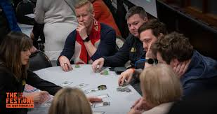

21点，又名黑杰克（Blackjack） ，起源于法国。该游戏由2到6个人玩，使用除大小王之外的52张牌，游戏者的目标是使手中的牌的点数之和不超过21点且尽量大. 是一种赌博游戏。

.Thanks for dressing up, Elon. Don’t let us keep you from a blackjack tournament in 2006.
嘲讽马斯克穿着像2006年赌场选手，不正式。讽刺他总是一副“不在乎”的样子出席重要场合。

.Ed Hardy Sith Lord
Ed Hardy：俗气花哨的衣服品牌； +
Sith Lord：电影"星球大战"里, 黑暗势力的首领； +
组合在一起：说他像一个穿着浮夸的邪恶帝王。

.Ed Hardy
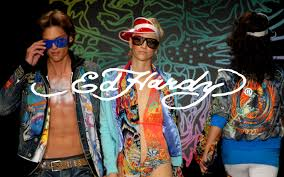

.Sith Lord
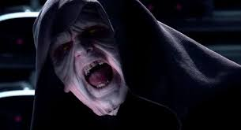

====

President Trump *put out* 发布（新闻、声明等） a ​​Truth Social 真相社交平台 today saying that everybody in the cabinet *was happy with you* (对……感到满意或高兴)对你很满意. I just wondered if that... if you had heard uh... otherwise, and if you had heard anything about members of the cabinet who *weren't happy with* the way 后定 things were going.

"Let the cabinet speak (v.) just for a second. Anybody *unhappy with*...? If you are, well, #throw them out of here# 赶出去. Is anybody unhappy?"

[.my1]
.title
====
.If you are, well, throw them out of here.
特朗普半开玩笑式地让不满意的内阁成员滚蛋，模仿“独裁者”风格。
====

#It's nice to know that# someone gets a vote on *whether* Elon Musk *should be running (v.) the country* 有人投票来决定埃隆·马斯克是否应该管理这个国家. It would have been awkward /if someone started to raise (v.) their hand 举手 before everyone else started clapping 鼓掌.

"Me? Oh no, I wasn't raising my hand. I was, um, just about to do a Nazi salute (敬礼，举手礼；致敬) 纳粹礼." Phew. #Good save# 圆得好,好的扑救.

[.my1]
.title
====
.salute
-> 萨卢斯（Salus）是罗马神话中的健康女神，掌管健康、幸福和兴盛。对应于希腊神话中的许癸厄亚（Hygieia）。在古罗马因其司属而得到古罗马人广泛崇拜与供奉，并以每年八月五日进行相关活动。 英语单词salute就来自萨卢斯的名字Salus，本意是“wish health to”（祝健康）。于此同源的单词还有salutary（有益的）、salutation（致敬）。 salute： [sə'l(j)uːt] v.n.行礼，致敬，欢迎 salutation：[,sæljʊ'teɪʃ(ə)n] n.称呼，致敬，问候，招呼 salutary：['sæljʊt(ə)rɪ] adj.有益的，有用的，有益健康的

.Good save
好的扑救：在足球、冰球等运动中，指守门员成功地阻止了对方的得分机会。
====

So everyone is proud of the job that Elon is doing, and Elon agrees. And I... I should say we also... we will make mistakes. We won't be perfect. But when we uh... make ​​mistakes​​, we'll fix it very quickly. Uh, so for example with uh... USA, uh... `主` one of the things 后定 we accidentally canceled (v.) very briefly `系` was Ebola 埃博拉病毒... Ebola prevention 埃博拉预防. I think we all want (v.) Ebola prevention, so we restored the Ebola prevention immediately 我们立即恢复了埃博拉预防工作.

I'm sorry, you accidentally 意外地，偶然地 very briefly canceled what? I hate *to be giving efficiency notes 提效率建议 to* the Efficiency Master (效率大师)我讨厌给效率大师做效率报告, but perhaps next time we *keep* Ebola prevention *going the whole time* (始终如一) 一直进行,做下去. I mean, is Elon really *asking for* a... for credit 带来荣耀的人（或事）;信用，信贷，赊购；赞扬，信誉，声望 *for* _only canceling (v.) Ebola prevention a little bit_? It's like he *dropped a baby* and went, "What? Look (v.) how fast I *picked it up*! 5-second rule 五秒法则!"

[.my1]
.title
====
防止致命病毒不是“可以临时取消”的东西.
类比笑点：“我把婴儿摔了，但我5秒内捡起来了”，调侃的是对错误的轻描淡写态度。
====

#I think we should be a little more careful# 我觉得我们应该更小心一点, especially when we're already dealing with the measles outbreak 麻疹爆发. But don't worry, Elon is not *in charge of* that. RFK Jr. 小罗伯特·肯尼迪(美国卫生与公众服务部部长) is.

"There's 124 people uh... who have contracted (v.) measles 感染麻疹 at this point, mainly we're told in the ​​men's nightlife​​ 男性夜生活 community. Um... there are two people who have died. Um... but uh... we're watching it. So it's not unusual 所以这并不罕见 - we have _measles outbreaks_ every year."

Quick question 简短问题,有个小问题: When you say "we have _measles outbreaks_ every year," are you talking about America or like... you? Right now *it sounds (v.) like* you might *take out*  除掉;击败，淘汰 that whole room 干掉整个房间的人, and that would be terrible. I want to say... but yes, RFK is overseeing (v.)监督 the measles outbreak, and *he has promised... promised that* he will personally 就个人而言；亲自地，本人地；当面地, if the hospital allows (v.) it, consume (v.)消耗，消费；吃，喝 all of the corpses  尸体 of those infected 吃掉感染者尸体. So he's really *seeing to* 照料，处理 it 认真处理.

And this cabinet meeting #was kind of a waste of time# 浪费时间. Okay? But Trump has been *getting some stuff done* 完成了一些事情. For example, yesterday he signed (v.) an executive order 行政命令 #that *forces* (v.) hospitals *to be* transparent with their prices# 价格透明. And look, that seems like a good idea. And #I am perfectly capable of admitting it# 我完全可以承认这一点 /when Donald Trump did something good.

[Applause 掌声]

"When Donald Trump did something good... When Donald Trump did something good..." I can't say it. I can't say it! Why is this so hard? Oh thank God, #those 那些（that 的复数） don't *come along* 出现,取得进展 very often# 不常发生.

Of course, because it's Donald Trump, most people will never hear (v.) about this price transparency thing 价格透明政策, because at the same meeting /he seemed more interested in doing stuff like this:

"#Do you have# one of those 'Trump was right about everything 特朗普永远正确' hats? #Give me this here#. Give me all of them. Look, see that? 'Trump was right about everything.' #It just came in# 刚收到的. Somebody said... I said... this *was sent in* by a fan 粉丝寄来的. I said I think we should make some of them. Right? #But we were pretty much# 但我们差不多快(制作)完成了... you want one?"

[.my1]
.title
====
.Pretty much
意思是“几乎”、“差不多”或“基本上”。​它用于表示某事大致正确或接近事实，但可能不是完全准确。​

- #We were pretty much done.#​  我们差不多完成了。
- #It's pretty much the same.# 这几乎是一样的

特朗普说：“But we were pretty much...”​这句话的完整上下文, 可能是**他在描述某个情况已经接近完成, 或某个观点几乎正确。**​例如，*他可能在谈论一个政策的实施进度，表示“我们差不多完成了”。* +
*总之，“pretty much”用于强调某事基本上是正确的, 或接近完成的状态。*
====

Okay, first of all, that is *way (ad.)大大地，远远地；<美>非常，很 too much* 过于，太过 text 文字太多, guys. If your hat (n.) needs a bookmark 需要书签, it's not a good hat. And look, I hate to ​​*tussle (v.)争执,扭打；争夺 with* the hat, but Trump wasn't right about everything. Okay? #There were a couple of small things# 有几件小事. Um... I don't know... uh... Haitian immigrants 海地移民 weren't eating cats and dogs. There wasn't _$50 million worth_ 价值5000万美元 of ​​condoms 避孕套 sent to Gaza. Belgium 比利时 is not a city. Uh... the 2020 election wasn't stolen 选举未被窃取. China doesn't... China doesn't operate (v.) the Panama Canal 巴拿马运河, nor does it...

[Music]

And uh... the best taco  (n.)（包着肉、蔬菜和辣酱的）墨西哥玉米薄饼卷 bowls 墨西哥卷饼碗 are not made at the Trump Tower Grill (烤架) 特朗普大厦餐厅. But yes, *other than that* 除此之外，除了那个之外, Trump was right about everything.

[.my1]
.title
====
.taco
image:../img/taco.jpg[,15%]
====

Now I'm not trying to be a hater 黑子,怀恨者, #but if you're going to own# (v.)有，拥有 a hat with a ridiculous (a.)可笑的，荒谬的 lie 荒谬谎言 on it, *at least* make it a fun ridiculous lie. Which is why I'm selling these: "Garfield  加菲猫 did 9/11 加菲猫制造911事件." Get yours today 今天就买你的 before he finishes the job.

[.my1]
.title
====
.Garfield did 9/11

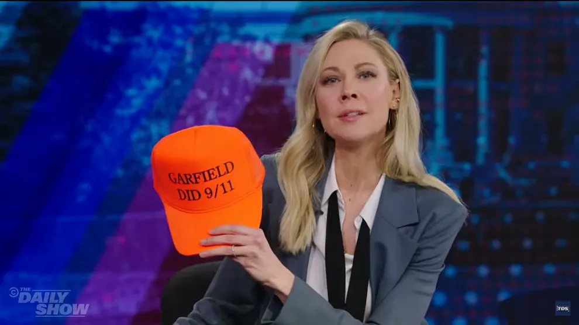
====

But obviously Trump didn't *bring* everybody *into* the Oval Office 椭圆形办公室 just to sell hats. He was there to sell something much more fancy 更花哨的东西.

"#We're going to be selling# uh... a gold card 黄金卡. You have a green card 绿卡 - this is a gold card. #We're going to be *putting a price 给……定价 on* that card *of* about $5 million#, and that's going to give you Green Card privileges 绿卡特权 plus... oh... oh... Green Card privileges plus..."

[.my1]
.title
====
.
在句子 "We're going to be putting a price on that card of about $5 million" 中，介词 “of” 的使用是为了引出价格的具体数额，使句子更加自然和符合英语的表达习惯。​这种结构在英语中是常见的，尤其是在描述某物的价值或数量时。

在英语中，表达某物的价格时，常用以下结构：​ +
*put a price on [something] of [amount]*​ +
*assign a value to [something] of [amount]*​

- They *put a price on* the painting *of* $2 million.​
- The company *assigned a value to* the asset *of* $500,000.

除了使用 “of” 结构外，还有其他更自然的表达方式，例如： +

- We're going *to price* (v.) that card *at* about $5 million.​ +
- We're going *to set the price of* that card *at* about $5 million. +

这些句子使用了动词 “price” 或 “set the price of”，后接介词 “at” 来引出具体的价格数额，是更常见和自然的表达方式。

====

See, I was still *getting* America *with ads* 广告版美国. Quick question... quick question: If I'm unhappy with America, can I cancel (v.)  my subscription 取消订阅 after seven days?

[.my1]
.title
====
这句话的幽默之处在于将“美国”比作一个需要付费订阅的服务，就像Netflix或Spotify那样。​在这些平台上，用户可以选择支付更高的费用, 以获得无广告的体验;  或者支付较低的费用, 但需要观看广告。*​Desi Lydic 在这里讽刺地表示，尽管她“订阅”了美国，但她仍然得到了带广告的版本(即特朗普售卖金卡, 能入籍美国)。*
====

I am curious 好奇的，求知欲强的: What does this gold card do?

"#It's going to be a route# to citizenship 获得公民身份途径. And wealthy people 富人 will be coming into our country by buying this card. They'll be wealthy, and they'll be successful, and they'll be spending a lot of money."

Did this guy just put a _cover charge_ 入场费 on America? It's $5 million to get in, but he'll ​​waive (v.)免除;放弃（权利、要求等）；不强制执行（规定、限制），免除（费用） it /if you *bring in* three hot girls 三个辣妹 with you. I mean, I guess #it beats (v.)（在比赛或竞争中）赢，打败（某人） the old way of# becoming a citizen (获得公民身份) 我想这比成为公民的旧方式要好, which was to marry (v.) Donald Trump. But still... feel like `主` immigrant stories 移民故事 `谓` are going to be a lot less inspiring (a.)鼓舞人心的，有激励作用的 in the future.

[.my1]
.title
====
.cover charge
[ usually sing.]an amount of money that you pay in some restaurants or clubs in addition to the cost of the food and drink（饭店或俱乐部中饮食之外的）服务费 +
封面费：一种餐厅、酒吧或夜总会等场, 所收取的"入场费"，通常包括座位费, 和一定数量的饮料或食物。

“Cover charge” 是夜店门票，这里比喻“美国像夜总会一样，花钱进场”。

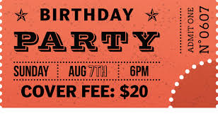

.waive
(v.) [ VN] to choose not to demand sth in a particular case, even though you have a legal or official right to do so放弃（权利、要求等） +
-> 来自 waif,摇摆，舍弃，扔弃。
====

"My grandfather came to this country with nothing /but $5 million and the clothes in his custom (a.)定做的，量身设计的 Louis Vuitton five-piece 五件套 trunk set 定制LV五件套行李箱."

[.my1]
.title
====
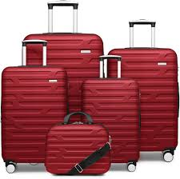
====

#Although I have to admit# 尽管我不得不承认, I don't totally hate (v.)  the idea of buying your way into a country 花钱买国籍. Hey... Canada? How you doing, girl? #I'm just going to come out and say it#: I want to be in you. And listen, I don't have 5million, but I do have...4... and a cough drop 止咳糖... and this orange hat. Let's talk about it.

[.my1]
.title
====
“嘿……加拿大？你好吗，姑娘？我就直说了：我想进入你。”​这句话表面上是表达想移民的愿望，但“进入你”也有"性暗示"的含义，故意制造双关语.
====

#Now you might be thinking#: Wait a second, if the US is just going to *put* citizenship *up for sale* 出售公民身份, #doesn't that mean that# any monster 任何恶人 can buy (v.) one *as long as* they're rich? Well, *according to* 据……所述 Trump...

"Mhm... #would# a Russian oligarch (寡头政治执政者)俄罗斯寡头 #be eligible (a.)符合条件的，合格的；（婚姻）合适的，合意的 for# 有资格获得 a gold card?" +
"Yeah, possibly. Hey, I know some Russian oligarchs that are very nice people. It's possible."

[.my1]
.title
====
.oligarch
-> oligo-,寡，少，-arch,统治，治理，词源同anarchy.
====

Seems like Trump watched ​​Anora (电影名)​​ /and _his takeaway 观后感;外卖的饭菜；外卖食物 from that movie_ was `表` *we need to do... do more* to help (v.) out 援助 that rich Russian teenager. 似乎特朗普看了《Anora》，他从那部电影中得到的启示是我们需要做……做更多的事情来帮助那个富有的俄罗斯少年。 "#He's so good at# sex (性行为，性交) 他太擅长做爱了." But if you're letting Russians come into the country, you got to be careful. Okay? #I don't want *to engage in* stereotypes# 刻板印象, but if you let a Russian in, then there's going to be a smaller Russian inside of him, and then an even smaller Russian inside of him, and *on and on* 长时间地、冗长地进行某种活动或谈话 and on. There's always another. Careful.

[.my1]
.title
====
.Anora
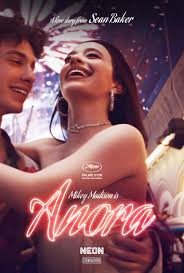

.and on and on and on
短语 “and on and on and on” 是对短语 “on and on” 的重复使用，用来强调某事持续不断、无休止地进行。​根据《剑桥英语词典》的定义，“on and on” 表示“持续很长时间” 。

如果你让一个俄罗斯人进入，那里面可能还有一个更小的俄罗斯人，然后是一个更小的俄罗斯人，依此类推。”​这里，他通过“and on and on and on”的重复，幽默地描绘了俄罗斯套娃（Matryoshka dolls）的特点.
====

#Bottom line# 最重要的或最基本的事实、真相或结果;归根结底: #I'm not sure I like the idea of# a special card that gives rich people unique access 特殊通道 to America. #But if we were going in that direction# 但是如果我们要朝这个方向走的话, we have an idea *for* how to market it 营销方案:

"For centuries, the world's poor and hungry *have flocked to* 蜂拥而至 America's shores. And now you can *jump that line* 插队,跳出那条线. Introducing (v.)介绍，引见 the Trump Gold Card:

5 million... You get citizenship *plus* exclusive access 独占式访问 to Wyoming (yeehaw!), #you get 获得，得到,可以 to vote (v.) twice#, #and *best of all*# 最重要的是 −the Delta _Sky Lounge_ ( （机场等的）等候室；（旅馆、俱乐部等的）休息室) 达美航空贵宾室 (peak hours only).

[.my1]
.title
====
.Wyoming
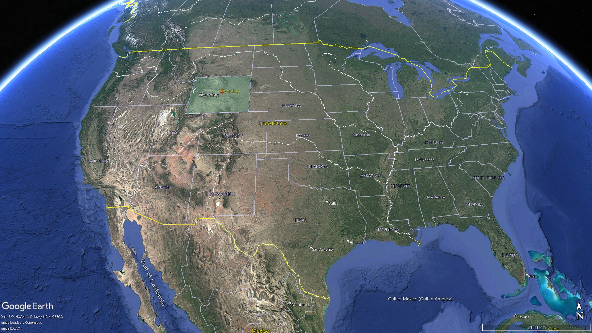

.Delta
达美航空（英语：Delta Air Lines, Inc.，NYSE：DAL）是一家总部位于美国乔治亚州"亚特兰大"的航空公司，目前是世界上国内客运总里程, 与客运机队规模, 第二大的航空公司。

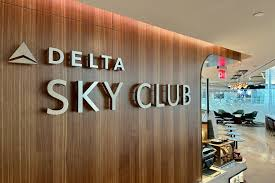
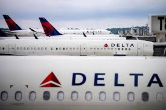

====

And for 10 million more, you get the Trump _Platinum 铂，白金 Card_ - better than gold.   You get two laws  法律；规章 a year, a free _continental breakfast_ 欧式早餐,大陆式早餐 (cottage 小屋，村舍，乡间别墅 cheese 乳酪), 3 months of Apple TV Plus, and a gun (bang bang!).

Want more? The Trump _Black Card_ - that's above Platinum. You get your face on _Mount Rushmore_ 拉什莫尔山（美国总统纪念公园） (#suck it# 吃一堑,自食其果, Lincoln!), your own star 星 on the flag, and even better - the Delta _Sky Lounge_ (he go!).

Had enough? You shouldn't, because here's the Trump _Diamond Card_: good VIP swim hours 良好的VIP游泳时间 in the Gulf of America, a dozen eggs, box seats 包厢座位 at the Kennedy Center 肯尼迪中心 next to La B, happy ending 圆满结局. The Diamond Card lets you deport (v.)驱逐（非本国居民）出境 anyone with a gold card ('should have paid more'), and it works (v.) at Dave & Busters 店名 (unlimited skeeball 游戏名). And don't forget - the Delta Sky Lounge (still off-peak 非高峰期的, they wouldn't budge (（使）稍微移动；<美，非正式> 给别人挪开一块地方；（使）改变主意，（使）让步) 不肯让步). The Trump immigration card ain't in China."

[.my1]
.title
====
.suck it
吃一堑：一种粗俗的表达，用于表示对某人的轻蔑或不屑，相当于中文的“吃一堑”或“自食其果”。

.Kennedy Center
肯尼迪演艺中心歌剧院. 位于首都华盛顿 (Washington, DC) 的波托马克河畔 (the Potomac River)，是专门进行各类艺术表演的场所，其歌剧院和音乐厅的声学效果十分出色。

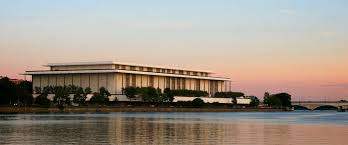
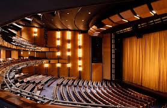

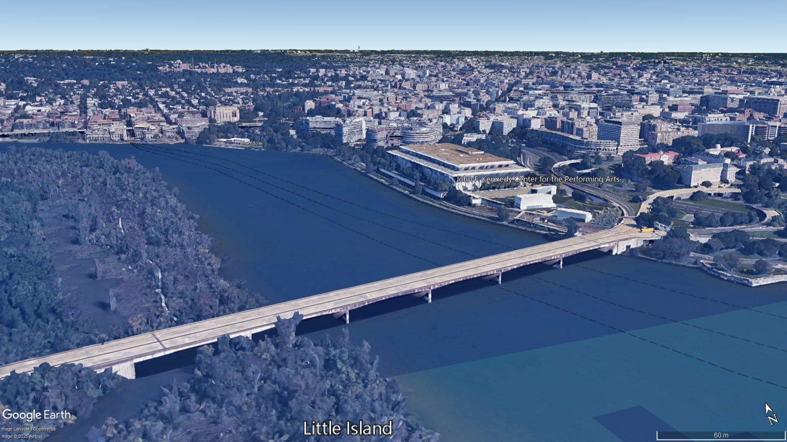
====

[Music]
Wa...

'''

== 中文翻译

今天对特朗普来说是个大日子。他召集全体内阁成员开会，甚至邀请了总统出席。顺便说声谢谢你的盛装打扮，埃隆。我们不会耽误你参加2006年的二十一点锦标赛。没错，埃隆确实有个席位——准确说是像埃德·哈迪风格的西斯尊主般, 阴森笼罩着席位。鉴于他总想开除所有内阁幕僚，有记者质疑这是否制造了紧张气氛。

特朗普今天在真相社交平台发文, 称所有内阁成员都支持埃隆。我只是好奇...是否听到过...相反的说法？有没有听说哪位内阁成员对现状不满？

"*让内阁成员说句话。有人不满意吗？有的话立刻滚出去。*"

很高兴知道有人能投票决定埃隆是否该治国。要是有人举手反对时, 其他人突然鼓掌, 就尴尬了。
"我？不不，我举手是要行纳粹礼。" 啧，圆得好。

总之, 所有人都为埃隆的工作骄傲，埃隆自己也同意。不过...我们也会犯错，不可能完美。但犯错后会立刻纠正。比如美国...我们曾短暂取消了埃博拉预防措施。大家肯定都需要这个，所以我们马上恢复了。

等等，你们短暂取消了啥？虽然不该给"效率(部)大师"提建议，但或许下次我们可以全程保持埃博拉预防？埃隆这是在邀功说"只取消了一小会儿"吗？就像摔了婴儿还说："看我用五秒法则接得多快！"

我们或许该更谨慎些，尤其现在还有麻疹疫情。不过别担心，这事不归埃隆管——是小罗伯特·肯尼迪负责。
"目前124人感染麻疹，主要在男性夜生活群体...死亡2例...我们每年都会爆发麻疹。"

请问"每年爆发麻疹"是指美国还是...阁下您？现在听着像是要把整个房间的人干掉。肯尼迪承诺若医院允许，将亲自吃掉所有感染者尸体，可见其认真态度。

这次内阁会议纯属浪费时间。不过特朗普确实做了些实事，比如昨天签署了要求医院价格透明的行政命令。我完全能承认特朗普做了件好事。

"当特朗普做了好事...当特朗普..."我说不出口！为什么这么难？谢天谢地这种好事不常有。

当然，因为是特朗普，多数人根本不会知道这个价格透明政策——他在同一场会议上更热衷做这种事：
"谁有'特朗普永远正确'的帽子？给我看看。哇刚收到粉丝寄来的样品，我们应该量产对吧？你们想要吗？"

首先，帽子文字太多了。需要书签才能读完的帽子不是好帽子。虽然不想打击人，但特朗普并非永远正确。比如：海地移民没吃猫狗、加沙没收到五千万美元避孕套、比利时不是城市、2020大选没被窃取、中国不运营巴拿马运河...

[音乐]
...还有最好吃的墨西哥卷饼碗不在特朗普大厦餐厅。除此之外他确实永远正确。

不是故意当黑子，但既然要印"荒谬标语"，至少该印有趣点的。所以我正在卖"加菲猫制造911事件"的帽子——趁它还没完成计划赶紧买！

当然, 特朗普召集大家进椭圆办公室, 不只为了卖帽子，他要推销更浮夸的东西：
"*我们将推出黄金卡，定价500万美元，享受绿卡特权, 外加..."
所以美国变成付费订阅制了？要是不满意, 能七天无理由退款吗？*

**这黄金卡到底有什么用？
"这是获得公民身份的捷径，富人们会花钱买卡, 来我国消费。"
这是给美国设"入场费"？**带三个辣妹可免单？虽然比"嫁给特朗普获取身份"强，*但未来的移民故事会失去感染力：
"我爷爷当年只带着500万, 和LV定制五件套行李箱, 就来闯荡美国了。"*

其实我不完全反对"花钱买国籍"。加拿大妹子，我直说了：我想泡你。虽然没500万，但我有4块钱、止咳糖和这顶橙帽子，考虑下？

你可能想问：**如果"公民身份"明码标价，岂不是恶棍有钱就能买？**特朗普表示：
"**俄罗斯寡头能买黄金卡吗？""当然，**我认识些很nice的寡头。"
他看完电影《安妮特》的感想居然是, "该帮帮那个有钱的俄罗斯小帅哥"。

但放俄罗斯人入境要小心，我不想刻板印象，可每个俄罗斯人体内都有更小的俄罗斯人，套娃式无限延伸。

总之我不喜欢给富人开特殊通道，但既然要搞，我们的营销方案是：
"*几个世纪来，穷苦大众涌向美国海岸。现在您可插队了！特朗普黄金卡：500万享公民身份*+怀俄明州特权(哟吼！)+双倍投票权+达美航空贵宾厅(限高峰时段)。 +
**加1000万升级白金卡：**每年定制两条法律+免费欧陆早餐(只有茅屋奶酪)+三个月Apple TV+配枪(砰砰！)。 +
还有黑卡：头像刻上总统山(气死林肯！)+国旗加星+达美贵宾厅(随时进！)。 +
钻石卡更尊贵：墨西哥湾VIP游泳时段+一打鸡蛋+肯尼迪中心包厢+莞式服务，还能驱逐黄金卡持有者('穷鬼滚蛋')，戴夫巴斯特游戏厅无限玩。重申：达美贵宾厅(非高峰时段，他们死活不肯让步)。特朗普移民卡，中国可没有。"

[音乐]
哇...

'''

== pure

Here's the corrected version with proper punctuation and minor word corrections (marked in ​​bold​​):

Today was a big day for Donald Trump. He had a meeting with every member of his cabinet, and he even invited the president. By the way, thanks for dressing up, Elon. Don't let us keep you from a blackjack tournament in 2006. But yes, Elon did have a seat at the table. Well, not an actual seat - he was more looming over it like an Ed Hardy Sith Lord. And some reporters wondered if that created tension with the actual cabinet members, given that he keeps trying to fire all of their staff.

President Trump put out a ​​Truth​​ Social today saying that everybody in the cabinet was happy with you. I just wondered if that... if you had heard uh... otherwise, and if you had heard anything about members of the cabinet who weren't happy with the way things were going.

"Let the cabinet speak just for a second. Anybody unhappy with...? If you are, well, throw them out of here. Is anybody unhappy?"

It's nice to know that someone gets a vote on whether Elon Musk should be running the country. It would have been awkward if someone started to raise their hand before everyone else started clapping.

"Me? Oh no, I wasn't raising my hand. I was, um, just about to do a Nazi salute." Phew. Good save.

So everyone is proud of the job that Elon is doing, and Elon agrees. And I... I should say we also... we will make mistakes. We won't be perfect. But when we uh... make ​​mistakes​​, we'll fix it very quickly. Uh, so for example with uh... USA, uh... one of the things we accidentally canceled very briefly was Ebola... Ebola prevention. I think we all want Ebola prevention, so we restored the Ebola prevention immediately.

I'm sorry, you accidentally very briefly canceled what? I hate to be giving efficiency notes to the Efficiency Master, but perhaps next time we keep Ebola prevention going the whole time. I mean, is Elon really asking for a... for credit for only canceling Ebola prevention a little bit? It's like he dropped a baby and went, "What? Look how fast I picked it up! 5-second rule!"

I think we should be a little more careful, especially when we're already dealing with the measles outbreak. But don't worry, Elon is not in charge of that. RFK Jr. is.

"There's 124 people uh... who have contracted measles at this point, mainly we're told in the ​​men's nightlife​​ community. Um... there are two people who have died. Um... but uh... we're watching it. So it's not unusual - we have measles outbreaks every year."

Quick question: When you say "we have measles outbreaks every year," are you talking about America or like... you? Right now it sounds like you might take out that whole room, and that would be terrible. I want to say... but yes, RFK is overseeing the measles outbreak, and he has promised... promised that he will personally, if the hospital allows it, consume all of the corpses of those infected. So he's really seeing to it.

And this cabinet meeting was kind of a waste of time. Okay? But Trump has been getting some stuff done. For example, yesterday he signed an executive order that forces hospitals to be transparent with their prices. And look, that seems like a good idea. And I am perfectly capable of admitting it when Donald Trump did something good.

[Applause]

"When Donald Trump did something good... When Donald Trump did something good..." I can't say it. I can't say it! Why is this so hard? Oh thank God, those don't come along very often.

Of course, because it's Donald Trump, most people will never hear about this price transparency thing, because at the same meeting he seemed more interested in doing stuff like this:

"Do you have one of those 'Trump was right about everything' hats? Give me this here. Give me all of them. Look, see that? 'Trump was right about everything.' It just came in. Somebody said... I said... this was sent in by a fan. I said I think we should make some of them. Right? But we were pretty much... you want one?"

Okay, first of all, that is way too much text, guys. If your hat needs a bookmark, it's not a good hat. And look, I hate to ​​tussle​​ with the hat, but Trump wasn't right about everything. Okay? There were a couple of small things. Um... I don't know... uh... Haitian immigrants weren't eating cats and dogs. There wasn't $50 million worth of ​​condoms​​ sent to Gaza. Belgium is not a city. Uh... the 2020 election wasn't stolen. China doesn't... China doesn't operate the Panama Canal, nor does it...

[Music]

And uh... the best taco bowls are not made at the Trump Tower Grill. But yes, other than that, Trump was right about everything.

Now I'm not trying to be a hater, but if you're going to own a hat with a ridiculous lie on it, at least make it a fun ridiculous lie. Which is why I'm selling these: "Garfield did 9/11." Get yours today before he finishes the job.

But obviously Trump didn't bring everybody into the Oval Office just to sell hats. He was there to sell something much more fancy.

"We're going to be selling uh... a gold card. You have a green card - this is a gold card. We're going to be putting a price on that card of about $5 million, and that's going to give you Green Card privileges plus... oh... oh... Green Card privileges plus..."

See, I was still getting America with ads. Quick question... quick question: If I'm unhappy with America, can I cancel my subscription after seven days?

I am curious: What does this gold card do?

"It's going to be a route to citizenship. And wealthy people will be coming into our country by buying this card. They'll be wealthy, and they'll be successful, and they'll be spending a lot of money."

Did this guy just put a cover charge on America? It's $5 million to get in, but he'll ​​waive​​ it if you bring in three hot girls with you. I mean, I guess it beats the old way of becoming a citizen, which was to marry Donald Trump. But still... feel like immigrant stories are going to be a lot less inspiring in the future.

"My grandfather came to this country with nothing but $5 million and the clothes in his custom Louis Vuitton five-piece trunk set."

Although I have to admit, I don't totally hate the idea of buying your way into a country. Hey... Canada? How you doing, girl? I'm just going to come out and say it: I want to be in you. And listen, I don't have 5million,butIdohave...4... and a cough drop... and this orange hat. Let's talk about it.

Now you might be thinking: Wait a second, if the US is just going to put citizenship up for sale, doesn't that mean that any monster can buy one as long as they're rich? Well, according to Trump...

"Mhm... would a Russian oligarch be eligible for a gold card?"
"Yeah, possibly. Hey, I know some Russian oligarchs that are very nice people. It's possible."

Seems like Trump watched ​​Anora​​ and his takeaway from that movie was we need to do... do more to help out that rich Russian teenager. "He's so good at sex." But if you're letting Russians come into the country, you got to be careful. Okay? I don't want to engage in stereotypes, but if you let a Russian in, then there's going to be a smaller Russian inside of him, and then an even smaller Russian inside of him, and on and on and on. There's always another. Careful.

Bottom line: I'm not sure I like the idea of a special card that gives rich people unique access to America. But if we were going in that direction, we have an idea for how to market it:

"For centuries, the world's poor and hungry have flocked to America's shores. And now you can jump that line. Introducing the Trump Gold Card: 5million.You get citizenship plus exclusive access to Wyoming(yeehaw!),you get to vote twice, and best of all−the Delta Sky Lounge (peak hours only). And for 10 million more, you get the Trump Platinum Card - better than gold. You get two laws a year, a free continental breakfast (cottage cheese), 3 months of Apple TV Plus, and a gun (bang bang!). Want more? The Trump Black Card - that's above Platinum. You get your face on Mount Rushmore (suck it, Lincoln!), your own star on the flag, and even better - the Delta Sky Lounge (he go!). Had enough? You shouldn't, because here's the Trump Diamond Card: good VIP swim hours in the Gulf of America, a dozen eggs, box seats at the Kennedy Center next to La B, happy ending. The Diamond Card lets you deport anyone with a gold card ('should have paid more'), and it works at Dave & Busters (unlimited skeeball). And don't forget - the Delta Sky Lounge (still off-peak, they wouldn't budge). The Trump immigration card ain't in China."

[Music]
Wa...

'''