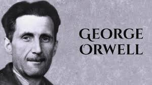
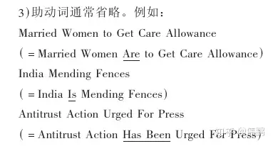
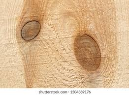
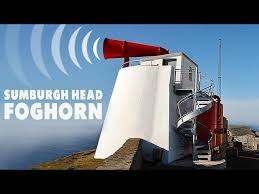
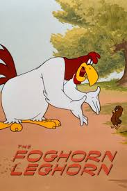
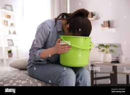

= 2025.03 Jon Stewart on Which Speech Is Free and Which Will Cost You in Trump’s America
:toc: left
:toclevels: 3
:sectnums:
:stylesheet: ../../../myAdocCss.css

'''

== 释义

Welcome to The Daily Show! My name is John Stewart. We got a great show for you tonight, my friend. I got a... I got a new tie  领带，领结 with the chart 图表，曲线图. I'll tell you what - we got a great one 我们有一个很棒的(人来参加我们的节目). Paul Rudd (蚁人男主角演员) is going to be... Paul Rudd #finally had the ​​balls​​ 胆量 to come on this show# /after weeks of calling me a propagandist 宣传者. Know this: our interview will be unedited (a.)未经剪辑的;未经审查的. Rudd'*s going down* 被击败,失败. It's happening. I'm going to... I'm going to give that dude 家伙，小子 an infection 传染病；感染 of the Perineum 会阴.

[.my1]
.案例
====
.Perineum
image:../img/The_male_and_female_perineum.jpg[,15%]

胎盘哺乳动物的会阴 （ 复数 ： perineums 或 perinea ）**是指"肛门"与"生殖器"之间的空间。**人类的会阴, 位于男性肛门与阴囊之间，或女性肛门与外阴之间。 会阴是耻骨联合 （耻骨弓）与尾骨 （尾骨）之间的身体区域，包括会阴体及其周围结构。 会阴缝可见，且程度不同。

该词本身来自 περίνεος, περίνεοι（男性生殖器）和更早的 περίς perís （阴茎），受到 πηρίς pērís （阴囊）的影响。该术语最初被理解为纯粹的男性身体部位，"会阴缝", 被视为"阴囊隔膜"的延续，因为男性化导致男性肛门生殖器距离增大，而女性则没有这种距离。由于民间词源 （例如 ἰνάω ináō，“通过排泄带走”），该词同时扩展到两性。

.Rudd's going down
这句话中的 “going down” 是一个英语俚语，意思是“被击败”或“失败”。​在口语中，尤其是在体育、辩论或对抗性场景中，这个短语常用来表示"某人即将输掉一场比赛或争论"。Stewart 用这句话来幽默地表示他将在节目中“击败”保罗·路德（Paul Rudd）.
====

I should explain - we spent... we come out early 我们很早就出来了, I do a little warm-up 热身 with the audience 观众, and uh... for some unknown reason (and it really was not prompted 被提示), I was trying to discuss uh... the relationship /between _asthma 哮喘，气喘 medication_ 哮喘药物 and a side effect 副作用 of _an infection of the Perineum_​​. Unfortunately, I have no one in the audience /who was able to satisfy 满足 my curiosity 好奇心 on that. So uh... those of you at home /who may be looking it up 查阅 right now - wait till the commercial break 广告时间.

[.my1]
.案例
====
.asthma
[ U]a medical condition of the chest that makes breathing difficult 气喘；哮喘
-> 拟声词。

Asthma is a common long-term inflammatory disease of the airways of the lungs.[4] It is characterized by variable and recurring symptoms, reversible airflow obstruction, and easily triggered bronchospasms.[9][10] Symptoms include episodes of wheezing, coughing, chest tightness, and shortness of breath.[3] A sudden worsening of asthma symptoms sometimes called an 'asthma attack' or an 'asthma exacerbation' can occur when allergens, pollen, dust, or other particles, are inhaled into the lungs, causing the bronchioles to constrict and produce mucus, which then restricts oxygen flow to the alveoli.These may occur a few times a day or a few times per week.[4] Depending on the person, asthma symptoms may become worse at night or with exercise.[4]

哮喘是肺部气道的常见长期炎症性疾病。 [ 4 ] *其特点是症状多变且反复发作， 气流阻塞可逆，且容易引发支气管痉挛 。 [ 9 ] [ 10 ] 症状包括喘息 、 咳嗽 、胸闷和呼吸急促 。 [ 3 ] 当过敏原 、 花粉 、灰尘或其他颗粒被吸入肺部时，哮喘症状可能会突然恶化*，有时被称为“哮喘发作”或“哮喘加重”，导致细支气管收缩并产生粘液，从而限制氧气流向肺泡 。 这些情况可能每天发生几次，也可能每周发生几次。 [ 4 ] 根据个人情况，哮喘症状可能在夜间或运动时加重。

*哮喘的特征是反复发作的喘息 、 气短 、 胸闷和咳嗽 。 [ 21 ] 咳嗽时肺部可能会产生痰 ，但通常很难咳出。* [ 22 ] 在哮喘发作（恶化） 的恢复期，由于嗜酸性粒细胞 ( Eos) 含量高，痰液可能呈脓状 。 [ 23 ] *症状通常在夜间和清晨加重，或者在运动或接触冷空气后加重。* [ 24 ] 一些哮喘患者很少出现症状，通常是对诱因的反应，而另一些患者可能经常出现反应，并出现持续性症状。 [ 25 ]

*#虽然哮喘是一种众所周知的疾病，但目前尚无一个普遍认可的定义#。* [ 20 ] 全球哮喘防治倡议, 将其定义为“一种由多种细胞和细胞成分参与的**#慢性气道炎症性疾病。#**慢性炎症与气道高反应性有关，**导致反复发作的喘息、呼吸困难、胸闷和咳嗽，尤其是在夜间或清晨。****#这些发作, 通常与肺内广泛但多变的气流阻塞有关#，**这种阻塞通常可以自发或通过治疗逆转”。

*##目前尚无精确的诊断方法，##通常基于症状的模式, 和随时间推移对治疗的反应。* [ 5 ] [ 20 ] *#如果有反复喘息、咳嗽或呼吸困难的病史，并且这些症状因运动、病毒感染、过敏原或空气污染而出现或恶化，则可能怀疑患有哮喘。#* [ 94 ] 然后使用肺量计检查来确诊。 [ 94 ]** 对于 6 岁以下的儿童，诊断更加困难，因为他们年龄太小，无法进行肺量计检查。**

**#其他支持性证据包括：每周至少三天，持续至少两周， 峰值呼气流量变化≥20%；#**使用沙丁胺醇、吸入性皮质类固醇或泼尼松治疗后，峰值流量改善≥20%；或接触诱因后，峰值流量下降≥20%。 [ 100 ] 然而，峰值呼气流量检测比肺量计法变化更大，因此不建议用于常规诊断。

虽然哮喘是一种慢性阻塞性疾病，但它并不属于"慢性阻塞性肺病"的一部分，因为该术语特指不可逆的疾病组合，例如支气管扩张和肺气肿 。 [ 104 ] 与这些疾病不同，*哮喘的气道阻塞通常是可逆的；然而，如果不及时治疗，哮喘引起的慢性炎症, 会因气道重塑, 而导致肺部出现不可逆的阻塞。* [ 105 ] *#与肺气肿不同，哮喘影响的是支气管，而不是肺泡 。#* [ 106 ]  +
哮喘与不可逆性气道阻塞的组合, 被称为"哮喘-慢性阻塞性肺病" (COPD) 重叠综合征 (ACOS) 。与其他“纯”哮喘或 COPD 患者相比，ACOS 患者的发病率和死亡率更高，并且可能合并症更多。 [ 107 ]

====

But first, a quick update 最新消息 on an administration 政府 /后定 that is once again carrying out 执行 its plans /with competence 能力 and professionalism 专业素养. A reporter from The Atlantic says /he *was mistakenly 错误地 added to* a group chat 群聊 /with top members of the Trump administration /as they *were texting* (v.) back and forth (来回地，来来回回地，反复地) 来回发短信 *about* highly sensitive 高度敏感的 war plans 作战计划. Jeffrey Goldberg says /he was included in a group chat /full of our nation's top security officials 安全官员 /discussing what we can only assume 假定，假设 to be top secret 绝密的 plans /to bomb (v.) Houthi targets across Yemen /on March 15th - `主` everything from the weapons America /`谓` would *be deploying 部署 to* the timing 时间安排 and the attack sequences 攻击顺序. Oopsie poopsie!

[Applause]

You know, back in my day 在我年轻时, if you were a journalist /who wanted leaked (a.)泄露的 war documents 战争文件, he'd *work (v.) the sources* 发展消息源, meet him in a dark garage 黑暗的车库, *earn (v.) the trust* 赢得信任, *pound (v.)脚步声沉重地走（跑）;连续重击，猛打 the pavement* (人行道) 四处奔走. Now you just wait (v.) for the national security adviser 国家安全顾问 /to be distracted (v.)转移（注意力）；分散（思想）；使分心 by White Lotus 白莲花 /while he's setting up his "bomb (v.) Yemen" group chat. Are those guys *jerking* (v.)急拉；猛推；猝然一动 each other *off* 行手淫?

[Laughter]

By the way, I might be in this group chat. I don't know - I don't check my group chats. Perhaps _my favorite text_ of the entire group chain /was the one /from our defense secretary 国防部长 /saying quote 引文，引语: "We are currently clean 在某方面没有问题,没有违规 on  OPSEC." For those of you /who don't know, OPSEC means operational security 行动安全. He said that /in a group chat. A group chat 后定 with a journalist. The journalist said that /he didn't think that the story was real /until Yemen was bombed.

Oh, #did I bring you down# 我让你失望了吗, 我是不是让你情绪低落了? Let's move on 让我们继续.

Because as you know, there are certain hypocrisies (n.)虚伪 and absurdities 荒谬 /that we find in our cultural moment 当前时代,文化背景下 /that *make for* 促成、有助于 great fodder 素材 for humorous dialogue 幽默对话 - a facial expression 面部表情, a nod and a wink 眨眼示意.  +

[.my1]
.案例
====
.*make for* great fodder for humorous dialogue

[.my3]
[options="autowidth" cols="1a,1a"]
|===
|Header 1 |Header 2

|make for
|表示 ​​“促成、有助于（某种结果或状态）”​​，强调某事物对另一事物的​​积极贡献​​。 +
- "Bright colors *make for* a cheerful atmosphere."
（明亮的色彩有助于营造愉悦的氛围。） +
- "His experience *makes for* a strong argument."
（他的经验让论点更有力。）

|如果去掉 "for"（直接用 "make"）​
|表示 ​​“成为、构成”​​，更中性，不强调“促进作用”。 +
- "These facts make a compelling case."
（这些事实构成了有力的证据。） +
- "Wheat makes flour."
（小麦制成面粉。）

|===

如果本文去掉for , 只写成 make 的话: +
"Hypocrisies and absurdities make great fodder for humorous dialogue."
→ ​​“虚伪与荒诞的现象是幽默对话的绝佳素材。”​​

​​区别​​：
去掉 ​​for​​ 后，句子依然通顺，但失去了 ​​“主动促成”​​ 的微妙含义。
更像在陈述事实（“它们是素材”），而非强调“这些现象天然适合被加工成笑料”。
====

Then there are other pronouncements 声明，宣告 by our _elected officials_ 民选官员, actions /by our government /后定 that are so baldly (ad.)露骨地；直截了当地，率直地... *even though* you know /it will have no effect, and that /these powerful creatures *have been genetically modified* (修改) 基因改造 /to resist (v.) shame 羞耻感, self-reflection 自我反思 of any kind, *you just can't help yourself 你就是忍不住要 but to go* _old school_ (a.)守旧的,保守的 Daily Show. Gotcha (=Got you 抓到你了) 抓个正着.

[.my1]
.案例
====
.Gotcha
​​"gotcha"​​ 是一个口语化表达，通常用于揭露 hypocrisy（虚伪）或 absurdity（荒谬）时，带有 ​​“逮到你了！”​​ 或 ​​“这下你露馅了吧！”​​ 的意味。
====

I'm talking about the debate 讨论，辩论 on free speech 言论自由. Now as we know, conservatives 保守派 have been very concerned about /the loss of free speech in our country /for a very long time.  +

- "`主` Bullies 仗势欺人者；横行霸道者 on the left /`谓` aiming (v.) to silence (v.)使沉默 conservatives 左派恃强凌弱，意在让保守派噤声."
- "Free speech *is under siege* 被围困 in this country."
- "The leftists 左派（leftist 的复数形式）；左翼份子... they've become the _thought police_ 思想警察."
- "They *basically declare (v.) themselves* God /and *judge* (v.) us *for* our thoughts."
- "_George Orwell_ was right - the _thought police_ *come (v.) next* 接下来发生,紧随其后/to punish (v.) _thought crime_ 思想犯罪."
- "Be very, very scared."

[.my1]
.案例
====
.George Orwell was right — the thought police come next to punish thought crime.
乔治·奥威尔说得对——接下来就会出现“思想警察”来惩罚“思想犯罪”。

​"come next"​​ = ​​“紧随其后”​​ / ​​“下一步就是”​​ / ​​“接下来会发生”​​ +
强调某种情况或事件是前文逻辑的​​必然发展结果​​。 +
类似表达："follow", "ensue", "be next in line"。

.George Orwell
《动物庄园》和《一九八四》的作者.

====

[Applause]

I am. Perhaps not for the reasons 后定 you are. The _thought police_ with you right now, Jimmy? Are they in the bottle?

[.my2]
我确实害怕——但理由不同。吉米你现在被思想警察盯上了？他们藏在酒瓶里？

But luckily, our national _free speech_ nightmare 噩梦 /recently *came to an end* /when we entered the golden age 黄金时代 of Donald J... Trump. "We have saved free speech in America, and we've saved it strongly." "Free speech in America - it's back." Thank (v.) God /we have a president now /who *believes in* free speech.

Yes, thank God /we have a president now /who *believes in* free... just go ahead, *roll （使）翻滚，滚动 through* 掠过，经过 12 (请继续，浏览第12条):

- "I believe that /CNN and MSNBC - what they do /is illegal 非法的."
- "I think /CBS should lose (v.) its license 执照."
- "But I think /ABC should lose (v.) its license also /because of what they've done."
- "I *watched* _what happened_ *live* 我看了现场直播."
- "I think /Bravo should also lose (v.) their license."

[Applause]

"What they did to Dorinda /on 'Real Housewives' 他们在《真实主妇》里,对多琳达做的事... they should be sent to a Salvadorian jail 萨尔瓦多监狱."

[.my1]
.案例
====
主持人 Jon Stewart 模仿特朗普（Donald Trump）的口吻，夸张地抱怨媒体“迫害”真人秀明星 Dorinda（来自《纽约娇妻》Real Housewives of New York）。

Dorinda Medley 是《纽约的真实主妇》（The Real Housewives of New York City）的一位前成员。该节目以其成员之间的激烈争执, 和戏剧性场面而闻名。 +
建议那些在节目中对 Dorinda 不公的人, 应该被送往萨尔瓦多的监狱.
====

This is what I'm talking about. Generally, you've got to *search* (v.) the archives 档案 /*for* contradictions (n.)矛盾 后定 on one's _stated principles_ 既定原则, *dig (v.) through* policy papers 政策文件 /to uncover (v.) private actions /that *are undermined* (v.)暗地里破坏；挖……的下面 by someone's public stance 公开立场.  +
But this is so... #this is so blatant# (a.)明目张胆的 /#I can't *wrap (v.)包，裹，包装；用（手臂、指头或腿）围紧 my head 理解，领会 around* it# 无法理解,我不明白这是怎么回事.  +
#It's *not even*# the hypocrisy (虚伪) 这甚至不是虚伪 - #it's that# /they so fetishize (v.)盲目崇拜, 盲目迷恋；以……为偶像 free speech, this thing /that they *do not* [in any way 以任何方式] *actually practice* 实践.

[.my2]
我说的就是这种双标。通常你得翻箱倒柜找档案，才能挖出某人公开立场与私下行为的矛盾。但这次…​这次简直赤裸得让我脑回路短路。重点甚至不是虚伪——而是他们把言论自由当神拜，自己却从不真正去实践过。

[.my1]
.案例
====
.I can’t wrap my head around it
字面意思是 ​​“我无法用头把它包起来”​​，但实际表达的是：
​​“我完全无法理解/想不通这件事”​​（因为太荒谬、复杂或违反常理）。 +
比喻​​：像试图用头“包裹”一个巨大的物体（根本做不到），形容​​"难以消化信息"​​。

- He claims to support (v.) free speech /but bans (v.) critics... *I can’t wrap my head around it!*
 他自称支持言论自由却封杀批评者…我实在想不通！
- *I can't really wrap my head around* all these documents. 我真的不理解這些文件
====

"The freedom /① to speak (v.) our minds 畅所欲言 /and ② express (v.) _the truth /that is our heart_ ("表达我们内心真实"的自由). 畅所欲言并表达内心真实（想法）的自由。"  +
Really? That's really _a big chunk 一大块 of_ our heart? Any cardiologist 心脏病专家 will tell you - hearts come in chunks 心脏是分区块的. Blood *comes into* the aorta 主动脉, to the right ventricle 右心室, *passes through* your speech chunk (虚构出"speech chunk"（言论区块）).

But since *coming into office* 上任,就职, Trump and the Republicans have instituted  (v.)创立；设置 policies 制定政策 /that are a dagger 匕首 *right through* many people's speech chunks.  +
The White House has barred (v.)禁止 _the Associated Press_ 美联社 /from presidential events /because the AP *has refused* to rename (v.)重新命名，改名 _the Gulf of Mexico_ the "Gulf of America" /in its style book 风格指南.  +
And in a dramatic escalation 戏剧性升级 /后定 against （行为）违背 the American legal system 法律体系, Trump this weekend directed (v.)指导；管理 his government /to target (v.) law firms 律师事务所 后定 battling his (指川普) actions.  +

Federal immigration officials 联邦移民官员 arrested (v.) a Palestinian activist 巴勒斯坦活动家 /who helped *lead* (v.) last year's *student encampment 营地；露营 protest* 学生营地抗议 at Columbia. "I think /we ought to *get them all out of the country*. They're troublemakers 麻烦制造者. They're agitators 煽动者. They don't love (v.) our country."

My chunks! My precious chunks! My lovely lady chunks! My chunks! My chunks! My lovely lady... you're making my perineum 会阴 tingle (v.)刺痛,感到刺痛；使激动.

Here's the thing 事情是这样的,引出解释的关键点 - these attacks on free speech, especially uh... the one /where they deported (v.)驱逐出境 that activist... if there's one thing that I know /about _the powerful principles 强大原则 at our higher education institutions_ 高等教育机构, they will not *be bullied (v.)威胁；恃强欺弱 by* a... roll 卷轴 212:  +
"Columbia University *is bowing 鞠躬,弯腰 to* 屈服于 President Trump's demands, announcing /it will change a number of policies, among them 在其中 /*placing* (v.)放置；安排 the school's _Middle Eastern, South Asian and African studies department_ *under* _academic receivership_ (破产管理) 学术接管 /for at least 5 years."

[.my2]
事情是这样的，这些对言论自由的攻击，特别是他们驱逐了那个活动人士，如果我对我们高等教育机构的强大原则有一点了解的话，那就是他们不会被……“哥伦比亚大学屈服于特朗普总统的要求，宣布将改变一些政策，其中包括将学校的中东、南亚和非洲研究部门置于学术管理之下至少5年。”

Some students protest (v.) the war in Gaza, suddenly a whole academic department /is on _double secret probation_ (缓刑（期）；试用期，见习期；察看（期），考察（期）) 双重秘密观察期 with government oversight 政府监督. And *by the way* 顺便说一下... okay, Middle East and African studies? What did they do? Sure, the African studies professors are like: "I teach (v.) intermediate (a.)居中的，中间的；中等程度的，中级的 Swahili 中级斯瓦希里语（通行于东非)."

[.my1]
.案例
====
.double secret probation
​​"probation"​​ 通常指 ​​“留校察看”​​（对行为不端学生的处罚）或 ​​“试用期”​​（如工作 probation）。 +
​​"secret probation"​​ = ​​“秘密察看”​​（不公开的处罚）。 +
​​"double secret probation"​​ = ​​“双重秘密察看”​​——比“秘密察看”更荒谬、更不透明。

这个说法源自 ​​1978 年经典喜剧《动物屋》（Animal House）​​，片中虚构的大学兄弟会 ​​Delta Tau Chi​​ 因行为出格，被校方处以 ​​"double secret probation"​​（一种完全不存在、随意编造的惩罚）。 +
现实中大学根本不会有这种处罚，但电影用它来嘲笑官僚主义的荒谬。

.probation
-> 来自拉丁语probare,检验，试探，词源同prove,probe.引申词义试用期，见习期等。
====

See, these guys *don't give a ​​fuck​​ 不在乎 about* free speech. They *care about* their speech. It's so blatant  (a.)喧嚣的；公然的；炫耀的 hypocrisy 明目张胆的虚伪. It's so _old school_ Daily Show gotcha. You know what? I'm just going to put on the wig 假发 /I used to wear (v.) during those years, because the hypocrisy is just so...

Here's Donald Trump on _those /后定 who would criticize (v.) judges 批评法官 /that he (指川普) has appointed_: "A lot of the judges /that I had, if you look at them, they take tremendous abuse 巨大辱骂, and it's uh... truly interference (n.)干涉 *in my opinion* 在我看来, and it should be illegal 这应该是非法的, and it probably is illegal *in some form* 以某种形式存在." Yes, criticizing (v.) judges - it is interference, it should be illegal, tremendous abuse.

[.my2]
特朗普这样评价那些批评他任命法官的人："我任命的很多法官，你们都看到了，他们遭受了巨大的诋毁，呃...在我看来这完全就是干预司法，应该被定为非法，某种程度上可能已经是非法的。"是啊，批评法官——这就是干预司法，应该被定为非法，简直是巨大的诋毁。

And four days later - not four days later, not _a full French work week_ later - President Donald Trump just took to _Truth Social_ /and deemed (v.)视同,认为 this judge... *responding to* _this decision_ here, calling him "a radical 激进的，极端的 left lunatic (疯狂的人， 愚笨的人；精神病患者，疯子) 激进左翼疯子 of a judge," "a troublemaker and agitator /who was sadly appointed (v.) by Barack Hussein Obama." He says /this judge should be impeached 弹劾.

[.my2]
结果四天后——都不用四天，连法国人一周的工作时长都不到——特朗普总统就在Truth Social上发文，把这位法官...针对这个裁决，称他是"一个激进左派的疯子法官"，"可悲的是被奥巴马任命的麻烦制造者和煽动者"。他说这位法官应该被弹劾。

[.my1]
.案例
====
.lunatic
-> 来自拉丁语luna,月亮，词源同lunar.因西方古代医学认为月相的盈亏可引发暂时的神经错乱.
====

The hypocrisy 虚伪，伪善... it burns (v.) 这虚伪…烧得慌. And are we really still doing the "Barack Hussein Obama" thing? Oh, free (v.) Harambe! Come on!

[.my1]
.案例
====
.hypocrisy
->来自希腊语hypokrisis,舞台表演，演戏，**来自hypo-,在下，-kris,分开，筛选，评论，词源同crisis,critic.**来自于古希腊时期的一种舞台表演形式，即边说边紧跟着发表看法，评论或进行阐释，引申词义表演，演戏。现义伪善，虚伪义可能来自于此，或来自hypo-,下面，欠缺，-kris,评论，观点，即不敢发表观点和看法的，掩饰真实情感的，引申词义伪善，虚伪。

.still doing the 'Barack Hussein Obama' thing
“Barack Hussein Obama”：​这是前总统奥巴马的全名，其中“Hussein”是他的中间名。​一些批评者，尤其是政治对手，故意强调这个中间名，以暗示他与伊斯兰教或恐怖主义有关，从而引发对其忠诚度的质疑。

.Oh, free (v.) Harambe! Come on!
哦对了，顺便解放大猩猩Harambe呗！差不多得了！

​Harambe 是一只在 2016 年被射杀的西部低地大猩猩。​事件发生后，Harambe 成为了网络迷因的对象，象征着公众对不公正事件的抗议。​“Free (v.) Harambe” 是一种讽刺性的口号，表达对某些荒谬现象的不满。​在这里，Jon Stewart 用这个短语来嘲讽那些仍在使用“Barack Hussein Obama”这种陈旧攻击手法的人，暗示他们的行为就像是在呼吁“释放”一只已经去世的大猩猩一样荒谬。

2016年5月28日的动物园安全事件，一名三岁的男孩进入辛辛那堤动物和植物园的大猩猩围栏里，17岁的哈兰贝西部低地大猩猩靠近男孩, 并照顾了他。即使哈兰贝是在保护男孩，园方工作人员因担忧男童性命的安危，便射杀了哈兰贝。
====

[Applause]

People... you see what was the whole thing /that they hated (v.) about the left 左翼人士 on free speech 你知道他们讨厌左派言论自由的原因是什么吗? "No one is safe from the left's word police 文字警察. No one." *What exactly would* _an actual government-run word (a.) police organization_ *look like*? 一个真正的政府管理的警察组织到底是什么样的?

[.my1]
.案例
====
.Word Police
"Word Police"​​ = ​​“文字警察”​​ +
比喻某些人（通常是自由派/进步派）像警察一样 ​​“监控、纠正他人用语”​​，要求使用“政治正确”词汇。
====

The Trump administration is actively trying *to purge* (v.)清洗（组织中的异己分子）；清除 the federal government *of* so-called "woke 觉醒的" initiatives 积极性；主动权. Government agencies have flagged (v.)标记 hundreds of words /to limit (v.) or avoid (v.) - words like DEI (Diversity 多样性，多样化, Equity and Inclusion 多元化、公平和包容), BIPOC (Black, Indigenous 本土的，固有的, and People of Color 黑人、原住民和有色人种), anti-racism 反种族主义, Latinx 拉丁裔, Native American 原住民, black women... seemingly _random words_ like "expression 表达," "at risk 处于危险中," "political 政治的," and even "mental health 心理健康" and "sex 性别."

[.my1]
.案例
====
.purge
(v.)~ sth (of sb) | ~ sb (from sth) : to remove people from an organization, often violently, because their opinions or activities are unacceptable to the people in power清除，清洗（组织中的异己分子）
====

What's left? BIPOC and Latinx - I get that. You're not allowed to say "sex"? You can't say words /like "women" or "sex" or #MeToo? How can a lot of your _cabinet members_ 内阁成员 describe (v.) their weekends?

You know, you can't protest (v.)（公开）反对，抗议 in a way... you can't protest in a way /that offends 冒犯 the right 右派. You can't teach (v.) things /that the right 右派 doesn't want you to teach. You can't read things /that they don't want you to read. You can't use words /that they don't want you to use. But they love (v.) free speech.

[.my2]
你们看啊，抗议活动不能...抗议方式绝不能冒犯右翼。教学内容绝不能涉及"右翼反对的知识"。阅读书目绝不能包含他们禁止的书籍。用词遣句必须避开他们的敏感词清单。可他们偏偏还高呼"我们最拥护言论自由"呢！

I guess *fear not* 勿惧 - at least we'll always have art. 我想不用担心——至少我们会一直拥有艺术. "President Trump *demanding* (v.)强烈要求；需要 _a painting of him_ *be removed* /because he finds it unflattering  (a.)不吸引人的，不好看的;不讨好的."

[.my1]
.案例
====
.President Trump demanding a painting of him be removed /because he finds it unflattering. <- 缺少谓语
这句话虽然省略了主语和谓语动词，但在口语中是可以接受的。​完整的句子应为：“President Trump *is demanding that* a painting of him be removed because he finds it unflattering.”​*在口语或新闻标题中，常会省略某些词以简洁表达。*

英语新闻标题的范式，各家机构具体有所不同，可在其stylebook中查阅，但大同小异，总的原则是一样的：简洁，扼要。

英文新闻标题中，省略是其一大特点，为了使标题简明扼要，往往只用实意词，而略去诸如冠词，系动词，介词和助动词等虚词。更有甚者还会省略一些实词，甚至主谓都可能省略！而且对时态, 也会采取"能省则省"的态度. 一般有以下几种情况: +
1，用一般现在, 代指过去发生的事 +
2，用现在分词, 代指现在进行时 +
3，用不定式, 表将来

====

[Applause]

He's demanding /they take it down 要求撤下 /because he believes /this picture is unflattering 不讨人喜欢的... which really makes you think: do you think /other pictures of you are flattering 好看的? At least in the painting /they blended （使）混合，调和 the foundation 粉底 into your hairline 发际线. But painting is out 绘画艺术完蛋了.

Oddly enough 奇怪的是, there is still one area of free speech /that the right 右派 defends (v.) non-hypocritically 不虚伪地. I think /they've come a long way 进步很大. Meta, Facebook - Mark Zuckerberg came to the White House. "Who /I like much better now. You know, I have a _warm spot_ 深情厚意 in my heart 心里有温暖 for TikTok. Twitter - now they call it X, and it's great /that Elon bought (v.) that. He's *done* us all *a big favor* 帮了大忙." He loves it. Meta, X, the tickity (TikTok) time.

[.my1]
.案例
====
.the tickity time
可能是 Jon Stewart 在《每日秀》中模仿特朗普（Donald Trump）说话风格的​​刻意错误发音. 原词应为​​：​​"the TikTok time"​​（指特朗普突然对TikTok的态度转变）.
====

Why is it /that they're so enamored (a.)迷恋的；倾心的 with 迷恋 social media? Studies by The Wall Street Journal, Washington Post and academic organizations 学术机构 /have found that /the site *forced* (v.)强迫；用力推；使发生 political content 政治内容 *on* users - that content `系` was almost invariably 几乎总是 pro-Trump, pro-Republican and pro-Musk.

Huh. The one area of free speech /that they want to protect (v.) completely /is the area /that supports (v.) them /and isn't actually free. Social media is algorithmic 算法驱动的, and it advances (v.)（使）向前移动；发展 with _key demographics_ (人口统计资料) 关键人群. Or to put that 或者说 /in the most hilarious way 最搞笑的方式 possible.  +
`主` the president `谓` *sat down with* Outkick's _Clay Travis_ /on _Air Force One_ 空军一号 /to discuss (v.) the status of his second term: "President Trump, *getting to talk to you here* on Air Force One 能在空军一号上和你谈话, I wanted to start with this - why do you think /young men are so overwhelmingly 压倒性地 coming (v.) in your direction?"

[.my2]
呵，他们唯一想全力保护的‘言论自由’，恰恰是支持他们、且根本不自由的地方。社交媒体由算法驱动，精准投喂关键人群。或者用最搞笑的方式来说——总统在‘空军一号’上接受Outkick的克莱·特拉维斯采访时是这么说的：‘特朗普总统，很荣幸在空军一号上采访您。首先，为什么年轻男性如此压倒性地支持您？’

[Applause]

My work here is done 我的任务完成了. Perhaps I can answer that question. They are overwhelmingly coming 状 in his direction /because that is the direction they're facing 面对的方向. I don't know if you know /how that works, but you really can't come in a direction /you're not facing. Although young men at that age... you could *bank (v.)（飞机）倾斜飞行；使反弹 a shot* 反弹进球. I could... I could see one *fly (v.) over the shoulder* 从肩膀上方飞过. Maybe a _trick  花招，诡计 shot_ 花式进球 where they landed in a cup, you know? Where /that would *go viral* (病毒性的，病毒引起的) 走红网络. Social media.

[.my2]
我的任务完成了。这问题或许我能答——他们之所以涌向他，纯粹因为他们本来就面朝那边啊！别告诉我你不懂这道理，背对篮筐怎么投篮？（停顿）虽说年轻小伙嘛…搞个擦板球也行。我甚至能想象有人来个背后盲投，或者抖音式骚操作进球…你懂的？这种视频肯定爆火。毕竟，社交媒体嘛。

[.my1]
.案例
====
针对问题 "为什么年轻男性压倒性支持特朗普？"
Stewart的伪回答：
​​"因为他们本来就面朝那个方向啊！"​ because that is the direction they're facing.

- Bank a shot：​原指在台球或篮球中，球碰到边缘或篮板后, 反弹入袋或篮筐。
- Fly over the shoulder：​字面意思是“飞过肩膀”
- Trick shot：​原指在台球或篮球中, 需要高超技巧的复杂或花哨的击球方式。 +
image:../img/Trick shot.jpg[,15%]

- Landed in a cup：​原指在啤酒乒乓球游戏中，球落入杯中。
====

The one place /the right 右派 will unequivocally 明确地 protect free speech /is the one place /where the speech isn't actually free. Algorithms 算法. It's speech /后定 incentivized (v.)以物质激励 for engagement (n.)参与度 and profit 利润. It's manipulated 被操纵的. *It just so happens 事情就那么凑巧 /that* `主` the same process /that forces (v.) you to doomscroll (v.)不停地滚动浏览负面消息 somehow /`谓` also *draws (v.) you into* Republican ideology 共和党意识形态.

[.my2]
右派所谓捍卫的"言论自由"，实则是用算法激励的盈利工具。这套让你沉迷刷屏的机制，恰好能把你卷进共和党意识形态。

Social media is a machine /designed to stimulate 刺激 _the reptilian (a.)爬虫类的；卑鄙的 parts_ 原始脑区 of your brain /that would otherwise beg (v.) you to go outside 离开室内，到户外去. It's like *being impressed 使钦佩，使留下深刻印象；使意识到（重要性或严重性等） /that* casinos 赌场 *give out* 发出，散发 free food. It's not free. Social media isn't _the town square 城镇广场 open forum_ 公共论坛 of ideas - it's *got a plan* 有计划,别有用心.

[.my2]
社交媒体就是一台精心设计的机器，专门刺激你大脑里那个原始爬虫脑区——要不是被它刺激，这部分脑区本该求着你出门走走。这就好比赌场免费送餐, 让你惊叹"好大方"——哪有什么免费午餐。社交媒体根本不是什么开放交流的市民广场，它背后藏着精心设计的剧本。

In the summer of 2019, Facebook created a fake account 虚假账号 for a 41-year-old mom /they called her Carol Smith. Carol *started off* 开始朝着特定的地方或方向移动 by liking (v.) a few popular conservative 保守派的 Facebook pages, but quickly Facebook began *dragging (v.) her down a rabbit hole* 兔子洞 of misinformation 错误信息. After only 2 days, Facebook recommended (v.) Carol follow (v.) a QAnon page, and a few days later /it suggested she follow (v.) another. By week three, Carol's feed 信息流 had become quote "a constant flow (n.)持续不断的 of misleading 误导性的 and polarizing (a.)使偏振；极化 content 极化内容." Now Carol Smith is a completely fictional character 虚构人物, and yet her children have stopped talking to her.

[Applause]

Although she was apparently added to a Pentagon group chat 五角大楼群聊 /and knows the details about when they're bombing.

[Music]

Guys, social media isn't *the same as* free speech. Social media is free speech 言论自由 /*in the way that* Doritos 多力多滋薯片（百事旗下零食品牌） are food. It's ultra-processed 超加工的. It's designed in laboratories 实验室设计的. It's the same mechanism 机制 /that somehow convinced (v.)使确信，使信服 you that /you should eat (v.) a 50-story skyscraper 50层摩天大楼 of potato-ish 类似土豆的东西.

[Applause]

And the most disappointing thing - where are my _conspiracy (n.)阴谋，密谋 theorists_ 理论家 阴谋论者 at? Now that it's on the right, for God's sake, billionaires 亿万富翁 are designing machines /to manipulate our speech, to control (v.) our behavior /and rewire (v.)重新连接 our brains. They're removing our regular speech /and doing a... I don't know, great replacement 大替代 of it /to solidify (v.)（使）凝固，变硬；（使）变可靠，（使）变稳固 their hold (n.) on power 巩固权力. Are you awake yet 你们醒了吗? Come on, you were with me /on the _lab leak thing_ 实验室泄漏说. Remember what happened? Come on, you've barely 几乎不，几乎没有 even touched (v.) your Epstein binders 爱泼斯坦档案. Doesn't this bother (v.) you at all 一点都不困扰吗?

[.my2]
最让人失望的是——我的阴谋论战友们呢？拜托！现在可是右翼大佬在搞事啊！亿万富翁设计算法操控言论、洗脑大众，他们把正常讨论‘大替换’成……呃，我也不知道该叫啥，总之就是巩固权力嘛！各位醒醒好吗？当初炒作‘实验室泄漏’时你们可积极了，还记得吗？爱泼斯坦那份权贵名单,你们翻都没翻完呢！就这你们居然无动于衷？

[.my1]
.案例
====
.Where are my conspiracy theorists at?
我的阴谋论专家们都去哪儿了？ +
讽刺​​：(共和党)保守派平时最爱炒作“深层政府操控媒体”的阴谋论（如QAnon），但面对 ​​右翼富豪操(马斯克等) 控社交媒体​​ 却装瞎。

.great replacement of it
搞了个...呃...‘大替代’. +
梗来源​​：极右翼阴谋论 ​​“大替代理论”​​（Great Replacement），声称“左派要用移民替换白人”。 +
这里讽刺 ​​“富豪在用算法替换真实言论”​​

.lab leak
保守派曾大肆炒作“新冠是中国实验室泄漏”

.​Epstein binders​
爱泼斯坦案件中, 被压下的权贵名单（暗示右翼富豪涉案）。
====

"Elon Musk *has taken _a very courageous (a.)勇敢的，有胆量的 stand_* 勇敢立场 for the First Amendment 第一修正案. He's tough (a.) as a _pine 松树；松木 knot_ 坚强如松节, and the man's *got guts* 有胆量. He's got... he's got oranges 后定 the size of beach balls 沙滩球那么大的橙子."

[.my2]
马斯克为捍卫第一修正案, 做出了英勇表率！他硬如松木疙瘩，胆识过人，胆识过人到…呃…他兜里揣着沙滩球那么大的橘子呢！

[.my1]
.案例
====
.pine knot

====

Please stop with this _Foghorn  雾角 Leghorn_ (漫画角色名, 是一只公鸡) "he's got oranges the size of baseballs." But let me guess - how do you feel about other billionaires /owning and manipulating our media? "Mr. Soros 索罗斯（投资专家） is now the largest single shareholder 最大单一股东 in uh... in Audacy radio stations in America. You can't just go do this. Mr. Soros is a billionaire." Pass (v.) me the _sick bucket_ 给我呕吐桶. Sitting right... pass (v.) us _all the motherfucking sick bucket_ 给我们所有人该死的呕吐桶.

[Music]

[.my2]
快省省你们那些《乐一通》公鸡式的'他睾丸大如棒球'的屁话吧！" 但让我猜猜——换成其他亿万富翁操控媒体你们就急了？"索罗斯现在是美国Audacy广播集团最大股东...这绝不能容忍！他可是亿万富翁啊！" 快给我呕吐袋...给在座所有人他妈的呕吐袋都端上来！

[.my1]
.案例
====
.Foghorn
（警告霧中行駛船隻的）霧角，霧喇叭

.Foghorn Leghorn

.sick bucket

====

'''

== 中文翻译

欢迎收看《每日秀》！我是乔恩·斯图尔特。朋友们，今晚我们准备了精彩节目。瞧我这新领带——带图表的那种！咱们可有好戏看了：保罗·路德终于鼓起勇气登台了，**之前他连着几周骂我是政治宣传员。**事先声明——这段采访绝不剪辑。路德要完蛋了，我说的。我非得让这家伙染上"蛋蛋炎"不可。

得解释下——我们提前暖场时，我正和观众讨论哮喘药物与"蛋蛋炎"副作用的关联（纯属自发行为，没人起哄）。可惜现场没人能解答这个医学问题。家里正在查手机的朋友——等广告时段再查吧。

首先插播快讯：本届政府再次展现出专业高效的执政风范。《大西洋月刊》记者意外被拉进特朗普政府高层的群聊，目睹他们用短信商讨"轰炸也门胡塞武装的绝密计划"。杰弗里·戈德伯格称，这个满是国安高官的群里, 详细讨论了3月15日的空袭行动——从美军武器配置, 到攻击时序, 一应俱全。哎呀呀！

[掌声]

**想当年记者要搞机密文件，得发展线人、摸黑接头、博取信任。现在只要等国安顾问追《白莲花度假村》时, 分神拉错群就行。**这群人是在互相打手枪吗？

[笑声]

说不定我也在群里——毕竟我从不看群消息。最绝的是国防部长发的："目前行动保密工作到位。"OPSEC是"行动安全"缩写啊！这话发在有个记者潜伏的群里！那记者说直到炸弹落下, 才相信这事是真的。

气氛太沉重了？我们继续。

有些文化现象, 自带荒诞幽默感——一个眼神就能会心一笑。*但面对官员那些赤裸裸的...明知谴责无效，明知这些权力生物天生没有羞耻心，我们《每日秀》还是忍不住要老派较真。*

说说"言论自由"之争。*保守派长期忧心我国言论自由沦丧*："左派霸凌要封杀保守派""言论自由遭受围攻""左棍成了思想警察""他们自封上帝, 审判思想""奥威尔预言的'思想罪'来了""大家千万当心"。

[掌声]

我确实害怕——但理由不同。吉米你现在被思想警察盯上了？他们藏在酒瓶里？

好在特朗普总统开启了言论自由的黄金时代："我们强力拯救了美国言论自由""言论自由回来了"。谢天谢地终于有位信仰言论自由的总统。

没错感恩这位信仰言论...直接放片段吧： +
"CNN和MSNBC的行为, 已构成违法" +
"CBS该被吊销执照" +
"ABC也该被吊销执照" +
"我亲眼所见" +
"Bravo频道同样该被吊销执照" +

[掌声]

"《真实主妇》节目组对多琳达做的事...该把他们关进萨尔瓦多监狱"

我说的就是这种双标。**通常你得翻箱倒柜找档案，才能挖出某人公开立场与私下行为的矛盾。但这次...这次简直赤裸得让我脑回路短路。**重点甚至不是虚伪——而是他们把言论自由当神拜，自己却从不践行。

"畅所欲言、吐露心声的自由"？认真的？心声还分区块的？随便找个心脏科医生都会告诉你——心脏本来就是分块的。血液从主动脉流到右心室，还得先经过你的"言论瓣膜"。

但特朗普和共和党上台后，他们的政策, 就像尖刀直插无数人的"言论瓣膜"。白宫因"美联社"拒绝在格式手册中将墨西哥湾改称"美国湾"，禁止其报道总统活动；特朗普上周更升级对抗美国司法体系，下令政府针对与其作对的"律所"(律师事务所), 采取行动；联邦移民局逮捕了去年哥伦比亚大学学生营地抗议的巴勒斯坦籍领袖。"这些闹事分子、煽动者不爱国，该统统驱逐出境"。

我的瓣膜！我珍贵的瓣膜！我可爱的女士瓣膜！我的瓣膜！我的瓣膜！我可爱的女士...你们搞得我蛋蛋都在发颤。

关键是这些打压言论的举动...特别是驱逐活动家那事...*要说高校有什么雷打不动的原则，那就是绝不向威逼低头*...放212号片段："*哥伦比亚大学屈服于特朗普要求，宣布将中东、南亚及非洲研究院, 置于"学术监管"至少五年。*"

**几个学生抗议加沙战争，突然整个院系就被秘密监管。**话说...中东和非洲研究院招谁惹谁了？难道教斯瓦希里语的教授都在搞事情？

看见没？**这帮人压根不在乎言论自由，只在乎自己发声。如此赤裸的双标，简直是为《每日秀》量身定做的经典打脸素材。**知道吗？我要戴上当年那顶假发了——这虚伪浓度实在高得...

听听特朗普怎么评价"批评了他任命法官的人"："我的法官们遭受巨大侮辱，这根本是干预司法，应该算违法，某种程度上可能已经违法"。**没错，批评法官就是干预司法，**就该算违法，简直是巨大侮辱。

*结果四天后*——都不用等法国人罢工周期结束——*特朗普总统就在Truth Social上骂法官是"奥巴马任命的极左疯子""该被弹劾的煽动分子"。*

**这双标...灼烧灵魂啊！**现在还用"侯赛因·奥巴马"这种称呼？解放大猩猩哈兰贝算了！

人们总说左派搞"文字警察"——"没人能逃过左派的言论审查"。那真正的政府文字审查机构该是什么样？

特朗普政府正在联邦系统内清洗所谓"觉醒主义"倡议。各部门已列出数百个限制用语：DEI（多元平等包容）、BIPOC（黑人原住民有色人种）、"反种族主义"、"拉丁裔"、"原住民"、"黑人女性"...甚至随机词汇如"表达"、"高风险"、"政治"、"心理健康"和"性"。

还剩什么能说？BIPOC和拉丁裔被禁, 我理解——*但连"性"都不让提？"女性"、"性侵"、"MeToo"都成违禁词？请问内阁成员怎么描述周末艳遇？*

*你看——抗议不能冒犯右派，教学不能触及右派禁区，阅读必须符合右派书单，用词得通过右派审核。但他们坚称自己捍卫言论自由。*

别担心，至少我们还有艺术。"特朗普要求撤下他认为'不够帅'的总统肖像画"

[掌声]

他嫌画像丑, 要求撤展...这让人不禁思考：您觉得其他照片就好看吗？至少画师还帮您把粉底液抹匀到发际线呢。看来绘画艺术也完蛋了。

讽刺的是，右派倒是在某个领域始终如一地捍卫言论自由。Meta的扎克伯格拜访白宫后，特朗普盛赞："我现在可喜欢他了。对TikTok也改观了。推特？现在叫X啦，马斯克收购真是造福全人类。"他爱死这些社交平台了。

为什么？*《华尔街日报》《华盛顿邮报》等机构研究发现，这些平台向用户强制推送的政治内容——清一色支持特朗普、共和党和马斯克。*

哈！他们唯一全力保护的"言论自由"，恰恰是能帮他们洗脑的非自由领域。**社交媒体靠算法运作，精准锁定关键人群。**用最荒诞的话说就是——*总统在空军一号接受采访时被问："为什么年轻男性如此支持您？"*

[掌声]

**答案很简单：因为他们被算法转过来对着您啊！**虽然年轻小伙子的确可能...来个回头杀？或者玩个病毒传播的骚操作？毕竟这就是社交媒体嘛。

右派所谓捍卫的"言论自由"，实则是用算法激励的盈利工具。这套让你沉迷刷屏的机制，恰好能把你卷进共和党意识形态。*#社交平台就像赌场免费餐——看似慷慨, 实则算计。这不是思想广场，而是精密设计的洗脑车间。#*

2019年Facebook用虚拟账号"卡罗尔·史密斯"做实验。**这个41岁主妇, 起初只是关注了几个保守派主页，但算法很快把她拖进阴谋论漩涡：两天后推荐QAnon，三周后时间线已充满"误导性极端内容"。**虽然卡罗尔是虚构人物，她的"子女"已经拒绝和她说话。

[掌声]

不过她可能被误拉进了五角大楼群聊，现在对轰炸时间表了如指掌。

[音乐]

朋友们，**#社交媒体≠言论自由。#**就像多力多滋≠健康食品——都是实验室调配的超加工产物。这套机制能让你啃完五十层薯片塔，自然也能让你吞下极端思想。

最可悲的是——"阴谋论爱好者"哪去了？**当权右派正在用亿万富翁设计的机器操控言论、改写大脑、##用"算法"替换"真实表达"##来巩固权力。**这都不算"大重构"？当初实验室泄漏说你们可积极了！埃普斯坦档案都没翻完就不管了？

"马斯克勇敢捍卫宪法第一修正案！这硬汉胆识过人，睾丸大得像沙滩球！"

别学《乐一通》公鸡打鸣了！换其他富豪操控媒体你们就骂："索罗斯控股广播公司！亿万富翁岂能为所欲为！" 快给我呕吐袋...给所有人他妈的呕吐袋！

[音乐]

'''

== pure

Welcome to The Daily Show! My name is John Stewart. We got a great show for you tonight, my friend. I got a... I got a new tie with the chart. I'll tell you what - we got a great one. Paul Rudd is going to be... Paul Rudd finally had the ​​balls​​ to come on this show after weeks of calling me a propagandist. Know this: our interview will be unedited. Rudd's going down. It's happening. I'm going to... I'm going to give that dude an infection of the Perineum.

I should explain - we spent... we come out early, I do a little warm-up with the audience, and uh... for some unknown reason (and it really was not prompted), I was trying to discuss uh... the relationship between asthma medication and a side effect of an infection of the ​​paranium​​. Unfortunately, I have no one in the audience who was able to satisfy my curiosity on that. So uh... those of you at home who may be looking it up right now - wait till the commercial break.

But first, a quick update on an administration that is once again carrying out its plans with competence and professionalism. A reporter from The Atlantic says he was mistakenly added to a group chat with top members of the Trump administration as they were texting back and forth about highly sensitive war plans. Jeffrey Goldberg says he was included in a group chat full of our nation's top security officials discussing what we can only assume to be top secret plans to bomb Houthi targets across Yemen on March 15th - everything from the weapons America would be deploying to the timing and the attack sequences. Oopsie poopsie!

[Applause]

You know, back in my day, if you were a journalist who wanted leaked war documents, he'd work the sources, meet him in a dark garage, earn the trust, pound the pavement. Now you just wait for the national security adviser to be distracted by White Lotus while he's setting up his "bomb Yemen" group chat. Are those guys jerking each other off?

[Laughter]

By the way, I might be in this group chat. I don't know - I don't check my group chats. Perhaps my favorite text of the entire group chain was the one from our defense secretary saying quote: "We are currently clean on OPSEC." For those of you who don't know, OPSEC means operational security. He said that in a group chat. A group chat with a journalist. The journalist said that he didn't think that the story was real until Yemen was bombed.

Oh, did I bring you down? Let's move on.

Because as you know, there are certain hypocrisies and absurdities that we find in our cultural moment that make for great fodder for humorous dialogue - a facial expression, a nod and a wink. Then there are other pronouncements by our elected officials, actions by our government that are so baldly... even though you know it will have no effect, and that these powerful creatures have been genetically modified to resist shame, self-reflection of any kind, you just can't help yourself but to go old school Daily Show gotcha.

I'm talking about the debate on free speech. Now as we know, conservatives have been very concerned about the loss of free speech in our country for a very long time. "Bullies on the left aiming to silence conservatives." "Free speech is under siege in this country." "The leftists... they've become the thought police." "They basically declare themselves God and judge us for our thoughts." "George Orwell was right - the thought police come next to punish thought crime." "Be very, very scared."

[Applause]

I am. Perhaps not for the reasons you are. The thought police with you right now, Jimmy? Are they in the bottle?

But luckily, our national free speech nightmare recently came to an end when we entered the golden age of Donald J... Trump. "We have saved free speech in America, and we've saved it strongly." "Free speech in America - it's back." Thank God we have a president now who believes in free speech.

Yes, thank God we have a president now who believes in free... just go ahead, roll through 12:
"I believe that CNN and MSNBC - what they do is illegal."
"I think CBS should lose its license."
"But I think ABC should lose its license also because of what they've done."
"I watched what happened live."
"I think Bravo should also lose their license."

[Applause]

"What they did to Dorinda on 'Real Housewives'... they should be sent to a Salvadorian jail."

This is what I'm talking about. Generally, you've got to search the archives for contradictions on one's stated principles, dig through policy papers to uncover private actions that are undermined by someone's public stance. But this is so... this is so blatant I can't wrap my head around it. It's not even the hypocrisy - it's that they so fetishize free speech, this thing that they do not in any way actually practice.

"The freedom to speak our minds and express the truth that is our heart." Really? That's really a big chunk of our heart? Any cardiologist will tell you - hearts come in chunks. Blood comes into the aorta, to the right ventricle, passes through your speech chunk.

But since coming into office, Trump and the Republicans have instituted policies that are a dagger right through many people's speech chunks. The White House has barred the Associated Press from presidential events because the AP has refused to rename the Gulf of Mexico the "Gulf of America" in its style book. And in a dramatic escalation against the American legal system, Trump this weekend directed his government to target law firms battling his actions. Federal immigration officials arrested a Palestinian activist who helped lead last year's student encampment protest at Columbia. "I think we ought to get them all out of the country. They're troublemakers. They're agitators. They don't love our country."

My chunks! My precious chunks! My lovely lady chunks! My chunks! My chunks! My lovely lady... you're making my ​​paranium​​ tingle.

Here's the thing - these attacks on free speech, especially uh... the one where they deported that activist... if there's one thing that I know about the powerful principles at our higher education institutions, they will not be bullied by a... roll 212: "Columbia University is bowing to President Trump's demands, announcing it will change a number of policies, among them placing the school's Middle Eastern, South Asian and African studies department under academic receivership for at least 5 years."

Some students protest the war in Gaza, suddenly a whole academic department is on double secret probation with government oversight. And by the way... okay, Middle East and African studies? What did they do? Sure, the African studies professors are like: "I teach intermediate Swahili."

See, these guys don't give a ​​fuck​​ about free speech. They care about their speech. It's so blatant hypocrisy. It's so old school Daily Show gotcha. You know what? I'm just going to put on the wig I used to wear during those years, because the hypocrisy is just so...

Here's Donald Trump on those who would criticize judges that he has appointed: "A lot of the judges that I had, if you look at them, they take tremendous abuse, and it's uh... truly interference in my opinion, and it should be illegal, and it probably is illegal in some form." Yes, criticizing judges - it is interference, it should be illegal, tremendous abuse.

And four days later - not four days later, not a full French work week later - President Donald Trump just took to Truth Social and deemed this judge... responding to this uh decision here, calling him "a radical left lunatic of a judge," "a troublemaker and agitator who was sadly appointed by Barack Hussein Obama." He says this judge should be impeached.

The hypocrisy... it burns. And are we really still doing the "Barack Hussein Obama" thing? Oh, free Harambe! Come on!

[Applause]

People... you see what was the whole thing that they hated about the left on free speech? "No one is safe from the left's word police. No one." What exactly would an actual government-run word police organization look like?

The Trump administration is actively trying to purge the federal government of so-called "woke" initiatives. Government agencies have flagged hundreds of words to limit or avoid - words like DEI, BIPOC, anti-racism, Latinx, Native American, black women... seemingly random words like "expression," "at risk," "political," and even "mental health" and "sex."

What's left? BIPOC and Latinx - I get that. You're not allowed to say "sex"? You can't say words like "women" or "sex" or #MeToo? How can a lot of your cabinet members describe their weekends?

You know, you can't protest in a way... you can't protest in a way that offends the right. You can't teach things that the right doesn't want you to teach. You can't read things that they don't want you to read. You can't use words that they don't want you to use. But they love free speech.

I guess fear not - at least we'll always have art. "President Trump demanding a painting of him be removed because he finds it unflattering."

[Applause]

He's demanding they take it down because he believes this picture is unflattering... which really makes you think: do you think other pictures of you are flattering? At least in the painting they blended the foundation into your hairline. But painting is out.

Oddly enough, there is still one area of free speech that the right defends non-hypocritically. I think they've come a long way. Meta, Facebook - Mark Zuckerberg came to the White House. "Who I like much better now. You know, I have a warm spot in my heart for TikTok. Twitter - now they call it X, and it's great that Elon bought that. He's done us all a big favor." He loves it. Meta, X, the tickity time.

Why is it that they're so enamored with social media? Studies by The Wall Street Journal, Washington Post and academic organizations have found that the site forced political content on users - that content was almost invariably pro-Trump, pro-Republican and pro-Musk.

Huh. The one area of free speech that they want to protect completely is the area that supports them and isn't actually free. Social media is algorithmic, and it advances with key demographics. Or to put that in the most hilarious way possible, the president sat down with Outkick's Clay Travis on Air Force One to discuss the status of his second term: "President Trump, getting to talk to you here on Air Force One, I wanted to start with this - why do you think young men are so overwhelmingly coming in your direction?"

[Applause]

My work here is done. Perhaps I can answer that question. They are overwhelmingly coming in his direction because that is the direction they're facing. I don't know if you know how that works, but you really can't come in a direction you're not facing. Although young men at that age... you could bank a shot. I could... I could see one fly over the shoulder. Maybe a trick shot where they landed in a cup, you know? Where that would go viral. Social media.

The one place the right will unequivocally protect free speech is the one place where the speech isn't actually free. Algorithms. It's speech incentivized for engagement and profit. It's manipulated. It just so happens that the same process that forces you to doomscroll somehow also draws you into Republican ideology.

Social media is a machine designed to stimulate the reptilian parts of your brain that would otherwise beg you to go outside. It's like being impressed that casinos give out free food. It's not free. Social media isn't the town square open forum of ideas - it's got a plan.

In the summer of 2019, Facebook created a fake account for a 41-year-old mom they called her Carol Smith. Carol started off by liking a few popular conservative Facebook pages, but quickly Facebook began dragging her down a rabbit hole of misinformation. After only 2 days, Facebook recommended Carol follow a QAnon page, and a few days later it suggested she follow another. By week three, Carol's feed had become quote "a constant flow of misleading and polarizing content." Now Carol Smith is a completely fictional character, and yet her children have stopped talking to her.

[Applause]

Although she was apparently added to a Pentagon group chat and knows the details about when they're bombing.

[Music]

Guys, social media isn't the same as free speech. Social media is free speech in the way that Doritos are food. It's ultra-processed. It's designed in laboratories. It's the same mechanism that somehow convinced you that you should eat a 50-story skyscraper of potato-ish.

[Applause]

And the most disappointing thing - where are my conspiracy theorists at? Now that it's on the right, for God's sake, billionaires are designing machines to manipulate our speech, to control our behavior and rewire our brains. They're removing our regular speech and doing a... I don't know, great replacement of it to solidify their hold on power. Are you awake yet? Come on, you were with me on the lab leak thing. Remember what happened? Come on, you've barely even touched your Epstein binders. Doesn't this bother you at all?

"Elon Musk has taken a very courageous stand for the First Amendment. He's tough as a pine knot, and the man's got guts. He's got... he's got oranges the size of beach balls."

Please stop with this Foghorn Leghorn "he's got oranges the size of baseballs." But let me guess - how do you feel about other billionaires owning and manipulating our media? "Mr. Soros is now the largest single shareholder in uh... in Audacy radio stations in America. You can't just go do this. Mr. Soros is a billionaire." Pass me the sick bucket. Sitting right... pass us all the motherfucking sick bucket.

[Music]