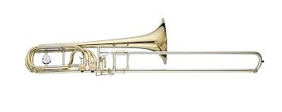
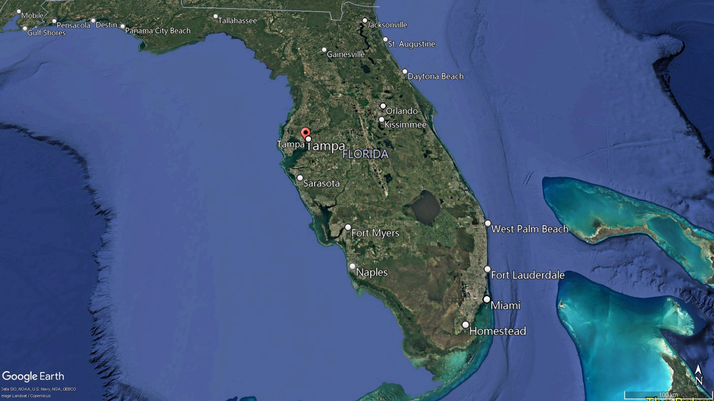
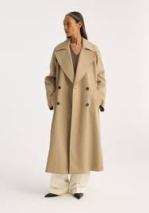

= 2025.03 Republicans Desperately Spin (v.（使）快速旋转；（使）急转身) Yemen Group Chat Fumble (n.笨拙的手部动作，乱摸；失球，漏接球；笨拙的处理)
:toc: left
:toclevels: 3
:sectnums:
:stylesheet: ../../../myAdocCss.css

'''

== 释义

Republicans *Desperately Spin* (v.（使）快速旋转；（使）急转身) Yemen Group Chat *Fumble* (n.笨拙的手部动作，乱摸；失球，漏接球；笨拙的处理)

[.my2]
共和党人拼命扭转也门群聊混乱局面

[.my1]
.title
====
.fumble -> 拟声词，模仿笨拙的声音。比较 bumble, stumble.
====

Ronnie Chang:​​ Welcome to The Daily Show 每日秀! I'm Ronnie Chang. We've got so much to talk about tonight, so #let's *get right into*# 直接进入,立即开始做某事 today's top story 头条新闻.

I know you goddamn (a.)该死的；讨厌的；受诅咒的 hippies 该死的嬉皮士 like to blame (v.) Donald Trump 唐纳德·特朗普 for everything wrong in the country, but hey —not everything that happens is his fault 都是他的错. He has a whole administration 整个行政团队 that can *fuck up* 搞砸 for him. So let's find out the latest in our new segment 新板块: ​​"The Worst Wing (翅膀,（组织或政党的）派系)最差团队."​​

[Graphic: "THE WORST WING" with eagle crying 哭泣的鹰] +

What a bunch of...

[Music: Sad trombone  (长号，伸缩喇叭) 悲伤长号声] +
...losers 失败者.

[.my1]
.title
====
.trombone

====

By now, we all know the story 我们都知道这个故事 about how Trump's team *included* a reporter 记者 *in* their war-planning 战争策划 group chat 群聊. And we don't need to hear it again —but it is super funny, so let's hear about it again!

​​News Clip:​​
"This morning, fallout (n.)后续影响,后果，余波 from that stunning (a.) lapse (过失，小失误) 惊人失误 in national security 国家安全: Secretary of Defense 国防部长 Pete Heth, along with other top members of President Trump's _national security team_ 国家安全团队, *shared (v.) details about* a planned large-scale attack 大规模袭击 on Yemen 也门 earlier this month... on the commercial 商业的 messaging app 即时通讯应用 Signal 加密通讯软件Signal... inadvertently 无意中；不经意地 including journalist Jeffrey Goldberg on that chain 对话链. #Heth shared (v.) operational details 作战细节 of# forthcoming (a.)即将发生的 strikes 即将实施的打击, weapons deploying 武器部署, and attack sequencing 攻击顺序. Goldberg also reported that, #*when it comes to* 就……而言,涉及,当提到,一谈到 security#, #Heth wrote (v.) at one point# 一度;在某一时刻;在某处: 'We are currently clean on OPSEC 行动安全无懈可击'—that's the acronym 首字母缩写 used (v.) for _operational security_ 行动安全,操作安全."

[.my1]
.title
====
- inadvertently -> in-,不，非，advertent，注意的，留意的。
====

​​Ronnie:​​ Oh-ho-ho! You think that's funny, don't you? That the stupid _secretary of defense_  国防部长，国防部秘书 is *so* stupid and drunk (a.)醉醺醺 *that* 如此...以致... he texted "#We're clean (a.)动作熟练而准确的；干净利落的 on# OPSEC 操作安全（=Operational Security）" when there's a reporter (n.) right in the group chat?

[.my1]
.title
====
.clean
done in a skilful and accurate way 动作熟练而准确的；干净利落的 +
• The plane *made a clean take-off*. 飞机起飞得干净利落。

.OPSEC
操作安全（Operational Security）：一种风险管理流程，旨在保护敏感信息，防止对手获取关键信息，从而保护军事、政府或商业行动的安全。
====

Well, *laugh it up* 尽管笑吧, people —because unlike you, I have human empathy 人类同理心 for these people who are just *trying their best* to kill other humans, all right? And *I guarantee 保证 that* if anyone in this audience *had* their _group chats_ 群聊 *leaked* 群聊泄露, it would ruin (v.) every single one of your lives.

I personally have chats (n.) 后定 that are actually 实际上，事实上 more sensitive 更敏感 than a missile attack 导弹袭击 on the Houthis 胡塞武装. Okay? If you told me _my group chats leaked (v.)_, and then told me _it was just my missile-attack one_, I'd be like, "Oh my God, thank God! Thank GOD."

And by the way —#it wasn't even# 它甚至都不是 Pete Heth who added him! It was some other incompetent 无能力的，不称职的 guy 无能的家伙 at the highest levels of government 政府高层. Okay? Like, what —you think `宾` Heth *has* _the editor of The Atlantic_ 大西洋月刊编辑 *saved* in his phone? No way. All right? If Heth *autofilled* (v.)自动填充 a contact 联络人，熟人 *into* a group chat, #it would be like#... "_Tampa Bay_ 美国佛罗里达州的一个大型海湾 Blonde 金发的,金发女郎  (_Bugs Bunny_ Tattoo 兔八哥纹身)."

[.my1]
.title
====
.Tampa Bay

====

But still, #you gotta 必须，不得不 ask#: #How did this happen?# I mean, #don't you guys have# _tech support_ 技术支持 in the government? I mean, what—

[Cut to: _Empty office chair_ *labeled* "DOD 美国国防部（=Department of Defense of the United States） IT Dept. 国防部IT部门"] +

Oh.
Oh.
Okay.

Well, if you ask me, `主` adding a reporter `系` wasn't even the most embarrassing thing 最尴尬的事 to happen on this group chat. According to Goldberg, the administration officials 政府官员 *reacted* after the strikes *with*: "Excellent 极好的，卓越的. #A good start# 好的开始." Heth even sent several... emojis 表情符号.

Is anyone else *kind of upset (v.)恼火,使心烦意乱，使生气；打乱，搅乱 that* we're conducting (v.) war 发动战争 by emoji now? I mean —#what does this even mean# 这到底是什么意思?

[Graphic: Flag emoji 国旗表情 + fist emoji 拳头表情 + fire emoji 火焰表情] +

Am I going *to fist `表` 用拳头打；握成拳 the flag* /and then *light (v.（使）燃烧，点燃 it on fire* 点燃它?

There's a reason you don't use (v.) emojis for life-and-death situations 生死攸关的情况 —#it's too open to interpretation# (理解；解释；说明) 容易产生歧义. Okay? Like, imagine (v.) if your doctor texted (v.) you a crab emoji 螃蟹表情.

#And now you're going:# "Oh my God, I have CRABS 性病/螃蟹?" +
#And your doctor has to be like:# "LOL 大声笑（=Laugh Out Loud） no —it's the astrology (n.)占星术；占星学；星座 sign 星座符号 for Cancer 巨蟹座. Okay? You have CANCER 癌症."

But now, *everyone's yelling (v.)叫喊 at them about* this "breach 违反，破坏 of national security 国家安全漏洞" or whatever, and the Department of Defense 国防部 *is having trouble* 遇到困难,有麻烦 defending themselves 难以保护自己. Luckily, all of MAGA (Make America Great Again 让美国再次伟大) is there to help them.

​​MAGA Defender Clip:​​
"Counter-argument 反驳观点 one: #Nobody's perfect!# Well, a mistake —you know, #we make mistakes.# We all *make mistakes*. Somebody made a mistake, and it happens. Yeah, look, it's a mistake, #and we gotta 必须，不得不 move on# 翻篇. Well, it was a mistake —like I said before, it was a mistake. Everyone makes mistakes."

​​Ronnie:​​ "#Is that sufficient accountability (责任，责任心，可说明性) 足够的问责 for you?# *To recognize that* `宾`  someone made a mistake and move on?"
I gave you _the sound 声音 bite_ 新闻片段,短小精悍的话语或片段 already. I gave you _the sound bite_ already, Boris! I gave you the sound bite —#stop asking (v.) follow-up questions# 后续问题! If I wanted to talk to a journalist, I'd be on _a private group chat_ with Pete Heth.

Okay, *#cut it out#* 停止，别再做了;够了. Like, come on —we're just calling this a mistake now? _My DoorDasher 外卖员 forgetting straws_ 吸管 is a mistake —that can *be rectified (v.)调整；矫正;补救 with* one star and no tip (小费) 一星评价不加小费. Okay? But this *feels like* a major fuckup 重大失误—and they're acting like nobody will *care about* this.

And honestly 坦率地说? They're probably right. I mean, #nothing seems *to matter (v.) anymore* anyway# 无论如何，一切似乎都不再重要了. *Everyone'll forget this* in a few days when Trump sends (v.) the new Snow White 新版白雪公主 to Guantanamo 关塔那摩监狱.

And even if they didn't accidentally add a journalist into this group chat —#they weren't supposed  本来就不该# *to be talking about* this stuff *on* Signal *in the first place* (首先，最初) 他们一开始就不应该在Signal上谈论这些东西. Okay? Signal might be a good app for you and me /and our local drug dealer 本地毒贩, but it's not for the Pentagon 五角大楼 to plan (v.) wars on.

​​Politico Clip 修剪；电影的剪截片段:​​
"One former White House official 前白宫官员 told Politico: 'Their personal phones 个人手机 are all hackable (a.)可被黑客入侵, and #it's highly likely  非常有可能 that# foreign _intelligence services_ 外国情报机构 are sitting on their phones, watching them type (v.) the whole time.'"

​​Ronnie:​​ That's right —foreign adversaries 外国对手 could be watching _whatever Pete Heth types (v.) into his phone_. Like:
"Bar  酒吧；吧台 near me" +
"How to fool (v.) breathalyzer (n.体内酒量测定器) 骗过酒精测试仪" +
"How to uncrash car 车子怎么修" +
But #if you're not satisfied with# "It was just a mistake," they have another defense （法庭上的）辩护，答辩: +

​​MAGA Defender Clip:​​
"#The bigger takeaway (外卖食品；外卖餐馆；要点) 更重要启示 for me is# —#it's an insight# 洞见. _A transparent （过程、活动或组织）透明的，公开的；明显的，一目了然的 insight_ 洞悉，了解；洞察力 into _the thought process 思维过程 and dialogue_ of our national leaders. If you read the content of these messages, I think you'll come away 离开 伴随状 *proud (a.)感到自豪 that* these are the leaders making these decisions in America. What you did see, though, I think, was top-level officials 高层官员 doing their job, doing it well, and executing (v.) on a plan *with... precision* 精准度."

​​Ronnie:​​ Precision? I mean —*even* your texts *weren't hitting* (v.) the intended targets 预定目标, right? Like, forget (v.) the Houthis 胡塞（也门的一个反叛武装组织，Houthi 的复数） —*I'm surprised* they didn't accidentally 意外地，偶然地； 意外失误地 blow up 炸错 Hootie & the Blowfish (河豚) 乐队名.

[.my2]
精度?我是说，就连你发的短信都没有达到预期目标，对吧？比如，忘了胡西斯吧，我很惊讶他们没有不小心炸掉胡蒂和河豚鱼。

This is like if your sex tape 性爱录像 leaked (v.), and you're like: "Hey, I'm glad you saw (v.) all of it. Okay? This proves (v.) my dick works."
(By the way, Mike Johnson—if you're watching —a sex tape is when two people love (v.) each other very much, but they also want to masturbate 手淫,自慰 later.)

[.my1]
.title
====
- masturbate -> 可能来自PIE*mazdo,阴茎，杆，词源同mast,-turb,转，词源同turbid,turn. 或来自拉丁语manus,手，词源同manual.
====

Just to summarize (v.) 总结: +
The Trump administration admitted this happened. +
But it was a small mistake. +
And it was a good thing that happened. +
But also, what if 如果...会怎么样 the reporter *made* the whole thing *up* 编造? +

​​Trump Clip:​​ +
"Not a good reporter —Jeffrey Goldberg from The Atlantic 大西洋月刊. One of the biggest _hoax (n.)恶作剧，骗局；谎报 artists_ 骗术大师 around 在周围/在这一带(指"在当前新闻界/媒体圈内"). *Happened to know* the guy's a total schmuck 蠢货; （非正式）笨人，傻瓜. The Atlantic —a failed 失败的；难以为继的 magazine, *does very, very poorly* 糟糕地；不如意；不足. You're talking about _a deceitful 欺诈的 and highly discredited 声名狼藉的 so-called 所谓的 journalist_ who's made a profession 职业 of *peddling (v.)（挨家挨户）兜售；贩卖（非法毒品） hoaxes* 贩卖谎言 time and time again 反反复复、一次又一次、再三地. This is the guy *that peddles (v.) garbage* 贩卖垃圾."

[.my2]
不是个好记者，《大西洋月刊》的杰弗里·戈德堡。最大的恶作剧艺术家之一。碰巧知道那家伙是个十足的笨蛋。《大西洋》是一本失败的杂志，表现非常非常差。你说的是一个骗子，一个声名狼藉的所谓记者他一次又一次地以兜售骗局为职业。这就是那个叫卖垃圾的家伙。

[.my1]
.title
====
.hoax
-> 词源不确定，可能来自拉丁语jocus,笑话，词源同joke.引申词义嘲笑，骗局，欺骗。

.One of the biggest hoax artists around.
这里的"around"是英语中常见的口语化用法，主要有以下两层含义： +
字面意思："在周围/在这一带" +
指"在当前新闻界/媒体圈内"（within the journalism/media circles） +
类似中文说"圈内最会造谣的人之一"

- *one of the worst* politicians *around*（政坛最差政客之一）

.schmuck
-> 英语单词schmuck, 是口语中用来骂人的一个单词，**常常被委婉地翻译为“笨蛋”，其实它是一个非常粗俗的单词，更直白的翻译是“傻屌”。**这个词来自东意第绪语shmok，**字面意思就是 penis（阴茎），是一句骂人的脏话。**意第绪语是中东欧犹太人所操的一门源自高地德语的语言。**在犹太人心目中，schmuck一词是如此的粗俗，以至于被视为禁忌。**歌手Lenny Bruce就曾经因为在舞台上说过这个单词而被犹太警察逮捕。**因为这个词过于粗俗，人们往往用单词 schmoe (愚人，笨蛋) 来代替它。在国外与人争执时，可不要轻易使用这个单词**哟。 schmuck：[ʃmʌk] n.笨蛋，傻屌 schmoe：[ʃməu] n.笨蛋
====

​​Ronnie:​​ Right—so this reporter, who is dishonest and sucks (v.)（表示厌恶）臭，恶心,吮吸；吸；咂；啜 is also correct —and also, we added him to our group chat because _he's a fun hang_ 好玩的人.

[.my1]
.title
====
.suck
sth sucks [ V] : ( slang) used to say that sth is very bad （表示厌恶）臭，恶心 +
• Their new CD sucks (v.).他们新出的唱片可恶心了。

.he's a fun hang.
在这句话中，"fun hang" 是一个口语化的表达，可以拆解为：
1.​​Hang​​ 在这里是名词，源自短语 **hang out（一起出去玩/相处）。**意思是「相处时的状态」或「一起消磨时间的体验」。 +
类似用法：He's a cool guy, but not a great hang.（他人不错，但相处起来不太有趣。）

2.​​*Fun hang​​ 整体意思是「相处起来很有趣的人」*，强调这个记者虽然职业上不靠谱（dishonest and sucks），但私下社交时能带来轻松愉快的氛围，所以被拉进了群聊。
相当于中文的「玩得来」「一起玩很开心」「是个好玩伴」。

​​对比其他用法​​： +
- Hang 作动词时更常见（如 Let's hang out），但作名词表示「社交体验」在年轻群体中很流行，尤其在美国口语中。 +
- 类似表达还有 good vibe（氛围好）、chill person（随和有趣的人）。

所以这句话的潜台词是：「虽然这记者专业上不行，但人好玩，所以我们还是拉他进群了。」
====

I mean, you can't use "It was a mistake" and "It was fake news 假新闻." You gotta pick one, okay? You gotta get together and *figure it out* 统一口径,理解，解决问题. (But not in a group chat. No more group chats.)

[.my1]
.title
====
不能一边说“我们搞错了”，又说“这是假新闻”。你要么承认做了，要么否认有这回事，两种说法互相矛盾。
====

But you know what? #*All's well* that ends (v.) well# 结局好就一切都好,皆大欢喜的结局. The good news is that no one got hurt —except for the people of Yemen. And I guess it'll be okay *as long as* everyone involved learned (v.) their lesson 吸取教训.

[.my1]
.title
====
.❝The good news is no one got hurt—except for the people of Yemen.❞
表面是“没有人受伤”，但其实“也就也门人民受伤”。
====

​​Reporter:​​ "Peter, ask a question —and I don't know if you know the answer —are they ever going to use Signal again for something like this?"

​​Official:​​ "It seems like... yes, they will."

​​Ronnie:​​ Okay. Good enough 够好了. Okay. Good enough. Yep. Good. Good. Good. We solved it 问题解决.

Of course, everyone's wondering *what this scandal means* (v.) for America's national security 国家安全 under Donald Trump. But there's another important question: *What does it mean* for journalism 新闻业?

And the answer is —something that's going to make a great movie.

​​Dramatic Voiceover  画外音，解说者的声音:​​
"Last time, the president *broke into* 闯入 Watergate 水门事件. This time... he's going to steal (v.) the whole damn hotel 偷走整座酒店."

[.my1]
.title
====
水门事件（Watergate Scandal）发生在1972年，尼克松总统的竞选团队派人潜入民主党总部偷资料。 +
那个总部就设在**“Watergate Hotel & Office Complex”——华盛顿的一个真实存在的大楼**，里面包括：
办公楼,
酒店（Watergate Hotel）,
公寓.  +
所以当时**“闯入水门”**实际上是闯入那栋大楼里的一间办公室，而不是酒店房间。

“steal the whole damn hotel”听起来像是特朗普真的要去偷一家酒店，但其实它是个比喻式的夸张说法（hyperbole），是对“水门事件”的幽默升级版。 +
“上次总统只是潜入水门大厦，这次……他要整个酒店一起偷走！”
====

​​Ronnie:​​ My God—I can't believe it!

​​Voiceover:​​ "#It's not about what you believe 这与你相信什么无关. It's about the truth# 真相."

​​Ronnie:​​ (Little intense 小紧张.) Reporting this story will take all the skills you have. All right —I'm gonna *hit the streets* 走上街头,外出寻找某物,或为特定目的而外出, *work (v.) the phones* 打电话联系, *meet (v.) sources*  来源，出处 at underground parking garages 地下停车场见线人—

​​Reporter 2:​​ Oh, wait—the president just added me to a group chat. I have the whole thing right here.

​​Ronnie:​​ What? No—that's too easy! I —#I got you this whole disguise# (伪装物，伪装,伪装道具) ;我给你弄了这么多伪装!

​​Reporter 2:​​ Yeah, I don't need it. It's all here. Break-in (n.)闯入；非法进入 plans 闯入计划, _cover-up (n.)掩饰；隐蔽 payments_ 封口费—

​​Ronnie:​​ Whoa, what?

​​Reporter 2:​​ —a lot of dick pics 丁丁照.

​​Ronnie:​​ But we have a source in a _trench coat_ (（军装式带口袋和系带的）雨衣，大衣) 但我们有个穿风衣的线人!

[.my1]
.title
====
.trench coat
a long loose coat, worn especially to keep off rain, with a belt and pockets in the style of a military coat（军装式带口袋和系带的）雨衣，大衣;战壕风衣

====

​​Reporter 2:​​ "Follow the money 跟着钱查"? Yeah, we don't need to —they posted (v.)贴出；通告 the checks 支票照片.

[.my1]
.title
====
“Follow the money” 是水门事件调查名言，意思是追踪金流找真相。
这里讽刺：现在不用查了，他们自己发了支票照片。
====

​​Ronnie:​​ Wow. Lot of dick pics.

​​Reporter 2:​​ This doesn't make sense. Why would they just add you to—

​​Ronnie:​​ Oh, they added me too.

​​Reporter 2:​​ After we steal the hotel, let's bomb [Iran flag emoji] +, then we all [rain/spurt 喷射，喷出 emoji] +.

​​Ronnie:​​ Do we even have to write the story 我们还需要写故事吗?

​​Reporter 2:​​ I think we can just *put out* 发布（新闻、声明等） the screenshots 截图发出去.

[.my1]
.title
====
调侃新闻专业越来越像“截图搬运工”, 以前调查需要花月时间，现在：“他们自己发出来了。”
====

​​Ronnie:​​ That doesn't really sound (v.) like work 那听起来不太像是工作.

[.my1]
.title
====
自我吐槽记者似乎都可以无需主动工作了，因为“蠢人自己爆料”。
====

​​Reporter 2:​​ Maybe if you *put on* 穿上 the disguise (伪装物，伪装) 也许你可以伪装一下?

​​Ronnie:​​ This is better. Drinks?

​​Reporter 2:​​ Yeah. It's a lot of dicks.

[.my1]
.title
====
❝Drinks? — Yeah. It’s a lot of dicks.❞ +
笑点：
记者们觉得报道没挑战性，决定去喝酒了。看够了 dicks.

====

[Applause 掌声] +
[Music out 音乐淡出] +

'''

== 中文翻译

[开场] +
罗尼·常：欢迎收看《每日秀》！我是罗尼·常。今晚话题劲爆，让我们直击今日头条。

**我知道你们这些该死的嬉皮士, 喜欢把国家问题都怪到特朗普头上，但听着——不是所有坏事都是他的错。他有一整个团队帮他搞砸呢！**现在进入新板块"最差团队"。

[画面：哭泣的鹰图标配字"最差团队"] +
看看这群... +
[音效：悲伤长号声] +
...废物。 +

现在大家都知道了，特朗普团队把记者拉进了"战争策划群聊"。虽然不必重复——但实在太好笑了，就再讲一次吧！

[新闻片段] +
"今晨曝出国家安全重大疏漏：国防部长皮特·赫斯, 与特朗普国家安全团队高层，本月早前在加密通讯软件Signal上讨论对也门大规模袭击计划时...误将记者杰弗里·戈德堡, 拉入群聊。赫斯分享了作战细节，包括即将实施的打击、武器部署和攻击顺序。戈德堡还报道，赫斯在谈及安全时写道：'目前行动安全无懈可击(OPSEC)'——这是'行动安全'的缩写。"

罗尼：哦吼！你们觉得很好笑是吧？蠢醉的国防部长在记者潜伏的群里, 发"行动安全无懈可击"？

尽管笑吧——因为和你们不同，我对这些努力杀人的家伙, 怀有人类同理心好吗？*我敢保证，要是现场观众任何人的群聊泄露，你们全得"社会性死亡"。*

**我有些群聊, 比特朗普打击胡塞武装的导弹计划还敏感。**要是听说群聊泄露，结果只是导弹计划那个，我绝对谢天谢地！

顺便说——还不是赫斯拉的人！是政府高层另一个饭桶干的。*你们觉得赫斯手机里会存《大西洋月刊》编辑？要是他自动填充联系人，肯定是"坦帕湾金发妞（兔八哥纹身）"这种。*

但还是要问：怎么发生的？政府没有技术支持吗？ +
[镜头切到标着"国防部IT部门"的空办公椅] +
哦。
哦。
好吧。

要我说，拉记者进群, 还不是最尴尬的。据戈德堡报道，官员们在空袭后回复："漂亮。好的开始。"赫斯甚至发了好几个...表情符号。

没人对用表情符号打仗, 感到恼火吗？这组表情啥意思？ +
[画面：国旗+拳头+火焰] +
我要拳打国旗, 再点火焚烧？

*生死攸关时, 不用表情符号是有原因的——太容易歧义了。想象医生给你发个螃蟹表情会怎样？*

此刻你肯定在想："天啊我得性病了？"
医生只能解释："笑死，是巨蟹座符号啦！你得了癌症。"

现在所有人都在指责"国家安全漏洞"，国防部百口莫辩。幸好有MAGA群众护驾： +
"*反驳观点一：人非圣贤！这就是个失误——谁都会犯错，翻篇吧。*"

罗尼："#*承认错误就算问责了？*#"
"新闻片段都给你了鲍里斯！别追问了！真想和记者聊, 我会找赫斯私聊。"

**得了吧，#管这叫"失误"？#**外卖员忘给吸管算失误——打个一星不付小费就能解决。但**#这分明是重大事故，他们却装得若无其事。#**

说实话他们没错——反正几天后, 特朗普把新版白雪公主关进关塔那摩，谁还记得这事？

**就算没误拉记者进群——他们本就不该用Signal谈公务。**这软件适合普通人甚至毒贩，但五角大楼打仗策划？

政客网报道："*前白宫官员称, 他们的私人手机都能被黑客入侵，外国情报机构可能全程监控。*"

没错——外国对手可能正看着赫斯输入："附近酒吧" "如何骗酒精测试", "车子怎么修"。

若你觉得"只是失误"不够，他们还有第二套说辞：
"更重要的是, 这展现了国家领导人的思维过程，看完你会为这些决策者自豪——高层官员精准执行了计划。"

**精准？连短信都能发错目标，**没炸错Hootie乐队算走运！
就像性爱录像泄露后说："很高兴你们看到，这证明我老二管用。"
（迈克·约翰逊议员，性爱录像就是两个人相爱，顺便给观众提供素材。）

总结一下：
特朗普团队承认此事+
但只是小失误+
而且这是好事+
或者根本是记者编的+
特朗普原话："《大西洋月刊》的戈德堡是最恶劣的骗子，这本垃圾杂志..."

*所以这个又坏又蠢的记者，既说了实话，又被你们拉群因为好玩？*
"失误"和"假新闻"只能选一个好吗？（但别再群聊讨论了）

不过结局好就一切都好——除了也门百姓，只要涉事者吸取教训就行。

记者："他们会再用Signal聊这些吗？" +
官员："貌似...会的。" +
罗尼："行吧，够好了，问题解决。" +
 +
大家都在问这事对特朗普治下国家安全的影响。但更重要的问题是：对新闻业意味着什么？
答案将是——一部精彩电影。

[电影预告片旁白] +
"上次总统闯入水门大厦，这次...他要偷走整座酒店！" +
罗尼："天！难以置信！" +
旁白："无关信仰，只关真相。" +

罗尼："调查需要全力以赴——上街走访、电话联络、停车场秘密接头..." +
记者2："等等，总统刚拉我进群聊，证据全在这。" +
罗尼："什么？我这伪装道具白准备了！" +
记者2："闯入计划、封口费..." +
罗尼："哇哦？" +
记者2："...还有一堆丁丁照。" +
罗尼："可我们有穿风衣的线人！" +
记者2："'跟着钱查'？不用了——他们自拍支票。" +
罗尼："丁丁照真多啊..." +
记者2："他们为啥随便拉人..." +
罗尼："哦我也被拉进来了。" +
记者2："偷完酒店就炸[伊朗国旗表情] +，然后集体[喷水表情] 。" +
罗尼："这还需要写报道吗？" +
记者2："直接发截图吧。" +
罗尼："听起来不像干活。" +
记者2："要不你穿上伪装？" +
罗尼："还是喝酒吧。" +
记者2："好，丁丁照看吐了。" +

[掌声] +
[音乐淡出] +

'''

== pure

Ronnie Chang:​​ Welcome to The Daily Show! I'm Ronnie Chang. We've got so much to talk about tonight, so let's get right into today's top story.

I know you goddamn hippies like to blame Donald Trump for everything wrong in the country, but hey—not everything that happens is his fault. He has a whole administration that can fuck up for him. So let's find out the latest in our new segment: ​​"The Worst Wing."​​

[Graphic: "THE WORST WING" with eagle crying] +

What a bunch of...

[Music: Sad trombone] +

...losers.

By now, we all know the story about how Trump's team included a reporter in their war-planning group chat. And we don't need to hear it again—but it is super funny, so let's hear about it again!

​​News Clip:​​
"This morning, fallout from that stunning lapse in national security: Secretary of Defense Pete Heth, along with other top members of President Trump's national security team, shared details about a planned large-scale attack on Yemen earlier this month... on the commercial messaging app Signal... inadvertently including journalist Jeffrey Goldberg on that chain. Heth shared operational details of forthcoming strikes, weapons deploying, and attack sequencing. Goldberg also reported that, when it comes to security, Heth wrote at one point: 'We are currently clean on OPSEC'—that's the acronym used for operational security."

​​Ronnie:​​ Oh-ho-ho! You think that's funny, don't you? That the stupid secretary of defense is so stupid and drunk that he texted "We’re clean on OPSEC" when there's a reporter right in the group chat?

Well, laugh it up, people—because unlike you, I have human empathy for these people who are just trying their best to kill other humans, all right? And I guarantee that if anyone in this audience had their group chats leaked, it would ruin every single one of your lives.

I personally have chats that are actually more sensitive than a missile attack on the Houthis. Okay? If you told me my group chats leaked, and then told me it was just my missile-attack one, I'd be like, "Oh my God, thank God! Thank GOD."

And by the way—it wasn’t even Pete Heth who added him! It was some other incompetent guy at the highest levels of government. Okay? Like, what—you think Heth has the editor of The Atlantic saved in his phone? No way. All right? If Heth autofilled a contact into a group chat, it would be like... "Tampa Bay Blonde (Bugs Bunny Tattoo)."

But still, you gotta ask: How did this happen? I mean, don’t you guys have tech support in the government? I mean, what—

[Cut to: Empty office chair labeled "DOD IT Dept."] +

Oh.

Oh.

Okay.

Well, if you ask me, adding a reporter wasn’t even the most embarrassing thing to happen on this group chat. According to Goldberg, the administration officials reacted after the strikes with: "Excellent. A good start." Heth even sent several... emojis.

Is anyone else kind of upset that we’re conducting war by emoji now? I mean—what does this even mean?

[Graphic: Flag emoji + fist emoji + fire emoji] +

Am I going to fist the flag and then light it on fire?

There’s a reason you don’t use emojis for life-and-death situations—it’s too open to interpretation. Okay? Like, imagine if your doctor texted you a crab emoji.

[Graphic: Crab emoji] +

And now you’re going: "Oh my God, I have CRABS?"

And your doctor has to be like: "LOL no—it’s the astrology sign for Cancer. Okay? You have CANCER."

But now, everyone’s yelling at them about this "breach of national security" or whatever, and the Department of Defense is having trouble defending themselves. Luckily, all of MAGA is there to help them.

​​MAGA Defender Clip:​​
"Counter-argument one: Nobody’s perfect! Well, a mistake—you know, we make mistakes. We all make mistakes. Somebody made a mistake, and it happens. Yeah, look, it’s a mistake, and we gotta move on. Well, it was a mistake—like I said before, it was a mistake. Everyone makes mistakes."

​​Ronnie:​​ "Is that sufficient accountability for you? To recognize that someone made a mistake and move on?"

I gave you the sound bite already. I gave you the sound bite already, Boris! I gave you the sound bite—stop asking follow-up questions! If I wanted to talk to a journalist, I’d be on a private group chat with Pete Heth.

Okay, cut it out. Like, come on—we’re just calling this a mistake now? My DoorDasher forgetting straws is a mistake—that can be rectified with one star and no tip. Okay? But this feels like a major fuckup—and they’re acting like nobody will care about this.

And honestly? They’re probably right. I mean, nothing seems to matter anymore anyway. Everyone’ll forget this in a few days when Trump sends the new Snow White to Guantanamo.

And even if they didn’t accidentally add a journalist into this group chat—they weren’t supposed to be talking about this stuff on Signal in the first place. Okay? Signal might be a good app for you and me and our local drug dealer, but it’s not for the Pentagon to plan wars on.

​​Politico Clip:​​
"One former White House official told Politico: 'Their personal phones are all hackable, and it’s highly likely that foreign intelligence services are sitting on their phones, watching them type the whole time.'"

​​Ronnie:​​ That’s right—foreign adversaries could be watching whatever Pete Heth types into his phone. Like:

"Bar near me" +
"How to fool breathalyzer" +
"How to uncrash car" +
But if you’re not satisfied with "It was just a mistake," they have another defense: +

​​MAGA Defender Clip:​​
"The bigger takeaway for me is—it’s an insight. A transparent insight into the thought process and dialogue of our national leaders. If you read the content of these messages, I think you’ll come away proud that these are the leaders making these decisions in America. What you did see, though, I think, was top-level officials doing their job, doing it well, and executing on a plan with... precision."

​​Ronnie:​​ Precision? I mean—even your texts weren’t hitting the intended targets, right? Like, forget the Houthis—I’m surprised they didn’t accidentally blow up Hootie & the Blowfish.

This is like if your sex tape leaked, and you’re like: "Hey, I’m glad you saw all of it. Okay? This proves my dick works."

(By the way, Mike Johnson—if you’re watching—a sex tape is when two people love each other very much, but they also want to masturbate later.)

Just to summarize:

The Trump administration admitted this happened. +
But it was a small mistake. +
And it was a good thing that happened. +
But also, what if the reporter made the whole thing up? +
​​Trump Clip:​​ +
"Not a good reporter—Jeffrey Goldberg from The Atlantic. One of the biggest hoax artists around. Happened to know the guy’s a total schmuck. The Atlantic—a failed magazine, does very, very poorly. You’re talking about a deceitful and highly discredited so-called journalist who’s made a profession of peddling hoaxes time and time again. This is the guy that peddles garbage."

​​Ronnie:​​ Right—so this reporter, who is dishonest and sucks, is also correct—and also, we added him to our group chat because he’s a fun hang.

I mean, you can’t use "It was a mistake" and "It was fake news." You gotta pick one, okay? You gotta get together and figure it out. (But not in a group chat. No more group chats.)

But you know what? All’s well that ends well. The good news is that no one got hurt—except for the people of Yemen. And I guess it’ll be okay as long as everyone involved learned their lesson.

​​Reporter:​​ "Peter, ask a question—and I don’t know if you know the answer—are they ever going to use Signal again for something like this?"

​​Official:​​ "It seems like... yes, they will."

​​Ronnie:​​ Okay. Good enough. Okay. Good enough. Yep. Good. Good. Good. We solved it.

Of course, everyone’s wondering what this scandal means for America’s national security under Donald Trump. But there’s another important question: What does it mean for journalism?

And the answer is—something that’s going to make a great movie.

​​Dramatic Voiceover:​​
"Last time, the president broke into Watergate. This time... he’s going to steal the whole damn hotel."

​​Ronnie:​​ My God—I can’t believe it!

​​Voiceover:​​ "It’s not about what you believe. It’s about the truth."

​​Ronnie:​​ (Little intense.) Reporting this story will take all the skills you have. All right—I’m gonna hit the streets, work the phones, meet sources at underground parking garages—

​​Reporter 2:​​ Oh, wait—the president just added me to a group chat. I have the whole thing right here.

​​Ronnie:​​ What? No—that’s too easy! I—I got you this whole disguise!

​​Reporter 2:​​ Yeah, I don’t need it. It’s all here. Break-in plans, cover-up payments—

​​Ronnie:​​ Whoa, what?

​​Reporter 2:​​ —a lot of dick pics.

​​Ronnie:​​ But we have a source in a trench coat!

​​Reporter 2:​​ "Follow the money"? Yeah, we don’t need to—they posted the checks.

​​Ronnie:​​ Wow. Lot of dick pics.

​​Reporter 2:​​ This doesn’t make sense. Why would they just add you to—

​​Ronnie:​​ Oh, they added me too.

​​Reporter 2:​​ After we steal the hotel, let’s bomb [Iran flag emoji] +, then we all [rain/spurt emoji] +.

​​Ronnie:​​ Do we even have to write the story?

​​Reporter 2:​​ I think we can just put out the screenshots.

​​Ronnie:​​ That doesn’t really sound like work.

​​Reporter 2:​​ Maybe if you put on the disguise?

​​Ronnie:​​ This is better. Drinks?

​​Reporter 2:​​ Yeah. It’s a lot of dicks.

[Applause] +

[Music out] +