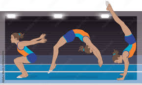
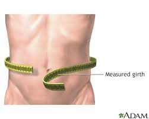
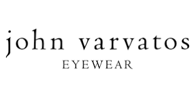
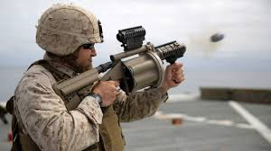

= 2025.04.04 Trump’s Tariffs Send Markets Plunging and Penguins Waddling to a Trade War
:toc: left
:toclevels: 3
:sectnums:
:stylesheet: ../../../myAdocCss.css

'''

== 释义

Yesterday​​, Donald Trump announced​​ 宣布 sweeping​​ (a.)全面的；彻底的 tariffs​​ 关税 across​​ 遍及 the entire globe​​ 全球 — Asia​​ 亚洲, South America​​ 南美洲, Narnia​​ 纳尼亚（虚构国度）, Arendelle​​ 阿伦黛尔（《冰雪奇缘》王国）, Wakanda​​ 瓦坎达（《黑豹》虚构国家）, Bachelor Nation​​ 单身汉国度（真人秀粉丝群体）.

#If you can imagine​​ 想象 it#, Trump slapped (v.)猛击；随意施加;侮辱；拍击；掴……耳光 a tariff on it.

And today the reviews​​ 评价；反响 came in. Carnage​​ (n.)大屠杀；惨败 on Wall Street. Markets​​ 市场 falling, tumbling​​ 暴跌;摔倒；（使）跌倒；跌跌撞撞地走. +
ANCHOR: Stocks​​ 股票 *plunging​​ (v.)（使）突然前冲（或下落）;暴跌 down*, down, down. The NASDAQ​​ 纳斯达克（美国科技股指数） is getting crushed​​ 碾压. Small caps​​ 小盘股 are getting crushed 被压垮. This is a shock​​ 冲击 to the system​​ 系统.

[.my1]
.案例
====
.tumbling​​

====

ANCHOR: It is ugly​​ 糟糕的 out there, #*worse than* worst-case (a.)作最坏打算的；最糟情况的 scenario#​(设想，可能发生的情况)​ 最坏情况. Stocks are getting slashed​​ 砍削 and burned​​ 烧毁. $2.5 trillion​​ 万亿 vaporized​​ 蒸发；化为乌有.

$2.5 trillion vaporized (v.) — your kid's _college fund_​​ 大学基金 disintegrated​​ (v.)瓦解；使碎裂, your 401(k)​​ 美国养老金计划 *given the death penalty*​​ 死刑, your pension​​ 退休金 waterboarded​​ (v.)水刑（酷刑） in Guantanamo​​ 关塔那摩（美军监狱）, `主` those stocks your nana​​ 奶奶 gave you 20 years ago `谓` accidentally​​ 意外地 stepped (v.) on a landmine​​ (地雷)踩到地雷了 while vacationing​​ (v.)度假 in Vietnam​​ 越南.

​​Economists​​ 经济学家 say we could be *on the verge​​ 边缘 of* a recession​​ 经济衰退. So #things are looking scary​​ 可怕的 right# now. But don't worry​​ 担心. `主` #The only thing# the president​​ 总统 #is better at# *than* negotiating​​ 谈判 `系` is speaking _soothing​​(a.)安抚的 words_ of comfort​​ 安慰 in times of need​​ 危机.

We have heard (v.) from President Trump. He took to Truth Social​​ （特朗普的社交平台）, wrote this: "The operation​手术 is over. The patient 病人 lived (v.) and is healing​​ (v.)康复. #The prognosis （对病情的）预断，预后;预测；预言；展望 is that# the patient will be far stronger​​ 更强壮的, bigger​​ 更庞大的, better​​ 更好的 and more resilient​​ (a.)有韧性的;（人或动物）对困境有承受力的，有复原力的 than ever before."

[.my1]
.案例
====
.prognosis
来自pro-,向前，提前，-gn,知道，词源同 know,cognizant.-osis,状态后缀。引申词义预断，预测。
====

Boy, I feel so much better now. You know, always reassuring​​ (a.)令人安心的 when the surgeon​​ 外科医生 comes out *screaming​​ (v.)尖叫 at the top of his lungs*​​ (肺)扯着嗓子；用尽全力地；大声地, "The patient is fine! Everything is going great! Does anybody have a mop​​ 拖把?"

#The thing is# 问题是,最重要的是, the patient didn't need major surgery​​ 大手术. #We just needed# a teeth cleaning​​ 洗牙. Keep it clean and shiny​​ 闪亮的. No one wants *to wake up* from heart surgery​​ 心脏手术 *to* 「伴随着某种状态/动作」​​ 或 ​​「在某种情况下」 their dental hygienist​​ 牙科保健员 后定 shouting, "I think he's going to live!"

[.my1]
.案例
====
.No one wants to wake up from heart surgery​​  *to* their dental hygienist​​ shouting, "I think he’s going to live!"
"to"​​ 在这里表示 ​​「伴随着某种状态/动作」​​ 或 ​​「在某种情况下」​​，可以灵活翻译为以下几种方式：

[.my3]
[options="autowidth" cols="1a,1a"]
|===
|Header 1 |Header 2

|"to" ≈ "听到"（隐含「面对、遭遇」）​
|"没人想在心脏手术后醒来，听到牙医大喊‘我觉得他能活！’"
（强调「醒来时伴随的声音」）

|"to" ≈ 「结果、却」​​（突显荒谬反差）
|"结果发现是牙医在喊……"​​ / ​​"却听到牙医喊……"​

|​​"to" ≈ 「对着」​​（指向动作对象）
|"没人想刚做完心脏手术，就对着牙医听她喊‘他能活！’"
（较少用，但语法可行）

|完全省略
|中文常省略介词，直接用副词连接：
"谁会在心脏手术后醒来，牙医却在喊‘他能活！’"

英文原句逻辑​​：
"wake up ​​*to​​ [someone doing something]*" = 醒来时**「面临/听到」某个场景。**
*"to" 在这里类似 ​​"and find/hear"​​（非方向性介词）。* +
​​中文习惯​​：
中文较少用介词直译这种伴随状态，更多用「结果」「却」「听到」等词汇衔接。

又例:
- He opened the door to his dog barking. +
直译：他打开门，​​听到​​他的狗在叫。 +
意译：他一开门，​​结果​​狗就叫了起来。 +
（同理，"to" 翻译需根据语境灵活处理。）
|===

讽刺目标： 特朗普将关税政策（洗牙级小调整）吹嘘成“拯救经济的大手术”（心脏手术），实际却让民众承受更大风险。
====

Also, the patient is going to be bigger? Was the surgery _a penis enhancement_​​ 阴茎增大术? If so, what kind? Was it _latex 乳胶；乳液 injections_​​ 乳胶注射, scrotoplasty​​ 阴囊成形术, _ligament  韧带；纽带，系带 extension_​​ 韧带延长, _ventral 腹侧的；[解剖] 腹部的  phalloplasty_​​ 腹侧阴茎成形术, a _fat transfer_​​ 脂肪移植 to enhance​​ (v.)增强 girth​​ 周长；围长;围度? I mean, I think those are the options​​ 选项. I don't know.

[.my1]
.案例
====
.girth +
a man of enormous girth 腰围很粗的男人 +
-> 来自gird, 围， 绕。

.Scrotoplasty
阴囊成形术 ，也称为骨成形术 ，是一种制造或修复阴囊的手术。如今，睾丸植入物, 由盐水或凝胶填充的硅橡胶制成。
====

Now, look, you could argue​​ 争辩 that *it's bad* that my retired​​ 退休的 78-year-old mom *is polishing (v.)磨光；擦亮；修正 up*​​ 润色 her resume​​ 简历 now. But to Donald Trump, #it's all worth it#​​ 值得的 because we're correcting​​ 纠正 a grave (a.)严峻的，严重的 injustice​​ 严重不公.

ANCHOR: President Trump says the higher penalties​​ 惩罚性措施 come *in response​​ 回应 to* tariffs that those countries impose​​ (v.)征收 on American products​​ 产品 they import​​ 进口. Reciprocal​​ 互惠的. That means, they do it to us, and we do it to them — very simple​​ 简单的.

Yeah, #it's very simple /*in that* 因为；由于；就在于 it is simply not true# 这很简单，因为它根本不是真的。. All right, the reality​​ 现实 — #the reality is that# the numbers​​ 数字 on his board​​ 公告板 are not the tariffs 后定 other countries are charging​​ 收取 us. They're actually — #they actually represent#​​ (v.)代表 the _trade deficit_​​(亏损，赤字，不足额) 贸易逆差 between the US and those countries, meaning (v.) we buy​​ (v.)购买 more stuff​​ 东西 from them *than* they buy from us.

#I'm just going to repeat​​ 重复 this# 我再重复一遍。. Those numbers don't represent the tariffs. They represent (v.) that we buy more stuff from them *than* they buy from us. That means we're basically​​ 基本上 punishing​​ (v.)惩罚 other countries for selling​​ (v.)卖 us stuff that we want.

This is like me 后定 going to John Varvatos​​ （美国男装奢侈品牌） and *beating the shit out of​​ 把他揍出屎来,痛打 him* because I like his socks​​ 袜子. "#Why don't you ever buy# my socks 你为什么从来不买我的袜子, John Varvatos?" I don't make​​ 生产 any socks, #but that's no excuse#​​ (借口) 但这不是借口.

[.my1]
.案例
====
.这里面的 This is like me going to John Varvatos  中的 me, 是不是应该是 写成 I ?

其实这涉及英语语法中一个常见的混淆点——​​代词格的选择​​（主格 ​​I​​ vs. 宾格 ​​me​​）。在这个句子中：

原句分析：​​
​​"This is like [me going to John Varvatos]..."​​
（这就像[我去找John Varvatos]...）

[.my3]
[options="autowidth" cols="1a,1a"]
|===
|Header 1 |Header 2

|1.为什么用 "me" 是正确的？​
|- "me" 是介词 "like" 的宾语​​：
短语 ​​"like me"​​ 中，*"like" 是介词，后接宾格代词（me/him/her/us/them）。* +
类似例子： +
"This is like him singing." （√ 正确） +
"This is like he singing." （× 错误） +

- ​​*"going to John Varvatos" 是现在分词短语, 修饰 "me"*​​： +
整个结构是：​​介词（like） + 宾语（me） + 分词短语（going...）​​ +
类似结构：
"I saw him running." （√  "him" 是宾语，"running" 修饰宾语）

|2.如果用 "I" 会怎样？​​
|- 语法错误： +
"This is like I going to John Varvatos..." +
*"I" 是主格代词，不能直接接动词-ing形式（除非是现在进行时，但这里缺少助动词 "am"）。* +
正确的主格结构需补全动词： +
"This is like I am going to John Varvatos..." （语法正确，但会改变原句的简洁性和幽默节奏） +

|3.口语中的语言风格：​
|**口语中更倾向用 ​​"me + -ing"​​ 的松散结构（非正式但自然），**而正式写作中可能会改用完整从句： +
"This is like when I go to John Varvatos..."
|===

.John Varvatos
John Varvatos (born 1954) is an American menswear designer. He has worked for both Ralph Lauren and Calvin Klein, and started his own label in 1999. +
约翰·瓦维托斯 (John Varvatos，1954 年出生) 是一位美国男装设计师。  他曾为 Ralph Lauren 和 Calvin Klein 工作，并于 1999 年创立了自己的品牌 。

.笑点
[.my3]
[options="autowidth" cols="1a,1a"]
|===
|Header 1 |Header 2

|讽刺特朗普关税政策的​​不合理性​​。
|*这就像我(美国)跑去John Varvatos（奢侈品牌, 比喻中国）暴打他一顿(美国用高关税)，因为我(美国)喜欢他的袜子(中国的产品)。* +
→ 逻辑矛盾：喜欢别人的产品，却用暴力惩罚对方。 +
特朗普对其他国家加关税的逻辑类似——美国喜欢买外国商品（如中国制造），却反过来惩罚这些国家"卖太多东西给我们"。

​特朗普逻辑​​：A国卖太多好东西给B国 → A国占便宜 → 惩罚A国。 +
→ 就像"你做的饭太好吃，害我吃太多变胖，所以我要揍你"。

|Why don't you ever buy my socks? 你(中国)为什么不买我(美国)的袜子？
|但说话者(美国)自己根本不生产袜子 "I (美国) don't make any socks"。 +
美国抱怨贸易逆差，但有些商品（如廉价日用品）美国自己早已不生产。

|"but that's no excuse"（"但这不能当借口"）
|明明自己理亏，却用耍无赖的语气强行甩锅。

|beating the shit out of him
|用极端暴力（"暴打"）比喻来施加高关税
|===

====

#But that's really what's going on# 但事实就是这样. #It's not actually about# 它实际上并不是关于 tariffs. It's about other countries not buying enough of our stuff. Although _Howard Lutnick_​（商务部长的人名）, commerce secretary​​ 商务部长 and cologne sponge​(海绵块)​人形古龙水海绵, #had another way to put it# 以另一個方式来表達:

[.my1]
.案例
====
.to put it another way
put 其實跟「放」無關，這裡的意思是「表達、表述、說」，所以就能推測出片語的意思是「以另一個方式表達、換句話說」囉！跟 in other words 算是同義字. +

to put it differently / put differently 換句話說 : +
- He never cares about others—or *to put it differently*, he’s self-centered.
他從來不在乎別人－－或者換句話說，他很以自我為中心。
====

"I mean, the European Union​​ 欧盟 won't take chicken​​ 鸡肉 from America. They won't take lobsters​​ 龙虾 from America. They hate​​ 讨厌 our beef​​ 牛肉, because our beef is beautiful​​ 美丽的, and theirs is weak​​ 虚弱的. #It's unbelievable#​​ 难以置信的. We can't sell (v.) corn​​ 玉米 to India​​ 印度. We can't sell rice​​ 大米 to Asia​​ 亚洲."

Yeah, yeah. #Although I'm not sure# tariffs are the reason​虽然我不确定关税是原因 we can't sell rice to Asia. I think they *figured​​* (v.)弄明白 rice *out* about 10,000 years ago. Now, if they want to add a roni​​ （俚语：毒品）, well, then, let us know. #We got that figured out#​​ 解决,我们已经想通了，想明白了，处理完毕，指出了, mm-mm-mm.

[.my1]
.案例
====
特朗普政府曾抱怨美国农产品（如大米）难以出口到亚洲。

谐音梗：「roni」的双关​. ​​"roni"​​ 是 ​​"macaroni"​​（通心粉）的简写，但也是毒品俚语（如"mariajuana"的谐音）。 +
潜台词​​：
大米亚洲人自己会种，但如果是「加料通心粉」（暗指毒品），美国可以帮忙。

自嘲式收尾​​:
"We got that figured out."
我们可以搞定「roni」
====

By the way, Europe's beef is weak. I'm sure that's not true. #They famously​​ 著名地 have# a _running (v.) from the beef​​ 奔牛节 event_ where the beef tramples​​ (v.)践踏 people.

[.my1]
.案例
====
笑点：特朗普曾说欧洲牛肉"weak"（劣质），但欧洲有「奔牛节」（San Fermín），牛追着人跑，证明其牛肉强壮。
====

But you know what? #I'm not too concerned​​ (a.)担心的 about# Donald Trump not understanding​​ 理解 how his tariffs work (v.), because he's Donald Trump. He doesn't understand how to _make money_​​ 赚钱 running​​ (v.)经营 a casino​​ 赌场.

The important​​ 重要的 thing is that there are adults in the room​​ 房间里的成年人（指理性决策者）, like Scott Bessent​​ （财政部长）, treasury secretary​​ 财政部长 and college dean​(院长，教务长；主任牧师)​ 大学院长, who understands "#the boys will be boys#​​ 男孩子就是這様;男人總歸是男人（为错误找借口）." That guy is going to have the answers​​ 答案 we need.

[.my1]
.案例
====
.boys will be boys
said to emphasize that *people should not be surprised when boys or men act (v.) in a rough or noisy way* because this is part of the male character
男孩子就是這様;男人總歸是男人
====

"#What do you expect#​​ 预期 the stock market #to look like# /when it opens​​ (v.)开市 tomorrow *in reaction​​ 反应 to* this?" +
"I don't know." +
"Should we view​(v.) these as permanent​​ 永久的?" +
"That again, I think #we're going to wait and see​​   how this *plays out*#​​ 发展，演变." +
"#Do you plan​​ (v.)计划 on# hav##ing## negotiations before that date​​ ?" +
"I just don't know if there are going to be negotiations." +
"​​Canada​​  and Mexico​​   notably​​ 显著地 missing​​ (v.)缺失 on that chart​​ 图表, why is that?" +
"I'm not sure." +

[.my1]
.案例
====
.plan​​
(v.)**~ (on sth/on doing sth)** : to intend or expect to do sth 打算；期待
[ V]
•We *hadn't planned on* go**ing** anywhere this evening. 我们今晚没打算外出。

====

I have a question. Do you know anything? #Why are you out here# doing interviews​​ 采访? #It's not very reassuring (a.)使人安心的，使人放心的 *to have*# the _treasury secretary_ of the United States *going* 让美国财政部长离开可不是件让人放心的事, [MUTTERS] 嘟囔.

You know what? Maybe #they can't give us clarification#​​ 澄清，阐明；净化 because there isn't clarification. #We just assume#​​ 假设 they have a good reason for imploding​​ (v.)内爆;向心聚爆；（组织或系统）突然崩溃 the economy . Because #why else would you# implode (v.) the economy 不然你为什么要破坏经济呢?

But then you uncover​​ 揭露 something like this, and you realize​​ , I'm not sure they even know what they're doing.

ANCHOR: Every country on the list​​   faces (v.) at least 10% tariffs, even small, remote​​ 偏远的 places like the Heard and McDonald Islands​​ 赫德岛和麦克唐纳群岛. They are near Antarctica​​ 南极洲 and covered​​ 覆盖 in glaciers​​ 冰川, home to many penguins​​ 企鹅, but no people.

Yeah, yeah. We put a 10% tariff on an island that only has penguins. Trump would have been *better off* 处于更好的境地，尤指经济上;处境更好,更明智的选择 tariffing​​ (v.)对…加关税 that island Tom Hanks​​ 汤姆·汉克斯 got stranded​​ (v.)搁浅,滞留 on. At least it had one guy and that little volleyball​​ 排球 he was [BLEEP] 哔——（原词：fucking）.

[.my1]
.案例
====
.be *better off* doing sth​​ = 做某事会更明智/更有利
better off"​​ 表示 ​​「处境更好」​​ 或 ​​「更明智的选择」​​，常接动词-ing形式或从句。 +
​​*"be better off"​​ = 处于更好的状态* +
​​*"be better off + doing"​​ = 做某事会更有利* +
类似「还不如……呢」或「……反而更好」，表达「另一种选择更合理」的吐槽语气。 +
- You'd be better off taking the train.（你坐火车会更明智。）

*否定形式​​：​​"worse off"​​（处境更糟）* +
- If he keeps spending money, #he'll be worse off#.（如果他继续花钱，情况会更糟。）
====

Is this a mistake? Look, I know old people butt-dial​​ (v.)不小心用屁股拨打电话,屁股误拨 strangers 陌生人 all the time, but #this is the first time I've heard of# someone butt-tariffing​​ (v.)屁股误征 an entire country.

*For more* on these tariffs, #let's go live​​ 直播 to# that uninhabited​​ 无人居住的 penguin island with Grace Kuhlenschmidt​​ （记者名）. Grace, thank you. Grace, hold on. Wait. Grace, hold on. Why are you dressed​​ (v.)穿着 like a penguin?

Because I'm a serious journalist​​ 严肃的记者, Michael. #I wanted to embed​​(v.)嵌入 myself with the locals#​​ 当地人 to get the real story. And that's why I disguised​​ 伪装 myself as a penguin /and learned​ their culture​ /and #made it with​​ 与…发生关系 the hottest​​ 最性感的 one#.

MICHAEL: Hottest one? But every penguin looks the same.
No, they don't all *look alike*​​ 相似, Jordan Klepper.
Wait. OK, #point taken (v.)#​​ 我明白了，我接受你的观点;有道理.

But, Grace, I'm sure your reporting (n.) has shown that `主` putting tariffs on the penguins `系` is ridiculous​​ 荒谬的. +
Well, #at first, I#, too, #thought (v.) that# `主` Trump putting tariffs on this uninhabited island `系` was a sign​​ 迹象 that he had suffered​​ (v.)遭受 brain damage​​ 脑损伤.

But after spending​​ 度过 a week here in negative 11 degrees​​ 零下11度 and drinking (v.) lots of seawater​​ 海水, I totally see #where he's coming from#. The penguins *are taking total advantage​​ 完全占便宜 of* America.

We buy (v.) all their skins​​ 皮毛 to make tuxedos​​ 燕尾服. But have they ever bought any fish from us? +
OK, why would they buy fish from us? They're on an island surrounded​​ (v.)被围绕 by fish. +
Yeah, but our fish comes (v.) in stick 枯枝，枝条；条状物，棍状物 form​​ (条状)但是我们的鱼是棒状的. My grandfather was a fish-stickerman​​ 鱼条工人. And these penguins are the reason he lost his job​​ 失业. Also #he got me tude#​​ （俚语：attitude，态度） 他让我有了这种态度".

[.my1]
.案例
====
.he got me tude
​​"tude"​​ 自带街头/叛逆色彩（如 "Don't give me that tude!" = 「别跟我甩脸子！」），用在这里夸张化「怨气」。

"tude" 的用法​​：
多用于指责他人态度差，比如：
"She's got a serious tude." = 「她脾气臭得很。」
====

MICHAEL: Oh my god. +
Plus, America makes a lot of other things 后定 penguins don't buy — soybeans​​ 大豆,黄豆, natural gas​​ 天然气, grenade 手榴弹；灭火弹 launchers​​ 榴弹发射器. +
OK, look, penguins #don't need any of that stuff#. +
Oh, why? Because they're too stupid​​ 愚蠢的. +
No, because they don't have thumbs​​ 拇指. +

[.my1]
.案例
====
.grenade launcher +
榴弹发射器是一种可以把特制榴弹或手榴弹, 发射得比用手抛掷更远、更精确、更快速发射的枪械。榴弹发射器可以是一件单独成型的武器，亦可以是一款附加在步枪上的武器。

====

Well, they don't have thumbs while they're fucking me either, but they're doing that perfectly fine​​ 但他们做得很好,完全没问题. +
OK, OK, Grace. OK. I think you've been in that suit​​ 服装 too long. Why don't you just come home?

​​Kosta​​ （人名）, I have _a family​​ 家庭 of penguins_ to look after. I'm a mother​​ 母亲 now, and — oops, they just got eaten​​ 被吃 by a seal​​ 海豹. I'll be home tomorrow. +
MICHAEL: Well, Grace Kuhlenschmidt, everybody.

'''

== 中文翻译

昨天，唐纳德·特朗普宣布对全球实施全面关税——亚洲、南美洲、纳尼亚、阿伦黛尔、瓦坎达、单身汉国度。只要你能想到的地方，特朗普都加了关税。

今天评价来了：华尔街一片惨烈。市场暴跌，一泻千里。 +
主播：股价跌跌不休。纳斯达克被碾压，小盘股被碾压，这是对系统的冲击。 +
主播：场面难看至极，比最坏情况还糟。股票被砍得七零八落，2.5万亿美元蒸发。 +

*2.5万亿美元蒸发——你孩子的大学基金灰飞烟灭，你的401(k)养老金被判死刑，你的退休金在关塔那摩受水刑，你奶奶20年前给你的股票在越南度假时踩了地雷。*

经济学家说我们可能濒临衰退。现在形势吓人，但别担心。*总统最擅长的不是谈判，而是在危机时用安慰话术糊弄人。*

特朗普在Truth Social上写道：“手术结束了，病人活下来了且在康复。预后显示病人会比以往更强大、更庞大、更优秀、更有韧性。”
哇，我现在感觉好多了。想想看，外科医生冲出来扯着嗓子喊“病人没事！一切顺利！谁有拖把？”时多让人安心啊。

**问题是病人本来不需要大手术，只是洗个牙而已。**谁想在心脏手术后醒来听到牙医大喊“我觉得他能活！”？
而且病人会“更庞大”？这手术是阴茎增大术吗？如果是，哪种？注射填充、阴囊整形、韧带延长、腹侧阴茎成形，还是脂肪移植增粗？选项就这些吧，我也不懂。

你可以说我78岁退休老妈现在改简历很惨，但对特朗普来说，这一切值得，因为我们在“纠正严重不公”。
主播：特朗普称, 加税是对"这些国家对美国进口产品征税"的回应。“互惠的，他们对我们做，我们就对他们做，很简单。”

是啊，简单到根本是假的。*现实是, 他展示的数字, 并非是别国对我们的关税，而是美国与这些国家的贸易逆差*——我们买他们的东西比他们买我们的多。

这就像我因为喜欢约翰·瓦瓦托斯的袜子而暴打他：“你为什么不买我的袜子？”虽然我根本不产袜子，但这不重要。

真正原因是, 别国不买够我们的东西。但商务部长霍华德·卢特尼克（人形古龙水海绵）是这么说的：
“欧盟不要美国的鸡和龙虾，他们恨我们的牛肉，因为我们的牛肉‘太美’，他们的‘太弱’。我们连大米都卖不到亚洲！”

是啊，但关税大概不是卖不动大米的主因。亚洲人一万年前就搞明白水稻了。要是他们想加个“roni”（俚语：毒品），我们倒能帮忙。

说欧洲牛肉“弱”也不对，他们明明有“奔牛节”，牛追着人跑。*但特朗普不懂关税很正常，他连赌场怎么赚钱都搞不明白。*

**好在房间里有“成年人”，**比如财政部长斯科特·贝森特（兼大学院长，深谙“男孩总归是男孩”之道），他会有答案。 +
记者问：“明天股市会怎样？” +
贝森特：“不知道。” +
“这些关税是永久的吗？” +
“观望吧。” +
“会和加拿大、墨西哥谈判吗？” +
“不确定。” +

**我有个问题：您到底知道什么？**财政部长的采访像在嘟囔，还不如不说。可能他们自己也不清楚为什么搞垮经济。

主播：连南极附近的赫德岛和麦克唐纳群岛（只有企鹅无人）都被加税10%。
给企鹅岛加税？不如对汤姆·汉克斯漂流的那座岛加税，至少还有个人和排球[哔——]。这是手滑吗？老年人会误拨电话，但误征一国关税倒是头回见。

记者格蕾丝·库伦施密特扮成企鹅潜入报道： +
“起初我也觉得对无人岛加税是特朗普"脑损伤"。但喝了一周海水后，我悟了——*企鹅在占美国便宜！我们(美国)买它们(企鹅)的皮做西装，它们(企鹅)却不买我们(美国)的鱼！*” +
“它们住在鱼堆里为啥要买？” +
“我们的鱼是条状的！我爷爷是鱼条工人，企鹅害他失业！” +
“企鹅不需要大豆、天然气或榴弹发射器。” +
“因为它们没拇指？那它们[哔——]我时也没拇指，不照样行？” +
最后她的企鹅“家人”被海豹吃了，她宣布：“我明天回来。” +

'''

== pure

Yesterday, Donald Trump announced sweeping tariffs across the entire globe—Asia, South America, Narnia, Arendelle, Wakanda, Bachelor Nation. If you can imagine it, Trump slapped a tariff on it.

And today the reviews came in. Carnage on Wall Street. Markets falling, tumbling.
ANCHOR: Stocks plunging down, down, down. The NASDAQ is getting crushed. Small caps are getting crushed. This is a shock to the system.
ANCHOR: It is ugly out there, worse than worst-case scenario. Stocks are getting slashed and burned. $2.5 trillion vaporized.

$2.5 trillion vaporized—your kid's college fund disintegrated, your 401(k) given the death penalty, your pension waterboarded in Guantanamo, those stocks your nana gave you 20 years ago accidentally stepped on a landmine while vacationing in Vietnam.

Economists say we could be on the verge of a recession. So things are looking scary right now. But don't worry. The only thing the president is better at than negotiating is speaking soothing words of comfort in times of need.

We have heard from President Trump. He took to Truth Social, wrote this: "The operation is over. The patient lived and is healing. The prognosis is that the patient will be far stronger, bigger, better, and more resilient than ever before."

Boy, I feel so much better now. You know, always reassuring when the surgeon comes out screaming at the top of his lungs, "The patient is fine! Everything is going great! Does anybody have a mop?"

The thing is, the patient didn't need major surgery. We just needed a teeth cleaning. Keep it clean and shiny. No one wants to wake up from heart surgery to their dental hygienist shouting, "I think he's going to live!"

Also, the patient is going to be bigger? Was the surgery a penis enhancement? If so, what kind? Was it latex injections, scrotoplasty, ligament extension, ventral phalloplasty, a fat transfer to enhance girth? I mean, I think those are the options. I don't know.

Now, look, you could argue that it's bad that my retired 78-year-old mom is polishing up her resume now. But to Donald Trump, it's all worth it because we're correcting a grave injustice.
ANCHOR: President Trump says the higher penalties come in response to tariffs that those countries impose on American products they import. Reciprocal. That means they do it to us, and we do it to them—very simple.

Yeah, it's very simple in that it is simply not true. All right, the reality is that the numbers on his board are not the tariffs other countries are charging us. They actually represent the trade deficit between the US and those countries, meaning we buy more stuff from them than they buy from us.

I'm just going to repeat this. Those numbers don't represent the tariffs. They represent that we buy more stuff from them than they buy from us. That means we're basically punishing other countries for selling us stuff that we want.

This is like me going to John Varvatos and beating the shit out of him because I like his socks. "Why don't you ever buy my socks, John Varvatos?" I don't make any socks, but that's no excuse.

But that's really what's going on. It's not actually about tariffs. It's about other countries not buying enough of our stuff. Although Howard Lutnick, commerce secretary and cologne sponge, had another way to put it:

"I mean, the European Union won't take chicken from America. They won't take lobsters from America. They hate our beef, because our beef is beautiful, and theirs is weak. It's unbelievable. We can't sell corn to India. We can't sell rice to Asia."

Yeah, yeah. Although I'm not sure tariffs are the reason we can't sell rice to Asia. I think they figured rice out about 10,000 years ago. Now, if they want to add a roni, well, then, let us know. We got that figured out.

By the way, Europe's beef is weak. I'm sure that's not true. They famously have a running from the beef event where the beef tramples people.

But you know what? I'm not too concerned about Donald Trump not understanding how his tariffs work, because he's Donald Trump. He doesn't understand how to make money running a casino.

The important thing is that there are adults in the room, like Scott Bessent, treasury secretary and college dean, who understands "the boys will be boys." That guy is going to have the answers we need.

"What do you expect the stock market to look like when it opens tomorrow in reaction to this?"
"I don't know."
"Should we view these as permanent?"
"That again, I think we're going to wait and see how this plays out."
"Do you plan on having negotiations before that date?"
"I just don't know if there are going to be negotiations."
"Canada and Mexico notably missing on that chart—why is that?"
"I'm not sure."

I have a question. Do you know anything? Why are you out here doing interviews? It's not very reassuring to have the treasury secretary of the United States going, [MUTTERS].

You know what? Maybe they can't give us clarification because there isn't clarification. We just assume they have a good reason for imploding the economy. Because why else would you implode the economy?

But then you uncover something like this, and you realize, I'm not sure they even know what they're doing.
ANCHOR: Every country on the list faces at least 10% tariffs, even small, remote places like the Heard and McDonald Islands. They are near Antarctica and covered in glaciers, home to many penguins, but no people.

Yeah, yeah. We put a 10% tariff on an island that only has penguins. Trump would have been better off tariffing that island Tom Hanks got stranded on. At least it had one guy and that little volleyball he was [BLEEP].

Is this a mistake? Look, I know old people butt-dial strangers all the time, but this is the first time I've heard of someone butt-tariffing an entire country.

For more on these tariffs, let's go live to that uninhabited penguin island with Grace Kuhlenschmidt. Grace, thank you. Grace, hold on. Wait. Grace, hold on. Why are you dressed like a penguin?

Because I'm a serious journalist, Michael. I wanted to embed myself with the locals to get the real story. And that's why I disguised myself as a penguin and learned their culture and made it with the hottest one.

MICHAEL: Hottest one? But every penguin looks the same.
No, they don't all look alike, Jordan Klepper.
Wait. OK, point taken.

But, Grace, I'm sure your reporting has shown that putting tariffs on the penguins is ridiculous.
Well, at first, I, too, thought that Trump putting tariffs on this uninhabited island was a sign that he had suffered brain damage.

But after spending a week here in negative 11 degrees and drinking lots of seawater, I totally see where he's coming from. The penguins are taking total advantage of America.

We buy all their skins to make tuxedos. But have they ever bought any fish from us?
OK, why would they buy fish from us? They're on an island surrounded by fish.
Yeah, but our fish comes in stick form. My grandfather was a fish-stickerman. And these penguins are the reason he lost his job. Also, he got me tude.

MICHAEL: Oh my god.
Plus, America makes a lot of other things penguins don't buy—soybeans, natural gas, grenade launchers.
OK, look, penguins don't need any of that stuff.
Oh, why? Because they're too stupid.
No, because they don't have thumbs.

Well, they don't have thumbs while they're [BLEEP] me either, but they're doing that perfectly fine.
OK, OK, Grace. OK. I think you've been in that suit too long. Why don't you just come home?

Kosta, I have a family of penguins to look after. I'm a mother now, and—oops, they just got eaten by a seal. I'll be home tomorrow.
MICHAEL: Well, Grace Kuhlenschmidt, everybody.

'''

