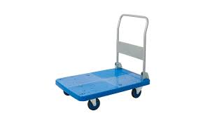
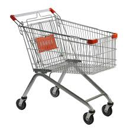
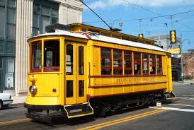
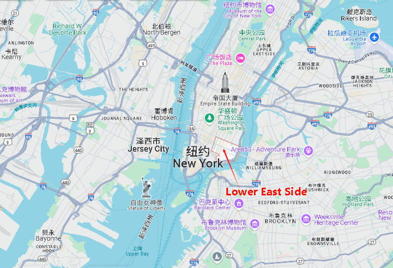
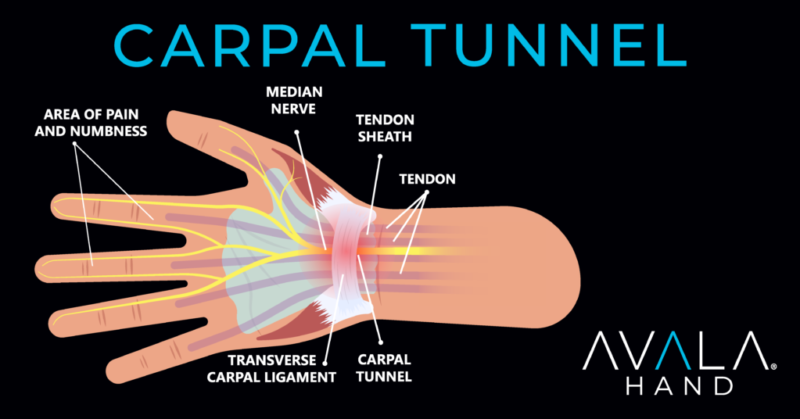
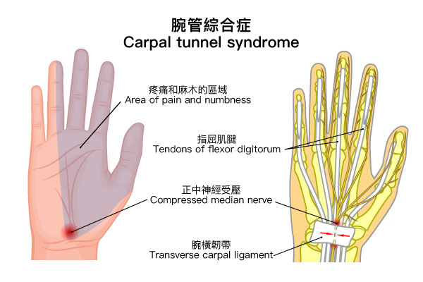
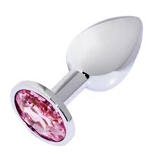
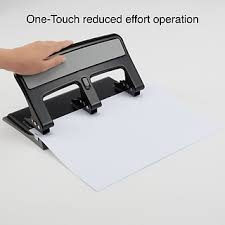

= 2025.04.09 Trump Threatens 104% China Tariffs, Fox News Ignores Market, Musk & Navarro Spar
:toc: left
:toclevels: 3
:sectnums:
:stylesheet: ../../../myAdocCss.css

'''

== 释义

Welcome to the Daily Show, I'm Desi Leid. #We've got so much to talk about# tonight. America imports (v.) a beef <非正式>抱怨，牢骚 with China, people are getting frisky 活泼的；欢闹的 with statues 雕像, and Fox News sees the stock market #and goes# 然后说道, 'Hey, #look over there# 看那边.' So #let's *kick things off* 开始，着手进行 *with*# another installment (报刊上连载故事的) 一集; 一部分;分期付款的一期 of Trade Wars.

[.my1]
.案例
====
- “America imports a beef with China” (美国和中国有矛盾)：这里的 “beef” 是一个俚语，指“争执，不满”。用进口（import）这个词来形容国家间的矛盾，将严肃的政治经济问题戏谑化，暗示两国关系就像进口商品一样平常但令人不快。
- “Fox News sees the stock market and goes 'Hey look over there.'" (福克斯新闻看到股市就说‘嘿，看那边’)：这是对福克斯新闻（一个以保守派观点为主的美国新闻频道）的讽刺。暗示当出现对他们支持的政治人物或政策不利的经济新闻（如股市下跌）时，该媒体会试图转移观众的注意力到其他话题上。
====

#My favorite (a.) word#, my favorite word: tariffs 关税.

It's been one week since Donald Trump announced his bold 大胆的；英勇的 vision 构想；设想 for destroying the economy, #and guess what# 猜猜发生了什么? #His plan is working.# After another chaotic 混乱的 day on Wall Street, America's CEOs are sounding the alarm 拉响警报. `主` Most CEOs I talked to `谓` would say #we are probably in a recession# 衰退；不景气 right now. A new CNBC survey 民意调查 shows those concerns 担心；关心的事 are widespread, with 69% of CEOs expecting (v.) a recession and 82% expecting (v.) resurgent 复活的；复兴的 inflation 通货膨胀. #This is a snapshot 快照；简况 of# the Dow since President Trump's inauguration 就职；就职典礼. After *dropping more than 15%* since its record high 在自历史高点下跌超过15%之后, #putting it into# _correction 修正；调整 territory_ 领域；范围.

I'm not an economist, but it's probably a bad sign when the chart 图表，曲线图 itself *looks (v.) like* it jumped off the roof. Look at that drop! Six Flags 六旗乐园 is going to make a _roller coaster_ 过山车;杯托，小托盘；雪橇 of that. Mom, I want to ride the Dow Jones. #We can't afford it# 但我们买不起它. So the economy is incredibly 难以置信地；非常 unstable 不稳定的 right now. #The only upside 好处；有利方面 is that# this crash is much easier to understand than the 2008 one. Remember 'The Big Short 大空头,大卖空' where they had to have _Margot Robbie_ explain (v.) it in a bathtub? #Here's how that would go today#: Trump did it. Thanks, Margot. Thank you. So the president may have single-handedly 独力地; 单独地 tipped (v.)使倾斜；使翻倒 us into a global recession, and with so much uncertainty, the world is glued to the financial news networks, who are surely *focusing on* this story 24/7  一直不休（地），无时无刻（地）（指一天24小时一周7天不间断，读作 twenty-four seven), right? Fox Business: 'The president welcomes the World Series champions, the Los Angeles Dodgers, to the White House. He was funny, he was entertaining 使有兴趣，使快乐.'

[.my1]
.案例
====
- 将经济衰退图表比作跳楼：“it's probably a bad sign when the chart itself looks like it jumped off the roof.” (当图表看起来像从屋顶跳下去时，这可能不是个好兆头)：用生动的比喻形容股市暴跌的图表，将抽象的经济数据转化为具体的、令人担忧的画面，增强了幽默感。

- Big Short 大空头：指在金融市场上押注某些资产价格下跌的投资行为，通常是指对房地产市场的押注。

- 用《大空头》的玛格特·罗比解释经济危机：“Remember 'The Big Short' where they had to have Margot Robbie explain it in a bathtub? Here's how that would go today: Trump did it.” (记得《大空头》里他们让玛格特·罗比在浴缸里解释经济危机吗？今天会是这样：特朗普干的。)：引用电影中用性感女明星在浴缸里解释复杂金融概念的桥段，来讽刺当前经济问题的直接原因与特朗普的政策相关。

- 讽刺福克斯新闻转移焦点：“the world is glued (v.) to the financial news networks, who are surely focusing on this story 24/7, right? Fox Business: 'The president welcomes the World Series champions, the Los Angeles Dodgers, to the White House. He was funny, he was entertaining.'" (全世界都在关注财经新闻，他们肯定24/7都在报道这个故事，对吧？福克斯商业频道：“总统欢迎世界大赛冠军洛杉矶道奇队来到白宫。他很有趣，很逗。”)：再次讽刺福克斯新闻回避严肃的经济问题，转而报道总统的轻松活动。
====

Yes, #that's definitely# the big story. The president made new friends 交了新朋友 today. So yes, economists are afraid that #we're headed into# a recession, but don't worry, things could still improve quickly *as long as* Trump de - escalates (v.)使逐步降级；使缓和 soon. President Trump escalates (v.)使升级；使扩大 his _trade war_ *with* more threats (n.) against China. President Trump is now promising a new 50% tariff on China *on top of* the other new tariffs, which are *on top of* existing tariffs. Combined, this would make US tariffs on _imports from China_ a whopping 巨大的；庞大的 104%.

104% tariffs? Okay, #this is getting really serious# 事情变得越来越严重了. #We'll know exactly# how serious /once we ask (v.) China to do the math for us. #But point is#, Trump is** out of control** right now. #I'd say# 我认为 he's like a bull in a China shop 他就像闯进瓷器店的公牛, but at 104%, #I can't afford to say that# 我可不敢这么说. #It's really starting to feel like# the entire world is teetering (v.)摇摇欲坠；蹒跚 on the brink 边缘 of chaos 混乱；无秩序. It's honestly impossible *to report (v.) on literally 按照字面意义地 anything else* right now 老实说，现在不可能报道其他任何事情, right? Fox News: 'A women's pool 落袋台球；弹子球 championship in the UK 后定 with no women in the final round /after two transgender (a.)跨性别的 players defeated (v.) their female opponents *to face off* 对峙，对抗 for the title 职位名称；称号；（竞赛、体育比赛的）冠军.'

[.my1]
.案例
====
- “I'd say he's like a bull in a China shop, but at 104%, I can't afford to say that.” (我想说, 他像闯入瓷器店的公牛，但在 104% 的关税下，我说不起这个。)：这是一个双关语。“bull in a China shop” 形容鲁莽闯祸的人，*这里又暗示在如此高的关税下，“China shop”（中国商店）里的东西太贵了，主持人“买不起”这个比喻。*

- 讽刺福克斯新闻报道英国女子台球比赛没有女性决赛选手：“Fox News: 'A women's pool championship in the UK with no women in the final round after two transgender players defeated their female opponents to face off for the title.' No, not the British women's pool tournament, that's America's favorite pastime.” (福克斯新闻：“英国女子台球锦标赛决赛没有女性选手，此前两名跨性别选手击败了她们的女性对手争夺冠军。” 不，不是英国女子台球比赛，那是美国人最喜欢的消遣。)：将一个相对次要的国际体育新闻, 与美国人“最喜欢的消遣”相提并论，*暗示福克斯新闻为了避免报道经济问题，不惜报道无关紧要的新闻.*

.teeter
[ V] to stand or move in an unsteady way /so that you look as if you are going to fall摇晃；蹒跚行走；踉跄；摇摇欲坠 +
-> 改写自中古英语 titter,摇摆，蹒跚，可能来自古诺斯语 titra,摇摆，摇晃，来自 Proto*ti-tra,摇 摆，摇晃，最终词源可能同 totter,toddle.

.pool
[ U]a game for two people played with 16 coloured balls on a table, often in pubs and bars. Players use cues (= long sticks) to try to hit the balls into pockets at the edge of the table.普尔；落袋台球；弹子球 +
• a pool table普尔球台

花式台球（英语：Pool），是台球运动的一种类型，使用有六个球袋的球桌，以击球入袋为主要目的。
====

No, not the British women's pool tournament 锦标赛；联赛，that's America's favorite pastime 消遣；娱乐.

But the tariffs *aren't* just *tearing apart* 撕裂 our economy and *tearing apart* America's trade with China, they're also *tearing apart* Donald Trump's friends. An internal battle over Trump's tariffs between top adviser 高级顾问 Peter Navarro and Elon Musk. This is a behind-the-scenes (a.)幕后的；秘密的 rivalry 竞争；对抗 that's now exploding (v.)爆炸；爆发 into public view between Elon Musk and Peter Navarro, two very different wings 翅膀 of the Trump administration.

Oh, I have to pick between Elon Musk and Peter Navarro? This is like the trolley 有轨电车；无轨电车 problem if the problem was that you only have one trolley.

[.my1]
.案例
====
.trolley
小推车，手推车，有轨电车 +
-> 可能来自 troll,旋转，滚动。

- “This is like the trolley problem if the problem was that you only have one trolley.” (这就像电车难题，如果问题是你只有一辆电车。)：用著名的伦理学思想实验, 来比喻需要在两个都不受欢迎的人物（Peter Navarro 和 Elon Musk）之间做出选择的困境.
====

#You know what# 你知道吗, #this is actually# a substantive 实质性的；重要的 debate 讨论，辩论. Elon likes (v.) free trade, Peter Navarro likes (v.) the tariffs. #Let's start with# Navarro's argument. Elon's a car manufacturer, but he's not a car manufacturer 生产商，制造商, he's a car assembler 装配工；装配厂. If you go to his Texas plant 工厂，发电厂, a good part 相当大一部分 of the engines that he gets, which in the EV case is the batteries 电池, come from Japan and come from China. The electronics 电子器件 come from Taiwan, and he wants the cheap foreign parts 便宜的外国零件, and we understand (v.) that, but we want them home. Okay, that's a compelling 令人信服的；引人注目的 point. Peter Navarro thinks Musk is taking advantage of 充分利用，利用 unfair trade policies *at the risk of* American prosperity 繁荣；成功. Elon, #what's your response# 反应，响应；（口头或书面的）回复，答复? Musk calling him a and *dumber (a.)愚蠢的 than* a sack  麻布（或厚纸、塑料等）大袋；一袋（的量） of bricks 马斯克称他为“比一袋砖头还蠢”。. There's the latest 这是最新的消息, calling him Peter Ricardo.

#Powerful counterpoint# 反驳；对立的观点. Powerful. God, I hope Elon Musk never *has to* defend himself in court 从不需要在法庭上为自己辩护. Ladies and gentlemen of the jury 陪审团, 'Gay, *#I rest my case#* 我的话讲完了,我的话就到此为止了.' #*Getting this glimpse 让我们一窥 into*# Trump's team of dum - dum rivals 对手 is even more disturbing 令人不安的，引起恐慌的. The president is sending the economy off a cliff 跌下悬崖, business leaders are furious (a.)狂怒的；激烈的，furious (a.) with him, his team *is tearing* each other *apart*, and the two biggest economies on the planet are entering a trade war. #It might be time# for the news organizations that supported him *to come to terms with* 迁就顺从；接受（令人不快的事物）；适应（困难的处境） why they supported him in the first place.

[.my1]
.案例
====
.COME TO ˈTERMS (WITH SB) +
to reach an agreement with sb; to find a way of living or working together（与某人）达成协议，妥协

.COME TO ˈTERMS WITH STH +
to accept sth unpleasant by learning to deal with it 迁就顺从；接受（令人不快的事物）；适应（困难的处境） +
•She is still *coming to terms with* her son's death. 她还没有完全从儿子死亡的阴影中走出来。

====

#What do you say# 你说呢,你有何意见,你觉得呢, Newsmax? 'This is a remarkable moment that has *come to light* 暴露；真相大白；众所周知 all over again. Back in 1992, Donald Trump threw a football 足球运动；橄榄球运动 through a hole 后定 designed for one football. #Is that amazing or what# 这是不是很神奇?' Put me down for 'or what.' *For more* on the trade war between US and China 有关中美贸易战的更多信息, we go to the Chinese embassy 大使馆工作人员；大使馆 with our senior financial correspondent 高级财经通讯员 Michael Costa. Michael, #what's your analysis# 分析? Well, it's not good, Desi. You know, a trade war with China would be devastating (a.)毁灭性的；极具破坏力的 for the United States. Almost everything we buy is made in China: clothing, electronics 电子设备，电子器件, dildos 假阴茎 from my grandfather's dildo factory, kitchen appliances (家用电器，装置) 厨房电器. We can't just stop all these. Wait, wait, wait, wait, wait, sorry, your grandfather's dildo factory? Yeah. Okay, haha. But dildos don't grow on trees, Desi. Someone's got to make them, and that someone is my grandfather, who has a dildo factory in the Chinese province 省份 of Guangdong.

[.my1]
.案例
====
.dildo -> 可能来自意大利语deletto, 愉快，高兴，词源同delight, delicious.
====

Your grandfather's dildo factory is in Guangdong? Yes, yes, because it has the most favorable 有利的；良好的 tax incentives 激励；鼓励. Look, #there's nothing funny 没什么好笑的 about# Jeppe Costa's *dick 阴茎 down* dildo emporium 商场；大百货商店，okay 关于杰普・科斯塔的那种"干翻天"假阳具商场没什么好笑的，好吗？? It's a classic American success story. Grandpa Costa left Europe with nothing but a suitcase （旅行用的）手提箱，衣箱 and a plaster 灰泥；熟石膏 cast 铸件；铸造品. He started selling (v.) dildos out of a cart 购物车，手推车 in the _Lower East Side_ (纽约的)下东区. My grandma herself worked in the dildo testing department 检测部门. Well, until she got _carpal (a.)腕关节的 tunnel_ 腕管综合症.

[.my1]
.案例
====
.there's nothing funny about Jeppe Costa's dick down dildo emporium，okay?
这句话中的 ​​"Jeppe Costa's Dick Down Dildo Emporium"​​ 是一个故意荒诞、带有黑色幽默色彩的虚构店名（类似恶搞或讽刺的命名）。关键在于 ​​"dick down"​​ 的用法：

- ​​"Dick"​​ 是俚语中对阴茎的粗俗称呼，而 ​​"down"​​ 在这里是动词，表示​​"放倒、击倒、压倒"​​（源自拳击/战斗术语，比如 "knock someone down"）。
- ​"*Dick down*"​​ 作为短语在俚语中常指​​**"激烈性行为"​​（带有征服或支配的暗示），类似中文里"干翻"**的粗俗表达。

- 整体店名解析​​：
​​"*Dick Down* Dildo Emporium"​​ = 「"干翻天"情趣用品帝国」（字面）/「征服者假阳具专卖」（意译）
这种命名故意用夸张的性暗示+正经词汇（"Emporium"本指豪华商场），制造一种恶搞的违和感。

- ​​"There's nothing funny about..."​​ 的语境：
说话者可能在假装严肃（实则反讽），比如吐槽这个店名低俗到让人笑不出来；
或真的在批评这种命名不合时宜（取决于上下文）。

总结​​：这里的 ​​"down"​​ 是动词，强调性行为中的"征服"意味，整个短语属于刻意低俗的幽默，可能用于讽刺或挑衅。

.Lower East Side

.carpal
-> 来自PIE *sker, 转，弯，词源同ring, curve.

.Carpal tunnel syndrome
腕管综合征（英语：Carpal tunnel syndrome），缩写：CTS）又称腕道综合征，俗称"鼠标手"，是指正中神经在穿过腕部的腕隧道处, 受到神经压迫的疾病。**主要症状为大拇指、食指、中指及无名指靠中指侧, 会发生疼痛、麻木感、刺痛感，典型症状通常是渐进式的，而且发生于晚上。**疼痛感可能延伸至手臂。患者抓握力量可能减弱, 且在长时间后大鱼际肌（拇指根部肌肉）会萎缩。*超过一半的病例是两手都有症状。*
====

No, with with with such a proud history, #why wouldn't your# grandfather keep making his dildos in America? Yeah, see, #that's part of the problem here#. America just doesn't have the manufacturing base (n.)制造业基地 to replace the size of Chinese production. Maybe if they started with some smaller factories and gradually stretch (v.) the infrastructure 基础设施, #they could *work their way* 逐步前进，逐渐取得进展 *up to*# 直到 receiving my grandpappy's dildos.

#But I would think# 但是我认为 /with time his company could *work its way* fully inside America. No, well, maybe, but building a factory, it takes a while *to get it up* 勃起, you know, especially at my grandfather's age. Plus, Trump is constantly 总是，经常地，不断地 threatening to change the tariffs. It's so unpredictable 不可预测的；不定的，it makes it difficult to relocate 重新安置；迁移. Grandpa can't just keep putting his dildo factories *in and out* and *in and out* and *in and out of* other countries. He's not a machine.

Wait, sorry, factories? Your grandpa has more than one dildo factory? Yeah, #this is a serious business# 这是一件严肃的事情, Desi. He doesn't just make dildos, they also make _pocket butt plugs_ 袖珍屁股塞 and _three - hole punches_ (开洞；以拳重击)三孔打孔机.

[.my1]
.案例
====
.butt plugs

====

Three - hole punches? So it's not just sex stuff? No, the three - hole punches are also for sex stuff. Oh, ouch. Michael Costa, everybody. Just what it is. Yeah.

.three hole punches

'''

== 中文翻译

欢迎来到《每日秀》，我是德西・莱德。

今晚我们有很多内容要聊。美国与中国产生了贸易争端，人们对雕像举止轻佻，福克斯新闻看到股市就说 “嘿，看那边”。那么，让我们从 “贸易战” 的又一期内容开始吧。

我最喜欢的词，我最喜欢的词：关税。

自从唐纳德・特朗普宣布他破坏经济的大胆构想, 已经过去一周了，猜猜怎么着？他的计划奏效了。在华尔街又经历了混乱的一天后，美国的首席执行官们纷纷发出警报。我交谈过的大多数首席执行官, 都会说我们现在可能正处于经济衰退中。美国全国广播公司财经频道（CNBC）的一项新调查显示，这种担忧很普遍，69% 的首席执行官预计会出现经济衰退，82% 的首席执行官预计通胀会卷土重来。这是特朗普总统就职以来道琼斯指数的一个快照。自创下历史新高后, 下跌了 15% 以上，进入了调整区间。

我不是经济学家，但当图表看起来像是从屋顶上掉下来时，这可能是个不好的迹象。看看那个跌幅！六旗游乐园（Six Flags）都能把它做成过山车了。妈妈，我想坐道琼斯过山车。我们可坐不起。所以现在经济极其不稳定。唯一的好处是，这次经济崩溃比 2008 年那次更容易理解。还记得《大空头》里他们得让玛戈・罗比在浴缸里解释经济危机吗？现在可以这样说：特朗普干的。谢谢，玛戈。谢谢你。所以总统可能独自把我们推向了全球经济衰退，在如此多的不确定性下，全世界都紧盯着财经新闻网络，他们肯定会全天候关注这个新闻，对吧？福克斯商业频道：“总统欢迎世界大赛冠军洛杉矶道奇队, 来到白宫。他很有趣，很有娱乐性。”

是的，那绝对是个大新闻。总统今天交了新朋友。所以，是的，经济学家们担心我们正走向经济衰退，但别担心，只要特朗普尽快缓和局势，情况仍可能迅速改善。特朗普总统通过对中国发出更多威胁, 来升级贸易战。*特朗普总统现在承诺, 在其他新关税的基础上，对中国再加征 50% 的新关税，而这些新关税, 又是在现有关税的基础上。加起来，这将使美国对从中国进口商品的关税, 高达 104%。*

104% 的关税？好吧，这真的很严重了。等我们让中国帮我们算一下, 就知道到底有多严重了。但关键是，特朗普现在已经失控了。我想说, 他就像瓷器店里的公牛，但在 104% 的关税下，我可不敢这么说。真的开始感觉整个世界都在混乱的边缘摇摇欲坠。老实说，现在真的不可能报道其他任何事情了，对吧？福克斯新闻：“*英国的一场女子台球锦标赛，在两名跨性别选手击败女性对手, 进入决赛后，决赛中没有女性选手。*”

不，不是英国女子台球锦标赛，那是美国人最喜欢的消遣活动。

但关税不仅在撕裂我们的经济，破坏美国与中国的贸易，还在撕裂唐纳德・特朗普的朋友们。**特朗普的高级顾问彼得・纳瓦罗, 和埃隆・马斯克之间, 就特朗普的关税问题发生了一场内部争斗。**这是一场幕后的竞争，现在在埃隆・马斯克和彼得・纳瓦罗之间爆发, 并公开化，*他们是特朗普政府中非常不同的两派。*

哦，我得在埃隆・马斯克和彼得・纳瓦罗之间做选择？这就像电车难题，只不过问题是你只有一辆电车。

你知道吗，这其实是一场实质性的辩论。埃隆喜欢自由贸易，彼得・纳瓦罗喜欢关税。让我们从纳瓦罗的观点开始。**埃隆(马斯克)是个汽车制造商，**但他又不是真正的汽车制造商，他是个汽车装配商。如果你去他在得克萨斯州的工厂，**他得到的很大一部分发动机，在电动汽车的情况下就是电池，来自日本和中国。电子设备来自台湾，他想要便宜的外国零件，**我们理解这一点，但我们希望这些零件在国内生产。好吧，这是个令人信服的观点。彼得・纳瓦罗认为, 马斯克在利用不公平的贸易政策，这对美国的繁荣构成了风险。埃隆，你的回应是什么？马斯克称他是个笨蛋，比一袋砖头还笨。这是最新的说法，还叫他彼得・里卡多。

有力的反驳。太有力了。天哪，我希望埃隆・马斯克永远不用在法庭上为自己辩护。陪审团的女士们、先生们，“得了吧，我说完了。” 看到特朗普团队里这些笨蛋之间的竞争，更令人不安。总统正把经济推向悬崖，企业领袖们对他非常愤怒，他的团队内部相互争斗，而地球上最大的两个经济体(美中之间)正在进入一场贸易战。*也许是时候让支持他的新闻机构, 去思考一下他们当初为什么支持他了。*

你觉得呢，新闻前沿（Newsmax）？“这是一个再次被曝光的非凡时刻。早在 1992 年，唐纳德・特朗普就把一个橄榄球, 扔进了一个为一个橄榄球设计的洞里。这是不是很神奇？” 我选 “也就那样”。为了了解更多美中贸易战的情况，我们和资深财经记者迈克尔・科斯塔一起, 去中国大使馆。迈克尔，你的分析是什么？嗯，情况不太好，德西。你知道，**和中国打贸易战, 对美国将是毁灭性的。我们买的几乎所有东西都是中国制造的：衣服、电子产品、我祖父的 dildo 工厂生产的 dildo、厨房电器。我们不能就这样停止进口这些东西。**等等，等等，等等，等等，抱歉，你祖父的 dildo 工厂？是的。好吧，哈哈。但是 dildo 又不是树上长的，德西。得有人来制造它们，那个人就是**我祖父，他在中国广东省有一个 dildo 工厂。**

你祖父的 dildo 工厂在广东？是的，是的，**因为那里有最优惠的税收政策。**听着，杰普・科斯塔的 dildo 商场没什么好笑的，好吗？这是一个典型的美国成功故事。**科斯塔爷爷离开欧洲时, 只有一个手提箱和一个石膏模型。他开始在纽约下东区的一辆手推车上卖 dildo。我奶奶自己就在 dildo 测试部门工作。**嗯，直到她得了腕管综合征。

不，有这样一段值得骄傲的历史，**你祖父为什么不在美国继续生产他的 dildo 呢？**嗯，看，这就是问题的一部分。**美国没有足够的制造业基础, 来取代中国的生产规模。**也许如果他们从一些较小的工厂开始，逐步扩大基础设施，他们就能逐渐发展到能接收我祖父的 dildo。

**但我觉得随着时间的推移，他的公司可以完全在美国发展。**不，嗯，**也许吧，但建一个工厂，尤其是在我祖父这个年纪，需要一段时间才能建成。**另外，**#特朗普不断威胁要改变关税。情况太不可预测了，这使得搬迁很困难。爷爷不能一直把他的 dildo 工厂在不同国家搬来搬去。#**他又不是机器。

等等，抱歉，工厂？你祖父有不止一个 dildo 工厂？是的，这是个严肃的生意，德西。他不只是生产 dildo，他们还生产袖珍肛塞, 和三孔打孔机。

三孔打孔机？所以不只是性用品？不，三孔打孔机也是用于性用品的。哦，哎呀。这就是迈克尔・科斯塔，各位。就是这样。

'''

== pure

"Welcome to the Daily Show, I'm Desi Leid.

We've got so much to talk about tonight. America imports a beef with China, people are getting frisky with statues, and Fox News sees the stock market and goes, 'Hey, look over there.' So let's kick things off with another installment of Trade Wars.

My favorite word, my favorite word: tariffs.

It's been one week since Donald Trump announced his bold vision for destroying the economy, and guess what? His plan is working. After another chaotic day on Wall Street, America's CEOs are sounding the alarm. Most CEOs I talked to would say we are probably in a recession right now. A new CNBC survey showing those concerns are widespread, with 69% of CEOs expecting a recession and 82% expecting resurgent inflation. This is a snapshot of the Dow since President Trump's inauguration. After dropping more than 15% since its record high, putting it into correction territory.

I'm not an economist, but it's probably a bad sign when the chart itself looks like it jumped off the roof. Look at that drop! Six Flags is going to make a roller coaster of that. Mom, I want to ride the Dow Jones. We can't afford it. So the economy is incredibly unstable right now. The only upside is that this crash is much easier to understand than the 2008 one. Remember 'The Big Short' where they had to have Margot Robbie explain it in a bathtub? Here's how that would go today: Trump did it. Thanks, Margot. Thank you. So the president may have single-handedly tipped us into a global recession, and with so much uncertainty, the world is glued to the financial news networks, who are surely focusing on this story 24/7, right? Fox Business: 'The president welcomes the World Series champions, the Los Angeles Dodgers, to the White House. He was funny, he was entertaining.'

Yes, that's definitely the big story. The president made new friends today. So yes, economists are afraid that we're headed into a recession, but don't worry, things could still improve quickly as long as Trump de-escalates soon. President Trump escalates his trade war with more threats against China. President Trump is now promising a new 50% tariff on China on top of the other new tariffs, which are on top of existing tariffs. Combined, this would make US tariffs on imports from China a whopping 104%.

104% tariffs? Okay, this is getting really serious. We'll know exactly how serious once we ask China to do the math for us. But point is, Trump is out of control right now. I'd say he's like a bull in a China shop, but at 104%, I can't afford to say that. It's really starting to feel like the entire world is teetering on the brink of chaos. It's honestly impossible to report on literally anything else right now, right? Fox News: 'A women's pool championship in the UK with no women in the final round after two transgender players defeated their female opponents to face off for the title.'

No, not the British women's pool tournament, that's America's favorite pastime.

But the tariffs aren't just tearing apart our economy and tearing apart America's trade with China, they're also tearing apart Donald Trump's friends. An internal battle over Trump's tariffs between top adviser Peter Navarro and Elon Musk. This is a behind-the-scenes rivalry that's now exploding into public view between Elon Musk and Peter Navarro, two very different wings of the Trump administration.

Oh, I have to pick between Elon Musk and Peter Navarro? This is like the trolley problem if the problem was that you only have one trolley.

You know what, this is actually a substantive debate. Elon likes free trade, Peter Navarro likes the tariffs. Let's start with Navarro's argument. Elon's a car manufacturer, but he's not a car manufacturer, he's a car assembler. If you go to his Texas plant, a good part of the engines that that he gets, which in the EV case is the batteries, come from Japan and come from China. The electronics come from Taiwan, and he wants the cheap foreign parts, and we understand that, but we want them home. Okay, that's a compelling point. Peter Navarro thinks Musk is taking advantage of unfair trade policies at the risk of American prosperity. Elon, what's your response? Musk calling him a and dumber than a sack of bricks. There's the latest, calling him Peter Ricardo.

Powerful counterpoint. Powerful. God, I hope Elon Musk never has to defend himself in court. Ladies and gentlemen of the jury, 'Gay, I rest my case.' Getting this glimpse into Trump's team of dum-dum rivals is even more disturbing. The president is sending the economy off a cliff, business leaders are furious, furious with him, his team is tearing each other apart, and the two biggest economies on the planet are entering a trade war. It might be time for the news organizations that supported him to come to terms with why they supported him in the first place.

What do you say, Newsmax? 'This is a remarkable moment that has come to light all over again. Back in 1992, Donald Trump threw a football through a hole designed for one football. Is that amazing or what?' Put me down for 'or what.' For more on the trade war between US and China, we go to the Chinese embassy with our senior financial correspondent Michael Costa. Michael, what's your analysis? Well, it's not good, Desi. You know, a trade war with China would be devastating for the United States. Almost everything we buy is made in China: clothing, electronics, dildos from my grandfather's dildo factory, kitchen appliances. We can't just stop all these. Wait, wait, wait, wait, wait, sorry, your grandfather's dildo factory? Yeah. Okay, haha. But dildos don't grow on trees, Desi. Someone's got to make them, and that someone is my grandfather, who has a dildo factory in the Chinese province of Guangdong.

Your grandfather's dildo factory is in Guangdong? Yes, yes, because it has the most favorable tax incentives. Look, there's nothing funny about Jeppe Costa's dick down dildo emporium, okay? It's a classic American success story. Grandpa Costa left Europe with nothing but a suitcase and a plaster cast. He started selling dildos out of a cart in the Lower East Side. My grandma herself worked in the dildo testing department. Well, until she got carpal tunnel.

No, with with with such a proud history, why wouldn't your grandfather keep making his dildos in America? Yeah, see, that's part of the problem here. America just doesn't have the manufacturing base to replace the size of Chinese production. Maybe if they started with some smaller factories and gradually stretch the infrastructure, they could work their way up to receiving my grandpappy's dildos.

But I would think with time his company could work its way fully inside America. No, well, maybe, but building a factory, it takes a while to get it up, you know, especially at my grandfather's age. Plus, Trump is constantly threatening to change the tariffs. It's so unpredictable, it makes it difficult to relocate. Grandpa can't just keep putting his dildo factories in and out and in and out and in and out of other countries. He's not a machine.

Wait, sorry, factories? Your grandpa has more than one dildo factory? Yeah, this is a serious business, Desi. He doesn't just make dildos, they also make pocket butt plugs and three hole punches.

Three hole punches? So it's not just sex stuff? No, the three hole punches are also for sex stuff. Oh, ouch. Michael Costa, everybody. Just what it is. Yeah."

'''