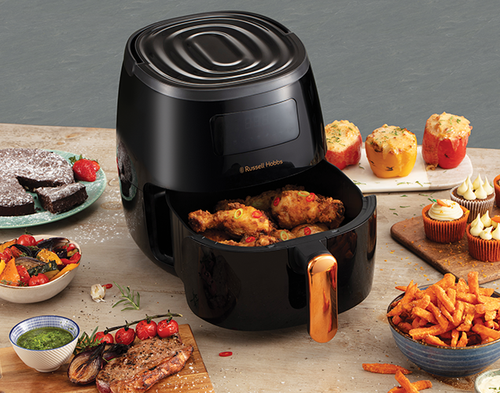
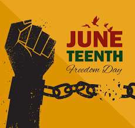
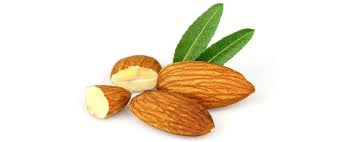
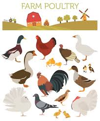
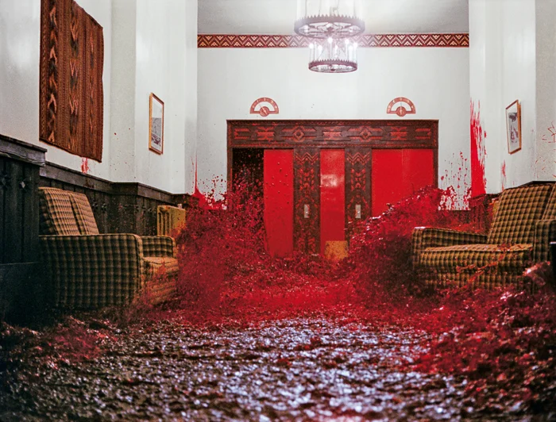
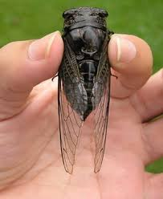

= 2025.04.10 Trump Puts 90-Day Pause on Reciprocal Tariffs But Doubles Down on China
:toc: left
:toclevels: 3
:sectnums:
:stylesheet: ../../../myAdocCss.css

'''

== 释义

Last Wednesday 上周三, Donald Trump announced 宣布 that in one week 一周内, he was going to impose 强制实行 the biggest increase 最大增幅 in tariffs 关税 in 100 years 一百年.

And after a week of panic buying (v.)恐慌性购买 _a year's supply 一年份 of_ toilet paper 卫生纸 and air fryers 空气炸锅, #the day has finally arrived# 终于到来.

[.my1]
.案例
====
.air fryer
空气炸锅：一种密封的、通常较小的电器，通过由风扇迅速循环的对流气流, 来快速烹饪食物。 +
氣炸鍋內置發熱管及電風扇，**主要以"熱氣流"代替滾油, 氣炸食物，**鍋內電風扇驅動熱空氣在爐內循環流動，令熱力傳播得更快更均勻。縱有不同型號，但設計都大同小異。用戶只需放入食材，設定溫度及時間等便可。 +
空气炸锅常被用来制作「健康」版本的「不健康」食品，如炸薯条、炸鸡、香肠、披萨等. +

====

It is 11:59 and 48 seconds, which means #we are just moments away 即将到来 from# the President's new tariffs 新关税.

It's President Trump's long-awaited 期待已久的 tariff day 关税日. It's reciprocal 互惠的 tariff day. Well, the tariffs are here. All right, it is tariff day. Happy tariff day, everyone 各位.

[CROWD CHEERING 观众欢呼] Woo. Woo. Oh, it's what Trump is replacing 替代 Juneteenth 六月节（美国奴隶解放纪念日） with.

[.my1]
.案例
====
.Juneteenth

这个名字来自 “June”（六月）和“nineteenth”（19日）两个词的结合，纪念美国奴隶制的结束。

Juneteenth (short for “June Nineteenth”) #marks (v.) the day# when federal troops arrived in Galveston 港口城市名, Texas in 1865 *to take control of* the state /and ensure (v.) that all enslaved people *be freed* (v.)解放，使自由. The troops’ arrival (n.) came (v.) _a full two and a half years_ 整整两年半 after the signing of _the Emancipation 解放 Proclamation_. Juneteenth honors (v.) the end to slavery in the United States and is considered the longest-running (a.)运行时间最长的 African American holiday. On June 17, 2021, it officially became a federal holiday.

**六月节（“六月十九日”的缩写）标志着联邦军队于 1865 年抵达"德克萨斯州"加尔维斯顿 ，控制该州, 并确保所有被奴役者获得自由的日子。**军队抵达时，距离《 解放奴隶宣言》 签署整整两年半。**六月节纪念美国奴隶制的终结，被认为是非裔美国人历史最悠久的节日。**2021 年 6 月 17 日，六月节正式成为联邦假日 。

Confederate General Robert E. Lee had surrendered (v.)投降，让与；屈服 at Appomattox _Court House_ 法院大楼 two months earlier in Virginia, but slavery *had remained (v.) relatively unaffected* 不受影响的 in Texas —until U.S. General Gordon Granger *stood (v.) on Texas soil* and read (v.) General Orders No. 3: “The people of Texas *are informed (v.) that*, #*in accordance with* 与……一致；按照……的规定或要求 a proclamation 正式的公告，宣言；宣布 from# _the Executive 行政的,行政部门，执行委员会 of the United States_, all slaves are free.”

两个月前，南方邦联将军罗伯特·李, 在"弗吉尼亚州"阿波马托克斯法院投降，但德克萨斯州的奴隶制, 却基本未受影响——直到美国将军戈登·格兰杰站在德克萨斯州的土地上宣读第 3 号将军命令：“告知德克萨斯州人民，根据美国行政长官的公告，所有奴隶都获得自由。”

_The Emancipation Proclamation_ 解放宣言 issued (v.) by President Abraham Lincoln on January 1, 1863, *had established (v.)建立，设立；证实，确定 that* all enslaved people in _Confederate states_ 南部邦联 in rebellion 叛乱，反抗 against the Union “*shall be* then, thenceforward 从那时；此后, and forever free.”

1863 年 1 月 1 日， 亚伯拉罕·林肯总统颁布了《解放奴隶宣言》，宣布所有在反抗联邦的邦联各州被奴役的奴隶“, 从现在起，永远获得自由”。

But in reality, _the Emancipation Proclamation_ didn’t instantly free (v.) any enslaved people. The proclamation only *applied to* places under Confederate control and *not to* slave-holding _border states_ 边境诸州 or rebel areas 叛军地区 already under Union control. However, as Northern troops *advanced (v.) into* the Confederate South, many enslaved people fled (v.) behind Union lines.

**但实际上，《解放奴隶宣言》并没有立即解放任何奴隶。该宣言仅适用于邦联控制的地区，而不适用于蓄奴的边境州, 或已受联邦控制的叛军控制区。**然而，随着北方军队推进到邦联控制的南方，许多奴隶逃到了联邦防线后方。

In Texas, slavery 奴隶制，蓄奴 had continued (v.)  因为 as the state experienced (v.) no _large-scale fighting_ or _significant presence 显著的存在 of Union troops_. `主` Many enslavers 奴役者,征服者 后定 from outside _the Lone Star State_ 孤星州 `谓` had moved (v.) there, as they *viewed it as* _a safe haven_ (安全地，避难所；港口，港湾)安全的避难所 for slavery.

**在德克萨斯州，由于没有经历大规模战争, 或联邦军队的大规模驻扎，奴隶制得以延续。许多来自“孤星之州”以外的奴隶主迁居至此，**因为他们认为德克萨斯州是奴隶制的避风港。

After the war *came to a close* in the spring of 1865, `主` _General Granger’s arrival (n.) in Galveston_ that June `谓` signaled (v.) freedom for Texas’s 250,000 enslaved people. Although *emancipation (n.)解放 didn’t happen (v.) overnight* for everyone —in some cases, enslavers 奴役者,奴隶主 *withheld (v.) the information* until after harvest 收获 season — celebrations *broke out* among newly freed Black people 新解放的黑人中, and Juneteenth was born. That December, _slavery in America_ *was formally abolished* with the adoption 采用，接受,正式通过 of the 13th Amendment.

1865 年春，战争结束后，**格兰杰将军于同年 6 月抵达加尔维斯顿，标志着德克萨斯州 25 万奴隶获得自由。尽管解放奴隶并非一夜之间便发生——在某些情况下，奴隶主甚至隐瞒消息，直到收获季节之后才公布——但新获得自由的黑人群体中还是爆发了庆祝活动，六月节由此诞生。**同年 12 月，随着《宪法第十三修正案》 的通过，美国奴隶制正式废除。

.it's what Trump is replacing (v.) Juneteenth 六月节 with.
将加税政策, 包装成节日，类比"六月节"（美国废除奴隶制纪念日）
====

Now, Trump has celebrated (v.)庆祝 by *putting tariffs on* every country 每个国家 in the world, including 104% on products made (v.) in China 中国制造的产品, which is probably fine 可能没问题. I mean, how many products 多少产品 are made in China?

But tariff day wasn't just celebrated (v.) here in America 但关税日并不只是在美国庆祝. Other countries *got in* on the fun 参与其中,玩得很开心 too. Swift retaliation 迅速报复 —both China and the European Union 欧盟 are responding (v.)回应 to President Trump's tariffs.

China has announced its own retaliatory (a.)报复的 tariffs 报复性关税 —84% of all US goods 商品 and imports 进口商品.

REPORTER: According to 根据 the European Union, `主` almonds 杏仁, orange juice 橙汁, poultry 禽类, soybeans 大豆, steel 钢铁, and aluminum products 铝制品, tobacco 烟草 and yachts 游艇 imported (v.) from the United States `谓` now will have a 25% levy (n.)征收额，税款;征税 on them.

[.my1]
.案例
====
- almond +

- poultry +

====

25% on yachts? Why do these trade wars 贸易战 always have to *screw over* 欺骗，坑害 the little guy 小人物?

I'll be honest 老实说, #I didn't even know# America made (v.) yachts. I thought `主` the only thing we made here `系` was nepo (n.)裙带关系 babies 裙带关系宝宝（靠家族关系上位的人）.

[.my1]
.案例
====
.Nepo baby
裙带宝贝，裙带关系小孩（具有行业声望的演员、音乐家、制片人或其他业内名人的后代）.  “Nepo baby”指靠父母人脉红起来的星二代。
====

#But this really *feels like*# it's spiraling (v.)盘旋着上升或下降；成螺旋状旋转 out of control 失控. It seems like the smart move 明智之举 is *to back off* 退出;放弃，退缩 this whole thing 整件事. But Trump's team has been adamant (a.)固执的，坚决的 that #they will *stay the course*# 坚持到底,坚持原计划.

This is not a negotiation 谈判. It's not the kind of thing you can negotiate (v.) away 通过谈判解决. #I don't think there's any chance# 可能性 they're going to do —#that# President Trump's going to back off 后退 his tariffs.

The President made it clear 明确表示 yesterday /this is not a negotiation.

REPORTER: Trump posted (v.)贴出；通告 this morning, my policies 政策 will never change 改变.

Well, that's it 那就这样吧, then. They're **in it to win it** 志在必得. #Full speed ahead# 全速前进, from the window to the walls. Skeet (v.)使急行；喷液体, skeet, skeet, mother[BLEEP] Trump's policy will never, ever change.

[.my1]
.案例
====
.They're in it to win it
"in it"​​ = 参与其中 +
"to win it"​​ = 为了获胜 +
直译​​："他们参与其中，就是为了赢" +
表示​​「志在必得」​​或​​「不达目的不罢休」​​，强调某人/某团体全力投入某事，目标明确且决心坚定。

."Full speed ahead, from the window to the walls."​​
→ ​​"全速前进，从窗户到墙壁。"​​
（引用说唱歌曲《Get Low》的歌词，原句是 "From the window to the wall"，描述狂欢场景）

."Skeet, skeet, skeet, mother[BLEEP]!"​​
→ ​​"砰砰砰，特朗普的政策永远不会变！"​​ +
（*"Skeet"是拟声词，模仿射击/性暗示声音*；[BLEEP]原词是 ​​"fucker"​​，消音粗口）

====

ANNOUNCER: This is CNN breaking news 突发新闻. The President *announcing* just minutes ago *that* he's now, quote (v.)引用，引述, "authorized (v.)授权；批准 a 90-day pause 90天暂停" on some of his new tariffs.

What? The trade war 贸易战 is over? But it's tariff day. I shaved my legs 刮腿毛 for this. Now I have to grow it all back 重新长出来.

But, hey, at least we can buy things from China again, right? I mean, Amazon Prime 亚马逊会员, here I come.

REPORTER: Notably 值得注意的是, though, the President *is raising* the tariff applied (v.) to China from the United States *to* 125% effective (a.)产生预期结果的，有效的；实际的，事实上的 *immediately* 立即生效. So this pause *applies (v.) to* other countries, not China.

Hey, Siri, cancel (v.)取消 1,000 air fryers.

Trump, I don't understand what happened here. You tanked (v.)搞垮,（尤指故意）输掉（比赛） global stock markets 全球股市. You *put* us *on the verge of* 濒临 a recession 经济衰退. You told everyone to build factories 建工厂 in America because the tariffs wouldn't go away 不会消失，结束,离开, and then you took them away 取消.

What happened? #Did you just get spooked# (v.)被吓到,惊吓；受惊 by the markets?

REPORTER: The 90-day pause (n.) on the reciprocal tariffs 互惠关税, is that because of the whiplash (n.)鞭打,剧烈波动 that we've been seeing across the financial markets 金融市场?

No. This was his strategy 策略 all along 自始至终，一直. #An absolutely brilliant move# 高明之举. Brilliant *not only* economically 经济上, politically 政治上, and it was good for the American worker 美国工人.

He's negotiator-in-chief 首席谈判官. #He's landing the plane# 安全着陆. He's the master of the deal 交易大师. I mean, you're watching _The Art of the Deal_ 交易的艺术 in real time 实时 here.

Many of you in the media 媒体 clearly missed (v.) The Art of the Deal.

Ah, yes, The Art of the Deal. Create (v.) a global crisis 全球危机 and then dig (v.) yourself halfway out 半途而废. It's truly masterful 大师级的, Donald.

#I'm starting to think that# The Art of the Deal is art *in the way that* 以……的方式，以……的方法 Jackson Pollock 杰克逊·波洛克（抽象表现主义画家） is art. Like, it looks like someone just threw (v.) a bunch of shit 一堆垃圾 at the wall, but now #I have to pretend (v.) like# it's genius 天才之作 and it's going to cost (v.)价钱为，需花费 millions of dollars 价值数百万美元.

Come at me 冲着我来, abstract expressionism hive (蜂群) 抽象表现主义爱好者们. You know I'm right.

Come on, Trump. Just admit 承认 that you started _a game of chicken_ 胆小鬼游戏（博弈论）, and you got too scared (a.)害怕 to finish it.

Well, I thought that #people were jumping a little bit out of line# 出格,人们有点越界了. They were getting yippy (a.)紧张不安的. They were getting a little bit yippy, a little bit afraid 害怕.

Oh, OK. It's our fault 我们的错. We got too scared. Sorry. I tend to get a little yippy when my retirement plan 退休金计划 starts *to look like* the elevator from The Shining 闪灵里的电梯（比喻暴跌）.

[.my1]
.案例
====
"My retirement plan looks like the elevator from The Shining." +
恐怖电影《闪灵》中电梯爆血浆的画面，形容股市崩盘，退休金“血流成河”.

====

[CROWD CHEERING] Straight down 直线下降 in heavy flow 血流成河（股市暴跌）;水流湍急，直下.

I'm sorry. I don't mean to be dramatic 戏剧化的, but this is the worst tariff day ever 史上最糟关税日.

This whole trade war was launched 发起 on incoherent arguments 混乱的逻辑. You *stuck to your guns* (枪) 坚持己见 for incoherent 不连贯的；不合逻辑的 reasons. And now, you're pulling back 退缩 for incoherent reasons.

**Is there anything **you can say 后定 *that* actually makes sense 说得通?

No other President 其他总统 would have done what I did. No other President.

Well, ##you got me there ##你说服我了. I do agree with that 我同意这点.

Still, though, I just wish that /someone could explain #what the strategy is going forward# (向前，前进;今后，将来)未来策略 with these tariffs. I mean, is there anyone who can tell me?

OLIVIA MUNN: Desi. Desi, hi. I can tell you. Hey.

DESI LYDIC: Oh. Hi. Oh, my god. Olivia Munn. What are you doing here?

I'm a correspondent 特派记者 on The Daily Show 每日秀.

I thought you left in 2011.

Oh, no. You know how Jon *comes in* one day a week 你知道乔恩每周只来一天? Yeah, I have the same deal 同样的安排. I just —I come in once every 14 years 每14年一次. My dad's a cicada 蝉,知了（生命周期13/17年）.

[.my1]
.案例
====
.cicada
比较著名的蝉, 是“十七年蝉”或周期蝉（Magicicada）。原产于美国东部地区，这些蝉的若虫, 在地下蛰伏十三或十七年，然后破土而出。

====

Oh, OK. I see. Well, #I'd ask what you've been up to# 近况,我想问你最近在忙什么, but I have the internet 但我可以上网查.

#That's fair# 有道理,这很公平. So, #break it down 分解它  for us# 解释一下. What is Trump's strategy here with these tariffs?

Everyone's scared (a.)害怕. There's so much uncertainty 不确定性. And there's no—this is no way that you can actually run an economy 经济运行.

Desi, be cool 冷静, OK? Trump knows exactly what he's doing. He put tariffs that destroyed 摧毁 the global economy 全球经济, so then he took them off 脱下某物，尤指衣服, and now it's only mostly destroyed 半死不活.

Now, to avoid tariffs *coming back*, other countries will *cut (v.) deals 达成协议 with* us for better trade terms 更优惠的贸易条款. And our deficit 赤字 *drops to* zero. Problem solved (v.)问题解决.

OK, I see. And that's when we drop (v.) all the tariffs?

No, bitch 贱人（粗口）. Then we hit them even harder 更狠地打击, 400% tariffs. We bomb (v.) their factories 轰炸工厂. We catch those penguins 企鹅 on that island, and we eat them 吃掉企鹅.

Then, the other countries will really come begging 跪求. #We can get whatever we want#, baby. IKEA furniture comes assembled 组装好的. _Honda 本田 Accords_, trunks （汽车后部的）行李箱，后备箱 full of Nike sneakers (胶底运动鞋) 装满耐克鞋的后备箱.

[.my1]
.案例
====
.Honda Accord
是本田自 1976 年以来生产的一系列汽车 ，以其四门轿车变体而闻名自 1989 年以来一直是美国最畅销的汽车之一。

====

We'll get to pee on their currency (通货，货币) 往货币上撒尿 while they watch. Then we've won 我们就赢了.

Gross 恶心. But fine. Then the trade war ends?

Yes. Then it *makes sense* 有明确的意义，容易理解；合理的 for the trade war to end. But sike 骗你的, bitch. 4,000,000,000% tariffs. #You're in our house now# 现在是我们说了算. The new iPhone, $3. Nike sneakers comes with a Honda Accord.

Then we pee on their currency again. They're not even watching 他们甚至都没在看. It's just the only way we can pee anymore 我们只会这样撒尿了,这是我们唯一能尿尿的方式.

Olivia, why? How does _any of this_ *make up* 弥补，弥合 the trade deficit 弥补贸易赤字,这些是如何弥补贸易逆差的?

Desi, baby girl 小姑娘, it's not the trade deficit. This is all *to make up for* 弥补，补偿，抵消 Donald Trump's enormous (a.)巨大的，极大的 deficit 巨额贸易逆差 of attention and love 巨大的关注和爱的缺失.

#He said as much# last night 他昨晚就是这么说的. I'm telling you, these countries are calling us up 给我们打电话, kissing my ass 亲我的屁股,拍马屁. They are. They are dying to 渴望 make a deal. Please, please, sir. Make a deal.

[.my1]
.案例
====
.He said as much
"as much"​​ = ​​"同样的话/意思"​​（指代前文提到的内容） +
"said as much"​​ = ​​"表达了同样的意思"​​ / ​​"说了类似的话"​

- A: "Trump promised to never change his policy." +
B: "*He said as much* last night." +
"他昨晚也是这么说的。"​​（即 "他昨晚也承诺过不改变政策"）

- "He didn’t admit it directly, but #his tone *said as much*.#"
"他没有直接承认，但他的语气已经说明了一切。"

.kissing my ass
used to tell someone that you will not do what they want you to do.

- *Kiss my ass! 別瞎想了！* +
You wanna *pick a fight* 挑起争斗? Kiss my ass!（你想找碴嗎？做夢！）

- *kick sb’s ass 狠狠教訓某人* +
I’m gonna kick your ass! （看我好好收拾你！）

- *get off your ass （命令）你給我動起來* +
*Get off your ass* and clean your room! （給我起來清你的房間！）

- *kiss sb’s ass 巴結某人* +
#He’s desperate (a.)不顾一切的，拼命的；极需要的，渴望的 for# a promotion, so he’s always *kissing his boss’s ass*.（他超級無敵想升職，所以他總是在拍老闆的馬屁。）

- *cover sb’s ass 掩蓋過錯* +
He tried *to cover his ass* by saying, "Mistakes were made." （他想用一句「錯誤已經造成了」來掩蓋自己的過錯。）

- *sb’s ass is on the line (处于危险中；模棱两可；在电话线上) 某人要遭殃* +
You’re not worried because *it’s my ass that’s on the line*! （你才不擔心咧，因為是我要完蛋了！）
====

See? He's just a boy standing in front of the world asking *to have his ass kissed* 求着被拍马屁.

And once the world fills (v.) the aching (a.)疼痛的；心痛的 hole 填补空洞 in his heart, the tariffs will end. But that will never happen. There's not enough attention in the world to make him feel like a human again 重新感受到人性.

Exactly, bitch 母狗；<非正式>泼妇. Oh. Now, #I get it# 我懂了. Wow. That was really enlightening (a.)很有启发性.

Thanks, bitch.

#Who are you calling "bitch?"#

Oh, I'm sorry. I'm sorry, I thought we were — #Having a thing# 在(恋爱)交往,未明确关系的暧昧? Yeah. Yeah. We're not.

[.my1]
.案例
====
.Having a thing

"Having a thing"​​ 在口语中最常见的两种含义：
[.my3]
[options="autowidth" cols="1a,1a"]
|===
|Header 1 |Header 2

|(1) 处于暧昧/恋爱关系​
|（= casually dating, romantically involved） +
- "Are you two *having a thing*?" → ​​"你俩是不是在谈恋爱？"​

|​​(2) 有特殊癖好/执念​
|（= having a specific interest or obsession） +
- "She *has a thing* for tall guys." → ​​"她对高个子男生有执念。"​
|===

本问中, 根据上下文 ​​"I thought we were — Having a thing? Yeah. Yeah. We’re not."​​：
​​这里明确指「恋爱关系」​​， +
A: "我以为我们在交往？" +
B: "是啊…其实没有。"

为什么用 "a thing" 而不用 "dating"?​​​ +
"a thing" 更含糊​​：
比直接说 "dating" 更随意，适合描述「未明确关系的暧昧」。 +
对比： +
"We’re dating." → 正式交往 +
"We have a thing." → 可能只是暧昧/短期关系

====

Oh, OK. Well, thank you for your analysis 分析.

No problem. I'll see you in 2039.

Oh, Olivia— Olivia. Well, #she's gone# 她走了. Olivia Munn, everyone.

'''

== 中文

上周三，唐纳德·特朗普宣布, 将在一周内实施"百年来最大幅度"的关税增长。 +
在民众疯狂囤积一年份厕纸和空气炸机的一周后，这一天终于到来。 +
现在是11点59分48秒，意味着总统的新关税政策即将生效。 +
这是特朗普总统期待已久的"关税日"，是"互惠关税日"。好吧，关税来了。各位，关税日快乐！
[观众欢呼]
哇哦。哇哦。哦对了，这是特朗普用来取代"六月节"的新节日。
[笑声] +
特朗普通过向全球所有国家加税, 来庆祝，包括对中国产品征收104%关税——不过问题不大，毕竟有多少东西是中国制造的呢？
[笑声] +
但"关税日"不仅是美国的狂欢。其他国家也加入了这场"游戏"。迅速的反击来了——中国和欧盟都对特朗普关税做出了回应。 +
中国宣布对美国84%的商品, 加征"报复性关税"。 +
记者：欧盟将对美国进口的杏仁、橙汁、禽类、大豆、钢铁、铝制品、烟草和游艇, 加征25%关税。
[笑声] +
游艇加税25%？为什么贸易战总是坑"小人物"？
[笑声] +
说实话，我都不知道美国还生产游艇。我以为我们这儿只生产"裙带关系宝宝"。 +
但局势确实感觉失控了。明智之举应该是收手，但特朗普团队坚称会坚持到底。 +
这不是谈判，不是能谈掉的事情。我不认为特朗普会退缩。 +
总统昨天明确表示："这不是谈判。" +
记者：特朗普今早发文："我的政策永远不会改变。" +
好吧，那就这样了。他们铁了心要赢。"全速前进，从窗户到墙壁。砰砰砰，特朗普的政策永远不会改变。" +
CNN突发新闻：总统刚刚宣布"授权对部分新关税实施90天暂停"。 +
什么？
[笑声]
贸易战结束了？可今天是关税日啊！我为此专门刮了腿毛！
[笑声]
现在又得等它长回来。不过至少我们能重新买中国商品了？我的亚马逊会员终于能用上了。 +
记者：但值得注意的是，总统立即将对华关税提高到125%，暂停只适用于其他国家。 +
嘿Siri，取消1000台空气炸机订单。
[笑声] +
特朗普，我实在看不懂。你搞垮全球股市，让经济濒临衰退，号召大家在美国建厂, 说关税不会取消——结果现在又取消了。 +
你是被市场吓到了吗？ +
记者：暂停互惠关税, 是因为金融市场剧烈波动吗？ +
不，这本来就是他的策略。绝对精妙的一步棋，经济政治双赢，还利好美国工人。 +
他是"首席谈判官"，正在安全着陆，是"交易大师"。你们正在见证《交易的艺术》现实版。 +
显然很多媒体人没读懂《交易的艺术》。
[笑声] +
啊，《交易的艺术》。先制造全球危机，再把自己挖出一半。真是大师手笔啊特朗普。 +
我现在觉得《交易的艺术》就像杰克逊·波洛克的画——看起来像把颜料乱泼在墙上，但还得假装这是价值连城的杰作。 +
抽象表现主义爱好者们，来怼我吧！你们知道我说得对。
[笑声] +
承认吧特朗普，你玩"胆小鬼游戏"自己先怂了。 +
特朗普：我觉得有些人反应过度了，他们变得神经兮兮，有点害怕了。 +
哦，所以是我们的错？我们太害怕了？抱歉，当我养老金账户像《闪灵》里的电梯一样直线暴跌时，我确实会有点神经质。
[笑声]
[观众欢呼]
血流成河式暴跌。
[笑声] +
抱歉我太戏剧化，但这真是史上最烂关税日。 +
**整场贸易战基于混乱的逻辑发起，你为混乱的理由坚持，现在又为混乱的理由退缩。**能说句人话吗？ +
特朗普：没有其他总统会像我这样做。没有。
[观众欢呼] +
这点我同意。但还是希望有人能解释未来的关税策略。有人能说明白吗？ +
奥利维亚·穆恩：Desi！嗨！我能解释。 +
Desi：天呐！奥利维亚·穆恩！
[观众欢呼]
你不是2011年就离职了吗？ +
我现在是《每日秀》特约记者。和囧司徒一样每周来一天？不，我每14年出现一次。我爸是蝉。 +
好吧。本想问你这些年干嘛，但反正我能上网搜。
[笑声] +
说正事，特朗普的关税策略到底是什么？ +
Desi冷静。特朗普清楚自己在做什么。他先用关税摧毁全球经济，再取消关税让经济半死不活。 +
为避免关税卷土重来，各国就会妥协签协议。贸易赤字归零，问题解决。 +
懂了，然后就取消所有关税？ +
想得美！
[笑声]
接着加征400%关税！炸工厂！抓企鹅岛上的企鹅来吃！各国就会跪求我们。 +
想要什么有什么：宜家家具送货即装好，本田雅阁后备箱塞满耐克鞋，还能当着他们的面往货币上撒尿。 +
恶心但行吧，然后贸易战结束？ +
对，该结束的时候自然会结束——才怪！
[笑声]
直接40亿%关税！iPhone卖3美元，买耐克鞋送本田车。 +
继续往他们货币上撒尿，这次他们都不看了，反正我们也只会这样撒尿了。
[笑声] +
奥利维亚，这跟贸易赤字有什么关系？ +
傻姑娘，根本不是贸易赤字的问题。这是在填补特朗普巨大的"关注赤字"和"缺爱赤字"。 +
他昨晚亲口说了："这些国家都在拍我马屁求着签协议。"看吧，他就是个站在世界面前索吻的男孩。 +
等世界填满他内心的空洞，关税就会取消——但这永远不可能，全世界的关注都不够让他感觉自己是个人。 +
奥利维亚：没错！
[笑声]
现在懂了？ +
Desi：谢谢你的分析...贱人。 +
奥利维亚：你叫谁贱人？ +
Desi：抱歉我以为我们...在玩梗？ +
奥利维亚：并没有。 +
Desi：好吧，2039年见。
[笑声] +
奥利维亚·穆恩女士，各位。
[观众欢呼]

'''
== pure

Last Wednesday, Donald Trump announced that in one week, he was going to impose the biggest increase in tariffs in 100 years.

And after a week of panic buying a year's supply of toilet paper and air fryers, the day has finally arrived.

It is 11:59 and 48 seconds, which means we are just moments away from the President's new tariffs.

It's President Trump's long-awaited tariff day. It's reciprocal tariff day. Well, the tariffs are here. All right, it is tariff day. Happy tariff day, everyone.
[CROWD CHEERING]
Woo. Woo. Oh, it's what Trump is replacing Juneteenth with.
[LAUGHTER]

Now, Trump has celebrated by putting tariffs on every country in the world, including 104% on products made in China, which is probably fine. I mean, how many products are made in China?
[LAUGHTER]

But tariff day wasn't just celebrated here in America. Other countries got in on the fun, too. Swift retaliation—both China and the European Union are responding to President Trump's tariffs.

China has announced its own retaliatory tariffs—84% of all US goods and imports.

REPORTER: According to the European Union, almonds, orange juice, poultry, soybeans, steel, and aluminum products, tobacco and yachts imported from the United States now will have a 25% levy on them.
[LAUGHTER]

25% on yachts? Why do these trade wars always have to screw over the little guy?
[LAUGHTER]

I'll be honest, I didn't even know America made yachts. I thought the only thing we made here was nepo babies.

But this really feels like it's spiraling out of control. It seems like the smart move is to back off this whole thing. But Trump's team has been adamant that they will stay the course.

This is not a negotiation. It's not the kind of thing you can negotiate away. I don't think there's any chance they're going to do—that President Trump's going to back off his tariffs.

The President made it clear yesterday this is not a negotiation.

REPORTER: Trump posted this morning, my policies will never change.

Well, that's it, then. They're in it to win it. Full speed ahead, from the window to the walls. Skeet, skeet, skeet, mother[BLEEP] Trump's policy will never, ever change.

ANNOUNCER: This is CNN breaking news. The President announcing just minutes ago that he's now, quote, "authorized a 90-day pause" on some of his new tariffs.

What?
[LAUGHTER]
The trade war is over? But it's tariff day. I shaved my legs for this.
[LAUGHTER]
Now I have to grow it all back.

But, hey, at least we can buy things from China again, right? I mean, Amazon Prime, here I come.

REPORTER: Notably, though, the President is raising the tariff applied to China from the United States to 125% effective immediately. So this pause applies to other countries, not China.

Hey, Siri, cancel 1,000 air fryers.
[LAUGHTER]

Trump, I don't understand what happened here. You tanked global stock markets. You put us on the verge of a recession. You told everyone to build factories in America because the tariffs wouldn't go away, and then you took them away.

What happened? Did you just get spooked by the markets?

REPORTER: The 90-day pause on the reciprocal tariffs, is that because of the whiplash that we've been seeing across the financial markets?

No. This was his strategy all along. An absolutely brilliant move. Brilliant not only economically, politically, and it was good for the American worker.

He's negotiator-in-chief. He's landing the plane. He's the master of the deal. I mean, you're watching The Art of the Deal in real time here.

Many of you in the media clearly missed The Art of the Deal.
[LAUGHTER]

Ah, yes, The Art of the Deal. Create a global crisis and then dig yourself halfway out. It's truly masterful, Donald.

I'm starting to think that The Art of the Deal is art in the way that Jackson Pollock is art. Like, it looks like someone just threw a bunch of shit at the wall, but now I have to pretend like it's genius and it's going to cost millions of dollars.

Come at me, abstract expressionism hive. You know I'm right.
[LAUGHTER]

Come on, Trump. Just admit that you started a game of chicken, and you got too scared to finish it.

Well, I thought that people were jumping a little bit out of line. They were getting yippy. They were getting a little bit yippy, a little bit afraid.

Oh, OK. It's our fault. We got too scared. Sorry. I tend to get a little yippy when my retirement plan starts to look like the elevator from The Shining.
[LAUGHTER]
[CROWD CHEERING]
Straight down in heavy flow.
[LAUGHTER]

I'm sorry. I don't mean to be dramatic, but this is the worst tariff day ever.

This whole trade war was launched on incoherent arguments. You stuck to your guns for incoherent reasons. And now, you're pulling back for incoherent reasons.

Is there anything you can say that actually makes sense?

No other President would have done what I did. No other President.
[CROWD CHEERING]

Well, you got me there. I do agree with that.

Still, though, I just wish that someone could explain what the strategy is going forward with these tariffs. I mean, is there anyone who can tell me?

OLIVIA MUNN: Desi. Desi, hi. I can tell you. Hey.

DESI LYDIC: Oh.

Hi.
DESI LYDIC: Oh, my god. Olivia Munn.
[CROWD CHEERING]
What are you doing here?
I'm a correspondent on The Daily Show.

I thought you left in 2011.

Oh, no. You know how Jon comes in one day a week? Yeah, I have the same deal. I just—I come in once every 14 years. My dad's a cicada.

Oh, OK. I see. Well, I'd ask what you've been up to, but I have the internet.
[LAUGHTER]

That's fair. So, break it down for us. What is Trump's strategy here with these tariffs?

Everyone's scared. There's so much uncertainty. And there's no—this is no way that you can actually run an economy.

Desi, be cool, OK? Trump knows exactly what he's doing. He put tariffs that destroyed the global economy, so then he took them off, and now it's only mostly destroyed.

Now, to avoid tariffs coming back, other countries will cut deals with us for better trade terms. And our deficit drops to zero. Problem solved.

OK, I see. And that's when we drop all the tariffs?

No, bitch.
[LAUGHTER]
Then we hit them even harder, 400% tariffs. We bomb their factories. We catch those penguins on that island, and we eat them.

Then, the other countries will really come begging. We can get whatever we want, baby. IKEA furniture comes assembled. Honda Accords, trunks full of Nike sneakers.

We'll get to pee on their currency while they watch. Then we've won.

Gross. But fine. Then the trade war ends?

Yes. Then it makes sense for the trade war to end.

But sike, bitch. 4,000,000,000% tariffs. You're in our house now. The new iPhone, $3. Nike sneakers comes with a Honda Accord.
[LAUGHTER]

Then we pee on their currency again. They're not even watching. It's just the only way we can pee anymore.
[LAUGHTER]

Olivia, why? How does any of this make up the trade deficit?

Desi, baby girl, it's not the trade deficit. This is all to make up for Donald Trump's enormous deficit of attention and love.

He said as much last night. I'm telling you, these countries are calling us up, kissing my ass. They are. They are dying to make a deal. Please, please, sir. Make a deal.
[LAUGHTER]

See? He's just a boy—
[LAUGHTER]
Standing in front of the world asking to have his ass kissed.

And once the world fills the aching hole in his heart, the tariffs will end. But that will never happen.

There's not enough attention in the world to make him feel like a human again.

Exactly, bitch.
[LAUGHTER]
Oh. Now, I get it. Wow. That was really enlightening.

Thanks, bitch.

Who are you calling "bitch?"

Oh, I'm sorry. I'm sorry, I thought we were—

Having a thing?
Yeah.
Yeah. We're not.

Oh, OK. Well, thank you for your analysis.

No problem. I'll see you in 2039.
[LAUGHTER]

Oh, Olivia— Olivia.
[CROWD CHEERING]

Well, she's gone. Olivia Munn, everyone.

'''

