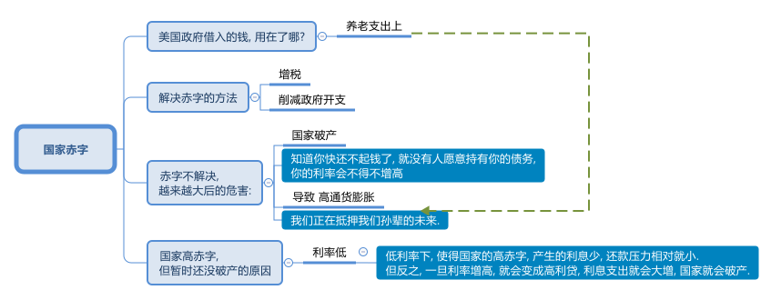
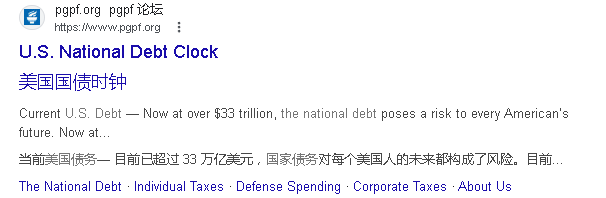
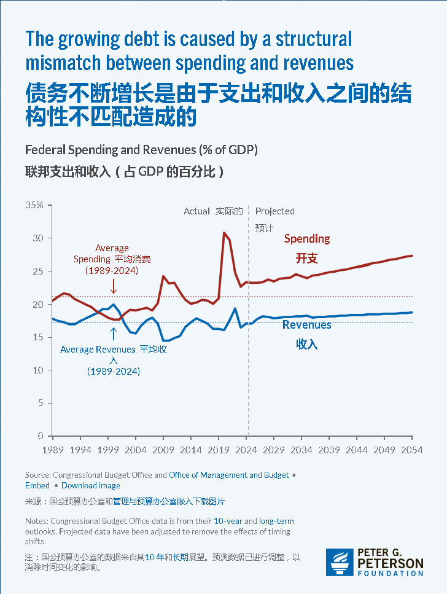
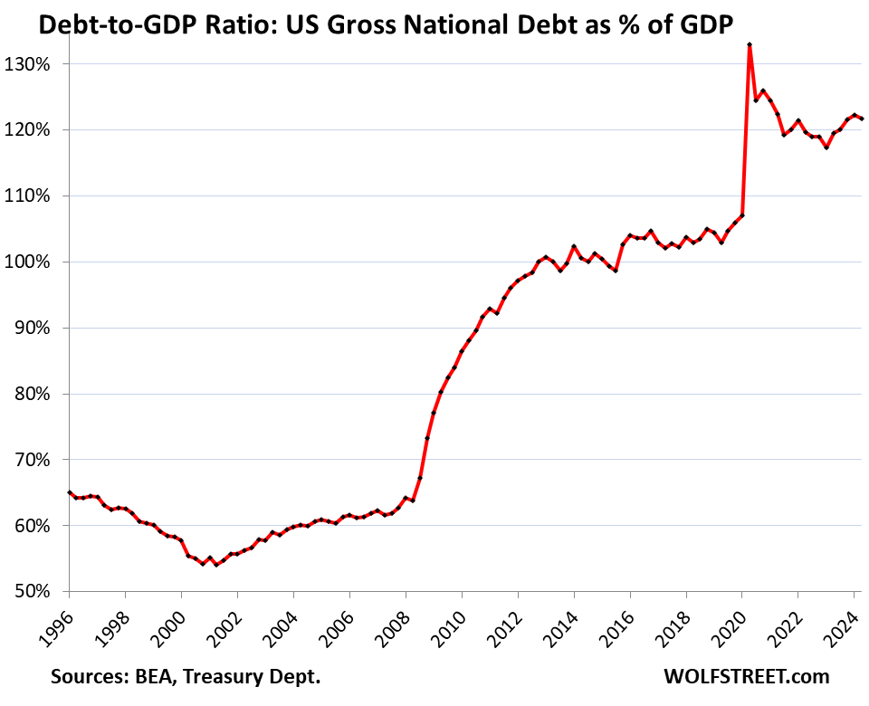
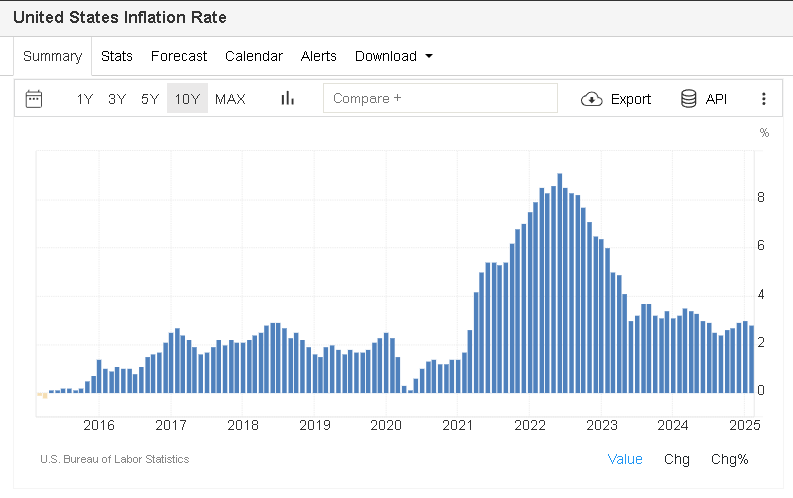
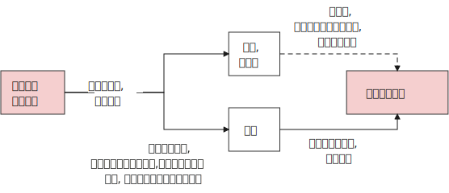

= 2024.12 How does Congress react to budget deficit projections?
:toc: left
:toclevels: 3
:sectnums:
:stylesheet: ../../../myAdocCss.css

'''

视频 +
https://www.youtube.com/watch?v=S3BN5kEp09g&ab_channel=BrookingsInstitution

== 本文核心论点

[.small]
[options="autowidth" cols="1a,1a"]
|===
|Header 1 |Header 2

|美国当前国债数量
|

|美国通胀率
|https://tradingeconomics.com/united-states/inflation-cpi
|===

'''

== 释义

介绍主持人及节目背景

I'm Jan Eberly, the James R and Helen D Russell Professor of Finance 财务学 at Northwestern University, and I'm John Steinsson, Chancellor's Professor of Economics 经济学 at the University of California, Berkeley.  +
We're the co-editors of the Brookings Papers on Economic Activity, a semiannual 一年两次的；半年一次的 academic conference 会议，研讨会 and journal that *pairs* (v.)使成对；配对 rigorous 严谨的 research 研究 *with* real-time policy analysis 政策分析 to address (v.) the most urgent 紧迫的 economic challenges 挑战 of the day.  +
This is the Brookings Podcast 播客 on Economic Activity, where we share (v.) #conversations# with leading economists 经济学家 #on# the research 研究 they do /and how `主` it will affect (v.) economic policy 经济政策.  +
Thank you for *tuning in to* 收听或收看 the fourth episode 第四集 of our fifth season 第五季 of the podcast.

[.my2]
我是Jan Eberly，西北大学James R和Helen D Russell财务学教授；我是John Steinsson，加利福尼亚大学伯克利分校经济学教授。我们是《布鲁金斯经济活动报告》的联合编辑，这是一本半年刊的学术期刊和会议，结合严谨的研究和实时政策分析，旨在解决当今最紧迫的经济挑战。欢迎收听我们第五季的第四集布鲁金斯经济活动播客。

讨论背景及论文主题

For a long time 长时间, Congress *paid (v.) close attention to* long-term federal deficits 联邦赤字 /and would *raise (v.) taxes* 增税 or cut (v.) spending 削减开支 /if deficits 赤字 were predicted (v.)预测，预言 to spiral upwards 急剧上升 /based on current legislation 当前立法.  +
`主` #The paper# 论文 we discuss in today’s episode, titled _Robust Fiscal (a.)稳健的财政 Stabilizations_ 稳定 /and authored by Alan Auerbach and Danny Yagan of the University of California, Berkeley, `谓` #finds that# this time has ended 结束 with potentially serious 严重的 consequences 后果 /for federal debt 联邦债务.  +
`主` #William Gale#, co-director of the Urban-Brookings Tax Policy Center 城市-布鲁金斯税务政策中心 and discussant 讨论员;参加讨论者 of this paper, `谓` #leads# (v.)the discussion 领导讨论.  +
These are crucial 关键的 issues 问题 /as the US confronts (v.)面临 higher debt 高债务 and deficits 赤字, and policymakers 政策制定者 contemplate (v.)思考;沉思， the consequences /后果 and how to address (v.)解决 them.

[.my2]
**长期以来，国会密切关注长期"联邦赤字"，并且如果根据当前立法预测, 赤字会急剧上升的话，就会提高税收, 或削减开支。**今天我们讨论的这篇论文，题为《稳健的财政稳定》，由加利福尼亚大学伯克利分校的Alan Auerbach和Danny Yagan撰写，发现这种情况已经结束，这对联邦债务可能会产生严重后果。William Gale，城市-布鲁金斯税务政策中心的联合主任，也是这篇论文的讨论员，领导了此次讨论。这些都是关键问题，因为美国面临更高的债务和赤字，政策制定者正在思考这些后果, 以及如何解决它们。

论文核心观点及历史背景

People often talk about having various kinds of budget rules 预算规则. +
This paper 论文 points out 指出 that /there was implicitly 隐性地 a rule 规则 or at least 至少 a practice 做法 /that *brought* (v.)budget deficits 预算赤字 *down* 降低 /when they tended to grow 增长 over the last few decades 几十年.  +
The paper 论文 argues 认为 that /this practice 做法 has ended 结束 /and raises 提出 the question 问题 of what comes next 接下来会发生什么.  +
I’m really glad 高兴 /to see Alan and Danny *drawing attention 引起关注 to* this troubling 困扰的;令人不安的 change 变化 in fiscal policy 财政政策.  +
I worry 担心 that /deficits 赤字 are a bit like _high blood pressure_ 高血压: everything seems (v.) fine 一切似乎正常 for the longest time 很长时间, /and then 然后 something really bad 真正糟糕的事情 happens 发生.  +
Let’s *pass it off to* 把责任或任务转交给别人 Bill /and see 看看 what the authors have to say.

[.my2]
人们常常谈论各种预算规则。这篇论文指出，过去几十年里，实际上有一种规则或至少一种做法，当"预算赤字"有增长趋势时，能够将其降低。论文认为，这种做法已经结束，并提出了接下来会发生什么的问题。我很高兴看到Alan和Danny引起了人们对这一"财政政策"变动的关注。**我担心赤字就像高血压一样：一切似乎正常，然而一旦出现问题，后果会非常严重。**我们将话题交给Bill，看看作者们有什么看法。

访谈开始及历史研究发现

Thanks, John and Jan. I’d like to welcome Alan to the podcast 播客.  +
Thank you, and let me say /I’m very excited to talk more about this paper 论文, having served 担任 as the discussant 讨论员 at the conference 会议.  +
Let’s jump right in 直接进入. Alan, `主` #your paper# 论文 with your colleague 同事 Danny Yagan `谓` #looks at# the past 过去 and the future 未来 /#regarding# 关于，至于 how policymakers 政策制定者 *respond (v.)响应 to* budget deficits 预算赤字 and debt 债务.  +
Let’s talk about the past 过去 first.  +
The question 问题 you’re asking 提出 is, when indicators 指标 suggest (v.)暗示 that /the federal deficit 联邦赤字 is going to go up 上升, do lawmakers 立法者 *pass (v.) laws* 通过法律 /that *respond 响应 to* those projections 预测 /by either *increasing (v.) 增加 taxes* 税收 or *lowering (v.) 降低 spending* 开支?  +
You’ve looked over the last four decades 四十年 /and *come up with* 得出;产生或提出（想法、计划、解决方案等） different results 不同的结果 over different time periods 时间段.  +
*Talk us through* 把某事谈透;给某人解说 the basics 基本情况 of what you found 发现.

Thanks, Bill. When I first studied 学习 this issue 问题 /a little over 一点多 20 years ago 20年前 for a paper 论文 /I also wrote 写 for the Brookings panel 小组, I estimated 估计 the effects 影响 of projected 预测的 budget deficits 预算赤字 on government 政府 policy 政策 /and found 发现 that there were strong responses 强烈反应 by the government 政府 at the time 当时.  +
People were a little surprised 有点惊讶; they didn’t realize 意识到 /the government 政府 *had it together* 组织有序、条理清晰、运作良好 /*as much as* 达到……的程度 to do these things 做这些事情.  +

[.my1]
.案例
====
他们没有意识到政府的组织能力（或者说政府的运作是如此有条理），以至于它能够做到这些事情。

- have it together 是一个 惯用语（idiom），意思是 “组织有序、条理清晰、运作良好”。这里指 政府运作得井然有序、能力强。 +
have it all together. 用作动词的意思：（美国俚语）把生活安排得井井有条，使身心机能都得到平衡、不发生障碍.

- as much as it had to +
as much as 这里表示 “达到……的程度”。 +
it had to（政府必须的程度）指的是政府必须具备的组织能力。 +
也就是说，政府的运作比他们想象的更有条理，至少达到了完成这些事情所需的程度。

修改后的完整英语句子可以这样表达，更加清晰、符合语法规则：

1.自然、口语化的修改： +
They didn’t realize /the government *had it together* enough /to do these things.
（他们没有意识到政府的组织能力足够好，能够完成这些事情。）

2.更正式、更流畅的表达： +
They didn’t realize /how well-organized the government was /in order to accomplish these things.
（他们没有意识到政府是多么有条理，以至于能完成这些事情。）

3.如果想保留“as much as”的比较结构，可以这样改： +
They didn’t realize /the government had it together as much as it actually did /in order to get these things done.
（他们没意识到政府的组织能力其实比他们想象的还要强，以至于能完成这些事情。）
====

I found that /taxes 税收 *went up* 上升 and spending 开支 *went down* 下降 /*in terms of* legislative activity 立法活动 /when it looked like 看起来 _deficits 赤字 were going to be high_ 高 in the future /according to 根据 Congressional Budget Office projections (预测，推测) 国会预算办公室预测.  +
Danny and I decided /*to have another look 再次审视 at* that relationship 关系 /with _all the additional years 额外的年份 of data_ 数据 we’ve had since then 从那时起 /#and# found, very surprisingly 非常令人惊讶, that /that relationship had completely gone away 完全消失.  +
My original paper 原始论文 was in the Brookings Papers 布鲁金斯报告 in 2003, and if you look at the period  /from 2004 to the current year 当前年份, /`主` #the same relationship#  that I found  to be very strong  from 1984 through 2003 /`谓` #had completely disappeared# 完全消失 in the last 20 years.  +
It had very important implications 启示;暗指，暗示；蕴含，含义 /for the path 路径 of fiscal policy 财政政策 in the US.

[.my2]
====
谢谢，John 和 Jan。我想欢迎Alan加入我们的播客节目。感谢你，我非常高兴能更深入地讨论这篇论文，毕竟我在会议中担任了讨论员的角色。让我们直接进入主题。Alan，你和你的同事Danny Yagan的论文，研究了过去和未来政策制定者, 如何应对"预算赤字"和"债务"。我们先谈谈过去。你提出的问题是，*当指标表明"联邦赤字"将上升时，立法者是否会根据这些预测, 通过"增税或减少开支的法律"*？你回顾了过去四十年，并得出了不同时间段的不同结果。请给我们详细讲讲你发现的基本情况。

谢谢，Bill。大约二十年前，我首次研究了这个问题，并为布鲁金斯小组撰写了相关论文。我估计了"预算赤字"对政府政策的影响，并发现, 当时政府做出了强烈反应。人们有些惊讶，他们没意识到政府能如此高效地应对这些问题。我发现，**当"赤字预测"在未来会上升时，税收会上升，政府开支会减少。**Danny和我决定再次审视这个关系，看看这二十年来更多的相关数据，结果非常惊讶，**我们发现这种关系完全消失了。**我原来的论文发表在2003年布鲁金斯报告上，*如果你查看从2004年至今的时期，过去强烈存在的关系, 在最近的二十年里完全消失了，这对美国财政政策的发展具有非常重要的启示。*
====

未来债务与赤字的预测分析

Great, and we’ll come back to that /in just a second, but `主` the second half 后半部分 of the paper 论文 `谓` looks (v.) at the future, where you examine (v.) _projections 预测 of federal debt 联邦债务 and deficits_ 赤字 several decades out 几十年后 /and *the extent 程度 to which it matters* 它的重要性达到什么程度 /#whether# 不管，无论 policymakers 政策制定者 respond (v.) like they did in the last 20 years /#or# in the 20 years before that.  +

[.my2]
但论文的后半部分着眼于未来，你在其中研究了联邦债务和赤字在未来几十年的预测，以及政策制定者的应对方式是否重要——是像"过去20年"那样应对，还是像"再之前的20年"那样应对。

[.my1]
.案例
====
- the extent（程度）是主语，to which 引导定语从句修饰 extent。 +
- to which it matters:  其中 it matters（它重要）是主句，to which 连接 extent（程度），表示 “它的重要性达到什么程度”。
- whether（是否）引导的 让步状语从句，描述 “无论政策制定者的应对方式是过去 20 年的方式，还是再前 20 年的方式”。
====

What are your main findings (n.)主要发现 there?  +

Well, we start with CBO projections 国会预算办公室预测 for the next 30 years 下一步30年, but of course, as CBO makes quite clear 清楚地, they’re not taking into account 考虑到 *either* the good or the bad things 好的或不好的事物 /that can happen 发生 to the economy 经济 and to the budget 预算.  +
They don’t predict 预测 recessions 经济衰退, they don’t predict 预测 unexpected 意外的 booms 繁荣; they just have a nice smooth trajectory (（物体射向或抛向空中形成的）轨道，轨迹) 平稳的轨迹.  +
We incorporated (v.)将…包括在内；包含；吸收；使并入 shocks 震荡—surprises 惊讶 of *both* the positive *and* negative variety 种类—based on what we’ve observed (v.)观察到 over past history 过去历史.  +
Then we did projections 预测 of *what the range 范围 of possible outcomes 结果 would be* /for _the deficits and debt_ 赤字和债务 *relative to* 相对于 _the size of the economy_  /over the next 100 years 未来100年.  +

[.my2]
然后，我们对未来100年赤字和债务, 相对于经济规模的可能结果范围, 进行了预测。

What we found was that /it matters (v.)有重大影响；事关紧要 a lot 很多 /whether the government follows (v.)遵循 the fiscal approach 财政方法 后定 that it had in the 1980s  and 90s, where it was responsive 有响应的, *as opposed to* 与……相对比 following the rules 规则 it’s done 做的 in the last 20 years 过去20年, which is to do nothing 什么也不做 when deficits 赤字 loom large 巨大.  +
In the latter case 后者情况, there’s a serious possibility /that things will really *go off the rails* 失去控制,脱轨 /in terms of exponential （增长）越来越快的；指数的，含有指数的 debt 指数增长的债务, and there’ll be no reaction 响应 /*based on* the last 20 years  of behavior. The debt 债务 will just explode, and we’ll be in an unsustainable 无法持续的 fiscal situation 财政状况.  +
It doesn’t take much 不需要太多; we found 发现 that even a weaker 较弱的 response 反应 than was observed 观察到 in the 80s and 90s 80年代和90年代 would be enough 足够的 to keep things on a stable path 稳定的道路 most of the time 大部分时间. We measure 衡量 a stable path 稳定路径 by having the debt-to-GDP ratio 债务与GDP比例 not reach 达到 250%, which is more than twice 比两倍 what we’ve ever experienced 经历过 in the United States 美国. We don’t set a very high bar 不设太高的标准, but we say 说 for sure 确定 if we get to a point 达到某一时刻 like that 那样, we’ve really lost control 失去控制 of the fiscal situation 财政状况. So we ask 问题 whether no feedback 没有反馈—that is, no government response 没有政府回应—or some government response 一些政府回应 is enough 足够的 to keep that from happening 防止发生. If we do what we did 做我们做过的 in the 80s and 90s 80年代和90年代, it is enough 足够. Even if we do 做 a little bit less 少做一些 than we did 做过的 in the 80s and 90s 80年代和90年代, it’ll be enough 足够. But if we do nothing 什么都不做, which is what we’ve done 做的自2004年 since 2004, then it clearly 明显地 won’t be enough 不足够, and we’re very likely 很可能 to have massive 巨大的 fiscal problems 财政问题.

[.my2]
====
很好，我们稍后会回到这个问题，但论文的第二部分讨论的是未来，您研究了联邦债务和赤字的预测，涉及几十年的时间, 以及政策制定者是否像过去20年那样做出反应，或者像之前20年那样反应，这个问题的重要性。你们的主要发现是什么呢？

我们从"国会预算办公室"（CBO）对于未来30年的预测开始，但正如CBO明确表示的那样，他们并未考虑到经济和预算可能发生的好事或坏事。他们不预测经济衰退，也不预测意外的繁荣；他们只是有一个平稳的轨迹。我们加入了"震荡"——包括正面和负面的"意外事件"——这些是基于我们从过去历史中观察到的情况。然后我们预测了未来100年"赤字和债务", 与"经济规模"相关的可能结果范围。*我们发现，政府是否采取1980年代和1990年代的财政政策非常重要，那个时期, 政策对池子的响应较强. 而反观过去20年，政府什么都不做，这种情况可能导致"指数增长"的债务*，且在过去20年里没有任何反应。**债务可能会爆炸，我们将陷入不可持续的财政状况。**其实不需要太多，我们发现即便是比80年代和90年代的响应更弱一些，也足以维持大部分时间的稳定。**如果我们能够保持债务与GDP比例不超过250%，**这将比美国历史上任何时候都要高出一倍以上。我们并没有设定过高的标准，但我们可以确定，**如果达到那样的水平，我们就真的失去了对财政状况的控制。**所以我们在问，是否没有反馈——也就是没有"政府回应"——或者一些政府回应足以防止这种情况发生。*如果我们做的事情和80年代、90年代类似，那就足够了。即使我们做得比80年代和90年代少一些，也足够。如果我们什么都不做，像2004年以来一样，那显然就不够了，我们很可能会面临巨大的财政问题。*
====

债务临界值的讨论

Let’s talk 谈论 about that 250% of GDP threshold 门槛 for a second 一秒钟. That seems 看起来, at least 至少 at first glance 乍一看, to be a very weak criterion 标准 for fiscal stability 财政稳定. On the other hand 另一方面, it’s over a hundred years 一百多年, and you’re measuring 衡量 the probability 概率 that we get there 达到那里. But I think it’s worth 值得 mentioning 提到 that 25 years ago 25年前, if people were told 告诉人们 the US had 美国有 a debt-to-GDP ratio 债务/GDP比率 of about 大约 100%, which we have now 我们现在有, everyone 所有人 would have thought 想 that was the end of the world 世界末日, a financial crisis 金融危机. Is there any chance 有可能 that we have enough fiscal space 财政空间 to get out to 达到 250% of GDP GDP的250% and it’s not a crisis 危机? It depends 取决于 in part 部分 on what happens 发生 to interest rates 利率. One of the reasons 原因 why we’ve been able 能够 to get up to 达到 100% without 没有 all kinds of alarms 各种警报 going off 发出 is that interest rates 利率 have been quite low 很低 over the last several years 过去几年, much lower 低于 than one would have predicted 预测 20 years ago 20年前. Indeed, if you look 看看 at interest rate forecasts 预测 made by by any government agency 政府机构 or by private forecasters 私人预测员 over that period 这段期间, you’ll see 你会看到 continual 持续的 downward downward revisions 修正 in terms of what people thought 预测 interest rates 利率 would be 会是. Having low interest rates 低利率, particularly 特别是 interest rates 利率 that are low 低 relative to 相对于 the growth 增长 of the economy 经济, gives 给 the government 政府 more fiscal space 更多财政空间. It makes deficits 赤字 less problematic 问题小, at least 至少 while that condition holds 在这种条件下持续. It lowers debt service 降低债务服务成本; it makes the national debt 国债 grow 增长 less less quickly 更慢. I think 我认为 that’s something that’s something that we really didn’t anticipate 预料到 back when we thought 我们曾经认为 that debt 债务 equal to 等于 one year’s GDP 一年GDP would be 是 a catastrophe 灾难. We’ve also seen 看到了 what’s happened 发生了 in other countries 国家—Japan 日本, for example 例如, which has a higher debt-to-GDP ratio 高于GDP比率 than the United States 美国. People have issued 发出 warnings 警告 for Japan 日本 too, but like 和 the United States 美国, Japan 日本’s had 有 very low interest rates 很低的利率, and that’s one of the things that’s allowed it to sustain it 可持续的。

[.my2]
让我们谈谈GDP债务比例250%的门槛。乍一看，这似乎是一个很弱的财政稳定标准。另一方面，这是关于一百年的预测，您是在衡量我们是否能够达到这个比例的问题。我认为值得一提的是，25年前，如果告诉人们, 美国的债务与GDP比率大约为100%，而我们现在正处于这个水平，每个人都会认为那是世界末日——一场金融危机。那么，**我们是否有足够的财政空间, 能够让债务与GDP比例达到250%而不会引发危机呢？这在某种程度上取决于"利率"的变化。#我们之所以能够让债务比例达到100%，而没有出现很多警报，是因为过去几年"利率"非常低，#**远低于20年前的预测。事实上，如果你查看过去这段时间各政府机构或私人预测者的"利率预测"，你会发现他们不断地下调预期。**低利率，尤其是相对于经济增长的利率，让政府有更多的财政空间。**这减少了赤字的问题，**至少在这种情况下，赤字对财政的影响较小。#它降低了债务服务成本(低利率, 带来了债务的低利息增长,不然高利贷的话, 国家直接破产)，也使国家债务增长的速度变得更慢。#**我认为，这在我们曾经认为"债务等于一年的GDP会是灾难"时是没有预料到的。我们还看到了其他国家的情况——例如**日本，其债务与GDP的比例, 高于美国。**人们也对日本发出过警告，但与美国一样，*日本也维持了非常低的利率，这也是其能够维持当前路径的原因之一。*

不确定性与风险分析

Talking about 100% versus 250% and whether it’s a weak criterion 讨论100%与250%的标准，以及它是否是一个较弱的标准 highlights 强调 one of the problems 问题 in motivating government 激励政府 to do something 做一些事情: we know that we知道 at some point 在某个时刻 we won’t be able to continue 我们无法继续 on the path 路径 we’re on, but but we don’t know where 但我们不知道在哪里 that point 这个临界点 is. We might have thought 我们可能曾认为 it was 是 100% of debt-to-GDP ratio 债务与GDP的比率; we obviously 显然 don’t think 现在不认为 that now because 现在因为 that’s where we are 我们现在正处于这个水平, and nothing terrible 没有什么可怕的 has happened 发生 yet 还没有. We chose 选择了 250% because 250%的比例 we figured 想 that it just had to be 它必须 no higher than that 不高于此, and probably 可能 lower than that 低于这个比例. But who knows? 但谁知道呢? If interest rates 利率 are zero or negative 是零或者负数 for many years 许多年 in the future 未来, then 那么 very high levels 很高的债务水平 of debt-to-GDP 债务与GDP的比率 are sustainable 是可持续的. But part 部分 of the problem 问题 is that 即使 that is that 是 likely 可能发生 to happen 发生, it’s not necessarily 不一定 going to happen 发生 with certainty 确定. There’s a possibility 可能性 that interest rates 利率 will rise 上升. Economic conditions 经济条件 in the US 美国 and in other countries 和其他国家 may cause 可能导致 a shortage 短缺 of capital 资本 and interest rates 利率 to be higher 更高 as a result 结果, or or other factors 其他因素 may cause 可能导致 interest rates 利率 to be higher 更高. If that happens 如果发生, it’ll put us 放我们 in a very bad situation 很糟的情况. Also, in the last 20 years 过去20年, we’ve had 我们有 two massive 两次巨大的 recessions 经济衰退: the global global financial crisis 全球金融危机, which, which, although 尽管 it officially 正式的 only lasted lasted for about 大约 a year and a half 一年半, really really lingered 存在 for several years 几年 in terms of slow growth 缓慢增长, and then 随后 the COVID pandemic 新冠疫情, which was 一个 very short 非常短的 recession 衰退 but also 但是非常深的 a very deep one. Both of them 两者都 involved 包括 very rapid 非常迅速的 accumulations 积累 of national debt 国债. We hadn’t had 以前没有那样的 experience 经历过 for many years 很多年 before 之前 the financial crisis 金融危机, so so we really don’t we really don’t have any idea 不知道 how frequently 如何频繁 these catastrophes 灾难 or near-catastrophes 或近灾难 in terms of the budget 预算 and the economy 经济 are going to occur 发生. But we have to 但是我们必须 allow 允许 in our planning 我们的规划 for the possibility 可能性 that they will occur 它们会发生. That’s something that’s hard to bring 难以带入 the policy process 政策过程中—to say, to say, well, we may not have anything 我们可能不会发生任何 bad like that 像那样的糟糕的事情 happen 发生 for the next 20 or 30 years 接下来的20或30年, but we should still but we should still plan for it plan for it and taking measures that are needed 采取应对措施 only if that happens 仅仅在发生时.

[.my2]
====
讨论100%与250%的债务/GDP比率，以及它是否是一个较弱的标准，突出了激励政府采取行动的一个问题：**我们知道终有一天, 我们会无法继续当前的路径，##但我们不知道具体在哪个时间点。##我们可能曾认为100%的债务/GDP比率就是临界点；现在显然我们不这么认为，因为我们正处于这个水平，且尚未发生什么可怕的事情。我们选择250%作为标准，因为我们认为它一定不能高于这个水平，甚至可能低于这个水平。但谁知道呢？#如果未来很多年里"利率"为零或负值，那么非常高的债务/GDP比率是可持续的。#**但问题的一部分是，即使这种情况可能发生，也不一定会确定发生。如果利率上升，美国和其他国家的经济条件可能导致资本短缺，进而提高利率。如果那种情况发生，就会使我们陷入非常糟糕的境地。

此外，**过去20年，我们经历了两次重大衰退：**1.全球金融危机，尽管它正式只持续了一年半，但实际上对经济的影响一直持续了几年；2.还有新冠疫情，虽然它的衰退期非常短暂，但深度却非常大。**两者都导致了国债的快速积累。**我们在金融危机之前多年并未经历过类似的情况，所以**我们对这类灾难或近乎灾难事件的发生频率, 没有明确的认知。但我们必须在规划中考虑到这种可能性。**虽然我们可能在未来20或30年内不会经历类似的灾难，但我们仍应做好准备，并采取只有在发生这种情况时才需要的措施。
====

At the risk of oversimplifying 过分简单化 the paper, I would describe it as follows: policymakers 政策制定者 acted responsibly 负责任地 in the 80s and 90s, and if they act responsibly in the future, things will be pretty good, manageable 可管理的. But policymakers didn’t act responsibly in the last 20 years, and if they continue to not act responsibly, then we’ve got a real issue 问题 on our hands. So the questions that come to my mind are: what caused policymakers to change their behavior 行为, and what will it take to get them to change their behavior back? Those are two very difficult questions. For the first, I would say policymakers learned over time that trying to bring the deficit 赤字 down or at least get it under control 控制 by undertaking 承担；着手做 spending cuts 削减开支 and tax increases 增税 is not a winning political strategy 政治策略. It obviously causes short-term pain 短期痛苦. There are going to be constituencies 选民；支持者 for the spending that’s being cut; no one wants to face increased taxes. Undertaking those policies involves a trade-off 权衡；取舍: there’s short-term political pain, but presumably one would think—and policymakers did think in the 80s and 90s—that there were reasons to do it nonetheless 尽管如此 because it would help keep the budget 预算 under control and therefore help the economy 经济 at least over the medium to long run 中长期, if not immediately. I think policymakers believed that. You can think of particular episodes 事件；插曲 in the 80s and 90s—just to cite 引用 one example, the budget agreement 预算协议 between the first President Bush and Congress, which was a Democratic Congress in 1990, involved tax increases, very much to his political misfortune 政治上的不幸, as well as spending cuts. It was clear at the time that both the president, who was a Republican, and the members of Congress, who were led by Democrats, thought this was something that needed to be done. That followed a period after the Gramm-Rudman-Hollings legislation 立法, which was aimed at controlling deficits and was also bipartisan 两党的. So you had this period then when there was bipartisan belief—not universal by any means even then—but there was strength in both parties that believed that dealing with the deficit was a responsible thing to do and good for the economy. Over time, I think, in part because some of the signals 信号 we expect to see when we run deficits haven’t occurred, that sense by politicians 政治家 has disappeared. For example, we haven’t had, until the last few years, any inflation 通货膨胀 to speak of since Paul Volcker, through monetary policy 货币政策, brought the inflation rate down in the 1980s. When we had deficits rising, for example, during the global financial crisis 全球金融危机, there was absolutely no increase in inflation, even though we had enormous deficits over several years. Now, there was an increase in inflation in recent years in the aftermath 后果 of COVID. There are different explanations for why that might be, including problems in supply chains 供应链, and that may very well be the most important explanation, but government fiscal policy 财政政策 has also been implicated 牵涉其中. It’s possible that that experience may move politicians somewhat back toward where they were in the 80s and 90s, but I’m not that confident about that.

[.my2]
====
冒着过于简单化的风险，我将这篇论文描述如下：政策制定者在80年代和90年代, 表现得负责任，如果他们在未来也负责任地行动，情况将会相当好，且可控。但**政策制定者在过去20年里, 却没有负责任地行动，**如果他们继续不负责，那么我们将会面临一个真正的问题。因此，我想到的问题是：**是什么导致政策制定者改变了他们的行为，**以及需要什么才能让他们改变行为回到正轨？这是两个非常困难的问题。

**对于第一个问题，我会说政策制定者随着时间的推移认识到，试图通过"削减开支"和"增税"来减少赤字或至少控制赤字，并不是一个成功的政治策略。这显然会导致短期痛苦。**削减开支会影响到一些选民；没有人愿意面对增税。实施这些政策涉及要权衡：短期政治痛苦，但人们可能会认为——政策制定者在80年代和90年代确实认为——尽管如此，还是有理由这样做，因为它有助于控制预算，从而至少在中长期内对经济有利，即使不是立竿见影。我认为政策制定者相信这一点。

你可以想到80年代和90年代的一些特定事件——仅举一个例子，1990年第一位布什总统与国会之间的预算协议，当时"国会"是民主党控制的，涉及"增税"，这对他来说是政治上的不幸，同时也包括"削减开支"。**当时很清楚的是，作为共和党的总统, 和由民主党领导的国会议员, 都认为这是需要做的事情。**这发生在《格拉姆-拉德曼-霍林斯法案》之后，该法案旨在控制赤字，并且是两党共同支持的。**因此，在那个时期，两党都有一种信念——尽管那时并非普遍——但两党都认为"处理赤字"是负责任的行为，对经济有益。**

随着时间的推移，我认为，部分原因是, 我们预期在赤字运行时看到的一些信号, 并没有出现，政治家们的这种意识已经消失了。例如，**自从保罗·沃尔克通过"货币政策"在80年代"降低通胀率"以来，直到最近几年，我们几乎没有出现过任何值得一提的"通胀"。例如，在全球金融危机期间，尽管我们连续几年有"巨额赤字"，但"通胀"绝对没有增加。然而，近年来在新冠疫情的后果中，通胀有所上升。对于这一现象有不同的解释，**包括供应链问题，这很可能是最重要的解释，但政府的"财政政策"也牵涉其中。有可能这种经历会让政治家们, 在一定程度上回到80年代和90年代的状态，但我对此并不那么有信心。

美国通胀率: +

====

It used to be they would say if we run deficits 赤字, it’s going to raise interest rates 利率, and you won’t be able to buy a house, and so that’s why we’re raising taxes and cutting spending 削减开支. Well, not only didn’t inflation 通货膨胀 go up, but interest rates didn’t go up either. Of course, those aren’t the only effects 影响 of running large deficits. There are questions of whether you’ll have enough fiscal space 财政空间 for dealing with future recessions 经济衰退 and simply a question of whether at some point no one will want to hold your debt 债务, in which case interest rates could rise very sharply 急剧地. So there are reasons beyond the immediate effects deficits might have on inflation and interest rates to be concerned about deficits, but they’re much harder to use in our current political environment 政治环境 to justify 证明…正当 undertaking 承担；着手做 tough fiscal measures 财政措施. I totally agree with that. The benefits 益处 of fiscal responsibility 财政责任 are in the long term 长期 and hard to see. One example I gave once was: if an earthquake 地震 knocks down a building, you can walk by the rubble 废墟 and say, oh yeah, the earthquake knocked down that building. If there’s an empty lot 空地 and you walk by it, it takes a great power of concentration 集中注意力 to say, well, the government borrowed too much, and now people can’t in the private sector 私营部门, so that building was never built. That’s the nature 本质 of the cost.

[.my2]
====

先来回顾以下基本的经济学原理知识:

过去人们会说，如果我们出现赤字，利率就会上升，你就买不起房子了，这就是为什么我们要增税和削减开支。然而，不仅通胀没有上升，利率也没有上升。当然，这些并不是巨额赤字的唯一影响。还存在你是否拥有足够的财政空间, 来应对未来的经济衰退的问题，以及**是否在某个时候没有人愿意持有你的债务**的问题，**在这种情况下，利率可能会急剧上升。**因此，除了"赤字"可能对"通胀"和"利率"产生的直接影响之外，还有其他原因需要关注赤字，但这些原因在当前的政治环境中, 更难用来证明"采取强硬的财政措施"的正当性。我完全同意这一点。"有财政责任心"的好处是长期的，而且很难看到。我曾经举过一个例子：如果地震摧毁了一栋建筑，你可以走过废墟说，哦，是的，地震摧毁了那栋建筑。如果有一块空地，你走过它，需要很强的注意力才能说，嗯，政府借了太多钱，现在私营部门的人无法建造，所以那栋建筑从未建成。这就是成本的本质。
====

I and others have found your paper very compelling 引人入胜的 and important in the academic and research community 学术界和研究界. How would you convey 传达 this to the person on the street 普通人—why they should care about this, given what you just said about the long period of low inflation and low interest rates? There’s a term that is often used in talking about the deficits that we tend to make fun of 取笑, but I think in this case might be the best argument we could give, which is that we’re mortgaging 抵押 our grandchildren’s future. That is a customary 惯常的 thing to say when people are criticizing the debt. Unfortunately, in the current political environment, it’s usually only when they’re out of power 在野 and they’re criticizing the party in power 执政党 for increasing the debt to do the things it wants to do instead of the things that the party out of power wants to do. They don’t really care about deficits; they care about their opponent’s deficits. Nevertheless, they often use that argument that this is irresponsible—we’re mortgaging our grandchildren’s future. Well, we are. If we run deficits, we don’t see an immediate rise in interest rates or inflation that causes us to stop, and we just let the debt-to-GDP ratio 债务与GDP比率 rise and rise and rise. At some point, we won’t be able to keep doing that. If there’s a loss of confidence 信心丧失 in the US ability to service its debt 偿还债务, interest rates are going to rise. When they rise, the government simply won’t be able to run the deficits it’s running, and it’s going to have to cut them. At that point, it’s going to have to either cut spending substantially 大幅削减开支—much more than it would have to do now if it was implementing a gradual policy 渐进政策—or raise taxes substantially 大幅增税. You and I will have passed from the scene 离开舞台 at that point, unless it happens in the relatively near future, but our grandchildren are more likely to be around. If we care at all about them, we would be thinking about what kind of an economy 经济 we’re leaving for them. We struggle to think about these issues in the context of global warming 全球变暖; there’s a close analogy 类比 in the sense that these things happen gradually. But this is a problem that’s easier to deal with than global warming because global warming is a worldwide problem, and the US can only do so much on its own—it isn’t doing all that much, but it can’t do it all on its own. We can fix our fiscal problem 财政问题 on our own; we don’t need anybody’s help from other countries. They may be the ones who eventually force us to do it if they cease to hold the substantial share 大量份额 of the debt that they’re currently holding, but it’s something that we have the capacity 能力 to fix on our own.

[.my2]
====
我和其他人发现, 你的论文在学术界和研究界非常引人入胜, 且重要。鉴于你刚才所说的长期低通胀和低利率，**你如何向普通人传达这一点——为什么他们应该关心这个问题？**

在谈论**赤字**时，我们常常使用一个术语，我们往往会取笑它，但我觉得在这种情况下，这可能是我们能给出的最佳论点，那就是**我们正在抵押我们孙辈的未来。**这是人们在批评"债务"时常说的一句话。不幸的是，在当前的政治环境中，通常只有当他们在野时，他们才会批评"执政党为了做自己想做的事情, 而不是**在野党**想做的事情, 而增加债务"。**他们并不真正关心赤字；他们关心的是对手的赤字。**尽管如此，他们经常使用这个论点，即"*这是不负责任的——我们正在抵押我们孙辈的未来。*"嗯，我们确实如此。

如果我们出现赤字，我们不会看到"利率"或"通胀"立即上升，从而导致我们停止赤字变大，我们只是让"债务与GDP比率"不断上升。在某个时候，我们将无法继续这样做。**如果对美国偿还债务的能力失去信心，利率将会上升。当利率上升时，政府将无法继续运行其赤字，并且将不得不削减赤字。在那个时候，政府将不得不大幅"削减开支"——比现在实施渐进政策时需要的削减幅度更大——或者大幅"增税"。**到那时，你和我可能已经不在人世了，除非这发生在相对不久的将来，但我们的孙辈更有可能还在。**如果我们真的关心他们，我们就会思考我们为他们留下了什么样的经济。**

我们在全球变暖的背景下很难思考这些问题；这两者有一个密切的类比，因为这些事情是逐渐发生的。但这是一个比全球变暖更容易解决的问题，因为全球变暖是一个全球性问题，而美国只能靠自己做这么多——它并没有做那么多，但它无法独自完成所有事情。我们可以自己解决我们的财政问题；我们不需要**其他国家**的任何帮助。**如果他们停止持有目前持有的大量债务份额，他们可能是最终迫使我们采取行动的人，**但这是我们有能力自己解决的问题。
====

Speaking of mortgaging 抵押 our grandchildren’s future and climate change 气候变化, I just want to bring in an issue that’s often left out 被忽略 in the discussion of deficits: it depends a lot on what the money is spent on. If we borrow money to invest in infrastructure 基础设施 or to invest in climate change adaptation 气候变化适应, then we’re improving our grandchildren’s future. But under the current budget projections 预算预测, as you well know, that’s not what we’re doing—we’re borrowing to pay old-age entitlements 老年福利. Maybe comment on that. There’s nothing wrong with paying old-age entitlements if we think that’s what we should be doing, but there are other things that we should be doing too. We should be thinking about the range 范围 of things that we wish to spend money on and then think about how much it costs to do that and make sure that our spending and our taxes align 对齐. We have an asymmetry 不对称 in the way we deal with old-age entitlements and other spending, such as on education and other things for the future. The first category of spending is entitlement spending 福利支出, and it’s sort of on automatic pilot 自动驾驶—we don’t have to do anything for it to keep increasing every year, given that the population’s aging 人口老龄化 and health care costs 医疗成本 are going up. In fact, we would need to do something about it to keep that from happening. Whereas with discretionary spending 可自由支配支出—whether it’s on education or infrastructure or other things—it takes active decisions 积极决策 by Congress to pass legislation 通过立法 to accomplish these things. When you’re thinking about whether or not to do something, then do you have the money, given how much you’re spending on other programs? Is this something you want to spend money on? Unfortunately, it disadvantages 使处于不利地位 programs like that in the political process 政治过程.

[.my2]
====
说到抵押我们孙辈的未来, 和气候变化，我想提出**一个在赤字讨论中经常被忽略的问题：这在很大程度上取决于钱花在什么地方。如果我们借钱投资于基础设施, 或投资于气候变化适应，那么我们就是在改善我们孙辈的未来。**但根据当前的预算预测，正如你所知，**我们并没有这样做——我们借钱是为了"支付老年福利" (即用年轻人的钱来补贴养老金, 造成代际不公平)。**也许可以对此发表评论。如果我们认为"支付老年福利"是我们应该做的事情，那么这并没有错，但我们也应该做其他事情。我们应该考虑我们希望花钱的范围，然后考虑这样做的成本，并**确保我们的"支出"和"税收"对齐。**

**我们在处理"老年福利"和其他支出（如教育和未来的其他事情）方面, 存在不对称。**第一类支出是福利支出，它有点像自动驾驶——由于人口老龄化和医疗成本上升，我们不需要做任何事情，它每年都会增加。事实上，我们需要采取措施来阻止这种情况发生。而可自由支配支出——无论是教育、基础设施还是其他事情——都需要"国会"积极决策, 通过"立法"来完成这些事情。当你在考虑是否要做某事时，考虑到你在其他项目上的支出，你有钱吗？这是你想花钱的事情吗？不幸的是，这在政治过程中使这类项目处于不利地位。
====

Whether the deficit and debt remain mere talking points 谈论的话题 or become guides to action 行动指南 on behalf of policymakers is really a critical issue 关键问题, and your paper with Danny Yagan has really highlighted 强调 just how important policymaker reactions 政策制定者的反应 could be. Thank you for being on the podcast and thank you for your paper. Thanks very much, Bill. Once again, I’m John Steinsson, and I’m Jan Eberly, and this has been the Brookings Podcast on Economic Activity. Thanks to our guests for this great conversation, and be sure to subscribe 订阅 to get notifications 通知 about new releases 新发布 of this podcast.

[.my2]
赤字和债务是否仅仅是谈论的话题，还是成为政策制定者行动指南，这确实是一个关键问题，而你与Danny Yagan的论文, 真正强调了政策制定者反应的重要性。感谢你参加播客，也感谢你的论文。非常感谢，Bill。再次介绍，我是John Steinsson，我是Jan Eberly，这里是布鲁金斯经济活动播客。感谢我们的嘉宾进行了这场精彩的对话，请务必订阅以获取本播客新发布的通知。

The Brookings Podcast on Economic Activity is produced by The Brookings Podcast Network. Learn more about this and our other podcasts at brookings.edu. Send feedback 反馈 to podcast@brookings.edu and find out more about the Brookings Papers on Economic Activity online at brookings.edu/BPEA. Thanks to the team that makes this podcast possible, including Kuwali Nyemba Huang, supervising producer 监制; co-producers 联合制片人 Fred Dews and Chris Miller; audio engineer 音频工程师 Gaston Reboredo. Show art was designed by Katie Merris at Brookings, and promotional support 宣传支持 comes from our colleagues in Brookings Communications.

中文翻译：
布鲁金斯经济活动播客, 由布鲁金斯播客网络制作。了解更多关于本播客和其他播客的信息，请访问brookings.edu。发送反馈至podcast@brookings.edu，并在brookings.edu/BPEA上在线了解更多关于布鲁金斯经济活动论文的信息。感谢使本播客成为可能的团队，包括监制Kuwali Nyemba Huang；联合制片人Fred Dews和Chris Miller；音频工程师Gaston Reboredo。节目艺术设计由布鲁金斯的Katie Merris完成，宣传支持来自布鲁金斯传播部门的同事们。

'''

== pure

==== 介绍主持人及节目背景

I'm Jan Eberly, the James R and Helen D Russell Professor of Finance at Northwestern University, and I'm John Steinsson, Chancellor's Professor of Economics at the University of California, Berkeley. We're the co-editors of the Brookings Papers on Economic Activity, a semiannual academic conference and journal that pairs rigorous research with real-time policy analysis to address the most urgent economic challenges of the day. This is the Brookings Podcast on Economic Activity, where we share conversations with leading economists on the research they do and how it will affect economic policy. Thank you for tuning in to the fourth episode of our fifth season of the podcast.

==== 讨论背景及论文主题

For a long time, Congress paid close attention to long-term federal deficits and would raise taxes or cut spending if deficits were predicted to spiral upwards based on current legislation. The paper we discuss in today’s episode, titled Robust Fiscal Stabilizations and authored by Alan Auerbach and Danny Yagan of the University of California, Berkeley, finds that this time has ended with potentially serious consequences for federal debt. William Gale, co-director of the Urban-Brookings Tax Policy Center and discussant of this paper, leads the discussion. These are crucial issues as the US confronts higher debt and deficits, and policymakers contemplate the consequences and how to address them.

==== 论文核心观点及历史背景

People often talk about having various kinds of budget rules. This paper points out that there was implicitly a rule or at least a practice that brought budget deficits down when they tended to grow over the last few decades. The paper argues that this practice has ended and raises the question of what comes next. I’m really glad to see Alan and Danny drawing attention to this troubling change in fiscal policy. I worry that deficits are a bit like high blood pressure: everything seems fine for the longest time, and then something really bad happens. Let’s pass it off to Bill and see what the authors have to say.

==== 访谈开始及历史研究发现

Thanks, John and Jan. I’d like to welcome Alan to the podcast. Thank you, and let me say I’m very excited to talk more about this paper, having served as the discussant at the conference. Let’s jump right in. Alan, your paper with your colleague Danny Yagan looks at the past and the future regarding how policymakers respond to budget deficits and debt. Let’s talk about the past first. The question you’re asking is, when indicators suggest that the federal deficit is going to go up, do lawmakers pass laws that respond to those projections by either increasing taxes or lowering spending? You’ve looked over the last four decades and come up with different results over different time periods. Talk us through the basics of what you found. Thanks, Bill. When I first studied this issue a little over 20 years ago for a paper I also wrote for the Brookings panel, I estimated the effects of projected budget deficits on government policy and found that there were strong responses by the government at the time. People were a little surprised; they didn’t realize the government had it together as much as it had to do these things. I found that taxes went up and spending went down in terms of legislative activity when it looked like deficits were going to be high in the future according to Congressional Budget Office projections. Danny and I decided to have another look at that relationship with all the additional years of data we’ve had since then and found, very surprisingly, that that relationship had completely gone away. My original paper was in the Brookings Papers in 2003, and if you look at the period from 2004 to the current year, the same relationship that I found to be very strong from 1984 through 2003 had completely disappeared in the last 20 years. It had very important implications for the path of fiscal policy in the US.

==== 未来债务与赤字的预测分析

Great, and we’ll come back to that in just a second, but the second half of the paper looks at the future, where you examine projections of federal debt and deficits several decades out and the extent to which it matters whether policymakers respond like they did in the last 20 years or in the 20 years before that. What are your main findings there? Well, we start with CBO projections for the next 30 years, but of course, as CBO makes quite clear, they’re not taking into account either the good or the bad things that can happen to the economy and to the budget. They don’t predict recessions, they don’t predict unexpected booms; they just have a nice smooth trajectory. We incorporated shocks—surprises of both the positive and negative variety—based on what we’ve observed over past history. Then we did projections of what the range of possible outcomes would be for the deficits and debt relative to the size of the economy over the next 100 years. What we found was that it matters a lot whether the government follows the fiscal approach that it had in the 1980s and 90s, where it was responsive, as opposed to following the rules it’s done in the last 20 years, which is to do nothing when deficits loom large. In the latter case, there’s a serious possibility that things will really go off the rails in terms of exponential debt, and there’ll be no reaction based on the last 20 years of behavior. The debt will just explode, and we’ll be in an unsustainable fiscal situation. It doesn’t take much; we found that even a weaker response than was observed in the 80s and 90s would be enough to keep things on a stable path most of the time. We measure a stable path by having the debt-to-GDP ratio not reach 250%, which is more than twice what we’ve ever experienced in the United States. We don’t set a very high bar, but we say for sure if we get to a point like that, we’ve really lost control of the fiscal situation. So we ask whether no feedback—that is, no government response—or some government response is enough to keep that from happening. If we do what we did in the 80s and 90s, it is enough. Even if we do a little bit less than we did in the 80s and 90s, it’ll be enough. But if we do nothing, which is what we’ve done since 2004, then it clearly won’t be enough, and we’re very likely to have massive fiscal problems.

==== 债务临界值的讨论

Let’s talk about that 250% of GDP threshold for a second. That seems, at least at first glance, to be a very weak criterion for fiscal stability. On the other hand, it’s over a hundred years, and you’re measuring the probability that we get there. But I think it’s worth mentioning that 25 years ago, if people were told the US had a debt-to-GDP ratio of about 100%, which we have now, everyone would have thought that was the end of the world, a financial crisis. Is there any chance that we have enough fiscal space to get out to 250% of GDP and it’s not a crisis? It depends in part on what happens to interest rates. One of the reasons why we’ve been able to get up to 100% without all kinds of alarms going off is that interest rates have been quite low over the last several years, much lower than one would have predicted 20 years ago. Indeed, if you look at interest rate forecasts made by any government agency or by private forecasters over that period, you’ll see continual downward revisions in terms of what people thought interest rates would be. Having low interest rates, particularly interest rates that are low relative to the growth of the economy, gives the government more fiscal space. It makes deficits less problematic, at least while that condition holds. It lowers debt service; it makes the national debt grow less quickly. I think that’s something that we really didn’t anticipate back when we thought that debt equal to one year’s GDP would be a catastrophe. We’ve also seen what’s happened in other countries—Japan, for example, which has a higher debt-to-GDP ratio than the United States. People have issued warnings for Japan too, but like the United States, Japan’s had very low interest rates, and that’s one of the things that’s allowed it to sustain the path that it’s on.

==== 不确定性与风险分析

Talking about 100% versus 250% and whether it’s a weak criterion highlights one of the problems in motivating government to do something: we know that at some point we won’t be able to continue on the path we’re on, but we don’t know where that point is. We might have thought it was 100% of debt-to-GDP ratio; we obviously don’t think that now because that’s where we are, and nothing terrible has happened yet. We chose 250% because we figured it just had to be no higher than that, and probably lower than that. But who knows? If interest rates are zero or negative for many years in the future, then very high levels of debt-to-GDP are sustainable. But part of the problem is that even if that is something that’s likely to happen, it’s not necessarily going to happen with certainty. There’s a possibility that interest rates will rise. Economic conditions in the US and in other countries may cause a shortage of capital and interest rates to be higher as a result, or other factors may cause interest rates to be higher. If that happens, it’ll put us in a very bad situation. Also, in the last 20 years, we’ve had two massive recessions: the global financial crisis, which, although it officially only lasted for about a year and a half, really lingered for several years in terms of slow growth, and then the COVID pandemic, which was an extremely short recession but also a very deep one. Both of them involved very rapid accumulations of national debt. We hadn’t had that kind of experience for many years before the financial crisis, so we really don’t have any idea how frequently these catastrophes or near-catastrophes in terms of the budget and the economy are going to occur. But we have to allow in our planning for the possibility that they will occur. That’s something that’s hard to bring to the policy process—to say, well, we may not have anything bad like that happen for the next 20 or 30 years, but we should still be planning for it and taking measures that are needed only if that happens.

==== 政策行为的变迁与原因

At the risk of oversimplifying the paper, I would describe it as follows: policymakers acted responsibly in the 80s and 90s, and if they act responsibly in the future, things will be pretty good, manageable. But policymakers didn’t act responsibly in the last 20 years, and if they continue to not act responsibly, then we’ve got a real issue on our hands. So the questions that come to my mind are: what caused policymakers to change their behavior, and what will it take to get them to change their behavior back? Those are two very difficult questions. For the first, I would say policymakers learned over time that trying to bring the deficit down or at least get it under control by undertaking spending cuts and tax increases is not a winning political strategy. It obviously causes short-term pain. There are going to be constituencies for the spending that’s being cut; no one wants to face increased taxes. Undertaking those policies involves a trade-off: there’s short-term political pain, but presumably one would think—and policymakers did think in the 80s and 90s—that there were reasons to do it nonetheless because it would help keep the budget under control and therefore help the economy at least over the medium to long run, if not immediately. I think policymakers believed that. You can think of particular episodes in the 80s and 90s—just to cite one example, the budget agreement between the first President Bush and Congress, which was a Democratic Congress in 1990, involved tax increases, very much to his political misfortune, as well as spending cuts. It was clear at the time that both the president, who was a Republican, and the members of Congress, who were led by Democrats, thought this was something that needed to be done. That followed a period after the Gramm-Rudman-Hollings legislation, which was aimed at controlling deficits and was also bipartisan. So you had this period then when there was bipartisan belief—not universal by any means even then—but there was strength in both parties that believed that dealing with the deficit was a responsible thing to do and good for the economy. Over time, I think, in part because some of the signals we expect to see when we run deficits haven’t occurred, that sense by politicians has disappeared. For example, we haven’t had, until the last few years, any inflation to speak of since Paul Volcker, through monetary policy, brought the inflation rate down in the 1980s. When we had deficits rising, for example, during the global financial crisis, there was absolutely no increase in inflation, even though we had enormous deficits over several years. Now, there was an increase in inflation in recent years in the aftermath of COVID. There are different explanations for why that might be, including problems in supply chains, and that may very well be the most important explanation, but government fiscal policy has also been implicated. It’s possible that that experience may move politicians somewhat back toward where they were in the 80s and 90s, but I’m not that confident about that.

==== 财政责任的动机与挑战

It used to be they would say if we run deficits, it’s going to raise interest rates, and you won’t be able to buy a house, and so that’s why we’re raising taxes and cutting spending. Well, not only didn’t inflation go up, but interest rates didn’t go up either. Of course, those aren’t the only effects of running large deficits. There are questions of whether you’ll have enough fiscal space for dealing with future recessions and simply a question of whether at some point no one will want to hold your debt, in which case interest rates could rise very sharply. So there are reasons beyond the immediate effects deficits might have on inflation and interest rates to be concerned about deficits, but they’re much harder to use in our current political environment to justify undertaking tough fiscal measures. I totally agree with that. The benefits of fiscal responsibility are in the long term and hard to see. One example I gave once was: if an earthquake knocks down a building, you can walk by the rubble and say, oh yeah, the earthquake knocked down that building. If there’s an empty lot and you walk by it, it takes a great power of concentration to say, well, the government borrowed too much, and now people can’t in the private sector, so that building was never built. That’s the nature of the cost.

==== 如何让公众关心财政问题

I and others have found your paper very compelling and important in the academic and research community. How would you convey this to the person on the street—why they should care about this, given what you just said about the long period of low inflation and low interest rates? There’s a term that is often used in talking about the deficits that we tend to make fun of, but I think in this case might be the best argument we could give, which is that we’re mortgaging our grandchildren’s future. That is a customary thing to say when people are criticizing the debt. Unfortunately, in the current political environment, it’s usually only when they’re out of power and they’re criticizing the party in power for increasing the debt to do the things it wants to do instead of the things that the party out of power wants to do. They don’t really care about deficits; they care about their opponent’s deficits. Nevertheless, they often use that argument that this is irresponsible—we’re mortgaging our grandchildren’s future. Well, we are. If we run deficits, we don’t see an immediate rise in interest rates or inflation that causes us to stop, and we just let the debt-to-GDP ratio rise and rise and rise. At some point, we won’t be able to keep doing that. If there’s a loss of confidence in the US ability to service its debt, interest rates are going to rise. When they rise, the government simply won’t be able to run the deficits it’s running, and it’s going to have to cut them. At that point, it’s going to have to either cut spending substantially—much more than it would have to do now if it was implementing a gradual policy—or raise taxes substantially. You and I will have passed from the scene at that point, unless it happens in the relatively near future, but our grandchildren are more likely to be around. If we care at all about them, we would be thinking about what kind of an economy we’re leaving for them. We struggle to think about these issues in the context of global warming; there’s a close analogy in the sense that these things happen gradually. But this is a problem that’s easier to deal with than global warming because global warming is a worldwide problem, and the US can only do so much on its own—it isn’t doing all that much, but it can’t do it all on its own. We can fix our fiscal problem on our own; we don’t need anybody’s help from other countries. They may be the ones who eventually force us to do it if they cease to hold the substantial share of the debt that they’re currently holding, but it’s something that we have the capacity to fix on our own.

==== 赤字用途与未来投资的讨论

Speaking of mortgaging our grandchildren’s future and climate change, I just want to bring in an issue that’s often left out in the discussion of deficits: it depends a lot on what the money is spent on. If we borrow money to invest in infrastructure or to invest in climate change adaptation, then we’re improving our grandchildren’s future. But under the current budget projections, as you well know, that’s not what we’re doing—we’re borrowing to pay old-age entitlements. Maybe comment on that. There’s nothing wrong with paying old-age entitlements if we think that’s what we should be doing, but there are other things that we should be doing too. We should be thinking about the range of things that we wish to spend money on and then think about how much it costs to do that and make sure that our spending and our taxes align. We have an asymmetry in the way we deal with old-age entitlements and other spending, such as on education and other things for the future. The first category of spending is entitlement spending, and it’s sort of on automatic pilot—we don’t have to do anything for it to keep increasing every year, given that the population’s aging and health care costs are going up. In fact, we would need to do something about it to keep that from happening. Whereas with discretionary spending—whether it’s on education or infrastructure or other things—it takes active decisions by Congress to pass legislation to accomplish these things. When you’re thinking about whether or not to do something, then do you have the money, given how much you’re spending on other programs? Is this something you want to spend money on? Unfortunately, it disadvantages programs like that in the political process.

==== 总结与致谢

Whether the deficit and debt remain mere talking points or become guides to action on behalf of policymakers is really a critical issue, and your paper with Danny Yagan has really highlighted just how important policymaker reactions could be. Thank you for being on the podcast and thank you for your paper. Thanks very much, Bill. Once again, I’m John Steinsson, and I’m Jan Eberly, and this has been the Brookings Podcast on Economic Activity. Thanks to our guests for this great conversation, and be sure to subscribe to get notifications about new releases of this podcast.

==== 节目制作信息

The Brookings Podcast on Economic Activity is produced by The Brookings Podcast Network. Learn more about this and our other podcasts at brookings.edu. Send feedback to podcast@brookings.edu and find out more about the Brookings Papers on Economic Activity online at brookings.edu/BPEA. Thanks to the team that makes this podcast possible, including Kuwali Nyemba Huang, supervising producer; co-producers Fred Dews and Chris Miller; audio engineer Gaston Reboredo. Show art was designed by Katie Merris at Brookings, and promotional support comes from our colleagues in Brookings Communications.

'''