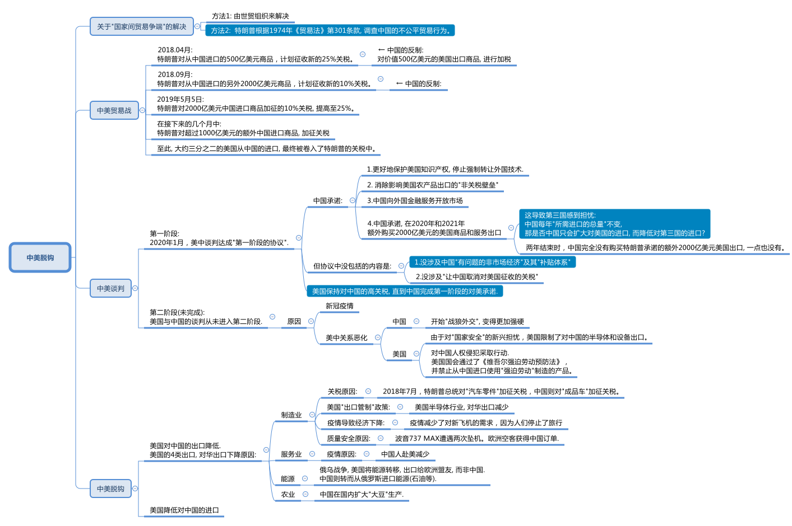

= 2025.03.10 US-China trade war fallout This is what decoupling looks like
:toc: left
:toclevels: 3
:sectnums:
:stylesheet: ../../../myAdocCss.css

'''

== 本文核心观点

'''

== 释义

=== 贸易战的开端 ===

The U.S.-China trade war began in March of 2018. The U.S. government released a 200-page report *calling out* China for a number of ways 后定 it was being unfair 不公平的；不公正的. China was stealing 偷盗；抄袭 American intellectual 智力的；知识的 property 财产；知识产权. The Chinese government was forcing U.S. companies to transfer (v.)转移；转让 their technology to local Chinese firms 公司；企业.

The first week of April, President Donald Trump threatened 威胁；恐吓 China with tariffs 关税. Within hours, China said it would retaliate 报复；反击. The next day, Trump threatened (v.)威胁，恐吓 more tariffs. With the actions of those three days, the trade war was suddenly on. The first round of tariffs would not officially be imposed 强加；强制执行 until July, but March of 2018 is when the world began to change.

The U.S.-China _tariff conflict_ 冲突；矛盾 became the biggest trade dispute 争端；争议 since the end of the Second World War. `主` #What# 后定 started small `谓` *#concluded (v.)结束；得出结论 with#* `主` the world’s two largest economies `谓` suddenly putting (v.) tariffs on over $400 billion of international trade —more than half of their imports and exports with each other. Five years later, and the trade war never really ended. A truce 休战；停战 has now been in place 在适当的位置；适当 for over three years, but almost all of those _trade war tariffs_ 贸易战关税 never left. The U.S. and China are on a new path, often *referred to as*  被称为 "decoupling 分离；脱钩;去耦."

[.my2]
====
美中贸易战始于2018年3月。美国政府发布了一份200页的报告，指出中国在多个方面存在不公平行为。中国窃取了美国的知识产权。*中国政府强制美国公司将其技术转让给当地的中国企业。*

四月的第一周，唐纳德·特朗普总统威胁要对中国加征关税。几小时之内，中国表示将进行报复。第二天，特朗普威胁要加征更多关税。在这三天的行动下，贸易战突然爆发。第一轮关税直到7月才正式实施，但2018年3月是世界开始发生变化的时刻。

美中关税冲突, 成为自第二次世界大战结束以来最大的贸易争端。起初规模较小的事件，**最终以全球两大经济体突然对超过4000亿美元的国际贸易加征关税而告终，这超过了两者之间进出口总额的一半。**五年后，贸易战从未真正结束。现在已经维持了超过三年的休战，*但几乎所有贸易战关税, 都未取消。美国和中国走上了一条新道路，通常被称为“脱钩”。*
====

=== 贸易战中的矛盾与韧性 ===
At the same time, there is this emerging 新兴的；出现的 puzzle 难题；谜: `主` _two-way 双向的；相互的 trade_ between China and the U.S. `谓` showed resilience 韧性；复原力 in 2022 despite _ongoing frictions_ 摩擦；不和. `主` Newly released data from the U.S. Commerce Department `谓` shows China-U.S. _goods trade_ hit (v.) a record high of $690.6 billion last year. Somehow 以某种方式，由于某种不明原因，不知为什么, U.S.-China trade—both the imports and their exports—are now higher than ever, even though there is this "decoupling 分离；脱钩."

This episode 插曲；片段 reconciles (v.)使和谐一致；调和；使配合 these seeming (a.) contradictions 矛盾；对立. It tells the story of _the trade war_ and it explains (v.) what has happened to _U.S.-China trade_ in the five years since. You are listening to an episode of _Trade Talks_, a podcast about the economics of trade and policy. I’m your host, Chad Bown, the Reginald Jones _Senior Fellow_ 资深研究员 at the Peterson Institute for International Economics in Washington.

[.my2]
====
与此同时，一个新出现的难题浮现出来：尽管2022年持续存在摩擦，*中美之间的双向贸易展现了韧性。美国商务部新发布的数据显示，去年中美货物贸易达到创纪录的6906亿美元。不知何故，尽管存在“脱钩”，中美贸易——包括进口和出口——现在比以往任何时候都要高。*

本期节目调和了这些看似矛盾的现象。它讲述了贸易战的故事，并解释了过去五年中美贸易发生了什么。您正在收听的是《贸易对话》的一期节目，这是一档关于贸易和政策经济学的播客。我是您的主持人查德·鲍恩，华盛顿"彼得森国际经济研究所"的雷金纳德·琼斯高级研究员。
====

=== 第一部分：贸易战的起因 ===

==== 特朗普的竞选承诺与贸易政策 ====
On the campaign trail 在竞选活动中 in 2016, candidate (n.)候选人，申请者 Donald Trump promised a different approach 方法；途径 to trade, and especially to trade with China. Trump complained about China stealing American jobs. He was especially focused on _the bilateral 双边的 trade deficit_ 赤字；逆差—that China was *selling* more *to* the United States than it was buying.

Once elected (v.), Trump *followed (v.) through* 把…进行到底；完成（开了头的事）; 贯彻执行；完成 on many of his promises to act (v.) on trade. First, he forced the renegotiation 重新谈判 of NAFTA, the trade agreement between the United States, Canada, and Mexico. Then he *imposed* 强加；强制执行 _controversial 有争议的 tariffs_ *on* imports of steel and aluminum 铝 *under the name of* 以……的名义 protecting America’s national security. But Trump’s _biggest moves_ on trade `谓` involved the U.S. relationship with China.

[.my2]
====
在2016年的竞选活动中，候选人唐纳德·特朗普承诺, 对贸易采取不同的方法，尤其是对与中国的贸易。他抱怨中国窃取了美国的工作机会。他特别关注**双边贸易赤字——中国对美国的销售, 超过其购买。**

一旦当选，特朗普贯彻执行了许多关于贸易的承诺。首先，他强制重新谈判了《北美自由贸易协定》，这是美国、加拿大和墨西哥之间的贸易协议。然后，他以保护美国国家安全的名义，对钢和铝的进口加征了有争议的关税。但特朗普在贸易上的最大动作, 涉及美国与中国的关系。
====

==== 301条款调查 ====
In August of 2017, less than one year into his administration 行政；管理, Trump’s _U.S. Trade Representative_, Robert Lighthizer, began the process. He announced 宣布，宣告；通知；声称 `主` the government `谓` was going to investigate (v.)调查；研究 China’s _unfair trade practices_ under__ Section 301__ of _the Trade Act of 1974_. This was weird 奇怪的，不寻常的；怪异的 —*not that* 并不是说,不是因为 the U.S. had problems (n.) with China’s policies; that was definitely not weird. Previous administrations had found (v.) the same thing and they’d chosen to tackle (v.) 处理；对付 the problem differently, including by *bringing* China *to* formal 正式的，规范的；合法 dispute settlement 解决；和解 at the WTO. *What was weird was that* Trump was dusting off 掸去灰尘；重新使用 an old law. This Section 301 had been used a lot in the 1980s and 1990s, but since the start of the WTO in 1995, it had *been pushed to the side* 被搁置；被忽视. But with Trump, something was truly different.

On March 22nd, 2018, the Trump administration *released* the findings of the Section 301 investigation *to* the public. Over 200 pages, the United States detailed 详细说明；详述 its complaints: China was stealing American _intellectual 智力的；知识的 property_ 财产；知识产权; it was forcing the transfer 转移；转让 of American technology to Chinese firms without paying them enough compensation 补偿；赔偿. The report made _lots and lots of_ detailed allegations 指控；断言, but to President Trump, it was all about the trade deficit 赤字；逆差, in particular with China.

“We’re going to be doing a Section 301 trade action. It could be about $60 billion dollars, but that’s really just a fraction 部分；小部分 of what we’re talking about. I’ve been speaking with the highest Chinese representatives, including the president, and I’ve asked them to reduce 减少；降低 the trade deficit immediately by $100 billion. It’s a lot.”

[.my2]
====
2017年8月，在特朗普执政不到一年时，他的美国贸易代表罗伯特·莱特希泽启动了程序。他宣布政府将**根据1974年《贸易法》第301条款, 调查中国的不公平贸易行为。**这很奇怪——不是因为美国对中国的政策有问题，这一点确实不奇怪。*此前的政府也发现了同样的问题，但他们选择以不同的方式处理，包括将中国带到世界贸易组织的正式争端解决程序。奇怪的是，特朗普重新使用了一部旧法律。第301条款在20世纪80年代和90年代被广泛使用，但自1995年WTO成立以来，它已被搁置一边。但在特朗普领导下，情况确实有所不同。*

2018年3月22日，**特朗普政府向公众发布了"第301条款"调查的结果。在超过200页的报告中，美国详细说明了其投诉：中国窃取美国知识产权；它强制将美国技术转让给中国公司，却没有支付足够的补偿。该报告提出了大量详细的指控，但对特朗普总统来说，一切都围绕着贸易赤字，**尤其是与中国的贸易赤字。

“我们将要采取"第301条款"的贸易行动。这可能涉及600亿美元，但这只是我们讨论内容的一小部分。**我已与中国**的最高代表，包括总统，**进行交谈，我要求他们立即将贸易赤字减少1000亿美元。**这是一个很大的数字。”
====

==== 贸易战升级 ====
Ten days later, in the first week of April, the trade war first started to spiral (v.)螺旋上升；急剧恶化. The Trump administration released a list of products it planned to hit (v.) with new 25% tariffs. That list covered $50 billion of imports from China—not the $60 billion that President Trump had stated (v.)陈述，说明 earlier. This was the first of many confusing parts of the details of _how U.S. policy was changing_ during President Trump’s trade war.

Within hours, the Chinese government had released its own list of $50 billion worth of U.S. exports *over which* it promised to retaliate 报复；反击, including against _American exports_ of soybeans 大豆 and cars. Upset, Trump escalated (v.)使升级；使加剧 things further (ad.)更远地，再往前地；进一步. The next day, he instructed 指示；命令 the U.S. Trade Representative to find an additional $100 billion of imported products from China for even more tariffs. Trump also told his Agriculture Secretary *to come up with 提出；想出 a plan* to protect American farmers /should China implement (v.)实施；执行 its retaliatory (a.)报复的 tariffs.

The trade war was suddenly on. The first U.S. and Chinese tariffs were imposed 强加；强制执行 in July of 2018. Another round *went on* 继续进行 in August. Combined, each side had now imposed tariffs 后定 covering $50 billion worth of trade. Following the Chinese tariffs on U.S. agricultural exports like soybeans 大豆, the Trump administration said it would provide *up to* 多达 $12 billion of subsidies 补贴；津贴 to support American farmers. Over the next two years, the Trump administration would pay out 支付；发放 _tens of billions of dollars_ of subsidies 补助金，补贴，津贴 to those farmers. The other parts of the U.S. economy hurt (n.) by the trade war, especially the manufacturing sector 部门；行业, did not receive (v.) subsidies.

In September of 2018, Trump *followed through with* 把…进行到底；完成（开了头的事）;贯彻执行；完成 his second threat 后定 made (v.) during that fateful 决定性的；致命的 first week in April. He put tariffs on another _$200 billion of imports_ from China. Again, this was confusing 因为 as *it was not the same as* Trump’s original announcement —it was $200 billion and not $100 billion, and it was also a tariff of 10% *as opposed to* 与……相对比 early indications 迹象；指示 of 25%. But again, China immediately retaliated.

[.my2]
====
十天后，在四月的第一周，"贸易战"开始急剧恶化。*特朗普政府发布了一份产品清单，计划对其征收新的25%关税。该清单涵盖了从中国进口的500亿美元商品*——而不是特朗普早先所说的600亿美元。这是特朗普贸易战期间, 美国政策变化细节中许多令人困惑的部分之一。

几小时之内，*中国政府发布了自己的清单，涉及价值500亿美元的美国出口商品，并承诺对其进行报复*，包括对美国大豆和汽车的出口。**特朗普对此感到不满，进一步升级了局势。第二天，他指示美国贸易代表再找出价值1000亿美元的从中国进口的产品，以加征更多关税。**特朗普还告诉农业部长制定计划，以在中国的报复性关税实施时保护美国农民。

贸易战突然爆发。2018年7月，美国和中国的第一轮关税被强制执行。8月又进行了一轮。综合来看，双方现已对价值500亿美元的贸易加征关税。**在中国对美国农业出口（如大豆）加征关税后，特朗普政府表示将提供高达120亿美元的补贴来支持美国农民。**在接下来的两年里，特朗普政府向这些农民支付了数百亿美元的补贴。*"贸易战"伤害的美国经济其他部分，尤其是制造业部门，却没有获得补贴。*

**2018年9月，特朗普**贯彻执行了他在四月第一周那个决定性时刻发出的第二个威胁。他**对另外2000亿美元的中国进口商品加征关税。**这再次令人困惑，因为**这与他最初的声明不一致——是2000亿美元而非1000亿美元，关税率也为10%，而不是早先迹象显示的25%。但中国再次立即进行了报复。**
====

==== 暂时休战 ====
Over the next few months, things quieted down 平静下来；安定下来—no new tariff threats (n.), but also it was unclear what was going on—until finally, in December of 2018, President Trump and Chinese President Xi Jinping *had a dinner meeting* at the G20 in _Buenos Aires_ 阿根廷的首都. They called a temporary truce 休战；停战 to their _tariff escalation_ (使升级；使加剧)关税升级. They instructed (v.)指示；命令；吩咐 their _trade teams_ to start negotiating 谈判；协商. With the media and cameras *clicking away* 不停地点击; 迅速离开；匆忙完成 at the dinner, Trump sounded (v.) optimistic 乐观的；积极的:

“The relationship is very special—the relationship that I have with President Xi—and I think that is going to be a very primary 主要的；首要的 reason why *we’ll probably* end up 最终成为；最终到达 **getting something** that will be good for China and good for the United States. So we very much appreciate this.”

The U.S. and China negotiated. It looked like they were closing in 接近；靠近 on  a deal. The U.S. administration leaked (v.) to the press 向新闻界泄露 what the agreement was expected to cover. The U.S. side also signaled (v.) 以动作向……示意；用信号发出，用信号通知；向……发信号 what the agreement was not going to cover—in particular, the deal would not remove all of those newly imposed tariffs. Nevertheless 然而，不过, it looked like there would be a deal.

Then, in early May, the key U.S. negotiators 谈判代表— Lighthizer 人名 *as well as* _Treasury Secretary_ 财政部长 Steven Mnuchin —took one last trip （尤指短程往返的）旅行，旅游；出门 to Beijing to finalize (v.)最终确定；完成 the agreement. But then the talks collapsed 崩溃；失败. On May 5th of 2019, the trade war was suddenly back on 重新恢复. President Trump tweeted (v.)发出叽叽喳喳的声音；在推特上发贴 that the 10% tariffs he had imposed in September on $200 billion of Chinese imports —those tariffs would immediately *increase to* 25%. And Trump tweeted (v.) that the rest of U.S. imports (n.) from China, another $300 billion *or so* 大约，左右 of trade, would also be hit (v.)达到（一个特定的水平，阶段，数字）；碰到 with 25% tariffs “shortly 不久；很快.”

Now, once again, the details of Trump’s tariffs didn’t quite match (v.) the president’s tweet. But over the next few months, Trump did *escalate* (v.)（使）变得严重，（使）升级；迅速增加，迅速增长；逐步增强 things *further* by imposing (v.) tariffs on more than $100 billion of additional imports from China. `主` Roughly two-thirds of U.S. imports from China `谓` would eventually be caught up in 被卷入；陷入 Trump’s tariffs.

[.my2]
====
**在接下来的几个月中，局势平静下来——没有新的关税威胁，**但也不清楚发生了什么——直到2018年12月，特朗普总统和中国国家主席习近平在布宜诺斯艾利斯的G20会议上共进晚餐。他们宣布对其关税升级进行临时休战。他们指示各自的贸易团队开始谈判。在晚宴上，媒体和相机忙碌地记录，特朗普听起来很乐观：

“这种关系非常特殊——我与习近平主席的关系——我认为这将是我们最终达成对中国和美国都有利的结果的首要原因。所以我们非常感激这一点。”

**美国和中国进行了谈判。**看起来他们正在接近达成协议。美国政府向新闻界泄露了协议预计涵盖的内容。美国方面还表明了协议不会涵盖的内容——特别是，**该协议不会取消所有新加征的关税。**尽管如此，看起来似乎会有一个协议。

然后，在五月初，关键的美国谈判代表——莱特希泽以及财政部长史蒂文·姆努钦——最后一次前往北京以最终确定协议。但随后**谈判崩溃了。2019年5月5日，贸易战突然重新开始。**特朗普发推文称，他9月**对2000亿美元中国进口商品加征的10%关税将立即提高至25%。**特朗普还发推文称，*美国从中国的其余进口商品，大约3000亿美元的贸易，也将“很快”被加征25%的关税。*

**现在，特朗普的关税细节, 再一次与他的推文不完全匹配。**但在接下来的几个月中，特朗普通过对超过1000亿美元的额外中国进口商品加征关税进一步升级了局势。*大约三分之二的美国从中国的进口最终被卷入了特朗普的关税中。*
====

==== 关税调整与消费者考虑 ====
`主` One interesting development 发展；进展—and important for what is happening today — `谓` took place in August of 2019. Trump decided to postpone (v.)推迟；延期 putting tariffs on over $150 billion of imports of products like mobile phones, laptops, computer monitors 电脑显示器, video game consoles 控制台；操纵台, and toys. Here is Trump standing (v.) under _the Marine 海洋的 One helicopter_ explaining why he was delaying those tariffs further past December 15:

“We’re doing this for Christmas season, uh, *just in case* 以防万一 some of the tariffs would have an impact 影响；作用 on U.S. customers, which *so far* 到目前为止 they’ve had virtually 几乎；实际上 none. The only impact has been that we’ve collected almost $60 billion from China, compliments 赞扬；称赞 of China. But *just in case* they might have an impact on people, `主` what we’ve done `系` is we’ve delayed it *so that* they won’t be relevant (a.)相关的；切题的;有价值的；有意义的 for the Christmas shopping season.”

Trump initially 最初；起初 delayed (v.) those tariffs because of the products they would hit—they were consumer goods 消费品；日用品. Most of his earlier rounds of tariffs had hit (v.) parts and components 组成部分；部件 or inputs bought by companies. `主` Tariffs on phones and toys and computers `谓` might increase (v.) consumer prices quickly and noticeably 明显地；显著地, making him unpopular /right during the Christmas shopping season.

Of course, Trump was being inconsistent 不一致的；矛盾的. His other claim was that `主` the $60 billion of tariff revenue 收入；税收 being collected by the U.S. government `系` was “compliments (n.)恭维；问候；道贺 of China.” `主` Economic research (n.) `谓` would refute (v.)驳斥；反驳, time and again, Trump’s claim that China was paying for his tariffs. It was American buyers who were paying the cost of those tariffs.

Anyway, before `主` that last and final round of tariffs on consumer products `谓` was scheduled to go on in December of 2019, the U.S. and China announced (v.) they had reached a deal. After more than _a year and a half_ of tariff escalation, the trade war was finally over—sort of.

[.my2]
====
2019年8月发生了一个有趣且对今天情况重要的进展。**特朗普决定推迟对超过1500亿美元的进口产品加征关税，**这些产品包括手机、笔记本电脑、显示器、视频游戏控制台和玩具。以下是特朗普站在“海军一号”直升机下, 解释为何将**这些关税推迟到12月15日之后：**

“**我们这样做是为了圣诞季，**呃，**以防有些关税会对美国客户产生影响，**到目前为止它们几乎没有影响。唯一的影响是我们从中国收取了近600亿美元，这是中国的‘馈赠’。但以防它们可能对人们产生影响，我们所做的就是推迟它们，使其与圣诞购物季无关。”

特朗普最初推迟这些关税, 是因为它们针对的产品是消费品。他之前几轮关税主要针对公司购买的部件和组件。对手机、玩具和电脑加征关税, 可能会迅速且显著地提高消费价格，使他在圣诞购物季变得不受欢迎。

**当然，特朗普的说法是不一致的。**他还声称美国政府收取的600亿美元关税收入是“中国的馈赠”。*经济研究一次又一次地驳斥了特朗普关于中国支付其关税的主张。实际支付这些关税成本的, 是美国买家。*

无论如何，在2019年12月对消费品的最后一轮关税按计划实施之前，美国和中国宣布达成了一项协议。经过"一年半多"的关税升级，贸易战终于结束了——某种程度上是这样。
====

=== 第二部分：贸易战休战与第一阶段协议 ===
In January of 2020, President Trump put on 举办；上演 a big event. The White House would host an elaborate 精心制作的；复杂的 signing ceremony for his new trade agreement with China. In attendance 在场的；出席的 were a lot of VIPs. The ceremony was long, it was televised, it was awkward 尴尬的；笨拙的.

“Today we take a momentous 重大的；重要的 step—one that has never been taken before with China—toward a future of fair and reciprocal 互助的；相互的 trade as we sign phase one of the historic trade deal between the United States and China. Together, we are righting the wrongs of the past and delivering a future of economic justice 正义；公平 and security for American workers, farmers, and families. I want to thank President Xi, who is watching as we speak, and I’ll be going over to China in the not-too-distant future to reciprocate 报答；回报. But I want to thank President Xi, a very, very good friend of mine.”

For trade nerds, what mattered were the legal details of that deal—what had China and the United States committed to 承诺；保证 in the text of this agreement? China said it would do a number of things. Chapters 1 and 2 contained promises to better protect American intellectual 智力的；知识的 property 财产；知识产权 and to stop forcing the transfer 转移；转让 of foreign technology. Chapter 3 explained how it would get rid of 去除；消灭 non-tariff barriers 障碍；壁垒 impacting American farm exports. Chapter 4 committed China to opening up 开放；开发 its market to foreign financial services.

But the headline for President Trump was something else entirely 完全地；全然地. To reduce the bilateral 双边的 trade deficit 赤字；逆差, Trump got China to commit to buy an additional $200 billion of American goods and services exports over 2020 and 2021.

“Phase one will also see China greatly expand 扩展；扩大 imports to the United States. What’s to me very important—number one—they’re going to be spending much more than $200 billion over the next two years, including up to $50 billion just on agriculture alone.”

That additional $200 billion of U.S. exports over the next two years is super important, and we will come back to that momentarily 片刻地；即时地. Equally important, though, is what was not in that deal. There was nothing about China’s problematic non-market economy and its system of subsidies 补贴；津贴. There was also nothing about China removing its trade war tariffs on tens of billions of dollars of U.S. exports. China would later announce a government process whereby the government would decide which Chinese companies would not have to pay tariffs on U.S. goods. But this was at odds with 与……不一致；与……冲突 a separate American complaint about the centralized 集中的；中央集权的, state-run nature of the Chinese economic system. Letting the Chinese government decide which companies would be exempt from 免除；豁免 the tariffs put more power into government hands instead of the private sector 部门；行业, which seemed massively inconsistent 不一致的；矛盾的 with Washington’s underlying 根本的；基础的 concerns.

Finally, this weird U.S.-China deal made the rest of the world nervous. Maybe Trump’s $200 billion of purchase commitments would just come at their expense 以……为代价；牺牲. Maybe China would buy more American stuff, but China would not increase its imports overall. So more U.S. exports would mean fewer exports from Europe, Japan, Brazil, and everyone else. The world was watching.

On the U.S. side, the United States did not commit to do anything differently. Again, here is President Trump at that signing ceremony:

“As soon as this kicks in 开始生效；起作用, we’ll be starting phase two. We’re leaving tariffs on, which people were shocked [about], but it’s great. But, uh, I will agree to take those tariffs off if we are able to do phase two.”

Almost all of the tariffs that Trump had imposed over the previous 18 months would remain in place 保持原位；适当. They are still in place today. There was never a phase two in the U.S.-China negotiations, in part because the world suddenly changed.

中文翻译：

2020年1月，特朗普总统举办了一场盛大的活动。白宫将为他与中国的新的贸易协议, 举行一个精心制作的签署仪式。许多重要人物出席了仪式。仪式很长，通过电视播出，显得有些尴尬。

“今天我们迈出了重要的一步——这是此前从未与中国采取过的一步——朝着公平和互助贸易的未来迈进，我们签署了美国与中国之间具有历史意义的"第一阶段贸易协议"。我们一起纠正过去的错误，为美国工人、农民和家庭, 带来经济正义与安全的未来。我要感谢习近平主席，他正在观看我们此刻的讲话，我将在不久的将来前往中国以示回报。我要感谢习近平主席，他是我的非常非常好的朋友。”

对于贸易爱好者来说，**重要的是该协议的法律细节——中国和美国在协议文本中承诺了什么？**中国表示将采取多项措施。*第1章和第2章包含了更好地保护美国知识产权, 和停止强制转让外国技术的承诺。第3章解释了如何消除影响美国农产品出口的"非关税壁垒"。第4章承诺中国向外国金融服务开放市场。*

但对特朗普总统来说，*最重要的完全是另一回事。为了减少"双边贸易赤字"，特朗普让中国承诺, 在2020年和2021年额外购买2000亿美元的美国商品和服务出口。*

“第一阶段, 还将**使中国大幅扩大对美国的进口。**对我来说非常重要——第一点——他们在未来两年将花费超过2000亿美元，其中仅农业就高达500亿美元。”

这额外2000亿美元的美国出口, 在未来两年非常重要，我们稍后会回到这一点。**同样重要的是协议中没有的内容。没有涉及中国"有问题的非市场经济"及其"补贴体系"。也没有涉及中国"取消对数十亿美元美国出口的贸易战关税"。**

*中国后来宣布了一个政府程序，由政府决定哪些中国公司不必支付美国商品的关税。但这与美国对中央集权、国有经济体系性质的单独投诉, 相冲突。让中国政府决定哪些公司免除关税，将更多权力交给政府而非私营部门，这似乎与华盛顿的根本关切极为不一致。*

最后，**这个奇怪的美中交易, 让世界其他国家感到紧张。也许特朗普2000亿美元的采购承诺, 会以它们的牺牲为代价。也许中国会购买更多美国产品，但中国从整个世界的总体进口额不会增加。因此，更多的美国出口将意味着欧洲、日本、巴西和其他国家的出口减少。**全世界都在关注。

在美国方面，美国没有承诺做出任何不同的举动。再次，这是特朗普在签字仪式上的讲话：

“一旦这开始生效，我们将启动第二阶段。**我们保留了关税，**这让人们感到震惊，但这很棒。*但是，如果我们能够完成第二阶段，我会同意取消这些关税。*”

**特朗普在之前18个月加征的几乎所有关税, 都保持原位。它们至今仍在实施。美国与中国的谈判从未进入第二阶段，部分原因是世界突然发生了变化。**

==== 疫情与地缘政治的影响 ====
COVID-19 emerged 出现；浮现 in China in late 2019. By January, the disease was already spreading globally. On March 11th, the World Health Organization called the outbreak 爆发；疫情 a global pandemic 流行病；瘟疫. Over the next three years, the world suffered tremendously 极大地；非常地. Tens of millions of people would die, trillions of dollars of economic activity would be lost because of lockdowns 封锁；关闭 and other shocks to the global economy. Weirdly, though, some elements of the pandemic spurred 激励；刺激 more trade. We’ll come back to that later in the story.

During this period, though, China also showed signs of change. Its aggressive 侵略的；好斗的 “wolf warrior” diplomacy signaled a more hostile 敌对的；不友好的 foreign policy. China engaged in 参与；从事 economic coercion 强制；强迫, punishing countries like Canada, Australia, and Lithuania with trade restrictions when it did not like their government policies. In Hong Kong, China cracked down on 镇压；打击 democracy protests and implemented 实施；执行 a national security law. China mounted new military exercises around the island of Taiwan, and there were concerns over a potential 潜在的；可能的 invasion 入侵；侵略. Chinese President Xi Jinping promised a “no limits” partnership with Russian President Vladimir Putin. This put the world on notice 提醒；通知 when Russia subsequently 随后；接着 invaded Ukraine and started a brutal 残忍的；野蛮的 and deadly war.

In Washington, things were changing as well. At the same time that President Trump’s trade deal wanted to expand U.S. exports to China by an additional $200 billion, another part of his administration was limiting exports to China of things like semiconductors 半导体 and equipment due to emerging concerns over national security. American policymakers also began to take action on human rights abuses in China, especially in the Xinjiang region. The U.S. Congress would eventually pass into law 通过法律 the Uyghur Forced Labor Prevention Act and ban imports of products from China made using forced labor.

Then, in November of 2020, a new U.S. president was elected. President Trump was now out. President Joe Biden would have different policy priorities than dealing with China on trade. He had to fight the pandemic. The Biden administration focused its policy efforts at home with its “Build Back Better” legislation 立法；法律. It passed laws for new infrastructure 基础设施；基础建设 as well as some industrial policy, including for semiconductor manufacturing as well as clean energy products to tackle 处理；对付 climate change.

On trade policy, the first two years of the Biden administration mostly ignored China. Where it needed to do anything at all on trade, it engaged directly with countries aside from China. With its allies in Europe, it created the Trade and Technology Council. With Japan, South Korea, Australia, and other countries in Asia, it began to negotiate the Indo-Pacific Economic Framework (IPEF). With the trade war no longer in the day-to-day headlines, the big question was: whatever happened to U.S.-China trade?

中文翻译：

**COVID-19于2019年末, 在中国出现。**到1月，这种疾病已在全球传播。3月11日，世界卫生组织将此次爆发称为全球流行病。在接下来的三年中，世界遭受了极大的痛苦。数千万人死亡，**由于封锁和其他对全球经济的冲击，数万亿美元的经济活动损失。**然而，奇怪的是，疫情的某些因素刺激了更多贸易。我们将在后面的故事中回到这一点。

**在此期间，中国也显示出变化的迹象。其好斗的“战狼外交”**表明了更敌对的外交政策。**中国从事经济强制(经济胁迫)，当它不喜欢某些国家的政府政策时，对加拿大、澳大利亚和立陶宛等国, 实施贸易限制。**在香港，中国镇压民主抗议活动, 并实施了国家安全法。中国在台湾岛周围开展了新的军事演习，人们担心可能发生入侵。中国国家主席习近平承诺与俄罗斯总统弗拉基米尔·普京建立“无限制”的伙伴关系。这在俄罗斯随后入侵乌克兰 ,并开始一场残忍而致命的战争时, 提醒了全世界。

**在华盛顿，情况也在变化。**在特朗普的贸易协议希望将美国对中国的出口, 额外增加2000亿美元的同时，他的政府另一部分, **由于对"国家安全"的新兴担忧，限制了对中国的半导体和设备出口。美国政策制定者也开始对中国人权侵犯采取行动，**特别是在新疆地区。*美国国会最终通过了《维吾尔强迫劳动预防法》，并禁止从中国进口使用"强迫劳动"制造的产品。*

然后，**在2020年11月，一位新的美国总统当选。特朗普不再执政。乔·拜登总统的政策重点, 与处理"对华贸易"不同。**他必须对抗疫情。**拜登政府将政策重点放在国内，**通过其“重建更好”立法。它通过了关于"新基础设施"以及一些"产业政策"的法律，包括半导体制造和清洁能源产品，以应对气候变化。

*在贸易政策上，拜登政府的前两年大多忽视了中国。在需要处理贸易问题时，它直接与"除中国以外的国家"接触。与欧洲的盟友一起，它创建了贸易和技术理事会。与日本、韩国、澳大利亚和亚洲其他国家，它开始谈判《印度-太平洋经济框架》（IPEF）。随着贸易战不再是日常头条新闻，一个大问题是：美中贸易发生了什么？*

=== 第三部分：美国对中国的出口 ===
To understand what has happened to U.S. exports to China, it is useful to view them within the context 背景；语境 of President Trump’s own Phase 1 agreement. Here he was in January of 2020 in Davos at the World Economic Forum, less than a week after his White House signing ceremony:

“Additionally, China will spend an additional $200 billion over two years on American services, agriculture, and energy, and manufactured goods. So we’ll be taking in excess of 接受；超过 $200 billion—could be closer to $300 billion—when it finishes.”

We collected the data and added up the numbers. By the time those two years had finished, China had purchased exactly none of the additional $200 billion of U.S. exports Trump promised it would buy—not $100 billion, not $200 billion, and certainly not $300 billion—none. In 2022, U.S. exports to China did not get much better.

Exports last year did go up slightly, so in value terms, technically, U.S. exports to China have set new records. That media headline has generated some confusion, but that record-level headline is pretty meaningless. Even if export volumes never went up, with any amount of inflation 通货膨胀；膨胀, price increases would mean exports reached record levels every year.

A better comparison is how high U.S. exports would be today were it not for the trade war. Suppose that since 2018, U.S. exports to China had simply grown at the same rate as China’s imports from the world—no more, no less, just the average. By the end of 2022, U.S. exports to China were now 23% lower than that benchmark 基准；标准.

To help me dig into 深入研究；探究 the reasons why China seems to be decoupling 分离；脱钩 from its buying of U.S. exports, I will be joined by Eling Wang, my colleague here at the Peterson Institute.

“Hi, Eling.”

“Hi, Chad.”

“Okay, as President Trump said, there are basically four sets of U.S. exports we want to look at: manufacturing, services, energy, and agriculture. Let’s start with manufacturing.”

中文翻译：

要了解美国对中国的出口发生了什么，在特朗普总统自己的第一阶段协议背景下看待它们是有用的。以下是2020年1月他在达沃斯世界经济论坛上的讲话，距离他在白宫的签字仪式不到一周：

“此外，中国将在两年内, 额外花费2000亿美元购买美国服务、农业、能源和制成品。因此，我们将接受超过2000亿美元——可能接近3000亿美元——当这一切结束时。”

我们收集了数据, 并计算了数字。*到这两年结束时，中国完全没有购买特朗普承诺的额外2000亿美元美国出口*——不是1000亿美元，不是2000亿美元，当然也不是3000亿美元——*一点也没有。2022年，美国对中国的出口没有太大改善。*

去年的出口略有上升，因此在价值方面，技术上来说，美国对中国的出口创下了新纪录。这个媒体头条引起了一些困惑，但这个创纪录的头条相当没有意义。即使出口量从未增加，任何程度的通货膨胀和价格上涨, 都意味着出口每年都会达到创纪录水平。

更好的比较是，如果没有贸易战，今天美国对中国的出口会有多高。假设自2018年以来，美国对中国的出口, 仅以"中国从世界进口的平均增长率"增长——不多不少，只是平均水平。到2022年底，美国对中国的出口比那个基准低23%。

为了帮助我深入探究中国似乎正在从购买美国出口中"脱钩"的原因，我将与我在彼得森研究所的同事王艾玲一起讨论。

“嗨，艾玲。”

“嗨，查德。”

“好吧，正如特朗普总统所说，我们要看的**基本上有四类美国出口：制造业、服务业、能源和农业。**我们从制造业开始。”

==== 制造业出口 ====
Manufacturing is important because it was the biggest part of U.S. exports to China before the trade war. The U.S. used to export a lot of cars, airplanes, semiconductor 半导体 equipment, and chips to China. In 2022, U.S. manufacturing exports to China were still lower than pre-trade war levels. They were also 23% lower than that benchmark 基准；标准 projection 预测；规划 if we imagine President Trump had not started a trade war.

Going back to the trade war, in July of 2018, President Trump put tariffs on car parts, and China put tariffs on finished cars. With tariffs on its inputs and its output, Tesla said it was no longer profitable 有利可图的；赚钱的 to ship electric vehicles to China from its American plants 工厂；车间. It expedited 加快；促进 construction of its factory in China, and Tesla now sells to Chinese consumers and exports to the world from its Gigafactory in Shanghai. American auto exports to China have never come back.

Other problems for manufacturing have little to do with the tariffs. Boeing’s 737 MAX suffered two crashes. China, the United States, and lots of countries grounded 使停飞；禁止飞行 the model for months to try to figure out 弄清楚；理解 what went wrong. And then the pandemic reduced demand for new planes as people stopped traveling, especially into and out of China. But by 2022, China had started buying planes again. Boeing’s main competitor 竞争者；对手, Airbus from Europe, had announced major new orders from Chinese airlines. For Boeing, there have not been similar announcements of airplane orders from China. U.S. exports of aircraft to China fell off 下降；减少 and remain tiny.

Finally, take semiconductors and equipment. U.S. exports of these products were booming 繁荣；激增 during the trade war as well as during the pandemic, in part because China needed this stuff due to high demand for goods that used semiconductors—like computers and video games—when everybody was stuck at home during COVID-19. The sudden threat of U.S. export controls led to hoarding 囤积；储藏 by Chinese buyers beginning in 2019. But in 2022, all of that global demand for consumer electronics finally dropped off 下降；减少. Semiconductor sector exports to China declined 下降；减少 in 2022. With a major new U.S. export control policy announced in October, U.S. sales to China may never come back.

中文翻译：

**制造业很重要，因为在贸易战之前，它是美国对华出口的最大部分。**美国过去向中国出口大量汽车、飞机、半导体设备和芯片。**2022年，美国对中国的制造业出口, 仍低于"贸易战"前的水平。**如果我们设想特朗普没有发起贸易战，它们也比那个基准预测低23%。

回顾贸易战，*2018年7月，特朗普总统对"汽车零件"加征关税，中国则对"成品车"加征关税。由于其输入和输出都面临关税，特斯拉表示, 从其美国工厂向中国运送电动车, 不再有利可图。它加快了在中国的工厂建设，现在特斯拉通过其上海超级工厂, 向中国消费者销售并向全球出口。美国对中国的汽车出口从未恢复。*

**制造业的其他问题, 与"关税"关系不大。波音737 MAX遭遇两次坠机。中国、美国和其他许多国家将该型号停飞数月，**试图弄清楚问题所在。*然后疫情减少了对新飞机的需求，因为人们停止了旅行*，尤其是进出中国。但到2022年，中国又开始购买飞机。**波音的主要竞争对手——欧洲的空客——宣布了中国航空公司的大量新订单。**而对于波音，没有类似的中国飞机订单公告。美国对中国的飞机出口下降并保持微量。

最后，*看看半导体和设备。这些产品的美国出口在贸易战和疫情期间激增，部分原因是由于COVID-19期间每个人都困在家中，中国对使用半导体的商品（如计算机和视频游戏）需求很高。2019年开始，美国出口管制的突然威胁, 导致中国买家囤积。但在2022年，全球对消费电子产品的需求终于下降。2022年，半导体行业的对华出口减少。随着10月宣布的一项重大美国"出口管制"政策，美国对中国的销售可能永远不会恢复。*

==== 服务业出口 ====
Next up is services. Prior to 在……之前 the trade war, services were the second biggest part of U.S. exports to China. U.S. services exports to China fell dramatically 大幅地；急剧地 in 2020. In 2022, they remained 25% lower than their peak 高峰；顶点. During the trade war of 2018-2019, U.S. services exports to China actually did okay—tariffs aren’t really a big thing for services trade. What really hurt services was the COVID-19 pandemic.

We don’t yet have the reasons why things have not improved in 2022—that detailed data won’t be available until July. At this point, all we know is that at an aggregate 总计的；合计的 level, services exports to China are not getting any better. But we do know why things were so bad in 2020 and 2021. One really big category of U.S. services exports to China involved travel—these are things like Chinese tourists coming to the United States, Chinese business people traveling here to make deals 达成交易；做生意 or to go to trade fairs, or Chinese students coming to study at American universities. With the pandemic and travel restrictions, all of these U.S. services exports fell by a lot.

For services, a second important example involved the other legal chapters of the Phase 1 agreement. In Chapter 1, China promised to improve the protection of foreign intellectual 智力的；知识的 property 财产；知识产权. The Chinese government also agreed to stop forcing the transfer 转移；转让 of technology in Chapter 2. If those commitments 承诺；保证 are kicking in 开始生效；起作用, Chinese companies should be paying bigger royalties 版税；使用费 or fees for their use of American technology. The evidence we have so far is that there has been no big increase in the total fees that Chinese firms pay for using American intellectual property.

A last example involves financial services—like banking, insurance, credit rating 信用评级, financial payments, and securities 证券；有价证券. In Chapter 4 of the Phase 1 agreement, China had also agreed to open up 开放；开发 its market to foreign providers of these financial services. Here too, U.S. financial services exports to China in 2020 and 2021 remained lower than pre-COVID levels.

中文翻译：

接下来是服务业。**在贸易战之前，"服务业"是美国对华出口的第二大组成部分。**2020年，美国对中国的服务业出口大幅下降。到2022年，它们仍比其高峰低25%。在2018-2019年的贸易战期间，美国对中国的服务业出口实际上表现还不错——*关税对服务业贸易影响不大。真正伤害服务业的是COVID-19疫情。*

**我们尚未得知2022年情况为何未改善的原因——详细数据要到7月才能获得。**目前，我们只知道在"总计水平"上，对中国的服务业出口没有好转。*但我们知道2020年和2021年为何如此糟糕。美国对中国的服务业出口一个重要类别, 涉及"旅行"——包括中国游客来美国、中国商人来此达成交易, 或参加贸易展览，以及中国学生来美国大学学习。由于疫情和旅行限制，所有这些美国服务业出口大幅下降。*

*对于服务业，第二个重要例子涉及"第一阶段协议"的其他法律章节。在第1章中，中国承诺改善对外国"知识产权"的保护。中国政府在第2章中也同意"停止强制技术转让"。如果这些承诺开始生效，中国公司应该为使用美国技术, 支付更高的版税或费用。我们目前掌握的证据是，中国公司为使用美国知识产权支付的总费用, 没有大幅增加。*

最后一个例子涉及金融服务——如银行、保险、信用评级、金融支付和证券。**在第一阶段协议的第4章中，中国也同意向外国金融服务提供者, 开放其市场。在这里，2020年和2021年美国对中国的金融服务出口, 仍低于疫情前水平。**

==== 能源出口 ====
The third part of U.S. exports to China involved energy products. Now, one concern is that the purchase commitments 承诺；保证 only really covered fossil fuels 化石燃料—carbon-based energy products like coal, crude oil 原油, and liquefied natural gas 液化天然气, or LNG. U.S. exports to China of these products did go up a lot in 2020 and 2021. But in 2022, U.S. exports of energy products to China dropped, and the details are even worse than the headline.

In value terms, U.S. energy exports to China fell by only 15%. But this really understates 低估；轻描淡写 the decline. In volume terms, U.S. shipments to China of energy products just disappeared. LNG and coal shipments, for example, fell by more than 75%. Russia’s invasion 入侵；侵略 of Ukraine is a big part of the story here. After Russia invaded Ukraine, Russia weaponized its energy supplies by cutting off 切断；中断 natural gas pipeline sales to Europe. Europe also ended up restricting imports from Russia of coal and oil products as part of its sanctions 制裁；处罚 packages. The United States stepped in 介入；插手 to help Europe—it shipped its exports of coal, oil, and LNG to the EU and UK instead of to China. China then started buying its energy from Russia and other countries instead.

中文翻译：

美国对中国的出口第三部分, 涉及**能源产品。现在，一个担忧是, "采购承诺"仅真正涵盖化石燃料——基于碳的能源产品，如煤、原油和液化天然气（LNG）。**2020年和2021年，美国对中国的这些产品出口大幅增加。**但在2022年，美国对中国的能源产品出口下降，**细节比头条新闻更糟。

在价值方面，美国对中国的能源出口仅下降了15%。但这低估了下降的程度。在数量方面，美国对中国的能源产品运输几乎消失。例如，LNG和煤的运输下降了超过75%。**俄罗斯对乌克兰的入侵是这里的一个重要原因。**俄罗斯入侵乌克兰后，通过切断对欧洲的天然气管道销售将其能源供应武器化。欧洲也最终作为其制裁方案的一部分限制了从俄罗斯进口煤和石油产品。*美国介入帮助欧洲——它将煤、油和LNG的出口运往欧盟和英国，而不是中国。中国则开始从俄罗斯和其他国家购买能源。*

==== 农业出口 ====
The last category of U.S. exports to China is agriculture. Agriculture was always in the headlines during the trade war for political reasons—farming communities tend to vote Republican and were big supporters of President Trump. Soybeans 大豆 especially were some of the most politically important products targeted by Chinese retaliatory tariffs. Because of those tariffs, farm exports disappeared during the trade war. As compensation 补偿；赔偿, the Trump administration gave those farmers tens of billions of dollars of federal subsidies 补贴；津贴.

Now, under the Phase 1 agreement, agriculture was the one sector to mount an export comeback 卷土重来；恢复. China did not quite reach the purchase commitments in the Phase 1 agreement for agriculture, but it was close. U.S. farm exports to China did very well in 2020 and 2021. In 2022, that continued. Agriculture was the only bright spot 亮点；积极方面 for U.S. exports to China. Farm exports were 16% higher than 2021. Soybeans are the biggest part of that, and soybean exports increased by 27% in 2022. Cotton also did well last year.

But beyond those products, U.S. farm exports to China have some problems. Similar to the energy story, prices of farm products skyrocketed 猛涨；暴涨 in 2022. There were lots of contributing reasons why—including the Russia-Ukraine war, but also bad weather in various parts of the world as well as countries imposing export restrictions. Each of these negatively impacted global supplies and the prices facing consumers. For corn and sorghum 高粱, U.S. export values only increased in 2022 because prices went up—shipments of corn and sorghum actually went down. For pork and wheat, export shipments to China fell sharply as well.

On agriculture, one last question involves U.S.-China dependency 依赖；依靠. Are Chinese buyers shifting toward other suppliers? Are U.S. farmers finding other markets to sell to? Perhaps surprisingly, there is some divergence 分歧；差异 here. China seems to be becoming less dependent on American farmers. In 2009, 27% of Chinese farm imports came from the United States; last year, that was only 18%. On the other hand, U.S. farmer dependence on China remains high. American farmers shipped 19% of their exports to China last year—this is the highest ever and up from 14% right before the trade war. China is becoming more diversified 多样化的；多元化的, while U.S. farmer export dependence on China remains high. American farmers appear just as exposed 暴露的；无遮蔽的 as they were during Trump’s trade war.

For China, soybeans is an important area where the government is worried about foreign dependency and is trying to reduce it. At the end of 2021, China’s Ministry of Agriculture said expanding domestic soybean production is a major political goal. China not only wants to buy fewer soybeans from the United States, it wants to be less dependent on the outside world. This may not be good news for China in a world with more and more weather shocks like floods and droughts 干旱；旱灾. Increased self-reliance 自力更生；依靠自己 for agriculture may not be that great an idea—increased concentration 集中；聚集 locally may expose China to other kinds of food insecurity problems.

中文翻译：

*美国对中国的最后一个出口类别是农业。由于政治原因，农业在贸易战期间始终备受关注——农业社区倾向于投票给共和党，并且是特朗普总统的大力支持者。大豆尤其是一些被中国报复性关税针对的最具政治重要性的产品。由于这些关税，贸易战期间农产品出口消失。作为补偿，特朗普政府为这些农民提供了数百亿美元的联邦补贴。*

现在，**根据第一阶段协议，农业是唯一实现出口恢复的部门。中国未能完全达到第一阶段协议中对农业的采购承诺，但非常接近。**2020年和2021年，美国对中国的农产品出口表现良好。2022年，这种情况持续。农业是美国对华出口的唯一亮点。农产品出口比2021年高16%。大豆是其中最大部分，2022年大豆出口增加了27%。棉花去年也表现不错。

**但除了这些产品，美国对中国的农产品出口存在一些问题。与能源情况类似，2022年农产品价格暴涨。原因有很多——包括俄罗斯-乌克兰战争，还有世界各地的恶劣天气, 以及各国施加的出口限制。**这些都对全球供应, 和消费者面临的价格, 产生了负面影响。**对于玉米和高粱，2022年美国出口价值仅因价格上涨而增加——玉米和高粱的实际运输量下降。**猪肉和小麦对中国的出口运输, 也大幅下降。

**关于农业，最后一个问题涉及美中依赖。中国买家是否转向其他供应商？美国农民是否找到其他市场销售？**令人惊讶的是，这里存在一些分歧。**中国似乎对美国农民的依赖减少。**2009年，中国27%的农产品进口来自美国；去年，这一比例仅为18%。另一方面，美国农民对中国的依赖仍然很高。美国农民去年将19%的出口运往中国——这是有史以来最高的比例，且比贸易战前的14%有所上升。**中国变得更加多元化，**而美国农民对中国的出口依赖依然很高。美国农民似乎与特朗普贸易战期间一样暴露在外。

对中国来说，大豆是一个重要领域，政府担心"对外依赖", 并试图减少。2021年底，**中国农业部表示, 扩大国内大豆生产, 是一个重大政治目标。中国不仅想从美国购买更少的大豆，还想减少对外部世界的依赖。**在一个洪水和干旱等天气冲击越来越多的世界中，这对中国可能不是好消息。农业的自力更生可能不是一个好主意——本地集中度的增加, 可能使中国面临其他类型的粮食安全问题。

==== 出口总结 ====
Overall, U.S. exports to China were the highest ever in 2022, but that is a bit misleading 误导的；引入歧途的. Manufacturing and services exports are still incredibly low, energy exports fell and would have been worse but for high prices, and even booming farm exports were not as good as the headlines would suggest 表明；暗示. Thus, there are signs that China is decoupling 分离；脱钩 from U.S. exports. China is continuing to import from the rest of the world—it’s just that U.S. exports are not keeping up 跟上；赶上.

One last point on U.S. exports goes back to the concern that Europe and third countries had with Trump’s Phase 1 agreement. They were afraid that China was not going to expand its imports overall—that China was going to shift and buy $200 billion of exports from the United States instead of from them. In the end, that was not something they needed to worry about.

中文翻译：

**#总体而言，2022年美国对中国的出口, 是有史以来最高的，但这有点误导。制造业和服务业出口仍然极低; 能源出口下降，若不是因为高价格会更糟. 即使是激增的农产品出口, 也不如头条新闻所暗示的那样好。因此，有迹象表明, 中国正在从美国出口中"脱钩"。#**中国继续从世界其他地方进口——只是美国出口跟不上。

关于美国出口的最后一点，回到**欧洲和第三国**对特朗普"第一阶段协议"的担忧。*他们担心中国总体上不会扩大进口——中国会转向从美国购买2000亿美元的出口，而不是从它们那里购买。最终，这不是他们需要担心的事情。*

=== 第四部分：美国从中国的进口 ===
Despite the U.S.-China trade war, U.S. imports from China have not disappeared. Just like U.S. exports, in 2022, U.S. imports from China were also the highest ever recorded. But just like U.S. exports, the real story involves looking more closely into the data.

To start, it is worth a reminder that Trump’s tariffs on over $300 billion of imports from China still remain in place 保持原位；适当. The evidence to date is that the cost of those tariffs is being borne by U.S. consuming industries. Given increasing geopolitical tensions 紧张局势；紧张关系, this now seems like a cost that U.S. administrations are just willing to pay. So the question is: Are those tariffs leading to decoupling 分离；脱钩 on the U.S. import side? Put differently, to sell to American consumers, are companies moving some of their supply chains 供应链；供应线 outside of China? Are U.S. firms sourcing 采购；获得 imports from other countries instead?

The answer is maybe, and sometimes. Here’s what we know from the data so far. The United States is shifting from whom it is buying some products that it used to import from China. Let’s start with some of the imported products hit with the 25% trade war tariffs—semiconductors 半导体. U.S. imports of chips from China are way down 大大减少；大幅下降. The same is true for furniture, IT hardware, and some consumer electronics. Overall, U.S. imports of products still facing those 25% tariffs are about 25% lower than their pre-trade war import levels. This is nearly five years later and with some pretty high inflation 通货膨胀；膨胀 in 2022 especially. Today, the United States is buying 25% less from China of those products than prior to the trade war.

Where the United States is buying from instead of China depends on the product. For semiconductors, there are more imports from Taiwan. For certain consumer electronics and IT hardware, the U.S. is buying more from Mexico. For furniture, Vietnam is a major source for those new U.S. imports. On the U.S. import side, we have some evidence of decoupling where the tariffs on China remain high.

Now let’s turn to imports of Chinese products at the other extreme 极端；极度—these are the products that do not face any trade war tariffs at all. These are the ones that President Trump decided in August of 2019 not to hit with tariffs because he was worried that prices would go up, ruining Christmas for American consumers—things like toys and video game consoles 控制台；操纵台 and smartphones, laptops, and computer monitors. Imports from China of those products are 50% higher than they were before the trade war. There are no signs of decoupling there. Imports of these products are now so much higher for a number of reasons. One was the new demand spurred 激励；刺激 by the weird features of the pandemic—people were forced to stay at home; they needed to buy computer equipment to work from home or to get their kids into online schooling. They couldn’t spend money on vacations or services, so they bought more video games and toys and other consumer products. But these were disproportionately 不成比例地；过度地 the ones that Trump had decided not to impose tariffs on.

Before moving on 继续进行；前进, there is one last set of imported products from China. This third set continues to face trade war tariffs, but with a much lower tariff rate of only 7.5%. In 2022, U.S. imports of those products from China remained just a tad lower 略低；稍低 than their levels before the tariffs went on. In terms of the impact of those tariffs, this makes economic sense—imports of these products from China are right in the middle, not as low as the imports hit with 25% tariffs, but not as high as the imports where there were no tariffs. Clothing and footwear are important examples of imports facing those lower trade war tariffs. U.S. imports from China of these products have dropped off 下降；减少. The United States is now importing more from countries like Bangladesh and Vietnam. Clothing and footwear are hardly strategic 战略的；策略的 products in a globalized economy—some of these supply chains were moving out of China anyway, even without the tariff. These are very labor-intensive 劳动密集型的 industries, and wages in China have been increasing, pushing the sector to move for other reasons. So production would have likely ended up 最终成为；最终到达 in places like Bangladesh and Vietnam anyway, even without the trade war.

“Thanks, Eling.”

“Thanks, Chad.”

That is how we reconcile 调和；使一致 what seemed like a contradiction 矛盾；对立. U.S. imports from China in 2022 were higher than ever, yet there is also important evidence of decoupling. Imports from China of the products that Trump never imposed tariffs on have boomed 繁荣；激增. But many of the products facing his trade war tariffs of 25% have started to decouple—the United States is beginning to source more of those products from other countries. So there is some decoupling on the U.S. import side, and where you see it makes sense. You just need to use basic economics to know where to look.

These are the facts, but there is still a lot that we just don’t know. These data can only tell us so much. For example, this evidence about decoupling comes from the final assembly 组装；装配 of production. We know that China is buying more from other countries and less than expected from the United States. We also know that the United States is buying more from third countries—but that’s it. On those new sources of U.S. imports, we don’t know, for example, who is doing the final assembly in a country like Vietnam. We also don’t know from where those Vietnamese final assembly plants are getting all of their inputs. It’s possible that not much else in the supply chain has really changed—maybe it’s the same exact company doing the final assembly; they’re just doing it in Vietnam instead of China. Maybe that company is even Chinese. Maybe the company is also sourcing inputs from the same suppliers in China for their plant in Vietnam. We’ll have to wait for other sources of data to learn the answers to those questions. The point is to be careful before jumping to conclusions 匆忙下结论；草率判断 about the extent or shape of decoupling based on this data alone.

中文翻译：

尽管有美中贸易战，美国从中国的进口, 并未消失。就像美国出口一样，2022年美国从中国的进口也是有史以来最高的。但与美国出口一样，真正的故事需要更仔细地查看数据。

首先，值得提醒的是，**特朗普对超过3000亿美元的中国进口商品加征的关税, 仍然保持原位。目前的证据表明，这些关税的成本, 由美国消费行业承担。**鉴于地缘政治紧张局势日益加剧，这现在似乎是美国政府愿意支付的成本。*所以问题是：这些关税是否导致美国进口方面与中国的脱钩？换句话说，为了卖给美国消费者，公司是否将部分供应链移出中国？美国公司是否转而从其他国家采购进口？*

**答案是“也许，有时”。**以下是我们目前从数据中了解到的。美国正在改变它从谁那里购买一些过去从中国进口的产品。让我们从一些被25%贸易战关税打击的进口产品开始——半导体。**美国从中国进口的芯片大幅下降。家具、IT硬件和一些消费电子产品也是如此。总体而言，美国对仍面临25%关税的产品的进口, 比贸易战前的水平低约25%。**这是在近五年后，尤其是在2022年通货膨胀相当高的情况下。今天，美国从中国购买这些产品的数量, 比贸易战前减少了25%。

*美国从哪里代替中国来进口, 取决于产品。对于半导体，来自台湾的进口增加。对于某些消费电子产品和IT硬件，美国从墨西哥购买更多。对于家具，越南是这些新美国进口的主要来源。在美国进口方面，我们有一些证据表明，在对中国关税保持高位的地方, 存在脱钩。*

现在**让我们看看中国产品的另一个极端——这些产品完全不面临"贸易战关税"。**这些是特朗普在2019年8月决定不加征关税的产品，因为他担心价格上涨会毁了美国消费者的圣诞节——比如玩具、视频游戏控制台、智能手机、笔记本电脑和电脑显示器。**这些产品从中国的进口, 比贸易战前高50%。那里没有"脱钩"的迹象。**这些产品的进口现在高得多，原因有几个。一个是疫情的奇怪特性刺激了新需求——人们被迫待在家里；他们需要购买电脑设备在家工作, 或让孩子上网课。他们无法花钱度假或服务，所以买了更多视频游戏、玩具和其他消费品。但这些产品不成比例地, 是特朗普决定不加征关税的。

在继续之前，**还有最后一组从中国进口的产品。这第三组继续面临"贸易战关税"，但"关税率"低得多，仅为7.5%。2022年，美国从中国进口的这些产品, 比关税实施前的水平略低。**从这些关税的影响来看，这在经济上是有意义的——这些产品的进口从中国处于中间水平，不像25%关税打击的进口那么低，但也不像没有关税的进口那么高。**服装和鞋类, 是面临这些"较低贸易战关税"的重要例子。**美国从中国进口这些产品减少了。美国现在从孟加拉国和越南等国进口更多。*在全球化经济中，服装和鞋类几乎不是战略产品——即使没有关税，一些供应链也已经在移出中国。这些是非常劳动密集型的行业，中国的工资一直在上涨，促使该行业因其他原因转移。所以，即使没有贸易战，生产也很可能会最终到达孟加拉国和越南等地。*

“谢谢，艾玲。”

“谢谢，查德。”

这就是我们如何调和看似矛盾的现象。2022年美国从中国的进口, 比以往任何时候都要高，但也有重要的脱钩证据。特朗普从未加征关税的那些产品, 从中国的进口量激增。但许多面临他25%贸易战关税的产品, 已开始脱钩——美国开始从其他国家采购更多这些产品。因此，美国进口方面存在一些脱钩，你看到的地方是有意义的。你只需要用基本经济学, 就知道该往哪里看。

**这些是事实，但我们不知道的还有很多。这些数据只能告诉我们这么多。**例如，关于脱钩的证据来自生产的最终组装。我们知道中国从其他国家购买更多，从美国的购买少于预期。我们也知道美国从第三国购买更多——但仅此而已。对于美国进口的新来源，例如，我们不知道谁在越南进行最终组装。我们也不知道越南的最终组装工厂, 从哪里获取所有投入品。供应链中其他部分, 可能并未真正改变——也许是同一家公司进行最终组装；他们只是在越南而不是中国做。也许那家公司甚至是中国公司。也许该公司还在越南工厂, 从中国的相同供应商那里采购投入品。我们必须等待其他数据来源, 来了解这些问题的答案。关键是, 在仅基于这些数据就匆忙下结论"关于脱钩的程度或形式"之前, 要小心。

=== 第五部分：美中贸易的未来 ===
To conclude 结束；得出结论 this episode, I wanted to talk about what’s next. At the moment, there is no U.S.-China policy engagement 参与；接触 on trade. There has not been much U.S.-China policy engagement on anything. President Biden is about to address flying objects recently shot down 击落；射落 in North American airspace, including the February 4th downing of a Chinese spy balloon off the South Carolina coast. The spy balloon incidents of January and February forced Secretary of State Antony Blinken and Treasury Secretary Janet Yellen to cancel long-anticipated 期待已久的；预期的 trips to Beijing. And with Russia’s war on Ukraine, China’s alignment 结盟；联盟 with Russia also makes any U.S.-China engagement difficult. No one knows when the U.S. Trade Representative, Katherine Tai, for example, would be able to connect with her Chinese counterparts to negotiate over the future of U.S.-China trade relations—or if even that would be the Biden administration’s approach 方法；途径.

However, when it comes to what’s next on trade for the Biden administration, it does have IPEF.

“Thank you all for joining today, uh, for the launch of the Indo-Pacific Economic Framework 框架；结构, uh, for Prosperity 繁荣；兴旺. We’re launching today with countries from across the Indo-Pacific. We’re here today for one simple purpose: the future of the 21st-century economy is going to be largely written in the Indo-Pacific, in our region.”

IPEF is not a traditional trade agreement—there are no negotiations over cutting tariffs—and that is a problem. U.S. farm exports, for example, really do need to find other markets to diversify 使多样化；使多元化 sales away from China. And then there is the U.S. import side—while U.S. tariffs on average are quite low, they remain stubbornly 顽强地；固执地 high in sectors 部门；行业 like clothing, textiles 纺织品；织物, and footwear. For some products in those sectors, the tariff is 20% or 30% or more. Cutting those tariffs would be valuable for some of the lower-income, labor-abundant 劳动丰富的 IPEF countries. Tariff cuts could be offered as carrots that might encourage those countries to take on 承担；接受 the labor and environmental commitments of interest to the Biden administration.

The Biden administration has been criticized for not offering exporters in those 13 other trading partners any additional access to the U.S. market. But that criticism is not quite right. Biden’s decision to keep the trade war tariffs on China means the United States is giving all of these other countries at least a tariff preference 优惠；优先权 into the U.S. market when it comes to their major foreign competitor 竞争者；对手, China. IPEF is saying: if you make your product in Vietnam or India or Thailand or Singapore, you have to pay less to sell into the U.S. market relative to making it in China—it is either 25% less or 7.5% less, depending on the product and the trade war tariff. That is additional market access.

Now, it is not just IPEF countries that can benefit from this new market access coming from the tariff preference. But for the firms that are now making the investment decisions about where to create the additional supply chain 供应链；供应线 and wondering where they should go, the Biden administration is signaling that these IPEF countries look okay. In the data, we are seeing some of that now show up 出现；显现—for example, U.S. imports of furniture are shifting toward IPEF countries, as are imports of some IT and consumer electronics. This is not causal evidence—some of that supply chain movement would have happened anyway, even without IPEF and even without the U.S. tariffs on China. Higher wages in China mean labor-intensive 劳动密集型的 production, especially things like clothing and apparel 服装；服饰, were likely moving out of China to lower-wage countries like Vietnam or Thailand.

But what this does say is that IPEF actually has more economic meaning than it is currently being given credit for 被认可；被赞扬—once you combine IPEF with the decision to keep the tariffs on China. IPEF is certainly not like an old-timey 老式的；过时的 free trade agreement, but for us trade nerds, these are also no longer old-timey times. Trade negotiators have to play the hand they are dealt 尽力处理现有局面；随机应变.

中文翻译：

为了结束这一集，我想谈谈接下来会发生什么。**目前，美国和中国在贸易上没有政策接触。在任何方面, 都没有太多的美中政策接触。**拜登总统即将就最近在北美空域击落的飞行物体发表讲话，包括2月4日在南卡罗来纳州海岸击落的中国间谍气球。1月和2月的间谍气球事件, 迫使"国务卿"安东尼·布林肯和"财政部长"珍妮特·耶伦, 取消了期待已久的北京之行。而**随着俄罗斯对乌克兰的战争，中国与俄罗斯的结盟, 也使任何美中接触变得困难。**没有人知道，例如，美国贸易代表凯瑟琳·泰何时能够与中国同行联系，协商"美中贸易关系"的未来——或者这是否甚至是拜登政府的方法。

然而，对于拜登政府在贸易上的下一步，它确实有**《印度-太平洋经济框架》（IPEF）**。

“感谢大家今天加入我们，呃，为了《印度-太平洋经济框架》的启动，呃，为了繁荣。我们今天与来自印度-太平洋地区的国家一起启动。我们今天在这里有一个简单的目的：21世纪经济的未来, 将在很大程度上在印度-太平洋地区，在我们的地区书写。”

*IPEF不是传统的贸易协定——没有关于"降低关税"的谈判*——这是一个问题。例如，美国农产品出口, 确实需要寻找其他市场，以使销售多元化，远离中国。然后是美国进口方面——*虽然美国关税平均水平相当低，但在服装、纺织品和鞋类等部门, 仍顽强地保持高位。这些部门的一些产品关税, 高达20%或30%甚至更多。降低这些关税, 对一些低收入、劳动丰富的IPEF国家, 将是有价值的。关税削减可以作为诱因，鼓励这些国家承担拜登政府感兴趣的劳动和环境承诺。*

拜登政府因未向这13个其他贸易伙伴的出口商, 提供额外的美国市场准入, 而受到批评。但这种批评并不完全正确。**拜登决定保留对中国"贸易战的关税"，意味着美国至少在面对其主要外国竞争者中国时，给予所有这些其他国家进入美国市场的关税优惠。IPEF表示：如果你在越南、印度、泰国或新加坡生产产品，相对于在中国生产，你需要支付更少的费用进入美国市场——根据产品和贸易战关税的不同，可能是25%或7.5%更少。**这是额外的市场准入。

现在，不仅仅是IPEF国家可以从这种来自关税优惠的新市场准入中受益。但对于现在正在决定在哪里创建额外供应链, 并想知道应该去哪里的公司，拜登政府正在表明, 这些IPEF国家看起来不错。在数据中，我们现在看到一些显现——例如，美国对家具的进口, 正在向IPEF国家转移，一些IT和消费电子产品也是如此。这不是"因果证据"——即使没有IPEF，也没有美国对中国的关税，一些供应链移动也会发生。中国更高的工资, 意味着劳动密集型生产，特别是服装和服饰，很可能已经移出中国，前往越南或泰国等低工资国家。

但这表明，IPEF实际上比目前被认可的经济意义更大——一旦你将IPEF与"保留对中国关税的决定"结合起来。IPEF当然不像老式的自由贸易协定，但对我们这些贸易爱好者来说，这也不是老式的时代。贸易谈判者必须尽力处理他们面临的局面。

=== 结尾与致谢 ===
And that is all for Trade Talks. A huge thanks to my colleague Eling Wang for all of her help this week on data. We made reference to 提到；参照 lots of data and charts in this episode—if you want more details and to see the charts, I will make sure to put links to all of this on the episode page on the Trade Talks website. Thanks to Molina CB, our supervising producer, thanks to Sarah Tew on digital, and as always, thanks to Colin Warren, our audio guy. Do follow us on Twitter or Mastodon—we’re on Trade Talks, that’s not one but two underscores, at @trade__talks.

中文翻译：

这就是《贸易对话》的全部内容。非常感谢我的同事王艾玲, 本周在数据方面的所有帮助。我们在本期节目中提到了很多数据和图表——如果您想要更多细节并查看图表，我将确保在《贸易对话》网站的节目页面上, 放置所有这些链接。感谢我们的监制莫琳娜·CB，感谢负责数字内容的萨拉·图，以及一如既往感谢我们的音频师科林·沃伦。请在Twitter或Mastodon上关注我们——我们在Trade Talks上，用户名是@trade__talks，有两个下划线。
'''

== pure

=== 贸易战的开端
The U.S.-China trade war began in March of 2018. The U.S. government released a 200-page report calling out China for a number of ways it was being unfair. China was stealing American intellectual property. The Chinese government was forcing U.S. companies to transfer their technology to local Chinese firms.

The first week of April, President Donald Trump threatened China with tariffs. Within hours, China said it would retaliate. The next day, Trump threatened more tariffs. With the actions of those three days, the trade war was suddenly on. The first round of tariffs would not officially be imposed until July, but March of 2018 is when the world began to change.

The U.S.-China tariff conflict became the biggest trade dispute since the end of the Second World War. What started small concluded with the world’s two largest economies suddenly putting tariffs on over $400 billion of international trade—more than half of their imports and exports with each other. Five years later, and the trade war never really ended. A truce has now been in place for over three years, but almost all of those trade war tariffs never left. The U.S. and China are on a new path, often referred to as "decoupling."

=== 贸易战中的矛盾与韧性
At the same time, there is this emerging puzzle: two-way trade between China and the U.S. showed resilience in 2022 despite ongoing frictions. Newly released data from the U.S. Commerce Department shows China-U.S. goods trade hit a record high of $690.6 billion last year. Somehow, U.S.-China trade—both the imports and their exports—are now higher than ever, even though there is this "decoupling."

This episode reconciles these seeming contradictions. It tells the story of the trade war and it explains what has happened to U.S.-China trade in the five years since. You are listening to an episode of Trade Talks, a podcast about the economics of trade and policy. I’m your host, Chad Bown, the Reginald Jones Senior Fellow at the Peterson Institute for International Economics in Washington.

=== 第一部分：贸易战的起因
==== 特朗普的竞选承诺与贸易政策
On the campaign trail in 2016, candidate Donald Trump promised a different approach to trade, and especially to trade with China. Trump complained about China stealing American jobs. He was especially focused on the bilateral trade deficit—that China was selling more to the United States than it was buying.

Once elected, Trump followed through on many of his promises to act on trade. First, he forced the renegotiation of NAFTA, the trade agreement between the United States, Canada, and Mexico. Then he imposed controversial tariffs on imports of steel and aluminum under the name of protecting America’s national security. But Trump’s biggest moves on trade involved the U.S. relationship with China.

==== 301条款调查
In August of 2017, less than one year into his administration, Trump’s U.S. Trade Representative, Robert Lighthizer, began the process. He announced the government was going to investigate China’s unfair trade practices under Section 301 of the Trade Act of 1974. This was weird—not that the U.S. had problems with China’s policies; that was definitely not weird. Previous administrations had found the same thing and they’d chosen to tackle the problem differently, including by bringing China to formal dispute settlement at the WTO. What was weird was that Trump was dusting off an old law. This Section 301 had been used a lot in the 1980s and 1990s, but since the start of the WTO in 1995, it had been pushed to the side. But with Trump, something was truly different.

On March 22nd, 2018, the Trump administration released the findings of the Section 301 investigation to the public. Over 200 pages, the United States detailed its complaints: China was stealing American intellectual property; it was forcing the transfer of American technology to Chinese firms without paying them enough compensation. The report made lots and lots of detailed allegations, but to President Trump, it was all about the trade deficit, in particular with China.

“We’re going to be doing a Section 301 trade action. It could be about $60 billion dollars, but that’s really just a fraction of what we’re talking about. I’ve been speaking with the highest Chinese representatives, including the president, and I’ve asked them to reduce the trade deficit immediately by $100 billion. It’s a lot.”

==== 贸易战升级
Ten days later, in the first week of April, the trade war first started to spiral. The Trump administration released a list of products it planned to hit with new 25% tariffs. That list covered $50 billion of imports from China—not the $60 billion that President Trump had stated earlier. This was the first of many confusing parts of the details of how U.S. policy was changing during President Trump’s trade war.

Within hours, the Chinese government had released its own list of $50 billion worth of U.S. exports over which it promised to retaliate, including against American exports of soybeans and cars. Upset, Trump escalated things further. The next day, he instructed the U.S. Trade Representative to find an additional $100 billion of imported products from China for even more tariffs. Trump also told his Agriculture Secretary to come up with a plan to protect American farmers should China implement its retaliatory tariffs.

The trade war was suddenly on. The first U.S. and Chinese tariffs were imposed in July of 2018. Another round went on in August. Combined, each side had now imposed tariffs covering $50 billion worth of trade. Following the Chinese tariffs on U.S. agricultural exports like soybeans, the Trump administration said it would provide up to $12 billion of subsidies to support American farmers. Over the next two years, the Trump administration would pay out tens of billions of dollars of subsidies to those farmers. The other parts of the U.S. economy hurt by the trade war, especially the manufacturing sector, did not receive subsidies.

In September of 2018, Trump followed through with his second threat made during that fateful first week in April. He put tariffs on another $200 billion of imports from China. Again, this was confusing as it was not the same as Trump’s original announcement—it was $200 billion and not $100 billion, and it was also a tariff of 10% as opposed to early indications of 25%. But again, China immediately retaliated.

==== 暂时休战
Over the next few months, things quieted down—no new tariff threats, but also it was unclear what was going on—until finally, in December of 2018, President Trump and Chinese President Xi Jinping had a dinner meeting at the G20 in Buenos Aires. They called a temporary truce to their tariff escalation. They instructed their trade teams to start negotiating. With the media and cameras clicking away at the dinner, Trump sounded optimistic:

“The relationship is very special—the relationship that I have with President Xi—and I think that is going to be a very primary reason why we’ll probably end up getting something that will be good for China and good for the United States. So we very much appreciate this.”

The U.S. and China negotiated. It looked like they were closing in on a deal. The U.S. administration leaked to the press what the agreement was expected to cover. The U.S. side also signaled what the agreement was not going to cover—in particular, the deal would not remove all of those newly imposed tariffs. Nevertheless, it looked like there would be a deal.

Then, in early May, the key U.S. negotiators—Lighthizer as well as Treasury Secretary Steven Mnuchin—took one last trip to Beijing to finalize the agreement. But then the talks collapsed. On May 5th of 2019, the trade war was suddenly back on. President Trump tweeted that the 10% tariffs he had imposed in September on $200 billion of Chinese imports—those tariffs would immediately increase to 25%. And Trump tweeted that the rest of U.S. imports from China, another $300 billion or so of trade, would also be hit with 25% tariffs “shortly.”

Now, once again, the details of Trump’s tariffs didn’t quite match the president’s tweet. But over the next few months, Trump did escalate things further by imposing tariffs on more than $100 billion of additional imports from China. Roughly two-thirds of U.S. imports from China would eventually be caught up in Trump’s tariffs.

==== 关税调整与消费者考虑
One interesting development—and important for what is happening today—took place in August of 2019. Trump decided to postpone putting tariffs on over $150 billion of imports of products like mobile phones, laptops, computer monitors, video game consoles, and toys. Here is Trump standing under the Marine One helicopter explaining why he was delaying those tariffs further past December 15:

“We’re doing this for Christmas season, uh, just in case some of the tariffs would have an impact on U.S. customers, which so far they’ve had virtually none. The only impact has been that we’ve collected almost $60 billion from China, compliments of China. But just in case they might have an impact on people, what we’ve done is we’ve delayed it so that they won’t be relevant for the Christmas shopping season.”

Trump initially delayed those tariffs because of the products they would hit—they were consumer goods. Most of his earlier rounds of tariffs had hit parts and components or inputs bought by companies. Tariffs on phones and toys and computers might increase consumer prices quickly and noticeably, making him unpopular right during the Christmas shopping season.

Of course, Trump was being inconsistent. His other claim was that the $60 billion of tariff revenue being collected by the U.S. government was “compliments of China.” Economic research would refute, time and again, Trump’s claim that China was paying for his tariffs. It was American buyers who were paying the cost of those tariffs.

Anyway, before that last and final round of tariffs on consumer products was scheduled to go on in December of 2019, the U.S. and China announced they had reached a deal. After more than a year and a half of tariff escalation, the trade war was finally over—sort of.

=== 第二部分：贸易战休战与第一阶段协议
In January of 2020, President Trump put on a big event. The White House would host an elaborate signing ceremony for his new trade agreement with China. In attendance were a lot of VIPs. The ceremony was long, it was televised, it was awkward.

“Today we take a momentous step—one that has never been taken before with China—toward a future of fair and reciprocal trade as we sign phase one of the historic trade deal between the United States and China. Together, we are righting the wrongs of the past and delivering a future of economic justice and security for American workers, farmers, and families. I want to thank President Xi, who is watching as we speak, and I’ll be going over to China in the not-too-distant future to reciprocate. But I want to thank President Xi, a very, very good friend of mine.”

For trade nerds, what mattered were the legal details of that deal—what had China and the United States committed to in the text of this agreement? China said it would do a number of things. Chapters 1 and 2 contained promises to better protect American intellectual property and to stop forcing the transfer of foreign technology. Chapter 3 explained how it would get rid of non-tariff barriers impacting American farm exports. Chapter 4 committed China to opening up its market to foreign financial services.

But the headline for President Trump was something else entirely. To reduce the bilateral trade deficit, Trump got China to commit to buy an additional $200 billion of American goods and services exports over 2020 and 2021.

“Phase one will also see China greatly expand imports to the United States. What’s to me very important—number one—they’re going to be spending much more than $200 billion over the next two years, including up to $50 billion just on agriculture alone.”

That additional $200 billion of U.S. exports over the next two years is super important, and we will come back to that momentarily. Equally important, though, is what was not in that deal. There was nothing about China’s problematic non-market economy and its system of subsidies. There was also nothing about China removing its trade war tariffs on tens of billions of dollars of U.S. exports. China would later announce a government process whereby the government would decide which Chinese companies would not have to pay tariffs on U.S. goods. But this was at odds with a separate American complaint about the centralized, state-run nature of the Chinese economic system. Letting the Chinese government decide which companies would be exempt from the tariffs put more power into government hands instead of the private sector, which seemed massively inconsistent with Washington’s underlying concerns.

Finally, this weird U.S.-China deal made the rest of the world nervous. Maybe Trump’s $200 billion of purchase commitments would just come at their expense. Maybe China would buy more American stuff, but China would not increase its imports overall. So more U.S. exports would mean fewer exports from Europe, Japan, Brazil, and everyone else. The world was watching.

On the U.S. side, the United States did not commit to do anything differently. Again, here is President Trump at that signing ceremony:

“As soon as this kicks in, we’ll be starting phase two. We’re leaving tariffs on, which people were shocked [about], but it’s great. But, uh, I will agree to take those tariffs off if we are able to do phase two.”

Almost all of the tariffs that Trump had imposed over the previous 18 months would remain in place. They are still in place today. There was never a phase two in the U.S.-China negotiations, in part because the world suddenly changed.

==== 疫情与地缘政治的影响
COVID-19 emerged in China in late 2019. By January, the disease was already spreading globally. On March 11th, the World Health Organization called the outbreak a global pandemic. Over the next three years, the world suffered tremendously. Tens of millions of people would die, trillions of dollars of economic activity would be lost because of lockdowns and other shocks to the global economy. Weirdly, though, some elements of the pandemic spurred more trade. We’ll come back to that later in the story.

During this period, though, China also showed signs of change. Its aggressive “wolf warrior” diplomacy signaled a more hostile foreign policy. China engaged in economic coercion, punishing countries like Canada, Australia, and Lithuania with trade restrictions when it did not like their government policies. In Hong Kong, China cracked down on democracy protests and implemented a national security law. China mounted new military exercises around the island of Taiwan, and there were concerns over a potential invasion. Chinese President Xi Jinping promised a “no limits” partnership with Russian President Vladimir Putin. This put the world on notice when Russia subsequently invaded Ukraine and started a brutal and deadly war.

In Washington, things were changing as well. At the same time that President Trump’s trade deal wanted to expand U.S. exports to China by an additional $200 billion, another part of his administration was limiting exports to China of things like semiconductors and equipment due to emerging concerns over national security. American policymakers also began to take action on human rights abuses in China, especially in the Xinjiang region. The U.S. Congress would eventually pass into law the Uyghur Forced Labor Prevention Act and ban imports of products from China made using forced labor.

Then, in November of 2020, a new U.S. president was elected. President Trump was now out. President Joe Biden would have different policy priorities than dealing with China on trade. He had to fight the pandemic. The Biden administration focused its policy efforts at home with its “Build Back Better” legislation. It passed laws for new infrastructure as well as some industrial policy, including for semiconductor manufacturing as well as clean energy products to tackle climate change.

On trade policy, the first two years of the Biden administration mostly ignored China. Where it needed to do anything at all on trade, it engaged directly with countries aside from China. With its allies in Europe, it created the Trade and Technology Council. With Japan, South Korea, Australia, and other countries in Asia, it began to negotiate the Indo-Pacific Economic Framework (IPEF). With the trade war no longer in the day-to-day headlines, the big question was: whatever happened to U.S.-China trade?

=== 第三部分：美国对中国的出口
To understand what has happened to U.S. exports to China, it is useful to view them within the context of President Trump’s own Phase 1 agreement. Here he was in January of 2020 in Davos at the World Economic Forum, less than a week after his White House signing ceremony:

“Additionally, China will spend an additional $200 billion over two years on American services, agriculture, and energy, and manufactured goods. So we’ll be taking in excess of $200 billion—could be closer to $300 billion—when it finishes.”

We collected the data and added up the numbers. By the time those two years had finished, China had purchased exactly none of the additional $200 billion of U.S. exports Trump promised it would buy—not $100 billion, not $200 billion, and certainly not $300 billion—none. In 2022, U.S. exports to China did not get much better.

Exports last year did go up slightly, so in value terms, technically, U.S. exports to China have set new records. That media headline has generated some confusion, but that record-level headline is pretty meaningless. Even if export volumes never went up, with any amount of inflation, price increases would mean exports reached record levels every year.

A better comparison is how high U.S. exports would be today were it not for the trade war. Suppose that since 2018, U.S. exports to China had simply grown at the same rate as China’s imports from the world—no more, no less, just the average. By the end of 2022, U.S. exports to China were now 23% lower than that benchmark.

To help me dig into the reasons why China seems to be decoupling from its buying of U.S. exports, I will be joined by Eling Wang, my colleague here at the Peterson Institute.

“Hi, Eling.”

“Hi, Chad.”

“Okay, as President Trump said, there are basically four sets of U.S. exports we want to look at: manufacturing, services, energy, and agriculture. Let’s start with manufacturing.”

==== 制造业出口
Manufacturing is important because it was the biggest part of U.S. exports to China before the trade war. The U.S. used to export a lot of cars, airplanes, semiconductor equipment, and chips to China. In 2022, U.S. manufacturing exports to China were still lower than pre-trade war levels. They were also 23% lower than that benchmark projection if we imagine President Trump had not started a trade war.

Going back to the trade war, in July of 2018, President Trump put tariffs on car parts, and China put tariffs on finished cars. With tariffs on its inputs and its output, Tesla said it was no longer profitable to ship electric vehicles to China from its American plants. It expedited construction of its factory in China, and Tesla now sells to Chinese consumers and exports to the world from its Gigafactory in Shanghai. American auto exports to China have never come back.

Other problems for manufacturing have little to do with the tariffs. Boeing’s 737 MAX suffered two crashes. China, the United States, and lots of countries grounded the model for months to try to figure out what went wrong. And then the pandemic reduced demand for new planes as people stopped traveling, especially into and out of China. But by 2022, China had started buying planes again. Boeing’s main competitor, Airbus from Europe, had announced major new orders from Chinese airlines. For Boeing, there have not been similar announcements of airplane orders from China. U.S. exports of aircraft to China fell off and remain tiny.

Finally, take semiconductors and equipment. U.S. exports of these products were booming during the trade war as well as during the pandemic, in part because China needed this stuff due to high demand for goods that used semiconductors—like computers and video games—when everybody was stuck at home during COVID-19. The sudden threat of U.S. export controls led to hoarding by Chinese buyers beginning in 2019. But in 2022, all of that global demand for consumer electronics finally dropped off. Semiconductor sector exports to China declined in 2022. With a major new U.S. export control policy announced in October, U.S. sales to China may never come back.

==== 服务业出口
Next up is services. Prior to the trade war, services were the second biggest part of U.S. exports to China. U.S. services exports to China fell dramatically in 2020. In 2022, they remained 25% lower than their peak. During the trade war of 2018-2019, U.S. services exports to China actually did okay—tariffs aren’t really a big thing for services trade. What really hurt services was the COVID-19 pandemic.

We don’t yet have the reasons why things have not improved in 2022—that detailed data won’t be available until July. At this point, all we know is that at an aggregate level, services exports to China are not getting any better. But we do know why things were so bad in 2020 and 2021. One really big category of U.S. services exports to China involved travel—these are things like Chinese tourists coming to the United States, Chinese business people traveling here to make deals or to go to trade fairs, or Chinese students coming to study at American universities. With the pandemic and travel restrictions, all of these U.S. services exports fell by a lot.

For services, a second important example involved the other legal chapters of the Phase 1 agreement. In Chapter 1, China promised to improve the protection of foreign intellectual property. The Chinese government also agreed to stop forcing the transfer of technology in Chapter 2. If those commitments are kicking in, Chinese companies should be paying bigger royalties or fees for their use of American technology. The evidence we have so far is that there has been no big increase in the total fees that Chinese firms pay for using American intellectual property.

A last example involves financial services—like banking, insurance, credit rating, financial payments, and securities. In Chapter 4 of the Phase 1 agreement, China had also agreed to open up its market to foreign providers of these financial services. Here too, U.S. financial services exports to China in 2020 and 2021 remained lower than pre-COVID levels.

==== 能源出口
The third part of U.S. exports to China involved energy products. Now, one concern is that the purchase commitments only really covered fossil fuels—carbon-based energy products like coal, crude oil, and liquefied natural gas, or LNG. U.S. exports to China of these products did go up a lot in 2020 and 2021. But in 2022, U.S. exports of energy products to China dropped, and the details are even worse than the headline.

In value terms, U.S. energy exports to China fell by only 15%. But this really understates the decline. In volume terms, U.S. shipments to China of energy products just disappeared. LNG and coal shipments, for example, fell by more than 75%. Russia’s invasion of Ukraine is a big part of the story here. After Russia invaded Ukraine, Russia weaponized its energy supplies by cutting off natural gas pipeline sales to Europe. Europe also ended up restricting imports from Russia of coal and oil products as part of its sanctions packages. The United States stepped in to help Europe—it shipped its exports of coal, oil, and LNG to the EU and UK instead of to China. China then started buying its energy from Russia and other countries instead.

==== 农业出口
The last category of U.S. exports to China is agriculture. Agriculture was always in the headlines during the trade war for political reasons—farming communities tend to vote Republican and were big supporters of President Trump. Soybeans especially were some of the most politically important products targeted by Chinese retaliatory tariffs. Because of those tariffs, farm exports disappeared during the trade war. As compensation, the Trump administration gave those farmers tens of billions of dollars of federal subsidies.

Now, under the Phase 1 agreement, agriculture was the one sector to mount an export comeback. China did not quite reach the purchase commitments in the Phase 1 agreement for agriculture, but it was close. U.S. farm exports to China did very well in 2020 and 2021. In 2022, that continued. Agriculture was the only bright spot for U.S. exports to China. Farm exports were 16% higher than 2021. Soybeans are the biggest part of that, and soybean exports increased by 27% in 2022. Cotton also did well last year.

But beyond those products, U.S. farm exports to China have some problems. Similar to the energy story, prices of farm products skyrocketed in 2022. There were lots of contributing reasons why—including the Russia-Ukraine war, but also bad weather in various parts of the world as well as countries imposing export restrictions. Each of these negatively impacted global supplies and the prices facing consumers. For corn and sorghum, U.S. export values only increased in 2022 because prices went up—shipments of corn and sorghum actually went down. For pork and wheat, export shipments to China fell sharply as well.

On agriculture, one last question involves U.S.-China dependency. Are Chinese buyers shifting toward other suppliers? Are U.S. farmers finding other markets to sell to? Perhaps surprisingly, there is some divergence here. China seems to be becoming less dependent on American farmers. In 2009, 27% of Chinese farm imports came from the United States; last year, that was only 18%. On the other hand, U.S. farmer dependence on China remains high. American farmers shipped 19% of their exports to China last year—this is the highest ever and up from 14% right before the trade war. China is becoming more diversified, while U.S. farmer export dependence on China remains high. American farmers appear just as exposed as they were during Trump’s trade war.

For China, soybeans is an important area where the government is worried about foreign dependence and is trying to reduce it. At the end of 2021, China’s Ministry of Agriculture said expanding domestic soybean production is a major political goal. China not only wants to buy fewer soybeans from the United States, it wants to be less dependent on the outside world. This may not be good news for China in a world with more and more weather shocks like floods and droughts. Increased self-reliance for agriculture may not be that great an idea—increased concentration locally may expose China to other kinds of food insecurity problems.

==== 出口总结
Overall, U.S. exports to China were the highest ever in 2022, but that is a bit misleading. Manufacturing and services exports are still incredibly low, energy exports fell and would have been worse but for high prices, and even booming farm exports were not as good as the headlines would suggest. Thus, there are signs that China is decoupling from U.S. exports. China is continuing to import from the rest of the world—it’s just that U.S. exports are not keeping up.

One last point on U.S. exports goes back to the concern that Europe and third countries had with Trump’s Phase 1 agreement. They were afraid that China was not going to expand its imports overall—that China was going to shift and buy $200 billion of exports from the United States instead of from them. In the end, that was not something they needed to worry about.

=== 第四部分：美国从中国的进口
Despite the U.S.-China trade war, U.S. imports from China have not disappeared. Just like U.S. exports, in 2022, U.S. imports from China were also the highest ever recorded. But just like U.S. exports, the real story involves looking more closely into the data.

To start, it is worth a reminder that Trump’s tariffs on over $300 billion of imports from China still remain. The evidence to date is that the cost of those tariffs is being borne by U.S. consuming industries. Given increasing geopolitical tensions, this now seems like a cost that U.S. administrations are just willing to pay. So the question is: Are those tariffs leading to decoupling on the U.S. import side? Put differently, to sell to American consumers, are companies moving some of their supply chains outside of China? Are U.S. firms sourcing imports from other countries instead?

The answer is maybe, and sometimes. Here’s what we know from the data so far. The United States is shifting from whom it is buying some products that it used to import from China. Let’s start with some of the imported products hit with the 25% trade war tariffs—semiconductors. U.S. imports of chips from China are way down. The same is true for furniture, IT hardware, and some consumer electronics. Overall, U.S. imports of products still facing those 25% tariffs are about 25% lower than their pre-trade war import levels. This is nearly five years later and with some pretty high inflation in 2022 especially. Today, the United States is buying 25% less from China of those products than prior to the trade war.

Where the United States is buying from instead of China depends on the product. For semiconductors, there are more imports from Taiwan. For certain consumer electronics and IT hardware, the U.S. is buying more from Mexico. For furniture, Vietnam is a major source for those new U.S. imports. On the U.S. import side, we have some evidence of decoupling where the tariffs on China remain high.

Now let’s turn to imports of Chinese products at the other extreme—these are the products that do not face any trade war tariffs at all. These are the ones that President Trump decided in August of 2019 not to hit with tariffs because he was worried that prices would go up, ruining Christmas for American consumers—things like toys and video game consoles and smartphones, laptops, and computer monitors. Imports from China of those products are 50% higher than they were before the trade war. There are no signs of decoupling there. Imports of these products are now so much higher for a number of reasons. One was the new demand spurred by the weird features of the pandemic—people were forced to stay at home; they needed to buy computer equipment to work from home or to get their kids into online schooling. They couldn’t spend money on vacations or services, so they bought more video games and toys and other consumer products. But these were disproportionately the ones that Trump had decided not to impose tariffs on.

Before moving on, there is one last set of imported products from China. This third set continues to face trade war tariffs, but with a much lower tariff rate of only 7.5%. In 2022, U.S. imports of those products from China remained just a tad lower than their levels before the tariffs went on. In terms of the impact of those tariffs, this makes economic sense—imports of these products from China are right in the middle, not as low as the imports hit with 25% tariffs, but not as high as the imports where there were no tariffs. Clothing and footwear are important examples of imports facing those lower trade war tariffs. U.S. imports from China of these products have dropped off. The United States is now importing more from countries like Bangladesh and Vietnam. Clothing and footwear are hardly strategic products in a globalized economy—some of these supply chains were moving out of China anyway, even without the tariff. These are very labor-intensive industries, and wages in China have been increasing, pushing the sector to move for other reasons. So production would have likely ended up in places like Bangladesh and Vietnam anyway, even without the trade war.

“Thanks, Eling.”

“Thanks, Chad.”

That is how we reconcile what seemed like a contradiction. U.S. imports from China in 2022 were higher than ever, yet there is also important evidence of decoupling. Imports from China of the products that Trump never imposed tariffs on have boomed. But many of the products facing his trade war tariffs of 25% have started to decouple—the United States is beginning to source more of those products from other countries. So there is some decoupling on the U.S. import side, and where you see it makes sense. You just need to use basic economics to know where to look.

These are the facts, but there is still a lot that we just don’t know. These data can only tell us so much. For example, this evidence about decoupling comes from the final assembly of production. We know that China is buying more from other countries and less than expected from the United States. We also know that the United States is buying more from third countries—but that’s it. On those new sources of U.S. imports, we don’t know, for example, who is doing the final assembly in a country like Vietnam. We also don’t know from where those Vietnamese final assembly plants are getting all of their inputs. It’s possible that not much else in the supply chain has really changed—maybe it’s the same exact company doing the final assembly; they’re just doing it in Vietnam instead of China. Maybe that company is even Chinese. Maybe the company is also sourcing inputs from the same suppliers in China for their plant in Vietnam. We’ll have to wait for other sources of data to learn the answers to those questions. The point is to be careful before jumping to conclusions about the extent or shape of decoupling based on this data alone.

=== 第五部分：美中贸易的未来
To conclude this episode, I wanted to talk about what’s next. At the moment, there is no U.S.-China policy engagement on trade. There has not been much U.S.-China policy engagement on anything. President Biden is about to address flying objects recently shot down in North American airspace, including the February 4th downing of a Chinese spy balloon off the South Carolina coast. The spy balloon incidents of January and February forced Secretary of State Antony Blinken and Treasury Secretary Janet Yellen to cancel long-anticipated trips to Beijing. And with Russia’s war on Ukraine, China’s alignment with Russia also makes any U.S.-China engagement difficult. No one knows when the U.S. Trade Representative, Katherine Tai, for example, would be able to connect with her Chinese counterparts to negotiate over the future of U.S.-China trade relations—or if even that would be the Biden administration’s approach.

However, when it comes to what’s next on trade for the Biden administration, it does have IPEF.

“Thank you all for joining today, uh, for the launch of the Indo-Pacific Economic Framework, uh, for Prosperity. We’re launching today with countries from across the Indo-Pacific. We’re here today for one simple purpose: the future of the 21st-century economy is going to be largely written in the Indo-Pacific, in our region.”

IPEF is not a traditional trade agreement—there are no negotiations over cutting tariffs—and that is a problem. U.S. farm exports, for example, really do need to find other markets to diversify sales away from China. And then there is the U.S. import side—while U.S. tariffs on average are quite low, they remain stubbornly high in sectors like clothing, textiles, and footwear. For some products in those sectors, the tariff is 20% or 30% or more. Cutting those tariffs would be valuable for some of the lower-income, labor-abundant IPEF countries. Tariff cuts could be offered as carrots that might encourage those countries to take on the labor and environmental commitments of interest to the Biden administration.

The Biden administration has been criticized for not offering exporters in those 13 other trading partners any additional access to the U.S. market. But that criticism is not quite right. Biden’s decision to keep the trade war tariffs on China means the United States is giving all of these other countries at least a tariff preference into the U.S. market when it comes to their major foreign competitor, China. IPEF is saying: if you make your product in Vietnam or India or Thailand or Singapore, you have to pay less to sell into the U.S. market relative to making it in China—it is either 25% less or 7.5% less, depending on the product and the trade war tariff. That is additional market access.

Now, it is not just IPEF countries that can benefit from this new market access coming from the tariff preference. But for the firms that are now making the investment decisions about where to create the additional supply chain and wondering where they should go, the Biden administration is signaling that these IPEF countries look okay. In the data, we are seeing some of that now show up—for example, U.S. imports of furniture are shifting toward IPEF countries, as are imports of some IT and consumer electronics. This is not causal evidence—some of that supply chain movement would have happened anyway, even without IPEF and even without the U.S. tariffs on China. Higher wages in China mean labor-intensive production, especially things like clothing and apparel, were likely moving out of China to lower-wage countries like Vietnam or Thailand.

But what this does say is that IPEF actually has more economic meaning than it is currently being given credit for—once you combine IPEF with the decision to keep the tariffs on China. IPEF is certainly not like an old-timey free trade agreement, but for us trade nerds, these are also no longer old-timey times. Trade negotiators have to play the hand they are dealt.

=== 结尾与致谢
And that is all for Trade Talks. A huge thanks to my colleague Eling Wang for all of her help this week on data. We made reference to lots of data and charts in this episode—if you want more details and to see the charts, I will make sure to put links to all of this on the episode page on the Trade Talks website. Thanks to Molina CB, our supervising producer, thanks to Sarah Tew on digital, and as always, thanks to Colin Warren, our audio guy. Do follow us on Twitter or Mastodon—we’re on Trade Talks, that’s not one but two underscores, at @trade__talks.

'''

