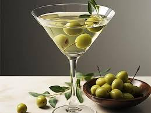
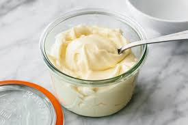
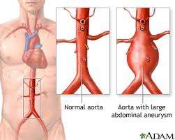
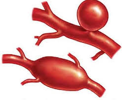

= 0052
:toc: left
:toclevels: 3
:sectnums:
:stylesheet: ../../../../myAdocCss.css

'''

M: Hello English learners! Welcome to EnglishPod! My name is Marco. +
E: And I’m Erica. +
M: We’re bringing you a great elementary 基础的；初级的 podcast today. +
E: That’s right. +
M: And we’re gonna be teaching you /how to order pizza. +
E: Yeah, you know, pizza is one of my favorite foods /and the favorite food of many people. +
M: Exactly, it’s one of those common foods /that you're at home and you want to order something to eat. +

[.my2]
披萨就是那种你在家, 并且想点外卖时, 会经常想到的常见食物。

E: Yep. +
M: And the typical 典型的；有代表性的 thing is pizza. +
E: Yeah, but you know /there’s some very special language that you’ve gotta 必须，不得不 use 点披萨时需要用到一些特别的表达, you’ve gotta know this language, ah, when you want to order a pizza. +
M: Exactly, so, let’s listen to this dialogue _for the first time_ as 当……的时候 a man is ordering pizza. +

[.small]
[options="autowidth" cols="1a"]
|===
|Header 1

|A: Good evening, Pizza House. This is Marty speaking. May I take your order (接受您的订单) 请问您要点餐吗? +
B: Um yes… I’d like a medium 中等的；中号的 pizza with pepperoni 意大利辣香肠，olives 橄榄，and extra 额外的；附加的 cheese. +
A: We have a two-for-one  买一送一 special 特价；优惠 on large pizzas. Would you like a large pizza instead? +
B: Sure, that sounds good. +
A: Great! Would you like your second pizza *to be the same as* the first? 您想要第二个披萨和第一个一样的口味吗？ +
B: No, make the second one with ham 火腿，pineapple 菠萝 and green peppers 青椒. Oh, and make it thin crust (面包皮；饼皮) 做薄皮. +
A: Okay, thin crust. Your total 总计；总数 is $21.50 /and _your order_ will arrive in thirty minutes /or it’s free! 否则就超时免费 +
B: Perfect. Thank you. Bye.. +
A: Sir, wait!! I need your address 地址！
|===

M: Okay, so I guess he is not getting his pizza. 看来他这披萨是吃不上了 +
E: No, he forgot to give his address. +
M: That’s a bit of a problem. 这可真是个问题 +
E: Uhu. +
M: Okay, let’s take a look at some of the vocabulary in “language takeaway”. +

Voice: Language takeaway. +
E: Alright, we’ve got some great pizza words for you today, um, and _our first one_ we have is a medium pizza 中号披萨. +
M: Medium pizza. +
E: Medium pizza. +
M: So, that’s the size, right? +
E: Yeah. +
M: Medium. You can say medium or… +
E: Twelve inch 英寸（长度单位，1 英寸≈2.54 厘米）. +
M: Twelve inch. +
E: Yeah. +
M: Usually a medium pizza is twelve inches. +
E: Yeah, so you could say "I’d like a twelve inch pizza". +
M: Okay, for _those of us_ who use (v.) centimeters 厘米（长度单位） /this *would be* _more or less_ 大致上，差不多 thirty centimeters. +

[.my2]
对于我们这些习惯用厘米（centimeters）的人来说，12 英寸大概就是 30 厘米左右。

E: Okay. +

M: Hehe. Alright, let’s take a look at the next size. A large pizza 大号披萨. +
E: Large pizza. +
M: A large pizza. +
E: So, it might also be called an eighteen inch… +

[.my2]
有时候也会说 “18 英寸（eighteen inch）披萨”。

M: An eighteen inch pizza. +
E: Uhu. +
M: Or isn’t it sometimes called a family size 家庭装（尺寸）? +
E: Maybe. +
M: Family size. +
E: I guess /it depends 取决于；依靠 where you’re ordering. +

M: Yeah. Okay, so large and medium pizzas 关于大号和中号披萨我们就说这么多. Now, let’s take a look at some of the ingredients 原料；食材. +
E: Yes. +
M: Okay, we have pepperoni 意大利辣香肠. +
E: Pepperoni. +
M: Pepperoni. +
E: Pepperoni. +
M: This is the common ingredient （食品的）成分，原料；要素，因素 of pizza. +
E: It’s my favorite. Um, a pizza is not a pizza /unless 除非；如果不 it has pepperoni. +
M: Hehe. Okay, so, pepperoni is like… is a sausage 香肠，right? +
E: Yeah, it’s a little bit spicy 辛辣的；辣的. +
M: A little bit spicy. +
E: Yeah. +
M: And they look like, ah… +
E: Like circles 圆形；圆圈. +
M: Red circles. +
E: Yep. +

M: Okay. Olives 橄榄. +

[.my2]
好，接下来是 “橄榄（olives）”。
E: Olives. +
M: Olives. +
E: Olives. +
M: Olives are little black or green balls. +
E: Yes, little green or black balls /you… you can also find them in a Martini 马提尼酒（一种鸡尾酒）. [NOTE: Cocktail Martini] +

[.my1]
.title
====
.Martini

====

M: Yeah, exactly. +
E: Yep. +
M: It’s very common /for them to have an olive in a Martini. +
E: Yes. +
M: Okay. And he also ordered (v.) extra cheese. +

[.my2]
对话里男士还点了 “额外的芝士（extra cheese）”。

E: Extra cheese 干酪，奶酪. +
M: So, that means (v.) more cheese. +
E: Uhu. +
M: Extra. +

E: Alright, another ingredient -- ham 火腿. +
M: Ham. +
E: Ham. The meat of a pig 猪. +
M: Yeah, ham. +
E: Yep. +

M: Okay. And he also ordered another strange ingredient for the pizza - pineapple 菠萝. +
E: Pineapple. +
M: Pineapple. +
E: Pineapple. +
M: Now, this is a fruit. +
E: I know, so weird 奇怪的；怪异的 to put pineapple on a pizza. +
M: Hehe. Many people like pineapple on a… on their pizza. It’s a tropical 热带的 fruit. +
E: Yep, comes from Hawaii 夏威夷（美国州名）. +
M: Usually. +
E: Uhu. +
M: And it kind of *looks like* a little palm tree 棕榈树 at the top.

[.my2]
而且菠萝顶部, 看起来有点像小棕榈树（palm tree）。 +

E: Yeah, like a… yeah, the top of a pineapple *looks like* a tree. +
M: Uhu. So, pineapple.  关于菠萝我们就说这些 +
E: Yep. +

M: Alright, now, the last description 描述；说明 of a pizza. He ordered it with thin crust. +
E: Thin crust. +
M: Thin crust. +
E: Thin crust. +
M: Now, we know thin is some… +
E: Skinny 瘦的；纤细的（此处指 “薄的”）. +
M: Skinny. But crust. What is crust? +
E: It’s the _bread part_ of the pizza. +

[.my2]
就是披萨的面包部分。

M: The outside part. +
E: Yep. +
M: Okay, so that’s the crust. +
E: That’s my favorite part of the pizza. +
M: Really? +
E: Yeah, mmm. +
M: _Thin crust_ or _thick 厚的 crust_. +
E: Ah, thin crust… yeah, thin crust /and I just… I really love that bread part. +
M: Hehe. +
E: It’s so important to a good pizza. +
M: Hehe. Okay, well, you know /they also have, um… they also *have* the crust *filled (v.) with* 填满；装满 cheese. +

[.my2]
（笑）对了，你知道有些披萨的饼底, 还会填满（filled with）芝士吗？

E: I know, it so wrong 不适当地，不适宜地. +

[.my2]
那样太奇怪了

M: That’s good too. 觉得也挺好吃的呀。 +
E: No. 才不好吃呢。 +
M: Hehe. Alright, let’s listen to our dialogue again /and then we’ll come back and talk a little bit more. +

\... +
\... +
\... +

M: Okay, now we have some really polite 有礼貌的；客气的 language \that you could *use* possibly *with* customers 顾客 or with clients 客户. +
E: Yep. +
M: Okay, so let’s take a look at them \in “fluency builder”. +

Voice: Fluency builder. +
E: Okay, my… Alright, the first phrase we have, um, I think is my favorite. This is the way \that Marty answered the phone, right? +
M: Uhu. +
E: He said _this is Marty speaking_. +
M: This is Marty speaking. +
E: This is Marty speaking. +
M: Now, why is this so important? +
E: Cause a lot of people _when they answer the phones_ say (v.) "I’m Erica…" +

[.my2]
因为很多人接电话时会说 “我是埃里卡（I’m Erica）”……

M: Uhu. +
E: Like "hello, I’m Erica". +
M: Uhu. +
E: Which is not what English people say.   但英国人不会这么说。 +
M: Uhu. +
E: We always say "#Erica speaking#". +
M: Uhu, "#this is Erica speaking#". +
E: Exactly. So, guys, remember this, you’ll sound (v.) really really great /when you use this on the phone. This is Marty speaking. +
M: Exactly. This is Marty… oh, don’t use Marty. Use your name. +
E: Hehe. +

M: Hehe. Alright. Then he also mentioned 提到；提及 a _two for one special_ 买一送一优惠. +
E: Two for one special. +
M: _A two for one special_. So, that means /you’re getting two… +
E: Pizzas, right? +
M: For _the price of one_. +
E: Uhu. +
M: And a special is just _a special promotion_ 促销；推广活动. +

[.my2]
“Special” 在这里指的就是 “特别的促销活动（special promotion）”。

E: A special price. +
M: Special price. +
E: Yes. +
M: Two for one special. +
E: Right. +

M: Alright, now very easy phrase.   接下来是一个很简单的短语。 +
E: Uhu. +
M: #Would you like?#   您想要…… 吗？ +
E: Would you like? +
M: Would you like? +
E: Would you like? +
M: Now, this is a great way to offer 提供；给予 something. +

[.my2]
这是一种很好的主动提供（offer）某物的表达方式。

E: It’s _a more polite way_ of asking (v.) _do you want_. +
M: Do you want. +
E: Uhu. +
M: Do you want is… is okay. +
E: Yeah, it’s fine. +
M: But I… *it’s less polite than* 比……（更）不 would you like. +

[.my2]
但它不如 “Would you like” 礼貌。

E: Exactly. +
M: So, whenever 无论何时 you offer something /"would you like a cup of coffee". +

[.my2]
不管什么时候你想主动给别人东西，都可以说 “您想喝杯咖啡吗（would you like a cup of coffee）”。

E: "Would you like to sit down". 您想坐下吗 +
M: Okay. +
E: Yep. +
M: So, would you like. Let’s listen to our dialogue for the last time /and then we’ll come back and talk about pizza from a pizza expert 专家. +

\... +
\... +
\... +

M: Alright, we’re back /and we are here with our pizza expert, *who else 还能有谁, but*  除了...还能有谁呢 Marco from ItalianPod.

[.my2]
不是别人，正是来自《ItalianPod》的马可。

[.my1]
.title
====
.Who else, but...​​
“除了...还能有谁呢？”​​ 或 ​​“不是别人，正是...”​
====

M1: Hi, everyone. +
E: Marco Two, right?  你是 “马可二号”，对吧？  +
M1: Marco One. 我是 “马可一号”。 +
M: I’m Marco Zero, he’s Marco One.
M1: Yes. +
E: Alright. +
M: We’ve come to an agreement 协议；共识.

[.my2]
我们都商量好这么称呼了。

M1: So, Zero, wha… *what’s the deal 事情；情况 about* 是怎么回事呢 this pizza thing? +

[.my2]
这披萨的事儿到底是怎么回事呀？

M: We’re talking about pizza today /and we want to know what’s your opinion 观点；看法 /since 因为，由于，既然 pizza comes from Italy 意大利（欧洲国家）, right?

[.my2]
既然披萨起源于意大利（Italy），所以想听听你的看法，对吧？

M1: Well, thanks for the question first 首先感谢你的问题, ah, Marco Zero. Is my mic 麦克风（microphone 的缩写） working? +
M: *It should be* 应该是,应该没问题. +
E: Yes.
M1: Okay, so, ah, the problem with pizza is that, ah… yes, it comes from Italy… originate (v.)起源；发源 it… the story goes… what was then? +

[.my2]
披萨这东西，确实起源（originate）于意大利…… 传说中是怎么回事来着？当时是……

M: Right.
M1: ??? Regina 女王；女王称号 Margarita, Queen Margarita 玛格丽特女王（此处指与披萨起源相关的玛格丽特女王）. +

[.my1]
.title
====
.Regina
a word meaning ‘queen’, used, for example, in the titles of legal cases 法律案件 which are brought by the state /when there is a queen in Britain 女王（英国女王在位时, 用于政府诉讼案案目等）( formal ) +
-> 来自拉丁语 regina,女王，来自 #rex,国王，-ina,表阴性。#
====

M: Alright.
M1: But the problem is that /now this confuses (v.)困惑；混淆 people  worldwide 全世界地；全球地，/pizza and Pizza Hut 必胜客（知名披萨连锁品牌）, American pizza, Italian pizza, that is not the same thing. +

[.my2]
但现在的问题是，全世界（worldwide）的人都把披萨搞混了 —— 必胜客（Pizza Hut）的披萨、美式披萨、意式披萨，其实根本不是一回事。

M: It’s not the same. +
M1: It’s not the same. +
M: Okay. +
M1: Have you… +
M: So, Pizza Hut isn’t Italian pizza. +
M1: Not… No… ??? So that… th… okay, #here it goes# 好吧，不管那么多了，我就要说出来了, hm, Italians are little better… Italians *make food* /but they’re not *good at* branding (v.)品牌打造；品牌推广 it. +

[.my2]
M：所以必胜客的披萨不是意式披萨。 +
M1：不是…… 当然不是…… 这样说吧，嗯，意大利人在做吃的方面确实有一套，但他们不擅长给食物做品牌打造（branding）。

[.my1]
.title
====
.Here it goes
这是一个非常地道的口语表达！​​*“Here it goes”​​ 在这里表示说话者 ​​“要开始说一件可能令人尴尬、有争议或需要鼓起勇气的事情”​​。* +
它传递的是一种 ​​“好吧，不管那么多了，我就要说出来了”​​ 或 ​​“我要开始做了，看看会发生什么吧”​​ 的语气。

他可能觉得接下来的观点（批评意大利人不擅长品牌营销）会有些敏感、有争议，或者他需要稍微组织一下语言。
====

M: Okay. +
M1: Americans are very good at branding (v.) their food. +
M: Uhu. +
M1: So they have Starbucks 星巴克（知名咖啡连锁品牌） and Pizza Hut and bla-bla-bla… The problem is that /since they have to brand (v.) it /they don’t change the name. +

[.my2]
问题在于，他们要给这些食物做品牌，却不肯改名字。

M: Uh. +
M1: So they… they do this PIZZA Hut… /that is totally 完全地；彻底地 different from 与…… 不同 Am… Italian pizza. What… How is it different 有什么不同? Have you ever seen the… the… two of them? Have you ever compared 比较；对比 them? +

[.my2]
所以他们搞出了 “必胜客披萨（PIZZA Hut）”…… 但这和意式披萨完全（totally）不一样。它们到底有什么不同呢？你们俩见过这两种披萨吗？有没有对比（compared）过？

M: Yeah, yeah. They are very different. That’s true. +
E: So, okay, can you put pineapple and ham on a pizza?
M1: Aaah, technically 技术上；理论上 you could… +
E: Like it’s possible. 好像这是可能的。 +
M1: As long as 只要 you call it Hawaiian 夏威夷风味的（此处指 “夏威夷披萨”） /you can put pineapple in everything, #I guess# 我想；我认为, *but the problem… what I’m trying to say that…* (但问题……我想说的是……) /Okay, Italian pizza is, you know, you have the… the… the flour 面粉，the bread, the pasta 意大利面… not pasta 意大利面食；面团 ??? pizza… +

[.my2]
只要你给它贴上一个明确的标签（比如叫它‘夏威夷风味’），你就可以在任何食物里加菠萝。但我想说的真正问题是，正宗的意大利披萨有其严格的标准（比如面粉、面包、饼底），而美式披萨（如必胜客）是完全不同的东西。

[.my1]
.title
====
.Okay, Italian pizza is, you know, you have the… the… the flour, the bread, the pasta… not pasta ??? pizza…
好吧，意大利披萨是，你知道，它有……面粉、面包、意面……不是意面……披萨…

​​flour (面粉)​​： 指披萨饼底（dough）的质量和配方。 +
​​bread (面包)​​： 披萨本质上也是一种发酵面饼，强调其饼底的口感。 +
​​pasta (意面)​​： 这是一个​​口误​​（他说完就意识到不对，所以说了“not pasta”），因为他脑子里想的是意大利烹饪的整个体系，但披萨和意面是不同的东西。这个口误恰恰说明他想强调意大利美食对​​原材料和传统的尊重​​。 +
他最终想说的词是 ​​crust (饼皮)​​ 或 ​​base (饼底)​​，主持人Erica帮他说了出来。 +
====

E: The crust, the crust. +
M1: The crust, the tomato sauce 番茄酱，and then… then… the… +
E: Pepperoni 意大利辣香肠.
M1: Mozzarella cheese 马苏里拉奶酪（一种常用于披萨的奶酪） and that’s a basic 基础的；基本的 /and then you can *put* _on top of it_… *with* some variations 变化；变体. My compito（意大利语，意为 “任务；职责”） is basically take everything /that you have on the table /and put this on it. That’s a main difference. But… I’m not saying that /I’m against 反对；不赞成 the American pizza. I’m saying that /you just should change the name. +

[.my2]
还有马苏里拉奶酪（Mozzarella cheese），这是意式披萨的基础（basic）配料，之后可以根据喜好加一点别的配料，有一些变化（variations）。而美式披萨呢，基本上就是把桌上有的东西都往上面堆。这是两者最主要的区别。不过…… 我不是说我反对（against）美式披萨，我只是觉得他们应该给它换个名字。

[.my1]
.title
====
.Mozzarella cheese and that’s a basic and then you can put on top of it… with some variations.
马苏里拉奶酪，这就是一个基础款，然后你可以在上面加……一些变化（的配料）。

M1在描述​​*正宗意大利披萨的构成原则​​。最基础的玛格丽特披萨（Pizza Margherita）就是由​​饼底（crust）+ 番茄酱（tomato sauce）+ 马苏里拉奶酪（mozzarella cheese）​​ 构成的。这才是披萨的“本体”。在此之上，你可以添加一些其他的配料（如火腿、蘑菇、橄榄等），但这些配料是“一些变化”，不能喧宾夺主。*

.My compito is basically take everything that you have on the table and put this on it.​

​​这里有一个关键口误​​：​​“compito”​​ 不是英语单词。这很可能是M1（可能是意大利人）想说 ​​“concept”​​（概念）或 ​​“point”​​（观点）时，受到了意大利语单词 ​​“compito”​​（意思是“任务”或“作业”）的影响。 +

​​修正后的理解​​：​​“My point is basically (that they) take everything that you have on the table and put (it) on top of it.”​​ +
​​中文​​：​​“我的观点基本上是，（美式披萨的）做法是把你桌子上所有的东西都拿来，然后堆到披萨上面。”​​

​​含义​​：M1在这里​​尖锐地对比了美式披萨的理念​​。*他形容美式披萨像是一个“大杂烩”或“垃圾抽屉”，任何食材（如菠萝、各种肉类、蔬菜）都可以无限制地堆在披萨上，追求的是馅料的丰富和夸张，而不是食材的和谐与平衡。*
====

M: To another thing 停下来做另外的事. What do you suggest 建议；提议 we should call it?

[.my2]
那换个什么名字好呢？你有什么建议（suggest）吗？

M1: Zippa. +
M: Zippa.
M1: It’s close enough. +

[.my2]
听起来和 “披萨” 差不多。

M: Close enough, yeah. +
E: Yeah.
M1: But it’s a different thing.  但本质上是两种东西。 +
E: But… Maybe you need like an A, like Azippa.
M1: Azippa. +
M: Azippa. +
E: *To indicate 表明；暗示 that* it’s American, A for America 美国. +

[.my2]
用 “A” 代表美国（America），这样就能表明（indicate）它是美式的了。

M: Uh, maybe.
M1: A.Zippa. +
E: A.Zippa.com. （此处指假设的网站域名）
M1: Uh… Can I have a A.Zippa. +
M: So, Marco… +
E: Dot com. （即 “.com”，常见的网站域名后缀）
M1: A.zippaPod.com. （此处指假设的播客网站域名）

M: So, Marco, I know that, um… that /you are very much against _having Pizza Hut pizza_.

[.my2]
我知道你特别不喜欢吃必胜客的披萨。

M1: Um, I like it /as, ah… as _an exotic 异国风情的；奇异的 experience_ 经历；体验，because *I like the fact /that is*… _it’s so much stuff 东西；物品 in it_ /that *you can not even tell the difference* between the ingredients. +

[.my2]
嗯，不过我觉得偶尔吃一次也挺有异国风情（exotic）的 —— 它上面的配料太多了，你甚至分不清里面到底有什么，这种体验（experience）还挺特别的。

M: Hehe.
M1: You know, the… they have this _super mega 极大的，巨大的 supreme_ (最高的，至高无上的) 超级至尊的（此处指 “超级至尊披萨”，一种配料丰富的披萨类型）… +

[.my2]
你知道吗，他们还有那种 “超级至尊披萨（super mega supreme）”……

[.my1]
.title
====
.mega
(a.)[ usually before noun] ( informal ) very large or impressive 巨大的；极佳的
SYN huge, great +
•The song was _a mega (a.) hit_ last year.这首歌是去年最热门的歌曲。

.supreme
(a.) 1.highest in rank or position （级别或地位）最高的，至高无上的 +
•_the Supreme Commander_ 最高统帅 of the armed forces 武装力量的最高统帅 +
•the supreme champion 绝对冠军 +
•It is an event in which _she reigns (v.) supreme_ . 这个比赛项目她所向无敌。 +

2.very great or the greatest in degree （程度）很大的，最大的 +
•to make the supreme sacrifice (= die for what you believe in) 作出最大牺牲（为信仰牺牲生命） +
•_a supreme effort_ 最大的努力 +
•She smiled _with supreme confidence_. 她充满自信地微微一笑。 +
====

M: Super supreme. +
M1: Super supreme. +
E: With cheese in the crust. +
M1: I don’t even know what’s inside. +
E: Yeah. +
M1: It's great. It’s great, it’s like there’s a party 派对；聚会 in my mouth and everybody’s invited. +

[.my2]
但还挺好吃的。吃美式披萨的感觉，就像 “嘴巴里在开派对（party），所有食材都受邀参加了”。

M: Hehe. +
M1: That… _that’s_ for me _the feeling_ of American pizza. +

M: Well, `主` another interesting thing /when we were eating wh… pizza with Marco /`系` is that /we noticed the way /that people from different countries eat (v.) pizza. +
E: That’s right. Italian people fold (v.)折叠；对折 their pizza. +
M1: We do fold (v.)… /a… and another thing is that /we have a whole  pizza. Like /if I order (v.) one pizza /it’s not like I share (v.)分享 it, everybody has a one slice 片；块 of it. We ordered one pizza, you ordered your pizza, she ordered her pizza and so on. +

[.my2]
……呃…还有一点是，我们通常是点一整个披萨。比如说，如果我点一个披萨，那并不是用来分享的，而是每个人都有自己的那一整张。我点我的一个披萨，你点你的那个披萨，她点她的那个披萨，以此类推。

M: Pizza is personal 个人的；私人的. +
M1: Pizza's personal (a.)个人的，私人的. Don’t *mess (v.) with* 卷入有害的事；与某人有牵连;打扰；招惹 my pizza, Marco Zero. +

[.my2]
对，披萨是私人的。“零号” 马可，可别打我的披萨的主意啊。

M: Hehe. Alright, well, #this whole pizza discussion# (名词短语作独立成分. #*在口语中，用一个名词短语来总结或结束一个话题是非常普遍的。*#)这整个披萨话题; 关于披萨我们就聊到这儿. Let’s see what our listeners have to say about it. I know that /we have listeners from all over the world /and what do they do with their pizzas. +

[.my2]
好，关于披萨我们就聊到这儿。接下来想听听听众朋友们的看法。我们知道听众来自世界各地，想知道大家平时都是怎么吃披萨的。

E: Yes. What do you… +
M1: Or their zippas. +
M: Or their zippas. +
E: What do you like /on your pizza? +

[.my2]
大家喜欢在披萨上, 放什么配料呢？

M: Exactly, for example, I… +
M1: How height（此处应为 “how thick”，意为 “多厚”） you want the crust to be? +
E: Thin. +
M: How high? +
E: Thin. +
M: I know that 我知道, for example… +
M1: How thin you want your crust to be? +
M: I know that, for example, in some countries /they *put* ketchup 番茄酱 *on* their pizza.
M1: I know! Once I *was*, ah, *eating* pizza… /look… I had the Japanese 日本的；日本人的 friend /who ordered the pizza from Pizza Hut /and… the pizza had the pineapple and other staff（此处应为 “stuff”，意为 “东西”） on it /and then she *took out* 取出、拿出、带出 like ketchup and mayonnaise 蛋黄酱… +

[.my2]
我知道！有一次我吃披萨的时候…… 你听我说，我有个日本（Japanese）朋友，她从必胜客点了一份披萨，披萨上本来就有菠萝之类的东西（此处原词 “staff” 应为 “stuff”，意为 “东西”），结果她还掏出了番茄酱和蛋黄酱（mayonnaise）……

[.my1]
.title
====
.mayonnaise
( also informal mayo  /ˈmeɪəʊ/  -
 ) [ U] _a thick cold white sauce_ made from eggs, oil and vinegar , used to add flavour to sandwiches , salads, etc. 蛋黄酱（用作三明治、色拉等的调味品） -
•egg mayonnaise (= a dish made with hard-boiled eggs and mayonnaise )  鸡蛋美奶滋（有煮老的鸡蛋和蛋黄酱）

-> 来自法语sauce mayonnaise,可能来自Mahon,地中海西岸梅诺卡岛首府，-ais,法语形容词后缀，-e,表阴性。据说该酱料的配方来自该岛。

====

E: Oh, no.
M1: And she got [it] _like wild_ 疯狂的；狂热的. Haaah! +

[.my2]
然后就疯狂（wild）地往披萨上抹！我的天！

E: Although I must tell you /I like Tabasco 塔巴斯科辣椒酱（一种知名辣椒酱品牌） on my pizza /and I know that’s wrong, I know. I’m sorry.
M1: Yes… yeah… what… You do _what you have to do_ 你做你该做的, Erica, then, you know, history will judge 评判；判断 you for that. +

M: Alright, we better go, we’re out of time /and before Marco has a heart attack 心脏病发作 or an aneurysm 动脉瘤（一种血管疾病） or something /we’re *making him angry* here. And if you have any questions for us and also for Marco, because I’m sure /he’s gonna be, ah, commenting on 评论；发表意见 this aspect 方面；层面…

[.my2]
好了，我们该结束了，时间差不多了。再聊下去，马可就要气得心脏病发作（heart attack）或者动脉瘤（aneurysm）发作了，我们可别把他惹毛了。如果大家有问题想问我们，或者想问马可 —— 我肯定他之后会在这方面发表评论（commenting on）的……

[.my1]
.title
====
.aneurysm
( medical 医) an area of extreme swelling 肿块，肿胀处 on the wall of an artery 动脉瘤 +
-> 前缀##ana-, 向上，向后。词根eur, 宽的，同 Europe, 宽脸美女。指扩大，##应用于医学指动脉瘤。

**动脉瘤是血管壁上的隆起或膨胀。动脉瘤可能裂开。这种情况被称为破裂。动脉瘤破裂会导致体内出血。这常常会导致死亡。**有些动脉瘤没有症状。即使体积很大，您也可能不知道自己有动脉瘤。

*动脉是一种负责传送氧份及营养物到身体各部位的血管。如果动脉某部位有不正常的增大, 或像气球般向外鼓起, 那就是患有"动脉瘤"了。动脉瘤可生在"动脉"任何的部位，但最为常见的地方是”脑内动脉“和”大动脉“（身体的主要血管）, 尤其在腹部及胸部。* +
“动脉瘤”亦可生在膝盖後，大腿的主动脉， 以及颈动脉内等。 +
老年人最普遍患动脉瘤的位置是在动脉分叉处，例如腹部动脉与腿动脉的分叉处；或常受压力的地方，例如膝盖背等。

====

M1: Ah, sure. +
M: So, go to our comments section 评论区 at englishpod.com. +
E: And Marco and I, ah… Marco Zero and I.
M1: Yes. +
E: Are always there, ah, to answer your questions. +
M: Alright. +
E: Alright, everyone. +
M: We'll see you there. +
E: Good bye.
M1: Ciao!（意大利语，意为 “你好” 或 “再见”，此处为 “再见”） +
M: Bye!
M1: Ciao!

'''