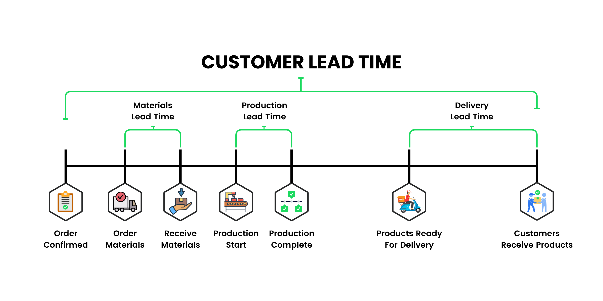
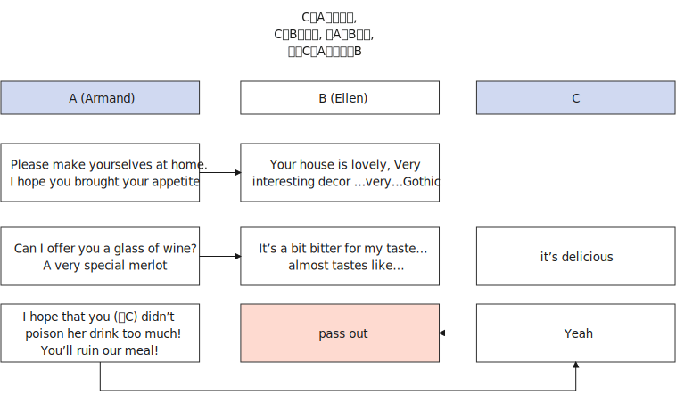
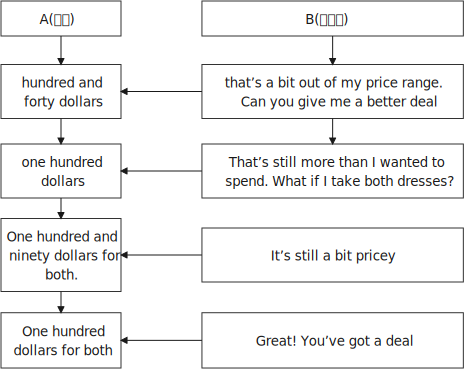
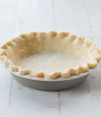
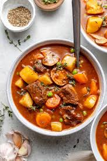
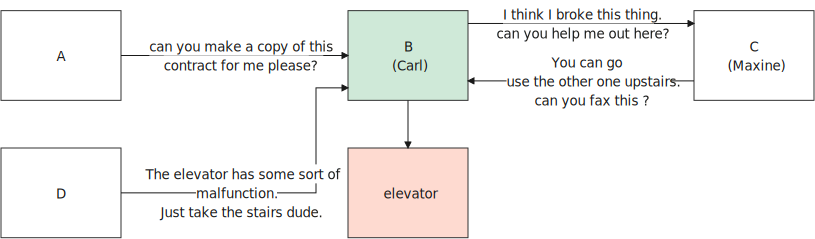
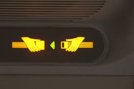

=  English pod 041-060
:toc: left
:toclevels: 3
:sectnums:
:stylesheet: ../../../myAdocCss.css

'''

== ■(41) Elementary ‐The Weekend ‐Movie Traile r (C0041)  +
A: In a digital world, even the strongest must fight for survival. Two people, possess a secret so valuable, so powerful, they have to defend it at all costs.  +
B: I don’t care where they are, I don’t care what it takes... you find them and bring them to me!  +
A: They only had one chance! And their chance was to fight back!  +
D: You wanna play rough? Okay, say hello to my little friend!  +
A: With a little help from a Governor...  +
C: Listen to me! We have to get them outta  +
there!  +
No matter what!  +
 +
A: Nothing will prevent them from doing their job! Double the action.  +
D: Get down!  +
A: Triple the excitement.  +
D: Get down again!  +
A: This summer... nothing will stand in their way.  +
B: I’m going to make him an offer he can’t refuse.  +
A: Two hosts, one podcast, coming to a theater near you.  +
 +
 +

'''

==== ◆(41) 041. Elementary ‐ The Weekend ‐ Movie Trailer （电影或电视节目的）预告片;拖车；挂车 (C0041)

A: In a digital world, even the strongest
must fight (v.) for survival. Two people, possess
a secret so valuable 拥有如此珍贵的秘密, so powerful, they have
to defend it _at all costs_ 无论如何，不惜任何代价.

[.my2]
两个人，拥有一个如此珍贵，如此强大的秘密，他们必须不惜一切代价捍卫它。

B: I don’t care where they are, #I don’t care
what it takes# 我不在乎要付出什么代价... you find them and bring
them to me!

[.my2]
我不管他们在哪里，我也不管要付出什么代价……你找到他们，把他们带来给我！

A: They only had one chance! And their
chance was to fight back!

D: #You wanna play rough# (ad.)粗鲁地；粗野地? Okay, say hello to
my little friend!

[.my2]
你想玩硬的？好吧，来见见我的“小伙伴”！

A: With a little help from a Governor 州长;统治者；管辖者；总督...

[.my2]
在州长的一点帮助下

C: Listen to me! We have to get them outta (=out of)
there!
#No matter what# 无论如何!

[.my2]
我们得把他们救出来！无论如何！

A: Nothing will prevent them from doing
their job! Double (v.)（使）加倍；是…的两倍 the action 双倍的动作场面.

D: #Get down# 弯下身 (坐下、跪下、趴下);躲下!

A: Triple (v.)（使）成为三倍 the excitement. 三倍的刺激感受

D: Get down again!

A: This summer... #nothing will stand in their
way# 什么也阻挡不了他们.

[.my2]
没有什么能挡住他们的路。

B: #I’m going to make him an offer# 主动提议；建议 he can’t
refuse.

A: Two hosts 主人；主持人, one podcast 播客, coming to a
theater 戏院，剧场 near you.

[.my2]
两位主持人，一档播客，即将来到您附近的电影院！

'''

== ■(42) Elementary ‐I Need More Time (B0042)  +
A: So, Casey, how are things going with the photos for the press kit?  +
B: Yeah, I’ve been meaning to talk to you about that. I might need to ask for an extension on that deadline.  +
A: You’ve had over a month to get this finalized! Why are things delayed?  +
B: Well, the thing is, we ran into a lot of problems...  +
A: I’m not looking for excuses here. I just want to get this finished on time!  +
B: I know, and I apologize for the delay. But some things were just beyond my control. I had trouble booking the photographer, and then Michael was sick for three weeks, so I couldn’t include him in the photos, and the design team lost all the files, so I had to re-do the pictures.  +
A: I’m not going to put this off any longer, Casey! I want those photos ASAP!  +
 +
 +

'''

==== ◆(42) 042. Elementary ‐ I Need More Time (B0042)

A: So, Casey, *#how are things going# 事情进展的怎么样 with* the
photos for the _press kit_ 成套工具；成套设备?

[.my2]
"新闻发布资料包"的照片拍得怎么样了？

[.my1]
.案例
====
.press kit
Na set of documents, usually containing useful facts and figures, given to journalists by a company prior to a product release, news conference, etc 新闻发布材料;一套用于向媒体发布的宣传材料的集合。
====

B: Yeah, #I’ve been meaning# 打算；意欲；有…的目的 to talk to you
about that. I might need to ask for an
extension on that deadline.

A: You’ve had over a month *to get this
finalized* (v.)把（计划、旅行、项目等）最后定下来；定案! Why are things delayed?

[.my1]
.案例
====
.finalize
(v.)[ VN] to complete the last part of a plan, trip, project, etc. 把（计划、旅行、项目等）最后定下来；定案 +
•to finalize your plans/arrangements 把计划╱安排最后确定下来 +
•They met to finalize the terms of the treaty. 他们会晤确定条约的条款。
====

B: Well, the thing is, #we *ran into* 遇到（困难等） a lot of
problems#. . .

[.my2]
我们遇到了很多问题

[.my1]
.案例
====
.run into sth
(1) to enter an area of bad weather while travelling 途中遭遇（恶劣天气） +
•We ran into thick fog on the way home. 在回家的路上，我们遇上了大雾。

(2) to experience difficulties, etc. 遇到（困难等） +
•Be careful not to run into debt.小心不要背上债务。 +
•to run into danger/trouble/difficulties 遭遇危险╱麻烦╱困难

(3) to reach a particular level or amount达到（某种水平或数量） +
•Her income runs into six figures (= is more than ￡100 000, $100 000, etc.) . 她的收入达到了六位数。

====

A: #I’m not looking for excuses# here. I just
want to get this finished on time!

[.my2]
我不是在要借口。我只想要你按时完成这件事！

B: I know, and I apologize for the delay. But
some things were just beyond my control. #I
had trouble# booking (v.)预约，预订;和（歌手等）预约演出日期 the photographer 拍照者，摄影师, and
then Michael was sick for three weeks, so I
couldn’t include him in the photos, and the
design team lost all the files, so I had to redo (v.)
the pictures.

A: I’m not going *to put* this *off* 推迟；延迟 any longer,
Casey! I want those photos ASAP 尽快（As Soon As Possible）!

[.my2]
我不会再拖下去了，凯西！我要尽快拿到那些照片！

'''

== ■(43) Elementary ‐Daily Life ‐Applying for a V isa (C0043)  +
A: So, you’re applying for a B2 visa, where is your final destination and what’s the purpose of your trip to the United States?  +
B: I’m going to visit my brother; he’s just had a baby. He lives in Minneapolis.  +
A: And how long do you you plan to remain in the United States?  +
B: I’ll be here for approximately three weeks. See, here’s my return ticket for the twenty-sixth of March.  +
A: And, who is sponsoring your trip?  +
B: My brother, here, this is an invitation letter from him. I will stay with him and his family in their home.  +
A: Alright, tell me about the ties you have to your home country.  +
B: Well, I own a house; actually, I’m leaving my dog there with my neighbors. I have a car at home, and oh, my job! I’m employed by Tornel as an engineer. Actually, I only have three weeks’ vacation, so I have to go back to work at the end of March.  +
A: And what evidence do you have that you are financially independent?  +
B: Well, I do have assets in my country; like I said, I own a house, and see, here’s a bank statement showing my investments, and my bank balance.  +
A: I’m sorry, sir, we cannot grant you a B2 visa at this time, instead, you are granted a resident visa! Congratulations, you are the millionth person to apply for a visa! You win! Congratulations!  +
 +
 +

'''

==== ◆(43) 043. Elementary ‐ Daily Life ‐ Applying (v.)（通常以书面形式）申请，请求 for a Visa 申请签证 (C0043)

A: So, you’re applying for a B2 visa, where is
your final destination 目的地，终点，目标 and what’s the purpose
of your trip to the United States?

[.my1]
.案例
====
.B2 visa

Here are some examples of activities permitted with a visitor visa: +
以下是访客签证允许的活动的一些示例：

https://travel.state.gov/content/travel/en/us-visas/tourism-visit/visitor.html/visa

[.my3]
[options="autowidth" cols="1a,1a"]

|===
|Business (B-1)   商务（B-1） |Tourism (B-2)   旅游（B-2）

|- Consult with business associates
咨询业务伙伴
- Attend a scientific, educational, professional, or business convention or conference +
参加科学、教育、专业或商业大会或会议
- Settle an estate  解决遗产
- Negotiate a contract  洽谈合同

|- Tourism  旅游
- Vacation (holiday)  假期（假期）
- Visit with friends or relatives +
 拜访朋友或亲戚
- Medical treatment  医疗
- Participation in social events hosted by fraternal, social, or service organizations +
 参加兄弟会、社交或服务组织主办的社交活动
- Participation by amateurs in musical, sports, or similar events or contests, if not being paid for participating +
 业余爱好者参加音乐、体育或类似活动或竞赛（如果没有付费参与）
- Enrollment in a short recreational course of study, not for credit toward a degree (for example, a two-day cooking class while on vacation) +
参加短期娱乐课程，不是为了获得学位学分（例如，度假时参加为期两天的烹饪课程）
|===

====

B: #I’m going to visit# my brother; he’s just
had a baby. He lives in Minneapolis.

A: And how long do you plan (v.) to remain
in the United States?

B: I’ll be here for approximately three weeks.
See, here’s my return ticket for the twentysixth
of March.

A: And, who is sponsoring (v.)赞助（活动、节目等） your trip?

B: My brother, here, this is an invitation
letter from him. I will stay with him and his
family in their home.

A: Alright, tell me about the ties you have to
your home country.

[.my2]
跟我说说你和祖国的联系吧

B: Well, I own a house; actually, I’m leaving
my dog there with my neighbors. I have a
car at home, and oh, my job! I’m employed
by Tornel as an engineer. Actually, I only
have three weeks’ vacation, so I have to 必须，不得不 go
back to work at the end of March.

A: And *what evidence do you have* that you
are financially 财政上，金融上 independent?

[.my2]
你有什么证据证明你经济独立？

B: Well, I do have assets 资产，财产 in my country; like
I said, I own a house, and see, here’s a _bank statement_ 银行结单（某时期内, 存户存取款项的清单） showing my investments, and my
_bank balance_ 银行存款余额；银行结存.

[.my2]
我在国内确实有资产；就像我说的，我有房子，看，这是我的银行对账单，上面有我的投资，还有我的银行余额。

[.my1]
.案例
====
[.my3]
[options="autowidth" cols="1a,1a"]
|===
|bank statement |bank balance

|( state·ment ) a printed record of all the money paid into and out of a customer's bank account within a particular period 银行结单（某时期内存户**存取款项**的清单）

A bank statement is a list of all transactions （一笔）交易，业务，买卖 for a bank account over a set period, usually monthly.     +

银行对账单是银行账户在一定时期（通常是每月）内所有交易的列表。

The statement includes deposits 沉积物，沉积层；订金；押金；存款, charges （商品和服务所需的）要价，收费, withdrawals （从银行账户中）提款，取款, as well as the beginning and ending balance 账户余额，结存 for the period, along with any interest earned. +

该报表包括存款、收费、取款以及该期间的期初和期末余额，以及所赚取的任何利息。

_Account holders_ generally review their bank statements every month to help keep track of expenses and spending, as well as monitor for any fraudulent 欺诈的，诈骗的 charges or mistakes. +

账户持有人通常每月查看他们的银行对账单，以帮助跟踪费用和支出，并监控任何欺诈性收费或错误。

A bank issues (v.) a _bank statement_ to _an account holder_ that shows the detailed activity in the account. It allows the account holder to see all the transactions processed (v.)加工；处理, typically chronologically 按年代地;按时间顺序.

银行向账户持有人发出银行对账单，显示账户中的详细活动。它允许账户持有人查看所有已处理的交易，通常按时间顺序排列。
|the amount of money that sb has in their bank account at a particular time 银行存款余额；银行结存

An account balance is the amount of money at a specific time in a financial repository 仓库；贮藏室；存放处, such as a savings or checking account 支票账户.

帐户余额是金融存储库（例如储蓄帐户或支票帐户）中特定时间的金额。

An _account balance_ represents (v.) the current value of a financial account, such as a checking, savings, or investment account.

账户余额代表金融账户（例如支票账户、储蓄账户或投资账户）的当前价值。

An account balance reflects (v.) total assets *minus* 减，减去 total liabilities 负债；债务. In banking, the _account balance_ is the money available in a checking or savings account.

账户余额反映总资产减去总负债。在银行业，账户余额是支票或储蓄账户中的可用资金。

https://www.investopedia.com/ +
terms/a/accountbalance.asp

|===

====

A: I’m sorry, sir, #we cannot grant  (v.)授予，给予；承认 you# a B2
visa at this time, instead, you are granted a
resident 居民，住户 visa! Congratulations, you are the
millionth 第一百万的；百万分之一的 person to apply for a visa! You win!
Congratulations!

[.my1]
.案例
====
.resident visa
在美国，没有一种官方被称为 “resident visa” 的签证类型。 +
本文中, "a resident visa" 并不是指美国实际存在的某种签证类别，而是作为一种幽默或戏谑的情节设计, 表明申请者"幸运地"成为第100万名申请者，因此意外获得"更高一级别"的签证.

====

'''

== ■(44) Elementary ‐Small Talk (B0044)  +
A: Morning.  +
B: Hi there Mr. Anderson! How are you on this fine morning?  +
A: Fine, thank you.  +
B: It sure is cold this morning, isn’t it? I barely even get out of bed!  +
A: Yeah. It’s pretty cold, alright.  +
B: Did you catch the news this morning? I heard that there was a fire on Byron Street.  +
A: No, I didn’t hear about that.  +
B: Did you happen to watch the football game last night? The Patriots scored in the last minute!  +
A: No, I don’t like football.  +
B: Oh... By the way, I saw you with your daughter at the office Christmas party. She is really beautiful!  +
A: She’s my wife! Oh, here’s my floor! Nice talking to you. Goodbye.  +
B: Sir this is the 56th floor! We are on the 70th!  +
A: That’s okay, I’ll take the stairs!  +
 +
 +

'''

==== ◆(44) 044. Elementary ‐ Small Talk  寒暄；闲谈；聊天 (B0044)

A: Morning.

B: Hi there Mr. Anderson! *How are you* on this fine morning?

A: Fine, thank you.

B: It sure is cold this morning, isn’t it? I
barely even get out of bed!

A: Yeah. It’s pretty cold, alright.

B: #Did you catch the news# this morning? I
heard that there was a fire on Byron Street.

A: No, I didn’t hear about that.

B: Did you happen to watch the football
game last night? The Patriots 爱国者 scored 得（分） in the
last minute!

A: No, I don’t like football.

B: Oh. . . By the way, I saw you with your
daughter at the office Christmas party. She is
really beautiful!

A: She’s my wife! Oh, here’s my floor 楼层! Nice
talking to you. Goodbye.

B: Sir this is the 56th floor! We are on the
70th!

[.my2]
这里是56楼！我们的目的地是70楼！ +
(B 的谈话风格显得有些“过于热情”或“多嘴”。这一系列的尴尬让 A 想要尽快结束谈话。
当电梯到达 56 楼时，A 借机假装这是他的楼层，匆忙离开，即便他们的目标是更高的 70 楼。)

A: That’s okay, I’ll take the stairs!

'''

== ■(45) Elementary‐Intermediate‐I’m Sorry I lov e You IV (C0045)  +
A: ... so, I said, ”let’s take a break .” And since that night, I’ve been waiting for him to call, but I still haven’t heard from him. You don’t think he’s seeing someone else, do you?  +
B: Come on, don’t be so dramatic! I’m sure everything is going to work out just fine.  +
A: You think so? Oh, no! How can he do this to me? I’m sure he’s cheating on me! Why else wouldn’t he call?  +
B: But, you two are on a break. Theoretically he can do whatever he likes.  +
A: He’s the love of my life! I’ve really messed this up.  +
B: Come on, hon. Pull yourself together. It’s going to be alright.  +
A: But I... I still love him! And it’s all my fault! I can’t believe how immature and selfish I was being. I mean, he is a firefighter, it’s not like he can just leave someone in a burning building and meet me for dinner. I’ve totally messed this up!  +
B: You know what, Veronica, I think you should make the first step. I’m sure he’ll forgive you...  +
A: No, this is not gonna happen! I... I’ve ruinedeverything....  +
B: Hey... do you hear something? Guess what? It’s your lovely firefighter!  +
C: When I had you, I treated you bad and wrong dear. And since, since you went away, don’t you know I sit around with my head hanging down and I wonder who’s loving you.  +

'''

==== ◆(45) 045. Elementary‐Intermediate‐I’m Sorry I love You IV (C0045)

A: ... so, I said, ”#let’s take a break# 休息一下.” And
since that night, I’ve been waiting for him to
call, but #I still haven’t heard from him.# You
don’t think he’s seeing someone else, do
you?

B: Come on, don’t be so dramatic 戏剧性的；戏剧般的；夸张做作的! I’m sure
#everything is going *to work out* 成功地发展 just fine.#

[.my2]
我相信一切都会好起来的。

A: You think so? Oh, no! How can he do this
to me? I’m sure he’s *cheating on* 与他人有秘密性关系；对某人不忠（或不贞） me! Why
else wouldn’t he call?  不然他为什么不打电话？

B: But, you two are on a break 休息中. Theoretically 理论地；理论上
he can do _whatever he likes_.

[.my2]
理论上他可以为所欲为

A: He’s the love of my life! #I’ve really *messed*
this *up*# 把…弄糟；胡乱地做;使不整洁；弄脏；弄乱.

B: Come on, hon. *#Pull yourself together#* 振作起来;冷静下来;使自己镇定自若（或冷静）. It’s
going to be alright.

A: But I... I still love him! And it’s all my
fault! I can’t believe how immature （人）幼稚的，不成熟的 and
selfish I was being. I mean, he is a
firefighter 消防队员, it’s not like he can just leave (v.)
someone in a burning building and meet (v.) me
for dinner. I’ve totally messed this up!

[.my2]
他不可能把人丢在着火的大楼里, 然后和我一起吃晚饭。

B: You know what, Veronica, I think you
should make the first step. I’m sure he’ll
forgive you...

A: No, #this is not gonna happen# 这是不可能的! I... I’ve
ruined everything....

B: Hey... do you hear something? Guess
what? It’s your lovely firefighter!

C: When I had you, *I treated you bad and
wrong* dear. And since, since you went away,
don’t you know I *sit around* 闲坐，无所事事 with my head
hanging down and I wonder who’s loving
you.

[.my2]
当我拥有你的时候，我对你不好，错了，亲爱的。自从，自从你走了以后，你难道不知道我耷拉着头坐在那里想知道是谁在爱你吗？

'''

== ■(46) Elementary‐Uppe‐Intermediate‐EmergencyRoom (D046)  +
A: Help! Are you a doctor? My poor little Frankie has stopped breathing! Oh my gosh, Help me! I tried to perform CPR, but I just don’t know if I could get any air into his lungs! Oh, Frankie!  +
B: Ellen, get him hooked up to a monitor! Someone page Dr. Howser. Get the patient to hold still, I can’t get a pulse! Okay, he’s on the monitor. His BP is falling! He’s flat lining!  +
A: NOOOOOO! Frankie! Nurse! Do something!  +
B: Someone get her out of here! Get me the defibrillator. Okay, clear! Again! Clear! Come on! dammit! I’m not letting you go! Clear! I’ve got a pulse!  +
C: Okay, whats happening?  +
B: The patient is in acute respiratory failure, I think were going to have to intubate!  +
C: Alright! Tubes in! Bag him! Someone give him 10 cc’s of adrenaline! Lets go, people move, move!  +
A: Doctor, oh, thank god! How is he?  +
B: We managed to stabilize Frankie, but he’s not out of the woods yet; he’s still in critical condition. Were moving him to intensive care, but&  +
A: Doctor, just do whatever it takes. I just want my little Frankie to be okay. I couldnt imagine life without my little hamster!  +

'''

==== ◆(46) 046. Elementary‐Uppe‐Intermediate‐ Emergency Room 急诊室  (D046)

A: Help! Are you a doctor? My poor little
Frankie has stopped breathing! Oh my gosh 天哪；上帝,
Help me! I tried to perform  (v.)做；履行；执行 CPR 心肺复苏术(cardiopulmonary resuscitation), but I just
don’t know if I could get any air into his
lungs! Oh, Frankie!

B: Ellen, #get him *hooked （使）钩住，挂住 up 连接到电子设备（或电源、互联网）；接通 to*  a monitor!#
Someone page (v.)（在公共传呼系统上）呼叫 Dr. Howser. #Get the patient *to hold still*# 保持静止,静止不动, #I can’t get a pulse# 脉搏，脉率! Okay, he’s on
the monitor. His BP 血压 is falling! #He’s flat lining# (停滞不前，无起色)他心跳停止了!

[.my2]
给他接上监视器！谁来呼叫豪瑟医生。让病人别动，我没脉搏了！好了，他在监视器上。他的血压在下降！他是扁平的！

A: NOOOOOO! Frankie! Nurse! Do
something!

B: Someone get her out of here! #Get me the
defibrillator# 除颤器（通过电击心脏控制心肌运动）. Okay, clear! Again! Clear! Come
on! dammit! I’m not letting you go! Clear!
I’ve got a pulse  脉搏，脉率!

[.my2]
快把她带出去！把除颤器拿来。好了，清场！再来一次！清场！快点！该死的！我不会放弃你的！清场！我有脉搏了！

C: Okay, whats happening?

B: The patient is in acute  (a.)严重的，危险的；急性的，剧烈的 _respiratory 呼吸的 failure_,
I think we're going to have to intubate (v.)插管于(中空器官); 插管法治疗!

[.my2]
病人正处于急性呼吸衰竭，我认为我们需要进行气管插管！

C: Alright! #Tubes 管子，导管 in!# #Bag (v.)给（病人）戴上氧气面罩 him!# Someone give
him 10 cc’s of adrenaline 肾上腺素! Lets go, #people
move, move!#

[.my2]
好的，插管完成！给他用人工呼吸器！有人拿10毫升肾上腺素！加快速度，大家动起来，快快快！

[.my1]
.案例
====
.adrenaline
-> 前缀ad-, 去，往。词根ren, 肾，见renal, 肾的。-ine, 化学名词后缀。
====

A: Doctor, oh, thank god 感谢上帝! How is he?

B: We managed to stabilize Frankie, but #he’s
*not out of the woods* 尚未摆脱困境；尚未渡过难关 yet;# he’s still in critical
condition. We're moving him to _intensive 短时间内集中紧张进行的；密集的 care_ （医院里的）特别护理；重症监护, but&

[.my2]
我们设法稳定了弗兰基，但他还没有脱离危险；他仍处于危急状态。我们正在将他转到重症监护室，但——

A: Doctor, #just do whatever it takes# 尽你所能. I just
want my little Frankie to be okay. I couldn't
imagine (v.) life without my little hamster 仓鼠!

[.my2]
医生，尽你所能吧。我只想让我的小弗兰基好起来。我简直无法想象没有我小仓鼠的生活！

'''

== ■(47) Elementary ‐Advanced ‐Just In Time Str ategy (E0047)  +
A: I called this meeting today in order to discuss our manufacturing plan. As I’m sure you’re all aware, with the credit crunch, and the global financial crisis, we’re obligated to look for more cost efficient ways of producing our goods. We don’t want to have to be looking at redundancies. So, we’ve outlined a brief plan to implement the just-in-time philosophy.  +
B: We have two basic points that we want to focus on. First of all, we want to reduce our lead time.  +
C: Why would want to do that? I think this is not an area that really needs to be worked on.  +
B: Well, we want to reduce production and delivery lead timesfor better overall efficiency.  +
A: Right, production lead times can be reduced by moving work stations closer together, reducing queue length, like for example, reducing the number of jobs waiting to be processed at a given machine, and improving the coordination and cooperation between successive processes. Delivery lead times can be reduced through close cooperation with suppliers, possibly by inducing suppliers to locate closer to the factory or working with a faster shipping company.  +
C: I see& That makes sense.  +
B: The second point is that we want to require supplier quality assurance and implement a zero defects quality program. We currently have far too many errors that lead to defective items and therefore, they must be eliminated. A quality control at the source program must be implemented to give workers the personal responsibility for the quality of the work they do, and the authority to stop production when something goes wrong.  +
C: I’m with you on this one. It’s essential that we reduce these errors; we’ve got to force our suppliers to reduce their mistakes.  +
A: Exactly. Well, let’s look at how we’re going to put this plan into action. First...(fade out)  +
 +
 +

'''

==== ◆(47) 047. Elementary ‐ Advanced ‐ Just In Time Strategy (E0047)

A: I called this meeting today *in order 目的是；以便；为了 to*
discuss our manufacturing 制造，制造业 plan. As I’m sure
_you’re all aware_, with the _credit crunch_ (压碎声；碎裂声;紧要关头；困境；症结；令人不快的重要消息)信贷紧缩, and
the global financial crisis, #we’re obligated (a.)（道义或法律上）有义务的，有责任的，必须的 *to
look for* more cost efficient ways# 成本效益最高的方式(指在达到预期目标的同时，所需花费最少的方式) of producing (v.)
our goods. We don’t want to have to be
*looking at* redundancies (n.)（因劳动力过剩而造成的）裁员，解雇. So, #we’ve outlined a
brief plan# to implement (v.)执行，贯彻 the just-in-time (a.)适时（制）（只有在需要时,才将零部件或原材料送货到厂）;无库存制度
philosophy .

[.my2]
我今天召开会议是为了讨论我们的生产计划。我相信你们都知道，在信贷紧缩, 和全球金融危机的情况下，我们有义务寻找更具成本效益的方式, 来生产我们的产品。我们不想看到裁员。因此，我们概述了一个实现准时制哲学的简短计划。

[.my1]
.案例
====
.We don’t want to have to *be looking at* redundancies.
进行时态（"be looking at"）突出了动作正在进行, 或者可能**"在未来某一段时间持续进行"的可能性。**在这个上下文中，"be looking at redundancies" 表示他们不希望进入“不得不认真考虑裁员”的状态，强调一种不愿进入的长期情境或过程。

如果改成
"We don’t want to have to *look at* redundancies": +
"look at redundancies" 会显得更为果断，强调"**立即需要**进行裁员"的可能性。 +
“我们不希望不得不考虑裁员。”
这听起来更明确，可能让语气显得更为严肃和紧迫。

总结: +

"be looking at"	更柔和，强调一种可能会持续的状态或情境，适合表示希望避免进入这种阶段。 +
"look at"	更直接，强调裁员这个动作本身，语气更果断，听起来更紧迫。
====

B: #We have two _basic points_ that we want to
focus on.# First of all, we want to reduce our
_lead time_ 订货交付时间.

[.my2]
我们有两个基本点要重点关注。首先，我们想缩短交货时间。

[.my1]
.案例
====
.Lead Time
前置时间（Lead time）是供应链管理中的一个术语，*是指从"采购方"开始下单订购, 到"供应商"交货, 所间隔的时间*，通常以天数或小时计算。

====

C: #Why would want to do that# 为什么要这么做? I think this is
not an area that really needs *to be worked on* 努力改善（或完成）.

B: Well, we want to reduce (v.) _production and
delivery_ _lead times_ 前置时间 for better overall
efficiency 效率，效能.

[.my1]
.案例
====
.lead times

N-COUNTLead time is the time *between* the original design or idea for a particular product *and* its actual production. 从最初设计到投产的时间 +
N-COUNTLead time is the period of time that it takes for goods to be delivered after someone has ordered them. 从订货到交货的时间

**前置时间：指的是一个过程, 从"发起"到"执行完毕"之间, 间隔的时间。**比方说，一辆新汽车从"下订单", 到"生产完毕, 开始运送"之间, 需要花费的"前置时间", 无论如何都大概需要两周到六个月时间。在制造业，缩短前置时间, 是精益生产中较为重要的一环。

image:img/lead times.webp[,80%]

image:img/lead times 2.webp[,60%]

====

[.my2]
我们想缩短生产和交货时间，以提高整体效率。

A: Right, production _lead times_ can be
reduced by *moving* work stations *closer
together*, reducing queue （人、汽车等的）队，行列 length, like for
example, reducing the number of jobs
waiting to be processed at a given machine,
and improving _the coordination 协作；协调；配合 and
cooperation_ 合作；协作 between _successive (a.)连续的；接连的；相继的 processes_. +
Delivery _lead times_ can be reduced ① through
_close cooperation_ 密切合作 with suppliers, ② possibly by
inducing (v.)劝说，诱使 suppliers *to locate (v.) closer to* the
factory /or *working with* a faster shipping
company.

[.my2]
是的，生产提前期可以通过将工作站移得更近，减少队列长度，例如，减少在给定机器上等待处理的工作数量，以及改善连续过程之间的协调和合作来缩短。交货提前期可以通过与供应商的密切合作来缩短，可能是通过诱导供应商靠近工厂, 或与更快的运输公司合作。

C: I see 我明白了 & That makes sense 有意义;讲得通；有道理.

B: The second point is that we want to
require (v.)需要；要求做（某事），规定 supplier _quality assurance_ 质量保证 /and
implement (v.) a _zero defects 缺点，缺陷，毛病 quality program_.
#We currently have _far too many_ errors# that
*lead to* defective (a.)有缺点的；有缺陷的；有毛病的 items /and therefore, they
must be eliminated 被淘汰；消除；排除. A _quality control_ at _the
source program_ must be implemented /① to
give workers _the personal responsibility_ for
the quality of the work they do, ② and _the
authority 权；职权 to stop production_ when something
goes wrong.

[.my2]
第二点是, 我们希望要求供应商提供"质量保证", 并实施"零缺陷质量计划"。我们目前有太多的错误导致有缺陷的产品，因此，它们必须被消除。必须实施源程序的质量控制，使工人对他们所做的工作的质量负责，并在出现问题时, 有权停止生产。

C: #I’m with you /on this one.# #It’s essential 必不可少的，非常重要的
that# we reduce these errors; #we’ve got to 不得不，必须
force# (v.) our suppliers to reduce their mistakes.

[.my2]
这一点我同意你的看法。我们必须减少这些错误；我们必须迫使我们的供应商减少错误。

A: Exactly. Well, let’s look at how we’re going
to put this plan into action. First...(fade out)

[.my2]
没错。好吧，让我们来看看我们将如何把这个计划付诸实施。首先……（淡出）

'''

== ■(48) Elementary ‐Intermediate ‐Carnival in Rio! (C0048)  +
A: I can’t believe we’re here! Carnival in Rio! Seriously, this is like a once in a lifetime opportunity! Can you believe it? We’re here at the biggest party in the world!  +
B: I know! We’re so lucky that we found tickets for the Sambadrome! Good thing we found that ticket scalper.  +
A: Look! It’s starting! Wow, this is amazing! Look at how many dancers there are. Oh my gosh! The costumes are so colorful! This is so cool!  +
B: It says here that the school that is dancing now is one of the oldest and most prestigious samba schools in Rio.  +
 +
A: No kidding! Look at them, they’re amazing! Look at that girl on the top of that float! She must be the carnival queen! Move over there so I can get a picture of you!  +
B: Ok. Hurry up take the picture!  +
C: join us! come and dance!  +
B: Oh really.... no I can’t. No really, I don’t know how to dance! Honey I’ll see you later!  +
A: Patrick! Don’t just leave me here!  +
 +
 +
 +

'''

==== ◆(48) 048. Elementary ‐ Intermediate ‐ Carnival 狂欢节，嘉年华会 in Rio 里约（巴西共和国的旧首都）! (C0048)

A: I can’t believe we’re here! Carnival in Rio!
Seriously, this is like _a once in a lifetime opportunity_ 一生中难得的机会! Can you believe it? We’re here
at the biggest party in the world!

B: I know! We’re *so* lucky *that* we found
tickets for the Sambadrome! Good thing 幸好；真是个好事 we
found that _ticket scalper_ 黄牛（专售戏票等牟利）;票贩子;剥头皮的人 .

A: Look! It’s starting! Wow, this is amazing!
Look at how many dancers there are. Oh my
gosh! The costumes 服装 are so colorful! This is so
cool!

B: It says here that /`主`  _the school_ 全校师生 that is
dancing now `系`  is one of the oldest and most
prestigious  有威望的，有声望的 samba schools in Rio.

A: No kidding 不是开玩笑! Look at them, they’re
amazing! Look at that girl on the top of that
float 彩车! She must be the carnival queen! #Move
over there# so #I can get a picture of you!#

[.my2]
看那个在花车顶上的女孩！她一定是狂欢节女王！挪到那边去，我好给你照张相！

[.my1]
.案例
====
.float
a large vehicle on which people dressed in special costumes are carried in a festival 彩车 +
•a carnival float狂欢节彩车

====

B: Ok. #Hurry up take the picture# 快点拍照!

C: join us! come and dance!

B: Oh really.... no I can’t. *No really*, I don’t
know how to dance! Honey I’ll see you later!

[.my1]
.案例
====
.No really
意思可以理解为： “不，真的，我不能。”用来强调和重复拒绝的语气，表示说话者确实不愿意或不能做某事. 表明自己不是故意推脱，而是确实因为不会跳舞或者其他原因无法参加。

这种重复强调, 常用于日常对话中，当对方可能没有完全接受你的第一次的拒绝时，你可以通过 "No really" 来更坚定地说明情况，这能通常带有一种礼貌或友好的语气，不至于显得生硬或冷淡。

====

A: Patrick! Don’t just leave me here!

[.my2]
帕特里克!别把我丢在这儿！

'''

== ■(49) Elementary ‐Daily Life ‐Daddy Please! ( C0049)  +
A: Hey daddy! You look great today; I like  +
your tie!  +
By the way, I was wondering can I&  +
 +
B: NO!  +
A: I havent even told you what it is yet!  +
B: Okay, okay, what do you want?  +
A: Do you think I could borrow the car? I’m going to a concert tonight.  +
B: Um.. I don’t think so. I need the car tonight to pick up your mother.  +
A: Ugg! I told you about it last week! Smelly Toes is playing, and Eric asked if I would go with him!  +
B: Who’s this Eric guy?  +
A: Duh! He’s like the hottest and most popular guy at school! Come on, dad! Please!  +
B: No can do... sorry.  +
A: Fine then! Would you mind giving me 100 bucks?  +
B: No way!  +
A: That’s so unfair!  +
 +
 +

'''

==== ◆(49) 049. Elementary ‐ Daily Life ‐ Daddy Please! (C0049)

A: Hey daddy! #*You look great* today;# I like
your tie!
By the way, I was wondering can I&

B: NO!

A: I haven't even told you _what it is_ yet!

B: Okay, okay, what do you want?

A: Do you think I could borrow the car? I’m
going to a concert 音乐会，演奏会 tonight.

B: Um.. I don’t think so. I need the car
tonight *to pick up* （开车）接人 your mother.

A: Ugg! I told you about it last week! _Smelly 有难闻气味的，发臭的
Toes_ 脚趾(乐队名) is playing, and Eric asked if I would go
with him!

B: Who’s this Eric guy?

A: Duh  咄（表犹豫、不快或轻蔑）! He’s like the hottest and most
popular guy at school! Come on, dad! Please!

B: #No can do 无法办到;无能为力... sorry.#

A: Fine then! Would you mind giving me 100
bucks （一）美元?

B: No way!

A: That’s so unfair!

'''

== ■(50) Elementary ‐Daily Life ‐New Guy In To wn III (C0050)  +
A: Please make yourselves at home. Let me take your coats. Dinner is almost ready; I hope you brought your appetite  +
B: Your house is lovely, Armand! Very interesting decor...very...Gothic.  +
C: I think it’s amazing! You have such good taste, Armand. I’m thinking of re-decorating my house; maybe you could give me a few pointers?  +
A: It would be my pleasure. Please have a seat. Can I offer you a glass of wine?  +
C: We would love some!  +
A: Here you are. A very special merlot brought directly from my home country. It has a unique ingredient which gives it a pleasant aroma and superior flavor.  +
C: Mmm... it’s delicious!  +
B: It’s a bit bitter for my taste... almost tastes like... like...  +
C: Ellen! Ellen! Are you okay?  +
A: Did she pass out?  +
C: Yeah...  +
A: I hope that you didn’t poison her drink too much! You’ll ruin our meal!  +
 +
 +

'''

==== ◆(50) 050. Elementary ‐ Daily Life ‐ New Guy In Town III (C0050)

A: #Please make yourselves at home# 请不要客气,清像在自己家中一样自在. Let me
take your coats 我来帮你拿外套. Dinner  正餐，晚餐 is almost ready; #I
hope you brought your appetite#  食欲，胃口.

B: Your house is lovely, Armand! Very
interesting decor 装饰，布置...very...Gothic 哥特式的.

[.my1]
.案例
====
.gothic
image:../img/Gothic.avif[,20%]
====

C: I think it’s amazing! #You have such good
taste# 你真有品位, Armand. I’m thinking of re-decorating 重新装修
my house; maybe you could give me a few
pointers?

A: It would be my pleasure. #Please *have a
seat*# 请坐. Can I offer you a glass of wine?

C: We would love some!

A: Here you are. A very special merlot 红葡萄酒名
brought directly from my home country. It has _a unique ingredient_ 成分；（尤指烹饪）原料 which gives it _a pleasant 令人愉快的，惬意的 aroma_  芳香，浓香 and _superior (a.)（在品质上）更好的；占优势；更胜一筹 flavor_ （某种）味道;情味，风味；香料；滋味.

[.my2]
给你。这是从我的国家直接带来的非常特别的 merlot红葡萄酒。它有一种独特的成分，使它具有宜人的香气和优越的风味。

[.my1]
.案例
====
.flavour
[ C] a particular type of taste （某种）味道 +
•a wine with a delicate fruit flavour 有淡淡的水果味的葡萄酒
====

C: Mmm... it’s delicious 美味的；可口的；芬芳的；令人愉快的，宜人的!

[.my1]
.案例
====
.delicious
1.having a very pleasant taste or smell 美味的；可口的；芬芳的 +
•Who cooked this? It's delicious. 谁做的？味道好极了。

2.( literary) extremely pleasant or enjoyable 令人愉快的；令人开心的；宜人的 +
•the delicious coolness of the breeze 微风送爽
====

B: #It’s a bit bitter 味苦的；痛苦的 for my taste#... almost
tastes like... like...

C: Ellen! Ellen! Are you okay?

A: #Did she *pass out*# 昏迷；失去知觉?

C: Yeah...

A: I hope that you didn’t poison (v.) her drink too
much! You’ll ruin our meal!

[.my2]
我希望你没有给她下太多毒！你会毁了我们的晚餐的！

'''

== ■(51) Elementary ‐The Weekend ‐What a Bar gain! (C0051)  +
A: Hello. May I help you?  +
B: Yeah, this dress is really nice! How much is it?  +
A: That one is one hundred and fifty dollars.  +
B: One hundred and fifty dollars? What about this other one over here?  +
A: That’s one hundred and forty dollars.  +
B: Hmm...that’s a bit out of my price range. Can you give me a better deal?  +
A: This is an exclusive design by DaMarco! It’s a bargain at that price.  +
B: Well, I don’t know. I think I’ll shop around.  +
A: Okay, okay, how about one hundred dollars?  +
B: That’s still more than I wanted to spend. What if I take both dresses?  +
A: Okay, I can give you a special discount, just because you seem like a nice person. One hundred and ninety dollars for both.  +
B: I don’t know... It’s still a bit pricey.... Thanks anyway.  +
A: Okay, my final price! One hundred dollars for both! That’s two for the price of one. That’s my last offer!  +
B: Great! You’ve got a deal!  +
 +
 +

'''

==== ◆(51) 051. Elementary ‐ The Weekend ‐ What a Bargain 减价品；便宜货! (C0051)

A(店家): Hello. May I help you?

B(消费者): Yeah, this dress 连衣裙，套裙；（特定种类的）服装，衣服 is really nice! How much
is it?

A: That one is one hundred and fifty dollars.

B: One hundred and fifty dollars? #What about
this other one *over here*# 在这里，在这边 ?

A: That’s one hundred and forty dollars.

B: Hmm...#that’s a bit out of my price range# （变动或浮动的）范围，界限.
#Can you give me a better deal# 协议；（尤指）交易;待遇?

[.my2]
这超出了我的价格范围。你能给我一个更好的交易吗？

A: This is an _exclusive 独有的，专用的;排外的 design_ 独家设计 by DaMarco!
#It’s a bargain 便宜货，减价品 at that price.#

[.my2]
以这个价格, 它很便宜

B: Well, I don’t know. #I think I’ll *shop (v.) around*# 货比三家而后买；比较选购.

A: Okay, okay, how about one hundred
dollars?

B(消费者): #That’s still more than I wanted to spend.#
What if I take both dresses?

A: Okay, #I can give you a special discount# (减价，折扣)特别折扣,
just because you seem like a nice person.
One hundred and ninety dollars for both.

B: I don’t know... #It’s still a bit pricey (a.)高价的，过分昂贵的....
Thanks anyway# 无论如何谢谢你.

[.my2]
还是有点贵

A(店家): Okay, #my final price# 最终价格! One hundred dollars
for both! #That’s _two for the price of one_# 买一送一, 以一个价格得到两个.
That’s my last offer!

B(消费者): Great! #You’ve got a deal# 达成交易!

'''

== ■(52) Elementary ‐Daily Life ‐Pizza Delivary ( C0052)  +
 +
A: Good evening, Pizza House. This is Marty speaking. May I take your order?  +
B: Um yes& Id like a medium pizza with pepperoni, olives, and extra cheese.  +
A: We have a two-for-one special on large pizzas. Would you like a large pizza instead?  +
B: Sure, that sounds good.  +
A: Great! Would you like your second pizza to be the same as the first?  +
B: No, make the second one with ham, pineapple and green peppers. Oh, and make it thin crust.  +
A: Okay, thin crust. Your total is $21.50 and your order will arrive in thirty minutes or it’s free!  +
B: Perfect. Thank you. Bye..  +
A: Sir, wait!! I need your address!  +
 +
 +

'''

==== ◆(52) 052. Elementary ‐ Daily Life ‐ Pizza Delivery (n.)传送；递送；交付 (C0052)

A: Good evening, Pizza House 披萨店,披萨屋. This is Marty
speaking. #May I *take your order*# (接受您的订单) 您要点菜吗?

B: Um yes& #I'd like# a medium pizza with
pepperoni 意大利辣香肠, olives 橄榄, and extra cheese 干酪，奶酪.

A: #We have a _two-for-one 买一送一 special_# (n.)特价 on _large
pizzas_. #Would you like# a large pizza instead?

[.my2]
我们的大批萨有买一送一的特价。你想要一个大披萨吗？

B: Sure, that sounds good.

A: Great! Would you like your second pizza
*to be* the same as the first?

[.my2]
您想要第二个披萨(的做法原料)和第一个一样吗？

B: No, *make* the second one *with* ham 火腿(猪腿),
pineapple 菠萝；凤梨 and green peppers 青椒. Oh, and make
it thin 薄的，细的 crust 面包皮;糕饼（尤指馅饼）酥皮;（尤指软物或液体上面、周围的）硬层，硬表面.

[.my2]
第二份用火腿、菠萝和青椒做。哦，把它做成薄皮。

[.my1]
.案例
====
.crust
1.
[ CU]the hard outer surface of bread 面包皮 +
•sandwiches with the crusts cut off 切掉面包皮的三明治

2.[ Cusually sing.]a layer of pastry , especially on top of a pie 糕饼（尤指馅饼）酥皮 +
•Bake until the crust is golden. 把糕饼烤至外皮呈金黄色。

3.[ CU]a hard layer or surface, especially above or around sth soft or liquid （尤指软物或液体上面、周围的）硬层，硬表面 +
•a thin crust of ice 一层薄冰 +
•the earth's crust 地壳

====

A: Okay, thin crust. #Your total is $21.50# and
your order will arrive in thirty minutes or it’s
free!

[.my2]
您的总额是21.5美元，您点的菜将在30分钟内送到，否则就免费了！

B: Perfect. Thank you. Bye..

A: Sir, wait!! I need your address!

'''

== ■(53) Elementary ‐The Weekend ‐Head Chef ( C0053)  +
A: ...Right away sir, your order will be ready shortly. Jean Pierre, we have another special for table seven!  +
B: I’m working as fast as I can! We’re really in the weeds! Where is my sous chef? Luc! I need you to peel more potatoes. Marie, chop some onions and carrots for the stew.  +
A: Jean Pierre another special! We’re really packed tonight! We’re running low on wine. Is there any left in the cellar?  +
C: Sorry I’m late, everyone. Wow, we are doing really well tonight!  +
B: Harry, stop talking and get over here I need this sauce stirred and the fish needs to be butchered and buttered.  +
C: Ok, I’m on it!  +
A: Jean Pierre, table seven has requested to see the chef! I think they are food critics from Cuisine Magazine  +
 +
 +

'''

==== ◆(53) 053. Elementary ‐ The Weekend ‐ Head Chef (厨师，主厨) 厨师长 (C0053)

A: ...Right away 立刻,马上,即时 sir, #your order will be ready
shortly# 不久，很快，立刻. Jean Pierre, we have another special 特色菜；特别节目；特价商品
for table seven!

[.my2]
先生，您点的菜马上就好。让·皮埃尔，七号桌又有特色菜！

B: I’m working as fast as I can! #We’re really
in the weeds# 杂草，野草（尤指庄稼或花园中的）! Where is my _sous (a.)担任助理的 chef_ 厨师，主厨? Luc! I
need you to peel (v.)剥（水果、蔬菜等的）皮；去皮 more potatoes. Marie, chop (v.)剁碎；砍
some onions and carrots  胡萝卜 for the stew 炖的菜，煨的菜（有肉和蔬菜）.

[.my2]
我已经尽可能快了！我们真的是陷入困境了！我的副厨师长呢？卢克!我需要你再削一些土豆皮。玛丽，切一些洋葱和胡萝卜来做炖菜。

[.my1]
.案例
====
.stew
(v.)
to cook sth slowly, or allow sth to cook slowly, in liquid in a closed dish 炖；煨

(n.)[ UC] a dish of meat and vegetables cooked slowly in liquid in a container that has a lid 炖的菜，煨的菜（有肉和蔬菜） +
•beef stew and dumplings 牛肉炖丸子 +
•I'm making a stew for lunch. 我炖个菜中午吃。

IDIOMS 习语 +
1.get (yourself)/be in a ˈstew (about/over sth) +
( informal ) to become/feel very anxious or upset about sth（为某事）坐立不安，心烦意乱
====

A: Jean Pierre another special! We’re really
packed (a.)异常拥挤的；挤满人的 tonight!## We’re *running low on* 幾乎用完了，快用光了 wine.##
Is there any left in the cellar 地下室，地窖?

[.my2]
让·皮埃尔, 又来了一份特色菜！我们今晚真的很满！我们的酒快喝完了。地窖里还有剩下的吗？

[.my1]
.案例
====
.be/get/run low (on something)
to have nearly finished a supply of something
幾乎用完了，快用光了 +
- We're running low on milk - could you buy some more?
我們的牛奶快喝完了——你再去買一些來好嗎？
====

C: Sorry I’m late, everyone. Wow, #we are
doing really well# tonight!

[.my2]
我们今晚做得很好！

B: Harry, stop talking and *#get over here#* I
need this sauce stirred (v.)搅动；搅和；搅拌 /and the fish needs to
be butchered (v.)屠宰；宰杀 and buttered (v.)涂黄油在...;涂黄油于.

[.my2]
快过来，我要把酱汁搅拌一下，鱼要剁了再涂上黄油。

C: Ok, #I’m on it!# 我来处理

A: Jean Pierre, table seven #has requested to
see# the chef! I think they are food critics 评论家；批评者
from _Cuisine 烹饪，风味；饭菜，菜肴 Magazine_

[.my2]
七号桌要求见主厨！我想他们是《烹饪杂志》的美食评论家

[.my1]
.案例
====
.cuisine
1.a style of cooking 烹饪；风味 +
•Italian cuisine 意大利式烹饪

2.the food served in a restaurant (usually an expensive one) （通常指昂贵的饭店中的）饭菜，菜肴 +
•The hotel restaurant is noted for its excellent cuisine. 这家饭店的餐厅以美味佳肴闻名遐迩。

-> 词源同cook,culinary.
====

'''

== ■(54) Elementary‐Intermediate‐I’m Sorry I Lo ve You V (C0054)  +
A: Honey, of course I forgive you! I love you so much! I’ve really missed you. I was wrong to get upset over nothing.  +
B: I’m sorry I haven’t called or anything, but right after you decided you wanted a break, I was called up north to put out some major forest fires! I was in the middle of nowhere, working day and night, trying to prevent the blaze from spreading! It was pretty intense.  +
A: Oh, honey, I’m glad you’re okay! But I have some exciting news... I think I’m pregnant!  +
B: Really? Wow, that’s amazing! This is great news! I’ve always wanted to be a father! We’ll go to the doctor first thing in the morning!  +
C: We have your test results back and, indeed, you are pregnant. Let’s see here... everything seems to be in order. Your approximate due date is October twenty-seventh two thousand and nine, so that means that the baby was conceived on February third, two thousand and nine.  +
B: Are you sure? Are these things accurate?  +
C: Well, yes sir, they are.  +
A: What’s wrong? Why are you asking these questions?  +
B: This baby isn’t mine! I was away the first week of February at a training seminar!  +
A: I... I... no, it can’t be...  +
 +
 +

'''

==== ◆(54) 054. Elementary‐Intermediate‐I’m Sorry I Love You V (C0054)

A: Honey, of course I forgive 原谅，宽恕；免除，取消（债务） you! I love you
so much! #I’ve really missed you.# I was wrong
to get upset (n.)不高兴的，心烦意乱的；（肠胃）不适的 over nothing.

B: I’m sorry I haven’t called or anything, but
*right after* 紧接着,就在…之后 you decided you wanted a break 间歇；休息, I
*was called up* 召集；召唤 north *to put out* 扑灭（火焰） some major
forest fires! I was in the middle of nowhere 不存在的地方，荒芜的地区,
working day and night, trying to prevent the
blaze 烈火；火灾 from spreading! It was pretty intense 很大的；十分强烈的;严肃紧张的；激烈的.

[.my2]
对不起，我还没给你打电话什么的，但就在你决定要休息一下之后，我被叫到北方去扑灭几场森林大火！我在荒无人烟的地方，夜以继日地工作，试图阻止火势蔓延！非常激烈。

A: Oh, honey, I’m glad you’re okay! But I
have some exciting news... I think I’m
pregnant (a.)怀孕的，妊娠的!

B: Really? Wow, that’s amazing! This is great
news! I’ve always wanted to be a father!
We’ll go to the doctor _first thing in the
morning_!

[.my2]
我们明天早上第一件事就是去看医生

C: #We *have* your _test results_ 检测结果 *back*# 拿回（某物） and,
indeed, you are pregnant. Let’s see here...
everything seems to be *in order* 秩序井然、有序. Your
approximate _due date_ 预产期 is October twenty seventh
_two thousand and nine_, so that
means (v.) that the baby was conceived (v.)怀孕；怀（胎） on
February third, two thousand and nine.

[.my2]
你的检查结果出来了，你确实怀孕了。让我看看……一切似乎都井然有序。你的预产期大概是2009年10月27日，也就是说孩子是2009年2月3日怀上的。 (怀孕周期应该是10个月, 40周的. 但文中这里只算了8个多月?)

[.my1]
.案例
====
.have (something) back
to receive (something) that is returned or restored 恢复（某种情况或感受） +
- If I lend you this book, can I *have it back* by next Tuesday?
如果我借给你这本书，我可以在下周二之前归还吗？ +
- How I wish I could *have my youth back* (again)!
我多么希望能够重获青春啊！
====

B: Are you sure? Are these things accurate?

C: Well, yes sir, they are.

A: What’s wrong? Why are you asking these
questions?

B: This baby isn’t mine! I was away the first
week of February at a training 训练，培训 seminar 研讨会，培训会!

A: I... I... no, it can’t be...

'''

== ■(55) Elementary ‐Intermediate ‐Hockey (C0055)  +
A: Hello everyone! I’m Rick Fields, and here with me is Bob Copeland.  +
B: Howdy folks, and welcome to today’s game! You know, Rick, today is a key game between Russia and Canada. As you know, the winner will move on to the finals.  +
A: That’s right, and it looks like we’re just about ready to start the match. The ref is calling the players for the face-off... and here we go! The Russians win possession and immediately set up their attack! Federov gets checked hard into the boards!  +
B: Maurice Richard has the puck now, and passes it to the center. He shoots! Wow what a save by the goalie!  +
A: Alright, the puck is back in play now.  +
Pavel Bure is on a breakaway! He is flying down the ice! The defenders can’t keep up! Slap shot! He scores  +
B: What an amazing goal!  +
 +
 +

'''

==== ◆(55) 055. Elementary ‐ Intermediate ‐ Hockey  <英>曲棍球；<美>冰球 (C0055)

[.my1]
.案例
====
.Hockey

====

A: Hello everyone! I’m Rick Fields, and #here
with me is# Bob Copeland.

B: Howdy （招呼语）你好 folks, and welcome to today’s
game! You know, Rick, today is a key game
between Russia and Canada. As you know,
the winner will *move on to* the finals.

[.my2]
获胜者将进入决赛。

A: That’s right, and it looks like we’re just
about ready to start the match. The ref 裁判 is
calling the players for the face-off 对峙；开球;辩论；搏斗... and here
we go! The Russians win possession （对球的）控制，球权 and
immediately *set up* 建起；设立；设置;安排；策划 their attack! Federov *gets checked* 被撞击,被阻挡 hard (ad.) into the boards!

[.my2]
是的，看起来我们已经准备好开始比赛了。裁判正在召唤球员进行对峙，我们开始吧！俄国人赢得了控球权，并立即发动了进攻！费德洛夫被狠狠地撞在板上！

[.my1]
.案例
====
在冰球比赛的上下文中，"gets checked" 是一个常用术语，意思是被撞击或被阻挡。 +
"Check" 在冰球中指的是球员用身体合法地撞击对方球员，目的是抢夺球权, 或干扰对方的动作。 +
"Gets checked" 表示这个球员（Federov）被对方用身体撞了一下。

"Federov *gets checked hard* into the boards!" 费德罗夫被重重地撞到了挡板上！ +
"Hard" 表示撞击非常用力。 +
"Boards" 是指冰球场周围的护栏或挡板。
====

B: Maurice Richard has the puck （冰球运动使用的）冰球 now, and
passes it to the center. He shoots! Wow what a save (n.)（足球等守门员的）救球 by the goalie 守门员（等于 goalkeeper）!

[.my2]
莫里斯·理查德现在拿着冰球，并把它传给了中锋。他射门了!哇，守门员的扑救太棒了！

[.my1]
.案例
====
.puck

====

A: Alright, the puck 冰球 is *back in play* 重新开始，重新投入使用 now.
Pavel Bure is on a breakaway （赛跑、足球或曲棍球中的）突然进攻，转守为攻! He *is flying down* 快速移动,飞奔 the ice! The defenders can’t *keep up* 跟上，紧跟!
Slap shot (v.)! He scores (v.)得分

[.my2]
冰球又回来了。帕维尔·布雷正进行单刀突袭！他快速地滑过冰面！防守队员跟不上他！

[.my1]
.案例
====
.Back in play
"Back in play" 是体育术语，表示比赛重新开始，或者比赛用具（在这里是冰球）重新进入比赛状态。
在冰球中，这通常是指在停顿（比如扑救或哨声）后，冰球重新被投入比赛。

.fly down
"Flying down" 是一种形象化的表达，意思是快速移动、飞奔。
在冰球比赛中，表示球员以极快的速度滑冰，向目标区域冲刺。
====

B: What an amazing goal (n.)射门；进球得分!

[.my2]
多么惊人的进球

'''

== ■(56) Elementary‐Daily Life ‐Planning a Bank Robbery (C0056)  +
A: All right, so this is what we are going to do. I’ve carefully mapped this out, so don’t screw it up. Mr. Rabbit, you and Mr. Fox will go into the bank wearing these uniforms. We managed to get replicas of the one the guards wear when they pick up the money.  +
B: Got it.  +
C: No problem, boss.  +
A: When you get inside, tell them that you are filling in for Carl and Tom, and say that they are on another route today. Don’t lose your cool. Just act natural.  +
B: What if they want to call and confirm?  +
A: You let him.  +
C: What!?  +
A: Dont worry, we have the phones tapped, so the call will be patched through to me, and Ill pretend to be the transport company.  +
B: Ha ha, you are so clever boss!  +
A: Okay, shut up. Only take as much money as you can fit in these bags. Dont get greedy! Are you ready? Let’s go.  +
 +
 +

'''

==== ◆(56) 056. Elementary‐Daily Life ‐ Planning (v.) a Bank Robbery 盗窃，抢劫 (C0056)

A: All right, so this is what we are going to
do. I’ve carefully *mapped* (v.)（精心细致地）规划，安排 this *out*, so #don’t
*screw it up*# 搞糟；搅乱；弄坏. Mr. Rabbit, you and Mr. Fox will
go into the bank wearing these uniforms. We
managed to get _replicas (n.)复制品；仿制品 of the one_ 后定 the
guards wear (v.) when they pick up 拿起；举起；提起 the money.

[.my2]
好吧，这就是我们要做的。我已经仔细计划好了，别搞砸了。兔子先生，你和狐狸先生穿上制服去银行。我们设法弄到了狱警取钱时穿的那件衣服的复制品。

B: Got it.

C: No problem, boss.

A: When you get inside, tell them that you
are *filling in 暂时代替；临时补缺 for* Carl and Tom, and say that
they are on another route 路线，航线 today. #Don’t lose
your cool# 不要失去冷静. Just act (v.) natural.

[.my2]
你进去后，告诉他们你是替卡尔和汤姆的班，说他们今天在另一条路线上。不要失去冷静。表现自然就好。

B: What if they want to call and confirm (v.)（尤指提供证据来）证实，证明，确认?

[.my2]
如果他们想打电话确认呢？

A: You let him.

C: What!?

A: Don't worry, we have the phones tapped (v.)（在电话上）安装窃听器，搭线窃听;轻敲；轻拍；轻叩,
so the call will *be patched through* （临时把电话、电子设备）接通，连通 to me,
and I'll pretend to be the transport 运输，运送 company.

[.my2]
别担心，我们窃听了电话，所以电话会转接到我，我就假装是运输公司。

[.my1]
.案例
====
.patch (v.) sb/sth ˈthrough (to sb/sth)
to connect telephone or electronic equipment temporarily （临时把电话、电子设备）接通，连通 +
• She *was patched through to* London on the satellite link. 她经卫星线路与伦敦接通了。

====

B: Ha ha, you are so clever 聪明的，机灵的；机敏的 boss!

A: Okay, shut up. Only take as much money
as you can fit (v.) in these bags. #Don't get
greedy# 不要贪心! Are you ready? Let’s go.

[.my2]
这些袋子能装多少钱就带多少钱。不要贪心！

'''

== ■(57) Elementary ‐The Office ‐Malfunction (C 0057)  +
A: Hey Carl, can you make a copy of this contract for me please? When you have it ready, send it out ASAP to our subbranch.  +
B: Sure! Um... I think I broke this thing. Maxine, can you help me out here? I’m not really a tech guy.  +
C: Yeah, sure. I think it’s just out of toner. You can go use the other one upstairs. On your way up, can you fax this while I try and fix this thing?  +
B: Sure! Dammit! Everything in this office seems to be breaking down! Never mind. I’ll send this stupid fax later. Oh great! Is someone playing a practical joke on me? This is ridiculous!  +
D: The elevator has some sort of malfunction. Just take the stairs dude. What floor are you going to?  +
B: I have to go up fifteen floors! Never mind. Made it! There is the copier!  +
 +
 +

'''

==== ◆(57) 057. Elementary ‐ The Office ‐ Malfunction 运转失常；失灵；出现故障 (C0057)

A: Hey Carl, can you make a copy of this
contract 合同，契约 for me please? #When you have it
ready#, *send* it *out* 分发；散发;发出（光、信号、声音等） ASAP  尽快（As Soon As Possible） to our subbranch 支店，支行；小分支.

[.my2]
你能帮我复印一份这份合同吗？准备好后，请尽快寄到我们的分公司。

B: Sure! Um... I think I broke 弄坏；损坏；坏掉 this thing.
Maxine, #can you *help me out* 帮助某人摆脱（困境） here?# I’m not
really a tech guy.

[.my2]
我想我把这东西弄坏了。玛克辛，你能帮我一下吗？我不是一个真正的技术人员。

[.my1]
.案例
====
.help ˈoutˌ| help sb←→ˈout
to help sb, especially in a difficult situation 帮助某人摆脱（困境）
====

C: Yeah, sure. I think it’s just *out of* toner （打印机、复印机等用的）墨粉，色粉.
#You can go use# the other one upstairs. #On
your way up#, *can you fax (v.)传真（文档、信件等） this* while I try and
fix this thing?

[.my2]
我想是墨粉用完了。你可以用楼上的另一个。你上来的时候，能把这个传真过来吗，我去修一下？

B: Sure! Dammit! Everything in this office
seems *to be breaking down* 出故障；坏掉! Never mind. I’ll
send this stupid fax later. Oh great! #Is
someone playing a _practical  真实的，实际的 joke_ 恶作剧 on me?# This
is ridiculous 可笑的，荒谬的!

[.my2]
当然!该死的!办公室里的一切似乎都要坏掉了！不要紧。我一会儿再发这张愚蠢的传真。哦,太棒了!有人在跟我开玩笑吗？这太荒谬了！

D: #The elevator has some sort of
malfunction.# #Just take the stairs# dude 家伙，小子. What
floor are you going to?

[.my2]
电梯有点故障。走楼梯吧，伙计。你要去几楼？

B: I have to *go up* fifteen floors! Never mind.
#Made it# 成功，取得成功! There is the copier!

[.my2]
我得上十五层楼！不要紧。终于到了！复印机就在那！

'''

== ■(58) Elementary ‐Daily Life ‐This Is Your Cap tain Speaking (C0058)  +
A: And the next thing you know, we’re running towards the... Oh...did you feel that?  +
B: Yeah, don’t worry about it; we’re just going through a bit of turbulence.  +
C: Ladies and gentlemen, this is your captain speaking. It looks like we’ve hit a patch of rough air, so we’re going to have a bit of a bumpy ride for the next several minutes, and...  +
A: This why I hate flying... Oh!  +
C: At this time, I’d like to remind all of our passengers to fasten their seat beltsand remain seated until the fasten seat belt sign is turned off. Please ensure that all cabin baggageis carefully stowed under the seat in front of you. I’ll be back back to update you in a minute.  +
A: Did you hear that? Brent!  +
B: Don’t worry about it. This is totally normal. It happens all the  +
C: Ah, ladies and gentlemen, this is your captain again. We’ve got quite a large patch of rough air ahead of us, so for your safety, we will be suspending in-flight service. I would ask all in-flight crew to return to their seats at this time. I would also like to ask that all our passengers refrain from using the lavatory until the seat belt sign has been switched off We can expect...  +

'''

==== ◆(58) 058. Elementary ‐ Daily Life ‐ This Is Your Captain Speaking (C0058)

A: And the next thing you know, we’re
running towards the... Oh...did you feel that?

[.my2]
A：然后你就知道，我们正朝着……哦，你感觉到了吗？

B: Yeah, don’t worry about it; we’re just
going through a bit of turbulence （空气或水的）湍流，紊流;骚乱；动乱；动荡；混乱.

C: Ladies and gentlemen, this is your captain 船长，机长
speaking. #It looks like we’ve# hit a patch of
rough (a.)汹涌的；风浪很大的;恶劣的；有暴风雨的 air, so #we’re going to have a bit of a
bumpy (a.)（旅程）颠簸的；不平的，多凸块的 ride# （乘车或骑车的）短途旅程 for the next several minutes,
and...

[.my1]
.案例
====
.bumpy
( of a surface平面 ) not even; with a lot of bumps 不平的；多凸块的

====

A: This why I hate flying... Oh!

C: At this time, #I’d like to remind# 我想提醒一下 all of our
passengers to fasten (v.)（使两部分）系牢，扎牢，结牢，扣紧 their seat belts and
*remain seated* 保持坐姿 /until the _fasten seat belt_ sign 标牌；指示牌；标志
is turned off 关掉，截断（电流、煤气、水等）. #Please ensure that# all cabin 机舱，客舱
baggageis 行李 carefully stowed (v.)妥善放置；把…收好 under the seat in
front of you. #I’ll be back  to update (v.)向…提供最新信息；给…增加最新信息 you#
in a minute.

[.my2]
现在，我想提醒所有乘客系好安全带，待在座位上，直到安全带指示灯熄灭。请确保所有随身行李都小心地放在您前面的座位下面。我马上回来告诉你最新情况。

[.my1]
.案例
====
.the fasten seat belt sign

.stow
[ VN]~ sth (away) (in sth) : to put sth in a safe place 妥善放置；把…收好 +
•She found a seat, stowed her backpack and sat down. 她找到一个座位，把背包放好，坐了下来。
-> 来自 PIE*sta, 站立，建立，词源同 stand,stall.
====

A: Did you hear that? Brent!

B: Don’t worry about it. This is totally
normal. It happens all the

C: Ah, ladies and gentlemen, this is your
captain again. #We’ve got# quite a large patch 色斑；斑点；（与周围不同的）小块，小片
of rough air 颠簸气流 ahead of us, so for your safety,
#we will be suspending 暂停；中止；使暂停发挥作用（或使用等） in-flight (a.)在飞行中的 service.# I
would ask _all in-flight crew_ 全体船员，全体机组人员 to return to their
seats at this time. #I would also like to ask (v.)要求，请求
that# all our passengers refrain (v.)克制；节制；避免 from using the
lavatory 盥洗室，厕所 until the seat belt sign has been
switched off 关（电灯、机器等） We can expect 期待；预计...

[.my2]
我们前方有一大片风浪，为了您的安全，我们将暂停机上服务。我要求机上所有机组人员现在回到座位上。我还想请所有乘客在安全带指示灯关闭之前, 不要使用洗手间。我们预计……

'''

== ■(59) Elementary ‐Advanced ‐Job Interview I (E0059)  +
A: Okay, so let’s go over everything one more time. I really want you to get this job!  +
B: I know! It’s an amazing growth opportunity! They’re true industry leaders, and it would be so interesting to be part of an organization that is the undisputed leader in business process platform development.  +
A: So, let’s see, you did your research on the company, right?  +
B: Well, I visited their website and read up on what they do. They’re an IT service company that offers comprehensive business solutions for large corporations. They provide services such as CRM development, and they also offer custom designed applications.  +
A: So what would your role in the company?  +
B: Well, the position is for an account manager. That basically means that I would be the link between our and our development team.  +
A: Sounds good, and so, why do you want to work with them?  +
B: Well, as I said they’re the industry leaders, they have a really great growth strategy, amazing development opportunities for employees, and it seems like they have strong corporate governance. They’re all about helping companies grow and unleashing potential. I guess their core values and mission really resonated with me. Oh, and they offer six weeks’ vacation, stock options and bonuses... I’m totally going to cash in on that.  +
A: You idiot! Don’t say that! Do you want this job, or not?  +
 +
 +

'''

==== ◆(59) 059 Elementary ‐ Advanced ‐ Job Interview I (E0059)

A: Okay, so let’s *go over* 仔细检查 everything one
more time. I really want you to get this job!

B: I know! It’s an amazing growth
opportunity! They’re true _industry leaders_,
and it would be so interesting to be part of
an organization that is _the undisputed 无可争辩的；无异议的；毫无疑问的 leader_
in business process 业务流程 platform development.

[.my2]
这是一个惊人的增长机会！他们是真正的行业领导者，成为一个在业务流程平台开发中"无可争议的领导者"的组织的一部分, 将是非常有趣的。

A: So, let’s see, you did your research on the
company, right?

[.my2]
你对这家公司做过调查

B: Well, I visited their website and** read up
on** 钻研; 熟读 what they do. They’re an IT service
company that offers (v.) comprehensive 综合性的，全面的 business
solutions for large corporations. They provide
services such as CRM  客户关系管理（customer relationship management） development 开发；研制；研制成果, and they
also offer custom _designed applications_ 应用程序；应用软件.

A: So what would _your role_ in the company?

[.my2]
那你在公司里扮演什么角色呢？

B: Well, the position is for an account
manager 客户经理. That basically means that I would
be the link between our and our development
team.

A: Sounds good, and so, why do you want to
work with them?

B: Well, as I said they’re the industry
leaders, they have a really great growth
strategy, amazing development opportunities
for employees, and it seems like they have
strong _corporate governance_ (统治方式，管理方法) 公司治理. They’re all
about helping companies grow and
unleashing 释放 potential. I guess their core
values and mission really resonated (v.)产生共鸣；发出回响；回荡;充满 with me.
Oh, and they offer six weeks’ vacation, stock
options 股票期权  and bonuses 奖金... I’m totally going to
*cash (v.) in on* 从中牟利；捞到好处 that.

[.my1]
.案例
====
.resonate
(v.)
*~ (with sth)*( of a place地方 ) to be filled with sound; to make a sound continue longer（使）回响，起回声 +
SYN resound +
•a resonating chamber 产生回音的房间

*~ (with sb/sth)* : to remind sb of sth; to be similar to what sb thinks or believes 使产生联想；引起共鸣；和…的想法（或观念）类似 +
•These issues resonated (v.) with the voters.这些问题引起了投票者的共鸣。

.cash ˈin (on sth)
( disapproving) to gain an advantage for yourself from a situation, especially in a way that other people think is wrong or immoral 从中牟利；捞到好处 +
•The film studio is being accused of *cashing in on* the singer's death. 那家电影制片厂受到指责，说他们利用这位歌手的死来赚钱。

====

A: You idiot! Don’t say that! Do you want this
job, or not?

'''

== ■(60) Elementary‐Intermediate ‐New Guy in Town IV (C0060)  +
A: All right, drag her over here, and help me tie her up.  +
B: I can’t believe she fell for it! She is a lot more gullible than I thought!  +
A: Well, you gotta admit, my acting was brilliant!  +
B: Whatever. I was the one that convinced her to come. Look, she’s waking up!  +
C: What’s going on? Ellen? What are you doing?  +
A: The cat’s out of the bag, you witch! You can stop pretending, now!  +
B: Yeah Lois , we know who you are! Now, we want some answers! Why are you here?  +
C: Fools! You don’t know who you’re dealing with! You can’t stop me!  +
B: Run!  +
 +
 +

'''

==== ◆(60) 060. Elementary‐ Intermediate ‐ New Guy in Town IV (C0060)

A: All right, drag (v.) her over here, and help me
*tie* (v.) her *up* 把某人捆绑起来.

[.my2]
把她拖过来，帮我把她绑起来。

B: I can’t believe she *fell for* 信以为真 it! She is a lot
more gullible 轻信的；易受骗的；易上当的 than I thought!

[.my1]
.案例
====
.gullible
-> 来自词根gull, 吞食(诱饵)，词源同 glut, gullet. 引申义易上当的。
====

A: Well, you gotta  必须，不得不 admit, my acting was
brilliant 聪颖的；技艺高的;巧妙的；使人印象深的!

B: Whatever. I was the one that convinced 使确信，使信服；说服，劝服
her to come. Look, she’s waking up 醒来!

C: What’s going on? Ellen? What are you
doing?

A: The cat’s out of the bag, you witch 女巫；巫婆;丑老太婆! You
can stop pretending, now!

[.my2]
秘密已经泄露了，你这个女巫！你现在可以不用假装了！

[.my1]
.案例
====
.Let the cat out of the bag
在中世纪的英国集市上，有不良商贩会把小猪装在袋子里出售。因为猫比猪便宜，有时候商贩们会用猫来代替小猪。如果不小心让猫从袋子里跑出来（let the cat out of the bag），这个骗局就被揭穿了，所以这个俚语就有了泄露秘密的意思。 +
其英文释义是：to allow a secret to be known, usually without intending to，即“无意中泄秘，说漏嘴”。
====

B: Yeah Lois , we know who you are! Now,
we want some answers! Why are you here?

C: Fools! You don’t know who you’re dealing
with! You can’t stop me!

B: Run!

'''

