=  English pod 121-140
:toc: left
:toclevels: 3
:sectnums:
:stylesheet: ../../../myAdocCss.css

'''

== ■(121) Elementary ‐Global View ‐Presidential S peech (C0121)  +
A:  +
Good evening, my fellow Americans. Three days from now, after a half-century of service of our country, I shall lay down the responsibilities of office as, in a traditional and solemn ceremony, the authority of the Presidency is vested in my successor. This evening I come to you with a message of leave-taking and farewell, and to share a few final thoughts with you, my countrymen.  +
 +
A:  +
Like every other citizen, I wish the new President, and all who will labor with him, Godspeed. I pray that the coming years will be blessed with peace and prosperity for all.  +
 +
A:  +
Our people expect their President and the Congress to find essential agreement on questions of great importance, the wise resolution of which will better shape the future of our great nation. My own relations with Congress began on a remote and tenuous basis when, long ago, a member of the Senate appointed me to West Point. I then had the pleasure of building more intimate relationship with Congress during the war and immediate post-war period. Finally, we have progressed to the mutually interdependent relationship we’ve had during these past eight years.  +
 +
 +
 +
 +

'''

==== ◆(121) Elementary ‐ Global View ‐ Presidential Speech 总统演讲 (C0121)

[.small]
[cols="3a,2a"]
|===
|Header 1 |Header 2

|A: Good evening, my fellow (a.)同类的，同伴的 Americans.
Three days from now, after a half-century of
service of our country, I shall *lay down* 放下 the
responsibilities of office #as# 当……的时候(这里用 "as" 表示"卸任的时刻"与"权力交接仪式"同时发生), in a traditional
and solemn (a.)（仪式）庄严的，隆重的 ceremony, #the authority# 当局；官方；当权者 of the
Presidency is vested (v.)授予，赋予，给予（权利或责任） in my successor. This
evening I come to you with a message of
leave-taking 告辞；告别；告别语 and farewell, and to share a few
final thoughts with you, my countrymen 同胞；国民.

|晚上好，我的美国同胞们。三天后，在为国效力半个世纪之际，我将在传统而庄严的仪式中, 将总统职权移交给继任者，卸下公职责任。今晚，我带着告别信息来到你们面前，向你们——我的同胞们——分享最后的几点感想。

- leave-taking：正式告别（文学用语，比 goodbye 更庄重）
- countrymen：同胞（现多改用 fellow citizens 以体现性别中立）

|A: Like every other citizen, I wish the new
President, and all who will labor (v.)劳动；努力；苦干 with him,
Godspeed (n.)祝成功. I pray that the coming years will
*be blessed (v.)求上帝降福于；祝福 with* 赋有（能力等）；享有（幸福等） _peace_ and _prosperity_ for all.

|如同所有公民一样，我祝愿新总统及所有与他共事者, 诸事顺遂。我祈祷未来岁月, 将赐予所有人和平与繁荣。

- 刻意强调"like every other citizen"，凸显卸任后回归平民身份

|A: Our people expect their President and the
Congress  国会 to find _essential agreement_ on
questions of great importance, `主` the wise
resolution of which `谓` will better shape (v.) the
future of our great nation.

`主` My own relations
with Congress `谓` began (v.) on _a remote and
tenuous 脆弱的；微弱的；缥缈的;纤细的；薄的；易断的 basis_ 原因；缘由;基础；要素；基点 when, long ago, a member of
the Senate *appointed* (v.) me *to* West Point. I
then had the pleasure 高兴；快乐；愉快；欣慰；满意 of building more
intimate 亲密的；密切的 relationship with Congress during
the war and immediate post-war period.
Finally, we have progressed (v.)进步；改进；进展 to the mutually
_interdependent 相互依赖的；互助的 relationship_ we’ve had during
these past eight years.

|我们的人民期待总统与国会在重大问题上达成基本共识，这些问题的明智解决, 将更好地塑造我们伟大国家的未来。 +
我本人与国会的关系始于遥远而脆弱的起点——很久以前，一位参议员任命我进入西点军校。后来在战争期间及战后初期，我有幸与国会建立了更紧密的关系。最终，在过去的八年里，我们发展出了相互依存的关系。

|===

'''

== ■(122) Elementary ‐Daily Life ‐Supermarket Ca shier (C0122)  +
A: Excuse me sir, this is the express check-out lane for people that have fifteen items or fewer. It looks like you have more than fifteen items there.  +
B: Oh, come on! I have sixteen items! Cut me some slack, will ya?  +
A: Fine! Please place your items on the belt and push your shopping cart through. Do you prefer paper or plastic?  +
B: Plastic. I also have a couple of coupons.  +
A: No problem, I’ll take those. Sir, these coupons expired yesterday.  +
B: Darn! Oh, well. I guess it’s just not my day. Thanks anyway.  +
A: Do you have a club card or will it be cash?  +
B: Yeah I got a club card. Here you go.  +
A: Will this be debit or credit?  +
B: Debit please. Also, could I get cash back? Fifty dollars would be great.  +
A: Yeah, sure. Your total is seventy-eight dollars and thirty-three cents. Here is your receipt. Have a nice day.  +
 +
 +

'''

==== ◆(122) Elementary ‐ Daily Life ‐ Supermarket Cashier 收银员，出纳员 (C0122)

[.small]
[cols="3a,2a"]
|===
|Header 1 |Header 2

|A: Excuse me sir, this is _the express (a.)特快的；快速的；快递的 checkout
lane_ （乡间）小路；（用于路名）道，路；车道 for people that have fifteen items or
fewer. It looks like you have more than
fifteen items there.

|先生打扰一下，这里是15件及以下商品快速结账通道。您的东西好像超过15件了。

- express checkout lane : 快速结账通道（一般配有醒目的商品数量标识）

|B: Oh, come on! I have sixteen items! *Cut
me some slack* (n.)(（绳索的）松弛部分) 不过于挑剔某人；对某人宽容些;放我一马, will ya  你；你的?

|哎呀！我就16件！通融一下行吗？

- cut me some slack :
[习语] 放我一马（= give me a break）

|A: Fine! Please place (v.) your items on the belt
and push your _shopping cart_ 购物车，手推车 through. Do you
prefer paper or plastic?

B: Plastic. I also have a couple of coupons 配给券；（购物）票证；（购物）优惠券.

|好吧！请把商品放上传送带，推购物车通过。要纸袋还是塑料袋？ +
塑料袋。我还有几张优惠券。

|A: No problem, I’ll take those. Sir, these
coupons expired (v.)期满；失效  yesterday.

B: Darn 该死的! Oh, well. I guess it’s just not my
day. Thanks anyway.

|没问题，给我吧。先生，这些优惠券昨天过期了。 +
该死！算了，今天真倒霉。还是谢谢。

|A: Do you have a _club card_ 会员卡 or will it be cash?

B: Yeah I got a club card. Here you go.

|有会员卡吗？还是付现金？ +
有会员卡，给你。

|A: Will this be _debit or credit_ 赊购；赊欠;（从银行借的）借款；贷款? (借记还是贷记：用于询问支付方式，是指选择使用"借记卡"还是"信用卡"进行支付。)

B: Debit please. Also, could I *get* cash *back*?
Fifty dollars would be great.

|借记卡还是信用卡？ +
用借记卡。另外能取现金吗？50美元最好。

.Debit cards (你用的是自己的钱)
*Debit cards* allow you to spend money by drawing on funds you have deposited at the bank.  +
"借记卡"允许您通过提取存入银行的资金, 来消费。*它不涉及借贷*——如果您的账户中没有资金，交易可能无法完成.

.Credit cards (银行借给你钱来消费, 银行会向你收利息)
*Credit cards* allow you to borrow money from the card issuer up to a certain limit to purchase items or withdraw cash. +
"信用卡"允许您从发卡机构借到一定限额的资金, 来购买物品或提取现金.

|A: Yeah, sure. Your total is seventy-eight
dollars and thirty-three cents 美分. Here is your
receipt 发票，收据. Have a nice day.
|可以。总计78美元33美分。这是收据，祝您愉快。

|===
'''

== ■(123) Elementary ‐The Weekend ‐1990’s (C0123)  +
A: Hey four-eyes! What’s up man, how have you been?  +
B: Not bad, just went to the mall and picked up some junk. Check out my new Adidas!  +
A: Those are dope! You are gonna be getting mad props from the gang, man. Anyways, have you seen Betty lately?  +
B: Dude, don’t even go there. That girl started trippin’ cuz I went to the movies with Veronica the other day. I was like ”look, you knew how I was before you got with me”.  +
A: That’s right! Your such a playa, man. Dude, there’s Mad Max. Let’s go say hi.  +
B: Max! Whassup! Are you okay? You look like you just saw a ghost.  +
C: I got an F in English class. My life is over...  +
A: Dude, get over it! You need to lay off the books for a while and have some fun! Come on, let’s bounce.  +
 +
C: Where are we going? Oh, crap. My dad is gonna go postal when he finds out about this.  +
A: I’m gonna open a can of whopass on you if you don’t come with me now!  +
C: Okay, okay. Geez...  +
 +
 +
 +

'''

==== ◆(123) Elementary ‐ The Weekend ‐ 1990’s (C0123)

[.small]
[cols="3a,2a"]
|===
|Header 1 |Header 2

|A: Hey four-eyes 戏称戴眼镜的人（略带调侃，慎用）! *What’s up* man, how have
you been?

|嘿四眼！最近咋样啊兄弟，过得如何？

- What’s up：非正式问候，相当于"最近怎么样？"

|B: Not bad, just went to the mall 购物中心，步行商业区 and picked
up 拾起 some junk 废旧杂物；垃圾，破烂；毫无价值的事物;指不值钱的小物件. *Check out* 快看/瞧瞧（展示东西时的常用语） my new Adidas!
|还行，刚去商场随便买了点破烂。快看我新买的阿迪！

|A: Those are dope 极好的;很酷、很棒（俚语赞美）;兴奋剂! You are gonna be getting
_mad 很多 props_ (支持者；支柱；后盾)大量称赞 from the gang, man. Anyways,
have you seen Betty lately?
|这鞋超酷！兄弟们绝对会狂赞你的。对了，你最近见贝蒂了吗？

- mad props：大量称赞（"mad"=很多，"props"=respect的缩写）
- the gang：兄弟/小团体（指朋友圈）

|Dude <美，非正式>家伙，小子, *don’t even go there* 别提这事（拒绝讨论敏感话题）. That girl
*started trippin’* 无理取闹（"tripping"的简写，指反应过度）;<俚>行为愚蠢，不加思考；绊，绊倒 cuz  因为（=cause） I went to the movies with
Veronica the other day. I was like ”look, *you
knew how I was* before you got with me”.

|哥们，别提了。就因为我前几天和维罗妮卡看电影，那姑娘就开始发神经。我跟她说“你跟我好之前, 就知道我是啥样的人”。

.trippin'
當你身邊有人在發神經、發瘋時，你就可以用 trippin' 這個字形容對方。 +
“trippin'”是“tripping”的非正式缩写形式，意思是行为异常、反应过度, 或者对某事反应过敏。 +
- My brother is trippin' again. Just ignore him.（我哥又在發病了。別理他。）

.got with me
和我在一起（恋爱关系）

|A: That’s right! Your such a playa （非正式）情场高手;花花公子（源自"player"，指擅长撩妹的人）, man.
Dude, there’s Mad Max. Let’s go say hi.
|没毛病！你真是个情场老手啊。哎，疯狂麦克斯在那儿呢，咱去打个招呼。

|B: Max! Whassup (What’s up的懒发音)! Are you okay? You look
like you just saw a ghost.
|麦克斯！咋啦！你还好吗？脸色跟见鬼了似的。

|C: I got an F in English class. My life is over...
|我英语课拿了个F。我的人生完蛋了…

- F：不及格（美国评分制，F为最低分）
-  My life is over：夸张表达绝望（常见青少年用语）

|A: Dude, *get over  (从不快或疾病中) 恢复过来 it* 别纠结了! You need *to lay off* 停止使用;（因工作不多而）解雇 the books for a while and have some fun! Come
on, let’s bounce 离开/出发（俚语）;弹起，反弹.
|兄弟，看开点！你该少啃会儿书本找点乐子了！赶紧的，撤吧。

|C: Where are we going? Oh, crap 质量差的东西；蹩脚货;屎. My dad is
gonna *go postal* (a.)大怒 when he finds out about
this.
|咱去哪儿？靠，我爸知道这事儿得气炸了。

.postal
(a.) 邮政的；邮递的 +
*go postal*：暴怒（源自美国邮政员工暴力事件，现指失控发火）

|A: I’m gonna *open a can of whopass* 威胁要揍人（虚构词"whopass"=痛击，狠揍;殴打，带幽默夸张） on you
if you don’t come with me now!
|你再不跟我走，信不信我揍你一顿！

.WHOOP-ASS
*a can of whoop-ass* : +
an occasion when someone is hit, punished, or defeated:

|C: Okay, okay. Geez... 表示无奈（"Jesus"的委婉替代词，类似"天啊"）
|
|===
'''

== ■(124) Elementary ‐Daily Life ‐Tools (C0124)  +
A: Alright, ladies and gentlemen. We’ve been hired to build a deck on this here house, and turn this boring and drab lawn into a backyard oasis. There is one catch, though. We’ve only got one day to finish this, so I’m gonna need everyone to give one hundred and ten percent today. It’s going to be tough, but we’ve got a great team here, and I know that together we can tackle this project. That being said, let’s get to work!  +
B: That’s right. Now, remember, we’ve been over the plans, but we really need to make sure that everything is up to code. The home inspectors here are pretty thorough, so please make sure you follow the plans exactly. And remember the carpenter’s rule of thumb: measure twice and cut once.  +
A: Okay, guys. Let’s get at it. Bob! Pass me that hammer! The nails won’t go in; the wood is too hard. I think I’m gonna need the nail gun. That did it!  +
C: Do me a favor and help me cut this two-by-four, will ya? Pass me the circular saw, and grab hold of the end of the board. Now help me drill some holes in it so we can place the bolts.  +
B: I think you should sand the edges. Look at all these splinters, someone could get hurt. Geez...you gotta take pride in your work!  +
C: Yeah, you’re right. Pass me the sander and I’ll take care of it.  +
A: Julia! Get over here with the level, measuring tape and that box of screws!  +
C: Oh, no! Look out below!  +
 +
 +

'''

==== ◆(124) Elementary ‐ Daily Life ‐ Tools (C0124)

[.small]
[cols="3a,2a"]
|===
|Header 1 |Header 2

|A: Alright, ladies and gentlemen. We’ve been
hired to build a deck （屋后供休息的）木制平台 on this here house, and
*turn* (v.) this boring and drab (a.)单调的；土褐色的 lawn 草坪，草地 *into* a
backyard 后院；后庭 oasis  （沙漠中的）绿洲. There is one catch 陷阱,问题, though.
We’ve only got one day to finish this, so I’m
gonna need everyone *to give one hundred
and ten percent* 全力以赴（夸张表达，超过100%） today. It’s going to be tough,
but we’ve got a great team here, and I know
that together we can tackle  应付，解决（难题或局面） this project. *That
being said* 话虽如此/总之（过渡短语，引出结论）, let’s get to work!
|好了，各位。我们被雇来给这栋房子建个露台，把这片无聊又单调的草坪, 改造成后院绿洲。不过有个问题——我们只有一天时间完成。所以今天大家必须全力以赴！任务会很艰巨，但我们团队很优秀，我相信齐心协力能搞定这个项目。话不多说，开工吧！

|B: That’s right. Now, remember, we’ve been
over 已仔细检查过 the plans, but we really need to make
sure that everything is *up to code* 合乎规定;符合建筑规范（专业术语，指符合当地法规）. The _home
inspectors_ 检查员，巡视员 here are pretty thorough (a.)彻底的/细致的（形容检查严格）, so
please make sure you follow the plans
exactly. And remember *the carpenter’s rule
of thumb* (拇指)木匠的经验法则（"rule of thumb"=经验原则）: measure (v.) twice and cut once 量两次切一次（行业谚语，强调谨慎）.
|没错。听着，虽然我们看过设计图了，但必须确保一切符合建筑规范。这里的房屋检查员非常严格，所以请严格按图纸施工。另外记住木匠的老规矩：量两次，切一次。

|A: Okay, guys. *Let’s get at it* 开始干活吧. Bob! Pass (v.) me
that hammer! The nails won’t go in 钉子钉不进去（"go in"=穿透）; the
wood is too hard. I think I’m gonna need the
_nail gun_ 钉枪. *That did it* 搞定了！（口语，表成功）!
|好了伙计们，动起来！鲍勃！把锤子递我！钉子钉不进去，木头太硬了。看来得用钉枪。搞定！

- The nails won’t go in："won’t"表示拒绝/无法（拟人化用法，如"The door won’t open"）

|C: *Do me a favor* and help me cut this _two-by-four_ 2x4木材（建筑标准尺寸，实际尺寸为1.5x3.5英寸）, will ya (=will you)? Pass me the _circular saw_ 圆锯,
and *grab hold of* 抓住 the end of the board 板，木板. Now
help me drill (v.)钻孔 some holes in it so we can place (v.)
the bolts 螺栓.
|帮个忙锯这根2x4木材行吗？把圆锯递我，抓住木板那头。现在帮我钻几个孔，好装螺栓。

.two-by-four
a standard size of finished wood used for building (n.) that measures (v.) slightly less than _two inches wide_ and _four inches deep_ and can be cut to various lengths, or wood of this size +
2x4尺寸;2x4的木料（或建材）（用於建築的成木標準尺寸，略短於2吋寬及4吋深，可切割成不同長度）

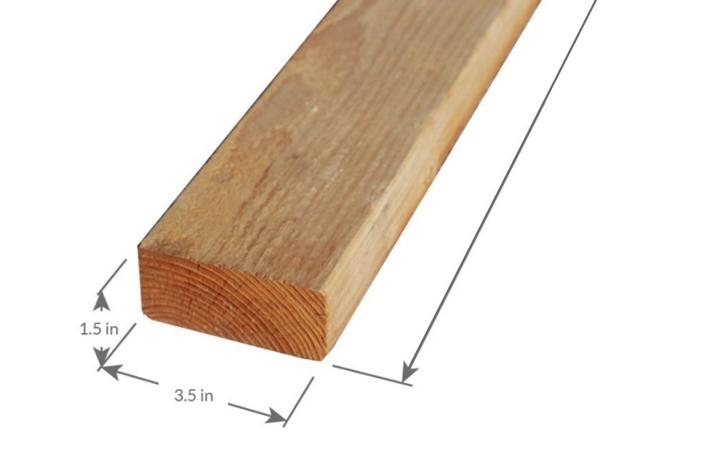

- circular saw +
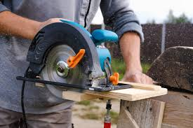

- bolt +
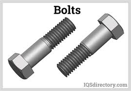

|B: I think you should sand (v.)（用砂纸或打磨机）磨光,打磨 the edges. Look
at all these splinters 木刺;（木头、金属、玻璃等的）尖碎片，尖细条, someone could get
hurt. Geez 天啊（"Jesus"的委婉替代，表惊讶或不满）... you gotta *take pride 以……为荣（此处指认真对待工作） in* your
work!
|我觉得你该打磨下边缘。看看这些木刺，会伤到人的。天啊……干活得讲究质量啊！

- splinter : +
a small thin sharp piece of wood, metal, glass, etc. that has broken off a larger piece（木头、金属、玻璃等的）尖碎片，尖细条 +
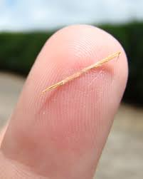

- you gotta
= you have got to（口语中表强烈建议）

|C: Yeah, you’re right. Pass me the sander  打磨机;砂光机（电动打磨工具）
and I’ll *take care of* 解决/处理（=handle） it.
|好吧，你说得对。把砂光机给我，我来处理。

- sander +
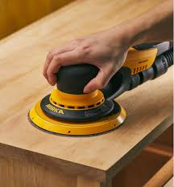

|A: Julia! *Get over here* with the level 水平仪,
_measuring tape_ 卷尺（=tape measure） and that box of screws 螺丝（区别于钉子nails，需旋转固定）!
|朱莉娅！带着水平仪、卷尺和那盒螺丝过来！

- level：水平仪（建筑工具，检测是否水平） +
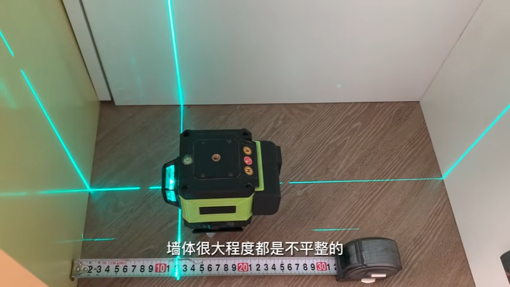

- screw +
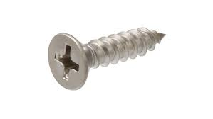

|C: Oh, no! *Look out below*! 下方注意！（工地常用警告语，防高空坠物）
|糟了！下面的人小心！
|===
'''

== ■(125) Elementary ‐Daily Life ‐No Smoking! (C 0125)  +
A: It smells like an ashtray in here!  +
B: Hi honey! What’s wrong? Why do you have that look on your face?  +
A: What’s wrong? I thought we agreed that you were gonna quit smoking.  +
B: No! I said I was going to cut down which is very different. You can’t just expect me to go cold turkey overnight!  +
A: Look, there are other ways to quit. You can try the nicotine patch, or nicotine chewing gum. We spend a fortune on cigarettes every month and now laws are cracking down and not allowing smoking in any public place. It’s not like you can just light up like before.  +
B: I know, I know. I am trying but, I don’t have the willpower to just quit. I can’t fight with the urge to reach for my pack of smokes in the morning with coffee or after lunch! Please understand?  +
A: Fine! I want a divorce!  +
 +
 +

'''

==== ◆(125) Elementary ‐ Daily Life ‐ No Smoking! (C0125)

[.small]
[cols="3a,2a"]
|===
|Header 1 |Header 2

|A: It smells like an ashtray 烟灰缸 in here!
|这儿闻起来跟烟灰缸似的！

|B: Hi honey! What’s wrong? Why do you
have that look on your face?
|嗨亲爱的！怎么了？你摆这副脸色干嘛？

- have that look on your face：脸上带着那种表情（口语中指责对方表情不悦）

|A: What’s wrong? I thought 认为，觉得 we agreed that
you were gonna *quit smoking* 戒烟（固定搭配，quit+动名词）.
|怎么了？我们不是说好你要戒烟的吗？

- gonna：=going to（口语缩略）

|B: No! I said *I was going to cut down* 减少 which
is very different. You can’t just expect me *to
go _cold turkey_* 突然戒断;冷火鸡法 overnight!
|没有！我说的是减少烟量，这完全两码事。你不能指望我一夜之间就彻底戒掉啊！

- cut down：减少（+on sth，如cut down on sugar=少吃糖）
- go _cold turkey_：突然彻底戒断（俚语，尤指烟酒/药物成瘾）.
- cold turkey：源自戒毒时身体出现“鸡皮疙瘩”的戒断反应，后泛指突然戒瘾

|A: Look, there are other ways to quit. You
can try the _nicotine patch_ 补丁，补片, or nicotine
_chewing 咀嚼 gum_ 口香糖. We *spend a fortune 财富，巨款 on*
cigarettes every month and now laws are
*cracking down* 采取强硬措施，严厉打击 and not allowing smoking in
any public place. It’s not like you can just
*light up* 点烟 like before.
|听着，戒烟方法多的是。你可以用尼古丁贴片, 或嚼戒烟口香糖。我们每月花一大笔钱买烟，现在法律也严管，公共场所都不让抽了。你没法再像以前那样随便点烟了！

- nicotine patch：尼古丁贴片（戒烟辅助工具）
- spend (v.) a fortune on：在……上花大钱（夸张表达）

.Nicotine replacement therapy (简称：NRT) :
尼古丁取代疗法, 是一种治疗方式，目的是用尼古丁渐进式地取代香烟,  用于帮助人们增加"戒烟"的成功概率. +
尼古丁取代疗法, 有许多形式：包括尼古丁贴片、口香糖、喉锭、鼻喷剂, 以及吸入剂型。

该疗法的副作用: +
成瘾是常见的副作用之一。

|B: I know, I know. I am trying but, I don’t
have the willpower 意志力，毅力 to just quit. *I can’t fight
with the urge* (n.)强烈的欲望，冲动；推动力 *to reach for* 伸手去拿 my pack （商品的）纸包，纸袋，纸盒 of smokes _in the morning with coffee_ or _after lunch_!
Please understand?
|我知道，我知道。我在努力了，但我就是没毅力直接戒掉。早上喝咖啡或午饭后，我忍不住想拿烟抽！你就不能理解一下吗？

|A: Fine! I want a divorce 离婚!
|行！我要离婚！

|===

'''

== ■(126) Elementary ‐The Weekend ‐That’s Funn y! (C0126)  +
AnnoHuenclleor:everyone, and welcome to open mic night! You’re in for a real treat as we’ve got a lot of great comics here with us tonight. First up, we have a very funny man coming straight from the state of Montana, Robert Hicks!  +
A:  +
Thank you, everyone! Well, what a lovely crowd. You know, there’s nothing I love better than standup comedy! You know, I’ve been working on my routine for months now, and I’ve got some real zingers for you tonight. Let’s start out with some short jokes, how bout that? Where do you find a one legged dog? Where you left it.  +
 +
A:  +
Get it? mmm Anyways... What do you call a sheep with no legs? A cloud !  +
 +
A:  +
Tough crowd... Alright, now you’re going to love this joke. It’s hilarious! What do cows do for entertainment? They rent moooovies ! moooovies  +
 +
A:  +
Okay, Okay, we’ve got a few hecklers in the audience, but this one is good! What does a fish say when it runs into a wall?  +
 +
 +
DAM!  +
A:  +
Okay, Last one! Why do gorillas have big nostrils? Coz they got big fingers!!!! CrowGd:et off the stage! You suck!  +
 +
A:  +
Thanks everyone that was my time.  +
 +
 +
 +
 +

'''

==== ◆(126) Elementary ‐ The Weekend ‐ That’s Funny! (C0126)

[.small]
[cols="3a,2a"]
|===
|Header 1 |Header 2

|AnnoHuenclleor:everyone, and welcome to
_open mic 麦克风，话筒 night_! You’re *in for* 即将遭遇，将要经历 a real treat (n.)（不同一般的）乐事，享受；款待，招待 as
we’ve got a lot of great comics 喜剧演员 here with us
tonight. *First up* 首先登场（活动主持常用语）, we have a very funny man
coming straight from the state of Montana,
Robert Hicks!
|各位，欢迎来到开放麦之夜！今晚我们有许多优秀喜剧演员，保准让大家乐开花！第一位登场的是来自蒙大拿州的搞笑高手——罗伯特·希克斯！

.open mic / open mike :
An _open mic_ or _open mike_ (shortened from "_open microphone_") is a _live show_ 现场表演 at a venue （事件的）发生地点，（活动的）场所 such as a coffeehouse, nightclub, _comedy club_ 喜剧俱乐部, _strip club_ 脱衣舞夜总会, or pub 酒吧, often taking place at night (an _open mic night_), in which audience 观众，听众 members may perform (v.) on stage whether they are amateurs 业余爱好者 or professionals, often *for the first time* or *to promote (v.)促进；推动;促销；推销 an upcoming performance*.  +
*As the name suggests* 顾名思义, performers are usually provided with a microphone *plugged into* a PA system 广播系统（等于 public-address system）  so that they can be heard by the audience.

“开放麦克风”（或写作“开放麦克”）是指在咖啡厅、夜总会、喜剧俱乐部、脱衣舞俱乐部或酒吧等场所进行的现场表演，通常安排在晚上（即“开放麦克风之夜”），让观众成员，无论他们是业余爱好者, 还是专业人士，都有机会上台表演. 这往往是他们的首次登台, 或是为了宣传即将到来的演出。顾名思义，表演者通常会得到一个连接到扩音系统的麦克风，以便观众能够听到他们的表演。

Performers 表演者；执行者 may *sign (v.) up* 报名 in advance 提前，预先 for a _time slot_ 时间段 with the host 主持人；主办者, who is typically an experienced 熟练的，有经验的 performer or the venue's （事件的）发生地点，（活动的）场所 manager or owner. The host may screen (v.)筛查；检查 potential candidates 候选人；申请者 for suitability (n.)适合；适当；相配 for the venue and give them a time to perform (v.) during the show.

表演者可以与主持人提前报名, 注册一个时间插槽(时间段)，主持人通常是经验丰富的表演者, 或场地的经理或所有者。主持人可能会筛选潜在的候选人，以适合该场地，并在演出期间给他们时间表演。

- in for a real treat：有惊喜（口语，表期待）
- 开放麦（open mic）是新人演员试段子或即兴表演的舞台，观众反应直接影响表演效果

|A: Thank you, everyone! Well, what a lovely
crowd. You know, *there’s nothing I love
better than* _standup comedy_ 单口喜剧! You know, I’ve
been working on 从事、处理或努力解决某事 my routine 固定表演段子;常规，惯例 for months now,
and I’ve got some real zingers (n.)妙语；有趣的话;爆笑梗（俚语，指犀利搞笑的内容） for you
tonight. Let’s start out with some short
jokes, how bout that? Where do you find a
one legged (a.)有腿的 dog? Where you left it.
|谢谢各位！哇，观众真热情！要知道，我最爱的就是单口喜剧！我花了几个月打磨今晚的段子，绝对劲爆。先来几个短笑话热热身，怎么样？怎么找独腿狗？在你留下它的地方啊。（注：left双关“留下”和“左腿”）

- zinger : a clever or amusing remark 妙语；有趣的话. -> 来自 zing,呼啸，比喻用法

|A: Get it 听懂了吗? mmm Anyways... 强行转移话题（表观众反应冷淡） What do you call
a sheep with no legs? A cloud !
|懂了吗？嗯算了……无腿的羊叫什么？叫云朵！（注：云形似羊毛团且“飘”在空中）

- mmm：犹豫声（表尴尬或冷场）

|A: Tough 顽固的，固执的；困难的，棘手的 crowd... Alright, now you’re going
to love this joke. It’s hilarious 很可笑的，很滑稽的! What do cows
do for entertainment? They rent (v.)租用，租借；出租，将……租给 moooovies !
moooovies
|观众真难逗笑啊……好吧，这个笑话你们肯定爱！超搞笑的！奶牛怎么娱乐？它们租“哞~影”！（注：moo为牛叫声，谐音movies）

- Tough crowd：难取悦的观众（喜剧行话）
- hilarious：爆笑的（形容词，程度强于funny）

|A: Okay, Okay, we’ve got a few hecklers 捣乱者，喧闹者;喝倒彩者 in
the audience, but this one is good! What
does a fish say when it *runs into 撞上，碰上 a wall* 撞墙?
|行行行，台下有几个捣乱的，但这个绝对棒！鱼撞墙时会说什么？ (常见答案："Dam!"（谐音dam水坝，同时是脏话damn的委婉版）)

- heckler -> 来自PIE*keg,齿，钩子，词源同hook,hack.用于指麻梳，梳理黄麻的梳子，由于黄麻比较粗糙，梳理时需要用很大力，因此引申词义简单粗暴，责问，诘问。

|A: Okay, Last one! Why do gorillas have big
nostrils 鼻孔? Coz (=because) they got big fingers!!!!
|好了，最后一个！大猩猩为啥鼻孔大？因为它们手指粗啊！！（注：暗指挖鼻孔动作）

|CrowGd: Get off the stage! *You suck* (吮吸；吸；咂；啜)你很糟糕，你很差劲!
|观众：滚下台！烂透了！

- You suck：你太差了（极不礼貌的口语）

|A: Thanks everyone *that was my time*.
|谢谢各位，我的时间到了。

- that was my time：表演时间结束（委婉表达，掩盖冷场）
|===

'''

== ■(127) Elementary ‐The Weekend ‐I Love That Song! (C0127)  +
Host: Welcome back, music lovers, to ”I Love That Song”! The game show where we test your musical knowledge to the extreme! Let’s get started! Team A... Guess this tune: Team A: Carrying Your Love With Me by George Straight! The genre is country music! Host: You are right! one hundred points to team A! Now, for our next cut. Team B: Thong Song by Sisqo! I believe the genre is R&B? Host: One hundred big points for team B! For all our viewers the acronym R&B stands for Rhythm and Blues. On that note, DJ, play our next song! Team B: Superstar by The Carpenters! Host: And the genre? Team B: Um... Um... Adult Contemporary? Host: That’s right! A hundred points! Uh oh! That sound means it’s double or nothing! The songs are more difficult and the points are doubled! Let’s hear our next song! Team A: Too easy! That song is Kinslayer by the Finnish power metal group, Nightwish! Host: You are correct! Very impressive team A! And it seems we have a tie! It’s time now for the tie-breaker round! Each team will be played three songs and they must tell us the genre of each song in less than five seconds! Team A, are you ready? Team A: Ready! Host: Let’s hear it! Team A: Hip Hop, Classical and Gothic metal! Host: You are right! Team B, the pressure is on, if you get all of them right, we will move on to sudden death. If you miss one, you lose! DJ, Let’s hear it!  +
Team B: Rap, Disco and... and...  +
 +
 +

'''

==== ◆(127) Elementary ‐ The Weekend ‐ I Love That Song! (C0127)

[.small]
[cols="3a,2a"]
|===
|Header 1 |Header 2

|Host: *Welcome back*, music lovers, *to* ”I
Love That Song”! The game show (n.)（电视或广播）节目；展览 where we
test (v.) your
musical knowledge *to the extreme*! Let’s get
started! Team A... Guess this tune 曲调，曲子:
|主持人：欢迎回到《我爱那首歌》，音乐迷们！这是一档极限考验你音乐知识的节目！现在开始！A队……猜这首歌！

- game show：综艺竞猜节目（电视节目类型）

|Team A: _Carrying Your Love With Me_ by
George Straight! The genre （文学、艺术、电影或音乐的）体裁，类型 is country music!
|乔治·斯特雷特的《Carrying Your Love With Me》！流派是乡村音乐！

- genre -> 来自词根gen, 生育，词源同generate. 用于文学术语。

|Host: You are right! one hundred points to
team A! Now, for our next cut.
|

|Team B: _Thong （用以系物或做皮鞭的）皮条;（背后为绳子一样窄条的）内裤；丁字内裤 Song_ by Sisqo! I believe the
genre is R&B?
|西斯蔻的《丁字裤之歌》！我觉得是R&B？

- R&B：节奏蓝调（Rhythm and Blues，融合爵士与蓝调的黑人音乐）

|Host: One hundred _big points_ for team B!
For _all our viewers_ the acronym 首字母缩略词 R&B *stands
for* 代表,意味着 Rhythm and Blues. *On that note* 关于这一点, DJ, play
our next song!
|B队加100分！观众朋友们，R&B是“节奏蓝调”的缩写。DJ，下一首走起！

- big points 大分数：在某些比赛或游戏中，获得的高分数。
- On that note：在刚才提到的话题上; 顺势而为（过渡短语，引出下一环节）

|Team B: Superstar by The Carpenters!
|卡朋特乐队的《超级明星》！

|Host: And the genre?
|那么流派是？

|Team B: Um... Um... Adult Contemporary (a.)当代的，现代的；同时期的，同时代的 ?
|呃……成人当代？

- Adult Contemporary：成人当代音乐（柔和流行乐，目标听众为成年人）. 特点：旋律舒缓，适合电台播放.

|Host: That’s right! A hundred points! Uh oh!
That sound (n.) means (v.) it’s _double or nothing_ 赌注翻倍或归零! The
songs are more difficult and the points are
doubled! Let’s hear our next song!
|正确！100分！哦豁！这个音效代表“双倍或清零”！歌曲难度升级，分数翻倍！请听下一首！

|Team A: Too easy! That song is Kinslayer 弑亲者 by
the
Finnish 芬兰的，芬兰语的 power metal group, Nightwish!
|太简单了！这是芬兰力量金属乐队"夜愿"的《弑神者》！

- Kinslayer: Kin （统称）家属，亲属，亲戚. slayer 凶手；杀人者；屠宰者 +
Kinslayer：/ˈkɪn.sleɪ.ər/（虚构词，kin+slayer=弑亲者）

|Host: You are correct! Very impressive 给人印象深刻的，令人钦佩的 team
A! And it seems we have a tie 平局;（用线、绳索等）系，扎，捆! It’s time now
for the tie-breaker 平局决胜；平分决胜的比赛 round! Each team will *be
played* 被播放 three songs and they must tell us the
genre of each song in less than five seconds!
Team A, are you ready?
|正确！A队厉害！现在平局了！进入加赛环节！每队听三首歌，5秒内说出流派！A队准备好了吗？

- tie-breaker
A tie-breaker is an extra question or round that decides the winner of a competition or game when two or more people have the same score at the end. (比赛最后出现平局时另加的)决胜题; 决胜局

|Team A: Ready!
|

|Host: Let’s hear it!
|

|Team A: Hip Hop 嘻哈文化, Classical and Gothic 哥特式的
metal!
|嘻哈、古典和哥特金属！

|Host: You are right! Team B, the pressure is
on, if you get all of them right, we will move
on to sudden death 突然死亡赛（指一题决胜负）. If you miss one, you
lose! DJ, Let’s hear it!
|正确！B队压力来了——全对进入突然死亡赛，错一题直接淘汰！DJ，放音乐！

|Team B: Rap, Disco and... and...
|说唱、迪斯科和……和……
|===
'''

== ■(128) Elementary ‐Daily Life ‐I’m Sorry I Love You X (C0128)  +
Gulam: Steven! Good to see you brother!  +
How are you? How was your trip?  +
Steven: It was fine. I’ve been better but, it’s  +
great to be home, I’ve missed you all! How’s  +
mom?  +
Gulam: She’s great! All she ever does is talk  +
about you -her little boy that went to the  +
United States. You’re her pride and joy, you  +
know that?  +
Steven: Can’t wait to see her. And you?  +
What’s new with you?  +
Gulam: Well, Nisha and I are expecting!  +
You’ll have another nephew or niece soon!  +
Steven: That’s great! Wow! Congrats! You  +
two are great together, ya know. You have  +
such a beautiful family. I hope one day I can  +
have that.  +
Gulam: Of course, man! Come on! I mean,  +
everything was set here for you to marry  +
Shalini! You know, she’s still pining after you.  +
I don’t think she’ll ever get over you.  +
Steven: What are you talking about? I  +
hardly knew her! How could she be in love  +
with me? I couldn’t go through with it even  +
though she  +
is a great woman. No, I left my heart in the  +
United States. I just hope Veronica is happy.  +
Gulam: Get over it! You’re home now.  +
Everyone here thinks so highly of you;  +
there’ll be girls throwing themselves at you.  +
You can marry anyone you want!  +
Steven: I don’t want to marry anyone! I  +
want to marry her! Don’t you understand?  +
Gulam: You are incorrigible.  +
Liliana: Steven! My baby how are you! I’ve  +
missed you so much!  +
Steven: Hey, mom! Great to see you!  +
Liliana: You look so thin! Didn’t those  +
Americans feed you? Come come, let’s have  +
some chai. By the way... There is a girl here  +
waiting for you.  +
Veronica: Hi Steven.  +
Steven: Veronica! How did you get here?  +
 +
How did you know where I live? I waited for you at the airport but you never showed... Veronica: I also have some little secrets that I haven’t told you about, but we can discuss that later. I realized that I was just scared. Scared of how much I love you and of the commitment that marriage requires. I’m here now. Now there is something I wanna ask you. Steven, will you marry me? Priest: I now declare you, husband and wife. You may kiss the bride.  +
 +
 +

'''

==== ◆(128) Elementary ‐ Daily Life ‐ I’m Sorry I Love You (X) (C0128)

[.small]
[cols="3a,2a"]
|===
|Header 1 |Header 2

|Gulam: Steven! Good to see you brother!
How are you? How was your trip （尤指短程往返的）旅行，旅游；出门，出行?
|史蒂文！见到你真好，兄弟！还好吗？旅途顺利吗？

|Steven: It was fine. *I’ve been better but* 委婉表达不顺（字面“我曾更好过”=最近不太好）, it’s
great to be home, I’ve missed you all! How’s
mom?
|还行。不算最好，但回家真好，想死你们了！妈妈怎么样？

- I’ve been better but  : 现在完成时（I’ve been/I’ve missed）：强调过去经历对当下的影响

|Gulam: She’s great! All she ever does is talk
about you -her little boy that went to the
United States. You’re her _pride and joy_ 骄傲与快乐（固定搭配，指最珍视的人/物）, you
know that?
|她很好！整天念叨你——她那个去了美国的“小儿子”。你是她的骄傲，知道不？

|Steven: Can’t wait to see her. And you?
What’s new with you?
|等不及见她了。你呢？最近有啥新鲜事？

- Can’t wait：迫不及待（口语省略主语I）
- What’s new with you?：非正式寒暄（=Any updates?）

|Gulam: Well, Nisha and I are expecting 怀孕;期待!
You’ll have another nephew 侄子，外甥 or niece 外甥女，侄女 soon!
|这个嘛，妮莎和我有喜了！你很快又要当叔叔/舅舅啦！

|Steven: That’s great! Wow! Congrats! You
two are great together, ya know (=you know). You have
such a beautiful family. I hope one day I can
have that.
|太好了！哇！恭喜！你俩超配的，真的。家庭美满，真希望我有一天也能这样。

- have that：拥有那种生活（that指代前文“beautiful family”）

|Gulam: Of course, man! Come on! I mean,
everything was set here for you to marry
Shalini! You know, she’s still pining (v.)怀念；思念；渴望 after you.
I don’t think she’ll ever *get over* 放下（情感）;(从不快或疾病中) 恢复过来 you.
|当然会啦！拜托！当初家里都给你和莎莉妮安排好了！你知道她还对你念念不忘，我看她永远走不出来。

- everything was set：一切就绪（本文指包办婚姻的传统安排）
- pine for sb/sth:
to want or miss sb/sth very much 怀念；思念；渴望
- pining after：苦苦思念（动词短语，带单相思意味）

|Steven: What are you talking about? I
hardly knew her! How could she be in love
with me? I couldn’t *go through with it* 完成某事（尤指不情愿的事） even
though she
is a great woman. No, I left my heart in the
United States. I just hope Veronica is happy.
|你说啥呢？我跟她根本不熟！她怎么可能爱我？虽然她很好，但我没法接受。我的心留在美国了，只希望维罗妮卡幸福。

|Gulam: Get over 放下过去,忘记并继续前进 it! You’re home now.
Everyone here thinks so highly of you;
there’ll be girls *throwing themselves at you* 倒追（形容主动追求）.
You can marry anyone you want!
|别纠结了！你现在回家了。这儿人人都高看你，姑娘们会扑着来找你，你想娶谁就娶谁！

- thinks highly of you : 尊重你：对你持有高度评价和尊重的态度。

|Steven: I don’t want to marry anyone! I
want to marry her! Don’t you understand?
|

|Gulam: You are incorrigible  不可救药的；积习难改的.
|

|Liliana: Steven! My baby how are you! I’ve
missed you so much!
|- My baby：亲昵称呼（即使子女成年，父母仍用此表达）

|Steven: Hey, mom! Great to see you 见到你真好!
|

|Liliana: You look so thin! Didn’t those
Americans feed  (v.)饲养，喂养，为……提供食物 you? Come come, let’s have
some chai 印度（奶）茶；混合茶. By the way 顺便说一下... There is a girl here
waiting for you.
|你瘦成这样！美国人没给你饭吃吗？快来喝点奶茶。对了……有个姑娘在等你。

|Veronica: Hi Steven.
|

|Steven: Veronica! How did you get here?
How did you know where I live? I waited for
you at the airport but you never showed...

|维罗妮卡！你怎么来的？怎么知道我住哪儿？我在机场等过你，可你没出现…

|Veronica: I also have some little secrets
that I haven’t told you about, but we can
discuss that later. I realized that I was just
scared  (a.)惊恐的，恐惧的；担心的，焦虑的. Scared of how much I love you and
of the commitment 承诺；许诺 that marriage requires.
I’m here now. Now there is something I
wanna ask you. Steven, will you marry me?
|我意识到我只是害怕——害怕我太爱你，也害怕婚姻的责任。

|Priest: I now declare 宣布，声明；断言 you, husband and wife.
You may kiss the bride.
|神父：现在我宣布你们结为夫妻。你可以亲吻新娘了。
|===

'''

== ■(129) Elementary‐Global View ‐Presidential S peech II (C0129)  +
A:  +
We now stand ten years past the midpoint of a century that has witnessed four major wars among great nations. Three of these involved our own country. Despite the carnage of these conflicts, America is today the strongest, the most influential and most productive nation in the world. We are understandably proud of this preeminence, yet we realize that America’s leadership and prestige depend, not merely upon our unmatched material progress, riches and military strength, but on how we use our power in the interests of world peace and human betterment.  +
 +
A:  +
Throughout America’s adventure in free government, such basic purposes have been to keep the peace; to foster progress in human achievement, and to enhance liberty, dignity and integrity among peoples and among nations.  +
 +
A:  +
We pray that peoples of all faiths, all races, all nations, may have their great human needs satisfied; that those now denied opportunity shall come to enjoy it to the full; that all who yearn for freedom may experience its spiritual blessings; that those who have freedom will understand, also, its heavy responsibilities; that all who are insensitive to the needs of others will learn charity; that the scourges of poverty, disease and ignorance will be made to disappear from the earth, and that, in the goodness of time, all peoples will come to live together in  +
 +
 +
a peace guaranteed by the binding force of mutual respect and love.  +
A: Now, on Friday noon, I am to become a private citizen. I am proud to do so. I look forward to it. Thank you, and good night.  +
 +
 +

'''

==== ◆(129) Elementary‐ Global View ‐ Presidential Speech II (C0129)

A: We now stand (v.) ten years past _the midpoint 中点；正中央
of a century_ that has witnessed 见证 four major
wars among great nations. Three of these
involved our own country. Despite the
carnage （尤指战争中的）大屠杀，残杀 of these conflicts, America is today
the strongest, the most influential and most
productive 多产的，丰饶的；有效益的，富有成效的 nation in the world. We are
understandably 可理解地；合乎情理地 proud of this preeminence 卓越；杰出,
yet we realize that America’s leadership and
prestige 声望，威信 *depend, #not# merely upon* our
unmatched 无与伦比的；不相配的；无匹敌的 material progress 物质进步, riches and
military strength, *#but# on* how we use our
power in the interests 利益，好处 of world peace and
_human betterment_ (改进；改善；改良)人类福祉.

[.my2]
我们现在正处于这个世纪中点之后的十年——这个世纪见证了四次大国之间的重大战争。其中三次战争牵涉到了我们自己的国家。尽管这些冲突造成了惨绝人寰的屠杀，如今的美国却是世界上最强大、最具影响力, 且最富生产力的国家。我们对此感到理所当然的自豪，但我们也清楚，美国的领导地位和声望, 不仅仅依赖于我们无与伦比的物质进步、财富和军事力量，更取决于我们如何运用这种力量, 以促进世界和平, 和造福人类。

[.my1]
.案例
====
- midpoint of a century：世纪中叶
- 虽未明言，但"four major wars"可能指两次世界大战+朝鲜/越南战争，反映20世纪中叶背景
- human betterment：人类福祉（政治演讲高频词，类似"common good"）
====

A: Throughout 自始至终，贯穿整个时期 America’s adventure 冒险（经历），奇遇 in _free
government_, such basic purposes 目的，意图；目标 have been
to keep (v.) the peace; to foster (v.)促进，培养 progress in
human achievement 成绩，成就；完成，实现, and to enhance liberty 自由，自由权,
dignity 尊严，自尊 and integrity 正直，诚实 among peoples and
among nations.

[.my2]
在美国探索自由政府的历程中，这些根本目标始终是：维护和平；促进人类成就的进步；提升各国人民间的自由、尊严与正直。

[.my1]
.案例
====
- adventure in free government：自由政体的探索（"adventure"隐喻政治实验的冒险性）
- foster (v.) progress：推动进步（政府文书常用搭配）
- “have been to do” 结构表达了一直以来的目标和宗旨，是一个常见的表达方式。
====

A: We pray #that# peoples of all faiths, all
races, all nations, may *have* their great
human needs *satisfied*; #that# `主` those 后定 now
denied (v.)拒绝；拒签；否认 opportunity `谓` shall come to enjoy it__ to
the full__ 完全地,彻底地; #that# all who *yearn (v.)怀念，渴望 for* freedom may
experience its spiritual blessings 精神上的祝福; #that# those
who have freedom will understand, also, its
heavy responsibilities; #that# `主` all who are
insensitive (a.)（对他人的感受）未意识到的，漠不关心的；身体无感觉的，麻木的；不敏感的，反应迟钝的 to the needs of others `谓` will learn (v.)
charity 慈善；仁爱；宽容；宽厚; #that# the scourges (n.)祸害；祸根；灾害 of poverty, disease
and ignorance (n.)无知，愚昧 will be made to disappear
from the earth, and #that#, *in the goodness 善良；优良；美德 of
time* 在适当的时候,随着时间的推移, all peoples will come to live together in
a peace guaranteed 保证，担保 by the _binding force_ 约束力 of
mutual respect and love.

[.my2]
我们祈愿所有信仰、种族与国家的人民，其基本需求得以满足；被剥夺机会者能充分享有机遇；渴望自由者感受其精神恩泽；拥有自由者亦明晓其沉重责任；漠视他人需求者学会慈悲；贫困、疾病与无知的灾祸从地球消失；最终在时间的仁慈中，全人类能在相互尊重与爱的纽带下共享和平。

[.my1]
.案例
====
- spiritual blessings：精神福祉（宗教色彩词汇）
- "goodness of time" 将时间拟人化，表历史必然性
- binding force：约束力（法律/道德术语，此处柔性化为"mutual respect and love"）
- 虚拟语气："may have... shall come... will understand" 混合情态动词表达祈愿层次
====

A: Now, on Friday noon, I am to become a
private 未担任公职的，无官职的 citizen. I am proud to do so. I *look
forward to* 盼望,期待 it. Thank you, and good night.

[.my2]
此刻，周五正午，我将成为一介平民。我为此自豪，并心怀期待。谢谢，晚安。

[.my1]
.案例
====
- “I am to become…”表达一种即将发生的安排或计划，比单纯的“I will become…”更具有正式和庄重的语气。
- private citizen：普通公民（政要卸任后强调身份转换，如艾森豪威尔离职演说）
====

'''

== ■(130) Elementary ‐Daily Life ‐Going To The Gy m (C0130)  +
A: Hey there, you look a little lost. Are you new here?  +
B: Yeah how’d you know?  +
A: You can always spot the newbies. I can give you a few pointers if you want. Were you trying to use this machine here?  +
B: Yeah! I just started my training today and I’m not really sure where to begin.  +
A: It’s ok, I know how it is. This machine here will work out your upper body, mainly your triceps and biceps. Are you looking to develop strength or muscle tone and definition?  +
B: Well, I don’t want to be ripped like you! I just want a good physique with weights and cardio.  +
A: In that case you want to work with less weight. You can start off by working ten to fifteen reps in four sets. Five kilo weights should be enough. Now it’s very important that you stretch before pumping iron or you might pull a muscle.  +
B: Got it! Wow is that the weight you are lifting? My goodness that’s a lot of weight!  +
A: It’s not that much. Just watch... I’m ok...  +
 +
 +

'''

==== ◆(130) Elementary ‐ Daily Life ‐ Going To The Gym 体育馆，健身房  (C0130)

A: Hey there, you look a little lost 显得迷茫. Are you
new here?

B: Yeah how’d (=how did) you know?

[.my2]
嘿，你看起来有点懵。新来的？ +
是啊，你怎么看出来的？

[.my1]
.案例
====
- look lost：显得迷茫（口语，非字面“迷路”）
- new here：新手（可指健身房、公司等场景）
====

A: You can always spot the newbies 初学者,新手. I can
give you a few pointers 提示；建议 if you want. Were
you trying to use this machine here?

B: Yeah! I just started my training today and
I’m not really sure where to begin.

[.my2]
你总能发现新手(一眼就能认出菜鸟)。需要的话可以给你点建议。刚才是想用这台器械吗？ +
对！今天刚开始练，完全不知道从哪儿下手。

A: It’s ok, I know how it is. This machine
here will *work out* 锻炼 your upper body 上半身, mainly
your triceps 三头肌 and biceps 二头肌. Are you looking to
develop strength or _muscle tone 语气，腔调，口吻;（肌肉）结实，健壮；（皮肤）柔韧 and
definition_ 释义，解释;清晰度?

B: Well, I don’t want to be ripped 肌肉分明;（突然或猛烈地）撕破，裂开 like you! I
just want a good physique 体格，体形;身材 with _weights and
cardio_ (有氧运动) 无氧（器械）与有氧训练.

[.my2]
没事儿，我懂。这台器械练上半身，主要是三头肌和二头肌。你想增强力量还是塑形？ +
呃，我可不想练成你这样的大块头！就想通过重量训练和有氧塑个好看体型。

[.my1]
.案例
====
- bicep +
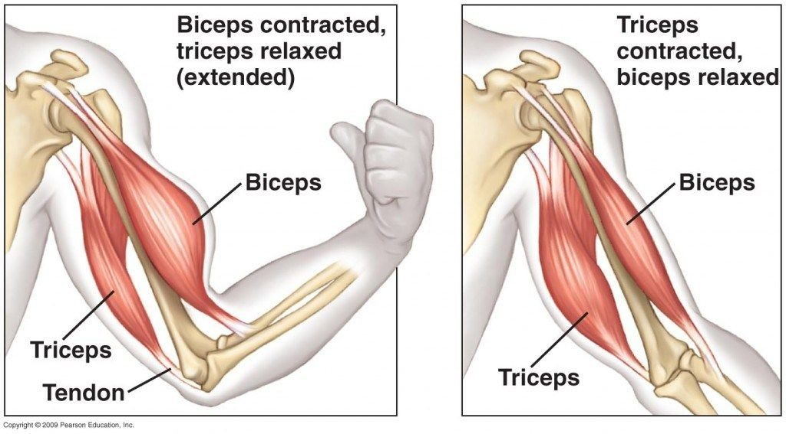

- muscle tone and definition：肌肉线条与清晰度（健身目标术语）
====

A: In that case you want to work with less
weight. You can *start off* 开始活动；动身;首先进行；一开始是 by working ten to
fifteen reps 重复次数（=repetitions) in four sets 组数（训练基础单位）. Five kilo 千克，公斤 weights
should be enough. Now it’s very important
that you stretch (v.) before *pumping (v.)用泵输送；涌出 iron* 举铁（指力量训练） or 不然，否则 you
might *pull a muscle* 肌肉拉伤.

B: Got it! Wow is that the weight you are
lifting 举起，抬起? My goodness that’s a lot of weight!

[.my2]
那你要用"小重量"来练。可以从4组、每组10-15次开始，5公斤够了。记住举铁前必须拉伸，否则会拉伤。 +
明白！天，你举的那个重量？太吓人了吧！

[.my1]
.案例
====
- My goodness：表惊讶（较"OMG"委婉）
- "Wow is that...?" → "Wow, is that...?"（口语忽略逗号）
====

A: It’s not that much. Just watch... I’m ok...

[.my2]
没多沉。看好了……我没事……（*可能因勉强举重受伤）

[.my1]
.案例
====
- Just watch：挑衅/展示语气（健身房常见“逞强”场景）
====

'''

== ■(131) Elementary ‐Daily Life ‐What if? Part 1 (C0131)  +
A: Okay, next question. If Eric asked you out on a date, what would you say?  +
B: Duh! I would say yes! Eric is the most popular kid in school! Okay, my turn. What would you do if you won the lottery?  +
A: Let’s see.... If I won the lottery, I would buy two tickets for a trip around the world.  +
B: If you buy me a ticket I will go with you for sure!  +
A: My dad will freak out if I even mention a trip like that!  +
 +
B: Alright this is a good one. What would your mom say if you told her you are going to get married?  +
A: If I told her that, she would faint and have me committed!  +
 +
 +
 +

'''

==== ◆(131) Elementary ‐ Daily Life ‐ What if? Part 1(C0131)

A: Okay, next question. If Eric *asked you out* 约某人出去（特指约会邀请）
on a date 约会，幽会, what would you say?

B: Duh 表明显易见（俚语，带轻微不耐烦，如“这还用问？”）! I would say yes! Eric is the most
popular kid in school! Okay, my turn. What
would you do if you won the lottery 抽彩给奖法;中彩票（虚拟语气标志词，实际可能性极低）?

[.my2]
好，下一题。如果埃里克约你出去，你会怎么说？ +
废话！当然答应！埃里克可是全校风云人物！该我了，你要是中彩票会干嘛？

A: Let’s see.... If I won the lottery, I would
buy two tickets for a trip around the world.

B: If you buy me a ticket I will go with you
for sure!

[.my2]
我想想……要是中奖了，我会买两张环球旅行的票。 +
要是你给我买票，我绝对跟你去！

[.my1]
.案例
====
- If I #won# the lottery, I #would# buy two tickets for a trip around the world.  +
虚拟语气一致性：从句（won）与主句（would buy）时态匹配
====

A: My dad will *freak （使）吃惊，不安，恼怒 out* 抓狂,暴怒 if I even mention a
trip like that!

B: Alright this is _a good one_ 劲爆问题（指难以回答或敏感话题）. What would
your mom say if you told her you are going
to get married?

[.my2]
我光是提这种旅行，我爸就得抓狂！ +
来个猛的——要是告诉你妈你要结婚，她会咋说？

[.my1]
.案例
====
- What #would#
your mom say #if# you #told# her you are going
to get married? +
虚拟语气混合：从句用过去式（told），主句用would say，但内嵌现在进行时（are going to）体现即时性
====

A: If I told her that, she would faint (v.)昏厥 and
have me committed （下令）把（某人）送进（医院或监狱等）!

[.my2]
她得当场晕倒，然后把我送进精神病院！

[.my1]
.案例
====
- commit :
(v.) [ often passive]**~ sb to sth** : to order sb to be sent to a hospital, prison, etc.（下令）把（某人）送进（医院或监狱等） +
-She was committed to a psychiatric hospital.她被送进了精神病院。

- have me committed：强制送入精神病院（commit的被动语态，口语中夸张用法）. +
用极端后果（进精神病院）表达母亲会认为结婚想法荒唐. +
这里的 “have me committed” 是一个口语表达，意思是“把我送进精神病院”, 或者“让我接受精神病治疗”。说话者用这种夸张的说法，表示如果他告诉母亲他要结婚，母亲会极度震惊，甚至觉得他精神有问题，需要被送进医院接受治疗。

====

'''

== ■(132) Elementary ‐Daily Life ‐Mechanic (C0132)  +
A: Howdy! Nice car! What seems to be the problem?  +
B: I don’t know! This stupid old car started spewing white smoke and it just died on me. Luckily, I managed to start it up and drive it here. What do you think it is?  +
A: Not sure yet. How about you pop the hood and we can take a look. Hmmm, it doesn’t look good.  +
B: What do you mean? My daddy gave me this car for my birthday last month. It’s brand new!  +
A: Well missy, the white smoke that you saw is steam from the radiator. You overheated your engine so now the pistons are busted and so is your transmission. You should have called us and we could have towed you over here when your car died.  +
B: Ugh... So how long is this going to take? An hour?  +
A: I’m afraid a bit more than that. We need to order the spare parts, take apart your electrical system, fuel pump and engine and then put it back together again. You are going to have to leave it here for at least two weeks.  +
B: What! How am I supposed to get to school or go shopping? This is not happening!  +
 +
 +

'''

==== ◆(132) Elementary ‐ Daily Life ‐ Mechanic 机械工，机修工 (C0132)

A: Howdy（=Hello，牛仔文化遗留）! Nice car! *What seems to be* the
problem?

B: I don’t know! This stupid old car started
spewing 喷涌，喷射 white smoke and it just *died on me* 抛锚;死在我身上（拟人化表达）.
Luckily (ad.)幸好，侥幸；幸运地, I managed *to start it up* 点火启动 and drive it
here. What do you think it is?

[.my2]
嗨！车不错啊！哪儿出问题了？ +
不知道！这破车突然冒白烟，直接趴窝了。幸亏我又打着火开过来。你觉得是啥毛病？

[.my1]
.案例
====
- What seems to be...：委婉询问问题（服务业常用句式）
====

A: Not sure yet. How about you *pop (v.) the hood* （衣服上的）兜帽，风帽；头巾，面罩；（设备或机器的）防护罩，罩
and we can take a look 检查. Hmmm, it doesn’t
look good.

B: What do you mean? My daddy gave me
this car for my birthday last month. It’s
*brand new* 崭新的,全新的!

[.my2]
还不确定。你开下引擎盖，咱瞅瞅。嗯……情况不妙啊。 +
啥意思？这车是我爸上个月送的生日礼物，全新哒！

[.my1]
.案例
====
- pop the hood：打开引擎盖（美式口语，英式用"bonnet"）
- daddy：儿语化称呼（成人使用显幼稚，暗示被宠溺）
====

A: Well missy 小姐；少女，小姑娘, the white smoke that you saw
is steam from the radiator  暖气片，散热器，（车辆或飞机发动机的）冷却器，水箱（散热器核心部件）.  +
*You overheated 使……过热
your engine* #so# now *the pistons 活塞（引擎内部核心运动部件） are busted* (v.)打破；摔碎;（使）降级，降低军阶 (“busted” 是口语化的“坏了、损坏”)
#and so# is your transmission 变速箱（动力传输系统）;（车辆的）传动装置，变速器.  +
*You should have
本应该 called us* and we could *have towed 拖 you over
here* when your car died 抛锚.

B: Ugh... So how long is this going to take 需耗时（进行时表未来计划）?
An hour?

[.my2]
妹子啊，你看到的白烟是水箱的蒸汽。发动机过热导致活塞和变速箱都报废了。你当时抛锚就该打电话叫我们拖车过来。 +
呃……那得修多久？一小时？

[.my1]
.案例
====
- radiator -> 来自 radiate,放射，发散。后用于指暖气片，散热器等。 +

- so is your transmission
“so is…” 结构表示“……也是如此”，避免重复前面的句子，简洁明了。

- You should have called us  +
虚拟语气过去完成时："should have + 过去分词" 表未实现的义务
====

A: I’m afraid a bit more than that. We need
to order (v.) the _spare parts_ 备用零件, *take apart* 拆开,拆卸 your
electrical system 电路系统（汽车三大系统之一）, _fuel pump_ 燃油泵（供油核心部件） and engine *and
then* put it back together again. You are
going to *have to* leave it here for at least two
weeks.

B: What! *How am I supposed 我该怎么 to* get to
school or go shopping? This is not
happening!

[.my2]
恐怕不止。得订零件，拆电路系统、油泵和发动机，再装回去。这车至少得留两周。 +
什么！我怎么上学逛街？这不可能！

[.my1]
.案例
====
- How am I supposed to…? 表达困惑或抱怨，类似于“那我该怎么办？”
- This is not happening!：拒绝接受现实（字面“这事没发生”）. 表示难以置信, 或不愿接受现实，相当于“这不是真的吧！”
====

'''

== ■(133) Elementary ‐Daily Life ‐Doing Laundry ( C0133)  +
A: Ok, let’s go through this one more time. I don’t want anymore ruined or dyed blouses!  +
B: I know, I know. OK, so I have to separate the colors from the whites and put them in this strange looking contraption so called washing machine.  +
A: Right. You have to turn it on and program it depending on what type of clothes you are washing. For example for delicates, you should set a shorter washing cycle. Also, be sure to use fabric softener and this detergent when washing.  +
B: So complicated! Ok, what about this red wine stain? How do I get it out?  +
A: Since this is a white t-shirt, you can just pour a little bit of bleach on it and it will do the trick.  +
B: Cool. Then I can just throw everything in the dryer for an hour and its all set right?  +
A: No! Since you are washing delicates and cotton, you should set the dryer to medium heat and for twenty minutes.  +
B: You know what? I’ll just have everything dry cleaned.  +
 +
 +

'''

==== ◆(133) Elementary ‐ Daily Life ‐ Doing Laundry 待洗（或正在洗涤、洗完）的衣物 (C0133)

A: Ok, let’s *go through* 梳理流程（口语中=review） this one more time. I
don’t want anymore ruined or dyed 染色 blouses 女衬衫!

B: I know, I know. OK, so I *have to* separate
the colors from the whites 分色洗涤 and put them in
this strange looking contraption (n.)奇妙的装置；精巧的设计 *so called* 所谓的
washing machine.

[.my2]
好，再讲一遍。我可不想再有衬衫被洗坏或染色了！ +
知道啦。所以我要把深色和浅色分开，塞进这个叫“洗衣机”的怪东西里？

[.my1]
.案例
====
- ruined/dyed：损坏/染色（洗衣事故常见结果）

- blouse +

- contraption -> 来自 contrive (v.谋划，策划；设计，发明) 和 deception (欺骗，蒙骗；骗术) 的合成词。

- so called：所谓的（带质疑语气，如“你们管这叫洗衣机？”）
====

A: Right. You have to *turn it on* and program (v.)
it depending on what type of clothes you are
washing. For example for delicates 精细衣物（含丝绸、蕾丝等）, you
should set a shorter _washing cycle_ 洗涤周期（时长+模式，如快洗/强力洗）. Also 此外，而且, *be
sure* to use (v.) _fabric softener_ 织物柔顺剂（减少静电，使衣物柔软） and this detergent 洗衣液/粉 when washing.

B: So complicated 复杂的，难处理的! Ok, what about this red
wine stain 污点，污渍? How do I *get it out* 去除（=remove）?

[.my2]
对。开机后根据衣物类型选程序。比如精细织物用快洗，记得加柔顺剂和这个洗衣液。 +
太复杂了！那这红酒渍咋办？怎么去掉？

[.my1]
.案例
====
- detergent -> de-, 向下，强调。-terg, 转，磨擦，词源同turn, terse. 引申义洗涤，洗涤剂。
====

A: Since this is a white t-shirt, you can just
pour _a little bit of_ bleach 漂白剂，消毒剂 on it and it will *do
the trick* (花招，诡计)解决问题（=solve the problem）.

B: Cool. Then I can just throw everything in
the dryer 烘干机；干燥剂 for an hour and its *all set* 准备就绪,搞定 right 对吧?

[.my2]
既然是白T恤，倒点漂白剂就行，立马见效。 +
酷！然后全扔烘干机一小时就完事儿了？

[.my1]
.案例
====
.all set：
搞定（口语，=completely ready） +
这里的 "all set, right?" 是口语表达，意思是 “一切都搞定了，对吧？” , 或 “这样就行了，对吧？” +
- Dinner is all set!（晚餐准备好了！） +
- Are you all set for your trip?（你的旅行都准备好了吗？）
====

A: No! Since you are washing delicates 精细衣物 and
cotton, you should *set* the dryer *to* medium
heat and for twenty minutes.

B: You know what? 你知道吗(用于引起某人的注意，然后宣布某事.) I’ll just have everything
_dry cleaned_ 干洗.

[.my2]
不行！洗的是精细面料和棉质，得用"中温"烘20分钟。 +
算了，我还是全部送干洗吧！

'''

== ■(134) Elementary ‐Daily Life ‐Buying a TV (C0134)  +
A: Seriously, I don’t know why we need to get a new TV.  +
B: Honey I told you already. I can’t appreciate the graphics level and detail of the games on my Playstation 3 on our old TV.  +
C: Good afternoon folks! How can I be of service today?  +
B: I’m looking to upgrade to a newer, bigger television set.  +
C: You’ve come to the right place! What size are you looking for?  +
A: Just a normal sized TV for our living room.  +
C: I see. Well this set here is on sale. It’s a forty six inch HDTV screen and has all the works. Three HDMI connectors, USB, VGA and S -Video ports. It even has a DVI port so you can hook up your PC or laptop! This is without a doubt the complete home theater experience!  +
B: This is exactly what I need! Can you imagine watching movies or playing video games on this thing?  +
A: Honey, I think it’s a bit too big. I don’t even think it will fit in our living room.  +
C: Not to worry, we will deliver and install it in your home. It comes with a wall mount so you can just hang it on the wall like a picture!  +
 +
B: This is great! How much will this set me back?  +
C: Lucky for you, this is the last one we have in stock so it’s half off!  +
B: I’ll take it!  +
 +
 +
 +

'''

==== ◆(134) Elementary ‐ Daily Life ‐ Buying a TV (C0134)

A: Seriously, I don’t know why we need to
get a new TV.

B: Honey I told you already. I can’t
appreciate the graphics level and detail of
the games on my Playstation 3 on our old TV.

[.my2]
说真的，我不懂为啥要换新电视。 +
亲爱的我说过了，旧电视根本体现不了PS3游戏的画质细节。

C: Good afternoon folks! How can I *be of
service* 提供服务 today?

B: I’m looking to upgrade to a newer, bigger
_television set_ 电视机（正式说法，口语多用TV）.

[.my2]
下午好！有什么能帮您的？ +
我想升级一台更大更新的电视。

[.my1]
.案例
====
- folks：亲切称呼（美式销售惯用语，拉近距离）
====

C: You’ve come to the right place! What size
are you looking for?

A: Just a normal sized TV for our living room 客厅.

[.my2]
来对地方了！想要多大尺寸？ +
普通尺寸的，放客厅用。

[.my1]
.案例
====
- You’ve come to...：经典销售话术（肯定客户选择）
====

C: I see. Well this set here is on sale. It’s a
forty six inch HDTV screen and has all _the
works_ 所有的事物；全套物品. Three HDMI connectors 连接物；连接器；连线, USB, VGA
and S - Video ports. It even has a DVI port
so you can *hook up* 把 (计算机或其他电子设备) 与 (类似机器或电源) 连接起来 your PC or laptop! This is
*without a doubt* 毫无疑问 the complete _home theater_ 电影院，戏院，剧场
experience!

B: This is exactly what I need! Can you
imagine watching movies or playing video
games on this thing?

[.my2]
明白。这台特价46寸高清电视功能齐全：3个HDMI口、USB、VGA、S端子，甚至带DVI口能接电脑！绝对是"家庭影院级"体验！ +
这就是我要的！你能想象用它看电影打游戏多爽吗？

[.my1]
.案例
====
- the works[ pl.] ( informal ) everything 所有的事物；全套物品 +
•We went to the chip shop and *had the works*: fish, chips, gherkins, mushy peas.我们去薯条店吃了套餐：炸鱼、炸薯条、小黄瓜、豆泥。

- HDTV：高清电视（分辨率1920x1080，现逐步被4K取代）
- HDMI：高清多媒体接口（音视频数字传输标准）
- DVI：数字视频接口（早期电脑显示器接口）
- home theater：家庭影院（营销概念，强调沉浸式体验）
- S-Video/VGA已淘汰，销售员可能清库存
====

A: Honey, I think it’s a bit too big. *I don’t
even think* 委婉否定 it will *fit in* 空间适配;适应，融入 our living room.

C: Not to worry, we will deliver 投递，运送 and install (v.) it
in your home. It comes with a _wall mount_ (托架；支撑架)壁挂支架 so
you can just hang it on the wall like a
picture!

[.my2]
亲爱的，这太大了，客厅根本放不下。 +
别担心，我们包送装！配壁挂支架，能像画一样挂墙上！

[.my1]
.案例
====
- wall mount +
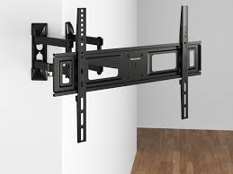
====

B: This is great! How much will this *set me
back* 花费（隐含“贵但值得”）?

C: Lucky for you, this is the last one we have
*in stock* 有库存 so it’s *half off* 半价（=50% discount）!

B: I’ll take it!

[.my2]
太棒了！得花多少钱？

'''

== ■(135) Elementary ‐Daily Life ‐Cheer Up (C0135)  +
A: Ok... I’ll talk to you later. Bye  +
B: Carrie, are you ok? You seem a bit down.  +
A: I just got off the phone with my boyfriend. He is always getting upset and losing his temper over nothing. It’s so hard to talk to him at times.  +
B: Maybe it’s just that he is stressed out from work or something. He does have a pretty nerve wracking job you know.  +
A: Yeah but, he is always in a really foul mood. I try to find out what’s bothering him or get him to talk about his day but, he always shuts down and brushes me off.  +
B: Men are like that you know. They can feel nervous, anxious or on edge and the only way they can express it is by trying to hide it through aggressiveness.  +
A: I guess you are right. What do you think I should do? He wasn’t always this grouchy you know...  +
B: Talk to him, try to cheer him up when he is down and if that doesn’t work, I say get rid of him and get a new one!  +
A: You are something else you know that?  +
 +
 +

'''

==== ◆(135) Elementary ‐ Daily Life ‐ Cheer Up  振作起来;使高兴起来(C0135)

A: Ok... I’ll talk to you later. Bye

B: Carrie, are you ok? You seem _a bit_ down 情绪低落(= depressed/sad).

[.my2]
好吧... 我晚点再和你说。再见

[.my1]
.案例
====

- "talk to you later"：非正式告别用语，比"goodbye"更随意
====

A: I just *got off the phone* 结束通话 with my
boyfriend. He is always *getting upset* 感到心烦意乱，使生气；打乱 and
*losing his temper* 发脾气 _over nothing_ 毫无理由地. It’s so hard
to talk to him _at times_ 有时候(= sometimes).

B: Maybe it’s just that he *is stressed (v.) out* 紧张的，焦虑的;承受巨大压力
from work or something. He does have a
pretty *nerve wracking* (使痛苦不堪；使受折磨)令人神经紧张的 job you know.

[.my2]
我刚和男朋友通完电话。他总是无缘无故生气发脾气。有时候真的很难和他沟通。 +
也许只是工作压也许只是工作压力太大之类的。你知道他的工作确实很让人紧张。力太大之类的。你知道他的工作确实很让人紧张。

A: Yeah but, he is always in a really _foul (脾气）暴躁的，（心情）烦躁的;令人不快的
mood_ 恶劣情绪. I try to find out what’s bothering him
or *get him to talk about his day* but, he
always *shuts down* 关闭沟通 and *brushes (v.)（用刷子）抹，涂 me off* 不理睬某人；打发;敷衍对待.

B: Men are like that you know. They can feel
nervous, anxious or *on edge* 紧张不安的;处于危险边缘 and `主` the only
way they can express 表达，表露 it `系` is by trying to hide it
through 以，凭借 aggressiveness 攻击性.

[.my2]
是啊，但他总是心情很差。我试着找出困扰他的事情或让他聊聊今天的事，但他总是封闭自己，敷衍我。 +
男人都这样啦。他们感到紧张焦虑时，唯一的表达方式就是通过攻击性来掩饰。

A: I guess you are right. What do you think I
should do? He wasn’t always this grouchy (a.)脾气不好并常发牢骚的；好抱怨的
you know...

B: Talk to him, try to *cheer him up* 使振作 when he
is down and if that doesn’t work, I say *get
rid of* 摆脱 him and get a new one!

A: You are _something else_ 与众不同的人,物 you know that?

[.my2]
我想你是对的。你觉得我该怎么办？你知道他以前没这么爱发牢骚的... +
和他谈谈，在他低落时让他振作起来。如果这不管用，我说就甩了他换个新的！ +
你真是个活宝，知道吗？

[.my1]
.案例
====
- "something else"：口语中表示"与众不同的人/物"，根据语境可褒可贬
====

'''

== ■(136) Elementary ‐Global View ‐Gambling (C0136)  +
A: Did you hear? The state is thinking of legalizing gambling in our city! Soon we are gonna have amazing hotels and casinos here which will be good for our business!  +
B: Are you serious? Gambling is a vice industry built on deception and fed by the intentional exploitation of human weakness for the sole purpose of monetary gain! It disgusts me.  +
A: What are you talking about? How does it exploit people?  +
B: Well, to begin with, Gambling is addictive, ruins marriages, destroys families and bankrupts communities. Once you are addicted it is very difficult to stop. People have lost their houses, cars and been left out on the street after becoming addicted. Secondly, it exploits because men become addicted to gambling most often because of the action and risk. Women gamble to escape, and senior citizens will start gambling for the social interaction. Underage gamblers often start gambling on sports with friends and then illegal bookies.  +
A: Geez! Now that I think about it, maybe legalizing gambling isn’t such a good idea! Although, I have been to Las Vegas, and I didn’t become addicted or anything like that.  +
B: You cannot predict who will become addicted to gambling. Now excuse me, I have a protest rally to organize!  +
 +
 +

'''

==== ◆(136) Elementary ‐ Global View ‐ Gambling 赌博；投机，冒险 (C0136)

A: Did you hear? The state is thinking of
legalizing (v.)使合法化 gambling in our city! Soon we are
gonna have amazing hotels and casinos 赌场；娱乐场 here
which will be good for our business!

[.my2]
听说了吗？州政府正考虑在我们城市将赌博合法化！很快我们就会有超棒的酒店和赌场，这对我们的生意有利！

B: Are you serious? Gambling is a vice （与性或毒品有关的）罪行
industry *built (v.) on* deception and fed (v.)喂养；以……为食 by the
intentional exploitation (n.)开发，开采；（出于私利、不公正的）利用 of human weakness
for the _sole 唯一的，仅有的 purpose_ of _monetary 货币的，金融的 gain_ 金钱收益! It
disgusts 使厌恶，使反感 me.

[.my2]
你是认真的吗？赌博是建立在欺骗上的罪恶产业，通过故意利用人性弱点来牟取暴利！这让我作呕。

A: What are you talking about? How does it
exploit  (v.)剥削，压榨；利用（……为自己谋利） people?

B: Well, *to begin with* 首先（列举论点常用短语）, Gambling is addictive 使人成瘾的,
ruins (v.) marriages, destroys (v.) families and
bankrupts (v.)使破产 communities. Once you are
addicted *it is very difficult* to stop. People
have lost their houses, cars and *been left out
on the street* 流落街头 after becoming addicted. +
Secondly, it exploits because men become
addicted to gambling *most often because of* 最常见的原因是
the action 惊险刺激的活动（或事件） and risk. Women gamble (v.) to
escape, and _senior (a.)老，年长的 citizens_ will start
gambling for the social interaction 社交互动. Underage  未成年的
gamblers often start gambling on sports 体育运动 with
friends *and then* illegal bookies （赛马等）赌注登记人.

[.my2]
首先，赌博具有成瘾性，会毁掉婚姻、破坏家庭、使社区破产。一旦上瘾就很难戒除。有人因此失去房子车子，上瘾后流落街头。 +
其次，它的剥削性体现在：男性常因刺激和风险上瘾，女性为逃避现实赌博，老年人为了社交开始赌博。未成年赌徒常从和朋友体育赌博开始，然后找非法庄家。

[.my1]
.案例
====
- "the action" 这里指赌博带来的刺激（特定语境义）
- "illegal bookies" 非法庄家（bookie=bookmaker的俚语）
====

A: Geez (=Jesus)! *Now that* 既然，由于 I think about it, maybe
legalizing gambling isn’t such a good idea!
Although 但是，然而, I have been to Las Vegas, and I
didn’t become addicted or anything like that.

[.my2]
天！这么一说，合法化赌博可能不是好主意！不过我去过拉斯维加斯也没上瘾啊。

B: You cannot predict who will become
addicted to gambling. Now excuse me 对不起,请原谅,打扰一下, I
*have* a _protest 抗议，反对；抗议活动 rally_ 集会，大会 *to organize*! (have...to do结构表"有...需要做")

[.my2]
你无法预测谁会赌博成瘾。失陪了，我要去组织抗议集会！

[.my1]
.案例
====
- protest rally 抗议集会
====

'''

== ■(137) Elementary ‐Daily Life ‐Getting Internet Service (C0137)  +
A: Welcome to Galanet. How can I help you?  +
B: Hi. I would like to get an internet plan for my house.  +
A: Of course. We have three different plans with different prices you can choose from. The first one is the cheapest but most basic plan which is thirty dollars a month. This is for broadband internet with a download speed of five hundred and twelve kbps.  +
B: I have no idea what kbps means. I just want to be able to get online, play games and chat with my friends. Oh, and watch movies online as well.  +
A: Well, this connection might be a bit too slow for your needs. I suggest you get the premium package for fifty dollars a month which includes a connection speed of two megabytes. That way you can play games online without any lag. This package also includes a wireless router and a personal firewall absolutely free!  +
B: Do I have to pay an installation fee?  +
A: Lucky for you, this month we aren’t charging our normal installation fee. You are saving yourself 100 bucks right there! And we’ll throw in this pen drive!  +
B: Awesome!  +
 +
 +

'''

==== ◆(137) Elementary ‐ Daily Life ‐ Getting Internet Service 获取互联网服务(C0137)

A: Welcome to Galanet 网站名. How can I help you?

B: Hi. I would like to get an _internet plan_ 网络套餐,上网方案 for
my house.

[.my2]
我想为我的房子办理一个网络套餐。

A: Of course. We have three different plans
with different prices you can choose from.
The first one is _the cheapest but most basic
plan_ which is thirty dollars a month. This is
for _broadband (a.)宽频带的；宽波段的 internet_ 宽带互联网 with a download
speed of five hundred and twelve kbps.

[.my2]
当然。我们有三种不同价格的套餐供您选择。第一种是最便宜,但也是最基础的套餐，每月 30 美元。它提供的是宽带上网，下载速度为 512 kbps。

B: I have no idea what kbps means. I just
want to be able *to get online* 上网(= go online), play games
and chat with my friends. Oh, and watch
movies online as well.

A: Well, this connection might be a bit too
slow for your needs. I suggest you get the
_premium 高价的，高品质的 package_ (包裹) 高级套餐 for fifty dollars a month
which includes a connection speed of two
megabytes 兆字节(百万字节). That way you can play games
online without any lag （两件事的）时间间隔;网络延迟. This package also
includes a _wireless router_ 无线路由器 and a personal
firewall *absolutely 绝对地，完全地 free*!

[.my2]
嗯，这种网速可能对你的需求来说有点太慢了。我建议你选择高级套餐，每月 50 美元，包含 2 兆字节的网速。这样你就可以在线玩游戏，没有延迟了。这个套餐还免费附赠一个无线路由器和个人防火墙！

B: Do I have to pay an installation fee?

[.my2]
我需要支付安装费吗？

A: Lucky for you, this month we aren’t
charging 要价；收费 our normal installation fee. You are
saving yourself 100 bucks （一）美元 right there! And
we’ll *throw in* 额外赠送 this _pen drive_  (U 盘)!

[.my1]
.案例
====
- bucks 是 dollars（美元）的口语说法.
- pen drive 指 U 盘，也叫 USB flash drive.
====

B: Awesome!

'''

== ■(138) Elementary ‐Daily Life ‐Renting A Car ( C0138)  +
Man: Hi, I made a reservation for a mid-size vehicle. The name is Jimmy Fox. Agent: I’m sorry, we have no mid-size available at the moment. Man: I don’t understand, I made a reservation, do you have my reservation? Agent: Yes, we do, unfortunately we ran out of cars. Man: But the reservation keeps the car here. That’s why you have the reservation. Agent: I know why we have reservations. Man: I don’t think you do. If you did, I’d have a car. See, you know how to take the reservation, you just don’t know how to hold the reservation and that’s really the most important part of the reservation, the holding. Anybody can just take them. Agent: But we do have a compact or an SUV if you’d like. Man: Fine. I’ll take the compact. Agent: Alright. We have a blue Ford Focus for you Mr. Fox. Would you like insurance? Man: Yeah, you better give me the insurance, because I am gonna beat the hell out of this car.  +
 +
 +

'''

==== ◆(138) Elementary ‐ Daily Life ‐ Renting A Car (C0138)

Man: Hi, I made a reservation for a mid-size
vehicle. The name is Jimmy Fox.
Agent: I’m sorry, we have no mid-size
available at the moment.
Man: I don’t understand, I made a
reservation, do you have my reservation?
Agent: Yes, we do, unfortunately we ran out
of cars.
Man: But the reservation keeps the car here.
That’s why you have the reservation.
Agent: I know why we have reservations.
Man: I don’t think you do. If you did, I’d
have a car. See, you know how to take the
reservation, you just don’t know how to hold
the reservation and that’s really the most
important part of the reservation, the
holding. Anybody can just take them.
Agent: But we do have a compact or an SUV
if you’d like.
Man: Fine. I’ll take the compact.
Agent: Alright. We have a blue Ford Focus
for you Mr. Fox. Would you like insurance?
Man: Yeah, you better give me the
insurance, because I am gonna beat the hell
out of this car.

'''

== ■(139) Elementary ‐The Weekend ‐Playing Che ss (C0139)  +
Daddy: Bobby! Come here, look what I got you! Bobby: What is that? Daddy: A chess board! Daddy is going to teach you how to play! Bobby: Cool! Daddy: Ok, each player gets 16 pieces. You can be the white ones and I’ll play with the black pieces. Now in the front, you set up the pawns. Those are the least valuable pieces and can only move one space forward. When you are about to capture another piece, it can move one space diagonally. Bobby: What about all these other pieces? Daddy: See this one that looks like a tower? It’s called the rook. The one with the tall hat is called the bishop. See this little horsey? This is called the knight, it’s a very important piece so it’s best to not let your opponent capture it. Bobby: And these two? They are husband and wife? Daddy: That’s right! That’s the queen and that’s the king. If the other player captures your king, he will say ”Check Mate” and the game is over! Doesn’t this sound fun? Bobby: Nah! This is boring! I’m gonna go play Killer Zombies on my PlayStation!  +
 +
 +

'''

==== ◆(139) Elementary ‐ The Weekend ‐ Playing Chess 国际象棋，西洋棋 (C0139)

Daddy: Bobby! Come here, look what I got
you! 过来看看我给你买了什么

[.my1]
.案例
====
- "look what I got you" 口语中完成时简化（= I have got/bought）
====

Bobby: What is that?

Daddy: A chess board 国际象棋棋盘! Daddy is going to
teach you how to play!

Bobby: Cool!

Daddy: Ok, each player gets 16 pieces 棋子;（从某物上拆下、撕下或切下的）块，片，段；部件. You
can be the white ones and I’ll play with the
black pieces. Now in the front, you set up 建立,设立 the
pawns （国际象棋的）兵，卒. Those are the least valuable pieces
and can only move one space forward. When
you are about to capture 俘获，捕获；夺取，占领;吃掉（国际象棋棋子） another piece, it
can move one space diagonally 对角地；斜对地.

[.my2]
好，每个玩家有16个棋子。你用白棋我用黑棋。前排摆士兵，这些棋子价值最低，只能前进一格。吃子时可以斜走一格。

[.my1]
.案例
====
- pawn -> 来自古法语peon,兵，卒，来自拉丁语pedonem,步兵，来自拉丁语pedis,脚，来自PIE*ped,脚，词源同foot,biped.最初用于国际象棋卒，后引申词义走卒。
====

Bobby: What about all these other pieces?

Daddy: See this one that looks like a tower?
It’s called the rook （国际象棋中的）车；白嘴鸦. The one with the tall hat
is called the bishop （基督教的）主教；（国际象棋中的）象. See this little horsey 马的，似马的?
This is called the knight 骑士，武士；（国际象棋中的）马；爵士, it’s a very important
piece so it’s best to not let your opponent
capture it.

[.my2]
看到这个塔楼形状的吗？这叫车。戴高帽的是象。这个小马驹？这叫骑士（马），很重要别让对手吃掉。

[.my1]
.案例
====
- rook +
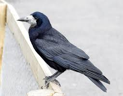

- bishop +

- knight +
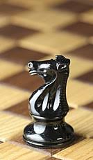
====

Bobby: And these two? They are husband
and wife?

Daddy: That’s right! That’s the queen and
that’s the king. If the other player captures
your king, he will say ”Check 检查，核对 Mate （国际象棋比赛中的）将死” and the
game is over! Doesn’t this sound fun? 是不是很有趣？

[.my1]
.案例
====
- "Check Mate" 将死（波斯语源：shāh māt = 国王死了）
====

Bobby: Nah （= No的随意说法）! This is boring! I’m gonna go
play _Killer Zombies_ 僵尸 on my PlayStation!

'''

== ■(140) Elementary ‐Daily Life ‐Buying a Compu ter (C0140)  +
Customer: So can you fix it? Sales Clerk: I’m sorry sir. This computer is not broken or damaged. It’s simply just too old! That’s why your programs and applications are running slow. There really isn’t much I can do. Customer: What do you mean? I bought this computer just three years ago! Sales Clerk: Yes, but technology is ever changing and technology is becoming obsolete faster and faster! Customer: Ok, I know where this is going. How much will it cost me to get a new computer? Sales Clerk: Well, this desktop over here is our latest model. It has a four gigahertz processor with sixteen gigabytes in RAM and a hard disk with one terabyte. Of course, it includes a mouse, keyboard and desk speakers. Customer: I have no idea what you are talking about. I just want to know if it’s good and if I will be able to play solitaire without the computer crashing or freezing all the time!  +
Sales Clerk: This PC is top of the line and I guarantee it will never freeze! If it does, we’ll give you your money back!  +
 +
 +

'''

==== ◆(140) Elementary ‐ Daily Life ‐ Buying a Computer (C0140)

Customer: So can you fix it?

Sales Clerk: I’m sorry sir. This computer is
not broken or damaged. It’s simply just too
old! That’s why your programs and
applications 应用程序（= apps） are running slow. There really
isn’t much I can do.

[.my1]
.案例
====
- "There isn’t much I can do" 固定表达（表示爱莫能助）
====

Customer: What do you mean? I bought
this computer just three years ago!

Sales Clerk: Yes, but technology is _ever
changing_ (a.)不断变化的 and technology is becoming
obsolete  (a.)淘汰的，废弃的 faster and faster!

Customer: Ok, *I know where this is going* 我知道你要说什么了.
How much will it cost me to get a new
computer?

[.my1]
.案例
====
- "I know where this is going" 固定表达（预知对方意图）
====

Sales Clerk: Well, this desktop 桌面；台式机 over here is
our latest model. It has a _four gigahertz 千兆赫(GB)
processor_ （计算机的）处理器（机） with _sixteen gigabytes in RAM_ and
a hard disk with one terabyte (=TB). Of course, it
includes a mouse, keyboard and desk
speakers (扬声器)桌面音箱.

Customer: *I have no idea what you are
talking about* 我完全不了解你在说什么. I just want to know if it’s good
and if I will be able to play solitaire 单人跳棋;单人纸牌游戏 without
the computer crashing 崩溃 or freezing 冻住,卡住 all the
time!

[.my1]
.案例
====
- solitaire +
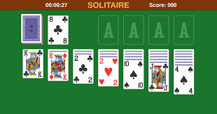
====

Sales Clerk: This PC is _top of the line_ 顶级的，最好的 and I
guarantee (v.)保证；担保 it will never freeze! If it does, we’ll
give you your money back 全额退款!

'''

