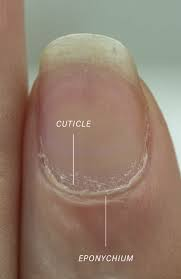
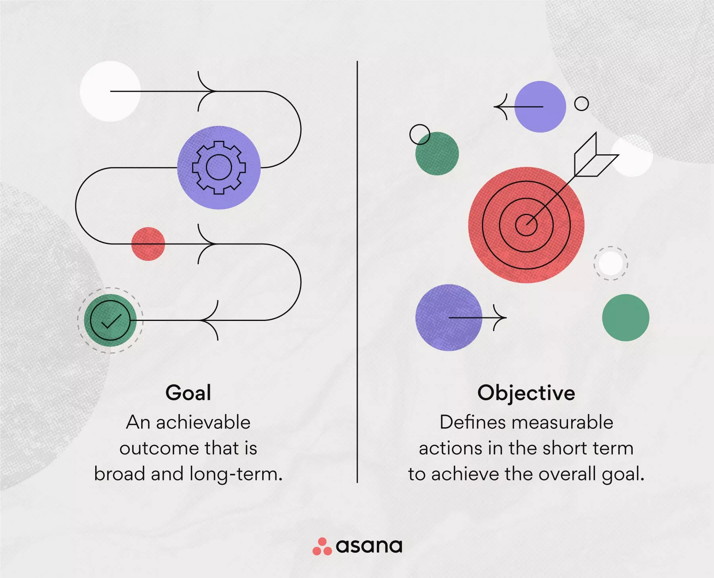
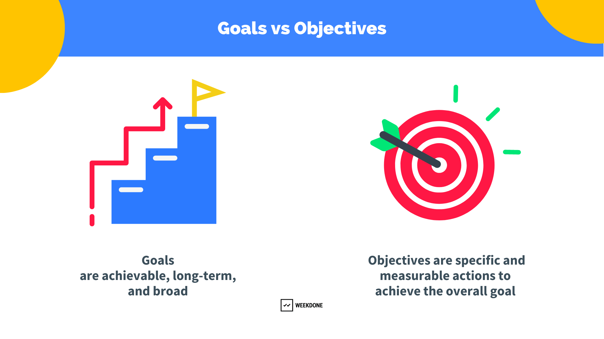
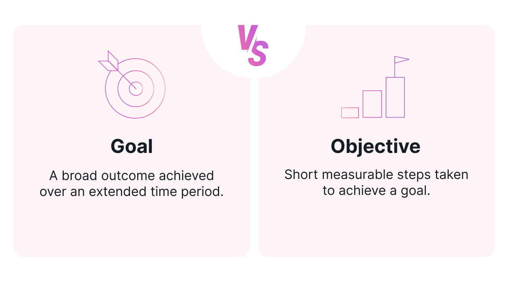

=  English pod 161-180
:toc: left
:toclevels: 3
:sectnums:
:stylesheet: ../../../myAdocCss.css

'''

== ■(161) Elementary ‐Daily Life ‐Computer Game s (C0161)  +
A: Mark, Where have you been? I’ve been calling you all morning.  +
B: I’ve been playing computer games.  +
A: What? So you blew me off yesterday and today over a stupid video game? What game is so important that you have no time for me anymore? What are you playing?  +
B: It’s called Counter Strike It’s a first person shooter game. It’s awesome. It’s a multi player game where you can go online and compete against players from all over the world.  +
A: You’ve been wasting your time on this? I can’t believe it! It doesn’t even look fun or challenging!  +
B: My laptop is on my bed. If you think it’s so easy then get onlineand try to beat me.  +
A: Fine!  +
B: Damm it! How are you killing me with a single shot? It’s not fair! I don’t want to play anymore! Let’s go get something to eat.  +
A: Can you bring me something? I am totally hooked on this game!  +
 +
 +

'''

==== ◆(161) Elementary ‐ Daily Life ‐ Computer Games (C0161)

A: Mark, Where have you been 你去哪儿了? I’ve been
calling 打电话 you all morning.

B: I’ve been playing computer games.

A: What? So you *blew me off* 放我鸽子,爽约 yesterday and
today over a stupid video game? What game
is *so* important *that* you have no time for me
anymore 没时间陪我了? What are you playing?

B: It’s called _Counter 相反地，对立地；逆向地 Strike_ (击，撞；（用手或武器等）打) 反恐精英 It’s a first person
shooter game 第一人称射击游戏. It’s awesome. It’s a multi
player game where you can go online and
compete against 与……竞争 players from all over the
world.

A: You’ve been wasting your time on this? I
can’t believe it! It doesn’t even look fun or
challenging!

B: My laptop 膝上型计算机，便携式电脑  is on my bed. If you think it’s
so easy then get online and try to beat （在比赛或竞争中）赢，打败（某人） me.

A: Fine!

B: Damm it 该死! How are you killing me with a
single shot? It’s not fair! I don’t want to play
anymore! Let’s go get something to eat.

[.my2]
我们去吃点东西吧

A: Can you bring me something? I am totally
hooked （使）钩住，挂住 on this game!

[.my1]
.案例
====
- totally hooked on（完全沉迷于）
====

'''

== ■(162) Elementary ‐Global View ‐Veteran’s Day (C0162)  +
A: Do you have any plans for Veteran’s Day  +
B: You mean Armistice Day  +
A: Well, as you know, on November 11th allies signed a peace treaty with the Germans, also known as the Armistice Treaty This marked the end of WWI and many countries around the world commemorate this date under names such as day. In Poland it’s their independence day! There’s a lot going on around the world on this day.  +
B: Wow, I didn’t know! Probably because I flunked history in school.  +
 +
 +

'''

==== ◆(162) Elementary ‐ Global View ‐ Veteran’s  老兵，退伍军人 Day(C0162)

A: Do you have any plans for Veteran’s Day

B: You mean Armistice (n.)停战，休战；休战协议 Day

[.my1]
.案例
====
- Armistice Day​ 是许多国家在11月11日纪念第一次世界大战结束的节日，特别是在欧洲国家。
====

A: Well, as you know, on November 11th
allies signed a peace treaty with the
Germans, also known as _the Armistice Treaty_ （国家之间的）条约，协定
This marked the end of WWI and many
countries around the world commemorate (v.)（用…）纪念；作为…的纪念
this date under names such as day. In Poland
it’s their independence day! *There’s a lot
going on* 有很多活动;发生了很多事情 around the world on this day.

[.my2]
这一天世界各地有很多活动。

B: Wow, I didn’t know! Probably because I
flunked (v.)（考试、测验等）失败，不及格 history in school.

'''

== ■(163) Elementary ‐Global View ‐Social Securit y (C0163)  +
A: Well that was an interesting documentary!  +
B: For sure! I didn’t really understand some of the technical jargon they used in the film when they talked about social security in the US.  +
A: Like what?  +
B: Well, they mentioned how people put away money in something called a 401K?  +
A: Yeah, I know it sounds weird, but a 401k is a type of retirement plan that allows employees to save and invest for their own retirement Through a you can authorize your employer to deduct a certain amount of money from your paycheck and invest it in the plan Everyone tries to contribute as much as possible so that when you retire, you can rest peacefully on your nest egg.  +
B: That’s interesting and logical I guess. In my country, we also have to contribute to a government run retirement fund, but most people don’t really trust it so they just invest in properties or things like that.  +
A: That seems a bit unstable don’t you think?  +
B: Yeah, but corrupt governments inthe past have created distrust among banks and financial institutions, so now people prefer to have money hidden in a jar or a piggy bank.  +
A: I’ve been thinking of doing that lately! I don’t want some banker to run off with my money!  +
 +
 +

'''

==== ◆(163) Elementary ‐ Global View ‐ Social Security 社会保险，社会保障 (C0163)

A: Well that was an interesting documentary 纪实节目，纪录片!

B: For sure! I didn’t really understand some
of the technical jargon 行话，黑话 they used in the film
when they talked about social security in the
US.

[.my2]
当然！我不太理解他们在电影中谈论美国的 social security（社会保障）时使用的一些 technical jargon（技术术语）。

A: Like what?

B: Well, they mentioned how people *put
away money* 把钱存起来 in something called a 401K?

[.my2]
他们提到人们把钱存进一个叫 401K 的东西里？

A: Yeah, I know it sounds weird 奇怪的，不寻常的, but a 401k is a type of retirement plan that allows employees to save and invest for their own retirement 退休. Through a 401k, you can authorize (v.)批准，许可；授权 your employer to deduct 减去，扣除 a certain amount of money from your paycheck 付薪水的支票，薪水 and invest it in the plan. Everyone tries to contribute *as much as possible* so that when you retire, you can rest 休息，歇息 peacefully on your _nest  窝，巢 egg_ 储备金 .

[.my2]
是的，我知道这听起来很奇怪，但 401k 是一种 retirement plan（退休计划），允许员工为自己的退休储蓄和投资。通过 401k，你可以授权你的 employer（雇主）从你的 paycheck（工资）中 deduct（扣除）一定金额，并将其 invest（投资）到计划中。每个人都尽量 contribute（贡献）尽可能多的钱，这样当你退休时，你可以安享你的 nest egg（积蓄）。

B: That’s interesting and logical I guess. In my country, we also have to contribute to a government-run retirement fund 基金，专款, but most people don’t really trust it so they just invest in properties 房屋及周围的土地 or things like that.

[.my2]
这很有趣也很 logical（合理），我猜。在我的国家，我们也必须 contribute（贡献）到一个 government-run retirement fund（政府运营的退休基金），但大多数人并不真正信任它，所以他们只是 invest（投资）在 properties（房产）或类似的东西上。

A: That seems a bit unstable 不稳定的；动荡的；易变的 don’t you
think?

B: Yeah, but corrupt governments in the past
have created distrust 不信任，怀疑 among banks and
_financial institutions_ 金融机构, so now people prefer to
have money hidden in a jar 玻璃罐，广口瓶 or a _piggy bank_ 储蓄罐.

A: I’ve been thinking of doing that lately 近来，最近! I
don’t want some banker to run off 逃跑；逃离 with my
money!

'''

== ■(164) Elementary ‐Daily Life ‐Apology Letter ( C0164)  +
A: Dear Mary, I come here today, in this way, because I need to apologize to you. I failed you. Although I did not lie to you in words, I lied to you with faces that did not belong to me. I never meant to ruin the friendship that meant the world to me. You mean the world to me and now I come to you asking for forgiveness. If in your heart you find you can’t, then I will understand and learn from this experience.  +
A:  +
You came into my life at a time when I needed you the most. We talked about so many things that I started to realize my heart and my soul could actually feel something other than hurt. You placed comfort where there was fear, confidence where there was doubt, a shoulder where tears could fall and completeness where there was emptiness. I wanted to hold onto to this so badly that I did whatever it took for you to notice. What I didn’t realize was that I could lose my entire being, all of who I was and all that I had placed in you.  +
 +
A:  +
I wanted to be the one who would be there when you needed to talk. I wanted to be the comfort for your soul when the world was too much to handle. I wanted to be strong for you when everything else seemed impossible. I wanted to love you in only the way you deserved to be loved, never realizing that I was destroying myself and you. Somehow I needed you to be a part of my life. The only problem was that I was willing to jeopardize everything to get that done.  +
 +
A:  +
All the things that I told you about how I felt and how you make me feel were true. Nothing else mattered to me except hearing the laughter in your voice when you were happy. You made my days easy to get through and my nights peaceful; you helped me look forward to another day. Even though distance separated us, just being was enough.  +
 +
A:  +
I’m sorry for hurting you and if I had to do all over again I would have been 100% with you. Forgive me please,  +
 +
 +
 +
 +

'''

==== ◆(164) Elementary ‐ Daily Life ‐ Apology (n.)道歉 Letter (C0164)

A: Dear Mary, I come here today, in this way 以这种方式,
because I need to apologize to you. I failed 辜负，使失望
you. Although I did not lie 撒谎，编造谎言 to you in words, I
lied to you with faces that did not belong to
me. I never meant 意味；打算 to ruin the friendship 后定 that
meant the world to me 对我来说就是整个世界;对我意义重大. You mean the world
to me and now I come to you asking for
forgiveness. If in your heart you find you
can’t, then I will understand and learn from
this experience.

[.my2]
亲爱的 Mary，我今天以这种方式来到这里，是因为我需要向你道歉。我让你失望了。虽然我没有用言语欺骗你，但我用不属于我的面孔欺骗了你。我从未想过要毁掉这段对我意义重大的友谊。你对我意义重大，现在我请求你的原谅。如果你心里觉得无法原谅我，那么我会理解并从这次经历中学习。

A: You came into my life at a time when I
needed you the most. We talked about *so*
many things *that* I started to realize my
heart and my soul could actually
feel something other than hurt. You placed
comfort 安慰，慰藉 where there was fear, confidence
where there was doubt, a shoulder where
tears could fall and completeness 完整；完全 where
there was emptiness  空虚；空，无. I wanted *to hold 抓住 onto
to this so badly* 如此迫切地想抓住这一切 that I did whatever 后定 it took
for you to notice 做了任何能让你注意到的事情. What I didn’t realize was
that I could lose my _entire being_ 整个自我, all of _who I
was_ /and all that I had placed in you.

[.my2]
你在我最需要你的时候进入了我的生活。我们谈论了那么多事情，我开始意识到我的 heart（心）和 soul（灵魂）真的可以感受到除了 hurt（伤害）之外的东西。你在有 fear（恐惧）的地方放置了 comfort（安慰），在有 doubt（怀疑）的地方放置了 confidence（信心），在有 tears（泪水）的地方放置了 shoulder（肩膀），在有 emptiness（空虚）的地方放置了 completeness（完整）。 +
我如此迫切地想抓住这一切，以至于我做了任何能让你注意到的事情。我没有意识到的是，我可能会失去我的 entire being（整个自我），我所有的存在和我所有放在你身上的东西。

A: I wanted to be the one who would be
there when you needed to talk. I wanted to
be _the comfort for your soul_ 安慰你灵魂的人 when the world
was too much to handle  拿；处理，应付. I wanted to be
strong for you when everything else seemed
impossible. I wanted to love you *in only the
way* you deserved to be loved 以你应得的方式爱你, never
realizing that I was destroying myself and
you. Somehow 不知怎么地 I needed you to be a part of
my life. The only problem was that I was
willing to jeopardize (v.)危及，损害 everything to get that
done.

[.my2]
我想成为那个在你需要倾诉时会在你身边的人。我想成为那个在世界难以承受时安慰你灵魂的人。我想成为那个在一切似乎不可能时为你坚强的人。我想以你应得的方式爱你，从未意识到我正在毁灭自己和你。不知何故，我需要你成为我生活的一部分。唯一的问题是，我愿意 jeopardize（牺牲）一切来实现这一点。

A: All the things _that I told you about how I
felt and how you make me feel_ were true.
Nothing else mattered 有重要性，有关系 to me *except* hearing
the laughter in your voice when you were
happy. You made my days easy to get
through 让我的日子变得容易度过 and my nights peaceful; you helped
me *look forward to* 期待 another day. Even though
distance separated us, just being 存在 was
enough.

[.my2]
我告诉你的关于我的感受以及你让我感受到的一切都是真的。除了听到你快乐时声音中的笑声之外，其他一切对我来说都不重要。你让我的日子变得容易度过，让我的夜晚变得平静；你帮助我期待新的一天。即使距离将我们分开，只是存在就足够了。

A: I’m sorry for hurting you and if I had to
do all *over again* 重新，再一次 I would have been 100%
with you. Forgive me please.

我很抱歉伤害了你，如果我能重来一次，我会 100% 与你在一起。请原谅我。

'''

== ■(165) Elementary ‐Daily Life ‐Asking For A Lo an (C0165)  +
B: Hello Sir may I help you?  +
A: Yes. I would like some information for requesting a loan.  +
B: Very well, here are the general terms of our loan policies. We pride ourselves in having the lowest interest rate in the country for personal loans.  +
A: I see. So let me get this straight. If I borrow let’s say, ten thousand dollars, how much will I have to pay each month?  +
B: It depends on how long you take to pay it back. If we lend you ten thousand dollars at an annual interest rate of ten percent for forty eight months, you would have to pay each month a portion of the loan which is called the principal and another small portion of the annual interest rate. This of course is considering that you don’t default on a payment!  +
A: It sounds good but, there is just one problem. I have a terrible credit score.  +
B: That is a very serious problem you see, the bank must assess your personal information, past loans, assets and any other relevant information such as your credit score in order to approve your loan.  +
A: You know what? I don’t really need the money. Thanks anyways!  +
 +
 +

'''

==== ◆(165) Elementary ‐ Daily Life ‐ Asking For A Loan 贷款；借款 (C0165)

B: Hello Sir may I help you?

A: Yes. I would like some information for
requesting 请求，要求；索取 a loan.

B: Very well, here are the general terms of
our loan policies. We pride 以……自豪 ourselves in
having the lowest interest rate in the country
for personal loans.

[.my2]
很好，这是我们 loan policies（贷款政策）的 general terms（一般条款）。我们以拥有全国最低的 personal loans（个人贷款） interest rate（利率）而自豪。

A: I see. So let me get this straight (a.)（消息）正确的，可靠的;让我弄清楚. If I
borrow let’s say, ten thousand dollars, how
much will I have to pay each month?

B: It depends on how long you take to pay it
back. If we lend you ten thousand dollars at
an annual interest rate of ten percent for
forty eight months, you would have to pay
each month _a portion of the loan_ which is
called the principal 本金；资本 and another small portion
of the annual interest rate. This *of course* is
considering  考虑到，鉴于 that you don’t default (v.)违约，不履行义务 on a
payment 付款，支付!

[.my2]
这取决于你多长时间还清。如果我们以 annual interest rate（年利率）百分之十借给你一万美元，期限为 forty-eight months（四十八个月），你每个月需要支付 loan（贷款）的一部分，称为 principal（本金），以及 annual interest rate（年利率）的一小部分。当然，这是在你不 default（违约）的情况下！

A: It sounds good but, there is just one
problem. I have a terrible _credit score_ 信用评分.

B: That is a very serious problem you see,
the bank must assess (v.)评价，评定 your personal
information, past loans, assets 资产，财产 and any other
relevant information 相关信息 such as your credit
score in order to approve 批准，通过 your loan.

A: You know what? I don’t really need the
money. Thanks anyways!

[.my2]
我其实不需要这笔钱。还是谢谢你！

'''

== ■(166) Elementary ‐Daily Life ‐Dr. Botox (C0166)  +
A: What are you doing?  +
B: Look at me. I look so old! I look as if I were thirty.  +
A: Come on! Stop being so vain. You look great! You are beautiful!  +
B: Yes, I am, but I think it’s time for some plastic surgery I’m tired of these wrinkles and sagging skin. See?  +
A: I don’t see any wrinkles or sagging skin! You are stop beings ridiculous. Besides, I think that people who get Botox, have facelifts, or tummy tucks look weird. It doesn’t look natural.  +
B: Whatever, I think I’m gonna get liposuction and a nose job and some breast implants as well.  +
A: I think you need to get brain surgery. I honestly don’t think you need cosmetic surgery. You look amazing.  +
 +
B: I thought you were my friend and would support me on this! I just want to feel better about myself and feel more attractive.  +
A: You don’t need plastic surgery to do that. You are fine the way you are and you have guys drooling all over you! Plus, plastic surgery hurts!  +
B: Really?  +
A: Yeah! When I got my nose job I was black and blue for a week!  +
 +
 +
Elementary ‐Daily Life ‐Learning How T  +
 +

'''

==== ◆(166) Elementary ‐ Daily Life ‐ Dr. Botox 肉毒杆菌素 (C0166)

A: What are you doing?

B: Look at me. I look so old! I look as if I
were thirty.

A: Come on! Stop being so vain 虚荣的，自负的；徒劳的. You look
great! You are beautiful!

B: Yes, I am, but I think it’s time for some
_plastic (a.)塑料制的；人造的，不自然的；可塑的 surgery_ 外科手术 I’m tired of these wrinkles 皱纹；皱褶
and sagging 下沉；松垂 skin. See?

[.my1]
.案例
====
- plastic surgery 整容手术
====

A: I don’t see any wrinkles or sagging skin!
You are stop beings ridiculous 可笑的，荒谬的. Besides, I
think that people who get Botox, have
facelifts (n.)去皱整容手术；面部拉皮手术, or _tummy 肚子，胃 tucks_ （把衣服、纸张等的边缘）塞进，折叠，卷起 look weird 奇怪的，不寻常的；怪异的. It
doesn’t look natural.

[.my1]
.案例
====
- tummy tucks 腹部整形手术
====

B: Whatever, I think I’m gonna get
liposuction 脂肪吸除手术；抽脂术 and a _nose job_ 鼻子整形手术 and some _breast
implants_ 将（人造器官等）置入；（通常指通过手术）将…植入 as well.

[.my1]
.案例
====
- liposuction -> lipo-,脂肪，suction,吸，吸吮。
- breast implants 乳房植入物; 隆胸手术
====

A: I think you need to get brain surgery. I
honestly don’t think you need cosmetic 化妆用的，美容的；整容的;不重要的，没意义的
surgery. You look amazing.

B: I thought you were my friend and would
support me on this! I just want to feel better
about myself and feel more attractive.

A: You don’t need plastic surgery to do that.
*You are fine the way you are* 你现在这样就很好 and you have
guys drooling 流口水 all over you! Plus, plastic
surgery hurts (v.)（使）疼痛，受伤!

[.my2]
你不需要 plastic surgery（整容手术）来做到这一点。你现在这样就很好，而且有 guys（男人）为你 drooling（流口水）！而且，plastic surgery（整容手术）很痛！

B: Really?

A: Yeah! When I got my _nose job_ I was black
and blue for a week!

[.my2]
是啊！当我做 nose job（鼻子整形手术）时，我 black and blue（青一块紫一块）了一个星期！

'''

== ■(167) o Drive (C0167)  +
A: Ok! I’m ready for my driving lesson! Should I start the car?  +
B: Hold on there Fittipaldi, first let’s go over things one more time. Now before you even think of starting the car, make sure your seat is at a comfortable position and you can grip the steering wheel firmly. Next check your rear view mirrors to make sure you can see properly.  +
A: We have been through this a million times! Let’s get going already! I’m ready!  +
B: Fine start the car. now gently step on the clutch and shift to 1st gear. Good, now accelerate gently and let go of the clutch as u do it. There we gogood!  +
A: I’m doing it! I’m driving! This is awesome! Le’ts turn some music on!  +
B: Keep your eyes on the road! No music! We are coming up to a red light, step on the brakes. What are you doing? I said the brakes! Look out for those people! Get off the sidewalk!  +
A: Get out of my way! This is just like playing video games!  +
B: It’s the police! Pull over!  +
A: They’ll never take me alive!  +
 +
 +

'''

==== ◆(167) Elementary ‐ Daily Life ‐ Learning How To Drive (C0167)

A: Ok! I’m ready for my driving lesson 驾驶课!
Should I start the car?

B: Hold on there Fittipaldi, first let’s *go over* 仔细检查
things one more time. Now before you even
think of 考虑到；想到 starting the car, make sure your seat
is at a comfortable position and you can grip (v.)握紧，夹住；（尤指通过摩擦力）牢牢地附着，紧贴
the _steering 驾驶（交通工具） wheel_ 方向盘 firmly. Next check your
_rear view mirrors_ 后视镜 to make sure you can see
properly 正确地，适当地；得体地，恰当地.

[.my2]
等一下，Fittipaldi，首先让我们再复习一遍。在你考虑启动汽车之前，确保你的 seat（座椅）处于 comfortable position（舒适的位置），并且你可以 firmly（牢牢地） grip（握住） steering wheel（方向盘）。接下来，检查你的 rear view mirrors（后视镜），确保你能 properly（正确地）看到。

A: We have been through 彻底地（查看或检查）；经历，度过 this a million
times! Let’s get going already! I’m ready!

[.my2]
我们已经复习过一百万次了！让我们开始吧！我准备好了！

B: Fine, start (v.) the car. now gently step on the
clutch 离合器踏板 and shift to 1st gear 排挡，齿轮. Good, now
accelerate 加速 gently and *let go of* 松开，放开 the clutch as
you  do it. *There we go* 好了，就这样，就这么办, good!

[.my2]
好吧，启动汽车。现在轻轻踩下 clutch（离合器）并换到 1st gear（一档）。很好，现在轻轻 accelerate（加速）并同时松开 clutch（离合器）。好了，很好！

A: I’m doing it! I’m driving! This is awesome!
Let’s turn  some music on!

B: Keep your eyes on the road! No music!
We are *coming up to* 接近，靠近 a red light, step on the
brakes. What are you doing? I said the
brakes! *Look out 留意、注意、提防 for*  those people! *Get off* 离开
the sidewalk 人行道!

A: Get out of my way 让开，别挡道! This is just like
playing video games!

B: It’s the police! *Pull over* 靠边停车!

A: They’ll never take me alive!

[.my2]
他们休想活捉我！

'''

== ■(168) 无

无 +
'''

==== ◆(168) Elementary  (C0168)

'''

== ■(169) Elementary ‐The Weekend ‐Roller Coast er (C0169)  +
A: I’m so excited! We are finally here! Six Flags Magic Mountain! This is the best amusement park in the world!  +
B: Alright settle down now, you’re gonna give yourself a heart attack.  +
C: I can’t believe they charged us dollars each. It seems like a rip off don’t you think? It’s not like I’m gonna get on these rides.  +
A: Whoa... Viper! That’s the world’s highest and fastest roller coaster! You go at more than miles per hour! I wanna go on that one! Can I mom please? Can I ?  +
B: Chris I’m not sure you should get on that it seems a bit too much for you and we just had breakfast minutes ago. I don’t think it’s a good idea.  +
A: Aww come on mom! I can handle it. I promise I won’t ask for anything else! Besides, it’s not like I’m gonna throw upor anything...  +
C: Let him go Carol, he’ll be fine.  +
A: Alright! Yeah! This is amazing! See how high up we’re going? Whoa... mmmf mmfff barf.  +
 +
 +

'''

==== ◆(169) Elementary ‐ The Weekend ‐ _Roller 滚筒；滚轴 Coaster_ (航行于沿海港口间的轮船;玻璃杯垫) 过山车(C0169)

[.my1]
.案例
====
- coaster -> 来自coast,海岸。
====

A: I’m so excited! We are finally here! Six
Flags Magic Mountain 六旗魔术山! This is the best
amusement 开心，娱乐；娱乐活动，娱乐设施 park in the world!

[.my1]
.案例
====
- Six Flags Magic Mountain +

====

B: Alright *settle down* 冷静下来，平复情绪 now, you’re gonna 将要
give yourself a heart attack 让自己心脏病发作.

[.my1]
.案例
====
- give yourself a heart attack (让自己心脏病发作)：夸张的说法，意思是“太过激动了”。
====

C: I can’t believe they charged (v.)收费，索价 us dollars
each. It seems like a _rip off_ 敲诈，高价欺诈 don’t you think?
*It’s not like* 又不是 I’m gonna get on these rides  摩天轮；座骑.

[.my2]
真不敢相信他们要收我们每人这么多美元。这简直是敲竹杠，你不觉得吗？更何况我也不会去坐这些游乐设施。

[.my1]
.案例
====
- It’s not like… (又不是……)：用于强调某事不会发生或不符合逻辑。
- rides (n.) (游乐设施)：指过山车、大摆锤、摩天轮等游乐设施。
====

A: Whoa. . . Viper 毒蛇! That’s the world’s highest
and fastest _roller coaster_! You go at more
than _miles per hour_! I wanna go on that one!
Can I mom please? Can I ?

[.my2]
时速超过 (X) 英里！我想去玩那个！

B: Chris I’m not sure you should *get on* 乘坐,登上 that.
It seems a bit too much for you 对你来说太过了, and we just
had breakfast minutes ago. I don’t think it’s
a good idea.

A: Aww come on mom! I can handle it. I
promise I won’t ask for anything else!
Besides 而且，再说, it’s not like I’m gonna *throw up* 呕吐 or
anything. . .

[.my2]
我能行的。我保证不会再要求别的东西了！再说，又不是说我会吐之类的

[.my1]
.案例
====
- it’s not like I’m gonna… (又不是说我会……)：再次强调某件事不会发生，以证明自己的请求合理。
====

C: Let him go Carol, he’ll be fine.

A: Alright! Yeah! This is amazing! See how
high up 在高处；离地面高的 we’re going? Whoa. . . mmmf mmfff
barf (v.)呕吐.

[.my2]
这也太刺激了！看，我们升得多高啊？哇……呃呃呃……吐了。

[.my1]
.案例
====
- mmmf mmfff (呃呃呃……)：表示嘴里被东西堵住或不舒服的声音。
- barf (v.) (呕吐)：口语化的“吐”，比“throw up”更随意。
====

'''

== ■(170) Elementary ‐Daily Life ‐Wedding Doubt s (C0170)  +
A: Man, I’m freaking out! You gotta help me!  +
B: Whoa whoa take it easy, relax. Geez, you’re sweating like a pig! What’s going on?  +
A: I can’t go through with this! I just can’t! I’m not ready for marriage! What was I thinking? I’m only thirty five years old! I’ve got my entire life ahead of me, adventures waiting! I can’t settle down yet!  +
B: What are you talking about? It wasn’t more than a month ago that you were rambling on about how you are tired of living the life of a bachelor and how you envy your friends that have a family!  +
A: I know I know!  +
B:  +
Let’s think this through. First of all, you cannot leave Amy at the altar. Not only will she be humiliated and kill you, but she is the woman that you love andthe woman of your dreams! Why would you want to end that or jeopardize it like this? Second of all, you are just getting cold feet. You know deep down inside that you want to marry her, so cut the crap and do it!  +
 +
B:  +
You’re right. I’m being crazy! Ok, I’m  +
 +
 +
ready, lets do this!  +
A: Great! Phew! That was a close one ! You had me going there for a minute I thought I was gonna have to slap some sense into you  +
 +
 +

'''

==== ◆(170) Elementary ‐ Daily Life ‐ Wedding Doubts (C0170)

A: Man, I’m *freaking （非正式）表现得异常激动；（使）表现狂妄 out* 崩溃，惊慌失措! You gotta help me!

[.my1]
.案例
====
- You gotta (got to) help me! (你一定得帮帮我！)：口语化的 got to，表示“必须”。
====

B: Whoa whoa, take it easy 冷静点，别紧张, relax. Geez 天哪,
you’re *sweating 出汗 like a pig* 大汗淋漓! What’s going on?

[.my2]
哇哇，冷静点，放松。天哪，你都快汗流浃背了！发生什么事了？

A: I can’t *go through 完成，履行某事 with* this! I just can’t!
I’m not ready for marriage (n.)结婚，婚姻! What was I
thinking? I’m only thirty five years old! I’ve
got my entire life ahead of me, adventures
waiting! I can’t *settle down* 安定下来，成家立业 yet!

[.my2]
我不能这样做！我真的不行！我还没准备好结婚！我当时到底在想什么？我才 35 岁啊！我还有大好的青春，等待我的冒险！我现在还不能安定下来！

B: What are you talking about? It wasn’t
more than a month ago that you *were
rambling (v.)漫谈；闲聊；瞎扯 on about* how you are tired of living
the life of a bachelor and how you envy (v.)羡慕，忌妒；向往，渴望（别人的东西） your
friends that have a family!

[.my2]
你在说什么呢？才一个月前，你还不停地唠叨，说你厌倦了单身生活，羡慕那些已经成家的朋友呢！

[.my1]
.案例
====
- ramble on (about something) (唠叨个不停)：指对某事喋喋不休，口语化。
====

A: I know, I know!

B: Let’s *think* this *through* (ad.)(从一端到另一端；完全地，彻底地，十足地). First of all, you
cannot *leave* Amy *at the altar* 祭坛，圣坛，圣餐台；（教堂里牧师站立的）讲坛. #Not only# will
she be humiliated （使）蒙羞，丢脸 and kill you, #but# she is the
woman that you love and the woman of your
dreams! Why would you want to end that or
jeopardize (v.)危及，损害 it like this? Second of all, you are
just *getting cold feet* 临阵退缩. You know *deep down
inside* 内心深处 that you want to marry her, so *cut the
crap* (n.胡扯，废话) 别废话，别找借口 and do it!

[.my2]
让我们好好想想。首先，你不能在婚礼上抛下艾米。这样不仅会让她当众出丑，甚至想杀了你，而且她还是你深爱的女人，你梦寐以求的伴侣！你为什么要结束这一切，甚至冒险毁掉它呢？其次，你只是婚前焦虑罢了。你内心深处清楚地知道自己想娶她，所以别再胡扯了，快点去结婚吧！

[.my1]
.案例
====
- think (something) through (仔细思考，全面考虑)
- leave (someone) at the altar (在婚礼上抛弃某人)：特指婚礼当天突然逃婚。
====

B: You’re right. I’m being crazy 愚蠢的，不理智的；极度烦恼的，疯狂的! Ok, I’m
ready, lets do this!

A: Great! Phew! *That was a close one* 刚才太惊险了;真是好险啊 ! *You
had me going there for a minute* 我还真的被你骗到了一下,你刚才真的吓到我了. I thought I
was gonna have to slap  (v.)（用手掌）打，拍 some sense 理智，理性 into you.

[.my2]
太好了！呼！刚才真是千钧一发！你刚才真的吓到我了。我还以为我得甩你一巴掌让你清醒点呢！

[.my1]
.案例
====
- Phew! (呼！)：表达松了一口气的感觉。
- slap (v.) some sense into (someone) (扇对方耳光让他清醒)：夸张说法，指用强硬手段让某人理智起来。
====

'''

== ■(171) Elementary ‐The Weekend ‐Buying a Ca mera (C0171)  +
A: Hello, ma’am, can I help you find something?  +
B: Yes, actually I’m looking to buy a camera.  +
A: We’ve got a wide selection do you know if you’d like a point-and-shoot, or something a little fancier? Are you shopping for yourself or for someone else?  +
B: Actually I’m buying a camera for my husband.  +
A: Ah, well then I’d recommend a nice entry-level digital SLR.  +
B: Yeah? Can I take a look at the SLRs you carry?  +
A: Sure thing, follow me. This here is the.  +
B: The Canon Eos. Yeah it’s ok, but I’m looking for something that performs better in low light, has a better display panel, and longer battery life.  +
A: Oh, ah, um the Nikon D60 is a nice option.  +
B: Yeah, but what kit lens does this camera come with? I don’t want some bulky telephoto lens.  +
A: Oh, well this one has the, uh.  +
B: Looks to me like an 18-55mm lens. pretty standard, that will do. Not like my husband will be stalking celebrities or anything!  +
A: So, ahem, can I interest you in any acc...  +
B: Accessories? Do you carry polarizing filters?  +
A: Polarizing filter um we should! I’m sorry, ma’am. looks like we’re sold out.  +
B: No you’re not! There are some right here!  +
A: Oh, well, would you look at that! Po-la-ri-zing filters.  +
B: Thanks for your help, Ralph!  +
A: No problem, ma’am.  +
 +
 +

'''

==== ◆(171) Elementary ‐ The Weekend ‐ Buying a Camera (C0171)

A: Hello, ma’am 女士,夫人, can I help you find
something?

B: Yes, actually I’m looking to buy a camera.

[.my1]
.案例
====
- looking to buy（考虑购买）
====

A: We’ve got a _wide selection_ 广泛选择. Do you know if
you’d like 虚拟语气(表示假设或询问对方的偏好) a point-and-shoot 傻瓜式的, or something a
little fancier (比较级)异常复杂的；太花哨的;优质的；高档的? Are you shopping for yourself
or for someone else?

[.my2]
我们有 wide selection（很多选择）。您知道自己想要 point-and-shoot（傻瓜相机），还是更 fancy（高级）一些的相机吗？您是给自己买，还是给别人买？

B: Actually I’m buying a camera for my
husband.

A: Ah, well then I’d recommend a nice _entry (n.)进入（指行动） level_ 入门级的
digital SLR 单镜头反射（single lens reflex 反射（作用））.

[.my1]
.案例
====
-​I’d recommend​ 是虚拟语气，表示建议。
====

B: Yeah? Can I take a look at 看看 the SLRs you
carry?

A: Sure thing, follow me. This here is the ...

B: The Canon Eos. Yeah it’s ok, but I’m
looking for something that performs better in
low light, has a better _display （计算机屏幕上的）显示，显示器 panel_ 控制板，仪表盘, and
longer battery life.

A: Oh, ah, um the Nikon D60 is a nice
option.

B: Yeah, but what _kit lens_ 套机镜头 does this camera
come with? I don’t want some bulky (a.)笨重的，庞大的；大块头的
_telephoto (a.)用远距镜头照相的；摄远的 lens_ 透镜，镜片；（相机的）镜头.

[.my2]
但这台相机配什么 kit lens（套机镜头）？我不想要那种 bulky telephoto lens（笨重的长焦镜头）。

[.my1]
.案例
====
- kit lens （套机镜头），指相机套装中附带的镜头。
====

A: Oh, well this one has the, uh...

B: Looks to me like an 18-55mm lens. pretty (ad.)相当，颇；非常，很
standard 水平，规范；正常的水平，应达到的标准, that will do. Not like my husband
will be stalking 潜近（猎物或人）；（非法）跟踪；存心骚扰（或迫害）;（叶）柄；（花）梗 celebrities 名人 or anything!

[.my2]
看起来像是 18-55mm lens（18-55毫米镜头）。很 standard（标准），应该可以。反正我丈夫又不会去 stalk celebrities（跟踪名人）什么的！

A: So, ahem, can I interest (v.)使感兴趣，引起……的关注；劝说（某人）做（或参与） you in any acc...

[.my2]
那么，嗯，您对 accessories（配件）感兴趣吗？

[.my1]
.案例
====
- ahem​ 是一个语气词，用于引起注意或表示犹豫。
====

B: Accessories 配件? Do you carry _polarizing (a.)起偏振的
filters_ 过滤器；滤波器?

[.my1]
.案例
====
- polarizing filters（偏振滤镜），指一种用于减少反光、增强色彩对比的滤镜。
- polarize : (v.) [ VN] ( physics 物) to make waves of light, etc. vibrate in a single direction使（光波等）偏振
====

A: Polarizing filter um we should! I’m sorry,
ma’am. looks like we’re sold out.

[.my2]
偏振滤镜？嗯，我们应该有！抱歉，女士，看起来我们已经 sold out（卖完了）。

B: No you’re not! There are some right here 就在这里!

A: Oh, well, would you look at that! Po-la-rizing
filters.

B: Thanks for your help, Ralph!

A: No problem, ma’am.

'''

== ■(172) Elementary ‐Daily Life ‐Dry Cleaners (C 0172)  +
A: Thank god you are open! I have an emergency!  +
B: Hello Mr. Henderson what can I do for you?  +
A: I need this dress and this suit dry cleaned ASAP!  +
B: OK, I can have it ready by the end ofthe week.  +
A: No you don’t understand, I need this tomorrow morning! I accidentally spilled beer all over my wife’s dress and we have a wedding to attend tomorrow! She’s gonna kill me!  +
B: Ok, I can have it ready tomorrow afternoon, but this suit is also very stained. I can’t guarantee we can remove it completely.  +
A: Fine! Can you also iron and starch this shirt?  +
B: Certainly.  +
A: Great! This is our secret! If you see my wife, say nothing to her about this!  +
 +
 +

'''

==== ◆(172) Elementary ‐ Daily Life ‐ Dry Cleaners 干洗店 (C0172)

A: Thank god you are open! I have an
emergency 突发事件，紧急情况!

[.my2]
谢天谢地，你们还开着门！我遇到了紧急情况！

B: Hello Mr. Henderson what can I do for
you?

A: I need this dress and this suit *dry cleaned* 干洗
ASAP  (=as soon as possible，尽快)!

B: OK, I can have it ready by the end of the
week.

A: No you don’t understand, I need this
tomorrow morning! I accidentally 意外地，偶然地； 意外失误地 spilled （使）洒出，泼出，溢出 beer
all over my wife’s dress and we have a
wedding to attend 出席，参加 tomorrow! She’s gonna kill
me!

B: Ok, I can have it ready tomorrow
afternoon, but this suit is also very stained (v.a.)玷污的；着色的；沾了污渍的. I
can’t guarantee (v.)确保，保证；担保 we can remove it completely.

A: Fine! Can you also iron (v.)熨烫 and starch  (v.)给……上浆 this
shirt 衬衫?

[.my1]
.案例
====
.starch
(v. 给……上浆)：[Oxford] to make clothes, sheets, etc. stiff using starch（用淀粉使衣服、床单等变硬挺）。

-> 来自古英语*stercan,使僵硬，使变硬，来自 Proto-Germanic*starkijan,使变硬，来自 PIE*ster, 僵的，硬的，固定的，词源同 stark,startle,sterile.因过去常用浆糊给布料糊浆使布料变硬，而 淀粉是制浆的重要原料，因而引申词义淀粉。现在中国农村仍然有熬制浆糊贴春联的习俗。

====

B: Certainly.

[.my1]
.案例
====
- Certainly. (当然。)：礼貌用语，表示肯定回答，比 yes 更正式。
====

A: Great! This is our secret! If you see my
wife, say nothing to her about this!

'''

== ■(173) Elementary ‐The Office ‐Preparing a Bu dget (C0173)  +
A: Welcome Mr and Mrs Carnwell, please take a seat.  +
B: Thank you.  +
A: So I understand that your family spending has sky rocketed and you want to start budgeting.  +
C: Yes that’s correct. Frankly speaking our household income is relatively high and we have never had any money problems, but I think this is the main reason as to why our spending has gone out of control.  +
B: We have two kids and with allowances, paying their credit cards, ours and not to mention our mortgage and car payments. With the recent economic downturn, my husband’s business has suffered and now we need some advice as to how we can prepare a family budget.  +
A: I see. Well you have come to the right place. First what we need to do, is determine your cash flow. Knowing how much money is coming in will help us allocate spending to different categories such as mortgage, education, groceries, etc.  +
 +
B: Yes that makes sense.  +
A: Secondly, I need you to bring all of your receipts for the last two to three months. That way, we can determine what your average expenditures are and see which category you are spending money on the most. Usually, your fixed costs are higher and we can’t do much about that, but we can usually trim your variable costs such as entertainment or clothing.  +
C: Great! We will do that then! Now how about we treat you to a nice dinner?  +
A: That’s another thing. If you really want to stop spending so much money, throw away at least half of your credit cards!  +
 +
 +
 +

'''

==== ◆(173) Elementary ‐ The Office ‐ Preparing a Budget 预算；政府预算案 (C0173)

A: Welcome Mr and Mrs Carnwell, please
*take a seat* 请坐.

[.my1]
.案例
====
- take a seat (请坐)：[Oxford] to sit down（坐下）。比 sit down 更正式，常用于商务或正式场合。
====

B: Thank you.

A: So I understand that your family spending
has skyrocketed (v.)猛增，飞涨 and you want to start
budgeting (n.)预算管理，制定预算.

[.my2]
所以，我了解到你们的家庭开支已经 飙升（skyrocketed） ，你们想开始制定预算（budgeting）。

[.my1]
.案例
====
- 现在完成时（has skyrocketed）：表示过去发生并对现在有影响的情况，强调开支的增长仍然在影响当前状态。
====

C: Yes that’s correct. *Frankly speaking* our
household (a.n.)家用的，家务的；全家人的 income is relatively high and we
have never had any money problems, but I
think this is the main reason *as to* 关于，就……而言 why our
spending has gone out of control.

[.my2]
是的，没错。 坦率地说（Frankly speaking） ，我们的家庭收入（household income）相对较高，而且我们从未遇到过财务问题，但我认为这正是我们开销失控（out of control）的主要原因。

[.my1]
.案例
====
- 现在完成时（has gone out of control）：表示“花销失控”的状态已经发生，并持续到现在。
====

B: We have two kids and with allowances 零花钱，津贴,
paying (v.) _their credit cards, ours_ and *not to
mention* 更不用说 our mortgage 抵押贷款，房贷 and car payments 支付；付款.
With the recent economic downturn (n.v.)（商业经济的）下降，衰退期, my
husband’s business has suffered （因疾病、痛苦、悲伤等）受痛苦，受损害；变得糟糕；遭受 and now we
need some advice *as to* 关于，就……而言 how we can prepare
a family budget.

[.my2]
我们有两个孩子，要给他们零花钱（allowances），还要支付他们的信用卡（credit cards）、我们的信用卡账单，以及更不用说（not to mention）房贷（mortgage）和汽车贷款（car payments）。
最近的经济衰退（economic downturn）导致我丈夫的生意受到了影响（has suffered），所以现在我们需要一些建议，来制定家庭预算（family budget）。

A: I see. Well you have come to the right
place. First what we need to do, is determine 决定，控制；查明，确定
your cash flow 现金流 . `主` Knowing how much money is
*coming in* `谓` will help us *allocate* (v.)分配，分派，划拨给 spending  (n.)支出，开销，花费 *to*
different categories 类别，范畴 such as mortgage,
education, groceries 杂货；食品；生活用品, etc.

[.my2]
我明白了。嗯，你们来对地方了。首先，我们需要做的就是确定你们的 现金流（cash flow） 。了解有多少钱流入（coming in）可以帮助我们 分配（allocate） 支出到不同的类别，例如房贷（mortgage）、教育（education）、日常杂货（groceries）等。

B: Yes that *makes sense* 有道理，合理.

A: Secondly, I need you to bring all of your
receipts 收据，发票 for the last two to three months.
That way, we can determine what your
average expenditures 开支，支出 are /and see which
category 种类，范畴 you *are spending money on* the
most. Usually, your _fixed costs_ 固定成本 are higher
and we can’t do much about that, but we can
usually trim (v.)削减，减少 your _variable costs_ 可变成本 such as
entertainment or clothing.

[.my2]
其次，我需要你们带上最近两到三个月的所有收据（receipts）。这样（That way），我们就能确定你们的平均开销（average expenditures），并找出你们在哪些类别上花钱最多。
通常，你们的固定成本（fixed costs）较高，我们对此无能为力（can’t do much about that），但我们可以削减（trim）你们的可变成本（variable costs），比如娱乐（entertainment）或服装（clothing）。

C: Great! We will do that then! Now how
about we treat you to a nice dinner 正餐，晚餐?

[.my2]
太棒了!我们会这么做的！我们请你吃顿大餐怎么样？

A: That’s another thing. If you really want to
stop spending so much money, *throw away*
at least half of your _credit cards_!

[.my2]
扔掉至少一半的信用卡吧！

'''

== ■(174) Elementary ‐The Weekend ‐Getting a m anicure (C0174)  +
A: Honey I’ll be right back!  +
B: Where are you going?  +
A: I told you already! I’m going to get my nails done.  +
B: Again? You just went last week! You spend more time atthe nail salon than you do here at home! Honestly, why do you need a manicure every week?  +
A: Well, first of all, I like to pamper myself, and my nails look great. You should come with me!  +
B: Why? I don’t want to have nail polish or anything like that!  +
A: They don’t only paint my nails! The manicurist will remove my cuticles, file my nails, and apply at least nails coats of nail polish!  +
B: Yeah, sounds like something I should definitely do.  +
 +
 +

'''

==== ◆(174) Elementary ‐ The Weekend ‐ Getting a manicure  修指甲，美甲，指甲护理 (C0174)

[.my1]
.案例
====
- manicure ->  -mani-手 + -cur-照料 + -e
====

A: Honey I’ll be *right back* 马上回来!

B: Where are you going?

A: I told you already! I’m going *to get my
nails 钉子；指甲 done* 做指甲.

B: Again? You just went last week! You
spend more time at the nail salon *than* you do
here at home! Honestly, why do you need a
manicure 修指甲，美甲，指甲护理 every week?

[.my2]
你在美甲店（nail salon）待的时间比在家还多！

A: Well, first of all, I like to pamper (v.)细心照顾，娇惯 myself,
and my nails look great. You should come
with me!

[.my1]
.案例
====
- you should come with me 采用 情态动词 should，表示建议。
====

B: Why? I don’t want to have _nail polish_ (上光剂，亮光剂)指甲油，指甲漆 or
anything like that!

A: They don’t only 不仅仅 paint （给……）上油漆，（给……）涂颜料 my nails! The
manicurist 指甲修饰师 will ① remove my cuticles 角质层；[解剖]表皮, ② file (v.)锉平；锉去；锉薄；锉光滑 my
nails, ③ and apply (v.)涂，敷；施加，实施 at least three  coats 涂料层；覆盖层 of nail
polish!

[.my2]
他们不仅仅是给我涂指甲油！美甲师（manicurist）会去除我的指甲角质（cuticles），修指甲形状（file my nails），然后至少涂三层（three coats）指甲油！

[.my1]
.案例
====
.cuticle
 /ˈkjuːtɪkl/ （手指甲或脚指甲根部的）甲小皮 +
-> 来自PIE*skeu, 遮盖，保护，词源同 hide, house, custody. +

.file
[ VN] ~ sth (away/down, etc.) : to cut or shape (v.) sth or make sth smooth using a file锉平；锉去；锉薄；锉光滑 +
• to file your nails把指甲锉光滑
====

B: Yeah, sounds like something I should
definitely (ad.)肯定地，当然；明确地，确定地 do.

[.my2]
听起来（sounds like）这确实是我应该做的事（讽刺语气）。

'''

== ■(175) Elementary‐Global View ‐New Years Re solution (C0175)  +
A: Did you read this? It says that the number one new years resolution make is to spend more time with friends and family.  +
B: Why would that be funny?  +
A: Well, think about it. We are a society that is always on the go, not because we have to, but because we want to.  +
B: Why?  +
A: We work hard and spend less time at home because we are trying to provide for our family with goods and services that are usually unnecessary.  +
B: I don’t agree, but anyways, I think you should start thinking of a new year’s resolution yourself.  +
A: What’s the point? We always make a new year’s resolution and by February we will have forgotten about it. It’s pointless.  +
B: Well then maybe you should resolve to sticking to your goals and objectives.  +
A: What about you? Your gym bag is gathering dust and you still have brand new running shoes that are yet to be jogged in.  +
B: Well, I would go if you kept your promise of going to the gym with me everyday!  +
A: Yeah yeah whatever.  +
 +
 +

'''

==== ◆(175) Elementary‐ Global View ‐ New Years Resolution 决心，决定 (C0175)

A: Did you read this? It says that `主` _the number
one_ 头号，最重要的 new years resolution make `系` is to spend
more time with friends and family.

[.my2]
你看过这个吗？它说人们做出的头号（number one）新年决心（New Year's resolution）是花更多时间陪伴朋友和家人。

B: Why would that be funny?

[.my2]
为什么这很好笑？

[.my1]
.案例
====
- Why would that be funny? 采用 虚拟语气，表达说话人认为 A 的观点有些不可理解。 +
这里 would 表示 推测、假设，相当于“为什么你会觉得这好笑？” +
如果用 Why is that funny?，表示 对事实的直接询问，语气不同。
====

A: Well, think about it. We are a society that
is always *on the go* 忙碌，四处奔走, not because we have to,
but because we want to.

[.my2]
嗯，仔细想想。我们是一个总是在奔波的社会（on the go），不是因为我们必须（have to），而是因为我们想这样（want to）。

B: Why?

A: We work hard and spend less time at
home because we are trying to provide for
our family with goods and services that are
usually unnecessary.

[.my2]
我们努力工作，在家的时间越来越少，因为我们试图为家庭提供（provide for）通常并不必要（unnecessary）的商品和服务（goods and services）。

B: I don’t agree, but anyways 无论如何，不管怎样, I think you
should start thinking of a new year’s
resolution yourself.

A: What’s the point 这有什么意义? We always make a new
year’s resolution and by February we will
have forgotten about it. It’s pointless 毫无意义的.

B: Well then maybe you should resolve (v.)决心；决定 *to
sticking 坚持某事，不放弃 to* your goals and objectives 目标；目的.

[.my2]
那么，也许你应该下决心坚持（resolve to sticking to）自己的目标和计划（goals and objectives）。

[.my1]
.案例
====
- goals and objectives (目标和计划)：[Oxford] #goals# refer to *the broader aims*, while #objectives# are *the specific steps* to achieve them（goals 指的是更广泛的目标，而 objectives 指的是实现目标的具体步骤）。

 +

====

A: What about you? Your gym bag *is
gathering dust* 积灰，被搁置不用 and you still have *brand new* 全新的，尤指未使用过的
running shoes that are yet 到目前为止；还需，还差 to be jogged 慢跑，慢步长跑（尤指锻炼） in.

[.my2]
那你呢？你的健身包（gym bag）都在积灰（gathering dust）了，而且你的全新跑鞋（brand new running shoes）还一次都没穿去慢跑（yet to be jogged in）。

[.my1]
.案例
====
- *yet to be done* (尚未完成某事)：[Oxford] not having been done so far（到目前为止尚未做某事）。
====

B: Well, I would go #if# you *#kept# 虚拟语气 your promise*
of going to the gym with me everyday!

[.my2]
嗯，如果你能遵守承诺（kept your promise），每天和我一起去健身房（going to the gym），我就会去！

[.my1]
.案例
====
- 这里 使用了虚拟语气（if + 过去式，主句用 would），表示 与事实相反的假设。
====

A: Yeah yeah whatever （表示勉强接受）随便你怎么说.

'''

== ■(176) Elementary ‐Daily Life ‐Heating (C0176 )  +
A: It’s freezing in here! Can I turn up the heat?  +
B: Don’t touch that thermostat! You don’t pay the bills around here!  +
A: Dad! Are you serious? What’s the point of having central heating if we can’t use it! Look, I can see my breath!  +
B: Put on a sweater! I’m not gonna let you run up my heating bill just because it’s a bit chilly.  +
A: Dad! I’m gonna catch a cold!  +
B: When I was your age, my parents didn’t have central heating like you do! We had a furnace in the center of the living room and that was it. We used it to cook, heat the house and even dry our clothes! We never caught a cold. You should be grateful!  +
 +
 +

'''

==== ◆(176) Elementary ‐ Daily Life ‐ Heating 加热，使变暖;（尤指从经济角度考虑的）供暖，暖气供应；供暖系统，暖气设备 (C0176)

A: It’s freezing (a.)极冷的，寒冷的 in here! Can I *turn up* 调高，增加 the
heat 热能，热量?

B: Don’t touch that thermostat 温度自动调节器，恒温器，温控器! You don’t
*pay the bills* 账单，费用 around here!

[.my2]
别碰那个温控器（thermostat）！这里的账单（bills）又不是你付的！

[.my1]
.案例
====
- thermostat (n. 恒温器，温控器)：[Oxford] a device that automatically adjusts temperature（自动调节温度的装置）。 +
-> therm-,热，热的，-stat,平衡，稳定，词源同 stand.

- You don’t pay the bills around here!
这里 使用一般现在时（don’t pay），表示 长期事实。 +
around here (在这里，在这个地方)，表示 口语中的范围感。
====

A: Dad! Are you serious? *What’s the point of* 有什么意义
having _central heating_ 中央供暖系统 if we can’t use it!
Look, I can see my breath 呼吸，气息!

[.my2]
爸！你是认真的吗（Are you serious）？如果不能用（we can’t use it），那装中央供暖（central heating）有什么意义（What’s the point）！看，我能看到自己的呼吸（see my breath）！

[.my1]
.案例
====
- I can see my breath (我能看到自己的呼吸) :
因为空气寒冷，呼出的热气凝结成水蒸气，形成可见的白雾，所以在英语中用 "see one's breath" 表示 天气极冷。
====

B: Put on 穿上，戴上 a sweater 针织套衫，毛线衫! I’m not gonna let you
*run up* 使...上涨，增加...的费用 my _heating bill_ 暖气费 just because it’s a bit chilly (a.)阴冷的，寒意袭人的.

[.my2]
穿上毛衣（Put on a sweater）！我不会让你把我的暖气费（heating bill）涨上去（run up），就因为天气有点冷（a bit chilly）。

[.my1]
.案例
====
- chilly (adj. 微冷的，寒意袭人的)：[Oxford] cold but not freezing（寒冷但不至于结冰）。
====

A: Dad! I’m gonna *catch a cold* 感冒，着凉!

[.my1]
.案例
====
- gonna 这里 等于 “going to”，表示 即将发生的动作，与“will”相比，更口语化。
====

B: When I was your age, my parents didn’t
have _central heating_ like you do! We had a
furnace 火炉，熔炉 in the center of the living room and
*that was it* 就这样，仅此而已. We used it to cook (v.), heat (v.) the
house and even dry (v.) our clothes! We never
caught a cold. You should be grateful (a.)心存感激，感恩!

[.my2]
我在你这个年纪（When I was your age），我父母可没有像你这样的中央供暖（central heating like you do）！我们家只有一个炉子（furnace），放在客厅中央（in the center of the living room），就这一个（that was it）。我们用它做饭（cook）、供暖（heat the house）、甚至烘干衣服（dry our clothes）！我们从来没感冒（never caught a cold）。你应该心存感激（be grateful）！

[.my1]
.案例
====
- that was it (就这样，仅此而已)：[Oxford] used to say that there is nothing more to be added（表示没有更多内容了）。
====

'''

== ■(177) The Weekend ‐Decorating a Christmas T ree (C0177)  +
HUSBAND: I’m home! Everyone come here! I bought a Christmas tree! Look at this  +
beautiful pine tree!  +
WIFE: Wow, it’s huge! Are you sure it will fit  +
inthe living room?  +
KID: Awesome! I’ll go getthe Christmas  +
lights!  +
HUSBAND: Of course it will. help me put it  +
in the living room.  +
KID: I found the lights!  +
WIFE: I got the Christmas ornaments! We  +
could also place these stockings next to the  +
chimney.  +
HUSBAND: Great idea! While we decorate  +
the tree, we can listen to some good old  +
Christmas songs!  +
 +
 +
 +

'''

==== ◆(177) The Weekend ‐ Decorating (v.)装饰；粉刷；点缀 a Christmas Tree (C0177)

HUSBAND: I’m home 我回来了! Everyone *come here* 快过来!
I bought a Christmas tree! Look at this
beautiful pine 松树；松木 tree!

WIFE: Wow, it’s huge! Are you sure it will *fit
in* 适合，装得进 the living room?

KID: Awesome! *I’ll go get* 我去拿 the Christmas
lights!

[.my1]
.案例
====
- *get 这里表示 "去拿，取来"，是 美式英语中的高频用法。* +
例句：I’ll go get some coffee.（我去拿点咖啡。）
====

HUSBAND: Of course it will. help me put it
in the living room.

[.my2]
当然可以放得下（Of course it will）。帮我把它搬进客厅（Help me put it in the living room）。

KID: I found the lights!

WIFE: I got 拿到 the Christmas ornaments 装饰品! We
could also place these stockings 长袜，圣诞袜 next to the
chimney 烟囱，壁炉管道.

HUSBAND: Great idea! While we decorate
the tree, we can listen to some *good old* 老牌的，经典的
Christmas songs!

'''

== ■(178) Elementary‐Daily Life‐Findingtheperfect present (C0178)  +
A: Bill. Bill! You gotta help me!  +
B: What’s wrong? Slow down or you are gonna give yourself a heart attack.  +
A: Tomorrow is Christmas and I haven’t bought my mom anything! I’m such a bad son!  +
B: Take it easy! Let’s go to the mall, window shop a little and see if there is anything she might like.  +
A: That’s just it! I don’t know what to get her! Last year I got her a ring that was two sizes too big and a pair of shoes five sizes too small! I suck at getting presents for people.  +
B: That’s where you’re making a big mistake! You can’t just guess peoples’ likes or sizes! Especially with clothes or jewelry. On top of that, I think that you should get your mom something that shows how much you love her. At the same time you should show her that you took the time and effort to look for something that she would really like!  +
A: Yeah you’re right. When it comes down to it, I can be pretty tacky.  +
B: Yeah tell me about it. I know! Your mom is trying to learn Spanish right? Why don’t you get her a gift certificate for this great website I saw called SpanishPod.  +
A: Now that’s a great idea!  +
 +
 +

'''

==== ◆(178) Elementary‐Daily Life‐ Finding the perfect present 礼物，赠品 (C0178)

A: Bill. Bill! You gotta help me!

[.my1]
.案例
====
- You gotta = You have got to（你必须） +
"gotta" 是 美式口语缩写，用于 紧急请求或强烈建议。
例句：You gotta see this!（你一定要看看这个！）
====

B: What’s wrong? *Slow down* 冷静点！放慢速度 or you are
gonna (= going to 将要) give yourself a heart attack 把自己吓出心脏病.

A: Tomorrow is Christmas and I haven’t
bought my mom anything! I’m such a bad
son!

B: Take it easy! Let’s go to the mall, *window
shop* (v.) 只看不买，逛街但不购物 a little and see if there is anything she
might like.

[.my2]
放轻松（Take it easy）！我们去商场（go to the mall），随便逛逛（*window shop* a little），看看有没有她可能喜欢的东西（anything she might like）。

[.my1]
.案例
====
- window shop (只看不买，逛街但不购物) :
[Oxford] to look at goods in shop windows without intending to buy them（仅浏览商店橱窗，不打算购买）。
====

A: *That’s just it* 这正是问题所在! I don’t know what to get
her! Last year I got her a ring 戒指，指环 _that was two
sizes too big_ 大了两码 and a pair of shoes 鞋子 _five sizes
too small_! I *suck (v.)对...很烂，做某事很差劲 at* getting presents for
people.

[.my2]
这正是问题所在（That’s just it）！我不知道该给她买什么（I don’t know what to get her）！去年我给她买了个大了两号的戒指（a ring that was two sizes too big）和一双小了五号的鞋（a pair of shoes five sizes too small）！我超不会挑礼物（I suck at getting presents for people）！

[.my1]
.案例
====
- That’s just it! (这正是问题所在！)
口语中 用于强调核心问题。
====

B: *That’s where* 这就是...的地方,原因 you’re making a big mistake!
You can’t just guess peoples’ likes or sizes!
Especially with clothes or jewelry. On top of
that 除此之外，另外, I think that you should get your mom
something that shows how much you love
her. At the same time you should show her
that *you took the time and effort* to look for
something that she would really like!

[.my2]
这就是你的大错误（That’s where you’re making a big mistake）！你不能随便猜测别人的喜好或尺码（You can’t just guess peoples’ likes or sizes）！尤其是衣服或首饰（Especially with clothes or jewelry）。除此之外（On top of that），我认为你应该送你妈妈一些能表达你爱她的东西（something that shows how much you love her）。

A: Yeah you’re right. When it *comes down to*
it 说到底，归根结底, I can be pretty tacky (a.)俗气的，没品位的.

[.my2]
你说得对。说到底，我有时候挺没品位的。

[.my1]
.案例
====
- When it comes down to it​ (短语) 说到底，归根结底 :
Example: *When it comes down to it*, it’s all about money. (说到底，这都是钱的问题。)
- tacky -> adj. (胶水,油漆或其他物质)发黏的;没有全干的 18世纪产生于tack“联接”的语义 词根词缀： -tack-钉,扣件 + -y形容词词尾
====

B: Yeah *tell me about it* 我深有体会;别提了，我完全同意. I know! Your mom
is trying to learn Spanish right? Why don’t
you get her a _gift certificate_ (证明，证书；文凭)礼品券，代金券 for this great
website I saw called SpanishPod.

[.my2]
是啊，别提了（Yeah tell me about it）。我知道了！你妈妈正在学西班牙语，对吧（Your mom is trying to learn Spanish right）？你为什么不给她买一张这家很棒的网站（名叫 SpanishPod）的礼品券（gift certificate）呢？

A: Now that’s a great idea!

'''

== ■(179) Elementary ‐Intermediate ‐Silent Night (C0179)  +
A:  +
Silent night, holy night  +
 +
A:  +
All is calm, all is bright  +
 +
A:  +
Round yon Virgin Mother and Child  +
 +
A:  +
Holy Infant so tender and mild  +
 +
A:  +
Sleep in heavenly peace  +
 +
A:  +
Sleep in heavenly peace  +
 +
A:  +
Silent night, holy night  +
 +
A:  +
Shepherds quake at the sight  +
 +
A:  +
Glories stream from heaven afar  +
 +
A:  +
Heavenly hosts sing Alleluia!  +
 +
A:  +
Christ, the Saviour is born  +
 +
A:  +
Christ, the Saviour is born  +
 +
A:  +
Silent night, holy night  +
 +
A:  +
Son of God, love’s pure light  +
 +
A:  +
Radiant beams from Thy holy face  +
 +
A:  +
With the dawn of redeeming grace  +
 +
A:  +
Jesus, Lord, at Thy birth  +
 +
A:  +
Jesus, Lord, at Thy birth  +
 +
 +
 +
 +

'''

==== ◆(179) Elementary ‐Intermediate ‐ Silent 沉默的；寂静的 Night 平安夜 (C0179)

A: Silent night, holy night

A: All is calm  (a.)平静的，安宁的, all is bright

A: Round yon  (adj./adv.) 那边的，在远处的 Virgin (n.)童贞女，处女 Mother and Child

A: Holy Infant 婴儿，幼儿 so tender 温柔的，柔和的 and mild  温和的，柔和的

宁静的夜，神圣的夜。 +
万物静谧，万物光明。 +
在那童贞母亲和圣婴身旁。 +
圣婴温柔又恬静。

[.my1]
.案例
====
- yon (adj./adv.) 那边的，在远处的（古英语用法，相当于 "yonder"） yonder; that or those over there.  +
Example: Look at yon mountain! (看那边的山！)

- round yon 是 诗歌语言，现今英语中不常用。

- Mother and Child (母亲与孩子):
此处特指圣母玛利亚（Virgin Mary）和耶稣基督（Jesus Christ）。

- tender /ˈtendər/ (adj.) 温柔的，柔和的 +
[Oxford] kind, gentle and loving（善良的、温柔的、有爱心的）。 +
Tender 通常用来形容##*质地*##柔软、易碎, 或需要温柔对待的东西，比如“嫩肉”或“温柔的关怀”。它也可以形容人的##*情感*##表达细腻、温柔。 +
-> This meat is extremely tender. 这肉嫩得很。 +
-> _tender young plants_ 娇嫩的幼苗

- mild /maɪld/ (adj.) 温和的，柔和的 +
[Oxford] gentle and not easily becoming angry or severe（温和的，不易生气或严厉的）。 +
Mild 则更多指##*味道*##不强烈、不刺激，或者##*性格*##温和、不激烈。例如，一种“温和的奶酪”或一个人“性情温和”。 +
简而言之，"tender"强调的是柔软或情感上的温柔，而"mild"强调的是强度上的温和或不剧烈。 +
-> _a mild woman_, who never shouted从不大声叫喊的随和的女人 +
-> _a mild curry_ 淡味咖喱 +
-> _a mild form_ of the disease 病势不重

====

A: Sleep in heavenly (adj.) 天堂般的，神圣的 peace

A: Sleep in heavenly peace

A: Silent night, holy night

A: Shepherds  牧羊人 quake (v.) 颤抖，战栗 *at the sight* 在看到……时

[.my2]
在天国的安宁中入眠。 +
牧羊人因眼前景象而颤抖。 +

[.my1]
.案例
====
- 牧羊人颤抖 : 暗示他们 因看到圣婴的光辉和神迹而敬畏。
====

A: Glories 荣耀，光辉 stream (v.)流淌，照射 from heaven afar (adv.) 远方（诗歌用法）

A: _Heavenly hosts_ (主人)天使 sing (v.) Alleluia! 哈利路亚！赞美上主！

A: Christ 基督，耶稣基督, the Saviour 救世主，拯救者 is born

A: Christ, the Saviour is born

[.my2]
荣耀之光自天国远方倾泻而来。 +
天使之军高唱哈利路亚！ +
基督，救世主诞生了。

[.my1]
.案例
====
.Alleluia

Alleluia (/ˌɑːləˈlʊjə, -jɑː/ AL-ə-LOO-yə, -⁠yah; from Hebrew הללויה‎ (hal'luyáh) 'praise Yah') is a phrase in Christianity used (v.) to give praise to God.

来自希伯来语 （ hal'luyáh ）的“赞美yah '）, 是基督教中用来赞美上帝的一句话。意为“（让我们）赞美耶和华”, 或“赞美亚”, 或“赞美主”之意。 +
*“YAH或Jah--亚 ”, 是希伯来人对神的称呼* “YHVH 或 YHWH”的缩写。
====

A: Silent night, holy night

A: Son of God, love’s pure light

A: Radiant (adj.) 光辉的，灿烂的 beams (n.)光束，光线 from Thy 你的（=your） holy face

A: With the dawn 黎明，拂晓 of redeeming (v.) 救赎，挽回 grace 恩典，慈悲

[.my2]
宁静的夜，神圣的夜。 +
上帝之子，爱的纯净之光。 +
灿烂光芒从你圣洁的脸庞闪耀。 +
伴随救赎恩典的拂晓。

[.my1]
.案例
====
- Thy (pron.) 你的（古英语中 "your" 的形式） +
这里指 上帝或基督的脸庞。

- redeem /rɪˈdiːm/ (v.) 救赎，挽回  +
[Oxford] to save somebody from the power of evil（拯救某人，使其摆脱邪恶）。

- grace /ɡreɪs/ (n.) 恩典，慈悲 +
这里指 基督带来的神圣恩惠。

- "dawn of redeeming grace" 象征 耶稣的降临如同破晓的光明，为世人带来救赎。
====

A: Jesus, Lord 主，上帝, at Thy birth

A: Jesus, Lord, at Thy birth

[.my2]
耶稣，你降生之时已是救世之主。

[.my1]
.案例
====
- at Thy birth (在你降生之时)
强调 耶稣从降生之时就已具备神圣的身份。
====

'''

== ■(180) Elementary ‐Jingle Bells (B0180)  +
A:  +
Dashing through the snow  +
 +
A:  +
In a one horse open sleigh  +
 +
A:  +
O’er the fields we go  +
 +
A:  +
Laughing all the way  +
 +
A:  +
Bells on bob tails ring  +
 +
A:  +
Making spirits bright  +
 +
A:  +
What fun it is to laugh and sing  +
 +
A:  +
A sleighing song tonight  +
 +
A:  +
Oh, jingle bells, jingle bells  +
 +
A:  +
Jingle all the way  +
 +
A:  +
Oh, what fun it is to ride  +
 +
A:  +
In a one horse open sleigh  +
 +
A:  +
jingle bells, jingle bells  +
 +
A:  +
Jingle all the way  +
 +
A:  +
Oh, what fun it is to ride  +
 +
A:  +
In a one horse open sleigh  +
 +
A:  +
Dad, dad, dad! Wake up! It’s Christmas!  +
 +
 +
B: Timmy. It’s too early for this. Look, it’s six in the morning! Go back to bed!  +
A: No way! Santa already came and left all our presents! Can we go open them? Please! Please!  +
C: Of course we can honey. Bill, come on, get dressed.  +
 +
B: Fine! Not like Santa brought me any gifts!  +
C: Bill! Honestly, you can be such a grouch sometimes.  +
A: Look at all these presents under the Christmas tree! Awesome!  +
B: Alright Timmy, knock yourself out. We should get ready and head to the market to buy everything for the Christmas dinner tonight.  +
C: Yeah you’re right. It’s the first time we are hosting Christmas dinner at our house so everything has to be perfect.  +
B: I got the list right here. Ham, turkey, mashed potatoes, ingredients for the gravy and of course, yams!  +
C: My dad offered to bring the eggnog so we should be set!  +
 +
 +
 +

'''

==== ◆(180) Elementary ‐ Jingle (n.v.)叮当声;（使）叮当作响 Bells (B0180)

A: Dashing (v.)冲刺、猛冲 through the snow

A: In a _one horse_ (a.)单马的，仅有一匹马的 _open sleigh_ (雪橇) 敞篷雪橇

A: *O’er (=over)跨越 the fields* we go

A: Laughing _all the way_ 一路上，自始至终

[.my2]
飞驰在雪地之中。 +
乘着一驾敞篷的单马雪橇。 +
穿越田野向前奔去。 +
一路欢笑

[.my1]
.案例
====
- sleigh -> 来自荷兰语 slee,缩写自 slede,雪橇，词源同 sled. (slide 滑动)
- O’er (prep.) （古英语）“over” 的缩写，表示“跨越”。 +
在诗歌或歌词中，常见 省略字母的缩写 以符合韵律要求。
- “we go” 采用 倒装结构，省略了 助动词 do，强调动作的进行。
====

A: `主` Bells on bobtails 短尾；截尾的动物；截短的尾巴;截尾的；剪短的 `谓` ring (v.)发出铃声

A: Making spirits 精神，心情 bright

A: What fun it is to laugh and sing

A: A _sleighing 滑雪橇 song_ (n.) tonight

[.my2]
系在短尾上的铃铛, 叮当作响。 +
让人们的心情更加明亮愉悦。 +
欢笑歌唱是多么的有趣！ +
今晚是一首"雪橇歌"。 +

[.my1]
.案例
====
- bobtail /ˈbɑːbˌteɪl/ (n.) 截短的马尾 +
这里指的是 马的尾巴被修剪得较短，通常用于拉雪橇的马匹，以便减少积雪粘附。
====

A: Oh, jingle bells, jingle bells

A: Jingle (v.)（使）叮当作响 all the way

A: Oh, what fun it is to ride

A: In a one horse (a.) _open sleigh_ 雪橇

[.my2]

A: jingle bells, jingle bells

A: Jingle all the way

A: Oh, what fun it is to ride

A: In a one horse _open sleigh_

'''
