=  English pod 181-200
:toc: left
:toclevels: 3
:sectnums:
:stylesheet: ../../../myAdocCss.css

'''

== ■(181) Elementary ‐Daily Life ‐Christmas Day ( C0181)  +
A: Dad, dad, dad! Wake up! It’s Christmas!  +
B: Timmy. It’s too early for this. Look, it’s six in the morning! Go back to bed!  +
A: No way! Santa already came and left all our presents! Can we go open them? Please! Please!  +
C: Of course we can honey. Bill, come on, get dressed.  +
B: Fine! Not like Santa brought me any gifts!  +
C: Bill! Honestly, you can be such a grouch sometimes.  +
A: Look at all these presents under the Christmas tree! Awesome!  +
B:  +
Alright Timmy, knock yourself out. We should get ready and head to the market to buy everything for the Christmas dinner tonight. C: Yeah you’re right. It’s the first time we are hosting Christmas dinner at our house so everything has to be perfect.  +
 +
B:  +
I got the list right here. Ham, turkey, mashed potatoes, ingredients for the gravy and of course, yams!  +
 +
 +
C: My dad offered to bring the eggnog so we should be set!  +
 +
 +

'''

==== ◆(181) Elementary ‐ Daily Life ‐ Christmas Day (C0181)

A: Dad, dad, dad! Wake up! It’s Christmas!

B: Timmy. It’s too early for this. Look, it’s six
in the morning! Go back to bed!

[.my1]
.案例
====
- too early for this (phrase) 太早做某事。
====

A: No way 绝不,才不要! Santa already came and left all
our presents! Can we go open them 我们能去打开它们吗？? Please!
Please!

C: Of course we can honey 亲爱的. Bill, come on, get
dressed 穿上衣服.

[.my1]
.案例
====
- honey (n.) （昵称）亲爱的，用于家庭成员之间。
====

B: Fine! Not like Santa brought me any gifts!

[.my2]
好吧！反正圣诞老人也没给我带什么礼物！

[.my1]
.案例
====
在“Fine! *Not like* Santa brought me any gifts!”这句话中，*“not like”表达的是一种轻蔑或讽刺的语气*，大致可以理解为：
“又不是说”,
“好像”,
“*才不是*”,
“并不是”,
具体来说，这句话的意思是：

说话者感到不满或失望，因为他们没有收到礼物。
他们用讽刺的语气说，好像（或才不是）圣诞老人给他们带来了任何礼物。

因此，这句话的整体情绪是： +
一种被忽视或被遗忘的感觉。 +
一种带有讽刺意味的抱怨。 +

因此，根据语境，这句话的更贴切的中文翻译可以为： +
“好吧！又不是说圣诞老人给我带了什么礼物！” +
“哼！好像圣诞老人给我送过礼物似的！” +
“切！并不是圣诞老人给我送礼物了！”

"not like" 这个短语在英语口语中比较常见，用来表达轻蔑、讽刺、惊讶等语气。以下是一些例子，以及它们的解释：

[.my3]
[options="autowidth" cols="1a,1a"]
|===
|Header 1 |Header 2

|1.表示“又不是说”、“好像”：
|- "*Not like* I care." (又不是说我在乎。)
这句话表达了说话者明明在乎，却故意装作不在乎的讽刺语气。
- "*Not like* you'd understand." (好像你能理解似的。)
这句话表示说话者认为对方无法理解自己，带有轻蔑的意味。
- "Not like I asked for your opinion." (又不是说我征求你的意见。)
这句话用于反驳对方的意见，表示对方多管闲事。

|2.表示“不像”、“不是”：
|- "It's not like him to be late." (他不像会迟到的人。)
这句话表示某人的行为与平时不同，感到惊讶或疑惑。
- "*It's not like* we have a choice." (又不是说我们有选择。)
表示没有选择的，无奈的心情。

|3.表示“才不是”：
|- “*Not like* that's going to happen.”（才不会发生那样的事。）
表示不相信某件事会发生。
|===

总结：
*"not like" 的用法比较灵活，可以根据语境表达不同的语气。
它通常带有一定的负面情绪，如不满、讽刺、轻蔑等。*
在口语中使用较多，正式场合较少使用。

需要注意的是：
*"not like" 的具体含义需要结合上下文来判断。
在不同的语境中，它的语气可能会有所不同。*
====

C: Bill! Honestly, you can be such a grouch (n.) 好抱怨（或发牢骚）的人
sometimes.

[.my2]
Bill！说真的，有时候你真是个爱抱怨的人。

[.my1]
.案例
====
- grouch -> 拟声词，模仿抱怨的声音。比较 grouse, grunt (咕哝声).
====

A: Look at all these presents under the
Christmas tree! Awesome!

B: Alright Timmy, *knock yourself out* 尽情享受，随意玩吧. We
should get ready and head to the market to
buy everything for the Christmas dinner
tonight.

C: Yeah you’re right. It’s the first time we are
hosting  (v.) 主办，主持，招待 Christmas dinner at our house so
everything has to 必须 be perfect.

[.my1]
.案例
====
- 这里使用 "are hosting" 说明**即将发生的安排**，即“我们已经计划好要举办圣诞晚宴”。 +
*"进行时"可用于未来安排*，如："We are going on vacation next week." (我们下周要去度假。)
====

B: I got 拿到，得到 the list right here. Ham 火腿, turkey 火鸡,
mashed (a.)捣碎的；捣烂的；被捣成糊状的 potatoes 土豆泥, _ingredients  原料，成分 for the gravy_ 肉汁
and of course, yams 红薯，山药!

[.my2]
我这儿有购物清单。火腿、火鸡、土豆泥、肉汁的原料，当然，还有红薯！

[.my1]
.案例
====
- ingredients for the gravy 肉汁的原料 +
ingredient [ɪnˈɡriːdiənt] (n.) 原料，成分 +
gravy [ˈɡreɪvi] (n.) 肉汁，通常由肉类烹饪后的汤汁加面粉等调制而成。

- yam +
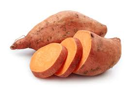
====

C: My dad offered 提供，给予；提议 to bring the eggnog  蛋奶酒 so we
should *be set* 准备就绪，万事俱备!

[.my2]
我爸爸提议带蛋奶酒来，所以我们应该都准备好了！

[.my1]
.案例
====
- offer to do sth 主动提出做某事
- eggnog [ˈɛɡnɔːɡ] (n.) 蛋奶酒 +
传统圣诞饮品，由牛奶、鸡蛋、糖、肉豆蔻和朗姆酒/白兰地制成。

- be set 准备就绪，万事俱备:  +
这是口语中的固定短语，意思是“已经准备好”，类似于 "be ready"。 +
例句：Once we pack our bags, we’ll be set for the trip. (一旦我们收拾好行李，就可以出发了。)
====

'''

== ■(182) Elementary ‐Global View ‐Boxing Day (C 0182)  +
A: What do you think of this one?  +
B: Eh, so so.  +
A: And this one? Too flashy?  +
B: Nah, not too flashy.  +
A: Uhg! And this sweater from my aunt? Isn’t it hideous?  +
B: I guess.  +
A: Are you even listening? I’m trying to have a conversation with you.  +
B: And I’m trying to watch the game, but you’re yapping on about your new clothes!  +
A: Well I have to decide which gifts to keep and which to exchange for better ones when I go to the Boxing Day sales this afternoon!  +
B: Well could you do me the favor of making this quick? It’s the third quarter and you’ve been blabbering on since the first!  +
A: Oh, your precious game. You watch the same game every year, and each year your beloved hometown team loses by at least three goals!  +
B: Oh no you didn’t. You didn’t just insult the Salsbury Seals, did you? Why don’t you just. just go and return all of those stupid clothes and not come back until the sales are over?  +
A: I might just! Enjoy your stupid game!  +
B: And Merry Christmas!  +
A: Merry Christmas!  +
 +
 +

'''

==== ◆(182) Elementary ‐Global View ‐ Boxing Day  节礼日；圣诞节后的第一个工作日 (C0182)

[.my1]
.案例
====
Boxing Day is a holiday celebrated after Christmas Day, occurring on the second day of Christmastide 圣诞季;圣诞节假期 (26 December). Boxing Day was once a day to donate (v.)捐赠，赠送 gifts to those in need, but it has evolved to become a part of Christmas festivities 庆祝活动，欢庆, with many people choosing to shop (v.) for deals 交易 on Boxing Day.

节礼日是圣诞节之后庆祝的假期，发生在 Christmastide 的第二天（12月26日）。 "节礼日"是每天一次向有需要的人捐赠礼物，但它已经演变为圣诞节庆祝活动的一部分，许多人选择在"节礼日"购物。
====

A: What do you think of this one?

B: Eh, _so so_  (adj.) 马马虎虎，一般般.

A: And this one? Too flashy 华丽的，炫耀的?

[.my1]
.案例
====
- flashy 描述事物外观极其显眼、引人注目，常带有贬义，表示过于浮夸或过分装饰。
====

B: Nah, not too flashy.

A: Uhg 表示否定! And this sweater  针织套衫，毛线衫；大量出汗的人 from my aunt?
Isn’t it hideous （外表）极丑的，面目狰狞的；非常可怕的，令人难以忍受的?

[.my2]
呃！那我阿姨送的这件毛衣呢？是不是丑极了？

[.my1]
.案例
====
- nah [nɑː] (informal) 否，口语化用法，表示否定，通常用来表示不赞同或不感兴趣。
- hideous -> 来自古法语hideus,来自hisdos,可怕的，恐怖的，丑陋的，拼写可能受hide影响。或直接来自hide,兽皮，引申词义野兽，野蛮的，丑陋的。
====

B: I guess. 我想是吧。

A: Are you even listening? I’m trying to have
a conversation （非正式的）谈话，交谈 with you.

[.my2]
你有在听吗？我在和你谈话呢。

B: And I’m trying to watch the game, but
you’re yapping (v.) (尤指小狗)吠叫;喋喋不休，唠叨 on about your new clothes!

[.my2]
而我正试着看比赛呢，可你一直在唠叨你的新衣服！

A: Well I have to decide which gifts to keep
and which to exchange 交换，（商品的）调换;退换 for better ones when
I go to the Boxing Day sales this afternoon!

[.my2]
好吧，我得决定哪些礼物留着，哪些要去换成更好的，在今天下午的节礼日（Boxing Day）促销时换！

B: Well could you *do me the favor* 为某人效劳，帮某个忙 of making
this quick? It’s the third quarter 四等份之一;（美式足球的）一节 and you’ve
been *blabbering 喋喋不休，滔滔不绝 on* since the first!

[.my2]
那你能帮个忙，快点好吗？现在是第三节了，而你从第一节开始就一直在唠叨！

A: Oh, your precious game. You watch the
same game every year, and each year your
beloved 钟爱的，深受爱戴的 hometown 家乡，故乡 team loses (v.) by at least
three goals!

[.my2]
哦，你那珍贵的比赛。你每年都看同一场比赛，而且每年你心爱的家乡队都至少输三球！

B: Oh no you didn’t. You didn’t just insult 侮辱 the
Salsbury Seals 海豹, did you? Why don’t you just...
just go and return all of those stupid clothes
and not come back until the sales are over?

[.my2]
哦不，你可没有这么做吧？你居然侮辱了萨尔兹伯里海豹队，对吧？你干脆去把那些愚蠢的衣服退了，等促销结束再回来！

A: I might 可能 just! Enjoy your stupid game!

[.my2]
我倒真想这么做！好好享受你的愚蠢比赛吧！

[.my1]
.案例
====
在句子 "I might just!" 中，*#"just" 用作副词，表示某个动作或行为将会简单、直接地发生#，或者强调某个行为是轻微或近乎理所当然的。这里的 #"just" 带有一种 强调或加强语气 的作用。#* +
具体来说，在这个句子中，*#"just" 用来强调说话者的决心或意图，暗示他们有可能会采取某个行动，甚至有些带有“冲动”的意味。#*

示例解析：
I might just go ahead and do it. (我可能就干脆做了。)
这里的 "just" 强调说话者可能直接、果断地去做某事，而不再犹豫。
====

B: And Merry Christmas!

A: Merry Christmas!

'''

== ■(183) Elementary ‐Daily Life ‐Winter Clothes ( C0183)  +
A: Bye, mom!  +
B: Wait, Jimmy, it’s cold outside. Put a hat on!  +
A: Ok. Bye!  +
B: No, wait, you will be too cold without mittens.  +
A: Alright. See ya!  +
B: Hold on, with that wind, you’re going to catch a cold. Wear this scarf.  +
A: Ok, see you after school...  +
B: Oh... and ear muffs! Put these on... here we go.  +
A: Mom?  +
B: Yes, honey...  +
A: I... I can’t breathe.  +
 +
 +

'''

==== ◆(183) Elementary ‐Daily Life ‐ Winter Clothes 冬季服装 (C0183)

A: Bye, mom!

B: Wait, Jimmy, it’s cold outside. Put a hat
on!

A: Ok. Bye!

B: No, wait, you will be too cold without
mittens 连指手套.

[.my1]
.案例
====
- mitten :( also mitt ) a type of glove that covers the four fingers together and the thumb separately 连指手套 +
->  来自古法语mite,露指手套，来自拉丁语medius,中间的，词源同middle,medial.即半手套。 +
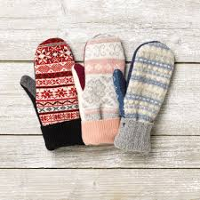

====

A: Alright. *See ya* 再见(=see you)!

B: Hold on, with that wind, you’re going to
catch a cold. Wear this scarf 围巾，披巾，头巾.

[.my2]
坚持住，风这么大，你会感冒的。戴上这条围巾。

A: Ok, see you after school...

B: Oh... and _ear muffs_ (暖手筒，皮手筒；保暖套)耳罩! Put these on... here
we go.

[.my1]
.案例
====
- muff : a short tube of fur or other warm material that you put your hands into to keep them warm in cold weather 暖手筒；皮手筒 +
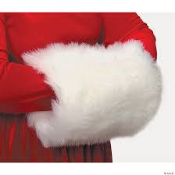
====

A: Mom?

B: Yes, honey...

A: I... I can’t breathe.

'''

== ■(184) Elementary ‐Daily Life ‐Fresh Start (C0184)  +
A: Now that it’s the new year, I’ve decided to turn over a new leaf.  +
B: Yeah? You finally decided to wipe the slate clean?  +
A: You got it! I have a new job, I’m living in a new city, with new friends! This is my opportunity to make some small changes in the way I live my life.  +
B: So what are you going to do? Take up an art class or something?  +
A: Well, first of all, I’ve decided to stop smoking. It’s not that I’m pinching pennies or anything, it’s just that I’ve been smoking since I was sixteen, and I think it’s time to stop.  +
B: I’m with you on that one. Anything else you’re planning on doing?  +
A: One last thing, I’ve decided to come out of the closet.  +
B: It’s about time!  +
 +
 +

'''

==== ◆(184) Elementary ‐Daily Life ‐ Fresh 新的，不同的；新颖的 Start 重新开始 (C0184)

A: Now that it’s the new year, I’ve decided *to
turn over 翻转 a new leaf* 叶，叶子；纸页，书页.

[.my1]
.案例
====
- turn over a new leaf (改过自新，重新开始): 这个表达用来表示某人决定从过去的错误或习惯中走出来，开始新的一页。它的字面意思是“翻开新的一页”.
====

B: Yeah? You finally decided to wipe (v.)（用布、手等）擦干净，抹掉 the slate 板岩；石板;（选举中的）候选人名单
clean?

[.my2]
是吗？你终于决定彻底洗净过去了吗？

[.my1]
.案例
====
- wipe the slate clean (彻底洗净过去，重新开始): 这个表达和 "turn over a new leaf" 类似，意味着消除过去的错误、错误的行为或负担，从头开始。它来源于学校用的黑板（slate），可以擦掉之前写的内容，表示从新开始。
====

A: You got it! I have a new job, I’m living in
a new city, with new friends! This is my
opportunity *to make some small changes* in
the way I live my life.

[.my2]
这是我生活方式上做些小改变的机会。

B: So what are you going to do? *Take up* 开始从事（某项活动） an
art class 艺术班 or something?

A: Well, first of all, I’ve decided to stop
smoking. It’s not that I’m *pinching 掐，捏;节省 pennies* 便士
or anything, it’s just that I’ve been smoking
since I was sixteen, and I think it’s time to
stop.

[.my1]
.案例
====
- pinching (v.) pennies (省钱，精打细算): 这个短语是指非常节俭地花费每一分钱，通常带有过度节省的意味。
====

B: I’m with you on that one. Anything else
you’re planning (v.) on doing?

[.my2]
我支持你这一点。你还打算做些什么？

A: One last thing, I’ve decided to *come out
of the closet* 壁橱，储藏室；隐秘状态（尤指同性恋身份）.

[.my1]
.案例
====
- come out of the closet (公开身份，尤其是性取向): 这个短语原本指隐匿的个人身份（尤其是同性恋身份）被公开，现已广泛用于描述任何隐蔽的身份或秘密的公开。
====

B: It’s about time!

[.my2]
这早该发生了！

'''

== ■(185) Elementary ‐The Weekend ‐Farm Animal s (C0185)  +
A: Isn’t this great? I always wanted to own a farm, live out in the country, grow my own food!  +
B: This is very beautiful. Though I have to confess, I don’t know the first thing about farming!  +
A: That’s fine! Don’t worry about it!  +
B: What was that?  +
A: Relax, it was just a goat!  +
B: And that?  +
A: It’s just the cows that are grazing over there. We can milk them later.  +
B: What was that?  +
A:  +
Honey, seriously, It’s just a sheep. Relax!  +
 +
A:  +
Relax, that was just the horses and donkeys that are in the stable .  +
 +
 +
B: You know what? I don’t think I can hack it here out in the countryside. I’m going back to the city!  +
 +
 +

'''

==== ◆(185) Elementary ‐The Weekend ‐ Farm Animals 农场动物 (C0185)

A: Isn’t this great? I always wanted to own a
farm, live out in the country, grow my own
food!

[.my2]
这不是太棒了吗？我一直想拥有一个农场，住在乡下，自己种食物！

[.my1]
.案例
====
- live out in the country (住在乡下): 这里的 "*out* in the country" *用来描述远离城市*、位于乡村地区的生活方式，意味着一种宁静、自然的生活环境。
====

B: This is very beautiful. Though I have to
confess (v.)供认，招供；承认，坦白, *I don’t know the first thing about*
farming!

[.my1]
.案例
====
- I don’t know the first thing about (我一点也不懂): 这是一个常用的口语表达，意味着对某个话题或领域完全没有了解或知识。这个表达强调了完全的缺乏经验。
====

A: That’s fine! Don’t worry about it!

B: What was that?

[.my2]
那是什么?

A: Relax, it was just a goat 山羊!

B: And that?

A: It’s just the cows that are grazing (v.)放牧；牧草 over
there. We can milk (v.)挤奶；榨取 them later.

[.my2]
那只是那边的牛在吃草。我们等会儿可以挤牛奶。

B: What was that?

A: Honey, seriously, It’s just a sheep. Relax!

A: Relax, that was just the horses and
donkeys that are in the stable 马厩 .

[.my2]
那只是马和驴在马厩里的声音。

B: You know what? I don’t think I can hack (v.)砍；劈;能╱不能应付（某情形） it
here out in the countryside. I’m going back
to the city!

[.my2]
你知道吗？我觉得我在乡下呆不下去了，我要回城里！

[.my1]
.案例
====
- *out* in the countryside (在乡下): 和之前提到的 "live *out* in the country" 相似，表示乡村或远离城市的地方。
====

'''

== ■(186) Elementary ‐The Office ‐Business Plan ( C0186)  +
A: I’ve had it! I’m done working for a company that is taking me nowhere!  +
B: So what are you gonna do? Just quit?  +
A: That’s exactly what I am going to do! I’ve decided to create my own company! I’m going to write up a business plan, get some investors and start working for myself!  +
B: Have you ever written up a business plan before?  +
A: Well, it can’t be that hard! I mean, all you have to do is explain your business, how you are going to do things and that’s it, right?  +
B: You couldn’t be more wrong! A well written business plan will include an executive summary which highlights the idea of the business in two pages or less. Then you need to describe your company with information such as what type of legal structure it has, history, etc.  +
A: Well that seems easy enough.  +
B: Wait, there’s more! Then you need to introduce and describe your goods or services. What they are and how they are different from competitors’? Then comes the hard part, a market analysis. You need to investigate and analyze hundreds of variables! You need to take into consideration socioeconomic factors from GDP per capita to how many children on average the population has! All this information is useful so that you can move on to your strategy and implementation stage, where you will describe in detail how you will actually execute your idea.  +
A: Geez. Is that all?  +
B: Almost, the most important piece of information for your investors will be the financial analysis. Here you will calculate and estimate sales, cash flow and profits. After all, people will want to know when they will begin to see a return on their investment!  +
A: Umm. I think I’ll just stick to my old job and save myself all the hassle of trying to start up a business!  +
 +
 +

'''

==== ◆(186) Elementary ‐The Office ‐ Business Plan (C0186)

A: I’ve had it 我受够了! I’m done 处境艰难；注定完蛋 working for a
company that is taking me nowhere!

[.my2]
我受够了！我受够了为一家让我一事无成的公司工作！

[.my1]
.案例
====
.be ˈdone for
( informal ) to be in a very bad situation; to be certain to fail 处境艰难；注定完蛋；肯定不行
• Unless we start making some sales, we're done for. 如果我们还卖不出去，那我们就完了。

.be/get ˈdone for sth/for doing sth
( BrE informal ) to be caught and punished for doing sth illegal but not too serious 因轻微违法行为受罚 +
• I got done for speeding on my way back. 我在返回的路上因超速行驶而受罚。

====

B: So what are you gonna do? Just quit 辞职；放弃?

A: That’s exactly what I am going to do! I’ve
decided to create my own company! I’m
going to write up a business plan, get some
investors 投资者 and start working for myself!

B: Have you ever written up a business plan
before?

A: Well, it can’t be that hard! I mean, all you
have to do is explain your business, how you
are going to do things and that’s it, right?

[.my2]
这应该不会太难！我的意思是，你只需要解释你的业务，你打算怎么做，就这样，对吧？

B: You *couldn’t be more wrong* 大错特错! A well
written business plan will include an
_executive (a.)行政的，有执行权的 summary_ 执行摘要 which highlights the idea
of the business in two pages or less. Then
you need to describe your company with
information such as what type of _legal
structure_  法律结构 it has, history, etc.

[.my2]
你大错特错了！一份写得很好的商业计划书会包括一份执行摘要，用两页或更少的篇幅突出业务的核心思想。然后你需要描述你的公司，包括它的法律结构类型、历史等信息。

A: Well that seems easy enough.

B: Wait, there’s more! Then you need to
introduce and describe your goods or
services. What they are and how they are
different from competitors’? Then comes the
hard part, a market analysis. You need to
investigate and analyze hundreds of
variables 变量! You need *to take into consideration*
socioeconomic 社会经济学的 factors *from* _GDP per capita_ 人均国内生产总值 *to*
how many children *on average* the
population has! All this information is useful
*so that* you can *move on to* your strategy
and implementation 实施，执行 stage, where you will
describe in detail how you will actually
execute (v.)执行，实施 your idea.

[.my2]
还有更多！然后你需要介绍并描述你的商品或服务。它们是什么，它们与竞争对手有什么不同？接下来是困难的部分，市场分析。你需要调查和分析数百个变量！你需要考虑从人均GDP到人口平均有多少孩子等社会经济因素！所有这些信息都有助于你进入策略和实施阶段，在那里你将详细描述你将如何实际执行你的想法。

A: Geez. Is that all?

B: Almost, the most important piece of
information for your investors will be the
financial analysis. Here you will calculate and
estimate sales, cash flow and profits. After
all, people will want to know when they will
begin to see a return on their investment!

[.my2]
差不多，对你的投资者来说，最重要的信息是财务分析。在这里，你将计算和估计销售额、现金流和利润。毕竟，人们会想知道他们什么时候才能开始看到投资回报！

A: Umm. I think I’ll just *stick to* my old job
and save (v.)避免，免得（出现困难或不愉快的事） myself all the hassle (n.)<非正式>麻烦，困难 of trying to
start up a business!

[.my2]
我想我还是坚持我的老工作吧，省得自己为创业而烦恼！

'''

== ■(187) Elementary ‐Daily Life ‐Going On A Diet (C0187)  +
A: Oh man! I’ve been starving myself for days now and I haven’t lost an ounce!  +
B: Are you trying to lose weight?  +
A: Yeah, my friend is getting married next month and I’m supposed to be a bridesmaid. I have to fit into my dress and look nice for her wedding, but I haven’t lost any weight! Look at these love handles.  +
B: You don’t have to starve yourself to lose weight. I think that’s where you’re going wrong.  +
A: Why? If I eat less, then my body will start eating away at my fat reserves right?  +
B: Not really. You should try to not eat foods high in calories, salts or saturated fats. Stay away from oily food and artificial flavors.  +
A: So you are saying that I should eat, but I should just watch what I eat?  +
B: Yes! You can also try to reduce your intake of carbohydrates and foods that are high in cholesterol. You can have steamed veggies or increase your protein intake found in chicken or fish.  +
A: If I do all this do you think I can lose twenty pounds in four weeks?  +
B: Don’t count on it.  +
 +
 +

'''

==== ◆(187) Elementary ‐Daily Life ‐ *Going On A Diet* (日常饮食；日常食物) 节食，减肥 (C0187)

A: Oh man! I’ve been starving 挨饿 myself for
days now and I haven’t lost an ounce 盎司（重量单位，1盎司约等于28克）；一点点，少量!

[.my2]
我已经饿了自己好几天了，可是一点都没瘦！

B: Are you trying to lose weight?

A: Yeah, my friend is getting married next
month and I’m supposed to be a bridesmaid 女傧相,伴娘.
I have to *fit into* my dress and look nice for
her wedding, but I haven’t lost any weight!
Look at these _love handles_ (把手；拉手)腰腹部赘肉;腰部两侧的脂肪凸起.

[.my2]
我的朋友下个月要结婚了，我要当伴娘。我必须穿得下那件裙子，在她的婚礼上看起来漂亮些，但我一点都没瘦！看看这些腰腹部赘肉。

[.my1]
.案例
====
- fit into​ : /fɪt ˈɪntuː/ (phrasal v.) to be the right size or shape to wear something. 穿得下.
- love handles​ : /lʌv ˈhændlz/ (n. informal) deposits of fat around the hips and waist. 腰腹部赘肉. +

====

B: You don’t have to starve yourself to lose
weight. I think that’s where you’re going
wrong.

[.my2]
我觉得这就是你做错的地方。

A: Why? If I eat less, then my body will start
*eating away at*  逐渐消耗. my _fat reserves_ (储量；准备金)脂肪储备 right?

[.my2]
如果我少吃，我的身体就会开始消耗我的脂肪储备，对吧？

B: Not really. You should try to not eat (v.)  foods 后定
high in calories 卡路里(热量单位), salts or _saturated (a.)湿透的；（溶液）饱和的，（有机分子）饱和的；充满的；（颜色）深的 fats_. Stay
away from _oily food_ 油腻食物 and _artificial flavors_ (风味调料)人工香料.

[.my2]
并不完全是这样。你应该尽量不吃高热量、高盐或高饱和脂肪的食物。远离油腻食物和人工香料。

[.my1]
.案例
====
- saturated fats​ : /ˈsætʃəreɪtɪd fæts/ (n.) fats that are solid at room temperature, often found in animal products. 饱和脂肪. +
-> 来自拉丁语 saturare,装满，浸透，来自 satur,满的，来自 PIE*sa,使充满，词源同 satiate,satisfy. 引申词义使饱和。
====

A: So you are saying that I should eat, but I
should just watch what I eat?

[.my2]
所以你是说我应该吃东西，但要注意我吃的是什么？

B: Yes! You can also try to reduce your
intake （食物、饮料、空气等的）摄取量，吸入量；摄入，吸入 of carbohydrates 糖类, 碳水化合物 and foods that are
high in cholesterol 胆固醇. You can have _steamed (a.)蒸熟的，蒸的
veggies_ 蔬菜；素菜类 or increase your _protein 蛋白质，朊 intake_ 后定 found
in chicken or fish.

[.my2]
你还可以尝试减少碳水化合物和高胆固醇食物的摄入。你可以吃蒸蔬菜，或者增加鸡肉或鱼类中的蛋白质摄入。

A: If I do all this /do you think I can lose
twenty pounds in four weeks?

[.my2]
如果我做到这些，你觉得我能在四周内减掉二十磅吗？

B: Don’t *count on* 依赖，依靠，指望（某人做某事）；确信（某事会发生） it.

[.my2]
别指望了

[.my1]
.案例
====
.count on sb/sth
to trust sb to do sth or to be sure that sth will happen依赖，依靠，指望（某人做某事）；确信（某事会发生） +
SYN bank on sth +
• ‘I'm sure he'll help.’ ‘ *Don't count on it* .’ “我肯定他会帮忙的。”“那可靠不住。” +
[+ to inf] +
• *I'm counting on you* to help me. 我就靠你帮我啦。

====

'''

== ■(188) Elementary ‐The Office ‐Asking For A Ra ise (C0188)  +
A: Excuse me sir, may I talk to you?  +
B: Bill! Sure, come on in. What can I do for you?  +
A: Well sir, as you know, I have been an employee of this prestigious firm for over ten years.  +
B: Yes.  +
A: I won’t beat around the bush. Sir, I would like a raise. I currently have three companies after me and so I decided to talk to you first.  +
B: A raise? Son, I would love to give you a raise, but this is just not the right time.  +
A: I understand your position, and I know that the current economic downturn has had a negative impact on sales, but you must also take into consideration my hard work, pro-activeness and loyalty to this company for over a decade.  +
B: Taking into account these factors, and considering I don’t want to start a brain drain, I’m willing to offer you a ten percent raise and an extra five days of vacation time. How does that sound?  +
A: Great! It’s a deal! Thank you, sir!  +
B: Before you go, just out of curiosity, what companies were after you?  +
A: Oh, the electric company, gas company and water company!  +
 +
 +

'''

==== ◆(188) Elementary ‐The Office ‐ Asking For A Raise 要求加薪  (C0188)

A: Excuse me sir, may I talk to you?

B: Bill! Sure, *come on in* 进来吧. What can I do for
you?

[.my1]
.案例
====
- come on in​ : /kʌm ɒn ɪn/ (phrase) used to invite someone to enter a place. 进来吧. 用于邀请或鼓励某人进入室内或特定场所。
====

A: Well sir, as you know, I have been an
employee of this prestigious  有威望的，有声望的 firm for over ten
years.

B: Yes.

A: I won’t *beat （反复地）敲，击，打 around the bush* (灌木，灌木丛)拐弯抹角. Sir, I would
like a raise 加薪. I currently have three companies
*after me* 对我有兴趣;追逐或跟随某人以便抓住他们 and so I decided to talk to you first.

[.my2]
我不会拐弯抹角。先生，我想要加薪。目前有三家公司对我有兴趣，所以我决定先和您谈谈。

[.my1]
.案例
====
- beat around the bush​ : /biːt əˈraʊnd ðə bʊʃ/ (phrase) to avoid getting to the point of an issue. 拐弯抹角.
====

B: A raise? Son, I would love to give you a
raise, but this is just not the right time 合适的时机.

A: I understand your position 处境，状况；观点，立场, and I know
that the current economic downturn (n.)（商业经济的）下降，衰退期 has had
a negative impact on sales, but you must
also take into consideration my hard work,
pro-activeness (n.)积极性,积极主动 and loyalty to this company
for over a decade 十年.

[.my2]
我理解您的立场，也知道当前的经济衰退对销售产生了负面影响，但您也必须考虑我十多年来对公司的努力工作、积极主动和忠诚。

B: *Taking into account* 考虑到 these factors, and
considering I don’t want to start a _brain
drain_ 人才流失, I’m willing to offer you a ten percent
raise and an extra five days of vacation time.
How does that sound?

[.my2]
考虑到这些因素，并且考虑到我不想引发人才流失，我愿意给你百分之十的加薪和额外的五天休假时间。你觉得怎么样？

A: Great! It’s a deal! Thank you, sir!

B: Before you go, just *out of curiosity* (好奇心，求知欲) 出于好奇, what
companies were *after you*?

A: Oh, the electric company, gas company
and water company!

'''

== ■(189) Elementary‐DailyLife‐BuyingANewMobilePhone (C0189)  +
A: Hello sir, may I help you?  +
B: Yeah, I accidentally dropped my phone in the toilet.  +
A: I see. Well, you have come to the right place. We have over one hundred models of more than twenty leading mobile phone manufacturers.  +
B: Sounds good. I don’t want it to be too expensive, maybe something mid-range.  +
A: We have this new HTC smart phone. It comes with the Android OS so you can download applications. It also has a built-in camera, mp3 player and touch screen. It works on the 3G network so you have fast access to the internet wherever you are.  +
B: What about Wi-fi?  +
A: Of course! You can access the internet from any hotspot as well as from home.  +
B: One last thing. Is it waterproof?  +
 +
 +

'''

==== ◆(189) Elementary‐ Daily Life‐ Buying A New Mobile Phone (C0189)

A: Hello sir, may I help you?

B: Yeah, I accidentally 意外地，偶然地； 意外失误地 dropped my phone in
the toilet.

A: I see. Well, you have come to the right
place. We have over one hundred models of
more than twenty leading 领先的;最重要的；一流的 mobile phone
manufacturers 制造商；[经] 厂商.

B: Sounds good. I don’t want it to be too
expensive, maybe something mid-range.

A: We have this new HTC smart phone. It
comes with 附带，随附 the Android OS so you can
download applications. It also has a built-in 嵌入的；固定的
camera, mp3 player and touch screen. It
works on the 3G network so you have fast
access to the internet wherever you are.

B: What about Wi-fi?

A: Of course! You can access the internet
from any hotspot *as well as* 和，以及，还有 from home.

B: One last thing. Is it waterproof 防水的，不透水的?

'''

== ■(190) Elementary ‐The Weekend ‐Family Barb ecue (C0190)  +
A: Is everything ready for the big family barbecue tomorrow?  +
B: Yep. The steaks and chicken are marinated and I also bought hamburger buns.  +
 +
A: We should also cook a couple dozen hot dogs and kebabs.  +
B: Yeah, good idea. We can put some lawn furniture outside next to the grill. I also set up the tent outside so we can hide from the sun if it gets too hot.  +
A: Great! I asked Grace to bring cups and serviettes as she is also bringing two big coolers for the beers.  +
B: This is gonna be a great barbecue!  +
 +
 +
 +

'''

==== ◆(190) Elementary ‐The Weekend ‐ Family Barbecue  户外烧烤 (C0190)

A: Is everything ready for the big family
barbecue 户外烧烤 tomorrow?

B: Yep （=yes）. The steaks 牛排 and chicken are
marinated (v.)腌制，浸泡（食物） and I also bought hamburger
buns 圆形面包,小面包;人的臀部.

A: We should also cook a couple 两个，几个 dozen 一打，十二个 hot
dogs and kebabs 烤肉串.

[.my1]
.案例
====
- kebab +
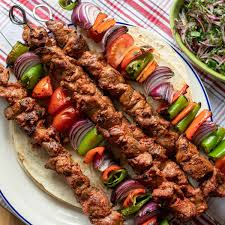
====

B: Yeah, good idea. We can put some lawn
furniture outside next to the grill 烤架；带烤架的炊具. I also set
up the tent outside /so we can hide from the
sun if it gets too hot.

A: Great! I asked 请求 Grace to bring cups and
serviettes 餐巾 as 因为 she is also bringing two big
coolers 冷却器；冷却机;（通常有冰和酒的）清凉饮料 for the beers.

[.my1]
.案例
====
- cooler +
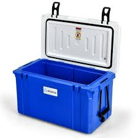

====

B: This is gonna be a great barbecue!

'''

== ■(191) Elementary‐Global View ‐Daylight Savin gs Time (C0191)  +
A: Did you set your clock forward for daylight savings time?  +
B: What? Why do we have to do that?  +
A: Well, at the start of the spring we usually have more daylight in the mornings and less in the afternoon. This is basically due to our position on the planet and the rotation of the earth. In any case, to take better advantage of the daylight available, we compensate by moving our clocks forward one hour.  +
B: I see. That’s convenient! I never understood things like this, such as GMT. I never know what time zone we are in or when to change my clock!  +
A: That just stands for Greenwich Mean Time. Here in California, we are in Pacific Standard Time, that is eight time zones west of Greenwich. Remember when we were in Beijing? Well, then we were in China Standard Time, and that’s eight time zones east of Greenwich!  +
B: That’s why it was so weird traveling from Beijing to LA! Because of the huge time difference, even though we left Beijing at noon and flew for more than eight hours, we still arrived in LA the same day at noon! It’s like we went back in time!  +
 +
 +

'''

==== ◆(191) Elementary‐Global View ‐ Daylight Savings Time 夏令时 (C0191)

A: Did you set your clock forward for _daylight
savings time_?

[.my2]
你为夏令时把时钟调快了吗？

B: What? Why do we have to do that?

A: Well, at the start of the spring we usually
have more daylight in the mornings and less
in the afternoon. This is basically *due to* our
position on the planet and the rotation 旋转，转动 of the
earth. In any case 无论如何, *to take better advantage
of* the daylight available, we compensate 弥补，补偿 by
moving our clocks forward one hour.

[.my2]
在春季开始时，我们通常早上有更多的日光，而下午则较少。这基本上是由于我们在地球上的位置和地球的自转。无论如何，为了更好地利用可用的日光，我们通过将时钟调快一小时来补偿。

B: I see. That’s convenient! I never
understood things like this, such as GMT 格林尼治标准时间. I
never know what time zone we are in or
when to change my clock!

[.my2]
我明白了。这很方便！我从来不明白这些事情，比如GMT。我从来不知道我们在哪个时区，或者什么时候调整时钟！

A: That just *stands for* 代表,象征着 Greenwich Mean (a.)平庸的；一般的
Time. Here in California, we are in Pacific
Standard Time, that is eight time zones west
of Greenwich. Remember (v.) when we were in
Beijing? Well, then we were in China
Standard Time, and that’s eight time zones
east of Greenwich!

[.my2]
这只是格林尼治标准时间的缩写。在加利福尼亚，我们处于太平洋标准时间，即格林尼治以西八个时区。记得我们在北京的时候吗？那时我们处于中国标准时间，即格林尼治以东八个时区！

B: That’s why it was so weird traveling from
Beijing to LA! Because of the huge _time
difference_ 时差, even though we left Beijing at
noon and flew for more than eight hours, we
still arrived in LA the same day at noon! It’s
like we went back in time!

[.my2]
这就是为什么从北京到洛杉矶的旅行如此奇怪！因为巨大的时差，即使我们在中午离开北京，飞行了八个多小时，我们仍然在同一天中午到达洛杉矶！就像我们回到了过去！

'''

== ■(192) Elementary ‐Global View ‐Natural Disast ers (C0192)  +
Bob: Those are the headlines for today, and now for the international weather report with Mike Sanderson.  +
Mike: Thank you, Bob! This past week has been the beginning of Armageddon for many, a series of unprecedented meteorological events occurred around the world. In Switzerland, a major avalanche was reported in the Alps. Fortunately, no one was injured. Due to to the extreme cold this winter, a blizzard has struck the US Midwest, causing classes in schools and universities to be temporarily canceled. Mike: Moving to to Latin American, Ecuador has suffered a six month drought that has not only affected farming, but has also forced the closure of the hydroelectric power plant that provides electricity for the entire country. In Chile, a major earthquake that registered seven point five on the Richter scale struck the southern region. Losses are reported to be in the billions. Authorities have not yet released an official statement. Bob: Not a great week for the world! Any good news? Mike: I’m afraid not, Bob. One of the major volcanoes in Mexico has erupted, causing major floods and landslides in the region. Meanwhile, Mexico ’s coast has been hit by hurricane Liliana and officials say that all the seismic activity leads them to believe that a tsunami may hit Central America, affecting Honduras, Guatemala and Panama. That’s all the news we have for today, but stay tuned for updates on the six o’clock news. Back to you Bob.  +
 +
 +

'''

==== ◆(192) Elementary ‐Global View ‐ Natural Disasters (灾难) 自然灾害 (C0192)

Bob: Those are the headlines 头条新闻；新闻提要，大字标题 for today, and
now for the international weather report (n.) with
Mike Sanderson.

[.my2]
这些是今天的头条新闻，现在请听迈克·桑德森的国际天气报告。

Mike: Thank you, Bob! This past week has
been the beginning of Armageddon 大决战；世界末日善恶决战的战场（源于《圣经》） for many,
a series of unprecedented (a.)前所未有的，史无前例的 meteorological 气象学的
events occurred around the world. In
Switzerland, a major avalanche 雪崩，山崩 was reported
in the Alps. Fortunately, no one was injured.
*Due to*  the extreme cold this winter, a
blizzard has struck the US Midwest, causing
classes 课程 in schools and universities to be
temporarily canceled.

[.my2]
对许多人来说，过去的一周是世界末日的开始，一系列前所未有的气象事件在世界各地发生。在瑞士，阿尔卑斯山脉报告了一次重大雪崩。幸运的是，没有人受伤。由于今年冬天的极寒天气，美国中西部遭遇了暴风雪，导致学校和大学的课程暂时取消。

Mike: Moving  to Latin American, Ecuador 国名
has suffered a six month drought 长期缺乏，严重短缺；<古>口渴；干旱，旱灾 that has
not only affected farming, but has also forced
the closure of the _hydroelectric 水力发电的；水电治疗的 power plant_ 水力发电厂
that provides electricity 电，电流，电力  for the entire
country. In Chile, a major earthquake that
registered _seven point five_ on the _Richter
scale_ 里氏震级 struck (v.) the southern region. Losses 损失 are
reported to be in the billions 数十亿. Authorities 当局，官方
have not yet released an _official statement_ 官方声明.

[.my2]
转到拉丁美洲，厄瓜多尔遭受了六个月的干旱，这不仅影响了农业，还迫使为全国供电的水力发电厂关闭。在智利，南部地区发生了一次里氏7.5级的大地震。据报道，损失达数十亿美元。当局尚未发布官方声明。

Bob: *Not* a great week *for* the world! Any
good news?

对世界来说，这不是一个好的一周！有什么好消息吗？

Mike: I’m afraid not, Bob. One of the major
volcanoes 火山 in Mexico has erupted, causing
major floods 洪水 and landslides 山体滑坡,山崩 in the region.
Meanwhile, Mexico ’s coast has been hit by
_hurricane 飓风；爆发 Liliana_ and officials say that all the
seismic 地震的，地震引起的 activity leads them to believe that a
tsunami 海啸，海震 may hit Central America, affecting
Honduras 洪都拉斯, Guatemala 危地马拉 and Panama 巴拿马. That’s all
the news we have for today, but *stay tuned* 继续关注
for updates on the six o’clock news. Back to
you Bob.

[.my2]
恐怕没有，鲍勃。墨西哥的一座主要火山喷发，导致该地区发生重大洪水和山体滑坡。与此同时，墨西哥海岸遭遇了飓风莉莲娜的袭击，官员们表示，所有的地震活动使他们相信海啸可能会袭击中美洲，影响洪都拉斯、危地马拉和巴拿马。这就是我们今天的所有新闻，但请继续关注六点新闻的更新。交回给你，鲍勃。

'''

== ■(193) Elementary‐Daily Life‐BuildingYourDream Home (C0193)  +
A: Mr. and Mrs. Robinson! Let’s get straight to it. You have saved up your money for years and are now ready to build your dream home. What did you have in mind?  +
B: A suburban bungalow straight out of the sixties! A perfect lawn with minimal landscaping. A brick patio in the backyard with an old-fashioned grill, quaint lawn furniture, and a swimming pool. A two-car carport, pastel siding and a gable roof. Completed with white shutters and a white picket fence !  +
C: Uh, honey?  +
B: In the living room we would have moss-green rugs and a fireplace with a stone mantle and wood paneling on the walls. In the kitchen, the cupboards would be a pale yellow and we would have a turquoise metal oven and vinyl flooring - +
C: Umm, sweetie, but I was thinking of a more modern style house. An open concept house, all glass, wood, metal, and concrete.  +
B: But sweetums, there is always a lot of wasted space in those kinds of homes. Besides, it’s just a fad. It doesn’t have the homey feeling the old homes do.  +
C: Sweetie-pie it’s not a lot of wasted space. It is relaxing and the house would be eco-friendly with an in-floor heating system and designed to retain the heat of the sun in the winter and keep the house cool in the summer. We would have solar panels on the roof - +
B: Do you know how much those things cost?  +
C: What about your vintage furniture, dearest? And instead of a lawn, which is also a lot of wasted space and would require environmentally harmful pesticides, we would have a fish pond in the backyard and a garden that would cover the whole yard so we could grow our own food!  +
B: But buttercup, I thought you always said that you loved visiting your grandmother’s house!  +
C: And I thought you, Mr. Scientist, were all up on saving the planet with your technological advancements!  +
A: Umm well I am just going to go get some coffee while you two keep discussing.  +
 +
 +

'''

==== ◆(193) Elementary‐Daily Life‐ Building Your Dream Home (C0193)

A: Mr. and Mrs. Robinson! Let’s *get straight
to it* 直奔主题,开门见山. You have *saved up* 积攒钱 your money for
years and are now ready (a.) to build your dream
home. What did you have in mind?

[.my2]
让我们直接切入正题吧。你们已经攒了多年的钱，现在准备建造你们的梦想之家。你们有什么想法？

B: A suburban 郊区的，城郊的 bungalow 平房 *straight out of 直接从……出来 the
sixties* 典型的六十年代风格! A perfect lawn with _minimal 极小的，极少的；极简抽象艺术的；简朴的，朴实无华的；极简的
landscaping_. A brick (a.)似砖的；用砖做的 patio 露台；天井 in the backyard
with an old-fashioned grill 烤架；带烤架的炊具, quaint (a.)奇特有趣的，古色古香的；做得很精巧的 lawn
furniture, and a swimming pool. A two-car
carport 车库；（美）车棚, _pastel (a.)淡的，柔和的;彩色粉笔；蜡笔 siding_ 壁板；墙板；挡板 and _a gable 三角墙，山墙 roof_.
Completed with white shutters 百叶门窗 and a white
_picket 用尖桩围住 fence_ 尖桩篱笆 !

[.my2]
一栋典型的六十年代郊区平房！完美的草坪，简约的景观设计。后院有一个砖砌露台，配有一个老式烤架、古雅的草坪家具和一个游泳池。双车位车棚，浅色外墙和山形屋顶。再加上白色百叶窗和白色尖桩篱笆！

[.my1]
.案例
====
.bungalow
a house built all on one level, without stairs (楼梯):  平房 +
bungalow是美国一种比较流行的建筑款式，指那种带有凉台或走廊的平房，夏天人们可以在凉台上纳凉，或者在走廊上养花、散步、溜狗、聊天。这种小屋通常只有一层，顶上有一个加盖的阁楼，因此有着漂亮的斜屋顶。 .

-> 它实际上是一个外来词。它来自印度语bangla，字面意思是Bengalese（孟加拉人），指的是“按照孟加拉风格建造的房屋”。

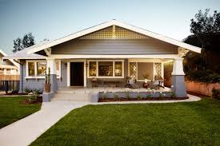

.patio
a flat hard area outside, and usually behind, a house where people can sit（房屋外面或后面的）露台，平台

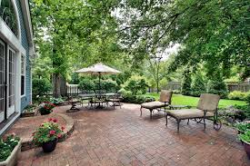

.quaint
(a.) attractive in an unusual or old-fashioned way 新奇有趣的；古色古香的 +
-> 来自古法语cointe,优雅的，精致的，来自拉丁语cognitus,知道，知晓，词源同know,cognizance.引申词义古色古香的，有古味的。

.pastel
-> 来自paste,面团，-el,小词后缀。即小面团，后用于指揉成面团的颜料，彩色粉笔，蜡笔。

.siding
( NAmE ) material used to cover and protect the outside walls of buildings 壁板；墙板；挡板

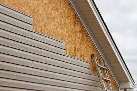
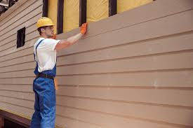

.gable
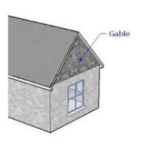
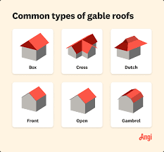

.picket
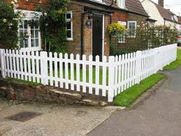

.本句中的词组总结
- suburban bungalow​ : /səˈbɜːrbən ˈbʌŋɡəloʊ/ (n.) a small, single-story house located in a suburb. 郊区平房.
- straight out of the sixties​ : /streɪt aʊt əv ðə ˈsɪkstiz/ (phrase) characteristic of the 1960s. 典型的六十年代风格.
- perfect lawn​ : /ˈpɜːrfɪkt lɔːn/ (n.) a well-maintained and attractive area of grass. 完美的草坪.
- minimal landscaping​ : /ˈmɪnɪməl ˈlændskeɪpɪŋ/ (n.) the use of simple and unobtrusive design elements in a garden or yard. 简约的景观设计.
- brick patio​ : /brɪk ˈpætioʊ/ (n.) an outdoor area paved with bricks, typically used for dining or relaxation. 砖砌露台.
- old-fashioned grill​ : /ˈoʊld ˈfæʃənd ɡrɪl/ (n.) a traditional outdoor cooking device. 老式烤架.
- quaint lawn furniture​ : /kweɪnt lɔːn ˈfɜːrnɪtʃər/ (n.) charming and old-fashioned outdoor furniture. 古雅的草坪家具.
- swimming pool​ : /ˈswɪmɪŋ puːl/ (n.) a large man-made area of water for swimming. 游泳池.
- two-car carport​ : /tuː kɑːr ˈkɑːrpɔːrt/ (n.) a shelter for two cars, typically open on at least one side. 双车位车棚.
- pastel siding​ : /pæˈstɛl ˈsaɪdɪŋ/ (n.) a type of exterior wall covering in soft, light colors. 浅色外墙.
- gable roof​ : /ˈɡeɪbl ruːf/ (n.) a roof with two sloping sides that form a triangle at the top. 山形屋顶.
- white shutters​ : /waɪt ˈʃʌtərz/ (n.) window coverings made of horizontal or vertical slats, painted white. 白色百叶窗.
- white picket fence​ : /waɪt ˈpɪkɪt fɛns/ (n.) a traditional fence made of white wooden pickets, often associated with suburban homes. 白色尖桩篱笆.

====

C: Uh, honey?

[.my2]
呃，亲爱的？

B: In the living room we would have mossgreen (a.)苔藓绿
rugs 地毯；毯子 and a fireplace 壁炉 with a _stone
mantle_ 覆盖层;地幔;（可继承的）责任，职责，衣钵 and _wood paneling_ 镶板；[建] 嵌板 on the walls. In
the kitchen, the cupboards 碗橱；橱子 would be a _pale (a.)（脸色）苍白的；（颜色）浅的，淡的
yellow_ and we would have a _turquoise (a.n.)蓝绿色的 metal
oven_ 烤炉，烤箱 and _vinyl 乙烯基（化学） flooring_ -

[.my2]
在客厅里，我们会铺上苔藓绿色的地毯，壁炉上有一个石制壁炉架，墙上还有木质墙板。在厨房里，橱柜会是淡黄色的，我们会有一个青绿色的金属烤箱和乙烯基地板——

[.my1]
.案例
====
.mantle
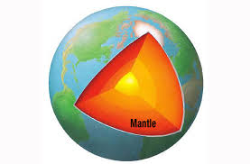
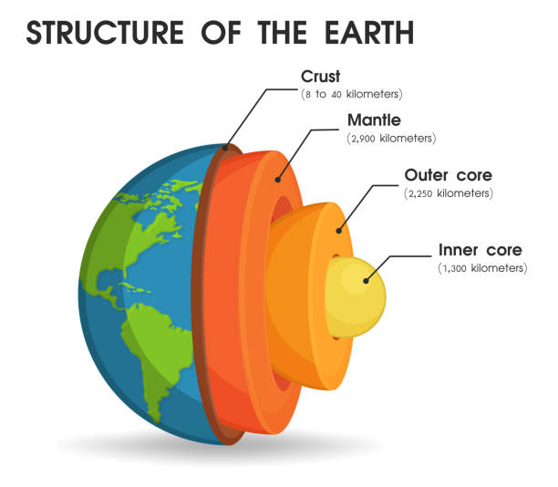

.panel
A panel is a flat rectangular piece of wood or other material that forms part of a larger object such as a door. (门等的) 镶板; 嵌板

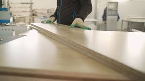

.turquoise
-> 来自古法语 pierre turqueise,来自土耳其的石头，来自 pierre,石头，词源同 petrol,turqueise,土耳其的，词源同 Turkish.

.vinyl
Vinyl is a strong plastic used for making things such as floor coverings and furniture. 乙烯基塑料 +
-> vin-,葡萄，葡萄酒，-yl,化学名词后缀，基。用于指乙烯基。

.本句中的词组总结:
- moss-green rugs​ : /mɔːs ɡriːn rʌɡz/ (n.) rugs in a shade of green resembling moss. 苔藓绿色的地毯.
- fireplace​ : /ˈfaɪərpleɪs/ (n.) a structure made of brick, stone, or metal for holding a fire indoors. 壁炉.
- stone mantle​ : /stoʊn ˈmæntl/ (n.) a shelf above a fireplace made of stone. 石制壁炉架.
- wood paneling​ : /wʊd ˈpænəlɪŋ/ (n.) wooden boards used to cover walls. 木质墙板.
- cupboards​ : /ˈkʌbərdz/ (n.) cabinets used for storing dishes, food, or other items. 橱柜.
- pale yellow​ : /peɪl ˈjɛloʊ/ (n.) a light shade of yellow. 淡黄色.
- turquoise metal oven​ : /ˈtɜːrkwɔɪz ˈmɛtl ˈʌvən/ (n.) an oven made of metal in a blue-green color. 青绿色金属烤箱.
- vinyl flooring​ : /ˈvaɪnəl ˈflɔːrɪŋ/ (n.) a type of flooring made from synthetic materials. 乙烯基地板.
====

C: Umm, sweetie 爱人，情人；甜的糕饼糖果, but I was *thinking of* 考虑，打算（做某事） a
more modern style house. An open concept
house, all glass, wood, metal, and concrete.

[.my2]
嗯，亲爱的，但我想到的是一个更现代风格的房子。一个开放式概念的房子，全部使用玻璃、木材、金属和混凝土。

B: But sweetums （爱称）甜心，亲爱的, there is always a lot of
wasted space in those kinds of homes.
Besides, it’s just a fad  一时的风尚;（尤指短暂和无根据的）时尚，狂热；一时的爱好. It doesn’t have the
homey (a.)舒适的；家庭似的；自在的 feeling the old homes do.

[.my2]
但是亲爱的，那种房子总是有很多浪费的空间。而且，这只是一时的风尚。它没有老房子那种温馨的感觉。

[.my1]
.案例
====
- Sweetums : 它是一个 非正式（informal）且 带有爱称性质 的词，主要用于表达亲昵或爱意。 +
含义： +
（爱称）甜心，亲爱的（a term of endearment, similar to "sweetie" or "darling"） +
一般用于情侣、夫妻、父母对孩子的昵称。
====

C: Sweetie-pie 甜心,亲爱的 it’s not a lot of wasted space.
It is relaxing (a.)令人轻松的，愉快的 and the house would be ecofriendly (a.)环境友好型的，环保的
with an _in-floor heating system_ 地暖系统 and
designed to retain (v.)保持，保留；保存，储存 the heat of the sun in the
winter and keep the house cool in the
summer. We would have _solar panels_ 太阳能电池板 on the
roof -

[.my2]
亲爱的，这并没有很多浪费的空间。它很令人放松，而且房子会是环保的，配有地暖系统，设计上可以在冬天保留太阳的热量，在夏天保持房子的凉爽。我们会在屋顶安装太阳能电池板——

B: Do you know how much those things
cost?

C: What about your vintage (a.)（过去某个时期）典型的，优质的；（某人的）最佳作品的;古色古香的（指1917–1930年间制造，车型和品味受人青睐的） furniture,
dearest（给所爱的人写信时用）最亲爱的;深切的；由衷的? And instead of a lawn, which is also
a lot of wasted space and would require
_environmentally harmful_ 对环境有害的 pesticides 农药；杀虫剂, we
would have a _fish pond_ 鱼池 in the backyard and a
garden that would cover the whole yard so
we could grow our own food!

[.my2]
那你的复古家具呢，亲爱的？还有，草坪不仅浪费空间，而且还需要使用对环境有害的杀虫剂，我们可以用后院的鱼塘代替它，并种满整个院子的花园，这样我们就能自己种植食物了！"

B: But buttercup 毛茛（野生植物，开杯状有光泽的小黄花）, I thought you always said
that you loved visiting your grandmother’s
house!

[.my2]
但是亲爱的，我以为你总是说你喜欢去你祖母的房子！

[.my1]
.案例
====
- buttercup :Buttercup為毛茛花的俗稱，在早年的俚語中，可能會用在純真少女身上，（美国俚语）(尤指天真可爱的)女孩子. 但若用在男性身上則視雙方關係而定帶有貶低意味。 +

====

C: And I thought you, Mr. Scientist, were all
*up on* 关于，对于,对……非常了解，精通 saving the planet with your
technological advancements 进步；进展!

[.my2]
而我以为你，科学家先生，会全力支持通过技术进步来拯救地球！

[.my1]
.案例
====
."I thought"：
这里是 省略了过去虚拟语气，表示 "原本以为……（但事实并非如此）"。

.up on (something) (informal)
熟悉……，对……非常了解 +
Definition: To be well-informed about something; to have knowledge of something. 对某个话题、领域或技能非常了解、精通。 +
- She’s really *up on* the latest fashion trends.
（她对最新的时尚潮流非常了解。） +

====

A: Umm well I am just going to go get some
coffee while you two keep discussing.

[.my2]
好吧，我去喝点咖啡，你们俩继续讨论。

'''

== ■(194) Elementary ‐The Weekend ‐Stir Fry (C0194)  +
A: Oh, man. I had the best supper last night. My wife made a stir fry and it was amazing!  +
B: I love stir fry Crispy bite-sized vegetables covered in a mixture of soy sauce and oyster sauce. Wilted greens and fresh bean sprouts. Throw in some onion and garlic and ginger! Mmm! Mmm! It’s almost lunchtime. I would die for a plate of stir fry right now!  +
A: Well, you can keep the vegetables, I’ll take the meat. The stir fry my wife made was really hearty, with chunks of beef and slivers of bell peppers and onion...  +
B: What? You call that a stir fry? More meat than vegetables? That’s the worst insult you could throw at a Chinese stir fry What a disgrace to the wok she fried it in! What you had is equivalent to a fajita without the wrap! Silly Americans!  +
 +
 +

'''

==== ◆(194) Elementary ‐The Weekend ‐ Stir Fry (C0194)

A: Oh, man. I had the best supper 晚餐 last night.
My wife made a _stir 搅拌，搅和（液体等物质） fry_ 炒菜 and it was amazing!

B: I love _stir fry_ Crispy 脆的 bite-sized 一口大小的 vegetables 蔬菜
covered (v.) in a mixture 混合物 of _soy sauce_ 酱油 and _oyster 牡蛎，蚝 sauce_ 蚝油. Wilted 枯萎的 greens 绿叶蔬菜 and fresh 新鲜的 _bean sprouts_ (芽菜；豆芽菜) 豆芽.
*Throw in* 加入 some onion 洋葱 and garlic 大蒜 and ginger 姜!
Mmm! Mmm! It’s almost lunchtime 午餐时间. I would
*die (v.) for* 非常想要 a plate of _stir fry_ right now!

[.my1]
.案例
====
.I would die for ...
此处用 ​would 表达强烈愿望（非现实情况），属于虚拟语气的一种形式。
====

A: Well, you can keep the vegetables, I’ll
take the meat. `主` The _stir fry_ my wife made
`系` was really hearty 丰盛的, with chunks 大块 of beef 牛肉 and
slivers 薄片 of _bell 铃 peppers_ 青椒,甜椒 and onion...

B: What? You call that a stir fry? *More* meat
*than* vegetables? That’s _the worst (a.) insult_ (n.)侮辱 后定 you
could *throw at* 针对;对...说;朝……扔 a Chinese stir fry. What a
disgrace 耻辱 *to the wok* (炒锅) 对于炒锅而言 后定 she fried (v.) it in! What you
had is *equivalent to* 等同于 _a fajita 墨西哥卷 without the
wrap_ 包裹物! Silly 愚蠢的 Americans!

[.my1]
.案例
====
.That’s the worst insult you could throw at a Chinese stir fry. What a disgrace to the wok she fried it in!
整句话相当于 “What a disgrace it is to the wok” 省略了动词 "it is". +
to the wok = 介词短语，表示 “对于炒锅而言” +
she fried it in = 定语从句，修饰“wok” +

这个定语从句的完整形式是 "the wok 后定 in which she fried it"，但在口语中省略了"which"并把"in"放到句尾。

第一句 表示 “这是你能给中国炒菜最严重的侮辱”（形容炒菜做得很糟糕）。 +
第二句 是一个感叹句，意思是 “这对她用的锅来说，简直是种耻辱！”（暗示菜做得太差，连锅都蒙羞了）。
====

[.my1]
.案例
====
- ​stir fry /ˈstɜːr fraɪ/ (n.) 炒菜；a dish of quickly fried vegetables and sometimes meat.
- ​Crispy /ˈkrɪspi/ (adj.) 脆的；pleasantly hard and dry.
- ​bite-sized /ˈbaɪt saɪzd/ (adj.) 一口大小的；small enough to be eaten in one bite.
- ​soy sauce /ˈsɔɪ sɔːs/ (n.) 酱油；a dark brown sauce made from soybeans, used in Chinese and Japanese cooking.
- ​oyster sauce /ˈɔɪstər sɔːs/ (n.) 蚝油；a thick, dark sauce made from oysters, used in Chinese cooking. +
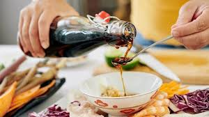 +
蚝油，是粤菜后厨最重要的调料之一. 不难想象，**如果要把生蚝, 熬至蚝油的浓稠度，那制作成本得多高。**但我们在超市买的蚝油和路边摊的“蚝油生菜“，价格实惠，和普通调料一样的价格。**其实严格来说，我们说所吃到的蚝油，**都算不上传统的纯正蚝油，甚至连混合蚝油也算不上，*顶多是个"蚝味"调味酱。* +
所以我们日常在做菜时，**把蚝油当作普通调料即可，并不会比其他调料更自然更有营养。你可以把它看做成一款浓稠偏甜版的"海鲜酱油"使用，**可以起到增鲜、增稠和上色的作用。

- ​Wilted /ˈwɪltɪd/ (adj.) 枯萎的；(of a plant) become limp through heat, loss of water, or disease.
- ​greens /ɡriːnz/ (n.) 绿叶蔬菜；green vegetables, especially leafy ones.
- ​bean sprouts /biːn spraʊts/ (n.) 豆芽；the young shoots of beans, eaten as a vegetable. +
image:../img/bean sprouts.jpg[,15%]

- ​Throw in /θroʊ ɪn/ (phr. v.) 添加，投入;加入；to add something extra to something else.
- ​die for /daɪ fɔːr/ (phr. v.) 非常想要；to want something very much.
- ​hearty /ˈhɑːrti/ (adj.) 丰盛的；large and satisfying.
- ​chunks /tʃʌŋks/ (n.) 大块；a thick, solid piece of something.
- ​slivers /ˈslɪvərz/ (n.) 薄片；a small, thin piece of something.
- ​bell peppers /bɛl ˈpɛpərz/ (n.) 甜椒；a large, hollow vegetable, usually green, red, or yellow, eaten raw or cooked. +
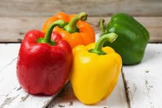

- ​throw at /θroʊ æt/ (phr. v.) 对...说；to direct something at someone.
- ​disgrace /dɪsˈɡreɪs/ (n.) 耻辱；a loss of respect or honor.
- ​wok /wɒk/ (n.) 炒锅；a large, round-bottomed cooking pan used in Chinese cooking.
- ​fajita /fəˈhiːtə/ (n.) 墨西哥卷；a Mexican dish of grilled meat and vegetables served in a tortilla. +
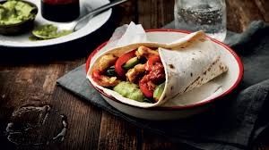

- ​wrap /ræp/ (n.) 包裹物；a piece of material used to cover or enclose something.
====

[.my2]
A: 哦，天哪。昨晚我吃了最棒的晚餐。我妻子做了一道炒菜，简直太棒了！ +
B: 我喜欢炒菜，脆脆的一口大小的蔬菜，裹着酱油和蚝油的混合物。枯萎的绿叶蔬菜和新鲜的豆芽。加入一些洋葱、大蒜和姜！嗯！嗯！快到午餐时间了，我现在非常想要一盘炒菜！ +
A: 好吧，你可以留着蔬菜，我要吃肉。我妻子做的炒菜非常丰盛，有大块的牛肉和薄片的甜椒和洋葱... +
B: 什么？你管那叫炒菜？肉比蔬菜还多？这是对中式炒菜最大的侮辱！她对炒锅的侮辱！你吃的简直就是没有卷饼的墨西哥卷！愚蠢的美国人！

'''

== ■(195) Elementary ‐Global View ‐Job Hunting ( C0195)  +
A: Woo hoo! This just might be the start of the rest of my life!  +
B: What happened?  +
A: I’m in the market for a job! I went on a website with hundreds of job listings in the area and browsed through them until I got the names of a few employers I would like to work for. I have the resume I wrote for English class last month and a cover letter will be a piece of cake to write. I’ve even done my research and found the names of the managers so I can address the letters personally. And you know I can be charming in interviews. Goodbye my penniless days! Hello salary and a career!  +
B: Ben, we’re fifteen. What kind of job are you looking for?  +
A: Oh, just for a position as a gas station attendant. You know, starting at a simple lowly job, just like all the greats before they made it big in the world.  +
B: Uh-huh.  +
A: But I’m just in it for the money, right? How else am I going to be able to afford to keep taking Angela to the movies? Besides, I love the smell of gasoline, don’t you?  +
 +
 +

'''

==== ◆(195) Elementary ‐Global View ‐ Job Hunting 求职,找工作(C0195)

A: Woo hoo! This just might be the start 开始 of the rest 剩余部分 of my life!

B: What happened?

A: I’m *in the market for* 想要购买;欲购;在寻找 a job*! I went on a website  with hundreds of job listings 职位列表 in the area  /and *browsed (v.) through 浏览 them* until I got the names of a few employers 雇主 I would like to work for. I have the resume 简历 后定 I wrote for English class 为了英语课 last month /and 表示前后因果关系（有了简历，写求职信就很简单） a _cover letter_ 求职信 will be _a piece of cake_ 轻而易举的事 to write. I’ve even done my research 研究 /and found the names of the managers 经理 /so I can address (v.)在（信封、包裹等）上写姓名和地址，致函；<正式> 向……讲话 the letters personally 亲自. And you know /I can be charming 迷人的，富有魅力的 in interviews 面试. Goodbye _my penniless 身无分文的 days_! Hello _salary 薪水 and a career_ 职业!

[.my1]
.案例
====
我有上个月在英语课上写的简历. 求职信会很容易写。 +
and a cover letter will be a piece of cake to write , 这个句子省略了 "for me"，完整句子可能是 "a cover letter will be a piece of cake for me to write"。
====

B: Ben, we’re fifteen. What kind of job are you looking for?

A: Oh, just for a position 职位 as a gas station attendant (服务人员；侍从) 加油站服务员. You know, starting at a simple lowly 低微的 job, just like all the greats 伟人 before they *made it big* 取得巨大成功 in the world.

B: Uh-huh.

A: But I’m just in it for 为了... money, right? *How else* 何以; 还有别的方法 ... 吗 am I going to be able to afford 不然我怎么负担得起 to keep *taking* Angela *to* the movies 一直带安琪拉去看电影? Besides, I love the smell of gasoline 汽油, don’t you?

[.my1]
.案例
====
- ​in the market for /ɪn ðə ˈmɑːrkɪt fɔːr/ (phr.) 想要购买, 欲购;在寻找；interested in buying or obtaining something.
- ​browsed through /braʊzd θruː/ (phr. v.) 浏览；to look through something casually.
- ​a piece of cake /ə piːs əv keɪk/ (idiom) 轻而易举的事；something very easy to do.
- ​address /əˈdres/ (v.) 写地址；to write a destination on a letter.
- ​made it big /meɪd ɪt bɪɡ/ (idiom) 成功；to become very successful.
====

[.my2]
A: 哇哦！这可能是我人生的新起点！ +
B: 怎么了？ +
A: 我正在找工作！我上了一个有数百个本地职位列表的网站，浏览后找到了几个想应聘的雇主名字。我有上个月英语课写的简历，求职信也轻而易举就能写出来。我甚至研究了经理的名字，可以亲自写信。你知道我面试时很迷人。再见了，穷光蛋的日子！你好，薪水和职业生涯！ +
B: 本，我们才15岁。你要找什么工作？ +
A: 哦，只是个加油站服务员的职位。你知道的，从底层做起，就像所有伟人成功前那样。 +
B: 嗯哼。 +
A: 但我只是为了钱，对吧？不然我怎么有钱继续带安吉拉去看电影？而且我喜欢汽油味，你不觉得吗？

'''

== ■(196) Elementary ‐Daily Life ‐Going To The Tai lor (C0196)  +
A: Welcome to Bill’s Fabric World. What can I do for you today?  +
B: I was wondering if you guys also tailor clothes?  +
A: Sure we do! We have the best tailors in the country! What is it that you need exactly?  +
B: Well, I’m looking to get a custom-made suit.  +
A: Excellent! We have the finest cashmeres at affordable prices. How about we get you measured? Let’s start off by measuring the width of your shoulders. Now, let’s measure the length of your arms and this bit around your neck here.  +
B: Can you make sure you leave a little extra space in the collar? My neck gets easily irritated.  +
A: No problem! Now for your pants, let me just measure your waist and the inseam.  +
B: You might also want to leave a little extra room in the waist area. I tend to gain a few pounds over the holidays.  +
A: OK. Now you can pick your fabric and pattern design. Please follow me.  +
 +
 +

'''

==== ◆(196) Elementary ‐Daily Life ‐ Going To The Tailor (C0196)

A: Welcome to Bill’s Fabric 布料 World. What can I do for you today?

B: I was wondering 想知道 if you guys also tailor (v.)定做（衣服）, 裁制 clothes?

A: Sure we do! We have the best tailors 裁缝 in the country! What is it that you need exactly?

B: Well, I’m looking to get a custom-made 定制的 suit 西装.

A: Excellent! We have the finest cashmeres （山羊绒）开司米;羊绒 at affordable 价格合理的 prices. How about we get you measured 测量? Let’s *start (v.) off 以…开始 by* measuring the width of your shoulders 肩膀. Now, let’s measure the length  of your arms and this bit 部分 around your neck 脖子 here.

B: Can you *make sure* you leave a little extra 额外的 space 空间 in the collar 衣领? My neck gets easily irritated 受刺激.

A: No problem! Now for your pants 裤子, let me just measure your waist 腰围 and the inseam 内缝.

B: You might also want  to 你可能也想,用于(委婉地)对某事的询问或征求意见 leave (v.) a little extra room 空间 in the waist area 区域. *I tend to gain 增加 a few pounds* 磅 over the holidays  我假期容易长胖.

A: OK. Now you can pick your fabric 布料 and pattern 图案 design 设计. Please follow me.

[.my1]
.案例
====
- ​cashmeres /ˈkæʃmɪrz/ (n.) 羊绒；soft wool from a type of goat. +
-> 来自Kashmir的旧式拼写，印巴冲突地带，知名的高质量羊毛产地。
- ​inseam /ˈɪnsiːm/ (n.) 内缝；the inner seam of a pant leg. +
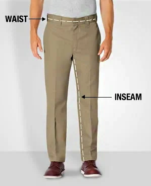

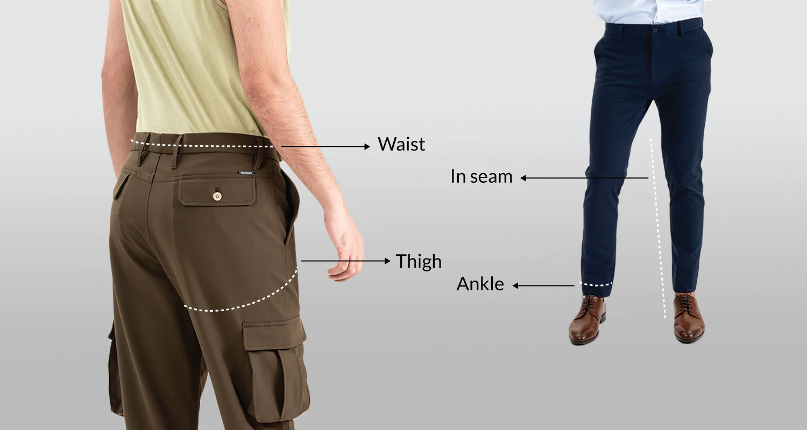
====

[.my2]
A: 欢迎来到比尔的布料世界。今天有什么需要？ +
B: 你们这里能定制衣服吗？ +
A: 当然！我们有全国最好的裁缝！您具体需要什么？ +
B: 我想定制一套西装。 +
A: 太好了！我们有价格合理的顶级羊绒。先量尺寸吧。从肩宽开始，接着量手臂长度和脖子周围。 +
B: 领口能留点空间吗？我脖子容易过敏。 +
A: 没问题！现在量腰围和裤腿内缝。 +
B: 腰围部分也留点空间吧，我假期容易长胖。 +
A: 好的。现在请选布料和图案，跟我来。

'''

== ■(197) Elementary ‐Global View ‐Calling 911 (C 0197)  +
A: Alright class, now that we’re all dressed up let’s see what professions you chose. Ah, I see a fireman, a police officer, a medic, and a lifeguard! Can anyone tell me what these people have in common?  +
B: They save people from bad things?  +
A: That’s right! Now class, if something bad happened and you had to get help, do you know what phone number you would call?  +
C: 911!  +
A: Yes, you would pick up the phone and dial  +
911. What are some emergency situations where you would need to dial 911?  +
B: If my grandpa has a heart attack!  +
C: If there is an accident!  +
B: If a robber breaks into the house!  +
C: If the fire alarm goes off!  +
B: Pff! I wouldn’t call 911 if the fire alarm went off in my house. The only time that ever happens is when we’re having spaghetti for supper, and Mom burns the garlic bread, as usual.  +
 +
 +

'''

==== ◆(197) Elementary ‐Global View ‐ Calling 911 (C0197)

A: Alright class, now that 既然，由于 we’re all dressed up 盛装打扮 /let’s see what professions 职业 you chose. Ah, I see a fireman 消防员, a police officer 警察, a medic 医师；医科学生;医护人员, and a lifeguard 救生员! Can anyone tell me what these people have *in common* 共同点?

B: They save people from bad things?

A: That’s right! Now class, if something bad happened /and you had to *get help* 寻求帮助, do you know what phone number you would call?

C: 911!

A: Yes, you would pick up 拿起 the phone /and dial 拨打 911. What are some emergency situations 紧急情况 where you would need to dial 911?

B: If my grandpa has a heart attack 心脏病发作!

C: If there is an accident 事故!

B: If a robber 强盗 breaks into 闯入 the house!

C: If the fire alarm 火警警报 goes off 响起;突然爆炸或发出巨响!

B: Pff! I wouldn’t call 911 /if the fire alarm went off 响起 in my house. `主` The only time that ever happens `系` is when we’re having spaghetti 意大利面 for supper, and `主` Mom `谓` burns (v.)烤焦 the garlic bread 蒜香面包, as usual 像往常一样.

[.my1]
.案例
====
- ​dressed up /drest ʌp/ (phr. v.) 盛装打扮；wearing formal or fancy clothes.
- ​spaghetti /spəˈɡeti/ (n.) 意大利面；long thin pasta.
- ​garlic bread /ˈɡɑːrlɪk bred/ (n.) 蒜香面包；bread flavored with garlic. +
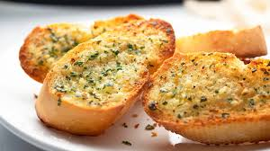

====

[.my2]
A: 好了同学们，现在我们都盛装打扮了，看看你们选的职业。啊，我看到消防员、警察、医护人员和救生员！谁能说说他们的共同点？ +
B: 他们从坏事中救人？ +
A: 对！同学们，如果发生坏事需要求助，你们知道该打什么电话吗？ +
C: 911！ +
A: 是的，拿起电话拨打911。哪些紧急情况需要拨打911？ +
B: 如果我爷爷心脏病发作！ +
C: 如果有车祸！ +
B: 如果有强盗闯进家里！ +
C: 如果火警警报响了！ +
B: 切！我家火警响了我才不会打911呢。这种情况只在晚餐吃意大利面、妈妈像往常一样烤焦蒜香面包时发生。

'''

== ■(198) Elementary ‐Daily Life ‐Applying CPR (C 0198)  +
A: Hello everyone and welcome to our CPR for beginners course. First of all, does anyone know what CPR stands for?  +
B: Cardiopulmonary resuscitation!  +
A: That’s right! We apply CPR in the case of cardiac arrest or pulmonary arrest.  +
B: What does that mean?  +
A: Well, basically if your heart stops pumping blood, or your lungs stop pumping air, then we need to get them going again! That’s when we have to apply this procedure. Let’s begin! I need a volunteer.  +
B: Me! Me!  +
A: Alright, come here and lay flat on your back. Let’s suppose this young woman has stopped breathing. We must lift the person’s chin so that we clear a pathway for air to get into the lungs. Then we place our mouth over the other person’s mouth and blow air two or three times, like this.  +
B: Wait, what are you doing? I’m a married woman! You can’t just try to kiss me like this!  +
A: Ma’ am I’m not trying to kiss you! I am trying to demonstrate how to apply CPR in the case of an emergency.  +
B: Well, ok. But no French kissing!  +
A: As I was saying, we blow air through the mouth in this manner. Once this is done, we must try to get the heart going again. To do this, we place our hands over the person’s chest, and press down firmly two or three times.  +
B: Wait, what are you doing! You can’t just kiss me then go for second base!  +
 +
 +

'''

==== ◆(198) Elementary ‐Daily Life ‐ Applying CPR 心肺复苏术（=cardiopulmonary  (a.)心肺的；与心肺有关的 resuscitation (n.)苏醒，复活；复兴） (C0198)

A: Hello everyone /and welcome to our CPR 心肺复苏 for beginners 初学者 course. First of all, does anyone know what CPR *stands for* 代表?

B: Cardiopulmonary resuscitation 心肺复苏术!

A: That’s right! We apply (v.)应用 CPR *in the case of* 在...情况下 _cardiac arrest_ (逮捕，拘留；停止，终止) 心脏骤停 or _pulmonary (a.)肺的 arrest_ 呼吸停止.

B: What does that mean?

A: Well, basically if your heart stops (v.) *pumping (v.)泵送 blood*, or your lungs stop (v.) pumping air, then we need to get them going again 重新运转! That’s when we have to apply (v.) this procedure 流程. Let’s begin! I need a volunteer 志愿者.

B: Me! Me!

A: Alright, come here and *lay flat* 平躺 on your back 背部. Let’s suppose 假设 this young woman has stopped breathing 呼吸. We must lift (v.)抬起 the person’s chin 下巴 to clear (v.) a pathway 通道 for air *to get into* the lungs 肺. Then we *place* (v.) our mouth *over* 覆盖 the other person’s mouth /and *blow (v.) air* 吹气 two or three times, like this.

B: Wait, what are you doing? I’m a married woman! You can’t just try to kiss 亲吻 me like this!

A: Ma’am I’m not trying to kiss you! I am trying to demonstrate 演示 how to apply (v.) CPR *in the case of* an emergency 紧急情况.

B: Well, ok. But no French kissing 法式接吻,舌吻!

A: As I was saying, we *blow (v.) air* through the mouth in this manner 方式. Once this is done, we must try to get the heart *going again*. To do this, we place (v.) our hands over the person’s chest 胸部, and press down 按压 firmly 用力地 two or three times.

B: Wait, what are you doing! You can’t just kiss me /then *go for second base 二垒*（俚语）!

[.my1]
.案例
====
.second base
/ˈsekənd beɪs/ (n.) 二垒（俚语）；baseball term slang for intimate touching. +
二垒：棒球比赛中，球员为了得分而必须触及的第二个位置，或者球场上的一名球员在这个位置附近的位置。

second base (singular only) (baseball) The base opposite home plate in a baseball infield. The runner slid into second base with a double. (singular only, US, colloquial) *Touching a partner under his or her clothes, without having sex.* +
二垒（仅单数）（棒球）棒球内场中本垒对面的垒。跑垒员滑入二垒，打出二垒安打。（仅单数，美国，口语）*在未发生性关系的情况下，在衣服下触摸伴侣。*

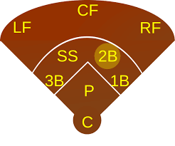

.get to second base
to touch a partner under his or her clothes, but not have sex
觸摸伴侶衣服下的身體，但沒有發生性交
====

[.my2]
A: 大家好，欢迎参加心肺复苏初学者课程。首先，有人知道CPR代表什么吗？ +
B: 心肺复苏术！ +
A: 正确！在心脏骤停或呼吸停止时应用CPR。 +
B: 这是什么意思？ +
A: 简单说，如果心脏停止泵血或肺部停止呼吸，我们需要让它们重新运转！这时就要用这个流程。开始吧！我需要一位志愿者。 +
B: 我！我！ +
A: 好，过来平躺。假设这位女士停止了呼吸，我们必须抬起她的下巴打开气道，然后将嘴覆盖她的嘴吹气两三次，像这样。 +
B: 等等，你在干嘛？我是已婚人士！你不能这样亲我！ +
A: 女士，我不是在亲你！我在演示紧急情况下的CPR。 +
B: 好吧，但别法式接吻！ +
A: 继续，用这种方式吹气后，要将双手放在患者胸部用力按压两三次。 +
B: 等等！你不能亲完我又摸二垒啊！

'''

== ■(199) Elementary‐Global View‐LearningAboutFirst Aid (C0199)  +
A: Hey Joe! Where have you been these past few days?  +
B: I’ve been busy with a first aid course that I started about a week ago at the Red Cross.  +
A: Cool! I’ve always wanted to do something like that! Have you learned anything useful?  +
B: For sure! I mean we’ve learned how to apply pressure to stop bleeding, how to check for a pulse, and even how to apply CPR!  +
A: Have you treated any real emergencies?  +
B: Well, they took us along with some paramedics. There was this guy who fell off his motorcycle and suffered a concussion as well as a couple of compound fractures. His wounds were pretty serious so they had to rush him to the hospital. It was intense!  +
A: I can imagine! I tend to faint when I see blood, so I think I won’t be taking up a course like that anytime soon!  +
 +
 +

'''

==== ◆(199) Elementary‐Global View‐ Learning About First Aid (C0199)

A: Hey Joe! *Where have you been* these past few days?

B: I’ve been busy with a _first aid_ 急救 course (n.) that I started about a week ago at the Red Cross 红十字会.

A: Cool! I’ve always wanted to do something like that! Have you learned anything useful?

B: For sure! I mean (v.) we’ve learned how to apply (v.) pressure 施加压力 *to stop (v.) bleeding* 止血, how to check for 检查，寻找 a pulse 脉搏, and even how to apply CPR!

A: Have you treated 处理 any real emergencies 紧急情况?

B: Well, they took us *along with* （与某人）一道，一起 some paramedics 急救人员. There was this guy 后定 who *fell off* 跌落,从上摔下来 his motorcycle 摩托车 /and suffered (v.)遭受 a concussion 脑震荡;冲击；震荡 *as well as* a couple of 两个（事物）或几个（事物） compound fractures 复合骨折. His wounds 伤口 were pretty serious 严重的 /so they had to rush (v.)紧急送医 him to the hospital. It was intense 紧张的!

A: I can imagine! I tend to faint (v.)晕倒 when I see blood, so I think I won’t be taking up 参加 a course like that anytime soon!

[.my2]
A: 嘿乔！这几天你去哪儿了？ +
B: 我在红十字会参加了一个急救课程，忙了一周。 +
A: 酷！我一直想学这个！学到有用的了吗？ +
B: 当然！我们学了如何按压止血、检查脉搏，甚至心肺复苏！ +
A: 处理过真正的紧急情况吗？ +
B: 他们带我们跟急救人员出诊。有个骑摩托的人摔下来，脑震荡加复合骨折。伤口很严重，必须紧急送医，太紧张了！ +
A: 能想象！我一见血就晕，暂时不会参加这种课程！ +

'''

== ■(200) Elementary ‐Daily Life ‐Junk Food (C0200)  +
A: I’m hungry, let’s grab a bite to eat.  +
B: Sure! How about we go home and prepare a couple of sandwiches?  +
A: Nah! Let’s go get a burger and fries.  +
B: All you ever do is have unhealthy fast food Pizza, fries, burgers and hot dogs! You have to start eating better!  +
A: What are you talking about? I have salads sometimes.  +
B: Yeah right! I’m serious! You should also cut down on your sugar intake as well. You drink carbonated drinks that are high in fructose syrup! It’s really not healthy!  +
A: Fine! I’ll start drinking and having home cooked meals that are low in fat. Are you happy now?  +
B: It’s a start, but I’ll be happy when I see you stick to your promise!  +
 +
 +

'''

==== ◆(200) Elementary ‐Daily Life ‐ Junk Food (C0200)

A: I’m hungry, let’s grab a bite (n.)小量食物；简单的一餐 to eat 吃点东西.

B: Sure! *How about* /we go home and prepare 准备 a couple of sandwiches 三明治?

A: Nah! Let’s go /get a burger 汉堡 and fries 薯条.

B: All you ever do `系` is have (v.) unhealthy 不健康的 fast food 快餐 Pizza, fries, burgers  汉堡包 and hot dogs 热狗! You have to start (v.) eating better!

A: What are you talking about? I have salads 沙拉 sometimes 我有时吃沙拉.

B: Yeah right! I’m serious! You should also *cut down on* 减少，削减 your _sugar intake_ 糖分摄入 as well. You drink (v.) carbonated drinks 碳酸饮料 that are high in _fructose (n.)果糖；左旋糖 syrup_ (糖浆；糖水（有时加果汁）) 果糖糖浆! It’s really not healthy!

A: Fine! I’ll start drinking (v.) and having _home cooked meals_ 家常菜 that are _low in fat_ 低脂. Are you happy now?

B: It’s a start (n.), but I’ll be happy when I see you stick to 坚持 your promise!

[.my1]
.案例
====
- ​grab a bite to eat /ɡræb ə baɪt tuː iːt/ (idiom) 吃点东西；to eat a quick meal.
-  cut down (on something) /kʌt daʊn ɒn/ (phr. v.) 减少；to reduce consumption.
- to eat or drink (v.) less of a particular thing, usually in order to improve your health: +
I’m trying to *cut down* on the amount of sugar I eat.
- ​low in fat /loʊ ɪn fæt/ (phr.) 低脂；containing little fat.
====

[.my2]
A: 我饿了，去吃点东西吧。 +
B: 好！回家做三明治怎么样？ +
A: 不！去吃汉堡薯条。 +
B: 你总吃不健康的快餐——披萨、薯条、汉堡热狗！得吃健康点！ +
A: 说什么呢？我有时吃沙拉。 +
B: 得了吧！认真点！你还该减少糖分摄入，喝的碳酸饮料全是果糖糖浆！太不健康了！ +
A: 行！我改喝低脂饮料，吃家常菜。满意了？ +
B: 算个开始，但等你坚持承诺我才满意！ +

'''
