=  English pod 241-260
:toc: left
:toclevels: 3
:sectnums:
:stylesheet: ../../../myAdocCss.css

'''

== ■(221) Elementary ‐Daily Life ‐Car Trouble (C0221)  +
A: Car trouble center. How may I help you?  +
B: My car won’t start! Stupid old car!  +
A: Hold on, before you kick your car let’s go through some possible problems.  +
B: Fine.  +
A: Ok, first of all, can you turn the key in the ignition?  +
B: Yeah! I am here with my friend and he thinks it may be the spark plug or the starter motor.  +
A: Those are possible problems, but tell me, when you turn the key, do you hear the starter motor crank?  +
B: Yeah, it sounds like it usually does when I start the car, but nothing else happens. The engine won’t start. Should I maybe press the accelerator?  +
A: No. If you step on the accelerator pedal you can flood the carburetor and your car will never start.  +
B: So what do you think it is?  +
A: I know this may seem like a silly question, but does your car have gasoline?  +
B: Umm. yeah! Right! I got the car started! Thanks for your help! I told you to fill the tank!  +
 +
 +

'''

==== ◆(221) Elementary ‐Daily Life ‐ Car Trouble 汽车故障 (C0221)

A: Car trouble center. How may I help you?

B: My car won’t start! Stupid old car!

A: Hold on, before you kick your car let’s *go
through* 检查 some possible problems.

B: Fine.

A: Ok, first of all, can you turn the key in the
ignition  着火，点燃；点火装置，点火开关?

[.my2]
您能转动点火开关的钥匙吗？

B: Yeah! I am here with my friend and he
thinks it may be the _spark 火花，火星 plug_ 火花塞 or the _starter
motor_ 启动马达.

[.my2]
他认为可能是火花塞或启动马达的问题。

[.my1]
.案例
====
- spark plug +
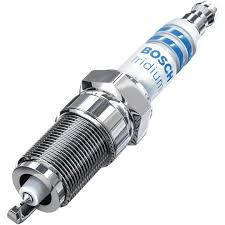
- starter motor +
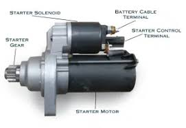
====

A: Those are possible problems, but tell me,
when you turn the key, do you hear the
_starter motor_ 启动马达  crank  (v.)转动（内燃机的）曲轴?

B: Yeah, it sounds like it usually does when I
start the car, but nothing else happens. The
engine won’t start. Should I maybe press (v.) the
accelerator 油门；催化剂；[机] 加速装置?

[.my2]
能，听起来就像平时启动车时的声音，但其他什么也没发生。发动机就是发动不了。我是不是该踩油门？

A: No. If you step on the _accelerator pedal_ 油门踏板
you can flood the carburetor 汽化器；化油器 and your car will
never start.

[.my2]
不要。如果您踩油门，可能会淹没化油器，您的车就永远发动不了了。

[.my1]
.案例
====
.carburetor
-> 来自词根carb, 碳。-ure, 名词后缀。-etor, 名词后缀。

化油器(Carburetor)是一種把燃料混入空氣的裝置。

為什麼引擎要在燃燒前, 把"燃料"和"空氣"預先混合好呢？**要燃料完全在氣缸中燃燒，就必須想辦法加大表面積。如果可以把燃料化作霧氣一般，每一小滴的燃料四週, 就會有非常充足的空氣, 可以提供燃燒時需要的氧氣，有接近無限大的表面積。**那么有沒有方法可以不間斷地將燃料化為霧氣？"化油器"就可以做到.
====

B: So what do you think it is?

A: I know this may seem like a silly 愚蠢的，傻的 question,
but does your car have gasoline 汽油?

B: Umm. yeah! Right! I got the car started 我把车发动起来了!
Thanks for your help! I told you to fill the
tank!

'''

== ■(222) Elementary ‐Global View ‐Carbon Footpr int (C0222)  +
A: So what’s your guys’ take on all this global warming hysteria in the media?  +
B: It’s pretty serious, man. There have been tons of scientific studies and the scientific community says that the earth is heating up. We need to make some drastic changes to our lifestyle if we want to preserve our planet.  +
A: I don’t know. It sounds like a bunch of mumbo jumbo if you ask me. ”Save the earth!” The earth will save itself. It’s survived worst disasters in the past. I mean, honestly, we live in the boonies. There’s no way anyone here is ever going to walk or bike to work, especially in the winter. And we have no bus system. My house is forty years old and it would take a lot of money to get it refitted to be ”green” and ”energy-efficient”.  +
C: Well I don’t really know if I believe in global warming either, or whether or not it was our doing or a natural change the earth is going through, but you have to admit that we’re living pretty irresponsibly here in the west.  +
A: I guess...  +
C: I think the issue at hand is sustainability. We’ve only got this one earth we can live on, and our resources are quickly disappearing because of our own carelessness and our inability to think of anyone but ourselves and anything but the present.  +
B: So, like I was saying, we need to change the way we live. We need to reduce our carbon footprint.  +
C: But it doesn’t have to be that drastic. Hybrid vehicles and solar panels are too expensive to be feasible right now. And we don’t have to be hippies living off the land and buying everything organic either, though it helps.  +
B: I car pool to work everyday with some buddies of mine. I have a rain barrel outside my house I use to water my plants and my lawn in the summer, and I make sure I always bring reusable bags with me when I get my groceries. And we just started using bio-degradable plastic made from corn oil for take-out orders at my family’s restaurant. Remember the three R’s? Reduce. Reuse. Recycle.  +
C: Exactly, it’s just small simple changes, like buying energy-saving light bulbs, starting a compost bin, recycling bottles and papers, using reusable water bottles, stop using disposable cups and cutlery.  +
A: Like the ones we’re drinking out of?  +
B: Yeah.  +
 +
 +

'''

==== ◆(222) Elementary ‐Global View ‐ Carbon Footprint 碳足迹；碳排放量 (C0222)

[.my1]
.案例
====
A _carbon footprint_ is the total amount of greenhouse (a.)温室效应的 gases (including _carbon dioxide_ and methane 甲烷，沼气) that are generated by our actions.

碳足迹是由我们的作用产生的温室气体（包括二氧化碳和甲烷）的总数。

The average carbon footprint for a person in the United States is 16 tons, one of the highest rates in the world. Globally, the average carbon footprint is closer to 4 tons. To have the best chance of avoiding a 2℃ rise in global temperatures, the average global _carbon footprint_ per year needs to drop to under 2 tons by 2050.

美国一个人的平均碳足迹是16吨，是世界上最高的碳足迹之一。在全球范围内，平均碳足迹接近4吨。为了避免全球温度升高2 2的最佳机会，到2050年，全球平均碳足迹需要下降到2吨以下。
====

A: So what’s your guys’ take (n.)看法；观点 on all this
global warming hysteria 歇斯底里；过度兴奋 in the media?

[.my2]
所以你们对媒体上关于全球变暖的歇斯底里, 有什么看法？

B: It’s pretty serious, man. There have been
tons of scientific studies and the _scientific
community_ (社区，社会) 科学界 says that the earth is heating up.
We need to make some drastic 剧烈的；极端的 changes to
our lifestyle 生活方式 if we want to preserve our
planet.

[.my2]
这很严重，伙计。有大量的科学研究，科学界也指出地球正在变暖。如果我们想要保护我们的星球，就需要对我们的生活方式做出一些剧烈的改变。

A: I don’t know. It sounds like a bunch of
_mumbo 废话，胡言乱语 jumbo_ (a.巨大的；特大的) 晦涩难懂的话；胡言乱语 if you ask me. ”Save the
earth!” The earth will save itself. It’s survived
worst disasters in the past. I mean, honestly,
we live in the boonies 郊区；远离城市的原野. There’s no way 不可能
anyone here is ever going to walk or bike (v.) to
work, especially in the winter. And we have
no bus system. My house is forty years old
and it would take a lot of money to get it
refitted (v.)整修；给…安装新配件；改装 to be ”green” and ”energy-efficient”.

[.my2]
我们住在乡下。这里的人不可能步行或骑自行车去上班，尤其是在冬天。而且我们也没有公交系统。我的房子有40年了，要把它改造成“环保”和“节能”的，需要花很多钱。

C: Well I don’t really know if I *believe in*
global warming either, or *whether or not* it
was our doing or a natural change 后定  the earth
is going through, but you have to admit that
we’re living pretty irresponsibly 不负责任地 here in the
west.

[.my2]
我也不确定我是否相信全球变暖，或者这是我们的行为还是地球正在经历的自然变化.

A: I guess...

[.my2]
我想是吧

C: I think _the issue at hand_ 当前的问题；手头的问题 is sustainability (n.)持续性，能维持性.
We’ve only got this one earth we can live on,
and our resources are quickly disappearing
#because of# ①our own carelessness  粗心大意 ② #and# our
inability to think of anyone but ourselves ③ #and#
anything but the present.

[.my2]
我认为当前的问题是可持续性。我们只有一个可以居住的地球，而由于我们自己的粗心大意, 和只考虑自己、只考虑现在的能力不足，我们的资源正在迅速消失。

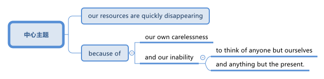

[.my1]
.案例
====
- we can live on（我们可以居住的） : on（“在……上”——"live on earth"）
====

B: So, like I was saying, we need to change
the way we live. We need to reduce our
carbon footprint.

C: But it doesn’t have to be that drastic 极端的，激烈的.
_Hybrid (a.)混合的；杂种的，杂交成的 vehicles_ (车辆；交通工具)混合动力汽车 and _solar panels_ 太阳能电池板 are too
expensive to be feasible (a.)可行的，办得到的；很可能会发生的 right now. And we
don’t have to be hippies (n.)嬉皮士 *living off 依赖，依靠;靠……生活 the land*
and buying everything organic 有机的，绿色的 either 两者都（不）, though 虽然，尽管
it helps (v.).

[.my2]
混合动力汽车和太阳能电池板, 现在太贵了，不可行。我们也不必成为靠土地生活、购买一切有机产品的嬉皮士，尽管这有帮助。

[.my1]
.案例
====
- hybrid vehicles​: 混合动力车：一种同时使用两种或多种不同能源的车辆，通常是指同时使用"燃油发动机"和"电动机"的汽车。

- feasible :来自词根fac, 做，词源同do, fact.即可做，可实行的。
====

B: I *car pool* 拼车 to work everyday with some
buddies 朋友；伙伴 of mine. I have a _rain barrel_ 接雨水的桶 outside
my house I use to water my plants and my
lawn 草坪，草地 in the summer, and I *make sure* 确保 I
always bring reusable 可重复使用的 bags with me when I
get my groceries 杂货；食品；生活用品. And we just started using
_bio-degradable 可生物降解的 plastic_ (n.) *made from* _corn oil_ 玉米油 for
_take-out (a.)外卖,供应外卖食物的 orders_ at my family’s restaurant.
Remember the three R’s? Reduce 减少（尺寸、数量等）. Reuse.
Recycle 回收利用，再利用.

[.my2]
我每天都和我的朋友们拼车去上班。我家外面有一个雨水桶，夏天我用它来浇灌我的植物和草坪，而且我确保在买杂货时, 总是带着可重复使用的袋子。我们家的餐厅, 刚刚开始使用由玉米油制成的可生物降解塑料, 来装外卖订单。还记得三R原则吗？减少、再利用、回收。

[.my1]
.案例
====
- three R’s​ : /θriː ɑːrz/ (n.) the principles of reducing waste, reusing materials, and recycling. 三R原则（减少、再利用、回收）.
====

C: Exactly, it’s just small simple changes, like
*buying* energy-saving 节省能源的 light bulbs, *starting* a
_compost 堆肥；施堆肥 bin_ 垃圾桶；储物箱, *recycling* (v.)回收利用，再利用 bottles and papers,
*using* reusable 可重复使用的 water bottles, *stop using*
disposable 一次性的，用完即丢弃的 cups and cutlery 餐具（刀、叉和匙）；刀具.

[.my2]
没错，只是一些小小的改变，比如购买节能灯泡，开始使用堆肥箱，回收瓶子和纸张，使用可重复使用的水瓶，停止使用一次性杯子和餐具。+

[.my1]
.案例
====
- compost bin​ : /ˈkɑːmpoʊst bɪn/ (n.) a container used to decompose organic waste into compost. 堆肥箱.  +
堆肥桶：一种用于堆肥有机废料的容器，通常用于家庭或园艺用途。
====

A: Like the ones 后定 we’re drinking out of 从……中喝?

[.my2]
就像我们正在用的这些杯子吗？

B: Yeah.

'''

== ■(223) Elementary ‐Daily Life ‐Facial Hair (C0223)  +
Officer: Ok Sally, we have an artist here to help us.  +
Brown: We’ll ask you questions about the bank robber you saw and Paul will draw a picture. Are you ready? Sally: Yes, hmmm. Well, he had brown  +
hair...long hair... and he had some facial  +
hair... was brown, too.  +
Officer: Good! Ok, the facial hair, was it a  +
beard or a  +
Brown: mustache?  +
Sally: Both! His mustache was very short  +
and thin, .... on the top of his lip.  +
Paul: un-uh hmmm... , like this?  +
Sally: Yes, that’s the mustache! But the  +
beard isn’t right, mean, it didn’t cover his  +
whole face.... think it was just on his chin.  +
Officer: A goatee? Was it like Paul’s?  +
Brown:  +
Sally: Ah yes, that’s it, he had a  +
goatee.........  +
Paul: Ok, what about sideburns? Did he  +
have sideburns?  +
Sally: Um, they were long and thick, yours!  +
Paul: Alright, was this the man you saw?  +
Sally: Yes, that’s him! Hmmmmm, he looks  +
a lot like you.  +
Officer: Hmmm, why yes he does. Paul,  +
where were  +
Brown: you on Friday afternoon?  +
Paul: What? That’s ridiculous! It wasn’t me!  +
I didn’t do anything.  +
 +
 +
 +

'''

==== ◆(223) Elementary ‐Daily Life ‐ Facial Hair 脸部毛发 (C0223)

Officer: Ok Sally, we have an artist 艺术家 here to
help us.

Brown: We’ll ask you questions about the
bank robber you saw /and Paul will draw a
picture. Are you ready?

[.my2]
我们会问你一些关于你看到的银行劫匪的问题，保罗会画一幅画。你准备好了吗？

Sally: Yes, hmmm. Well, he had brown
 hair. . .long hair. . . and he had some facial
hair 面部毛发. . . was brown, too.

Officer: Good! Ok, the facial hair, was it a
beard 胡须，络腮胡子 or a
Brown: mustache 小胡子?

[.my1]
.案例
====
- mustache​ : /ˈmʌstæʃ/ (n.) a strip of hair left to grow above the upper lip. 小胡子. -> 词源同mouth,masticate.引申词义胡子。
- beard​ : /bɪrd/ (n.) a growth of hair on the chin and lower cheeks of a man's face. 胡须.

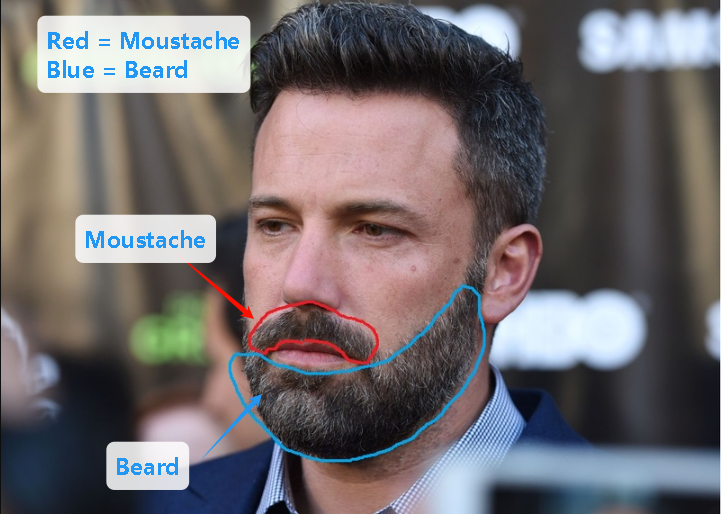
====

Sally: Both! His mustache was very short
and thin 薄的，细的;（毛发）稀疏的, . . . . on the top of his lip.

[.my2]
都有！他的小胡子非常短而且薄……在上嘴唇上。

Paul: un-uh hmmm.. . , like this?

Sally: Yes, that’s the mustache! But the
beard isn’t right, mean, it didn’t cover his
whole face. . . . think it was just on his chin.

[.my2]
是的，就是这样的小胡子！但胡须不对，我的意思是，它没有覆盖他的整个脸……我想它只是在他的下巴上。

Officer: A goatee 山羊胡子? Was it like Paul’s?
Brown:

[.my2]
山羊胡？像保罗的那样吗？

Sally: Ah yes, that’s it, he had a
goatee.........

Paul: Ok, what about sideburns （男子的）鬓角，连鬓胡子? Did he
have sideburns?

[.my1]
.案例
====
- sideburn +
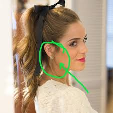
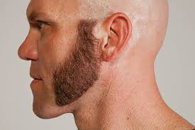
====

Sally: Um, they were long and thick, like  yours!

[.my2]
它们又长又厚，像你的那样！

Paul: Alright, was this the man you saw?

[.my2]
好的，这是你看到的那个人吗？

Sally: Yes, that’s him! Hmmmmm, he looks
a lot like you.

Officer: Hmmm, why yes he does. Paul,
where were you on Friday afternoon?

[.my1]
.案例
====
"Why, yes he does." **这里的 "why" 不是疑问词，而是用作感叹词，表示惊讶、思考或强调。**这种用法在口语和文学作品中很常见。 +
"Why"（感叹词）：表示说话人突然意识到某个事实，带有一点惊讶或思考的意味。可以翻译为：“咦？”
“哎呀？”“诶？”“哎呀，确实是呢！” +
"Yes, he does."（是的，他确实像）

类似用法：

- Why, that’s amazing!（哎呀，那太棒了！）
- Why, I didn’t expect to see you here!（咦？我没想到会在这儿见到你！）
- Why, of course!（哎呀，当然了！）

这种 "Why" + 逗号 + 句子 的结构，通常用于表示惊讶、强调或回忆起某事，在英语对话中很常见。
====

Paul: What? That’s ridiculous 可笑的，荒谬的! It wasn’t me!
I didn’t do anything.

'''

== ■(224) Elementary ‐Global View ‐Crime Scene ( C0224)  +
Detective MeGee: Alright, Officer McGraw, Give it to me straight, what are we looking at here?  +
McGraw: Detective MeGee! We’re glad to see you! We could sure use your expertise on this one. It’s a break-in, but nothing seems to have been stolen. We received a call from the Bear family at around ten thirty this morning. They had gone out for a walk before breakfast and came home to this mess! Broken chairs and porridge all over the place! Apparently, Momma Bear had made the porridge a little too hot, you see, and they were waiting for it to cool down. Detective MeGee: Okay then, let’s start examining the evidence.... Have the forensics team been in yet? McGraw: Yes sir. They found some fingerprints on the bowls and are analyzing them back at the lab as we speak. Hopefully, they will be able to identify the burglar soon. Detective MeGee: Hmmmm,Ah ha! What’s this? A strand of golden hair...... this is a very important piece of trace evidence McGraw. It tells me the suspect has long golden hair....... very few men have long golden hair....... our criminal could be a woman...... McGraw: A woman? Was she working alone? Did she have an accomplice? Detective MeGee: An accomplice? No, no McGraw, she was definitely working alone. See here, there are footprints in the porridge, here on the floor.... footprints, tells me that our suspect is small.... could possibly be a child. McGraw: A child? Surely not, sir... Detective MeGee: We must follow the clues, McGraw! The evidence doesn’t lie! Now, let’s reconstruct the crime...... the suspect came in, sat in each chair breaking the smallest one into little pieces. Next, the porridge. she obviously tried to eat it and because it was so hot, she dropped it on the floor.... this mess. interesting. These footprints seem to lead upstairs. McGraw, did your officers clear the scene? McGraw: Well, there was no one down here... andmaybe we forget to check upstairs. Goldylocks: Hey! What’s with all the noise? I’m trying tosleep up here! Detective MeGee: There she is! Get her!  +
 +
 +

'''

==== ◆(224) Elementary ‐Global View ‐ Crime Scene 犯罪现场 (C0224)

Detective MeGee: Alright, Officer McGraw,
*Give it to me straight* 直截了当地告诉我, what are we looking at
here?

[.my2]
好的，麦格劳警官，直截了当地告诉我，我们在这里看到的是什么？

McGraw: Detective 侦探，警探 MeGee! We’re glad to
see you! We could sure use (v.) your expertise 专业知识；专长 on
this one. It’s a break-in 闯入；入室盗窃, but nothing seems
to have been stolen. We received a call from
the Bear family _at around ten thirty_ this
morning. They had gone out for a walk
before breakfast and came home to this
mess 肮脏，混乱；杂乱! Broken chairs and porridge 燕麦粥，麦片粥 all over the
place! Apparently, Momma 妈妈 Bear had made
the porridge a little too hot, you see, and
they were waiting for it to cool down.

Detective MeGee: Okay then, let’s start
examining the evidence. . . . Have the
forensics team been in yet?

[.my2]
米吉侦探！很高兴见到你！我们这次肯定需要你的专业知识。这是一起入室盗窃案，但似乎没有东西被偷。我们今天早上十点半左右接到了熊一家的电话。他们在早餐前出去散步，回家后看到这团糟！椅子被摔坏，粥洒得到处都是！显然，熊妈妈把粥煮得有点烫，你看，他们在等它凉下来。

Detective MeGee: Okay then, let’s start
examining the evidence. . . . Have the
forensics  辩论术；法医学 team been in yet?

[.my2]
好的，那我们就开始检查证据吧……法医团队已经来过了吗？

McGraw: Yes sir. They found some
fingerprints on the bowls and are analyzing
them back at the lab 实验室 as we speak. Hopefully,
they will be able to identify the burglar 入室行窃者，窃贼 soon.

[.my2]
是的，长官。他们在碗上发现了一些指纹，正在实验室里进行分析。希望他们能很快确认窃贼的身份。

Detective MeGee: Hmmmm,Ah ha! What’s
this? A strand （绳、线、毛发等的）股，缕；串 of golden hair. . . . . . this is a
very important piece of _trace (n.)微量，少许 evidence_ 微量证据
McGraw. It tells me the suspect 嫌疑犯，可疑分子 has long
golden hair. . . . . . . very few men have long
golden hair. . . . . . . our criminal (n.)罪犯 could be a
woman. . . . . .

[.my2]
这是什么？一缕金色的头发……这是一条非常重要的微量证据，麦格劳。它告诉我嫌疑人有长长的金色头发……很少有男人有长长的金色头发……我们的罪犯可能是个女人……

McGraw: A woman? Was she working alone?
Did she have an accomplice 同谋，帮凶?

[.my2]
她是单独作案吗？她有同谋吗？

Detective MeGee: An accomplice? No, no
McGraw, she was definitely working alone.
See here, there are footprints in the
porridge 燕麦粥，麦片粥, here on the floor. . . . footprints,
tells me that our suspect is small. . . . could
possibly be a child.

[.my2]
同谋？不，不，麦格劳，她肯定是单独作案。看这里，粥里有脚印，地板上也有……脚印告诉我，我们的嫌疑人很小……可能是个孩子。

McGraw: A child? Surely not, sir. . .

Detective MeGee: We must follow the
clues 线索，蛛丝马迹, McGraw! The evidence doesn’t lie!
Now, let’s reconstruct 重建；改造；修复；重现 the crime. . . . . . the
suspect came in, sat in each chair breaking 打破；摔碎
the smallest one into little pieces. Next, the
porridge 燕麦粥，麦片粥. she obviously tried to eat it and
because it was so hot, she dropped it on the
floor. . . . this mess. interesting. These
footprints seem to lead (v.) upstairs. McGraw, did
your officers *clear the scene* 清理现场?

[.my2]
孩子？肯定不是，长官…… +
米吉侦探：我们必须追踪线索，麦格劳！证据不会说谎！现在，让我们重构犯罪过程……嫌疑人进来，坐在每把椅子上，把最小的那把摔成了碎片。然后，粥。她显然是想吃它，但因为太烫了，她把它掉在了地上……这团糟。有趣。这些脚印似乎通向楼上。麦格劳，你的警官们清理现场了吗？

McGraw: Well, there was no one down here.
. . and maybe we forget to check upstairs.

Goldy locks <文>头发；锁: Hey! What’s with all the noise?
I’m trying to sleep up here!

[.my2]
楼下没有人……也许我们忘记检查楼上了。 +
金发姑娘：嘿！怎么这么吵？我在楼上睡觉呢！

Detective MeGee: There she is! Get her 抓住她!

'''

== ■(225) Elementary ‐The Weekend ‐Planning A C rime (C0225)  +
Sammy: Alright, let’s run through this one more time from the top. I will be positioned here, across from the bank on this park bench. Now, according to the intel we got from Jimmy...  +
Ralph: ah, who’s Jimmy? Sammy: Jeez Ralph! Pay attention, will ya? Jimmy’s our mole, you know.... the guy on the inside... He’s been snooping and passing on the info to us so we can pull this heist off! Frankie: Yea, Ralph, clean the moth balls outta your ears and listen up. This here is important , you don’t wanna end up back in the slammer, do ya? Your role is pretty important here, we’re depending on you, man. Ralph: Ok, ok! I’m listening! moth balls, hrumph... Sammy: Alright then, .... was I? Oh yeah, ok, so I’ll be the lookout.... here on the bench across from the bank. Nobody moves until I give the go-ahead, Alright? And what’s the goahead? ... Ralph? Ralph: You, umm... ah.... yeah, you’ll take off your hat and scratch your head! Sammy: Right. When I take my hat off and scratch my head, you do what? Ralph: I get in the box. Frankie: Right, you get in the box. I’ll make sure it’s all sealed and then, posing as a delivery guy, I’ll drop off a ‘special package’ for the manager. Now, according to Jimmy, the bank manager is leaving early on Tuesday ’cause it’s his wedding anniversary. He and the wife are having a romantic rendezvous in the country, so any packages delivered will be left unopened in his office until he gets back late on Wednesday.... Sammy: ...... Which gives us access to his office for at least Come hours.... Ralph, this is where you come in.... where are you? Ralph: I’m standing right next to you Sammy, Sorry Sam, I’m in the box. Right there... in that box. Frankie: .... what do you do once I deliver you to the manager’s office? Ralph: I stay in the box until the bank has closed, . I get out of the box. Sammy: .... then? What next, Ralph? Oh for Pete’s sake! This is never going to work. Ralph: Hey, give me a chance here, fellas! I, um, I crack the safe . then, thenI take the money.... then I... ummmmm, I get back in the box. Frankie: ’Atta boy Ralph! In the morning I come back to the bank, say there’s been a  +
 +
mix-up with the delivery I made and take the  +
‘special package’ back here.  +
Sammy: Alright, let’s get some sleep... it’s  +
a big day tomorrow fellas!  +
Frankie: A perfect plan, Sammy! It went off  +
without a hitch!  +
Sammy: Let’s open this up and get Ralph  +
out here so we can start counting the  +
money!  +
Ralph: Phew! I sure am glad to see you  +
guys! I was sure getting lonely with no one  +
to talk.  +
Frankie: That’s nice, ok how much!  +
Ralph: Huh?Uh,, really, really, really glad?  +
Sammy: Money, Ralph! Money!  +
Ralph: Oh man, I knew I forgot something..  +
.....  +
 +
 +
 +
 +

'''

==== ◆(225) Elementary ‐The Weekend ‐ Planning A Crime (C0225)

Sammy: Alright, let’s *run through* 快速过一遍；复习 this one
more time from the top. I will be positioned 放置；确定……的位置
here, *across from the bank* on this park
bench. Now, according to the intel （有关敌对国家的）军事情报 we got
from Jimmy. . .

[.my2]
好的，让我们从头再快速过一遍。我会被安排在这里，银行对面的公园长椅上。现在，根据我们从吉米那里得到的情报……

Ralph: ah, who’s Jimmy?

Sammy: Jeez 哎呀；天哪 Ralph! Pay attention, will ya?
Jimmy’s our mole 鼹鼠；卧底；内线，内奸, you know. . . . the guy on
the inside. . . He’s been snooping  (v.)窥探；打探 and
*passing on* 传递 the info to us /so we can *pull* 成功完成 this
heist（尤指贵重物品的）盗窃，抢劫  *off*!

[.my2]
哎呀，拉尔夫！专心点，好吗？吉米是我们的卧底，你知道的……就是内部的那个人……他一直在打探并把信息传递给我们，这样我们才能成功完成这次抢劫！

[.my1]
.案例
====
- pull off​ : /pʊl ɒf/ (phrasal v.) to succeed in doing something difficult or unexpected. 成功完成.
====

Frankie: Yea, Ralph, *clean (v.) _the moth 飞蛾，蛾 balls_ 卫生球；樟脑球
outta your ears* 把耳朵里的樟脑球清理干净;仔细听；注意听 and listen up. _This here_ is
important , you don’t wanna *end up* 最后成为 back in
the slammer 监狱, do ya? Your role is pretty
important here, we’re depending on you,
man.

[.my2]
是的，拉尔夫，仔细听好了。这很重要，你不想再回到监狱里，对吧？你的角色在这里非常重要，我们都在依赖你，伙计。

[.my1]
.案例
====
.mothball
樟脑丸的英文名字。其实，它叫mothball[ˋmɔθbɔl]。Moth这个词原本是“蛾”的意思，因为樟脑丸主要是用来防衣蛾的，所以在英文中用了这个字。不过，这里的樟脑是指从樟树中提取的物质。原本的樟脑丸应该是用天然樟树提取物制成的，但现在大部分便宜的樟脑丸都是化学合成的。

樟脑丸（英语：Mothball），又称卫生球、卫生丸、防蛀球、臭蛋、臭丸，*是一类用作杀虫剂、除臭剂的球状固体，主要用于防治衣物中的虫害（主要是衣蛾）和防霉。* 樟脑丸得名自"樟树"树干中含有的"樟脑"。

过去的卫生球使用易燃的"萘"(nài) 与"萘酚"，因此又称为萘丸；现在则大部分被对"二氯苯"所取代。

- 成人食入2克"樟脑"即可引发严重中毒，食入4克可致命。 +
- "萘"的致死剂量估计在1-2克左右。
- 对"二氯苯"的毒性较萘低，成人可以承受20克的口服剂量。美国卫生及公共服务部认为，*对"二氯苯"可以“合理推定为致癌物质”。*

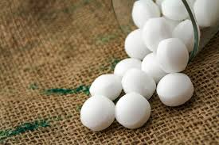

另外，由于现在使用樟脑丸的人不多，这个词也被用来指那些已经收起来不用的东西。用法是bemothballed 或 be put into mothballs。

- The smell of mothballs is very pungent. (樟脑丸的味道很刺鼻。)
- The expensive blender （美）搅拌机；掺和者；混合物 I bought three years ago `谓` has been mothballed. (我三年前买的昂贵果汁机, 已经被束之高阁。)

.This here
这个：指代离说话者较近的某个物体或事物。

.slammer
-> 俚语，来自 slam,关门，猛关，猛摔。
====

Ralph: Ok, ok! I’m listening! moth balls 卫生球；樟脑球,
hrumph. . .

[.my2]
我在听！哼，仔细听……

[.my1]
.案例
====
- hrumph​ : /hrʌmf/ (interj.) an expression of annoyance or dissatisfaction. 哼；唉.
====

Sammy: Alright then, . . . . was I? Oh yeah,
ok, so I’ll be the lookout 放风的人；瞭望者;监视；监视哨；警戒；守望者. . . . here on the
bench across from the bank. Nobody moves
until I give the go-ahead 批准，许可；放行信号, Alright? And what’s
the go-ahead? . . . Ralph?

[.my2]
好的，那么……我刚才说到哪儿了？哦，对了，好的，我会是放风的人……就在银行对面的长椅上。在我发出信号之前，谁都不许动，明白吗？信号是什么？……拉尔夫？

Ralph: You, umm. . . ah. . . . yeah, you’ll
*take off 脱下 your hat* and scratch (v.)（用指甲）挠，轻抓 your head!

[.my2]
你会摘下帽子并挠头！

Sammy: Right. When I *take* my hat *off* and
scratch my head, you do what?

Ralph: I get in 进入 the box.

[.my2]
我进入箱子。

Frankie: Right, you *get in* the box. I’ll make
sure it’s all sealed and then, *posing (v.)佯装；冒充；假扮 as* a
_delivery 递送，投递 guy_ 送货员, I’ll *drop off* 投递；放下;放下，送到 a ‘special package’
for the manager. Now, according to Jimmy,
the bank manager is leaving early on
Tuesday ’cause it’s his wedding anniversary 周年纪念（日）.
He and the wife are having a romantic
rendezvous （尤指秘密的）约会，会面 in the country, so any packages
delivered will be left unopened  未开启的，未打开的 in his office
until he gets back late on Wednesday. . . .

[.my2]
对，你进入箱子。我会确保它被完全密封，然后假扮成送货员，我会为经理投递一个“特殊包裹”。现在，根据吉米的情报，银行经理周二会提前离开，因为那天是他的结婚纪念日。他和妻子会在乡下进行一次浪漫的约会，所以任何投递的包裹, 都会原封不动地留在他的办公室，直到他周三晚回来……

Sammy: . . . . . . Which gives us access to
his office for at least some hours. . . . Ralph,
this is where you come in. . . . where are
you?

[.my2]
这让我们至少有……几个小时可以进入他的办公室……拉尔夫，这就是你发挥作用的地方……你在哪儿？

Ralph: I’m standing right next to you
Sammy, Sorry Sam, I’m in the box. Right
there. . . in that box.

Frankie: . . . . what do you do once I deliver
you to the manager’s office?

Ralph: I stay in the box until the bank has
closed, . I get out of the box.

Sammy: . . . . then? What next, Ralph? Oh
*for Pete’s sake* (用於加強請求的語氣或表示厭煩、驚奇等)看在上帝的份上, 做做好事吧, 請幫幫忙; 天哪, 哎呀! This is never going to work.

[.my2]
看在老天的份上！这永远行不通。

[.my1]
.案例
====
.for Pete's sake
ph.【口】(用於加強請求的語氣或表示厭煩、驚奇等)看在上帝的份上, 做做好事吧, 請幫幫忙; 天哪, 哎呀 +
- For Pete's sake, stop that whining! 看在上帝的份上, 別號叫了！ +
- For Pete's sake! How can you be so stupid? 天哪！你怎麼這麼笨哪？
====

Ralph: Hey, give me a chance here, fellas 伙伴，小伙子! I,
um, I crack 破裂；裂开；断裂;砸开；破开 the safe. then I take the
money. . . . then I. . . ummmmm, I get back
in the box.

[.my2]
嘿，给我个机会，伙计们！我，嗯，我打开保险箱，然后，然后我拿走钱……然后我……嗯，我回到箱子里。

Frankie: ’_Atta boy_ 好样的 Ralph! In the morning I
come back to the bank, say there’s been a
mix-up 混乱；杂乱 with the delivery I made /and take the
‘special package’ back here.

[.my2]
好样的，拉尔夫！早上我会回到银行，说我投递的包裹出了点问题，然后把“特殊包裹”带回来。

Sammy: Alright, let’s get some sleep. . . it’s
a big day tomorrow fellas!

[.my2]
我们去睡一会儿……明天是个大日子，伙计们！ +

Frankie: A perfect plan, Sammy! It *went off
without a hitch* 临时故障，小问题；（某种）结!

[.my2]
完美的计划，萨米！它进行得非常顺利！

[.my1]
.案例
====
- went off without a hitch​ : /wɛnt ɒf wɪðˈaʊt ə hɪtʃ/ (phrase) to happen smoothly without any problems. 顺利进行；毫无障碍.
====

Sammy: Let’s *open this up* and get Ralph
out here so we can start counting the
money!

[.my2]
让我们打开这个，把拉尔夫弄出来，这样我们就可以开始数钱了！

Ralph: Phew! I sure am glad to see you
guys! I was sure getting lonely with no one
to talk.

[.my2]
我真的很高兴见到你们！没人说话，我真的很孤独。

Frankie: That’s nice, ok how much!

Ralph: Huh? Uh,, really, really, really glad?

Sammy: Money, Ralph! Money!

Ralph: Oh man, I knew I forgot something. .
. . . . .

'''

== ■(226) Elementary ‐Global View ‐Fundraiser (C 0226)  +
A: Ok Mark, it’s your turn to ring the doorbell. I did it last time.  +
B: I hate going door to door, and I hate asking for money.  +
A: But we need to raise enough money for the school fundraiser so that our class can win the pizza party! You do want to have a pizza party, don’t you?  +
B: Yes, but...  +
A: Just go already!  +
B: No one’s coming.  +
A: Try again.  +
B: Maybe there’s no one home.  +
A: Of course there’s someone home! There are two cars in the driveway and I see lights on in the house! Hello! Anybody home? We would like to know if you want to sponsor us in our school fundraiser. Fifty percent of the profits go towards the new school playground!  +
B: I don’t know why anyone would want what’s in this catalog anyway. It’s just a bunch of tacky Christmas ornaments, Cd’s of old people singing Christmas songs, and special crackers and cheeses and boxes of chocolates.  +
A: You don’t like chocolates?  +
 +
B: Not this kind. They’ve got weird names like ganache and praline.  +
A:  +
Look! I just saw someone walking around inside! These people are being very rude!  +
 +
A:  +
Finally, someone’s coming!  +
 +
 +
B: They don’t look too happy.  +
A: Hi, sir. Would you like to sponsor us or make a donation to.  +
C: What grade are you kids in?  +
A: Grade seven.  +
C: Then for goodness sake, don’t you see this sign? Can’t you read?  +
A: No soliciting.  +
B: What does that mean?  +
A: No idea.  +
 +
 +
 +

'''

==== ◆(226) Elementary ‐Global View ‐ Fundraiser 资金筹集人；资金筹集活动 (C0226)

A: Ok Mark, it’s your turn (n.)轮到的机会 to ring (v.) the doorbell 按门铃. I did it last time.

B: I hate *going (v.) door to door* 挨家挨户地拜访, and I hate asking for money 要钱.

A: But we need to raise 筹集 enough money for the school fundraiser 资金筹集活动 *so that* our class can win (v.) the pizza party 披萨派对! You do want to have a pizza party, don’t you?

B: Yes, but…

A: *Just go* already (ad.)<美，非正式>马上，够了（用于表达不耐烦或气恼）!

B: No one’s coming 没人来(开门).

A: Try again.

B: Maybe there’s no one home.

A: Of course there’s someone home! There are two cars in the driveway 车道 and I see lights on in the house! Hello! Anybody home? We would like to know /if you want to sponsor (v.)赞助 us in our school fundraiser 资金筹集人；资金筹集活动. Fifty percent of the profits 利润 *go (v.) towards* 用于支付…的部分款项；作为对…的部分付款;为……做出贡献 the new school playground 操场!

[.my1]
.案例
====
.go towards sth
to be used as part of the payment for sth 用于支付…的部分款项；作为对…的部分付款
• +
The money will *go towards* a new car. 这笔钱将用于支付新车的部分款项。
====

B: I don’t know why anyone would want (v.) what’s in this catalog 目录 anyway. It’s just _a bunch 束，串，扎 of_ tacky (a.)俗气的；发黏的 Christmas ornaments 圣诞装饰品, Cd’s 激光唱片 of old people singing (v.) Christmas songs, and special crackers 饼干 and cheeses /and boxes of chocolates 巧克力.

[.my1]
.案例
====
- tacky -> adj. (胶水,油漆或其他物质)发黏的;没有全干的 18世纪产生于tack“联接”的语义 词根词缀： -tack-钉,扣件 + -y形容词词尾
====

A: You don’t like chocolates?

B: Not this kind. They’ve got _weird (a.)奇怪 names_ (n.) like ganache 奶油巧克力甜浆 and praline 果仁糖（胡桃糖果的一种）.

[.my1]
.案例
====
.ganache
(n.) a smooth mixture of chocolate and cream, used in cakes, truffles, and chocolates 奶油巧克力甜浆 +
甘纳许（法语：ganache）是一种由巧克力和鲜奶油组成的一种柔滑的奶油，主要用于夹心巧克力的软心, 和一些糕点之用，在法语中原意是咒骂词“笨蛋”。

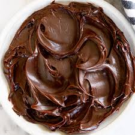
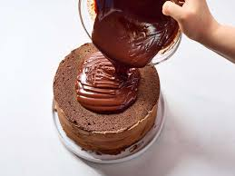

.praline
N-UNCOUNT : Praline is a sweet substance made from nuts cooked in boiling sugar. It is used in desserts and as a filling for chocolates. 干果糖; 果仁糖 +
来自法国17世纪糖业家Marshal de Plessis-Praslin,其厨师发明了这种果仁糖的配方，后拼写俗化为praline.该名字实际上为他的称号，他早年从军，官封元帅，Plessis-Praslin为法国地名。

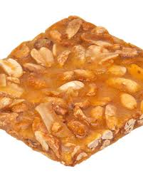
====

A: Look! I just saw someone *walking around* 四处走动 inside! These people are being very rude 无礼的!

A: Finally, someone’s coming!

B: They don’t look too happy.

A: Hi, sir. Would you like to sponsor (v.)us /or make a donation 捐赠 to.

C: What grade are you kids in?

A: Grade seven.

C: Then *for goodness sake* (利益，好处) 看在老天的份上, don’t you see this sign? Can’t you read?

A: No soliciting (索求，请求…给予（援助、钱或信息）；征求；筹集;招徕（嫖客）；拉（客）) 禁止推销.

[.my1]
.案例
====
.solicit
(v.) *~ sth (from sb) |~ (sb) (for sth)* : ( formal ) to ask sb for sth, such as support, money, or information; to try to get sth or persuade sb to do sth索求，请求…给予（援助、钱或信息）；征求；筹集 +
[ VN] +
•They were planning to solicit funds from a number of organizations.他们正计划向一些机构募集资金。 +
•Historians and critics are solicited for their opinions.人们向历史学家和批评家征求意见。

[ V] +
•to solicit for money筹款

-> 来自拉丁语 sollicitare,打扰，麻烦，刺激，煽动，来自 sollus,整个的，全部的，*词源同 solid,-cit, 召唤，使兴奋，词源同 cite,excite.后引申词义请求，恳求，以及俚语词义招嫖，拉客等。*

image:../img/soliciting.avif[,45%]
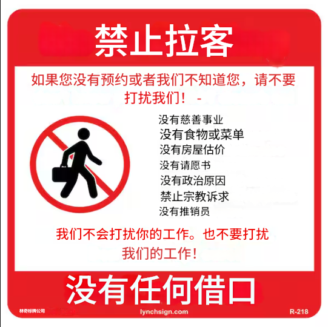
====

B: What does that mean?

A: No idea 不知道.

[.my2]
A: 马克，轮到你按门铃了，上次是我按的。 +
B: 我讨厌挨家挨户敲门，也讨厌要钱。 +
A: 但我们需要为学校筹款活动筹集足够的钱，这样我们班才能赢披萨派对！你确实想要披萨派对吧？ +
B: 是，但是…… +
A: 快去！ +
B: 没人应门。 +
A: 再试一次。 +
B: 可能没人在家。 +
A: 肯定有人！车道上有两辆车，屋里还亮着灯！有人吗？您愿意赞助我们的学校筹款活动吗？利润的50%会用于新操场！ +
B: 我不懂为什么会有人想要目录里的东西，全是俗气的圣诞装饰、老人唱圣诞歌的CD，还有特制饼干、奶酪和巧克力。 +
A: 你不喜欢巧克力？ +
B: 这种不喜欢，名字怪怪的，比如甘纳许和果仁糖。 +
A: 看！屋里有人走动！这些人真没礼貌！ +
A: 终于有人来了！ +
B: 他们看起来不太高兴。 +
A: 先生，您愿意赞助或捐赠吗？ +
C: 你们几年级？ +
A: 七年级。 +
C: 天啊，没看到牌子吗？禁止推销！ +
B: 这是什么意思？ +
A: 不知道。 +

'''

== ■(227) Elementary ‐Daily Life ‐Wedding Plannin g (C0227)  +
A: Trina, will you marry me?  +
B: Yes! Yes! And yes! Jared of course I’ll marry you!  +
A: Oh Babe, I can’t wait to spend the rest of my life with you! I can’t wait for all the adventures we’re going to have, for all the fights and the laughter. I can’t wait to grow old and wrinkly with you.  +
B: Oh Jared! I can’t wait for our wedding! I hope you don’t mind, but I’ve already chosen a date! Six months from now in the summer! Melissa saw you buying the ring last month so I’ve had plenty of time to start planning!  +
A: She what?  +
B: Oh don’t worry sweetie, I didn’t know when you were going to propose. It was still a nice surprise! As I was saying, I’ve got it all planned out. There’s almost nothing left to do! I wrote up our guest list and we will have roughly four hundred guests attending.  +
A: four hundred?  +
B: No need to sweat it. My parents agreed to pay for most of the wedding, which is going to be low budget anyway. So roughly four hundred people, which means that the hall at Northwood Heights will be our reception venue. I thought it would be nice if we had the wedding at your parents’ church and my uncle of course would be officiating. We’ll meet with him soon for some pre-wedding counseling. The music for the wedding ceremony was a no-brainer. My step-sister and her string quartet will take care of that. My cousin will be the official photographer. I thought it would also be nice if his daughter could sing a solo. Did you know that she’s going to be a professional opera singer?  +
A: Ah...  +
B: And then of course the ladies at the church would love to be our caterers for the banquet and we’ll get the Youth Group to serve us. I was thinking that your friend’s band could be our entertainment for the night. though they might have to tone it down a bit. Or we could hire a DJ. Your sister’s husband could get us a discount with that company that does the decor at weddings. What’s their name again? I was thinking that we could have an island paradise-themed wedding and our theme color would be a soothing blue like Aquamarine. And there will be a huge seashell on the wall behind the podium where we’ll make our toasts! What do you think of small packages of drink mixes for our wedding favors? Who else am I missing? Oh, your uncle could be our florist and his wife could make our wedding cake!  +
A: Wow.  +
B: See? It’s going to be wonderful! Oh this wedding is going to be everything I ever dreamed of.  +
A: If I survive the next six months.  +
 +
 +

'''

==== ◆(227) Elementary ‐Daily Life ‐ Wedding Planning (C0227)

A: Trina, will you marry (v.) me 嫁给我?

B: Yes! Yes! And yes! Jared of course I’ll marry you!

A: Oh Babe, I can’t wait to spend the rest of my life 度过余生 with you! I can’t wait for all the adventures 冒险 we’re going to have, for all the fights 争吵 and the laughter 欢笑. I can’t wait to grow old 变老 and wrinkly (a.)有皱纹的 with you.

B: Oh Jared! I can’t wait for our wedding 婚礼! I hope you don’t mind, but I’ve already chosen a date 选好日期! Six months from now in the summer! Melissa saw you buying the ring 戒指 last month /so I’ve had plenty of time 充足时间 to start planning!

A: She what?

B: Oh don’t worry sweetie (n.)爱人，情人;亲爱的, I didn’t know when you were going to propose (v.)求婚. It was still a nice surprise! As I was saying, I’ve got it all planned out 计划好了. There’s almost nothing left to do! I *wrote up* （利用笔记等）详细写出 our guest list 宾客名单 and we will have roughly 大约 four hundred guests attending 参加.

A: four hundred?

B: No need to sweat (v.)流汗，出汗;担心；焦虑；不安 it 别担心. My parents agreed (v.) *to pay for* most of the wedding 婚礼，结婚庆典, which is going to be low budget 低预算 anyway.  +
So roughly four hundred people, which means that `主` the hall at Northwood Heights 高地；高处；高位 `谓` will be our _reception (n.)接待处，服务台；欢迎会，招待 venue_ (（事件的）发生地点，（活动的）场所) 接待场地. I thought (v.) it would be nice /if we had the wedding at your parents’ church 教堂 /and my uncle *of course* would be officiating (v.)主持（仪式）；履行职务. We’ll meet with 遇见，会见 him soon for some pre-wedding counseling 婚前辅导.  +
The music for the wedding ceremony 婚礼仪式 was a no-brainer (n.)不用动脑的事;无需用脑的事；容易作的决定；愚蠢的人（或行为）.  My step-sister 继姐妹 and her _string quartet_ (n.四重奏；四重唱；四件一套) 弦乐四重奏 will *take care of* 处理，办理;照顾，照料 that.  +
My cousin will be the official photographer 摄影师.  I thought it would also be nice /if his daughter could sing (v.) a solo 独唱. Did you know that she’s going to be a professional opera singer 歌剧演员?

[.my1]
.案例
====
.venue
-> 来自拉丁语 venire,来，来自 PIE*gwa,来，往，词源同 come,acrobat,advent.

.I thought it would be nice /if we had the wedding at your parents’ church.
虚拟语气结构：用过去式（had）表示对未来的假设。

.step-sister
not your parents' daughter, but the daughter of a person one of your parents has married. Compare. half-sister.  +
不是你父母的女儿，而是你父母之一娶的人的女儿。比较。同父异母的姐妹。

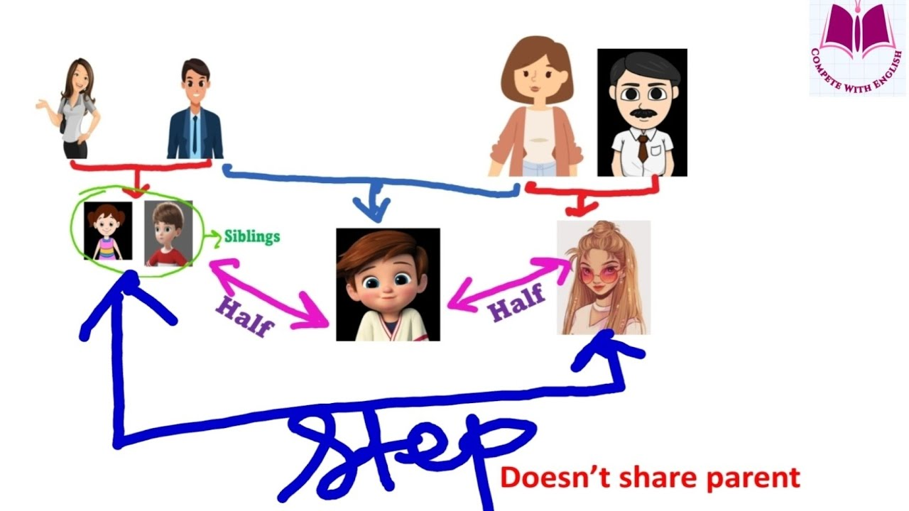

"stepsister" 和 "half-sister" 都可以翻译为“继姐妹”或“同父异母/同母异父的姐妹”，但它们的区别在于血缘关系：

[.my3]
[options="autowidth" cols="1a,1a"]
|===
|Stepsister（继姐妹）: #与你没有血缘关系。# |Half-sister（同父异母/同母异父的姐妹）: #与你有一半的血缘关系。#

|"继姐妹"是由于父母再婚, 而产生的姐妹关系。例如：

- *你的爸爸再婚，继母带来了她的女儿，这个女孩就是你的 stepsister，但你们没有血缘关系。* +
- *你的妈妈再婚，继父带来了他的女儿，她也是你的 stepsister。*

|Half-sister 指的是你和她有一个共同的亲生父母。例如：

- 你们的爸爸相同，但妈妈不同（同父异母）。
- 你们的妈妈相同，但爸爸不同（同母异父）。
|===

简单来说：

Stepsister → 与你没有血缘关系，她在你父或母再婚之前, 就已经诞生了。
Half-sister → 与你有一半血缘关系，共享一个生父或生母。

.string quartet
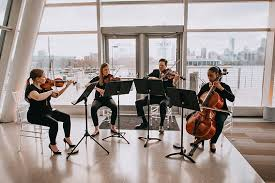
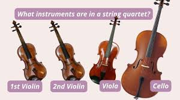

弦乐四重奏既是一种音乐演奏形式（*由四把弦乐器负责，通常是二把小提琴，一把中提琴, 和一把大提琴*)，也指一种曲类。

它还有许多变体, 如:  +
三把小提琴 + 一低音提琴 +
小提琴 + 中提琴 + 大提琴 + 吉他

钢琴四重奏: 用钢琴代替弦乐四重奏中的一把小提琴。 +
钢琴五重奏: 即弦乐四重奏 + 钢琴
====

A: Ah…

B: And then of course `主` the ladies 女士 at the church `谓` would love to be our caterers 餐饮承办人;包办伙食的人，（尤指职业的）酒席承办人，提供饮食及服务的人 for the banquet 宴会 /and we’ll get the Youth Group 青年团体 to serve us.  +
I was thinking that /your friend’s band 乐队  could be our entertainment 娱乐节目 for the night. though they might have to *tone (v.)使（讲话、意见等）缓和；使温和 it down* 低调一点 a bit. Or we could hire(v.) a DJ.  +
Your sister’s husband could get us a discount 折扣 with that company 后定 that does (v.) the decor 装饰 at weddings. What’s their name again 他们叫什么名字来着?  +
I was thinking that /we could have an island _paradise 天堂，天国；乐土- themed_ 海岛主题的 wedding /and `主` our _theme color_ 主题色  `谓` would be a soothing blue 舒缓的蓝色 like Aquamarine 海蓝宝石. And there will be a huge seashell 海贝，贝壳；海贝壳;海螺 on the wall behind the podium 讲台 where we’ll make our toasts (干杯，祝酒，敬酒) 祝酒!  +
What do you think of small packages of _drink mixes_ 饮料混合粉,饮料包 for our _wedding favors_ 婚礼回礼 (如喜糖等) ?  +
Who else am I missing? Oh, your uncle could be our florist 花商 /and his wife could make our wedding cake 婚礼蛋糕!

[.my1]
.案例
====
.tone (v.) sth←→ˈdown
(1)to make a speech, an opinion, etc. less extreme or offensive 使（讲话、意见等）缓和；使温和 +
•The language of the article will have to be toned down for the mass-market. 这篇文章的措辞必须缓和一下以适合大众市场。 +
(2)to make a colour less bright 使（颜色）柔和

.Aquamarine
-> 词根aqua, 水。词根mar, 海，见mermaid, 美人鱼(海少女）。 +
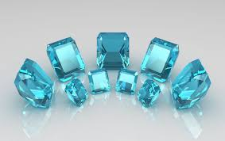

.seashell
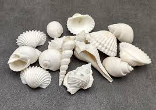

.drink mixes
饮料混合粉：饮料混合粉是一种加工食品产品，通常与水混合，制成口味类似于果汁或苏打水的饮料。另一种类型的饮料混合粉, 是与牛奶混合的产品。它通常以粉末形式制成（粉状饮料混合粉），但现在也有液体形式。

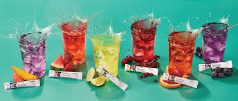

.wedding favors
一种在婚礼上分发给宾客的小礼物，通常是糖果或其他小物品，用以表示新人对宾客的感谢和祝福。

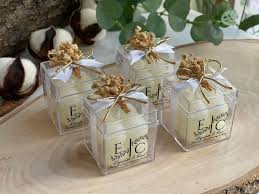

====

A: Wow.

B: See? It’s going to be wonderful! Oh this wedding is going to be everything I ever dreamed of 梦寐以求的.

A: If I survive 熬过 the next six months.

[.my2]
A: 崔娜，你愿意嫁给我吗？ +
B: 愿意！愿意！当然愿意！贾里德，我当然会嫁给你！ +
A: 宝贝，我等不及要和你共度余生了！等不及要一起冒险、争吵、欢笑，一起变老变皱！ +
B: 贾里德！我等不及我们的婚礼了！希望你别介意，我已经选好了日期——六个月后的夏天！梅丽莎上个月看到你买戒指，所以我有足够时间计划！ +
A: 她看到了？ +
B: 别担心，亲爱的，我不知道你何时求婚，但还是很惊喜！我已经计划好了，几乎没剩什么事！我拟好了宾客名单，大约400人参加。 +
A: 四百人？ +
B: 别担心，我父母会承担大部分费用，而且预算很低。所以选诺斯伍德高地的礼堂作接待场地。我想在你父母的教堂办婚礼，由我叔叔主持，很快会和他做婚前辅导。音乐不用操心，我继姐的弦乐四重奏负责，表弟当摄影师，他女儿可以独唱——她以后要当歌剧演员！ +
A: 啊…… +
B: 教堂的女士们负责宴会餐饮，青年团来服务。你朋友的乐队可以表演，但要低调点，或者请DJ。你姐夫能帮我们找婚庆装饰公司打折。名字叫什么来着？我想办海岛主题婚礼，主题色是海蓝宝石蓝，讲台后墙挂大海螺，用来祝酒！你觉得饮料包当回礼怎么样？还有你叔叔当花商，他妻子做蛋糕！ +
A: 哇。 +
B: 看，一切都会完美！这就是我梦寐以求的婚礼！ +
A: 如果我能熬过这六个月的话。 +

'''

== ■(228) Elementary ‐The Weekend ‐Going to the Beach (C0228)  +
A: Oh, George, what a beautiful day it is today! The sun is hot and there are just a few clouds scattered here and there! What a perfect day to be at the beach! The kids are going to have so much fun! And we’ll be able to relax in the sun while they’re playing.  +
B: It does seem like the perfect day! I’m glad we chose to get out of the city and enjoy the nice weather! This looks like the perfect spot! Ok kids, put on your sunscreen while your mom and I set up camp. Here, Mary, help me lay down these beach towels.  +
 +
A: There we go. Can you help me with the umbrella? Perfect.  +
B: Ok kids, here’s a beach ball and a Frisbee, a pail and a shovel. I want to see an impressive sandcastle by the time we leave. Don’t stray too far. Wait! Leave your sandals here or put on your wet shoes.  +
A: And stay in the shallow area. I don’t want to see you go any farther than that sandbar! It’s too deep out there and we didn’t bring your floaties.  +
B: You’re back already? The water was too cold, huh? I’ll tell you a secret. Do you see that small pool of water over there? It’ll be warmer in there. Go see if you can find some seashells or catch some minnows.  +
A: What is that? A jellyfish? Jeremy, put that down right now! It could sting you!  +
B: Ah! Not onme! Ow!  +
 +
 +
 +

'''

==== ◆(228) Elementary ‐The Weekend ‐ Going to the Beach (C0228)

A: Oh, George, what a beautiful day 美好的一天 it is today! The sun is hot  and there are just a few clouds  scattered 散落 here and there! What a perfect day to be at the beach 海滩! The kids are going to have so much fun 玩得开心! And we’ll be able to relax 放松 in the sun while they’re playing.

B: It does seem like the perfect day! I’m glad we chose to get out of the city 离开城市 and enjoy the nice weather 好天气! This *looks like* the perfect spot 地点! Ok kids, put on your sunscreen 防晒霜 while your mom and I set up camp 搭帐篷. Here, Mary, help me *lay down* 铺设 these beach towels 沙滩毛巾.

A: There we go 好了，就这样，就这么办. Can you help me with the umbrella 遮阳伞? Perfect.

B: Ok kids, here’s a beach ball 沙滩球 and a Frisbee 飞盘, a pail 桶 and a shovel 铲子. I want to see an impressive sandcastle 沙堡 by the time we leave. Don’t stray (v.)迷路；偏离；走失 too far 别走太远. Wait! Leave your sandals 凉鞋 here /or put on your _wet shoes_ 水鞋,湿鞋.

[.my1]
.案例
====
- Frisbee +
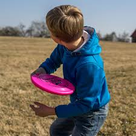

- pail +
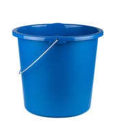

- shovel +
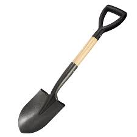

- water shoes +
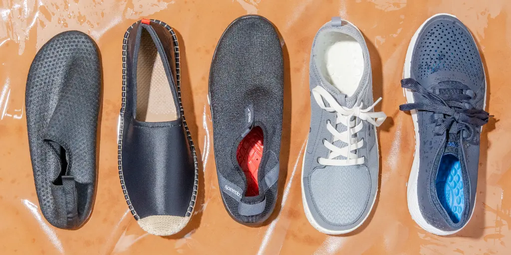
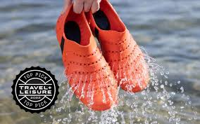

====

A: And stay in the shallow area 浅水区. I don’t want to see you go any farther *than* that sandbar 沙洲；沙堤! It’s too deep 深 out there /and we didn’t bring your floaties 浮水圈.

[.my1]
.案例
====
- sandbar +

.It’s too deep out there
这个句子中，*"out" 用来表示方向或距离，强调“那片远一点的区域”比说话人所在的地方更远。*

比较 "It’s too deep out there" 和 "It’s too deep there"

[.my3]
[options="autowidth" cols="1a,1a"]
|===
|It’s too deep out there.|It’s too deep there.

|"out there" 表示远离说话人的某个地方，通常指水域、野外、开放空间等。 +
在这里，**"out" **让听者更清楚地知道危险的水域**是在远处，而不是当前站立的地方。** +
例如，你站在浅水区，指着**远处的**沙洲后面说：“那边水太深了。”
|*"there" 只是一个一般性的地点指示词，没有明确的方向或距离感。* +
听起来更像是“那里很深”，*但不一定强调它在远处。* +
|===

总结 +
- "It’s too deep out there." → 强调“远处”水太深，不要游过去（更自然、更符合语境）。 +
- "It’s too deep there." → 只是陈述某个地方很深，没有强调它在远处。
====

B: You’re back already? The water was too cold, huh? I’ll tell you a secret 秘密. Do you see that small _pool of water_ 水池 over there? It’ll be warmer in there. Go see if you can find some seashells 贝壳 or catch some minnows 小鱼；鲰.

[.my1]
.案例
====
- minnow +
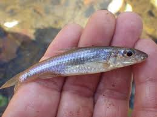

====

A: What is that? A jellyfish 水母? Jeremy, put that down right now! It could sting (v.)蜇 you!

B: Ah! Not on me! Ow!

[.my2]
A: 乔治，今天天气真好！阳光明媚，只有几朵云散落各处！去海滩再合适不过了！孩子们会玩得很开心！我们也能在他们玩耍时晒太阳放松。 +
B: 确实是个完美日子！很高兴我们离开城市来享受好天气！这地方真不错！孩子们，涂好防晒霜，我和妈妈搭帐篷。玛丽，帮我铺沙滩毛巾。 +
A: 好了，帮我弄下遮阳伞？完美。 +
B: 孩子们，这是沙滩球、飞盘、桶和铲子，走之前我要看到一座漂亮的沙堡！别走太远！等等！把凉鞋留这儿或穿上湿鞋。 +
A: 待在浅水区，别越过沙洲！那边水太深，我们没带浮水圈。 +
B: 这么快就回来了？水太冷了吧？告诉你个秘密，看到那边的小水池了吗？那里更暖和，去找贝壳或抓小鱼吧。 +
A: 那是什么？水母？杰里米，快放下！它会蜇你！ +
B: 啊！别蜇我！嗷！ +

'''

== ■(229) Elementary ‐Daily Life ‐Buying Men’s Sh oes (C0229)  +
Mom: Hi! I am looking for a pair of shoes for my son.  +
Salesgirl: Sure thing! Here we are! If you’re looking for dress shoes, we have several different styles of Oxfords for boys. We also carry athletic shoes, hiking boots. Mom: Oh Jacob, how about these sneakers? Jacob: Mom? They’ve got Velcro. Mom: Well, then how about these? What is this style called? Salesgirl: They’re tennis shoes. They’re very popular with teens and young adults. Jacob: Oooo, Mom, can I get these? Mom: What are those? Jacob: They’re Chuck Taylor’s! Everyone has them! Can I, please? Mom: I don’t know. Would they go with your clothes? The backs are really high. and the way the tongue just sticks up. They’re almost like a boot. And the sole doesn’t look like it would have a very good grip.  +
Jacob: They’re only forty-five dollars! And  +
they’ve got cool fluorescent orange  +
shoelaces! Mom?  +
Mom: Ok, try them on.  +
Salesgirl: What size are your feet?  +
Mom: He is a size nine.  +
Salesgirl: We’ll try a size forty-three on you  +
first and see how that fits.  +
Mom: A what?  +
Salesgirl: They come in European sizes. He  +
should be a size forty-three. I’ll be right  +
back.  +
 +
 +
 +

'''

==== ◆(229) Elementary ‐Daily Life ‐ Buying Men’s Shoes 男士运动鞋 (C0229)

Mom: Hi! I am looking for a pair of shoes 一双鞋 for my son.

Salesgirl: Sure thing 一定会成功的事情；肯定会发生的事情! Here we are! If you’re looking for _dress shoes_ 正装鞋, we have several different styles of Oxfords 牛津鞋 for boys. We also carry _athletic 运动的，体育的 shoes_ 运动鞋, _hiking 徒步旅行，远足 boots_ 登山靴.

[.my1]
.案例
====
.shoes
因為鞋子一般都是穿兩隻，所以基本上都是用複數形式「shoes」。 +
鞋子基本上都是左右各一隻，因此計量單位是「a pair of shoes」（一雙鞋）。

・I’d like to get *a new pair of shoes*.
（我想要買一雙新鞋。） +
・Where’s my doll’s other shoe? *She’s missing a shoe*!
（我洋娃娃的另一隻鞋子在哪裡？它有一隻鞋子不見了！） +
・We’re running out of time! *Put your shoes on*, my dear!
（快沒時間了！快把鞋子穿上，親愛的。） +
・We’re home now. *Take off your shoes*!
（到家了，把鞋子脫掉！）

- dress shoes : 正式鞋：男士在正式场合穿的皮鞋，或女士在正式场合穿的高跟鞋。 +
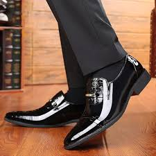

另外，各種款式的鞋子, 可以統稱做「footwear」、「footgear」。

- Oxfords +
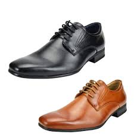

- hiking boots +
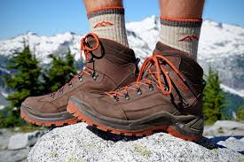
====

Mom: Oh Jacob, how about these sneakers 胶底运动鞋?

[.my1]
.案例
====
- sneakers 运动鞋；卑鄙者；鬼鬼祟祟做事的人 +
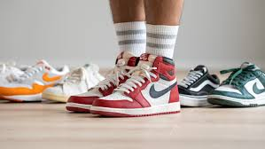
====

Jacob: Mom? They’ve got Velcro 魔术贴，尼龙搭扣；维克罗（尼龙粘扣商标名）.

[.my1]
.案例
====
- Velcro +
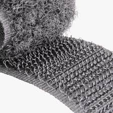
====

Mom: Well, then *how about* these? What is this style called?

Salesgirl: They’re _tennis shoes_ 网球鞋. They’re very popular with teens and young adults.

Jacob: Oooo, Mom, can I get these?

Mom: What are those?

Jacob: They’re Chuck Taylor’s 匡威鞋! Everyone has them! Can I, please?

[.my1]
.案例
====
- Chuck Taylor : 切克·泰勒（Chuck Taylor）：是一种由美国运动品牌Converse推出的帆布鞋系列，以其低帮、帆布材质和星形标志而闻名。 +
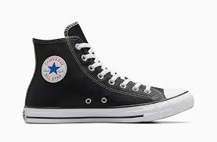
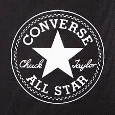

====

Mom: I don’t know. Would they *go with* 与……相配 your clothes 搭配你的衣服? The backs are really high. and the way the tongue 鞋舌 just *sticks up* 竖立；向上突出. They’re almost like a boot 靴子. And the sole 鞋底 doesn’t look like it would have a very good grip 抓地力.

Jacob: They’re only forty-five dollars! And they’ve got cool fluorescent (a.)（物质）有荧光的，发荧光的 orange shoelaces (鞋带) 荧光橙色鞋带! Mom?

[.my1]
.案例
====

- fluorescent shoelaces +
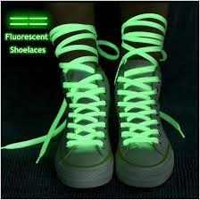
====
Mom: Ok, try them on 试穿.

Salesgirl: What size are your feet?

Mom: He is a size nine.

Salesgirl: We’ll try a size forty-three on you first /and see how that fits (v.)) 合不合脚.

Mom: A what?

Salesgirl: They *come in* 有（某种尺寸、颜色、款式等可选） European sizes 欧洲尺码. He should be a size forty-three. I’ll be right back 我马上就回来.

[.my1]
.案例
====
这里的 come in 意思是“有（某种尺寸、颜色、款式等可选）”。在这个句子中，They come in European sizes. 意思是 “这些鞋是按欧洲尺码划分的。” 或 “这些鞋有欧洲尺码。” +
在购物或产品描述中，come in + 选项 常用于表示某个产品有不同的规格、尺寸、颜色等，例如：

- These shoes come in three colors: black, white, and blue.（这些鞋有三种颜色：黑色、白色和蓝色。）
- Does this dress come in a larger size?（这条裙子有更大的尺码吗？）
====

[.my2]
妈妈：你好！我想给儿子买双鞋。 +
售货员：好的！这边！如果要正装鞋，我们有几种男孩牛津鞋，还有运动鞋和登山靴。 +
妈妈：雅各布，这双运动鞋怎么样？ +
雅各布：妈？这是魔术贴的。 +
妈妈：那这双呢？这是什么款式？ +
售货员：网球鞋，很受青少年欢迎。 +
雅各布：哦，妈妈，我能买这双吗？ +
妈妈：这是什么？ +
雅各布：匡威鞋！大家都穿！能买吗？ +
妈妈：我不知道，这双鞋能搭配你的衣服吗？鞋帮太高，鞋舌翘着，像靴子，鞋底看起来抓地力不太好。 +
雅各布：只要45美元！还有荧光橙色鞋带！妈妈？ +
妈妈：好吧，试试吧。 +
售货员：他穿几码？ +
妈妈：9码。 +
售货员：先试43码，看看合不合脚。 +
妈妈：什么？ +
售货员：这是欧洲尺码，他应该穿43码，我马上回来。 +

'''

== ■(230) Elementary ‐The Weekend ‐Gardening ( C0230)  +
A: I’ve decided to grow my own garden!  +
B: What? You don’t know the first thing about gardening!  +
A: On the contrary, I have been reading a lot of books about the subject.  +
B: Oh yeah? Tell me then, smarty pants, how will you go about setting up your garden?  +
A: Well, first I need to buy some things, such as fertilizer, seeds and tools.  +
B: What type of tools?  +
A: You know, the basics. A rake, shovel, spade and a hoe.  +
B: Right. Well it seems like you have all your bases covered. What’s next?  +
A: I’ll till the soil and then sow the seeds. I’ll then add some fertilizer and voila! Gardening all done!  +
B: Well, good luck with your garden, especially considering we are inthe dry season and it won’t rain for the next three months!  +
 +
 +

'''

==== ◆(230) Elementary ‐The Weekend ‐ Gardening (C0230)

A: I’ve decided to grow my own garden 花园；菜园；果园！

B: What? You don’t know the first thing about gardening 园艺；园艺学！

A: On the contrary 正相反；恰恰相反, I have been reading a lot of books about the subject 主题；话题；科目.

B: Oh yeah? Tell me then, _smarty pants_ (裤子;<英，非正式> 废物，劣质品) 自以为聪明的人, how will you *go about* 着手做；开始做;处理（问题或任务） setting up 设立 your garden?

A: Well, first I need to buy some things, such as fertilizer 肥料, seeds 种子 and tools 工具.

B: What type of tools?

A: You know, the basics 基础；基本要素. A rake 耙子, shovel 铲子, spade 铁锹 and a hoe 锄头.

B: Right. Well *it seems like* you have all your bases covered (v.)考虑周全；准备充分. What’s next?

A: I’ll till (v.)耕作；犁地 the soil 土壤；土地 and then sow (v.)播种；撒种 the seeds. I’ll then add (v.) some fertilizer /and voila 瞧；可不是, 那就是！ Gardening 园艺 all done!

[.my1]
.案例
====
- till -> 来自古英语 til,朝向，直到，来自 Proto-Germanic*til,朝向，直到，来自 Proto-Germanic*tilan, 努力，终点，目标，可能来自 PIE*do,表方向，朝向，词源同 to.引申词义耕地，犁地。
====

B: Well, good luck with your garden, especially considering we are in the dry season 旱季 and it won’t rain (v.) for the next three months!

[.my1]
.案例
====
- go about : /ɡəʊ əˈbaʊt/ (phrasal verb) To start to do something. 着手做；开始做.
Example: "How should I go about finding a new job?"
 我该如何开始找新工作？
====

[.my2]
A: 我决定自己种一个花园！ +
B: 什么？你对园艺一窍不通！ +
A: 恰恰相反，我读了很多关于这个主题的书。 +
B: 哦是吗？那告诉我，自以为聪明的家伙，你打算怎么开始建你的花园？ +
A: 嗯，首先我需要买一些东西，比如肥料、种子和工具。 +
B: 什么类型的工具？ +
A: 你知道的，基本的东西。耙子、铲子、铁锹和锄头。 +
B: 对。看来你已经考虑周全了。接下来呢？ +
A: 我会先耕地，然后播种。接着我会加一些肥料，瞧！园艺就完成了！ +
B: 嗯，祝你的花园好运，尤其是考虑到我们现在是旱季，接下来三个月都不会下雨！ +

'''

== ■(231) Elementary ‐Daily Life ‐Buying Women’s Shoes (C0231)  +
Mom: Hi, excuse me Miss? I’m looking for a dress shoe. My usual pair that I’ve had for years have finally been stretched out of shape. They don’t provide any support anymore.  +
Salesgirl: Sure, what kind of shoe are you looking for? We’ve got strappy sandals, sleek  +
high heels, edgy pumps, or if you’re looking  +
for something a little more practical, we’ve  +
got Mary Janes, ballerinas.  +
Mom: Show me some classic high heels,  +
please.  +
Salesgirl: Ok, right this way. What color did  +
you have in mind?  +
Mom: Black. Classic.  +
Salesgirl: Of course. We’ve got this style  +
here that is very popular. Because it’s an  +
open-toe shoe, you can wear it any time of  +
the year. They look great on everyone.  +
Mom: Umm. too shiny. And I wear  +
pantyhose with my shoes so let’s look for a  +
closed-toe shoe.  +
Salesgirl: Ok, these are a very nice pair of  +
leather shoes with a two-inch heel so they  +
are very comfortable.  +
Mom: I don’t like the pointed toes. Let me  +
take a look at what else you have. Too high.  +
That one looks like the back would cut into  +
my heel. I have a high instep so I doubt that  +
one will fit properly. I don’t want bows. I find  +
slingbacks very uncomfortable. Those might  +
as well be stilettos. Too modern. Ah, finally,  +
this is what I’m looking for.  +
Salesgirl: What size?  +
Mom: Seven-and-a-half.  +
Salesgirl: Here we are How does it fit?  +
Mom: Hmmm. not good. They’re too tight.  +
The length is right, but the shoe is too  +
narrow and it’s pinching my toes. And there’d  +
be no room for my insoles. You know what? I  +
don’t think I have the patience for this today.  +
They just don’t make shoes like they used to.  +
I’ll come back another time.  +
Salesgirl: Have a nice day, Ma’am.  +
 +
 +
 +

'''

==== ◆(231) Elementary ‐Daily Life ‐ Buying Women’s Shoes (C0231)

Mom: Hi, excuse me Miss? I’m looking for a _dress shoe_ 正装鞋. `主` My usual pair (n.)（成双的两物品）一对，一双 后定 that I’ve had for years `谓` have finally been stretched 伸展 out of shape 变形；走形. They don’t provide any support 支撑；支持 anymore.

Salesgirl: Sure, what kind of shoe are you looking for? We’ve got _strappy (a.)（鞋或衣服）有带子的  sandals_ (凉鞋；拖鞋；便鞋) 细带凉鞋, sleek (a.)光滑的；线条流畅的，造型优美的;时尚的 high heels 高跟鞋, edgy  (a.)尖利的,紧张的 pumps 时尚高跟鞋, or if you’re looking for something a little more practical 实用的, we’ve got Mary Janes 玛丽珍鞋, ballerinas 芭蕾平底鞋.

[.my1]
.案例
====
.strappy sandals
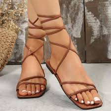

.edgy pumps
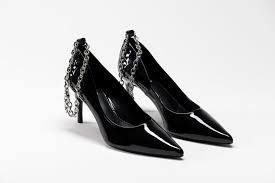

Edgy pumps 指的是带有前卫（edgy） 设计元素的高跟鞋（pumps），*通常具有大胆、独特或时尚的风格，比如尖头设计、不对称剪裁、金属装饰、铆钉、异形鞋跟等。*

名称来历:
Pumps（高跟鞋） +
“Pumps” 这个词源自 16 世纪的欧洲，最早指的是轻便的"无鞋带平底鞋"。 +
随着时间推移，**pumps 逐渐演变成指前方包脚、无鞋带、无系扣的高跟鞋，**通常用于正式或优雅的场合。
Edgy（前卫、个性、大胆）

“Edgy” 在时尚领域表示具有前卫感、带点叛逆、不走寻常路的设计，可能结合朋克、哥特、未来感等元素。 +
“Edgy pumps” 这个名称意味着这些高跟鞋不仅仅是经典的款式，而是带有独特的现代感或个性设计。

.Mary Janes
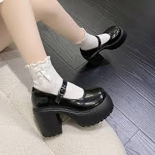

.ballerinas
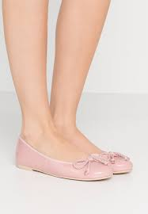
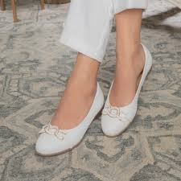
====

Mom: Show me some classic high heels, please.

Salesgirl: Ok, right this way. What color did you have in mind 考虑；打算?

Mom: Black. Classic.

Salesgirl: Of course. We’ve got this style here that is very popular. Because it’s an open-toe shoe 露趾鞋, you can wear it any time of the year. They look great on everyone 每个人穿都好看.

[.my1]
.案例
====
.open-toe shoe
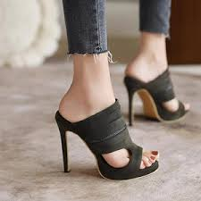
====

Mom: Umm. too shiny 闪亮的. And I wear pantyhose 连裤袜 with my shoes so let’s look for a closed-toe shoe 包趾鞋.

[.my1]
.案例
====
.pantyhose 连裤袜
-> panty,女内裤，来自pants的小词，hose,长筒袜。

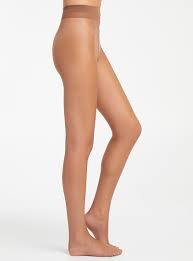

.closed-toe shoe
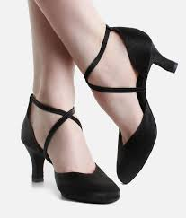

====

Salesgirl: Ok, these are a very nice pair of _leather shoes_ 皮鞋 with a two-inch heel 鞋跟 so they are very comfortable.

[.my1]
.案例
====
.leather shoes
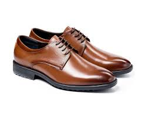
====

Mom: I don’t like the pointed toes 尖头. Let me take a look at what else you have. Too high. That one *looks like* the back would cut into 切入；刺入 my heel. I have a high instep 足弓 so I doubt that one will fit properly. I don’t want bows 蝴蝶结. I find slingbacks 露跟鞋 very uncomfortable. Those *might as well* 几乎可以算是,和……没什么区别 *be* stilettos 细高跟. Too modern. Ah, finally, this is what I’m looking for.

[.my1]
.案例
====
.instep
image:../img/instep.avif[,15%]

.slingbacks
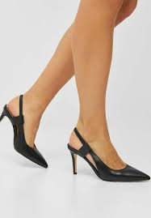

.Those might as well be stilettos.
这里的 might as well 表示 “几乎可以算是” 或 “和……没什么区别”，带有一种略带夸张的语气，表达说话人对某事的不满或无奈。

在这句话里：
"Those might as well be stilettos."
意思是 “那些鞋**几乎可以算是**细高跟鞋了。” 或 “那些鞋跟细高跟鞋**没什么区别**。”
说话人可能觉得鞋子的跟太高或太细，不符合自己的需求。

常见用法:  +
1.*表示某事与另一件事几乎一样，没太大区别*

- This coffee is so weak, it *might as well* be water.
（这咖啡淡得像水一样。）
- If you're not going to study, you *might as well* not take the test.
（如果你不打算复习，干脆别考试了。）

2.*表达无奈或勉强接受（类似于“倒不如”）*

- We missed the bus. We *might as well* walk home.
（我们错过了公交，倒不如走回家。）

在你的例子中，说话人用 might as well 来强调这些鞋子跟细高跟鞋（stilettos）没什么区别，表达不喜欢太高或太细的鞋跟。
====

Salesgirl: What size?

Mom: Seven-and-a-half.

Salesgirl: Here we are /How does it fit?

Mom: Hmmm. not good. They’re too tight 紧的. The length is right, but the shoe is too narrow 窄的 and it’s pinching (v.)夹痛 my toes. And there’d be no room for my insoles 鞋垫. You know what? I don’t think I have the patience (n.)耐心 for this today. They just don’t make shoes like they used to 他们只是不像以前那样做鞋了. I’ll come back another time 我下次再来.

Salesgirl: Have a nice day, Ma’am.

- stretched out of shape : /strɛtʃt aʊt əv ʃeɪp/ (phrase) To become deformed or misshapen. 变形；走形.
Example: "My old shoes have stretched out of shape."  我的旧鞋已经变形了。

[.my1]
.案例
====
- Mary Janes : /ˈmɛəri dʒeɪnz/ (noun) A type of shoe with a strap 带子，皮带 across the instep. 玛丽珍鞋.
- ballerinas : /ˌbæləˈriːnəz/ (noun) Flat shoes with a rounded toe （人的）脚趾, similar to ballet shoes. 芭蕾平底鞋.
- have in mind : /hæv ɪn maɪnd/ (phrase) To be thinking of or considering something. 考虑；打算.
Example: "What kind of car do you have in mind?"  你考虑买哪种车？
- pantyhose : /ˈpæntihoʊz/ (noun) A thin piece of women’s clothing that covers the legs and lower body. 连裤袜.
- heel : /hiːl/ (noun) The back part of a shoe that is raised from the ground. 鞋跟.
- cut into : /kʌt ˈɪntuː/ (phrasal verb) To press into something, causing discomfort or pain. 切入；刺入.
Example: "The tight shoes cut into my feet."  这双紧鞋夹得我脚疼。

====

[.my2]
妈妈：嗨，打扰一下，小姐？我在找一双正装鞋。我那双穿了好几年的鞋终于变形了，它们不再提供任何支撑了。 +
售货员：当然，您想找什么样的鞋？我们有细带凉鞋、时尚高跟鞋、时尚高跟鞋，或者如果您想要更实用的，我们有玛丽珍鞋、芭蕾平底鞋。 +
妈妈：请给我看一些经典的高跟鞋。 +
售货员：好的，这边请。您考虑什么颜色？ +
妈妈：黑色。经典款。 +
售货员：当然。我们这里有一款非常流行的款式。因为是露趾鞋，您可以全年穿着。它们穿在每个人身上都很好看。 +
妈妈：嗯，太闪亮了。而且我穿连裤袜配鞋，所以我们还是找包趾鞋吧。 +
售货员：好的，这是一双非常漂亮的皮鞋，鞋跟两英寸，所以非常舒适。 +
妈妈：我不喜欢尖头。让我看看你们还有什么。太高了。那双看起来后跟会夹我的脚。我足弓高，所以我怀疑那双鞋是否合适。我不想要蝴蝶结。我觉得露跟鞋很不舒服。那双鞋简直就是细高跟。太现代了。啊，终于，这就是我要找的。 +
售货员：什么尺码？ +
妈妈：七码半。 +
售货员：给您。合脚吗？ +
妈妈：嗯，不好。它们太紧了。长度合适，但鞋太窄，夹得我脚趾疼。而且没有空间放我的鞋垫。你知道吗？我觉得我今天没有耐心了。现在的鞋子不像以前那样了。我改天再来吧。 +
售货员：祝您愉快，女士。 +

'''

== ■(232) Elementary ‐Daily Life ‐Toys (C0232)  +
TV: Spongebob Squarepants will be right back after these brief messages! What’s that on the horizon? A pirate ship! Raid villages and find buried treasure with this new Pirates Lego set. Build the ship and decide who rules the sea! Har!  +
A: Cool!  +
TV: The New PLAY-DOH Sparkling Brights  +
 +
Precious Gem Press! Make large colorful gems for you and your friends with five special molds! Comes with the new Sparkling Brights PLAY-DOH compound in four new colors! Treasure chest sold separately.  +
B: Wow! Mommy, can I get that for my  +
birthday?  +
TV: Wolverine! Jean Grey!Rogue! And  +
Professor X! Collect all four of these special- +
edition collectible X-Men action figures and  +
decide the future of mutants in our world!  +
 +
A:  +
No way! I want Professor X !  +
TV: The new Collector’s Edition Nursery  +
Rhymes Porcelain Dolls! Little Bo Peep comes  +
with her own sheep and staff! Her clothes  +
are made with the finest fabrics and real  +
Italian lace, and her face has been hand- +
painted by our finest artists. Only $199.  +
 +
 +
A:  +
Oooo! She’s pretty! I’ve never had a  +
porcelain doll before.  +
 +
 +
 +
B:  +
I doubt Mom and Dad would get you that  +
for your birthday. She costs a pretty penny.  +
Plus, you’d most likely break her.  +
TV: What is better than one board game?  +
Three board games in one! Enjoy playing  +
Chess and Checkers on this side of the  +
board. But if you’re looking for some more  +
fun, flip it and play the classic game of Sorry!  +
 +
 +
B:  +
That’s ingenious! Why hasn’t anyone  +
thought of that before?  +
TV: Now you can take Spongebob  +
Squarepants wherever you go with the new  +
Spongebob Squarepants Glow-in-the-Dark  +
Yoyo! And now back to our show!  +
 +
 +
 +
 +
 +

'''

==== ◆(232) Elementary ‐Daily Life ‐ Toys (C0232)

TV: Spongebob 海绵宝宝 Squarepants 方裤子（美国动画片《海绵宝宝》中海绵鲍勃的姓氏） will be right back /after these brief messages! What’s that on the horizon 地平线？ A pirate ship! Raid (v.)突袭，偷袭；抢劫，劫掠 villages and find buried treasure 埋藏的宝藏 with this new Pirates Lego set 乐高套装. Build the ship and decide who rules the sea! Har!

[.my1]
.案例
====
- Spongebob Squarepants +
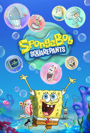

====

A: Cool!

TV: The New PLAY-DOH Sparkling 闪烁的，闪亮的;妙趣横生的 Brights (n.)明亮醒目的颜色 Precious Gem 宝石 Press 压平机；压榨机；榨汁机! Make large colorful gems 宝石 for you and your friends /with five special molds 模具！ Comes with the new Sparkling Brights PLAY-DOH 品牌名 compound 混合物 in four new colors! Treasure chest 宝箱 sold (v.) separately.

[.my1]
.案例
====
- PLAY-DOH +
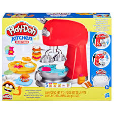
====

B: Wow! Mommy, can I get that for my birthday?

TV: Wolverine 狼獾! Jean Grey! Rogue 无赖；捣蛋鬼;淘气鬼，调皮鬼! And Professor X! Collect (v.) all four of these special edition 特别版 collectible 收藏品 X-Men action figures 动作人偶 and decide the future of mutants 变种人 in our world!

[.my1]
.案例
====
- rogue  +
( humorous) a person who behaves badly, but in a harmless way 无赖；捣蛋鬼 +
-> 可能来自拉丁语 rogere,要求，乞求，词源同 reach,arrogant.引申词义乞丐，后用于指死讨白 要的无赖，恶棍。
====

A: No way! I want Professor X !

TV: The new Collector’s Edition _Nursery 托儿所，幼儿园 Rhymes_ (
（诗、歌曲）押韵；押韵小诗) 童谣 Porcelain (a.n.)瓷制的 Dolls 玩偶! Little Bo Peep (童话中的)一个牧羊女孩 comes with her own sheep and staff 手杖！ Her clothes are made with the finest fabrics 布料 and real Italian lace 蕾丝, and her face has been handpainted 手工绘制 by our finest artists. Only $199.

[.my1]
.案例
====
- porcelain -> 来自中古法语procelaine,来自意大利语porcellana,贝壳，瓷器，因其相似的光泽而得名，来自拉丁语porcellus,小猪，词源同pork,-elle,小词后缀。据说是因为贝壳的孔隙有如母猪的外阴而得名。
====

A: Oooo! She’s pretty! I’ve never had a porcelain doll 瓷娃娃 before.

B: I doubt Mom and Dad would get you that for your birthday. She costs (v.) a pretty penny 一大笔钱. Plus, you’d most likely 很可能 break her.

TV: What is better than one board game 棋盘游戏? Three board games in one! Enjoy playing Chess 国际象棋，西洋棋 and Checkers 跳棋 on this side of the board. But if you’re looking for some more fun, flip (v.)（使）快速翻转，迅速翻动；快速翻阅，浏览 it and play the classic game of Sorry!

B: That’s ingenious (a.)巧妙的;灵巧的，有独创性的！ Why hasn’ anyone *thought of* 想到,想出来 that before?

TV: Now you can take Spongebob Squarepants 海绵宝宝 wherever 无论在哪里，在任何地方 you go with the new Spongebob Squarepants Glow-in-the-Dark 夜光 Yoyo 溜溜球；悠悠球! And now back to our show!

[.my1]
.案例
====

- ingenious : /ɪnˈdʒiːniəs/ (adjective) Clever, original, and inventive. 巧妙的. +
Example: "The design of the new phone is ingenious."  这款新手机的设计非常巧妙。 +
Example: "She came up with an ingenious solution to the problem."  她想出了一个巧妙的解决方案。
====

[.my2]
电视：海绵宝宝将在这些简短广告后马上回来！地平线上那是什么？一艘海盗船！用这套新的乐高海盗套装，突袭村庄并找到埋藏的宝藏。建造船只，决定谁将统治海洋！哈！ +
A：酷！ +
电视：全新 PLAY-DOH 闪耀亮彩宝石压模机！用五种特殊模具为您和您的朋友制作大型彩色宝石！随附四种新颜色的闪耀亮彩 PLAY-DOH 混合物！宝箱单独出售。 +
B：哇！妈妈，我能把这个当作生日礼物吗？ +
电视：金刚狼！琴·葛蕾！罗刹女！还有 X 教授！收集这四款特别版收藏品 X 战警动作人偶，决定变种人在我们世界的未来！ +
A：不行！我想要 X 教授！ +
电视：全新收藏版童谣瓷娃娃！小波比带着她自己的羊和手杖！她的衣服由最优质的布料和真正的意大利蕾丝制成，她的脸由我们最优秀的艺术家手工绘制。仅售 199 美元。 +
A：哦！她真漂亮！我以前从没有过瓷娃娃。 +
B：我怀疑爸爸妈妈不会给你买这个当生日礼物。她可值一大笔钱。而且，你很有可能会把她打碎。 +
电视：有什么比一款棋盘游戏更好？三合一棋盘游戏！在这边玩国际象棋和跳棋。但如果你想要更多乐趣，翻转它，玩经典的“对不起”游戏！ +
B：太巧妙了！为什么以前没人想到这个？ +
电视：现在，你可以带着全新的海绵宝宝夜光溜溜球，随时随地玩海绵宝宝！现在回到我们的节目！ +

'''

== ■(233) Elementary ‐Global View ‐Forex (C0233)  +
A: Hey John! I haven’t seen you in ages! What’s new? What have you been up to?  +
B: Pete! Nice to see you. Well, on top the norm, you know, wife and kids and work, I’ve actually gotten into doing some trading.  +
A: Trading? You, big guy? What are you trading?  +
B: Currencies.  +
A: Currencies? As in Euros, Dollars, Pounds and Rupees?  +
B: It’s called Forex. Foreign Exchange. The great thing about it is that I don’t have to invest a huge amount. I put in a margin deposit and then I can buy and sell up to 100 times that much!  +
 +
A: I don’t understand. You’re buying and selling money?  +
B: You got it! Just last night I made USD 150!  +
A: Last night?  +
B: Yeah! It’s a 24 hour market! I had bought some RMB earlier at a low asking price but last night it appreciated drastically so I made a split second decision and sold all my RMB at an amazing bid! I’ve also done some trading with CHF and AUD and HKD. I’ve made some good profits but I’ve also suffered some losses. It depends on a lot of factors just like any other market. In total I’ve made about USD 500 in the past few months.  +
A: You’re kidding! I’m on! Where do I sign up?  +
 +
 +
 +

'''

==== ◆(233) Elementary ‐Global View ‐ Forex 外汇；外汇交易市场 (C0233)

A: Hey John! I haven’t seen you in ages 很久！ What’s new? What have you been *up to* (忙于);你最近在忙什么?

[.my1]
.案例
====
up to sth
( informal ) doing sth, especially sth bad 正在干，从事着（尤指坏事）；在捣鬼 +
•What's she up to? 她在捣什么鬼？ +
•What've you been up to? 你一直在搞什么名堂？ +
•I'm sure he's up to no good (= doing sth bad) . 我敢说他在打什么坏主意。
====

B: Pete! Nice to see you. Well, on top the norm 除了常规的, you know, wife and kids and work, I’ve actually *gotten into* do**ing** some trading 交易.

[.my1]
.案例
====
.get into / out of the way of (doing) something
to become accustomed to (not) doing; to get into / out of the habit of doing
 习惯于（不）做某事；养成/改掉做某事的习惯 +
- They got into the way of waking up late when they were on holiday. 他们在度假时养成了起得晚的习惯。
====

A: Trading? You, big guy 大个儿? What are you trading?

B: Currencies 货币.

A: Currencies? As in Euros, Dollars, Pounds 英镑 and Rupees (印度)卢比?

B: It’s called Forex 外汇,外汇交易. Foreign Exchange 外汇交易. `主` The great thing about it `系` is that I don’t have to invest a huge amount. I put in a _margin deposit_ 保证金 and then I can buy and sell *up to* 不超过，最多 100 times 倍数 that much!

A: I don’t understand. You’re buying and selling money?

B: You got it! Just last night I made USD 150!

A: Last night?

B: Yeah! It’s a 24 hour market！ I had bought some RMB earlier at a low _asking price_ 要价 but last night it appreciated (v.)增值；升值 drastically 大幅升值 /so I made a _split （使）分裂 second_ 瞬间 decision 瞬间决定 and sold all my RMB at an amazing bid 出价！ I’ve also done some trading with CHF 瑞士法郎 and AUD 澳元 and HKD 港币（=Hong Kong Dollar）. I’ve made some good profits but I’ve also suffered some losses. It depends on a lot of factors *just like* any other market. In total /I’ve made about USD 500 in the past few months.

A: You’re kidding 开玩笑! I’m on! Where do I *sign up* 报名,注册?

[.my1]
.案例
====
- in ages : /ɪn ˈeɪdʒɪz/ (phrase) For a very long time. 很久. +
Example: "I haven’t seen you in ages!"  我很久没见到你了！

- up to : /ʌp tuː/ (phrasal verb) Busy with something. 忙于. +
Example: "What have you been up to lately?"  你最近在忙什么？

- asking price : /ˈɑːskɪŋ praɪs/ (noun) The price at which a seller is willing to sell something. 要价. +
Example: "The asking price for the house was too high."  这栋房子的要价太高了。

- split second decision : /splɪt ˈsɛkənd dɪˈsɪʒən/ (noun) A decision made very quickly. 瞬间决定. +
Example: "He made a split second decision to jump off the bus."  他瞬间决定跳下公交车。

- bid : /bɪd/ (noun) An offer to pay a particular price for something. 出价. +
Example: "She placed a bid on the antique vase."  她为这个古董花瓶出价。
- sign up : /saɪn ʌp/ (phrasal verb) To register or enroll for something. 报名. +
Example: "I signed up for the cooking class."  我报名了烹饪课。
====

[.my2]
A：嘿，约翰！好久不见！最近怎么样？你在忙什么？ +
B：皮特！很高兴见到你。嗯，除了常规的，你知道的，妻子、孩子和工作，我最近开始做一些交易。 +
A：交易？你，大块头？你在交易什么？ +
B：货币。 +
A：货币？比如欧元、美元、英镑和卢比？ +
B：这叫外汇。外汇交易。最棒的是我不需要投入大量资金。我存入保证金，然后可以买卖高达100倍的资金！ +
A：我不明白。你在买卖钱？ +
B：没错！就在昨晚，我赚了150美元！ +
A：昨晚？ +
B：是的！这是一个24小时市场！我之前以低价买入了一些人民币，但昨晚人民币大幅升值，所以我瞬间决定以高价卖出了所有人民币！我还用瑞士法郎、澳元和港币做了一些交易。我赚了一些利润，但也遭受了一些损失。这取决于很多因素，就像其他市场一样。过去几个月，我总共赚了大约500美元。 +
A：你在开玩笑吧！我也要加入！在哪里报名？ +

'''

== ■(234) Elementary ‐Daily Life ‐Going to the Doc tor (C0234)  +
Doctor Evans:Good afternoon Chloe, I’m Doctor Evans. What seems to be the problem?  +
Chloe: Hi, Dr Evans. Thanks for seeing me on such short notice. When I woke up this morning I had a really sore throat and a really bad cough. I think I am coming down with the flu. Doctor Evans:Ah I see, yes you do sound rather croaky. Well let’s have a look, shall we? Could you please open your mouth and say ” ah”. Chloe: ”Ahhhhhhhh” Doctor Evans: Good, yes, your tonsils are a little swollen and red. How are your ears, blocked at all? Chloe: A little actually. My sinuses are a little blocked up as well – I really feel terrible. Doctor Evans: Ok Chloe, can you please breathe in and out slowly for me while I listen to your chest? You really are all bunged up, you don’t sound too good at all. Ok I’m going to set you up with a bunch of antibiotics. You will need to take these orange pills twice a day and these blue pills every evening. You will also have to take this cough medicine three times a day after meals. Finally, I am giving you an inhaler to use every time you feel breathless... just to clear up your lungs! Chloe: Whoa! So many drugs.... I hate swallowing pills. Am I able to go to work? Doctor Evans: Absolutely not! You are highly contagious! You don’t want to infect the rest of your co-workers do you? I recommend staying in bed for at least three days and drinking plenty of fluids so you don’t get weak and dehydrated. You can catch up on all the latest tv shows and movies! Chloe: Ok! Would you mind writing me a doctor’s note for work, otherwise they may think I am faking it! Doctor Evans: Ha-ha, sure not a problem! Here you are. Now off you go and away to bed. If you have any questions just give me a call! Feel better soon and take care. Chloe: Thanks doc, bye!  +
 +

'''

==== ◆(234) Elementary ‐Daily Life ‐ Going to the Doctor (C0234)

Doctor Evans: Good afternoon Chloe, I’m Doctor Evans. What seems to be the problem 问题？

Chloe: Hi, Dr Evans. Thanks for seeing me *on such short notice* 短时间内,在这么短的时间内;立刻，即刻；一通知到就. When I woke up this morning /I had a really _sore (a.)（发炎）疼痛的，酸痛的 throat_ 喉咙痛 and a really bad cough 严重咳嗽. I think I am *coming down with* 染上（疾病） the flu 流感.

Doctor Evans: Ah I see, yes you do sound (v.) rather croaky 沙哑的. Well let’s have a look, shall we? Could you please open your mouth and say ” ah”.

Chloe: ”Ahhhhhhhh”

Doctor Evans: Good, yes, your tonsils 扁桃体 are a little swollen 肿胀的 and red. How are your ears, blocked (v.) at all 堵塞?

[.my1]
.案例
====
- tonsils +
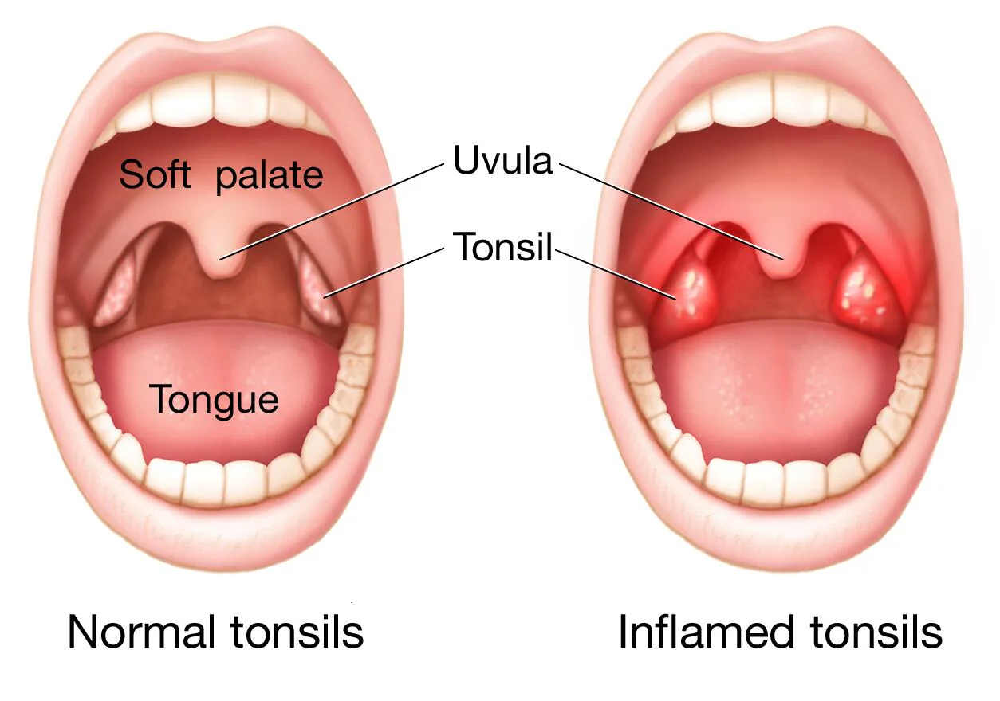
====

Chloe: A little actually. My sinuses 鼻窦 *are* a little *blocked up* 被堵塞 as well – I really feel terrible.

[.my1]
.案例
====
.sinuses
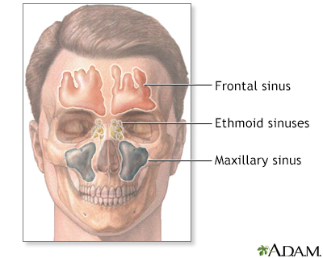
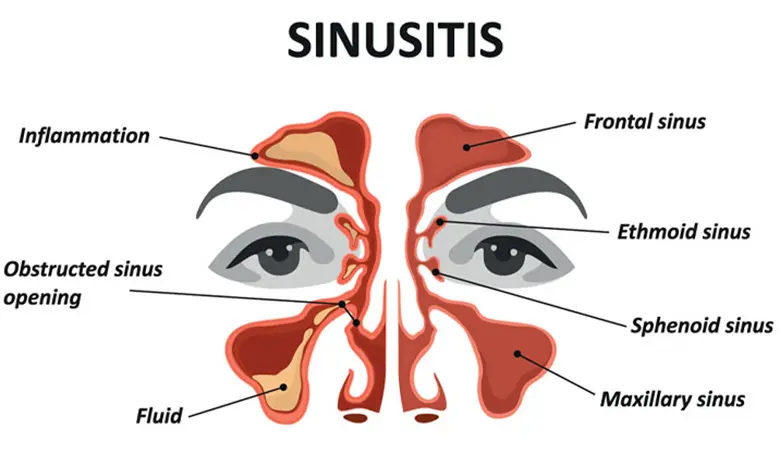
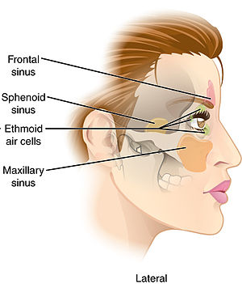
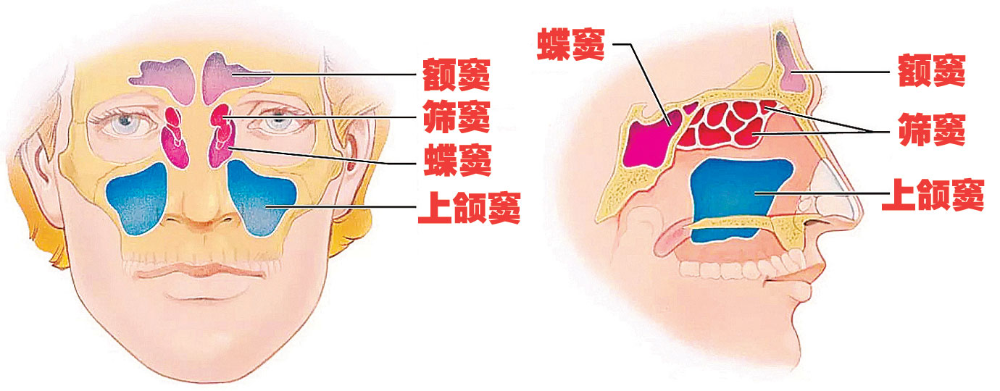

鼻窦（Paranasal sinuses），又名鼻旁窦，**是一群含有空气的空腔，**位于人的头颅，在头骨之间、鼻腔周围的颅骨与脸骨之内。 +
*鼻窦共有四对，平时充满了空气，在鼻腔附近*。"上颌窦"在眼睛下方，"额窦"在眼睛上方，"筛窦"在两眼之间，"蝶窦"在眼睛后方。 +
人脸部的窦, 是根据附近的面部骨骼来命名的。

*"鼻窦"由很多称为"窦口"的小管, 连往鼻腔。不过当人因为普通感冒, 而引致鼻炎或鼻膜肿胀，都会使这些小管闭塞。当这些小管闭塞时，就会影响到鼻腔黏液滞流在鼻窦内，影响排放。如果不及早诊治，就会演变成为"鼻窦炎"。* +
因为上颌后牙, 靠近"上颌窦"，因此若有任何疾病（例如牙齿部分发炎），也可能会造成其他临床问题。临床问题包括"继发性鼻窦炎"，也就是因为其他问题（例如邻近的牙齿发炎）造成的鼻窦感染。

====

Doctor Evans: Ok Chloe, can you please *breathe (v.)呼吸 in and out slowly* for me /while I listen to your chest 胸部? You really are all *bunged (v.)塞住，堵塞 up* 堵塞, you don’t sound (v.) too good at all. Ok I’m going *to set you up with* a bunch 大量；大批 of antibiotics 抗生素. You will need to take these orange pills twice a day /and these blue pills every evening. You will also have to take this _cough medicine_ 止咳药 three times a day after meals. Finally, I am giving you an inhaler 吸入器 to use (v.) every time you feel breathless (a.)喘不过气. . . just to clear up 整理，清理 your lungs!

[.my1]
.案例
====
.bung
-> 来自词根pung, 击，打，刺，见puncture, 刺。代指塞子，瓶塞。

.set (one) up with (someone or something)
1.To provide one with a job or business opportunity. +
- I asked my cousin *to set me up with a job* at his company.
- After college, his father will *be setting him up with a position* at the firm.

2.To pair a person with someone else for a date or the possibility of a romantic relationship. 为约会或可能的恋爱关系, 将某人与其他人配对 +
- There's a guy from work I'd really like *to set you up with*. +
- I was skeptical /when he said *he'd set me up with his friend*, but we actually had a wonderful evening together.

.inhaler
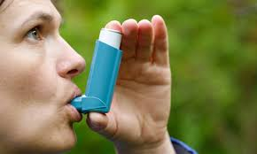

====

Chloe: Whoa! So many drugs. . . . I hate swallowing (v.) pills 吞药. Am I able to go to work?

Doctor Evans: Absolutely not! You are highly contagious (a.)传染性强的！ You don’t want to infect (v.)传染 the rest of your co-workers do you? I recommend (v.) staying in bed for at least three days /and drinking plenty of fluids 液体 /so you don’t get weak and dehydrated (a.)脱水的. You can *catch up on* 了解（最近的事件）;赶上（本应早些时候做的事情） all the latest tv shows and movies!

Chloe: Ok! Would you mind (v.) writing me a doctor’s note 医生证明 for work, otherwise they may think (v.) I am faking (v.) it 装病！

Doctor Evans: Ha-ha, sure *not a problem*! Here you are. Now *off you go* 你可以走了 and *away to bed* 上床睡觉. If you have any questions /just give me a call! *Feel better soon* 早日康复 and *take care* 保重,照顾好自己.

Chloe: Thanks doc, bye!

[.my1]
.案例
====
- short notice : /ʃɔːrt ˈnəʊtɪs/ (noun) A very limited amount of time before something happens. 短时间内. +
Example: "They called the meeting at short notice."  他们在短时间内通知了会议。

- coming down with : /ˈkʌmɪŋ daʊn wɪð/ (phrasal verb) To start to suffer from an illness. 患上（疾病）. +
Example: "I think I’m coming down with a cold."  我觉得我感冒了。

- sinuses : /ˈsaɪnəsɪz/ (noun) Air-filled spaces in the skull connected to the nose. 鼻窦.

- bunged up : /bʌŋd ʌp/ (adjective) Blocked, especially referring to the nose or sinuses. 堵塞的. +
Example: "I’m all bunged up with a cold."  我因为感冒鼻子全堵了。
====

[.my2]
埃文斯医生：下午好，克洛伊，我是埃文斯医生。有什么问题吗？ +
克洛伊：嗨，埃文斯医生。感谢您这么快就接待我。今天早上醒来时，我喉咙很痛，咳嗽也很严重。我想我得了流感。 +
埃文斯医生：啊，我明白了，是的，你的声音听起来有点沙哑。我们来看看吧，好吗？请张开嘴说“啊”。 +
克洛伊：“啊——” +
埃文斯医生：很好，是的，你的扁桃体有点肿和发红。你的耳朵怎么样，有堵塞吗？ +
克洛伊：有一点。我的鼻窦也有点堵塞——我真的感觉很不舒服。 +
埃文斯医生：好的，克洛伊，请慢慢呼吸，我听听你的胸部。你确实都堵塞了，听起来不太好。我会给你开一些抗生素。你需要每天两次服用这些橙色药片，每天晚上服用这些蓝色药片。你还必须在饭后每天三次服用这种止咳药。最后，我给你一个吸入器，每次感到喘不过气时使用……只是为了清理你的肺部！ +
克洛伊：哇！这么多药……我讨厌吞药。我能去上班吗？ +
埃文斯医生：绝对不行！你的传染性很强！你不想传染给其他同事吧？我建议你至少卧床三天，多喝水，这样你就不会虚弱和脱水。你可以补上所有最新的电视节目和电影！ +
克洛伊：好的！您能给我开一份医生证明吗？否则他们可能会认为我在装病！ +
埃文斯医生：哈哈，当然没问题！给你。现在回去休息吧。如果有什么问题，随时给我打电话！祝你早日康复，保重。 +
克洛伊：谢谢医生，再见！ +

'''

== ■(235) Elementary ‐The Office ‐Interview Skills Part 1 ‐The Introduction (C0235)  +
 +
Mr. Parsons: Come in.  +
Rebecca Carlyle: Mr Parsons ?  +
Mr. Parsons: Ah, you must be Rebecca.  +
Please do come in.  +
Rebecca Carlyle: Thank you for making  +
some time to see me Mr Parsons. It’s a  +
pleasure to meet you finally.  +
Mr. Parsons: The pleasure’s all mine  +
Rebecca.  +
Have a seat please . Now would you like any  +
refreshments? Tea or coffee?  +
Rebecca Carlyle: A coffee would be lovely  +
thank you. Black, no sugar.  +
Mr. Parsons: No problem. Sally can we have  +
two coffees please One, no milk or sugar?  +
Sally: Certainly Mr Parsons .  +
Mr. Parsons: So Rebecca, I understand you  +
 +
 +
had a first interview with Miss Childs last week. Rebecca Carlyle: Yes that’s correct. She filled me in onthe details ofthe job onthe telephone. Mr.Parsons:Great.Well, I’m glad to say she recommended you for a 2nd interview, and here we are. Perhaps we can start by discussing your background and resume details a little? Rebecca Carlyle: Yes , of course.  +
 +
 +
 +

'''

==== ◆(235) Elementary ‐The Office ‐ Interview Skills Part 1 ‐ The Introduction 介绍，引见；初次经历 (C0235)

Mr. Parsons: Come in.

Rebecca Carlyle: Mr Parsons ?

Mr. Parsons: Ah, you must be Rebecca. Please do come in.

Rebecca Carlyle: Thank you for *making some time* 抽出时间,腾出时间 to see me Mr Parsons. It’s a pleasure to meet you finally.

Mr. Parsons: *The pleasure’s all mine* 这是我的荣幸 Rebecca. Have a seat please. Now would you like any refreshments 茶点,点心？ Tea or coffee?

Rebecca Carlyle: A coffee would be lovely thank you. Black, no sugar.

Mr. Parsons: No problem. Sally 人名 can we have two coffees please One, no milk or sugar?

Sally: Certainly Mr Parsons.

Mr. Parsons: So Rebecca, I understand you had a first interview 面试，面谈 with Miss Childs last week.

Rebecca Carlyle: Yes that’s correct. She *filled me in on* 告知 the details of the job on the telephone.

[.my1]
.案例
====
.fill someone in on
to provide someone with additional facts, details, etc. about

.fill someone in
to give someone extra or missing information
向…提供（額外或漏聽的資訊） +
- *I filled her in on* the latest gossip.
我告訴了她最新的小道消息。

====

Mr. Parsons: Great. Well, I’m glad to say she recommended you for a 2nd interview, and here we are. Perhaps we can start by discussing your background 背景 and _resume (n.)简历，履历 details_ a little?

Rebecca Carlyle: Yes, of course.

[.my1]
.案例
====
- make some time : /meɪk sʌm taɪm/ (phrase) To find or create time for something. 抽出时间. +
Example: "Can you make some time to meet tomorrow?"  你能抽出时间明天见面吗？

- fill in on : /fɪl ɪn ɒn/ (phrasal verb) To provide someone with information. 告知. +
Example: "She filled me in on the latest news."  她告诉了我最新消息。
====

[.my2]
帕森斯先生：请进。 +
丽贝卡·卡莱尔：帕森斯先生？ +
帕森斯先生：啊，你一定是丽贝卡。请进。 +
丽贝卡·卡莱尔：感谢您抽出时间见我，帕森斯先生。终于见到您，我很高兴。 +
帕森斯先生：我也很高兴，丽贝卡。请坐。你想喝点什么吗？茶还是咖啡？ +
丽贝卡·卡莱尔：一杯咖啡就好，谢谢。黑咖啡，不加糖。 +
帕森斯先生：没问题。莎莉，请给我们两杯咖啡，一杯不加奶和糖。 +
莎莉：好的，帕森斯先生。 +
帕森斯先生：那么，丽贝卡，我知道你上周和柴尔兹女士进行了第一次面试。 +
丽贝卡·卡莱尔：是的，没错。她在电话里告诉了我这份工作的细节。 +
帕森斯先生：很好。我很高兴地告诉你，她推荐你进行第二次面试，所以我们在这里见面了。也许我们可以先讨论一下你的背景和简历细节？ +
丽贝卡·卡莱尔：当然可以。 +

'''

== ■(236) Elementary ‐Daily Life ‐Trying To Sleep ( C0236)  +
Jill: Alex, what’s up with you? You look dreadful!  +
Alex: Hey Jill, I don’t know. I’ve been having trouble sleeping these past few weeks. I usually lie in bed for hours trying to get to sleep . I’ve tried stretching and different breathing techniques before going to bed . I’ve tried eating and not eating different foods. I’ve even tried counting sheep! And then when I finally get to sleep , I have these really disturbing nightmares, so I usually wake up in a panic and more tired than before I went to sleep . Jill: Wow, maybe you should get that checked out. Maybe you’re stressed?  +
C:  +
Just take some sedatives! Works for me!  +
Every so often having some melatonin on  +
hand helps me when I have trouble sleeping.  +
It works on all kinds of sleeping disorders.  +
It’s the stuff pilots use to regulate their  +
sleeping patterns.  +
Jill: I heard of that. But does that apply to  +
Alex’s situation?  +
 +
 +
C:  +
Ya sure, why not? Sounds like he only has  +
transient insomnia since it’s a recent thing so  +
taking melatonin do the trick.  +
Jill: But shouldn’t he be looking into WHY it’s  +
been happening?  +
 +
 +
C:  +
Well aren’t you the little psychologist? Our  +
buddy’s having trouble sleeping, it’s easy and  +
curable. It’s not something freakish like if he  +
was a sleepwalker.  +
Alex: Well, there’s that too.  +
 +
 +
 +
 +
 +

'''

==== ◆(236) Elementary ‐Daily Life ‐ Trying To Sleep (C0236)

Jill: Alex, what’s up with you? You look dreadful 糟糕的！

Alex: Hey Jill, I don’t know. I’ve been having trouble sleeping 睡眠困难 these past few weeks. I usually *lie in bed* for hours trying to get to sleep 入睡. I’ve tried stretching 拉伸 and different _breathing techniques_ 呼吸技巧 before going to bed. I’ve tried eating and not eating different foods. I’ve even tried counting sheep 数羊！ And then when I finally get to sleep, I have these really disturbing (a.)令人不安的，引起恐慌的 nightmares 噩梦, so I usually wake up in a panic 恐慌 and more tired 疲倦的，累的 than before I went to sleep.

Jill: Wow, maybe you should *get that checked out* 检查. Maybe you’re stressed  (a.)焦虑的，紧张的;压力大？

C: Just take some sedatives 镇静剂！ Works (v.) for me! `主` *Every so often* 偶尔，间或，不定期地，有时候 having some melatonin 褪黑激素 on hand `谓` helps me /when I have trouble sleeping. It works on all kinds of sleeping disorders 睡眠障碍. It’s the stuff 后定 pilots 飞行员 use (v.) to regulate (v.)调节，规定；控制；校准 their sleeping patterns 调节睡眠模式.

[.my1]
.案例
====
- melatonin -> melan-,黑色的，-ton,延展性，弹性，词源同tonic,-in,化学名词后缀。该激素因可以通过使一种产生黑色素的细胞发亮，从而抑制黑色素生长而得名。

====

Jill: I *heard of* 听说过,知道，了解 that. But does that *apply to* Alex’s situation?

C: Ya sure, why not? *Sounds like* he only has transient (a.)转瞬即逝的，短暂的；暂住的，（工作）临时的 insomnia (失眠（症）) 暂时性失眠 since it’s a recent thing /so `主` taking melatonin 褪黑激素 `谓` do the trick (诡计；花招；骗局；把戏) 奏效.

[.my1]
.案例
====
- insomnia -> in-,不，非，-somn,睡觉，词源同somnolent,somnambulist.即没法睡觉，引申词义失眠。
====

Jill: But shouldn’t he be looking into 调查、研究、查明 WHY it’s been happening?

C: Well aren’t you the little psychologist 心理学家？ Our buddy’s having trouble sleeping, it’s easy and curable 可治愈的. It’s not something freakish (a.)怪异的;反常的；意外的 like if he was a sleepwalker 梦游者.

Alex: Well, there’s that too 还有这个.

[.my1]
.案例
====
这段对话最后, 为什么Alex 要说 Well, there’s that too.  ?

C试图轻松地解决Alex的睡眠问题，认为只是短暂的失眠，并建议使用褪黑素。
为了淡化问题的严重性，C说：“It’s not something freakish like if he was a sleepwalker.”（这不像他梦游那样怪异。）C用梦游来举例，说明Alex的问题不是什么严重的，怪异的，难以解决的问题。

Alex的回答“Well, there’s that too.”（嗯，还有那个。）是对C刚刚提到的梦游的回应。
这句话的隐含意思是：Alex实际上也有梦游的情况。
通过说“that too”，Alex承认梦游也是他睡眠问题的一部分。
这个"that"指代的就是C刚刚所说的 sleepwalker 梦游者.
====

[.my1]
.案例
====
- get checked out : /ɡɛt tʃɛkt aʊt/ (phrase) To have a medical examination. 检查. +
Example: "You should get that cough checked out."  你应该去检查一下那个咳嗽。

- do the trick : /duː ðə trɪk/ (phrase) To achieve the desired result. 奏效. +
Example: "This medicine should do the trick."  这种药应该会奏效。
====

[.my2]
吉尔：亚历克斯，你怎么了？你看起来糟透了！ +
亚历克斯：嘿，吉尔，我不知道。过去几周我一直睡眠困难。我通常躺在床上几个小时试图入睡。我试过睡前做伸展运动和不同的呼吸技巧。我试过吃或不吃不同的食物。我甚至试过数羊！然后当我终于睡着时，我会做这些非常可怕的噩梦，所以我通常会在恐慌中醒来，比睡觉前更累。 +
吉尔：哇，也许你应该去检查一下。也许你压力太大了？ +
C：吃点镇静剂吧！对我有效！我手头常备一些褪黑激素，当我睡眠困难时，它对我有帮助。它对各种睡眠障碍都有效。这是飞行员用来调节睡眠模式的东西。 +
吉尔：我听说过。但这适用于亚历克斯的情况吗？ +
C：当然，为什么不呢？听起来他只是暂时性失眠，因为这是最近的事，所以服用褪黑激素会奏效。 +
吉尔：但他不应该去探究为什么会发生这种情况吗？ +
C：你真是个心理学家啊？我们的朋友睡眠困难，这很容易治愈。这不像梦游者那样怪异。 +
亚历克斯：嗯，还有那个。 +

'''

== ■(237) Elementary ‐Daily Life ‐Morning Routine (C0237)  +
Jacob: Stephanie! Did you just get to school? But you were up and about when I left the dorm this morning! That was about an hour and a half ago. This happens all the time! Why do you always take so long to get ready the morning?  +
Stephanie: It’s a skill. What can I say? I don’t know why, I just have a long routine. Jacob: Please explain because it makes no sense to me. How can a girl’s routine be so complicated? You get up, you shower, you get dressed , you brush your teeth, you’re out the door. Half an hour, tops.  +
Stephanie: Jacob, you have the luxury of having a haircut that rarely needs styling. I don’t. I have to set aside about an hour and a half to get ready in the mornings. Every day, I wake up and head straight for the shower. Every second day, I wash my hair. If it’s a hair-washing day, I frequently need to wash my hair twice because it gets really oily. Then I usually put in a conditioner and have to rinse that out too. Because my hair is so long, I seldom manage to take a shower in under twenty minutes. Afterwards, I often put on a pot of coffee and get dressed while I wait for it to brew. I take a long time to get dressed in the morning. Every now and then I remember to choose my outfit the night before , but usually I do it in the morning. In all, getting dressed takes about half an hour , at which time my hair is now semi-dry so then I have to style my hair. From time to time I’ll put my hair up, but oftentimes I blowdry it straight. And then, because of the texture of my hair, I regularly have to flat-iron it to keep it from frizzing. That’s another twenty minutes or so. After that, I have my daily makeup routine. Jacob: True, I hardly ever see you without your hair done and your makeup on, even when you show up to class in sweatpants. Tell me, how long does it take you to choose that outfit in the morning?  +
 +
Stephanie: Not funny.  +
 +

'''

==== ◆(237) Elementary ‐Daily Life ‐ Morning Routine 早晨日常活动 (C0237)

Jacob: Stephanie! Did you just get to school 你刚到学校吗? But you were *up and about* 起床并活动 when I left the dorm 宿舍 this morning! That was about an hour and a half ago. This happens all the time! Why do you always take so long 花费很长时间 to get ready 准备好 in the morning?

Stephanie: It’s a skill. What can I say? I don’t know why, I just have a long routine 日常流程.

Jacob: Please explain /because it makes no sense 毫无意义,说不通 to me. How can a girl’s routine be so complicated 复杂的？ You get up, you shower (v.)淋浴, you get dressed 穿衣服, you brush (v.) your teeth 刷牙, you’re out the door. Half an hour, tops 最多.

Stephanie: Jacob, you have the luxury 不常有的乐趣，难得的享受;奢侈 of *having a haircut* that rarely needs styling 造型. I don’t. I have to *set aside* 留出 about _an hour and a half_ to get ready in the mornings.  +
Every day, I wake up and *head straight for* 径直朝……走去 the shower 淋浴间. Every second day, I wash (v.) my hair. If it’s a hair-washing day, I frequently need to wash (v.) my hair twice /because it gets really oily 油性的. Then I usually put in a conditioner 护发素;调节剂，调节器 and have to *rinse* (v.)（用清水）冲洗 that *out* too. Because my hair is so long, I seldom manage (v.)设法做到，勉力完成;能解决（问题）；应付（困难局面等） to take a shower in under twenty minutes. 我很少能在20分钟内洗完澡. +

[.my1]
.案例
====
.rinse (v.) sth←→ˈout
to make sth clean, especially a container, by washing it with water 冲洗，洗刷干净（容器等） +
•Rinse the cup out before use. 使用前将杯子冲洗一下。

.manage
1.(v.)to succeed in doing sth, especially sth difficult 完成（困难的事）；勉力完成
[ VN] +
•In spite of his disappointment, he managed a weak smile.尽管他很失望，他还是勉强露出一丝淡淡的微笑。 +
•I don't know exactly how we'll manage it , but we will, somehow.我说不准我们如何去完成这件事，但不管怎样我们一定会完成的。 +
•*Can you manage* another piece of cake? (= eat one) 你还能再吃块蛋糕吗？

[ V to inf]
•We managed to get to the airport in time. 我们设法及时赶到了机场。 +
•*How did you manage* to persuade him? 你是怎么说服他的？ +
•*We couldn't have managed* without you. 没有你，我们就办不成了。
•‘Need any help?’ ‘No, thanks. I can manage.’“要帮忙吗？”“不了，谢谢。我能完成。”

2.[ VN] to be able to do sth at a particular time（在某一时间）能办到，能做成 +
•Let's meet up again— *can you manage* next week sometime? 我们再见一次面吧—下周找个时间，行吗？

====

Afterwards, I often *put on* 开动；发动；使运行 a pot of coffee 煮一壶咖啡 and *get dressed* 穿衣服 while I wait for it to brew (v.)沏（茶），冲（咖啡）；酿（啤酒）;冲泡.  +
I take a long time *to get dressed* in the morning. _Every now and then_ 偶尔，间或，有时 I remember to choose my outfit 服装 the night before, but usually I do it in the morning. In all, *getting dressed* takes about half an hour, at which time 在那时 my hair is now semi-dry 半干的 /so then I have to style (v.)设计，给……造型 my hair.  +
_From time to time_ 有时;时不时地：偶尔 I’ll put my hair up 把头发扎起来, but oftentimes I blowdry (v.)（用吹风机）吹发定型 it straight 吹直. And then, because of the texture 质地 of my hair, I regularly have to flatiron 熨斗 it 用直发器拉直 to keep it from frizzing 卷曲；使卷曲;毛躁. That’s another twenty minutes _or so_ 大约，左右. After that, I have my daily makeup routine 日常化妆流程.

[.my1]
.案例
====
.PUT STH←→ˈON
to switch on a piece of equipment 开动；发动；使运行 +
•I'll *put the kettle 水壶；锅 on* for tea. 我来烧壶水好沏茶。 +
•She *put on the brakes* suddenly. 她突然踩了刹车。

.brew
[ VN] to make a hot drink of tea or coffee 沏（茶）；煮（咖啡） +
•freshly brewed coffee 刚刚煮好的咖啡 +
-> 来自PIE *bhreue, 加热，蒸，词源同burn.

.flatiron
“flatiron”通常指的是一种用于拉直头发的电器，即“电夹板”或“直发器”。
这个词来源于早期的熨斗（iron），它们有时有一个扁平的、三角形的底座，形状类似于一些现代的直发器。

“to flatiron”作为一个动词，表示“用电夹板拉直（头发）”。

虽然“flatiron”主要指用于头发的工具，但“flatiron”这个词本身也指“熨斗”。所以需要根据语境来判断。 +
“flatiron”也指，美国纽约市的“熨斗大厦”，因为建筑外形和熨斗很像。

====

Jacob: True, I hardly ever see you without your hair done and your makeup on, even when you show up 到达，出现 to class in sweatpants 运动裤. Tell me, how long does it take you /to choose that outfit （尤指在某一场合穿的）全套服装 in the morning?

Stephanie: Not funny 不好笑.

[.my1]
.案例
====
- up and about : /ʌp ənd əˈbaʊt/ (phrase) Out of bed and active. 起床活动. +
Example: "She’s up and about early every morning."  她每天早上都早起活动。

- put on a pot of coffee : /pʊt ɒn ə pɒt əv ˈkɒfi/ (phrase) To prepare coffee by brewing it. 煮一壶咖啡.

- every now and then : /ˈɛvri naʊ ənd ðɛn/ (phrase) Occasionally. 偶尔. +
Example: "I see him every now and then."  我偶尔会见到他。
====

[.my2]
雅各布：斯蒂芬妮！你刚到学校吗？但我今天早上离开宿舍时你已经起床活动了！那大约是一个半小时前。这种事总是发生！为什么你早上总是花这么长时间准备？ +
斯蒂芬妮：这是一种技能。我能说什么呢？我不知道为什么，我就是有一个很长的日常流程。 +
雅各布：请解释一下，因为我觉得这说不通。一个女孩的日常流程怎么会这么复杂？你起床、淋浴、穿衣服、刷牙，然后就出门了。最多半小时。 +
斯蒂芬妮：雅各布，你很幸运，你的发型很少需要打理。我不行。我每天早上需要留出一个半小时来准备。每天，我醒来后直接去淋浴。每隔一天，我会洗头。如果是洗头日，我经常需要洗两次，因为我的头发很容易出油。然后我通常会使用护发素，并冲洗掉。因为我的头发很长，我很少能在二十分钟内洗完澡。之后，我通常会煮一壶咖啡，并在等待咖啡冲泡时穿衣服。我早上穿衣服要花很长时间。我偶尔会记得在前一天晚上选好衣服，但通常我是在早上选。总的来说，穿衣服大约需要半小时，那时我的头发已经半干，所以我需要做发型。有时我会把头发扎起来，但通常我会把它吹直。然后，由于我的头发质地，我经常需要用直发器拉直它，以防止毛躁。这又需要大约二十分钟。之后，我会进行我的日常化妆流程。 +
雅各布：没错，我几乎没见过你不做发型、不化妆的样子，即使你穿着运动裤来上课。告诉我，你早上选那套衣服要花多长时间？ +
斯蒂芬妮：不好笑。 +

'''

== ■(238) Elementary ‐The Office ‐Interview Skills Part 2 ‐Discussing Your Background (C0238)  +
Mr. Parsons: Now, Miss Childs passed on your resume to me and I’ve had the chance to look it over and I must say I’m quite impressed.  +
Rebecca: Thank you very much. I’ve tried to keep it short and clear. If there’s any questions please feel free to ask me. Mr. Parsons: Well yes, I do have a number of questions, but perhaps first you could give me a brief overview I’d like to get a little bit of an idea of your background. Rebecca: yes of course. Well as you can see from the resume I’m up and grew up in Brooklyn, New York, although our family moved to London when I was quite young, at around rook. Mr. Parsons: Ah I see, so you were actually educated in Europe? Rebecca: yes precisely. Although I was born in the US, I would definitely call London home. But as you see I’ve actually spent a lot of my life moving from country to country. My Father was inthe oil business before he retired so we also spent a number of years in Saudi Arabia too. Mr. Parsons: Very interesting. So it seems you had quite an adventurous childhood. Rebecca: Absolutely! We were never still for too long. But now I’m really looking to settle down. Mr. Parsons: I see. Okay, well let’s move on to discuss your education shall we? Rebecca: Sure.  +
 +
 +

'''

==== ◆(238) Elementary ‐The Office ‐ Interview Skills Part 2 ‐ Discussing Your Background (C0238)

Mr. Parsons: Now, Miss Childs passed on 转交 your resume 简历，履历 to me /and I’ve had the chance to look it over 仔细查看 and I must say I’m quite impressed 印象深刻.

Rebecca: Thank you very much. I’ve tried to keep it short and clear. If there’s any questions /please feel (v.) free to ask me.

Mr. Parsons: Well yes, I do have a number of questions, but perhaps first you could give me a brief overview 简要概述. I’d like to get a little bit of an idea 我想稍微了解一下 of your background 背景.

Rebecca: Yes, of course. Well, as you can see from the resume, I’m up and grew up in Brooklyn, New York, although our family moved to London when I was quite young, at around ... 大约.

[.my1]
.案例
====

====

Mr. Parsons: Ah I see, so you were actually educated in Europe?

Rebecca: Yes, precisely 正是（表示强调）. Although I was born in the US, I would definitely *call* (v.)称呼；认为……是，把……看作 London *home*. But as you see, I’ve actually spent a lot of my life /moving from country to country. My father was in the oil business 石油行业 before he retired /so we also spent a number of years in Saudi Arabia too.

Mr. Parsons: Very interesting. So it seems /you had quite an adventurous childhood 冒险的童年.

Rebecca: Absolutely! We were never still (a.)静止的，不动的;平静的 for too long. But now I’m really looking to settle down 安定下来.

Mr. Parsons: I see. Okay, well let’s *move on* to discuss (v.)your education, shall we?

Rebecca: Sure.

[.my1]
.案例
====
- pass on : /pɑːs ɒn/ (phrasal verb) To give something to someone else. 转交. +
Example: "She passed on the message to her boss."  她把消息转交给了她的老板。

- look over : /lʊk ˈəʊvər/ (phrasal verb) To examine something carefully. 仔细查看. +
Example: "I’ll look over the report before submitting it."  我会在提交前仔细查看报告。
====

[.my2]
帕森斯先生：现在，柴尔兹女士把你的简历转交给了我，我有机会仔细查看，我必须说我印象深刻。 +
丽贝卡：非常感谢。我尽量让它简短明了。如果有任何问题，请随时问我。 +
帕森斯先生：嗯，是的，我确实有一些问题，但也许你可以先给我一个简要概述。我想了解一下你的背景。 +
丽贝卡：当然可以。嗯，正如你在简历中看到的，我在纽约布鲁克林长大，尽管我们家在我很小的时候搬到了伦敦，大约那时候。 +
帕森斯先生：啊，我明白了，所以你实际上是在欧洲接受的教育？ +
丽贝卡：是的，没错。虽然我出生在美国，但我绝对把伦敦称为家。但如你所见，我实际上花了很多时间从一个国家搬到另一个国家。我父亲退休前从事石油行业，所以我们也在沙特阿拉伯生活了几年。 +
帕森斯先生：非常有趣。看来你有一个相当冒险的童年。 +
丽贝卡：绝对！我们从未在一个地方停留太久。但现在我真的很想安定下来。 +
帕森斯先生：我明白了。好吧，那我们来讨论一下你的教育，好吗？ +
丽贝卡：当然。 +

'''

== ■(239) Elementary ‐The Weekend ‐Adventure S ports (C0239)  +
A: Welcome to Adventure Tours . How may I help you?  +
B: I want to book a tour with adventure sports .  +
A: Excellent! Our company has more than ten years of experience in the adventure tourism and sports field . Let me show you some options. This is our most popular choice, our river guides will take you on a whitewater rafting trip followed by a ride in a hot air balloon !  +
B: I don’t really think I’m ready to throw myself down a river full of jagged rocks in a rubber boat or go up in the air in a wicker basket held up by an oversize balloon. What else do you have?  +
A: Well, in that case, we can take you hang gliding with one of our experienced instructors. It’s the closest you can get to flying.  +
B: What? You mean strap myself to a flimsy kite? No thank you! Next!  +
A: Mmm. ok. Well, why don’t you tell me a little bit more about what you would like? We have everything from mountain biking, to rock climbing to street luge.  +
B: I’m thinking something exciting but. safer.  +
A: I have the perfect option, this package will take you on a hiking trip through the Himalayas for three days and afterwards there’s a dog sledding journey!  +
B: That’s more like it !  +
 +
 +

'''

==== ◆(239) Elementary ‐The Weekend ‐ Adventure (n.) Sports 探险运动 (C0239)

A: Welcome to Adventure Tours. How may I help you?

B: I want to book (v.) a tour 旅行，旅游 with adventure sports 冒险运动.

A: Excellent! Our company has more than ten years of experience in the adventure tourism 冒险旅游 and sports field. Let me show you some options. This is our most popular choice, our _river guides_ 河流导游 will take you on _a whitewater (n.)（因河水快速流过岩石形成的）白浪，急流 rafting 用筏运送 trip_ 白水漂流 followed by a ride 乘坐；航行 in a _hot air balloon_ 热气球！

[.my1]
.案例
====
- raft trip +

====

B: I don’t really think /I’m ready to throw myself down a river 后定 full of jagged (a.)锯齿状的；参差不齐的 rocks 锯齿状的岩石 in a rubber boat /or go up 上升,上涨 in the air in a wicker (a.)柳条编织的 basket 柳条篮 *held up 支持住；承受住；支撑得住 by* an oversize (a.)太大的；超大型的 balloon. What else do you have?

A: Well, in that case 假若那样的话, we can take you _hang gliding_ (滑翔)悬挂式滑翔运动 with one of our experienced instructors  教练；讲师. It’s the closest 最靠近的 you can get to flying.

[.my1]
.案例
====
- wicker +

- hang gliding +

====

B: What? You mean strap (v.)（用带子）束住，捆绑 myself to a flimsy (a.)脆弱的；浅薄的；易损坏的；不周密的 kite (风筝；鸢（猛禽）) 脆弱的风筝？ No thank you! Next!

[.my1]
.案例
====
- flimsy -> 可能来自film的拼写变体，薄膜，膜片，引申词义脆弱的，劣质的。-s, 复数后缀，比较ballsy, folksy. 或直接来自flimflam, 胡扯，欺骗，劣质。
====

A: Mmm, ok. Well, why don’t you tell me _a little bit more_ /about what you would like? We have everything *from* _mountain biking_ 山地自行车, *to* _rock climbing_ 攀岩 *to* _street luge_ (竞赛用的小型撬) 街头雪橇.

[.my1]
.案例
====
- luge -> 来自法语luge,小雪橇，词源同sled,sledge. +

- street luge +

====

B: I’m thinking something exciting but safer.

A: I have the perfect option, this package will take you on a _hiking trip_ 徒步旅行 through the Himalayas  喜马拉雅山脉 for three days /and afterwards there’s a dog sledding 乘雪橇；用雪橇运 journey 狗拉雪橇之旅！

[.my1]
.案例
====
- dog sledding +

====

B: That’s more like it 这才像话！

[.my1]
.案例
====
- adventure sports : /ədˈvɛntʃər spɔːrts/ (noun) Sports that involve risk and excitement, such as rock climbing or rafting. 冒险运动.

- adventure tourism : /ədˈvɛntʃər ˈtʊərɪzəm/ (noun) Travel that involves adventurous activities. 冒险旅游.

- whitewater rafting : /ˈwaɪtwɔːtər ˈrɑːftɪŋ/ (noun) The sport of traveling down a fast-moving river in a raft. 白水漂流.

- hang gliding : /hæŋ ˈɡlaɪdɪŋ/ (noun) The sport of flying through the air using a large kite-like frame. 滑翔.

- mountain biking : /ˈmaʊntən ˈbaɪkɪŋ/ (noun) The sport of riding bicycles off-road, often on rough terrain. 山地自行车.

- street luge : /striːt luːʒ/ (noun) The sport of racing down a paved road on a small sled. 街头雪橇.

- more like it : /mɔːr laɪk ɪt/ (phrase) More acceptable or suitable. 这才像话. +
Example: "This plan is more like it."  这个计划这才像话。
====

[.my2]
A：欢迎来到冒险之旅。我能为您做些什么？ +
B：我想预订一个包含冒险运动的旅行。 +
A：太棒了！我们公司在冒险旅游和运动领域有超过十年的经验。让我给您一些选择。这是我们最受欢迎的选择，我们的河流导游将带您进行白水漂流，然后乘坐热气球！ +
B：我觉得我还没准备好乘坐橡皮艇冲下满是锯齿状岩石的河流，或者坐在一个由超大号气球支撑的柳条篮里升空。你们还有什么？ +
A：嗯，那样的话，我们可以带您去滑翔，由我们经验丰富的教练陪同。这是最接近飞行的体验。 +
B：什么？你是说把我绑在一个脆弱的风筝上？不，谢谢！下一个！ +
A：嗯，好吧。那么，您能告诉我更多关于您想要什么的信息吗？我们有一切活动，从山地自行车到攀岩，再到街头雪橇。 +
B：我在想一些刺激但更安全的活动。 +
A：我有一个完美的选择，这个套餐将带您进行为期三天的喜马拉雅山徒步旅行，之后还有狗拉雪橇之旅！ +
B：这才像话！ +

'''

== ■(240) Daily Life ‐Getting A Pet (C0240)  +
A: We have been over this a hundred times ! We are not getting a pet!  +
B: Why not? Come on! Just a cute little puppy. or a kitty!  +
A: Who is going to look after a dog or a cat?  +
B: I will! I’ll feed it, bathe it and walk it every day! We can get a Labrador or a German Shepard !  +
A: What if we want to take a vacation ? Who will we leave it with? Plus, our apartment is too small for that breed of dog.  +
B: Ok. How about we get a cat or a ferret!  +
A: We’re planning on having children soon, I don’t think those animals are a good idea with a baby in the house.  +
B: Fine! Let’s get a bird then! We can keep it in its cage and teach it to talk! A parrot would be awesome!  +
A: I’ll tell you what, I can get you some hamsters and we’ll take it from there .  +
B: Yay!  +
 +
 +

'''

==== ◆(240) Daily Life ‐ Getting A Pet (C0240)

A: We have been over this a hundred times 已经讨论过无数次了！ We are not getting a pet 养宠物!

B: Why not? Come on! Just a cute little puppy 小狗 or a kitty 小猫！

A: Who is going to look after 照顾 a dog or a cat?

B: I will! I’ll feed it, bathe (v.)给（某人）洗澡 it and walk it every day! We can get a Labrador 拉布拉多 or a German Shepherd 德国牧羊犬！

[.my1]
.案例
====
.Labrador
拉布拉多（加拿大东部一地区）；一种纽芬兰猎犬 +

.German Shepherd

====

A: What if we want to take a vacation 度假？ Who will we leave it with? Plus, our apartment is too small for that breed 品种 of dog.

B: Ok. How about we get a cat or a ferret 雪貂！

[.my1]
.案例
====
.ferret
-> 来自拉丁语fur,贼，词源同furtive. 因这种动物轻快的速度而得名。参照电视剧《天龙八部》。

====

A: We’re planning on having children soon, I don’t think those animals are a good idea with a baby in the house.

B: Fine! Let’s get a bird then! We can keep it in its cage 笼子 and teach it to talk! A parrot 鹦鹉 would be awesome 让人惊叹的，令人敬畏的；非常棒的，极佳的!

A: I’ll tell you what, I can get you some hamsters (仓鼠)我可以给你弄些仓鼠来  and we’ll take it from there 从那里开始.

B: Yay!

[.my1]
.案例
====
- German Shepherd : /ˈdʒɜːmən ˈʃɛpərd/ (noun) A breed of dog often used as police or guard dogs. 德国牧羊犬.

- take it from there : /teɪk ɪt frəm ðɛər/ (phrase) To start from that point. 从那里开始. +
Example: "Let’s decide on the basics and take it from there."  我们先决定基本事项，然后从那里开始。
====

[.my2]
A：我们已经讨论过无数次了！我们不会养宠物！ +
B：为什么不？拜托！就一只可爱的小狗或小猫！ +
A：谁来照顾狗或猫？ +
B：我来！我会每天喂它、给它洗澡、带它散步！我们可以养一只拉布拉多或德国牧羊犬！ +
A：如果我们想去度假呢？我们会把它留给谁？而且，我们的公寓对那种品种的狗来说太小了。 +
B：好吧。那我们养只猫或雪貂怎么样！ +
A：我们计划很快要孩子，我觉得家里有婴儿时养这些动物不是个好主意。 +
B：好吧！那我们养只鸟吧！我们可以把它关在笼子里，教它说话！鹦鹉会很棒！ +
A：我告诉你，我可以给你弄几只仓鼠，然后我们从那里开始。 +
B：耶！ +

'''

== ■(241) The Office ‐Interview Skills 3 ‐Educatio n Background (C0241)  +
Mr. Parsons: Now, if I look here I see that you completed a BA in English?  +
Rebecca: Yes, that’s right. After graduating from high school in New York I attended York University in the UK. My major was English, and my minor was business studies . I completed my BA in 2004. Mr. Parsons: Yes, I’m pleased to see that you also got a distinction. Rebecca: Yes that’s right. I’ve always enjoyed studying. My friends say I’m a bit of a bookworm, but my father always pushed us to succeed academically. Mr. Parsons: Well, it looks like his encouragement paid off Rebecca. So how about extracurricular activities at University Rebecca: Well I’ve always been keen on on writing, so I became the editor for the University student magazine, which I really loved. Also I volunteered for a group called Shelter, to help the homeless in York. Mr. Parsons: What did that involve? Rebecca: Providing warm meals and shelter, especially in the winter months . I found it really fulfilling to be part of that group . Mr. Parsons: I’m sure. Okay, now let’s move on to your work experience, shall we? Rebecca: Yes, okay.  +
 +

'''

==== ◆(241) The Office ‐ Interview Skills 3 ‐ Education Background 教育背景 (C0241)

Mr. Parsons: Now, if I look here I see that
you completed a BA 文学士（=Bachelor of Arts） in English?

[.my2]
如果我看看这里，我看到你完成了英语文学学士学位？

[.my1]
.案例
====
.BA
( BrE ) ( NAmE B.A. ) the abbreviation for ‘Bachelor 未婚男子，单身汉；学士 of Arts’ (a first university degree in an arts subject) 文学士（全写为 Bachelor of Arts，大学文科的起始学位）

**是大学本科毕业, 所取得的的学士学位。**大部分大学授其予修读"人文学科"学科, 和部分"社会科学"学科之学生，一般包括文学、语言学、*历史、哲学*、地理、文化研究、*传播学、社会学、政治学等*。

====

Rebecca: Yes, that’s right. After graduating
from _high school_ 高中 in New York I attended York
University in the UK. My major 主修专业 was English,
and my minor 辅修专业;较小的，次要的 was _business studies_ 商业研究. I
completed my BA in 2004.

Mr. Parsons: Yes, I’m pleased to see that
you also got a distinction 优秀；杰出；卓越;优秀成绩.

Rebecca: Yes that’s right. I’ve always
enjoyed studying. My friends say I’m a bit of
a bookworm 书呆子；蛀书虫, but my father always pushed
us to succeed (v.) academically (ad.)学术上；学业上.

[.my2]
朋友们说我有点书呆子气，但我父亲总是督促我们在学业上取得成功。

Mr. Parsons: Well, it looks like his
encouragement *paid off* 取得成功 Rebecca. So how
about extracurricular (a.)课外的；工作之外的，婚姻之外的 activities at University.

[.my2]
看来他的鼓励奏效了，Rebecca。那么，大学期间的课外活动呢？

Rebecca: Well I’ve always been *keen (a.)渴望的，热衷的；喜爱的 on* writing, so I became the editor for the
University student magazine, which I really
loved. Also I volunteered (v.)自愿做，义务做 for a group called
Shelter 遮蔽物，庇护处, to help the homeless in York.

Mr. Parsons: What did that involve?

Rebecca: Providing warm meals 膳食；谷类 and shelter 居所，住处；（尤指用以躲避风雨或攻击的）遮蔽物，庇护处,
especially in the winter months 月份. I found it
really fulfilling (a.)令人满足的，使人有成就感的 to be part of that group .

Mr. Parsons: I’m sure. Okay, now let’s move
on to your work experience 工作经验, shall we?

Rebecca: Yes, okay.

'''

== ■(242) Global View ‐Learning The Piano (C0242 )  +
Charles: Hi Cody, how did practicing go this week?  +
Cody: Well I had several tests and an oral presentation this week so I didn’t get a chance to memorize the second page, but I think I mastered the tricky section.  +
Charles: Great! Warm up with some scales and arpeggios first. Good, good. This week, work on keeping the rhythm steady when you play the last part with the sixteenth note . Now let’s take a look at this tricky section. Cody: Charles? Before I start I was wondering if it was ok if I put a small crescendo in here and then decrescendo back to pianissimo again over here? Charles: It might work. I’ll have to hear it . Show me what you’ve done. Not bad , not bad . Cody: It was horrible! I played play it much better at home! Charles: It’s just nerves. Just play the right hand for now. One two three four five six, ta ti tri-ple-ti. Good, good. Don’t forget the accidentals! The key signature says that note should be a G-sharp but now it’s a G-natural. Now add the bass clef. You’re going too fast. Remember the tempo for this piece is andante. Cody: Is that better? Charles: Yes, much better. Watch where you lift your foot off the pedal. What was that? Cody: Sorry! The stretch for that octave is always hard to make. Charles: That’s ok, keep going, you’re moving ahead by leaps and bounds . Watch your dynamics! Keep your elbows lifted. Remember to stroke the keys, don’t pound. That’s better! Remember that as a pianist or any other musician, your technique will be what separates you from the pack just as much or more so as your musicianship.  +
 +

'''

==== ◆(242) Global View ‐ Learning The Piano (C0242)

Charles: Hi Cody, how did practicing go this
week?

[.my2]
这周的练习怎么样？

Cody: Well I had several tests and _an oral
presentation_ 陈述，报告，说明 this week /so I didn’t get a
chance to memorize (v.)记住，熟记 the second page, but I
think I mastered 精通，掌握 the tricky 难对付的，棘手的；狡猾的，诡计多端的 section.

[.my2]
我这周有好几场考试和一个口头报告，所以没机会背第二页，但我觉得我掌握了那个困难的部分。

Charles: Great! Warm up 热身 with some scales 音阶
and arpeggios  琶音，琶音和弦 first. Good, good. This week,
*work on* 努力改善（或完成） keep**ing** the rhythm 节奏，韵律，节拍 steady when
you play the last part with the sixteenth note 十六分音符
. Now let’s *take a look at* this tricky (a.)难对付的，棘手的；狡猾的，诡计多端的 section.

[.my2]
很好！先用一些音阶和琶音热身。很好，很好。这周，你在演奏最后部分时, 要努力保持节奏稳定，尤其是十六分音符的部分。现在让我们看看这个困难的部分。

[.my1]
.案例
====
- arpeggio : ( music 音)the notes of a chord played quickly one after the other琶音，琶音和弦（快速连续弹出和弦的音符） +
-> 来自意大利语。arp, 同harp, 竖琴。词根eg, 同ag, 做，弹奏。
====

Cody: Charles? Before I start /I was
wondering if it was ok /if I put a small
crescendo (n.)声音渐增;渐强 in here /*and then* decrescendo (n.)渐弱；渐弱音
*back to* pianissimo (a.)极轻柔的;极弱 *again* over here?

[.my2]
在我开始之前，我想知道如果我在这个地方加一个小小的渐强，然后在这里再渐弱回到极弱，可以吗？

[.my1]
.案例
====
- crescendo -> 来自PIE*ker , 创造，生长，词源同create。-esce, 表起始。用做音乐术语。
- pianissimo -> 来自pianus,弱的，异化自planus,平的，词源同plan,plain.-im,最高级后缀，词源同
====

Charles: It might work. I’ll have to hear it .
Show me what you’ve done. Not bad , not
bad .

[.my2]
可能行得通。我得听听看。给我看看你做了什么。不错，不错。

Cody: It was horrible! I played it much
better at home!

[.my2]
糟透了！我在家弹得好多了！

Charles: It’s just nerves.
Just play the _right hand_ 右手 for now. One two
three four five six, ta ti tri-ple-ti. Good, good.
Don’t forget the accidentals 临时变音记号；次要方面，非主要的特性! The _key
signature_ 音调符号 says that note 音，音符 should be a G-sharp (G升)
but now it’s a G-natural  (还原G). Now add the _bass (a.)低音的，低声调的
clef_ 谱号. You’re going too fast. Remember the
tempo （运动或活动的）速度，节奏 for *this piece （成套物品的）部件，部分；（艺术、音乐、戏剧、文学的）一部作品 is andante* (n.)行板；行板乐曲；徐缓调.

[.my2]
只是紧张而已。现在只弹右手。一二三四五六，嗒 嘀 嘀-嘀-嘀。很好，很好。别忘了临时变音记号！调号显示那个音应该是升G，但现在是还原G。现在加上低音谱号。你弹得太快了。记住这首曲子的速度是行板。

[.my1]
.案例
====
- clef
image:../img/clef.avif[,49%]

- andante : ( music 音) a piece of music to be played fairly slowly行板（速度稍缓）
====

Cody: Is that better?

[.my2]
这样好点了吗？

Charles: Yes, much better. Watch where you
*lift* (v.)提起，举起；抬起（身体某一部位） your foot *off* the pedal. What was that?

[.my2]
注意你抬脚离开踏板的位置。刚才那是什么？

Cody: Sorry! The stretch for that octave 八度音阶；八行诗 is
always hard to make.

[.my2]
那个八度的跨度, 总是很难弹到。

Charles: That’s ok, keep going, you’re
*moving ahead* 前进、取得进展 by _leaps  猛冲，突然而迅速地移动；剧增，猛涨 and bounds_ (跳跃；弹回) 巨大的改进或显著的进步. Watch
your dynamics 动力学，力学；动力；（乐曲的）力度变化! Keep your elbows  肘；弯头 lifted.
Remember (v.) to stroke the keys, don’t pound 连续重击，猛打.
That’s better! Remember that as a pianist or
any other musician 音乐家, your technique will be
_what *separates* (v.) you *from* the pack_ 一捆，一包（尤指适于携带的东西）;群；帮；团伙;（统称）竞赛中的落后者 just *as
much or more so as* 和…一样多或更多 your musicianship 音乐才能.

[.my2]
没关系，继续弹，你进步得很快。注意你的力度变化！保持肘部抬起。记住要轻触琴键，不要重击。这样好多了！记住，作为钢琴家或任何其他音乐家，你的技巧将是你脱颖而出的关键，甚至比你的音乐才能更重要。

[.my1]
.案例
====
- ​leaps and bounds​: /liːps ənd baʊndz/ idiom. making rapid progress (突飞猛进).
====

'''

== ■(243) The Weekend ‐Talking to a Travel Agent (C0243)  +
A: Welcome to Perfect Getaway Tours . How can I help you?  +
B: I would like to plan a surprise getaway for me and my wife.  +
A: Very well, we have a couple of different options such as beaches, the wilderness, the countryside or even going to a spa for the weekend.  +
B: I think something in the countryside would be nice.  +
A: Perfect! This package includes round-trip flights to New Hampshire . A free airport pick-up is included. Our VIP limousine will pick you up and provide you with complimentary champagne and finger foods to soften the thirty-minute ride to the countryside.  +
 +
B: Sounds good! What is the hotel that we will be staying at like?  +
A: That is the best part. Your hotel is actually an old country villa that has been restored and refurbished to accommodate a maximum of that is guests. You will enjoy an intimate and private time in this very spacious and warm N Included in the price is three meals a day, excluding beverages. You can choose to eat at the fabulous restaurant that offers a stunning view of the lush, green gardens. If you prefer, your own private butler can arrange your meal to be served in your room or outside on our terrace.  +
B: Wow! This sounds like something my wife would really enjoy! Are there any outdoor activities we can take part in ?  +
A: Of course! The hotel has a stable with beautiful stallions for a very romantic horseback ride along the country trail. You can also go fishing to the nearby lake or visit the local vineyard.  +
B: I’m sold ! I want to book this trip. I don’t care what it costs! Money is no object !  +
 +

'''

==== ◆(243) The Weekend ‐ Talking to a Travel Agent (C0243)

A: Welcome to Perfect Getaway 短假；假日休闲地；适合度假的地方;（尤指犯罪后的）逃跑，逃走  Tours. How can I help you?

B: I would like to plan (v.)  a surprise getaway 假期；度假 for me and my wife.

A: Very well, we have a couple of different options such as beaches 海滩，海滨, the wilderness 荒野；荒地, the countryside 乡下；农村 or even going to a spa 水疗；温泉疗养地 for the weekend.

B: I think something in the countryside would be nice.

A: Perfect! This package includes round-trip (a.)往返的;来回的；双程的 flights to New Hampshire 州名. A free airport pick-up 接机;接人，取物 is included. Our VIP limousine 豪华轿车;（往返机场接送旅客的）中型客车，小型公共汽车 will pick you up /and provide you with complimentary 免费的；赠送的 champagne 香槟酒 and _finger foods_ 小吃；点心;一种用手指拿着吃的食物 to soften 缓和；减轻 the thirty-minute ride to the countryside.

[.my1]
.案例
====
- New Hampshire +

- limousine +
-> 单词limousine是法国城市Limoge（利摩日）的形容词，表示利摩日的或利摩日人。据说当地的工匠创造了一种改良后的豪华马车，用固定车顶代替原来的布罩，形成一个更能遮风避雨的封闭车厢。这种豪华马车被称为limousine。汽车出现后，人们就把驾驶座和后座隔开的豪华车称为limousine，简称limo。 limousine：['lmzin; ,lm'zin]n.（大型）豪华轿车 +

====

B: Sounds good! What is the hotel that we will be staying at 呆在 like?

A: That is the best part. Your hotel is actually an old country villa 乡村别墅 that has been restored 修复；重建 and refurbished (v.)翻新；整修 to accommodate (v.)容纳；为…提供住宿 a maximum 最大量，最大限度 of that is guests. You will enjoy an intimate 亲密的；温馨的 and private time in this very spacious 宽敞的 and warm N Included in the price is three meals a day, excluding 不包括；除…之外 beverages 饮料.  +
You can choose to eat (v.) at the fabulous 极好的；绝妙的 restaurant that offers (v.) a stunning 令人惊叹的；极好的 view of the lush 茂盛的；郁郁葱葱的, green gardens. If you prefer, your own _private butler_ (男管家) 私人管家 can arrange  (v.)安排，筹备 your meal /to be served in your room or outside on our terrace 露台；阳台.

[.my1]
.案例
====
- refurbish -> re-,再，重新，furbish,磨光，擦亮。
- butler -> butler（男管家）来自法语，本意是“斟酒的人”，与表示酒瓶子的bottle同源。由此可见，现在英语中所谓的butler（男管家），以前其实就是仆人的头，负责在宴席上给主人斟酒，地位相对其他仆人较高，故中文译为“男管家”。 Butler（巴特勒）还是男人的姓氏，估计他家祖上是管家出身的。 butler：['bʌtlə] n.男管家，仆役长，（人名）巴特勒 +

====

B: Wow! This sounds (v.) like something my wife would really enjoy! Are there any outdoor activities we can *take part in* 参加；参与?

A: Of course! The hotel has a stable 马厩 with beautiful stallions 种马 for a very romantic horseback ride 骑马 along the country trail 小路；乡间小道. You can also go fishing to the nearby lake /or visit the local vineyard 葡萄园.

[.my1]
.案例
====
- stallion -> stall,畜栏，马厩，-ion,名词后缀。用于指保存在马厩育种的马，即种马。
====

B: I’m sold 我被说服了! I want to book 预订 this trip. I don’t care what it costs! Money is no object! 钱不是问题！

[.my1]
.案例
====
在对话中，"I'm sold!" 是一个口语化的表达，意思是： +
- I'm convinced!（我被说服了！） +
- I'm persuaded!（我被劝服了！） +
- I'm ready to buy!（我准备购买了！） +
- I agree!（我同意！） +
====

[.my1]
.案例
====
- finger foods : /ˈfɪŋɡə fuːdz/ (noun) small items of food eaten with the fingers at informal social occasions. 小吃；点心。

- accommodate : /əˈkɒmədeɪt/ (verb) to provide enough room for somebody/something.  +
例句：The hotel can accommodate up to 500 guests. 这家酒店最多可容纳500位客人。 +

- intimate : /ˈɪntɪmət/ (adjective) private and friendly in a way that makes you feel comfortable.  +
例句：The restaurant has an intimate atmosphere. 这家餐厅气氛温馨。

- fabulous : /ˈfæbjʊləs/ (adjective) extremely good. 例句： +
They had a fabulous time at the party. 他们在聚会上玩得很开心。  +
例句：The food was absolutely fabulous. 食物非常美味。

- stunning : /ˈstʌnɪŋ/ (adjective) extremely impressive or attractive.  +
例句：The view from the top of the mountain is stunning. 从山顶看到的景色令人惊叹。  +
例句：She looked stunning in her wedding dress. 她穿着婚纱看起来非常漂亮。

- lush : /lʌʃ/ (adjective) (of plants, gardens, etc.) growing thickly and strongly in a way that is attractive.  +
例句：The garden was lush with flowers. 花园里鲜花盛开，郁郁葱葱。

- horseback ride : /ˈhɔːsbæk raɪd/ (noun) the activity of riding a horse. 骑马。
====

[.my2]
A: 欢迎来到完美假期旅行社。我能为您提供什么帮助？ +
B: 我想为我和我的妻子计划一次惊喜的短途旅行。 +
A: 非常好，我们有几个不同的选择，比如海滩、荒野、乡村，甚至可以去水疗中心度周末。 +
B: 我觉得乡村旅行会不错。 +
A: 完美！这个套餐包括往返新罕布什尔州的机票。我们还提供免费的机场接送服务。我们的VIP豪华轿车会接您，并提供免费的香槟和点心，让您轻松度过前往乡村的30分钟车程。 +
B: 听起来不错！我们会住的酒店是什么样的？ +
A: 这是最棒的部分。您的酒店实际上是一座经过修复和翻新的古老乡村别墅，最多可容纳十位客人。您将在这个非常宽敞而温暖的环境中享受私密时光。价格包括每日三餐，但不包括饮料。您可以选择在提供郁郁葱葱花园美景的餐厅用餐。如果您愿意，您的私人管家可以安排将餐点送到您的房间或露台上享用。 +
B: 哇！这听起来像是我的妻子会非常喜欢的！我们可以参加哪些户外活动吗？ +
A: 当然可以！酒店有一个马厩，里面有漂亮的种马，您可以在乡村小道上进行一次浪漫的骑马之旅。您还可以去附近的湖边钓鱼，或者参观当地的葡萄园。 +
B: 我决定了！我想预订这次旅行。我不在乎花多少钱！钱不是问题！ +

'''

== ■(244) The Office ‐Interview Skills 4 ‐Talking A bout Work Experience (C0244)  +
Mr. Parsons: Right Rebecca. Now I see that after graduating from University your first job was....... Rebecca: For a local paper in York called the York Herald. Actually, I started with them as an intern in the beginning. I was really keen on getting some experience in the journalistic world, and this seemed like a good first step.  +
Mr. Parsons: Certainly. And after your internship  +
Rebecca: They seemed impressed, and offered me a position as a junior local news reporter. I ended up staying two years there actually. I was in charge of the sports news section of the newspaper. I really enjoyed it there, and it really helped me build my skills.  +
Mr. Parsons: Yes I see. But you decided to leave them in 2006 right Rebecca: Yes, that’s right. My husband and I moved to London, and so I managed to find a position with a National newspaper based in London Mr. Parsons: The London Weekly right Rebecca: Yes, in some ways it was a step down from my previous job but it did offer me much better prospects for the future.  +
 +

'''

==== ◆(244) The Office ‐ Interview Skills 4 ‐ Talking About Work Experience (C0244)

Mr. Parsons: Right Rebecca. Now I see that /after graduating from University /your first job was…​…​.

Rebecca: For a local paper in York called the York Herald (n.)预兆；使者，先驱. Actually, I started with them as an intern 实习生 in the beginning. I was really keen (a.) on 热衷于；渴望 getting some experience in the journalistic 新闻的；新闻业的 world, and this seemed (v.) like a good first step.

[.my1]
.案例
====
- herald -> her-,军队，词源同harry,harbor,-ald,命令，统率，词源同wield.即军队统率官，指挥官，将军，后引申词义指挥官的使者，传令员，后用于指传达，通报。
- intern -> 来自in的比较级，-ter,比较级后缀，-n,鼻音后缀。即更里面的，用于动词词义拘留，关押。
====

Mr. Parsons: Certainly. And after your internship (n.)实习生；实习期；实习医师的职位

Rebecca: They seemed impressed, and offered me a position as a junior 初级的 local news reporter 记者. I ended up 最终成为 staying two years there actually. I was in charge of 负责 _the sports news section_ of the newspaper. I really enjoyed it there, and it really helped me build (v.) my skills.

Mr. Parsons: Yes I see. But you decided to leave them in 2006 right

Rebecca: Yes, that’s right. My husband and I moved to London, and so I managed to 设法；成功做到 find a position with a national newspaper based in London

Mr. Parsons: The London Weekly right

Rebecca: Yes, in some ways /it was a step down 降级；退步;退休，辞职 from my previous job /but it did offer (v.) me much better prospects 前景 for the future.  

[.my1]
.案例
====

- step down : /stɛp daʊn/ (verb phrase) to resign from an important position. 降级；退步。 例句：He decided to step down as CEO. 他决定辞去首席执行官的职务。 例句：She stepped down from her role as team leader. 她卸任了团队领导的职务。
====

[.my2]
帕森斯先生：好的，丽贝卡。我看到你大学毕业后的第一份工作是…… +
丽贝卡：在约克的一家名为《约克先驱报》的当地报纸。事实上，一开始我在那里做实习生。我非常渴望获得一些新闻业的经验，这似乎是一个很好的第一步。 +
帕森斯先生：当然。实习期结束后呢？ +
丽贝卡：他们似乎对我印象深刻，并给了我一份初级当地新闻记者的职位。实际上，我在那里呆了两年。我负责报纸的体育新闻版块。我在那里工作得很愉快，它确实帮助我提高了技能。 +
帕森斯先生：是的，我明白了。但是你决定在2006年离开他们，对吗？ +
丽贝卡：是的，没错。我和丈夫搬到了伦敦，所以我设法在一家总部设在伦敦的全国性报纸找到了一份工作。 +
帕森斯先生：《伦敦周报》吗？ +
丽贝卡：是的，在某些方面，这比我之前的工作降级了，但它确实为我未来的发展提供了更好的前景。 +

'''

== ■(245) The Weekend ‐Getting A Subscription (C 0245)  +
A: Good afternoon Ma’am, My name is Mike and I am selling subscriptions to all sorts of periodicals.  +
B: No thank you, I am not interested.  +
A: Please ma’am , if you could spare five minutes of your time, I am sure we could find something that interests you!  +
B: I wish I could, but Ihave to walk the dog and finish cooking so if you would excuse me.  +
A: We have a great variety of magazines all about cooking! This one for example, is a bi monthly publication with recipes from all over the world!  +
B: Wow, that would be kind of useful, do you have any other cooking magazines?  +
A: Sure do! This one is a quarterly publication, but each issue has over 200 color pages of recipes and also many home decorating ideas!  +
B: Wow, this is nice! Ok, sign me up for both publications.  +
A: You mentioned you have a dog, most pet owners sign up for this weekly newsletter that has information on dog care, pet shops and even pet sitters!  +
B: That is exactly what I needed! What else do you have?  +
A: Well, I also have....  +
 +

'''

==== ◆(245) The Weekend ‐ Getting A Subscription (C0245)

A: Good afternoon Ma’am, My name is Mike /and I am selling subscriptions (n.)订阅 to all sorts of 各种各样的 periodicals 期刊.

B: No thank you, I am not interested.

A: Please ma’am, if you could spare 抽出 five minutes of your time, I am sure we could find something that interests you!

B: I wish I could, but I have to walk (v.) the dog 遛狗 and finish (v.) cooking /so if you would excuse me 如果你不介意的话.

A: We have a great variety of magazines all about cooking! This one for example, is a _bi monthly_ (a.)每两个月一次的 publication 出版物 with recipes 食谱 from all over the world!

B: Wow, that would be kind of 有点 useful, do you have any other cooking magazines?

A: Sure do! This one is a quarterly 每季度一次的 publication, but each issue has over 200 color pages of recipes 食谱 and also many home decorating  装饰 ideas!

B: Wow, this is nice! Ok, *sign me up* for 订阅 both publications.

A: You mentioned 你提到 you have a dog, most pet owners 宠物主人 *sign up* for 注册,订阅 this weekly 每周的 newsletter 时事通讯 that has information on dog care, pet shops 宠物店 and even _pet sitters_ (保姆，看护人) 宠物保姆,宠物照顾者!

B: That is exactly 恰好 what I needed! What else do you have?

A: Well, I also have…​.  

[.my1]
.案例
====
- sign up for : /saɪn ʌp fɔː(r)/ (verb phrase) to agree to take part in a course, an activity, etc. 订阅。 +
例句：I've signed up for a yoga class. 我报名参加了瑜伽课。  +
例句：She signed up for the newsletter. 她订阅了时事通讯。
====

[.my2]
A: 下午好，女士。我叫迈克，我正在销售各种期刊的订阅。 +
B: 不用了，谢谢，我不感兴趣。 +
A: 拜托，女士，如果您能抽出五分钟时间，我相信我们一定能找到您感兴趣的东西！ +
B: 我也希望可以，但我得去遛狗，还要完成烹饪，所以请您原谅。 +
A: 我们有各种各样的烹饪杂志！比如这本，它是双月刊，里面有来自世界各地的食谱！ +
B: 哇，这可能会很有用，你们还有其他烹饪杂志吗？ +
A: 当然有！这本是季刊，但每一期都有超过200页的彩色食谱，还有许多家居装饰创意！ +
B: 哇，这真不错！好吧，给我订阅这两本杂志。 +
A: 您提到您养了狗，大多数宠物主人都订阅了这份每周一期的通讯，里面有关于狗狗护理、宠物店甚至宠物寄养的信息！ +
B: 这正是我需要的！你们还有其他什么吗？ +
A: 嗯，我还有…… +

'''

== ■(246) Daily Life ‐At The Train Station (C0246)  +
A: Hi, I would like to purchase a one way ticket to Brussels please.  +
 +
B: Certainly sir, this is our train schedule. We have an express train departing every morning and an overnight train that departs at nine pm.  +
A: How long does it take to get there?  +
B: About twelve hours. We currently have tickets available only for first class on the express train. If you’d like, you can choose a sleeper on the overnight train which is a bit less expensive.  +
A: Yeah, I think that is the best option. Do you serve food on the train? Twelve hours is such a long time!  +
B: Yes of course. There is a dining car towards the front of the train where they serve meals at all times. We do provide complimentary water and coffee for all of our passengers.  +
A: Great! I’ll take it.  +
B: Here you are sir. Your train leaves from platform number nine at nine on the dot. Remember to be here at least thirty minutes before your scheduled departure time or else you might miss your train!  +
A: I understand. Thank you very much !  +
B: Have a great trip.  +
 +

'''

==== ◆(246) Daily Life ‐ At The Train Station (C0246)

A: Hi, I would like to purchase 购买 a _one way (a.)单程的 ticket_ to Brussels please.

B: Certainly sir, this is our train schedule 时间表. We have an _express train_ 快车；直达列车 departing (v.)出发 every morning /and an overnight train 夜班火车 that departs (v.) at nine pm 下午（=post meridiem）.

A: How long does it take 花费，占用（时间） to get there?

B: About twelve hours. We currently 现在 have tickets available 现有的 only for first class 头等舱 on the express train. If you’d like, you can choose a sleeper 卧铺 on the _overnight train_ which is a bit less expensive.

A: Yeah, I think /`主` that `系` is the best option. Do you serve 提供 food on the train? Twelve hours is such a long time!

B: Yes of course. There is a dining car 餐车 towards 向；朝 the front of the train where they serve (v.) meals at all times. We do *provide* 提供 complimentary 免费的 water and coffee *for* all of our passengers 乘客.

A: Great! I’ll take it 我买了.

B: Here you are 给你这个 sir. Your train leaves (v.) from platform 站台 number nine /at nine _on the dot_ 准时. Remember (v.) to be here at least 至少 thirty minutes before your _scheduled (a.)预定的 departure time_ 出发时间 /or else 否则 you might miss (v.) your train!

A: I understand. Thank you very much!

B: Have a great trip.

[.my2]
A：你好，我想买一张去布鲁塞尔的单程票。 +
B：好的，先生，这是我们的列车时刻表。我们每天早上都有一趟快车出发，晚上九点有一趟夜班火车出发。 +
A：到那里要多久？ +
B：大约十二个小时。我们现在只有快车的头等舱车票。如果您愿意，您可以选择夜班火车的卧铺，那会便宜一些。 +
A：好的，我认为那是最好的选择。你们在火车上提供食物吗？十二个小时太长了！ +
B：当然。火车前部有一节餐车，随时提供餐食。我们为所有乘客提供免费的饮用水和咖啡。 +
A：太好了！我就要这个。 +
B：给您，先生。您的火车从九号站台九点准时出发。请记住，您必须在预定出发时间前至少三十分钟到达这里，否则您可能会错过火车！ +
A：我明白了。非常感谢！ +
B：祝您旅途愉快！ +

'''

== ■(247) The Office ‐Interview Skills 5 ‐Discussi ng Reasons For Leaving Previous Position (C0247)  +
Mr. Parsons: Okay, now I’d like to find out more about your last job. I see you spent almost four years at the London Weekly , is that right?  +
Rebecca: Yes, that’s right. To be honest, the first year was quite tough for me. I was really just treated more like an intern. I didn’t have many responsibilities and I found it quite frustrating.  +
Mr. Parsons: So, what changed?  +
Rebecca: Well slowly but surely I proved myself, and the new editor liked me so he promoted me to features writer .  +
Mr. Parsons: Wow, a real step up! Rebecca: Yes I was responsible for restaurant and food reviews mostly. I spent restaurant years in that position, but to be honest it wasn’t an area of journalism I wanted to stay in long-term. Mr. Parsons: I see, so why did you decide to leave finally? Rebecca: I just felt that the paper couldn’t offer me any new opportunities. I really needed a more challenging role to be honest.  +
 +

'''

==== ◆(247) The Office ‐ Interview Skills 5 ‐ Discussing Reasons For Leaving Previous Position 讨论离开上一份工作的原因 (C0247)

Mr. Parsons: Okay, now I’d like to find out more about your last job. I see you spent (v.) almost four years at the London Weekly 周报，周刊, is that right?

Rebecca: Yes, that’s right. To be honest, the first year was quite tough 艰难的；困难的 for me. I was really just treated (v.) more like an intern 实习生. I didn’t have many responsibilities 责任 and I found it quite frustrating 令人沮丧的,令人懊恼的.

Mr. Parsons: So, what changed?

Rebecca: Well *slowly but surely* (逐渐地；肯定地) 缓慢但确定地 I proved (v.)证明 myself, and the new editor 编辑 liked (v.)喜欢 me /so he promoted 晋升 me to _features writer_ 特稿撰稿人,专栏作家.

Mr. Parsons: Wow, a real step up 进步；提升!

Rebecca: Yes I was responsible (a.) for 负责 restaurant and food reviews 评论 mostly. I spent restaurant years in that position, but *to be honest* it wasn’t an area of journalism 新闻业 后定 I wanted to stay in long-term 长期地.

Mr. Parsons: I see, so why did you decide to leave finally?

Rebecca: I just felt that /the paper couldn’t offer me any new opportunities 机会. I really needed a more challenging 具有挑战性的 role 角色 to be honest.

[.my1]
.案例
====
.slowly but surely
/ˈsləʊli bʌt ˈʃʊəli/ (adverb) gradually and steadily. 逐渐地；肯定地。

.features writer
/ˈfiːtʃəz ˈraɪtə(r)/ (noun) a journalist who writes feature  以……为特色，以……为主要组成 articles. 特写作家。

As a _feature writer_ /your career is a mix of *both* journalism *and* creative writing /where you begin to develop a perspective （观察问题的）视角，观点. It is *not just* reporting (v.) the facts, *but* giving meaning to them. +
作为一名特写作家，你的职业生涯是新闻和创意写作的结合，你开始形成一种观点。这不仅仅是报道事实，还要赋予它们意义。

.step up
/stɛp ʌp/ (verb phrase) to take action when there is a need or opportunity for you to do something. 进步；提升。  +
例句：She decided to step up and take charge. 她决定挺身而出，承担责任。  +
例句：We need to step up our efforts to improve customer service. 我们需要加大力度改善客户服务。
====

[.my2]
帕森斯先生：好的，现在我想更多地了解你上一份工作。我看到你在《伦敦周报》工作了将近四年，是吗？ +
丽贝卡：是的，没错。说实话，第一年对我来说相当艰难。我真的只是被当作实习生对待。我没有很多责任，这让我感到非常沮丧。 +
帕森斯先生：那么，发生了什么变化？ +
丽贝卡：嗯，我逐渐地、肯定地证明了自己，新来的编辑喜欢我，所以他把我提升为特写作家。 +
帕森斯先生：哇，真是进步！ +
丽贝卡：是的，我主要负责餐厅和食品评论。我在那个职位上工作了几年，但说实话，这不是我想要长期从事的新闻领域。 +
帕森斯先生：我明白了，那么你最终决定离开的原因是什么？ +
丽贝卡：我只是觉得报纸不能给我提供任何新的机会。说实话，我真的需要一个更具挑战性的角色。 +

'''

== ■(248) Daily Life ‐Dinnerware (C0248)  +
A: Honey can you set the table?  +
B: Um, sure. What are we having for dinner? Do I need to put out anything in particular?  +
A: Well, make sure to put out the pepper and salt shakers. I don’t know if your brother is coming tonight so set an extra place mat just in case.  +
B: Ok, should I use the fancy silverware?  +
A: Yeah go ahead, forks, spoons and knives. I roasted some meat so be sure to put out some steak knives as well.  +
B: I’ll also set some cups and saucers for some coffee after dinner.  +
A: Honey? Have you seen our soup bowls?  +
B: They are in the cupboard where you keep the gravy boat and serving dishes. Just be careful because the wine glasses are also there.  +
A: Oops!  +
 +

'''

==== ◆(248) Daily Life ‐ Dinnerware 整套的餐具 (C0248)

A: Honey /can you *set the table* 摆好餐具?

B: Um, sure. What are we having for dinner 我们晚餐吃什么? Do I need to put out 摆放 anything in particular 特别的；具体的?

A: Well, make sure to put out the pepper 胡椒 and salt shakers (摇动器；混合器；（盖上有孔的）作料瓶) 盐瓶,调味瓶. I don’t know if your brother is coming tonight /so set an extra 额外的 place mat 餐垫 just in case 以防万一.

[.my1]
.案例
====
- shaker +

- place mat +

====

B: Ok, should I use the fancy 讲究的；精美的 silverware 餐具?

A: Yeah *go ahead*, forks 叉子, spoons 勺子 and knives 刀子. I roasted 烤 some meat /so be sure to put out 提供（食物、饮料等） some steak knives 牛排刀 as well.

B: I’ll also set some cups 杯子 and saucers 茶碟 for some coffee after dinner.

A: Honey? Have you seen our soup bowls 汤碗?

B: They are in the cupboard 橱柜 where you keep the _gravy 肉汁；不法利润；轻易得来的钱 boat_ 肉汁船 and _serving dishes_ 上菜盘. Just be careful /because the wine glasses 酒杯 are also there.

[.my1]
.案例
====
- gravy boat : 肉汁船：一种低矮的船形壶，通常用于盛放肉汁和调味汁。 +
-> 来自古法语grane, 沙司，炖汁，来自grain, 颗粒。即肉汁，形成颗粒条纹的汤汁。俚语义，美差。字母u, n拼写变化比较spouse, sponsor,同时在过去很长一段时间字母u,v拼写没有严格的区分。 +

- serving dishes : 上菜盘：用于盛放和呈现食物的盘子或碗，通常在正式场合或家庭聚餐时使用。 +

====

A: Oops!  哎哟，啊呀（某人摔倒或出了点小差错时的用语）

[.my1]
.案例
====
- put out : /pʊt aʊt/ (verb phrase) to place something outside or in a particular place. 摆放。  +
例句：Please put out the rubbish. 请把垃圾拿出去。  +
例句：She put out some food for the cat. 她为猫放了一些食物。
====

[.my2]
A：亲爱的，你能摆一下桌子吗？ +
B：嗯，当然。我们晚餐吃什么？我需要特别摆放什么东西吗？ +
A：嗯，一定要把胡椒和盐调味瓶摆出来。我不知道你弟弟今晚来不来，所以以防万一，多放一个餐垫。 +
B：好的，我应该用那些讲究的餐具吗？ +
A：是的，用吧，叉子、勺子和刀子。我烤了一些肉，所以一定要把牛排刀也摆出来。 +
B：我还会放一些杯子和茶碟，以便晚餐后喝咖啡。 +
A：亲爱的？你看到我们的汤碗了吗？ +
B：它们在你放肉汁船和上菜盘的橱柜里。小心点，因为酒杯也在那里。 +
A：哎呀！ +

'''

== ■(249) The Weekend ‐Making A Sandwich (C0249)  +
A:  +
Welcome to our show! Today, I am going to show you how to make the perfect mouthwatering sandwich! Are you ready? Let’s get started !  +
 +
A:  +
Let’s start with the basics :bread. Bread is an important ingredient here. You need to remember one thing -choose the bread according to the following criteria :freshness, crumb and color. If you want a closed sandwich I recommend you first toast your bread in a toaster or oven, or grill it slightly until it gets a light brown color.  +
 +
A:  +
Now that our bread is ready, let’s talk  +
 +
 +
 +
about the ingredients ! Of course, each person’s palate is different, but I’m going to give you a few tips that you’ll be able to use when turning any sandwich into the perfect sandwich. I would strongly recommend you put fresh vegetables in your sandwich.  +
A:  +
Do not undervalue them as they play a big role in forming the taste and will make the sandwich more refreshing and light. The best choices here are evident-cucumbers, tomatoes, onions, sweet pepper pepper or chilli, lettuce and, of course, herbs-you can’t go wrong with them. As for aubergines, mushrooms and asparagus, I would recommend you first grill them slightly with a little touch of olive oil.  +
 +
A:  +
Last but not least, we have a wide variety of condiments that we can add to our perfect sandwich. We can be subtle and just add a touch of salt and pepper, or we can combine mustard sauce, mayonnaise, ketchup or even caviar to achieve a stronger flavor! It’s always a good idea to cut your sandwich in triangles or manageable pieces to avoid all your ingredients falling out and staining your shirt!  +
 +
A:  +
That’s all the time we have for today, but join us next time where we’ll be going over how to make the perfect lasagna! Till next time!  +
 +
 +
 +

'''

==== ◆(249) The Weekend ‐ Making A Sandwich (C0249)

A: Welcome to our show 演出，歌舞表演；（电视或广播）节目；展览! Today, I am going to show you /how to make the perfect mouthwatering (a.)令人垂涎的；美味的 sandwich 三明治! Are you ready? Let’s get started 开始吧!

A: Let’s start with the basics 基础知识: bread 面包. Bread is an important ingredient 配料; （食品的）成分，原料；要素 here. You need to remember one thing -choose (v.) the bread according to the following criteria （评判或做决定的）标准，准则，尺度: freshness 新鲜度, crumb 面包屑 and color 颜色. If you want a closed 闭合的 sandwich /我推荐 you first toast (v.)烤 your bread in a toaster 烤面包机 or oven 烤箱, or grill (v.)烧烤 slightly until it gets a light brown color.

[.my1]
.案例
====
- crumb
-> 来自古英语cruma, 面包屑，碎片。可能同crisp, 卷的， 脆的。 +

- grill -> 来自PIE*sker, 弯，转，编织，词源同cradle, grate, grid. 因形似编织经纬网而得名
====

A: *Now that* our bread is ready, let’s talk about the ingredients! Of course, each person’s palate (n.)口味,味觉，品尝力 is different, but I’m going to give you a few tips 提示 that you’ll be able to use /when *turning* any sandwich *into* the perfect sandwich. I would strongly recommend 强烈推荐 you put (v.) fresh 新鲜的 vegetables 蔬菜 in your sandwich.

A: Do not undervalue (v.)低估 them /as they *play a big role 作用 in* forming the taste 味道 /and will make the sandwich more refreshing 令人神清气爽的 and light 清淡的. The best choices here are evident 明显的 - cucumbers 黄瓜, tomatoes 西红柿, onions 洋葱, sweet pepper 甜椒 or chilli 辣椒, lettuce 生菜 and, of course, herbs 香草- you can’t go wrong with them. As for 关于、就……而言 aubergines 茄子, mushrooms 蘑菇 and asparagus 芦笋, I would recommend you first grill (v.)烧烤 them slightly with a little touch of 一点点 olive oil 橄榄油.

[.my1]
.案例
====
.Sweet Pepper or Chili Pepper? Different Taste, Same Plant
甜椒还是辣椒？ 味道不同，但植物相同

even if most sweet peppers in the Western world have large cubic fruits (bell peppers) and most chili peppers, small conical ones, in fact, either can have fruits large or small, rounded, elongated, conical, cubic or completely irregular. Both too can come in a wide range of colors.

尽管西方世界的大多数甜椒都有大立方体果实（灯笼椒），而大多数辣椒都有小圆锥形果实，但**事实上，它们的果实既可以大也可以小，可以是圆形、细长形、圆锥形、立方体或完全不规则形。它们的颜色也多种多样。**

The real difference between chili and sweet peppers is therefore 因此，所以 found entirely in the taste: chili peppers contain (v.) capsaicin 辣椒素, a pungent 辛辣的；刺激性的 component that burns (v.) *not only* the tongue, *but even* the fingers (you have to wear (v.) latex (n.)乳胶；乳液 gloves when harvesting (v.) very hot peppers). Their burning taste is so overwhelming few people notice (v.) their underlying (a.) flavors.  +
Sweet peppers, on the other hand, contains (v.) no capsaicin or very, very little of it, so _richer, sweeter flavors_ *come to* the forefront 重要位置，最前沿；（思考、关注的）重心.

To measure the effect of capsaicin, _Scoville units_ are used. Sweet peppers usually contain (v.) 0 SHU (Scoville _heat units_ 热（量）单位), _banana peppers_ a bit more (100 to 500 SHU) while _Habanero peppers_, said to taste (v.) “very hot,” from 100,000 to 350,000 SHU …and pure capsaicin contains (v.) an incredible 16 million SHU!

因此，**"辣椒"和"甜椒"的真正区别完全在于味道： +
-> 辣椒含有"辣椒素"，这种辛辣成分不仅会灼伤舌头，甚至会灼伤手指（采摘非常辣的辣椒时必须戴上乳胶手套）。**它们的灼伤味非常强烈，以至于很少有人注意到它们的潜在味道。 +
-> 另一方面，**甜椒不含或含极少量辣椒素，因此更浓郁、更甜的味道会凸显出来。**为了衡量辣椒素的效果，使用斯科维尔单位。甜椒通常含有 0 SHU（"斯科维尔"辣度单位），香蕉椒的辣度稍高一些（100 至 500 SHU），而哈瓦那辣椒据称味道“非常辣”，辣度为 100,000 至 350,000 SHU……而纯辣椒素含有令人难以置信的 1600 万 SHU！

Peppers are tropical plants and therefore only in very mild climates could you consider sowing them directly outdoors. Elsewhere the growing season simply isn’t long enough or warm enough. Most of us will have to start ours indoors, normally about 9 weeks before the last frost date. You can sow peppers in plastic pots or cell packs, but since the roots are a bit fragile, peat pots are preferable.

**辣椒是热带植物，因此只有在气候非常温和的地方, 才可以考虑直接在"户外"播种。在其他地方，生长季节不够长，温度也不够高。我们大多数人必须在"室内"开始种植，**通常是在最后一次霜冻日期前 9 周左右。你可以在塑料盆或蜂窝袋中, 播种辣椒，但由于根部有点脆弱，泥炭盆是更好的选择。

.lettuce +
-> lettuce（莴苣）是一种十分常见的蔬菜，其茎部称为“莴笋”，叶子称为“生菜”。单词lettuce来自拉丁语lactuca，源自lactis（乳汁），同源词有lactate（分泌乳汁、喂奶）。莴苣之所以得此名，是因为莴苣茎部切开后，能分泌状如乳汁的白色汁液。 +

.asparagus

====

A: *Last but not least* (尤其，特别是) 最后但同样重要的一点, we have a wide variety of 各种各样的 condiments 调味品 that we can *add (v.) to* our perfect sandwich. We can be subtle 巧妙的 and just add (a.) a touch of 一点点 salt 盐 and pepper 胡椒, or we can combine 结合 _mustard 芥末酱；芥末黄，深黄色 sauce_ 芥末酱, mayonnaise 蛋黄酱, ketchup 番茄酱 or even caviar 鱼子酱 to achieve (v.)达到 a stronger flavor 味道! It’s always a good idea to cut your sandwich in triangles 三角形 or manageable 方便食用的 pieces 块 /to avoid 避免 all your ingredients *falling out* 掉落；脱落 and staining (v.)弄脏,沾染 your shirt!

[.my1]
.案例
====
- condiment -> con-, 强调。-di, 给予，词源同donate, date. 即放到一起调制而成的，调料。

- mustard +

- ketchup -> ketchup（番茄酱）的拼写很不规则，显然是个外来词。很多人认为它来自中国的闽南话，是闽南话中“鲑汁”的意思，指的是一种用腌鱼和香料混合而成的类似酱油一样的调味品.

- caviar +

====

A: That’s all the time /we have for today, but join us next time /where we’ll be *going over* 仔细检查（或审查、查阅）某事;反复研究；仔细琢磨;讲解 how to make the perfect lasagna 千层面! Till next time 下次见!  

[.my1]
.案例
====
- lasagna +

====

[.my1]
.案例
====
- toast : /təʊst/ (verb) to make bread or other food brown by holding it close to a source of heat. 烤。

- grill : /ɡrɪl/ (verb) to cook food by putting it on a frame of metal bars above or below a source of heat. 烤。

- lettuce : /ˈletɪs/ (noun) a plant with large green leaves that are eaten raw in salads. 生菜。
- herbs : /hɜːbz/ (noun) any plants with leaves, seeds, or flowers used for flavouring, food, medicine, or perfume. 香草。

- mustard sauce : /ˈmʌstəd sɔːs/ (noun) a sauce made from mustard seeds 芥末籽,芥子, vinegar, and spices. 芥末酱。
- mayonnaise : /ˌmeɪəˈneɪz/ (noun) a thick, creamy sauce made from egg yolks, oil, and vinegar 醋, used especially in salads and sandwiches. 蛋黄酱。
- ketchup : /ˈketʃəp/ (noun) a thick, cold sauce made from tomatoes. 番茄酱。
- caviar : /ˈkæviɑː(r)/ (noun) the pickled 腌制的；盐渍的；烂醉如泥的 roe 鱼卵，鱼子 of sturgeon 鲟鱼 or other fish, eaten as a delicacy 美味，佳肴. 鱼子酱。

- going over : /ɡəʊɪŋ ˈəʊvə(r)/ (verb phrase) to examine or discuss something carefully. 讲解。
- lasagna : /ləˈzænjə/ (noun) a type of wide, flat pasta, typically baked in layers with sauce and cheese. 千层面。 +
层面，又名宽条面，是一种面食，**特点是用多张宽如手帕的大面皮, 叠起来，内层夹上多种成分如奶酪、意式肉酱（素食版可用菠菜代替）、蔬菜，经焗制调味而成，**顶层可覆盖碎奶酪。烘制而成，然后切成二三寸见方的小块分食。水分非常大。

====

[.my2]
A：欢迎收看我们的节目！今天，我将向您展示如何制作完美的令人垂涎的三明治！您准备好了吗？让我们开始吧！ +
A：让我们从基础知识开始：面包。面包是这里的重要配料。您需要记住一件事——根据以下标准选择面包：新鲜度、面包屑和颜色。如果您想要一个封闭的三明治，我建议您先在烤面包机或烤箱中烤面包，或者稍微烤一下，直到它变成浅棕色。 +
A：现在我们的面包准备好了，让我们谈谈配料！当然，每个人的口味都不同，但我会给您一些提示，您可以在将任何三明治变成完美三明治时使用这些提示。我强烈建议您在三明治中加入新鲜蔬菜。 +
A：不要低估它们，因为它们在形成味道方面起着重要作用，并且会使三明治更加令人神清气爽和清淡。这里最好的选择是显而易见的——黄瓜、西红柿、洋葱、甜椒或辣椒、生菜，当然还有香草——您不会出错的。至于茄子、蘑菇和芦笋，我建议您先用少量橄榄油稍微烤一下。 +
A：最后但并非最不重要的一点是，我们可以为我们完美的三明治添加各种各样的调味品。我们可以巧妙地只添加一点盐和胡椒，或者我们可以结合芥末酱、蛋黄酱、番茄酱甚至鱼子酱，以达到更浓郁的味道！将您的三明治切成三角形或方便食用的块，以避免所有配料掉出来并弄脏您的衬衫，这始终是一个好主意！ +
A：我们今天的时间就到这里，但请下次加入我们，我们将讲解如何制作完美的千层面！下次见！ +

'''

== ■(250) The Office ‐Interview Skills 6 ‐Describin g Ones Strengths (C0250)  +
Mr. Parsons: Okay Rebecca. Now youyou’ve given me a good idea of your work and academic background, but what about you as a person? How would you describe your key strengths?  +
Rebecca: Well Mr. Parsons, as I mentioned before I’m someone who needs new challenges. I’m really focused and hard hard-working. I think my academic results prove this.  +
Mr. Parsons: Yes, true, but how about other personal qualities? Hmmmmm, that's a tough question. But I would have to say my passion. I'm really passionate about journalism and passionate about my career.  +
Rebecca: Well I believe I’m a good team-player, but I can also work well independently. I’m very enthusiastic and , well I hope my colleagues would agree, I’m fun to work with. Mr. Parsons: What would you say is your most positive quality? Rebecca: Hmmmmm, that’s a tough question. But I would have to say my passion. I’m really passionate about journalism and passionate about my career.  +
 +

'''

==== ◆(250) The Office ‐ Interview Skills 6 ‐ Describing Ones Strengths 优势，强项；长处 (C0250)

Mr. Parsons: Okay Rebecca. Now you’ve given me a good idea 理解，了解 of your work and academic background, but what about you as a person? How would you describe your key strengths 关键优势?

Rebecca: Well Mr. Parsons, as I mentioned before /I’m someone who needs new challenges 新挑战. I’m really focused (a.)专注的，目标明确的 and hardworking 勤奋的. I think my academic results prove (v.) this.

Mr. Parsons: Yes, true, but how about other _personal qualities_ 个人品质? Hmmmmm, that’s a tough 困难的，棘手的 question. But I would have to say (v.) my passion 热情. I’m really passionate (a.) about journalism 新闻业 and passionate about my career.

Rebecca: Well I believe I’m a good team player 团队合作者, but I can also work (v.) well independently 独立地. I’m very enthusiastic 热情的 and, well I hope my colleagues would agree, I’m fun to work with.

Mr. Parsons: *What* would you say *is* your most positive quality 最积极的品质?

Rebecca: Hmmmmm, that’s a tough question 这是个很难回答的问题. But I would have to say my passion 激情，热情. I’m really passionate (a.) about journalism and passionate about my career.

[.my2]
帕森斯先生：好的，丽贝卡。现在你已经让我了解了你的工作和学术背景，但关于你个人呢？你会如何描述你的关键优势？ +
丽贝卡：嗯，帕森斯先生，正如我之前提到的，我是一个需要新挑战的人。我非常专注且勤奋。我认为我的学术成绩证明了这一点。 +
帕森斯先生：是的，没错，但其他个人品质呢？嗯，这是个难题。但我不得不说我的热情。我对新闻业和我的职业充满热情。 +
丽贝卡：嗯，我相信我是一个很好的团队合作者，但我也能很好地独立工作。我非常热情，而且我希望我的同事们会同意，和我一起工作很有趣。 +
帕森斯先生：你会说你最积极的品质是什么？ +
丽贝卡：嗯，这是个难题。但我不得不说我的热情。我对新闻业和我的职业充满热情。 +

'''

== ■(251) The Weekend ‐Buying Makeup (C0251)  +
A: I’m hungry, let’s go grab a bite to eat.  +
B: Yeah me too. Oh! Can we stop at the shop really fast? I lost my makeup bag at the airport and I want to pick up a few things.  +
A: Will you take long?  +
B: No! Five minutes I promise!  +
A: Come on! We have been here for almost an hour! I thought you said you were only going to get a few things! How long does it take you to pick out a lipstick and some nail polish!  +
B: Are you crazy! You have no idea what you are talking about! Just for my eyes I have to get eyeliner, an eyelash curler, eye shadow, an eyebrow pencil and mascara. Then I need to get foundation, liquid foundation.  +
A: Whoa whoa whoa! Are you nuts? How much is all this going to cost? I’m looking at the price at each one of these little things and it’s outrageous! This is basically a crayon!  +
B: What about you? You spend as much or more money on your razors, after shave, cologne and gel! Not to mention how much you spend on clothes and...  +
A: Fine! Get the stupid thirty dollar crayon!  +
 +

'''

==== ◆(251) The Weekend ‐ Buying Makeup 化妆品 (C0251)

A: I’m hungry, let’s go grab a bite 咬；一口的量 to eat 吃点东西.

B: Yeah me too. Oh! Can we stop at the shop really fast? I lost my _makeup bag_ 化妆包 at the airport /and I want to pick up 买一些 a few things.

A: Will you take long 花很长时间?

B: No! Five minutes I promise!

A: Come on! We have been here for almost an hour! I thought you said /you were only going to get a few things! How long does it take you /to pick out 挑选 a lipstick 口红 and some nail polish 指甲油!

B: Are you crazy! You have no idea what you are talking about 你根本不知道你在说什么! Just for my eyes /I have to get eyeliner 眼线笔, an eyelash 睫毛 curler (卷发夹子) 睫毛夹, eye shadow 眼影, an eyebrow pencil 眉笔 and mascara 睫毛膏. Then I need to get foundation 粉底, liquid foundation 液体粉底.

[.my1]
.案例
====
- eyeliner +

- eyelash curler +

- eye shadow +

- eyebrow pencil +

- mascara -> 词源同mask.用于指睫毛膏。 +

- liquid foundation +

====

A: Whoa whoa whoa! Are you nuts (a.)发疯的，发狂的;疯了吗? How much is all this going to cost? *I’m looking at the price* at each one of these little things /and it’s outrageous (a.骇人的，无法容忍的；反常的，令人惊讶的；极其夸张的，不可能的;离谱的) 我看了看这些小东西的价格，都太离谱了! This is basically a crayon 蜡笔!

[.my1]
.案例
====
- nuts -> 来自nut,坚果，俚语睾丸，头，脑子出问题的，疯子。
====

B: What about you? You *spend* (v.) as much or more money *on* your razors 剃须刀, _after shave_ 须后水, cologne 古龙香水和 gel 发胶! Not to mention 更不用说 how much you spend on clothes and…

A: Fine! Get the stupid thirty dollar crayon 彩色粉笔（或炭笔、蜡笔）!

[.my1]
.案例
====
- grab a bite to eat : /ɡræb ə baɪt tuː iːt/ (phrase) To eat something quickly or casually. 吃点东西. +
Example: Let’s grab a bite to eat before the movie starts. 电影开始前我们吃点东西吧.

- take long : /teɪk lɒŋ/ (phrase) To require a lot of time. 花很长时间. +
Example: The repair didn’t take long, so we were back on the road quickly. 修理没花很长时间，所以我们很快就上路了.

- nail polish : /neɪl ˈpɒlɪʃ/ (noun) A cosmetic product used to color the nails. 指甲油.
- eyeliner : /ˈaɪlaɪnər/ (noun) A cosmetic product used to line the eyes. 眼线笔.
- eyelash curler : /ˈaɪlæʃ ˈkɜːrlər/ (noun) A tool used to curl eyelashes. 睫毛夹.
- eye shadow : /aɪ ˈʃædoʊ/ (noun) A cosmetic product used to color the eyelids (眼睑；眼皮). 眼影.
- eyebrow pencil : /ˈaɪbraʊ ˈpɛnsəl/ (noun) A cosmetic product used to shape or color the eyebrows (眉毛). 眉笔.
- mascara : /mæˈskærə/ (noun) A cosmetic product used to darken or thicken (v.)使变厚；使模糊；使……变复杂 eyelashes. 睫毛膏. +
睫毛膏為塗抹於睫毛的化妝品，目的在於使睫毛濃密，纖長，捲翹，以及加深睫毛的顏色。

- foundation : /faʊnˈdeɪʃn/ (noun) A cosmetic product used to create an even 平静的，平和的 skin tone. 粉底.
- liquid foundation : /ˈlɪkwɪd faʊnˈdeɪʃn/ (noun) A type of foundation that is liquid in form. 液体粉底.

- after shave : /ˈɑːftər ʃeɪv/ (noun) A lotion 洁肤液，护肤液，润肤乳 used after shaving to soothe (v.)使平静，安抚；减轻，缓和（疼痛） the skin. 须后水.
- gel : /dʒɛl/ (noun) A thick, sticky substance used for styling hair. 发胶.
====

[.my2]
A: 我饿了，我们去吃点东西吧。 +
B: 我也是。哦！我们能快速去一下商店吗？我在机场丢了化妆包，我想买一些东西。 +
A: 你会花很长时间吗？ +
B: 不会！我保证只要五分钟！ +
A: 拜托！我们已经在这里待了快一个小时了！我以为你只是要买几样东西！你挑一支口红和一些指甲油要花多长时间！ +
B: 你疯了吗！你根本不知道你在说什么！光是眼睛部分，我就得买眼线笔、睫毛夹、眼影、眉笔和睫毛膏。然后我还需要买粉底，液体粉底。 +
A: 哇哇哇！你疯了吗？这些东西要花多少钱？我看着每一样小东西的价格，太离谱了！这基本上就是一支蜡笔！ +
B: 那你呢？你在剃须刀、须后水、古龙水和发胶上花的钱也不少！更不用说你在衣服上的花费了…… +
A: 好吧！买那支愚蠢的三十美元蜡笔吧！ +

'''

== ■(252) Global View ‐Contraceptives (C0252)  +
A:  +
Alright, settle down everyone. As part of this school’s curriculum we’ll be covering sex ed this week.  +
 +
A:  +
Now I want everyone to take this class  +
 +
 +
 +
seriously, sexual education is very important and I want you to ask as many questions as you can think of. Remember, there are no stupid questions here.  +
B: Miss Carlton? What exactly is sexual education? Are you going to teach us like Kama sutra stuff like that?  +
A: No Jason, that’s not exactly what sex ed is. Basically, we will talk about sexually transmitted diseases, contraceptives and how the male and female bodies work.  +
B: My older sister is in college and she takes what she and her friends call the pill. I never really understood what that is, but I know it has to do with sex or something.  +
A: Good point Jason! This will be the topic of our first class, contraceptives. As you mentioned, the pill is one of the many that exist. The birth control pill is taken daily by a woman in order to prevent unwanted pregnancy, but it does not protect her from contracting STD’s from an infected person. Another popular method is using condoms. This is probably the best method if you have sex, since it not only prevents a woman from getting pregnant but also protects both from STD’s. Yes Jason?  +
B: What are condoms made out of? How exactly is it that a woman gets pregnant?  +
A: Condoms are usually made out of an elastic material called Latex. As for your other question, that’s a whole new class.  +
 +

'''

==== ◆(252) Global View ‐ Contraceptives 避孕药 (C0252)

[.my1]
.案例
====
- contraception 避孕（法）；节育（法） -> contra-, 相对，相反。-ception, 缩写至conception, 孕育。
====

A: Alright, settle down 安静 everyone. As part of this school’s curriculum 课程 we’ll be covering _sex ed_ 性教育 this week.

A: Now I want everyone to take this class seriously 认真对待, sexual education is very important /and I want you to ask *as many questions as you can think of*. Remember, there are no stupid questions here.

B: Miss Carlton? What exactly is sexual education? Are you going to teach us like _Kama sutra 卡玛苏特拉(关于性欲及其它主题的印度古书) stuff_ like that?

[.my1]
.案例
====
.Kama sutra
它既不是专门的性爱手册，也不是主要讲解性体位的性爱手册， 而是一本关于幸福生活艺术、爱的本质、寻找伴侣、维持性生活以及其他与享乐主义相关的方面的指南。 它是一部佛经体裁的经文.

Kamasutra acknowledges (v.)承认 the Hindu concept 概念，观念 of purusharthas, /and *lists* (v.) desire, sexuality 性征，性欲，性行为；性取向, and emotional fulfillment 履行；实行；满足（感） *as* one of the proper goals of life.  +
It discussed (v.) methods for courtship 求爱；求婚；求爱期, training in the arts to be socially engaging 善于社交的, finding a partner, flirting 打情骂俏；调情,玩弄；摆动, *maintaining (v.) power* in a married life, when and how *to commit (v.)做出（错或非法的事）；犯（罪或错等） adultery* 通奸(指已婚者与非配偶者发生性关系), sexual positions, and other topics.  +
The text majorly *dealt with* the philosophy and theory of love, what *triggers (v.) desire*, what *sustains (v.) it*, and how and when it is good or bad.

《爱经》承认印度教的“purusharthas”概念，并将欲望、性和情感满足, 列为人生的正确目标之一。它讨论了求爱的方法、社交技巧的训练、寻找伴侣、调情、在婚姻生活中保持权力、何时以及如何通奸、性姿势等话题。文本主要涉及爱情的哲学和理论，什么引发了欲望，什么维持了欲望，以及欲望如何以及何时是好是坏。
====

A: No Jason, that’s not exactly what sex ed is. Basically, we will talk about _sexually transmitted diseases_ 性传播疾病, contraceptives 避孕措施 and how the male and female bodies work (v.).

B: My older sister is in college /and she takes what she and her friends call the pill （女用）口服避孕药. I never really understood what that is, but I know /it has to do with sex or something.

A: Good point 好的观点、意见或信息 Jason! This will be the topic of our first class, contraceptives 避孕药. As you mentioned, the pill is one of the many that exist. The birth control pill 避孕药 is taken daily by a woman /*in order to* prevent unwanted pregnancy 意外怀孕, but it does not protect her from contracting (v.)感染（疾病） STD’s 感染性传播疾病 from an infected (a.)（身体部位或伤口）受感染的 person. Another popular method is using (v.) condoms 避孕套. This is probably the best method if you have sex, since it *not only* prevents a woman from getting pregnant /*but also* protects both from STD’s. Yes Jason?

B: What are condoms *made out of* 由……制成? How exactly is it that a woman gets pregnant?

A: Condoms *are* usually *made out of* an elastic 有弹性的；灵活的 material called Latex 乳胶. *As for* 关于、就……而言 your other question 至于你的另一个问题, that’s a whole new class.

[.my1]
.案例
====

- sex ed : /sɛks ɛd/ (noun) Short for sexual education. 性教育.
- Latex : /ˈleɪtɛks/ (noun) A natural rubber material used to make condoms. 乳胶. +

====

[.my2]
A: 好了，大家安静。作为学校课程的一部分，我们这周将学习性教育。 +
A: 现在我希望每个人都能认真对待这门课，性教育非常重要，我希望你们能提出尽可能多的问题。记住，这里没有愚蠢的问题。 +
B: 卡尔顿老师？性教育到底是什么？您会教我们像卡玛苏特拉那样的东西吗？ +
A: 不，杰森，性教育不是那样的。基本上，我们会讨论性传播疾病、避孕措施以及男性和女性的身体是如何工作的。 +
B: 我姐姐在大学里，她和朋友们都服用所谓的避孕药。我从来不明白那是什么，但我知道它与性有关。 +
A: 说得好，杰森！这将是我们第一节课的主题——避孕措施。正如你提到的，避孕药是其中一种方法。避孕药是女性每天服用的，以防止意外怀孕，但它不能保护她免受性传播疾病的感染。另一种流行的方法是使用避孕套。如果你有性生活，这可能是最好的方法，因为它不仅能防止女性怀孕，还能保护双方免受性传播疾病的侵害。怎么了，杰森？ +
B: 避孕套是用什么做的？女性到底是怎么怀孕的？ +
A: 避孕套通常是用一种叫乳胶的弹性材料制成的。至于你的另一个问题，那是一门全新的课程。 +

语法说明
​祈使句：例如 “settle down” 是祈使句，表示命令或请求。
​省略句：例如 “Yes Jason?” 省略了完整句子 “Do you have another question, Jason?”

'''

== ■(253) The Office ‐Interview Skills 7 ‐Describin g Ones Weaknesses (C0253)  +
Mr. Parsons: Okay Rebecca, well I think you’ve given me a clear impression of your positive qualities, but let’s talk a little bit about your weaknesses.  +
Rebecca: Okay, well it’s always more difficult to describe them isn’t it?  +
Mr. Parsons: Definitely, but if you had to pinpoint one weakness what would it be?  +
Rebecca: Well as I mentioned before, I do tend to get frustrated if I don’t see progress in my work or career. I suppose I’m quite a restless character. My father always taught me to be a high achiever so. Mr. Parsons: So would you say if things don’t go your way at work it could easily get you down? Rebecca: Well, in a way yes. But I must say that even if I’m not completely happy in my work I always give 110% I would never shirk my responsibilities. I suppose sometimes Iexpect too much too soon. Mr. Parsons: Well, you know journalism is a highly competitive world, so you do need to keep pushing yourself it’s true. Okay well lets move on to talk about the job position here shall we? Rebecca: Yes please.  +
 +

'''

==== ◆(253) The Office ‐ Interview Skills 7 ‐ Describing (v.) Ones Weaknesses (劣势，弱点) 描述自己的缺点 (C0253)

Mr. Parsons: Okay Rebecca, well I think you’ve given me a clear impression of your positive qualities 积极品质, but *let’s talk a little bit about* your weaknesses 弱点.

Rebecca: Okay, well it’s always more difficult to describe them isn’t it?

Mr. Parsons: Definitely, but if you had to pinpoint (v.)准确解释（或说明）;指出;明确指出，确定（位置或时间） one weakness /what would it be?

Rebecca: Well as I mentioned before, I do tend to get frustrated 感到沮丧 /if I don’t see progress in my work or career. I suppose (v.)推断，料想，猜想；假设，假定 /I’m quite a restless (a.)不安分的，不耐烦的；不满足现状的，求变的 character 性格，品质;人物，角色. My father always taught (v.) me to be a high achiever 高成就者 so.

Mr. Parsons: So would you say /if things don’t *go your way* 如某人預料的發展,按照你自己的方式行事 at work /it could easily *get you down* 让你沮丧,让你失望?

[.my1]
.案例
====
.go one's way　
如某人預料的發展 +
- David hoped the interview 面试，面谈 would *go his way* /so he could finally get the job.

====

Rebecca: Well, in a way yes. But I must say that /even if I’m not completely happy in my work /I always give 110% 全力以赴. I would never shirk (v.)逃避,推卸 my responsibilities. I suppose (v.) sometimes I expect (v.) _too much too soon_ (过早过多) 期望过高过快.

[.my1]
.案例
====
.too much too soon
过早过多：指某人或某事物, 在时间上过早, 或数量上过多，可能会导致负面影响。

“too much too soon”是一个常用的英语短语，意思是： +
1.*过早地"期望过高"*： 指在某个情况或关系中，过快地期待太多，或者**期望在短时间内取得过大的成果。** +
2.*操之过急*： 也可以理解为“操之过急”，指在没有充分准备或时间的情况下，试图快速达成目标。

I suppose sometimes I expect too much too soon. 意思是：
“我想有时候我过早地期望过高了。”
这句话通常用于以下几种情况： +
- 在人际关系中： 例如，过早地期望一段新关系发展得过于亲密。 +
- 在工作或学习中： 例如，期望在短时间内, 取得超出实际能力的成果。 +
- 在个人发展中： 例如，期望过快地改变自己的习惯或性格。

简单来说，“too much too soon”强调的是“速度”和“程度”两个方面： +
- “too soon”表示时间上的过早。 +
- “too much”表示程度上的过多。
====

Mr. Parsons: Well, you know journalism is a highly competitive 高度竞争的 world, so you do need to keep pushing yourself 不断鞭策自己 /it’s true. Okay well let’s *move (v.) on* to talk about the job position here /shall we?

Rebecca: Yes please.

[.my1]
.案例
====
- pinpoint : /ˈpɪnpɔɪnt/ (verb) To identify something exactly. 指出. +
Example: Can you pinpoint (v.) the exact location of the problem? 你能指出问题的确切位置吗？

- expect (v.) too much too soon : /ɪkˈspɛkt tuː mʌʧ tuː suːn/ (phrase) To have unrealistic expectations in a short time. 期望过高过快. +
Example: Don’t expect too much too soon; success takes time. 不要期望过高过快，成功需要时间.
====

[.my2]
帕森斯先生：好的，丽贝卡，我想你已经让我清楚地了解了你的优点，但让我们稍微谈谈你的弱点。 +
丽贝卡：好的，描述弱点总是更难，不是吗？ +
帕森斯先生：确实如此，但如果你必须指出一个弱点，那会是什么？ +
丽贝卡：嗯，正如我之前提到的，如果我在工作或职业中没有看到进展，我确实容易感到沮丧。我想我是一个相当不安分的人。我父亲总是教导我要成为一个高成就者。 +
帕森斯先生：所以你会说，如果工作不顺利，你会很容易感到沮丧吗？ +
丽贝卡：嗯，在某种程度上是的。但我必须说，即使我对工作不完全满意，我也会全力以赴。我永远不会逃避我的责任。我想有时候我期望过高过快。 +
帕森斯先生：嗯，你知道新闻业是一个高度竞争的世界，所以你需要不断推动自己，这是真的。好吧，让我们继续谈谈这个职位吧，好吗？ +
丽贝卡：好的，请继续。 +

'''

== ■(254) The Weekend ‐Making Breakfast (C0254 )  +
A: Smells good! What’s for breakfast?  +
B: Well, since we are getting up so late, I decided to make a big breakfast!  +
A: Nice! Brunch!  +
B: Kind of, so I made scrambled and soft boiled eggs, some french toast and buttermilk pancakes!  +
A: Wow! You really went all out! Did you make any coffee?  +
B: Yeah, just the way you like it! I also put out some cereal and muesli if you feel like having something more light.  +
A: Looks good! I’ll squeeze us some fresh orange juice.  +
B: Get the jam and butter while you are in there! Oh! And don’t forget the syrup!  +
 +

'''

==== ◆(254) The Weekend ‐ Making Breakfast (C0254)

A: Smells (v.) good! What’s for breakfast 早餐?

B: Well, since we are getting up 起床 so late, I decided to make a big breakfast 丰盛的早餐!

A: Nice! Brunch 早午餐!
B: Kind of, so I made scrambled 炒的 and soft (a.) boiled eggs 水煮蛋, some _french toast_ 法式吐司 and _buttermilk 酪乳；白脱牛奶；脱脂乳  pancakes_ (薄煎饼) 酪乳煎饼!

[.my1]
.案例
====
.french toast
法国吐司（法语：Pain perdu；英语：French toast，全称法兰西吐司，香港稱"西多士"，也称“煎蛋面包”）. +
法国吐司是用**吐司加入蛋汁**后，再**用食油煎至金黄色**而成。在食用法国吐司前, 会在其表面，依不同地区的喜好，**加上炼奶**食用。法国吐司可作为早餐或茶点食用。

.pancake

====

A: Wow! You really *went all out* 全力以赴,鼓足干劲! Did you make any coffee?

B: Yeah, just the way you like it! I also put out 摆出 some cereal 麦片 and muesli 牛奶什锦早餐（谷物、坚果、干果加牛奶）;麦片粥 if you feel like having something more light （食物）清淡的，易消化的；（食物）松软的.

[.my1]
.案例
====
.muesli -> 来自古德语muos,糊状食物，来自PIE*mad,湿的，汁液的，词源同meat,mastoid.用于指现在 的牛奶什锦早餐。 +

====

A: Looks good! I’ll squeeze 榨 some fresh orange juice.

B: Get the jam 果酱 and butter 黄油 while you are *in there* (指厨房)! Oh! And don’t forget the syrup 糖浆；糖水（有时加果汁）!

[.my1]
.案例
====
."while you are in there" 中的 "in there" 指的是 厨房 (the kitchen)。 +
由于 A 正在准备橙汁，可以推断他/她正在厨房里，所以 B 使用 "in there" 来指代厨房。
====

[.my1]
.案例
====
- soft boiled eggs : /sɒft bɔɪld ɛɡz/ (noun) Eggs boiled with a soft yolk. 水煮蛋.
- french toast : /frɛnʧ toʊst/ (noun) Bread soaked in egg and milk, then fried. 法式吐司.
- buttermilk pancakes : /ˈbʌtərmɪlk ˈpænkeɪks/ (noun) Pancakes made with buttermilk. 酪乳煎饼.
- went all out : /wɛnt ɔːl aʊt/ (phrase) To put in maximum effort. 全力以赴. +
Example: They went all out to make the party a success. 他们全力以赴让派对成功.
- put out : /pʊt aʊt/ (phrase) To place something for use. 摆出. +
Example: She put out the plates and cutlery for dinner. 她摆出盘子和餐具准备晚餐.

- cereal : /ˈsɪəriəl/ (noun) A breakfast food made from grains. 麦片.
- muesli : /ˈmjuːzli/ (noun) A mixture of oats, nuts, and dried fruit eaten for breakfast. 麦片粥.

- syrup : /ˈsɪrəp/ (noun) A thick, sweet liquid used as a topping (菜肴、蛋糕等上的）浇头，配料；被去掉顶部的东西). 糖浆.
====

[.my2]
A: 闻起来真香！早餐吃什么？ +
B: 嗯，既然我们起得这么晚，我决定做一顿丰盛的早餐！ +
A: 不错！早午餐！ +
B: 算是吧，所以我做了炒蛋和水煮蛋，还有一些法式吐司和酪乳煎饼！ +
A: 哇！你真是全力以赴！你煮咖啡了吗？ +
B: 是的，就按你喜欢的方式！我还摆出了一些麦片和麦片粥，如果你想吃点清淡的。 +
A: 看起来不错！我去榨点新鲜橙汁。 +
B: 你顺便拿一下果酱和黄油！哦！别忘了糖浆！ +

'''

== ■(255) Global View ‐The Miracle Of Life (C0255 )  +
A: Continuing with our class, today we are going to study briefly the miracle of life. Many of you may think you already know how babies come to be, but I am sure that some of the things that we will be talking about today may surprise you. Billy can you turn on the projector please? Thanks. Ok, does anyone know what this is?  +
 +
B: Looks like a goat head to me!  +
A: Nice try, but this is a woman’s womb which contains her uterus and ovaries. The ovaries are packed with eggs and each month during the middle of the menstrual cycle, the ripest one will be sucked up by one of the fallopian tubes. This is called ovulation and the exact time of ovulation depends on the length of your cycle. In an average 28 day cycle, ovulation will most likely happen between the 12th and 15th days, counting day 1 as the first day of your last period.  +
B: That’s amazing! So each month, the woman produces these eggs and then waits for them to be fertilized?  +
A: Actually, every woman is already born with over four hundred thousand eggs! Some will start dying off immediately and others released during her fertile period.  +
B: What about the guys? I know they produce sperm and stuff.  +
A: That’s right! The man’s body has a tiny factory that produces sperm twenty four hours a day! Each ejaculation will release about a hundred million sperm so the factory is always pretty busy. The sole purpose of a sperm’s life is to fertilize the woman’s egg.  +
B: So, then we basically need to put one-and-one together so we can have babies right?  +
A: Yes, the man will have an orgasm during intercourse and ejaculate sperm and semen. Now this is where the race begins and all those millions of sperm will race and swim from the cervix, through the uterus to the fallopian tubes. This could take anywhere from forty five minutes to twelve hours! Not all of them make it, since some go the wrong way and get lost or simply die. Many will actually reach the egg but only one will penetrate it and fertilize it. Once this happens, the egg instantly changes and creates a protective shield once the sperm is safely inside.  +
B: And then? That’s it?  +
A: Well, the egg will be fertilized within about 24 hours of its release. The genetic material from the sperm combines with the genetic material in the egg to create a new cell that will rapidly start dividing. The woman is not actually pregnant until that bundle of new cells, known as the embryo, travels the rest of the way down the fallopian tube and attaches itself to the wall of her uterus. Any other questions? Then let’s move on.  +
 +

'''

==== ◆(255) Global View ‐ The Miracle 奇迹，不可思议的事 Of Life 生命的奇迹 (C0255)

A: Continuing with our class, today we are going to study briefly 简短地，简要地 the miracle of life 生命的奇迹. Many of you may think /you already know how babies come to be 发生,形成, but I am sure that /`主` some of the things that we will be talking about today `谓` may surprise you. Billy can you turn on the projector 打开投影仪 please? Thanks. Ok, does anyone know what this is?

B: Looks like a goat 山羊 head to me!

A: Nice try 不错的尝试或努力, but this is a woman’s womb 子宫 which contains her uterus 子宫 and ovaries 卵巢. The ovaries are packed 挤满，塞满 with eggs /and each month during the middle of the menstrual (a.)月经的；每月的；一月一次的 cycle 月经周期, the ripest 最成熟的 one will *be sucked 吮吸；吸；咂；啜 up* by one of the _fallopian  输卵管 tubes_ 输卵管. This is called ovulation 排卵 and `主` the exact (a.)确切的，精确的 time of ovulation `谓` depends on the length of your cycle. In an average 28 day cycle, ovulation 排卵 will most likely happen (v.) between the 12th and 15th days, *counting* (v.)计算，计数 day 1 *as* the first day of your last period （妇女的）月经，经期.

B: That’s amazing! So each month, the woman produces (v.) these eggs /and then waits for them to be fertilized (v.)受精?

A: Actually, every woman is already born (v.) with over four hundred thousand eggs! Some will start *dying off* 逐渐消失或死亡 immediately /and others released (v.)释放，放走；放开 during her _fertile (a.)能生育的；可繁殖的；能结果的 period_ 受孕期,生育期.

[.my1]
.案例
====
.fertile period
受孕期：女性月经周期中排卵前后的时间段，此时受孕的可能性最大。
====

B: What about the guys? I know they produce (v.) sperm 精子 *and stuff* 等等，诸如此类.

A: That’s right! The man’s body has a tiny 极小的，微小的 factory that produces (v.) sperm twenty four hours a day! Each ejaculation 射精 will release (v.) about a hundred million 一亿 sperm /so the factory is always pretty busy. The sole purpose of a sperm’s life is to fertilize (v.)使受精；使肥沃 the woman’s egg.

B: So, then we basically need *to put* one-and-one *together* /so we can have babies right?

A: Yes, the man will have an orgasm (n.)性高潮；极度兴奋 during intercourse (n.)性交 /and ejaculate  (v.)射精；射出液体 sperm and semen 精液. Now this is where the race 赛跑，速度竞赛 begins (v.) /and all those millions of sperm will race (v.) and swim (v.) from the cervix 子宫颈, *through* the uterus 子宫 *to* the fallopian 输卵管 tubes. This could take anywhere *from* forty five minutes *to* twelve hours! Not all of them *make it* 成功或达到目标;生存或度过困难时期, since some *go (v.) the wrong way* and *get lost* 迷路 /or *simply die*. Many will actually reach (v.)the egg /but only one will penetrate (v.)刺入，穿透；打进（某地区或国家的市场）；渗入 it and fertilize (v.) it. Once this happens (v.), the egg instantly changes (v.) and creates (v.) a protective shield /once the sperm is safely inside.

B: And then? That’s it?

A: Well, the egg will be fertilized within about 24 hours of its release. The genetic material 遗传物质 from the sperm *combines (v.)（使）结合，组合 with* the genetic material in the egg /to create a new cell that will rapidly start (v.) dividing （使）分开，分散，分割，分成. The woman is not actually 实际上，事实上 pregnant (a.)怀孕的，妊娠的 /until that bundle 束，捆，包;一系列；大量 of new cells, known as the embryo 胚胎, travels (v.) the rest of the way *down* the fallopian tube /and attaches (v.)把…固定，把…附（在…上） itself to the wall of her uterus 子宫. Any other questions? Then let’s move on.

[.my1]
.案例
====
.Pregnancy
The fertilized egg then travels (v.)down the fallopian tube /and attaches to the inside of the uterus, where it begins to form (v.) the embryo and placenta.  +
受精卵随后沿着输卵管向下移动并附着在子宫内，在那里开始形成胚胎和胎盘。
====

[.my1]
.案例
====

- womb : /wuːm/ (noun) The organ in a woman’s body where a baby grows. 子宫.
- uterus : /ˈjuːtərəs/ (noun) The organ in a woman’s body where a baby develops. 子宫.
- ovaries : /ˈoʊvəriz/ (noun) The female reproductive organs that produce eggs. 卵巢.
- menstrual cycle : /ˈmɛnstruəl ˈsaɪkl/ (noun) The monthly cycle of changes in a woman’s body. 月经周期.
- fallopian tubes : /fəˈloʊpiən tuːbz/ (noun) The tubes that carry eggs from the ovaries to the uterus. 输卵管.
- ovulation : /ˌɒvjʊˈleɪʃn/ (noun) The release of an egg from the ovary. 排卵.
- fertile period : /ˈfɜːrtl ˈpɪəriəd/ (noun) The time when a woman is most likely to get pregnant. 生育期.
- cervix : /ˈsɜːrvɪks/ (noun) The lower part of the uterus that connects to the vagina. 宫颈.
====

[.my2]
A: 继续我们的课程，今天我们将简要研究生命的奇迹。你们中的许多人可能已经知道婴儿是如何形成的，但我确信我们今天要讨论的一些事情可能会让你们感到惊讶。比利，你能打开投影仪吗？谢谢。好的，有人知道这是什么吗？ +
B: 看起来像山羊头！ +
A: 不错，但这是一个女人的子宫，里面包含她的子宫和卵巢。卵巢里充满了卵子，每个月在月经周期的中期，最成熟的卵子会被输卵管吸入。这被称为排卵，排卵的确切时间取决于你的周期长度。在一个平均28天的周期中，排卵很可能在第12到第15天之间发生，第1天是你上次月经的第一天。 +
B: 太神奇了！所以每个月，女性都会产生这些卵子，然后等待它们受精吗？ +
A: 实际上，每个女性出生时就已经有超过四十万个卵子！有些会立即开始死亡，而其他卵子会在她的生育期释放。 +
B: 那男性呢？我知道他们产生精子之类的东西。 +
A: 没错！男性的身体有一个小小的工厂，每天24小时生产精子！每次射精会释放大约一亿个精子，所以工厂总是很忙。精子生命的唯一目的就是使女性的卵子受精。 +
B: 所以，我们基本上需要把两者结合起来才能有宝宝，对吧？ +
A: 是的，男性在性交过程中会达到性高潮并射出精子和精液。现在比赛开始了，数百万个精子将从宫颈穿过子宫游向输卵管。这可能需要45分钟到12小时！并非所有精子都能成功，因为有些会走错路而迷路或死亡。许多精子实际上会到达卵子，但只有一个会穿透它并使其受精。一旦发生这种情况，卵子会立即发生变化，并在精子安全进入后形成保护屏障。 +
B: 然后呢？就这样了吗？ +
A: 嗯，卵子将在释放后约24小时内受精。精子的遗传物质与卵子中的遗传物质结合，形成一个新细胞，并迅速开始分裂。女性实际上并未怀孕，直到那团新细胞（称为胚胎）沿着输卵管移动并附着在子宫壁上。还有其他问题吗？那我们继续吧。 +

'''

== ■(256) The Office ‐Interview Skills 8 ‐Discussi ng Salary and Benefits (C0256)  +
Mr. Parsons: Okay, well I’m sure you have a number of questions to ask me regarding the position.  +
Rebecca: Yes, well Miss Childs did give me an overview of the position over the phone, but there were some details I’d like to clarify.  +
Mr. Parsons: Well feel free to ask me anything, and I’ll try to fill in the details.  +
Rebecca: Could I first ask about the remuneration package? Mr. Parsons: Yes of course. That’s quite an important point isn’t it? As a junior sub editor we offer a starting salary of 150,000 HK dollars per annum. This doesn’t include a generous housing allowance also. Rebecca: I understand. And are there other bonuses included? Mr. Parsons: Well apart from full health insurance we do offer a company staff bonus scheme linked to readership numbers. But we could go through all the details of that at a later date. Rebecca: Well Mr. Parsons, I am flexible when it comes to salary. The opportunity to work in Hong Kong for you is the most important thing for me. Mr. Parsons: Excellent. Well, what other questions do you have Rebecca?  +
 +

'''

==== ◆(256) The Office ‐ Interview Skills 8 ‐ Discussing Salary and Benefits 福利；福利政策 (C0256)

Mr. Parsons: Okay, well I’m sure /you have a number of questions to ask me regarding the position.

Rebecca: Yes, well /`主` Miss Childs `谓` did give me _an overview 概述 of the position_ 对职位的概述 over the phone, but there were some details I’d like to clarify 澄清.

Mr. Parsons: Well /feel (v.) free to ask me anything, and I’ll try to fill in the details 补充细节.

Rebecca: Could I first ask about the remuneration 酬金，薪水，报酬；赔偿，补偿 package (成套出售的东西，套餐) 薪酬方案?

Mr. Parsons: Yes of course. That’s quite an important point isn’t it? As a junior _sub editor_ (副主编；副编辑；助理编辑) 初级副编辑 /we offer a starting salary 起薪 of 150,000 HK dollars 港币 per annum 每年. This doesn’t include a generous 慷慨的，大方的 housing allowance 住房补贴 also.

Rebecca: I understand. And are there other bonuses 奖金 included?

Mr. Parsons: Well /apart from 除了……之外 full health insurance 全面的健康保险 we do offer a company staff bonus scheme 员工奖金计划 linked to 与……有关联 readership numbers 读者数量. But we could *go through* （尤指反复地）详细研究，仔细琢磨 all the details of that /at a later date.

Rebecca: Well Mr. Parsons, I am flexible 灵活的 when it comes to salary. `主` The opportunity to work (v.) in Hong Kong for you `系` is the most important thing for me.

Mr. Parsons: Excellent. Well, what other questions do you have Rebecca?

[.my1]
.案例
====
- starting salary : /ˈstɑːrtɪŋ ˈsæləri/ (noun) The initial pay for a new job. 起薪.
====

[.my2]
帕森斯先生：好的，我相信你有一些关于这个职位的问题要问我。 +
丽贝卡：是的，蔡尔兹女士在电话里给了我一个概述，但有些细节我想澄清一下。 +
帕森斯先生：请随意问我任何问题，我会尽量补充细节。 +
丽贝卡：我可以先问一下薪酬方案吗？ +
帕森斯先生：当然可以。这是很重要的一点，不是吗？作为初级副编辑，我们提供的起薪是每年15万港币。这还不包括丰厚的住房补贴。 +
丽贝卡：我明白了。还有其他奖金吗？ +
帕森斯先生：嗯，除了全面的健康保险外，我们还提供与读者数量挂钩的员工奖金计划。不过我们可以在以后详细讨论这些细节。 +
丽贝卡：嗯，帕森斯先生，我在薪酬方面很灵活。对我来说，最重要的是有机会在香港为你们工作。 +
帕森斯先生：很好。那么，丽贝卡，你还有其他问题吗？ +

'''

== ■(257) Global View ‐The World Cup (C0257)  +
A: What are you doing?  +
B: What am I doing? What am I doing? Don’t you know what day it is?  +
 +
A: Ummm. no.  +
B: It’s only the day when the world’s biggest sporting event is kicking off.  +
A: What?  +
B: The World Cup! The first match is today! It’s Mexico vs. South Africa! It’s going to be a really good match! Both teams have a very strong offense and have skilled players. I think that South Africa will probably dominate the first half since they are the host country, and all.  +
A: I have no idea what you’re talking about. The only sporting event we watch at home is the Super Bowl.  +
B: This is bigger than the Super Bowl, man! Teams from 32 countries compete against each other every four years and fight to win that trophy. They first start in a group stage with bigger groups, each group having 4 teams. The top 2 teams pass on to an elimination stage before going on to the quarterfinals and semifinals.  +
A: Sounds interesting, but soccer doesn’t really appeal to me.  +
B: Are you kidding? Over seven hundred million people watched the final match of the World Cup! It’s a very exciting and nerve wracking sport! Each nation is cheering on their team, hoping they will become the next champion. So far Brazil is the team with the most titles under their belt; they’re really good!  +
A: All I know about soccer is that you can’t use your hands and that players are always falling down, trying to get a free kick or penalty kick. It seems like a sissy sport to me!  +
B: Whatever dude, I’m going to go watch the opening match.  +
 +

'''

==== ◆(257) Global View ‐ The World Cup (C0257)

A: What are you doing?

B: What am I doing? What am I doing? Don’t you know what day it is?

A: Ummm. no.

B: It’s only the day /when the world’s biggest sporting event 最大的体育赛事 is kicking off 开始.

A: What?

B: The World Cup! The first match 比赛，竞赛 is today! It’s Mexico vs. South Africa! It’s going to be a really good match! Both teams have a very strong offense (进攻，攻击行为；进攻队员；（球队的）进攻)强大的进攻 and have skilled players 技术娴熟的球员. I think that South Africa will probably dominate 主导 the first half /since they are the host country 东道主, _and all_ 等等,诸如此类.

A: I have no idea what you’re talking about. The only sporting event we watch at home is the Super Bowl 超级碗.

B: This is bigger than the Super Bowl, man! Teams from 32 countries compete (v.)竞争，对抗  against each other every four years /and fight to win that trophy 奖杯. They first start in a group stage 小组赛 with bigger groups, each group having 4 teams. The top 2 teams *pass on to* an elimination 消除，排除；淘汰 stage 淘汰赛 before going on to 继续进行 the quarterfinals 四分之一决赛 and semifinals 半决赛.

[.my1]
.案例
====
- trophy -> 来自拉丁语 trophaeum,胜利标志，纪念碑，纪念品，来自希腊语 trope,溃败，打败，战争的 转折，来自 PIE*trep,转，来自 PIE*ter,转，词源同 turn,trope.后引申词义战利品，奖品等。
====

A: Sounds (v.) interesting, but soccer doesn’t really appeal (v.) to me 吸引我.

B: Are you kidding? Over seven hundred million people watched the final match of the World Cup! It’s a very exciting and _nerve wracking_ 令人紧张的 sport! Each nation is *cheering on* 为…加油 their team, hoping they will become the next champion. So far 到目前为止 Brazil is the team with the most titles 冠军头衔 under their belt 腰带；皮带; they’re really good!

A: All I know about soccer is that /you can’t use your hands /and that players are always falling down 倒下, trying to get a _free kick_ 任意球 or _penalty kick_ 点球. It seems like a sissy (a.)女人气的，娘娘腔的；柔弱的 sport 娘娘腔的运动 to me!

[.my1]
.案例
====
在足球比赛中，free kick（任意球） 和 penalty kick（点球） 都是对犯规或违规行为的处罚方式，但它们的规则和执行方式有所不同。

[.my3]
[options="autowidth" cols="1a,1a,1a,1a"]
|===
| |Direct Free Kick 直接任意球|Indirect Free Kick 间接任意球|Penalty Kick 点球

|犯规时的所在场地
|是在"场地任意位置"因犯规判罚的
|
|只能发生在"禁区内"的严重犯规

|通常因以下犯规被判:
|- 故意手球（非守门员）
- 拉拽、推搡对手
- 踢人、绊倒或跳向对方球员
- 恶意冲撞
- 用手或身体阻挡对方进攻
|- 守门员违规（如持球超过6秒、不当接回传球）
- 非恶意犯规（如危险动作、干扰比赛、越位等）
|- 当防守方在本方禁区内犯规（如拉人、踢人、手球等）时，裁判会判给进攻方点球。

|对对方的补偿:
|进攻方可以直接射门得分，无需传球。 +
执行时，防守方球员必须与球保持至少**9.15米（10码）**的距离。
|进攻方不能直接射门得分，必须至少由另一名球员碰触后才能射门。
|执行时：

- 球放在点球点（距球门11米），只允许一名球员主罚。
- 只有守门员可以防守，其他球员必须站在禁区外。
- 主罚球员在裁判鸣哨后射门，守门员不能提前移动离开球门线。
- 只要球在门柱内范围且越过球门线，就算进球。
|===

====

B: Whatever 随便你怎么说 dude <美，非正式>家伙，小子, I’m going to go watch the opening match 开幕赛.

[.my1]
.案例
====
- kick off : /kɪk ɒf/ (phrase) To start or begin something. 开始. +
Example: The concert will kick off at 8 PM. 音乐会将在晚上8点开始.
- free kick : /friː kɪk/ (noun) A kick awarded (v.)授予，颁发；判给，裁定 after a foul 犯规；（马术、划船、赛跑）碰撞，缠结；界外球 in soccer. 任意球.
- penalty kick : /ˈpɛnəlti kɪk/ (noun) A direct shot at the goal after a foul in soccer. 点球.
====

[.my2]
A: 你在做什么？ +
B: 我在做什么？我在做什么？你不知道今天是什么日子吗？ +
A: 嗯，不知道。 +
B: 今天是世界上最大的体育赛事开始的日子！ +
A: 什么？ +
B: 世界杯！第一场比赛是今天！墨西哥对南非！这将是一场非常精彩的比赛！两队都有强大的进攻和技术娴熟的球员。我认为南非可能会主导上半场，因为他们是东道主。 +
A: 我完全不知道你在说什么。我们在家只看超级碗。 +
B: 这比超级碗还大，老兄！来自32个国家的球队每四年相互竞争，争夺奖杯。他们首先在小组赛中开始，每组有4支球队。前两名球队进入淘汰赛，然后进入四分之一决赛和半决赛。 +
A: 听起来很有趣，但足球并不吸引我。 +
B: 你在开玩笑吗？超过七亿人观看了世界杯决赛！这是一项非常令人兴奋和紧张的运动！每个国家都在为他们的球队加油，希望他们能成为下一个冠军。到目前为止，巴西是拥有最多冠军头衔的球队；他们真的很棒！ +
A: 我对足球的了解就是你不能用手，球员总是摔倒，试图获得任意球或点球。对我来说，这似乎是一项娘娘腔的运动！ +
B: 随便吧，老兄，我要去看揭幕战了。 +

语法说明
​反问句：例如 “What am I doing?” 是反问句，表示强烈的惊讶或不满。
​比较级：例如 “This is bigger than the Super Bowl” 使用比较级 “bigger” 表示程度更高。

'''

== ■(258) Daily Life ‐You’re Grounded! (C0258)  +
A: Do you know what time it is?  +
B: Um. Ten?  +
A: Get in this door young man. It’s midnight, you are two hours past curfew.  +
B: I know, but it wasn’t my fault! I told Jennifer she had to drop me off before ten, but she wouldn’t leave the party!  +
A: I don’t care! You are grounded for life mister!  +
B: Mom! That is so unfair!  +
A: You know the rules and you broke them. No allowance and no TV for a week. I usually never ground you but this time I have to put my foot down!  +
B: What! For being a couple of hours late? You have to be kidding!  +
A: I don’t want to hear it! Now go to your room!  +
 +

'''

==== ◆(258) Daily Life ‐ You’re Grounded (v.)罚（儿童）不准出门! (C0258)

A: Do you know what time it is?

B: Um. Ten?

A: Get in 进入 this door young man. It’s midnight, you are two hours past curfew (宵禁令，宵禁时间；<美>（尤指儿童）晚间必须回家的时间) 超过宵禁时间.

[.my1]
.案例
====
- curfew -> 在古代中国，在夜里到了某时刻，敲更人就会敲钟报时，并提醒大家小心火烛。在中世纪的欧洲也有类似做法，即到了夜里规定时刻，就会有人敲钟，提醒大家扑灭灯火，按时就寝，其目的是避免无人照看的灯火在夜里引发火灾。这种做法在古法语中被称为cuevrefeu，字面意思就是cover fire（扑灭灯火）。英语单词curfew就来源于此，并在19世纪时衍生出“宵禁”之意。 curfew： ['kɜːfjuː] n.宵禁，宵禁令，晚钟，敲晚钟时刻
====

B: I know, but it wasn’t my fault! I told Jennifer she had to *drop me off* 让我下车 before ten, but she wouldn’t leave the party!

A: I don’t care! You are *grounded 被禁足 for life* 终身禁足 mister 先生；平民!

B: Mom! That is so unfair 不公平!

A: You know the rules /and you broke them. No allowance 零花钱 and no TV for a week. I usually never ground (v.) you /but this time I have to *put my foot down* 坚持立场!

B: What! For being a couple of hours 几个小时 late? You have to be kidding 开玩笑!

A: I don’t want to hear it! Now go to your room!

[.my2]
A: 你知道现在几点了吗？ +
B: 嗯，十点？ +
A: 进来说话，年轻人。现在是午夜，你已经超过宵禁时间两个小时了。 +
B: 我知道，但那不是我的错！我告诉詹妮弗她得在十点前让我下车，但她就是不肯离开派对！ +
A: 我不管！你被禁足一辈子了，先生！ +
B: 妈妈！这太不公平了！ +
A: 你知道规矩，而且你违反了。这周没有零花钱，也不能看电视。我通常不会禁足你，但这次我必须坚持立场！ +
B: 什么！就因为迟到了几个小时？你肯定是在开玩笑！ +
A: 我不想听！现在回你的房间去！ +

'''

== ■(259) About The Position (C0259)  +
Rebecca: Could you tell me a little about the organization? For example, how big is your  +
workforce here?  +
Mr. Parsons: Well in total we have around 150 employees based in Hong Kong with another 400 in our head office in Beijing. The news desk staff in Hong Kong comprises around 80 staff. Rebecca: I see. And how about the working hours? Mr. Parsons: Well, as you know Rebecca, in journalism work hours are not exactly 9-5. You could be on call at any time. We do have to work very unsociable hours at times. Rebecca: Well I am used to that Mr. Parsons, so that’s not really a shock for me. Mr. Parsons: Good, as long as you understand that. Rebecca: And when do you need to fill the vacancy, Mr. Parsons? Mr. Parsons: Yesterday! But no, we are hoping to start from the beginning of next month. Rebecca: That sounds ideal.  +
 +

'''

==== ◆(259) About The Position 地位，身份；职务，职位；名次 (C0259)

Rebecca: Could you tell me a little about the organization? For example, how big is your workforce 员工队伍 here?

Mr. Parsons: Well in total we have around 150 employees based 把基地设在 in Hong Kong /with another 400 in our head office 总部 in Beijing. The _news desk_ 新闻编辑部 staff 新闻编辑部员工 in Hong Kong comprises (v.)包含，包括 around 80 staff.

Rebecca: I see. And how about the working hours 工作时间?

Mr. Parsons: Well, as you know Rebecca, in journalism work /hours are not exactly 9-5. You could be *on call* 随时待命,随叫随到 at any time. We do have to work (v.) very _unsociable 不爱交际的；不合群的 hours_ 非正常工作时间 at times 有时候.

Rebecca: Well I am used to 习惯于 that Mr. Parsons, so that’s not really a shock 震惊 for me.

Mr. Parsons: Good, as long as 只要，只要……就 you understand that.

Rebecca: And when do you need to fill the vacancy 填补职位空缺, Mr. Parsons?

Mr. Parsons: Yesterday! But no, we are hoping to start from _the beginning of next month_.

Rebecca: That sounds (v.) ideal 理想的.

[.my2]
丽贝卡：您能告诉我一些关于组织的情况吗？比如，这里的员工队伍有多大？ +
帕森斯先生：嗯，我们在香港共有约150名员工，在北京总部还有400名员工。香港的新闻编辑部员工包括约80名员工。 +
丽贝卡：我明白了。那工作时间呢？ +
帕森斯先生：嗯，丽贝卡，你知道，在新闻业，工作时间并不完全是朝九晚五。你可能需要随时待命。我们有时确实需要工作到很晚。 +
丽贝卡：嗯，帕森斯先生，我已经习惯了，所以这对我来说并不震惊。 +
帕森斯先生：很好，只要你能理解这一点。 +
丽贝卡：那您什么时候需要填补这个职位空缺，帕森斯先生？ +
帕森斯先生：昨天！不过说真的，我们希望从下个月初开始。 +
丽贝卡：这听起来很理想。 +

'''

== ■(260) The Weekend ‐Guns (C0260)  +
A: Hey Nick, what are you up to?  +
B: Not much, just heading over to the shooting range. You wanna come?  +
A: Seriously? You mean to fire a real weapon? I don’t know man.  +
 +
B: Yeah it will be fun! I have a 9mm pistol that is really easy to shoot. I also have a revolver that’s really fun too! They have big targets at the range that we could use to practice and improve your aim.  +
A: Yeah that would be cool! Maybe I can also have a try at other weapons like a machine gun or a shotgun! Maybe even a rocket launcher or an anti tank missile! Or what about a flame thrower!  +
B: Whoa, take it easy there Rambo. Don’t get carried away. These weapons are not toys, and you must first learn how to handle them properly. There are basic rules that you must abide by in order to be safe. For example, never handle a weapon that you haven’t inspected yourself. Always make sure there isn’t anything in the chamber, and never put your finger on the trigger unless you are ready to shoot!  +
A: Wow, I didn’t know! It always looks so cool and easy in the movies!  +
B: The reality is different you know, running and firing a weapon is a lot harder than in the movies! So are you ready?  +
A: Let’s do it!  +
 +

'''

==== ◆(260) The Weekend ‐ Guns (C0260)

A: Hey Nick, what are you *up to* (正在做某事) 在忙什么?

B: Not much, just *heading over to* 前往某地 the shooting range 射击场. You wanna come?

A: Seriously? You mean to fire (v.) a real weapon 真枪? I don’t know man.

B: Yeah it will be fun! I have a 9mm pistol (9毫米手枪) that is really easy to shoot. I also have a revolver 左轮手枪 that’s really fun too! They have big targets 靶子 at the range (靶场) 在射击场 that we could use to practice and improve your aim 瞄准.

A: Yeah that would be cool! Maybe I can also have a try at other weapons like a machine gun 机枪 or a shotgun 霰弹枪! Maybe even a rocket launcher 火箭筒 or an anti-tank missile 反坦克导弹! Or what about a flame thrower 火焰喷射器!

[.my1]
.案例
====
- shotgun +

====

B: Whoa, take it easy 别急 there Rambo. Don’t *get carried away* (得意忘形, 失去理智, 不要被拉走了;情绪激动) 别太兴奋. These weapons are not toys, and you must first learn (v.) how to handle them properly. There are basic rules that you must abide by 遵守 in order to be safe. For example, never handle a weapon that you haven’t inspected (v.)检查；调查 yourself. Always make sure there isn’t anything in the chamber 枪膛;室；腔，膛, and never put your finger on the trigger 扳机 unless you are ready to shoot!

A: Wow, I didn’t know! It always looks so cool and easy /in the movies!

B: The reality is different you know, running and firing a weapon is a lot harder than in the movies! So are you ready?

A: Let’s do it!

[.my1]
.案例
====
.up to
/ʌp tuː/ (phrase) Busy with or doing something. 在忙什么. +
Example: What are you up to this weekend? 你这个周末在忙什么？

.shotgun
/ˈʃɒtɡʌn/ (noun) A gun that fires multiple pellets. 霰/xiàn/弹枪.
​rocket launcher : /ˈrɒkɪt ˈlɔːntʃər/ (noun) A device that fires rockets. 火箭筒.

A shotgun 霰弹枪 (also known as a scattergun 散弹枪, peppergun 胡椒枪, or historically as a fowling 捕猎（野禽） piece 猎鸟枪) is a long-barreled 长枪管的 firearm 枪支 designed to shoot 射击 a straight-walled cartridge (弹壳，弹药筒) 直壁弹壳 known as a shotshell 霰弹壳, which discharges (v.)发射 numerous (a.)众多的，许多的 small spherical 球形的 projectiles 弹丸 called (v.) shot 霰弹, or a single solid projectile （武器发射的）投射物；枪弹；炮弹 called a slug 子弹;独头弹. Shotguns are most commonly used as smoothbore 滑膛的 firearms 火器，枪炮, meaning that their gun barrels 枪管 have no rifling 膛线 on the inner wall, but rifled barrels 线膛枪管 for shooting sabot slugs 独头弹 (slug barrels) are also available.

霰弹枪（也称为散弹枪、胡椒枪，或历史上称为猎鸟枪）是一种长枪管的枪支，设计用于射击一种称为霰弹壳的直壁弹壳，**这种弹壳发射大量称为霰弹的小球形弹丸，**或一种称为独头弹的单一固体弹丸。霰弹枪通常用作滑膛枪，这意味着它们的枪管内壁没有膛线，但也有用于射击独头弹的线膛枪管（独头弹枪管）。

The shot pellets 弹丸 from a shotshell are propelled (v.)推动 indirectly  间接地 through a wadding 填塞物 inside the shell 壳 /and scatter (v.)散射;撒，播撒；（使）散开 upon leaving the barrel, which is usually choked (v.)使窒息;收口 at the _muzzle  枪口，炮口 end_ 枪口端 /to control the projectile scatter. This means /each shotgun discharge (n.)发射 will produce (v.) a cluster 群 of impact points 撞击点 *instead of* a single point of impact like other firearms.

Having multiple projectiles also means `主` the muzzle energy 枪口能量 `谓` is divided among the pellets 小球；（军）小子弹（枪用）, *leaving* each individual projectile *with* less penetrative (a.)穿透的 _kinetic  (a.)[力] 运动的；活跃的 energy_ 动能.

`主` The lack of _spin stabilization_ 旋转稳定 and _the generally suboptimal (a.)次优的 aerodynamic 空气动力的 shape_ of the shot pellets `谓` also make them less accurate 准确的 /and decelerate (v.)减速 quite quickly in flight (n.) *due to* drag 阻力, giving shotguns _short effective ranges_ 有效射程.

In a hunting 狩猎 context, this makes shotguns useful (a.) primarily 主要地，首要地，根本地 for hunting (v.) fast-flying birds and other agile 敏捷的 small/medium-sized game 中小型猎物 /without risking (v.) overpenetration 过度穿透 and _stray (a.)（动物）走失的，流浪的；离散的，零落的；（物理量）杂散的 shots_ 误射 to distant (a.)遥远的，久远的 bystanders 旁观者 and objects.

霰弹壳中的弹丸, 通过壳内的填塞物间接推动，并**在离开枪管时散射，枪口端通常收口, 以控制弹丸的散射。这意味着每次霰弹枪发射都会产生一群撞击点，而不是像其他枪支那样产生单一的撞击点。拥有多个弹丸也意味着枪口能量被分配到各个弹丸上，使得每个单独的弹丸具有较少的穿透动能。缺乏旋转稳定性, 和弹丸通常次优的空气动力学形状, 也使它们不太准确，并且在飞行中由于阻力迅速减速，这使霰弹枪的"有效射程"较短。在狩猎背景下，这使得霰弹枪主要用于狩猎快速飞行的鸟类, 和其他敏捷的中小型猎物，而不会冒险过度穿透, 或对远处的旁观者和物体造成流弹。**

.take it easy
/teɪk ɪt ˈiːzi/ (phrase) To calm down or relax. 别急. +
Example: Take it easy; there’s no need to rush. 别急，不用着急.

.get carried away : /ɡɛt ˈkærid əˈweɪ/ (phrase) To become overly excited or enthusiastic. 太兴奋. +
Example: Don’t get carried away with your plans; stay realistic. 别对你的计划太兴奋，保持现实.
====

[.my2]
A: 嘿，尼克，你在忙什么？ +
B: 没什么，正要去射击场。你想来吗？ +
A: 真的吗？你是说用真枪？我不知道，老兄。 +
B: 是的，会很有趣的！我有一把9毫米手枪，很容易射击。我还有一把左轮手枪，也很有趣！射击场有大靶子，我们可以用来练习和提高你的瞄准能力。 +
A: 是的，那会很酷！也许我还可以试试其他武器，比如机枪或霰弹枪！甚至火箭筒或反坦克导弹！或者火焰喷射器怎么样！ +
B: 哇，别急，兰博。别太兴奋。这些武器不是玩具，你必须先学会如何正确使用它们。为了安全，你必须遵守一些基本规则。例如，永远不要使用你自己没有检查过的武器。始终确保枪膛里没有子弹，除非你准备好射击，否则永远不要把手指放在扳机上！ +
A: 哇，我不知道！在电影里看起来总是那么酷和容易！ +
B: 现实是不同的，你知道，边跑边射击比电影里难多了！那么你准备好了吗？ +
A: 我们开始吧！ +

'''
