=  English pod 281-300
:toc: left
:toclevels: 3
:sectnums:
:stylesheet: ../../../myAdocCss.css

'''

== ■(281) The Weekend ‐Breaking Up (C0281)  +
Lydia: Hello?  +
Maggie: Hey! Do you want to go out  +
tonight?  +
 +
Lydia: No, I think I’ll pass. Mark broke up  +
with me. I feel awful.  +
 +
Maggie: What?!? What happened? Just last  +
week you were talking about going on  +
vacation together!  +
Lydia: I don’t know what I did wrong. He  +
said he needed some space to figure things  +
out... He said I didn’t do anything wrong,  +
that I’m a great person... just not the one for  +
him...  +
Maggie: Ugh! That’s so cliche. Mark’s not  +
worth your time, Lydia. You deserve so much  +
better!  +
 +
Lydia: I know we had hit a rough patch but I had hoped we could work it out next weekend, when we both had some time off... I think he found someone else. I had been getting suspicious because he had been spending a lot of time with a coworker... Maggie: Whatever. He’s a jerk, forget about him! There are many more fish in the sea. Lydia: Talk about being clich ′ e, Maggie! But you’re right. There’s no use for me to sulk around... Let’s go out tonight!  +
 +

'''

==== ◆(281) The Weekend ‐ Breaking Up 分手 (C0281)

Lydia: Hello?

Maggie: Hey! Do you want to go out
tonight?

Lydia: No, I think I’ll pass 拒绝. Mark *broke up* 分手
with me. I feel awful 很坏的；极讨厌的;糟糕的.

Maggie: What?!? What happened? Just last
week you were talking about going on
vacation together!

Lydia: I don’t know what I did wrong. He
said he needed some space *to figure 弄清楚，弄明白 things
out*... He said I didn’t do anything wrong,
that I’m a great person... just 只是 not the one for
him...

Maggie: Ugh! That’s so cliche 陈词滥调. Mark’s not
worth (v.) your time, Lydia. You deserve (v.)值得，应受 so much
better!

Lydia: I know we had hit a _rough 艰难的，不愉快的 patch_ 一段（艰难）岁月；一段（痛苦）日子;补丁；补块 but I
had hoped we could *work it out* 解决问题 next
weekend, when we both *had some time off* (离开（某处）)休息了一段时间...
I think he found someone else. I had been
getting suspicious 感觉可疑的，怀疑的 because he had been
spending a lot of time with a coworker  同事；合作者...

[.my2]
我知道我们经历了一段困难时期，但我原本希望我们能在下周末解决这个问题，那时我们都有一些时间休息……我觉得他找到了别人。我一直感到怀疑，因为他一直在和一个同事花很多时间在一起……

[.my1]
.案例
====
- coworker -> co- +‎ worker
- The past perfect tense ("we had hit," "I had hoped") is used to describe actions that occurred before another past action. +
The past continuous tense ("he had been spending") describes an ongoing action in the past.
====

Maggie: Whatever 随便吧. He’s a jerk 混蛋;傻瓜，坏蛋, forget about
him! There are many more fish in the sea.

[.my1]
.案例
====
- The word "Whatever" dismisses (v.)不考虑，不理会 the previous statement.
- fish in the sea  : idiom. there are many other potential partners available +
大海里的鱼：表示机会或资源很多，可以轻易地获得想要的东西。
====

Lydia: Talk about being clich ′ e, Maggie! But
you’re right. There’s no use for me to sulk (v.)面有愠色；生闷气
around... Let’s go out tonight!

[.my1]
.案例
====
- Talk about being clich′e 说到陈词滥调. +
The phrase "*Talk about*" is used *to highlight a particular topic*.
====

'''

== ■(282) Global View ‐Physics (C0282)  +
Prof. Brown: Good morning, everybody. Welcome to Physics 101. My name is Ed Brown, and I will be your professor for this semester. Since today is our first class, I wanted to give you an overview of what this course will look like, how you will be graded, and what we will cover this semester. Matt: Will we be focusing more on theoretical physics or experimental physics, Professor?  +
Prof. Brown: This is an introductory course, and my aim is to give you a broad overview of the field of physics. The term “ physics” encompasses many different areas of research and study, and I hope this course will provide you with conceptual understanding of physics, which will prove useful whether or not you choose to further your study in this field.  +
Prof. Brown: We will begin the course by looking at the fundamental concepts of physics, then by the middle of the semester we will begin exploring the more theoretical side of physics. It is essential that you first have a firm grasp of the fundamentals, so that you can better understand the theoretical concepts when we get to them. Matt: Will we learn about black holes, wormholes, and string theory? Prof. Brown: We will learn about the general theory of relativity, including black holes. We will also explore developing theories in quantum mechanics, such as string theory. We will discuss some hypothetical features of space-time, like wormholes. Prof. Brown: We will also explore some of the more influential developments in the fields of thermodynamics, electromagnetism, and nuclear physics, all of which have had significant impacts on modern life. Now, I am going to have the TAs pass out the syllabus for this class, so you can see how this course will be graded. Matt: Oh man, looks like this isn’t gonna be the easy A I thought it’d be!  +
 +
 +

'''

==== ◆(282) Global View ‐ Physics 物理学；物理特性，物理现象 (C0282)

Prof. Brown: Good morning, everybody.
Welcome to Physics 101. My name is Ed
Brown, and I will be your professor for this
semester. Since today is our first class, I
wanted to give you an overview of what this
course will look like, how you will be graded  分级;给……评分,
and what we will cover this semester.

[.my2]
我想给大家介绍一下这门课的内容、评分方式, 以及本学期我们将涵盖的内容。

Matt: Will we *be focusing more on*
theoretical physics or experimental physics,
Professor?

[.my1]
.案例
====
- theoretical physics:
(n.) the branch of physics that uses mathematical models and abstractions to explain and predict natural phenomena (理论物理).  +

- experimental physics :
(n.) the branch of physics that focuses on conducting experiments to test theories (实验物理).
====

Prof. Brown: This is an introductory (a.)入门的，初步的 course,
and my aim is to give you a broad overview
of the field of physics. The term “physics”
encompasses (v.)包含，包括 many different areas of
research and study, and I hope this course
will provide you with conceptual  (a.)概念的，观念的
understanding of physics, which will prove
useful *whether or not* you choose to further
your study in this field.

[.my1]
.案例
====
.conceptual understanding
/kənˈsep.tʃu.əl ˌʌn.dərˈstæn.dɪŋ/ n. comprehension of ideas or concepts rather than just facts (概念性理解) 对思想或概念的理解，而不仅仅是对事实的理解. +
概念理解：对某个概念、原理或思想的深入理解和把握。
====

Prof. Brown: We will begin the course by
looking at the _fundamental concepts_ 基本概念 of
physics, then by the middle of the semester
we will begin exploring the more _theoretical
side_ of physics. It is essential 必不可少的，非常重要的；基本的 that you first
have a firm grasp of the fundamentals, so
that you can better understand the
theoretical concepts when we get to them.

[.my2]
我们将从物理的基本概念开始，然后到学期中期，我们将开始探索物理的理论方面。首先牢固掌握基础知识是至关重要的，这样当我们接触到理论概念时，你们能更好地理解它们。

Matt: Will we learn about black holes,
wormholes 虫洞, and _string theory_ 弦理论?

Prof. Brown: We will learn about the
_general 总体的，普遍的 theory of relativity_ (（物理）相对论；相对性) 广义相对论, including black
holes. We will also explore developing
theories in _quantum 量子；量子论 mechanics_ (力学；机制，运作方式) 量子力学, such as
string theory. We will discuss some
hypothetical （基于）假设的，假定的 features 特征 of space-time, like
wormholes.

[.my1]
.案例
====
- general theory of relativity  /ˈdʒen.ər.əl ˈθiː.ər.i əv ˌrel.əˈtɪv.ə.ti/ n. Einstein’s theory describing the _gravitational 引力的 force_ as a curvature  (n.)弯曲，[数] 曲率 of space-time (广义相对论).
====

Prof. Brown: We will also explore some of
the more influential 有影响力的，有势力的 developments in the
fields of thermodynamics 热力学, electromagnetism 电磁；电磁学,
and nuclear physics, all of which have had
significant 显著的，相当数量的；重要的，意义重大的 impacts on modern life. Now, I am
going to have the TAs (=Teaching Assistants)助教 *pass out* 分发 the syllabus 教学大纲
for this class, so you can see how this course
will be graded.

[.my2]
我将让助教们分发这门课的大纲，这样你们就能看到这门课的评分方式。

[.my1]
.案例
====
- thermodynamics -> therm-,热，dynamics,动力学。
====

Matt: Oh man, looks like this isn’t gonna be
the _easy A_ 容易得高分的课程 I thought it’d be!

[.my2]
看来这不是我以为的容易得高分的课程！

'''

== ■(283) The Office ‐Presentation Series 5 ‐Defer ring Questions (C0283)  +
Mr. Ford: Now, as we have already discussed there is a huge untapped market out there both in Asia, in other developing markets, and in the more mature markets for us to push into. Now of course, this represents an enormous challenge with enormous rewards for the winners, but for any new product we need a great marketing message and marketing campaign Mr. Ford: It needs to be directed and focused at our target consumer, and needs to be pitched at exactly the right level. The question we must first address is of course, who is our target consumer and secondly what do they expect from the next generation Alpha lap-top?  +
Mr. Ford: Let’s first of all tackle the first question. Our target consumer for the x420 is the middle class, white collar worker with an above average income. However, as we mentioned before the total number of computer owners is expanding rapidly and we need to broaden our audience for this product.  +
Mr. Ford: For example, the x420 is also ideally suited to the younger student sector, who might use laptops both for study and gaming. There is no doubt that. Audience Member: Mr. Ford, if I could just interrupt a moment. You say that the computer is suitable for students, but don’t you think the price of the x420 is just too much for most students? Mr Ford: Well, that’s a fair point. If you don’t mind I’d like to tackle your question a little bit later in the Q and A section. Is that okay? Audience Member: Yes sure. Mr Ford: Okay, so as I was saying we have an exciting campaign planned for the x420. Firstly, we will have a nationwide television campaign, as well as advertising on radio and also in many computer publications. We also intend to. Audience Member: I’m sorry to stop you Mr. Ford, but do you really think that a television campaign is cost effective. I mean, how much is that going to cost? Mr Ford: Well I don’t have the figures to hand, but I’d be happy to discuss those figures with you after the presentation. Okay let me just go on to talk a little more about the exciting campaign we have in store.  +
 +

'''

==== ◆(283) The Office ‐ Presentation Series 5 ‐ Deferring 推迟 Questions (C0283)

Mr. Ford: Now, as 正如，如同 we have already
discussed /there is a huge _untapped 未利用的，未开发的；塞子未开的 market_
out there both in Asia, in other developing
markets, and in the more mature markets for
us to push into. Now of course, this
represents (v.)代表，表示 an enormous challenge with
enormous rewards for the winners, but for
any new product /we need a great _marketing
message_ and _marketing campaign_ 营销活动.

现在，正如我们已经讨论过的，在亚洲、其他发展中市场以及更成熟的市场中，存在着巨大的未开发市场供我们进入。当然，这代表着巨大的挑战，同时也为赢家带来巨大的回报，但对于任何新产品，我们都需要一个出色的营销信息和营销活动。

[.my1]
.案例
====
- untapped market  (未开发的市场)
- developing markets  (发展中市场)
- mature markets  (成熟市场)

.marketing message
the core idea or theme communicated in a marketing campaign (营销信息).

_Marketing messaging_ is your brand's way 品牌的方式 of *communicating* (v.) it's value proposition (主张，观点；（尤指商业或政治上的）提议，建议) 价值主张 *to* the right audience. It's the words, tone, phrasing  措辞, and personality 个性，性格；魅力  that your team uses (v.) to convey (v.)传送，运输；表达，传递 what your brand stands for, what it offers (v.), and why that should matter (v.)要紧，有关系  to your target customers.

"营销消息"传递是您品牌向合适受众传达其价值主张的方式。您的团队用来传达您的品牌代表的内容，提供的内容, 以及为什么对您的目标客户很重要的单词，语气，措辞和个性。
====

Mr. Ford: It needs to be directed (v.)把…对准（某方向或某人） and
focused at our target consumer, and needs *to
be pitched 用力扔；投；抛;（使产品或服务）针对，面向；确定销售对象（或目标市场） at* exactly the right level. The
question we must first address (v.) is of course,
who is our target consumer and secondly
what do they expect 等待；期待；盼望 from the next
generation Alpha lap-top?

[.my2]
它需要针对我们的目标消费者，并且需要定位在恰到好处的水平。我们首先要解决的问题当然是，谁是我们的目标消费者，其次是他们期望从下一代Alpha笔记本电脑中得到什么？

[.my1]
.案例
====
.pitch
[ VN] *~ sth (at sb) |~ sth (as sth)* : to aim or direct a product or service at a particular group of people（使产品或服务）针对，面向；确定销售对象（或目标市场） +
• The new software *is being pitched at* banks.这种新软件以银行为目标市场。

====

Mr. Ford: Let’s _first of all_ 首先 tackle (v.)the first
question. Our target consumer for the x420 产品名
is the middle class 中产阶级, white collar worker with
an above average income. However, as we
mentioned before /`主` the total number of
computer owners `谓` is expanding rapidly /and
we need to broaden (v.)变宽；变阔;（使）扩大影响 our audience 观众，听众 for this
product.

[.my2]
首先，让我们来解决第一个问题。x420的目标消费者是中产阶级、收入高于平均水平的白领工作者。然而，正如我们之前提到的，电脑用户的总数正在迅速增长，我们需要扩大这款产品的受众。

Mr. Ford: For example, the x420 is also
ideally suited 适合 to the younger student sector,
who might use laptops both for study and
gaming. There is no doubt that.

[.my2]
例如，x420也非常适合年轻的学生群体，他们可能会将笔记本电脑用于学习和游戏。这一点毫无疑问

Audience Member: Mr. Ford, if I could just
interrupt (v.)打断，打扰；使暂停，使中断 a moment. You say that the
computer is suitable for students, but don’t
you think the price of the x420 is just too
much for most students?

Mr Ford: Well, that’s a fair 公平的；合理的 point 观点，论点. If you
don’t mind /I’d like to tackle your question *a
little bit later* in the _Q and A section_ 问答环节. Is that
okay?

[.my2]
这是一个合理的观点。如果您不介意，我想稍后在问答环节再回答您的问题。这样可以吗？

Audience Member: Yes sure.

Mr Ford: Okay, so as I was saying we have
an exciting campaign planned for the x420.
Firstly, we will have a nationwide television
campaign, as well as advertising on radio
and also in many computer publications 出版物. We
also intend 打算，想要 to...

[.my2]
正如我刚才所说，我们为x420策划了一个激动人心的营销活动。首先，我们将开展全国性的电视广告活动，同时在广播和许多计算机出版物上投放广告。我们还打算……

Audience Member: I’m sorry to stop you
Mr. Ford, but do you really think that a
television campaign is *cost effective* 有成本效益的；划算的. I mean,
how much is that going to cost?

[.my2]
但您真的认为电视广告具有"成本效益"吗？我的意思是，这会花费多少钱？

Mr Ford: Well I don’t have the figures 数据 to
hand, but I’d be happy to discuss those
figures with you after the presentation 介绍会，发布会；陈述，报告. Okay
let me just *go on* to talk (v.) a little more about
the exciting campaign we have *in store* 即将到来的；准备好的；存储在某处的.

[.my2]
我现在手头没有具体数据，但我很乐意在演讲结束后与您讨论这些数据。好的，让我继续谈谈我们准备好的激动人心的营销活动。

[.my1]
.案例
====
.in store (for sb)
waiting to happen to sb即将发生（在某人身上）；等待着（某人） +
• We don't know what life holds (v.) *in store* for us. 我们不知道等待我们的, 将是什么样的生活。
====

'''

== ■(284) Daily Life ‐Tune Up (C0284)  +
A: Welcome to Al’s Garage. What seems to be the problem?  +
B: No problem at all! I am taking a long road trip and I want to make sure my car is in good mechanical condition.  +
A: Very wise decision. When was the last time you had a tune up?  +
B: Not that long ago, I think it was four months ago.  +
A: We usually recommend that you bring your car in every five thousand kilometers.  +
B: Why? I mean, what exactly do you do to a car that you need to check it so often?  +
A: First of all, we change the motor oil and oil filter. If you don’t do this, it can cause your engine to wear faster and that means you would probably have to change the pistons and intake valves.  +
B: I see. What else?  +
A: We also check your spark plugs, fuel filter, and other oil levels such as hydraulic fluid. We also check the clutch and brakes to determine when you will need new ones.  +
B: Ok, well, when you put it that way, it doesn’t seem like a waste of time and money.  +
 +
A: Trust me, regular tune ups will keep your car running smoothly and avoid break downs.  +
 +

'''

==== ◆(284) Daily Life ‐ Tune (v.)（给乐器）调音，校音;调节（发动机）；调整，使适合 Up  (C0284)

[.my1]
.案例
====
- tune up | tune sth up:  +
to adjust musical instruments so that they can play together（乐队等为乐器）调音，定弦
====

A: Welcome to Al’s Garage 车库；加油站，汽车修理厂. What seems to
be the problem 有什么问题吗?

B: No problem at all! I am taking a long road
trip and I want to make sure my car is in
good mechanical condition 机械条件;机械状况.

A: Very wise （行为或决定）明智的，高明的 decision. When was the last
time you had a _tune up_ 调整（发动机或自行车传动系统）以提高性能?

[.my1]
.案例
====
-  tune up : /tuːn ʌp/ n. a series of adjustments made to a car’s engine to ensure it runs smoothly (调校).
====

B: Not that long ago 没那么久, I think it was four
months ago.

A: We usually recommend that you *bring*
your car *in* every five thousand kilometers.

B: Why? I mean, **what exactly do you do** to a
car that you need to check it so often?

A: First of all, we change the _motor oil_ 机油 and
_oil filter_ 油滤器. If you don’t do this, it can cause
your engine to wear (v.)磨损；消耗；用旧 faster and that means
you would probably have to change the
pistons 活塞 and _intake 摄入，吸入 valves_ (阀门；[解剖]瓣膜) 进气阀.

[.my2]
我们会更换"发动机油", 和"机油滤清器"。如果不这样做，可能会导致"发动机"磨损加快，这意味着您可能不得不更换"活塞"和"进气阀"。

[.my1]
.案例
====
- oil filter :  n. a device that removes impurities 杂质 from the engine oil (机油滤清器). 油滤器：一种设计用于**去除**发动机油、变速器油、润滑油, 或液压油中的**杂质**的过滤器

.intake valves
  /ˈɪn.teɪk vælvz/ n. components that control the flow of air and fuel into the engine (进气阀). +
进气门：内燃机中的一种阀门，用于控制空气和燃料混合物进入燃烧室。 +

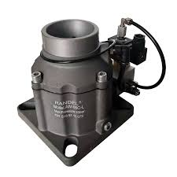

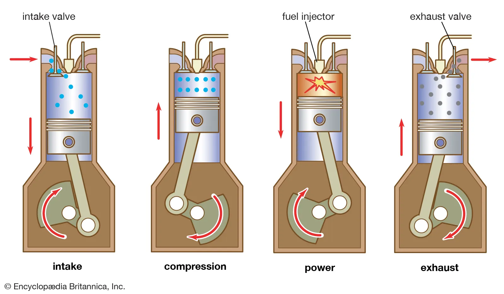

进气门，也就是intake valves，是发动机内部非常关键的小部件。想象一下，发动机就像一个不断重复呼吸的强力机器。进气门就是这个机器的“鼻孔”或“嘴”，负责在发动机运行时“吸气”。

当发动机启动后，每个气缸都会经历一系列的步骤，其中一个是“进气行程”。在这个时候，进气门会按照精确的时间打开，允许空气（在汽油发动机中，通常是空气和汽油混合物）进入气缸。这个过程就像是你深呼吸时鼻子和嘴巴张开，让新鲜空气进入肺部一样。

进气门的大小、开启和关闭的时机（这通常由凸轮轴控制）对发动机的性能至关重要。它们确保在正确的时间有足够的混合气进入，从而让发动机能够高效地做工，推动汽车前进。一旦气缸完成了做工，进气门会关闭，准备下一次的进气，整个过程循环往复，让发动机持续运转。所以，可以说进气门是发动机高效工作的起点。

====

B: I see. What else?

A: We also check your _spark plugs_ 火花塞, fuel filter 燃油滤清器,
and other oil levels such as *hydraulic （通过水管等）液压的，水力的 fluid* 液压油.
We also check the clutch  离合器踏板 and brakes to
determine when you will need new ones.

[.my2]
我们还会检查火花塞、燃油滤清器, 以及其他油液，比如液压油。我们还会检查离合器和刹车，以确定您何时需要更换新的。

[.my1]
.案例
====
.spark plugs
/spɑːrk plʌɡz/ n. components that ignite the fuel-air mixture in an engine (火花塞). +
一种用于内燃机中的零件，通过产生火花, 来点燃混合气体，使发动机正常工作。

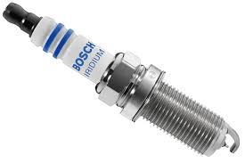

.fuel filter
/ˈfjuː.əl ˈfɪl.tər/ n. a device that removes impurities from the fuel (燃油滤清器). +
汽车内燃机"燃油管路"上的一个附件，用于在进入"化油器"之前, 过滤液体。 +

燃油滤清器（Fuel filter）, 有柴油滤清器（Diesel filter）、汽油滤清器（Fuel Filter）和天然气滤清器（Gas filter）三类。*"燃油滤清器"的作用, 是阻止"燃油"中的颗粒物、水及不洁物，保证燃油系统精密部件, 免受磨损及其他损害。*

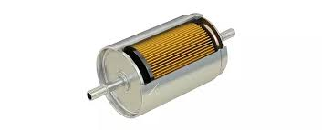

.hydraulic fluid
/haɪˈdrɔː.lɪk ˈfluː.ɪd/ n. a liquid used to transmit power in hydraulic systems (液压油). +
一种通常具有低粘度的液体，用于液压机构中的液压操作。

.clutch
/klʌtʃ/ n. a device that connects and disconnects the engine from the transmission (离合器).

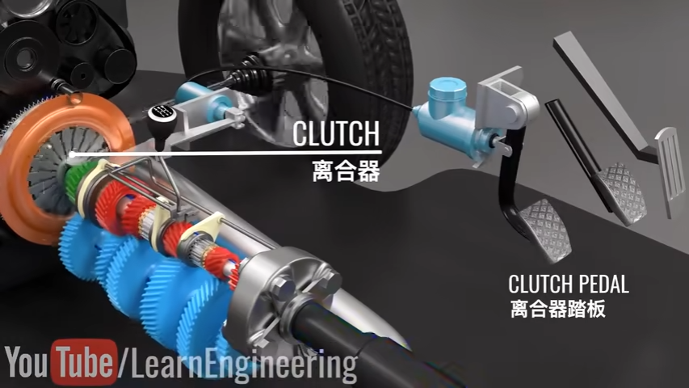
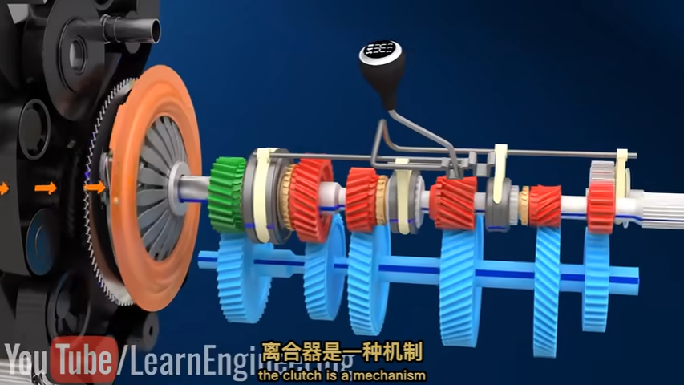

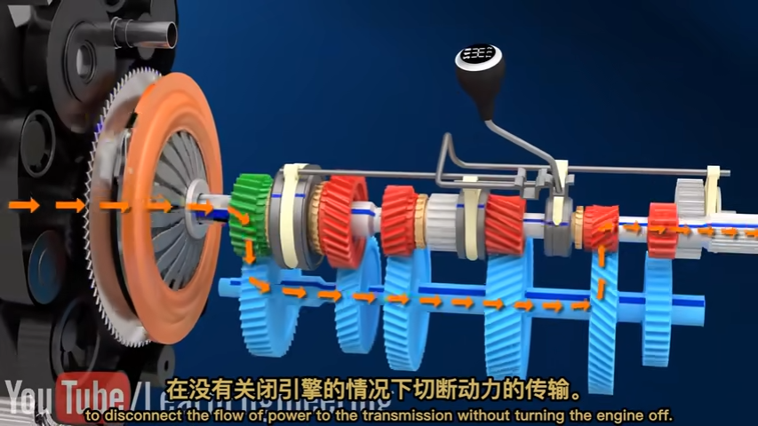

====

B: Ok, well, when you put it that way 既然你这么说, it
doesn’t seem like a waste of time and
money.

A: Trust me, regular *tune ups* 调整（发动机或自行车传动系统）以提高性能 will keep your
car running smoothly and avoid *break downs* 停止运行;故障.

'''

== ■(285) Daily Life ‐Handyman (C0285)  +
A: The air conditioning is not working! We need to call a handyman before we start to fry in here!  +
B: Dan is on top of that. I think they are also getting the handyman to fix the bathroom toilet that keeps clogging up.  +
A: That would be convenient. They might as well ask him to fix the electrical wiring. The circuit breakers keep going out all the time. It’s really annoying!  +
B: Yeah you are right. This office is falling apart! Frank told me the other day that the gutters outside were clogged and that’s why the parking lot was flooded.  +
A: I know! I was in ankle deep water trying to get to my car that day! The handyman definitely has his work cut out for him.  +
 +

'''

==== ◆(285) Daily Life ‐ Handyman 善于做室内外杂活的人；杂活工 (C0285)

A: The _air conditioning_ 空调 is not working! We
need to call a handyman 杂务工,维修工  before we start to
fry (v.)油煎，油炸;（被阳光）灼伤，晒伤 in here!

B: Dan is *on top of* 控制着；掌握着 that. I think they are also
getting the handyman to fix the bathroom
toilet that keeps *clogging 阻塞 up*.

[.my2]
Dan已经在处理了。我想他们还会让维修工修理"一直堵塞的卫生间马桶"。

[.my1]
.案例
====
.on top of sth/sb:
in control of a situation 控制着；掌握着 +
•Do you think he's really on top of his job? 你认为他真的能做好他的工作吗？
====

A: That would be convenient  方便的，便利的. They *might as
well* 不妨,最好还是 ask him to fix the _electrical wiring_ 电气布线. The
_circuit 电路，回路 breakers_ 电路断路器 keep going out all the time.
It’s really annoying!

[.my2]
他们不妨让他顺便修理一下电线。断路器总是跳闸，真的很烦人！

[.my1]
.案例
====
-  circuit breakers : /ˈsɜː.kɪt ˌbreɪ.kərz/ n. devices that automatically stop the flow of electricity in a circuit if it becomes overloaded (断路器). +
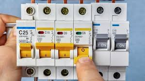
====

B: Yeah you are right. This office is _falling
apart_ 支离破碎;破败不堪! Frank *told* me the other day *that* the
gutters 水沟，水槽 outside were clogged 阻塞；妨碍 and that’s why
the _parking lot_ (小块土地)停车场 was flooded.

[.my2]
这办公室简直破败不堪！Frank前几天告诉我，外面的排水沟堵了，所以停车场被水淹了。

A: I know! I was in _ankle deep 脚踝深的 water_ trying
to get to my car that day! The handyman
definitely *has his work cut out* for him.

[.my2]
那天我蹚着及踝深的水去取车！维修工的任务肯定很艰巨。

[.my1]
.案例
====
.have your work cut out (for you)
to have something very difficult to do
面臨艱巨的任務 +
- She'll really *have her work cut out* to finish all those reports by the end of the week.
在週末之前完成所有這些報告, 對她來說真是個艱巨的任務。
====

'''

== ■(286) The Office ‐Presentation Series 6 ‐Addr essing the Audience (C0286)  +
Mr. Ford: The campaign that we have in store for the x420 is exciting, imaginative and revolutionary. We have spent two years listening to and responding to feedback from customers and staff alike.  +
Mr. Ford: I would like to say that without the assistance and support of each and every one of you we really could not have devised this campaign. I’d like to take my hat off and really thank you all for the wonderful work you’ve done so far, not only in helping support our marketing efforts, but also in your continuing your commitment to Alpha computers.  +
Mr. Ford: There’s no doubt in my mind that we have a great workforce here and together we can really push Alpha computers to a whole new level of success.  +
Mr. Ford: On the subject of the campaign let me ask you all a question. How do we define the perfect lap-top? Is it about affordability, quality, speed, reliability? What do you look for in a consumer? Well, I believe the answer lies in a combination of all of these elements. Mr. Ford: Our campaign will really hammer home the point that the x420 is a state-ofthe-art laptop for all of your computing needs. With our television campaign we hope to really reach out to a huge audience. Mr. Ford: We have a great ad campaign planned focusing on the fantastic USP’ s of the x420. We have hired one of the best PR companies to work with us on the campaign, and have already completed three separate TV adverts, all focusing on one key feature of the x420. Mr. Ford: I’m excited to say that today, for the first time, we will unveil to all of you here the first of these advertisements!  +
 +
 +
 +

'''

==== ◆(286) The Office ‐ Presentation Series 6 ‐ Addressing (v.)对……讲话；致词 the Audience 向听众致辞 (C0286)

Mr. Ford: `主` The  campaign 活动；运动 that we have  *in store* 即将发生的；准备就绪的 for the x420 `系` is exciting,  imaginative (a.)富有想象力的 and  revolutionary (a.)革命性的. We have spent two years listening to and responding to  feedback 反馈 from customers and staff 全体员工 alike 一样的.

Mr. Ford: I would like to say that /without the  assistance 帮助 and support of each and every one of you /we really could not have  devised (v.)设计；发明 this campaign. I’d like to  take my hat off 脱帽致敬（表示尊敬） /and really *thank* you all *for* the wonderful work you’ve done so far, *not only* in helping (v.) support (v.) our  marketing 市场营销 efforts, *but also* in your continuing  commitment 承诺 to Alpha computers.

Mr. Ford: There’s no doubt in my mind /that we have a great  workforce 全体员工 here /and together we can really * push* 推动 Alpha computers *to* a whole new level of success.

Mr. Ford: On the subject 关于，就……而言 of the campaign /let me ask you all a question. How do we  define (v.)定义 the perfect lap-top? Is it about  affordability (n.)价格合理;可购性，负担能力, quality, speed,  reliability 可靠性? What do you *look for* in a  consumer 消费者? Well, I believe the answer *lies (v.) in* a  combination 结合 of all of these  elements 要素.

Mr. Ford: Our campaign will really  *hammer (v.) home* 强调;反复强调某个观点或想法，直到某个人或一群人理解为止 the point 后定 that the x420 is a  state-of-the-art (a.)最先进的 laptop for all of your computing needs 您的所有计算需求. With our television campaign /we hope *to really  reach out to* 接触,把手伸向 a huge  audience 观众.

Mr. Ford: We have a great ad campaign 后定 planned (v.) focusing on the fantastic  USP’s 独特卖点 (Unique Selling Points) of the x420. We have hired one of the best  PR 公共关系 (Public Relations) companies /*to work with us* on the campaign, and have already completed three separate TV  adverts 广告, all *focusing on* one key  feature 特点 of the x420.

Mr. Ford: I’m excited to say that /today, for the first time, we will  unveil (v.)揭幕 to all of you here 双宾 the first of these advertisements!

[.my1]
.案例
====
- hammer (v.) home (ad.)到正确的位置 : /ˈhæmər hoʊm/ (phrasal verb) Emphasize repeatedly.  强调 +
The teacher hammered home the key points. 老师反复强调重点。 +
Ads hammer home product benefits. 广告反复强调产品优势。

- state-of-the-art : /steɪt əv ði ɑːrt/ (adj) Using the latest technology.  最先进的 +
- reach out to : /riːtʃ aʊt tuː/ (phrasal verb) Make contact with.  接触 +
Companies reach out to customers via social media. 公司通过社交媒体接触客户。 +
She reached out to old friends. 她联系了老朋友。

- take my hat off：俚语，表示尊敬或钦佩（idiom, showing respect or admiration）
- hammer home：强调某事的重要性（phrasal verb, to emphasize repeatedly）
-  state-of-the-art：专业术语，指技术最先进的产品（term for cutting-edge technology）
====

[.my2]
福特先生：我们为x420准备的营销活动充满激情、富有创意且具有革命性。我们花了两年时间倾听并回应客户和员工的反馈。 +
福特先生：我要说，没有你们每一个人的帮助和支持，我们真的无法设计出这个活动。我要向你们脱帽致敬，感谢你们至今的出色工作，不仅支持我们的营销，还持续为Alpha电脑奉献。 +
福特先生：毫无疑问，我们有一支优秀的团队，能共同将Alpha电脑推向新高度。 +
福特先生：关于这次活动，我问大家一个问题：如何定义完美笔记本电脑？是价格、质量、速度还是可靠性？消费者需要什么？我相信答案在于这些要素的结合。 +
福特先生：我们的活动将强调x420是最先进的全能笔记本电脑。通过电视广告，我们希望触达广大观众。 +
福特先生：我们策划了聚焦x420独特卖点的广告活动，聘请顶尖公关公司合作，并已完成三支分别突出产品特点的电视广告。 +
福特先生：今天我们将首次向各位展示第一支广告！ +

'''

== ■(287) Daily Life ‐High School Reunion (C0287)  +
A: I hate coming to high school reunions.  +
B: It will be great honey. We will get to see your old classmates and catch up to see how they have been doing.  +
A: Yeah I guess so. Oh look! There is Robert Matthews! Rob!  +
C: Hey Bill! Wow great to see you!  +
A: Likewise! It’s been a long time! This is my wife Dorthy.  +
C: Pleasure to meet you. So Bill, how have you been?  +
A: Can’t complain! We have 2 children who are in college and my business is going well. What about you?  +
C: Ah you know me! I am a dedicated bachelor. I never married although I do have a beautiful daughter with Mary, you remember her? We were high school sweetheart, didn’t really work out between us, but I really can’t complain either.  +
A: That’s good. Have you seen Frank? I was hoping he would come tonight.  +
C: You didn’t hear? Frank passed away last year.  +
A: Are you serious?  +
C: Nah! I’m just yanking your chain. He’ll be here soon. I saw him just last week and he told me he would show up.  +
 +
 +

'''

==== ◆(287) Daily Life ‐ High School Reunion (C0287)

A: I hate coming to  high school reunions (相聚) 高中同学聚会.

B: It will be great  honey 亲爱的. We will get to see your old  classmates 同学 and  catch up 叙旧 to see (v.) how they have been doing.

A: Yeah I guess so. Oh look! There is Robert Matthews! Rob!

C: Hey Bill! Wow great to see you!

A:  Likewise 我也是;同样地，类似地；（表示感觉相同）我也是，我有同感；也，还! It’s been a long time! This is my wife Dorthy.

C:  Pleasure 荣幸 to meet you. So Bill, how have you been 你最近怎么样?

A:  Can’t complain 没什么可抱怨的! We have 2 children who are in college 大学，专科学校；学院 and my business is going well. What about you?

C: Ah you know me! I am a  dedicated (a.)专心致志的，献身的；专用的，专门用途的 bachelor 坚定的单身汉. I never married /although I do have a beautiful daughter with Mary, you remember her? We were  high school sweethearts (爱人) 高中恋人, didn’t really work out 进展顺利 between us 我们之间并没有什么结果, but I really can’t complain either.

A: That’s good. Have you seen Frank? I was hoping he would come tonight.

C: You didn’t hear? Frank  *passed away* 去世 last year.

A: Are you  serious 认真的?

C: Nah! I’m just  *yanking (v.)猛拉；猛拽 your chain* 开玩笑;猛拽你的链条. He’ll be here soon. I saw him just last week /and he told me he would  show up 出现;到达.

[.my1]
.案例
====

-  catch up : /kætʃ ʌp/ (phrasal verb) Talk to someone to learn what has happened since you last met.  叙旧 +
Let’s catch up over coffee. 我们边喝咖啡边叙旧吧。 +
I need to catch up with my old friends. 我需要和老朋友叙叙旧。

-  likewise : /ˈlaɪkwaɪz/ (adverb) The same to you.  我也是
-  pleasure : /ˈplɛʒər/ (noun) A feeling of happiness or satisfaction.  荣幸
-  can’t complain : /kænt kəmˈpleɪn/ (phrase) Used to say that things are going well.  没什么可抱怨的

-  yanking your chain : /jæŋkɪŋ jɔːr tʃeɪn/ (phrase) Teasing or joking with someone.  开玩笑
-  show up : /ʃoʊ ʌp/ (phrasal verb) Arrive or appear.  出现 +
He didn’t show up for the meeting. 他没有出席会议。 +
The guests finally showed up. 客人们终于到了。 +

- yanking your chain：俚语，表示开玩笑（idiom, teasing or joking）
====

[.my2]
A：我讨厌参加高中同学聚会。 +
B：会很棒的，亲爱的。我们可以见到你的老同学，叙叙旧，看看他们最近怎么样。 +
A：是啊，我想也是。哦，看！那是罗伯特·马修斯！罗布！ +
C：嘿，比尔！哇，见到你真好！ +
A：我也是！好久不见了！这是我妻子多萝西。 +
C：很高兴认识你。比尔，你最近怎么样？ +
A：没什么可抱怨的！我有两个孩子在上大学，我的生意也很顺利。你呢？ +
C：啊，你知道我的！我是个坚定的单身汉。我从未结婚，不过我和玛丽有个漂亮的女儿，你还记得她吗？我们曾是高中恋人，虽然没走到最后，但我也没什么可抱怨的。 +
A：那很好。你见到弗兰克了吗？我本来希望他今晚能来。 +
C：你没听说吗？弗兰克去年去世了。 +
A：你是认真的吗？ +
C：不！我只是开玩笑。他很快就会来的。我上周还见到他，他说他会来。 +

'''

== ■(288) The Weekend ‐Getting A Tattoo (C0288)  +
A: I have made up my mind. I am getting a tattoo.  +
B: Really? Are you sure?  +
A: Yeah! Why not? They are trendy and look great! I want to get a dragon on my arm or maybe a tiger on my back.  +
B: Yeah but, it is something that you will have forever! They use indelible ink that can only be removed with laser treatment. On top of all that, I have heard it hurts a lot!  +
A: Really?  +
B: Of course! They use this machine with a needle that pokes your skin and inserts the ink.  +
A: Oh, I didn’t know that! I thought they just paint it on your skin or something.  +
B: I think you should reconsider and do some more research about tattoos. Also, find out where the nearest tattoo parlor is and make sure they used sterilized needles, and that the place is hygienic.  +
A: Maybe I should just get a tongue piercing!  +
 +

'''

==== ◆(288) The Weekend ‐ Getting A Tattoo 纹身 (C0288)

A: I have  made up my mind 下定决心. I am getting a  tattoo 纹身.

B: Really? Are you sure?

A: Yeah! Why not? They are  trendy (a.)时尚的;时髦的，赶时髦的；肤浅的 and look great! I want to get a  dragon 龙 on my arm /or maybe a  tiger  on my back.

B: Yeah but, it is something 后定 that you will have forever! They use (v.)  indelible (a.)难忘的，不可磨灭的；擦不掉的，无法去除的 ink 永久性墨水 that can only be removed with  laser treatment 激光治疗. On top of all that, I have heard it  hurts (v.)疼痛 a lot!

[.my1]
.案例
====
-  indelible -> in-,不，非，-delib,删除，抹去，词源同delete.引申词义难以磨灭的。
====

A: Really?

B: Of course! They use this machine with a  needle 针 that  pokes (v.)刺 your skin and  inserts (v.)注入 the ink.

A: Oh, I didn’t know that! I thought they just  paint 画 it on your skin or something.

B: I think you should  reconsider (v.)重新考虑 /and do some more  research 研究 about tattoos. Also, find out where the nearest  tattoo parlor (客厅；会客室；业务室；室内店铺) 纹身店 is /and make sure they use (v.) sterilized (a.)无菌的；已消过毒的 needles 消毒针, and that the place is  hygienic 卫生的.

[.my1]
.案例
====
- parlor -> 修道院是僧侣们修炼的地方，大部分地方都需要保持安静，以免影响僧侣的静修。只有少数房间专门用来接待外来的访客或供僧侣们交谈所用。这种房间在古法语中 被称为parleor，来自parler（会谈）。英语单词parlor就来源于此，现在通常用来表示美容院、按摩院等地的业务室。与它同源的单词是 parley（会谈）、parliament（国会）。 parlor：['pɑrlɚ] n.客厅，会客室，业务室 parley：['pɑːlɪ] n.vt.会谈，谈判 parliament：['pɑːləm(ə)nt] n.国会，议会

- sterile -> 来自拉丁语 sterilis,土地贫瘠的，无收获的，无产出的，来自 PIE*ster,固定的，坚固的，僵 硬的，词源同 stern,stark.后用于比喻义指无生育的，以及杀过菌的，消过毒的。
====

A: Maybe I should just get a  tongue piercing (（在身体部位打的）孔，洞;刺穿，穿透) 舌头穿孔!

[.my2]
A：我下定决心了。我要去纹身。 +
B：真的？你确定吗？ +
A：是啊！为什么不呢？纹身很时尚，而且看起来很棒！我想在手臂上纹一条龙，或者在背上纹一只老虎。 +
B：是啊，但纹身是永久性的！他们用的是永久性墨水，只能用激光治疗去除。而且，我听说纹身很疼！ +
A：真的吗？
B：当然！他们用带有针的机器刺破你的皮肤，然后把墨水注入进去。 +
A：哦，我不知道！我以为他们只是在皮肤上画画什么的。 +
B：我觉得你应该重新考虑一下，多研究一下纹身。另外，找到最近的纹身店，确保他们使用消毒针，而且地方要卫生。 +
A：也许我应该直接去穿个舌环！ +

'''

== ■(289) The Office ‐Presentation Series 7 ‐Hand ling Technical Problems (C0289)  +
Mr. Ford: Okay, so if we could dim the lights Jonathan, we can kick-off with the first TV advert. Please note that we are still in the early days with this advert, so it might seem a bit rough round the edges. Okay, so. just need to click this and the advert should pop up on the screen... Mr. Ford: Hmmmmmm. Sorry about this. Bear with me me a second. There seems to be a problem with the projector. Let me see. could you lend a hand a second? Jonathan: It looks like the projector is not recognizing the computer. Let me check the connection a second... Well the connection seems okay, and the computer is running normally.  +
Mr. Ford: Okay. Sorry guys. Obviously a problem with the system. Let’s just reboot and start over. Let’s see if this resolves the issue.  +
Jonathan: Right, let’s try again. No, still nothing Michael. There might be a technical issue with the projector. I think maybe the projector has overheated. We might need to cool it down for ten minutes and start again. I’ll call IT support to come over right now. Mr. Ford: Okay guys. Unfortunately technical problems do crop up from time to time, don’t they? But it’s not a huge problem. In the meantime while the IT guys get to work on that I can talk a little bit more about the advertising concept and what we are looking to achieve overall with this campaign.  +
 +
 +

'''

==== ◆(289) The Office ‐ Presentation Series 7 ‐ Handling (v.)处理，应付；操纵 Technical Problems (C0289)

Mr. Ford: Okay, so if we could  dim (v.)（使）变暗；变淡漠 the lights 调暗灯光 Jonathan, we can  kick-off 开始 with the first TV advert 广告. Please note that /we are still in the  early days 初期阶段 with this advert, so it might seem _a bit  rough (a.)（表面）粗糙的，不平的 round the edges_ 边缘粗糙;不够完美. Okay, so. just need to  click 点击 this /and the advert should  pop up 弹出 on the screen…

Mr. Ford: Hmmmmmm. Sorry about this.  Bear (v.)设法忍受（考验，困难） with me 稍等片刻 a second. There seems to be a problem with the  projector 投影仪. Let me see. could you  lend a hand 帮个忙 a second?

Jonathan: It looks like the projector is not  recognizing 识别 the computer. Let me  check the connection 检查连接 a second… Well the connection seems okay, and the computer is  running normally 正常运行.

Mr. Ford: Okay. Sorry guys. Obviously a problem with the system. Let’s just  reboot (v.)重启 and  *start over* 重新开始. Let’s see if this  resolves (v.) the issue 解决问题.

Jonathan: Right, let’s try again. No, still nothing Michael. There might be a  technical issue 技术问题 with the projector. I think maybe the projector has  overheated 过热. We might need *to  cool (v.) it down* 冷却 for ten minutes and start again. I’ll call (v.) IT support 技术支持 to come over right now.

Mr. Ford: Okay guys. Unfortunately  technical problems 技术问题 do  *crop (v.)（同时做某事的）一群人，一批人；（同时发生的）一些事情 up* （尤指意外地）出现，发生： from time to time, don’t they? But it’s not a huge problem. In the meantime /while the IT guys get to work on that /I can *talk* a little bit more *about* the  advertising concept 广告理念 /and what we are looking to  achieve (v.)实现 overall  总的说来，大体上 with this campaign.

[.my1]
.案例
====
.crop ˈup
to appear or happen, especially when it is not expected （尤指意外地）出现，发生 +
SYN come up +
•His name just cropped up in conversation. 交谈时无意中就提到了他的名字。 +
•I'll be late —something's cropped up at home. 我要晚一点来，家里突然出了点事。
====

[.my1]
.案例
====
-  kick-off : /kɪk ɒf/ (phrasal verb) Start something.  开始 +
Let’s kick-off the meeting. 让我们开始会议吧。 +
The event will kick-off at 8 PM. 活动将在晚上8点开始。

-  rough round the edges : /rʌf raʊnd ði ˈɛdʒɪz/ (phrase) Not perfect or polished.  不够完美

-  bear with me : /beər wɪð miː/ (phrase) Be patient with me.  稍等片刻

-  start over : /stɑːrt ˈoʊvər/ (phrasal verb) Begin again.  重新开始 +
Let’s start over from the beginning. 让我们从头开始吧。 +
I had to start over because of a mistake. 因为一个错误，我不得不重新开始。

-  crop up : /krɒp ʌp/ (phrasal verb) Appear unexpectedly.  出现
Problems often crop up during projects. 项目中经常会出现问题。 +
A new issue cropped up yesterday. 昨天出现了一个新问题。

- kick-off：俚语，表示开始（slang, to start something）
- bear with me：短语，表示稍等（phrase, be patient with me）
- rough round the edges：短语，表示不够完美（phrase, not perfect）
====

[.my2]
福特先生：好的，乔纳森，麻烦把灯光调暗，我们可以开始播放第一支电视广告了。请注意，这支广告还在初期阶段，可能看起来不够完美。好的，我只需要点击这里，广告就会在屏幕上弹出…… +
福特先生：嗯……抱歉，大家稍等片刻。投影仪似乎出了问题。让我看看，你能帮个忙吗？ +
乔纳森：看起来投影仪无法识别电脑。我来检查一下连接……嗯，连接似乎没问题，电脑也在正常运行。 +
福特先生：好的，抱歉各位。显然是系统出了问题。我们重启一下，重新开始吧。看看能不能解决问题。 +
乔纳森：好的，我们再试一次。不，还是不行，迈克尔。可能是投影仪的技术问题。我觉得投影仪可能过热了。我们可能需要让它冷却十分钟，然后再试一次。我马上叫技术支持过来。 +
福特先生：好的，各位。不幸的是，技术问题时不时会出现，对吧？但这并不是大问题。在技术人员修理的这段时间，我可以多谈谈广告理念，以及我们希望通过这次活动实现的目标。 +

'''

== ■(290) The Weekend ‐Buying Jewelery (C0290)  +
Shop assistant: Good afternoon, sir, is there anything I can help you with today? Mark: umm... yeah! I’m looking for a nice gift to give my girlfriend. Our fifth anniversary’s next Friday. Shop assistant: Well, I would be happy to assist you in choosing the perfect gift for her. Is there anything particular that you have in mind?  +
Mark: No, not really... I’m completely at a loss.  +
Shop assistant: Well, you can give her a set of pearl earrings, or this beautiful heart-shaped pendant. What is her favorite gemstone? Mark: That purple one. I’m sorry...I’ve never bought jewelery for anyone and I’m kind of nervous. Shop assistant: Don’t worry, we specialize in providing our customers a relaxed, pressure-free shopping environment. That stone is an amethyst. We have a range of beautiful amethyst pieces. Take a look at this bracelet. It’s 18K rose-gold, studded with amethyst and blue topaz. It’s a great statement piece.  +
 +
Mark: Oh...wow. That’s really pretty. Jess would love that. But...I was thinking of something a little more delicate, perhaps a necklace? Shop assistant: We have this beautiful platinum pendant, or you could also get her a locket. You could also get her a timepiece—it’s both glamorous yet functional. If you tell me a little more about your girlfriend, maybe I can help you find something for her. Mark: Jess? Well, she’s very smart, and has a great sense of humor. She’s very feminine... Shop assistant: Perhaps you could give her a ring? Mark: Well...actually...I was thinking about asking Jess to marry me...I’ve just been so nervous. Shop assistant: Well sir, I believe your fifth anniversary is a great time to propose! Mark: Okay, I’ve decided. I’m going to pop the question! Shop assistant: Fabulous! We should look at engagement rings then! Now that’s a whole other section.  +
 +

'''

==== ◆(290) The Weekend ‐ Buying Jewellery 珠宝，首饰 (C0290)

Shop assistant 店员: Good afternoon, sir, is there anything I can help you with today?

Mark: umm… yeah! I’m looking for a nice  gift 礼物 to give my girlfriend. Our fifth  anniversary 纪念日 is next Friday.

Shop assistant: Well, I would be happy to  assist (v.) 帮助 you /in choosing the perfect gift for her. Is there anything  particular 特定的 that you have in mind?

Mark: No, not really… I’m completely  *at a loss* 不知所措,困惑.

Shop assistant: Well, you can give her a set of  pearl earrings 珍珠耳环, or this beautiful  heart-shaped pendant (垂饰，坠饰) 心形吊坠. What is her favorite  gemstone 宝石?

[.my1]
.title
====
- pendant +
image:img/pendant.jpg[,15%]
====

Mark: That purple one. I’m sorry… I’ve never bought  jewelery 珠宝 for anyone /and I’m kind of  nervous 紧张的.

Shop assistant: Don’t worry, we  specialize (v.)专门研究（或从事），专攻；专营 in 专注于 providing our customers a  relaxed 轻松的,  pressure-free 无压力的 shopping environment. That stone is an  amethyst 紫水晶. We have a range of beautiful amethyst pieces. Take a look at this  bracelet 手链;手镯，臂镯. It’s  18K rose-gold 玫瑰金,  studded (v.)（尤指装饰用的）饰钉，镶嵌 with amethyst and  blue topaz (黄晶，黄玉) 蓝黄玉. It’s a great  _statement piece_ 标志性单品,亮眼单.

[.my1]
.title
====
- amethyst -> 前缀a-, 没有。methyst, 酒，词源同mead，酒。古时候传说佩戴该石能防醉酒。 +
image:img/amethyst.jpg[,15%]

- bracelet +
image:img/bracelet.jpg[,15%]
- stud -> 来自古英语 studu,柱子，支撑，来自 Proto-Germanic*stud,柱子，来自 PIE*stu,变体形式自 PIE*sta,站立，词源同 stand,state.后用于指钉头，节，把，并引申词义耳钉，鼻钉等。

- topaz +
黄玉是一种由铝和氟组成的硅酸盐矿物. 它被用作珠宝和其他装饰品的宝石 。*普通黄玉在自然状态下是无色的，但微量元素杂质会使其变成淡蓝色、金棕色至黄橙色。* 黄玉通常经过热处理或辐射处理，使其变成深蓝色、红橙色、淡绿色、粉红色或紫色。 +
image:img/topaz.jpg[,15%]
-  blue topaz  +
image:img/blue topaz.jpg[,15%]

.statement piece
亮眼单品：一种在时尚或室内装饰中, 引人注目的单件物品，通常具有独特的设计、颜色或材质，用于突出整体风格或个人品味。 +

What is a ‘statement piece’? What could it be?
什么是“声明作品”？它可以是什么？

- Clothes that draw attention to the person who wears them.  +
能够吸引穿着者注意的衣服。
- The first thing someone will notice about you. +
这是别人首先注意到您的一件事。
- Something you wear that attracts attention and that also expresses something about your personality. +
您所穿的某些衣服会吸引人们的注意，同时也能表达您的个性。
- An item of clothing or jewellery that is meant to convey a strong message. +
旨在传达强烈信息的服装或珠宝。
- An item that defines your personal style. +
一件能体现您个人风格的物品。

====

Mark: Oh… wow. That’s really  pretty 漂亮的. Jess would love that. But… I was thinking of something a little more  delicate 精致的, perhaps a  necklace 项链?

Shop assistant: We have this beautiful  platinum 铂，白金 pendant 铂金吊坠, or you could also get her a  locket 挂坠盒;小盒；小盒式吊坠. You could also get her a  timepiece 手表;钟等各种计时器 —it’s both  glamorous 迷人的 /yet 然而，但是 functional 实用的. If you tell me a little more about your girlfriend, maybe I can help you find something for her.

[.my1]
.title
====
- platinum +
image:img/platinum.jpg[,15%]

- locket +
image:img/locket.jpg[,15%]
====

Mark: Jess? Well, she’s very  smart 聪明的, and has a great  sense of humor 幽默感. She’s very  feminine (a.)女性化的;女性特有的，女子气的；女性的，妇女的；（语法）阴性的…

Shop assistant: Perhaps you could give her a  ring 戒指?

Mark: Well… actually… I was thinking about asking Jess to  marry 结婚 me… I’ve just been so nervous.

Shop assistant: Well sir, I believe your fifth anniversary is a great time to  propose (v.)求婚!

Mark: Okay, I’ve decided. I’m going to  pop (v.) the question 求婚!

Shop assistant:  Fabulous (a.)太棒了;极好的，绝妙的! We should look at  _engagement 婚约，订婚 rings_ 订婚戒指 then! Now that’s a whole other section.

[.my1]
.title
====
-  at a loss : /æt ə lɒs/ (phrase) Not knowing what to do or say.  不知所措

-  statement piece : /ˈsteɪtmənt piːs/ (noun) A bold (a.) or eye-catching (a.)引人注目的；耀眼的；显著的 item.  标志性单品
-  pop the question : /pɒp ðə ˈkwɛstʃən/ (phrase) Ask someone to marry you.  求婚
====

[.my2]
店员：下午好，先生，请问今天有什么可以帮您的吗？ +
马克：嗯……是的！我在找一份礼物送给我的女朋友。我们的五周年纪念日就在下周五。 +
店员：好的，我很乐意为您挑选一份完美的礼物。您有什么特别的想法吗？ +
马克：没有，真的……我完全不知所措。 +
店员：您可以送她一套珍珠耳环，或者这条漂亮的心形吊坠。她最喜欢的宝石是什么？ +
马克：那种紫色的。抱歉……我从未给任何人买过珠宝，有点紧张。 +
店员：别担心，我们专注于为顾客提供轻松无压力的购物环境。那种石头是紫水晶。我们有一系列漂亮的紫水晶饰品。看看这条手链，它是18K玫瑰金，镶嵌着紫水晶和蓝黄玉，是一件很棒的标志性单品。 +
马克：哦……哇，真的很漂亮。杰西一定会喜欢的。但……我在想更精致一点的东西，比如一条项链？ +
店员：我们有这条漂亮的铂金吊坠，或者您也可以送她一个挂坠盒。您还可以送她一块手表——既迷人又实用。如果您能多告诉我一些关于您女朋友的信息，也许我能帮您找到适合她的礼物。 +
马克：杰西？她非常聪明，而且很有幽默感。她非常女性化…… +
店员：也许您可以送她一枚戒指？ +
马克：嗯……其实……我在考虑向杰西求婚……只是我一直很紧张。 +
店员：先生，我认为五周年纪念日是个求婚的好时机！ +
马克：好吧，我决定了。我要向她求婚！ +
店员：太棒了！那我们应该看看订婚戒指了！这是另一个专区。 +

'''

== ■(291) Daily Life ‐Ordering Chinese Food (C0291)  +
Waitress: Hi, welcome to Happy Buddah!  +
Can I get you anything to drink?  +
Manny: A Coke for me, please.  +
 +
Andrea: I’ll have a Sprite.  +
 +
Waitress: Okay, I’ll go get that for you. Are  +
there any questions with the menu?  +
Andrea: Do you use MSG?  +
Waitress: No ma’am, we are MSG-free.  +
Andrea: Oh man, I haven’t had Chinese food  +
in so long! I want everything! This place has  +
the BEST sesame chicken.  +
Manny: Yeah, I’ve been craving Chinese for  +
such a long time. I used to get take-out all  +
the time. It’s definitely been a while. Let’s  +
start off with some crab rangoon.  +
Andrea: Ooh yeah, that sounds good. I think  +
I’m going to get the sesame chicken with  +
fried rice, a spring roll, and egg drop soup.  +
Manny: It’s so tempting to order everything  +
 +
on the menu, it all looks so appetizing! I think I’ll get General Tso’s chicken, hot and sour soup, fried wontons, and white rice. Andrea: Aren’t you supposed to be on a diet? You should at least get brown rice. Manny: I don’t think so! I hate brown rice, and I’m so sick of eating healthy all the time. I’ve been eating so much salad I swear I’ve forgotten what meat tastes like! There’s no better remedy than some nice, greasy, calorieladen Chinese food. I might even get an order of broccoli beef! Andrea: Gosh, I’m so hungry! Let’s call the waitress over!  +
 +

'''

==== ◆(291) Daily Life ‐ Ordering (v.) Chinese Food (C0291)

Waitress 女服务员: Hi, welcome to Happy Buddah 佛陀,觉醒者! Can I get you anything to drink?

Manny: A  Coke 可乐 for me, please.

Andrea: I’ll have a  Sprite 雪碧.

Waitress: Okay, I’ll go get that for you. Are there any questions with the  menu 菜单?

Andrea: Do you use  MSG 味精;谷胺酸单钠（=Monosodium (n.)味精；谷氨酸钠 Glutamate 谷氨酸盐；[生化] 谷氨酸酯）?

Waitress: No ma’am, we are  MSG-free 不含味精的.

Andrea: Oh man, I haven’t had  Chinese food 中餐 in so long! I want everything! This place has the BEST  _sesame  芝麻 chicken_ 芝麻鸡.

[.my1]
.title
====
- sesame chicken +
image:img/sesame chicken.jpg[,15%]
====

Manny: Yeah, I’ve been  craving (v.)渴望 Chinese for such a long time. I used to 过去常常 get  take-out 外卖 all the time. It’s definitely been a while. Let’s *start off 以……开始 with* some  _crab rangoon_ 蟹角;蟹肉馄饨.

[.my1]
.title
====
- crab rangoon +
image:img/crab rangoon.jpg[,15%]
====

Andrea: Ooh yeah, that sounds (v.) good. I think I’m going to get the _sesame chicken_ with  _fried rice_ 炒饭, a  _spring roll_ 春卷, and  _egg drop soup_ 蛋花汤.

[.my1]
.title
====
- spring roll +
image:img/spring roll.jpg[,15%]
====

Manny: It’s so  tempting (a.)诱人的 to order (v.) everything on the menu, it all looks so  appetizing (a.)开胃的；促进食欲的! I think I’ll get  _General Tso’s chicken_ 左宗棠鸡,  hot and sour soup 酸辣汤,  fried wontons 炸馄饨, and  white rice 白米饭.

[.my1]
.title
====

- General Tso’s chicken +
左宗棠鸡, 是将鸡块裹上两次油炸的面包粉，再淋上一层美味香甜的粘稠酱汁，口感酥脆。 +
image:img/General Tso’s chicken.jpg[,15%]
====

Andrea: Aren’t you supposed 预期，推断；假定；认为 to be on a  diet (节食) 你不是应该在节食吗? You should at least get  _brown rice_ 糙米.

[.my1]
.title
====
.brown rice : 糙米：去壳但未经过抛光的大米，保留了大部分的麸皮层、胚乳和胚芽。 +
image:img/brown rice.jpg[,15%]

====

Manny: I don’t think so! I hate brown rice, and I’m so sick 厌倦的，厌烦的 of eating  healthy 健康的 all the time. I’ve been eating so much  salad 沙拉 /I swear (v.)咒骂，诅咒；郑重承诺，发誓；保证  I’ve forgotten what  meat 肉 tastes (v.) like! There’s no better  remedy 补救措施 than some _nice,  greasy (a.)油腻的;沾油脂的，油污的；含脂肪的,  calorie-laden (a.)(负载的；装满的) 高热量的 Chinese food_. I might even get an order of  _broccoli 花茎甘蓝，西兰花菜 beef_ 西兰花牛肉!

[.my1]
.title
====
- broccoli beef +
image:img/broccoli beef.jpg[,15%]
====

Andrea: Gosh （非正式，表惊讶）天哪；上帝, I’m so  hungry 饿的! Let’s *call* the waitress *over* 把某人叫过来,要求（某人）到自己的位置!

[.my1]
.title
====
-  sesame chicken : /ˈsɛsəmi ˈtʃɪkɪn/ (noun) A Chinese dish with chicken and sesame sauce.  芝麻鸡
-  crab rangoon : /kræb ræŋˈɡuːn/ (noun) A deep-fried dumpling filled with crab and cream cheese.  蟹角
-  egg drop soup : /ɛɡ drɒp suːp/ (noun) A Chinese soup made with beaten eggs.  蛋花汤
-  General Tso’s chicken : /ˈdʒɛnərəl tsoʊz ˈtʃɪkɪn/ (noun) A Chinese-American dish with fried chicken in a sweet and spicy sauce.  左宗棠鸡
-  hot and sour soup : /hɒt ænd ˈsaʊər suːp/ (noun) A Chinese soup with a spicy and tangy flavor.  酸辣汤
-  fried wontons : /fraɪd ˈwɒntɒnz/ (noun) Deep-fried dumplings filled with meat or vegetables.  炸馄饨
-  brown rice : /braʊn raɪs/ (noun) Unpolished rice with the bran layer intact.  糙米
-  broccoli beef : /ˈbrɒkəli biːf/ (noun) A Chinese dish with beef and broccoli.  西兰花牛肉
====

[.my2]
女服务员：嗨，欢迎来到快乐佛！请问您想喝点什么？ +
曼尼：请给我一杯可乐。 +
安德莉亚：我要一杯雪碧。 +
女服务员：好的，我马上去拿。您对菜单有什么问题吗？ +
安德莉亚：你们用味精吗？ +
女服务员：不用，女士，我们不含味精。 +
安德莉亚：哦，天哪，我好久没吃中餐了！我什么都想吃！这里的芝麻鸡最好吃。 +
曼尼：是啊，我很久以来一直渴望吃中餐。我以前经常点外卖。确实有一阵子没吃了。我们先点些蟹角吧。 +
安德莉亚：哦，听起来不错。我想点芝麻鸡配炒饭，一个春卷，还有蛋花汤。 +
曼尼：菜单上的每道菜都太诱人了，看起来都很开胃！我想点左宗棠鸡、酸辣汤、炸馄饨和白米饭。 +
安德莉亚：你不是在节食吗？至少应该点糙米吧。 +
曼尼：我才不呢！我讨厌糙米，而且我受够了总是吃健康食品。我吃了这么多沙拉，都快忘了肉是什么味道了！没有什么比美味的、油腻的、高热量的中餐更好的补救措施了。我可能还会点一份西兰花牛肉！ +
安德莉亚：天哪，我太饿了！我们叫服务员过来吧！ +

'''

== ■(292) The Office ‐Presentation Series 8 ‐Com mon Presentation Mistakes (C0292)  +
Mr. Ford: So as I mentioned previously the campaign advertisement will focus on those key elements that every consumer looks for in a quality laptop: affordability, quality, speed and reliability. We have pulled out all the stops to produce a product that really rivals all our competitors. Mr. Ford: Actually, just to illustrate my point let me give you an anecdote here. I remember last year I was playing golf with one of our key suppliers. It was a lovely summer afternoon. Anyway, I invited our supplier for a game of golf, and wanted to get his input on the new x420.  +
Mr. Ford: Actually, I often get together with him for a good game of golf. It really is a wonderful way to relax. To be honest, I’m not that great at golf, but I have improved in the last few years. But the key to golf is practice, practice, practice. I’ve lost my thread. What was I talking about again?  +
Jonathan: I think you were discussing the campaign advertisement Michael. Mr. Ford: Yes, excuse me. I’m afraid I got sidetracked there. Yes anyway, the campaign. Well, erm. let me see. Is the projector working yet Jonathan? Jonathan: No sorry, IT are still fixing it. Mr. Ford: Ahh okay, erm... all the information on the campaign is on the PowerPoint. I haven’t actually got my notes with me...ermlet me see, erm..... Audience Member: Mr. Ford, could you at least tell us the schedule for the campaign? When are the first advertisements scheduled for? Mr. Ford: That’s a good question. Unfortunately I erm...don’t have that information on me. I will have to get back to you on that point. Jonathan: Okay Michael, the projector is fixed. I think we’re ready. Mr. Ford: Thank goodness. Okay everyone, sorry for the delay. So without further ado the new x420 marketing campaign! Enjoy! oh ermmm. I’m terribly sorry, this is not the advert, this is my golfing holiday in Barbados. I think I must have brought the wrong file. Can we take five?  +

'''

==== ◆(292) The Office ‐ Presentation Series 8 ‐ Common Presentation 介绍会，发布会；陈述，报告，说明 Mistakes 常见的陈述错误 (C0292)

Mr. Ford: So as I  mentioned previously 之前提到的, the campaign  advertisement 广告 will focus on those  key elements 关键要素 that every  consumer 消费者 *looks for* in a  quality 质量 laptop:  affordability 价格合理, quality,  speed 速度, and  reliability 可靠性. We have  *pulled out all the stops* 全力以赴 to produce a product 后定 that really  rivals (v.)匹敌 all our  competitors 竞争对手.

[.my1]
.案例
====
.pull out all the stops
to do everything you can to make something successful: +
- They *pulled out all the stops* for their daughter's wedding.

这个短语中的“stop”，实际上指的是老式管风琴（organ）的音栓。 +
在管风琴的演奏中，琴师通过键盘操作，会触发机关，使风进入音管，从而产生声音。这些音管, 都由音栓控制，可以单独发声或调节音量大小。 +
**如果琴师将所有音栓拉出，那么管风琴在演奏时就会发出最大的音量，**所有音管同时发声。因此，“pull out all the stops”这个短语便有了“全力以赴”的含义。

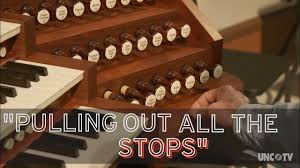
====

Mr. Ford: Actually, just to  illustrate 说明 my point /let me give you an  anecdote 轶事，趣闻；传闻 here. I remember (v.) last year /I was playing  golf 高尔夫 with one of our key  suppliers 供应商. It was a lovely summer afternoon. Anyway, I invited our supplier for a game of golf, and wanted to get his  input （为帮助某人做出决定而提供的）建议，意见 on the new x420.

[.my1]
.案例
====
- anecdote -> 前缀an-, 没有。前缀ec-,同ex-, 向外。词根don，给予，见donate, 捐赠，过去分词dot.
====

Mr. Ford: Actually, I often  get together 聚会 with him /for a good game of golf. It really is a wonderful way to  relax 放松. To be honest, I’m not that great at 擅长 golf, but I have  improved 提高 in the last few years. But the key to golf is  practice 练习, practice, practice. I’ve  lost my thread 跑题. What was I talking about again?

Jonathan: I think /you were  discussing 讨论 the campaign advertisement Michael.

Mr. Ford: Yes,  excuse me 抱歉. I’m afraid /I got  sidetracked (v.)分心;使分心，使离题 there. Yes anyway, the campaign. Well, erm. let me see. *Is* the  projector 投影仪 *working* (v.) yet /Jonathan?

Jonathan: No sorry, IT are still  fixing 修理 it.

Mr. Ford: Ahh okay, erm… all the information on the campaign is on the  PowerPoint 幻灯片. I haven’t actually got my  notes 笔记 with me… erm let me see, erm…

Audience Member 观众: Mr. Ford, could you at least tell us the  schedule 时间表 for the campaign? When are the first advertisements  *scheduled (v.) for* 安排；为…安排时间；预定;计划?

[.my1]
.案例
====
.schedule
(v.)~ sth (for sth): [ usually passive]to arrange for sth to happen at a particular time 安排；为…安排时间；预定 +
[ VN]
•The meeting *is scheduled for* Friday afternoon. 会议安排在星期五下午。
====

Mr. Ford: That’s a good question. Unfortunately I erm… don’t have that information on me 我没有这方面的资料. I will have to  *get back 回复 to* you 稍后回复 on that point 就这一点来说,说到这点.

Jonathan: Okay Michael, the projector is  fixed 修好了. I think we’re ready.

Mr. Ford:  Thank goodness 谢天谢地. Okay everyone, sorry for the  delay 延误. So *without further  ado* (废话; 耽搁)毫不迟延；干脆；立即 the new x420 marketing campaign! Enjoy! oh ermmm. I’m terribly sorry, this is not the advert <英>广告, this is my golfing  holiday 假期 in Barbados 国家名. I think I must have  brought the wrong file 带错文件. Can we take five 我们能休息五分钟吗?

[.my1]
.案例
====
-  pulled out all the stops : /pʊld aʊt ɔːl ðə stɒps/ (phrase) Made every possible effort.  全力以赴

-  get back to you : /ɡɛt bæk tuː juː/ (phrase) Respond to someone later.  稍后回复
====

[.my2]
福特先生：正如我之前提到的，这次广告活动将聚焦于每个消费者在优质笔记本电脑中寻找的关键要素：价格合理、质量、速度和可靠性。我们全力以赴，生产出一款真正能与所有竞争对手匹敌的产品。 +
福特先生：实际上，为了说明我的观点，我给大家讲个轶事。我记得去年我和一位重要供应商打高尔夫。那是一个美好的夏日午后。总之，我邀请供应商打高尔夫，并想听听他对新款x420的意见。 +
福特先生：实际上，我经常和他一起打高尔夫。这真是一种很好的放松方式。说实话，我的高尔夫水平并不高，但最近几年有所提高。但高尔夫的关键是练习、练习、再练习。我跑题了。我刚才在说什么来着？ +
乔纳森：我想您刚才在讨论广告活动，迈克尔。 +
福特先生：是的，抱歉。恐怕我刚才分心了。总之，活动的事。嗯，让我看看。乔纳森，投影仪修好了吗？ +
乔纳森：抱歉，IT还在修理。 +
福特先生：啊，好吧……所有关于活动的信息都在幻灯片里。我其实没带笔记……嗯，让我看看…… +
观众：福特先生，您至少能告诉我们活动的时间表吗？第一支广告计划什么时候发布？ +
福特先生：这是个好问题。不幸的是，我……手头没有这个信息。我得稍后回复您这一点。 +
乔纳森：好了，迈克尔，投影仪修好了。我想我们可以开始了。 +
福特先生：谢天谢地。各位，抱歉耽误了时间。那么，废话不多说，开始x420的营销活动吧！请欣赏！哦，呃……非常抱歉，这不是广告，这是我在巴巴多斯的高尔夫假期。我想我一定是带错文件了。我们能休息五分钟吗？ +

'''

== ■(293) Advanced Media ‐Cheese Lovers (F0293 )  +
A:  +
Hello everyone my name is Laurie and I want to welcome you to this course. We will learn all about one of the oldest yet most delicious foods on this planet; cheese! Let’s get started!  +
 +
A:  +
Cheese is usually categorized intofour types: soft, semi-soft semi-hard and hard. The designation refers to the amount of moisture in the cheese, which directly affects its texture. Making cheese is an ancient practice, dating back thousands of years, and the home cheese maker can usually find recipes for cheese that falls into any of the four categories.  +
 +
A:  +
Soft cheese includes cottage cheese, cream cheese, ricotta, brie, bleu, roquefort, mozzarella, meunster and similar cheeses. These cheeses generally pair well with fruit or meats, or can be used as breakfast cheeses in an omelette Nor as pasta fillings. They are usually mildly flavored and very high in moisture.  +
 +
A:  +
American, Colby, co-jack and similar cheeses are inthe semi-soft category. These are slightly stronger in flavor and cover a  +
 +
 +
wide range of uses. Co-jack cheese, a blend of Colby and Monterrey jack is one of the most popular. This allows the sharper flavor of Colby to be combined with the milder jack cheese, and also melts better than plain Colby. Grilled cheese sandwiches often use American cheese, and Mexican cheeses such as Asadero and Queso Fresco are becoming more popular.  +
A: Hard cheeses include Parmesan, Romano, Asiago, Swiss, Gruyere and others. Parmesan and Romano are most familiar as the grated powder used to top spaghetti, but they are also used as accompaniments for fruit, wine, nuts and other appetizer items. Swiss is a popular sandwich cheese and melts well, unlike some other hard cheeses.  +
 +

'''

==== ◆(293) Advanced Media ‐ Cheese 干酪，奶酪 Lovers （非婚的）情人；爱好者 (F0293)

A: Hello everyone my name is Laurie /and I want to  welcome 欢迎 you to this  course 课程. We will *learn* all *about* _one of the oldest yet most  delicious 美味的 foods_ 后定 on this planet 我们将了解地球上最古老但最美味的食物之一;  cheese 奶酪! Let’s get started!

A: Cheese is usually  categorized (v.) into 分类为 four types:  soft 软的,  semi-soft 半软的,  semi-hard 半硬的, and  hard 硬的. The  designation 分类 *refers to* 指的是 the amount of  moisture 水分 in the cheese, which directly  affects (v.) 影响 its  texture 质地. `主` Making cheese `系` is an  ancient 古老的  practice 实践, *dating (v.) back* 指的是 thousands of years, and `主` the home cheese maker 制造者 `谓` can usually find  (v.) recipes 食谱 for cheese 后定 that *falls into* 属于（特定的类别或范围） any of the four categories.

A: Soft cheese includes  (v.) cottage cheese 乡村奶酪,  cream cheese 奶油奶酪,  ricotta 意大利乳清干酪,  brie 布里奶酪,  bleu 蓝纹奶酪,  roquefort 罗克福尔奶酪,  mozzarella 马苏里拉奶酪,  meunster 明斯特奶酪, and similar cheeses. These cheeses generally  *pair (v.) well with* 搭配 fruit or meats, or can *be used as*  breakfast cheeses 早餐奶酪 in an  omelette 煎蛋卷 or *as*  pasta fillings 意大利面馅料. They are usually  mildly flavored (a.)味道温和的 and very high in moisture.

A:  American 美国奶酪,  Colby 科尔比奶酪,  co-jack 科尔比杰克奶酪, and similar cheeses are in the semi-soft category. These are  slightly stronger 味道稍浓 in flavor /and cover (v.) a wide range of uses. Co-jack cheese, a  blend 混合 of Colby and  Monterrey jack 蒙特雷杰克奶酪, is one of the most popular. This *allows* (v.) the  sharper flavor 更浓烈的味道 of Colby *to be combined with* the  milder 较温和的 jack cheese, and also  melts (v.) better 更容易融化 than plain Colby.  _Grilled (a.)烤的；有格子的
 cheese sandwiches_ 烤奶酪三明治 often use (v.) American cheese, and  `主` Mexican cheeses 墨西哥奶酪 such as  Asadero 阿萨德罗奶酪 and  Queso Fresco 新鲜奶酪  `谓` are becoming more popular.

A: Hard cheeses include (v.) Parmesan 帕尔马干酪,  Romano 罗马诺奶酪,  Asiago 阿齐亚戈奶酪,  Swiss 瑞士奶酪,  Gruyere 格鲁耶尔奶酪, and others. Parmesan and Romano are most  familiar (a.)熟悉的 as _the  grated 磨碎 powder_ 磨碎的粉末 used (v.) to top (v.)把（某物）放在…的上面 spaghetti 意大利面, but they are also used (v.) as  accompaniments 配菜;伴奏；伴随物 for fruit, wine, nuts, and other  appetizer (n.) items 开胃菜. Swiss is _a popular  sandwich cheese_ 三明治奶酪 and *melts (v.) well*, unlike   some other hard cheeses.

[.my1]
.案例
====
-  cottage cheese : /ˈkɒtɪdʒ tʃiːz/ (noun) A soft, lumpy cheese made from curds.  乡村奶酪
-  cream cheese : /kriːm tʃiːz/ (noun) A soft, spreadable cheese made from milk and cream.  奶油奶酪
-  ricotta : /rɪˈkɒtə/ (noun) An *Italian* whey cheese.  意大利乳清干酪
-  brie : /briː/ (noun) A soft *French* cheese with a creamy texture.  布里奶酪
-  bleu : /bluː/ (noun) A type of blue cheese.  蓝纹奶酪
-  roquefort : /ˈrɒkfɔːrt/ (noun) A *French* blue cheese made from sheep’s milk.  罗克福尔奶酪
-  mozzarella : /ˌmɒtsəˈrɛlə/ (noun) A soft *Italian* cheese used in cooking.  马苏里拉奶酪
-  meunster : /ˈmʌnstər/ (noun) A semi-soft cheese with a strong flavor.  明斯特奶酪
-  pair (v.) well with : /peər wɛl wɪð/ (phrase) Complement or match something.  搭配 +
Wine pairs well with cheese. 葡萄酒和奶酪很配。 +
This dish pairs well with rice. 这道菜和米饭很配。

-  breakfast cheeses : /ˈbrɛkfəst tʃiːz/ (noun) Cheeses commonly eaten at breakfast.  早餐奶酪
-  omelette : /ˈɒmlɪt/ (noun) A dish made from beaten eggs cooked in a pan.  煎蛋卷
-  pasta fillings : /ˈpɑːstə ˈfɪlɪŋz/ (noun) Ingredients used to stuff pasta.  意大利面馅料
-  American : /əˈmɛrɪkən/ (noun) A type of processed cheese.  美国奶酪
-  Colby : /ˈkɒlbi/ (noun) A semi-hard cheese from the *USA*.  科尔比奶酪
-  co-jack : /koʊ dʒæk/ (noun) A blend of Colby and Monterrey jack cheese.  科尔比杰克奶酪
-  Monterrey jack : /ˌmɒntəˈreɪ dʒæk/ (noun) A semi-soft cheese from the *USA*.  蒙特雷杰克奶酪
-  grilled cheese sandwiches : /ɡrɪld tʃiːz ˈsænwɪtʃɪz/ (noun) Sandwiches with melted cheese.  烤奶酪三明治
-  Mexican cheeses : /ˈmɛksɪkən tʃiːz/ (noun) Cheeses originating from *Mexico*.  墨西哥奶酪
-  Asadero : /ˌɑːsəˈdɛroʊ/ (noun) A *Mexican* cheese used for melting.  阿萨德罗奶酪
-  Queso Fresco : /ˈkeɪsoʊ ˈfrɛskoʊ/ (noun) A fresh *Mexican* cheese.  新鲜奶酪
-  Parmesan : /ˈpɑːrməzæn/ (noun) A hard *Italian* cheese.  帕尔马干酪
-  Romano : /roʊˈmɑːnoʊ/ (noun) A hard *Italian* cheese.  罗马诺奶酪
-  Asiago : /ˌɑːsiˈɑːɡoʊ/ (noun) An *Italian* cheese with a nutty flavor.  阿齐亚戈奶酪
-  Swiss : /swɪs/ (noun) A cheese with holes, originating from *Switzerland*.  瑞士奶酪
-  Gruyere : /ɡruːˈjɛər/ (noun) A hard *Swiss* cheese.  格鲁耶尔奶酪
-  grated powder : /ˈɡreɪtɪd ˈpaʊdər/ (noun) Cheese that has been finely shredded.  磨碎的粉末
-  spaghetti : /spəˈɡɛti/ (noun) A type of pasta.  意大利面
-  accompaniments : /əˈkʌmpənɪmənts/ (noun) Items served alongside a main dish.  配菜
-  appetizer items : /ˈæpɪtaɪzər ˈaɪtəmz/ (noun) Small dishes served before a meal.  开胃菜
-  sandwich cheese : /ˈsænwɪtʃ tʃiːz/ (noun) Cheese used in sandwiches.  三明治奶酪

====

[.my2]
A：大家好，我叫劳里，欢迎参加本课程。我们将学习地球上最古老且最美味的食物之一——奶酪！让我们开始吧！ +
A：奶酪通常分为四类：软奶酪、半软奶酪、半硬奶酪和硬奶酪。这种分类是根据奶酪中的水分含量来划分的，水分直接影响奶酪的质地。制作奶酪是一种古老的实践，可以追溯到几千年前，家庭奶酪制作者通常可以找到适用于这四类奶酪的食谱。 +
A：软奶酪包括乡村奶酪、奶油奶酪、意大利乳清干酪、布里奶酪、蓝纹奶酪、罗克福尔奶酪、马苏里拉奶酪、明斯特奶酪等。这些奶酪通常与水果或肉类搭配得很好，或者可以作为早餐奶酪用于煎蛋卷或意大利面馅料。它们通常味道温和，水分含量很高。 +
A：美国奶酪、科尔比奶酪、科尔比杰克奶酪等属于半软奶酪。这些奶酪味道稍浓，用途广泛。科尔比杰克奶酪是科尔比奶酪和蒙特雷杰克奶酪的混合，是最受欢迎的奶酪之一。它将科尔比奶酪更浓烈的味道与较温和的杰克奶酪结合在一起，而且比纯科尔比奶酪更容易融化。烤奶酪三明治通常使用美国奶酪，而墨西哥奶酪如阿萨德罗奶酪和新鲜奶酪也越来越受欢迎。 +
A：硬奶酪包括帕尔马干酪、罗马诺奶酪、阿齐亚戈奶酪、瑞士奶酪、格鲁耶尔奶酪等。帕尔马干酪和罗马诺奶酪最常见的用途是作为磨碎的粉末撒在意大利面上，但它们也可以作为水果、葡萄酒、坚果和其他开胃菜的配菜。瑞士奶酪是一种流行的三明治奶酪，而且容易融化，不像其他一些硬奶酪。 +

'''

== ■(294) Daily Life ‐Picking A University (C0294)  +
A: I’ve never heard of AmLion College. Could you...  +
B: Of course sir, let me give you a brief overview. AmLion College is located in the center of New York city. The school covers a wide range of academic subjects; and eighty percent of the courses are transferable to other state universities. And, last year AmLion College was ranked number one in terms of graduate employment.  +
A: Interesting, and what about the tuition fees, then?  +
B: You’ll be looking at somewhere around fifteen thousand US dollars per semester.  +
A: Okay, well.  +
B: And, did I mention our on-campus housing? Students can stay in our newly renovated dorms for as little as three thousand dollars per month!  +
A: Sounds good. Well. I’ll just grab one of your flyers.  +
B: Sir, you got the wrong flyer. Sir, sir!  +
 +

'''

==== ◆(294) Daily Life ‐ Picking A University 挑选大学 (C0294)

A: I’ve never heard of  AmLion College 阿姆莱恩学院. Could you…

B: Of course sir, let me give you a  brief overview 简要介绍. AmLion College is  located 位于 in the center of New York city. The school  covers (v.)涵盖 a wide range of  academic subjects 学术科目; and eighty percent of the  courses 课程 are  transferable (a.)可转学分的,可转移的 to other  state universities 州立大学. And, last year AmLion College was  ranked (v.)排名 number one *in terms of*  graduate employment 毕业生就业率.

A: Interesting, and what about the  tuition fees 学费, then?

B: *You’ll be looking at* 你大概会需要支付…,你预计要面对 somewhere around fifteen thousand US dollars per  semester 学期.

[.my1]
.案例
====
.You’ll be looking at...
这个表达是一个口语中常用的表达方式，意思是： 你大概会需要支付…… 或 你预计要面对…… +
它不是说“你在看着什么”，而是指**“你可以预期/预计会遇到……”，常用于谈论价格、成本、时间、数量等估算或预测**。

所以整句的意思是：你每学期的学费大概在一万五千美元左右。或, 你每学期大概需要准备一万五千美元左右的学费。

- *You’ll be looking at* a 3-hour drive to get there.
→ 你大概需要开车3个小时才能到那里。 +
- *You’ll be looking at* about $1000 for that model.
→ 那个型号大概要1000美元左右。
====

A: Okay, well.

B: And, did I mention (v.) our  on-campus housing (住房供给) 校内住宿? Students can stay (v.) in our newly  renovated 翻新的  dorms 宿舍 for *as little as* 非常少，仅仅只有 three thousand dollars per month!

A: Sounds good. Well. I’ll just  grab 拿 one of your  flyers 宣传单,小（广告）传单.

B: Sir, you got the wrong flyer. Sir, sir!

[.my1]
.案例
====
- on-campus housing : /ɒn ˈkæmpəs ˈhaʊzɪŋ/ (noun) Accommodation provided by a university for students.  校内住宿
====

[.my2]
A：我从未听说过阿姆莱恩学院。你能…… +
B：当然可以，先生，让我为您简要介绍一下。阿姆莱恩学院位于纽约市中心。学校涵盖广泛的学术科目，80%的课程可以转学分到其他州立大学。而且，去年阿姆莱恩学院在毕业生就业率方面排名第一。 +
A：有趣，那学费是多少呢？ +
B：您需要支付每学期大约1.5万美元的学费。 +
A：好的，明白了。 +
B：还有，我提到过我们的校内住宿吗？学生可以住在我们新翻新的宿舍里，每月只需3000美元！ +
A：听起来不错。嗯，我拿一张你们的宣传单吧。 +
B：先生，您拿错宣传单了。先生，先生！ +

'''

== ■(295) The Office ‐Presentation Series 9 ‐Sum mary and Conclusion (C0295)  +
Mr. Ford: Right everyone. I apologize that I can’t show you the marketing campaign today, but next week you will all have the opportunity to see if for yourselves, and I have no doubt that you will be impressed. Let me wrap up the presentation by summarising my key points.  +
 +
Mr. Ford: As I mentioned at the outset, 2010 represents a key year for Alpha computers. The recession is hopefully behind us. It is clear to everyone in the computer industry that demand is booming, especially in the developing markets.  +
Mr. Ford: If we are to succeed in this ultracompetitive field then we really need to push forward and offer our customers products that meet their needs on all levels. As I hope I have illustrated, the x420 represents the kind of computer that can really satisfy those needs.  +
Mr. Ford: I gave you an idea of the kind of revenue we expect to hit in 2010 with the new x420 range, and believe me, this is really just the beginning. Once we establish the x420 in the market we have plans to continue to expand our range with ever more revolutionary and impressive products. Mr. Ford: Alpha computers is dedicated to innovation and improvement. I really see no limit to our potential as long as we stick to the principles I stressed earlier: quality, excellence and service. Mr. Ford: Before we move on to the Q and A section I’d really like to leave you with a quote that really sums up everything that we’ve discussed today, and hopefully it will provide you with the same inspiration that it gives me. Mr. Ford: As the great Henry Ford once said ” Quality means doing it right, when no one is looking” Well, in fact our customers are looking; they are looking for us to lead the way and to give them the quality that our competitors cannot. We cannot let them down!  +
 +

'''

==== ◆(295) The Office ‐ Presentation Series 9 ‐ Summary and Conclusion 归纳与总结 (C0295)

Mr. Ford: Right everyone. I  apologize 道歉 that /I can’t show you the  marketing campaign 营销活动 today, but next week /you will all have the  opportunity 机会 to see it for yourselves, and I have no doubt  that 我对此毫不怀疑 you will be  impressed 印象深刻. Let me  wrap up 总结 the presentation by  summarising (v.)概述 my key points.

Mr. Ford: As I  mentioned at the outset 一开始提到的, 2010  represents (v.)代表 a key year for Alpha computers. The  recession 经济衰退 is hopefully behind us 希望经济衰退已经过去. *It is clear* to everyone in the computer  industry 行业 *that*  /`主` demand 需求 `谓` is  booming 激增, especially in the  developing markets 发展中市场.

[.my1]
.案例
====
.The recession is hopefully behind us.
The recession：经济衰退 +
is behind us：已经在我们身后了，也就是**“已经过去了”**的意思 +
hopefully：*希望如此；表示一种乐观的期望*

整句意思就是: 希望经济衰退已经过去了。我们希望经济衰退已经成为过去。

这是一种表达乐观态度的说法，意思是：虽然我们刚刚经历了经济危机，但现在情况正在好转，我们希望那段困难的时期已经结束。
====

Mr. Ford: If we are to  succeed 成功 in this  ultracompetitive 竞争激烈的 field /then we really need to  push forward 推进 /and offer (v.) our customers products that  meet (v.) their needs 满足他们的需求 on all levels. As I hope I have  illustrated (说明) 希望我刚才讲解得已经很清楚了, the x420  represents (v.) 代表 the kind of computer that can really  satisfy 满足 those needs.

[.my1]
.案例
====
.As I hope I have illustrated
As：正如…… +
I hope：我希望 +
I have illustrated：我已经说明了 / 阐述了

整合起来的意思是：
正如我希望我已经说明清楚的那样……

更自然一点的中文说法：
希望我刚才讲解得已经很清楚了，x420 就是能真正满足这些需求的那类电脑。

- *As I hope I've made clear*, this strategy will help us grow.
→ 希望我已经说明白了，这个策略会帮助我们增长。

- *As I hope I have shown*, customer satisfaction is key.
→ 希望我已经展示得够清楚了，顾客满意度才是关键。
====

Mr. Ford: I gave you an  idea 概念 of the kind of  revenue 收入 we expect to  hit (v.)达到 in 2010 with the new x420  range 系列, and believe me, this is really just the  beginning 开始. Once we  establish 确立 the x420 in the market /we have plans (v.) to continue *to  expand* (v.) 扩展 our range *with* ever more  revolutionary (a.)革命性的 and  impressive 令人印象深刻的 products.

Mr. Ford: Alpha computers is  dedicated (v.) to 致力于  innovation 创新 and  improvement 改进. I really see (v.) no  limit 限制 to our  potential 潜力 *as long as* 只要……就 we  stick (v.) to 坚持 the  principles 原则 I  stressed 强调 earlier: quality,  excellence 卓越, and  service 服务.

Mr. Ford: Before we move on to _the  Q and A section_ 问答环节 I’d really like to  leave you with 留给你们 a  quote 引用 that really  *sums up* 总结 everything that we’ve discussed today, and hopefully it will provide you with the same  inspiration 灵感,；鼓舞人心的人（或事物） that it gives me.

Mr. Ford: As the great Henry Ford once said, “Quality means (v.) doing it right, when no one is looking 注意.” Well, in fact our customers are looking; they are looking for us to  lead (v.) the way 引领方向 /and to give them the quality that our  competitors 竞争对手 cannot. We cannot  *let them down* 让他们失望!

[.my2]
福特先生：好的，各位。很抱歉今天不能向你们展示营销活动，但下周你们都有机会亲自看到，我相信你们会印象深刻。让我通过概述我的关键点来总结这次演讲。 +
福特先生：正如我一开始提到的，2010年对Alpha电脑来说是关键的一年。经济衰退希望已经过去。电脑行业的每个人都清楚，需求正在激增，尤其是在发展中市场。 +
福特先生：如果我们要在这个竞争激烈的领域取得成功，我们真的需要推进，为客户提供在各个层面上都能满足他们需求的产品。正如我希望我已经说明的，x420代表了那种真正能够满足这些需求的电脑。 +
福特先生：我向你们介绍了我们预计在2010年通过新款x420系列实现的收入目标，相信我，这仅仅是个开始。一旦我们在市场上确立了x420的地位，我们计划继续扩展我们的产品线，推出更多革命性和令人印象深刻的产品。 +
福特先生：Alpha电脑致力于创新和改进。只要我们坚持我之前强调的原则——质量、卓越和服务，我认为我们的潜力是无限的。 +
福特先生：在我们进入问答环节之前，我想留给大家一句引用，它总结了今天我们讨论的所有内容，希望它能给你们带来与我一样的灵感。 +
福特先生：正如伟大的亨利·福特曾经说过，“质量意味着在无人关注时把事情做对。”事实上，我们的客户正在关注；他们期待我们引领方向，并为他们提供竞争对手无法提供的质量。我们不能让他们失望！ +

'''

== ■(296) Global View ‐Vegan Or Vegetarian? (C0296)  +
A: Hey Julie, you want to go grab something to eat?  +
B: Sure! What do you feel like having?  +
A: I really feel like having a big juicy steak!  +
B: Oh. ok. I don’t eat meat, but that’s fine, I am sure wherever we are going they will have other options right?  +
A: I didn’t know you were a vegetarian!  +
B: I’m not, I am a vegan.  +
A: A what?  +
B: A vegan. I don’t eat or use any animal based products. I don’t wear leather, eat eggs, drink milk or anything that comes from an animal. I used to be a pescatarian before, which basically means you don’t eat meat, but still have fish and seafood.  +
A: Wow! That’s interesting! It must be tough!  +
B: It’s a bit difficult to find vegetarian friendly restaurants sometimes, but since more and more people are vegetarians or vegans nowadays, it’s getting a bit less difficult.  +
 +

'''

==== ◆(296) Global View ‐ Vegan 纯素食者，严格的素食主义者（不吃肉、奶、蛋等，有的不用动物产品） Or Vegetarian 素食者，素食主义者；食草动物? (C0296)

A: Hey Julie, you want to go  grab (v.)拿 something to eat?

B: Sure! What do you feel like having 你想吃点什么?

A: I really feel like having a big  juicy (a.) steak 多汁的牛排!

B: Oh. ok. I don’t eat (v.) meat 肉, but that’s fine, I am sure /wherever we are going they will have other  options 选择, right?

A: I didn’t know you were a  vegetarian 素食主义者!

B: I’m not, I am a  vegan 纯素食主义者.

A: A what?

B: A vegan. I don’t eat (v.) or use any  animal-based products 动物制品. I don’t wear (v.) leather 皮革, eat (v.) eggs 鸡蛋, drink (v.) milk 牛奶, or anything that comes from an animal. I used to be 我曾经是 a  pescatarian 鱼素主义者(吃鱼但不吃肉类的人) before, which basically means (v.) you don’t eat meat, but still have  fish 鱼 and  seafood 海鲜.

A: Wow! That’s interesting! It must be  tough 困难的!

B: It’s a bit difficult to find (v.) vegetarian-friendly restaurants (餐厅；[经]饭店) 素食友好餐厅 sometimes, but since _more and more people_ are vegetarians or vegans nowadays, it’s getting a bit less difficult.

[.my1]
.案例
====
-  grab：俚语，表示快速拿取（slang, to take or pick up quickly）
-  pescatarian：专业术语，表示鱼素主义者（term, a person who eats fish but not meat）
====

[.my2]
A：嘿，朱莉，你想去吃点东西吗？ +
B：当然！你想吃什么？ +
A：我真的很想吃一块多汁的牛排！ +
B：哦，好吧。我不吃肉，但没关系，我相信无论我们去哪里，他们都会有其他选择的，对吧？ +
A：我不知道你是素食主义者！ +
B：我不是素食主义者，我是纯素食主义者。 +
A：什么？ +
B：纯素食主义者。我不吃或使用任何动物制品。我不穿皮革，不吃鸡蛋，不喝牛奶，也不使用任何来自动物的东西。我以前是鱼素主义者，基本上就是不吃肉，但会吃鱼和海鲜。 +
A：哇！这真有趣！那一定很困难吧！ +
B：有时候找到素食友好餐厅有点难，但如今越来越多的人是素食主义者或纯素食主义者，所以情况变得不那么困难了。 +

'''

== ■(297) The Weekend ‐Ordering At An Italian Re staurant (C0297)  +
A: Good evening ladies. My name is Josh and I’ll be your server tonight. May I take your order?  +
B: Do you have any recommendations?  +
A: Well, I personally like the chicken penne with cream mushroom sauce, but the prawn fettuccine is also very nice.  +
B: Hmm. I’d like to have the grilled chicken, but can I have spaghetti instead of penne?  +
A: Of course, mam. And for you?  +
C: I... ah..I’ll have the horse tripe.  +
 +

'''

==== ◆(297) The Weekend ‐ Ordering (v.) At An Italian Restaurant (C0297)

A: Good evening ladies. My name is Josh /and I’ll be your  server 服务员 tonight. May I take your  order 点餐?

B: Do you have any  recommendations 推荐?

A: Well, I personally like the  _chicken penne_ (通心粉) 鸡肉通心粉 with  _cream mushroom sauce_ 奶油蘑菇酱, but the  _prawn 对虾，明虾 fettuccine_ (意大利宽面条；扁平细面条) 虾仁宽面,虾意大利宽面条 is also very nice.

[.my1]
.案例
====
- chicken penne  +
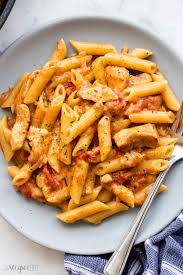

- cream mushroom sauce +

- prawn fettuccine +
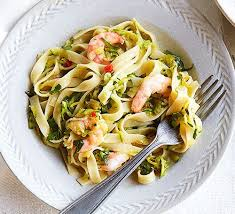

====

B: Hmm. I’d like to have the  _grilled chicken_ 烤鸡, but can I have  spaghetti 意大利面 *instead of* penne?

A: Of course, mam. And for you?

C: I… ah.. I’ll have the  _horse tripe_ (肚子；内脏)马肚.

[.my1]
.案例
====

-  chicken penne : /ˈtʃɪkɪn ˈpɛni/ (noun) A pasta dish with chicken and penne noodles.  鸡肉通心粉
-  cream mushroom sauce : /kriːm ˈmʌʃrʊm sɔːs/ (noun) A sauce made with cream and mushrooms.  奶油蘑菇酱
-  prawn fettuccine : /prɔːn ˌfɛtəˈtʃiːni/ (noun) A pasta dish with prawns and fettuccine noodles.  虾仁宽面
-  grilled chicken : /ɡrɪld ˈtʃɪkɪn/ (noun) Chicken cooked on a grill.  烤鸡
-  spaghetti : /spəˈɡɛti/ (noun) A type of long, thin pasta.  意大利面
-  horse tripe : /hɔːrs traɪp/ (noun) The stomach of a horse used as food.  马肚
====

[.my2]
A：晚上好，女士们。我叫乔什，今晚是你们的服务员。请问可以点餐了吗？ +
B：你们有什么推荐吗？ +
A：嗯，我个人喜欢鸡肉通心粉配奶油蘑菇酱，但虾仁宽面也很不错。 +
B：嗯，我想点烤鸡，但能把通心粉换成意大利面吗？ +
A：当然可以，女士。您呢？ +
C：我……呃……我要马肚。 +

'''

== ■(298) The Office ‐Presentation Series 10 ‐The Q and A Session (C0298)  +
Jonathan: Well everyone, I’m sure you’d like to join me in thanking Michael for what was a really inspirational presentation. Sincere thanks  +
Michael. Jonathan: Now, I’m sure many of you will be keen to ask some questions, so I’d like to open it up a Q and A session. Please raise your hand if you have any questions at all. Janice, go ahead.  +
 +
Janice: Yes thank you Jonathan. I would just like to go back to the comment Mr. Ford made in regards to our competitors, particularly Orange. Now as you know, Orange has established themselves as the market leader in the high-end lap-top market.  +
Janice: How does Mr. Ford expect to compete with a company that has such a huge reputation and huge resources? Mr. Ford: Well Janice, first of all, thanks for a very good question. I think you have hit the nail on the head actually. Orange are the global leaders precisely because of their size and power. Mr. Ford: But, although we can’t compete in terms of size I do believe we hold an advantage in terms of dedication to customer service. Yes, I admit this is a David and Goliath battle,but don’t forget who won that contest. Frank: Ermmm, Mr Ford. Could you elaborate on the actual technical details of the x420 a little more? Mr. Ford: I’d love to but I think we are a little pressed for time right now. However Jonathan has all the technical specs for you on the powerpoint presentation, which you can look over in your own time. Marcie: Mr. Ford. One final question. Would you like to join me for a game of golf this Sunday?  +
 +
 +
 +

'''

==== ◆(298) The Office ‐ Presentation Series 10 ‐ The Q and A Session (C0298)

Jonathan: Well everyone, I’m sure you’d like to join (v.) me in  thanking 感谢 Michael for what was _a really  inspirational 鼓舞人心的  presentation_ 演讲.  Sincere thanks (v.) 真诚的感谢 Michael.

Jonathan: Now, I’m sure /many of you will be  keen (a.)渴望 to ask some questions, so I’d like *to  open it up* 开始 a  Q and A session 问答环节. Please  raise (v.) your hand 举手 if you have any questions at all. Janice, go ahead.

Janice: Yes thank you Jonathan. I would just like *to go back to* the  comment 评论 Mr. Ford made *in  regards to* 关于 our  competitors 竞争对手, particularly  Orange 橙子公司. Now as you know, Orange has  established themselves 确立地位 as the  market leader 市场领导者 in the  high-end 高端的  laptop market 笔记本电脑市场.

Janice: How does Mr. Ford expect (v.) *to  compete 竞争 with* a company that has such a huge  reputation 声誉 and huge  resources 资源?

Mr. Ford: Well Janice, first of all, thanks for a very good question. I think you *have  hit (v.) the nail on the head* 一针见血,一针见血地说到点子上 actually. Orange are the  global leaders 全球领导者 precisely because of 正是因为 their size and power.

Mr. Ford: But, although we can’t compete (v.) *in terms of* size /I do believe we hold an  advantage 优势 *in terms of*  dedication 奉献 to  customer service 客户服务. Yes, I admit this is a  _David and Goliath battle_ 大卫与歌利亚之战, but don’t forget who won (v.) that  contest 比赛.

Frank: Ermmm, Mr Ford. Could you  elaborate (v.)详细说明 on the actual 真实的，实际的，现实的；（用于对比主次方面）真正的  technical details 技术细节 of the x420 a little more?

Mr. Ford: I’d love to /but I think we are a little  pressed  (a.)（时间、资金等）紧缺的 for time 时间紧迫 right now. However Jonathan has all the  technical specs (规格，说明书) 技术规格 for you on the  PowerPoint presentation 幻灯片, which you can *look over* 查看；检查;审视 in your own time.

Marcie: Mr. Ford. One final question. Would you like to join me for a game of  golf 高尔夫 this Sunday?

[.my1]
.案例
====
-  hit the nail on the head : /hɪt ðə neɪl ɒn ðə hɛd/ (phrase) Be exactly right about something.  一针见血

-  David and Goliath battle : /ˈdeɪvɪd ænd ɡəˈlaɪəθ ˈbætl/ (phrase) A situation where a small competitor faces a much larger one.  大卫与歌利亚之战
====

[.my2]
乔纳森：好的，各位，我相信你们都想和我一起感谢迈克尔，他的演讲非常鼓舞人心。真诚地感谢你，迈克尔。 +
乔纳森：现在，我相信很多人都有问题想问，所以我想开始问答环节。如果有任何问题，请举手。珍妮丝，请说。 +
珍妮丝：好的，谢谢乔纳森。我想回到福特先生关于我们竞争对手的评论，尤其是橙子公司。如你所知，橙子公司已经确立了其在高端笔记本电脑市场的领导者地位。 +
珍妮丝：福特先生，您如何期望与这样一家拥有巨大声誉和资源的公司竞争？ +
福特先生：珍妮丝，首先，感谢你提出这个很好的问题。我认为你确实一针见血。橙子公司之所以成为全球领导者，正是因为它们的规模和实力。 +
福特先生：但是，虽然我们在规模上无法竞争，但我相信我们在客户服务方面的奉献精神是我们的优势。是的，我承认这是一场大卫与歌利亚之战，但别忘了谁赢了那场比赛。 +
弗兰克：呃，福特先生，您能详细说明一下x420的技术细节吗？ +
福特先生：我很乐意，但我想我们现在时间有点紧迫。不过，乔纳森在幻灯片上准备了所有的技术规格，你们可以稍后自行查看。 +
玛西：福特先生，最后一个问题。您愿意这周日和我打一场高尔夫吗？ +

'''

== ■(299) Daily Life ‐Returning A Product (C0299)  +
A: Hi I would like to return this TV.  +
B: Sure, do you have the receipt?  +
A: Yeah here you go. Actually I also want to return this keyboard.  +
B: Ok, may I ask what is the reason for returning these products? A:: The TV flickers a lot when I am watching a movie and at times the image is not very clear.  +
B: I see, and what about the keyboard?  +
A: I spilled some coffee on it and now it won’t work.  +
B: I am sorry sir, but we can only exchange or refund defective products, we cannot take responsibility for misuse or damages.  +
A: Fine! I don’t know why they make these things so delicate anyways.  +
 +

'''

==== ◆(299) Daily Life ‐ Returning A Product 瑕疵品退货 (C0299)

A: Hi I would like to  return 退回 this  TV 电视.

B: Sure, do you have the  receipt 收据?

A: Yeah here you go. Actually I also want to return this  keyboard 键盘.

B: Ok, may I ask /what is the  reason 原因 for returning these products?

A: The TV  flickers (v.)闪烁，摇曳 a lot /when I am watching a movie /and at times 有时 the  image 图像 is not very  clear 清晰.

B: I see, and what about the keyboard?

A: I  spilled (v.)洒 some  coffee 咖啡 on it /and now it won’t  work 工作.

B: I am sorry sir, but we can only  exchange 更换 or  refund (v.)退款  defective (a.)有问题的，有缺陷的 products 有缺陷的产品, we cannot take  responsibility 责任 for  misuse 误用 or  damages 损坏.

A: Fine! I don’t know why they make these things so  delicate 脆弱的 anyways.

[.my2]
A：你好，我想退回这台电视。 +
B：好的，您有收据吗？ +
A：有，给你。其实我还想退回这个键盘。 +
B：好的，请问您退回这些产品的原因是什么？ +
A：我看电影时电视经常闪烁，有时图像也不清晰。 +
B：明白了，那键盘呢？ +
A：我不小心把咖啡洒在上面了，现在它不能用了。 +
B：很抱歉，先生，我们只能更换或退款有缺陷的产品，对于误用或损坏我们无法承担责任。 +
A：好吧！我不知道为什么他们把这些东西做得这么脆弱。 +

'''

== ■(300) Daily Life ‐Online Dating (C0300)  +
A: Do you want to hang out tomorrow?  +
B: Oh, I can’t. I have a date!  +
A: Really? Wow with who?  +
B: This girl I’ve been chatting with forthe past couple of months. She’s really cool and she’s driving over here this weekend.  +
A: Wait a minute, you mean you met her online?  +
B: Yeah! I signed up for a website called match. and it is great! You fill in all your details and preferences, like if you are a smoker or if you have any pets. Then you find people that have similar characteristics and you can email them or chat.  +
A: That is kind of weird! What if she is a psycho or something like that?  +
B: It’s the same as meeting people anywhere and dating them! I am just tired of going to bars or being set up for dates by my friends! I think this is a really cool alternative, especially if you are a bit shy.  +
A: I guess it does seem logical. I’ll have to check it out!  +
 +

'''

==== ◆(300) Daily Life ‐ Online Dating 在线约会 (C0300)

A: Do you want to  *hang out* 出去玩 tomorrow?

B: Oh, I can’t. I have a  date 约会!

A: Really? Wow with who?

B: This girl I’ve been  chatting with 聊天 for the past couple of months. She’s really  cool 酷的 /and she’s  driving over here 开车过来 this weekend.

A: Wait a minute, you mean you  met her online 在网上认识她?

B: Yeah! I  signed up 注册 for a website called  match 配对网站 /and it is great! You  fill in 填写 all your  details 信息 and  preferences 偏好, like if you are a  smoker 吸烟者 /or if you have any  pets 宠物. Then you find people that have  similar characteristics 相似特征 /and you can  email (v.)发邮件 or chat.

A: That is kind of  weird 奇怪的! What if she is a  psycho <非正式>精神失常者，变态人格者 or something like that?

B: It’s the same as meeting (v.) people anywhere /and dating them! I am just  tired of 厌倦 going to  bars 酒吧 /or being  set up 为…做安排 for dates 安排约会 by my friends! I think this is a really cool  alternative 替代选择, especially if you are a bit  shy 害羞.

A: I guess /it does seem (v.) logical 合理的. I’ll have to  check it out 查看一下;看看!

[.my1]
.案例
====
-  hang out : /hæŋ aʊt/ (phrasal verb) Spend time with someone.  出去玩
-  check it out : /tʃɛk ɪt aʊt/ (phrasal verb) Investigate or try something.  看看
====

[.my2]
A：你明天想出去玩吗？ +
B：哦，我不能去。我有个约会！ +
A：真的？哇，和谁？ +
B：这个女孩，我和她过去几个月一直在聊天。她真的很酷，这周末她会开车过来。 +
A：等等，你是说你在网上认识她？ +
B：是啊！我注册了一个叫配对的网站，它很棒！你填写所有你的信息和偏好，比如你是否吸烟或是否有宠物。然后你可以找到有相似特征的人，可以发邮件或聊天。 +
A：这有点奇怪！如果她是个精神病之类的怎么办？ +
B：这和在任何地方认识人并约会是一样的！我只是厌倦了去酒吧或让朋友安排约会！我认为这是一个很酷的替代选择，尤其是如果你有点害羞的话。 +
A：我想这确实看起来合理。我得去看看！ +

'''
