=  English pod 321-340
:toc: left
:toclevels: 3
:sectnums:
:stylesheet: ../../../myAdocCss.css

'''

== ■(321) Global View ‐Thai Food (C0321)  +
A: What did you cook?  +
B: Well, as you know I was in Thailand last month,and I took a cooking class! So I prepared some ofmy favorite dishes.  +
A: Great idea! As long as I don’t get food poisoning!So what is onthe menu tonight?  +
B: Ok, for starters we have Tom Yam soup. It’s a bit spicy, but really good!  +
A: This is delicious! The ginger and lemongrass really gives it a nice taste!  +
B: Now this next dish is one of the most famous. Foreignerscall it papaya salad butthe proper name is Tom Sam. It is a spicy salad made from a mix of fresh vegetables including shredded unripened papaya and tomato.  +
A: This is delicious! The combination of sour and spicy is really interesting! I could have this everyday!  +
B: Ok, now forthe last and best dish in my opinion. This is called Pad Thai. It’s stir-fried noodles with eggs, fish sauce, tamarind juice, red chili pepper plus bean sprouts, shrimp and tofu and garnished with crushed peanuts and coriander. It’s practically Thailand’s national dish!  +
A: Wow, this is great! I never knew Thai food was so creative and delicious!  +
B: Wantsome more?  +
A: I’m stuffed!  +
 +
 +
 +

'''

==== ◆(321) Global View ‐ Thai 泰国的；泰国人的 Food (C0321)

A: What did you cook 煮，烧；烹饪?

B: Well, as you know I was in Thailand last
month,and I took a cooking class 烹饪课! So I
prepared some of my favorite dishes 菜肴.

[.my2]
你知道我上个月在泰国，我上了一门烹饪课！所以我准备了一些我最喜欢的菜肴

A: Great idea! As long as I don’t get _food
poisoning_ 食物中毒! So what is on the menu tonight?

[.my2]
只要我不会食物中毒！

B: Ok, for starters 开胃菜 we have _Tom Yam soup_ 冬阴功汤.
It’s a bit spicy (a.)加有香料的，辛辣的；刺激的, but really good!

[.my2]
作为开胃菜，我们有冬阴功汤。它有点辣，但真的很好吃！

[.my1]
.案例
====
.Tom Yam
_Tom yum_  is a family of hot and sour Thai soups. The strong hot and sour 酸的，酸味的 flavors make it very popular in Thai cuisine 烹饪，风味；饭菜，菜肴. +
一种泰国酸辣汤. 浓郁的酸辣口味, 使它在泰国菜中很受欢迎。

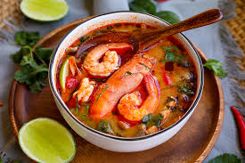
====

A: This is delicious! The ginger 姜 and
lemongrass 柠檬香草；柠檬草 really gives it a nice taste!

B: Now this next dish is one of the most
famous. Foreigners call (v.) it _papaya  番木瓜，木瓜 salad_ but the
proper  真正的，像样的；实际上的，严格意义上的 name is _Tom Sam_ 泰式木瓜沙拉. It is a _spicy 加有香料的，辛辣的 salad_
made from a mix of fresh vegetables
including _shredded (a.)切碎的 unripened 未成熟的 papaya_ and
tomato.

[.my2]
现在, 下面这道菜, 是最有名的之一。外国人叫它木瓜沙拉，但正确的名字是Tom Sam。它是由包括切碎的未成熟木瓜和番茄在内的新鲜蔬菜, 混合而成的辣沙拉。

[.my1]
.案例
====
- papaya +
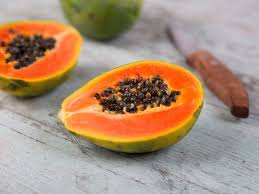
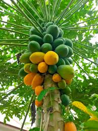

- Tom Sam +
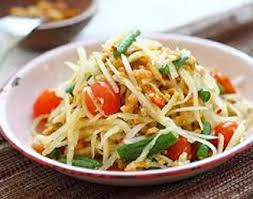
====

A: This is delicious! The combination of sour  酸的
and spicy 辛辣的 is really interesting! I could have
this everyday!

[.my2]
这很好吃！酸和辣的组合真的很有趣！我可以每天都吃这个！

B: Ok, now for the last and best dish in my
opinion. This is called _Pad Thai_ 泰式炒河粉. It’s _stir-fried 炒的
noodles_ with eggs, _fish sauce_ 鱼露(调味汁), _tamarind 罗望子
juice_, red _chili 红辣椒，辣椒 pepper_ 胡椒粉；辣椒，甜椒，灯笼椒；胡椒；辣椒粉 plus _bean sprouts_ (芽菜；豆芽菜) 豆芽,
shrimp 虾，小虾 and tofu 豆腐 and garnished (v.)装饰，点缀 with _crushed 压碎的，捣碎的
peanuts_ 花生 and coriander 芫荽(yuán suī)，香菜；芫荽籽. It’s practically
Thailand’s national dish 国菜!

[.my2]
现在是我认为的最后也是最好的一道菜。这叫做泰式炒河粉。它是用鸡蛋、鱼露、罗望子汁、红辣椒加上豆芽、虾和豆腐炒的河粉，并用碎花生和香菜装饰。它实际上是泰国的国菜！

[.my1]
.案例
====
- Pad Thai /ˈpɑːd ˈtaɪ/ n. (泰式炒河粉) a popular Thai dish made with stir-fried 炒的 _rice noodles_ 米粉;米线. +
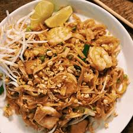

- fish sauce /ˈfɪʃ ˌsɔːs/ n. (鱼露) a liquid condiment 调味品；佐料 made from fermented 酿造；已发酵的 fish.

- tamarind  +
酸豆（Tamarindus indica L.），别名罗望子. 果实被称为“酸角”，果肉酸甜可食. +
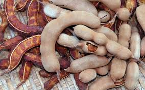
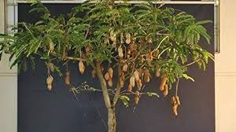
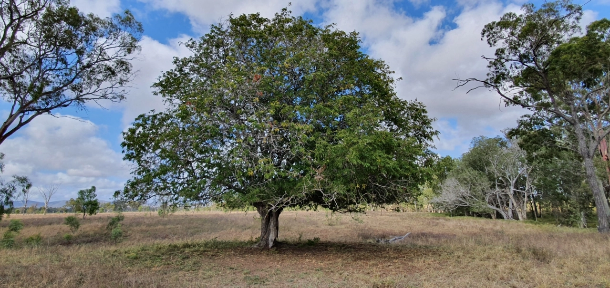

- bean sprouts +
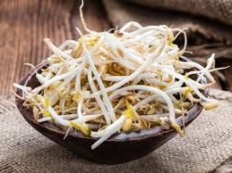

- coriander +
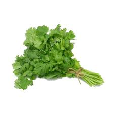

- national dish : 国家菜：一种代表某个国家或地区的特色菜肴，通常是该国或地区的文化和传统的象征。

====

A: Wow, this is great! I never knew Thai food
was so creative 有创意的 and delicious!

B: Want some more?

A: I’m stuffed (a.)（人）吃饱的，吃撑的；填制的，填充以保持形状的!

'''

== ■(322) The Office ‐Small Talk 6 ‐Talking About Yourself (C0322)  +
Michelle: Excuse me, is this seat taken?  +
Stranger: No, please feel free.  +
Michelle: Thanks a lot.  +
Stranger: Do you work in Shanghai?  +
Michelle: Yes I do. How about you?  +
Stranger: No, I’m a tourist. This place is  +
amazing! It’s much bigger than I imagined,  +
and much more exciting! There’s so much to  +
see here.  +
Michelle: You can say that again! It’s much  +
more modern than people imagine. Where  +
are you from?  +
Stranger: Um, well let’s see.....I’m from  +
Kansas originally. A much quieter and more  +
peaceful place than here, that’s for sure!  +
Michelle: Uh huh....  +
Stranger: But I’m living in Paris right now.  +
Michelle: Oh Paris! Wonderful, I’d love to  +
visit some time!  +
 +
 +

'''

==== ◆(322) The Office ‐ Small Talk 6 ‐ Talking About Yourself (C0322)

Michelle: Excuse me, is this seat taken 这个座位有人吗?

Stranger: No, please feel free.

Michelle: Thanks a lot.

Stranger: Do you work in Shanghai?

Michelle: Yes I do. How about you?

Stranger: No, I’m a tourist 旅行者，观光客. This place is
amazing! It’s much bigger than I imagined,
and much more exciting! There’s so much to
see here.

Michelle: *You can say that again* 你说得对! It’s much
more modern than people imagine. Where
are you from?

Stranger: Um, well let’s see.....I’m from
Kansas 美国州名 originally (ad.)起初，原来. A much quieter and more
peaceful place than here, that’s for sure!

Michelle: Uh huh....

Stranger: But I’m living in Paris right now.

Michelle: Oh Paris! Wonderful, I’d love to
visit some time!

'''

== ■(323) Daily Life ‐Cancelled Flight (C0323)  +
A: Good afternoon Sir, may I please see your passport and reservation?  +
B: Here you go.  +
A: I’m sorry sir, this flight has been cancelled due to some mechanical problems.  +
B: Cancelled! So what am I supposed to do now?  +
A: We apologize for any inconveniences that may be caused by this. If your flight is urgent, I can put you on a waiting list for another flight this evening, but it’s on a first come first served basis, so there is no guarantee that you will be able to take that flight.  +
B: What’s my other option?  +
A: If you can wait until tomorrow, we will put youup in a hotel for today and you can take scheduled flight for tomorrow morning.  +
B: That’s fine. I’ll do that then.  +
A: Thank you for your understanding sir. I will book your flight now.  +
 +
 +

'''

==== ◆(323) Daily Life ‐ Cancelled   取消的 Flight 航班，班机；飞行 (C0323)

A: Good afternoon Sir, may I please see your
passport and reservation （房间，座位等的）预订?

[.my2]
请问可以看一下您的护照和预订信息吗？

B: Here you go. 给您

A: I’m sorry sir, this flight has been cancelled
*due to* some mechanical problems.

B: Cancelled! So *what am I supposed （按规定、习惯、安排等）应当，应，该，须 to do
now*?

[.my2]
那我该怎么办？

A: We apologize for any inconveniences 不便之处，麻烦 that
may be caused by this. If your flight is
urgent, I can *put* you *on* a waiting list 等候名单 for
another flight this evening, but it’s #on# a *first
come first served* 先到先得 #basis# 基准；准则；方式, so there is no
guarantee that you will be able to take that
flight.

[.my2]
我们对此可能造成的不便深表歉意。如果您的航班很紧急，我可以将您列入今晚另一趟航班的候补名单，但这是"先到先得"的，所以无法保证您一定能搭乘那趟航班。

B: What’s my other option?

[.my2]
我别的选择还有哪些？

A: If you can wait until tomorrow, we will *put
you up* 提供食宿 in a hotel for today and you can take
scheduled  (a.)预先安排的，按时刻表的；（尤指航班）定期的 flight for tomorrow morning.

[.my2]
如果您可以等到明天，我们今天会安排您入住酒店，您可以搭乘明天早上的定期航班。

[.my1]
.案例
====
- scheduled flight: /ˈskedʒ.uːld flaɪt/ n. a flight that operates according to a fixed timetable (定期航班).
====

B: That’s fine. I’ll do that then.

A: Thank you for your understanding sir. I
will book (v.)预订 your flight now.

'''

== ■(324) Global View ‐Thanksgiving Dinner (C0324)  +
A: So what are you doing for Thanksgiving?  +
B: Not much really. It’s more of an American tradition, so back home we don’t really celebrate it. In fact, I am not even sure of what exactly is being celebrated!  +
A: Well you know, it’s a time to get together with all your family and be thankful for everything!  +
B: Yeah but, how did this holiday come to be?  +
A: Well, the first settlers of Massachusetts arrived there because of religious persecution from England and King James. Once inthe New World, they befriended an native named Squanto, who taught them how to harvest food from the area such as corn.  +
B: Interesting! I am amazed how big and delicious thanksgiving dinners are!  +
A: Come to my house for Thanksgiving! We are having turkey, pumpkin pie, mashed potatoes with gravy, and lots of stuffing!  +
B: Count me in!  +
 +

'''

==== ◆(324) Global View ‐ Thanksgiving Dinner 感恩节晚餐 (C0324)

A: So what are you doing for Thanksgiving?

B: Not much really. It’s more of an American
tradition, so back home we don’t really
celebrate it. In fact, I am not even sure of
what exactly is being celebrated!

[.my2]
其实没什么特别的。这更像是美国的传统，所以在我的家乡我们并不怎么庆祝。事实上，我甚至不确定到底在庆祝什么！

[.my1]
.案例
====
- "Back home" 在这句话中指的是说话者的故乡, 或国籍所在的国家，意思是“在我们自己的国家”或“在家乡”。
====

A: Well you know, it’s a time to get together
with all your family and be thankful for
everything!

B: Yeah but, how did this holiday come to
be?

[.my2]
但这个节日是怎么来的呢？

A: Well, the first settlers of Massachusetts
arrived there because of religious
persecution （尤指因种族、宗教或政治信仰而进行的）迫害，残害；烦扰 from England and King James.
Once in the New World, they befriended (v.)结交，交朋友 a
native named Squanto, who taught (v.) them
how to harvest (v.)收割，收获 food from the area such as
corn.

[.my2]
马萨诸塞州的第一批定居者, 是因为英格兰和詹姆斯国王的宗教迫害, 而来到那里的。到了新大陆后，他们与一个叫Squanto的土著人交上了朋友，他教会了他们如何从当地收割食物，比如玉米。

B: Interesting! I am amazed  (a.)惊奇的，惊讶的 *how big and
delicious* thanksgiving dinners are!

[.my2]
我很惊讶感恩节晚餐如此丰盛美味！

A: Come to my house for Thanksgiving! We
are having turkey, pumpkin pie, mashed  (a.)捣碎的；捣烂的；被捣成糊状的
potatoes with gravy 肉汁, and lots of stuffing （烹饪前塞在鸡、蔬菜等里的）填料，馅!

[.my1]
.案例
====
- pumpkin pie /ˈpʌmp.kɪn paɪ/ n. a sweet dessert made from pumpkin (南瓜派).
- mashed potatoes /mæʃt pəˈteɪ.toʊz/ n. potatoes that have been boiled and mashed (土豆泥).
====

B: *Count* (v.)点……的数目；（按顺序）数数；把……考虑在内 me *in* 算我一个!

[.my1]
.案例
====
- count me in : /kaʊnt mi ɪn/ idiom. informal, to include someone in a plan or activity (算我一个).
====

'''

== ■(325) The Office ‐Small Talk 7 ‐Talking About A Trip (C0325)  +
Jim: Hey Michelle. Good to see you. Are you  +
at lunch?  +
Michelle: Oh hi Jim. No I just got back. I  +
thought you were on vacation now.  +
 +
Jim: No, I wish I was! I just got back from  +
Spain actually.  +
 +
Michelle: Oh wonderful! Have you been  +
there before or was it your first time?  +
Jim: My first time. I’ve traveled around  +
Europe a lot, but this was my first time to  +
Spain. It was amazing, and the weather was  +
just beautiful! No rain, and just sun, sun,  +
sun....  +
Michelle: I’m so jealous of you. I’ve never  +
been anywhere in Europe. I’ve always  +
dreamed of traveling around and seeing the  +
sights.  +
Jim: Well, I really recommend Spain. You  +
really should go.Anyway, it’s been great to  +
 +
 +
catch up, but I must be going, this is my  +
floor. Speak again soon I hope.  +
Michelle: For sure. Take care.  +
 +
 +

'''

==== ◆(325) The Office ‐ Small Talk 7 ‐ Talking About A Trip (C0325)

Jim: Hey Michelle. Good to see you. Are you
at lunch?

[.my2]
很高兴见到你。你在吃午饭吗？

Michelle: Oh hi Jim. No I just got back. I
thought you were on vacation now.

[.my2]
没有，我刚回来。我以为你现在在度假呢。

Jim: No, I wish I was! I just got back from
Spain actually.

Michelle: Oh wonderful! Have you been
there before or was it your first time?

[.my2]
你以前去过那里吗？还是第一次去？

Jim: My first time. I’ve traveled around
Europe a lot, but this was my first time to
Spain. It was amazing, and the weather was
just beautiful! No rain, and just 只有 sun, sun,
sun....

Michelle: I’m so *jealous 妒忌的 of* you. I’ve never
been anywhere in Europe. I’ve always
dreamed of traveling around and seeing the
sights 风景，名胜；视野.

Jim: Well, I really recommend Spain. You
really should go. Anyway, it’s been great *to
catch up* 叙旧;追赶上, but I must be going, this is my
floor. *Speak again soon* I hope.

[.my2]
这是我的楼层。希望很快再聊。

[.my1]
.案例
====
- "*Speak again soon* I hope" 并不是倒装句。在这里，“I hope”是一个插入语，用来表达说话者的愿望或期待。正常语序也可以表达为 "I hope we can speak again soon." 但日常口语中，人们可能会把这种表达方式稍微调整，使其听起来更加自然或非正式。这种用法更贴近于口语的流畅性和情感的直接表达，而不是语法上的倒装结构。

这里发生了以下变化： +
省略了 "that"： 在正式的英语中，"I hope (that) we..."，但口语中 "that" 经常被省略。 +
语序颠倒： "Speak again soon" 被提前，"I hope" 放在了后面。

虽然它不是严格意义上的语法倒装（如疑问句中的倒装），但它确实改变了正常的语序，以达到特定的表达效果。它是一种口语中常见的表达方式，带有希望的语气。
====

Michelle: For sure. Take care.

[.my2]
当然。保重。

'''

== ■(326) Daily Life ‐Report Card (C0326)  +
A: Look, Jimmy’s report came today.  +
B: Let’s have a look. What is this? Where are all the grades?  +
A: He’s in the third grade Sam! You see under each subject that he is being taught in school, he receives a mark from one to three. A one means his achievement or work is excellent. Here in Science for example he got a two, which means its satisfactory.  +
B: What about here in physical education?  +
A: He got a three here which means it’s unsatisfactory. We should work on that with him.  +
B: So confusing! In my day we got an A or B if we were doing well and if we failed an exam we would get an F!  +
 +

'''

==== ◆(326) Daily Life ‐ Report Card 成绩报告单  (C0326)

A: Look, Jimmy’s report card 成绩单 came today.

B: Let’s have a look. What is this? Where are all the grades 成绩?

A: He’s in the third grade 三年级, Sam! You see, under each subject 科目 后定 that he is being taught in school, he receives a mark 分数 from one to three. A one means (v.) his achievement 成绩 or work (n.) is excellent 优秀的. Here in Science 科学, for example, he got a two, which means it’s satisfactory 令人满意的.

B: What about here in physical education 体育?

A: He got a three here, which means it’s unsatisfactory 不令人满意的. We should *work on* 努力改进;努力改善（或完成） that with him.

[.my1]
.案例
====
.work on sth
to try hard to improve or achieve sth 努力改善（或完成） +
•You need to work on your pronunciation a bit more. 你需要再加把劲改进发音。 +
•‘Have you sorted out a babysitter yet?’ ‘No, but I'm working on it .’ “你找到临时看孩子的保姆了吗？”“还没有，我正在找呢。”
====

B: So confusing  令人费解的，令人迷惑的! In my day, we got an A 优秀 or B 良好 if we were doing well, and if we failed (v.)不及格 an exam, we would get an F 不及格!

[.my1]
.案例
====
- A : /eɪ/ (noun) The highest grade, indicating excellent performance. 优秀
- B : /biː/ (noun) A grade indicating good performance. 良好
- failed : /feɪld/ (verb) Did not pass a test or exam. 不及格
- F : /ɛf/ (noun) The lowest grade, indicating failure. 不及格
====

[.my2]
A：看，Jimmy的成绩单今天到了。 +
B：我们来看看。这是什么？成绩在哪里？ +
A：他上三年级了，Sam！你看，在学校教的每个科目下，他都会得到一个1到3的分数。1表示他的成绩或工作优秀。比如在科学课上，他得了2，这意味着令人满意。 +
B：那体育呢？ +
A：他在这里得了3，这意味着不令人满意。我们应该和他一起努力改进。 +
B：太混乱了！在我那个年代，如果我们做得好，我们会得到A或B，如果考试不及格，我们会得到F！ +

'''

== ■(327) Daily Life ‐Buying A Pair Of Jeans (C0327)  +
A: Excuse me, can I try on this pair of jeans?  +
B: Sure. Let me see... I’m afraid we don’t have any size eights left.  +
A: What are you talking about? I’m always a size four. Here, I’ll try these.  +
B: They seem a bit too tight. Shall I find you a larger size?  +
A: No, they fit fine! They show off my curves perfectly!  +
B: Yeah, your love handles. Yeah, they sure do, although... here, you forgot to close this button.  +
A: Yeah right, I’ll do it now...  +
 +

'''

==== ◆(327) Daily Life ‐ Buying A Pair Of Jeans 牛仔裤；工装裤 (C0327)

A: Excuse me, can I try on 试穿 this pair of jeans 牛仔裤?

B: Sure. Let me see… I’m afraid we don’t have any size eights left.

A: What are you talking about? I’m always a size four. Here, I’ll try these.

B: They seem a bit too tight 紧的. Shall I find you a larger size 大一号?

A: No, they fit 合身 fine! They show off 展示 my curves 曲线 perfectly!

B: Yeah, your _love handles_ 腰部赘肉. Yeah, they sure do, although… here, you forgot to close 扣上 this button 纽扣.

A: Yeah right, I’ll do it now…

[.my1]
.案例
====
- show off : /ʃəʊ ɒf/ (phrasal verb) Display something proudly. 展示
- love handles : /lʌv ˈhændəlz/ (noun) Excess fat around the waist. 腰部赘肉
====

[.my2]
A：打扰一下，我可以试穿这条牛仔裤吗？ +
B：当然。让我看看……恐怕我们没有8号了。 +
A：你在说什么？我一直穿4号。来，我试试这条。 +
B：它们看起来有点紧。要我帮你找大一号的吗？ +
A：不用，它们很合身！它们完美地展示了我的曲线！ +
B：是啊，你的腰部赘肉。确实如此，不过……你忘了扣上这个纽扣。 +
A：对，我现在就扣上…… +

'''

== ■(328) The Office ‐Small Talk 8 ‐Talking About Work (C0328)  +
Mr. Camp-bell:Ah Michelle hi. I was hoping to see you. How have you been? How’s the family? Michelle: Oh hello Mr. Campbell. I’m fine and Jack’s doing well. How are you?  +
Mr. Camp-bell:I’m fine thanks. I got your report this morning. Thank’s for that. Are you joining the conference today?  +
Michelle: Yes, I’m leaving at four pm. Mr Camp-bell:Good, well we can discuss this more then, but I think the figures are looking very good for this quarter. Michelle: Yes, me too. Mr Camp-bell:I’m planning to discuss the advertising budget at the conference. I don’t think we should continue with the TV advertising. Michelle: No, me neither. It’s far too expensive. Mr. Camp-bell:Well, let’s discuss this more at the conference. Maybe we can share a taxi there. Michelle: Yes, sure.  +
 +

'''

==== ◆(328) The Office ‐ Small Talk 8 ‐ Talking About Work (C0328)

Mr. Campbell: Ah, Michelle, hi. I was hoping to see you. How have you been? How’s the family 家庭?

Michelle: Oh, hello Mr. Campbell. I’m fine, and Jack’s doing well. How are you?

Mr. Campbell: I’m fine, thanks. I got your report (n.) this morning. Thanks for that. Are you joining the conference 会议 today?

Michelle: Yes, I’m leaving at four pm 下午四点.

Mr. Campbell: Good, well we can discuss this more then, but I think the figures 数据 are looking very good for this quarter 季度.

Michelle: Yes, me too.

Mr. Campbell: I’m planning to discuss the advertising budget 广告预算 at the conference. I don’t think we should continue with the TV advertising 电视广告.

Michelle: No, me neither 我也是,我也没有. It’s far too expensive 昂贵的.

Mr. Campbell: Well, let’s discuss this more at the conference. Maybe we can share a taxi 拼车 there.

Michelle: Yes, sure.

[.my2]
Mr. Campbell：啊，Michelle，嗨。我正希望见到你。你最近怎么样？家人还好吗？ +
Michelle：哦，您好，Mr. Campbell。我很好，Jack也很好。您呢？ +
Mr. Campbell：我很好，谢谢。我今天早上收到了你的报告。谢谢。你今天参加会议吗？ +
Michelle：是的，我下午四点出发。 +
Mr. Campbell：很好，那我们到时候再详细讨论，但我觉得这个季度的数据看起来非常好。 +
Michelle：是的，我也这么认为。 +
Mr. Campbell：我计划在会议上讨论广告预算。我认为我们不应该继续做电视广告了。 +
Michelle：是的，我也这么认为。它太贵了。 +
Mr. Campbell：好吧，我们到会议上再详细讨论。也许我们可以拼车去那里。 +
Michelle：好的，当然。 +

'''

== ■(329) Daily Life ‐Going To The Bakery (C0329)  +
A: Welcome to Al’s Bakery. What can I get you?  +
B:  +
Hi! Let me get a dozen croissants, four blueberry muffins and a loaf of sourdough bread.  +
 +
A:Sure. Would you like to have the loaf sliced?  +
 +
B:  +
No, that’s OK. Do you have any whole wheat bread?  +
 +
 +
A: We are out at the moment. May I suggest some rye bread?  +
B: Sure that sounds good. Do you have any cakes?  +
A: We have various birthday cakes and also ice cream cakes.  +
B: I’ll just take a cheesecake.  +
A: Will that be all?  +
B: Yes.  +
A: Your total is forty three dollars and twenty cents.  +
 +

'''

==== ◆(329) Daily Life ‐ Going To The Bakery 面包店；烘焙食品（如面包，蛋糕） (C0329)

A: Welcome to Al’s Bakery 阿尔的面包店. What can I get you 您要点什么?

B: Hi! Let me get a dozen croissants 一打牛角面包, four _blueberry muffins_ (（常加有水果的）小松糕；<英> 英国松饼（通常烤热加黄油吃）) 蓝莓松饼, and a loaf of _sourdough 酵母；拓荒者 bread_ 一条酸面包.

[.my1]
.案例
====
.croissant
( from French) a small sweet roll with a curved shape, eaten especially at breakfast羊角面包；新月形面包； 牛角面包

-> 来自crescent, 新月形。因形似新月而得名。来自PIE*ker , 创造，生长，词源同create。-esce, 表起始。最早指月相由亏转盈的阶段，但后来错误的用来指这一阶段的形状。

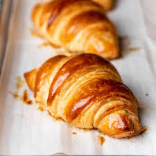

.muffin
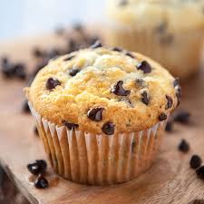

.sourdough
[ U](= a mixture of flour, fat and water) that is left to dough so that it has a sour taste, used for making bread; bread made with this ferment, dough 酸面团；发面面包

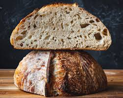
====

A: Sure. Would you like to have the loaf  一条，一块（面包）sliced (a.)切片; （食物）已切成薄片的?

B: No, that’s OK. Do you have any whole _wheat bread_ 全麦面包,小麦面包?

A: We are out 缺货 at the moment. May I suggest some _rye (n.a.)黑麦 bread_ 黑麦面包?

B: Sure, that sounds good. Do you have any cakes 蛋糕?

A: We have various birthday cakes 生日蛋糕 and also ice cream cakes 冰淇淋蛋糕.

B: I’ll just take a cheesecake 芝士蛋糕,奶酪蛋糕（冷甜食）.

[.my1]
.案例
====

- cheesecake +
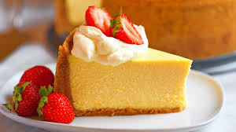
====

A: Will that be all?

B: Yes.

A: Your total 总计 is forty-three dollars and twenty cents 四十三美元二十美分.

[.my1]
.案例
====
- blueberry muffins : /ˈbluːbɛri ˈmʌfɪnz/ (noun) Muffins with blueberries. 蓝莓松饼
- whole wheat bread : /həʊl wiːt brɛd/ (noun) Bread made from whole wheat. 全麦面包
- rye bread : /raɪ brɛd/ (noun) Bread made from rye flour. 黑麦面包
- cheesecake : /ˈtʃiːzkeɪk/ (noun) A dessert made with cheese and a crust 面包皮. 芝士蛋糕
====

[.my2]
A：欢迎来到阿尔的面包店。您要点什么？ +
B：嗨！我要一打牛角面包，四个蓝莓松饼，和一条酸面包。 +
A：好的。您需要把面包切片吗？ +
B：不用了，谢谢。你们有全麦面包吗？ +
A：我们现在缺货。我可以推荐一些黑麦面包吗？ +
B：当然，听起来不错。你们有蛋糕吗？ +
A：我们有各种生日蛋糕，还有冰淇淋蛋糕。 +
B：我只要一个芝士蛋糕。 +
A：就这些吗？ +
B：是的。 +
A：总计是四十三美元二十美分。 +

'''

== ■(330) The Weekend ‐Fortune Telling (C0330)  +
A: Look at this newspaper article about this famous local medium. It says that she is really gifted and so popular now, that she is booked solid with appointments for the next twelve months!  +
B: You don’t really believe in all that hocus pocus mumbo jumbo do you?  +
 +
A: Well I have had many friends that went to a psychic and got their palms read and most of the things the psychic told her came true!  +
B: Of course it does! They tell you general and obvious things like that you will be successful or have a big house. I think most of the times they are just scam artists.  +
A: Well historically it is a practice that many cultures share. Reading the tarot cards, in the east they would even read tea leaves! I even heard that there are people that make you smoke a cigar, and then read your ashes.  +
B: All superstitious nonsense! I would still like to go to one and see what he or she has to say, just for kicks.  +
A: Great! I’ll make an appointment!  +
 +

'''

==== ◆(330) The Weekend ‐ Fortune Telling 算命,占卜 (C0330)

A: Look at this newspaper article 报纸文章 about this famous local medium 灵媒. It says that she is really gifted 有天赋的 and so popular 受欢迎的 now, that she is booked (v.) solid (连续的；不间断的；整整的) 预约满了 with appointments 预约 for the next twelve months!

B: You don’t really *believe in* all that _hocus pocus_ 戏法；魔术；花招 _mumbo jumbo_ 胡言乱语, do you?

[.my1]
.案例
====
.hocus pocus
*魔术师表演时念的咒语*，引申为骗人的花招、装神弄鬼的行为。 +
中文常见翻译：鬼把戏、障眼法、唬人的伎俩、装神弄鬼 +

例句：The magician's tricks were just a bunch of _hocus pocus_.
（那个魔术师的把戏只是一堆鬼把戏。）

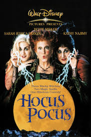

.mumbo jumbo
*莫名其妙, 或听起来很复杂但其实毫无意义的话语或仪式；迷信说辞。* +
中文常见翻译：胡说八道、故弄玄虚、繁琐而无意义的说辞

例句：All that legal _mumbo jumbo_ just confused (v.) me.
（那些法律术语只是让我更困惑。）
====

A: Well, I have had many friends who went to a psychic 灵媒; 通灵者；巫师 and *got* their palms *read* 看手相, and `主` most of the things the psychic told them `谓` came true!

B: Of course it does! They tell you _general 笼统的 and obvious 明显的 things_ 后定 *like that* you will be successful 成功的 or have a big house 大房子. I think most of the time they are just _scam (<非正式>欺诈，骗局) artists_ 骗子.

A: Well, historically, it is a practice 习俗 that many cultures 文化 share (v.). Reading the _tarot cards_ 塔罗牌, in the east 东方, they would even read (v.) tea leaves 茶叶! I even heard that there are people who make you smoke a cigar 抽雪茄, and then read your ashes 烟灰.

[.my1]
.案例
====
.tarot cards
塔罗牌：一种用于占卜和预测的牌类游戏，通常由78张牌组成，每张牌都有特定的象征意义。

是一套从15世纪中期, 于欧洲各地流传的占卜卡片.

“塔罗”一词及德国的塔罗克, 都是源自意大利的单词“Tarocchi”，其词源不能确定，然而**“Taroch”一词于15世纪末至16世纪初被用作"愚蠢"的代名词。**在15世纪，纸牌背面图案甲板, 被专门称为“trionfi”。

大约于1502年，“Tarocho”这个新名称最早出现于布雷西亚。*在现代意大利语中，单数词“Tarocco”作为一个名词，指的是"血橙"的一个品种。*

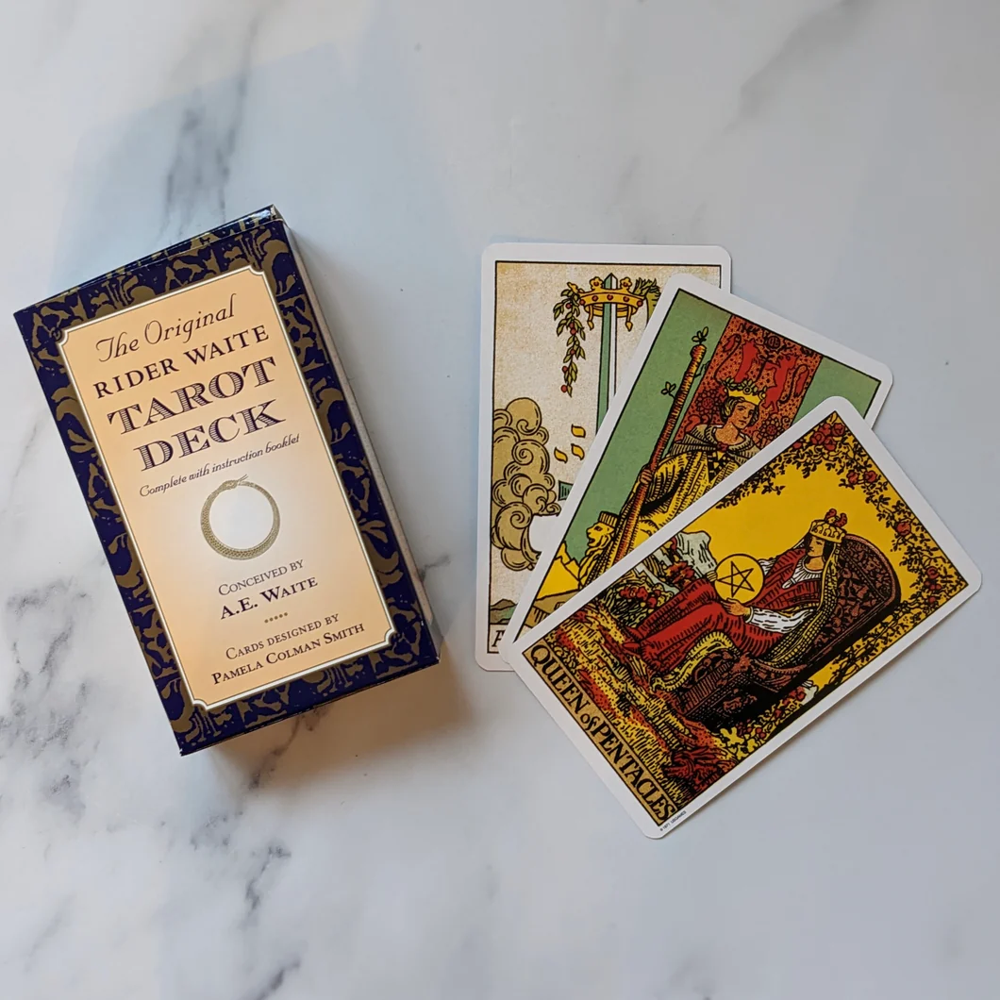

====

B: All superstitious (a.)迷信的 nonsense 迷信的胡言乱语! I would still like to go to one /and see what he or she has to say, just for kicks 好玩.

A: Great! I’ll make an appointment 预约!

[.my1]
.案例
====

- hocus pocus mumbo jumbo : /ˈhəʊkəs ˈpəʊkəs ˈmʌmbəʊ ˈdʒʌmbəʊ/ (phrase) Meaningless or confusing talk. 胡言乱语
- palms read : /pɑːmz riːd/ (phrase) A practice of predicting the future by reading lines on the palm. 看手相
====

[.my2]
A：看看这篇报纸文章，关于这位当地著名的灵媒。文章说她非常有天赋，现在非常受欢迎，她的预约已经排满了未来十二个月！ +
B：你不会真的相信那些胡言乱语吧？ +
A：嗯，我有很多朋友去找过灵媒看手相，灵媒告诉他们的大部分事情都成真了！ +
B：当然会成真！他们会告诉你一些笼统和明显的事情，比如你会成功或拥有一栋大房子。我觉得大多数时候他们只是骗子。 +
A：嗯，从历史上看，这是许多文化共有的习俗。在东方，他们甚至会用茶叶占卜！我甚至听说有些人会让你抽雪茄，然后通过烟灰占卜。 +
B：都是迷信的胡言乱语！我还是想去看看他们会说什么，就当是玩玩。 +
A：太好了！我来预约！ +

'''

== ■(331) The Office – small talk 9 - Talking About The Weather (C0331)  +
Melissa: Hey Michelle, jump in quick. It’s pouring out there! Michelle: Oh hi Melissa. Are you going to the conference too? I was planning to pick up Mr. Campbell. Melissa: Yes, he told me. We need to pick him up at his hotel and then go to the conference. Michelle: Oh I see, okay. So I heard you got married. Congratulations! Melissa: Ah thank you! I’m very excited. We were going to get married next year, but then we decided to get married on holiday instead. It was wonderful. Michelle: That sounds so romantic! Jack and I were hoping to get married in Europe next year, but we had to postpone our plans. We just don’t have the money! Melissa: I know what you mean. I think Shanghai is getting more and more expensive, don’t you? Michelle: I sure do. In my opinion it’s actually becoming more expensive than back home. Melissa: Definitely. Oh there’s Mr. Campbell.  +
Driver can you stop here please?  +
 +

'''

==== ◆(331) The Office – small talk 9 - Talking About The Weather (C0331)

Melissa: Hey Michelle, jump in 快进来 quick. It’s pouring (v.)下大雨;倾泻；倾诉 out there!

Michelle: Oh hi Melissa. Are you going to the conference 会议 too? I was planning to pick up 接 Mr. Campbell.

Melissa: Yes, he told me. We need to pick him up at his hotel 酒店 and then go to the conference.

Michelle: Oh I see, okay. So I heard you got married 结婚了. Congratulations (n.)恭喜!

Melissa: Ah thank you! I’m very excited 兴奋的. We were going to get married next year, but then we decided to get married on holiday 假期 instead. It was wonderful 美妙的.

Michelle: That sounds so romantic 浪漫的! Jack 杰克 and I were hoping to get married in Europe 欧洲 next year, but we had to postpone 推迟 our plans. We just don’t have the money 钱!

Melissa: I know what you mean. I think Shanghai 上海 is getting more and more expensive 昂贵的, don’t you?

Michelle: I sure do. In my opinion 观点, it’s actually becoming more expensive than back home 回家,家乡.

Melissa: Definitely. Oh, there’s Mr. Campbell. Driver 司机, can you stop 停 here please?

[.my2]
Melissa：嘿，Michelle，快进来。外面下着大雨！ +
Michelle：哦，嗨，Melissa。你也要去参加会议吗？我正打算去接Mr. Campbell。 +
Melissa：是的，他告诉我了。我们需要在酒店接他，然后去参加会议。 +
Michelle：哦，我明白了。我听说你结婚了。恭喜！ +
Melissa：啊，谢谢！我非常兴奋。我们本来打算明年结婚，但后来决定在假期结婚。那真是美妙。 +
Michelle：听起来真浪漫！杰克和我本来希望明年在欧洲结婚，但我们不得不推迟计划。我们就是没钱！ +
Melissa：我明白你的意思。我觉得上海越来越贵了，你不觉得吗？ +
Michelle：当然觉得。在我看来，它实际上比家乡还贵。 +
Melissa：确实。哦，Mr. Campbell来了。司机，请在这里停一下。 +

'''

== ■(332) Daily Life - Setting Up Your Voice mail Message (C0332)  +
A: Can you help me set up my voicemail message? I just got this service and I am not really sure what I am supposed to say.  +
B: Sure! You just basically gotta let the caller know who they called, and ask them for their contact information so you can call them back.  +
A: Ok, so can I say, “ This is Abby’s voicemail. I will call you later, so leave me your name and number”.  +
B: That’s more or less the idea, but try something that sounds more friendly.  +
A: Ok, so how about this, “ This is Abby and I am really happy you called! I promise I will give you a ring as soon as I can, so please leave me your name and number. Talk to you soon!”.  +
B: A little too friendly Abby. Just say this, “ Hi, you have reached Abby. I am unable to answer your call right now, but if you leave me your name and phone number, I will get back to you as soon as possible. Thanks”.  +
A: That’s perfect! Can you say that again and record it for me?  +
 +

'''

==== ◆(332) Daily Life - Setting Up Your Voice mail 语音邮件 Message  (C0332)

A: Can you help me set up 设置 my voicemail message 语音信箱留言? I just got this service 服务, and I am not really sure what I am supposed to say.

B: Sure! You just basically gotta 必须，不得不 *let* (v.) the caller 来电者 *know* who they called, and ask them for their _contact information_ 联系方式 so you can call (v.) them back 回电.

A: Ok, so can I say, “This is Abby’s 艾比的 voicemail. I will call you later, so leave me your name 名字 and number 号码.”

B: That’s more or less the idea 或多或少就是这个意思, but try something that sounds (v.) more friendly 友好的.

A: Ok, so how about this, “This is Abby, and I am really happy 高兴的 you called! I promise 保证 I will give you a ring 给你打电话 as soon as I can, so please leave me your name and number. Talk to you soon 回头聊!”

B: A little too friendly, Abby. Just say this, “Hi, you have reached 联系到 Abby. I am unable 无法 to answer (v.)接听 your call right now, but if you leave me your name and phone number, I will get back to you 回复你 as soon as possible. Thanks.”

A: That’s perfect 完美的! Can you say that again /and record (v.)录制 it for me?

[.my1]
.案例
====
- voicemail message : /ˈvɔɪsmeɪl ˈmɛsɪdʒ/ (noun) A recorded message for callers. 语音信箱留言

- talk to you soon : /tɔːk tuː juː suːn/ (phrase) A way to say goodbye, indicating future communication. 回头聊
- get back to you : /ɡɛt bæk tuː juː/ (phrase) Return a call or respond. 回复你
====

[.my2]
A：你能帮我设置语音信箱留言吗？我刚开通这项服务，不太确定该说什么。 +
B：当然！你基本上只需要让来电者知道他们打给了谁，然后请他们留下联系方式，以便你回电。 +
A：好的，那我可以说：“这是艾比的语音信箱。我会稍后给你回电，请留下你的名字和号码。” +
B：差不多是这个意思，但试着说一些听起来更友好的话。 +
A：好吧，那这样如何：“这是艾比，很高兴你打来电话！我保证会尽快给你回电，所以请留下你的名字和号码。回头聊！” +
B：有点太友好了，Abby。就这样说吧：“嗨，你已联系到艾比。我现在无法接听你的电话，但如果你留下你的名字和电话号码，我会尽快回复你。谢谢。” +
A：太完美了！你能再说一遍并帮我录制吗？ +

'''

== ■(333) Global View - Human Anatmoy (C0333)  +
A: OK class, so today we are going to continue with our anatomy class, today we will review everything we have learned. Can anyone tell me what the first major organ is?  +
B: The brain!  +
A: That’s right the brain! It serves as a control center for the body, handling the processes of the central nervous system as well as cognition. Then what major organ is in our chest?  +
B: The heart!  +
A: Very good! It pumps blood throughout the body, using the circulatory system such as blood vessels and veins. Now let’s not forget that our lungs provide oxygen to our heart and body to keep us alive! Now what about the organs that help us digest food?  +
 +
B: The stomach and intestines!  +
A: Very good! Let’s not forget that the stomach is the one that breaks down our food and our intestines process that food and then expel the waste. Are we forgetting anything?  +
B: Yeah! Our kidneys, liver and bladder!  +
A: Oh yes, you are right. Very important organs indeed.  +
B: So what do these organs do teacher?  +
A: Well, ummm, they...Time for a break! We can talk about it when you get back.  +
 +

'''

==== ◆(333) Global View - Human Anatomy 解剖学 (C0333)

A: OK class, so today we are going to continue with our anatomy 解剖学 class. Today, we will review (v.)复习 everything we have learned. Can anyone tell me what the first major organ 主要器官 is?

B: The brain 大脑!

A: That’s right, the brain! It serves as a control center 控制中心 for the body, handling 处理，应付；操纵 the processes 过程 of _the central nervous system_ 中枢神经系统 as well as cognition 认知. Then, what major organ is in our chest 胸部?

[.my1]
.案例
====
.central nervous system
中枢神经系统由大脑和脊髓组成：大脑控制我们的思考、学习、运动和感觉。脊髓在大脑和遍布全身的神经之间传递信息。

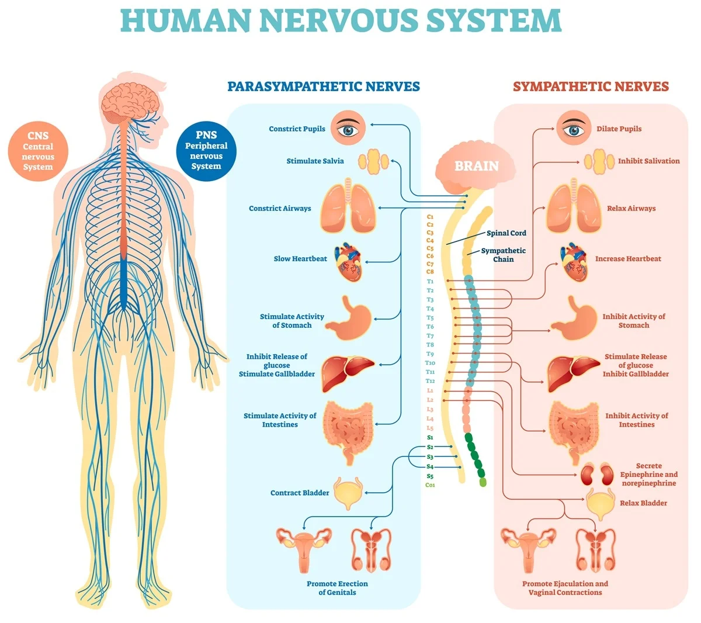
====

B: The heart 心脏!

A: Very good! It pumps (v.) blood 泵血 throughout the body, using the circulatory system 循环系统 such as blood vessels 血管 and veins 静脉. Now, let’s not forget that our lungs 肺 provide (v.)oxygen 氧气 to our heart and body /to keep us alive! Now, what about the organs that help us digest (v.) food 消化食物?

B: The stomach 胃 and intestines 肠!

A: Very good! Let’s not forget that the stomach is the one 后定 that *breaks down* 分解 our food, and our intestines process (v.)处理 that food and then expel (v.)排出 the waste 废物. Are we forgetting anything?

B: Yeah! Our kidneys 肾脏, liver 肝脏, and bladder 膀胱!

[.my1]
.案例
====
- bladder-> 来自PIE *bhel, 膨胀，鼓起，同blow.

====

A: Oh yes, you are right. Very important organs indeed.

B: So, what do these organs do, teacher?

A: Well, ummm, they… Time for a break 休息时间到了! We can talk about it when you get back 回到，返回.

[.my2]
A：好的，同学们，今天我们将继续解剖学课程。今天，我们将复习我们学过的所有内容。谁能告诉我第一个主要器官是什么？  +
B：大脑！  +
A：没错，大脑！它作为身体的控制中心，处理中枢神经系统的过程以及认知。那么，我们胸部的主要器官是什么？  +
B：心脏！  +
A：很好！它通过循环系统（如血管和静脉）将血液泵送到全身。别忘了，我们的肺为心脏和身体提供氧气，以维持生命！那么，帮助我们消化食物的器官是什么？  +
B：胃和肠！  +
A：很好！别忘了，胃负责分解食物，而肠则处理食物并排出废物。我们还漏了什么吗？  +
B：是的！我们的肾脏、肝脏和膀胱！  +
A：哦，对了。这些器官确实非常重要。  +
B：那么，老师，这些器官是做什么的？  +
A：嗯，它们……休息时间到了！等你们回来我们再讨论。  +

'''

== ■(334) The Office - Small Talk 10 - General Talk (C0334)  +
Mr. Campbell: Hi ladies. Thanks for picking me up. It’s awful weather out there! Michelle: Absolutely. It’s been raining for hours. Mr. Campbell: How are you Melissa? Are you okay? Melissa: I’m great thanks, Mr. Campbell. Michelle: Do you have any business trips planned soon Mr. Campbell? Mr. Campbell: Of course. I’m always traveling! I will leave for London next Monday, and then I’ll fly to Boston from there. It’s going to be a busy month. How about you Michelle? Any vacation plans? Michelle: Yes. Mike and I will travel to Beijing to see Mikes parents for Spring festival, and hopefully next year we will visit London. I hear it’s a wonderful city. Mr. Campbell: I couldn’t agree more. London is really fantastic. It’s my favorite city. I’m sure you’ll have a great time.  +
 +
 +
 +

'''

==== ◆(334) The Office - Small Talk 10 - General Talk 泛谈 (C0334)

Mr. Campbell: Hi ladies. Thanks for picking me up 接我. It’s awful weather 糟糕的天气 out there!

Michelle: Absolutely. It’s been raining 下雨 for hours.

Mr. Campbell: How are you, Melissa? Are you okay?

Melissa: I’m great 很好的, thanks, Mr. Campbell.

Michelle: Do you have any business trips 商务旅行 planned soon, Mr. Campbell?

Mr. Campbell: Of course. I’m always traveling 旅行! I will leave 离开 for London 伦敦 next Monday, and then I’ll fly 飞 to Boston 波士顿 from there. It’s going to be a busy month 忙碌的一个月. How about you, Michelle? Any vacation plans 假期计划?

Michelle: Yes. Mike 迈克 and I will travel (v.) to Beijing 北京 to see Mike’s parents for Spring Festival 春节, and hopefully next year we will visit London. I hear it’s a wonderful city 很棒的城市.

Mr. Campbell: I couldn’t agree more 完全同意. London is really fantastic 美妙的. It’s my favorite city 最喜欢的城市. I’m sure you’ll have a great time 愉快的时光.

[.my2]
Mr. Campbell：嗨，女士们。谢谢你们来接我。外面天气真糟糕！ +
Michelle：确实。已经下了几个小时的雨了。 +
Mr. Campbell：Melissa，你怎么样？还好吗？ +
Melissa：我很好，谢谢，Mr. Campbell。 +
Michelle：Mr. Campbell，你最近有计划商务旅行吗？ +
Mr. Campbell：当然。我总是在旅行！我下周一要去伦敦，然后从那里飞往波士顿。这将是一个忙碌的月份。你呢，Michelle？有什么假期计划吗？ +
Michelle：是的。迈克和我要去北京看望他的父母过春节，希望明年我们能去伦敦。我听说那是一个很棒的城市。 +
Mr. Campbell：我完全同意。伦敦确实非常美妙。它是我最喜欢的城市。我相信你们会玩得很开心。 +

'''

== ■(335) The Weekend - Going To The Playground (C0335)  +
A: Hey honey! Where were you?  +
B: I decided to take Kenny to the park and get some fresh air.  +
A: How was it? Were there a lot of kids?  +
B: It wasn’t too crowded, but we had a great time! We got on the see-saw together, the went on a couple of different slides and then I tried to go with him in the jungle gym, but I didn’t fit.  +
A: Sounds like fun! When we go he always just likes to play in the sandbox.  +
B: Yeah, but today he was really hyper. He even got on the monkey bars and then he went on to go on the swings for a half hour. I’m exhausted!  +
A: You should go to the park more often since you don’t go to the gym anymore!  +
 +

'''

==== ◆(335) The Weekend - Going To The Playground 去操场 (C0335)

A: Hey honey 亲爱的! Where were you?

B: I decided to take Kenny 肯尼 to the park 公园 /and get some fresh air 新鲜空气.

A: How was it? Were there a lot of kids 孩子?

B: It wasn’t too crowded 拥挤的, but we had a great time 愉快的时光! We got on the see-saw 跷跷板 together, then went on a couple of different slides 滑梯, and then I tried to go with him in the _jungle gym_ 攀爬架, but I didn’t fit 适合.

[.my1]
.案例
====
- jungle gym +
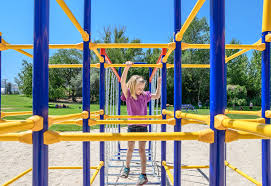

====

A: *Sounds (v.) like* fun 有趣的! When we go, he always just likes to play in the sandbox 沙坑.

B: Yeah, but today he was really (a.)hyper 兴奋的，紧张的. He even got on the _monkey bars_ 单杠,攀爬架 and then went on to the swings 秋千 for a half hour 半小时. I’m exhausted (a.)精疲力尽的!

[.my1]
.案例
====
- monkey bars +
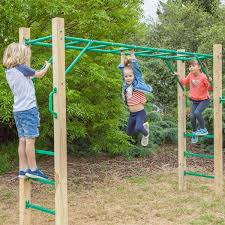

====

A: You should go to the park more often /since you don’t go to the gym 健身房 anymore!

[.my1]
.案例
====

- jungle gym : /ˈdʒʌŋɡəl dʒɪm/ (noun) A structure for climbing. 攀爬架
- monkey bars : /ˈmʌŋki bɑːrz/ (noun) A structure with bars for climbing. 单杠
====

[.my2]
A：嘿，亲爱的！你去哪儿了？ +
B：我决定带肯尼去公园呼吸新鲜空气。 +
A：怎么样？有很多孩子吗？ +
B：不太拥挤，但我们玩得很开心！我们一起玩了跷跷板，然后玩了几次不同的滑梯，接着我试着和他一起爬攀爬架，但我不适合。 +
A：听起来很有趣！我们去的时候，他总是喜欢在沙坑里玩。 +
B：是啊，但今天他真的很兴奋。他甚至爬上了单杠，然后在秋千上玩了半小时。我累坏了！ +
A：你应该多去公园，因为你现在不去健身房了！ +

'''

== ■(336) Daily Life - Christmas Traditions (C0336)  +
A: What are you doing awake?  +
 +
B: I can’t sleep...  +
 +
A: But it’s almost midnight!  +
 +
B: Exactly. I’m too excited for Christmas  +
morning.  +
Also, I thought I heard Santa.  +
 +
A: Really? How do you know it was Santa?  +
 +
B: Well I heard that naughty boys and girls  +
get coal in  +
their stockings, so I thought I’d be nice and  +
make  +
Santa cookies. I even left out some milk. I  +
heard someone in the kitchen eating the  +
cookies, so I came downstairs!  +
 +
A: Hmm... well I know that Santa won’t  +
come down the chimney with you hiding  +
behind the tree, spying on him!  +
 +
B: Really?  +
 +
A: Really! Let’s go back upstairs and get  +
back to bed. That way, we can let Santa do  +
his job. Then when you wake up, it will be  +
Christmas already!  +
 +
B: O-K...  +
 +
A: Hey, honey! Is that you? Don’t eat all the  +
cookies  +
-I want some, too!  +
 +
 +

'''

==== ◆(336) Daily Life - Christmas Traditions 圣诞节的传统 (C0336)

A: What are you doing awake 你怎么还醒着?

B: I can’t sleep…

A: But it’s almost midnight 午夜!

B: Exactly. I’m too excited 兴奋的 for Christmas morning 圣诞早晨. Also, I thought I heard Santa 圣诞老人.

A: Really? How do you know _it was Santa_?

B: Well, I heard that `主` naughty 淘气的 boys and girls `谓` get coal 煤 in their stockings 袜子, so I thought I’d be nice 好的 and make Santa cookies 饼干. I even left out 被忽略，被遗漏  some milk. I heard someone in the kitchen 厨房 eating the cookies, so I came downstairs 下楼!

A: Hmm… well, I know that /Santa won’t come down the chimney 烟囱 with you hiding (v.)躲藏 behind the tree , spying (v.)偷看 on him! 你躲在树后监视圣诞老人，他是不会从烟囱下来的！

B: Really?

A: Really! Let’s go back upstairs 上楼 and get back to bed. That way, we can let Santa do his job 工作. Then, when you wake up, it will be Christmas already!

B: O-K…

A: Hey, honey! Is that you? Don’t eat all the cookies - I want some, too!

[.my2]
A：你怎么还醒着？ +
B：我睡不着…… +
A：但已经快午夜了！ +
B：没错。我太期待圣诞早晨了。而且，我觉得我听到了圣诞老人。 +
A：真的吗？你怎么知道是圣诞老人？ +
B：嗯，我听说淘气的男孩和女孩会在袜子里得到煤，所以我想做个好孩子，给圣诞老人做饼干。我甚至留了一些牛奶。我听到有人在厨房吃饼干，所以我就下楼了！ +
A：嗯……好吧，我知道如果你躲在树后偷看他，圣诞老人就不会从烟囱下来了！ +
B：真的吗？ +
A：真的！我们上楼回床上吧。这样，圣诞老人就能完成他的工作了。然后，等你醒来，圣诞节就到了！ +
B：好吧…… + +
A：嘿，亲爱的！是你吗？别把饼干都吃了——我也要一些！ +

'''

== ■(337) Global View - The Night Before Christmas (C0337)  +
It was the night before Christmas, when all through the house Not a creature was stirring, not even a mouse; The stockings were hung bythe chimney with care, In hopes that St. Nicholas soon would be there; The children were nestled all snug in their beds,  +
 +
And mama in her ’kerchief, and I in my cap,  +
Had just settled down for a long winter’s nap,  +
When out on the lawn there arose such a  +
clatter, I sprang from the bed to see what  +
was the matter.  +
Away to the window I flew like a flash, Tore  +
open the shutters and threw up the sash.  +
The moon on the breast of the new-fallen  +
snow  +
Gave the lustre of mid-day to objects below,  +
When, what to my wondering eyes should  +
appear,  +
But a miniature sleigh, and eight tiny  +
reindeer,  +
With a little old driver, so lively and quick,  +
I knew in a moment it must be St. Nick.  +
More rapid than eagles his coursers they  +
came,  +
And he whistled, and shouted, and called  +
them by name;  +
” Now, Dasher! now, Dancer! now, Prancer  +
and Vixen!  +
On, Comet! on Cupid! on, Donder and  +
Blitzen!  +
To the top of the porch! to the top of the  +
wall!  +
Now dash away! dash away! dash away all!  +
As dry leaves that before the wild hurricane  +
fly,  +
When they meet with an obstacle, mount to  +
the sky, So up to the house-top the coursers  +
they flew,  +
With the sleigh full of toys, and St. Nicholas  +
too.  +
And then, in a twinkling, I heard on the roof.  +
The prancing and pawing of each little hoof.  +
As I drew in my head, and was turning  +
around,  +
Down the chimney St. Nicholas came with a  +
bound.  +
He was dressed all in fur, from his head to  +
his foot,  +
And his clothes were all tarnished with ashes  +
and soot;  +
A bundle of toys he had flung on his back,  +
And he looked like a peddler just opening his  +
pack.  +
His eyes – how they twinkled! his dimples  +
 +
how merry!  +
His cheeks were like roses, his nose like a  +
cherry!  +
His droll little mouth was drawn up like a  +
bow,  +
Andthe beard of his chin was as white as the  +
snow;  +
The stump of a pipe he held tight in his  +
teeth,  +
Andthe smoke it encircled his head like a  +
wreath;  +
He had a broad face and a little round belly,  +
That shook, when he laughed like a bowlful  +
of jelly.  +
He was chubby and plump, a right jolly old  +
elf,  +
And I laughed when I saw him, in spite of  +
myself;  +
A wink of his eye and a twist of his head,  +
Soon gave me to know I had nothing to  +
dread;  +
He spoke not a word, but went straight to his  +
work,  +
And filled allthe thestockings; then turned  +
with a jerk,  +
And laying his finger aside of his nose,  +
And giving a nod, upthe chimney he rose;  +
He sprang to his sleigh, to his team gave a  +
whistle,  +
And away they all flew like the down of a  +
thistle.  +
But I heard him exclaim, ere he drove out of  +
sight,  +
” Christmas to all, and to all a good-night.  +
 +
 +

'''

==== ◆(337) Global View - The Night Before Christmas 圣诞前夜 (C0337)

It was the night before Christmas 圣诞前夜, when all through the house 房子, +
Not a creature 生物 was stirring 搅拌；激发，打动; 活动, not even a mouse 老鼠; +
The stockings 袜子 were hung by the chimney 烟囱 with care 小心, +
In hopes 希望 that St. Nicholas 圣尼古拉斯 soon would be there; +
The children 孩子们 were nestled (v.)依偎 all snug (a.)舒适的；温暖的 in their beds 床, +
While visions 幻象 of _sugar plums_ (李子，梅子) 糖梅 danced (v.) in their heads 脑海; +

[.my1]
.案例
====
- sugar plums 糖梅：糖梅是一种由硬化糖制成的小圆形或椭圆形的糖果，起源于糖衣糖果或硬糖。 +
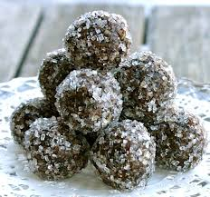

====

And mama 妈妈 in her **’kerchief** 头巾, and I in my cap 帽子, +

[.my1]
.案例
====
- kerchief -> 来自古法语couvrechief,头盖，来自couvrir,遮盖，词源同cover,chief,头，词源同chiefly,captain.引申词义头巾，方巾，围巾。拼写比较curfew. +
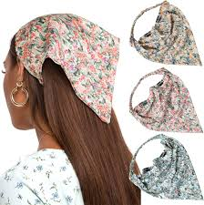

====

Had just settled down 安顿下来 for a long winter’s nap 冬眠, +
When out on the lawn 草坪 there arose (v.)出现 such a clatter 喧闹, +
I sprang (v.)跳 from the bed to see what was the matter 事情. +
Away to the window 窗户 I flew 飞奔 like a flash 闪光, +
Tore (v.)撕开 open 撕开 the shutters 百叶窗 and *threw up* 抛起,打开 the sash （垂直推拉窗任何一扇的）窗扇,窗框. +

[.my1]
.案例
====
.sash
1.a long strip of cloth worn around the waist or over one shoulder, especially as part of a uniform（尤指制服的）腰带，肩带，饰带 +
2.either of a pair of windows, one above the other, that are opened and closed by sliding them up and down inside the frame（垂直推拉窗任何一扇的）窗扇

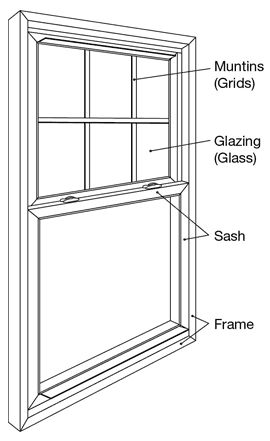

====

The moon 月亮 on the breast 乳房,胸部 of the new-fallen 刚落下的snow 雪 +
*Gave* the lustre 光泽 of mid-day 正午 *to* objects 物体 below, +
When, what to my wondering 好奇的 eyes should 竟然,居然appear 出现, +
But a miniature (a.)微型的 sleigh 雪橇, and eight tiny 小小的 reindeer 驯鹿, +

[.my1]
.案例
====
.When, what to my wondering eyes should appear
to my wondering eyes：在我惊奇的眼前 +
should appear：竟然出现了 +
*should 在诗歌和文艺语境中用来加强语气，有点像“竟然”、“居然”*

整句意译：
“就在这时，我惊奇地看到眼前出现了——” +
这是一种引出惊喜画面的方式，诗人看到圣诞老人驾着雪橇和驯鹿出现在天上。
====

With a little old driver 驾驶员, so lively 活泼的 and quick 迅速的, +
I knew in a moment 瞬间 it must be St. Nick. +
*More* rapid 迅速的 *than* eagles 鹰 his coursers 骏马 they came, +
And he whistled 吹口哨, and shouted 喊叫, and called 叫 them by name 名字; +
“Now, Dasher 猛冲者! now, Dancer 舞者! now, Prancer 腾跃者;腾跃前进的人；舞蹈者；欢跃者 and Vixen 雌狐；泼妇，刁妇! +

[.my1]
.案例
====
- vixen -> 来自 fox 的英语南方方言变体，狐狸，-en,古英语阴性词后缀，现代英语惟一保留。
====

On, Comet 彗星! on Cupid 丘比特! on, Donder 顿德 and Blitzen 闪电（圣诞老人麋鹿骑士团中的女骑士）! +
To the top 顶部 of the porch 门廊! to the top of the wall 墙! +

[.my1]
.案例
====
- porch -> 来源于拉丁语名词porta, portae, f(门,入口)。 -port-门 → porch. 建议和单词 port（港口）串记
====

Now dash away 冲走,匆忙离开! dash away! dash away all!” +
As _dry leaves_ 干树叶 that before the wild hurricane 狂野的飓风 fly (v.), +
When they meet 遇到 with an obstacle 障碍, mount (v.)爬上 to the sky 天空, +
So up to the house-top 屋顶 the coursers 骏马 they flew, +
With the sleigh 雪橇 full of toys 玩具, and St. Nicholas too. +

[.my1]
.案例
====
- sleigh -> 来自荷兰语 slee,缩写自 slede,雪橇，词源同 sled. (slide 滑)
====

And then, in a twinkling 瞬间, I heard (v.) on the roof. +
The prancing 腾跃 and pawing 刨地;用爪子抓、挠、扒 of each little hoof 蹄子. +
As I drew in 收回 my head 头, and was turning 转身 around, +
Down the chimney  烟囱，烟道 St. Nicholas came with a bound 跳跃. +
He was dressed 穿着 all in fur 毛皮, from his head to his foot 脚, +
And his clothes 衣服 were all tarnished (v.)失去光泽;，暗淡；玷污，败坏（名誉） with ashes 灰烬 and soot 煤灰; +

[.my1]
.案例
====
.soot
[ U]black powder that is produced when wood, coal, etc. is burnt煤烟子；油烟
 +
-> 来自古英语 sot,煤烟，烟灰，来自 Proto-Germanic*sota,煤烟，油灰，来自 sitjana,坐下，来自 PIE*sed,坐下，词源同 sit,sedate.比喻用法。 +

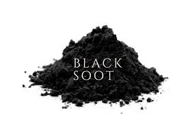
====

A bundle 包裹 of toys he had flung (v.)（用力）投,扔 on his back 背, +
And he looked like a peddler 小贩 just opening 打开 his pack 包裹. +
His eyes 眼睛 – how they twinkled 闪烁! his dimples 酒窝 how merry 快乐的! +
His cheeks 脸颊 were like roses 玫瑰, his nose 鼻子 like a cherry 樱桃! +
His droll 滑稽的；好笑的；逗趣的 little mouth 嘴巴 was drawn up 翘起;挺直（自己）到直立的姿势 like a bow 弓, +
And the beard 胡子 of his chin 下巴 was as white 白色的 as the snow; +
The stump 残端;（主体被砍断、折断或磨损后的）残余部分；残肢 of a pipe 烟斗 he held tight 紧紧地 in his teeth 牙齿, +

[.my1]
.案例
====
.stump
-> 来自 PIE*stebh,踩，踏，来自 PIE*sta,站立，词源同 stand,stamp,stomp.

首批美洲殖民者在大西洋器岸定居后不久就开始披荆斩棘地向西部推进，去开拓新的地区。**在西进拓荒过程中他们遇到的最大障碍**不是野兽，也不是寒冬积雪，不是英国人，也不是印第安人，而是**砍伐树木后留下的大量树桩（stump）。**有些树桩大到要用两三匹马才能拔出来。树桩成了拓荒者日常生活中主要话题之一。 +
**当有人被问及是否清除了地面时，他很可能回答说，“I'm still stumped”，意思是说，他还被树桩困着，不知该怎样把它们清除掉。** +
久而久之，stump一词由 “树桩”、“清除树墩”等义引申为“使…受困”、“把…难住”、“使…为难”等，这些词义至今未变，还常常用于美国口语中。

====

And the smoke 烟 it encircled (v.)环绕；围绕；包围 his head like a wreath 花环; +
He had a broad 宽阔的 face 脸 and a little round belly 肚子, +
That shook (v.)摇动, when he laughed 笑 like a bowlful 一碗 of jelly 果冻. +
He was chubby 圆胖的 and plump 丰满的, a right jolly (a.)快乐的;令人愉快的，惬意的；明亮好看的 old elf 精灵, +
And I laughed 笑 when I saw him, *in spite 尽管 of* myself; +
A wink 眨眼 of his eye 眼睛 and a twist 扭动 of his head 头, +
Soon gave me to know I had nothing to dread 害怕; +

He spoke 说 not a word 词, but *went straight 直接 to* his work 工作, +
And filled 填满 all the stockings; then turned 转身 with a jerk 猛拉, +
And laying 放 his finger 手指 aside 旁边 of his nose 鼻子, +
And giving 给 a nod 点头, up the chimney he rose 上升; +

He sprang 跳 to his sleigh  雪橇, to his team 团队 gave a whistle 口哨, +
And *away* they all *flew* 飞 like the down 绒毛 of a thistle 蓟(植物). +
But I heard him exclaim 喊叫, ere 在……之前 he drove 驾驶 out of sight 视线, +
“Christmas to all, and to all a good-night 晚安.” +

[.my1]
.title
====
.thistle
a wild plant with leaves with sharp points and purple, yellow or white flowers made up of a mass of narrow petals pointing upwards. The thistle is the national symbol of Scotland.蓟（野生植物，叶有刺，花呈紫色、黄色或白色，为苏格兰民族象征） +
-> 一种多刺草本植物，来自古英语 thistel,蓟，来自 Proto-Germanic*thistilaz,刺毛，可能来自 PIE*stei,尖刺，词源同 stick,thorn.-el,小词后缀。

image:img/thistle.jpg[,15%]]
====

这是《圣诞前夜》（A Visit from St. Nicholas）的经典诗歌，以下是它的中文翻译：

圣诞前夜，万籁俱寂， +
屋里屋外，悄无声息； +
长袜高悬，炉火旁， +
盼望圣尼古，降临此方； +
孩子们安睡，梦正酣， +
妈妈头巾裹，我帽遮颜， +
冬夜长眠，刚入梦乡， +
院中忽闻，声响异常。 +
我急忙起身，探头张望， +
飞身窗前，如电光， +
推开百叶，掀起窗框。 +
新雪映月，银光闪亮， +
地上万物，如白昼晃荡， +
我惊奇地，睁大眼眶， +
一辆小雪橇，八只驯鹿降， +
驾车老翁，敏捷又欢畅， +
瞬间明了，圣尼古降临此方。 +
骏马疾驰，胜过雄鹰翱翔， +
他吹口哨，高声呼唤， +
“驾，猛冲！驾，舞者！驾，跳跃和妖狐！ +
驾，彗星！驾，丘比特！驾，雷霆和闪电！ +
冲上门廊顶！冲上墙头！ +
冲啊！冲啊！冲啊！全都冲啊！” +
如狂风卷落叶，腾空而上， +
遇阻碍物，直冲云霄， +
骏马飞跃，直达屋顶， +
雪橇满载玩具，圣尼古同临。 +
转瞬之间，屋顶声响， +
小蹄哒哒，踏步轻扬。 +
我缩回脑袋，转身张望， +
圣尼古，从烟囱纵身下降。 +
他身披皮裘，从头到脚， +
衣衫沾满，灰烬与煤焦； +
玩具一包，背上斜靠， +
宛如小贩，刚把包打开。 +
双眼闪烁，酒窝欢笑！ +
脸颊如玫瑰，鼻头似樱桃！ +
嘴角微翘，如弓弦， +
胡须洁白，如雪团。 +
烟斗紧咬，齿缝间， +
烟雾缭绕，头顶光环； +
脸庞宽阔，肚腩圆， +
笑声震颤，如一碗果冻颤。 +
他矮胖可爱，真是老顽童， +
我忍俊不禁，笑出声容； +
他眨眨眼，歪歪头， +
让我明白，无需担忧； +
他一言不发，径直工作， +
长袜装满，转身利落， +
手指轻点，鼻旁一靠， +
点头示意，烟囱里升。 +
他跃上雪橇，口哨一啸， +
驯鹿飞驰，如蓟草轻飘。 +
他高声喊道，消失在远方， +
“圣诞快乐，祝大家晚安！” +

'''

== ■(338) Daily Life - Having Leftovers (C0338)  +
A: What’s for dinner?  +
B: Leftovers.  +
A: What? Leftovers of what and from when?  +
B: From last night! I took the left over turkey, mixed it with some diced peppers and onions, added a little bit of mayonnaise and made some sandwiches!  +
A: Isn’t that dangerous though? I mean bacteria and germs reproducing on food that was left out or reheated?  +
B: Well, I didn’t leave the turkey out at room temperature for more than an hour and I refrigerated it soon after we finished eating.  +
 +
Also, when reheating,  +
I put it in the oven for fifteen minutes at one  +
hundred degrees Celsius.  +
 +
A: Well ok, I am just afraid of getting food poisoning.  +
B: Don’t worry about it! Making a new meal out of leftovers is almost an art! Not only do you save money, but you also get to be creative and have something different to eat!  +
 +

'''

==== ◆(338) Daily Life - Having Leftovers 遗留；剩余物；吃剩的食物 (C0338)

A: What’s for dinner 晚餐?

B: Leftovers 剩菜.

A: What? Leftovers of what /and from when?

B: From last night 昨晚! I took the leftover turkey 火鸡, mixed 混合 it with some diced 切成小方块；碎成细粒 peppers 切碎的辣椒 and onions 洋葱, added a little bit of mayonnaise 蛋黄酱, and made some sandwiches 三明治!

[.my1]
.title
====
.mayonnaise
( also informal mayo /ˈmeɪəʊ/
 ) [ U]a thick cold white sauce made from eggs, oil and vinegar , used to add flavour to sandwiches , salads, etc.蛋黄酱（用作三明治、色拉等的调味品） +
-> 在地中海西部有一个叫做“米诺卡”（Minorca）的岛，岛上有一个海港小镇叫做“马翁”（Mahon）。

image:img/mayonnaise.jpg[,15%]
====

A: Isn’t that dangerous 危险的 though? I mean, bacteria 细菌 and germs 细菌 reproducing (v.)繁殖 on food that was left out or reheated 重新加热?

B: Well, I didn’t *leave* the turkey *out* at room temperature 室温 for more than an hour, and I refrigerated (v.)冷藏 it /soon after we finished eating 吃完. Also, when reheating, I *put* it *in* the oven 烤箱 for fifteen minutes 十五 minutes /at one hundred degrees Celsius (n.a.摄氏温度) 一百摄氏度.

A: Well, ok, I’m just afraid 害怕 of getting _food poisoning_ 食物中毒.

B: Don’t worry 担心 about it! `主` Making a new meal out of leftovers `系` is almost an art 艺术! *Not only* do you save money 省钱, *but you also* get to be creative 有创意的 and have something different 不同的 to eat!

[.my2]
A：晚餐吃什么？ +
B：剩菜。 +
A：什么？剩菜？什么时候的剩菜？ +
B：昨晚的！我把剩下的火鸡和切碎的辣椒、洋葱混合在一起，加了一点蛋黄酱，做了一些三明治！ +
A：这不会很危险吗？我是说，细菌在留在外面或重新加热的食物上繁殖？ +
B：嗯，我没有把火鸡放在室温下超过一小时，而且我们吃完后很快就把它冷藏了。另外，重新加热时，我把它放在烤箱里用一百摄氏度加热了十五分钟。 +
A：好吧，我只是害怕食物中毒。 +
B：别担心！用剩菜做一顿新饭几乎是一门艺术！你不仅能省钱，还能发挥创意，吃到不同的东西！ +

'''

== ■(339) Global View - Parent Teacher Conference (C0339)  +
A: Thank you for coming tonight Mrs. Webber. As a teacher, it’s great seeing the kid’s parents assist our parent-teacher conference night.  +
B: Of course! I am very interested to know how my child is doing and also get some insight from you as to how he can improve.  +
A: Well Allen is a great student. He is a hard worker and very well behaved, however he does struggle a bit with math.  +
B: I guess he gets that from me, I never did well in math when I was a kid. What can I do at home to compliment what he is learning in the classroom.  +
A: Well, it’s important that you sit with him and review his homework assignments and help him with math. I would also recommend he stay after school twice a week for tutoring sessions. It will really help a lot.  +
B: Thanks a lot! I will definitely do that. Is there anything else?  +
A: Um.. yes. Here is a notice from our financial department, seems your child’s tution is overdue.  +
B: Oh yes, I....  +
 +

'''

==== ◆(339) Global View - Parent Teacher Conference 家长会 (C0339)

A: Thank you for coming 来 tonight, Mrs. Webber. As a teacher 老师, it’s great seeing the kids’ parents 孩子的父母 assist (v.)帮助，协助；<古>参加，出席 our parent-teacher conference night 家长会之夜.

B: Of course! I’m very interested 感兴趣的 to know how my child 孩子 is doing /and also get some insight 见解 from you *as to* 关于，就……而言 how he can improve 提高.

A: Well, Allen 艾伦 is a great student 学生. He is a hard worker 努力的人 and very well-behaved 行为端正的, however, he does struggle 挣扎 a bit with math 数学.

B: I guess he gets 得到 that from me. I never did well in math /when I was a kid 孩子. What can I do at home /to compliment 补充 what he is learning in the classroom 教室?

A: Well, it’s important 重要的 that /you sit 坐 with him /and review (v.)复查；重新考虑;校阅；审核;复习 his _homework assignments_ 家庭作业 /and help him with math. I would also recommend 推荐 he stay 留下 after school twice a week /for tutoring 辅导；教导，教学 sessions 辅导课. It will really help a lot.

B: Thanks a lot! I will definitely 肯定 do that. Is there anything else?

A: Um… yes. Here is a notice 通知 from our financial department 财务部门. Seems your child’s tuition 学费 is overdue 逾期.

B: Oh yes, I…

[.my1]
.title
====
- parent-teacher conference night : /ˈpeərənt ˈtiːtʃər ˈkɒnfərəns naɪt/ (noun) An event where parents meet teachers. 家长会之夜
- homework assignments : /ˈhəʊmwɜːrk əˈsaɪnmənts/ (noun) Tasks given to students to do at home. 家庭作业
====

[.my2]
A：谢谢您今晚来参加，Webber太太。作为一名老师，看到孩子们的父母参加我们的家长会之夜真是太好了。 +
B：当然！我非常想知道我的孩子表现如何，也想从您那里得到一些关于他如何提高的见解。 +
A：嗯，艾伦是个很棒的学生。他很努力，行为也很端正，但他在数学上有点挣扎。 +
B：我想他是从我这里遗传的。我小时候数学也不好。我在家里能做些什么来补充他在课堂上学到的东西呢？ +
A：嗯，重要的是你和他一起坐下来复习他的家庭作业，并帮助他学习数学。我还建议他每周放学后留下两次参加辅导课。这真的会很有帮助。 +
B：非常感谢！我肯定会这么做的。还有其他事情吗？ +
- A：嗯……是的。这是我们财务部门的通知。似乎您孩子的学费逾期了。 +
B：哦，是的，我…… +

'''

== ■(340) Global View - Happy New Year! (C0340)  +
A:: It’s almost midnight! We are about to start a brand new year!  +
B: I know it’s so exciting! A new year is  +
always like a clean slate.  +
A:: fresh start to accomplish any dreams,  +
objectives and goals.  +
 +
A: Do you have a New Year’s resolution?  +
 +
B: I was thinking about it, but I’m never able  +
to keep my New Year’s resolution. Last year  +
for example I joined a gym and only went  +
twice.  +
 +
A: Yeah I know what you mean. That’s why this year I am keeping things more simple. Maybe like getting together with friends I haven’t seen in a long time, or doing some volunteering work.  +
B: That seems reasonable. We should get together and watch the ball drop in Times Square.  +
A: Sure, as long as you don’t try to kiss me at midnight!  +
B: Well, we can’t break tradition! It’s bad luck!  +
 +

'''

==== ◆(340) Global View - Happy New Year! (C0340)

A: It’s almost midnight 午夜! We are about to start a _brand new_ 全新的、崭新的、刚刚制造或出现的 year 崭新的一年!

[.my1]
.title
====
.brand new
brand new 是一个固定搭配，意思是：
*全新的、崭新的、刚刚制造或出现的.* +
这个短语中的 brand 原本的意思是“商标、牌子”，但在这个搭配中，并不表示品牌，而是用来加强语气，表示“完全新”、“从未使用过”。

They moved into a brand new apartment.
他们搬进了一套崭新的公寓。
====

B: I know, it’s so exciting 令人兴奋的! A new year is always like a _clean slate_ (板岩；石板) 无过错记录;全新的开始.

[.my1]
.title
====
- clean slate +
image:img/clean slate.png[,25%]
====

A: A fresh start 新的开始 to accomplish (v.)实现 any dreams 梦想, objectives 目标, and goals 目标.

A: Do you have a New Year’s resolution 新年决心?

B: I was thinking 思考 about it, but I’m never able to keep 保持 my New Year’s resolution. Last year, for example, I joined 加入 a gym 健身房 and only went twice 两次.

A: Yeah, I know what you mean. That’s why this year I am keeping 保持 things more simple 简单的. Maybe like getting together 聚会 with friends 朋友 I haven’t seen in a long time, or doing some volunteering work 志愿工作.

B: That seems reasonable 合理的. We should get together and watch _the ball drop_ 倒计时 in Times Square 时代广场.

[.my1]
.title
====
.ball drop
指的是：纽约时代广场跨年时倒数降下的水晶球仪式. +
这是美国跨年最有标志性的传统活动之一。每年12月31日晚上，在纽约市的 Times Square（时代广场），会有一个巨大的水晶球从高处缓缓下降（drop），在午夜正好落下，象征新的一年的到来。这个水晶球叫 Times Square Ball，重达几吨，由 Waterford 水晶制造。

====

A: Sure, as long as 只要，在……的时候，只要……就 you don’t try to kiss 亲吻 me at midnight 午夜!

B: Well, we can’t break tradition 打破传统! It’s bad luck 坏运气!

[.my2]
A：快到午夜了！我们即将迎来崭新的一年！ +
B：我知道，这太令人兴奋了！新年总是一个全新的开始。 +
A：一个新的开始，去实现任何梦想、目标和目标。 +
A：你有新年决心吗？ +
B：我考虑过，但我从来没能坚持我的新年决心。例如，去年我加入了一家健身房，但只去了两次。 +
A：是的，我明白你的意思。这就是为什么今年我要保持简单。也许和很久没见的朋友聚一聚，或者做一些志愿工作。 +
B：这听起来很合理。我们应该一起观看时代广场的倒计时。 +
A：当然，只要你别想在午夜吻我！ +
B：嗯，我们不能打破传统！那会带来坏运气！ +

'''
