=  English pod 341-360
:toc: left
:toclevels: 3
:sectnums:
:stylesheet: ../../../myAdocCss.css

'''

== ■(341) Daily Life - Baking A Cake (C0341)  +
A: Ok, so are you ready to learn how to bake  +
a cake?  +
 +
B: Almost, let me just put my apron on.  +
 +
A: Ok, so the first thing we are going to do is  +
preheat the oven, that way we have it at the  +
desired temperature once we finish preparing  +
everything.  +
Set it to three hundred and seventy five  +
degrees  +
Fahrenheit.  +
 +
B: Got it.  +
 +
A: No we are gonna make the batter. Take  +
some butter and sugar and mix it lightly until  +
you have a nice consistency. Then add some  +
vanilla extract and eggs and continue mixing.  +
 +
B: Do I have to use a whisk or can I use the  +
electric mixer?  +
 +
A: Go ahead and use the mixer, but put it on  +
medium speed. I’m gonna sift the flour and  +
baking powder separately and then we can  +
mix it with milk and the rest of the  +
ingredients.  +
 +
B: Ok, so now we need a baking pan right?  +
 +
A: Yeah, but grease and flour it first so the  +
cake won’t stick to it when it bakes.  +
 +
B: Done. So how long do we bake it for?  +
 +
A: We can leave it in there for about twenty  +
five minutes.  +
Then we let it cool for ten minutes before we  +
remove the cake from the pan.  +
 +
B: Wow! This was a lot easier than I thought!  +
 +
 +

'''

==== ◆(341) Daily Life - Baking A Cake 糕饼；蛋糕 (C0341)

A: Ok, so are you ready to learn how to bake
a cake?

B: Almost, let me just put my apron 围裙 on.

[.my1]
.案例
====
.apron
-> 来自短语 a napron 错分为 an apron. 古英语 napron, 布，同map, mop.
====

A: Ok, so the first thing we are going to do is
preheat (v.)预先加热 the oven  烤炉，烤箱, that way *we have it at the
desired (a.)期望得到的，希望实现的 temperature* once we finish (v.) preparing
everything.
Set (v.) it to _three hundred and seventy five_
degrees
Fahrenheit 华氏温度计的；华氏的.

[.my2]
我们要做的第一件事是预热烤箱，这样我们准备好所有的东西后，烤箱就会达到我们想要的温度。把温度调到375华氏度。

B: Got it.

A: #Now we are gonna make the batter# 面糊（煎料）（用于做糕饼）; 我们来做面糊. Take
some butter and sugar and mix (v.) it lightly until
you have a nice consistency 一致性，连贯性；黏稠度，平滑度. Then add (v.) some
_vanilla 香草醛，香草香精（从热带植物香子兰豆中提取，用于冰激凌等甜食） extract_ (n.)提取物；浓缩物；精；汁 and eggs and continue mixing (v.).

[.my2]
我们要做面糊。取一些黄油和糖，轻轻搅拌，直到形成粘稠度。然后加入一些香草精和鸡蛋，继续搅拌。

[.my1]
.案例
====
.batter
-> 词源同beat, 击，打。-er, 表反复。

.vanilla
-> vanilla是兰科热带植物，汉语名叫“香子兰”，俗称“香草”。西式点心几乎必备的香草精就是取自香子兰。 +
vanilla一词来自西班牙语vaina 'sheath'（鞘）的指小词vainilla 'little sheath'（小鞘），而西班牙语vaina则源自拉丁语vāgīna 'sheath'（鞘）。 +
顺便提一下，英语人体解剖学用语vagina（阴道）就是直接借自拉丁语的这个词的。它开初只是作为戏称用于此义，因其亦属鞘状物。

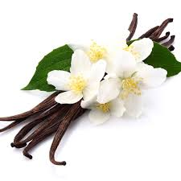

====

B: Do I have to use a whisk 打蛋器；搅拌器 or can I use the
electric mixer 电动搅拌器?

[.my2]
我必须用打蛋器, 还是可以用电动搅拌器？

[.my1]
.案例
====
.whisk
-> 来自 PIE*weis,旋转，搅动，来自 PIE*wei 的扩大格，弯，转，词源同 wind,wire.

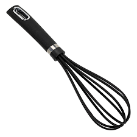

.electric mixer
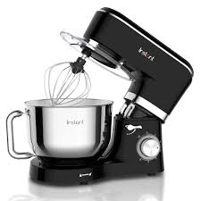
====

A: Go ahead and use the mixer, but put it on
medium speed. I’m gonna *sift* (v.)筛（面粉或颗粒较细的物质） the flour 面粉 and
_baking powder_ 烘焙粉;发酵粉 *separately* and then we can
mix (v.) it with milk and the rest of the
ingredients 材料，佐料，原料.

[.my2]
可以用搅拌器，但要调到中速。我要把面粉和发酵粉分开"过筛", 然后我们可以把它和牛奶以及其他配料混合。

[.my1]
.案例
====
.baking powder
[ U]a mixture of powders that are used to make cakes rise and become light as they are baked 发酵粉 +
"发粉"在加工过程中, **受热产生气体，使食品更加蓬松、柔软，**常用于速成面包、油条、曲奇饼、饼干等食品。 +
市面有些"面粉"已混入"发粉"出售，称为自发粉。

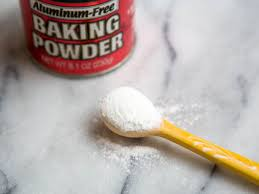
====

B: Ok, so now we need a _baking pan_ 烤盘 right?

[.my2]
好的，现在我们需要一个烤盘，对吗？

[.my1]
.案例
====
.baking pan
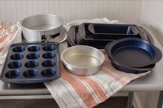
====

A: Yeah, but grease (v.)给…加润滑油，为…涂（或抹）油 and flour (v.)在…上撒面粉 it first so the
cake won’t *stick to* it when it bakes.

[.my2]
是的，但是要先上油,和撒面粉，这样烤的时候, 蛋糕就不会粘在上面了。

B: Done. So how long do we bake it for?

A: We can leave it in there for about twenty
five minutes.
Then we let it cool for ten minutes before we
remove the cake from the pan.

B: Wow! This was a lot easier than I thought!

'''

== ■(342) Global View - At The Library (C0342)  +
A: Wow! Look at all these books! I bet I can find a book about anything here!  +
 +
B: Shhh!! Please keep your voice down. There are people reading and studying here.  +
A: Ok, I’m sorry. Are you the librarian? Maybe you can help me, I am looking for a book.  +
B: Yes I am. You can check our online catalog to search the book you want based on the genre, title or if you know the author, I can point you towards the right direction.  +
A: I am looking for a book that has nursery rhymes.  +
B: That would be in our children’s section. That book shelf there on the right.  +
A: Ok, I would like to check out these books.  +
B: Do you have a library card?  +
A: No. How do I get one?  +
B: I just need to see your drivers license or utility bill to prove that you a resident of this state.  +
A: Here you go.  +
B: So you are all set. You can have these books for two weeks. If you need to have them longer, you can bring them here to renew them. If you don’t, you get charged ten cents a day for each book.  +
A: Ok, thanks!  +
 +

'''

==== ◆(342) Global View - At The Library 图书馆 (C0342)

A: Wow! Look at all these books! I bet I can
find a book about anything here!

B: Shhh （用以让别人安静）嘘!! Please keep your voice down.
There are people reading and studying here.

A: Ok, I’m sorry. Are you the librarian 图书馆馆长，图书馆管理员?
Maybe you can help me, I am looking for a
book.

B: Yes I am. You can check our online
catalog 目录；登记 to search the book you want based
on the genre （文学、艺术、电影或音乐的）体裁，类型, title (n.) or if you know the author,
I can point you towards the right direction.

A: I am looking for a book that has _nursery 幼儿教育的
rhymes_ (（诗、歌曲）押韵；押韵小诗) 童谣.

B: That would be in our children’s section.
That _book shelf_ 书架 there on the right.

[.my2]
在儿童区。右边的那个书架。

A: Ok, I would like *to check out* （从图书馆等）借出;结账离开（旅馆等） these books.

B: Do you have a library card?

A: No. How do I get one?

B: I just need to see your _drivers license_ or
_utility （煤气、水、电等的）公共服务，公用事业 bill_ to prove that you are a resident 居民，住户 of this
state.

A: Here you go 给你.

B: So you are *all set* (=Ready). You can have these
books for two weeks. If you need to have
them longer, you can bring them here to
renew 重新开始，中止后继续 them. If you don’t, you get charged 收（费）；（向…）要价
ten cents a day for each book.

A: Ok, thanks!

[.my1]
.案例
====
.'All Set': A Phrase Beyond "Ready"

While all set commonly means "ready," it has developed a set of idiomatic uses (n.) that could confuse (v.) non-native speakers.  +
For example, "*are you all set*?" is often used to mean "*are you finished?*"  +
"*The bill is all set*" means that *the bill has been taken care of.*  +

And perhaps at a store you might hear "*do you need help or are you all set?*" implying that "all set" `谓` means *one needs no help*.

虽然“all set ”通常意味着“准备好”，但它已经形成了一套可能会让非母语人士感到困惑的惯用用法。例如，“你都准备好了吗？”通常用来表示“你完成了吗？” “账单已全部确定”意味着账单已经处理完毕。也许在商店里您可能会听到“您需要帮助吗？或者您都准备好了吗？”暗示“一切就绪”意味着不需要帮助。

https://www.merriam-webster.com/grammar/usage-of-all-set-idiom

====

'''

== ■(343) Daily Life - Seafood Dinner (C0343)  +
A: This is such a nice restaurant! I feel so  +
classy!  +
 +
B: Yeah, it’s a little bit pricey, but they serve  +
the best seafood in town.  +
 +
C: May I Take your order?  +
 +
B: Yes, I would like some marinated grilled  +
shrimp for starters and I’ll also have the  +
lobster.  +
 +
C: Excellent choice sir. And for you madame?  +
 +
B: I would like the baked oysters and the  +
seafood platter.  +
 +
C: Very good madame.  +
 +
B: That seafood platter sounds good. Excuse  +
me, what does the platter have?  +
 +
C: It’s a great combination of clams,  +
scallops, squid mussels, calamari and fillets  +
of salmon and tuna.  +
It comes with a side of butter sauce and  +
French fries.  +
 +
B: That sounds great! Cancel the lobster and  +
give me one of the same please.  +
 +
C: Very well sir. Anything to drink?  +
A: Can we get a bottle of your house white wine please?  +
C: Superb choice. I will be back shortly with the wine.  +
 +

'''

==== ◆(343) Daily Life - Seafood 海鲜；海味；海产食品 Dinner (C0343)

A: This is such a nice restaurant! I feel so
classy (a.)上等的；豪华的；时髦的!

B: Yeah, it’s a little bit pricey  (a.)高价的，过分昂贵的, but they serve
the best seafood in town.

C: May I Take your order?

B: Yes, I would like some _marinated 腌制，浸泡（食物） grilled 烤的
shrimp_ 虾，小虾 for starters 开胃菜 and I’ll also have the
lobster 龙虾.

[.my2]
我要一些腌烤虾作为开胃菜，我还要一份龙虾。

C: Excellent choice sir. And for you madame?

B: I would like the baked oysters 牡蛎 and the
seafood platter 大平盘.

[.my2]
我要烤牡蛎和海鲜拼盘。

[.my1]
.title
====
.oyster
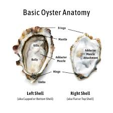

====

C: Very good madame.

B: That seafood platter sounds good. Excuse
me, what does the platter have?

[.my2]
海鲜拼盘听起来不错。打扰一下，盘子里有什么？

C: It’s a great combination of clams 蛤蜊,蛤蚌；沉默寡言的人,
scallops 扇贝；干贝, squid 枪乌贼，（食用的）鱿鱼 mussels 蚌；贻贝；淡菜, calamari (用作食品的)鱿鱼 and fillets 无骨肉片；去骨鱼片
of salmon  鲑鱼，三文鱼 and tuna 金枪鱼；金枪鱼肉.
It comes with a side of butter sauce and
French fries.

[.my2]
这是蛤蜊、扇贝、鱿鱼贻贝、鱿鱼、鲑鱼片和金枪鱼片的绝佳组合。它附有黄油酱和炸薯条。

[.my1]
.title
====
.clam
-> 词源同clamp,夹子，夹具。后用以指蛤蜊之类的双壳软体动物。

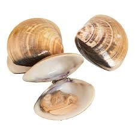

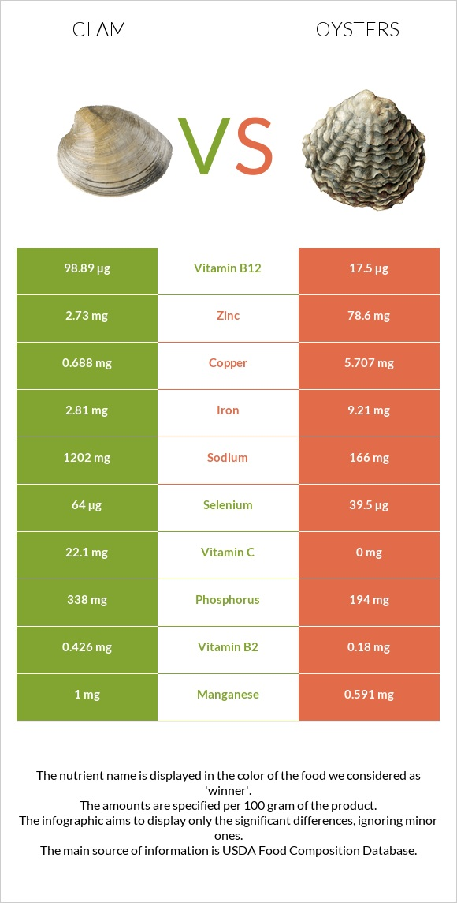

.scallop
1.a shellfish that can be eaten, with two flat round shells that fit together 扇贝 +
•a scallop shell 扇贝壳

2.any one of a series of small curves cut on the edge of a piece of cloth, pastry , etc. for decoration （织物、糕点等的）扇形饰边；荷叶边

-> 来自古法语 escalope,贝壳，词源同 shell.

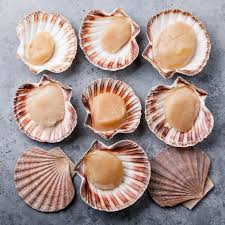

.mussel
a small shellfish that can be eaten, with a black shell in two parts 蚌；贻贝；淡菜 +
-> 来自拉丁语mus,老鼠，词源同mouse,musk,-el,小词后缀。即小老鼠，因这种贝类形似小老鼠而得名。

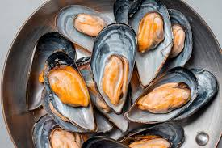

.calamari
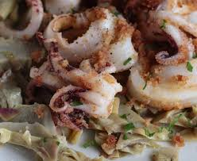

.fillet
( NAmE alsofilet ) [ CU] a piece of meat or fish that has no bones in it 无骨肉片；去骨鱼片
•plaice fillets 鲽鱼片 +
•a fillet of cod 一片鳕鱼 +
•fillet steak 无骨牛排 +

-> 来自拉丁语filum,线，词源同 filament. 因这种鱼片用丝线穿在一起而得名。

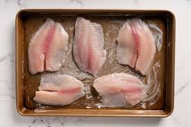

.salmon
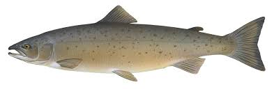

.tuna
-> 来自美式西班牙语 tuna,金枪鱼，来自西班牙语 atun,来自拉丁语 thunnus,来自希腊语 thunnos, 来自 thuno,冲，投掷飞镖，词源同 tunny.

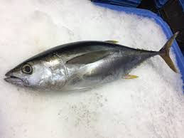

====

B: That sounds great! Cancel the lobster and
give me one of the same please.

C: Very well sir. Anything to drink?

A: Can we get a bottle of your house 餐馆；餐厅 white
wine please?

[.my1]
.title
====
.house

[ C] ( in compounds构成复合词 ) a restaurant 餐馆；餐厅 +
•a steakhouse 牛排餐馆 +
•a coffee house 咖啡馆 +
•a bottle of house wine (= the cheapest wine available in a particular restaurant, sometimes not listed by name) 一瓶本店特价酒
====

C: Superb (a.)极佳的，质量极高的 choice. I will be back shortly with
the wine.

'''

== ■(344) Global View - Booking A Hotel Room (C0344)  +
A: Madison Suites, how may I help you?  +
B:  +
Yes, I’m calling from Mexico. I will be in town next week and would like to know if you have availability.  +
 +
B:  +
OK ma’am, can you tell me the date you expect to check in?  +
 +
 +
A: Yes, July ninth. I will be there for seven nights.  +
B: We have a junior single suite or a superior double suite available for those dates.  +
A: What’s the difference?  +
B: The junior suite is smaller and has one twin bed, while the superior suite has a double bed and mini-bar.  +
A: OK, I would like to reserve the superior suite. Is breakfast included?  +
B: Yes, a buffet breakfast is served every morning. I will need your name and your credit card details in order to complete the reservation.  +
A: Sure, my credit card number is...  +
 +

'''

==== ◆(344) Global View - Booking A Hotel Room (C0344)

A: Madison Suites 套房, how may I help you?

B: Yes, I’m calling from Mexico. I will be in
town next week and would like to know if
you have availability 可用性，可得性；空闲，闲暇.

我是从墨西哥打来的。我下周会在城里，我想知道你们是否有"空房间"。

B: OK ma’am （尊称）女士，夫人, can you tell me the date you
expect 预料；预期；预计 *to check in* 登记入住,办理入住手续?

A: Yes, July ninth 7月9日. I will be there for seven
nights.

B: We have a _junior 地位（或级别）低的，资历较浅的 single suite_ or a _superior （规模或实力）更大的，更强的，(在品质上)更好的
double suite_ available for those dates.

[.my2]
我们有一间小单人套房, 或一间高级双人套房。

A: What’s the difference?

B: The junior suite is smaller and has one
_twin 成对的；成双的 bed_, while the superior suite has a
_double bed_ and mini-bar.

[.my1]
.title
====
.twin bed 和 double bed 有什么区别?

在酒店房间中，twin bed 和 double bed 是不同的床型： +
- Twin bed（单人床）：通常指的是两张单人床，通常宽 90cm - 110cm（35-43 英寸），适合单人使用。如果是 twin room，通常指有两张单人床。 +
- Double bed（双人床）：通常宽 135cm - 150cm（54-60 英寸），适合一两个人睡，比 twin bed 更宽敞。

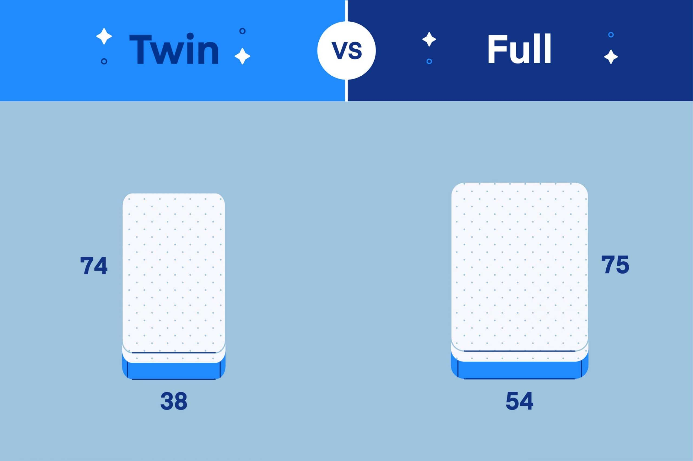

====

A: OK, I would like to reserve 预订；保留，预留 the superior
suite. Is breakfast included?

B: Yes, a buffet (a.)自助的；自助餐的 breakfast is served every
morning. I will need your name and your
credit card 信用卡 details *in order to* 为了，以便 complete the
reservation 预订；预约.

[.my1]
.title
====
.buffet
-> 来自法语bufet, 桌子，橱柜。后指餐厅自助餐。
====

A: Sure, my credit card number is...

'''

== ■(345) Daily Life - Working Out (C0345)  +
A: Do you want to go catch a movie tonight?  +
 +
B: I can’t, I have to go tothe gym.  +
 +
A: Come on! You can go tomorrow, just skip  +
it today.  +
It’s not as if you are gonna get in trouble!  +
 +
B: Actually I will! I am working out with a  +
personal trainer that gets on my case if I  +
don’t go. I like it, because it makes me feel  +
more obligated to go and get healthy.  +
 +
A: That’s cool, does your personal trainer  +
basically teach you how to work out?  +
 +
B: Yeah. He makes a work put plan  +
depending on the areas I want to work on, or  +
the muscles I want to build. Like for example  +
in order to get better muscle tone in my abs,  +
pecs and biceps, he makes me work out with  +
free weights. Then for my quads, calves and  +
hamstrings, I do leg lifts or squats.  +
 +
A: Sounds like you are really getting in  +
 +
 +
shape!  +
 +

'''

==== ◆(345) Daily Life - Working Out 锻炼，健身 (C0345)

A: Do you want to go catch a movie tonight?

B: I can’t, I have to go to the gym 体育馆，健身房.

A: Come on! You can go tomorrow, just skip
it today.
*It’s not as if* 又不是…,并不是说 you are gonna *get in trouble* 陷入麻烦,惹上麻烦!

[.my2]
你可以明天去，今天就不去了。又不是说你会惹上麻烦！

[.my1]
.title
====
.It’s not as if
的意思是 "又不是……" 或 "并不是说……"，用于表达一种否定或反驳的语气。 +
It’s not as if 常用于表示 某种情况并不会真的发生，有点像 "又不会怎么样" 或 "并不是那回事"。
====

B: Actually I will! I am working out with a
personal trainer that *gets on my case* 批评某人 if I
don’t go. I like it, because it makes me feel (v.)
more obligated (a.)（道义或法律上）有义务的，有责任的，必须的 to go (v.) and get healthy.

[.my2]
事实上我会的！我正在和一个私人教练一起锻炼，如果我不去，他就会来找我。我喜欢它，因为它让我觉得更有义务去保持健康。

[.my1]
.title
====
.get on someone's case
to criticize someone in an annoying way for something they have done: +
- I just don't want him *getting on my case* for being late for work.
====

A: That’s cool, does your personal trainer
basically teach you how to work out?

B: Yeah. He makes a _workout 锻炼 plan_
depending on the areas I want *to work on* 努力改善（或完成）, or
the muscles I want to build. Like _for example_
in order to get better muscle tone （肌肉）结实，健壮；（皮肤）柔韧 in my abs 腹肌,
pecs 胸肌 and biceps  二头肌, he makes me *work out* 锻炼，健身 with
_free weights_ 自由重量器械. Then for my quads 股四头肌, calves 腓；小腿肚 and
hamstrings 腘绳肌腱, I do _leg lifts_ 抬腿 or squats 蹲坐；蹲.

[.my2]
他会根据我想要锻炼的部位, 或我想要锻炼的肌肉, 来制定锻炼计划。比如，为了让我的腹肌、胸大肌, 和二头肌有更好的肌肉张力，他让我做自由重量训练。然后，对于我的股四头肌、小腿和腿筋，我做抬腿或深蹲。

[.my1]
.title
====
.biceps
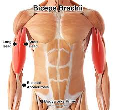

.Free weights
指的是**自由重量器械，也就是不固定在机器上的健身器材，**例如：  +
哑铃（Dumbbells） +
杠铃（Barbells） +
壶铃（Kettlebells） +
沙袋（Sandbags） +
**相比于健身房里的"固定器械"（如史密斯机、腿举机等），"自由重量训练"需要更多的肌肉协同发力，可以提高肌肉控制能力, 和平衡性。**因此，在你的句子里，"work out with free weights" 意思是 “使用哑铃、杠铃等自由重量器械进行锻炼”，以增强腹肌（abs）、胸肌（pecs）和肱二头肌（biceps）。

.quads
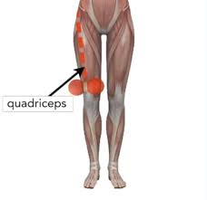

.calf
-> 来自PIE *gel, 鼓起，子宫，词源同child, dolphin.

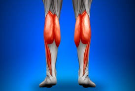

.hamstring
-> ham,膝弯，string,弦。引申词义肌腱。 +

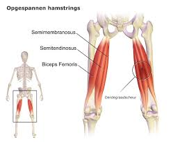
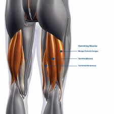

====

A: Sounds like you are really *getting in shape* 身材变好, 变得更健康、更健美!

[.my2]
听起来你真的在变得更健美/越来越健康了！

[.my1]
.title
====

Getting in shape 的意思是 “身材变好” 或 “变得更健康、更健美”，通常指通过锻炼或健康生活方式来改善体型和体能。 +
- He's been working out a lot, and he's really getting in shape.（他最近锻炼很多，身材真的变好了。）

相关短语： +
*Stay in shape*（保持身材） +
*Out of shape*（身材走样、不在状态） +
I need to exercise more —I'm really out of shape.（我得多运动了，我现在体能太差了。）
====

'''

== ■(346) Global View - All About Wines (C0346)  +
Salesperson: Hello there, welcome to WineWorld. Let me know if I can help you out at all. Customer: Um, yes, please, I could really use some help. I’m going over to my boss’ house for dinner tonight and don’t know what kind of wine I should bring. Salesperson: OK, do you know what kind of food will be served? Customer: Well, his wife is Japanese. He said she makes really good sushi. Salesperson: Hmm, that’s a bit of a challenge. Sushi is notoriously difficult to pair with wine. Well, let’s see. have to be a white wine, of course. Customer: Why? Wouldn’t a red wine go well with sushi? Salesperson: No, I don’t think so. Sushi is a very delicately flavored food, and red wine would be a jarring contrast. You need a white wine, which has more subtle flavors, to complement the fish. Customer: I see. So should I get a bottle of Chardonnay? That’s a white wine, right? Salesperson: Yes, Chardonnay is a white wine, but I’m not sure it’d be your best bet. Chardonnay is one of the more fullbodied whites, and tends to be a bit oaky. I’d suggest that you go for something brighter, like this Sauvignon Blanc from New Zealand. Customer: Sauvignon Blanc? What’s that? Salesperson: That’s another varietal, or type of grape, just like Chardonnay. Customer: Let’s see. The label says it’s got ”attractive citrus and grassy aromas that give way to crisp, mineral flavors and a bonedry finish. Serve chilled.” Oh, no, how long will it take to chill the wine? I’m on my way to the dinner now. Salesperson: It’s OK, don’t worry, we’ll just choose a wine from the cooler. We don’t have quite as extensive a selection over here, but...this Rhone Valley white would be lovely.  +
Customer: All right. What varietal is that? Salesperson: Well, this is a French wine, so they don’t always specify the varietal on the label. The French believe that the soil a grape is grown in is one of the most important factors in the final flavor of the wine. This wine is probably a blend of a few different types of grapes, mostly Viognier, I’d guess. Customer: And you think this is a good wine? Salesperson: Yes, this is one of our best-sellers. It’s not quite as dry as the Sauvignon Blanc we were looking at earlier, which means it’s more approachable. It’s light and crisp, with a bit of a vanilla aroma. Customer: Perfect! I’ll take it!  +
 +

'''

==== ◆(346) Global View - All About Wines (C0346)

Salesperson 销售员: Hello there, welcome to
WineWorld. Let me know if I can help you
out at all.

[.my1]
.title
====
.Hello there
问候语：表示问候或打招呼。
====

Customer: Um, yes, please, I could really
use some help. I’m *going over to* 从一处到（另一处） my boss’
house for dinner 正餐，晚餐 tonight and don’t know
what kind of wine I should bring.

[.my2]
是的，我真的需要你的帮助。我今晚要去老板家吃饭，不知道该带什么酒。

Salesperson: OK, do you know what kind of
food will be served?

Customer: Well, his wife is Japanese. He said
she makes really good sushi 寿司（生鱼片冷饭团）.

[.my1]
.title
====
.sushi
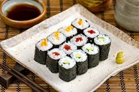

====

Salesperson: Hmm, that’s a bit of a
challenge. Sushi is notoriously 众所周知地，声名狼藉地 difficult to pair
with wine. Well, let’s see. have to be a white wine, of
course.

[.my2]
这有点挑战。众所周知，寿司很难与葡萄酒搭配。好吧，让我看看。当然，必须是白葡萄酒。

Customer: Why? Wouldn’t a red wine *go well
with* 与…搭配得好 sushi?

Salesperson: No, I don’t think so. Sushi is a
very delicately 微妙地；精致地；优美地 flavored 有调味的，有特定口味的 food, and red wine
would be a jarring 不和谐的；刺耳的；辗轧的 contrast. You need a white
wine, which has more subtle (a.)不易察觉的；不明显的；微妙的 flavors, to
complement (v.)补充；补足；使完美；使更具吸引力 the fish.

[.my2]
不，我不这么认为。寿司是一种非常精致的食物，而红酒则是一种不和谐的对比。你需要一种味道更微妙的白葡萄酒来搭配鱼肉。

[.my1]
.title
====
.jar
1.~ (sth) (on sth) : to give or receive a sudden sharp painful knock（使）撞击，受震动而疼痛 +
[ VN] +
•The jolt seemed to jar (v.) every bone in her body.这震动似乎把她浑身上下每根骨头都弄疼了。

[ V] +
•The spade jarred on something metal.铁锹撞在什么金属物件上发出刺耳的声音。

2.~ (on sth) : to have an unpleasant or annoying effect （对…）产生不快的影响；使烦躁
SYN grate +
[ V] +
•His constant moaning was beginning *to jar (v.) on* her nerves. 他不停的呻吟使她焦躁不安起来。 +
•There was a jarring note of triumph in his voice. 他声音里含有一种烦人的扬扬得意的口气。

[ also VN ] +
3.[ V] ~ (with sth) : to be different from sth in a strange or unpleasant way （与…）不协调，不和谐，相冲突 +
SYN clash +
•Her brown shoes *jarred (v.) with* the rest of the outfit. 她那双棕色的鞋, 与她的衣着不协调。
====

Customer: I see. So should I get a bottle of
Chardonnay 夏敦埃酒（一种类似夏布利酒的无甜味白葡萄酒）? That’s a white wine, right?

Salesperson: Yes, Chardonnay is a white
wine, but
I’m not sure it’d be _your best bet_ (打赌；赌注)最好的办法.
Chardonnay is one of the more fullbodied 浓郁型
whites, and tends to be a bit oaky 橡木味的；橡木桶味的. I’d
suggest that you go for something
brighter, like this _Sauvignon Blanc_ from New
Zealand.

[.my2]
但我不确定这是你最好的选择。霞多丽是酒体较为浓郁的白葡萄酒之一，往往带有一点橡木味。我建议你喝点亮色的，比如这瓶来自新西兰的长相思。

[.my1]
.title
====
.the/your best bet
( informal ) used to tell sb what is the best action for them to take to get the result they want 最好的办法 +
•If you want to get around London fast, the Underground is your best bet. 如果你想在伦敦快速出行，最好是乘地铁。

2.a ˌgood/ˌsafe ˈbet +
something that is likely to happen, to succeed or to be suitable 很可能发生的事；有望成功的事；合适的东西 +
•Clothes are _a safe bet_ as a present for a teenager. 衣服适合作为送给十几岁孩子的礼物。

.full body
酒体(Body)是指葡萄酒在口中的“重量”和“质感”，主要由舌头的中间偏后的部位来感知. 通常: +
- 酒体轻盈 ( Light ) 的葡萄酒通常给人一种“清瘦”的感觉，接近于水给人的感觉；酒体丰满， +
- 厚重 ( Full-Bodied ) 的葡萄酒通常更为厚重和浓郁，更接近于牛奶给人的感觉； +
- 酒体中等 ( Medium ) 则介于丰满和轻盈之间。
====

Customer: Sauvignon Blanc? What’s that?

Salesperson: That’s another varietal 用葡萄名字命名的葡萄酒, or type
of grape, just like Chardonnay.

[.my2]
或者葡萄的种类，就像霞多丽一样。

Customer: Let’s see. The label says it’s got
”attractive 吸引人的，有吸引力的 citrus (n.a.)柑橘类果实 and grassy 长满草的；被草覆盖的 aromas (食品)芳香 that
*give way to* _crisp 爽口的，脆生的；脆的, mineral 爽口的，脆生的；脆的 flavors_ and a
bonedry (a.)绝干；十分干的 finish. Serve chilled （使）冷却；（被）冷藏.” Oh, no, how
long will it take to chill (v.)（使）冷却，冰镇 the wine? I’m on my
way to the dinner now.

[.my2]
让我看看。标签上写着：“具有迷人的柑橘和青草芳香，随后呈现清爽的矿物风味，并带有极干的收尾。需冷藏后饮用。”哦，不，酒要冷藏多久才能喝？我正要去参加晚宴呢。

[.my1]
.title
====
.citrus
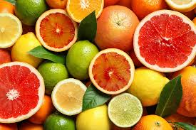

====

Salesperson: It’s OK, don’t worry, we’ll just
choose a wine from the cooler 冷却器；冷藏器. We don’t have
quite 相当，很；非常 *as* _extensive (a.)广阔的；广大的；大量的 a selection_ (*as*) over here,
but...this _Rhone Valley white_ would be lovely 美丽的；优美的；有吸引力的；迷人的.

[.my2]
没关系，别担心，我们可以直接从冷藏柜里挑一瓶。这里的选择可能没那么丰富，但……这款罗讷河谷的白葡萄酒应该很不错。

[.my1]
.title
====
.We don’t have quite *as extensive* a selection (*as*) over here.

- quite（副词）：表示“相当”、“完全” ，用于修饰后面的比较结构。 +
- *as ... as ...（比较结构）：表示“和……一样”。这里是 as extensive a selection as ...（像……一样丰富的选择）。*
- extensive（形容词）：修饰 selection，表示“广泛的”。
- a selection（名词短语）：表示“一个选择”或“品种”。这里是倒装结构，正常语序应为 a quite as extensive selection，但英语中"形容词+名词"的比较结构, 常采用这种倒装方式，即 as + adj. + a/an + noun （例如 as _good a book_ as...）。

状语（Adverbial）：over here +
over here（在这边）是地点状语，表示相较于其他地方，这里的选择不够多。

总结：
完整句子结构是 主语 + 谓语 + 宾语 + 状语，其中宾语 quite as extensive a selection 是一个包含比较级倒装的名词短语。
====

Customer: All right. What varietal （用单一特定品种酿制的）品种葡萄酒 is that?

[.my2]
好吧，这是什么葡萄品种？

Salesperson: Well, this is a French wine, so
they don’t always specify (v.)明确指出；具体说明 the varietal on the
label.
The French believe that the soil _a grape is
grown in_ is one of the most important factors
in the final flavor of the wine.
This wine is probably a blend （不同类型东西的）混合品，混合物 of a few
different types of grapes, mostly Viognier 维欧尼（葡萄品种名）,
I’d guess.

[.my2]
这是法国葡萄酒，所以酒标上不一定会标明具体的葡萄品种。法国人认为，葡萄生长的土壤是影响葡萄酒最终风味的重要因素之一。这款酒可能是几种葡萄的混合，以维欧尼（Viognier）为主，我猜。

Customer: And you think this is a good wine?

Salesperson: Yes, this is one of our bestsellers.
It’s not quite as dry as the Sauvignon
Blanc we were looking at earlier, which
means it’s more approachable 亲切友善的；易理解的；可接近的. It’s light and
crisp 凉爽的；清新的；干燥寒冷让人舒畅的, with a bit of a vanilla 香草精，香子兰精 aroma 芳香，浓香；（喻）气氛.

[.my2]
这款是我们的畅销酒之一。它不像我们之前看的长相思（Sauvignon Blanc）那么干，因此更容易入口。酒体轻盈清爽，还带有一丝香草的香气。

[.my1]
.title
====
.approachable
1.friendly and easy to talk to; easy to understand 和蔼可亲的；易理解的 +
•Despite being a big star, she's very approachable. 她虽然是个大明星，却非常平易近人。 +
•an approachable piece of music 浅显易懂的乐曲

OPP unapproachable

2.[ not before noun]that can be reached by a particular route or from a particular direction 可接近的；能达到的 +
•The summit was approachable only from the south.只有从南面才能到达山顶。

.vanilla

====

Customer: Perfect! I’ll take it!

'''

== ■(347) Global View - Immigration and Customs (C0347)  +
A: Good afternoon, passport and arrival card please.  +
B: Here you are.  +
A: Where are you coming from?  +
B: China.  +
A: Is this your country of birth or residence.  +
B: I just work there.  +
A: What is the purpose of your visit to the United States?  +
B: I’m here on vacation.  +
A: How long do you plan to stay in the United States?  +
B: Almost three weeks.  +
A: Sir, you didn’t fill out the information on your arrival card of where you will be staying.  +
B: Oh, I’m sorry, but there are a couple of different places I will travel to within the United States, so I wasn’t sure what to put.  +
A: You must specify an address of the place where you will spend most of your time.  +
B: Ok, here you are.  +
A: Do you have enough means to support yourself while you are here?  +
B: Yes. I have some travellers cheques and two credit cards.  +
A: Very good. Do you have anything to declare?  +
B: Nope. I only have my clothes and camera!  +
 +
A: Very well sir, welcome to the United States, enjoy your visit.  +
 +

'''

==== ◆(347) Global View - Immigration 移民（入境） and Customs 海关；关税 (C0347)

A: Good afternoon, passport and _arrival card_ 入境卡
please.

B: Here you are.

A: Where are you coming from?

B: China.

A: Is this your country of birth or residence.

B: I just work there.

A: What is the purpose of your visit to the
United States?

B: I’m here on vacation.

A: How long do you plan to stay in the
United States?

B: Almost three weeks.

A: Sir, you didn’t fill out the information on
your arrival card of where you will be
staying.

B: Oh, I’m sorry, but there are a couple of
different places I will travel to within the
United States, so I wasn’t sure what to put.

A: You must specify an address of the place
where you will spend most of your time.

B: Ok, here you are.

A: Do you have enough means 财富；钱财 to support
yourself while you are here?

[.my2]
你在这里期间有足够的经济来源养活自己吗？

B: Yes. I have some travellers cheques 支票 and
two credit cards.

A: Very good. Do you have anything to
declare?

B: Nope. I only have my clothes and camera!

A: Very well sir, welcome to the United
States, enjoy your visit.

'''

== ■(348) The Weekend - Talking About Skincare (C0348)  +
A: You want to go get a facial with me today?  +
B: Dude, what are you talking about? Only girls do that.  +
A: Not at all, guys also get facials, manicures and pedicures. There is nothing wrong with looking after your skin and looking good.  +
B: True. So what do they do to you at your beauty spa?  +
A: Well, first they exfoliate my face, getting rid of all the dead skin. Then I get a face mask with nutrients that keep my skin healthy and young. Afterwards, they apply some moisturizer and you leave feeling like a million bucks.  +
B: That doesn’t really sound like something I would be interested in. In any case, I just wash my face every night and use sunscreen during the day.  +
A: Well you should come with me one day, I’m sure you’ll love it.  +
B: Uh... no.  +
 +

'''

==== ◆(348) The Weekend - Talking About Skincare （用化妆品）护肤，皮肤护理 (C0348)

A: You want to go get a facial (n.)面部护理，美容 with me today?

[.my2]
你今天想和我一起去做面部护理吗？

B: Dude <美，非正式>家伙，小子, what are you talking about? Only
girls do that.

A: Not at all, guys also get facials, manicures 修剪指甲；指甲护理
and pedicures 足部保养；足部护理. There is nothing wrong with
*looking after* your skin and looking good.

[.my2]
男人们还做面部护理、修指甲和足疗。照顾好你的皮肤，让自己看起来很好并没有错。

[.my1]
.title
====
.manicure
-> mani-,手，词源同manual,cure,处理，护理，治疗。引申词义指甲护理。
====

B: True. So _what do they do to you_ at your
beauty spa?

[.my2]
那么在你的美容院, 他们会对你做什么呢？

A: Well, first they exfoliate (v.)使片状脱落；使呈鳞片状脱落 my face, *getting
rid of* all the dead skin 死皮. Then I get a face
mask with nutrients 营养物；养分 that keep my skin
healthy and young. Afterwards 过后，后来, they apply
some moisturizer 润肤膏 and you leave (v.) feeling like a
million bucks （一）美元.

[.my2]
首先他们去角质，去除我脸上的死皮。然后我用含有营养成分的面膜，让我的皮肤保持健康和年轻。之后，他们会给你涂一些润肤霜，你离开的时候感觉就像个百万富翁。

B: *That doesn’t really sound (v.) like something* I
would be interested in. In any case, I just
wash my face every night and use sunscreen （防晒油中的）遮光剂；防晒霜
during the day.

[.my2]
听起来我不太感兴趣。无论如何，我只是每天晚上洗脸，白天涂防晒霜。

A: Well _you should come with me_ one day,
I’m sure you’ll love it.

B: Uh... no.

'''

== ■(349) Global View - Chinese Medicine (C0349)  +
A: What’s wrong?  +
B: I have a headache. These past few days I’ve been living off painkillers. Man, I feel like my head is going to explode.  +
A: You should get acupuncture treatment. My mom was always having headache issues and it was acupuncture that cured her.  +
B: The results are too slow. On top of that, just the thought of smoking needles poking into my flesh frightens me.  +
A: They don’t just randomly stick you, they find your pressure points. The heat allows the body to immediately respond to the treatment, restoring the body’s ”chi”.  +
B: But I get scared the moment I see a needle. How could I stand having needles in my body for hours on end?  +
A: The needles are very thin, and as long as the doctor’s technique is good, and the patient himself is relaxed, it won’t hurt–on the contrary it will actually alleviate pain. Now there are high-tech needles that are micro thin; they don’t hurt at all. However, if you are really scared of acupuncture, scraping or cupping are also options.  +
B: Scraping is too terrifying. When they finish scrapping, your body is all red, as if you were just tortured. Cupping is the same, your body ends up with red circles all over it–looks like someone beat you up.  +
A: This only signifies that the toxins have left the body. Actually, there is only discomfort during the treatment process. Once it’s over you feel very comfortable.  +
B: Chinese medicine is strange. The patients are already ill, and then the doctor makes them suffer more.  +
A: This is the only way to get at the problem. Anyway, if you want to relieve the pain, You are just going to have to be tough and do it.  +
B: Forget it. I don’t want to inflict any more pain on myself. In a little while I’ll go and buy some more painkillers and take a nap.  +
 +

'''

==== ◆(349) Global View - Chinese Medicine 医学;药；（尤指）药水 (C0349)

A: What’s wrong?

B: I have a headache. These past few days
I’ve been *living off* 依赖，依靠 painkillers 止痛药. Man, I feel like
my head is going to explode.

A: You should get acupuncture 针灸，针刺疗法 treatment. My
mom was always having headache issues （有关某事的）问题，担忧
and it was acupuncture that cured her.

B: The results are too slow. On top of that 除此之外,
`主` just the thought of _smoking (a.)冒着烟 needles_ poking (v.)刺
into my flesh 肉体 `谓` frightens me.

A: They don’t just randomly stick 粘，贴；刺，戳，插 you, they
find your pressure points. The heat allows
the body to immediately respond to the
treatment, restoring (v.)恢复，重建 the body’s ”chi”.

[.my2]
他们不会随便贴你，他们会找到你的压力点。热可以让身体立即对治疗做出反应，恢复身体的“气”。

B: But I get scared 惊恐的，恐惧的；担心的，焦虑的 _the moment_ I see a
needle. How could I stand 忍受，容忍 having needles in
my body for hours _on end_ 连续地，不间断地?

[.my2]
但是我一看到针就害怕。我怎么能忍受针连续几小时扎在我身上？

A: The needles are very thin, and *as long as* 只要……就
the doctor’s technique is good, and the
patient himself is relaxed, it won’t hurt –*on
the contrary* it will actually alleviate (v.)减轻，缓和 pain.
Now there are high-tech
needles that are micro thin; they don’t hurt
at all.
However, if you are really scared (a.)惊恐的，恐惧的 of
acupuncture 针灸，针刺疗法, scraping 刮屑；削片 or cupping 拔火罐 are also
options.

[.my2]
针很细，只要医生的技术好，病人自己放松，就不会疼——相反，它实际上会减轻疼痛。现在有了微细的高科技针头；它们一点也不疼。然而，如果你真的害怕针灸，刮痧或拔火罐也是一种选择。

B: Scraping is too terrifying (a.)吓人的，令人害怕的 . When they
finish scrapping, your body is all red, as if
you were just tortured 拷打；（精神上）折磨.
Cupping is the same, your body *ends up with* 以……结束，最终得到
red circles all over it –looks like someone beat
you up.

[.my2]
刮痧太可怕了。当他们完成刮痧，你的身体都是红色的，好像你刚刚被折磨。拔火罐也是一样的，你的身体最后都是红圈——看起来就像被人打了一顿。

A: This only signifies (v.)意味着，象征  that the toxins 毒素，毒质 have left
the body. Actually, there is only discomfort 轻微的病痛；不舒服；不适
during the treatment process. Once it’s over
you feel very comfortable.

[.my2]
这只表明毒素已经排出了身体。实际上，在治疗过程中只有不适感。一旦结束，你会感觉很舒服。

B: Chinese medicine is strange. The patients
are already
ill, and then the doctor makes them suffer
more.

[.my2]
中医很奇怪。病人已经病了，医生又让他们受更多的苦。

A: This is the only way *to get at* 到达某处；接近某人（或某物）；够得着某物;获悉；了解；查明；发现 the problem.
Anyway, if you want to relieve the pain, You
are just going to have to be tough 坚强的；健壮的；能吃苦耐劳的；坚韧不拔的 and do it.

[.my2]
这是解决问题的唯一办法。不管怎样，如果你想减轻疼痛，你就得坚强地去做。

B: Forget it 算了吧. I don’t want to inflict  (v.)使遭受，使承受 any more
pain on myself. *In a little while* 不久，很快，立刻，马上 I’ll go and
buy some more painkillers and take a nap 睡午觉；小睡一下.

[.my2]
算了吧。我不想再给自己造成任何痛苦。过一会儿我再去买些止痛药，然后睡个午觉。

'''

== ■(350) Daily Life - Talking About Relatives (C0350)  +
A: What are you doing this weekend?  +
B: My brother in law is having a small get together at his house and he invited me.  +
A: Is it a family thing or just friends?  +
B: A bit of both. Some cousins, aunts and uncles will be there, but also some friends from the neighborhood.  +
A: Is your great uncle Rick going to be there? He is really funny.  +
B: Yeah he is going to be there with his step-son and his ex-wife.  +
A: You mean your sister?  +
B: No, Rick is actually my great uncle, so he is my grandmother’s brother.  +
A: You lost me.  +
B: I’ll explain later, let’s go.  +
 +

'''

==== ◆(350) Daily Life - Talking About Relatives 亲戚；亲属(C0350)

A: What are you doing this weekend?

B: My brother in law is having a small _get together_ （美）集合；（美）聚会 at his house and he invited me.

[.my2]
我姐夫要在他家举行一个小型聚会，他邀请了我。

[.my1]
.title
====
.Brother-in-law
1: the brother of one's spouse +
2 +
a: the husband of one's sibling 兄弟姐妹 +
b: the husband of one's spouse's sibling
====

A: Is it a family thing or just friends?

B: A bit of both. Some cousins 堂（表）兄弟，堂（表）姐妹, aunts and
uncles will be there, but also some friends
from the neighborhood.

A: Is your _great uncle_ Rick going to be
there? He is really funny.

[.my1]
.案例
====
.uncle
the brother of your mother or father; the husband of your aunt

.great uncle
an uncle of your father or mother

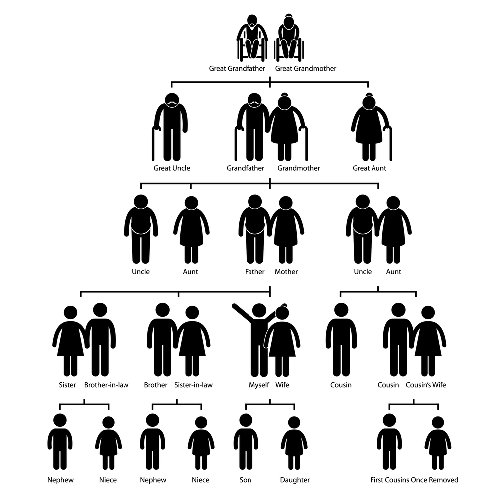

====

B: Yeah he is going to be there with his stepson 过继的儿子，继子
and his ex-wife.

A: You mean your sister?

B: No, Rick is actually my great uncle, so he
is my grandmother’s brother.

A: You lost 弄不懂；困惑 me.

[.my2]
你把我弄糊涂了

B: I’ll explain later, let’s go.

'''

== ■(351) Daily Life - Vaccinations (C0351)  +
A: Hello Mrs. Parker, how have you been?  +
B: Hello Dr. Peters. Just fine thank you. Ricky and I are here for his vaccines.  +
A: Very well. Let’s see, according to his vaccination record, Ricky has received his Polio, Tetanus and Hepatitis B shots. He is 14 months old, so he is due for Hepatitis A, Chickenpox and Measles shots.  +
 +
B: What about Rubella and Mumps?  +
 +
A: Well, I can only give him these for now,  +
and after a couple of weeks I can administer  +
the rest.  +
 +
B: Ok great. Doctor, I think I also may need  +
a  +
Tetanus booster. Last time I got it was  +
maybe fifteen years ago!  +
 +
A: We will check our records and I’ll have the  +
nurse administer the booster as well. Now,  +
please hold  +
Ricky’s arm tight, this may sting a little.  +
 +
 +

'''

==== ◆(351) Daily Life - Vaccinations 接种疫苗，种痘 (C0351)

A: Hello Mrs. Parker, how have you been?

B: Hello Dr. Peters. Just fine thank you. Ricky
and I are here for his vaccines  疫苗.

A: Very well. Let’s see, according to his
vaccination record 疫苗接种记录, Ricky has received his
Polio 脊髓灰质炎，小儿麻痹症, Tetanus 破伤风 and
Hepatitis 肝炎 B shots. He is 14 months old, so he
is due for Hepatitis 肝炎 A, Chickenpox 水痘 and
Measles 麻疹，风疹 shots.

[.my1]
.案例
====
.polio
( also formal polio·my·el·itis  /ˌpəʊliəʊˌmaɪəˈlaɪtɪs/
 ) [ U]an infectious disease that affects the central nervous system and can cause temporary or permanent paralysis (= loss of control or feeling in part or most of the body) 脊髓灰质炎；小儿麻痹症

.tetanus
[ U]a disease in which the muscles, especially the jaw muscles, become stiff, caused by bacteria entering the body through cuts or wounds 破伤风

在婴儿出生后4至6天，少数早至2天或迟至14天以上发病。 +
当破损的皮肤或粘膜被感染，或新生儿由于切断脐带时被感染，*"破伤风芽孢杆菌"侵入致病。* 目前死亡率约10%。

感染到此疾病的原因，**通常是由沾有细菌的物品（如金属锐器）, 对皮肤造成损伤（如切伤或穿刺伤），并同时将病原菌送至体内（较深的伤口, 会提供该细菌繁衍的"厌氧性环境", 从而活化该细菌）。**此细菌通常存在于泥土、灰尘、以及粪便。

**破伤风在临床上明显的症状为"痉挛"。**最常见的痉挛型态从颚开始，接着进展到身体其余部位。*"破伤风梭状芽胞杆菌"会刺激神经中枢，干扰肌肉正常收缩的能力，并引起上述症状.*
====

B: What about Rubella 风疹 and Mumps  流行性腮腺炎?

[.my1]
.案例
====
.Rubella
风疹（rubella）是由风疹病毒（RV）引起的急性呼吸道传染病.

====

A: Well, I can only give him these *for now* 目前；暂时,
and after a couple of weeks I can administer (v.)给予；提供
the rest.

[.my2]
我现在只能给他这些药，几周后我才能给他剩下的药。

B: Ok great. Doctor, I think I also may need
a Tetanus 破伤风；强直 booster 加强剂量. Last time I got it was
maybe fifteen years ago!

A: We will check our records and I’ll have the
nurse administer (v.) the booster as well 也；同样地. Now,
please hold
Ricky’s arm tight, this may sting (v.)（使）感觉刺痛，感觉灼痛 a little.

[.my2]
我们要查一下记录，我会让护士给我们注射助推器。现在，请抓紧里奇的胳膊，可能会有点疼。

'''

== ■(352) Global View - The 7 Wonders Of The World (C0352)  +
A: Have you seen this news article?  +
Apparently an  +
organization has made a list to name the  +
new seven wonders of the world and people  +
could vote for them online.  +
 +
B: Wow, that’s really interesting. So who  +
won?  +
 +
A: Well, the Great Wall of China, the Taj  +
Mahal in  +
India.  +
 +
B: I’ve been there! It really is an amazing  +
work of architecture and art. The entire  +
complex is made of white marble and in the  +
interior of the tomb, the walls are covered  +
with gems and emeralds!  +
 +
A: Cool! Also amongst the winners is Petra,  +
in Jordan,  +
Machu Picchu in Peru and the pyramid in  +
Chichenitza in Mexico.  +
 +
B: Wait a minute! It also says that the Christ  +
Redeemer statue in Brazil and the Colosseum  +
in  +
Rome are wonders. I would love to go to  +
Italy and see the Colosseum, stand in the  +
middle like a gladiator!  +
 +
A: Well, let’s see if we can find some cheap  +
airfare and we can go towards the end of the  +
year.  +
 +
B: Good idea!  +
 +
 +
 +
 +

'''

==== ◆(352) Global View - The 7 Wonders (n.)奇观 Of The World (C0352)

A: Have you seen this news article?
Apparently 据…所知；看来；显然 an
organization has made a list to name (v.) the
new _seven wonders of the world_ and people
could vote for them online.

B: Wow, that’s really interesting. So who
won?

A: Well, the Great Wall of China, the Taj
Mahal 泰姬陵 in
India.

B: I’ve been there! It really is an amazing
work of architecture 建筑学, 建筑设计 and art. The entire 全部的，整个的
complex （类型相似的）建筑群 is made of white marble and in the
interior 内部；里面 of the tomb, the walls are covered
with gems 宝石 and emeralds 祖母绿；翡翠!

[.my2]
我去过那里！它确实是一个令人惊叹的建筑和艺术作品。整个建筑群由白色大理石建成，在陵墓的内部，墙壁上覆盖着宝石和祖母绿！

A: Cool! Also amongst the winners is Petra,
in Jordan 约旦（阿拉伯北部的国家）;乔丹（男子名）,
_Machu Picchu_ in Peru  秘鲁 and the pyramid in
Chichenitza in Mexico.

[.my2]
获奖者还包括约旦的佩特拉、秘鲁的马丘比丘, 和墨西哥的奇切尼察金字塔。

B: Wait a minute! It also says that _the Christ 基督，耶稣基督
Redeemer 救世主；耶稣基督 statue_ in Brazil and the Colosseum 罗马圆形大剧场,斗兽场
in
Rome are wonders. I would love to go to
Italy and see the Colosseum, stand in the
middle like a gladiator 角斗士 !

[.my2]
等一下！它还说巴西的救世主雕像, 和罗马的斗兽场是奇迹。我想去意大利看罗马斗兽场，像角斗士一样站在中间！

A: Well, let’s see if we can find some cheap
airfare 机票费用；飞机票价 and we can go towards 接近，将近（某一时间） the end of the year.

[.my2]
让我们看看能不能找到便宜的机票，我们可以在年底去。

B: Good idea!

'''

== ■(353) Global View - College Life (C0353)  +
A: Hey, Jordan, is that you? Long time no  +
see!  +
 +
B: Oh, hey, no kidding! I haven’t seen you  +
since orientation three months ago! So  +
how’ve you been?  +
Settling into college life OK?  +
 +
A: Yeah, I think so! I pledged Phi Iota Alpha,  +
so I’m living at the frat house now.  +
 +
B: Oh, so you’re a frat boy now, huh?  +
 +
A: Yeah, yeah, I know, it’s totally clich ′ e,  +
but really, I think it’s been a good decision.  +
I’ve got a lot of support and good  +
suggestions from the guys.  +
What about you? What have you been up to?  +
 +
B: Not much. I’m still living at home and  +
commuting to school. I ended up dropping  +
that metalworking class I was so excited  +
about. It just wasn’t as interesting as I’d  +
hoped. The guidance counselor suggested  +
that I focus on my prerequisite courses so  +
that I can make sure the credits count.  +
 +
A: That sounds smart... but kind of boring.  +
 +
B: Yeah, it is, a little bit. I joined the Great  +
Outdoors  +
Club, though, which has been a lot of fun.  +
We’ve gone on two camping trips already,  +
and I’ve made some good friends.  +
 +
A: That’s cool. Hey, so have you decided on  +
your major yet?  +
 +
B: Definitely pre-med. What about you?  +
 +
A: I still have no clue... but we don’t have  +
to declare a major ‘til our sophomore year,  +
so I’ve got time!  +
Oops, I’m late for class. Gotta run!  +
 +
B: OK, take care! Hey, nice running into you!  +
 +
A: Yeah, you too!  +
 +
 +

'''

==== ◆(353) Global View - College Life (C0353)

A: Hey, Jordan, is that you? Long time no
see!

B: Oh, hey, no kidding! I haven’t seen you
since orientation 新生入学指导;（任职等前的）培训，训练；迎新会 three months ago! So
how’ve you been 你最近怎么样?
*Settling into* 逐渐适应 college life OK?

A: Yeah, I think so! I pledged 宣誓加入(美国大学生联谊会) _Phi Iota Alpha_,
so I’m living at the _frat 兄弟会 house_ now.

[.my1]
.案例
====
.Phi Iota Alpha
一种美国大学生联谊会，成立于1931年，旨在促进拉丁美洲文化的传播和交流。

.frat
= fraternity

Greek Life指的是「fraternities (兄弟会)」和「sororities (妇女俱乐部；女学生联谊会)」等大學社團組織。 +
Greek Life 希腊生活：指美国大学校园中的兄弟会和姐妹会组织，通常以希腊字母命名，成员们参与各种社交活动、慈善事业和校园活动。

[.my3]
[options="autowidth" cols="1a,1a"]
|===
|组织
|- Frat (=fraternity) 兄弟会(男性加入)
- sorority 姐妹会(女性加入)

|存在目的
|- Greek Life 組織, 讓大學生能找到興趣相投的朋友。
- 成員可以決定要住在frat或sorority的房子，這樣一來就能夠跟其他Greek Life的家庭成員有更多相處的時間。

|在決定加入Greek Life之前，必須考慮以下幾點
|- 一般來說，一所大學有許多 fraternities 和 sororities，基於不同的價值觀，文化身份，學術和職涯發展，慈善事業或宗教信仰等。

- 成本：加入fraternity 或 sorority 的費用可能會很昂貴，例如：會費、舞會、校外旅行等活動的支出。
- 時間：Greek Life的活動需要投入很多時間，像是參加每週的會議、各種各樣的活動。如果你是跟組織成員一起住在frat或sorority房子中，*社交活動很容易會使你分心。維持良好學習成績也是很重要的。*
- Hazing： 有時候在Greek Life裡也會發生欺凌的事件， 尤其是在「pledge」期間，「hazing」指的是要參與一些有危險性活動的社會壓力，例如：強迫喝酒、至始至終滿足哥哥或姐姐的要求等等。然而，校方也有對此立下規範、幫助呈報事件，且譴責之。
|===

====

B: Oh, so you’re a frat boy 兄弟会成员 now, huh?

A: Yeah, yeah, I know, it’s totally clich ´ e (n.)陈词滥调的,
but really, I think it’s been a good decision.
I’ve got a lot of support and good
suggestions from the guys.
What about you? What have you been *up to* 你最近在忙什么?

B: Not much 不多,没什么. I’m still living at home and
commuting (v.)乘公交车上下班；经常往来；通勤 to school. I ended up dropping 停止；终止；放弃
that _metalworking (a.)金属制造的 class_ I was so excited
about. It just wasn’t *as interesting as* I’d
hoped. The _guidance 指导，指引 counselor_ 顾问，咨询师 suggested
that I focus on my _prerequisite 先决条件；前提；必备条件 courses_ 先修课程 so
that I can make sure the credits 学分 count (n.)计算，总数.

[.my2]
没什么。我还是住在家里，每天通勤上学。我最后退掉了那门我原本很兴奋的金属加工课。它没有我希望的那么有趣。指导顾问建议我专注于我的先修课程，以确保学分有效。

A: That sounds smart 聪明的，明智的. . . but kind of boring.

B: Yeah, it is, a little bit. I joined _the Great
Outdoors
Club_, though, which has been a lot of fun.
We’ve gone on two _camping  露营，野营 trips_ (远行)露营旅行 already,
and I’ve made some good friends.

[.my2]
不过我加入了Great Outdoors Club，这很有趣。我们已经去了两次露营旅行，我也交到了一些好朋友。

A: That’s cool. Hey, so have you decided on
your major (n.)主修科目，专业 yet?

B: Definitely pre-med 医学预科. What about you?

A: I still have no clue 线索，提示；理解，想法. . . but we don’t have
*to declare 宣布，声明；断言 a major* 确定专业 ‘til our sophomore (n.a.)二年级的 year,
so I’ve got time!
Oops, I’m late for class. Gotta run 得走了!

[.my2]
我还是没头绪……但我们直到大二才需要确定专业，所以我还有时间！哎呀，我上课要迟到了。得走了！

[.my1]
.案例
====
- sophomore -> 来自希腊语 sophos, 聪明的，智慧的，moros,笨蛋，弱智，词源同 moron,oxymoron.或简单的 more,更加，即变得 稍微聪明一点。
====

B: OK, take care! Hey, nice *running into* 撞上，碰上 you!

[.my1]
.案例
====
-​nice running into you​ (短语) 很高兴遇到你
====

A: Yeah, you too!

'''

== ■(354) Global View - Homeschooling (C0354)  +
A: I think we should home school our children when we decide to have kids.  +
B: What? Why?  +
A: Well, our public schools here are not very good and private school are just too expensive. I have been reading up on home schooling and it has a lot of advantages.  +
B: Like what? I think that by doing something like that we would be isolating our children from social interaction.  +
 +
A: Well, first of all, I would be able to teach them everything they learn in school in a more relaxed and fun way. I also think that having a one-on-one class is much better since you can focus more on his or her strengths or weaknesses.  +
B: I think neither your parents or mine would agree to such an idea.  +
A: I will bring it up over Sunday brunch.  +
B: Good luck with that!  +
 +

'''

==== ◆(354) Global View - Homeschooling 在家教育 (C0354)

A: I think we should *home school* (v.)在家接受教育 our
children when we decide to have kids.

[.my2]
我觉得我们决定要孩子时, 应该在家教育他们。

B: What? Why?

A: Well, our public schools here are not very
good and private school are just too
expensive. I have been *reading up on* 研读，查阅 home
schooling and it has a lot of advantages 有利条件，优势.

B: Like what? I think that by doing
something like that we would *be isolating* 使隔离；使绝缘 our
children *from* social interaction 互动，交流.

A: Well, first of all, I would be able to teach
them everything they learn in school in a
more relaxed and fun way. I also think that
having a one-on-one (a.)一对一的；直接对立的 class is much better
since you can focus more on his or her
strengths 优点;优势，强项；长处 or weaknesses.

B: I think neither your parents or mine would
agree to such an idea.

A: I will *bring it up* 提出,提起某事 over Sunday brunch 早午餐.

[.my2]
我会在周日早午餐时, 提出这个想法。

[.my1]
.案例
====
- brunch -> 来自 breakfast 和 lunch 的合成词，主要应用于现代社会不吃早餐的年青人。
====

B: Good luck with that!

'''

== ■(355) Daily Life - Lending Money (C0355)  +
A: Can I borrow five bucks?  +
B: No!  +
A: Come on! I’ll pay you back on Tuesday.  +
B: Last time I lent you money, you never paid me back.  +
A: I promise if you lend me five dollars today, I will repay you in full next week.  +
B: Ok, but I’m taking your skateboard as collateral.  +
A: Fine! I can’t believe you don’t trust me.  +
B: It’s nothing personal, just business.  +
 +

'''

==== ◆(355) Daily Life - Lending (v.)借给；借出 Money (C0355)

A: Can I borrow five bucks 美元?

B: No!

A: Come on! I’ll pay you back on Tuesday.

B: Last time I lent you money, you never
paid me back.

A: I promise if you lend me five dollars
today, I will repay (v.)付还，偿还；报答，回报 you *in full* 全部 next week.

B: Ok, but I’m taking your skateboard 滑板 as
collateral 抵押物，担保品.

[.my2]
但我要拿你的滑板作为抵押。

[.my1]
.案例
====
-  skateboard +
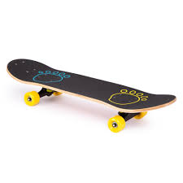

- collateral -> col-, 强调。-later, 边，词源同lateral. 即放在旁边作为抵押物品的。
====

A: Fine! I can’t believe you don’t trust me.

B: It’s nothing personal 不是针对个人, just business.

'''

== ■(356) Daily Life - Coins and Money (C0356)  +
A: Help me organize these coins.  +
B: That’s a lot of money! What did you do? Break the piggy bank?  +
A: Yeah, I’m gonna go to the bank and change it for bills, but first I have to separate them into little piles.  +
B: Ok, I’ll find all the quarters and dimes while you sort the nickels and pennies.  +
A: Great, then we can add everything up and take it to the bank.  +
B: I found some coins that are not from here.  +
A: Oh yeah, those are from my trip to London. I have a couple of different pence, but in all it won’t add up to one pound.  +
B: Are you sure the bank will change these coins for you?  +
A: Hopefully!  +
 +

'''

==== ◆(356) Daily Life - Coins 硬币 and Money (C0356)

A: Help me organize 整理，安排；规划 these coins.

B: That’s a lot of money! What did you do?
Break (v.)（使）破；弄坏 the _piggy bank_ 存钱罐?

A: Yeah, I’m gonna go to the bank and
change it for bills 纸币, but first I have to separate
them into little piles 一堆，一叠.

[.my2]
我要去银行把它们换成纸币，但首先我得把它们分成小堆。

B: Ok, I’ll find all the quarters (25美分硬币) and dimes (10美分硬币)
while you sort the nickels (5美分硬币) and pennies  (便士;1美分硬币) .

[.my2]
我来找所有的25美分和10美分硬币，你来分类5美分和1美分硬币。

[.my1]
.案例
====
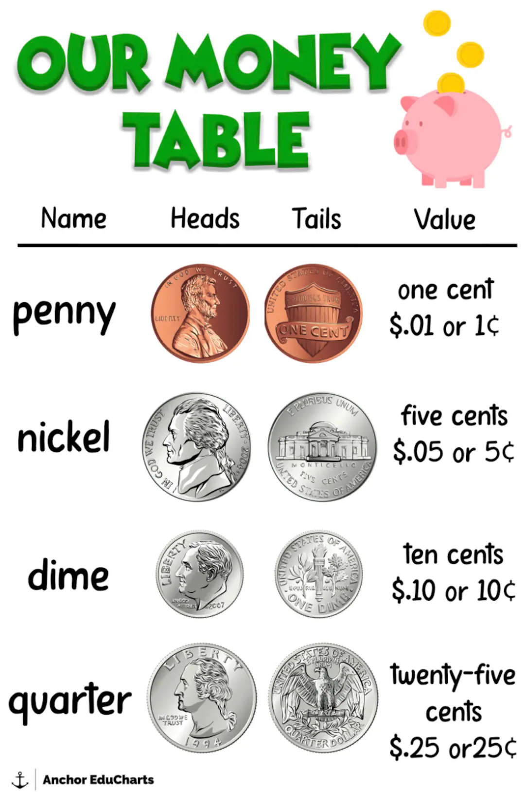
====

A: Great, then we can *add* everything *up*  加起来 and
take it to 带到 the bank.

B: I found some coins that are not from
here.

[.my2]
我发现了一些不是这里的硬币。

A: Oh yeah, those are from my trip to
London. I have a couple of 两个（事物）或几个（事物） different pence,
but *in all* 总共，合计 it won’t *add up to* 总计 one pound.

[.my2]
对了，那些是我去伦敦旅行时带回来的。我有几种不同的便士，但总共加起来也不到一英镑。

B: Are you sure the bank will change these
coins for you?

A: Hopefully 希望如此!

'''

== ■(357) Daily Life - Making A Dinner Reservation (C0357)  +
A: Bruno Bistro, how may I help you?  +
B: Yes hello, I would like to make a reservation please.  +
A: Certainly sir, For which day and time please?  +
B: Tonight at seven.  +
A: I’m sorry sir, but we are fully booked tonight until eight.  +
B: In that case, eight o’clock is fine.  +
A: Very well, and how many people will attend tonight?  +
B: Four people.  +
A:  +
Lastly, may I please know what name I should make the reservation under?  +
 +
A:  +
Mark.  +
 +
 +
 +

'''

==== ◆(357) Daily Life - Making A Dinner 正餐，晚餐；晚宴 Reservation 保留，保护；（房间，座位等的）预订. 晚餐预订 (C0357)

A: Bruno Bistro, how may I help you?

B: Yes hello, I would like to make a
reservation please.

A: Certainly sir, For which day and time
please?

B: Tonight at seven.

A: I’m sorry sir, but we are fully booked
tonight until eight.

B: In that case, eight o’clock is fine.

A: Very well, and how many people will
attend 出席，参加 tonight?

B: Four people.

A: Lastly  最后（一点）, may I please know what name I
should make the reservation under?

A: Mark.

'''

== ■(358) Daily Life - Text Me (C0358)  +
A: Why didn’t you text me last night?  +
B: What? I sent you three or four messages!  +
A: I didn’t get any of them. I was waiting for you to text me the address of where the party was and I never got your message.  +
B: Why didn’t you just call? I hate sending SMS messages.  +
A: Well, because I didn’t have any credit on my phone. I used it all up this month.  +
B: I thought you had an unlimited SMS plan?  +
A: I do, but if I don’t have any credit in my phone, it won’t let me call or send messages.  +
B: No wonder you didn’t get my texts!  +
 +

'''

==== ◆(358) Daily Life - Text (v.)（用手机）给……发短信 Me (C0358)

A: Why didn’t you text me last night?

B: What? I sent you three or four messages!

A: I didn’t get any of them. I was waiting for
you to text (v.) me the address 地址 of where the
party was and I never got your message.

B: Why didn’t you just call? I hate sending
SMS messages.

A: Well, because I didn’t have any credit 话费 on
my phone. I *used it all up* 用光 this month.

B: I thought you had an unlimited 无限的 _SMS plan_ （手机流量、话费等）套餐. 短信套餐?

A: I do, but if I don’t have any credit in my
phone, it won’t let me call (v.) or send messages.

[.my2]
我是有，但如果我手机里没有话费，它就不让我打电话或发短信。

B: No wonder 难怪 you didn’t get my texts!

[.my2]
难怪你没收到我的短信！

'''

== ■(359) Global View - E-mail Scam (C0359)  +
A: I got an urgent email from Tom! He says he is in London and got robbed and needs us to wire him some money for his hotel.  +
B: What? That sounds really dodgy tome.  +
A: No way, Tom is an honest person, he wouldn’t lie tome.  +
B: No I mean, it seems like someone may have hacked his email account and sent that out. I mean think about it, why would he email you instead of calling you.  +
A: Do you really think someone is trying to scam people into sending money?  +
B: For sure! There are so many con artists out there, you never really know.  +
 +

'''

==== ◆(359) Global View - E-mail Scam <非正式>欺诈，骗局 (C0359)

A: I got an urgent email from Tom! He says
he is in
London and got robbed 抢劫 and needs us to wire (v.)电汇（钱款）；发电报给（某人）;给……接上电线
him some money for his hotel.

[.my2]
需要我们给他电汇一些钱来付酒店费用。

B: What? That sounds really dodgy (a.)狡猾的；狡诈的；可疑的 to me.

A: No way, Tom is an honest person, he
wouldn’t lie to me.

B: No I mean, it seems like someone may
have hacked his email account and sent that
out. I mean think about it, why would he
email (v.) you *instead of* calling you.

[.my2]
我是说，想想看，他为什么不打电话给你，而是发邮件。

A: Do you really think someone is trying to
scam (v.)欺诈，诓骗（钱财） people into sending money?

[.my2]
你真的认为有人试图诈骗人们寄钱吗？

B: For sure 当然;确定地；肯定地! There are so many _con 骗局，诈骗钱财 artists_ 艺术家，设计师
out there, you never really know.

[.my1]
.案例
====
- con artists​ /ˈkɑːn ˌɑːr.tɪsts/ n. (骗子) people who cheat others by persuading them to believe something that is not true.
====

'''

== ■(360) Global View - Urban Legends (C0360)  +
A: Have you read all these crazy things that are going on around the world?  +
B: What do you mean?  +
A: I was reading about how some people get tricked or drugged in their hotel rooms and have their organs removed! Then they are sold on the black market.  +
 +
B: Don’t tell me you actually believe all that? Don’t be so gullible, they are just urban legends. They are just stories people make up to scare you.  +
A: Well, I was also reading about how some popular songs have subliminal or even satanic messages if you play them backwards! Can you believe that?  +
B: You really think an artist or songwriter is going to go through the trouble of putting subliminal or satanic messages in a song? Don’t be so naive!  +
A: Well maybe you are right, but how about the story of how KFC has rows of headless chickens which are super grown in order to get bigger chickens faster!  +
B: Sounds a bit too far fetched to be true don’t you think?  +
 +

'''

==== ◆(360) Global View - Urban Legends 都市传说 (C0360)

A: Have you read all these crazy things that
*are going on* 进行，发生 around the world?

B: What do you mean?

A: I was reading about how some people get
tricked (v.)欺骗，哄骗 or drugged （使）服麻醉药 in their hotel rooms and
have their organs 器官 removed! Then they are
sold on the black market.

B: Don’t tell me you actually believe all that?
Don’t be so gullible (a.)易受骗的；轻信的, they are just urban
legends. They are just stories people *make
up* 编造;组成，构造 to scare 使惊恐，吓唬 you.

[.my1]
.案例
====
- gullible -> 来自词根gull, 吞食，词源同glut, gullet. 引申义易上当的。
====

A: Well, I was also reading about how some
popular songs have subliminal (a.)[生理] 阈下的；潜在意识的；微小得难以察觉的 or even
satanic (a.)邪恶的；魔鬼的 messages if you play them
backwards! Can you believe that?

[.my2]
我也在读一些流行歌曲如果倒着播放, 会有潜意识甚至邪恶的信息！

[.my1]
.案例
====
- subliminal -> sub-,在下，-lim,门槛，界线，词源同 limit. 即界线下的，引申词义下意识的，潜意识的。
====

B: You really think an artist or songwriter 歌曲作家 is
going *to go through the trouble* 去经历这些麻烦 of putting
subliminal (a.) or satanic 邪恶的；魔鬼的 messages in a song?
Don’t be so naive!

[.my2]
你真的认为一个艺术家或词曲作者, 会费尽心思在歌曲中放入潜意识或邪恶的信息吗？

A: Well maybe you are right, but how about
the story of how KFC has rows 一排，一行 of headless 无头脑的
chickens which are *super grown* in order to
get bigger chickens faster!

[.my2]
但关于肯德基有一排排无头鸡，它们超级生长, 以更快得到更大的鸡的故事呢！

B: Sounds a bit too *far fetched* (a.)牵强的；乱七八糟的；靠不住的 to be true
don’t you think?

[.my2]
听起来有点太牵强了

'''

