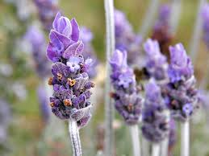

= 0050
:toc: left
:toclevels: 3
:sectnums:
:stylesheet: ../../../../myAdocCss.css

'''

M: Hello everyone! Welcome back to EnglishPod! My name is Marco. +
E: And I’m Erica. +
M: And we’re bringing you the third part of our suspense 悬念；悬疑 series 系列；连续作品 of _New guy in town_ 小镇新来者. +
E: That’s right. What’s gonna happen today? +
M: Well, I don’t know, there’re still so many things that could happen. This guy is kind of weird 奇怪的；怪异的；反常的. +
E: I know. Is he a vampire 吸血鬼? Or like 或者说比如,或者换种说法 what’s going on? +

[.my1]
.案例
====
.Or like what’s going on?
*“还是说，这到底是怎么回事？”​​ 或 ​​“或者说，到底是发生了什么情况？”*​​ +
它表达了说话者在提出一个猜测（“他是吸血鬼吗？”）后，感觉这个猜测可能太具体或不准确，于是转而寻求一个​​更开放、更普遍的解释​​。

这是一个非常地道的口语表达！​​“Or like”​​ 在这里起​​连接和缓冲​​的作用，让提问听起来更随意、更不确定，同时引出进一步的猜测。

核心含义
​​“Or like what’s going on?”​​ 的整体意思是：

​​“还是说，这到底是怎么回事？”​​ 或 ​​“或者说，到底是发生了什么情况？”​​

它表达了说话者在提出一个猜测（“他是吸血鬼吗？”）后，感觉这个猜测可能太具体或不准确，于是转而寻求一个​​更开放、更普遍的解释​​。

“Or like” 的功能分解
这个短语可以拆解成两个部分来理解：

- Or (或者)​​ +
表示​​选择或转折​​。它连接了前一个具体的猜测（“他是吸血鬼吗？”）和后面更模糊的提问（“怎么回事？”）。 +
相当于在说：“​​如果前面那个猜测不对，那么…​​”

- Like (像；比如说)​​ +
这是一个​​口语填充词​​，尤其在美式英语中极其常见。它没有实际词汇意义，但有很多语用功能： +
•​​缓冲语气​​：让问题听起来不那么直接和突兀。 +
•​​表示不确定​​：暗示说话者对自己的话不是非常肯定，只是在举例或猜测。 +
•​​重新表述​​：引出一种新的说法或更广泛的解释。 +

- 组合起来 “Or like...”​​ 的功能是：
​​“或者换种说法…”、“或者说比如…”、“要不就是…”​​ +
它标志着一个​​思维上的停顿和转向​​，说话者正在从一种可能性探索到另一种可能性。"如果他不是吸血鬼，那总得有个原因吧？他为什么会这样？到底发生什么了？"
====

M: Yeah, and I would like *to thank* all our listeners *for* contributing 贡献；出力；投稿 and sending out their ideas of what they think happens in this third part. +

[.my2]
另外我想感谢所有听众朋友们，感谢大家积极分享想法，说说自己觉得第三部分会发生什么剧情。

E: Yeah, I especially 特别；尤其 like the story about the rabbit. +

[.my2]
我特别喜欢那个和兔子有关的故事构想。

M: Yeah, the rabbit. That was a good one. +
E: Yeah, yeah. +
M: As promised 承诺的；答应的 /we took the idea of one of our listeners /and created the dialogue 对话；对白 around it. +

[.my2]
正如我们之前承诺的，我们采纳了一位听众的想法，并围绕这个想法创作了这段对话。

E: Yes. +
M: And this time /it was the contribution 贡献；投稿；捐赠 of Babardwan. +
E: Yeah, he gave us a great idea for this dialogue. +
M: Exactly 精确地；确切地；完全地, he gave us a really good idea, so thank you Babar and, um, this one is for you 这段内容是特意为你创作的. In this dialogue /we’re gonna be looking at some hospitality (n.)好客；殷勤；招待 vocabulary 词汇；词汇量. +

[.my2]
在这段对话里，我们会学习一些与 “招待” 相关的词汇。 +

E: Yeah. Some… some phrases 短语；词组 you can use, um, when you welcome 欢迎；迎接 someone to your house. Alright, well, um, we’ve got some language to preview 预览；预先查看, so, let’s *turn* now *to* “vocabulary preview”. +

Voice: Vocabulary preview. +
M: On vocabulary preview /we have the word _appetite_ 食欲；胃口；欲望. +
E: Appetite. +
M: Appetite. +
E: Appetite. +
M: So, Erica, tell us about appetite. +
E: When you have an appetite, you… you’re… you’re hungry or you… you have a desire 渴望；欲望；心愿 to eat food, right? +
M: Alright, so you can have a big appetite, a small appetite. +
E: Ugu. Really hungry, a little bit hungry. +

M: Okay. Let’s look at our next word - poison 毒药；毒物；毒害，毒害；下毒；使中毒. +
E: Poison. +
M: Poison. +
E: Poison. +
M: So, poison could be a noun 名词 or a verb 动词. +
E: Exactly. So, when you poison (v.) someone, um, you put something in their food /or maybe in their drink, um, that makes them really sick 生病的；恶心的；不舒服的 and maybe even makes them die 死亡；去世. +
M: Okay, so, to poison (v.) somebody. +
E: Yep, and the noun is actually the thing /that you put inside the food or drink. +
M: So, usually /poison is some sort of chemical 化学的；化学制品的 substance 物质；物品. +
E: Yes. +
M: Snakes, for example, have poison. +
E: Yeah, in their teeth. +
M: Right, so, if you get bitten 咬；叮 by a snake… +
E: You’ll get poisoned 中毒的；被毒害的. +
M: You’ll get poisoned. Alright, so, let’s take a look at our dialogue for the first time /and see why we’re talking about poison. Then we’ll come back and explain 解释；说明；阐明 some great words. +

[.small]
[options="autowidth" cols="1a"]
|===
|Header 1

|A: Please make yourselves at home 别客气；像在自己家一样. Let me take your coats 我来帮你们拿外套吧. Dinner is almost ready; I hope you brought your appetite 带来了你的食欲;希望你们胃口都不错. +
B: Your house is lovely 可爱的；迷人的；漂亮的, Armand! Very interesting 有趣的；有吸引力的 decor 装饰；布置...very...Gothic 哥特式的. +
C: I think it’s amazing 令人惊奇的；了不起的! You have such good taste 品味；鉴赏力；爱好, Armand. I’m *thinking of* re-decorating (v.)重新装饰；再次装修 my house; maybe you could give me a few pointers 建议；提示；指点? +
A: It would be my pleasure 愉快；高兴；荣幸. Please have a seat. Can I offer 提供；给予；提出 you a glass of wine? +
C: We would love some! +
A: Here you are 给你；拿去吧. A very special 特别的；特殊的；专用的 merlot 梅洛葡萄酒 /brought directly 直接地；径直地 from my home country. It has a unique 独特的；唯一的；独一无二的 ingredient 成分；原料；要素 which gives it a pleasant 令人愉快的；舒适的 aroma 香气；香味 and superior 优良的；卓越的；上等的 flavor 味道；滋味. +
C: Mmm... it’s delicious 美味的；可口的! +
B: It’s a bit bitter 苦的；苦涩的；痛苦的 for my taste... almost tastes like... like... +
C: Ellen! Ellen! Are you okay? +
A: Did she *pass out* 昏倒；失去知觉；晕倒? +
C: Yeah... +
A: I hope that /you didn’t poison (v.) her drink too much! You’ll ruin 毁坏；破坏；糟蹋 our meal! +
|===

M: Okay, so /that was unexpected 出乎意料的；意外的. +
E: I know, Lois, can you believe it? [NOTE: in the first part /her name was Doris] +
M: Apparently 显然；明显地；似乎 Lois is helping Armand. +
E: I know. +
M: Maybe she’s a vampire. +
E: Alright, well, I really wonder 想知道；纳闷；疑惑 what’s going to happen next. +
M: Well, see what happens next, but now let’s take a look at some of the language in “language takeaway”. +

Voice: Language takeaway. +
M: Alright, so we have a couple of 几个；一对；两三个 words in language takeaway today, let’s *start off 从……开始；以……开头 with*  pointers. +
E: Pointers. +
M: Pointers. +
E: Pointers. +
M: So, to give somebody pointers… 给某人提建议,给别人指点 +
E: You give them some suggestions 建议；提议；意见. +
M: Suggestions or tips 实用的提示；小窍门. +
E: Exactly. +
M: Alright. So, suggestions or tips. Let’s listen to some examples 例子；实例；样本 of how you would use it. +

Voice: Example one. +
A: I want *to dance* (v.) salsa 萨尔萨舞 *better*. Can you give me a few pointers? +

[.my2]
我想把萨尔萨舞（salsa）跳得更好一些。你能给我提些建议（pointers）吗？

Voice: Example two. +
B: I need some pointers on how to be a better manager 经理；管理者；经营者. +

Voice: Example three. +
C: Let me give you a few pointers, so you can pass 通过（考试、测验等）；及格 your exam 考试；测验. +

M: Alright, so pointers. It’s clear 清楚的；清晰的；明白的 now. Let’s take a look at our next word - aroma (n.)芳香，浓香；（喻）气氛. +
E: Aroma. +
M: Aroma. +
E: Aroma. This is a nice, round 圆润的；丰满的（指声音、味道等） word, isn’t it? +
M: Yeah, aroma. +
E: Yeah. +
M: Well, this word makes you sound (v.)听起来像 really educated 受过教育的；有教养的；有学识的. +
E: Yeah, yeah. +
M: Basically, it means… +
E: Smell 气味；嗅觉；闻. +
M: Smell. +
E: Yep. +
M: So, you could say, for example, "this coffee has a great aroma". +
E: Or maybe "this perfume 香水；香料 has, uh, the aroma of roses and lavender 薰衣草". +

[.my1]
.案例
====
.lavender
淡紫色; 熏衣草（花园植物或灌木，开紫花，有香味） +
-> ##词源同livid.## 或来自PIE*leu,冲洗，涌出，##词源同 lavatory,##dilute,antediluvian. #因这种花草用于洗手间的清香剂而得名。#

====

M: Nice, okay. Let’s take a look at our next word - bitter (a.)味苦的；痛苦的. +
E: Bitter. +
M: Bitter. +
E: B-I-T-T-E-R. Bitter. +
M: Okay, bitter. So, bitter is the opposite 相反的；对立的；反面 of… +
E: Sweet 甜的；含糖的；甜美的. +
M: Of sweet. +
E: So, it’s always hard to describe 描述；形容；描绘 tastes, isn’t it? +

[.my2]
要描述（describe）味道总是有点难，是吧？

M: Yeah. +
E: But maybe we can… we can say a few foods that are bitter. +
M: Okay. +
E: So, _chocolate_, when it has no sugar /_is bitter_. +
M: Okay. Or, for example, coffee without any sugar is also bitter. +
E: Yeah, and… sometimes red wine can be quite bitter. +
M: Uhu. +
E: Uhu. +
M: So, bitter. Okay, now let’s take a look at
our last word -- pass out 失去知觉(意识丧失，昏迷). +
E: Pass out. +
M: Pass out. +
E: Pass out. +
M: It seems kind of easy. Pass… +

[.my2]
这个短语看起来好像挺简单的，“pass”…… +

E: Uhu. +
M: And out.  加上 “out”。 +
E: Yep. +
M: But it means something different 但它有不同的含义. +
E: Yeah, when you put them together 把……放在一起；组合. +
M: What does it mean? +
E: Um, it means faint 昏倒；晕厥 or become unconscious 失去知觉的；不省人事的. +
M: Okay. +
E: So, imagine (v.) someone… when, you know, they’re… they’re standing up and then suddenly 突然；忽然；猛地 they start to move around 晃悠;四处移动；走来走去 and then fall over 摔倒；跌倒；倒下 to the ground 地面；地上. +
M: Okay, pass out. +
E: Yes. +
M: This usually happens /when you get really really drunk 喝醉的；醉酒的；酗酒的. +
E: Maybe… sometimes also 也，同样 /when… maybe you’re pregnant 怀孕的；妊娠的 /you might *pass out*. +

[.my2]
也可能…… 有时候…… 比如怀孕（pregnant）的人也可能会昏倒（pass out）。

M: Right. Okay, to lose consciousness 意识；知觉；觉悟. +
E: Yes. Marco and I have a couple of examples of this word for you. +

Voice: Example one. +
A: I drank *so* much last night /*that* I passed out at my friend’s house. +

Voice: Example two. +
B: She was standing in the sun 太阳；阳光 too long, so she *passed out* right in front of me. +

Voice: Example three. +
C: My sister passes out /whenever she sees blood 血；血液. +

M: Alright, so, let’s listen to our dialogue again. Now we’re gonna slow it down 放慢速度；减速 a little bit. +
E: And you’ll be able to hear these words that we just talked about. +

\... +
\... +
\... +

M: Alright, so, interesting story. +
E: Yes. +
M: We have some great phrases that we’ve used here, so, let’s take a look at them in “fluency builder”. +
Voice: fluency builder. +

E: We’ve got four phrases for you /that are great to use /when you want to welcome someone into your house or into your office 办公室；办公楼 or anywhere, really. +
M: Exactly. So, why don’t we take a look at the first one? +
E: Please make yourselves at home 请不要拘束;别客气，就像在自己家一样. +
M: Please make yourselves at home. +
E: Please make yourselves at home. +
M: So, this is a very common 常见的；普遍的；平常的 phrase /when you invite 邀请；招待；招致 somebody to your house. +
E: Yeah. +
M: You… you always use this phrase. +
E: Yeah, it’s… it’s like make yourself comfortable 舒适的；安逸的；自在的, relax 放松；休息；使轻松, sit down. +
M: Yeah, don’t worry about it, like my house is your house. +
E: Exactly. Please make yourself at home. +

M: Okay, good one. Usually people arrive 到达；抵达；到来 to a party 聚会；派对；宴会 or to a dinner with jackets, coats, scarves 围巾；头巾(scarf). +

[.my2]
通常人们去参加派对（party）或晚宴时，会穿外套、戴围巾（scarves）之类的。

[.my1]
.案例
====
.scarf
围巾；披巾；头巾 +
-> 可能最终来自 PIE*##sker,弯，转，编织，##词源同 ring,crown,shrimp.引申词义围巾， 头巾。
====

E: Yeah, uhu. +
M: All that stuff 东西；物品；材料. So, this next phrase is really handy 有用的；方便的；便于使用的. +

[.my2]
所以下一个短语就很实用（handy）。

E: Let me take your coats. 我来帮你们拿外套吧  +
M: Let me take your coats. +
E: Let me take your coats. +
M: So that means "give me your coats and I’ll put them in the closet 衣柜；壁橱". +
E: Right. +
M: Let me take your coats. +

E: And then a good host 主人；主持人；主办方 would always offer a drink, right? +
M: Exactly, water… or in this case 情况；事例；案例 wine. +
E: So, they would say /can I offer you a glass of wine 要来杯酒吗? +
M: Uhu. Or sometimes you could say "can I offer you a glass… /can I offer you something to drink?" +
E: Yeah. So, can I offer you a glass of wine? +
M: Can I offer you a glass of wine? +
E: Uhu. +
M: You offer me a glass of wine. I say "yeah, sure, I’ll take a… glass of wine 我来一杯吧". +

E: Alright, and then I would use our next phrase - here you are. +
M: Here you are. +
E: Here you are. +
M: Exactly, it doesn’t mean that "you are here". +
E: No. +
M: Hehe. It’s saying to someone "here it is", "take it". +
E: Yes, yes. +
M: Right. +
E: You know what, this is a really really great phrase. A lot of people who are learning 学习；学会；得知 English don’t say this. +
M: Uhu. +
E: But it’s really common, really natural 自然的；天生的；本能的 and all… if you use it, you’ll sound really great 听起来就会很地道. +
M: Uhu. Here you are 给你. Exactly 没错;正是如此，一点不错. +
E: Here you are. And… +
M: Here you are. +
E: You can use this /anytime you give someone something. +
M: Right, so if you give somebody a pen 钢笔；笔 or a pencil 铅笔 or a notebook 笔记本；记事本. Here you are. Here it is. +
E: Uhu. Yeah. +
M: Okay. Great words, so, let’s listen to our dialogue one more time /and then we’ll come back. +

\... +
\... +
\... +

M: Okay, so, Armand is a pretty good host. He offered them a Merlot. +
E: Yeah, which is a type 类型；种类；品种 of wine. +
M: A type of wine. +
E: Yeah. +
M: And this is really interesting /because there’re many types of wines. +
E: Yes. +
M: Do you know any? +
E: I know a lot!  我知道不少呢 +
M: Alright, so… +
E: Yeah. +
M: Give us some pointers here. +
E: Alright, merlot is probably 大概；或许；很可能 like the most common red wine, right? +
M: Uhu. +
E: Um, and Merlot is actually _the grape… variety_ (n.)品种；种类；变化… var… +

[.my2]
“梅洛” 其实指的是葡萄的品种（variety）

M: The grape variety. +
E: Varietal 特定品种的；（用单一特定品种酿制的）品种葡萄酒 as it's called in wine-speak (行话；术语；切口) 葡萄酒行话. +

[.my2]
在葡萄酒行业术语（wine-speak）里，这种以特定葡萄品种命名的酒叫 “varietal”（特定品种葡萄酒）。

M: Wow! Varietal. +
E: Yeah. Well, right now, um, I’m really liking to drink (v.) 我特别喜欢喝  Tempranillo 丹魄（西班牙标志性红葡萄品种）;添普兰尼洛葡萄（用于酿造红葡萄酒）, which is a Spanish 西班牙的；西班牙人的 wine. +
M: Tempranillo. +
E: Yep. +
M: Really? +
E: Yeah. +
M: And, that… Is that also the type of grape 葡萄? +
E: Yes. +
M: Oh, nice. +
E: Yeah. +
M: Usually we would say red wine or white wine 白葡萄酒, right? +
E: Yeah. +
M: But `主` *the varieties*  品种；种类 depending on 取决于；依靠；依赖 the grapes `系` *is _what gives them their names_* （正是品种varieties这个因素）赋予了它们名字;（这个品种因素varieties）就是它们名字的来源. +

[.my2]
但其实葡萄酒的品种, 是由所用葡萄的品种决定的，酒名也由此而来。 +
（这些）根据葡萄品种（不同）而不同的（葡萄酒）品种，其名字正是由这些葡萄品种所决定的。 +

[.my1]
.案例
====

**不同葡萄酒品种的名字，来源于酿造它们所用的不同葡萄品种。** +
比如: +
•​​“Chardonnay”​​（霞多丽）是一种葡萄品种，也是一种用这种葡萄酿造的葡萄酒的名字。 +
•​​“Cabernet Sauvignon”​​（赤霞珠）是另一种葡萄品种，也是一种葡萄酒的名字。
====

E: Uhu. +
M: So, we also have a couple of other /like 像，如同 maybe you have a Chardonnay 霞多丽葡萄酒（白葡萄酒）. +

[.my2]
所以还有其他几种常见的，比如霞多丽葡萄酒（Chardonnay）。

E: Uhu, white wine. +
M: White wine. You have a _Cabernet Sauvignon_ 赤霞珠葡萄酒（红葡萄酒）. +

[.my1]
.案例
====
.Cabernet Sauvignon
- Cabernet /ˈkæbərneɪ/  +
这个词本身没有独立的现代法语或英语含义。它最初很可能是指当地某种​​原生葡萄​​的古老名称，或者源于拉丁语 vinum cabernacum，意为“像柏树（cypress）的葡萄酒”，可能形容其藤蔓或风味。 +
在现代葡萄酒语境中，​​“Cabernet”​​ 通常是 ​​“Cabernet Sauvignon”​​ 的简称​。当你听到有人说“这是一款Cabernet”，他们指的就是用Cabernet Sauvignon葡萄酿的酒。

- Sauvignon /ˈsoʊvɪnjɒn/ +
源自法语单词 sauvage，意思是 ​​“野生的”​​。 +
“Sauvignon”本身也是一个重要的白葡萄品种，即 ​​Sauvignon Blanc​​（长相思）。但**在“Cabernet Sauvignon”这个名字里，它特指该品种的“野生”血统。**

- 组合起来：Cabernet Sauvignon +
中文会翻译成​​： ​​赤霞珠​​。 +
**Cabernet Sauvignon 是一个​​杂交品种​​。**DNA分析证实，它是由 ​​Cabernet Franc​​（品丽珠）和 ​​Sauvignon Blanc​​（长相思）在17世纪的法国波尔多自然杂交而成。 +
你可以这样理解这个名字​​：
​​“Cabernet”​​ （来自父本Cabernet Franc的血统） + ​​“Sauvignon”​​ （来自母本Sauvignon Blanc的血统） = ​​Cabernet Sauvignon​

所以，​​Cabernet Sauvignon​​ 是一个完整的、不可分割的葡萄品种名称，**字面意思可以理解为“带有 Cabernet 和 Sauvignon 双重血统的葡萄”。**它是全球最著名、种植最广泛的红葡萄品种之一.
====

E: Red wine. +
M: Red wine again. +
E: Yeah. +
M: And my personal favorite 最喜欢的；特别喜爱的 is a Carménère 佳美娜葡萄酒（红葡萄酒）. +
E: Oh, yeah, that’s a nice wine. +
M: That’s a nice wine. +
E: Yeah. +
M: And it’s not very common anymore. 不过现在这种酒不怎么常见了 +
E: Yeah. +
M: Apparently 据说，显然；似乎，好像, the grape isn’t growing 生长；成长；发育 very well in France anymore… +
E: Yeah. +
M: Or in Spain.  西班牙也一样 +
E: Yeah. +
M: So, **from what I understand ** 据我所知  /it’s only in Chili 智利 and Argentina 阿根廷. +

[.my2]
所以据我所知，现在只有智利和阿根廷还产这种葡萄（酿造这种酒）。

E: Uhu. +
M: It’s a really good one. +
E: Actually, Argentina 阿根廷  makes really good Carménère. +
M: Yeah. +
E: But, you know _**who else** makes good 好的；优质的；令人满意的 wine_? +

[.my2]
你知道还有哪个国家的葡萄酒也很好喝吗？

M: Who? +
E: Canadians 加拿大人；加拿大的. +
M: Really? +
E: Yes. +
M: Canadian wine. +
E: Yeah, um, you almost never find 找到；发现；发觉 it /outside of Canada, but there is one region 地区；区域；地带 in _the western 西方的；西部的；西式的 part_ of the country /that makes really really good wines, especially 尤其；特别；格外 some nice, uh, Pinot Noir 黑皮诺葡萄酒（红葡萄酒）… +

[.my2]
这种葡萄酒在加拿大以外的地方几乎见不到，但加拿大西部有一个地区，酿的葡萄酒特别特别好，尤其是一些优质的黑皮诺葡萄酒（Pinot Noir）

M: Nice. +
E: And some good white wines. +
M: Wow. +
E: Um, Okanagan Valley 奥肯那根谷（加拿大葡萄酒产区）, check it out 看看；了解一下. +
M: Nice! +
E: Yeah. +

[.my1]
.案例
====
.Okanagan Valley
奥肯纳根谷：位于加拿大不列颠哥伦比亚省的一个葡萄酒产区，以其美丽的自然风光和高品质的葡萄酒而闻名。

====

M: Alright, well, what about in your countries? Do you produce 生产；制造；出产 any wine /or maybe any other type of drink? +
E: Yes. +
M: Right? Many countries have their own 自己的；特有的；独特的 types of drinks, so, we wanna 想要（want 的口语化缩写） know about it. +
E: Yes. +
M: Tell us. +
E: And many countries have different traditions 传统；惯例；习俗 to be hospitable 好客的；殷勤的；招待周到的… +

[.my2]
很多国家都有不同的待客传统

M: Exactly. +
E: To be welcoming. 讲究热情迎接客人 +
M: Yeah, that’s a good one. 这个话题很好 +
E: Yeah. So, visit 访问；参观；浏览 our website 网站 englishpod.com, leave all your comments 评论；意见；看法，*tell us about* how you welcome (v.) people into your house. +
M: Alright, and we’ll be there to answer 回答；答复；回应 them, but we gotta 必须；得（got to 的口语化缩写） go now, so… +
E: Until next time… Bye! +
M: Good bye! +

'''
