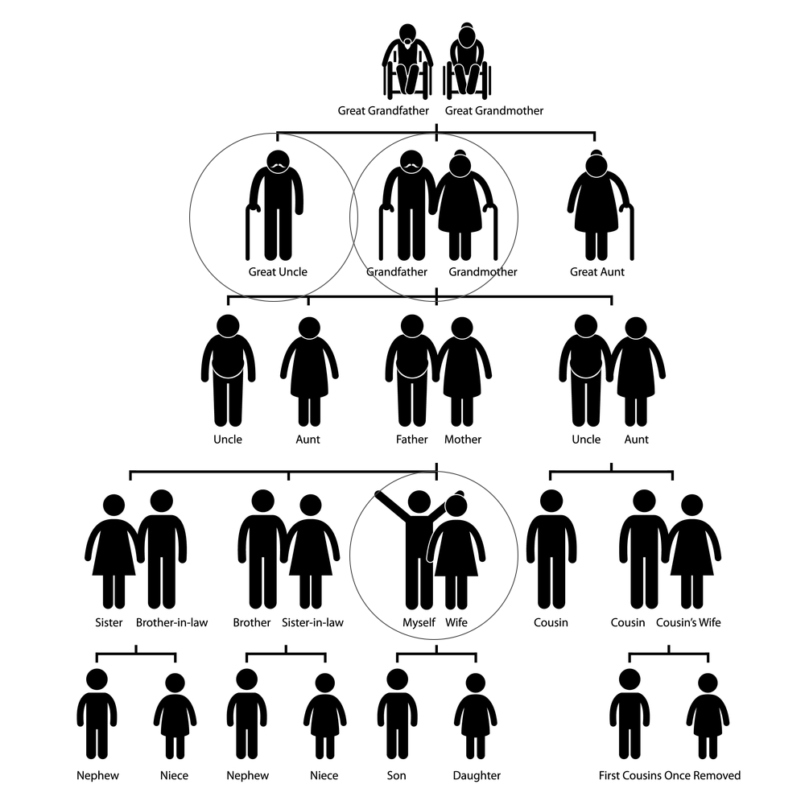
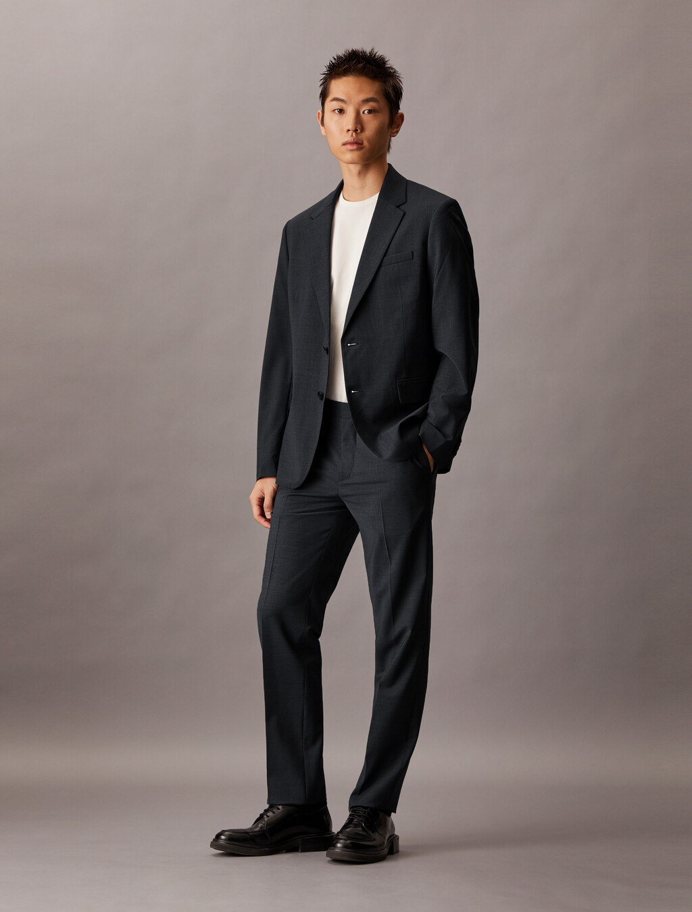
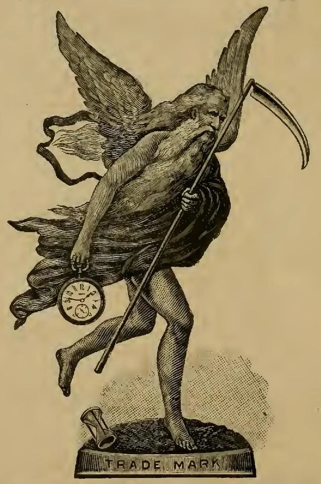
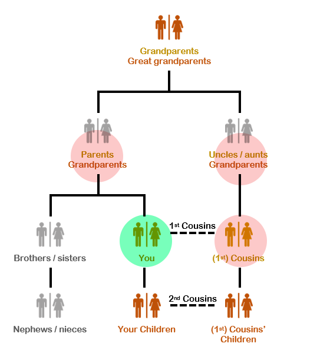
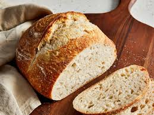
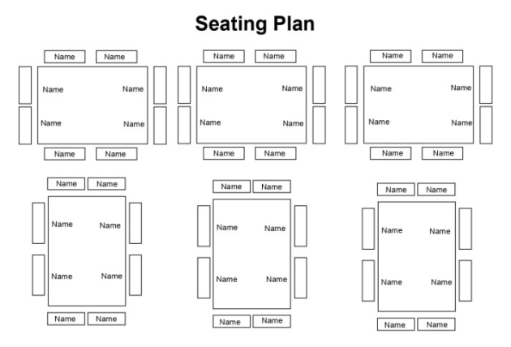
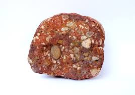

= 继承之战 succession -s1-01
:toc: left
:toclevels: 3
:sectnums:
:stylesheet: ../../../../myAdocCss.css

'''

== 释义

Where am I?
[.my2]
我在哪儿

Where the fuck am I?
[.my2]
这是什么鬼地方

Jesus.
[.my2]
老天

Logan?
[.my2]
洛根

Logan?
[.my2]
洛根

Logan, where are you?
[.my2]
洛根 你在哪儿

-Logan! -Oh, fuck.
[.my2]
-洛根  -我操

Where am I?
[.my2]
我在哪儿

It's OK.
[.my2]
没事的

We're in the new place.
[.my2]
我们在一个新地方

-I'm sorry. -It's OK.
[.my2]
-对不起  -没事

What's that, man?
[.my2]
你说啥 老兄

-We're here, Mr. Roy. -This is it.
[.my2]
-我们到了 罗伊先生  -就是今天

This is the day _we make it happen_ 实现它, Fikret.
[.my2]
今天就是我们创造历史的日子 费克雷

You're the man, Mr. Roy.
[.my2]
您是天选之人 罗伊先生

You're the man.
[.my2]
祝您成功

We good?
[.my2]
可以了吗

Jesus Christ.
[.my2]
我的天

Hey, hey, hey, buddy.
[.my2]
伙计们

Good to see you.
[.my2]
真高兴见到你

So, are we ready to fuck or what?
[.my2]
咱们准备好大干一场了吗

Yeah... OK.
[.my2]
好... 好吧

Look, I-I'm really sorry,
[.my2]
我说 真的很遗憾

but it looks like there's an issue （有关某事的）问题，担忧.
[.my2]
似乎出了点问题

Come on, I *came _all the way_ up here* 大老远跑过来,特地跑到这儿, dude.
[.my2]
拜托 我这么大老远都来了 哥们

[.my1]
.案例
====
.came all the way
*all the way = 一路、全程、大老远* +
强调 距离远、过程不容易（比如长途跋涉、专程赶来）。

.up here
#*up 可以表示 "往某个方向"*#（比如去北方、去市中心、去楼上等）。 +
here = 这里

合起来指 "跑到这儿"（可能指说话人现在所处的位置，比如某个城市、某个房间、某个地方的高处等）。

整句翻译：
"拜托，我可是大老远跑过来的，老兄。"

====

Yeah, I'm sorry...
[.my2]
很遗憾...

Uh, dude.
[.my2]
哥们

OK.
[.my2]
好吧

Listen, you know I love _what you do_, right?
[.my2]
听着 你知道我喜欢你做的事 对吧

I'd love *to keep* you and your team *in place* 保持现状，继续留用（你和你的团队）, Lawrence.
[.my2]
我很想让你和你的团队继续做下去 劳伦斯

[.my1]
.案例
====
在这句话中，"*keep* you and your team *in place*" 是一个常见的商务/职场口语表达，*意思是 "保持现状，继续留用（你和你的团队）" 或 "不进行调整，维持现有人员安排"。*

keep ... in place: +
in place = 在原位、保持现状 +
keep ... in place = 维持现有状态（不改变、不解散、不替换） +

在职场语境中，通常指 不解雇、不重组团队，继续让某人或团队负责当前工作。
====

I think _Vaulter is the shiz_.
[.my2]
沃尔特烂得像屎

We're the shiz?
[.my2]
我们很烂吗

Yeah.
[.my2]
对

What's it gonna take?
[.my2]
还有什么条件

You want me to send _a vintage （过去某个时期）典型的，优质的；（某人的）最佳作品的;古色古香的（指1917–1930年间制造，车型和品味受人青睐的）;（指葡萄酒）优质的，上等的，佳酿的 Jaguar_ 捷豹（汽车品牌） over to your house today?
[.my2]
就算要我今天往你家运一台古董捷豹

[.my1]
.案例
====
.vintage

1._vintage wine_ is of very good quality and has been stored for several years （指葡萄酒）优质的，上等的，佳酿的 +

2.( BrE ) ( of a vehicle 车辆 ) made between 1917 and 1930 and admired for its style and interest 古色古香的（指1917–1930年间制造，车型和品味受人青睐的） +
——compare veteran car +

3.typical of a period in the past and of high quality; the best work of the particular person（过去某个时期）典型的，优质的；（某人的）最佳作品的 +
•a collection of vintage designs 优秀设计选编 +
•vintage TV drama 最佳电视剧 +
•The opera is vintage Rossini. 这部歌剧是罗西尼的最佳代表作。 +

4.~ year : a particularly good and successful year 成绩卓著的一年；成功的一年 +
•2003 was not a vintage year for the movies.2003 年对电影业来说不是全盛之年。 +

-> 来自拉丁语 vindemia,葡萄收割，葡萄生产，##vin-,葡萄，de-,向下，取下，-em,拿，带，词源 同 example.##引申词义特定年份收割的葡萄，上等葡萄酒，佳酿，引申词义经典的，典型的。
====

I'll do it.
[.my2]
我也会照做

Um, s-sure. Look, um...
[.my2]
我明白 但是...

I just think bottom line,
[.my2]
就底价而言

I can deliver (v.)投递，运送；履行，兑现；交付，移交 a lot more value /for our shareholders.
[.my2]
我要为自家股东们创造更大的价值

I hope we haven't inconvenienced (v.)给（某人）造成不便 you.
[.my2]
希望这不会对你造成困扰

I see you. I see this.
[.my2]
我算明白了

We appreciate your *interest in* our little outfit <非正式>（协同工作的）一组人，一队人（尤指乐队、运动队、公司）,
[.my2]
谢谢贵司对我们小团队的认可

but I think _that's it_ 就这样.
[.my2]
但到此为止吧

Come on. That's it?
[.my2]
别这样 到此为止吗

That's not it. What the fuck happened?
[.my2]
不能这样结束 搞毛线呢

Yo, hang on 稍等，别挂断.
[.my2]
等一下

Hold up 等待，延迟, hold up.
[.my2]
慢着 慢着

-You get the message? -What?
[.my2]
-你收到消息了吗  -什么

I'm not *letting* you Neanderthals 尼安德塔人；穴居人(这里用了复数) *in* /to rape my company.
[.my2]
我不会让你们这些穴居人们掠夺我的公司

Ever.  （用于否定句和疑问句，或与if连用的句子）在任何时候，从来
[.my2]
永远不会

I'm sorry?
[.my2]
什么

You're _a bunch of_ bloated (a.)膨胀的；肿胀的；臃肿的;饮食过度的；胃胀的 dinosaurs
[.my2]
你们就是群傲慢的恐龙

who didn't even notice (v.)  the monkeys *swinging 摆动；纵身跃向；（使）弧线运动；（使）突然转向 by* 进某处一会儿；短暂拜访；看望某人一下 till 直到，到……为止 yesterday.
[.my2]
快饿死了才发现猴子就在眼皮底下跑

[.my1]
.案例
====
.swing ˈbyˈ| swing by sth
( NAmE informal ) to visit a place or person /for a short time 进某处一会儿；短暂拜访；看望某人一下 +
SYN drop by +
•I'll *swing by* your house /on the way home from work. 下班回家路过时我要到你家来一下。
====

Well, fuck you, daddy's boy.
[.my2]
总之 去你妈的 小屁孩

Hey, come on. Don't *blow* this *up* 炸毁.
[.my2]
别这样 这事儿不能吹

I got a _track record_ （个人或组织的）业绩记录 from founding (v.) one of the most exciting _new media brands_ in the world.

我创立了世界上最令人兴奋的新媒体品牌之一，取得了良好的业绩。

[.my1]
.案例
====
.track record
all the past achievements, successes or failures of a person or an organization （个人或组织的）业绩记录 +
•He has a proven (a.) _track record_ in marketing. 他有可靠的销售业绩记录。
====

And what do you got?
[.my2]
你有什么

_Track marks_ （长期注射毒品后）手臂或身体上的针眼痕迹 from _shooting (v.) junk_ 毒品,（尤指）海洛因 ?
[.my2]
你有的只是吸毒留下的针眼吧？

[.my1]
.案例
====
.Track marks
原指 （长期注射毒品后）手臂或身体上的针眼痕迹（因反复注射, 形成疤痕或痕迹）。 +
引申义："劣迹、污点"（暗示对方只有负面经历）。 +

.shooting junk
shooting = 注射（俚语，指用针管注射毒品） +
junk = 毒品（俚语，尤指海洛因等硬性毒品） +
shooting junk = "注射毒品" +

整句字面意思：
"你有的只是吸毒留下的针眼吧？"
（讽刺对方没有正经成就，只有吸毒的劣迹。）
====

Thanks for coming down. It was great to meet you.
[.my2]
谢谢你来 很高兴见到你

Sorry this isn't going *to work out* 找到 (解决办法等).
[.my2]
但这事儿谈不成的

No, it's gonna work out.
[.my2]
不 可以的

No, it isn't.
[.my2]
不 真的不行

Take care 保重,照顾好自己, dude.
[.my2]
保重 哥们

Fuck. What the fuck, Frank?
[.my2]
操 这他妈怎么回事 弗兰克

-I...  -How can we salvage (v.)（对财物等的）抢救 this?
[.my2]
-我...  -我们该怎么补救

You still want to pursue (v.)追逐；跟踪；追赶 this?
[.my2]
你还想谈这单吗

Yeah, of course I wanna pursue.
[.my2]
废话 我当然想继续谈

I wanna announce (v.)宣布，公布.
[.my2]
还要开发布会

This is part of the whole thing.
[.my2]
这是计划的一部分

This is the secret sauce 秘制酱料.
[.my2]
是秘密武器

Do we need to sweeten (v.)使变甜；加糖于;使令人愉快；使更合心意；改善；缓和 the offer?
[.my2]
我们要给个更诱人的出价吗

You wanna *bump (v.)提高、增加（尤其指小幅调整数字） the offer another point* 将报价再提高一个百分点?
[.my2]
你想把出价再提高一个百分点吗

[.my1]
.案例
====
bump +
*原意："碰撞、推挤" +
商务俚语中 = "提高、增加"（尤其指小幅调整数字）* +
同义词：increase, raise, boost +

the offer +
指当前谈判中的 报价/条件（可能是价格、利率、股权比例等）。 +

another point +
point = "百分点"（1%的单位） +
例如：利率从 5% → 6%，就是 "bump by one point"。 +

整句字面意思：
"你想把报价再提高一个百分点吗？"
（即："是否要主动加价1%以促成交易？"）
====

Do you wanna call your dad?
[.my2]
要给你爸打电话吗

Do I wanna call my dad?
[.my2]
要给我爸打电话吗

No, I don't wanna call my dad.
[.my2]
不 我不想给我爸打电话

Do you wanna call your dad?
[.my2]
你要给你爸打一个吗

-No. -No?
[.my2]
-不  -不用吗

Do you wanna call your dad?
[.my2]
你要打吗

Does anybody wanna call their dad?
[.my2]
还有人要给老爸打电话的吗

OK, nobody wants *to talk to* their fucking dad.
[.my2]
行 没人想他妈跟自己老爸讲话

So, we've started 我们已经开始, so let's buy this fucking company.
[.my2]
那么 既然开始了 就把那破公司买下来

I'*m pushing* the bid 出价，喊价；投标 *to* 120. OK?
[.my2]
把报价提到1.2亿 行吗

OK.
[.my2]
可以

How's it going?
[.my2]
进行得如何

Yeah, I'm right in the middle 我正处在（谈判的）中间阶段, Dad.
[.my2]
挺好的 还在努力 爸

Did you close?
[.my2]
成功了吗

Yeah, it's OK.
[.my2]
还算顺利

*We're not quite 完全地，彻底地 closed* (完成交易). 我们还没完全「关闭」（交易）,还没最终敲定
[.my2]
但离成功还差一点

I'm going to 120.
[.my2]
我打算提到1.2亿

So, that's good.
[.my2]
所以 还行

and are we still good for the announcement? 我们还能按计划发布公告吗？
[.my2]
咱们还能办发布会吧

Uh-huh.
[.my2]
可以

Great, 'cause obviously I'm soft floating to 轻柔地漂浮, you know like, Frank and Rava, 我正试探性地向Frank和Rava透露消息
[.my2]
那就好 因为显然我这边, 还要软处理弗兰克和拉瓦

and there's gossip *getting soft floated* 传闻正被暗中散播,小道消息正被故意散播.
[.my2]
而且有人在传播谣言

[.my1]
.案例
====
.I'm soft floating to...
字面意思 +
"soft floating" 直译为「轻柔地漂浮」，但在商业/社交语境中是一种隐喻性表达。 +
"*I'm soft floating to* Frank and Rava" = 「我正试探性地向Frank和Rava透露消息」。 +

商业术语解析 +
"Soft float"（软浮动）： +
金融领域：指让信息/价格缓慢释放（如股价的「软着陆」）。 +
谈判场景：*通过非正式渠道（如私下聊天）试探对方反应，避免直接承诺。* +

====

By who?
[.my2]
谁

Uh, by the ether 醚；乙醚;以太;苍穹；苍天；太空.
[.my2]
不知道谁干的

I don't know.
[.my2]
我也不知道

Hey, hey, happy birthday, you old geezer 怪老头；老家伙.
[.my2]
对了 生日快乐 怪老头

Look, it's exciting.
[.my2]
你看 这事儿激动人心

This is gonna be great for you, Dad.
[.my2]
会对你有好处的 老爹

Mm-hmm. I'm excited.
[.my2]
我很激动

_Waystar Royco_ is a family.
[.my2]
韦斯达·罗伊科是个大家庭

A family that spans (v.)横跨；跨越 four continents, 50 countries, three divisions:
[.my2]
这个家庭横跨四大洲, 五十个国家 拥有三个部门:

Entertainment, News and Resorts 度假村；度假胜地.
[.my2]
娱乐部 新闻部和度假区部

Working together
[.my2]
协同合作

to provide a net /that can hold the world,
[.my2]
共同编织成一张网络包罗世界

or catapult (v.)（被）猛掷，猛扔 it forward
[.my2]
推动世界向前

[.my1]
.案例
====
.catapult
(v.) [ + adv./prep.] to throw sb/sth /or be thrown suddenly and violently through the air （被）猛掷，猛扔
[ VN] +
•She *was catapulted out of the car* /as it hit the wall. 汽车撞墙时，她被甩出车外。 +
( figurative) +
•The movie `谓` *catapulted him to* international stardom. 这部电影使他一跃成为国际明星。 +

-> ##cata-, 向下。-pul, 扔，投掷，##词源同appeal, pulse.
====

to the next adventure 冒险（经历）!
[.my2]
致下一段征程

Joining Waystar Royco, you're joining one of _the most dynamic (a.)充满活力的，精力充沛的；动态的，发展变化的 news and entertainment companies_ in the world.
[.my2]
加入韦斯达·罗伊科, 就是加入世界上最具活力的新闻娱乐公司之一

Feel it!
[.my2]
用心感受

OK, how's everyone feeling?
[.my2]
好的 大家觉得怎么样

-Great! -Great!
[.my2]
-好极了  -很棒

Excellent!
[.my2]
很好

Hey. You in the room?
[.my2]
你在听吗

OK. Well, let's go out /and give these kids
[.my2]
好 那这就出去, 给孩子们留下

the best day of their lives 他们一生中最美好的一天, huh?
[.my2]
最美好难忘的回忆吧

Feel it!
[.my2]
用心感受

-Feel it! -Feel it!
[.my2]
-用心感受  -用心感受

Hi!
[.my2]
你好

Hi, Doderick!
[.my2]
你好 道德里克

Hi!
[.my2]
你好啊

Good morning!
[.my2]
早上好

It's Doderick!
[.my2]
是道德里克

Whoo! It's me, Doderick!
[.my2]
是我呢 我就是道德里克

Hey, happy birthday!
[.my2]
生日快乐

Don't pull on my tail!
[.my2]
别拽我的尾巴

Don't hit Doderick!
[.my2]
别打道德里克

Hey!
[.my2]
喂

Quit it!
[.my2]
住手

Wait, OK. Please *get off* 离开,下车.
[.my2]
等一下 行吗 请下去

Can you *fuck off* 滚开?
[.my2]
能滚下去吗

Can you just get the fuck off? 你能给我滚开吗
[.my2]
给我滚下去

Ew!
[.my2]
呕

He's puking (v.)吐，呕吐 out of his eyes! 他要从眼睛里吐出来了！
[.my2]
他的眼睛在呕吐

Protein 蛋白质，朊 spill (v.n.)（使）洒出，泼出，溢出.
[.my2]
蛋白质泄露而已

OK, this way, this way. Come on.
[.my2]
过来 过来 往这边来

Greg?
[.my2]
格雷格

Hi, Mom.
[.my2]
妈妈

How... Are you OK? How's it going?
[.my2]
你... 还好吗 工作怎么样了

Mom, sorry, but I sort of 有点儿 *screwed up* 搞糟；搅乱；弄坏,搞砸了.
[.my2]
妈 对不起 我好像闯祸了

Well, not me, actually, but this kid.
[.my2]
其实不是我 而是那小孩

Greg.
[.my2]
格雷格

So, this kid *smoked a joint* <美，非正式>大麻烟卷 in my car.
[.my2]
有个小孩在我车里抽了一根大麻

A kid.
[.my2]
小孩

Like this _hitchhiker 搭便车的人  kid_ /that I picked up this morning, like earlier this morning.
[.my2]
就今早我接上的那个搭便车的小孩 早些时候那会儿

'Cause it was raining and I didn't want...
[.my2]
因为那时在下雨 我不想...

I didn't want him *to get sexually assaulted* (v.)攻击；突击；袭击;侵犯他人身体（罪）；侵犯人身罪?
[.my2]
不想他被坏人性骚扰之类的

Greg.
[.my2]
格雷格

Before I could even say anything... 我还没来得及说点什么
[.my2]
我还没说啥呢...

What the fuck?
[.my2]
你搞毛呢

Aggressively 好斗地；侵略地；攻击地；积极进取地；有闯劲地 *takes out* 取出...
[.my2]
他上车就点了一根...

Have you ever seen 你可曾见过, like, so, a doobie 大麻烟卷?
[.my2]
就是你知不知道 那种 大麻烟

And the car smelled like _skunk 北美臭鼬 weed_ 杂草，野草（尤指庄稼或花园中的）;烟草；烟叶；香烟；烟卷.
[.my2]
车里都是焦臭的大麻味儿

[.my1]
.案例
====
.doobie
源自1960年代美国嬉皮士文化，"doobie" 是大麻烟卷（hand-rolled marijuana cigarette）的俚语说法，带有怀旧和戏谑色彩。

剧中用意：
说话者用 "doobie" 这个词，体现其笨拙或刻意装酷（因该词如今显得过时且幼稚）。 +
对比更常见的说法：joint（中性）、blunt（含烟草的大麻烟）、spliff（混烟草的大麻烟）。

.skunk
a small black and white N American animal that can produce a strong unpleasant smell to defend itself when it is attacked 北美臭鼬

.skunk weed
直译：臭鼬大麻 +
实际含义：指一种高强度、气味刺鼻的大麻品种（因类似臭鼬的强烈气味得名）。 +
剧中暗示：
搭车少年抽的是劣质或廉价大麻（“臭鼬”在毒品文化中常被调侃为低端货）。

====

And then I guess I smelled like it.
[.my2]
我身上也是那味

And then *they were just like*, 他们就直接说…,他们当时就那样; 他们一副‘你赶紧卷铺盖走人’的嘴脸。（带情绪）
[.my2]
他们就说

"Get all your stuff 东西，物品 and go. "
[.my2]
"收拾东西滚蛋"

Greg.
[.my2]
格雷格

Did you even think for one second
[.my2]
你有没有想过告诉他们

to tell them who you are?
[.my2]
你是谁

No, I thought...
[.my2]
没有 我觉得...

I didn't wanna be an asshole
[.my2]
我不想当个混蛋

or *get into it all*.
[.my2]
也不想掺和进去

-OK. -I don't know.
[.my2]
-好吧  -我也不知道

Here's what you're gonna do. 这是你要做的
[.my2]
你接下来这样做

You're gonna get a plane ticket to New York.
[.my2]
买张去纽约的机票

It's your Uncle...
[.my2]
是你伯伯...

Your Great-Uncle Logan's birthday,
[.my2]
大伯父洛根要过生日

[.my1]
.案例
====
.great-uncle
N an uncle of one's father or mother; *brother of one's grandfather or grandmother* 叔祖父 ; 伯祖父; 舅老爷; 姑老爷

====

and they're having a big party.
[.my2]
要办一个大型生日宴会

I'll call Marcia /and tell her you're coming.
[.my2]
我会打给玛西娅说你要去

It's his birthday?
[.my2]
他要过生日吗

You're gonna go to the party.
[.my2]
你去参加派对

You're gonna get him a nice gift.
[.my2]
再送一份体面的礼物

And you're gonna look nice.
[.my2]
还要看着英俊潇洒

In a grown-up (a.)成年的，成熟的；适于成人的，成年人特有的 shirt and a grown-up blazer （常带有俱乐部、学校、运动队等的颜色或徽章的）夹克.
[.my2]
穿上成年人的衬衫和西装

[.my1]
.案例
====
.blazer
a jacket, not worn with matching trousers/pants, often showing the colours or badge of a club, school, team, etc.（常带有俱乐部、学校、运动队等的颜色或徽章的）夹克 +
-> 来自blaze, 指一种色彩艳丽的红夹克。

A blazer is a versatile, semi-formal jacket that sits between a suit jacket and a sport coat in terms of formality. Unlike a suit jacket, it's not part of a matching set and can be worn with various outfits. Compared to a sport coat, a blazer is generally more structured and often comes in solid colors, traditionally navy blue.

运动夹克是一种多功能的半正式夹克，其正式程度介于西装外套, 和运动外套之间。 与西装外套不同，它不是套装的一部分，可以与各种服装搭配。 与运动外套相比， 运动夹克通常结构更严谨，且通常为纯色，传统上为海军蓝 。

====

A blazer?
[.my2]
西装

I'll let you know.
[.my2]
我告诉你怎么做

They're not gonna budge (v.)（使）轻微移动，挪动;（使）改变主意，改变观点/unless it gets to be a stupid number. （金额、数字等）达到一个非常荒谬、高得离谱，或者难以接受的程度
[.my2]
不给出一个大数目他们是不会让步的

[.my1]
.案例
====
.budge
-> budge←中古法语bougier（移动、搅动）←拉丁语bullire（沸腾） #同源词：boil（沸腾）# 词组习语：budge on（在…上让步）；budge from（离开）

.a stupid number
*这里的“stupid”不是指数字本身智力低下，而是指这个数字大到令人难以置信，不合常理，甚至有点愚蠢或可笑。它通常带有负面含义，表示过高、过分。*

====

What's a stupid number?
[.my2]
多大算大

What's stupid? A "badillion"? I don't know.
[.my2]
多大 数兆亿吗 谁知道

[.my1]
.案例
====
.badillion
“badillion” 不是一个标准英语词汇，它是一个由说话者（可能是在玩笑或夸张的语境下）创造出来的词，用来表示一个“极其巨大、数不清的数字”。

它的构成可能是： +
*"bad"（坏的，不好的，或在这里强调“过分”、“巨大”的程度）* +
"-illion"（一个后缀，常用于表示巨大数字的词，例如：million 百万, billion 十亿, trillion 万亿）。

所以，“badillion”可以理解为**“一个坏到离谱的亿万级数字”，或者“一个多得无法计算、糟糕透顶的数字”**。它用来表达说话者对某个数字（在这里是120）觉得已经很高，但又无法具体说出多高才算“stupid number”时的一种夸张和无奈。
====

Because 120 is stupid. Am I wrong?
[.my2]
因为1.2亿够大了 不是吗

120 is a stupid number.
[.my2]
1.2亿是个大数目

But it's not really a money thing _right now_.
[.my2]
这已经不是钱的事情了

Mr. Roy, someone's here to see you.
[.my2]
罗伊先生 有人找您

-OK. Who's this? -Hi, Kendall Roy?
[.my2]
-好 谁找我  -打扰 是肯德尔·罗伊吗

Yeah, hi.
[.my2]
是我 你好

I was sent by Roman *to burn (v.) some sage* 鼠尾草（可用作调料）;哲人；智者；圣人.
[.my2]
罗曼派我来烧点鼠尾草

[.my1]
.案例
====
.sage

====

Excuse me?
[.my2]
你说什么

It's auspicious (a.)吉利的；吉祥的.
[.my2]
求个好彩头

[.my1]
.案例
====
.auspicious
-> ##au, 同词根av, 鸟。词根spic, 看，同spectator, 观众。##来自augur, 占卜，指占了好卜。
====

I'm a business alchemist 炼金术士.
[.my2]
我是个商业炼金师

[.my1]
.案例
====
.alchemist
N-COUNTAn alchemist was a scientist in the Middle Ages who tried to discover how to change ordinary metals into gold. 炼金术士
====

It's a gift, from your brother.
[.my2]
这是你弟送你的礼物

Will it *set off* 引爆 (炸弹); 触发 (警报) the smoke alarms?
[.my2]
会触发烟雾报警器吗

Not usually.
[.my2]
通常不会

Not usually?
[.my2]
啥叫通常

Hey, hey, motherfuckers <美，粗俚>混账东西，杂种!
[.my2]
嘿 混蛋们

-Roman. -My guy?
[.my2]
-罗曼  -我的人吗

Are you saging (v.)烧鼠尾草 ?
[.my2]
你们在烧鼠尾草吗？

[.my1]
.案例
====
鼠尾草净化（Smudging）：
北美原住民的传统仪式，燃烧干燥的鼠尾草（如白鼠尾草，Salvia apiana）以驱散负能量或“邪气”（bad juju）
====

Well, we're concerned about the alarms.
[.my2]
我们担心这会触发警报

Ooh, right, yeah, the bad juju  ((西非民众迷信崇拜的)护符;（西非土著的）魔法，法术) 厄运.
[.my2]
说得是啊 巫术

Now, I can use _essential 必不可少的，非常重要的；基本的，精髓的 oils_ 精油.
[.my2]
我可以用精油代替

Oh, I think just *fuck off* 滚蛋, thanks.
[.my2]
你可以滚蛋了 谢谢

How ya doing?
[.my2]
你最近咋样

Good. Good. Just finessing (v.)用策略对付某事;狡猾地应付；巧妙地做.
[.my2]
不错 我们正在商议对策

[.my1]
.案例
====
.finesse
(v.)1.
to deal with sth in a way that is clever but slightly dishonest 用策略对付某事 +
•to finesse a deal 略施小计达成一桩交易 +

2.to do sth with a lot of skill or style 巧妙地做；派头十足地做

-> #来自fine, 精细，微妙。用于指策略，手腕。#
====

Mm. Finessing. Nice.
[.my2]
商议对策 很好

Bye.
[.my2]
再见

He's good.
[.my2]
他很不错

You OK, man?
[.my2]
你没事吧

OK? Yes, I'm OK. Obviously.
[.my2]
我吗 好啊 好得不行了

Why would you even 甚至，连，即使 ask that?
[.my2]
这还用问吗

I don't know. Just, you know.
[.my2]
不知道 问问而已

Here? Man, *I'm so over it* 我已经不在乎了,我受够了. I was a bad fit 不合适.
[.my2]
回来吗 早就翻篇了 我不适合这里

[.my1]
.案例
====
.I'm so over it.
含义：“我已经不在乎了” / “我受够了” +

*"over it" 表示对某事不再关心或感到厌倦。 +
"so" 加强语气，类似中文的“真的”或“彻底”。* +

例句：
"I'm so over this job."（我受够这份工作了。） +

.I was a bad fit."
“我不适合（这里）”

*"bad fit" 指“不合适”，常用于职场或社交场合。*
反义是 "good fit"（合适）。 +
"He was a bad fit for the team."（他不适合这个团队。）
====

I was never _a corporate cock 公鸡,阴茎-suck_ anyway 反正 .
[.my2]
反正我从来不是那种拍公司马屁的人

[.my1]
.案例
====
-"corporate cock-suck" 是粗俗俚语，指“职场舔狗”或“阿谀奉承的人”。
-"anyway" 表示“反正”，强调不在乎。
====

Besides, I never *made it this high* 爬到这么高（指职位或地位） /in the fucking building!
[.my2]
更何况 我在这栋楼里从来没有爬到这么高

They *stuck 动不了；无法移动；卡住；陷住 me* in LA 把我扔在洛杉矶（暗示不受重视） /*with* _Old Father Time_ 时间老人(这里可能指某个老派高管) /right here.
[.my2]
他们把我丢在洛杉矶，和这个‘老古董’一起。

[.my1]
.案例
====
.Father Time
an imaginary figure who represents time and looks like an old man carrying a scythe and an hourglass 时间老人（手拿镰刀和沙漏、象征时间的虚构人物）

====

We were the pool boys, right, Frank?
[.my2]
咱们以前是泳池兄弟 对吗 弗兰克

Fuckin' banana cabana 小屋；有凉台的屋子?
[.my2]
记得香蕉小屋吗

[.my1]
.案例
====
.cabana
image:/img/cabana.jpg[,15%]

“Cabana” (卡巴纳) **通常指的是一种小型的遮蔽物，通常位于海滩或泳池边，用来遮阳、更衣或休息的场所。**它也可以指一种类似小木屋的建筑，提供类似的功能。

更详细的解释：

-遮阳避雨的场所:
在海滩或泳池边，人们通常用“cabana”来指代一种小型的遮阳棚或小屋，供人们休息、更衣或存放物品。
-更衣室:
“Cabana”也可以指一个私密的更衣空间，尤其是在海滩或泳池边，方便人们更换泳衣或湿衣服。

image:../img/Cabana.jpg[,15%]
image:../img/Cabana 2.jpg[,15%]
====

Good times.
[.my2]
都是美好时光

So, what's the bid?
[.my2]
目前竞价是多少

-What's the bid? -Mm-hmm.
[.my2]
-你问竞价吗  -对

Well...
[.my2]
这个...

What? That's commercially sensitive (a.)（问题、话题）敏感的，须谨慎对待的；机密的，保密的 ?
[.my2]
怎么 这还算商业机密了

I'm still on the board 我还在董事会, man.
[.my2]
我可还在董事会呢 兄弟

Going 125.
[.my2]
要到1.25亿了

One-twenty-five?
[.my2]
1.25亿吗

-What? -Fuck!
[.my2]
-怎么了  -我去

What? High or low?
[.my2]
怎么 高了还是低了

-You're laughing. What? -No.
[.my2]
-你笑什么  -没什么

-For Vaulter, right? -Yeah.
[.my2]
-为了买沃尔特 对吗  -是啊

Bit of content 少量内容资产 and a brand name 品牌名称?
[.my2]
那个没啥内涵的商标吗

_Bit of content_  and _a brand name_ *kinda's* (= kind of is *差不多是*) the whole game 这个行业的本质.
[.my2]
内容和品牌名字, 不就是这行的全部吗？(回应前一句，暗示“媒体行业就是靠内容和品牌吃饭”。)

[.my1]
.案例
====
.kinda's
"kinda" = "kind of" 的口语缩略（类似 "sorta" = sort of）。 +
"'s" = "is" 的缩写（口语中常见，如 "that's" = that is）。 +
合并效果："kinda's" = "kind of is"（“差不多是”）。 +

#*"kind of" 作为副词, 修饰系动词 "is"，表示“某种程度上是”或“基本算是”。*#

正式写作中应写为 "kind of is"，但口语/非正式文本中可缩写成 "kinda's"。

-That kind of is the point. => 	That #kinda's# the point.	“差不多就是这个意思。”
-He kind of is a genius.	=> He #kinda's# a genius.	“他算是个天才吧。”

为什么用 "kinda's" 而不用 "is"？

-原句若用 "is"：
"A bit of content and a brand name is the whole game."
→ 显得过于绝对（断言“这就是全部”）。
-用 "kinda's"：
→ 添加不确定性，暗示“虽然听起来简单，但事实如此”。

====

-Isn't it? -Mm-hmm.
[.my2]
-不是吗  -好吧

What are you laughing at?
[.my2]
你到底在笑什么？

I don't know what I'm talking about.
[.my2]
我不知道我在说什么

You're gonna be captain of the ship _soon enough_ 很快.
[.my2]
反正你马上要当这艘船的船长了

-So I don't... -Shh.
[.my2]
-我不...  -嘘

Oh, shit.
[.my2]
糟糕

Sorry. Fuck you, man.
[.my2]
抱歉 去你妈的

Every intern  <美>实习医生；<美>实习生 on the street `谓` *knows that* you're stepping up 走上前去;增加，提高（数量、速度等）.
[.my2]
街上的所有实习生都知道你要上位了

Seriously, congrats.
[.my2]
恭喜你 真心的

I'm just so pleased *to be* out of here 离开这里. 我只是很高兴能离开这里
[.my2]
能离开这里我实在太高兴了

This place was essentially a cage to me.
[.my2]
这里对我简直就像个牢笼

I should 应该 take off 脱离,起飞. Fuck it.
[.my2]
我该走了 管他妈的

Hey, congrats, man.
[.my2]
恭喜你 兄弟

Thanks for coming by.
[.my2]
谢谢你过来

Look at all this fuckin' bullshit!
[.my2]
瞧这胡诌八扯的地方

Mm, yes, mm, very serious, mm.
[.my2]
我很严肃的哦

Love you, brother.
[.my2]
爱你哦 老哥

Good.
[.my2]
很好

Right.
[.my2]
好

Just keep everything straight, OK?
[.my2]
把它们都摆正 明白吗

Good.
[.my2]
很好

By the way, we need another setting.
[.my2]
对了 还要加一套新餐具

Another family member is coming.
[.my2]
还有一位家庭成员要来

-Marcy. -What?
[.my2]
-玛西  -怎么了

I'm heading out 出发, as ordered.
[.my2]
我要出去 定好了的

Great. Till 1:00...
[.my2]
好的 一点前回来...

Fine. But in here, yeah?
[.my2]
好吧 但惊喜就在这里 好吗

I don't want _a fuckin' heart attack_ from the surprise.
[.my2]
我他妈可不想被吓出心脏病

And I don't want anyone in my face 我不想让任何人在我面前/ when I come out of the elevator.
[.my2]
我出电梯时 不想看到任何人朝我欢呼

Right. Distance.
[.my2]
保持好距离

Have them here. And, uh...
[.my2]
把他们安排在这 还有...

-What? -Not too loud.
[.my2]
-怎么了  -小点声

Do you want me to email you _the exact details_ of the surprise?
[.my2]
你希望我把惊喜的精准细节发给你吗

Yeah?
[.my2]
想吗

-I'll see you later. -Yeah.
[.my2]
-待会儿见  -好

Right. Get your coat.
[.my2]
还有 穿好外套

Yeah, yeah.
[.my2]
知道了

Richard, get him his coat.
[.my2]
理查德 把外套递给他

Of course.
[.my2]
好的

-Just double-check. -OK.
[.my2]
-再仔细检查一遍  -好的

When were you gonna look at that speech? 你打算什么时候看那篇演讲稿？
[.my2]
你打算多久去审演讲稿

I'll be back by Sunday night /so I'll look at his speech with him then, OK?
[.my2]
我周日晚上回来 到时候和他一起审 行吗

OK, but his office wants the _poll numbers_ 民意调查数据 by the preekend. 但他的办公室要在周末前拿到民调数字。
[.my2]
但他那边要在前周末拿到民调数据

The "preekend"? What the fuck's a "preekend"?
[.my2]
"前周末" 这他妈是啥玩意儿

Preekend is Friday.
[.my2]
前周末就是周五

If he wants them by Friday, can he not say Friday?
[.my2]
那他不能直接说是"周五"吗

Thursday lunch 午餐，午饭 through 直达，迳直 Friday afternoon `系` is the preekend.
[.my2]
前周末是周四午后到周五中午

Oh, fine. Get Rennie to look at the numbers. 让雷尼看看那些数字
[.my2]
好吧 让蕾妮搞好数据

Shiv.
[.my2]
小西

This is a fuckin' disaster.
[.my2]
真他妈是场灾难

I got to strategize (v.)制定战略；形成战略 my gift.
[.my2]
我得好好规划一下送什么礼物。

_What_ can I get him _he'll love_?
[.my2]
我该送什么他才会喜欢？

[.my1]
.案例
====
"he’ll love" 是省略关系代词（that/which）的定语从句，修饰 "what"。 +
完整句：What can I get him that he’ll love?
====

I don't know. My dad doesn't really like things.
[.my2]
我爸其实对物质东西不感兴趣。

[.my1]
.案例
====

"doesn’t like things" = “不喜欢具体物品”（可能指父亲更看重权力、尊重等抽象价值）。 +
"really" 弱化否定，暗示“并非完全不喜欢，但很难取悦”
====

He doesn't like things?
[.my2]
他没什么喜好吗

No, not really.
[.my2]
确实是这样

It needs to say that (礼物必须传达出...) "I respect 尊敬，敬佩 you,
[.my2]
这份礼物要表达出

but I'm not awed 使……敬畏；使……惊叹 by you. 我尊重你，但不会对你卑躬屈膝。
[.my2]
"我尊重你 但我并不怕你

And that I... I like you,
[.my2]
我还... 欣赏你

but I need you to like me /before I can love you."
[.my2]
我对你有好感，但得你先喜欢我，我才会爱你。

So _what says that_?
[.my2]
那什么东西能表达这些？

Just, look, 说白了 `主` everything that you get him `谓` will mean an equal amount of nothing 同等程度的无意义,
[.my2]
听着，你送他什么,其实都一样没意义。

so make sure /it looks like 10 to 15 grand's <非正式>一千美元，一千英镑 worth /and you're good 你就没问题了（任务完成）.
[.my2]
所以只要让它看起来值1万到1.5万美元，你就过关了。

[.my1]
.案例
====
.grand
( informal ) $1 000; ￡1 0001 000 元；1 000英镑 +
•It'll cost you five grand! 这要花去你5 000块钱！

"grand" = “千美元”（俚语，10grand=10,000）。
====

Will you come in here /and help me?
[.my2]
你能进来帮帮我吗

Yes.
[.my2]
好

Please help me.
[.my2]
求你帮帮我

Yes. Get him a watch.
[.my2]
当然了 给他买块表吧

If we go stupid 极端、疯狂 on the stock, what does a really sexy package 诱人的交易方案 look like? Hmm?
[.my2]
如果我们疯狂推高股价，什么样的收购方案最有吸引力？

[.my1]
.案例
====
-"go stupid" 是交易员黑话，类似中文"疯狂押注/无脑冲"，指不顾风险大举投资 +
金融圈常用"stupid money"形容非理性热钱

-"sexy package" 用性暗示比喻"诱人的交易方案"，华尔街惯用肉体词汇形容交易（如"naked position"裸仓;暴露的部位） +
注意修辞：将枯燥的金融方案情欲化，反映行业雄性荷尔蒙过剩的文化
====

He's probably illiquid (a.)（资产）不可立即兑现的；（市场）参与者少的, right?
[.my2]
他也许没有流动资金了 对吗

So, what, we *throw in* 额外追加;添加，投入 another ten million?
[.my2]
那我们要再投一千万吗

Might need *to throw in* a blow job 口交；吹喇叭, too.
[.my2]
没准还要再来一次跪舔

I'll *throw in* a blow job.
[.my2]
我来跪舔

I'll throw in a blow job.
[.my2]
我来跪舔

I'll throw in a reach-around.
[.my2]
还要让他高潮

[.my1]
.案例
====

.reach-around (plural reach-arounds)
Manual stimulation of a sexual partner's genitals during anal or vaginal intercourse from behind. (idiomatic, by extension) An ostensibly thoughtful gesture, especially one performed to win favour or mitigate unfair treatment.

伸手刺: 在肛交或阴道性交时, 从后面手动刺激性伴侣的生殖器。（惯用语，引申为）表面上体贴的姿态，尤指为赢得好感, 或减轻不公平待遇, 而做出的姿态。
====

Hell, I'll even *cup  (v.)（用手）做成杯状；窝起手掌托住 his balls* 比喻"彻底讨好对方".
[.my2]
见鬼 我还要捏他的蛋

Dad.
[.my2]
爸

I thought you'd be in St. Barts by now.
[.my2]
你这会儿该到圣巴特岛[加勒比度假岛]了啊

-How's it goin'（=going的缩略）? -Good.
[.my2]
-一切顺利吗  -还不错

Uh, yeah. Fine. Good.
[.my2]
是的 挺好的

Uh, why are you...
[.my2]
你怎么...

Are we OK?
[.my2]
我们没事吧

Yeah, it's just some paperwork 文书工作.
[.my2]
没事，就是些文件手续。

What, ahead of the announcement?
[.my2]
怎么 发布会前还有吗

*Putting* Marcy *on* the trust （金钱或财产的）信托，托管. It's... bullshit.
[.my2]
我要把玛西纳为信托人... 破事一桩 +

把Marcy加入信托。这…太扯了。

I, uh, I just felt like checkin' in.
[.my2]
然后就想顺路过来瞧瞧

Oh. Yeah, fine.
[.my2]
是吗 好啊

-So this is just the trust? -Yeah.
[.my2]
-只是改信托人吗  -对

Doesn't affect (v.) me stepping up 晋升，提升;增加，提高，推进?
[.my2]
不会阻碍我升职吧

No, no, no, no, no. I think I told you about it.
[.my2]
不 不 不会的 我好像跟你谈过了

Is that...
[.my2]
这是...

Sorry, Dad, I'm kind of in the middle of...
[.my2]
抱歉 父亲 我这边正忙...

Do you need... Do I need to lawyer (v.) all this? 我需要为这事请律师吗？
[.my2]
你需要... 需要我走法律形式吗

It's housekeeping.
[.my2]
一些家务而已

Fine. Yeah. Yeah. Marcy's fine by me.
[.my2]
好吧 我对玛西没意见

I mean, the others might not feel (v.) the same, but...
[.my2]
我是说 那几个家伙可能不这么想 但...

I'll deal with that.
[.my2]
我会处理的

So, I'll see you in...
[.my2]
那我们...

Yeah, look, Dad, on lunch.
[.my2]
对了 爸 午饭这事

I really want to be with you, but the deal...
[.my2]
我很想陪你的 但是生意...

-Son. -You know.
[.my2]
-儿子  -你知道的

*It's your call* 由你决定.
[.my2]
你自己决定吧

Just priorities 优先处理的事,最重要的事；首要事情.
[.my2]
分清主次

There'll be plenty more.
[.my2]
这种事以后只会更多

Uh-oh. Wheat 小麦（植物）.
[.my2]
麦穗的故事 记得吗

Bye, Frank.
[.my2]
再见 弗兰克

All right, amigo （美）朋友.
[.my2]
再见 老朋友

I have five farms, and underneath all my farms
[.my2]
我有五个农场 而这些农场下面

runs a big, giant aquifer 地下水层，渗透性含水石层 that's like an underground lake.
[.my2]
有个非常大的蓄水池 像地下湖那种

[.my1]
.案例
====

.aquifer
( geology 地) a layer of rock or soil /that can absorb (v.) and hold (v.)  water（岩石或土壤的）含水层
====

-That's so cool! -I have pumping 用泵输送 rights.
[.my2]
-真酷啊  -我有抽水权

That means I get to take the water.
[.my2]
就是说我能拥有那些水

[.my1]
.案例
====
"I get to take the water." 的 "get to" 需要结合上下文和权力语境来理解。在这句话中，"get to" 并非字面「得到」，而是强调 「有权利/特权做某事」

当你想表达 「获得, 享有他人没有的权利/机会」 时： +
积极语境："I got to meet the president!"（强调难得机会） +
权力语境："Only managers `谓` get to access this data."（强调等级特权）
====

-That's so cool! -And it's very important
[.my2]
-太酷了  -还相当重要呢

because someday water's gonna （=即 going to） be more precious than gold
[.my2]
因为有一天 水会比黄金还珍贵

and people are gonna kill each other /to try to get that water.
[.my2]
人们会互相残杀 只为得到水

Oh, hey, hey, Con, don't, don't.
[.my2]
悠着点 康纳 别这样

-Don't listen to him. -Right, right, sorry.
[.my2]
-别听他的  -我知道 抱歉

But I'm gonna 即将，将要 have the water.
[.my2]
但我会拿到水的

And I'll share with you.
[.my2]
然后就分享给你

-Hi. -Hi.
[.my2]
-你好  -你好

-How are you? -Good.
[.my2]
-你怎么样  -不错啊

-How are you? -Good. You look great.
[.my2]
-你呢  -很好 你看起来棒呆了

-What a beautiful color. -Thanks. Same.
[.my2]
-颜色真漂亮  -谢谢 你的也很美

-Thank you. -Love that.
[.my2]
-谢谢  -我很喜欢

Thanks.
[.my2]
谢谢

-Hi, Tom. -Hey, Marcia, how are you?
[.my2]
-汤姆  -玛西娅 最近好吗

-Nice to see you. -Nice to see you.
[.my2]
-真高兴见到你  -我也很高兴见到你

-How are you? -Very good.
[.my2]
-你怎么样  -非常好

Hey, Global Tom. How you shaking （=How are you doing）?
[.my2]
哟，'环球汤姆'，最近混得如何？

[.my1]
.案例
====
."Global Tom"
用绰号称呼对方，可能是： +
a) 讽刺对方自称"国际精英"（Global）却名不副实 +
b) 暗示对方是可有可无的小角色（Tom是烂大街的名字）

."How you shaking?" +
非正式问候（=How are you doing?） +
*但"shake"暗含「动荡不安」的负面联想*
====

You still *fucking shit up* for us?
[.my2]
你还在给我们捅娄子是吧?

Still *cleaning up* your mess 粪便；困境，混乱局面, pal  <非正式>朋友，伙伴.
[.my2]
还在收拾你的烂摊子 伙计 +

老子还在给你擦屁股呢，兄弟。

Yeah, right.
[.my2]
呵呵，行吧。(用敷衍结束对话，暗示「你不配让我认真对待」)

-Hey, sis. -Hi.
[.my2]
-你好啊 老妹  -好啊

Politics still *boring* (v.) the living shit *out of you* 把活生生的屎都无聊出来了?
[.my2]
搞政治还是让你无聊到爆吧？

[.my1]
.案例
====
"bore (v.) the living shit out of sb"：比普通"boring"强烈十倍的表达，直译「把活生生的屎都无聊出来了」
====

Yeah, you know, I'm burying the bodies (比喻掩盖丑闻/处理烂摊子), counting (v.) the cash.
[.my2]
是啊，你知道的，日常埋尸数钱呗。

Look at you. You like, you know, an actual human person.
[.my2]
看看你现在，居然还像个活人呢。(表面夸「你状态不错」，实则暗讽：「搞政治居然没把你变成行尸走肉？)

Well, thanks, buddy.
[.my2]
谢了 老哥

[.my1]
.案例
====

潜台词："你的评价对我毫无意义" +
"well"拉长音+停顿，表达「懒得和你计较」

可以套用这个模板：
对方挑衅 → 你夸张自嘲 → 对方假夸 → 你虚假感谢

例如：当有人说"Lawyer must be soul-crushing" (律师一定是令人心碎的) 时，可以回："Totally! I drown my sorrows /in client's tears and cocaine." (完全!我用客户的眼泪和可卡因, 来淹没我的悲伤。)

这种对话的精髓在于：用最灿烂的笑容，说最黑暗的实话.

====

-Hi.  -Oh, what is that?
[.my2]
-好  -这什么味儿 +

哦，你喷了什么香水？

_Date Rape_ by Calvin Klein (美国时装品牌)?
[.my2]
卡尔文·克莱因的'约会迷奸'款？ (潜台词："你喷香水是想诱骗谁上床？")

Yeah, you wish 做梦去吧.
[.my2]
你想得美

[.my1]
.案例
====
"you wish"：英语中经典的反杀句式，意为「做梦去吧」 +
你想得美：用于粗鲁地告诉人们他们很难得到他们想要的东西。
====

"You wish"?
[.my2]
"你想得美"?

-Mr. Roy!  -Mr. Roy, please!
[.my2]
-罗伊先生  -请您看这 罗伊先生

Mr. Roy. Over here. One shot, please.
[.my2]
罗伊先生 看这里 就照一张

Say, guys, can we *back off* 后退?
[.my2]
伙计们 能不能退后

-How 'bout a smile? -Guys, back off. Private event.
[.my2]
-笑一个怎么样  -伙计们 退后 这是私人活动

Logan, Logan, you going today? Is that right? Is that right?
[.my2]
洛根 洛根 今天您要出席 对吗 是吗

-Back off, please. -Fuck off.
[.my2]
-请退后  -滚边儿去

-Handle (v.) that, will _ya_ (表示口语的you或your)?  -Just one shot!
[.my2]
-搞定他们 行不  -照一张就好

Mr. Roy.
[.my2]
罗伊先生

Hi. Hello. Hello there.
[.my2]
你好 你好啊

Can I help you, sir?
[.my2]
需要帮助吗 先生

Yeah, I'm actually... I'm actually here to see you.
[.my2]
是的 我... 其实我是来找你的

Get your hands back!
[.my2]
把手放背后

Who are you?
[.my2]
你是谁

-What are you doing? -Greg! I'm Greg!
[.my2]
-你要做什么  -格雷格 我叫格雷格

I'm Marianne's Greg. Your nephew?
[.my2]
我是玛丽安家的格雷格 我妈是你外甥女

-You know this guy?  -My Mom called Marcia
[.my2]
-你认识这人吗  -我妈给玛西娅打了电话

and I talked to that guy /and he said that /I could go up.
[.my2]
我和那人说了 他说我可以上去

-We're good? -Right.
[.my2]
-没事了吗  -对

I didn't know you were coming.
[.my2]
我不知道你要来

-Yeah, you did. -Sorry about that, guy.
[.my2]
-你知道吧  -刚才抱歉了 伙计

-I think you did. -You all right?
[.my2]
-我觉得你应该知道  -你还好吧

-Sorry about that. -I hope it's OK.
[.my2]
-不好意思了  -希望没事

I wanted to say _happy birth..._
[.my2]
我想跟你说生日快...

Happy birthday and _many happy returns_.
[.my2]
祝你生日快乐 长命百岁

[.my1]
.案例
====
.many happy returns
直译："许多快乐的回归" +
相当于中文的"长命百岁"或"岁岁有今朝" +
核心祝福："愿你的人生循环往复，年年都有今日的快乐" +
注意：单独用"many happy returns"在当代英语中可能显得老派，建议与"happy birthday"搭配使用
====

Oh, thank you.
[.my2]
谢谢

I suppose you better come up. 我想,你最好上来
[.my2]
跟我一起上楼吧

He's a very good bodyguard 保镖.
[.my2]
他是个尽职尽责的保镖

Folks, he's back!
[.my2]
各位 他回来了

He's back. Find a place. Hide for the surprise. Come on.
[.my2]
他要到了 藏起来给他个惊喜 快

Oh, we're not surprising him, are we?
[.my2]
我们真要给他个惊喜吗

-Yeah.  -Oh, he's gonna love this.
[.my2]
-没错  -他肯定"爱死了"

Think (v.) last time I surprised him,
[.my2]
上次我给他一个惊喜

he took a swing 摇摆，摆动；挥舞，挥动 at me.
[.my2]
他回我一记重拳

You might know this, but I got _a little bit_ of help,
[.my2]
你可能已经知道了 我得到过您的帮助

and I *got onto* 上(公车、火车等)  the international management training program?
[.my2]
我参加了管培生的国际项目 +

你可能知道了，我走了点后门，进了国际管理培训项目？

The theme park tour 游览；参观；观光?
[.my2]
在主题公园实习

And I was very into it? 我还特别投入呢？
[.my2]
我也算很投入

And... I got sick. (既指生理呕吐，也隐喻对职场幻灭)
[.my2]
可是... 那天我病了

Out of Doderick's eyeholes. (可能指主题公园的卡通人偶（如米老鼠头套的眼洞）;也可能是同事的眼镜框（将呕吐物喷进对方眼镜的荒诞画面）)
[.my2]
然后…我吐了。从多德里克的眼洞里。

Surprise!
[.my2]
生日惊喜

Great. Excellent. Wonderful.
[.my2]
好 很棒 太妙了

Go ahead. Go ahead.
[.my2]
出去 出去

Hi. Hi.
[.my2]
你们好

OK. OK. Give me room. Give me room.
[.my2]
行了 行了 腾个地方 腾个地方

Thank you. Thank you. What a surprise.
[.my2]
谢谢 谢谢 真是惊喜啊

-Marcia. -What?
[.my2]
-玛西娅  -怎么

What did I say? I said nobody by the elevator.
[.my2]
我怎么嘱咐你的 我说了不要等在电梯口

And what do I find? Everybody's by the elevator.
[.my2]
结果呢 每个人都等在电梯口

-It's a surprise. -Oh, a surprise.
[.my2]
-是个惊喜啊  -真"惊喜"

Give me that. (给我那个：用于请求对方将某物交给自己。)
[.my2]
给我吧

In the office, please.
[.my2]
请送到办公室去

Connor, Primo （二重唱的）第一声部；第一! How are you?
[.my2]
康纳 老大 你好吗

Good. Excellent, Pa. Here you go.
[.my2]
不错 很棒 老爸 送给你

Roman! Romulus!
[.my2]
罗曼 罗慕路斯

Look at you! You look fantastic!
[.my2]
瞧瞧你 看起来棒极了

Yeah, of course.
[.my2]
那是自然

Happy birthday.
[.my2]
生日快乐

Siobhan. Sweetheart.
[.my2]
西沃恩 亲爱的

Happy birthday.
[.my2]
生日快乐

Where's Tom?
[.my2]
汤姆呢

He's here. He's just there.
[.my2]
他在这 就在这

Oh, well, never mind 不要紧,不用担心,没关系.
[.my2]
好吧 当我没问

Everybody, this is... Craig, by the way 顺便说一下.
[.my2]
各位 顺带一提 这位是... 克雷格

Cousin 同辈表亲（或堂亲） Craig.
[.my2]
克雷格表弟

[.my1]
.案例
====

====

"Craig"? It's Greg. N-No?
[.my2]
"克雷格" 是格雷格吧 不是吗

Yeah. Greg.
[.my2]
是 是格雷格

People sometimes, like, mistakenly call (v.) me Craig, too,
[.my2]
人们有时会叫错 叫成克雷格

so I'll answer (v.) to both.
[.my2]
所以叫哪个我都应

Here. This is just a token （感觉、事实、事件等的）象征，标志，表示，信物 of my _very real and enduring 持久的，持续的 admiration_ 钦佩，赞美，欣赏, in the hope...

[.my2]
这是我的一点心意, 想表达我对您的真挚崇敬...

Kendall?
[.my2]
肯德尔

You came?
[.my2]
你来了

Yeah, of course.
[.my2]
是的 当然

Happy birthday, Dad.
[.my2]
生日快乐 爸

-Hey, Marcy.-Hi.
[.my2]
-你好 玛西  -你好

-How are you?-Big day 重要的日子.
[.my2]
-你好吗  -大喜的日子

Congratulations... you bastard 杂种；浑蛋；恶棍;（认为别人走运或不幸时说）家伙，可怜虫.
[.my2]
恭喜了... 你这混球

-Congratulations. Good luck.-Thanks.
[.my2]
-祝贺你 祝你好运  -谢了

Hey. Hey, Kendall.
[.my2]
你好 肯德尔

-How's it goin'?  -So! What's the news? 有啥新进展
[.my2]
-过得如何  -有什么新消息吗

Yeah, good, good. We're at the _one-yard 码 line_.
[.my2]
一切顺利 只差临门一脚

[.my1]
.案例
====
.one-yard line
出自美式橄榄球：
指距离得分区仅剩1码（约0.9米）

职场隐喻：

-体育术语 /	商务含义

-*one-yard line	临门一脚，差最后一步成功*

-touchdown (着陆，降落；触地；触地得分)	项目完成

-fumble (笨手笨脚地做，胡乱摸找；笨嘴拙舌地说; 漏球，掉球)	搞砸关键环节
====

I'm just gonna... This is important.
[.my2]
我得接一下... 这很重要

Uh, sorry, guys, I'll be right back.
[.my2]
抱歉了 各位 我很快回来

Excuse me. Hello.
[.my2]
抱歉 你好

I hear you went down? Did you go down?
[.my2]
我听说你遇到麻烦了 真的吗

[.my1]
.案例
====
"went down" 在职场黑话中至少有3层含义： +
字面意思 ->	职场潜台词 +

-去楼下/分公司 ->	被降职/外派 +
-系统宕机 ->	项目崩盘 +
-被捕（黑帮片）	 -> 被HR约谈 +

====

Oh, yeah, I did.
[.my2]
是啊 没错

Not so good.
[.my2]
很糟糕

It's a shitshow <俚，粗>糟糕的情况，极度混乱的场面.
[.my2]
一团糟

Just gotta 必须，不得不（got to 的非规范发音书写形式） *get somewhere quiet*.
[.my2]
得找个安静地方缓缓

Yeah, I got news.
[.my2]
我有新消息

Hey, talk to me.
[.my2]
快说

Yeah, PPG Bank *have got their nose in* 秃鹫闻到腐肉（指发现有利可图的混乱局面）, might *be rustling  发出沙沙声；使窸窣作响;偷窃（牲口） up* 很快制作；迅速找到；仓促凑成 another bid.
[.my2]
PPG银行嗅到血腥味了，可能在筹备竞争性报价

[.my1]
.案例
====
.rustle (v.) sth←→ˈup (for sb)
( informal ) to make or find sth quickly for sb and without planning 很快制作；迅速找到；仓促凑成 +
•I'm sure *I can rustle you up a sandwich*. 我保证能马上给你弄份三明治。 +
•She's trying *to rustle up some funding* for the project. 她正设法尽快为这个项目筹集一些资金。 +

====

Word's out. We gotta move. What do you wanna do?
[.my2]
已经传开了 咱们得行动了 你想怎么办

I'm gonna call you back in five.
[.my2]
五分钟后打给你

-I'm not losing this deal.  -All right.
[.my2]
-这笔交易我志在必得  -好吧

We call PPG, we offer *to cut them in* on the financing 融资；财务；筹措资金
[.my2]
联系PPG 我们可以在融资上给他们让利

if they *make* the other bid *fuck off* 犯错误（离开）；滚蛋.
[.my2]
只要他们把另一家干掉

[.my1]
.案例
====
-"cut them in" = 分赃
-"make fuck off" = 用非正当手段驱逐（如：散布目标公司丑闻）
====

Great idea, Ken, great idea.
[.my2]
好主意 肯 好主意

Boom 模拟开枪声. Kendall *takes over* 接管. Boom. Acquisition （金钱、财物等的）获取；购买，添置;收购.
[.my2]
好主意Ken！砰！Kendall接手。砰！收购完成

That's how it's done.
[.my2]
资本游戏就是这么玩的

Hey, you know, I wanted to talk to you about Tom.
[.my2]
我想跟你谈谈汤姆的事

He thinks he might be ready for the parks,
[.my2]
他差不多准备好接手主题公园了

-you know, globally and...  -Look, Dad,
[.my2]
-全球业务啥的...  -老爸

we should get this somewhere ambient (a.周围环境的；周围的;产生轻松氛围的).
[.my2]
我们该找个环境氛围好的地方谈 +

潜台词：「这里有不该听的人（如Tom），换个安全场所」

[.my1]
.案例
====
.ambient
(a.)
1.[ only before noun]( technical 术语) relating to the surrounding area; on all sides 周围环境的；周围的 +
•_ambient (a.) temperature/light/conditions_ 周围的温度╱光线╱环境 +

2.( especially of music尤指音乐 ) creating a relaxed atmosphere 产生轻松氛围的 +
•a compilation of ambient (a.) electronic music 氛围电子音乐汇编 +
•soft, _ambient (a.) lighting_ 轻松柔和的照明 +
====

-You want to?  -Connor. How are you?
[.my2]
-意下如何  -康纳 你好吗

-How's the ranch （尤指饲养牛、马、羊等的）大农场，大牧场?  -Oh, perfect.
[.my2]
-牧场怎么样  -完美

The light pollution is practically zero, 光污染几乎为零
[.my2]
那里基本不存在光污染

so, you know, that's nice.
[.my2]
所以 你懂的 很棒

-Hey.  -Oh, wonderful.
[.my2]
-给你  -真好

What is it?
[.my2]
这是什么

-Well...  -Oh, yes, yes.
[.my2]
-这是... -对 就是这个

It's a... It's a goo （令人不舒服的）黏稠物质.
[.my2]
这是一个... 粘团

[.my1]
.案例
====
.goo
-> #拟声词，模仿黏稠液体流的声音。#
====

It's a fucking goo?
[.my2]
就他妈是个粘团

It's perfect.
[.my2]
很完美

It's _sourdough 酸面团；发面面包 starter_ (启动装置;（制造堆肥时使植物分解的）促酵剂，引酵物) 酵母发酵剂.
[.my2]
这是酸酵头

[.my1]
.案例
====
.sourdough
-> [ U](= a mixture of flour, fat and water) that is left to dough 生面团 /so that it has a sour taste, used for making bread; bread made with this ferment 酵素，酶；发酵, dough #酸面团；发面面包#

酸面包是一种利用天然酵母, 和乳酸菌发酵, 来制作面包的面包 。 发酵过程除了使面包膨松外，还会产生乳酸 ，赋予面包独特的酸味，并改善其保质期。

====

Amazing.
[.my2]
棒呆

I thought that /you might like to make something.
[.my2]
我觉得你可能想做点儿面包啥的

Ah, great.
[.my2]
很棒

Yeah, OK, you shouldn't have opened it. OK?
[.my2]
那啥 你不该打开 好吗

[.my1]
.案例
====
.shouldn't have done
"shouldn't have + 动词的过去分词" 这个结构用于表示 **对过去已经发生的某件事表示后悔或批评。**它的核心意思是：*过去做了某件事，但现在看来，那是一个错误或不恰当的决定。* +
中文通常可以翻译为：*"本不该..."、"真不应该..." 或者带有责备语气的 "就不该..."*。 +
- I'm so tired today. *I shouldn't have stayed up so late* last night.
 我今天好累。我真不应该昨晚熬夜到那么晚。 +
-You shouldn't have been so rude to him. He was only trying to help.  你本不该对他那么粗鲁的。他只是想帮忙。
====

Never mind 算了，不用管, forget it.
[.my2]
算了吧 罢了

It was an idea. I thought you might like it.
[.my2]
我就是突发奇想 以为你会喜欢

I do. I do.
[.my2]
喜欢 我喜欢

I just don't know /what the fuck it is.
[.my2]
我只是不知道, 这是啥几把玩意儿

It's sourdough  酵母；拓荒者 starter (起步（或启动）…的人);（发动机的）启动装置，启动器 酵母面团
[.my2]
是酸酵头

to make bread without yeast 酵母；酵母菌... The old way.
[.my2]
不用酵母做面包... 是古法

Oh. Oh, OK.
[.my2]
原来如此 好吧

Old bread. Thank you.
[.my2]
古法面包 谢谢你

-It's very kind. Thank you very much  +
-You bet 当然，不客气.
[.my2]
-这很棒 非常感谢   +
-不客气

Be nice.
[.my2]
和气点

How's it lookin'?
[.my2]
事情怎么样了

Looking good.
[.my2]
一切向好

I'll keep you posted 被通报的;(发布，公布，宣布（尤指财经信息或警告）) 让你知情.
[.my2]
我会随时向你汇报

I just checked with Frank, and the holidays mean
[.my2]
我刚问了弗兰克 年底的节假日期间

the board might *be kinda hard* to get together,
[.my2]
董事会成员可能到不齐

so if it's cool /I've scheduled a call at 4:00?
[.my2]
所以如果你方便 我定了四点开董事会

Then we can issue the release?
[.my2]
到时我们可以宣布

You did?
[.my2]
你定了吗

Yeah. Is that OK?
[.my2]
是的 行吗

You go on.
[.my2]
你忙

I'm not going.
[.my2]
我不去

-Hey. Give Daddy a hug.  -Hi, Daddy.
[.my2]
-来跟爸爸抱抱  -午安 爸爸

Sorry we're late.
[.my2]
抱歉 我们迟到了

No, no, you're not even. Don't worry.
[.my2]
不 没有 完全没有 别担心

Twenty's _the margin of error_. （迟到）二十分钟是在可接受的误差范围之内。
[.my2]
二十分钟内都不算晚. (二十分钟不算迟到，属于合理偏差。)

[.my1]
.案例
====
这个短语源自数学、统计学和工程学领域，指在测量或计算中允许的、可接受的误差范围。比如，一个调查可能说误差范围是正负3%。

关于时间： +
A: "Is 7:05 OK for dinner?" （“7点05分吃晚饭行吗？”） +
B: "Sure! Five minutes is _within my margin of error_." （“当然！五分钟都在我的可接受范围内。”）

关于预算： +
A: "The project cost $10,50." （“项目花了1050美元。”） +
B: "That's fine. The budget was $1,000, so we're still _within the margin of error_." （“没关系。预算是1000美元，这还在误差范围内。”）

关于估计： +
A: "I thought you'd finish in an hour, but it took seventy minutes." （“我以为你一小时能做完，结果花了70分钟。”）
B: "Ten minutes is _a pretty small margin of error_ /for that kind of guess." （“对于那种估算来说，十分钟的误差已经很小了。”）
====

Hey, sorry I haven't Skyped (v.)(使用Skype进行通话或视频聊天) with you guys /in a couple days.
[.my2]
抱歉我这几天都没跟你们视频

I've been super busy. You feel good?
[.my2]
我太忙了 你们还好吗

-I'm good.  -OK.
[.my2]
-还不错  -很好

You see Isla _up there_? Your friend Isla?
[.my2]
看到那边的艾拉了吗 你们的朋友艾拉

You guys wanna go see her, maybe make a drawing for Grandpa /for his birthday?
[.my2]
你们要不要去跟她玩, 给爷爷画张像当生日礼物

Sorry, one second.
[.my2]
抱歉 稍等

It's OK.
[.my2]
没关系

I got your message. That's fine.
[.my2]
我收到你的信息了 没关系

Oh, yeah. Yeah.
[.my2]
对 没错

It's *just as* _this all_ goes through,
[.my2]
这个档口事情太多

[.my1]
.案例
====
“It’s *just as* 正因为,由于 this all goes through” 这个部分。这是一个非常口语化的表达，在书面语中不太常见。 +
“*正因为所有这些事都挤在一起了…”* 或 “*情况是这样的，所有这些安排都正好赶在一块儿了…*”

“just as” 在这里不表示“正当…时”（时间点），而是**表示 “正因为”、“由于”，用来强调因果关系。**类似于 “The reason is that...”。

“this all” 指的是说话人和听话人都心知肚明的一系列事情（比如，几个不同的计划、项目、预约等）。

“goes through” 在这里是一个短语动词的生动用法。它的核心意象是“通过”或“完成”，在**这里引申为 “（一系列事件）正在发生、正在推进、都赶到这个时间点上了”。
可以想象一个管道，很多事情（this all）正同时通过（go through）这个时间节点。**

你可以用以下更简单的说法来替换，意思基本不变： +
“With everything happening at once...” （所有事都赶一块儿了…） +
“Because all of this is happening at the same time...” （因为所有这些事都在同时发生…） +
“The thing is, all these things are coming together...” （问题是，所有事都凑到一起了…） +
“Since we’ve got all this going on...” （既然我们手头有这么多事要处理…） +
====

next two weekends will be kinda crazy.
[.my2]
接下来两周会忙疯的

But then *once it's done*, it would be great /if...
[.my2]
但只要尘埃落定 要是能...

Yeah, no, it's fine. Bank (v.)把（钱）存入银行，把……储存入库 the weekends, spend them later. 把周末存起来，以后再用
[.my2]
不 没事的 好饭不怕晚

OK. I can *come up 接近，靠近;移动到（某人或某物）附近；接近（某人或某物） to* you.
[.my2]
好的 我可以去找你

Maybe /if you want, we could *grab dinner* (在忙碌的日程中，随便找个地方吃晚饭) for the hand-over 移交的?
[.my2]
如果你愿意 我们交接孩子的时候一起吃个饭

Ugh. What, like two weekends? Um...
[.my2]
呃 孩子要在我这两周吗...

No? Are you... Is that not...
[.my2]
不行吗 难道你... 你不会是...

Are you seeing someone?
[.my2]
你在交往别的人吗

Yeah.
[.my2]
是的

I am.
[.my2]
没错

And I'm just hoping /`主` this one `谓` doesn't *leave (v.) coke* 可口可乐;可卡因，古柯碱 smeared (v.)弄脏；弄上油污 all over the kids' iPads.
[.my2]
我只希望这次, 没人把可卡因洒在孩子们的平板电脑上

All right, that's fair.
[.my2]
好吧 要求很合理

-Oh, God.  -It was three years ago, but...
[.my2]
-天呐  -那是三年前的事了 但...

Kendall, I'm fucking with you.
[.my2]
肯德尔 我逗你玩呢

[.my1]
.案例
====
.fuck with sb
to treat sb badly in a way that makes them annoyed 亏待，恶待（使某人恼怒） +
-Don't fuck with him. 不要激怒他。

====

It's OK, it's OK. You're good.
[.my2]
没事 没事的 没问题

This is a big day. Coronation (n.)加冕；加冕典礼 day.
[.my2]
这是你大喜的日子 加冕日

-Yeah.  -Hey, you deserve this.
[.my2]
-对  -这是你应得的

Seriously. After everything.
[.my2]
我说真的 你经历了这么多

Guys, lunch _in ten_.
[.my2]
各位 十分钟后开饭

Listen, just two minutes /before lunch in the sitting room.
[.my2]
听我说 趁着还没开饭 到起居室来 我有事要说

Kids. Can you give me two minutes.
[.my2]
孩子们 能给我两分钟吗

Got a speech.
[.my2]
有个演讲

-So, Uncle Logan, can I... -Not now.
[.my2]
-洛根伯伯 我能...  -待会儿再说

Sorry, sir. Sir, sir, just, I need your attention, please.
[.my2]
不好意思 先生 先生 我需要您听我说

About _the... what_ I was talking about earlier,
[.my2]
关于... 我之前所说的

the _management training_ 管理培训 program?
[.my2]
管理培训计划

I need *to get back in* 重新回到某个地方或某个状态.
[.my2]
我需要回去继续参加培训

-You're out? -Yes.
[.my2]
-你退出了吗  -是的

There was an issue, and I talked to my mom
[.my2]
出了点小问题 我跟我母亲说了

who talked to my grandfather /and said that /I can come to you
[.my2]
她与我祖父提了一下 然后让我来找您

and... and *iron (v.)（用熨斗）熨，烫平 it out* 熨平（衣服等的）皱褶;解决影响…的问题（或困难）.
[.my2]
就能... 解决这个问题

I'll do anything for my brother.
[.my2]
我愿意为兄弟两肋插刀

Oh, that's... that's nice.
[.my2]
那... 那太好了

And I'm gonna work 100%...
[.my2]
我会拼尽全力...

_All he needs to do_ is just ask.
[.my2]
他只用求我就好

My grandfather?
[.my2]
我的祖父吗

I mean, _you two_ don't talk so much.
[.my2]
我是说 您二位交集甚少

Right?
[.my2]
对吧

Anything.
[.my2]
两肋插刀

Just get him to ask me.
[.my2]
只要他来求我

Fuck!
[.my2]
操

-Dad. -Yes.
[.my2]
-爸  -什么事

Yeah, what's the deal?
[.my2]
你要说什么事

So...
[.my2]
所以...

On the family trust 关于家族信托的事,  后定 which will decide the situation /_in the event of_ my unlikely demise (n.v.)倒闭，败落；死亡，逝世,
[.my2]
假如我不幸去世, 家族信托将掌控家族大局

[.my1]
.案例
====
.demise
-> de-, 向下，离开。-mis, 送出，词源同mission. 委婉语。
====

I'm going *to add* Marcy *to* _myself and you four_.
[.my2]
我要让玛西取代我 和你们四个一道

Whoa. OK.
[.my2]
是吗

And my seat also to go to her /on my death.
[.my2]
并且，在我去世后，我在（公司）董事会的位置也将留给她。

[.my1]
.案例
====
这里的 “seat” 不是一个物理上的椅子，而是一个比喻，指的是一个职位，特别是在董事会中的席位 和相应的投票权。

这段对话描绘了一个家庭在讨论家族信托和公司控制权的安排： +
背景： *父亲（Dad）正在修改“家族信托”的条款。家族信托通常用于持有家族财富（如公司股份、房产等）, 并规定继承规则。* +

第一项安排： “I’m going to add Marcy to myself and you four.” +
这意味着，*目前信托的受益人或决策者, 包括父亲自己和其他四个人。现在他要把 Marcy 也加进去，让她成为其中一员。* +

第二项安排（即你的问题）： “And my seat also to go to her on my death.” +
这指的是父亲在家族公司董事会中的职位。*作为公司创始人或重要股东，他拥有一个董事会席位，这个席位附带着投票权。* +
*“on my death” 表明这是一个遗产规划：当他去世时，他的董事会席位将直接由 Marcy 继承。* +

其他人的反应： “What? Wait, that gives her double voting weight.” +
这个反应证实了我们的解读。*为什么是“双倍投票权”？ +
第一重权力： 通过被加入家族信托，Marcy 在信托事务的决策中, 可能已经拥有了一票投票权。 +
第二重权力： 通过继承父亲的董事会席位，她在公司董事会的决策中, 又获得了一票投票权。* +
因此，她一个人就拥有了来自两个不同来源（信托和董事会）的投票权，影响力大增，所以其他家庭成员会感到惊讶和担忧。 +
====

What? Wait, that gives her double _voting weight_ 投票权重.
[.my2]
什么 等下 这就给了她双份投票权了

Uh-huh. So I've got some paperwork...
[.my2]
没错 我这里有几份文件...

Whoa, whoa, whoa. What?
[.my2]
等等 啥

So Marcia will have two votes /when you...
[.my2]
在你那啥之后, 玛西娅有两票...

-"If" he...  -Well, no, Rome, it's not an if.
[.my2]
-"假如"他...  -小罗 才不是假如

Well, excuse me /if I don't want him to...
[.my2]
抱歉啊 要是我不想让他...

Well, it's not really _what we want_ in this case, Rome.
[.my2]
小罗 这不是他的真正意图

Kendall's already signed, but if I can get you all to...
[.my2]
肯德尔已经签字了 但如果我能让你们全员...

Two votes? I don't think I was aware of that /when I...
[.my2]
两票 我觉得我当时应该是没注意到...

Read the small print 小字体, asshole.
[.my2]
混球 那你倒是读附属细则啊

I mean, this looks...
[.my2]
这看起来...

I'm gonna have to *talk to my lawyers*, just for _all the implications_ 暗指，暗示；蕴含，含义；（可能带来的）影响.
[.my2]
我要跟我的律师谈谈 弄清各项内涵

Of course.
[.my2]
请便

Just *to get the full picture* 全面了解.
[.my2]
看清全局

Sure, *take a beat*. (暂停一下：停顿一下，休息一下，通常是为了思考或者让别人有机会发言。)
[.my2]
当然 三思而后行

But look, I love the bread... goo （令人不舒服的）黏稠物质...
[.my2]
但听着 我喜欢那面包... 还是粘团...

But _this is the present_ I really want.
[.my2]
但这才正是我最想要的礼物

By 4:00, good?
[.my2]
四点前决定 行吗

Oh, also, I already mentioned to Kendall,
[.my2]
还有 我已经和肯德尔提过了

despite the chatter 唠叨，喋喋不休 /and all things considered,
[.my2]
除唠唠叨叨之外 其他的事都考虑到了

I'm going to give it a couple of years. 我打算给它几年的时间
[.my2]
我会再坚持几年

As in?
[.my2]
做什么

I'll stay *in situ* (在原位；在原地；在合适的地方) 我会待在原地.
[.my2]
我会继续主持大局

[.my1]
.案例
====
.in situ
( from Latin) in the original or correct place 在原位；在原地；在合适的地方
====

As chairman, CEO, head of the firm.
[.my2]
仍然担任主席 总裁 公司的一把手

Dad, wh... you... you what?
[.my2]
爸 你... 说啥

I just said, son,
[.my2]
我才说完 我的儿

or were you not listening, as usual?
[.my2]
还是说你一如既往地没听我说话

But I'm... You're not... What?
[.my2]
但我才是... 你不是... 什么

It's no big deal. I'm *staying on* 留下来继续（学习、工作等）.
[.my2]
没啥大不了的 我要继续主持大局

-We can discuss the details. -You didn't tell me.
[.my2]
-细节好商量  -你没跟我说过

We can announce _you're in pole position_, (赛车比赛中的前排起跑位置)
[.my2]
咱们能对外公布你仍留在决策圈

[.my1]
.案例
====
*"in pole position" 是一个源自赛车运动的术语，指在起跑线上最靠前、最有利的位置。在这里用作商业隐喻，表示某人处于最有利的、最可能获得成功（此处指接任CEO）的位置。*

例句： +
After the successful product launch, she is *in pole position* to become the next CEO. (产品成功发布后，她处于接任下一任CEO的有利位置。) +
The incumbent 在职者，现任官员 *has the pole position* in the election race. (现任者在选举中, 处于领先地位。)
====

_pending 待决的，待定的，待处理的 events_, _a move up_ or whatever.
[.my2]
未定事项啊 升职什么的

-"Pending events"? -OK, come on, let's eat.
[.my2]
-"未定事项"  -行 不说了 吃饭吧

Dad, wait.
[.my2]
爸 等一下

Oh, fuck!
[.my2]
我操

I don't know /what you're fucking laughing (v.) about!
[.my2]
我不知道你他妈有什么好笑的

I'm not even laughing. What?!
[.my2]
我根本没笑 搞毛呢

Fuck. What the fuck.
[.my2]
操 操他妈的

I mean, he can't just... Right?
[.my2]
我是说，他不能…对吧?

He's gonna blow 吹,炸开 the firm's credibility 可靠性，可信度.
[.my2]
公司的声誉都得被他玩坏

_Did he look OK_ to you?
[.my2]
你们觉得他还撑得下去吗

Oh, come on! Ken, this is typical. It's Dad.
[.my2]
得了 肯 这是爸典型的作风

I'm out, OK?
[.my2]
我不干了 总成吧

I'm not playing.
[.my2]
不玩了

Whatever you three decide, goes.
[.my2]
不管你仨如何决定 悉听尊便

-Goodbye. -Connor.
[.my2]
-拜拜了您哪  -康纳

On the trust （金钱或财产的）信托，托管, I refuse to play.
[.my2]
我拒绝在信托上玩玩闹闹

I don't want to engage. I'm water, I flow.
[.my2]
我不想趟这浑水 我是清水 我流走还不行么

This doesn't stand, right?
[.my2]
这根本站不住脚的 对吧

I...
[.my2]
我...

Oh, fucking shrug 耸肩? You're fucking shrugging me?
[.my2]
还他娘的耸肩 耸你妹的肩啊

Are you texting? Dude, what are you...
[.my2]
你发短信呢是吧 哥们 你干什...

Hey, hey!
[.my2]
说你呢

-Are you telling? -Are you fucking serious?
[.my2]
-你当长舌妇呢  -你他娘的那么认真干什么

-What, are you 14? Private. -Hey, this stays in here.
[.my2]
-啥 你14岁小毛孩吗  -这件事绝不能外传

-OK? This is a lockdown （活动或行动）限制；<美>（尤指在监狱暴动期间对囚犯的）防范禁闭. -We all need advice, man.
[.my2]
-懂吗 这件事禁止外传  -我们都需要心理咨询 伙计

Advice? What? You're gonna *give* a double vote *to* a power-hungry maniac (n.a.)疯子，躁狂者
[.my2]
咨询 啥玩意儿 你要把两票,交给一个权利控制狂吗

*who will do _fuck-knows-what_* /with it
[.my2]
这人他妈指不定能弄出什么幺蛾子 (他拿到这权力以后鬼知道要干什么？)

[.my1]
.案例
====
“fuck-knows-what” 是粗俗口语，相当于 “God knows what” 或 “who knows what”，
表示“没人知道是什么荒唐的事”。
====

because she's got _our dad's dick_ /in some _Super Max pussy_ grip (n.)紧握；掌握
[.my2]
就因为她用她的大逼紧紧夹住了爸的屌

[.my1]
.案例
====
*“got ... in a grip”：掌控、控制住。* +
Super Max pussy grip” 是讽刺说法，假装像是某种“终极紧致的阴道力量”，
其实是暗示女性用性关系牢牢掌控男人。
→ “因为她正用性手段完全控制着我们老爸”。
====

and she's juicing (v.)榨出（水果或蔬菜的）汁液；榨汁 him /before he croaks (v.)死；咽气;发出（像青蛙的）低沉沙哑声；呱呱地叫?
[.my2]
牢牢套住了我们老爸，趁他没死之前拼命榨干他？

[.my1]
.案例
====
juicing：榨汁、榨干，这里比喻“榨取利用”。 +
croak：俚语，表示“死去”。 +
→ “趁他没死之前拼命榨取他最后的利用价值”。
====

Guys? Lunch is coming up 即将到来.
[.my2]
大家伙 饭好了

Sorry, I don't mean to be strict 要求严格的，严厉的.
[.my2]
抱歉 我不想这么严格的

Can you give us a minute, please? Thank you.
[.my2]
让我们单独待会儿 好吗 谢谢

Hey. So... you fucked me.
[.my2]
所以说... 你阴了我一道

I changed my mind, Kendall.
[.my2]
我改主意了 肯德尔

When? When, exactly （要求得到更多信息）究竟，到底.
[.my2]
多久 多久改的

'Cause it feels like you fucked me.
[.my2]
因为我觉得你就是阴了我

It's me. It's mainly me.
[.my2]
主要还是在我

But you... Three years ago,
[.my2]
但你... 三年前

you were still in the nuthouse 精神病院.
[.my2]
你还在精神病院

[.my1]
.案例
====
.nuthouse
-> nut 坚果（仁）；螺母，螺帽；<非正式>疯子，怪人 +
来自拉丁语nux,坚果，果仁，*词源同 nuclear,nucleus.俚语义睾丸，头，疯子。*
====

Rehab (n.)（吸毒或酗酒者的）康复治疗, Dad. It's called rehab.
[.my2]
疗养 爸 那叫疗养

And I'm in recovery.
[.my2]
而且我已经痊愈了

It's all good.
[.my2]
都不是事

I'm just concerned 担心的，焦急的 /you might be soft, as yet 迄今为止,到那时为止.
[.my2]
但我担心你会变软骨头

S-Soft? Are you kidding?
[.my2]
软骨头 你开玩笑吧

I did a fucking year in Shanghai.
[.my2]
我他妈在上海待了一年

I hear /you *let* the guy from the website *trash-talk (v.)用言语侮辱 you*
[.my2]
我听说你任由网站公司那男的, 灭你士气

and you just _let him come_.
[.my2]
你还毫无还击之力

It's not a website.
[.my2]
那不是网站

And I was being professional.
[.my2]
我也只是想专业点

I hear /it played 表现,应对 weak 它表现得很弱. Conflict 争执，争论，分歧；战斗 averse (a.)反对的，不愿意的，讨厌的.
[.my2]
我听说你当时(谈判中)表现得很软弱，显得回避冲突。

[.my1]
.案例
====
"I hear it played weak."：这里的 "it" 指的是对方在之前提到的那次事件中的行为表现。"Played" 在这里是“表现”、“应对”的意思（类似于在某种情境下“扮演”的角色或采取的方式）。"Played weak" 就是一个很地道的说法，意思是 “（你的）应对方式显得软弱/怯懦”。

**"Conflict averse."：这是一个常见的心理学术语/形容词，意思是 “回避冲突的” 或 “不愿与人起争执的”。**说话者用这个词来总结和强调对方“表现软弱”的具体性质——即因为害怕或不愿意发生冲突而选择了退让。
====

I wasn't about *to get into* 涉及，参与 _a fucking big dick competition_.
[.my2]
我又不是卷进了什么"比谁屌大"的竞争

[.my1]
.案例
====
"I wasn't about to get into a fucking big dick competition."（我才不想他妈的去参加什么“屌大”比赛）是对这个批评的有力回击。他的意思是：我那不是软弱，而是不屑于和对方进行那种幼稚、低级的互相挑衅和比谁更凶的争斗。这里的 "big dick competition" 是一个俚语，比喻那种为了显示自己更强大、更厉害而进行的毫无意义的争斗。
====

OK?
[.my2]
好吗

I hear /you bent for him.
[.my2]
听说你向他低头了

Wha... I what?
[.my2]
什... 我什么

I hear you bent for him /and he fucked you.
[.my2]
听说你低头求他 却反被搞了

Well, no, actually.
[.my2]
其实并没有

I know that /you've read a lot of books about business management /and this and that,
[.my2]
我知道你读了很多关于商务管理的这样那样的书

but you know what?
[.my2]
但你猜怎么着

What?
[.my2]
怎么着

Sometimes /it is a big dick competition.
[.my2]
有时候这就是一场比谁屌大的竞争

OK. OK. So that's it?
[.my2]
行 所以就这样了吗

So /I should have shouted at some guy, but I didn't.
[.my2]
所以我本该冲他们大喊 但我没有

So you've *ripped up* 撕毁 18 months of _corporate strategy_ 公司战略?
[.my2]
于是你就撕毁了18个月的合作战略吗

And you never lawyered (v.)请教律师 the trust change.
[.my2]
你也别想染指信托改动

I trusted my father. That's a _black mark_ 污点 ?
[.my2]
我相信我父亲 这也能成了污点

It's an accumulation 积累.
[.my2]
日积月累吧

You left the room. The deal.
[.my2]
你离开了房间 谈生意的那间

To come to my Dad's fucking birthday party
[.my2]
来给我爸过他妈的生日

'cause we don't know /_how many more_ there'll be!
[.my2]
因为天知道, 你还能过几个生日

Sorry.
[.my2]
对不起

So come on.
[.my2]
告诉我吧

When will you be ready?
[.my2]
你要多久能准备好

To step down 下台,走下,退休，辞职?
[.my2]
下任

I don't know.
[.my2]
我不知道

Five?
[.my2]
五年吧

Five years?
[.my2]
五年

Ten?
[.my2]
十年吧

Ten! Dad? Seriously!
[.my2]
十年 爸 开玩笑吧

It's my fuckin' company.
[.my2]
这他妈是老子的公司

Yeah, it is your fucking company, and you know what?
[.my2]
没错 这他娘的是你的公司 但你猜怎么着

You're *running* it *into the fucking ground*.
[.my2]
你快要把它带到阴沟里了

[.my1]
.案例
====
run ... into the ground：这个短语的字面意象是**把某物（比如一辆车）开到散架，直到它报废、变成一堆废铁。**引申义就是管理不善、挥霍无度或决策错误，导致一个企业、项目或资产走向彻底失败、破产或毁灭。

====

You *spend* all your time *on* costs...
[.my2]
你一辈子都耗在了砸钱上...

Where's the vision 构想，展望；眼力，远见卓识；视力，视觉；视野? You're _off the beat_ 跟不上节奏,不合拍.
[.my2]
你的远见呢 你已经落后了

Where's the growth? All our graphs *go down*. All of them.
[.my2]
增益呢 数据全面下降 无一幸免

[.my1]
.案例
====
“You spend all your time on costs…”（你所有时间都花在控制成本上…）：指父亲只关注节流，不关注开源。 +
“Where’s the vision?”（公司的愿景在哪里？）：指责父亲缺乏长远眼光和战略规划。 +
“You’re _off the beat_.”：这是一个比喻，意思是“你跟不上节奏/不合拍”，指父亲的经营理念已经落后于时代。 +
“Where’s the growth?”（增长点在哪里？）和 “All our graphs go down. All of them.”（我们所有的图表指标都在下跌，全部！）：说明公司的经营状况正在全面恶化。
====

Is that why you're paying a billion dollars /for a gay (a.n.)同性恋的 little website?
[.my2]
所以你要把十亿,砸进一个破袖珍网站吗 (所以你才花十亿美元买一个同性恋小网站吗？)

It is not a fucking website!
[.my2]
都他娘的说了不是网站

It's a portfolio （个人或机构的）投资组合 of _online brands_ and _digital video content_
[.my2]
这是一个在线品牌及数字视频的组合产品

and it's part of _an upstream (a.)向（在）上游的；逆流而上的 investment strategy_
[.my2]
如果你让我放手一搏 这也是能挽救

to save us, if you'll just let me.
[.my2]
我们公司的上游投资策略

Do you want to hit me, is that it?
[.my2]
你想打我 是吧

Huh?
[.my2]
对吧

Go on.
[.my2]
来呀

Go on.
[.my2]
来呀

Give it _your best shot_ 射击，开枪（或炮）.
[.my2]
你使出吃奶的劲儿来

Dad, come on. What are you doing?
[.my2]
爸 别这样 你在干嘛

Are you gonna fuckin' cry?
[.my2]
你他娘的要哭不成

Kendall, are you fuckin' crying?
[.my2]
肯德尔 你他妈在哭鼻子吗

You know, *this has been floated* already?
[.my2]
你知道局势已经漂浮不定了吗

[.my1]
.案例
====
这句话的意思是：*“你知道吧，这个想法/消息早就被放出去试探风声了？”* +
这里的关键是动词 #*“float”。在商业、政治或媒体语境中，它不表示“漂浮”，而是一个比喻性的说法，意思是： +
（像试飞气球一样）试探性地提出：故意将一个想法、计划或消息非正式地泄露给媒体或一个小圈子，目的不是为了正式宣布，而是为了观察公众或相关人员的反应。如果反应好，就推进；如果反应差，就否认或放弃。这是一种常见的公关或谈判策略。*# +

所以，“this has been floated already” 表明关于某个话题的传闻已经有人在背后散播，已经不是秘密了。 +
====

There's fucking paps 狗仔队 outside. *I'm getting asked* for quotes 引用，引述;开价，报价.
[.my2]
外面什么样的说法都有 总有人来找我证实

[.my1]
.案例
====
这句话的意思是：“他妈的都有狗仔在外面了！都已经有人来问我要求置评了！” +
这句話是用来强调第一句话的严重性，说明消息不仅被“floated”了，而且已经引发了真正的媒体关注。 +

paps：是 paparazzi（狗仔队） 的简写和俗称，指那些追逐名人的摄影记者。 +
fucking：粗口，用于加强语气，表达说话人的愤怒、厌烦和压力。 +
**getting asked for quotes：“被要求发表评论”。**当媒体得知一个可能成为新闻的事件时，他们会联系相关人士寻求官方或非官方的表态，这就是“ask for a quote”。 +
====

Fuck them.
[.my2]
操他们的

Yeah, 'course, "fuck 'em."
[.my2]
是 当然 "操他们的"

Great, great _media strategy_, Dad.
[.my2]
牛 牛逼的媒体策略 爸

Great _business strategy_.
[.my2]
牛逼的商务策略

-The world is changing... -Oh, yeah, yeah, yeah, yeah.
[.my2]
-世界在变...  -对对对

Yeah, everything changes.
[.my2]
万事万物都在变化

The studio 录音室，播音室，演播室；（电影）摄影棚，电影公司，电影制片厂 was gonna tank /when I bought it,
[.my2]
他举了自己的亲身经历作为例子。“当我买下这家电影公司时，所有人都认为它要完蛋了。” 当时的普遍悲观论调是：录像带（VHS/DVD）的普及会让人们都呆在家里，没人再去电影院了。

everyone was gonna stay home /with video tapes.
[.my2]
人人都想待在家里看录像

But guess what? No! They wanna go out.
[.my2]
但你猜怎么样 并不是! 大家都想出门找乐子 +
(结果出乎大众预料。他说“不！人们就是想要出门。”)

No one was gonna watch Network,
[.my2]
没人看什么电视网 +
他举了另一个例子（可能指一个叫“Network”的电视网或节目）。起初也没人看好，“但只要你给它注入活力（zing），人们就会看。”

except you give it zing 活力；生命力；精力 /and they do.
[.my2]
除非你来点刺激的 他们就乐意看了 +
“Zing” 是关键，指活力、吸引力、令人兴奋的特质。

You make your own reality.
[.my2]
创造你自己的现实吧

[.my1]
.案例
====
这是全段的中心论点。他不相信存在一个既定不变的“现实”或“趋势”去被动适应。他认为，强者和成功者能够通过意志、行动和远见主动创造属于自己的现实和趋势。这是一种极度自信和拥有强大自我效能的体现。
====

And once you've done it, apparently, **everybody's `表` of the opinion**_ 持有……的看法 后定说明 _it was **all so fucking obvious**_.
[.my2]
而一旦你成功了，显然，所有人都会觉得你成功的道理 他妈的是如此显而易见。(人人都是事后诸葛亮)

[.my1]
.案例
====
主干： Everybody | is | of the opinion ... +
主语 (Subject): Everybody（每个人） +
系动词 (Linking Verb): is（是） +
表语 (Predicative): of the opinion ...（持有……的看法）

“of the opinion” 是一个介词短语，意思是“持有……的观点/看法”。这个观点具体是什么，需要由一个从句来说明，这个从句就是 “(that) it was all so fucking obvious”。

在非常正式的书写作文中，我们会在 “of the opinion” 后面加上连接词 “that”，引导一个同位语从句，用来解释 “opinion” 的具体内容。 +
正式写法：... of the opinion *that* it was all so fucking obvious. +
##**在口语中，这个 “that” 经常被省略，**##所以台词里直接就是 ... of the opinion it was all so fucking obvious。这是一种非常常见的口语现象。

同位语从句的内部结构： (that) it | was | all so fucking obvious
这个从句本身也是一个主系表结构。 +
主语 (Subject): it（这个“它”是形式主语，指代前文提到的“他成功”这件事） +
系动词 (Linking Verb): was（是） +
表语 (Predicative): all so fucking obvious（全部如此显而易见） +

即: +
句子主干： +
Everybody(主语) + is(系动词) + of the opinion(表语). +

表语部分的扩展： +
of the opinion+ [(that)+ it(从句主语) + was(从句系动词) + all so fucking obvious(从句表语)].

每个人都持有这样一种看法：（认为）这一切（指他成功这件事）他妈的都是如此显而易见（是理所当然的）。
====

Lunch!
[.my2]
开饭

Come on. Find your places. Sit.
[.my2]
快来 找好位置 坐下

Please give me my _seating plan_ 座位表(显示特定人员将坐的位置的图纸或图表).
[.my2]
请把座位图递给我一下

[.my1]
.案例
====
.seating plan

====

This is confusing. Sorry.
[.my2]
我有点弄混了 不好意思

She was drunk /and sitting in Gore Vidal's lap.
[.my2]
她喝多了 坐到了戈尔·维达尔的腿上

She's very funny.
[.my2]
她很风趣

-Your mom's very funny. -Who's Gore Vidal?

[.my2]
你妈妈特别风趣  -戈尔·维达尔是谁

She's the one, you know, with the hair, and she usually wears the clothes?
[.my2]
她就是那个 你知道 长发披肩 老是穿着那种衣服的那个

-Yeah. -Yeah.
[.my2]
-是的  -是的

Yeah, no, I remember your daughter.
[.my2]
是啊 不 我记得你女儿

Marcy. This was delicious. Thank you.
[.my2]
玛西 很好吃 谢谢你

Thank you.
[.my2]
谢谢

The whole day. Really thoughtful 体贴入微的，考虑周到的.
[.my2]
今天的安排都很用心

It's been great.
[.my2]
都很棒

Thank you very much.
[.my2]
十分感谢

You're a suck-up 奉承者.
[.my2]
你个马屁精

I'm happy to have you.
[.my2]
很开心能邀请你

"You are so swell (a.)<美，旧> 第一流的，极好的；很愉快的；极有趣的；（身体部位）肿胀，膨胀, _Double Vote Power_ Mom!"
[.my2]
"你太棒了 能投两票的妈妈"

You know what? Fuck you.
[.my2]
你他妈给我滚

#If you'll excuse me...# 劳驾（用于礼貌地表示需要离开或中断谈话的短语。）
[.my2]
打扰下 我说两句...

Logan Roy.
[.my2]
洛根·罗伊

Born in Dundee, Scotland, 80 years ago today,
[.my2]
八十年前的今天 他生于苏格兰的丹地

raised in Quebec /by an uncle *with* _a print shop_ *and* a few _advertising billboards_ 广告牌，户外看板
[.my2]
叔婶在魁北克把他抚养长大 叔叔有家印刷厂和几个广告牌

and an aunt /_with a herd 兽群，畜群 of cattle_ 牛；家牛（包括牦牛、犎牛及水牛）.
[.my2]
婶婶养着一群牛

Logan himself *has made a decent 像样的，尚好的；得体的，合宜的 way* for himself 为自己创造了一条体面的道路 /these past 60 years.
[.my2]
洛根在过去的六十年中, 给自己拼出了一条路

Fifth largest _media conglomerate_ 聚集物，合成物；大型联合企业，大型企业集团；砾岩 in the world.
[.my2]
建立起世界第五大传媒帝国

[.my1]
.案例
====
.conglomerate
1.[ C]( business 商) a large company /formed by *joining (v.) together* different firms 联合大公司；企业集团 +
•a media conglomerate 大众传媒联合体

2.[ sing.] ( formal ) a number of things or parts /that are put together /to form a whole 合成物；组合物；聚合物 +
3.[ U]( geology 地) a type of rock /made of small stones /held together by dried clay (干土). 砾岩

-> con-, 强调。-glom, 球，块，词源同 global, agglomerate.

====

A pal <非正式>朋友，伙伴；<非正式>（对男子的不友好的称呼）家伙，小子 to _prime ministers_, a truth teller 说真话的人 to presidents.
[.my2]
他是首相的哥们儿, 和总统们无话不谈

He's tough, he's wily (a.)狡猾的；诡计多端的,
[.my2]
他坚韧 他老谋深算

but he's always _true /to his word_ 言出必行.
[.my2]
但他总是信守诺言

I arrived to give him _legal advice_ 法律咨询 /30 years ago,
[.my2]
我三十年前, 开始做他的法律顾问

and I never *got out the door* 走出门.
[.my2]
至今也没离开

And since that day, I'm proud /to call him a friend. 我很自豪地称他为朋友
[.my2]
时至今日, 我很骄傲与他为友

So, let's *raise a toast* (祝酒，敬酒) 举杯祝酒.
[.my2]
那么 举杯吧

[.my1]
.案例
====
"toast"（祝酒）和"toast"（烤面包）这两个意思之间的联系，确实源于一个共同的单词。 +
这个单词就是：拉丁语 "tostus"。 +

下面为您梳理这个词义的演变脉络，这其实是一个非常生动的故事： +
词义演变的桥梁：热量 +
**源头：拉丁语 "torrēre"（烤，炙烤） +
这个词的过去分词是 "tostus"，意思是“被烤干的”或“被烘烤过的”。**这个词进入了古法语，成为 "toster"（动词，烘烤），然后传入英语，成为 "toasten"。 +

第一个意思：烤面包片 +
这是最直接的含义。**将面包片加热烘烤，使其变脆、变色，就成了"toast"。**这个意思至今仍是我们最熟悉的。 +

关键的桥梁：放入酒杯的烤面包片（约17世纪） +
这是两个意思产生联系的直接原因。 +
*在伊丽莎白时期的英格兰，有一种流行的饮酒习俗：人们会在葡萄酒或啤酒杯里放入一片加香料的烤面包。 +
目的之一：调味：面包可以吸收酒中的沉淀物，改善酒的口感和风味。 +
目的之二：致敬：更重要的是，这成为一种向某人致敬的方式。酒杯在席间传递，每个人都会喝一口。当酒杯传到主人或贵宾手中时，他可以把杯中的那片面包吃掉，以示接受并回敬大家的敬意。 +*

意义的转移：从“物”到“行为” +
随着时间的推移，"toast" 一词的含义发生了巧妙的转移： +
*最初，人们会说："Let's drink to the toast."（让我们为这片“面包”干杯。）这里的"toast"指杯中的实物。 +
后来，重点从“杯中的面包”转移到了“被敬酒的人或事”。人们开始说："He is the toast of the town."（他是城里的风云人物/大家敬酒的对象。）* +
最终，"toast" 本身就直接代表了“祝酒”这个行为。所以，"propose a toast" 就是“提议祝酒”，"raise a toast" 就是“举杯祝酒”。 +

总结
所以，"toast" 的两个意思并非偶然同音，而是有着直接的历史渊源： +
烘烤 (toast) -> 烤面包片 (toast) -> 被放入酒杯中用于敬酒的面包片 -> 敬酒的对象 -> 祝酒的行为 (toast) +
用一个单词来概括这个桥梁，就是其词源 "tostus"（被烘烤的）。但如果要用一个概念来解释，那就是 *“放入酒杯中的烤面包片” 这个已经消失的习俗，完美地将“烤”和“酒”联系在了一起。 +*
====

Logan Roy.
[.my2]
敬洛根·罗伊

Logan Roy.
[.my2]
敬洛根·罗伊

Thank you.
[.my2]
谢谢

So, I think it's time to play the game.
[.my2]
我们也该玩那个游戏了

We're playing the game?
[.my2]
要玩那个游戏吗

Well, yes.
[.my2]
没错 是的

It's my birthday, so yes, we're playing the game.
[.my2]
今天是我的生日 当然要玩

Do we have to play the game?
[.my2]
我们必须玩那个游戏吗

What's the game?
[.my2]
那个游戏是什么

What's the game?
[.my2]
到底是什么

Nice day! You OK, Greg?
[.my2]
天不错 你还好吗 格雷格

Sure. I'm not... Is there room in there?
[.my2]
还好 我不... 车里还有地方吗

Hop in.
[.my2]
上车

I'm sorry if it's a crush.
[.my2]
有点挤 抱歉

It's fine.
[.my2]
没关系

I was just talking to my grandpa.
[.my2]
我跟我祖父通了话

And he said happy birthday.
[.my2]
他跟你说生日快乐

Did he?
[.my2]
他说了吗

Well, no, not technically,
[.my2]
好吧 理论上 他没说

but he's aware it's your birthday.
[.my2]
但他知道你过生日

But it occurred to me, talking to him,
[.my2]
但跟他通话后 我突然想到

that him having his seat on the holding company still,
[.my2]
他仍在控股公司有席位

from historically,
[.my2]
这是历史遗留问题

now, that must be suboptimal, in some ways.
[.my2]
某种程度上讲 他不是最佳人选

But if I could... if he was willing to give his seat
[.my2]
但如果我可以... 如果他愿意把这个位置

to someone a bit more perspicacious,
[.my2]
让更精明的人来接替

someone who could learn the ropes, running a theme park, say.
[.my2]
让更熟悉门道的人来运营这些主题公园

Running the parks?
[.my2]
运营这些游乐场

Just a little guy. Learning, you know?
[.my2]
交给年轻人 不断学习

I mean, could that be...?
[.my2]
那个人选...

You scratch my back, I...
[.my2]
你要是帮我 我...

I'm not gonna say I could scratch yours.
[.my2]
虽说我并不能回报你什么

It's be too considerable of a space.
[.my2]
因为这个范围太大了

But is there an angle there, perhaps?
[.my2]
但... 也许你能考虑下

So... what're you thinking, son?
[.my2]
儿子 你什么想法

On the thing?
[.my2]
对于这件事

She's very smart.
[.my2]
她很聪明

She'd make good picks. Family first.
[.my2]
她是很好的人选 家人优先

I'm sure. I'm sure.
[.my2]
我懂 我懂的

But what's your cut?
[.my2]
那你为什么不高兴

Um... No.
[.my2]
我没

No. God no, Dad. No, it's your firm.
[.my2]
没有 我天 爸我没不高兴 这是你的公司

Like, it's not what's in it for me.
[.my2]
这跟我没什么关系

But you know, like, what is in it for me?
[.my2]
不过 到底能不能有点关系

I'd love to get you back in.
[.my2]
我倒是想让你回公司

Sure. No, sure.
[.my2]
行 也行

It's just it was tough last time.
[.my2]
可上回不怎么样

It was very tough with Frank over me in LA.
[.my2]
弗兰克在洛杉矶管我太严了

Frank's very important to the firm.
[.my2]
弗兰克对公司很重要

Oh, no, sure. No, of course, I understand that.
[.my2]
可不是 很重要 当然 我理解

It's just I had a lot of ideas at the studio.
[.my2]
只不过 我在制片上有很多点子

As you know, I'm quite an innovative thinker,
[.my2]
你也知道 我是大创新思想家

and I was met with a lot of resistance.
[.my2]
可我遇到了很多阻力

Is this still the film thing?
[.my2]
这还是因为节目吗

No... Oh, what, Robot Olympics?
[.my2]
不是... 你说机械奥运会吗

No, Dad, it's not about one fantastic idea.
[.my2]
不 爸 不只是这一个好点子

It was a culture. There were many of them.
[.my2]
这是种文化 当时有很多这种点子

What would be your dream outfit?
[.my2]
你想怎样呢

I wanna run the damn show. I do.
[.my2]
我想做那节目的制片 非常想

And until it opens up, Chief Operating Officer.
[.my2]
运行起来以后 我要做首席运营官

But I guess... I guess that's Frank, huh?
[.my2]
但我猜... 位置应该是弗兰克的 对吧

You OK?
[.my2]
你还好吗

Sure. You?
[.my2]
不错 你呢

The boys are here!
[.my2]
人都到了

Just right this way.
[.my2]
您这边走

That was my first helicopter ride.
[.my2]
这是我第一次坐直升机

It was so crazy.
[.my2]
太疯狂了

It goes so much faster than I thought.
[.my2]
比我想象的快多了

Hey, it's good to see you.
[.my2]
见到你很高兴

OK, let's get a glove.
[.my2]
好了 大家把手套戴好

Let's have a second.
[.my2]
再给我倒点

What time is it?
[.my2]
几点了

-Toss it over here! -Come on back, come on back.
[.my2]
-往这扔  -回来 回来

Now that things are getting shaken up, would you come inside?
[.my2]
目前局势有些动荡 你要回公司吗

Dad, I'm not just playing with the politics.
[.my2]
爸 我不是随便搞搞政治

Oh, no, of course. Politics.
[.my2]
对 当然 政治

Not to be crude about it, but politics is what comes out the asshole.
[.my2]
我不想说的太直白 但政治就是拉出来的屎

Wouldn't you rather be up front, feeding the horse?
[.my2]
明明回来有体面的工作 干嘛要去玩屎

Well, Joyce, she's got that Air Force One look.
[.my2]
乔伊丝表现地像我已经入主白宫了

So... to come back, I'd want the top job.
[.my2]
所以... 真要我回来帮忙 我必须万人之上

And if that was difficult?
[.my2]
但要是很难怎么办

Overseeing everything outside the US, parks and all.
[.my2]
你要掌管所有海外的部分 游乐场等全部

What, like... Tom's boss?
[.my2]
什么... 你是说 做汤姆的老板

Yeah. Stepping stones.
[.my2]
没错 垫脚石

What's the rescue pup looking for?
[.my2]
那来求救的小崽子到底要什么

He screwed up. Needs help.
[.my2]
他搞砸了工作 需要帮助

He might fit in eventually to the parks.
[.my2]
他将来可能适合游乐场的管理

Do you think Tom can handle the competition?
[.my2]
你觉得汤姆能处理好这种竞争吗

Mr. Roy. All set.
[.my2]
罗伊先生 准备就绪

There you go.
[.my2]
这就对了

Hey.
[.my2]
那啥

So, just wanted to give this to you
[.my2]
我想把这个亲手交给您

in person just to say, you know, happy birthday.
[.my2]
当面跟您说声 生日快乐

Hold that, will you?
[.my2]
帮我拿下

It's just a Patek Philippe. So...
[.my2]
是块百达翡丽表...

Yeah, it says "Patek Philippe."
[.my2]
我知道 写着呢 "百达翡丽"

Yeah. I know.
[.my2]
是 我知道

It's incredibly accurate.
[.my2]
这表极其准

Every time you look at it,
[.my2]
每次你看向它

it tells you exactly how rich you are.
[.my2]
都能准确展示你的富有

That's very funny.
[.my2]
这话挺逗的

Did you rehearse that?
[.my2]
刚这段你彩排过吗

No. Well, no. Yes. But...
[.my2]
没 我没有 好吧 有 但是...

OK. Yeah.
[.my2]
好 还行

Here.
[.my2]
给

OK, let's play ball.
[.my2]
好了 开始玩球了

So, what are you thinking?
[.my2]
好了 你们怎么想

We say no, all of us, on the trust. Full block.
[.my2]
我想我们集体反对改信托人 一致对外

Stability. Stick to the plan.
[.my2]
要稳定 得按原计划来

I take over and we just...
[.my2]
我上位 之后我们只要...

You two, under me, co-presidents.
[.my2]
你俩 在我之下 做两位总裁

-Under you? -Uh-huh.
[.my2]
-在你之下  -没错

But, you know, three. The power of three?
[.my2]
但是 你懂的 我们三人并肩作战

Interesting.
[.my2]
有趣

-Can we think about it? -Of course.
[.my2]
-我们能想下吗  -当然

I thought about it. Fuck you.
[.my2]
我想完了 滚你丫的

Go, Rava!
[.my2]
上啊 拉瓦

Psych your mind!
[.my2]
看穿你了

Go!
[.my2]
上啊

That's a strike.
[.my2]
好球

-Got her looking! -That's good pitching.
[.my2]
-骗到她了  -球扔得不错

-Change sides! -Hey, man.
[.my2]
-换边  -老兄

It was balletic, though,
[.my2]
跟跳芭蕾一样

kinda came around..
[.my2]
感觉出来了...

I hear you're the new kid. Yeah?
[.my2]
听说你是新成员 对吗

Oh, well, I mean, I'm just kinda starting...
[.my2]
对 我才刚开始...

-I hear you're coming in. -Yeah.
[.my2]
-我听说你也要加入了  -对

Yeah, eyes on the prize.
[.my2]
没错 你紧盯目标

Well, I have got my eye on you.
[.my2]
可我要紧盯你

You need any help,
[.my2]
如果你需要任何帮助

seriously, any help, any advice, just, you know,
[.my2]
我说真的 任何帮助 或需要建议

don't fuckin' bother, OK?
[.my2]
都他妈咽肚子里 好吗

I'm only razzing you, cuz.
[.my2]
我逗你的 表弟

You're dreaming, really.
[.my2]
你还迷糊呢

I'm razzing you.
[.my2]
我就是逗你玩

-OK. -That was a joke.
[.my2]
-好吧  -就是个玩笑

No, really.
[.my2]
不 我说真的

You know, the thing, I may look really fun,
[.my2]
你知道吗 我可能看上去挺逗的

-you know? -Yeah.
[.my2]
-知道吗  -知道

But the thing about me
[.my2]
但你要知道

is that I'm a terrible, terrible prick.
[.my2]
我就是个彻头彻尾的混蛋

I got you again. I just got you again.
[.my2]
你又上当了 我又骗到你了

Fuck me, man, your face.
[.my2]
太逗了老兄 看你表情

Pals. Yes?
[.my2]
我们是哥们

Yeah.
[.my2]
好吧

Would you kiss me?
[.my2]
你能亲我吗

-What? Kiss you? -Would you?
[.my2]
-什么 亲你  -你能吗

If I asked you to?
[.my2]
我要是让你亲呢

-Would I kiss you? -If I told you to? Huh?
[.my2]
-我会亲你吗  -如果我命令你亲 你亲吗

-I don't...  -Come on.
[.my2]
-我不...  -得了

I'm joking. I'm joking.
[.my2]
我开玩笑的 开个玩笑

-All right, Siobhan. -Bring it!
[.my2]
-好了 西沃恩 -开打吧

Batter swing!
[.my2]
挥棒

Just like that!
[.my2]
就是这样

Hold up. Hang on, hang on. Sorry.
[.my2]
等下 等一会 等等 抱歉

-Apologies. -Boo! Boo.
[.my2]
-抱歉  -嘘 嘘

Honey, boo him.
[.my2]
亲爱的 嘘他

-Yeah. OK. Sorry. I gotta run. -Boo!
[.my2]
-不好意思 我得走了  -你真没劲

It's the crunch.
[.my2]
要摊牌了

Frank, will you be link man here?
[.my2]
弗兰克 你来主持一下

Dad?
[.my2]
爸

Of course.
[.my2]
去吧

Come here, sweetie.
[.my2]
来这儿 宝贝

Well, if Kendall's going, we need one more to make it fair!
[.my2]
如果他要走 公平起见 我们队还需要一个人

Keep it up, slugger.
[.my2]
坚持住 击球手

The kid. Hey! Hello!
[.my2]
那边的小孩 看这里

Hello! Kid. Yeah. Yes.
[.my2]
对 就是你

You. You. You wanna play?
[.my2]
你想加入吗

Dad, can he play?
[.my2]
孩他爸 他能上场吗

Yes. Sure.
[.my2]
当然 去吧

Thank you, Dad.
[.my2]
谢了 孩他爸

Yeah, hey, what's up?
[.my2]
是我 怎么样

I just got some background
[.my2]
我听说你正准备一篇报道

for the story I heard you had cookin'.
[.my2]
我入手了一些背景资料

That's right. Yeah, I know Kendall Roy.
[.my2]
对 我认识肯德尔·罗伊

And he's saying Logan's lost it.
[.my2]
他说洛根已经没救了

Yeah, that's right.
[.my2]
就是这样

Some board members and senior management,
[.my2]
某些董事成员和高层管理人员

they want him out.
[.my2]
想让他走人

That's what I'm hearing from people close to the family.
[.my2]
我听和家族走得很近的人说的

Those disloyal fucks.
[.my2]
那群墙头草

Just... Just say source close to the family.
[.my2]
就是... 和家族走得近的线人

-That's high. -Too high.
[.my2]
-高了  -太高了

You're gonna be fine. Relax, don't worry about it.
[.my2]
你搞得定的 放轻松 别紧张

-Can you hit a ball? -Yeah.
[.my2]
-你能打中球吗  -能

Great, because I will give you
[.my2]
很好 因为如果你

one million dollars if you hit a home run.
[.my2]
打出了全垒打 我就给你一百万美金

-I'm dead serious, OK? -For real?
[.my2]
-我没开玩笑 好吗  -真的吗

Yes, for real. A million dollars.
[.my2]
千真万确 一百万美金

Honey, where's the... your bag?
[.my2]
亲爱的 你的... 包呢

Hey, I'll do it for a million. Give me that.
[.my2]
我也想挣一百万 把球棒给我

Just kidding. You're good.
[.my2]
开玩笑的 你加油

All right.
[.my2]
好了

I don't know why you're smiling. I am dead serious.
[.my2]
我不懂你笑什么 我可是非常严肃的

I will give you one million dollars, cash,
[.my2]
我会给你一百万现金

for a home fucking run.
[.my2]
如果你他妈能打出全垒打

Rome, don't be an asshole.
[.my2]
小罗 别犯贱

I'm not being an asshole. I want him incentivized.
[.my2]
我没犯贱 我要给他点物质刺激

This is fun.
[.my2]
多有趣

It's a game. Jeez, stop being so serious.
[.my2]
这只是个游戏 天 你别这么认真

Huh?
[.my2]
看到了吗

Witnesses.
[.my2]
证人们

Good luck. I believe in you.
[.my2]
祝你好运 我相信你能行

All right, let's do this!
[.my2]
好了 来吧

One million dollars.
[.my2]
一百万美金

OK, come on.
[.my2]
来吧

-That's it. -Run, kid!
[.my2]
-打中了  -孩子 快跑

-That's a hit. -That's a damn hit.
[.my2]
-打中了  -飞得真远

Come on, Shiv! I'm here, Shiv!
[.my2]
快 小西 我在这

-Come on! -Tom!
[.my2]
-快  -汤姆

Come on! Come on, run faster!
[.my2]
快 快 再跑快点

-No! No! -Bad luck, kid.
[.my2]
-不  -孩子 运气不好

Oh, no! You were so damn close!
[.my2]
你就差那么一点点

That was so close!
[.my2]
就那么一点点

Oh, my goodness!
[.my2]
天啊

Oh, that is so sad! Oh, I'm sorry.
[.my2]
真可怜 但不好意思

I can't give it to you. That would have counted, by the way.
[.my2]
钱不能给你了 顺便说句 钱差点就是你的了

That was almost a home run, if you went all the way around.
[.my2]
如果你刚跑完了 就真的是全垒打了

But it was a really good effort.
[.my2]
不过你真的努力了

Really. Quite tremendous.
[.my2]
真的 很精彩

So take this back to your life.
[.my2]
拿着这个 回到你的生活

It's a quarter million. Enjoy.
[.my2]
这是一百万的四分之一 好好享受

Son... magnificent effort.
[.my2]
孩子... 打得很棒

-Thank you. -Magnificent.
[.my2]
-谢谢  -很棒

-Come here. -It's OK.
[.my2]
-来这里  -没关系的

Hey, Lawrence.
[.my2]
劳伦斯

Sorry the other offer fell through.
[.my2]
真可惜那个提案失败了

I don't know what happened.
[.my2]
我不知道发生了什么

But we fattened the goose nice now, right?
[.my2]
不过待宰的羊已经养肥了 是吧

The number is 140.
[.my2]
我给你1.4亿

Cash, with a stock alternative.
[.my2]
现金 股票也可以

You're on our board.
[.my2]
你加入我们

Take the stock, you'll own a nice piece of us.
[.my2]
股票到手 你会分到一份不错的羹

Well, that is an appealing package.
[.my2]
好吧 这提议很诱人

It is, yeah. It's appealing.
[.my2]
你说得没错 是很诱人

You better play nice, though. Because I'm the whole company.
[.my2]
但你最好想清楚 因为我代表整个公司

Yeah, I think you're gonna stick around
[.my2]
当然 我觉得你不会走的

because I'm gonna stuff your mouth with so much money
[.my2]
因为我会在你嘴里塞满了钱

you're gonna shit gold figurines.
[.my2]
你拉屎都拉的小金人

Non-disclosure agreement. Non-voting shares. Non-compete.
[.my2]
保密协议 无表决权股票 竞业禁止

I'm going to lock you in a golden cage, fuck you with a silver dildo,
[.my2]
你会被我关进金笼子 屁眼里插满银阴茎

and pay you so much you sing whatever song I want.
[.my2]
收着我的钱 唱我想听的歌

-Easy. You still need me to recommend this. -No, I don't.
[.my2]
-别急 你还需要我的推荐  -不 我不需要

This is a deal so fucking good you have to take it,
[.my2]
因为我的提案太他妈好了 你不得不接受

or we'll see you in court.
[.my2]
否则我们法庭见

Dude.
[.my2]
哥们

How you doing, sir? How's everything?
[.my2]
你还好吗 先生 事情还顺利吗

I'm Colin. I work for Mr. Logan Roy and the Roy family.
[.my2]
我叫科林 我为洛根·罗伊先生和他的家族工作

We'd like to keep this quiet today, if you'll agree to that.
[.my2]
我们希望您能对今天的事保密

We'd like to have you sign a non-disclosure agreement.
[.my2]
我们希望和您签订一份保密协议

-You wanted five? -Oh, Frank. Yeah.
[.my2]
-你想再干五年吗  -对 弗兰克

I've been thinking
[.my2]
我一直在想

if now isn't a time for a new role for you.
[.my2]
现在 是不是该给你分配新职位

OK. As in what sort?
[.my2]
好吧 什么职位

Light duties.
[.my2]
轻松点的

Light duties.
[.my2]
轻松的

Are you kidding me? Logan. Me?
[.my2]
你耍我吗 洛根 开我

There should be a press release on your phone.
[.my2]
你手机应该收到了一封任命信

Proof it.
[.my2]
看看吧

You might want to give it a bit of color, it's quite dry.
[.my2]
你可能想再润色下 写得挺直白的

That's it? To me. That's it? After 30...
[.my2]
就这样吗 这样对我 都过了30...

Jesus Christ. Here?
[.my2]
老天 就在这林子里

You are what you do, Logan. You know that?
[.my2]
你是你的所为 洛根 你知道吗

In the end, you're just what you do.
[.my2]
最终 你只不过是你的所为

Don't worry, you'll get your nut.
[.my2]
别担心 你会拿到补贴

Connor!
[.my2]
康纳

Shiv! Roman!
[.my2]
小西 罗曼

The other helicopter.
[.my2]
坐那架直升机

Colin, see to it.
[.my2]
科林 交给你了

Well, officially the deadline has passed.
[.my2]
截止日期已经正式过了

So... what do you say, kids?
[.my2]
所以... 你们怎么想

What's the Frank situation?
[.my2]
弗兰克什么情况

Frank's out of the picture.
[.my2]
弗兰克与我们无关了

Yeah?
[.my2]
怎么

Frank's dead. Tom's stepping up,
[.my2]
他出局了 由汤姆接替

and Shiv's thinking about a new role.
[.my2]
小西也在考虑一个新职位

So, are we good?
[.my2]
所以 都满意了吗

Um... Shiv?
[.my2]
小西觉得呢

Rome?
[.my2]
小罗

Con?
[.my2]
康纳

I'm with these two. What they say goes.
[.my2]
我听他俩的 他们说了算

Our position is this doesn't quite work for us.
[.my2]
我们认为这对我们没什么用

At present.
[.my2]
就目前来说

You what?
[.my2]
你说啥

It's not sufficiently attractive as a proposition.
[.my2]
作为一个提议来说 还不够吸引人

Are you fuckin' joking?
[.my2]
你们他妈扯淡呢

We get that. We do.
[.my2]
我们懂的 真的

And we would love to help. I would love to help.
[.my2]
而且我们也很乐意帮忙 尤其我

Then help.
[.my2]
那帮啊

But why would I when I'm giving away power?
[.my2]
但我们连权力都失去了 为什么还要帮你

Why would I do that?
[.my2]
有什么理由这么做

-So... so Kelly, uh... -Who's Kelly?
[.my2]
-那...让凯莉  -凯莉是谁

Kelly will set up some figures.
[.my2]
让凯莉准备一些数据

-He should see that, uh... -Dad?
[.my2]
-他应该看到...  -爸

-Dad? -Yeah, he...
[.my2]
-爸  -对 他...

Dad, it's just a first position. Dad?
[.my2]
爸 这只是初始意愿 爸

Get a grasp of what... what...
[.my2]
能领会... 那个...

-Dad! Dad! -Dad!
[.my2]
-爸 爸  -爸

Dad!
[.my2]
爸

-Dad! Dad! -Dad! Dad!
[.my2]
-爸 爸  -爸

Just, yeah. A hospital. Take us to a hospital.
[.my2]
去医院 把我们送到医院

OK, yeah, now!
[.my2]
马上

Has he fainted?
[.my2]
他昏过去了吗

-He fainted? He's hot. -He's really hot. I don't know.
[.my2]
-他昏过去了 他身上好烫  -真的很烫 怎么回事

-Kendall? -Yeah.
[.my2]
-肯德尔  -怎么了

Have you heard the news?
[.my2]
你听说那消息了吗

What?
[.my2]
什么

Deal.
[.my2]
成交

It's all very exciting. I can't wait to...
[.my2]
太让人兴奋了 我很期待...

-We got a deal? -Yeah.
[.my2]
-我们成交了吗  -是的

-Serious? -Yes?
[.my2]
-说真的  -真的

Oh, dude.
[.my2]
哥们

Listen, I think...
[.my2]
听着 我觉得...

I think you've made a really great decision
[.my2]
你做了非常明智的决定

and I hope there's no hard feelings over all the shit-talking.
[.my2]
我希望你不要介意我刚说的那些话

Oh, no, no, it's cool.
[.my2]
不会 没关系

It's cool.
[.my2]
没事的

So, the news I was talking about
[.my2]
我刚说的消息是

is that your dad just had a brain hemorrhage.
[.my2]
你父亲刚突发脑溢血

What?
[.my2]
什么

Yeah. I'm so sorry.
[.my2]
是的 我很抱歉

-Are you... -But...
[.my2]
-你...  -但...

you just invited me into the chicken coop.
[.my2]
你就在刚才引狼入室

And without Daddy around to protect you,
[.my2]
没有你老爸来保护你

I'm gonna eat you all.
[.my2]
我会把你们所有人吃干抹净

One by fucking one.
[.my2]
一个接着一个

Hello?
[.my2]
喂

Kendall. Thank God.
[.my2]
肯德尔 你终于接了

We've been trying to reach you. Um...
[.my2]
我们一直在联系你...

Dad is in the hospital.
[.my2]
爸进医院了

He's...
[.my2]
他...

We were in the helicopter, and we got here really fast,
[.my2]
我们刚在直升机里 很快到了医院

but they think...
[.my2]
但他们认为...

We don't know. They think he's had a brain hemorrhage.
[.my2]
还不确定 但医生认为他突发了脑溢血

If you could get here really soon,
[.my2]
如果你能现在赶过来

that'd be good.
[.my2]
那就太好了

I'm sorry.
[.my2]
对不起

Most first-time homebuyers would love to live in Newport Beach.
[.my2]
多数首次购房买家选择新港海滩

But average home price in Newport Beach is over $1 million.
[.my2]
但新港海滩的均价超过一百万美金

So, most of the homes...
[.my2]
所以 大多数房产...

There is a degree of stock market volatility
[.my2]
出现了一定幅度的股票波动

As Waystar Royco's chairman is reported to be in critical condition
[.my2]
据说韦斯达·罗伊科的总裁已病危

following a major medical incident...
[.my2]
接下来报道一起重大医疗事故...

'''

== pure

Where am I? +
Where the fuck am I? +
Jesus. +
Logan? +
Logan? +
Logan, where are you? +
-Logan! -Oh, fuck. +
Where am I? +
It's OK. +
We're in the new place. +
-I'm sorry. -It's OK. +
What's that, man? +
-We're here, Mr. Roy. -This is it. +
This is the day we make it happen, Fikret. +
You're the man, Mr. Roy. +
You're the man. +
We good? +
Jesus Christ. +
Hey, hey, hey, buddy. +
Good to see you. +
So, are we ready to fuck or what? +
Yeah... OK. +
Look, I-I'm really sorry, +
but it looks like there's an issue. +
Come on, I came all the way up here, dude. +
Yeah, I'm sorry... +
Uh, dude. +
OK. +
Listen, you know I love what you do, right? +
I'd love to keep you and your team in place, Lawrence. +
I think Vaulter is the shiz. +
We're the shiz? +
Yeah. +
What's it gonna take? +
You want me to send a vintage Jaguar over to your house today? +
I'll do it. +
Um, s-sure. Look, um... +
I just think bottom line, +
I can deliver a lot more value for our shareholders. +
I hope we haven't inconvenienced you. +
I see you. I see this. +
We appreciate your interest in our little outfit, +
but I think that's it. +
Come on. That's it? +
That's not it. What the fuck happened? +
Yo, hang on. +
Hold up, hold up. +
-You get the message? -What? +
I'm not letting you Neanderthals in to rape my company. +
Ever. +
I'm sorry? +
You're a bunch of bloated dinosaurs +
who didn't even notice the monkeys swinging by till yesterday. +
Well, fuck you, daddy's boy. +
Hey, come on. Don't blow this up. +
I got a track record from founding +
one of the most exciting new media brands in the world. +
And what do you got? +
Track marks from shooting junk? +
Thanks for coming down. It was great to meet you. +
Sorry this isn't going to work out. +
No, it's gonna work out. +
No, it isn't. +
Take care, dude. +
Fuck. What the fuck, Frank? +
-I...  -How can we salvage this? +
You still want to pursue this? +
Yeah, of course I wanna pursue. +
I wanna announce. +
This is part of the whole thing. +
This is the secret sauce. +
Do we need to sweeten the offer? +
You wanna bump the offer another point? +
Do you wanna call your dad? +
Do I wanna call my dad? +
No, I don't wanna call my dad. +
Do you wanna call your dad? +
-No. -No? +
Do you wanna call your dad? +
Does anybody wanna call their dad? +
OK, nobody wants to talk to their fucking dad. +
So, we've started, so let's buy this fucking company. +
I'm pushing the bid to 120. OK? +
OK. +
How's it going? +
Yeah, I'm right in the middle, Dad. +
Did you close? +
Yeah, it's OK. +
We're not quite closed. +
I'm going to 120. +
So, that's good. +
and are we still good for the announcement? +
Uh-huh. +
Great, 'cause obviously I'm soft floating +
to, you know like, Frank and Rava, +
and there's gossip getting soft floated. +
By who? +
Uh, by the ether. +
I don't know. +
Hey, hey, happy birthday, you old geezer. +
Look, it's exciting. +
This is gonna be great for you, Dad. +
Mm-hmm. I'm excited. +
Waystar Royco is a family. +
A family that spans four continents, +
50 countries, three divisions: +
Entertainment, News and Resorts. +
Working together +
to provide a net that can hold the world, +
or catapult it forward +
to the next adventure! +
Joining Waystar Royco, you're joining +
one of the most dynamic news and entertainment companies +
in the world. +
Feel it! +
OK, how's everyone feeling? +
-Great! -Great! +
Excellent! +
Hey. You in the room? +
OK. Well, let's go out and give these kids +
the best day of their lives, huh? +
Feel it! +
-Feel it! -Feel it! +
Hi! +
Hi, Doderick! +
Hi! +
Good morning! +
It's Doderick! +
Whoo! It's me, Doderick! +
Hey, happy birthday! +
Don't pull on my tail! +
Don't hit Doderick! +
Hey! +
Quit it! +
Wait, OK. Please get off. +
Can you fuck off? +
Can you just get the fuck off? +
Ew! +
He's puking out of his eyes! +
Protein spill. +
OK, this way, this way. Come on. +
Greg? +
Hi, Mom. +
How... Are you OK? How's it going? +
Mom, sorry, but I sort of screwed up. +
Well, not me, actually, but this kid. +
Greg. +
So, this kid smoked a joint in my car. +
A kid. +
Like this hitchhiker kid that I +
picked up this morning, like earlier this morning. +
'Cause it was raining and I didn't want... +
I didn't want him to get sexually assaulted? +
Greg. +
Before I could even say anything... +
What the fuck? +
Aggressively takes out... +
Have you ever seen, like, so, a doobie? +
And the car smelled like skunk weed. +
And then I guess I smelled like it. +
And then they were just like, +
"Get all your stuff and go. " +
Greg. +
Did you even think for one second +
to tell them who you are? +
No, I thought... +
I didn't wanna be an asshole +
or get into it all. +
-OK. -I don't know. +
Here's what you're gonna do. +
You're gonna get a plane ticket to New York. +
It's your Uncle... +
Your Great-Uncle Logan's birthday, +
and they're having a big party. +
I'll call Marcia and tell her you're coming. +
It's his birthday? +
You're gonna go to the party. +
You're gonna get him a nice gift. +
And you're gonna look nice. +
In a grown-up shirt and a grown-up blazer. +
A blazer? +
I'll let you know. +
They're not gonna budge unless it gets to be a stupid number. +
What's a stupid number? +
What's stupid? A "badillion"? I don't know. +
Because 120 is stupid. Am I wrong? +
120 is a stupid number. +
But it's not really a money thing right now. +
Mr. Roy, someone's here to see you. +
-OK. Who's this? -Hi, Kendall Roy? +
Yeah, hi. +
I was sent by Roman to burn some sage. +
Excuse me? +
It's auspicious. +
I'm a business alchemist. +
It's a gift, from your brother. +
Will it set off the smoke alarms? +
Not usually. +
Not usually? +
Hey, hey, motherfuckers! +
-Roman. -My guy? +
Are you saging? +
Well, we're concerned about the alarms. +
Ooh, right, yeah, the bad juju. +
Now, I can use essential oils. +
Oh, I think just fuck off, thanks. +
How ya doing? +
Good. Good. Just finessing. +
Mm. Finessing. Nice. +
Bye. +
He's good. +
You OK, man? +
OK? Yes, I'm OK. Obviously. +
Why would you even ask that? +
I don't know. Just, you know. +
Here? Man, I'm so over it. I was a bad fit. +
I was never a corporate cock-suck anyway. +
Besides, I never made it this high in the fucking building! +
They stuck me in LA with Old Father Time right here. +
We were the pool boys, right, Frank? +
Fuckin' banana cabana? +
Good times. +
So, what's the bid? +
-What's the bid? -Mm-hmm. +
Well... +
What? That's commercially sensitive? +
I'm still on the board, man. +
Going 125. +
One-twenty-five? +
-What? -Fuck! +
What? High or low? +
-You're laughing. What? -No. +
-For Vaulter, right? -Yeah. +
Bit of content and a brand name? +
Bit of content and a brand name kinda's the whole game. +
-Isn't it? -Mm-hmm. +
What are you laughing at? +
I don't know what I'm talking about. +
You're gonna be captain of the ship soon enough. +
-So I don't... -Shh. +
Oh, shit. +
Sorry. Fuck you, man. +
Every intern on the street knows that you're stepping up. +
Seriously, congrats. +
I'm just so pleased to be out of here. +
This place was essentially a cage to me. +
I should take off. Fuck it. +
Hey, congrats, man. +
Thanks for coming by. +
Look at all this fuckin' bullshit! +
Mm, yes, mm, very serious, mm. +
Love you, brother. +
Good. +
Right. +
Just keep everything straight, OK? +
Good. +
By the way, we need another setting. +
Another family member is coming. +
-Marcy. -What? +
I'm heading out, as ordered. +
Great. Till 1:00... +
Fine. But in here, yeah? +
I don't want a fuckin' heart attack from the surprise. +
And I don't want anyone in my face when I come out of the elevator. +
Right. Distance. +
Have them here. And, uh... +
-What? -Not too loud. +
Do you want me to email you the exact details of the surprise? +
Yeah? +
-I'll see you later. -Yeah. +
Right. Get your coat. +
Yeah, yeah. +
Richard, get him his coat. +
Of course. +
-Just double-check. -OK. +
When were you gonna look at that speech? +
I'll be back by Sunday night so I'll look at his speech with him then, OK? +
OK, but his office wants the poll numbers by the preekend. +
The "preekend"? What the fuck's a "preekend"? +
Preekend is Friday. +
If he wants them by Friday, can he not say Friday? +
Thursday lunch through Friday afternoon is the preekend. +
Oh, fine. Get Rennie to look at the numbers. +
Shiv. +
This is a fuckin' disaster. +
I got to strategize my gift. +
What can I get him he'll love? +
I don't know. My dad doesn't really like things. +
He doesn't like things? +
No, not really. +
It needs to say that "I respect you, +
but I'm not awed by you. +
And that I... I like you, +
but I need you to like me before I can love you." +
So what says that? +
Just, look, everything that you get him +
will mean an equal amount of nothing, +
so make sure it looks like 10 to 15 grand's worth and you're good. +
Will you come in here and help me? +
Yes. +
Please help me. +
Yes. Get him a watch. +
If we go stupid on the stock, +
what does a really sexy package look like? Hmm? +
He's probably illiquid, right? +
So, what, we throw in another ten million? +
Might need to throw in a blow job, too. +
I'll throw in a blow job. +
I'll throw in a blow job. +
I'll throw in a reach-around. +
Hell, I'll even cup his balls. +
Dad. +
I thought you'd be in St. Barts by now. +
-How's it goin'? -Good. +
Uh, yeah. Fine. Good. +
Uh, why are you... +
Are we OK? +
Yeah, it's just some paperwork. +
What, ahead of the announcement? +
Putting Marcy on the trust. It's... bullshit. +
I, uh, I just felt like checkin' in. +
Oh. Yeah, fine. +
-So this is just the trust? -Yeah. +
Doesn't affect me stepping up? +
No, no, no, no, no. I think I told you about it. +
Is that... +
Sorry, Dad, I'm kind of in the middle of... +
Do you need... Do I need to lawyer all this? +
It's housekeeping. +
Fine. Yeah. Yeah. Marcy's fine by me. +
I mean, the others might not feel the same, but... +
I'll deal with that. +
So, I'll see you in... +
Yeah, look, Dad, on lunch. +
I really want to be with you, but the deal... +
-Son. -You know. +
It's your call. +
Just priorities. +
There'll be plenty more. +
Uh-oh. Wheat. +
Bye, Frank. +
All right, amigo. +
I have five farms, and underneath all my farms +
runs a big, giant aquifer that's like an underground lake. +
-That's so cool! -I have pumping rights. +
That means I get to take the water. +
-That's so cool! -And it's very important +
because someday water's gonna be more precious than gold +
and people are gonna kill each other to try to get that water. +
Oh, hey, hey, Con, don't, don't. +
-Don't listen to him. -Right, right, sorry. +
But I'm gonna have the water. +
And I'll share with you. +
-Hi. -Hi. +
-How are you? -Good. +
-How are you? -Good. You look great. +
-What a beautiful color. -Thanks. Same. +
-Thank you. -Love that. +
Thanks. +
-Hi, Tom. -Hey, Marcia, how are you? +
-Nice to see you. -Nice to see you. +
-How are you? -Very good. +
Hey, Global Tom. How you shaking? +
You still fucking shit up for us? +
Still cleaning up your mess, pal. +
Yeah, right. +
-Hey, sis. -Hi. +
Politics still boring the living shit out of you? +
Yeah, you know, I'm burying the bodies, counting the cash. +
Look at you. You like, you know, an actual human person. +
Well, thanks, buddy. +
-Hi.  -Oh, what is that? +
Date Rape by Calvin Klein? +
Yeah, you wish. +
"You wish"? +
-Mr. Roy!  -Mr. Roy, please! +
Mr. Roy. Over here. One shot, please. +
Say, guys, can we back off? +
-How 'bout a smile? -Guys, back off. Private event. +
Logan, Logan, you going today? Is that right? Is that right? +
-Back off, please. -Fuck off. +
-Handle that, will ya?  -Just one shot! +
Mr. Roy. +
Hi. Hello. Hello there. +
Can I help you, sir? +
Yeah, I'm actually... I'm actually here to see you. +
Get your hands back! +
Who are you? +
-What are you doing? -Greg! I'm Greg! +
I'm Marianne's Greg. Your nephew? +
-You know this guy?  -My Mom called Marcia +
and I talked to that guy and he said that I could go up. +
-We're good? -Right. +
I didn't know you were coming. +
-Yeah, you did. -Sorry about that, guy. +
-I think you did. -You all right? +
-Sorry about that. -I hope it's OK. +
I wanted to say happy birth... +
Happy birthday and many happy returns. +
Oh, thank you. +
I suppose you better come up. +
He's a very good bodyguard. +
Folks, he's back! +
He's back. Find a place. Hide for the surprise. Come on. +
Oh, we're not surprising him, are we? +
-Yeah.  -Oh, he's gonna love this. +
Think last time I surprised him, +
he took a swing at me. +
You might know this, but I got a little bit of help, +
and I got onto the international management training program? +
The theme park tour? +
And I was very into it? +
And... I got sick. +
Out of Doderick's eyeholes. +
Surprise! +
Great. Excellent. Wonderful. +
Go ahead. Go ahead. +
Hi. Hi. +
OK. OK. Give me room. Give me room. +
Thank you. Thank you. What a surprise. +
-Marcia. -What? +
What did I say? I said nobody by the elevator. +
And what do I find? Everybody's by the elevator. +
-It's a surprise. -Oh, a surprise. +
Give me that. +
In the office, please. +
Connor, Primo! How are you? +
Good. Excellent, Pa. Here you go. +
Roman! Romulus! +
Look at you! You look fantastic! +
Yeah, of course. +
Happy birthday. +
Siobhan. Sweetheart. +
Happy birthday. +
Where's Tom? +
He's here. He's just there. +
Oh, well, never mind. +
Everybody, this is... Craig, by the way. +
Cousin Craig. +
"Craig"? It's Greg. N-No? +
Yeah. Greg. +
People sometimes, like, mistakenly call me Craig, too, +
so I'll answer to both. +
Here. This is just a token of my very +
real and enduring admiration, in the hope... +
Kendall? +
You came? +
Yeah, of course. +
Happy birthday, Dad. +
-Hey, Marcy.-Hi. +
-How are you?-Big day. +
Congratulations... you bastard. +
-Congratulations. Good luck.-Thanks. +
Hey. Hey, Kendall. +
-How's it goin'?  -So! What's the news? +
Yeah, good, good. We're at the one-yard line. +
I'm just gonna... This is important. +
Uh, sorry, guys, I'll be right back. +
Excuse me. Hello. +
I hear you went down? Did you go down? +
Oh, yeah, I did. +
Not so good. +
It's a shitshow. +
Just gotta get somewhere quiet. +
Yeah, I got news. +
Hey, talk to me. +
Yeah, PPG Bank have got their nose in, +
might be rustling up another bid. +
Word's out. We gotta move. What do you wanna do? +
I'm gonna call you back in five. +
-I'm not losing this deal.  -All right. +
We call PPG, we offer to cut them in on the financing +
if they make the other bid fuck off. +
Great idea, Ken, great idea. +
Boom. Kendall takes over. Boom. Acquisition. +
That's how it's done. +
Hey, you know, I wanted to talk to you about Tom. +
He thinks he might be ready for the parks, +
-you know, globally and...  -Look, Dad, +
we should get this somewhere ambient. +
-You want to?  -Connor. How are you? +
-How's the ranch?  -Oh, perfect. +
The light pollution is practically zero, +
so, you know, that's nice. +
-Hey.  -Oh, wonderful. +
What is it? +
-Well...  -Oh, yes, yes. +
It's a... It's a goo. +
It's a fucking goo? +
It's perfect. +
It's sourdough starter. +
Amazing. +
I thought that you might like to make something. +
Ah, great. +
Yeah, OK, you shouldn't have opened it. OK? +
Never mind, forget it. +
It was an idea. I thought you might like it. +
I do. I do. +
I just don't know what the fuck it is. +
It's sourdough starter +
to make bread without yeast... The old way. +
Oh. Oh, OK. +
Old bread. Thank you. +
-It's very kind. Thank you very much -You bet. +
Be nice. +
How's it lookin'? +
Looking good. +
I'll keep you posted. +
I just checked with Frank, and the holidays mean +
the board might be kinda hard to get together, +
so if it's cool I've scheduled a call at 4:00? +
Then we can issue the release? +
You did? +
Yeah. Is that OK? +
You go on. +
I'm not going. +
-Hey. Give Daddy a hug.  -Hi, Daddy. +
Sorry we're late. +
No, no, you're not even. Don't worry. +
Twenty's the margin of error. +
Hey, sorry I haven't Skyped with you guys in a couple days. +
I've been super busy. You feel good? +
-I'm good.  -OK. +
You see Isla up there? Your friend Isla? +
You guys wanna go see her, maybe make a +
drawing for Grandpa for his birthday? +
Sorry, one second. +
It's OK. +
I got your message. That's fine. +
Oh, yeah. Yeah. +
It's just as this all goes through, +
next two weekends will be kinda crazy. +
But then once it's done, it would be great if... +
Yeah, no, it's fine. Bank the weekends, spend them later. +
OK. I can come up to you. +
Maybe if you want, we could grab dinner for the hand-over? +
Ugh. What, like two weekends? Um... +
No? Are you... Is that not... +
Are you seeing someone? +
Yeah. +
I am. +
And I'm just hoping this one doesn't leave coke smeared all over the kids' iPads. +
All right, that's fair. +
-Oh, God.  -It was three years ago, but... +
Kendall, I'm fucking with you. +
It's OK, it's OK. You're good. +
This is a big day. Coronation day. +
-Yeah.  -Hey, you deserve this. +
Seriously. After everything. +
Guys, lunch in ten. +
Listen, just two minutes before lunch in the sitting room. +
Kids. Can you give me two minutes. +
Got a speech. +
-So, Uncle Logan, can I... -Not now. +
Sorry, sir. Sir, sir, just, I need your attention, please. +
About the... what I was talking about earlier, +
the management training program? +
I need to get back in. +
-You're out? -Yes. +
There was an issue, and I talked to my mom +
who talked to my grandfather and said that I can come to you +
and... and iron it out. +
I'll do anything for my brother. +
Oh, that's... that's nice. +
And I'm gonna work 100%... +
All he needs to do is just ask. +
My grandfather? +
I mean, you two don't talk so much. +
Right? +
Anything. +
Just get him to ask me. +
Fuck! +
-Dad. -Yes. +
Yeah, what's the deal? +
So... +
On the family trust, which will decide the situation +
in the event of my unlikely demise, +
I'm going to add Marcy to myself and you four. +
Whoa. OK. +
And my seat also to go to her on my death. +
What? Wait, that gives her double voting weight. +
Uh-huh. So I've got some paperwork... +
Whoa, whoa, whoa. What? +
So Marcia will have two votes when you... +
-"If" he...  -Well, no, Rome, it's not an if. +
Well, excuse me if I don't want him to... +
Well, it's not really what we want in this case, Rome. +
Kendall's already signed, but if I can get you all to... +
Two votes? I don't think I was aware of that when I... +
Read the small print, asshole. +
I mean, this looks... +
I'm gonna have to talk to my lawyers, just for all the implications. +
Of course. +
Just to get the full picture. +
Sure, take a beat. +
But look, I love the bread... goo... +
But this is the present I really want. +
By 4:00, good? +
Oh, also, I already mentioned to Kendall, +
despite the chatter and all things considered, +
I'm going to give it a couple of years. +
As in? +
I'll stay in situ. +
As chairman, CEO, head of the firm. +
Dad, wh... you... you what? +
I just said, son, +
or were you not listening, as usual? +
But I'm... You're not... What? +
It's no big deal. I'm staying on. +
-We can discuss the details. -You didn't tell me. +
We can announce you're in pole position, +
pending events, a move up or whatever. +
-"Pending events"? -OK, come on, let's eat. +
Dad, wait. +
Oh, fuck! +
I don't know what you're fucking laughing about! +
I'm not even laughing. What?! +
Fuck. What the fuck. +
I mean, he can't just... Right? +
He's gonna blow the firm's credibility. +
Did he look OK to you? +
Oh, come on! Ken, this is typical. It's Dad. +
I'm out, OK? +
I'm not playing. +
Whatever you three decide, goes. +
-Goodbye. -Connor. +
On the trust, I refuse to play. +
I don't want to engage. I'm water, I flow. +
This doesn't stand, right? +
I... +
Oh, fucking shrug? You're fucking shrugging me? +
Are you texting? Dude, what are you... +
Hey, hey! +
-Are you telling? -Are you fucking serious? +
-What, are you 14? Private. -Hey, this stays in here. +
-OK? This is a lockdown. -We all need advice, man. +
Advice? What? You're gonna give a double vote +
to a power-hungry maniac +
who will do fuck-knows-what with it +
because she's got our dad's dick in some Super Max pussy grip +
and she's juicing him before he croaks? +
Guys? Lunch is coming up. +
Sorry, I don't mean to be strict. +
Can you give us a minute, please? Thank you. +
Hey. So... you fucked me. +
I changed my mind, Kendall. +
When? When, exactly. +
'Cause it feels like you fucked me. +
It's me. It's mainly me. +
But you... Three years ago, +
you were still in the nuthouse. +
Rehab, Dad. It's called rehab. +
And I'm in recovery. +
It's all good. +
I'm just concerned you might be soft, as yet. +
S-Soft? Are you kidding? +
I did a fucking year in Shanghai. +
I hear you let the guy from the website trash-talk you +
and you just let him come. +
It's not a website. +
And I was being professional. +
I hear it played weak. Conflict averse. +
I wasn't about to get into a fucking big dick competition. +
OK? +
I hear you bent for him. +
Wha... I what? +
I hear you bent for him and he fucked you. +
Well, no, actually. +
I know that you've read a lot of books +
about business management and this and that, +
but you know what? +
What? +
Sometimes it is a big dick competition. +
OK. OK. So that's it? +
So I should have shouted at some guy, but I didn't. +
So you've ripped up 18 months of corporate strategy? +
And you never lawyered the trust change. +
I trusted my father. That's a black mark? +
It's an accumulation. +
You left the room. The deal. +
To come to my Dad's fucking birthday party +
'cause we don't know how many more there'll be! +
Sorry. +
So come on. +
When will you be ready? +
To step down? +
I don't know. +
Five? +
Five years? +
Ten? +
Ten! Dad? Seriously! +
It's my fuckin' company. +
Yeah, it is your fucking company, and you know what? +
You're running it into the fucking ground. +
You spend all your time on costs... +
Where's the vision? You're off the beat. +
Where's the growth? All our graphs go down. All of them. +
Is that why you're paying a billion dollars for a gay little website? +
It is not a fucking website! +
It's a portfolio of online brands and digital video content +
and it's part of an upstream investment strategy +
to save us, if you'll just let me. +
Do you want to hit me, is that it? +
Huh? +
Go on. +
Go on. +
Give it your best shot. +
Dad, come on. What are you doing? +
Are you gonna fuckin' cry? +
Kendall, are you fuckin' crying? +
You know, this has been floated already? +
There's fucking paps outside. I'm getting asked for quotes. +
Fuck them. +
Yeah, 'course, "fuck 'em." +
Great, great media strategy, Dad. +
Great business strategy. +
-The world is changing... -Oh, yeah, yeah, yeah, yeah. +
Yeah, everything changes. +
The studio was gonna tank when I bought it, +
everyone was gonna stay home with video tapes. +
But guess what? No! They wanna go out. +
No one was gonna watch Network, +
except you give it zing and they do. +
You make your own reality. +
And once you've done it, apparently, +
everybody's of the opinion it was all so fucking obvious. +
Lunch! +
Come on. Find your places. Sit. +
Please give me my seating plan. +
This is confusing. Sorry. +
She was drunk and sitting in Gore Vidal's lap. +
She's very funny. +
-Your mom's very funny. -Who's Gore Vidal? +
She's the one, you know, with the hair, and she usually wears the clothes? +
-Yeah. -Yeah. +
Yeah, no, I remember your daughter. +
Marcy. This was delicious. Thank you. +
Thank you. +
The whole day. Really thoughtful. +
It's been great. +
Thank you very much. +
You're a suck-up. +
I'm happy to have you. +
"You are so swell, Double Vote Power Mom!" +
You know what? Fuck you. +
If you'll excuse me... +
Logan Roy. +
Born in Dundee, Scotland, 80 years ago today, +
raised in Quebec by an uncle with a print shop and a few advertising billboards +
and an aunt with a herd of cattle. +
Logan himself has made a decent way for himself these past 60 years. +
Fifth largest media conglomerate in the world. +
A pal to prime ministers, a truth teller to presidents. +
He's tough, he's wily, +
but he's always true to his word. +
I arrived to give him legal advice 30 years ago, +
and I never got out the door. +
And since that day, I'm proud to call him a friend. +
So, let's raise a toast. +
Logan Roy. +
Logan Roy. +
Thank you. +
So, I think it's time to play the game. +
We're playing the game? +
Well, yes. +
It's my birthday, so yes, we're playing the game. +
Do we have to play the game? +
What's the game? +
What's the game? +
Nice day! You OK, Greg? +
Sure. I'm not... Is there room in there? +
Hop in. +
I'm sorry if it's a crush. +
It's fine. +
I was just talking to my grandpa. +
And he said happy birthday. +
Did he? +
Well, no, not technically, +
but he's aware it's your birthday. +
But it occurred to me, talking to him, +
that him having his seat on the holding company still, +
from historically, +
now, that must be suboptimal, in some ways. +
But if I could... if he was willing to give his seat +
to someone a bit more perspicacious, +
someone who could learn the ropes, running a theme park, say. +
Running the parks? +
Just a little guy. Learning, you know? +
I mean, could that be...? +
You scratch my back, I... +
I'm not gonna say I could scratch yours. +
It's be too considerable of a space. +
But is there an angle there, perhaps? +
So... what're you thinking, son? +
On the thing? +
She's very smart. +
She'd make good picks. Family first. +
I'm sure. I'm sure. +
But what's your cut? +
Um... No. +
No. God no, Dad. No, it's your firm. +
Like, it's not what's in it for me. +
But you know, like, what is in it for me? +
I'd love to get you back in. +
Sure. No, sure. +
It's just it was tough last time. +
It was very tough with Frank over me in LA. +
Frank's very important to the firm. +
Oh, no, sure. No, of course, I understand that. +
It's just I had a lot of ideas at the studio. +
As you know, I'm quite an innovative thinker, +
and I was met with a lot of resistance. +
Is this still the film thing? +
No... Oh, what, Robot Olympics? +
No, Dad, it's not about one fantastic idea. +
It was a culture. There were many of them. +
What would be your dream outfit? +
I wanna run the damn show. I do. +
And until it opens up, Chief Operating Officer. +
But I guess... I guess that's Frank, huh? +
You OK? +
Sure. You? +
The boys are here! +
Just right this way. +
That was my first helicopter ride. +
It was so crazy. +
It goes so much faster than I thought. +
Hey, it's good to see you. +
OK, let's get a glove. +
Let's have a second. +
What time is it? +
-Toss it over here! -Come on back, come on back. +
Now that things are getting shaken up, would you come inside? +
Dad, I'm not just playing with the politics. +
Oh, no, of course. Politics. +
Not to be crude about it, but politics is what comes out the asshole. +
Wouldn't you rather be up front, feeding the horse? +
Well, Joyce, she's got that Air Force One look. +
So... to come back, I'd want the top job. +
And if that was difficult? +
Overseeing everything outside the US, parks and all. +
What, like... Tom's boss? +
Yeah. Stepping stones. +
What's the rescue pup looking for? +
He screwed up. Needs help. +
He might fit in eventually to the parks. +
Do you think Tom can handle the competition? +
Mr. Roy. All set. +
There you go. +
Hey. +
So, just wanted to give this to you +
in person just to say, you know, happy birthday. +
Hold that, will you? +
It's just a Patek Philippe. So... +
Yeah, it says "Patek Philippe." +
Yeah. I know. +
It's incredibly accurate. +
Every time you look at it, +
it tells you exactly how rich you are. +
That's very funny. +
Did you rehearse that? +
No. Well, no. Yes. But... +
OK. Yeah. +
Here. +
OK, let's play ball. +
So, what are you thinking? +
We say no, all of us, on the trust. Full block. +
Stability. Stick to the plan. +
I take over and we just... +
You two, under me, co-presidents. +
-Under you? -Uh-huh. +
But, you know, three. The power of three? +
Interesting. +
-Can we think about it? -Of course. +
I thought about it. Fuck you. +
Go, Rava! +
Psych your mind! +
Go! +
That's a strike. +
-Got her looking! -That's good pitching. +
-Change sides! -Hey, man. +
It was balletic, though, +
kinda came around.. +
I hear you're the new kid. Yeah? +
Oh, well, I mean, I'm just kinda starting... +
-I hear you're coming in. -Yeah. +
Yeah, eyes on the prize. +
Well, I have got my eye on you. +
You need any help, +
seriously, any help, any advice, just, you know, +
don't fuckin' bother, OK? +
I'm only razzing you, cuz. +
You're dreaming, really. +
I'm razzing you. +
-OK. -That was a joke. +
No, really. +
You know, the thing, I may look really fun, +
-you know? -Yeah. +
But the thing about me +
is that I'm a terrible, terrible prick. +
I got you again. I just got you again. +
Fuck me, man, your face. +
Pals. Yes? +
Yeah. +
Would you kiss me? +
-What? Kiss you? -Would you? +
If I asked you to? +
-Would I kiss you? -If I told you to? Huh? +
-I don't...  -Come on. +
I'm joking. I'm joking. +
-All right, Siobhan. -Bring it! +
Batter swing! +
Just like that! +
Hold up. Hang on, hang on. Sorry. +
-Apologies. -Boo! Boo. +
Honey, boo him. +
-Yeah. OK. Sorry. I gotta run. -Boo! +
It's the crunch. +
Frank, will you be link man here? +
Dad? +
Of course. +
Come here, sweetie. +
Well, if Kendall's going, we need one more to make it fair! +
Keep it up, slugger. +
The kid. Hey! Hello! +
Hello! Kid. Yeah. Yes. +
You. You. You wanna play? +
Dad, can he play? +
Yes. Sure. +
Thank you, Dad. +
Yeah, hey, what's up? +
I just got some background +
for the story I heard you had cookin'. +
That's right. Yeah, I know Kendall Roy. +
And he's saying Logan's lost it. +
Yeah, that's right. +
Some board members and senior management, +
they want him out. +
That's what I'm hearing from people close to the family. +
Those disloyal fucks. +
Just... Just say source close to the family. +
-That's high. -Too high. +
You're gonna be fine. Relax, don't worry about it. +
-Can you hit a ball? -Yeah. +
Great, because I will give you +
one million dollars if you hit a home run. +
-I'm dead serious, OK? -For real? +
Yes, for real. A million dollars. +
Honey, where's the... your bag? +
Hey, I'll do it for a million. Give me that. +
Just kidding. You're good. +
All right. +
I don't know why you're smiling. I am dead serious. +
I will give you one million dollars, cash, +
for a home fucking run. +
Rome, don't be an asshole. +
I'm not being an asshole. I want him incentivized. +
This is fun. +
It's a game. Jeez, stop being so serious. +
Huh? +
Witnesses. +
Good luck. I believe in you. +
All right, let's do this! +
One million dollars. +
OK, come on. +
-That's it. -Run, kid! +
-That's a hit. -That's a damn hit. +
Come on, Shiv! I'm here, Shiv! +
-Come on! -Tom! +
Come on! Come on, run faster! +
-No! No! -Bad luck, kid. +
Oh, no! You were so damn close! +
That was so close! +
Oh, my goodness! +
Oh, that is so sad! Oh, I'm sorry. +
I can't give it to you. That would have counted, by the way. +
That was almost a home run, if you went all the way around. +
But it was a really good effort. +
Really. Quite tremendous. +
So take this back to your life. +
It's a quarter million. Enjoy. +
Son... magnificent effort. +
-Thank you. -Magnificent. +
-Come here. -It's OK. +
Hey, Lawrence. +
Sorry the other offer fell through. +
I don't know what happened. +
But we fattened the goose nice now, right? +
The number is 140. +
Cash, with a stock alternative. +
You're on our board. +
Take the stock, you'll own a nice piece of us. +
Well, that is an appealing package. +
It is, yeah. It's appealing. +
You better play nice, though. Because I'm the whole company. +
Yeah, I think you're gonna stick around +
because I'm gonna stuff your mouth with so much money +
you're gonna shit gold figurines. +
Non-disclosure agreement. Non-voting shares. Non-compete. +
I'm going to lock you in a golden cage, fuck you with a silver dildo, +
and pay you so much you sing whatever song I want. +
-Easy. You still need me to recommend this. -No, I don't. +
This is a deal so fucking good you have to take it, +
or we'll see you in court. +
Dude. +
How you doing, sir? How's everything? +
I'm Colin. I work for Mr. Logan Roy and the Roy family. +
We'd like to keep this quiet today, if you'll agree to that. +
We'd like to have you sign a non-disclosure agreement. +
-You wanted five? -Oh, Frank. Yeah. +
I've been thinking +
if now isn't a time for a new role for you. +
OK. As in what sort? +
Light duties. +
Light duties. +
Are you kidding me? Logan. Me? +
There should be a press release on your phone. +
Proof it. +
You might want to give it a bit of color, it's quite dry. +
That's it? To me. That's it? After 30... +
Jesus Christ. Here? +
You are what you do, Logan. You know that? +
In the end, you're just what you do. +
Don't worry, you'll get your nut. +
Connor! +
Shiv! Roman! +
The other helicopter. +
Colin, see to it. +
Well, officially the deadline has passed. +
So... what do you say, kids? +
What's the Frank situation? +
Frank's out of the picture. +
Yeah? +
Frank's dead. Tom's stepping up, +
and Shiv's thinking about a new role. +
So, are we good? +
Um... Shiv? +
Rome? +
Con? +
I'm with these two. What they say goes. +
Our position is this doesn't quite work for us. +
At present. +
You what? +
It's not sufficiently attractive as a proposition. +
Are you fuckin' joking? +
We get that. We do. +
And we would love to help. I would love to help. +
Then help. +
But why would I when I'm giving away power? +
Why would I do that? +
-So... so Kelly, uh... -Who's Kelly? +
Kelly will set up some figures. +
-He should see that, uh... -Dad? +
-Dad? -Yeah, he... +
Dad, it's just a first position. Dad? +
Get a grasp of what... what... +
-Dad! Dad! -Dad! +
Dad! +
-Dad! Dad! -Dad! Dad! +
Just, yeah. A hospital. Take us to a hospital. +
OK, yeah, now! +
Has he fainted? +
-He fainted? He's hot. -He's really hot. I don't know. +
-Kendall? -Yeah. +
Have you heard the news? +
What? +
Deal. +
It's all very exciting. I can't wait to... +
-We got a deal? -Yeah. +
-Serious? -Yes? +
Oh, dude. +
Listen, I think... +
I think you've made a really great decision +
and I hope there's no hard feelings over all the shit-talking. +
Oh, no, no, it's cool. +
It's cool. +
So, the news I was talking about +
is that your dad just had a brain hemorrhage. +
What? +
Yeah. I'm so sorry. +
-Are you... -But... +
you just invited me into the chicken coop. +
And without Daddy around to protect you, +
I'm gonna eat you all. +
One by fucking one. +
Hello? +
Kendall. Thank God. +
We've been trying to reach you. Um... +
Dad is in the hospital. +
He's... +
We were in the helicopter, and we got here really fast, +
but they think... +
We don't know. They think he's had a brain hemorrhage. +
If you could get here really soon, +
that'd be good. +
I'm sorry. +
Most first-time homebuyers would love to live in Newport Beach. +
But average home price in Newport Beach is over $1 million. +
So, most of the homes... +
There is a degree of stock market volatility +
As Waystar Royco's chairman is reported to be in critical condition +
following a major medical incident... +

