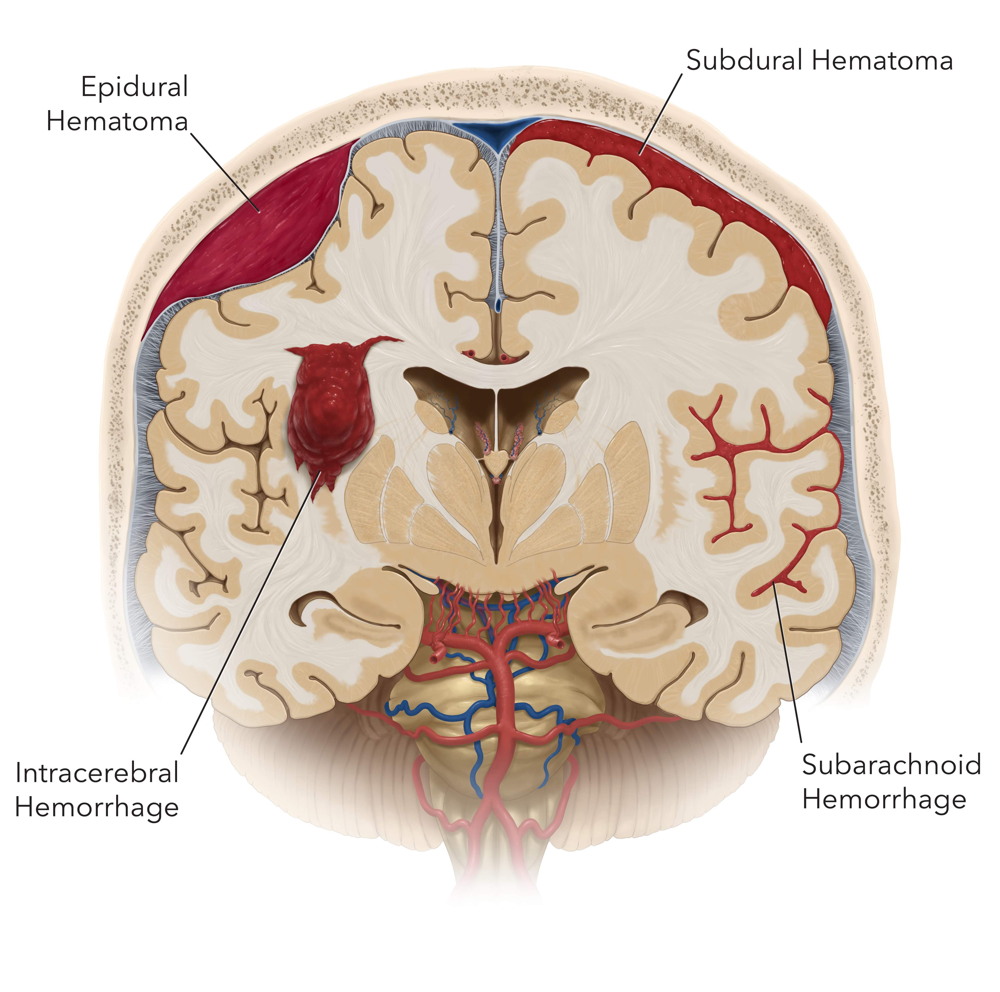

= 继承之战 S01 -02
:toc: left
:toclevels: 3
:sectnums:
:stylesheet: ../../../../myAdocCss.css

'''

== 释义

Rava. Hey.
[.my2]
拉瓦。嘿。

Uh, my dad's...
[.my2]
呃，我爸爸...

My dad's in the hospital.
[.my2]
我爸爸住院了。

Yeah, he had, I don't know,
[.my2]
是的，他得了病，我不知道，

I don't know what.
[.my2]
我不知道是什么病。

But, uh...
[.my2]
但是，呃...

yeah, I don't know /#if he's gonna be OK.#
[.my2]
是的，我不知道他能不能挺过去。

It's... Yeah.
[.my2]
就是... 唉。

So... I don't know. I'm here with Jess.
[.my2]
所以... 我不知道。我和杰斯在这里。

We're just trying to get there...
[.my2]
我们只是想赶到那里...

What the...?
[.my2]
搞什么...？

Can we just find a way /around the traffic 交通拥堵, man?
[.my2]
老兄，我们能想办法绕过这拥堵的交通吗？

Just... Just... Just figure it out 想出办法解决. Please!
[.my2]
就... 就... 就想办法解决。拜托了！

Where's the ICU 重症监护室?
[.my2]
重症监护室在哪里？

...blood pressure 血压...
[.my2]
...血压...

...tests 检查(化验)...
[.my2]
...检查...

What's the situation 情况? Can somebody...
[.my2]
情况怎么样？有没有人能...

Excuse me.
[.my2]
打扰一下。

They're working on him.
[.my2]
他们正在抢救他。

What is this part of the hospital?
[.my2]
这是医院的哪个部门？

I mean, is this the best section 部门?
[.my2]
我的意思是，这是最好的部门吗？

Excuse me? Doctor,
[.my2]
不好意思？医生，

is this the best part of the hospital?
[.my2]
这是医院最好的部分吗？

Sorry. You know, we just --we need to know.
[.my2]
抱歉。你知道，我们只是——我们需要知道。

The ICU is the ICU. This is the best place for him.
[.my2]
ICU就是ICU。这是对他最好的地方。

#Is this _where you would take your father_?#
[.my2]
#如果是你父亲，你会带他来这儿吗？#

I'm sorry. #Can the team have some space 空间? Please?#
[.my2]
抱歉。##能让医疗团队有点(自主决定的)空间吗？##拜托了？

Hey, here's an idea 主意. Why don't you worry about the medicine 药物;医术, not the fucking feng shui 风水?
[.my2]
嘿，我有个主意。你干嘛不操心医术，而不是他妈的风水？

#Let's let the gentleman do his job# 工作.
[.my2]
我们让这位先生做他的工作吧。

Thank you.
[.my2]
谢谢。

Let's do this for Dad. -Thank you.

[.my2]
我们为爸爸这么做吧(为了爸安静点)。 -谢谢。

Sorry.
[.my2]
对不起。

Do they know _who we are_?
[.my2]
他们知道我们是谁吗？

-I don't know. -Are they sandbagging  用沙袋封堵；用沙袋打；粗暴对待，胁迫;敷衍 us?

[.my2]
-我不知道。 -他们是在故意敷衍我们吗？

[.my1]
.案例
sandbagging 在这里是俚语用法，原意是“用沙袋阻挡”，引申为“故意示弱”、“隐藏实力”或“拖延、敷衍”。剧中角色怀疑医院人员因为不知道他们的身份, 而没有给予应有的重视或最好的治疗。

-Do they know who he is? -I don't know.

[.my2]
-他们知道他是谁吗？ -我不知道。

-Shall we call Mom? -What?

[.my2]
-要打电话给妈妈吗？ -什么？

No. There's like a million people to call.
[.my2]
不。好像有无数的人要通知。

She's probably just *make a big deal* of sth 对…小题大做 about herself, anyway.
[.my2]
反正她很可能只会借题发挥，搞得像是她自己的事一样。

Come on. Your mom's a maniac 疯子, she's not a monster 魔鬼.
[.my2]
得了吧。你妈妈是个疯子，但她不是魔鬼。

Folks, we need you to wait through there, please.
[.my2]
各位，需要请你们到那边去等。

Hi. I'm sorry.
[.my2]
嗨。抱歉。

We're getting mixed messages 混乱的信息 here.
[.my2]
我们得到的信息很混乱。

We have no clue 线索 what's going on.
[.my2]
我们完全不知道发生了什么。

We will be with you
[.my2]
一旦我们有评估结果，

as soon as we have an assessment 评估.
[.my2]
会立刻通知你们。

OK, well, that's not good enough 不够好.
[.my2]
好吧，这不够好。

We need to know what's happening. Now.
[.my2]
我们需要知道发生了什么。现在就要。

The _socio-economic 社会经济的 health_ of _multiple 多个的 continents_ 大洲
[.my2]
多个大洲的社会经济健康

is dependent on 依赖于 his well-being 健康.
[.my2]
都依赖于他的健康。

The socio-economic health of multiple continents?
[.my2]
多个大洲的社会经济健康？

Kendall. Everyone.
[.my2]
肯德尔。各位。

*We have an area* we can go to.
[.my2]
我们有个区域可以去。

They'll keep us posted 及时告知.
[.my2]
他们会及时通知我们最新情况。

So, look, take me through 详细说明,带我穿过 what happened exactly.
[.my2]
那么，你看，详细告诉我到底发生了什么。

Uh, I don't know, exactly.
[.my2]
呃，我不太确定，具体地。

It was weird 诡异的. Um, it happened fast 快速地,
[.my2]
很诡异。呃，发生得很快，

-we were just sitting there... -We were just talking.

[.my2]
-我们当时就坐在那儿... -我们当时就在聊天。

We were talking, Shiv kind of started (v.) hard-balling (把……捏成团；攥紧（拳头）) 强硬对待 Dad a little bit. -I wasn't hard-balling him.
[.my2]
我们当时在聊天，希芙有点开始对爸爸态度有点强硬。 -我没有对他强硬。

A brain hemorrhage (出血) 脑出血 doesn't come from some chit-chat 闲聊, asshole 混蛋.
[.my2]
脑出血可不是闲聊引起的，混蛋。

So it's definitely a brain hemorrhage 脑出血? Is that what they said?
[.my2]
所以肯定是脑出血了？他们是这么说的吗？

Somebody said that, right?
[.my2]
有人这么说了，对吧？

-Somebody said hemorrhage 出血? -Or stroke 中风? I...

[.my2]
-有人说了出血？ -还是中风？我...

-The ambulance 救护车... -A stroke is a hemorrhage.

[.my2]
-救护车... -中风就是(脑)出血。

-It is? -Yes.

[.my2]
-是吗？ -是的。

Did someone say "Hemorrhage,"
[.my2]
有人说了"出血"吗，

or is it just us /who said it?
[.my2]
还是只是我们自己在说？

It could be an aneurism 动脉瘤.
[.my2]
也可能是动脉瘤。

Why aren't we chasing 追查 this?
[.my2]
我们为什么不追查这个？

I'll chase.
[.my2]
我去追查。

Hey, uh, is there any...
[.my2]
嘿，呃，有没有...

Did Dad ever talk to any of you guys about cryogenics 低温学,人体冷冻法?
[.my2]
爸爸有没有跟你们任何人说过人体冷冻的事？

[.my1]
.案例
====
cryogenic
-> 来自cryo-,冷，冷冻，词源同crystal.-gen,产生，词源同generate.
====

You're insane (a.)疯了;疯癫的，精神失常的；蠢极的，荒唐的.
[.my2]
你疯了。

Look, I don't want to be given the runaround (n.)回避；推诿；搪塞;敷衍
[.my2]
听着，我不想被那个他妈的三流医学院毕业的医生敷衍。

by Doctor-fucking-SUNY Purchase Medical School here.
[.my2]

[.my1]
.案例
====
.Doctor-fucking-SUNY Purchase Medical School
这是一个即兴创造的复合形容词，其结构是 ##名词 + fucking + 机构名称。##这里的 fucking是一个语气极强的粗俗俚语 他妈的.

SUNY 是纽约州立大学系统的缩写。Purchase College 是该系统下的一所文理学院，​​它并没有医学院​​。说话人故意将一个不存在的、或者说知名度不高的学校的名字, 和“医学院”扯在一起。

说话人的目的不是要准确说出对方毕业的院校，而是通过​​张冠李戴​​的方式来侮辱对方。其潜台词是： +
“你毕业的学校根本不上档次，甚至可能都不存在医学院，你的教育背景很差劲。” +
“你只是个从某个我听都没听过的烂学校毕业的庸医。” +
用 fucking来加强这种鄙夷的语气。 +
====

We need to know who the top players 顶尖人物 are, OK?
[.my2]
我们需要知道谁是顶尖的专家，懂吗？

Who's the _top dog_ 头号人物,权威人物 in this hospital?
[.my2]
这家医院谁说了算？

Have you talked to Dad's neurologist 神经科医生?
[.my2]
你跟爸爸的神经科医生谈过了吗？

Kendall, stop acting like the king of the hospital.
[.my2]
肯德尔，别表现得像是医院之王。

We're all trying to do our best 尽力, so just fuck off 滚开.
[.my2]
我们都在尽力，所以你他妈滚开。

I'm on it 正在处理. OK?
[.my2]
我来处理。行了吧？

According to this, it sounds like a stroke,
[.my2]
根据这个，听起来像是中风，

but it could be an acute 急性的 _subdural 硬膜下的 hematoma_ 血肿.
[.my2]
但也可能是急性硬膜下血肿。

[.my1]
.案例
====
.subdural

====

Great. Get in there and operate 做手术, Doctor Google.
[.my2]
太好了。那就进去做手术啊，谷歌医生。

He once *talked* to me *about* cryogenics 低温学.
[.my2]
他有一次跟我谈过人体冷冻。

What? Wouldn't that just be typical 典型的?
[.my2]
什么？这不正是他一贯的作风吗？

All the other billionaires 亿万富翁 are strolling 散步；闲逛 around 闲逛 in new bodies,
[.my2]
所有其他亿万富翁,都用新身体到处溜达了，

but not Dad, because we were too embarrassed 尴尬的 to actually discuss 讨论 it.
[.my2]
但爸爸没有，因为我们太尴尬了，都没真正讨论过这个。

He didn't talk to you about cryogenics.
[.my2]
他不是跟你谈人体冷冻。

You talked to him about cryogenics
[.my2]
是你跟他谈人体冷冻

because *you're obsessed (a.)（对……）着迷的，（受……）困扰的 with* 痴迷于 cryogenics.
[.my2]
因为你痴迷于人体冷冻。

-I'm not really, Kendall. -And what he didn't tell you,

[.my2]
-我并没有，肯德尔。 -而他没告诉你的是，

and what I'm telling you now,
[.my2]
也是我现在要告诉你的，

is that /you are an idiot 白痴.
[.my2]
就是你是个白痴。

Sticks and stones 棍棒和石头, Kenny.
[.my2]
棍棒石头而已，伤不了我，肯尼。

[.my1]
.案例
====
Sticks and stones 是谚语 _Sticks and stones_ may break (v.) my bones, but words will never hurt me 的缩略形式，意思是“棍棒石头可以伤我筋骨，但言语伤不了我”，表示对辱骂或批评的不屑一顾。
====

Yeah, I know.
[.my2]
是啊，我知道。

And on his birthday, too? It's so shitty 糟糕的; 较差的；劣等的.
[.my2]
而且还在他生日这天？太糟了。

So what's happening now?
[.my2]
那现在是什么情况？

Are you staying at the hospital?
[.my2]
你要留在医院吗？

I guess.
[.my2]
我想是吧。

I mean, I think I've got a job,
[.my2]
我的意思是，我觉得我得到了一份工作，

but I don't know.
[.my2]
但我不确定。

Logan said I did,
[.my2]
罗根是这么说了，

but Marcia was the only one to hear it,
[.my2]
但只有玛西娅听到了，

so... and then he tragically 不幸地,
[.my2]
所以...然后他就悲剧性地，

you know, like, whatever 诸如此类.
[.my2]
你知道，就像，诸如此类。

Well, what sort of job? Is it a good job?
[.my2]
哦，什么样的工作？是好工作吗？

I don't know. Like, could be anything.
[.my2]
我不知道。就像，什么都有可能。

And I have, like, 20 bucks 美元 left.
[.my2]
而且我好像只剩20块钱了。

The world is so fucked up 糟透了.
[.my2]
这世界真他妈糟透了。

I am not sending you any more money, Greg.
[.my2]
我不会再给你寄钱了，格雷格。

Step up (站出来，挺身而出) 承担责任.
[.my2]
自己担起责任来。

I'm not asking you to send me...
[.my2]
我不是在要求你寄给我...

Look,
[.my2]
听着，

just make sure 确保 about the job.
[.my2]
先把工作的事确定好。

-All right? -Yeah, I know.

[.my2]
-行吗？ -是的，我知道。

Hey, do you have cash 现金?
[.my2]
嘿，你有现金吗？

Yeah. Uh...
[.my2]
有。呃...

no, just my last twenty.
[.my2]
不，就只剩最后二十了。

That's fine. Thanks.
[.my2]
没关系。谢谢。

I just *got mugged (v.)抢劫;（公开）行凶抢劫，打劫 by* Shiv.
[.my2]
我刚被希芙打劫了。

Born (v.) in _humble 卑微的 circumstances_ 环境 in Dundee, Scotland,
[.my2]
洛根·罗伊出生于苏格兰邓迪的卑微环境，

shortly before the outbreak 爆发 of the Second World War,
[.my2]
就在第二次世界大战爆发前不久，

Logan Roy grew up in poverty 贫困,
[.my2]
他在贫困中长大，

but died one of the richest
[.my2]
但去世时已成为美国最富有、

and most powerful 有权势的 men in America.
[.my2]
最具权势的人物之一。

His _widowed 寡居的 mother_ *took the decision*...
[.my2]
他寡居的母亲做出了决定...

It's an ATN obituary 讣(fù)告.
[.my2]
这是ATN的讣告。

[.my1]
.案例
====
.obituary
-> ob-,向前，-it,走，词源同 exit,itinerary.委婉语，即向前走了。引申词义讣告，讣闻。
====

They want us to OK it /*in case* they have to run it 发布.
[.my2]
他们想让我们批准，以备需要发布。

Is it nice?
[.my2]
写得好吗？

I mean, it's made by his own news division 部门.
[.my2]
我的意思是，这是他自己的新闻部门制作的。

Doesn't say he was a prick 混蛋;鸡巴；屌;扎；穿刺.
[.my2]
没说他是个混蛋。

[.my1]
.案例
====
.prick
( tabooslang) an offensive word for a stupid or unpleasant man 鸟人；笨蛋
====

You want to watch it?
[.my2]
你想看吗？

No.
[.my2]
不。

I would really love to see you.
[.my2]
我真的很想见你。

Yes, it's appropriate 合适的. It could hardly be more appropriate.
[.my2]
是的，很合适。再合适不过了。

Ok?
[.my2]
好吗？

Yeah, OK. OK, good.
[.my2]
是的，好的。好的，很好。

-Hey, Jess? -Mm-hmm?

[.my2]
-嘿，杰斯？ -嗯？

There's nothing _in here_ about our mom.
[.my2]
这里面一点没提我们的妈妈。

Or Connor's. They need to be included.
[.my2]
也没提康纳的妈妈。她们需要被写进去。

Yeah.
[.my2]
是的。

PJ says /_Aziz Kahn at Mayo Clinic_ 诊所，门诊部 is the best there is.
[.my2]
PJ说, 梅奥诊所的阿齐兹·卡恩是最棒的。

Sarah says /_Ann Wieman_ at NYU.
[.my2]
萨拉说纽约大学的安·威曼。

Ann Wieman? Is that... That's not who I have.
[.my2]
安·威曼？是不是... 我得到的名字不是这个。

Well, it's the name I have.
[.my2]
呃，但我得到的是这个名字。

Can you tell Sarah /to give her a call?
[.my2]
你能让萨拉给她打个电话吗？

-Sure. -Hey, Rome.

[.my2]
-当然。 -嘿，罗姆。

-Do you have regular? -No, I've got...

[.my2]
-你有普通咖啡吗？-不，我有...

Now I'm strapped (a.)缺钱的，手头拮据的;身无分文的;用带子系（或捆、扎、扣）好. Was there any change at all?
[.my2]
现在我真没钱了。刚才有零钱剩下吗？

-Hey, you guys. -What?

[.my2]
-嘿，你们几个。 -什么？

Could I have the change 零钱?
[.my2]
能把零钱给我吗？

What is this? Already? People are sending shit 垃圾邮件,屎 already?
[.my2]
这是什么？已经？人们已经开始发垃圾邮件了？

It's from _Lawrence Yee_ at Vaulter.
[.my2]
是Vaulter的劳伦斯·伊发来的。

Call him /and tell him /that is not fucking appreciated (v.)不被欣赏的.
[.my2]
打电话给他，告诉他这他妈一点都不让人感激。

Mm-hmm.
[.my2]
嗯。

-Kendall, I'm so sorry. -Thank you, Gerri.

[.my2]
-肯德尔，我很难过。 -谢谢，格里。

Can you give me five 给我五分钟?
[.my2]
能给我五分钟吗？

We need to talk.
[.my2]
我们需要谈谈。

Over here, OK?
[.my2]
这边，好吗？

Obviously _the nominating committee_ 提名委员会, the board 董事会,
[.my2]
显然，提名委员会和董事会

has a plan /in the event of 在…情况下 Logan's incapacitation 丧失能力.
[.my2]
对罗根丧失工作能力的情况有预案。

Sorry, do I need to hear this /right now?
[.my2]
抱歉，我现在需要听这个吗？

You do.
[.my2]
你需要。

In the event that we, uh, continue on our trajectory 轨迹;(物体射向或抛向空中形成的）轨道；（事业等的）发展轨迹，起落 of his current consciousness 意识,
[.my2]
如果我们，呃，继续沿着他目前意识状态的轨迹发展，

[.my1]
.案例
====
.trajectory
-> tra-横过,越过 + -ject-投,射 + -ory
====

we're gonna need to announce a plan
[.my2]
我们将需要在六点半左右，股市开盘前，宣布一项计划，

by around 6:30, before the markets open,
[.my2]

in order to avoid a lot of funky 恶臭的,时髦独特的 chowder （美）杂脍；海鲜杂烩浓汤.
[.my2]
以避免一大堆麻烦。

[.my1]
.案例
====
.chowder
[ U]a thick soup made with fish and vegetables 杂烩羹汤（用鱼加蔬菜烹制） +
-> 原指一种法国的大锅，来自cauldron，词源同calorie, 卡路里。

"funky chowder" 是一个非常不正式、近乎胡言乱语的表达。说话人可能想用一个比喻来表示“混乱的局面”或“烂摊子”，但混合了“funky”（奇怪的、糟糕的）和“chowder”（海鲜杂烩汤）这两个不相关的词，产生了一种怪异甚至可笑的效果，反映了说话人试图用商业术语安抚对方，但本身也可能很紧张或词不达意。
====

Did you say funky chowder?
[.my2]
你刚才说的是“麻烦的杂烩”吗？

We've set up 安排 down here.
[.my2]
我们在楼下安排好了。

What have you set up?
[.my2]
你们安排了什么？

You're gonna want a place to just be,
[.my2]
你会需要一个地方待着，

and chill （使）冷却,放松, you know?
[.my2]
放松一下，懂吗？

We talked to some of the trustees  [法]受托人，受托者;理事 of the hospital,
[.my2]
我们和医院的一些理事谈过了，

[.my1]
.案例
====
.trustee
1.a person or an organization /that has control of money or property /that has been put into a trust for sb （财产的）受托人 +
2.a member of a group of people /that controls the financial affairs of a charity or other organization （慈善事业或其他机构的）受托人
====

so everybody knows _who's who_ 重要人物.
[.my2]
所以大家都知道谁是谁了。

Yeah. It's not a war room 作战室 yet, but, um...
[.my2]
是的。现在还不是作战室，但是，嗯...

But if we need one, it's available 可用的.
[.my2]
但如果我们需要，这里就可以用。

Jesus.
[.my2]
天啊。

Uh, so there's a bathroom through there...
[.my2]
呃，所以洗手间在那边...

-Hi, Karolina... -Hi.

[.my2]
-嗨，卡洛琳娜... -嗨。

Thank you, guys.
[.my2]
谢谢你们。

So I have Dewi and Asha from the _nominating committee_ /on the line 在电话线上.
[.my2]
提名委员会的德维和阿莎在线。

Kendall's here, and you're on speaker (扬声器；喇叭)免提, guys.
[.my2]
肯德尔在这里，你们现在在免提上。

So sorry to hear about the news.
[.my2]
听到这个消息非常难过。

Likewise 同样地;（表示感觉相同）我也是，我有同感.
[.my2]
彼此彼此。

As you know, our _standing plan_ 既定计划,常备计划 in the event of Logan's...
[.my2]
如你所知，我们对罗根…的既定计划是

[.my1]
.案例
====
.standing plan
常备计划：一种预先制定的计划，用于应对可能出现的特定情况或问题。
====

absence 缺席, is to separate 分离 his CEO and Chairman roles.
[.my2]
将他的首席执行官和董事长职位分开。

You'll become _acting (a.)代理的；表演的 CEO_,
[.my2]
你将担任代理首席执行官，

Frank *stays on* as 继续担任 COO 首席运营官.
[.my2]
弗兰克继续担任首席运营官。

We'll need to act fast. Stabilize (v.)稳定 the stock price 股价.
[.my2]
我们需要迅速行动。稳定股价。

Dewi? Dewi?
[.my2]
德维？德维？

I'm sorry...
[.my2]
抱歉...

my dad is my focus 焦点 right now, OK?
[.my2]
我爸爸现在是我的焦点，好吗？

Of course, it's just that /there's a problem
[.my2]
当然，只是有个问题

in terms of 就……而言 the optics 观感,光学 /if `主` what happened earlier today _between you two_ `谓` gets out 泄露，走漏;使离开，逃脱.
[.my2]
关于今天早些时候你们之间发生的事如果传出去，观感上会不好。

I'm sorry, I don't know /what you're talking about.
[.my2]
抱歉，我不知道你在说什么。

Sure. Well...
[.my2]
当然。嗯...

And then /there's the problem with Frank.
[.my2]
然后还有弗兰克的问题。

-As in? -Logan fired 解雇 him

[.my2]
-比如？ -罗根解雇了他

and promoted 提拔 Roman.
[.my2]
并提拔了罗曼。

[.my1]
.案例
====
.As in?
这里的 *“As in?”* 是一个口语中非常常见的表达，**用于请求对方澄清或具体说明。**它完整的意味是 “你指的是哪个（弗兰克）？” 或者 “你具体在说什么（关于弗兰克的事）？” +

它可以理解为以下几种说法的简略形式： +
​​As in what?​​ （具体指什么？） +
​​As in who?​​ （具体指谁？） +
​​You mean…?​​ （你的意思是…？） +
​​Could you be more specific?​​ （你能说得更具体点吗？） +

*“As in?” 在这里是一个​​口语中用于要求对方澄清​​的惯用语。
当对方提到一个名字、一个概念或一个情况，但语境不够明确时，听者会用 “As in?” 来反问，意思是“你具体指的是什么？”或“你能详细说明一下吗？”*

在这个场景里，第一个说话人只说了“弗兰克的问题”，信息不完整。第二个人的“As in?” 就是在追问：“你指的是关于弗兰克的哪个问题？” +
对方接下来的回答 “Logan fired him...” 才具体说明了是“被解雇”的这个问题。
====

Roman?
[.my2]
罗曼？

Jesus.
[.my2]
天啊。

Look, I'm sorry, I...
[.my2]
听着，抱歉，我...

I can't *get into* this 涉及，参与;深入谈论 right now, guys.
[.my2]
我现在没法深入谈这个，各位。

No, of course.
[.my2]
不，当然。

You are _in no fit state_ 状态不佳.
[.my2]
你现在状态不好。

But *here's my take* 看法，态度, OK?
[.my2]
但我的看法是这样的，好吗？

My dad *got sick* today, right?
[.my2]
我爸爸今天病了，对吧？

I don't know, I mean, nobody knows
[.my2]
我不知道，我是说，没人知道

when he started *acting out of character* 行为反常,
[.my2]
他什么时候开始行为反常的，

but, like, he didn't seem great /from the morning on,
[.my2]
但是，好像他从早上开始状态就不太好，

and there's no paper 文件记录 on _any of the moves 行动 后定说明 made today_.
[.my2]
而且今天的任何行动, 都没有文件记录。

-Right, Gerri? -Uh...

[.my2]
-对吧，格里？ -呃...

nothing meaningful 有意义的.
[.my2]
没什么有实质意义的记录。

Yeah, it was words (话语；言语) 空话.
[.my2]
是的，只是空话。

Words are just, what?
[.my2]
空话只是，什么？

Nothing.
[.my2]
什么都不是。

Complicated 复杂的 air flow 气流.
[.my2]
复杂的气流罢了。（意指空谈）

So, I mean, if I was saying /what actually happened today,
[.my2]
所以，我的意思是，如果我说今天实际发生了什么，

it would be nothing.
[.my2]
那就是什么都没发生。

Well, that certainly
[.my2]
嗯，那这当然

makes things simpler /from our point of view 从我们的观点来看.
[.my2]
从我们的角度来看, 让事情简单多了。

Do you think /you can get the family behind it 支持?
[.my2]
你觉得你能让家人支持这个说法吗？

Yes.
[.my2]
能。

And Frank?
[.my2]
那弗兰克呢？

Sure.
[.my2]
当然。

Dude 老兄, can't we just talk here?
[.my2]
哥们，我们不能就在这儿谈吗？

You know /Connor's invited Willa down?
[.my2]
你知道康纳把薇拉请来了吗？

What?! Here?!
[.my2]
什么？！来这里？！

_What's the deal_ 这是什么情况,怎么回事 with 关于…的情况 their deal 关系?
[.my2]
他俩现在是什么关系？

Unlike me, he has no sense of 他没有……的感觉 boundaries 界限感.
[.my2]
不像我，他毫无界限感。

What the fuck?
[.my2]
搞什么鬼？

It's stale （食物）不新鲜的，变味的；气味不清新的，难闻的, but it's empty, I think.
[.my2]
不新鲜了，但我想是空的。

-Hello? -You wanna *do a play* 演戏,上演一出戏剧?

[.my2]
-喂？ -你想演一出吗？

No, I, um, just wanted to...
[.my2]
不，我，嗯，只是想...

I've been thinking that /maybe this might be
[.my2]
我一直在想，也许这对玛西娅来说

really tough  对…艰难 on Marcia.
[.my2]
会非常难熬。

Yeah, you're thinkin' (=thinking) that?
[.my2]
是吗，你这么想？

[.my1]
.案例
====
.Thinkin'
“Thinkin'” 可以指 “thinking”的俚语拼写
====

What, will she *put* all her inheritance 遗产 *into* gold or oil?
[.my2]
怎么，她会把所有的遗产都换成黄金或石油吗？

No, I just... No, I...
[.my2]
不，我只是…不，我…

Look, I know that, like, the trust 信托 only *comes into play* 开始运作,开始活动；开始起作用
[.my2]
听着，我知道，那个信托只有在特定事情发生时才会生效，

if certain things happen...
[.my2]

Yeah, he's dead, or brain dead 脑死亡.
[.my2]
对，他死了，或者脑死亡了。

Yeah, but I was thinkin', like...
[.my2]
是的，但我在想，比如…

wouldn't it be nice /for Dad to wake up 醒来
[.my2]
如果爸爸醒过来，发现我们都按照他希望的签了字，

and for all of us to have signed,
[.my2]

like he wanted?
[.my2]
那不是很好吗？

You know, like a _nice gesture_ (姿态)?  友好的姿态(表示友好、善意或尊重的行为或举动。)
[.my2]
你知道，像个善意的姿态？

And if he doesn't wake up,
[.my2]
而如果他没有醒来，

we've basically signed over 签字转让 to Marcia
[.my2]
我们基本上就等于签字 把选择新爸爸的权力

the power to choose the new Dad.
[.my2]
交给了玛西娅。

So... OK. So, for the record 为记录在案,
[.my2]
所以…好吧。那么，为记录在案，

you are declining 拒绝,谢绝 to sign /on the change of trust?
[.my2]
你拒绝签署信托变更文件？

-For the record? -Yeah.

[.my2]
-为记录在案？ -是的。

What the fuck is this, McCarthyism 麦卡锡主义?
[.my2]
这他妈是什么，麦卡锡主义吗？

[.my1]
.案例
====
McCarthyism 指20世纪50年代美国参议员约瑟夫·麦卡锡煽起的反共迫害浪潮，其特征是公开调查、不公正指控、胁迫人们表态或检举他人。说话人用这个词，是抗议对方用“为记录在案”这种正式、带有审讯和定性意味的方式提问，感觉像是在被迫表明政治立场一样，非常反感和抵触。
====

I'm not declining, I'm just not...
[.my2]
我不是拒绝，我只是不…

I'm not "Clining." What the f...
[.my2]
我不是“拒决”。这他妈的…

[.my1]
.案例
====
.Clining
这里的 ​​"Clining"​​ 不是一个标准英语单词。它是一个说话人临时生造的、基于前面单词 ​​"declining"​​ 的文字游戏。

​​结构分析​​： +
单词 "declining" 可以拆解为 "de-" + "clining"。 +
"de-" 是一个常见的前缀，表示“否定”、“相反”或“移除”。 +

*说话人生造了 "Clining" 这个词，来表示 "declining" 这个动作的“相反面”或“积极面”。* +

​​语境意图​​： +
*说话人说“我不是在拒绝”，但他也不想做出明确的、积极的“接受”。他处于一种犹豫、观望、不置可否的状态。他需要创造一个词来形容这种“既不拒绝，也不接受”的中间状态。* +

​​"Clining" 的意味​​：*既然 "declining" 是“拒绝”，那么去掉表示否定的前缀 "de-"，剩下的 "Clining" 就被临时赋予了一种模糊的“倾向於接受”、“准备接受”或“正在靠近接受”的意味。* +

所以，整句话的意思是： +
“我不是在拒绝，我只是没有… *我没有在‘准备接受’。” 或者说 “…我没有处于那种‘积极倾向’的状态。”* +
这是一种非常巧妙、口语化的方式，来表达一种极其暧昧、犹豫不决的立场。 +

**我不是在拒绝，我只是没有… 我没有在“准备答应”。**这他妈… +
====

OK. No. OK, just, you know,
[.my2]
好吧。不。好吧，只是，你知道，

`主` that `谓` just seems very shitty (a.)差劲的;较差的；劣等的 /under the circumstances 在这种情况下.
[.my2]
在这种情况下, 这显得非常差劲。

What circumstances?
[.my2]
什么情况？

Well, you did *make* her husband's brain *explode* 爆炸.
[.my2]
嗯，你确实让她丈夫的脑袋爆炸了。

Fuck you, man!
[.my2]
去你妈的！

Wait...
[.my2]
等等…

-Stop it! -You shit 混蛋!

[.my2]
-住手！ -你这混蛋！

What, are you fuckin' insane 疯了的?
[.my2]
什么，你他妈疯了吗？

No! No!
[.my2]
不！不！

He...
[.my2]
他…

He doesn't deserve 值得，应得 this.
[.my2]
他不该遭受这些。

It's just so unfair 不公平的.
[.my2]
这太不公平了。

He's a great... man.
[.my2]
他是个伟大的…男人。

He, like, let me come to his birthday lunch.
[.my2]
他，嗯，让我参加他的生日午餐了。

And he offered me a job.
[.my2]
他还给了我一份工作。

Right?
[.my2]
对吧？

He doesn't deserve this.
[.my2]
他不该遭受这些。

And... so, if there's anything _that I can do_,
[.my2]
而且…所以，如果有什么我能做的，

let me know.
[.my2]
告诉我。

Actually, there is something.
[.my2]
实际上，有件事。

-OK. -Can you go to the apartment

[.my2]
-好的。 -你能去公寓

and get his bed things 床上用品 and slippers 拖鞋?
[.my2]
拿他的寝具和拖鞋吗？

The ones _with the dark checks_ 方格图案.
[.my2]
那双深色格子的。

You don't mind?
[.my2]
你不介意吧？

No, no. I'd be...
[.my2]
不，不。我会…

respectfully 恭敬地, uh, somberly 肃穆地;忧郁地；严峻地;阴沉地；光线昏暗地 willing 愿意的.
[.my2]
恭敬地，呃，肃穆地愿意。

Thank you.
[.my2]
谢谢。

-Now? -Please.

[.my2]
-现在？ -麻烦你了。

OK. All right.
[.my2]
好的。好吧。

Marcia, we can get Colin or the driver /to go and get his things.
[.my2]
玛西娅，我们可以让科林或司机, 去拿他的东西。

I don't need this fly 苍蝇 buzzing 嗡嗡叫 in my face.
[.my2]
我不需要这只苍蝇在我脸上嗡嗡叫。

Slippers, slippers, slippers, slippers, slippers.
[.my2]
拖鞋，拖鞋，拖鞋，拖鞋，拖鞋。

Yeah, don't *fuck it up* 搞砸.
[.my2]
嗯，别搞砸了。

Fuckin' _long legs_. Greg! Hey, I need a favor 帮忙 from you.
[.my2]
腿真他妈长。格雷格！嘿，我需要你帮个忙。

What's up?
[.my2]
什么事？

Dad had some papers _he wanted us to sign_,
[.my2]
爸爸有些想让我们签的文件，

and they're in some envelopes 信封,
[.my2]
放在一些信封里，

just *pick 'em up* at the house, and bring 'em.
[.my2]
去家里拿一下，带过来。

Yeah. Where are the papers?
[.my2]
好的。文件在哪儿？

They're in the house somewhere.
[.my2]
就在房子里的某个地方。

In envelopes --They're just in the house!
[.my2]
在信封里——就在房子里！

-You got it? -OK. I was imagining...

[.my2]
-明白了吗？ -好的。我在想…

Oh, you're fucking tall. This is hurting (v.) my goddamn (a.)该死的；讨厌的；受诅咒的 neck.
[.my2]
哦，你他妈真高。这弄得我脖子疼。

I have to go. OK? Just find the papers,
[.my2]
我得走了。行吗？去找文件，

and bring 'em (=them 的缩略形式) back.
[.my2]
然后带回来。

Papers, and... and... they're gonna be just...
[.my2]
文件，然后…然后…它们就在…

*I am so done 受够了 with* this conversation.
[.my2]
我受够这对话了。

-Just handle it 处理, OK? -All right. Yeah.

[.my2]
-处理好就行，好吗？ -好的。是的。

Better not *fuck this one up*.
[.my2]
这次最好别搞砸了。

I don't want Logan Roy's newspapers 报纸
[.my2]
我可不想让罗根·罗伊的报纸

*goin' (=going) through* 仔细检查 my trash cans 垃圾桶.
[.my2]
翻我的垃圾桶。

-Oh, my God! We've killed... -Logan.

[.my2]
-哦，天哪！我们害死了… -罗根。

We're bastards 混蛋!
[.my2]
我们是混蛋！

Turn that off 关掉.
[.my2]
关掉它。

Roman, no. Turn it off.
[.my2]
罗曼，不。关掉它。

-We've killed... -Logan.

[.my2]
-我们害死了… -罗根。

We're...
[.my2]
我们是…

What are they saying?
[.my2]
他们都在说什么？

Just rumors 谣言, you know.
[.my2]
只是谣言，你知道。

He was taken to the hospital,
[.my2]
说他被送进医院了，

some of Twitter says /he's dead,
[.my2]
有些推特上说他已经死了，

and also a good deal of 大量的, um,
[.my2]
还有大量的，嗯，

of rejoicing 欢庆 /at our father's potential demise 死亡.
[.my2]
对我们父亲可能去世, 表示欢庆。

Can we find out /*who* these fuckers （冒犯语）笨蛋，浑蛋;讨厌的人 *are*
[.my2]
我们能查出这些混蛋是谁吗？

and, like... report (v.) 举报；告发 them 举报他们?
[.my2]
然后…举报他们？

Or just, like, *screen grab* 截屏 their shit 垃圾言论.
[.my2]
或者就直接，把他们那些垃圾言论截屏。

-OK. -So we know? Yeah?

[.my2]
-好的。 -这样我们就知道了？是吧？

So, I don't know where Kendall is, but...
[.my2]
所以，我不知道肯德尔在哪儿，但是…

Hi. Really sorry, you guys.
[.my2]
嗨。真的很抱歉，各位。

Thanks, Willa.
[.my2]
谢谢，薇拉。

Why don't we *sit over here*.
[.my2]
我们坐这边吧。

Oh, there's Ken.
[.my2]
哦，肯在那儿。

It's gross 恶心的;令人不快的；令人恶心的；使人厌恶的.
[.my2]
真恶心。

News is out 消息传出去了.
[.my2]
消息泄露出去了。

OK, right. Well...
[.my2]
好吧，对。嗯…

So, um, listen.
[.my2]
所以，嗯，听着。

I don't even want to think about this,
[.my2]
我甚至不愿想这个，

but I just spoke to the nominating committee 提名委员会,
[.my2]
但我刚和提名委员会谈过，

and, uh...
[.my2]
而且，呃…

the thing is that /the plan is to announce that /I *take over* 接管,接替 from Dad.
[.my2]
问题是，计划是宣布, 我接替爸爸。

-Well, no. -Excuse me?

[.my2]
-呃，不行。 -你说什么？

-What do you mean? -I mean,

[.my2]
-你什么意思？ -我的意思是，

we're waiting for the results of the scan 扫描结果.
[.my2]
我们在等扫描结果。

It's a pointless 无意义的 conversation.
[.my2]
现在谈这个毫无意义。

OK, well, let's talk about it.
[.my2]
好吧，那我们谈谈这个。

I can't talk about it. I'm upset 心烦意乱.
[.my2]
我不能谈这个。我心烦意乱。

Hey! I'm upset too.
[.my2]
嘿！我也心烦！

Oh, not *too* upset *to* go and *fucking plot (v.)密谋 with* the suits 西装革履的人，指高管.
[.my2]
哦，还没心烦到不能去他妈的和那些西装革履的家伙密谋啊

Fuck you! OK?

[.my2]
去你妈的！行了吧？

I could hardly hear them /for the blood *rushing in my ears* 血液涌上头顶.
[.my2]
我当时气得血往头上涌，几乎听不见他们说什么。

_Isn't there a plan_ anyways 不管怎样，无论如何? Like...
[.my2]
不是本来就有计划吗？比如…

Yes, there's a plan.
[.my2]
是的，是有计划。

That's what I'm fucking telling you.
[.my2]
这就是我他妈在告诉你的。

The plan is that /Frank and I will take over...
[.my2]
计划是弗兰克和我将接管…

-Frank was fired 被解雇了. So.. -Yeah.

[.my2]
-弗兰克被解雇了。所以.. -是的。

OK. Well, I mean, let's d-discuss
[.my2]
好吧。嗯，我是说，我们讨-讨论一下，

and just see /where we are 看看情况, right?
[.my2]
看看现在什么情况，行吗？

I'm not doing this.
[.my2]
我不干。

If Dad dies, I don't want to be talking about this shit /when he dies.
[.my2]
如果爸爸死了，我不想在他死的时候讨论这种破事。

He won't die.
[.my2]
他不会死的。

Yeah, this is great. Thank you.
[.my2]
是啊，这真好。谢谢你。

Hey, man.
[.my2]
嘿，老兄。

Sorry, I'm... I'm really sorry, but I don't have any money for the cab 出租车.
[.my2]
抱歉，我…我真的很抱歉，但我没钱付出租车费。

I'm sorry, sir, #do I know you?#
[.my2]
抱歉，先生，我认识你吗？

Yeah, I-I was here a little earlier.
[.my2]
认识，我-我刚才来过一会儿。

I got assaulted 受到攻击 a little in there.
[.my2]
我在里面受了点攻击。

So can you pay for the cab, please?
[.my2]
所以你能付一下出租车费吗？

She was supposed to call 本该打电话,
[.my2]
她本该打电话的，

but maybe she didn't /because there's an emergency 紧急情况, uh, happening.
[.my2]
但也许她没打是因为有紧急情况，呃，发生了。

Sir, I'm sorry,
[.my2]
先生，抱歉，

I don't know who you are.
[.my2]
我不知道你是谁。

OK, so he's not gonna lend me the money 借钱给我.
[.my2]
好吧，所以他不会借钱给我了。

So, I don't know, um...
[.my2]
所以，我不知道，嗯…

You know, he... _Pretty much_ 基本上,几乎,大致上,差不多就是, he owes you your money.
[.my2]
你知道，他…基本上，他欠你钱。

He owes me the...?
[.my2]
他欠我…？

You better give me the money, dude 老兄.
[.my2]
你最好把钱给我，老兄。

You guys need *to work this out* 解决 for yourselves,
[.my2]
你们需要自己解决这个问题，

because basically _one of you guys_ hasn't got $14, OK?
[.my2]
因为基本上你们其中一个人拿不出14块钱，懂吗？

Yes, ma'am 女士.
[.my2]
是的，女士。

Hello, Mrs. Roy?
[.my2]
你好，罗伊夫人？

Thank you.
[.my2]
谢谢。

I'm so sorry.
[.my2]
我非常难过。

It's so weird 奇怪的.
[.my2]
太奇怪了。

I actually like hospitals.
[.my2]
我其实喜欢医院。

Lots of people don't. But they're safe 安全的.
[.my2]
很多人不喜欢。但医院很安全。

The weird thing for me is that /I was, well,
[.my2]
对我来说奇怪的是, 我本来，嗯，

#I'd been intending to 打算# talk to Logan,
[.my2]
##我本打算##和洛根谈谈，

you know, and make a... make a proposal 提议,
[.my2]
你知道，提一个…提一个建议，

a very decent 体面的; 像样的，尚好的；得体的，合宜的 proposal, to Shiv.
[.my2]
一个非常体面的建议，向希芙。

Actually been meaning 打算，意欲 *to ask for* his blessing 祝福 /for a while,
[.my2]
其实一直想征求他的同意，

but, uh... now it's very difficult.
[.my2]
但是，呃…现在很难了。

You need to find the right time /for these conversations.
[.my2]
你需要找对时机, 来进行这类谈话。

Right.
[.my2]
对。

The weird thing _I'm thinkin' now_ is,
[.my2]
我现在在想的一件怪事是，

do you think /Logan would still like to be asked 被询问?
[.my2]
你觉得洛根还会愿意被征求意见吗？

You know? I mean, I know /he can't reply 回答,
[.my2]
你明白吗？我的意思是，我知道他不能回答，

but would he appreciate 欣赏 the gesture 姿态 /if *he was told about it* later?
[.my2]
但如果他后来被告知，他会欣赏这种姿态吗？

Or even in the case...
[.my2]
或者甚至在…

in the case of the worst... case 最坏的情况,
[.my2]
在最坏…的情况下，

would it have been nice /to have asked his body 他的遗体?
[.my2]
向他的遗体征求意见, 会不会比较好？

Rumors 谣言 continue to circulate 流传 /about the health of...
[.my2]
关于…健康的谣言持续流传…

Hey, hey. They're ready.
[.my2]
嘿，嘿。他们准备好了。

They have the results 结果.
[.my2]
他们有结果了。

OK. Fuck.
[.my2]
好吧。妈的。

You OK?
[.my2]
你没事吧？

Yeah. Yeah. He'll be fine.
[.my2]
没事。没事。他会没事的。

He's probably in there /eating a fucking chicken bucket (桶；一桶之量) 一桶炸鸡
[.my2]
他可能正在里面吃他妈的一桶炸鸡，

and yelling (v.) at 对…大喊大叫 someone.
[.my2]
然后对着谁大吼大叫呢。

He's had a _hemorrhagic 出血性的 stroke_ 中风,
[.my2]
他得的是出血性中风，

a bleed 出血 in the deep _right hemisphere_ 大脑半球
[.my2]
是右脑半球深处出血，

that *put pressure 对…施加压力 on* the thalamus 丘脑 and the brain stem 脑干,
[.my2]
压迫到了丘脑和脑干，

[.my1]
.案例
====
.thalamus
image:../img/thalamus.avif[,30%]

丘脑是位于大脑深处的一个成对的卵形结构，它是几乎所有感觉和运动信息, 到达大脑皮层之前的 重要中继和调节中心 。 它过滤感官输入（如视觉、听觉和触觉），将其传递到适当的皮质区域进行处理，并且还参与意识、睡眠和记忆。
====

and that's what caused a loss of consciousness 意识丧失.
[.my2]
这才导致了意识丧失。

So, what, do you operate 做手术?
[.my2]
所以，怎么办，你们做手术吗？

We don't do that with deep bleeds (n.), especially in older patients 年长病人.
[.my2]
对于深层出血，尤其是老年患者，我们不这样做。

[.my1]
.案例
====
.We don't do that with deep bleeds. 这句中的 bleeds 为什么用复数?
​​“bleeds”​​ 在这里使用复数，是因为它在医学语境下作为一个​​名词​​使用，意思是 ​​“出血事件”​​ 或 ​​“出血灶”​​。

词性转换​​：单词 “bleed” 最常用作动词（流血）。但在这里，它动名词化（或直接转化为名词），表示“一次出血”这个事件或实例。这与 “heart attack”（心脏病发作）的逻辑类似，“attack” 从动词转变为指代一次疾病事件。 +

*#​​为什么用复数​​：当指代身体内发生的​​多次、多处或多种类型的出血​​时，就会使用复数形式 “bleeds”。#* +

​​“deep bleeds”​​ 特指发生在身体内部深层组织（如大脑、内脏等）的出血，与体表划伤这种“表层出血”相对。 +
*在临床诊断中，医生通过扫描（如CT或MRI）可能会在病人体内发现​​不止一个​​出血点。因此，“deep bleeds” 准确地描述了​​存在多个深层出血事件/病灶​​的临床情况。* +

*#即使用于泛指一类情况（“我们不对深层出血患者这样做”），使用复数形式 “bleeds” 也是医学上的常规用法，用来指代“深层出血”这类病症的​​所有情况或实例​​，类似于 “infections”（感染）、“fractures”（骨折）的用法。#* +

总结:
所以，​​“bleeds”​​ 用复数不是因为“流血”这个动作本身，而是因为它作为​​医学名词​​，指代了​​多次或多种出血事件​​。 +

====

-He's not an older patient. -Dude, he just turned 80 刚满80岁.

[.my2]
-他不是年长病人。 -老兄，他刚满80岁。

But physically 身体上, he's, like,
[.my2]
但身体上，他，好像，

still in his 70s, and he's in great shape 体型很好.
[.my2]
还像70多岁，而且体型保持得很好。

The evidence 证据 is that /`主` operating _in situations like these_ `系` isn't worthwhile 值得的.
[.my2]
证据表明，在这种情况下进行手术是不值得的。

So, then, what do you do?
[.my2]
那么，你们做什么？

You can't do nothing.
[.my2]
你们不能什么都不做。

We will *carry out* 执行，实施 regular observations 定期观察,
[.my2]
我们会进行定期观察，

and hopefully we'll see some improvement 改善 soon.
[.my2]
希望很快能看到一些好转。

That's not good enough. Right, Dr. Judith? That's...
[.my2]
这不够好。对吧，朱迪思医生？那是…

It's an excellent 优秀的 department 部门.
[.my2]
这是个很优秀的科室。

Well, thank you for your input (输进；输入的信息；（为帮助某人做出决定而提供的）建议，意见) 意见,
[.my2]
嗯，谢谢你的意见，

but you'll understand /if we *check out* our options 查看我们的选项.
[.my2]
但如果我们查看一下其他选择，希望你能理解。

My assistant's been in touch with 联系了 Ann Wieman at NYU,
[.my2]
我的助手已经联系了纽约大学的安·威曼，

and we might move Dad there.
[.my2]
我们可能会把爸爸转到那里。

No. He stays here.
[.my2]
不。他留在这里。

He gets better here.
[.my2]
他在这里会好起来。

Well, we can discuss 讨论.
[.my2]
嗯，我们可以讨论。

We'll discuss and get back to you 回复你.
[.my2]
我们会讨论然后给你回复。

No. No discussion.
[.my2]
不。不讨论。

I am his next of kin 直系亲属. I am his proxy 代理人.
[.my2]
我是他的直系亲属。我是他的代理人。

I am in charge 负责. Thank you.
[.my2]
由我负责。谢谢。

Good. Well...
[.my2]
好的。嗯…

we'll move Logan to a suite 套房 in Greenberg.
[.my2]
我们会把洛根转到格林伯格的一个套房。

I'll show you the way 带路.
[.my2]
我带你们过去。

I'm sure you have some questions.
[.my2]
我相信你们有些问题。

Feel free to 随意 ask me on the way up 上去的路上.
[.my2]
上去的路上尽管问我。

-I'm sorry, Ken. -Thanks for coming over 过来.

[.my2]
-抱歉，肯。 -谢谢你过来。

OK, so look.
[.my2]
好吧，那么，你看。

We don't know what's going on.
[.my2]
我们不知道情况如何。

He could be fine; he could not.
[.my2]
他可能没事；也可能有事。

Either way 无论哪种情况, he's not gonna be back tomorrow,
[.my2]
无论如何，他明天都回不来了，

so, long story short 长话短说,
[.my2]
所以，长话短说，

will you carry on as 继续担任 COO, step up 站出来 on the board...
[.my2]
你是否愿意继续担任首席运营官，进入董事会…

-Become acting 代理的 chairman. -Yes.

[.my2]
-成为代理董事长。 -是的。

-No. -What?

[.my2]
-不。 -什么？

He fired me, Ken.
[.my2]
他解雇了我，肯。

He... I...
[.my2]
他…我…

Look, I don't know if he even knew what he was saying...
[.my2]
听着，我甚至不知道他是否清楚自己说了什么…

if his brain was working 运转.
[.my2]
他的脑子是否清醒。

His brain was working fine.
[.my2]
他的脑子清醒得很。

Well, whatever else 不管怎样, there's no proof 证据, legally 法律上,
[.my2]
嗯，不管怎样，法律上没有证据

-that yesterday even happened. -That's not the problem 问题.

[.my2]
-能证明昨天的事真的发生了。 -问题不在这儿。

-So what's the problem? -I don't want to be chairman.

[.my2]
-那问题是什么？ -我不想当董事长。

I am just an attendant lord 随从, here to swell a scene or two 撑撑场面.
[.my2]
我不过是个陪衬，来这里撑撑场面而已。

[.my1]
.案例

"attendant lord" 和 "swell a scene or two" 是文学化、略带自嘲的表达。
"attendant lord" 源自诗歌，指地位较高但非主角的贵族随从，意指自己只是个配角。
"swell a scene or two" 字面是“撑大/充实一两个场景”，比喻自己只是用来增加场面分量、凑数的人。
说话人用此表示自己无意也无力承担董事长重任，只想做个无足轻重的配角。

What the fuck does that mean?
[.my2]
这他妈是什么意思？

Come on, don't do that 别这样.
[.my2]
得了吧，别这样。

We could do great things together.
[.my2]
我们可以一起干一番大事业。

Mm-hmm.
[.my2]
嗯。

So what do you need, Frank?
[.my2]
那你需要什么，弗兰克？

A jazillion 巨额的 dollars in unmarked 无标记的 Bitcoin 比特币.
[.my2]
一笔巨额的、无法追踪的比特币。

I don't have a price 价码, Ken.
[.my2]
我没有价码，肯。

-Frank, I don't understand. -Ju... We'll talk.

[.my2]
-弗兰克，我不明白。 -就…我们回头谈。

There's a lot of mess 烂摊子 to be cleaned up 清理, Kendall,
[.my2]
有很多烂摊子要收拾，肯德尔，

but you can do it, son.
[.my2]
但你能做到的，孩子。

You can.
[.my2]
你能行。

And there's nothing I can say to change your mind 改变主意?
[.my2]
我说什么都不能让你改变主意了吗？

I'm sorry about your father.
[.my2]
为你父亲的事我感到难过。

And good luck, Kenny.
[.my2]
祝你好运，肯尼。

Yeah?
[.my2]
喂？

I told Greg to bring the change of trust 信托变更文件.
[.my2]
我让格雷格把信托变更文件带来。

-What? -And when he does,

[.my2]
-什么？ -等他带来的时候，

I think we should sign it.
[.my2]
我觉得我们应该签了。

I... I'm not doing anything without my lawyer present 在场.
[.my2]
我…我的律师不在场，我什么都不会做。

OK. Well, I'm going to sign it, I'm getting Connor to sign it.
[.my2]
好吧。嗯，我会签，我也会让康纳签。

It's gonna make you look pretty fucking heartless 无情的 when you don't.
[.my2]
如果你不签，会让你看起来非常他妈的无情。

Don't give me a fuckin' scary look 可怕的眼神.
[.my2]
别他妈用那种可怕的眼神瞪我。

You hit me, I will fuck you up 狠狠教训你.
[.my2]
你敢打我，我就狠狠教训你。

Fuck.
[.my2]
妈的。

Yeah.
[.my2]
是啊。

God, you're so annoying 烦人的.
[.my2]
天啊，你真烦人。

Shut up 闭嘴.
[.my2]
闭嘴。

-Hello? -Greg.

[.my2]
-喂？ -格雷格。

Hey. Did you find those contracts 合同 Roman asked for?
[.my2]
嘿。你找到罗曼要的那些合同了吗？

Uh, I... Yes, I got 'em.
[.my2]
呃，我…是的，我拿到了。

Oh, I think you have the wrong ones.
[.my2]
哦，我想你拿错了。

Uh, OK.
[.my2]
呃，好吧。

Right.
[.my2]
对。

What, uh, what shall I do?
[.my2]
那，呃，我该怎么做？

Look, there's a lot of confusion 混乱.
[.my2]
听着，现在情况很混乱。

'Cause if you have any doubt 怀疑, maybe you can't find them,
[.my2]
因为如果你有任何疑问，也许你就找不到它们了，

and that might be simplest 最简单的.
[.my2]
那可能是最简单的办法。

But if I do,
[.my2]
但如果我找到了，

'cause I...
[.my2]
因为我…

I think I have the right ones here.
[.my2]
我想我手头这些就是对的。

Don't bring them in.
[.my2]
别带进来。

Did he change his mind 改变主意?
[.my2]
他改变主意了吗？

No. I'm just telling you:
[.my2]
不。我只是告诉你：

Don't bring them in.
[.my2]
别带进来。

Ok. Ok. S...
[.my2]
好的。好的。那…

All right, I get... I get it.
[.my2]
好吧，我明白…我明白了。

So, who's the...
[.my2]
所以，谁是…

Like, what's the chain of command 指挥链 here?
[.my2]
比如，这里的指挥链是怎样的？

Are you the more senior 资深的 sibling 兄弟姐妹?
[.my2]
你是更资深的那个吗？

Greg,
[.my2]
格雷格，

it's simple.
[.my2]
很简单。

This is a favor 帮忙 I'd like you to do for me,
[.my2]
这是我想请你帮我一个忙，

and I'd like you to be discreet 谨慎的.
[.my2]
而且我希望你谨慎行事。

You stay for a while, you can't find them,
[.my2]
你待一会儿，然后说你找不到，

you come back. OK?
[.my2]
你再回来。好吗？

-OK. -Thank you.

[.my2]
-好的。 -谢谢。

This is better.
[.my2]
这样好多了。

look, so, I know you don't want to talk about this,
[.my2]
听着，所以，我知道你不想谈这个，

I'm just informing you, Roman as a board member 董事会成员
[.my2]
我只是通知你，罗曼作为董事会成员，

and Shiv as a shareholder 股东,
[.my2]
希芙作为股东，

I'll be taking temporary charge 临时负责 as CEO and Chairman.
[.my2]
我将临时负责首席执行官和董事长职务。

Frank is not interested in the position 职位 at present 目前.
[.my2]
弗兰克目前对这个职位不感兴趣。

No. I'm sorry, but even if we were talking about this,
[.my2]
不。抱歉，但即使我们要谈这个，

which we are not, it wouldn't necessarily be you.
[.my2]
我们并没有在谈，那也不一定是你。

I'm sorry, then who the fuck would it be?
[.my2]
抱歉，那他妈会是谁？

I don't know. Anyone.
[.my2]
我不知道。任何人都行。

It could be me.
[.my2]
可能是我。

Are you insane 疯了?
[.my2]
你疯了吗？

-Dad made me COO 首席运营官. -I don't think so, dude.

[.my2]
-爸爸让我当了首席运营官。 -我不这么认为，老兄。

Dad wasn't thinking straight 思路清晰.
[.my2]
爸爸当时脑子不清醒。

I think he was.
[.my2]
我认为他很清醒。

You? The chief operating officer?
[.my2]
你？首席运营官？

-Yup. -I mean, if that wasn't a sign 迹象

[.my2]
-是的。 -我的意思是，如果这还不是迹象

he was loco in the coco 疯了, I don't know what is.
[.my2]
表明他疯了，那我就不知道什么才是了。

[.my1]
.案例

"loco in the coco" 是一个押韵的俚语表达，意思是“疯了”、“精神错乱”。"loco" 是西班牙语，意为“疯狂的”，"coco" 在俚语中可指“脑袋”。这种说法带有戏谑、夸张的色彩。

Well, I don't see it that way.
[.my2]
嗯，我不这么看。

Come on. It was a negotiating position 谈判策略, Rome.
[.my2]
得了吧。那是个谈判策略，罗姆。

He was fuckin' playing you 耍你
[.my2]
他他妈是在耍你，

to get you to sign the change of trust.
[.my2]
好让你签那个信托变更文件。

Do you even know what it fucking involves 涉及?
[.my2]
你他妈知道这到底意味着什么吗？

I mean, he conked out 昏倒 mid-game 中途.
[.my2]
我是说，他中途就昏倒了。

Are you calling me a dipshit 蠢货?
[.my2]
你是在叫我蠢货吗？

No. I love you, man, but you're not a serious person 严肃的人.
[.my2]
不。我爱你，老兄，但你不是一个靠谱的人。

All right, fuck you. He's alive, you're not the fuckin' boss.
[.my2]
去你妈的。他还活着，你他妈不是老板。

All right! Come on. Let's not throw shit around 互相辱骂.
[.my2]
好了！行了。我们别互相骂了。

We're in the middle 在困境中, so let's just sit tight 按兵不动. No sudden moves 突然行动.
[.my2]
我们处境艰难，所以先按兵不动。别轻举妄动。

We need to move. The markets are gonna
[.my2]
我们需要行动。市场会

want to know who's behind the wheel 掌舵.
[.my2]
想知道是谁在掌舵。

We need to control the narrative 控制叙事.
[.my2]
我们需要控制舆论。

"Control the narrative." You probably yell that when you cum 高潮.
[.my2]
“控制舆论。”你高潮的时候大概都会喊这个。

"Oh! Control the narrative! Oh! Control it...
[.my2]
“哦！控制舆论！哦！控制它…

Control the narrative! Uhh..."
[.my2]
控制舆论！呃…”

Fuck you. We're in a hospital.
[.my2]
去你妈的。我们在医院里。

Everyone knows.
[.my2]
大家都知道了。

We have to say something.
[.my2]
我们必须说点什么。

No. Actually, we don't. 'Cause no one knows how serious it is.
[.my2]
不。实际上，我们不用。因为没人知道情况有多严重。

So we don't have to say anything.
[.my2]
所以我们什么都不用说。

Actually, we do. The SEC 美国证券交易委员会.
[.my2]
实际上，我们必须说。美国证交会。

There are rules, there are laws...
[.my2]
有规定，有法律…

Oh, no. The law? Well, we can't break the law 违法.
[.my2]
哦，不。法律？嗯，我们不能违法。

Hey, Karolina?
[.my2]
嘿，卡洛琳娜？

Has a CEO ever been out of action 无法履职
[.my2]
有没有过首席执行官无法履职，

and people haven't been told?
[.my2]
而外界没有被告知的情况？

Um, not that I can think of. There was Apple, but that...
[.my2]
嗯，我想不起来。苹果公司有过，但是…

Right, but if we... wanted to drag our feet on this 拖延,
[.my2]
对，但如果我们…想在这件事上拖延一下，

until we figure the moves 行动...
[.my2]
直到我们搞清楚对策…

Well, once we do know,
[.my2]
嗯，一旦我们确实知道了，

there's a duty to shareholders 对股东的责任 to let people...
[.my2]
我们有责任告知股东，让人们…

Yeah, but I don't... I don't know what we know.
[.my2]
是的，但我不…我不知道我们知道什么。

I mean, this could be an allergic reaction 过敏反应.
[.my2]
我的意思是，这可能只是过敏反应。

-It could be the flu 流感. -Oh, come on.

[.my2]
-可能是流感。 -哦，得了吧。

Look at the fuckin' orchids 兰花. This is out there 公开了.
[.my2]
看看这些他妈的花。这已经传出去了。

It's like we're being held hostage 被扣为人质 in the Honolulu airport.
[.my2]
感觉我们就像在檀香山机场被扣为人质了一样。

But if we wanted to say something, you know, other than...
[.my2]
但如果我们想说点什么，你知道，除了…

It's called a lie 谎言, Shiv.
[.my2]
那叫说谎，希芙。

When you say the thing that's not, that's a lie.
[.my2]
当你说不属实的话，那就是说谎。

We'll need to make a holding statement 暂缓声明.
[.my2]
我们需要发一个暂缓声明。

Of course, I'm open to your suggestions
[.my2]
当然，我欢迎你的建议，

on how to... finesse it 巧妙处理.
[.my2]
关于如何…巧妙地处理它。

Perfect. We'll make a decision and get back to you shortly 稍后回复你.
[.my2]
完美。我们会做决定然后稍后回复你。

Logan Roy, CEO and chairman of Waystar corporation...
[.my2]
洛根·罗伊，Waystar集团首席执行官兼董事长…

So, what do you think I do?
[.my2]
所以，你觉得我该怎么做？

Well, I don't know. What did she say?
[.my2]
嗯，我不知道。她怎么说的？

Roman said bring in the papers,
[.my2]
罗曼说把文件带进来，

Shiv said don't bring in the papers.
[.my2]
希芙说别把文件带进来。

Well, I guess you need to decide
[.my2]
嗯，我想你需要决定

which one of them is more important?
[.my2]
他们俩谁更重要？

I guess Roman's... in the company,
[.my2]
我想罗曼…在公司里，

but Shiv seems like, I don't know, more bossy 专横的?
[.my2]
但希芙好像，我不知道，更专横？

All right. Well, can you just take some of the papers?
[.my2]
好吧。嗯，你能不能只带一部分文件？

Plus, I don't know about these slippers.
[.my2]
另外，我不确定这双拖鞋对不对。

Like, they're all plaid 格子图案.
[.my2]
好像，它们都是格子的。

Does "Checked" mean plaid?
[.my2]
“Checked”是指格子吗？

'Cause then there's gingham 方格布, there's tartan 苏格兰格...
[.my2]
因为还有方格布，苏格兰格…

It's like a crisscross 纵横交错的 fuckin' minefield 雷区.
[.my2]
这他妈像个纵横交错的雷区。

Oh, fuck the slippers, Greg.
[.my2]
哦，去他的拖鞋吧，格雷格。

You have to strategize 制定策略.
[.my2]
你必须制定策略。

I'm trying to strategize, Mom, with you!
[.my2]
我正在试着制定策略，妈妈，和你一起！

But you won't strategize.
[.my2]
但你不肯一起制定策略。

Hey. What's up, Kendall?
[.my2]
嘿。怎么了，肯德尔？

You mix me up with 搞混 your sponsor 赞助人?
[.my2]
你把我当成你的赞助人了？

Listen, I'm just calling to issue a reminder 发出提醒.
[.my2]
听着，我打电话来只是提醒你。

Your pecker's in my pocket 命脉在我手里, OK,
[.my2]
你的命脉在我手里，懂吗，

Dickless Dickleby?
[.my2]
没种的迪克尔比？

[.my1]
.案例

"Your pecker's in my pocket" 是极具侮辱性的俚语。"pecker" 字面指阴茎，这里比喻命脉、把柄或要害。"in my pocket" 意为“在我掌控之中”。整个短语意为“你的要害攥在我手里”。
"Dickless Dickleby" 是人身攻击。"Dickless" 意为“没有阳具的”，指懦弱。"Dickleby" 是对方姓氏的篡改，以押韵加强侮辱效果。说话人极尽羞辱，强调绝对控制权。

You do what I say.
[.my2]
照我说的做。

Let others say what they want, but we stay dark 保持沉默.
[.my2]
让别人爱说什么说什么，但我们保持沉默。

You get me? No reporting on what went down 发生 yesterday,
[.my2]
明白吗？不准报道昨天发生的事，

the turmoil 动荡.
[.my2]
那些动荡。

Well, I can do whatever I want,
[.my2]
嗯，我想做什么都可以，

because Vaulter and our satellite sites 附属网站
[.my2]
因为Vaulter和我们的附属网站

have editorial independence 编辑独立性...
[.my2]
拥有编辑独立性…

as set out in 如…所述 that piece of paper you signed.
[.my2]
就像你签的那张纸上写的那样。

You know what that piece of paper is to me?
[.my2]
那张纸对我来说算什么？

Nothing. OK?
[.my2]
一文不值。懂了吗？

I'd jerk off 手淫 on that paper and send it to you as a greeting card 贺卡.
[.my2]
我宁愿在那张纸上手淫然后把它当贺卡寄给你。

[.my1]
.案例

“jerk off” 是极其粗俗的俚语，表示手淫。这里用作夸张的比喻，表达对“那张纸”（可能指重要文件或协议）的极度蔑视和不屑。
“greeting card” 是贺卡，用在这里形成一种荒谬的对比，进一步强调说话人的侮辱和轻蔑态度。

Simon says, Mum's the word 保守秘密；别声张.
[.my2]
西蒙说，要守口如瓶。

[.my1]
.案例

“Simon says” 是一个儿童游戏“西蒙说”的引用，通常用于命令别人做动作。这里可能指代某个名叫西蒙的人，或者只是一种强调后面命令的方式。
“Mum's the word” 是一个习语，意思是“保持沉默”、“保守秘密”、“别声张”。

Motherfucker 讨厌鬼，畜生.
[.my2]
混蛋。

Hey. Sorry to bother 打扰 you so late.
[.my2]
嘿。抱歉这么晚打扰你。

Hey, let's put something together 安排，组织 about the Roy family shitshow 一团糟的局面.
[.my2]
嘿，我们得商量一下怎么应对罗伊家的这摊烂事。

[.my1]
.案例

“put something together” 在这里不是“把东西放在一起”，而是“组织/安排一下（应对方案）”。
“shitshow” 是非常粗俗的俚语，意思是“一团糟的局面”、“烂摊子”。

So, and I don't want to get into this 深入讨论, 卷入, but maybe we should just cut off 停止，中断 the whole Kendall CEO thing so that it doesn't get painful 令人痛苦的.
[.my2]
所以，我不想深入谈这个，但也许我们该直接断了让肯德尔当CEO的念头，免得以后难堪。

Well, I mean, I'm not looking for it 寻求, but I guess I'm already COO 首席运营官, so one more step...
[.my2]
嗯，我是说，我不是在谋求这个位子，但我想我已经是COO了，所以再进一步...

It's not gonna be you.
[.my2]
不会是你的。

-Because? -Come on 得了吧.

[.my2]
-为什么？ -得了吧。

-I don't know what that means. -Yes, you do.

[.my2]
-我不懂你什么意思。 -你懂的。

Well, it doesn't matter who does it.
[.my2]
嗯，谁来做并不重要。

It's just temporary 临时的, so anyone will do 行，可以.
[.my2]
只是临时的，所以谁上都行。

Yeah, sure. Anyone.
[.my2]
是啊，当然。谁上都行。

-Tom. -Tom?

[.my2]
-汤姆。 -汤姆？

OK, fine.
[.my2]
行吧。

Karl.
[.my2]
卡尔。

Prick 混蛋. Eva?
[.my2]
混蛋。伊娃呢？

Cunt 贱人.
[.my2]
贱人。

Okay. So?
[.my2]
好吧。所以？

Someone Dad trusts 信任.
[.my2]
得是爸爸信任的人。

But Dad doesn't trust anyone, except Frank, and he fired Frank for shits and giggles 为了找乐子，闹着玩.
[.my2]
但爸爸不信任任何人，除了弗兰克，而他为了找乐子把弗兰克开了。

[.my1]
.案例

“for shits and giggles” 是粗俗的俚语，意思是“为了好玩”、“闹着玩”、“一时兴起”，指做某事没有严肃的理由，只是为了取乐。

Gerri?
[.my2]
格里？

I don't love Gerri.
[.my2]
我不算喜欢格里。

But I don't hate Gerri.
[.my2]
但也不讨厌她。

So, Gerri.
[.my2]
所以，就格里吧。

I'll talk to her.
[.my2]
我去跟她谈。

So, Gerri.
[.my2]
那么，格里。

How ya doin'?
[.my2]
你怎么样？

Oh, I'm fine.
[.my2]
哦，我很好。

This is where they brought Baird, so it's a little...
[.my2]
他们之前就是把贝尔德送到这里来的，所以有点…

Baird?
[.my2]
贝尔德？

Yeah, Baird. My husband.
[.my2]
是的，贝尔德。我丈夫。

Shiv's godfather 教父?
[.my2]
希芙的教父？

Oh, does he, um... with the tortoise 乌龟?
[.my2]
哦，他是不是，嗯…养乌龟那个？

-Yeah. -Fuck, yeah. Of course.
[.my2]
-是的。 -靠，对。当然。

-How is he? -He's dead.

[.my2]
-他好吗？ -他去世了。

I know. I know. I remember... you...
[.my2]
我知道。我知道。我记得…你…

So, uh, Gerri, uh, just wanted to say thanks for captaining 率领，指挥 us through this shitstorm 困难局面，烂摊子.
[.my2]
所以，呃，格里，呃，只是想谢谢你带领我们度过这场风波。

[.my1]
.案例

“captaining” 动词，意思是“担任队长”、“率领”，这里形象地表示“带领、指挥（团队度过难关）”。
“shitstorm” 是粗俗俚语，比喻“极其糟糕、混乱的局面”，比“shitshow”程度更甚，常指危机。

Um, you do a good job, Gerri, you, uh, you're, um, you're a real good job-doer.
[.my2]
嗯，你干得很好，格里，你，呃，你，嗯，你真是个干活的好手。

[.my1]
.案例

“job-doer” 不是一个标准词汇，是说话人临时生造的，听起来笨拙且不专业，反映了说话人（罗马）在尝试进行“企业式奉承”时的尴尬和不擅长。

I suck at 不擅长 the whole corporate flirt 调情 thing.
[.my2]
我实在不擅长这套职场调情。

[.my1]
.案例

“corporate flirt” 这里不是字面意义的调情，而是指职场中为了讨好、达成目的而说的那些委婉、奉承的话，类似于“打官腔”、“说客套话”。

You know, I just... I like to lube up 涂润滑油 and fuck 性交, you know?
[.my2]
你知道，我就是…我喜欢涂好润滑油直接干，懂吗？

[.my1]
.案例

“lube up and fuck” 是极其粗俗和直白的比喻，意思是“不要前戏，直接进入正题”，表达了说话人喜欢直接了当、讨厌拐弯抹角的处事风格。这与前面的“corporate flirt”形成鲜明对比。

-ok. -ok.

[.my2]
-行。 -行。

So, um... for me and Shiv, the whole Kendall thing doesn't work 行不通.
[.my2]
所以，嗯…对我和希芙来说，肯德尔那套行不通。

So we were thinkin'... general counsel 首席法律顾问... you know where the bodies are buried 知道秘密/内幕.
[.my2]
所以我们想…首席法律顾问…你清楚所有的内幕。

[.my1]
.案例

“general counsel” 指公司的首席法律顾问。
“know where the bodies are buried” 是一个习语，字面是“知道尸体埋在哪里”，比喻“知道（组织或某人的）秘密、丑闻或真相”。

You probably buried 'em yourself.
[.my2]
可能有些就是你亲手埋的。

So... you would have the family's support to step in 介入，接手 and take the reins 掌管，接手.
[.my2]
所以…家族会支持你介入并接管。

[.my1]
.案例

“step in” 意思是“介入”、“插手”、“接手”。
“take the reins” 字面是“抓住缰绳”，比喻“接管”、“掌管”、“控制局面”。

That's a very generous offer 慷慨的提议, but I'm going to have to decline 拒绝.
[.my2]
这是个非常慷慨的提议，但我不得不拒绝。

OK. Can, uh, can I ask why?
[.my2]
好吧。呃，我能问问为什么吗？

Why I don't want the job that makes your brain explode 使你的大脑爆炸?
[.my2]
为什么我不想要那个会让你脑袋爆炸的职位？

OK, but, um, uh... G-Gerri, excuse me 打扰一下, but I... I've always thought of you... and I mean this in the best possible way 我这么说完全是好意... as a stone-cold killer bitch 冷酷无情的厉害角色.
[.my2]
好吧，但是，嗯，呃…格-格里，恕我直言，我…我一直认为你…我这么说完全是好意…是个冷酷无情的厉害角色。

[.my1]
.案例

“excuse me” 这里不是道歉，而是用于提出不同意见或进行批评前的客气话，类似于“恕我直言”。
“in the best possible way” 是说话人试图缓和后续评价可能带来的冒犯，强调自己是出于“好意”或“赞赏”。
“stone-cold killer” 原指冷酷的杀手，在商业语境中比喻“ ruthless、为达目的不择手段的厉害角色”。“bitch”是贬义词，但在这里的语境下，结合“stone-cold killer”，可能是一种扭曲的、带有一定“赞赏”意味的形容，指其强硬、果断、不留情面。

Who says you don't know how to flirt 调情?
[.my2]
谁说你不会调情了？

Ok.
[.my2]
好吧。

Hey. Can I get a moment alone 单独待一会儿 with you, do you think?
[.my2]
嘿。我能单独跟你聊会儿吗，你觉得呢？

-I... -Have you seen this?

[.my2]
-我… -你看到这个了吗？

I'm so sorry about your father.
[.my2]
对你父亲的事我很难过。

Thank you. Would you give us a minute?
[.my2]
谢谢。能让我们单独待会儿吗？

Yeah.
[.my2]
好的。

Thanks, Willa.
[.my2]
谢谢，薇拉。

Tom, would you mind 你介意吗?
[.my2]
汤姆，你介意回避一下吗？

Oh, come on. I'm not the same as her.
[.my2]
哦，得了吧。我跟她不一样。

Ken.
[.my2]
肯。

Vaulter's running a story 发表报道 about how the company's in turmoil 动荡.
[.my2]
Vaulter 要发报道说公司内部动荡。

Don't we own him?
[.my2]
我们不是控制了他吗？

"Shit Show at the Fuck Factory"?
[.my2]
“狗屎工厂的一团乱”？

Yeah. Uncertainty 不确定性, discord 不和.
[.my2]
是的。不确定性，不和。

That is not a good story.
[.my2]
这可不是什么好消息。

"Family gets behind other member of family," that's a good story.
[.my2]
“家族支持另一位家族成员，”这才是好消息。

Oh, fuck them.
[.my2]
哦，去他们的。

I mean, when Jobs was dying, Apple didn't say anything.
[.my2]
我是说，乔布斯快死的时候，苹果公司什么也没说。

We're in a hospital, Shiv. Everyone knows.
[.my2]
可我们现在就在医院，希芙。所有人都知道了。

We can't just prop him up 支撑起 and wave his hand 挥手 and say he's fine like they did in the Politburo 政治局 or Weekend at fuckin' Bernie's.
[.my2]
我们不能像政治局或者《周末夜先生》那样，把他架起来挥挥手就说他没事。

[.my1]
.案例

“prop him up” 指“（用东西）支撑起某人/物”，这里指让虚弱的病人坐直或站直，造成状况良好的假象。
“wave his hand” 挥手，是故作轻松的表演。
“Politburo” 指（前苏联等国家的）政治局，这里可能暗指历史上某些领导人病重时官方仍宣称其健康的做法。
“Weekend at Bernie's” 是一部电影《周末夜先生》，剧情核心就是两个主角为了享受周末，假装他们已死的老板伯尼还活着，带着他的尸体到处走。这里比喻“掩人耳目，假装某人还活着或状况良好”。

I like the sound of that 我喜欢这个说法, though.
[.my2]
不过，我喜欢这个说法。

Look, you can't put a value on a human life 无法用价值衡量人的生命, except in our case, you rather precisely can because when trading opens 交易开始 tomorrow, we're gonna drop like a stone 一落千丈.
[.my2]
听着，人的生命是无价的，但在我们这种情况下，却可以精确估值，因为明天股市一开盘，我们的股价就会一落千丈。

The only question is, what's the bottom 底部，最低点?
[.my2]
唯一的问题是，底在哪里？

I think I'm the best option 选择.
[.my2]
我认为我是最佳人选。

I just want to say that, uh, if you need me to... go get sandwiches 三明治 or coffee or step up from Regional Parks and run North America 北美业务, I can, and I will. And that's just an offer on the table 摆在桌面上（的提议）...
[.my2]
我只想说，呃，如果需要我…去买三明治或咖啡，或者从区域公园部门升上来掌管北美业务，我可以，我也会。这只是个摆在桌面上的提议…

-Fuck off 滚开, Tom. -Fuck you 去你的, Kendall.

[.my2]
-滚开，汤姆。 -去你的，肯德尔。

-Don't talk to Tom like that. -It's OK. It's fine.

[.my2]
-别那样跟汤姆说话。 -没关系。没事的。

I was about to be announced 即将被宣布.
[.my2]
我本来都快被宣布了。

I mean, how can I not be the logical choice 合乎逻辑的选择?
[.my2]
我是说，我怎么就不是合乎逻辑的人选了？

Because you were about to be announced, Ken, and then you weren't.
[.my2]
因为你本来快被宣布了，肯，但后来并没有。

I mean, the only thing we know for certain 肯定地, like for absolute certain, tonight, is that Dad didn't want you running the company.
[.my2]
我是说，今晚我们唯一能完全确定的事，就是爸爸不想让你管理公司。

So if there was a list of 7 billion people on this planet that Dad would choose to be boss, we know you would be last 最后一名.
[.my2]
所以，如果地球上70亿人里有一个爸爸会选的老板名单，我们知道你肯定是最后一名。

Dad fired you 解雇, man.
[.my2]
爸爸解雇了你，老兄。

No, he did not fire me.
[.my2]
不，他没有解雇我。

He said it was just gonna take a little longer.
[.my2]
他说只是需要更长一点时间。

But he said that to be nice 为了表示友好.
[.my2]
但他那么说只是客气。

What I think he meant to say was that he wished that Mom gave birth to 生了一个 can opener 开罐器 because at least then it would be useful 有用的.
[.my2]
我觉得他真正想说的是，他真希望妈妈生的是个开罐器，因为至少那还有用。

You're a dick 混蛋.
[.my2]
你真是个混蛋。

-That's... -Too far 过分了?

[.my2]
-这… -过分了吗？

Look, the board are offering this to me.
[.my2]
听着，是董事会要给我这个职位。

I don't actually need your backing 支持.
[.my2]
我其实不需要你们的支持。

You actually really, totally do.
[.my2]
你实际上真的非常需要。

I think you do.
[.my2]
我认为你需要。

Without it, after what Dad did to you, I mean, we could probably take any appointment 任命 to court 法庭.
[.my2]
没有支持，在爸爸对你做了那些之后，我的意思是，我们很可能能把任何任命告上法庭。

Jesus, Shiv, we're talking about court 法庭 now?
[.my2]
天啊，希芙，我们现在都要谈到上法庭了？

Fuck you!
[.my2]
去你的！

I didn't even want to talk about this, remember?
[.my2]
我甚至都不想谈这个，记得吗？

What do you... What do you have against me 对我有意见?
[.my2]
你…你对我有什么意见？

-Nothing. -Nothing?

[.my2]
-没有。 -没有？

Oh, you want me to actually say?
[.my2]
哦，你想让我直说吗？

-Yes, I do. -You lack killer instinct 杀手本能, you're wet 幼稚的，缺乏经验的, you're green 缺乏经验的, you're intellectually insecure 智力上不自信, -Bullshit 胡说. -you're not emotionally strong enough 情感上不够坚强, -you have addiction issues 成瘾问题. -That's enough 够了!

[.my2]
-是的，我想。 -你缺乏杀手本能，你太嫩，你缺乏经验，你在智力上不自信，-胡说。 -你情感上不够坚强，-你有成瘾问题。 -够了！

[.my1]
.案例

“killer instinct” 指在竞争或商业中为达目的不惜一切、果断无情的“杀手本能”。
“wet” 在英国俚语中指“幼稚”、“软弱”、“缺乏经验”。
“green” 指“缺乏经验的”、“不成熟的”。
“intellectually insecure” 指“在智力上不自信”、“对自己的判断力有怀疑”。
“Bullshit” 是粗话，表示“胡说八道”、“放屁”。
“emotionally strong enough” 指“情感上足够坚强”、“情绪稳定”。
“addiction issues” 指“成瘾问题”（如酗酒、吸毒等）。
“That's enough!” 是制止对方继续说下去的常用语，意思是“够了！”

I don't think all that, I'm just trying to be Dad's voice 代言人.
[.my2]
我本人没那么想，我只是在试图扮演爸爸的代言人。

Bravo 好极了. It was an excellent impression 印象，模仿.
[.my2]
 bravo。模仿得真像。

I just want to say I'm not getting involved 卷入.
[.my2]
我只想说我不参与。

Good.
[.my2]
很好。

But Shiv's right.
[.my2]
但希芙说得对。

I'm not saying I would make a better CEO, that's unsaid 未说出口的--
[.my2]
我不是说我会成为更好的CEO，这话我没说出口——

It's not unsaid when you say it.
[.my2]
你说出口了就不叫没说了。

No, I'm saying I'm not saying it, so, in fact, it is unsaid.
[.my2]
不，我的意思是我没说出口，所以，事实上，它就是没说出来。

Hey, pal 朋友，伙计, why don't you go help Willa with her homework 家庭作业?
[.my2]
嘿，伙计，你怎么不去帮薇拉做作业呢？

Ouch. Asshole 混蛋.
[.my2]
哎哟。混蛋。

Listen, why don't you decide everything.
[.my2]
听着，不如你们来决定一切吧。

I don't care. I just observe 观察.
[.my2]
我无所谓。我只看戏。

I'm a UN white helmet 联合国白头盔. All right?
[.my2]
我可是联合国白头盔。行了吧？

[.my1]
.案例

“UN white helmet” 指联合国工作人员（可能指维和人员或观察员）所戴的白色头盔，是身份象征。这里说话人（罗马）可能是在用一种荒谬的方式自抬身价，暗示自己具有国际视野或中立性，但更可能是一种讽刺或玩笑。

Guys--who else are you gonna get?
[.my2]
各位——你们还能找谁？

I think Shiv would be great.
[.my2]
我觉得希芙会很棒。

That's what I think.
[.my2]
我就是这么想的。

Thanks, honey, but... no way 不行，不可能.
[.my2]
谢谢，亲爱的，但是…绝对不行。

I mean, she doesn't work in the company and has no experience of the company and the markets would freak 恐慌，反应过度, but apart from that 除此之外, I agree with you.
[.my2]
我的意思是，她不在公司工作，对公司毫无经验，市场会恐慌，但除此之外，我同意你的看法。

[.my1]
.案例

“freak” 在这里是动词，口语中表示“（使）恐慌”、“（使）极度不安”、“反应过度”。
“apart from that” 意思是“除此之外”，通常用于在提出主要反对意见后，缓和语气或表示部分同意。

I mean, we have options 选择.
[.my2]
我是说，我们还有别的选择。

Sure. You could all ask for morphine 吗啡 so you can stay in your painless fucking fantasy world 幻想世界 where the orchids dance and the company is run by a magical fucking unicorn 独角兽!
[.my2]
当然。你们都可以去要点吗啡，好待在自己他妈的无痛幻想世界里，那里兰花翩翩起舞，公司由一个他妈的神奇独角兽来经营！

[.my1]
.案例

“morphine” 是一种强效止痛药，这里比喻逃避现实痛苦的手段。
“fantasy world” 指不切实际的“幻想世界”。
“unicorn” 在商业语境中常指“稀有、成功得不可思议的初创公司”，但这里回归神话本意，指“神奇的独角兽”，比喻完全不存在的、完美的领导者形象。整个句子充满了讽刺和愤怒。

Fuck your options.
[.my2]
去你妈的选择。

Hello, this is Greg on Greg's phone.
[.my2]
你好，我是格雷格，用格雷格的手机。

-Greg. How ya doin'? -Yeah, I'm just, um, not dawdling 磨蹭，闲逛.

[.my2]
-格雷格。你怎么样？ -是的，我只是，嗯，没在磨蹭。

You're still at the fucking apartment?
[.my2]
你他妈还在公寓？

You've been there forever.
[.my2]
你都在那儿待了多久了。

Uh, just, um... I know you're picking up 拿 PJs 睡衣 and all that shit, just grab a sweater 毛衣, maybe, also. My dad's, OK?
[.my2]
呃，只是，嗯…我知道你在拿睡衣之类的玩意儿，顺便也拿件毛衣吧。我爸爸的，行吗？

[.my1]
.案例

“PJs” 是 “pajamas”（睡衣）的口语缩写。
“all that shit” 是粗俗口语，指“诸如此类的破事儿”。
“grab a sweater” 指“随手拿一件毛衣”。

-OK. Which sweater? -It doesn't matter.

[.my2]
-好的。哪件毛衣？ -随便。

Not something washed 洗过的. Something that he's worn 穿过的, maybe.
[.my2]
不要洗过的。可能要他穿过的。

-If you find one. -OK, yeah.

[.my2]
-如果你找到的话。 -好的，是的。

If he's worn it, if his... How am I gonna know if it's worn?
[.my2]
如果他穿过，如果他的…我怎么知道是不是穿过的？

Just smell it 闻一下. OK?
[.my2]
闻一下就行了。懂吗？

Jesus! I just want something that smells like him 闻起来有他的味道, OK? I just want that. Is that enough for you?
[.my2]
天啊！我只是想要件闻起来有他味道的东西，懂吗？我就想要这个。这理由够充分了吗？

Dude 老兄，哥们儿, that's really nice.
[.my2]
哥们儿，这真的很贴心。

I would want that if this was my situation, too.
[.my2]
如果我是这种情况，我也会想要。

So I'll sniff 嗅 some stuff for you...
[.my2]
所以我会帮你闻闻东西…

Just... Whatever. And if you tell anyone about this, I will... cut your dick off 割掉你的老二.
[.my2]
就…随便吧。如果你把这事告诉任何人，我就…割了你的老二。

And don't forget those papers I told you to bring.
[.my2]
还有，别忘了我要你带的那些文件。

And, uh, thank you.
[.my2]
还有，呃，谢谢。

Fuck off.
[.my2]
滚吧。

Yeah.
[.my2]
好的。

I... apologize if my bell 铃声 summoned 召唤了你 you.
[.my2]
我…如果我的铃声把你召唤来了，我道歉。

It's, um... -It's like 4:00 a.M. -Yeah, I couldn't sleep.
[.my2]
只是，嗯… -现在好像凌晨4点了。 -是的，我睡不着。

Put the kids to bed 哄孩子睡觉 and thought I was missing all the fun 错过所有好玩的事, so...
[.my2]
安顿好孩子们睡觉，想着我错过了所有好玩的事，所以…

How are they doing?
[.my2]
他们怎么样？

-The kids? -Yeah.

[.my2]
-孩子们？ -是的。

They're OK.
[.my2]
他们还好。

Maybe you could bring them by tomorrow.
[.my2]
也许你明天可以带他们过来。

So they can say their... you know, say their... hellos 打招呼.
[.my2]
这样他们可以…你知道，可以…道个别。

-Yeah. -OK.

[.my2]
-好的。 -好的。

How are you feeling?
[.my2]
你感觉怎么样？

Good. Yeah.
[.my2]
还好。是的。

Yeah. How am I feeling?
[.my2]
是啊。我感觉如何？

Fuck. Ask me another 问我点别的?
[.my2]
操。问我点别的？

-Jesus, what a day for you. -Yeah.

[.my2]
-天啊，对你来说真是难熬的一天。 -是啊。

The nominating committee 提名委员会 want me to be the big boss 大老板.
[.my2]
提名委员会想让我当大老板。

Really?
[.my2]
真的？

But Shiv and Roman won't back me 支持我 because of what Dad said at lunch.
[.my2]
但希芙和罗曼因为爸爸午饭时说的话不肯支持我。

Jesus.
[.my2]
天啊。

-Yeah. -Ah, your family is so... fucked 糟透了.

[.my2]
-是啊。 -啊，你的家人真是…太他妈糟心了。

I'm sorry, but... Wow.
[.my2]
我很遗憾，但是…哇哦。

I'm sorry.
[.my2]
对不起。

Ken, I... What can I say? It's... I don't know. Adrenaline 肾上腺素.
[.my2]
肯，我…我能说什么呢？这…我不知道。是肾上腺素在作用。

[.my1]
.案例

“Adrenaline” 是肾上腺素，人在压力、紧张、兴奋时会分泌，导致心跳加速等生理反应。这里说话人（可能是劳伦斯）可能指肯德尔现在的状态是肾上腺素驱动的，不一定是真实感受或可持续的。

It's just my body.
[.my2]
只是身体的反应。

I'm glad you're here.
[.my2]
很高兴你在这儿。

Yeah. I can tell 我看得出来.
[.my2]
是啊。我看得出来。

-Hey. Look. Stop. Stop. -No. I'm not in the mood 没心情.

[.my2]
-嘿。听着。停下。停下。 -不。我现在没心情。

There's something I have to say to you.
[.my2]
有件事我必须对你说。

-What? -Siobhan Roy...

[.my2]
-什么？ -希芙汉·罗伊…

Oh, my God.
[.my2]
哦，我的天。

... will you marry me 你愿意嫁给我吗?
[.my2]
…你愿意嫁给我吗？

What... the fuck? Seriously 真的?
[.my2]
什么…他妈的情况？真的？

I love you.
[.my2]
我爱你。

And I wanted to do something to make all this better.
[.my2]
我想做点什么让这一切好受点。

And I thought while your dad's still with us 还在世, wouldn't that be a nice thing?
[.my2]
我想趁你爸爸还在世，这不是件好事吗？

We can get a quick wedding 快速婚礼.
[.my2]
我们可以办个简单的婚礼。

What is it about my dad dying in a sterile environment 无菌环境 that screams big romantic gesture 浪漫的举动 to you?
[.my2]
我爸爸在无菌环境里快死了，这哪一点让你觉得该来个盛大的浪漫举动？

[.my1]
.案例

“sterile environment” 指医院等“无菌环境”。
“big romantic gesture” 指“盛大的浪漫举动”，如求婚。希芙在此质疑汤姆选择此时此地求婚的荒谬性。

Well, it's a horrible day, I thought... thought it would be a nice... thing.
[.my2]
嗯，今天是糟糕的一天，我以为…以为这会是一件…好事。

Tom, you can't balance it out 抵消 like that.
[.my2]
汤姆，你不能这样互相抵消。

I'm not gonna... give you a blow job 口交 when your dog dies.
[.my2]
我不会…在你的狗死的时候给你口交。

Right?
[.my2]
对吧？

Yeah. OK.
[.my2]
是啊。好吧。

It's fine. I misjudged it 判断错误. I get it 我明白了.
[.my2]
没关系。我判断错了。我明白了。

No, I'm s-sorry. Honey, I'm sorry.
[.my2]
不，我-对不起。亲爱的，对不起。

I'm... This is...
[.my2]
我…这…

Let's just not have this as the moment.
[.my2]
只是别让这一刻变成这样。

Why don't you do this again properly 正儿八经地 another time.
[.my2]
你何不另找个时间正儿八经地再来一次。

No! Exactly. This is not the moment.
[.my2]
不！没错。此刻不合适。

This didn't happen. Abort 中止. Abort, abort,
[.my2]
这事没发生过。中止。中止，中止。

Good. OK.
[.my2]
好。好吧。

But so you know,
[.my2]
但让你知道一下，

yeah, whatever.
[.my2]
是的，随便吧。

-Yes? Yes? -Yeah.

[.my2]
-愿意？愿意？ -是的。

When it happens, yes.
[.my2]
等你正儿八经求婚的时候，我愿意。

Yes? Yes!
[.my2]
愿意？愿意！

-Really? -Yeah. I... Yeah.

[.my2]
-真的？ -是的。我…是的。

-It's such a shitshow 烂摊子. -What is?

[.my2]
-真是一团乱。 -什么？

My family.
[.my2]
我的家人。

Our family.
[.my2]
我们的家人。

-Our family. -Yeah.

[.my2]
-我们的家人。 -是的。

So I got the slippers 拖鞋.
[.my2]
所以我拿到拖鞋了。

Thank you.
[.my2]
谢谢。

Yeah, I finally found 'em.
[.my2]
是的，我终于找到了。

Can you put them in there, please?
[.my2]
能请你把它们放进去吗？

Yeah.
[.my2]
好的。

So, you got the slippers.
[.my2]
所以，你拿到拖鞋了。

Uh-huh.
[.my2]
嗯哼。

I guess that makes you Prince Charming 白马王子.
[.my2]
我猜这让你成了白马王子。

I guess so.
[.my2]
我想是的。

You saying you want to fuck 和...上床 Marcia?
[.my2]
你是说你想和马西娅上床？

What?! No. Wh-Why would you say that?
[.my2]
什么？！不。你-你为什么这么说？

That's what you just said.
[.my2]
你刚才就是这么说的。

No. It isn't.
[.my2]
不。不是。

You said you were Prince Charming.
[.my2]
你说你是白马王子。

-No, you just said that. -I'm kidding 开玩笑.

[.my2]
-不，是你刚才说的。 -我开玩笑的。

I'm kidding.
[.my2]
我开玩笑的。

Ok.
[.my2]
好吧。

Do you know that, uh... Do you know that he gave me a job?
[.my2]
你知道，呃…你知道他给了我一份工作吗？

What job?
[.my2]
什么工作？

-I don't know. -OK.

[.my2]
-我不知道。 -好吧。

-Do you know when I start? -No. Obviously I don't know.

[.my2]
-你知道我什么时候开始吗？ -不。显然我不知道。

-Why would I know? -I don't know.

[.my2]
-我怎么会知道？ -我不知道。

I thought you might know 'cause I thought everybody's talking and, like, might be talking about me?
[.my2]
我以为你可能知道，因为我以为每个人都在谈论，可能，在谈论我？

No, everybody was talking about you this whole time.
[.my2]
不，大家一直都在谈论你。

Everyone was only talking about you, Cousin Greg.
[.my2]
每个人都在谈论你，格雷格表亲。

I get it 我明白了.
[.my2]
我明白了。

Ha ha.
[.my2]
哈哈。

Hey. Hey.
[.my2]
嘿。嘿。

When you, uh, figure all this out 把事情想明白, come in and see me. OK?
[.my2]
等你，呃，把这一切都想明白了，来找我。好吗？

And, uh, and I'll look after you 照顾你.
[.my2]
然后，呃，我会照顾你的。

All right?
[.my2]
行吗？

I'm serious 我是认真的. I will.
[.my2]
我是认真的。我会的。

-Sure. -Thanks, man 老兄.

[.my2]
-当然。 -谢谢，老兄。

That's OK.
[.my2]
没关系。

All right, later.
[.my2]
好的，回头聊。

Take it easy 放松点, Greg.
[.my2]
放轻松，格雷格。

Yo 喂, come here for a second 过来一下.
[.my2]
喂，过来一下。

So, listen.
[.my2]
所以，听着。

I've been thinking... This is my vision 愿景.
[.my2]
我一直在想…这是我的愿景。

We got for it. Me and you.
[.my2]
我们干吧。你和我。

CEO and COO.
[.my2]
CEO 和 COO。

Me and my homey 哥们儿 Romey.
[.my2]
我和我的好哥们罗米。

I thought I was a fuckhead 蠢货.
[.my2]
我以为我是个蠢货呢。

Uh, dipshit 笨蛋, and you said that.
[.my2]
呃，笨蛋，这可是你说的。

You said I wasn't serious 不认真.
[.my2]
你说我不靠谱。

Sorry. It's been a long day.
[.my2]
抱歉。今天太漫长了。

Yeah.
[.my2]
是啊。

But dude 老兄, seriously 说真的.
[.my2]
但是老兄，说真的。

Me and you, bro 兄弟.
[.my2]
你和我，兄弟。

Like, I could teach you.
[.my2]
比如，我可以教你。

And you could, you know, teach me.
[.my2]
而你也能，你知道，教我。

And Shiv?
[.my2]
那希芙呢？

I mean, you know what Shiv's like.
[.my2]
我是说，你知道希芙是什么样的人。

Ultimately she's a daddy's girl 爸爸的乖女儿. Right?
[.my2]
说到底她是个爸爸的乖女儿。对吧？

I mean, she wants to play it safe 求稳.
[.my2]
我的意思是，她想要求稳。

We're the ones with the nuts 胆量 to fuckin' revolutionize 革新.
[.my2]
我们才是他妈的有胆量搞革新的人。

[.my1]
.案例

“with the nuts” 是粗俗口语，“nuts” 这里指“睾丸”，引申为“勇气”、“胆量”。
“revolutionize” 意思是“彻底改革”、“革新”。

OK, I'm not uninterested 不是不感兴趣.
[.my2]
好吧，我不是不感兴趣。

All right, then, let's fuckin' do it.
[.my2]
那好，那我们他妈的就干吧。

Here's the thing 事情是这样的. Gerri just turned down 拒绝了 the top job 最高职位.
[.my2]
事情是这样的。格里刚刚拒绝了最高职位。

So does that mean something?
[.my2]
那这有什么意味吗？

Are you fuckin' with me 耍我?
[.my2]
你他妈在耍我吗？

Nope.
[.my2]
没有。

Who asked Gerri?
[.my2]
谁找的格里？

It was broached 被提出.
[.my2]
有人提过。

-It was broached? -Yeah.

[.my2]
-有人提过？ -是的。

By who? Did you broach? You broached it, didn't you?
[.my2]
被谁？你提的吗？是你提的，对不对？

Don't pin the broach 把胸针（此处为谐音双关） on me, OK? Everyone was broaching.
[.my2]
别想把这事儿推到我头上，行吗？当时每个人都在提。

[.my1]
.案例

“Don't pin the broach on me” 是一个文字游戏。“broach” (提出) 和 “brooch” (胸针) 发音相似，但“pin the brooch on me” 是固定说法，意思是“把胸针别在我身上”，引申为“把某事归咎于我”。这里说话人（罗马）故意混淆两者，制造了一种滑稽效果。
“broaching” 指“提出（议题）”。

Just want to make sure we trust each other.
[.my2]
只是想确保我们彼此信任。

Everything up front 开诚布公, OK?
[.my2]
一切都开诚布公，好吗？

All right.
[.my2]
好吧。

Ok.
[.my2]
好的。

Shake on it 握手达成协议 or something?
[.my2]
握个手还是怎么的？

Official 正式的?
[.my2]
正式的吗？

Oh. OK.
[.my2]
哦。好吧。

Hi.
[.my2]
嗨。

Oh, come on.
[.my2]
哦，得了吧。

Hey. Hey, knock it off 停下.
[.my2]
嘿。嘿，别闹了。

Thank you, Willa.
[.my2]
谢谢你，薇拉。

So, listen, I've asked Roman to be acting 代理的 COO... -Actual COO. -...to my acting CEO.
[.my2]
所以，听着，我已经请罗曼担任代理COO… -正式的COO。 -…作为我代理CEO的副手。

-And you said? -I said why not?

[.my2]
-你怎么说？ -我说为什么不呢？

-Snake 阴险的人. -Sis 姐姐，妹妹, please, I'm trying to bring everyone together here. I'm mediating 调解.

[.my2]
-阴险小人。 -姐姐，拜托，我正在努力把大家团结起来。我在调解。

-Well, I'm saying no. -Me too.

[.my2]
-嗯，我反对。 -我也反对。

I thought you were a fucking white helmet.
[.my2]
我还以为你他妈是白头盔呢。

Sometimes a peacekeeper 维和人员 has to go shoot a maniac 疯子 on the perimeter 外围, OK?
[.my2]
有时候维和人员也得去外围击毙个疯子，懂吗？

What the fuck? Why would you say no to this and yes to Gerri?
[.my2]
搞什么？为什么你反对这个却同意格里？

Gerri has been with the company for 20 years. Dad trusts her.
[.my2]
格里在公司20年了。爸爸信任她。

She's older. She's wiser. She's a mature 成熟的人 person... such as myself.
[.my2]
她年纪更大。她更明智。她是个成熟的人…就像我一样。

Well, she doesn't want it.
[.my2]
嗯，但她不想要。

OK, so in my opinion, we should find someone else.
[.my2]
好吧，所以依我看，我们应该找别人。

-Temporary 临时的. -OK, like who?

[.my2]
-临时的。 -好吧，比如谁？

I don't know, someone neutral 中立的.
[.my2]
我不知道，找个中立的人。

Eva or... American Psycho 美国精神病人, what... -Karl. -Karl. Yeah.
[.my2]
伊娃或者…《美国精神病人》，叫什么… -卡尔。 -卡尔。对。

And what if it isn't temporary, what if he uses his position to make it permanent 永久的?
[.my2]
那如果不是临时的呢，万一他利用职位转正了呢？

Because he wouldn't do that. He's nice! He brought coffee.
[.my2]
因为他不会那么做的。他人很好！他还带了咖啡。

Oh, he brought coffee.
[.my2]
哦，他带了咖啡。

Then we should definitely let him take control of 控制 the company.
[.my2]
那我们绝对应该让他接管公司。

Dude, he's not gonna take control of the company.
[.my2]
老兄，他不会接管公司的。

Look, it's a gamble 赌博.
[.my2]
听着，这是一场赌博。

It's either me and Roman and us as a family, or it's Eva and Karl, or some fuckface suit 讨厌的西装革履者 from the Deep State 深层集团 of the company.
[.my2]
要么是我和罗曼，我们作为一家人来管，要么就是伊娃和卡尔，或者公司深层集团里某个讨厌的西装革履的家伙。

[.my1]
.案例

“fuckface suit” 是粗俗语，“fuckface” 是骂人话，“suit” 指穿西装的公司高管，合起来指“讨厌的高管”。
“Deep State” 原指政府中非经民选、却有巨大影响力的秘密集团，这里借指公司内部盘根错节的实权派。

They could take the company out of our hands, and we'd never get near it again.
[.my2]
他们可能把公司从我们手中夺走，我们就再也碰不到了。

If Dad wakes up, and he's frail 虚弱的, and he's looking at the end game 终局, you want to be the one who tells him his family business isn't family-run 家族经营 anymore?
[.my2]
如果爸爸醒过来，身体虚弱，面临终局，你想当那个告诉他家族企业不再由家族经营的人吗？

I mean, maybe you could get away with it 侥幸成功... -you know, his favorite 最爱. -Oh, fuck you.
[.my2]
我是说，也许你能侥幸成功… -你知道，你是他的最爱。 -哦，去你的。

But maybe you wouldn't stay his favorite if you gave away 让出 the firm.
[.my2]
但如果你让出了公司，也许你就不会一直是他最爱了。

Look, we need a statement 声明 by 6:30.
[.my2]
听着，我们6点半前需要发个声明。

So you just have to think... like, bullshit 废话 aside... who do you think, really, Dad would prefer 更偏爱?
[.my2]
所以你们只需要想想…撇开那些废话…你们觉得，说真的，爸爸会更偏爱谁？

What's up 怎么了, fam 家人?
[.my2]
怎么了，家人们？

Oh. Yeah... did you get the papers 文件?
[.my2]
哦。是的…你拿到文件了吗？

-What? -The pap... The papers in the envelope 信封? I called you?

[.my2]
-什么？ -文…信封里的文件？我给你打过电话？

Dude... Oh, my God. I'm so sorry.
[.my2]
老兄…哦，天啊。我非常抱歉。

So no, basically?
[.my2]
所以基本上就是，没拿到？

I was thinking about your dad, -I was up there... -Hey, don't worry about it 别担心.
[.my2]
我当时在想你爸爸，-我在上面… -嘿，别担心了。

My head was just messed up 乱糟糟的.
[.my2]
我的脑子当时乱糟糟的。

OK. We're gonna have to announce 宣布. Where are we at 我们进行到哪了?
[.my2]
好吧。我们得宣布了。我们进行到哪一步了？

While Dad is ill, the family proposes 提议 that Kendall run the company with Roman as COO.
[.my2]
在父亲患病期间，家族提议由肯德尔管理公司，罗曼担任COO。

I hereby concur 正式同意.
[.my2]
我正式同意。

OK. OK...
[.my2]
好的。好的…

I will let the committee know the family's position 立场, and pending 在…之前 board approval 董事会批准, we can announce.
[.my2]
我会告知委员会家族的立场，待董事会批准后，我们就可以宣布了。

-Congratulations, Kendall. -Thanks, Gerri.

[.my2]
-恭喜，肯德尔。 -谢谢，格里。

And Roman, congratulations.
[.my2]
还有罗曼，恭喜。

This is all very exciting.
[.my2]
这一切真令人兴奋。

Difficult decision.
[.my2]
艰难的决定。

For the record 郑重声明, I personally believe this to be a total fucking disaster 灾难.
[.my2]
郑重声明，我个人认为这完全是他妈的一场灾难。

OK, good.
[.my2]
好吧，很好。

Kendall, um, listen, we need to talk.
[.my2]
肯德尔，嗯，听着，我们需要谈谈。

I'm sorry, I just need to... I just need a conversation with you in private 私下.
[.my2]
抱歉，我只是需要…我需要和你私下谈一谈。

What is this?
[.my2]
什么事？

There's a few things you should know.
[.my2]
有几件事你应该知道。

OK, there's no way to put this nicely 委婉地说, so forgive me for stating it baldly 直截了当地说, but, there's a huge debt 债务 problem.
[.my2]
好吧，这事没法委婉地说，所以请原谅我直说了，但是，存在巨大的债务问题。

What are you... No.
[.my2]
你说什么…不。

-Yes. Three billion. -No, there's not.

[.my2]
-是的。三十亿。 -不，没有。

Fuck off. I'd know.
[.my2]
滚蛋。我会知道的。

No one knows.
[.my2]
没人知道。

Well, me and Frank.
[.my2]
嗯，我和弗兰克知道。

What about... Dad?
[.my2]
那…爸爸呢？

Yeah, your dad.
[.my2]
是的，你爸爸。

Hence 因此 the debt.
[.my2]
所以才有了这笔债。

Gerri, what the fuck is going on?
[.my2]
格里，他妈到底怎么回事？

Where did the money go?
[.my2]
钱去哪了？

In 1985, Logan needed cash badly 急需 for the expansion 扩张 into parks, so he took out a loan 贷款 through the family holding company 控股公司.
[.my2]
1985年，洛根急需现金扩张公园业务，所以他通过家族控股公司贷了一笔款。

He knew that besides Frank, none of the other boards members could see what was happening.
[.my2]
他知道除了弗兰克，其他董事会成员都看不出来。

And then he added that loan to the company's already considerable 相当可观的 debt.
[.my2]
然后他把那笔贷款加到了公司本已相当可观的债务上。

Son of a bitch 狗娘养的.
[.my2]
狗娘养的。

Ok.
[.my2]
好吧。

Ok.
[.my2]
好吧。

We can deal 应对.
[.my2]
我们能应付。

Yeah, but Kendall, the thing is, it's secured against 以…作担保 Waystar's stock 股票... and when the stock hits 达到 130, they can pursue repayment in full 要求全额还款.
[.my2]
是的，但是肯德尔，问题是，这笔贷款是以Waystar的股票作担保的…当股价跌到130时，他们可以要求全额还款。

Which, if they decided to do that, would eviscerate 摧毁 us.
[.my2]
而如果他们决定这么做，会彻底摧毁我们。

Yeah, but there's no precedent 先例 for that. They'll never do that.
[.my2]
是的，但这没有先例。他们绝不会那么做。

They'll renegotiate 重新谈判.
[.my2]
他们会重新谈判的。

-Well, that depends. -On what?

[.my2]
-嗯，那要看情况。 -看什么？

Well, you see, the banks know that the man they invested in can no longer function 运作, and as far as they're concerned 就他们而言, you're just some kid with nice hair.
[.my2]
嗯，你看，银行知道他们投资的那个人已经无法运作了，就他们而言，你只是个头发不错的小子。

You're making it quite fucking difficult to savor 品味 this moment, Gerri.
[.my2]
你让他妈的品味这一刻变得相当困难，格里。

I'm sorry about that.
[.my2]
对此我很抱歉。

Don't jump 别跳楼.
[.my2]
别跳楼。

We had hoped to see a response 反应 by now, but what we do know is that he's stable 情况稳定. So... if you want to grab some sleep 睡一会儿, this is a good time.
[.my2]
我们原本希望现在能看到一些反应，但我们知道的是他情况稳定。所以…如果你们想睡一会儿，现在是个好时机。

Night, Dad.
[.my2]
晚安，爸爸。

See you soon.
[.my2]
待会儿见。

'''

== pure

Rava. Hey.

Uh, my dad's...

My dad's in the hospital.

Yeah, he had, I don't know,

I don't know what.

But, uh...

yeah, I don't know if he's gonna be OK.

It's... Yeah.

So... I don't know. I'm here with Jess.

We're just trying to get there...

What the...?

Can we just find a way around the traffic, man?

Just... Just... Just figure it out. Please!

Where's the ICU?

... blood pressure...

... tests...

What's the situation? Can somebody...

Excuse me.

They're working on him.

What is this part of the hospital?

I mean, is this the best section?

Excuse me? Doctor,

is this the best part of the hospital?

Sorry. You know, we just--we need to know.

The ICU is the ICU. This is the best place for him.

Is this where you would take your father?

I'm sorry. Can the team have some space? Please?

Hey, here's an idea. Why don't you worry about the medicine,

not the fucking feng shui?

Let's let the gentleman do his job.

Thank you.

-Let's do this for Dad. -Thank you.

Sorry.

Do they know who we are?

-I don't know. -Are they sandbagging us?

-Do they know who he is? -I don't know.

-Shall we call Mom? -What?

No. There's like a million people to call.

She's probably just make it about herself, anyway.

Come on. Your mom's a maniac, she's not a monster.

Folks, we need you to wait through there, please.

Hi. I'm sorry.

We're getting mixed messages here.

We have no clue what's going on.

We will be with you

as soon as we have an assessment.

OK, well, that's not good enough.

We need to know what's happening. Now.

The socio-economic health of multiple continents

is dependent on his well-being.

The socio-economic health of multiple continents?

Kendall. Everyone.

We have an area we can go to.

They'll keep us posted.

So, look, take me through what happened exactly.

Uh, I don't know, exactly.

It was weird. Um, it happened fast,

-we were just sitting there... -We were just talking.

We were talking, Shiv kind of started

-hard-balling Dad a little bit. -I wasn't hard-balling him.

A brain hemorrhage doesn't come from some chit-chat, asshole.

So it's definitely a brain hemorrhage? Is that what they said?

Somebody said that, right?

-Somebody said hemorrhage? -Or stroke? I...

-The ambulance... -A stroke is a hemorrhage.

-It is? -Yes.

Did someone say "Hemorrhage,"

or is it just us who said it?

It could be an aneurism.

Why aren't we chasing this?

I'll chase.

Hey, uh, is there any...

Did Dad ever talk to any of you guys about cryogenics?

You're insane.

Look, I don't want to be given the runaround

by Doctor-fucking-SUNY Purchase Medical School here.

We need to know who the top players are, OK?

Who's the top dog in this hospital?

Have you talked to Dad's neurologist?

Kendall, stop acting like the king of the hospital.

We're all trying to do our best, so just fuck off.

I'm on it. OK?

According to this, it sounds like a stroke,

but it could be an acute subdural hematoma.

Great. Get in there and operate, Doctor Google.

He once talked to me about cryogenics.

What? Wouldn't that just be typical?

All the other billionaires are strolling around in new bodies,

but not Dad, because we were

too embarrassed to actually discuss it.

He didn't talk to you about cryogenics.

You talked to him about cryogenics

because you're obsessed with cryogenics.

-I'm not really, Kendall. -And what he didn't tell you,

and what I'm telling you now,

is that you are an idiot.

Sticks and stones, Kenny.

Yeah, I know.

And on his birthday, too? It's so shitty.

So what's happening now?

Are you staying at the hospital?

I guess.

I mean, I think I've got a job,

but I don't know.

Logan said I did,

but Marcia was the only one to hear it,

so... and then he tragically,

you know, like, whatever.

Well, what sort of job? Is it a good job?

I don't know. Like,

could be anything.

And I have, like, 20 bucks left.

The world is so fucked up.

I am not sending you any more money, Greg.

Step up.

I'm not asking you to send me...

Look,

just make sure about the job.

-All right?  -Yeah, I know.

Hey, do you have cash?

Yeah. Uh...

no, just my last twenty.

That's fine. Thanks.

I just got mugged by Shiv.

Born in humble circumstances in Dundee, Scotland,

shortly before the outbreak of the Second World War,

Logan Roy grew up in poverty,

but died one of the richest

and most powerful men in America.

His widowed mother took the decision...

It's an ATN obituary.

They want us to OK it in case they have to run it.

Is it nice?

I mean, it's made by his own news division.

Doesn't say he was a prick.

You want to watch it?

No.

I would really love to see you.

Yes, it's appropriate. It could hardly be more appropriate.

Ok?

Yeah, OK. OK, good.

-Hey, Jess? -Mm-hmm?

There's nothing in here about our mom.

Or Connor's. They need to be included.

Yeah.

PJ says Aziz Kahn at Mayo Clinic is the best there is.

Sarah says Ann Wieman at NYU.

Ann Wieman? Is that... That's not who I have.

Well, it's the name I have.

Can you tell Sarah to give her a call?

-Sure. -Hey, Rome.

-Do you have regular?  -No, I've got...

Now I'm strapped. Was there any change at all?

-Hey, you guys. -What?

Could I have the change?

What is this? Already? People are sending shit already?

It's from Lawrence Yee at Vaulter.

Call him and tell him that is not fucking appreciated.

Mm-hmm.

-Kendall, I'm so sorry. -Thank you, Gerri.

Can you give me five?

We need to talk.

Over here, OK?

Obviously the nominating committee, the board,

has a plan in the event of Logan's incapacitation.

Sorry, do I need to hear this right now?

You do.

In the event that we, uh,

continue on our trajectory

of his current consciousness,

we're gonna need to announce a plan

by around 6:30, before the markets open,

in order to avoid a lot of funky chowder.

Did you say funky chowder?

We've set up down here.

What have you set up?

You're gonna want a place to just be,

and chill, you know?

We talked to some of the trustees of the hospital,

so everybody knows who's who.

Yeah. It's not a war room yet, but, um...

But if we need one, it's available.

Jesus.

Uh, so there's a bathroom through there...

-Hi, Karolina...  -Hi.

Thank you, guys.

So I have Dewi and Asha from the nominating committee on the line.

Kendall's here, and you're on speaker, guys.

So sorry to hear about the news.

Likewise.

As you know, our standing plan in the event of Logan's...

absence, is to separate his CEO and Chairman roles.

You'll become acting CEO,

Frank stays on as COO.

We'll need to act fast. Stabilize the stock price.

Dewi? Dewi?

I'm sorry...

my dad is my focus right now, OK?

Of course, it's just that there's a problem

in terms of the optics if what happened earlier today

between you two gets out.

I'm sorry, I don't know what you're talking about.

Sure. Well...

And then there's the problem with Frank.

-As in?  -Logan fired him

and promoted Roman.

Roman?

Jesus.

Look, I'm sorry, I...

I can't get into this right now, guys.

No, of course.

You are in no fit state.

But here's my take, OK?

My dad got sick today, right?

I don't know, I mean, nobody knows

when he started acting out of character,

but, like, he didn't seem great from the morning on,

and there's no paper on any of the moves made today.

-Right, Gerri? -Uh...

nothing meaningful.

Yeah, it was words.

Words are just, what?

Nothing.

Complicated air flow.

So, I mean, if I was saying what actually happened today,

it would be nothing.

Well, that certainly

makes things simpler from our point of view.

Do you think you can get the family behind it?

Yes.

And Frank?

Sure.

Dude, can't we just talk here?

You know Connor's invited Willa down?

What?! Here?!

What's the deal with their deal?

Unlike me, he has no sense of boundaries.

What the fuck?

It's stale, but it's empty, I think.

-Hello? -You wanna do a play?

No, I, um, just wanted to...

I've been thinking that maybe this might be

really tough on Marcia.

Yeah, you're thinkin' that?

What, will she put all her inheritance into gold or oil?

No, I just... No, I...

Look, I know that, like, the trust only comes into play

if certain things happen...

Yeah, he's dead, or brain dead.

Yeah, but I was thinkin', like...

wouldn't it be nice for Dad to wake up

and for all of us to have signed,

like he wanted?

You know, like a nice gesture?

And if he doesn't wake up,

we've basically signed over to Marcia

the power to choose the new Dad.

So... OK. So, for the record,

you are declining to sign on the change of trust?

-For the record? -Yeah.

What the fuck is this, McCarthyism?

I'm not declining, I'm just not...

I'm not "Clining." What the f...

OK. No. OK, just, you know,

that just seems very shitty under the circumstances.

What circumstances?

Well, you did make her husband's brain explode.

Fuck you, man!

Wait...

-Stop it! -You shit!

What, are you fuckin' insane?

No! No!

He...

He doesn't deserve this.

It's just so unfair.

He's a great... man.

He, like, let me come to his birthday lunch.

And he offered me a job.

Right?

He doesn't deserve this.

And... so, if there's anything that I can do,

let me know.

Actually, there is something.

-OK. -Can you go to the apartment

and get his bed things and slippers?

The ones with the dark checks.

You don't mind?

No, no. I'd be...

respectfully, uh, somberly willing.

Thank you.

-Now? -Please.

OK. All right.

Marcia, we can get

Colin or the driver to go and get his things.

I don't need this fly buzzing in my face.

Slippers, slippers, slippers, slippers, slippers.

Yeah, don't fuck it up.

Fuckin' long legs. Greg! Hey, I need a favor from you.

What's up?

Dad had some papers he wanted us to sign,

and they're in some envelopes,

just pick 'em up at the house, and bring 'em.

Yeah. Where are the papers?

They're in the house somewhere.

In envelopes--They're just in the house!

-You got it? -OK. I was imagining...

Oh, you're fucking tall. This is hurting my goddamn neck.

I have to go. OK? Just find the papers,

and bring 'em back.

Papers, and... and... they're gonna be just...

I am so done with this conversation.

-Just handle it, OK? -All right. Yeah.

Better not fuck this one up.

I don't want Logan Roy's newspapers

goin' through my trash cans.

-Oh, my God! We've killed... -Logan.

We're bastards!

Turn that off.

Roman, no. Turn it off.

-We've killed... -Logan.

We're...

What are they saying?

Just rumors, you know.

He was taken to the hospital,

some of Twitter says he's dead,

and also a good deal of, um,

of rejoicing at our father's potential demise.

Can we find out who these fuckers are

and, like... report them?

Or just, like, screen grab their shit.

-OK. -So we know? Yeah?

So, I don't know where Kendall is, but...

Hi. Really sorry, you guys.

Thanks, Willa.

Why don't we sit over here.

Oh, there's Ken.

It's gross.

News is out.

OK, right. Well...

So, um, listen.

I don't even want to think about this,

but I just spoke to the nominating committee,

and, uh...

the thing is that the plan

is to announce that I take over from Dad.

-Well, no. -Excuse me?

-What do you mean? -I mean,

we're waiting for the results of the scan.

It's a pointless conversation.

OK, well, let's talk about it.

I can't talk about it. I'm upset.

Hey! I'm upset too.

Oh, not too upset to go and fucking plot

-with the suits. -Fuck you! OK?

I could hardly hear them for the blood rushing in my ears.

Isn't there a plan anyways? Like...

Yes, there's a plan.

That's what I'm fucking telling you.

The plan is that Frank and I will take over...

-Frank was fired. So.. -Yeah.

OK. Well, I mean, let's d-discuss

and just see where we are, right?

I'm not doing this.

If Dad dies, I don't want

to be talking about this shit when he dies.

He won't die.

Yeah, this is great. Thank you.

Hey, man.

Sorry, I'm... I'm really sorry,

but I don't have any money for the cab.

I'm sorry, sir, do I know you?

Yeah, I-I was here a little earlier.

I got assaulted a little in there.

So can you pay for the cab, please?

She was supposed to call,

but maybe she didn't because there's an emergency,

uh, happening.

Sir, I'm sorry,

I don't know who you are.

OK, so he's not gonna lend me the money.

So, I don't know, um...

You know, he... Pretty much, he owes you your money.

He owes me the...?

You better give me the money, dude.

You guys need to work this out for yourselves,

because basically one of you guys

hasn't got $14, OK?

Yes, ma'am.

Hello, Mrs. Roy?

Thank you.

I'm so sorry.

It's so weird.

I actually like hospitals.

Lots of people don't. But they're safe.

The weird thing for me

is that I was, well,

I'd been intending to talk to Logan,

you know, and make a... make a proposal,

a very decent proposal, to Shiv.

Actually been meaning to ask for his blessing for a while,

but, uh... now it's very difficult.

You need to find the right time

for these conversations.

Right.

The weird thing I'm thinkin' now is,

do you think Logan would still like to be asked?

You know? I mean, I know he can't reply,

but would he appreciate the gesture

if he was told about it later?

Or even in the case...

in the case of the worst... case,

would it have been nice to have asked his body?

Rumors continue to circulate about the health of...

Hey, hey. They're ready.

They have the results.

OK. Fuck.

You OK?

Yeah. Yeah. He'll be fine.

He's probably in there eating a fucking chicken bucket

and yelling at someone.

He's had a hemorrhagic stroke,

a bleed in the deep right hemisphere

that put pressure on the thalamus and the brain stem,

and that's what caused a loss of consciousness.

So, what, do you operate?

We don't do that with deep bleeds, especially in older patients.

-He's not an older patient. -Dude, he just turned 80.

But physically, he's, like,

still in his 70s, and he's in great shape.

The evidence is that operating

in situations like these isn't worthwhile.

So, then, what do you do?

You can't do nothing.

We will carry out regular observations,

and hopefully we'll see some improvement soon.

That's not good enough. Right, Dr. Judith? That's...

It's an excellent department.

Well, thank you for your input,

but you'll understand if we check out our options.

My assistant's been in touch with Ann Wieman at NYU,

and we might move Dad there.

No. He stays here.

He gets better here.

Well, we can discuss.

We'll discuss and get back to you.

No. No discussion.

I am his next of kin. I am his proxy.

I am in charge. Thank you.

Good. Well...

we'll move Logan to a suite in Greenberg.

I'll show you the way.

I'm sure you have some questions.

Feel free to ask me on the way up.

-I'm sorry, Ken. -Thanks for coming over.

OK, so look.

We don't know what's going on.

He could be fine; he could not.

Either way, he's not gonna be back tomorrow,

so, long story short,

will you carry on as COO, step up on the board...

-Become acting chairman. -Yes.

-No. -What?

He fired me, Ken.

He... I...

Look, I don't know if he even knew what he was saying...

if his brain was working.

His brain was working fine.

Well, whatever else, there's no proof, legally,

-that yesterday even happened. -That's not the problem.

-So what's the problem? -I don't want to be chairman.

I am just an attendant lord, here to swell a scene or two.

What the fuck does that mean?

Come on, don't do that.

We could do great things together.

Mm-hmm.

So what do you need, Frank?

A jazillion dollars in unmarked Bitcoin.

I don't have a price, Ken.

-Frank, I don't understand. -Ju... We'll talk.

There's a lot of mess to be cleaned up, Kendall,

but you can do it, son.

You can.

And there's nothing I can say to change your mind?

I'm sorry about your father.

And good luck, Kenny.

Yeah?

I told Greg to bring the change of trust.

-What? -And when he does,

I think we should sign it.

I... I'm not doing anything without my lawyer present.

OK. Well, I'm going to sign it, I'm getting Connor to sign it.

It's gonna make you look pretty fucking heartless when you don't.

Don't give me a fuckin' scary look.

You hit me, I will fuck you up.

Fuck.

Yeah.

God, you're so annoying.

Shut up.

-Hello? -Greg.

Hey. Did you find those contracts Roman asked for?

Uh, I... Yes, I got 'em.

Oh, I think you have the wrong ones.

Uh, OK.

Right.

What, uh, what shall I do?

Look, there's a lot of confusion.

'Cause if you have any doubt, maybe you can't find them,

and that might be simplest.

But if I do,

'cause I...

I think I have the right ones here.

Don't bring them in.

Did he change his mind?

No. I'm just telling you:

Don't bring them in.

Ok. Ok. S...

All right, I get... I get it.

So, who's the...

Like, what's the chain of command here?

Are you the more senior sibling?

Greg,

it's simple.

This is a favor I'd like you to do for me,

and I'd like you to be discreet.

You stay for a while, you can't find them,

you come back. OK?

-OK. -Thank you.

This is better.

look, so, I know you don't want to talk about this,

I'm just informing you, Roman as a board member

and Shiv as a shareholder,

I'll be taking temporary charge as CEO and Chairman.

Frank is not interested in the position at present.

No. I'm sorry, but even if we were talking about this,

which we are not, it wouldn't necessarily be you.

I'm sorry, then who the fuck would it be?

I don't know. Anyone.

It could be me.

Are you insane?

-Dad made me COO. -I don't think so, dude.

Dad wasn't thinking straight.

I think he was.

You? The chief operating officer?

-Yup. -I mean, if that wasn't a sign

he was loco in the coco, I don't know what is.

Well, I don't see it that way.

Come on. It was a negotiating position, Rome.

He was fuckin' playing you

to get you to sign the change of trust.

Do you even know what it fucking involves?

I mean, he conked out mid-game.

Are you calling me a dipshit?

No. I love you, man, but you're not a serious person.

All right, fuck you. He's alive, you're not the fuckin' boss.

All right! Come on. Let's not throw shit around.

We're in the middle, so let's just sit tight. No sudden moves.

We need to move. The markets are gonna

want to know who's behind the wheel.

We need to control the narrative.

"Control the narrative." You probably yell that when you cum.

"Oh! Control the narrative! Oh! Control it...

Control the narrative! Uhh..."

Fuck you. We're in a hospital.

Everyone knows.

We have to say something.

No. Actually, we don't. 'Cause no one knows how serious it is.

So we don't have to say anything.

Actually, we do. The SEC.

There are rules, there are laws...

Oh, no. The law? Well, we can't break the law.

Hey, Karolina?

Has a CEO ever been out of action

and people haven't been told?

Um, not that I can think of. There was Apple, but that...

Right, but if we... wanted to drag our feet on this,

until we figure the moves...

Well, once we do know,

there's a duty to shareholders to let people...

Yeah, but I don't... I don't know what we know.

I mean, this could be an allergic reaction.

-It could be the flu. -Oh, come on.

Look at the fuckin' orchids. This is out there.

It's like we're being held hostage in the Honolulu airport.

But if we wanted to say something, you know, other than...

It's called a lie, Shiv.

When you say the thing that's not, that's a lie.

We'll need to make a holding statement.

Of course, I'm open to your suggestions

on how to... finesse it.

Perfect. We'll make a decision and get back to you shortly.

Logan Roy, CEO and chairman of Waystar corporation...

So, what do you think I do?

Well, I don't know. What did she say?

Roman said bring in the papers,

Shiv said don't bring in the papers.

Well, I guess you need to decide

which one of them is more important?

I guess Roman's... in the company,

but Shiv seems like, I don't know, more bossy?

All right. Well, can you just take some of the papers?

Plus, I don't know about these slippers.

Like, they're all plaid.

Does "Checked" mean plaid?

'Cause then there's gingham, there's tartan...

It's like a crisscross fuckin' minefield.

Oh, fuck the slippers, Greg.

You have to strategize.

I'm trying to strategize, Mom, with you!

But you won't strategize.

Hey. What's up, Kendall?

You mix me up with your sponsor?

Listen, I'm just calling to issue a reminder.

Your pecker's in my pocket, OK,

Dickless Dickleby?

You do what I say.

Let others say what they want, but we stay dark.

You get me? No reporting on what went down yesterday,

the turmoil.

Well, I can do whatever I want,

because Vaulter and our satellite sites

have editorial independence...

as set out in that piece of paper you signed.

You know what that piece of paper is to me?

Nothing. OK?

I'd jerk off on that paper and send it to you as a greeting card.

Simon says, Mum's the word.

Motherfucker.

Hey. Sorry to bother you so late.

Hey, let's put something together

about the Roy family shitshow.

So, and I don't want to get into this, but

maybe we should just cut off the whole Kendall CEO thing

so that it doesn't get painful.

Well, I mean, I'm not looking for it,

but I guess I'm already COO,

so one more step...

It's not gonna be you.

-Because? -Come on.

-I don't know what that means. -Yes, you do.

Well, it doesn't matter who does it.

It's just temporary, so anyone will do.

Yeah, sure. Anyone.

-Tom. -Tom?

OK, fine.

Karl.

Prick. Eva?

Cunt.

Okay. So?

Someone Dad trusts.

But Dad doesn't trust anyone, except Frank,

and he fired Frank for shits and giggles.

Gerri?

I don't love Gerri.

But I don't hate Gerri.

So, Gerri.

I'll talk to her.

So, Gerri.

How ya doin'?

Oh, I'm fine.

This is where they brought Baird, so it's a little...

Baird?

Yeah, Baird. My husband.

Shiv's godfather?

Oh, does he, um... with the tortoise?

-Yeah. -Fuck, yeah. Of course.

-How is he? -He's dead.

I know. I know. I remember... you...

So, uh, Gerri, uh,

just wanted to say thanks

for captaining us through this shitstorm.

Um, you do a good job,

Gerri, you, uh,

you're, um, you're a real good job-doer.

I suck at the whole corporate flirt thing.

You know, I just...

I like to lube up and fuck, you know?

-ok. -ok.

So, um... for me and Shiv,

the whole Kendall thing doesn't work.

So we were thinkin'... general counsel...

you know where the bodies are buried.

You probably buried 'em yourself.

So...

you would have the family's support

to step in and take the reins.

That's a very generous offer,

but I'm going to have to decline.

OK. Can, uh, can I ask why?

Why I don't want the job that makes your brain explode?

OK, but, um, uh...

G-Gerri, excuse me,

but I... I've always thought of you...

and I mean this in the best possible way...

as a stone-cold killer bitch.

Who says you don't know how to flirt?

Ok.

Hey. Can I get a moment alone with you, do you think?

-I... -Have you seen this?

I'm so sorry about your father.

Thank you. Would you give us a minute?

Yeah.

Thanks, Willa.

Tom, would you mind?

Oh, come on. I'm not the same as her.

Ken.

Vaulter's running a story about how the company's in turmoil.

Don't we own him?

"Shit Show at the Fuck Factory"?

Yeah. Uncertainty, discord.

That is not a good story.

"Family gets behind other member of family,"

that's a good story.

Oh, fuck them.

I mean, when Jobs was dying, Apple didn't say anything.

We're in a hospital, Shiv. Everyone knows.

We can't just prop him up and wave his hand

and say he's fine like they did

in the Politburo or Weekend at fuckin' Bernie's.

I like the sound of that, though.

Look,

you can't put a value on a human life,

except in our case, you rather precisely can

because when trading opens tomorrow,

we're gonna drop like a stone.

The only question is, what's the bottom?

I think I'm the best option.

I just want to say that, uh,

if you need me to... go get sandwiches or coffee

or step up from Regional Parks and run North America, I can,

and I will. And that's just an offer on the table...

-Fuck off, Tom. -Fuck you, Kendall.

-Don't talk to Tom like that. -It's OK. It's fine.

I was about to be announced.

I mean, how can I not be the logical choice?

Because you were about to be announced,

Ken, and then you weren't.

I mean, the only thing we know for certain,

like for absolute certain, tonight,

is that Dad didn't want you running the company.

So if there was a list of 7 billion people on this planet

that Dad would choose to be boss,

we know you would be last.

Dad fired you, man.

No, he did not fire me.

He said it was just gonna take a little longer.

But he said that to be nice.

What I think he meant to say was

that he wished that Mom gave birth to a can opener

because at least then it would be useful.

You're a dick.

-That's... -Too far?

Look, the board are offering this to me.

I don't actually need your backing.

You actually really, totally do.

I think you do.

Without it, after what Dad did to you,

I mean, we could probably take any appointment to court.

Jesus, Shiv, we're talking about court now?

Fuck you!

I didn't even want to talk about this, remember?

What do you... What do you have against me?

-Nothing. -Nothing?

Oh, you want me to actually say?

-Yes, I do. -You lack killer instinct,

you're wet, you're green, you're intellectually insecure,

-Bullshit. -you're not emotionally strong enough,

-you have addiction issues. -That's enough!

I don't think all that, I'm just trying to be Dad's voice.

Bravo. It was an excellent impression.

I just want to say I'm not getting involved.

Good.

But Shiv's right.

I'm not saying I would make a better CEO,

that's unsaid--

It's not unsaid when you say it.

No, I'm saying I'm not saying it,

so, in fact, it is unsaid.

Hey, pal, why don't you go help Willa with her homework?

Ouch. Asshole.

Listen, why don't you decide everything.

I don't care. I just observe.

I'm a UN white helmet. All right?

Guys--

who else are you gonna get?

I think Shiv would be great.

That's what I think.

Thanks, honey,

but... no way.

I mean, she doesn't work in the company

and has no experience of the company

and the markets would freak,

but apart from that, I agree with you.

I mean, we have options.

Sure. You could all ask for morphine

so you can stay in your painless fucking fantasy world

where the orchids dance

and the company is run by a magical fucking unicorn!

Fuck your options.

Hello, this is Greg on Greg's phone.

-Greg. How ya doin'? -Yeah, I'm just, um,

not dawdling.

You're still at the fucking apartment?

You've been there forever.

Uh, just, um...

I know you're picking up PJs and all that shit,

just grab a sweater, maybe, also. My dad's, OK?

-OK. Which sweater? -It doesn't matter.

Not something washed. Something that he's worn, maybe.

-If you find one. -OK, yeah.

If he's worn it, if his...

How am I gonna know if it's worn?

Just smell it. OK?

Jesus! I just want something that smells like him, OK?

I just want that. Is that enough for you?

Dude, that's really nice.

I would want that if this was my situation, too.

So I'll sniff some stuff for you...

Just... Whatever. And if you tell anyone about this,

I will... cut your dick off.

And don't forget those papers I told you to bring.

And, uh, thank you.

Fuck off.

Yeah.

I... apologize if my bell summoned you.

It's, um...

-It's like 4:00 a.M. -Yeah, I couldn't sleep.

Put the kids to bed and thought I was missing all the fun, so...

How are they doing?

-The kids? -Yeah.

They're OK.

Maybe you could bring them by tomorrow.

So they can say their... you know, say their... hellos.

-Yeah. -OK.

How are you feeling?

Good. Yeah.

Yeah. How am I feeling?

Fuck. Ask me another?

-Jesus, what a day for you. -Yeah.

The nominating committee want me to be the big boss.

Really?

But Shiv and Roman won't back me

because of what Dad said at lunch.

Jesus.

-Yeah. -Ah, your family is so...

fucked.

I'm sorry, but... Wow.

I'm sorry.

Ken, I...

What can I say? It's... I don't know.

Adrenaline.

It's just my body.

I'm glad you're here.

Yeah. I can tell.

-Hey. Look. Stop. Stop. -No. I'm not in the mood.

There's something I have to say to you.

-What? -Siobhan Roy...

Oh, my God.

... will you marry me?

What... the fuck? Seriously?

I love you.

And I wanted to do something to make all this better.

And I thought while your dad's still with us,

wouldn't that be a nice thing?

We can get a quick wedding.

What is it about my dad dying in a sterile environment

that screams big romantic gesture to you?

Well, it's a horrible day, I thought...

thought it would be a nice... thing.

Tom, you can't balance it out like that.

I'm not gonna... give you a blow job when your dog dies.

Right?

Yeah. OK.

It's fine. I misjudged it. I get it.

No, I'm s-sorry. Honey, I'm sorry.

I'm... This is...

Let's just not have this as the moment.

Why don't you do this again properly another time.

No! Exactly. This is not the moment.

This didn't happen. Abort. Abort, abort,

Good. OK.

But so you know,

yeah, whatever.

-Yes? Yes? -Yeah.

When it happens, yes.

Yes? Yes!

-Really? -Yeah. I...

Yeah.

-It's such a shitshow. -What is?

My family.

Our family.

-Our family. -Yeah.

So I got the slippers.

Thank you.

Yeah, I finally found 'em.

Can you put them in there, please?

Yeah.

So, you got the slippers.

Uh-huh.

I guess that makes you Prince Charming.

I guess so.

You saying you want to fuck Marcia?

What?! No. Wh-Why would you say that?

That's what you just said.

No. It isn't.

You said you were Prince Charming.

-No, you just said that. -I'm kidding.

I'm kidding.

Ok.

Do you know that, uh...

Do you know that he gave me a job?

What job?

-I don't know. -OK.

-Do you know when I start? -No. Obviously I don't know.

-Why would I know? -I don't know.

I thought you might know 'cause I thought everybody's talking

and, like, might be talking about me?

No, everybody was talking about you this whole time.

Everyone was only talking about you, Cousin Greg.

I get it.

Ha ha.

Hey. Hey.

When you, uh, figure all this out,

come in and see me. OK?

And, uh, and I'll look after you.

All right?

I'm serious. I will.

-Sure. -Thanks, man.

That's OK.

All right, later.

Take it easy, Greg.

Yo, come here for a second.

So, listen.

I've been thinking... This is my vision.

We got for it. Me and you.

CEO and COO.

Me and my homey Romey.

I thought I was a fuckhead.

Uh, dipshit, and you said that.

You said I wasn't serious.

Sorry. It's been a long day.

Yeah.

But dude, seriously.

Me and you, bro.

Like, I could teach you.

And you could, you know, teach me.

And Shiv?

I mean, you know what Shiv's like.

Ultimately she's a daddy's girl. Right?

I mean, she wants to play it safe.

We're the ones with the nuts to fuckin' revolutionize.

OK, I'm not uninterested.

All right, then, let's fuckin' do it.

Here's the thing. Gerri just turned down the top job.

So does that mean something?

Are you fuckin' with me?

Nope.

Who asked Gerri?

It was broached.

-It was broached? -Yeah.

By who? Did you broach? You broached it, didn't you?

Don't pin the broach on me, OK? Everyone was broaching.

Just want to make sure we trust each other.

Everything up front, OK?

All right.

Ok.

Shake on it or something?

Official?

Oh. OK.

Hi.

Oh, come on.

Hey. Hey, knock it off.

Thank you, Willa.

So, listen, I've asked Roman to be acting COO...

-Actual COO. -...to my acting CEO.

-And you said? -I said why not?

-Snake. -Sis, please,

I'm trying to bring everyone together here. I'm mediating.

-Well, I'm saying no. -Me too.

I thought you were a fucking white helmet.

Sometimes a peacekeeper has

to go shoot a maniac on the perimeter, OK?

What the fuck? Why would you say no to this and yes to Gerri?

Gerri has been with the company for 20 years. Dad trusts her.

She's older. She's wiser. She's a mature person...

such as myself.

Well, she doesn't want it.

OK, so in my opinion, we should find someone else.

-Temporary. -OK, like who?

I don't know, someone neutral.

Eva or... American Psycho, what...

-Karl. -Karl. Yeah.

And what if it isn't temporary,

what if he uses his position to make it permanent?

Because he wouldn't do that. He's nice! He brought coffee.

Oh, he brought coffee.

Then we should definitely let him take control of the company.

Dude, he's not gonna take control of the company.

Look, it's a gamble.

It's either me and Roman and us as a family,

or it's Eva and Karl,

or some fuckface suit from the Deep State of the company.

They could take the company out of our hands,

and we'd never get near it again.

If Dad wakes up, and he's frail,

and he's looking at the end game,

you want to be the one who tells him

his family business isn't family-run anymore?

I mean, maybe you could get away with it...

-you know, his favorite. -Oh, fuck you.

But maybe you wouldn't stay his favorite

if you gave away the firm.

Look, we need a statement by 6:30.

So you just have to think...

like, bullshit aside...

who do you think, really, Dad would prefer?

What's up, fam?

Oh. Yeah... did you get the papers?

-What? -The pap...

The papers in the envelope? I called you?

Dude... Oh, my God. I'm so sorry.

So no, basically?

I was thinking about your dad,

-I was up there... -Hey, don't worry about it.

My head was just messed up.

OK. We're gonna have to announce. Where are we at?

While Dad is ill,

the family proposes that Kendall run the company

with Roman as COO.

I hereby concur.

OK. OK...

I will let the committee know the family's position,

and pending board approval, we can announce.

-Congratulations, Kendall. -Thanks, Gerri.

And Roman, congratulations.

This is all very exciting.

Difficult decision.

For the record,

I personally believe this to be a total fucking disaster.

OK, good.

Kendall, um, listen,

we need to talk.

I'm sorry, I just need to...

I just need a conversation with you in private.

What is this?

There's a few things you should know.

OK, there's no way to put this nicely,

so forgive me for stating it baldly,

but, there's a huge debt problem.

What are you... No.

-Yes. Three billion. -No, there's not.

Fuck off. I'd know.

No one knows.

Well, me and Frank.

What about... Dad?

Yeah, your dad.

Hence the debt.

Gerri, what the fuck is going on?

Where did the money go?

In 1985,

Logan needed cash badly for the expansion into parks,

so he took out a loan through the family holding company.

He knew that besides Frank,

none of the other boards members could see what was happening.

And then he added that loan

to the company's already considerable debt.

Son of a bitch.

Ok.

Ok.

We can deal.

Yeah, but Kendall, the thing is,

it's secured against Waystar's stock...

and when the stock hits 130,

they can pursue repayment in full.

Which, if they decided to do that, would eviscerate us.

Yeah, but there's no precedent for that. They'll never do that.

They'll renegotiate.

-Well, that depends. -On what?

Well, you see, the banks know that the man they invested in

can no longer function, and as far as they're concerned,

you're just some kid with nice hair.

You're making it quite fucking difficult

to savor this moment, Gerri.

I'm sorry about that.

Don't jump.

We had hoped to see a response by now,

but what we do know is that he's stable. So...

if you want to grab some sleep, this is a good time.

Night, Dad.

See you soon.

