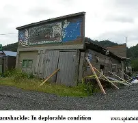
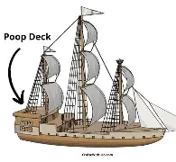
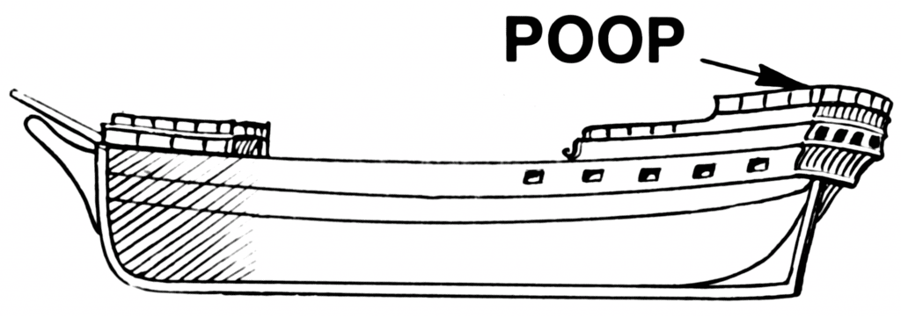
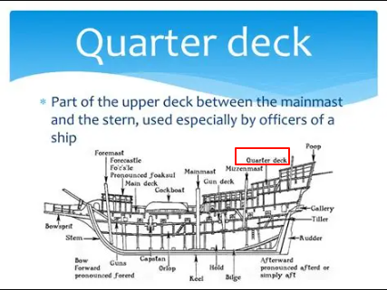
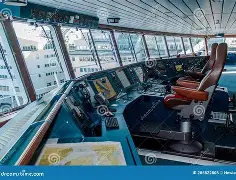
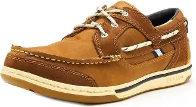
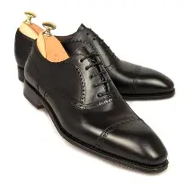
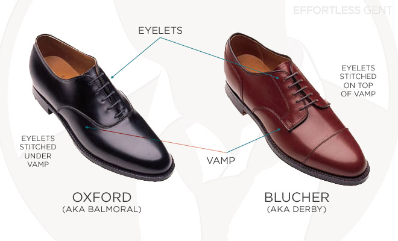
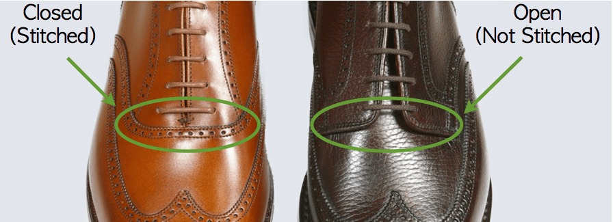

= 继承之战 S01 -03 释义
:toc: left
:toclevels: 3
:sectnums:
:stylesheet: ../../../../myAdocCss.css

'''

== 释义

Richard, can you get me the price 价格 of the Waystar stock 股票?
[.my2]
理查德，能帮我查一下Waystar的股价吗？

-At close 收盘 last night, please. -How is he?

[.my2]
-请查昨晚收盘价。 -他怎么样？

Good. A little clearer 清醒一些. He tried to put on a sock 穿袜子.
[.my2]
还好。清醒一点了。他试着自己穿了袜子。

Hey.
[.my2]
嘿。

Morning 早上好.
[.my2]
早上好。

Hey, Mondale 人名. Wish me luck 祝我好运, buddy 伙计.
[.my2]
嘿，蒙代尔。祝我好运，伙计。

Wish me luck.
[.my2]
祝我好运。

What's that? "Good luck, Tom!
[.my2]
那是什么？“祝你好运，汤姆！

Hope it goes well 进展顺利!" OK, so,
[.my2]
希望一切顺利！” 好的，那么，

just wanted to say goodbye 道别.
[.my2]
只是想来说声再见。

Have you seen the numbers 数字?
[.my2]
你看到那些数字了吗？

Man, poor Ken 可怜的肯德尔. He's like dysentery 痢疾 for the stock price.
[.my2]
老兄，可怜的肯德尔。他对股价来说就像痢疾一样。

You are walking into a burning barn 着火的谷仓.
[.my2]
你正走进一个着火的谷仓。

Still excited 兴奋的.
[.my2]
依然兴奋。

-Still rarin' (a.)(=Raring 渴望的；急切的) to go 跃跃欲试. -Mm-hmm.

[.my2]
-仍然跃跃欲试。 -嗯。

[.my1]
.案例
====
.rarin'
Rarin'​​ 是 ​​Raring​​ 的缩写形式，而 Raring又是 ​​Roaring​​（咆哮的、急切的）在口语中的变体。 +
​​*Rarin' to go​​ 是一个固定的习语，意思是：​​迫不及待地想开始；跃跃欲试；热情高涨，准备大干一场。*​

这个短语的生动**意象来自于一匹被关在马厩里、急于冲出去奔跑的马。马会发出不耐烦的​​嘶鸣或咆哮声（roar）​​。** +
​​Raring​​ 源自 ​​Roaring​​，描绘了那种“焦躁不安、急于行动”的状态。 +
​​to go​​ 就是“出发、开始行动”。 +
所以，rarin' to go的字面意象是：​​像一匹焦躁咆哮的马一样，迫不及待要冲出去。​​ +

这个短语用来形容一个人对即将开始的事情感到​​极度兴奋、热情和迫不及待​​。它比简单的“excited”（兴奋）或“ready”（准备好）程度更深，带有一种​​原始的、难以抑制的冲动感​​。 +
它通常用于形容开始一项新工作、一个项目、一次旅行或任何令人期待的活动。 +
====

I'm just paying homage (n.)致敬;敬意，尊敬.
[.my2]
我只是来表示敬意。

[.my1]
.案例
====
.homage
-> 在西方封建社会中，封建主分封土地时，获封土地的人需要举行隆重的仪式，向封建主表示臣服之意，宣誓效忠于封建主。该仪式所包括的最主要一个部分是act of homage（表示臣服）。 +
**英语单词homage来自拉丁语homo（man，人），意思就是向封建主宣誓从今以后就是他的man（人）了，**承诺履行臣仆的各项义务，如参加领主会议和法庭、服兵役（oath of fealty）。

现在，homage一词所包含的封建色彩已经消失，通常用来表示向某人表达崇高的敬意。 homage：['hɒmɪdʒ] n.敬意，尊敬，效忠 pay homage to：向……表示敬意
====

What's that?
[.my2]
那是什么？

You miss me 想我? Well, I miss you too.
[.my2]
你想我？嗯，我也想你。

Maybe we should arrange a date 约会 while she's not around 不在场.
[.my2]
也许我们可以趁她不在安排次约会。

-You're weird 古怪的. -No, you are weird! OK!

[.my2]
-你真怪。 -不，你才怪！好吧！

-Goodbye. -Oh, Tom.

[.my2]
-再见。 -哦，汤姆。

I'm gonna go see Dad.
[.my2]
我要去看看爸爸。

If Marcia wants to be difficult 难缠, so can I.
[.my2]
如果玛西娅想难缠，我也可以。

So...can you come with me?
[.my2]
所以…你能和我一起去吗？

Uh, I gotta 必须，不得不 stay /in front on this one 这次我得站在前面, baby 宝贝.
[.my2]
呃，这次我得站在前面，宝贝。

It's a hugie 拥抱.
[.my2]
来个拥抱。

My first morning 后定说明 _stepping up_ 站出来.
[.my2]
这是我站出来的第一个早晨。

Just say /you went to see the big boss 大老板.
[.my2]
就说你去见大老板了。

-Don't make me choose 选择, Shiv. -Come on.

[.my2]
-别让我做选择，希芙。 -拜托。

Please. Don't make me choose.
[.my2]
求你了。别让我选择。

It's a man's right /not to choose.
[.my2]
不选择, 是男人的权利。

Hey, Rava. Can you give me 30 seconds 三十秒?
[.my2]
嘿，拉瓦。能给我三十秒吗？

Sorry, I'm just getting the kids ready 准备好孩子.
[.my2]
抱歉，我正在给孩子做准备。

Oh, Luanne, can you get...
[.my2]
哦，露安妮，你能…

Yeah? OK.
[.my2]
嗯？好的。

-Hey. -Hi.

[.my2]
-嘿。 -嗨。

Uh, yeah, so...
[.my2]
呃，是的，所以…

this is... this is dumb 愚蠢的, but bank call (v.)银行打电话 this morning,
[.my2]
这…这很蠢，但今天早上银行打电话来，

and I just wanted to ask...
[.my2]
我只是想问问…

Wait. What bank? Our old _joint account_ 共同账户(由两个或更多人共享的账户),联名账户?
[.my2]
等等。什么银行？我们以前的联名账户？

Um, no, no, Rava, the bank 银行.
[.my2]
呃，不，不，拉瓦，是那个银行。

ICBC, who have apparently bankrolled (v.)资助，提供资金 the old man for years.
[.my2]
工行，他们显然资助了老头子好多年。

I'm sorry. I'm... just _in a rush_ 匆忙. OK.
[.my2]
抱歉。我…只是很匆忙。好吧。

Just two minutes?
[.my2]
就两分钟？

What's your read 看法;看到；解读，（按某种方式）理解?
[.my2]
你的看法是什么？

Do I go... do I go Hulk 绿巨人, or Bruce Banner 布鲁斯·班纳?
[.my2]
我该…我该变绿巨人，还是保持布鲁斯·班纳？

[.my1]
.案例
====
​​布鲁斯·班纳：​​ 是本体，一位​​**温和、理性、**智力超群​​的科学家。他彬彬有礼，但常常显得内向、焦虑，试图控制和压抑自己内心的愤怒与力量。 +
​​浩克：​​ 是班纳博士在愤怒或受到威胁时变身而成的​​绿色巨人​​。他拥有​​毁灭性的力量、*极其易怒、行事冲动、完全受情绪驱动*​​，代表着被释放的、不受控制的原始力量和野性。

他真正想问的是：​​ 在当前这个商业或家庭权力斗争中，我应该表现出哪种姿态？ +
​​选项一：Go Hulk（选择浩克模式）​​ +
​​意味着：​​ 采取​​激进、强势、具有破坏性和恐吓性​​的策略。 +

​选项二：Go Bruce Banner（选择布鲁斯·班纳模式）​​ +
​​意味着：​​ 保持​​冷静、理性、有策略性​​的姿态。

====

Well, K-Kendall, talk to your people about...
[.my2]
嗯，肯-肯德尔，跟你的人谈谈…

I know, you're just... you're
[.my2]
我知道，你只是…你

always so good with this stuff 擅长这种事, and just, uh...
[.my2]
一直很擅长这些事，只是，呃…

The Hulk is the incredible one 不可思议的, right? The Hulk.
[.my2]
绿巨人是那个不可思议的，对吧？绿巨人。

We have to go. I'm sorry.
[.my2]
我们得走了。抱歉。

Why don't you ask Roman? OK?
[.my2]
你为什么不问问罗曼？好吗？

-Guys? -Roma... Rava. Come on.

[.my2]
-孩子们？ -罗曼…拉瓦。拜托。

-Seriously 认真的? -I'm sorry.

[.my2]
-认真的？ -对不起。

Bye!
[.my2]
再见！

Bye, guys. Bye-bye. I love you.
[.my2]
再见，孩子们。拜拜。我爱你们。

-Out of 从……中选出 ten 满分十分? -Uh, seven.

[.my2]
-满分十分打几分？ -呃，七分。

Ok.
[.my2]
好的。

You're in decent shape 体形不错,
[.my2]
你体形不错，

you're a little sloppy (a.)马虎的；凌乱的；草率的;松弛, but I can *get you tight as a drum* (紧绷如鼓) 但我能让你紧绷得像鼓一样.
[.my2]
有点松弛，但我能让你变得紧绷如鼓。

Ah. Well, I trust Pax 信任帕克斯, and Pax says _you're the best_.
[.my2]
啊。嗯，我信任帕克斯，而帕克斯说你是最棒的。

I'm only gonna say one thing, Roman, OK?
[.my2]
我只说一件事，罗曼，好吗？

Go for it 说吧.
[.my2]
说吧。

I take my shit serious 我对自己的事很认真,
[.my2]
我做事很认真，

that's why I have the reputation 名声 that I do,
[.my2]
这就是我有如今名声的原因，

and I need you *to take it serious*, too. OK?
[.my2]
我也需要你认真对待。好吗？

Dude 老兄, I'm... I'm onboard (在板上；参与其中)加入,
[.my2]
老兄，我…我加入，

so you can skip the whole speech bullshit 废话演讲, OK?
[.my2]
所以你可以省掉那套废话演讲了，好吗？

-I'm down (我同意，我愿意参加，我准备好了)我加入. -All right. 5:30 every day.

[.my2]
-我加入。 -好的。每天五点半。

Yeah, man, I'm serious 认真的. I'm serious as cancer 像癌症一样严重.
[.my2]
是的，老兄，我是认真的。我非常认真。

Fuckin' more serious. Fuckin' money cancer 金钱癌症.
[.my2]
他妈更认真。他妈的金钱癌症。

[.my1]
.案例
====
“money cancer”：​​ 这不是一个标准短语，而是说话人的即兴创造。它指的是​​一种威胁到公司生存的、与财务相关的巨大危机​​。可以理解为： +
​​一场财务灾难：​​ 比如公司即将破产、债务爆雷、股价崩盘等。 +
​​一种吞噬一切的贪婪：​​ 指商业世界中像癌症一样扩散的、毁灭性的贪婪文化。 +
====

You know, I'm COO 首席运营官 now.
[.my2]
你知道，我现在是首席运营官了。

-Mm-hmm. -Yeah.

[.my2]
-嗯。 -是的。

That's Chief Operating Officer.
[.my2]
就是首席运营官。

It's Waystar Royco, so if it operates (v.)运营, I chief (n.a.ad.) it 主管.
[.my2]
这是Waystar Royco，所以只要是运营的事，都归我管。

[.my1]
.案例
====
.I chief it.
这是说话人​​临时将 chief 名词, “转类”为动词使用​​，这是一种修辞手法，叫做​​词类转换​​。 +
字面意思：我“首席”它。 +
实际含义：我负责管理它 / 我掌管它。

这种用法在英语口语中很常见，尤其是在炫耀或开玩笑时：​​ +
I'll **Google** it.（我谷歌一下。）- 将专有名词（Google，搜索引擎）用作动词，意为“搜索”。 +
He **chaired** the meeting.（他主持了会议。）- 将名词（chair，椅子）用作动词，意为“主持”。 +
Don't **mother** me!（别像我妈一样唠叨我！）- 将名词（mother，母亲）用作动词，意为“像母亲一样照顾/管教”。 +

所以，I chief it可以理解为 ​​“我以首席官的身份来管理它”​​ 或更简洁地说是 ​​“我掌舵”​​。
====

*Flip （使）快速翻转 over* on your belly 肚子.
[.my2]
翻过来趴着。

Yeah. Ahh.
[.my2]
好的。啊。

But yeah, no, 5:30, that's perfect.
[.my2]
不过，是的，五点半，完美。

-A.M. Right? -Yup.

[.my2]
-是早上，对吧？ -对。

Well, good, because the other 5:30 /I'll be at work, ya 你；你的 know?
[.my2]
嗯，很好，因为另一个五点半我就在上班了，懂吗？

Being _an agent 代理人 of change_ 变革推动者 /and fuckin' firing (v.) people 解雇人.
[.my2]
当个变革推动者, 然后他妈的开除人。

Thank you.
[.my2]
谢谢。

Ask her to wait there.
[.my2]
让她在那儿等着。

Oh! She's here.
[.my2]
哦！她来了。

It's the morphine 吗啡.
[.my2]
是吗啡的作用。

-It's not that unusual 不寻常. -I know. I'm fine.

[.my2]
-这不算太不寻常。 -我知道。我没事。

-Is everything all right? -Hi, Shiv.

[.my2]
-一切都好吗？ -嗨，希芙。

-Hi! -Hi, Tom.

[.my2]
-嗨！ -嗨，汤姆。

Hey. I'm afraid I can't stay 停留.
[.my2]
嘿。恐怕我不能久留。

-Excuse me one second. -First day 第一天.

[.my2]
-失陪一下。 -第一天。

-Hi. -What's the...

[.my2]
-嗨。 -这是…

What's going on 发生什么事?
[.my2]
发生什么事了？

-Nothing. -No?

[.my2]
-没事。 -是吗？

Staff 员工.
[.my2]
员工。

Good to see you.
[.my2]
很高兴见到你。

Yeah. I know you said that /he wasn't great 状态不好,
[.my2]
是的。我知道你说过他状态不好，

but I was passing by 路过,
[.my2]
但我正好路过，

so I thought /I'd just *drop in* 顺道拜访,顺便访问 .
[.my2]
所以我想就顺道来看看。

That is so sweet 贴心.
[.my2]
你真贴心。

But you know, he's not seeing people /right now 现在不见客.
[.my2]
但你知道，他现在不见客。

Yeah, but I thought /I could just *pop up* 突然出现.
[.my2]
是的，但我想我可以突然出现一下。

Even if, you know, he's grumpy ( a.脾气坏的，爱抱怨的) 脾气坏.
[.my2]
即使，你知道，他脾气不好。

I think /it's best you don't.
[.my2]
我想你最好别这样。

Marcia, I've seen my dad *do the Master Cleanse* (v.清洁（皮肤）；清洗（伤口）;使免除（罪过）；使净化)大师净化法.
[.my2]
玛西娅，我见过我爸爸做“大师净化法”。

I can take him a little bit grouchy (a.脾气不好并常发牢骚的；好抱怨的) 脾气坏.
[.my2]
我能忍受他有点脾气。

I'm afraid /that is out of the question 不可能.
[.my2]
恐怕这不可能。

Um, do you... Might *it be an idea*
[.my2]
呃，你能不能…是不是可以

to check and see /whether he's changed his mind 改变主意?
[.my2]
去看看他是否改变主意了？

-Yeah. -*Perked up* （使）振奋，活跃，快活 a little bit 精神好点了?

[.my2]
-是的。 -精神好点了？

[.my1]
.案例
====
.perk
(n.)
( also formal also per·quis·ite ) [ usually pl.] something you receive *as well as* 和，以及，还有 your wages for doing a particular job （工资之外的）补贴，津贴，额外待遇

(v.) +
*perk ˈupˌ | perk sb←→ˈup* +
( informal ) to become or to make sb become more cheerful or lively, especially after they have been ill/sick or sad（使）振奋，活跃，快活 +
SYN brighten +
•He soon *perked up* /when his friends arrived. 朋友一来他就精神起来了。 +

2.ˌ**perk ˈupˌ | perk sth←→ˈup** +
( informal ) to increase, or to make sth increase in value, etc.上扬；增加；使增值 +
•Share prices *had perked up slightly* /by close of trading. 收盘时, 股价略有上扬。 +

3.ˌperk sth←→ˈup +
( informal ) to make sth more interesting, more attractive, etc. 使更有趣；使更诱人 +
SYN liven up +
•ideas for *perking up* bland food 给无味的食品增添味道的主意 +
====

Of course.
[.my2]
当然。

What the fuck 搞什么鬼?
[.my2]
搞什么鬼？

I know. I have to go.
[.my2]
我知道。我得走了。

Yeah, I know.
[.my2]
是的，我知道。

Oh, hey. Hello. Hi!
[.my2]
哦，嘿。你好。嗨！

I'm Shiv.
[.my2]
我是希芙。

Logan's daughter.
[.my2]
洛根的女儿。

I just... I wanted *to say thank you* for...
[.my2]
我只是…我想谢谢你…

for all your work.
[.my2]
为你所做的一切工作。

You're quite welcome 不客气.
[.my2]
不客气。

-Yeah. It's much appreciated (v.感激，感谢) 非常感谢. -Thank you.

[.my2]
-是的。非常感谢。 -谢谢。

And _how does he seem_ today?
[.my2]
他今天看起来怎么样？

Good?
[.my2]
好吗？

Oh... you know.
[.my2]
哦…你知道。

Actually, we don't.
[.my2]
实际上，我们不知道。

We heard all about the sock.
[.my2]
我们听说了穿袜子的事。

Yeah.
[.my2]
是的。

It'll stabilize 稳定下来.
[.my2]
会稳定下来的。

I know. I know it will.
[.my2]
我知道。我知道会的。

So... I've been thinking.
[.my2]
所以…我一直在想。

I've got a new game plan 策略 for the call.
[.my2]
我对这次通话有了新策略。

Uh-huh.
[.my2]
嗯。

Can you try and not look _so fuckin' nervous_ 紧张的?
[.my2]
你能不能别他妈看起来那么紧张？

I know what I'm doing.
[.my2]
我知道我在做什么。

I'm relaxed 放松的.
[.my2]
我很放松。

I just think /it's a little late, considering the gravity 严重性
[.my2]
我只是觉得考虑到事情的严重性

and the need /to get the relationship right 关系搞好.
[.my2]
以及需要把关系搞好，现在有点晚了。

Sure. The... The new strategy is really just a refinement 精炼，精制;完善;（精细的）改进，改善 of all this great work.
[.my2]
当然。这…新策略其实只是对所有这些出色工作的完善。

It goes, uh...
[.my2]
它是，呃…

Well, the _working title_ 工作标题,暂定名 is "Go Fuck Yourself 滚你妈的."
[.my2]
嗯，暂定名是“滚你妈的”。

[.my1]
.案例
====
.working title
工作标题：正在开发中的产品或项目（如电影或视频游戏）的临时名称，通常在发布时会更改。
====

Uh-huh.
[.my2]
嗯。

Hi, I have Mr. Polk 波尔克先生.
[.my2]
嗨，波尔克先生在线。

Uh-huh. What do you think?
[.my2]
嗯。你觉得怎么样？

I think I need a little bit more of an explanation 解释.
[.my2]
我想我需要多一点解释。

My dad's a bastard 混蛋, they need to know _I'm a bastard, too._
[.my2]
我爸爸是个混蛋，他们需要知道我也是个混蛋。

-Right? -Right...

[.my2]
-对吧？ -对…

Great.
[.my2]
很好。

Hey, Mr. Polk.
[.my2]
嘿，波尔克先生。

Hi, Kendall, good to connect 联系上.
[.my2]
嗨，肯德尔，很高兴联系上你。

Likewise (同样地，类似地；（表示感觉相同）我也是，我有同感；也，还)彼此彼此. Yeah, great.
[.my2]
彼此彼此。是的，很好。

So, you... you wanna go 开始?
[.my2]
所以，你…你想开始吗？

Well, why don't you go?
[.my2]
嗯，你为什么不开始呢？

OK. Well, uh, sure.
[.my2]
好的。嗯，呃，当然。

We just wanted to make contact 联系, given 考虑到 where we are 鉴于目前情况.
[.my2]
我们只是想联系一下，鉴于我们目前的处境。

-Mm-hmm. We are concerned 担忧. -Absolutely 绝对地.

[.my2]
-嗯。我们很担忧。 -确实。

Now, obviously, look, the main thing is,
[.my2]
现在，显然，听着，主要是，

we just handle this very calmly 冷静地,
[.my2]
我们只需要非常冷静地处理这件事，

because _the last thing_ 最不期望或不想要的人或事物 _either （两者之中）任意一个；两者都（不） of us_ want
[.my2]
因为我们双方最不希望的

is for _this rather private arrangement_ 私人安排 my father made
[.my2]
就是我父亲做的这个相当私人的安排

to, uh, you know, make waves 引起风波.
[.my2]
呃，你知道，引起风波。

-Absolutely. -But I guess the issue is

[.my2]
-确实。 -但我想问题是

we owe you 3.2 billion...
[.my2]
我们欠你32亿…

3.25.
[.my2]
32.5亿。

Hey, I was *rounding down* (向下取整) 四舍五入调低.
[.my2]
嘿，我往少了算的。

We *round up* (将数字或数量,向上取整) 四舍五入调高.
[.my2]
我们往多了算。

3.25 billion,
[.my2]
32.5亿，

secured (v.) against 以...担保 Waystar stock,
[.my2]
以Waystar股票担保，

which is, you know, undergoing (v.) some temporary turbulence (（空气或水的）湍流，紊流) 暂时波动
[.my2]
你知道，它正经历一些暂时波动，

*due to* sector-wide (a.)行业全面的(涵盖整个行业或部门的，影响所有相关公司或组织的) factors 行业因素.
[.my2]
由于全行业范围内的因素。

Mm-hmm.
[.my2]
嗯。

So, I guess, you know,
[.my2]
所以，我猜，你知道，

_what I'd like to know_ is,
[.my2]
我想知道的是，

what your position 处境，状况,立场 will be +
if we have a sustained breach (n.违反，破坏) 持续违约 of the stock price +
and we *fall out of 放弃,抛却 compliance* (n.)服从，遵守 with 不符合 our debt covenant (盟约，契约；协议，盖印合同) 债务契约?
[.my2]
如果我们股价持续下跌，且我们未能遵守债务契约规定，那么你们的处境将会如何呢？

[.my1]
.案例
====
.covenant
-> co-, 强调。-ven, 来，词源同 venue, convene(开会)。即召集开会后形成的协议，条约。
====

OK, well, if the stock drops 下跌,
[.my2]
好的，嗯，如果股价下跌，

we're entitled 使享有权利 /*to 有权 ask for* a payment 支付款项，支付额；付款，支付 in full 全额付款.
[.my2]
我们有权要求全额还款。

Uh-huh, exactly.
[.my2]
嗯哼，正是。

Technically 从技术上讲, uh, yeah.
[.my2]
从技术上讲，呃，是的。

So... what will we do here /in reality 现实中?
[.my2]
那么…现实中我们会怎么做？

If it breaches (v.)违反，破坏,跌破 130, you've broken the covenant
[.my2]
如果跌破130，你们就违反了契约，

and we will *want repayment* 还款.
[.my2]
我们就会要求还款。

Right.
[.my2]
对。

I know.
[.my2]
我知道。

But, um, like, really?
[.my2]
但是，呃，像是，真的吗？

Seriously 严肃地.
[.my2]
严肃点。

OK, I... I get it 明白了.
[.my2]
好吧，我…我明白了。

That's your initial position 初步立场,
[.my2]
那是你们的初步立场，

but we will want to restructure (v.)调整结构，改组；重组（困难企业的债务）,
[.my2]
但我们会希望重组，

and, uh...
[.my2]
而且，呃…

Look, here's where I'm at 我的立场.
[.my2]
听着，这就是我的立场。

We're not crazy (a.)狂热的，迷恋的 about 对...不热衷 the media sector (（尤指商业、贸易等的）部门，行业) 媒体行业,
[.my2]
我们对媒体行业不热衷，

we're not crazy about /how your father has treated our relationship,
[.my2]
我们对你父亲对待我们关系的方式, 也不满意，

and `主` our position `系` is to seek recoupment  (收回（成本）；弥补（亏损）) 寻求补偿.
[.my2]
我们的立场是寻求补偿。

[.my1]
.案例
====
.recoup
-> 来自法语 recouper,砍下，来自 re-,向后，往回，-coup,砍，切，词源同 coup,coupon,cope.原义 为减少成本，弥补损失，后用于指收回成回。
====

Oh, come on, man. Fuck off 滚开.
[.my2]
哦，得了吧，老兄。滚蛋。

-Uh, hello? -I'm here.

[.my2]
-呃，喂？ -我在。

Yeah. Yeah, come on.
[.my2]
是的。是的，得了吧。

Real world 现实世界, can we start to negotiate 谈判?
[.my2]
现实点，我们能开始谈判吗？

Listen, son, that's our position.
[.my2]
听着，小子，这就是我们的立场。

If the stock drops below 130,
[.my2]
如果股价跌破130，

you're in breach 违约;（对法规等的）违背，违犯 and we want our money back.
[.my2]
你们就违约了，我们想要回我们的钱。

OK, fine. Let's keep talking.
[.my2]
好吧，行。我们继续谈。

Look, if you need to talk to me,
[.my2]
听着，如果你需要和我谈，

maybe it's better /if we go through an intermediary 中间人,调解人.
[.my2]
也许我们通过中间人更好。

I'm not _a particular fan_ of 特别喜欢 _foul （语言）下流的，无礼的 language_ 脏话 (使用不雅或冒犯性的语言),
[.my2]
我特别不喜欢脏话，

and I don't like *to be insulted* 被侮辱.
[.my2]
我也不喜欢被侮辱。

Thank you, good morning.
[.my2]
谢谢你，早安。

Oh, boy 天啊.
[.my2]
哦，天啊。

-Fuck, that was brutal 残酷的. -You were *listening in* 偷听?

[.my2]
-操，太残酷了。 -你刚才在偷听？

Of course I was in. I'm COO.
[.my2]
我当然在听。我是首席运营官。

Are... Are they for real 认真的? Would they squeeze 挤压，捏 us 逼债?
[.my2]
他…他们是认真的吗？他们会逼债吗？

-Well, obviously they could. -Yeah, but why would they?

[.my2]
-嗯，显然他们可以。 -是的，但他们为什么要这么做？

Relax 放松, man, it'll be fine.
[.my2]
放松点，老兄，会没事的。

Uh, no, it fuckin' necessarily won't. OK?
[.my2]
呃，不，他妈的不一定没事。懂吗？

If this *became public* 公开,
[.my2]
如果这事公开了，

we could nosedive (v.)暴跌; （价格等的）急降，猛跌；（飞机的）俯冲；急剧恶化, we could *death spiral* (v.)死亡螺旋 here.
[.my2]
我们可能会暴跌，可能会陷入死亡螺旋。

[.my1]
.案例
====
.nosedive
-> nose 鼻子；（飞机、火箭等的）头部，机首 + dive 跳水；潜水

.death spiral
（航空）死亡旋降：指一个失去控制的飞机向下螺旋运动，无法恢复并最终坠毁的状态。同义词：_graveyard 墓地 spiral_。 +
（引申义）死亡漩涡：指一个人或事物, 正朝着不可避免的灾难性失败的道路上前进 的情况或行动。

====

Dude 老兄, I was only trying to be nice 好意.
[.my2]
老兄，我只是想表示好意。

That was a fucking shitshow 烂摊子,
[.my2]
那他妈就是个烂摊子，

and *you handled it* like a moron 傻瓜；蠢货, is the truth.
[.my2]
而你处理得像个傻瓜，事实如此。

Fuck off.
[.my2]
滚开。

Gents 先生们.
[.my2]
先生们。

Hello. Uh, Greg Hirsch.
[.my2]
你好。呃，格雷格·赫希。

I believe I'm working here *as of* 从……开始 today 从今天起.
[.my2]
我相信我从今天开始在这里工作。

OK, what is your job or job title 职位?
[.my2]
好的，你的工作或职位是什么？

Um, job, not entirely sure 不完全确定, _per se_ (=by itself)本身，本质上.
[.my2]
呃，工作嘛，本身不太确定。

[.my1]
.案例
====
.per se
(ad.) used meaning ‘by itself’ to show that /you are referring to sth on its own, rather than in connection with other things 本身；本质上 +
•The drug is not harmful _per se_, but is dangerous /when taken with alcohol. 这种药**本身无害**，但与酒同服就危险了。
====

I'll find out.
[.my2]
我会搞清楚的。

OK, um, I don't have anything.
[.my2]
好的，嗯，我没什么可安排的。

I *was* actually *personally 亲自地，本人地 appointed* 亲自任命 by Mr. Logan Roy.
[.my2]
我实际上是洛根·罗伊先生亲自任命的。

OK. Um...
[.my2]
好的。嗯…

-Um... -Is there anyone else, maybe?

[.my2]
-嗯… -有没有其他人，也许？

Tom?
[.my2]
汤姆？

-Tom. -Last name 姓?

[.my2]
-汤姆。 -姓什么？

Last name, uh...
[.my2]
姓，呃…

Weird 奇怪, I don't think I ever got his last...
[.my2]
奇怪，我觉得我从没问过他的姓…

Uh, T... boss Tom...
[.my2]
呃，汤…老板汤姆…

Tom? Tom?
[.my2]
汤姆？汤姆？

-Hey! Hey! -Hey.

[.my2]
-嘿！嘿！ -嘿。

Can you help me?
[.my2]
你能帮我吗？

Can you help...
[.my2]
你能不能帮…

OK, Greg. Greg Roy?
[.my2]
好的，格雷格。格雷格·罗伊？

That's the... I'm actually a Hirsch.
[.my2]
那是…我其实是赫希。

I'm not a... My mom's _a_ Roy, but, uh,
[.my2]
我不是…我妈妈是罗伊家的人，但是，呃，

[.my1]
.案例
====
这里的 ​​"a Roy"​​ 不是把 "Roy" 当作一个纯粹的姓氏，而是将其用作一个​​可数名词​​。 +
*"a Roy"​​ 的意思是：​​一个姓罗伊的人；一个罗伊家族的成员​​。* +
所以，​​"My mom's _a Roy_"​​ 的完整意思是：​​"My mom is __a member of the Roy family__."​​（我母亲是罗伊家族的成员。）

这种用法在英语中非常常见，将姓氏“名词化”，用来指代“具有这个姓氏的人”或“这个家族的成员”。 +
在这个语境下，"Roy" 不仅仅是一个名字标签，它代表的是一个​​家族身份、一种血统、一个群体​​。因此，它可以像其他表示“类别”的名词一样，前面加上不定冠词 "a"。

类似的例子：​​ +
​​谈论知名家族：​​ +
She married **a Kennedy**.（她嫁给了​​*一个肯尼迪家族的人*​​。） +
He's not **a Windsor** by blood.（他并非​​*温莎家族​​的血脉*。） +

​​泛指某个姓氏的人：​​ +
Are you **a Smith**? I'm looking for **a Smith** who works here.（你​​是姓史密斯吗​​？我在找​​一位在这里工作的史密斯​​。） +
There are three **Wang**s in our class.（我们班上有三个​​姓王的​​。）—— 这里用了复数形式 "Wang​​s​​"，更清楚地显示了其作为可数名词的用法。 +

​​对比一下：​​
#*如果格雷格说 "My mom's Roy"，这在语法上是不完整的，听起来像 "My mom is Roy"，仿佛 "Roy" 是他母亲的名字，这显然不对。而 "My mom's ​​_a​​ Roy_" 就清晰地表达了“我母亲是罗伊家的一员”这个家族归属的概念。*#

格雷格在这里强调 "My mom's ​​_a_​​ Roy"，是为了​​突出他母亲的血统和家族身份​​，从而为他后面的话 "I'm basically a Roy in all… all but my name"（我除了姓氏，基本就是个罗伊家的人）做铺垫。他在利用母亲的家族身份来抬高自己的身价。 +
所以，这个不起眼的 ​​"a"​​ 字，恰恰是理解格雷格想努力与罗伊家族攀上关系的关键。
====

_I'm basically a Roy 我基本上是个罗伊家的人 in all_ 在…所有方面... *all but* 几乎；差一点就；除了…之外都 my name ​​除了我的姓氏之外的所有方面.
[.my2]
我基本上就是个罗伊，除了姓不是。

[.my1]
.案例
====
"all but"​​ 的意思是：​​几乎；差一点就；除了…之外都​​。*它强调“除了某一个特定因素，其他所有条件都满足”。 +
​​"but"​​ 在这里的意思是 ​​"except"​​（除了）。* +
​​"all but"​​ 即 ​​"all except"​​（除了…之外的所有）。 +
所以，​​"all but my name"​​ 的字面意思是：​​“除了我的名字之外的所有方面”​​。 +

I'm basically a Roy in all... all but my name. +
"I'm basically a Roy"​​： 我基本上是个罗伊家的人。 +
​​"in all..."​​： 在…所有方面。这里的停顿和重复（"all... all but"）是口语中常见的犹豫和自我修正，显示出格雷格的不自信。 +
​​"all but my name"​​： ​​除了我的姓氏之外的所有方面​​。 +
所以，整句话的意思是：我基本上是个罗伊家的人，在除了我的姓氏之外的所有方面都是。 +

他想表达的是：“虽然我法律上的姓氏是赫希什（Hirsch），但我身上的一切——我的血缘、我的关系、我的忠诚、我出入的场合、我效力的公司——都完全符合一个罗伊家族成员的身份。​​唯一缺少的，就是那个显赫的‘罗伊’姓氏本身。​​” +
这是一种极力想融入核心圈子、强调自己身份归属的说法。他试图用“all but”（几乎）来淡化姓氏不同这一点，从而将自己归入“罗伊家族”的范畴。

.all but ​​几乎；差一点就；除了…之外都​​。

- The work is ​​*all but​​ finished*. (这项工作​​差不多​​完成了。) -> **意思是除了“彻底完成”这一步，其他都做好了，**基本等于完成了。
- The city was ​​*all but​​ destroyed* by the earthquake. (这座城市​​几乎​​被地震摧毁。) -> **意思是除了“完全变成废墟”这一点，毁灭程度已经达到极致，**基本等于摧毁了。
- He's ​​*all but​​ a member* of the family. (他​​简直​​就是家里的一员了。) -> 这句话和格雷格的逻辑一模一样！意思是除了不姓这个姓，他在其他所有方面都已经是家庭成员了。
====

-Wait... -I'll be two minutes.

[.my2]
-等等… -我两分钟就好。

What? No. No. Shiv...
[.my2]
什么？不。不。希芙…

It has gotten weird 变得奇怪. OK? It has gotten very weird.
[.my2]
情况变得奇怪了。懂吗？变得非常奇怪。

-How is he? -I don't know.

[.my2]
-他怎么样？ -我不知道。

-He might *have put on* a sock. -Well, that's good, right?

[.my2]
-他可能自己穿了袜子。 -嗯，那是好事，对吧？

Or he could be *lying there dead*. I have no fuckin' idea.
[.my2]
或者他可能躺在那儿死了。我他妈完全不知道。

OK, this is...
[.my2]
好吧，这…

It's not a good time 不是好时机.
[.my2]
现在不是好时机。

She thinks that /Marcia's poisoning 毒害 him.
[.my2]
她觉得,玛西娅在毒害他。

I do not. Apparently 显然, he doesn't want to see us.
[.my2]
我没有。显然，他不想见我们。

Not including me?
[.my2]
不包括我吗？

Why would he say that?
[.my2]
他为什么会那么说？

Still *pissed 撒尿 at* ​​<俚语>对…感到非常生气、愤怒 you 生你的气
[.my2]
还在生你的气，

for not *signing up 同意、支持、加入（某个计划或协议） to* ​ his corporate restructure 公司重组
[.my2]
因为你不同意他的公司重组，

[.my1]
.案例
====
*sign up* to​​ 在这里的意思是：​​同意、支持、加入（某个计划或协议）​​。 +
这个短语源自**“在名单上签名（sign up）以示加入或同意”，**比如报名参加课程（sign up for a class）或签署协议。 +
​​比喻用法：​​ 在这里是比喻用法，不指真的签名，而是指“​​在口头上或行动上表示支持、赞同​​”。 +

​​to的用法：​​ sign up to 后面接的, 是你同意的​​那个计划、想法或协议本身​​。
====

to make Marcia _queen of the castle_ 城堡女王?
[.my2]
让玛西娅成为城堡女王？

OK, yeah. Maybe she's pissed 生气.
[.my2]
好吧，是的。也许她生气了。

Look, did you see him /over the weekend 在周末期间,整个周末?
[.my2]
听着，你周末见到他了吗？

No. I heard he *wasn't up to* seeing people 状态不好不见人.
[.my2]
没有。我听说他状态不好，不见人。

[.my1]
.案例
====
*be up to​​ 在这里表示 ​​“有能力或精力去做某事”​​，通常用于指身体或精神状况是否允许。* +
当说一个人 ​​isn't up to​​ 做某件事时，意味着他/她因为生病、疲惫、情绪低落等原因，​​没有足够的精力、能力或意愿去做那件事​​。

这个短语非常常用，后面可以接各种名词或动名词。 +

- ​​接名词：​​ *He's not up* to the task/journey/meeting.（他无法胜任这项任务/进行这次旅行/参加这次会议。） +
- ​​接动名词（-ing）：​​ She wasn't up to going out.（她身体不适，无法出门。） +

在剧中，seeing people（会见他人）对于病重的洛根来说，就是一件需要耗费心力去“应付”的事情。 +

与“起床”无关​​. +
##**这里的 up和“起床”这个动作没有直接关系。它强调的是 ​​“达到做某事所需的状态或标准”​​。**##一个人可能已经起床了，但身体状况依然 not up to进行某些活动。 +
​​例句：​​ +

- After her surgery, she **wasn't up to** having visitors.（手术后，她的身体还​​无法​​接待访客。） +
- You look exhausted. Are you sure you'**re up to** driving home?（你看起来累坏了。你确定你​​还能​​开车回家吗？） +
- I have a cold, so I don't **feel up to** going to the party.（我感冒了，所以觉得​​没精神去​​参加派对。） +
====

Yeah, no one has seen him
[.my2]
是的，没人见过他，

since we took him home /from the hospital,
[.my2]
自从我们周四把他从医院接回家后，

like, Thursday.
[.my2]
像是，周四。

I think... Rome? You saw him, right?
[.my2]
我想…罗姆？你见过他，对吧？

Uh, sure, yeah, for, like, five minutes.
[.my2]
呃，当然，是的，大概，五分钟。

But he was, um... he was pretty...
[.my2]
但他当时，嗯…他相当…

He wasn't really him 不是真正的他, there were tubes and...
[.my2]
他不是真正的他，身上插着管子什么的…

-OK, but after that? -Nope.

[.my2]
-好吧，但那之后呢？ -没有。

`主` No one _apart from_ Marcia `谓` has seen him
[.my2]
除了玛西娅，没人见过他，

for _the better part_ 大部分 of a week 大半个星期.
[.my2]
已经大半个星期了。

-Four days is not a week. -OK, the majority of the week 一周的大部分时间,

[.my2]
-四天不是一周。 -好吧，一周的大部分时间，

and we're just accepting...
[.my2]
而我们就这样接受…

`主` the whole world `谓` is just accepting this woman's word 话
[.my2]
全世界就只听信这个女人的话，

that he *put on* a fucking sock.
[.my2]
说他他妈穿了只袜子。

Look, relax, OK?
[.my2]
听着，放松点，好吗？

I-It's a process 过程,
[.my2]
这-这是个过程，

we don't want *to rush 赶紧做，仓促做 the recovery* 加速恢复,康复...
[.my2]
我们不想急于求成…

Oh, right, because you like playing boss 扮演老板?
[.my2]
哦，对，因为你喜欢扮演老板？

That's not...
[.my2]
不是…

Please. Can you *go over there* 去那边?
[.my2]
拜托。你能去那边看看吗？

Shiv, this is...
[.my2]
希芙，这…

I literally 按照字面意义地，逐字地；真正地，确实地 have something unmissable 不可错过的.
[.my2]
我真的有件不可错过的事。

Later. OK? I'll try later.
[.my2]
晚点。行吗？我晚点试试。

-Ok? -ok.

[.my2]
-行吗？ -行。

Is everything OK?
[.my2]
一切都好吗？

No. We are _on the brink of_ 濒临 total corporate collapse 公司全面崩溃.
[.my2]
不。我们正濒临公司全面崩溃。

Oh, yeah. Well, *that figures* (计算（数量，价值）) 意料之中,这很合理，这很自然.
[.my2]
哦，是啊。嗯，意料之中。

[.my1]
.案例
====
"that figures" 是一个口语表达，意思是“那很合理”、“意料之中”或“不出所料”，常用来表示对某个消息或情况并不感到惊讶。 +

例句：

- He failed the exam? *That figures*, he never studied. (他考试没及格？意料之中，他从不学习。)
- The train is late again. *That figures*. (火车又晚点了。这很常见。)
====

Well, call me /if you go Lehman 雷曼兄弟（破产）, will you?
[.my2]
嗯，如果你们像雷曼兄弟一样破产了，打电话给我，好吗？

[.my1]
.案例
====
.if you go Lehman
此处的 **go**不是实义动词“去”，而**是作为​​"系动词"​​使用，后面接一个表示状态或结果的补足语**（这里是 Lehman）。

这种用法类似于： +
go crazy（发疯） +
go bankrupt（破产） +
His hair has gone grey.（他的头发变白了。） +

*在这里，go Lehman 就是 go bankrupt (a.) /like Lehman Brothers 的极端简化和戏谑说法。*

潜台词：​​ 等你们公司清盘拍卖资产时，这些椅子就成便宜货了，记得叫我捡漏。
====

*Might want* (v.) some of these chairs.
[.my2]
我可能会想要几把这些椅子。

Morning 早上好.
[.my2]
早上好。

Morning.
[.my2]
早上好。

Here to help fix (v.) the Death Star 死星（星球大战）.
[.my2]
来帮忙修理死星。

"Grill （炊具、烤炉内的）烤架 on the exhaust vent 排气口, guys,
[.my2]
“排气口上加个格栅，伙计们，

[.my1]
.案例
====
.grill
-> 来自PIE*sker, 弯，转，编织，词源同cradle, grate, grid. 因形似编织经纬网而得名。

====

grill on the exhaust vent."
[.my2]
排气口上加个格栅。”

So, my only concern 担忧 would be, to brief (v.)给（某人）指示；向（某人）介绍情况;短时间的；短暂的 this meeting 通报会议,
[.my2]
所以，我唯一的担忧是，向这次会议通报时，

[.my1]
.案例
====
.brief
~ sb (on/about sth) to give sb information about sth /so that they are prepared to deal with it 给（某人）指示；向（某人）介绍情况 +
[ VN] +
•The officer *briefed her* /on what to expect.长官简要向她说了一下可能遇到的情况。 +
•I expect *to be kept fully briefed* at all times. 我希望随时向我报告全面情况。 +

====

is it _a little too aggressive_ 激进的 for a temporary CEO (临时CEO)?
[.my2]
对一位临时CEO来说，这是不是有点太激进了？

That is a good point 好观点.
[.my2]
说得有道理。

Yeah, well, we've got a very aggressive 非常严重的；强烈的 drop 暴跌 in our share price,
[.my2]
是啊，嗯，我们的股价出现了非常剧烈的下跌，

so I think _that's appropriate_ 合适的, good?
[.my2]
所以我认为这是合适的，好吗？

So /*brief (v.) this wide* and *brief (v.) it fast* 快速通报, OK?
[.my2]
所以通报范围要广，速度要快，好吗？

-OK. -Uh, yeah. Great.

[.my2]
-好的。 -呃，是的。很好。

All right, all right!
[.my2]
好了，好了！

Morning, morning, morning.
[.my2]
早，早，早。

My people 我的人.
[.my2]
我的人们。

It's great to see you all.
[.my2]
很高兴见到大家。

You know my brother and I, CEO and COO...
[.my2]
你们知道我和我兄弟，CEO和COO…

-COO. -Gerri, Karl, Karolina.

[.my2]
-COO。 -格里，卡尔，卡洛琳娜。

I'm actually gonna stand up 站起来, if that's all right.
[.my2]
我其实要站起来说，如果大家不介意的话。

My back is fucked 我的背糟透了,背疼得厉害. I have a new trainer 新教练, so...
[.my2]
我背疼得厉害。我找了个新教练，所以…

So, I just wanted *to get the gang 一伙人 together* /early in my tenure 任期
[.my2]
所以，我想在我任期刚开始时, 就把大家聚在一起

to say, uh... "Yo 喂."
[.my2]
说声，呃…“喂”。

You're probably all *wondering about* 想知道，对……感到疑惑 my dad.
[.my2]
你们可能都在想我爸爸怎么样了。

He's doing OK 还好.
[.my2]
他还好。

Motherfucker 狗娘养的.
[.my2]
这老家伙。

We're *hoping for* a full recovery 完全康复.
[.my2]
我们希望他能完全康复。

He's, like, _a thousand 一千个百分点 percent_ better 好了一千倍, though.
[.my2]
不过，他已经好了一千倍了。

[.my1]
.案例
====
.a thousand percent
字面意思：​​ 一千个百分点。 +
​​实际含义：​​ 夸张地表示“好得非常多”、“状态极佳”。

- *I'm a thousand percent sure* /this is the right decision.（*我百分之一千地确定*, 这是正确的决定。）
====

He's like a bull in _rhino hide_ (兽皮) 犀牛皮.
[.my2]
他壮得像头披着犀牛皮的公牛。

[.my1]
.案例
====
.rhino hide（犀牛皮）
犀牛皮以​​厚实、坚硬​​著称，常被用来比喻“​​厚脸皮​​”或“​​对批评攻击无动于衷​​”。 +
He has a hide (n.) like a rhinoceros.（他脸皮厚得像犀牛。）-- 这是形容对批评不敏感的常用比喻。

组合后的含义：​​ +
​​a bull​​ 代表内在的​​强大力量和生命力​​。 +
​​in rhino hide​​ 代表外在的​​超强防御力，刀枪不入​​。 +
因此，a bull in rhino hide形容一个人​​从内到外都无比强壮、坚韧，能够抵御任何攻击或病痛​​。 +
====

Uh-huh. Yeah. Slow and steady 缓慢而稳定.
[.my2]
嗯哼。是的。缓慢而稳定地恢复。

This morning /he put on a sock 穿上了袜子, so...
[.my2]
今天早上他自己穿上了袜子，所以…

That's right. Uh, this morning /he tried to put on a sock.
[.my2]
没错。呃，今天早上他试着自己穿袜子。

And welcome to Tom Wamsgans,
[.my2]
欢迎汤姆·瓦姆斯甘斯，

who was managing (v.) Resorts 度假村；度假胜地 South and Central
[.my2]
他之前负责南方和中部度假村业务，

and is now *sitting up with the grownups* (成年人) 和大人坐在一起.
[.my2]
现在和大人坐在一起了。

[.my1]
.案例
====
这里的 ​​sitting up​​ 不能按字面理解为“坐起来”，而是一个完整的​​固定短语​​，带有强烈的比喻意义。 +
*#sitting up with the grownups (成年人)#* 是一个习语，意思是：*#和重要人物平起平坐；跻身于高层之列。#​*

这个短语的意象来源于​​小孩和大人吃饭或开会的场景​​。 +
在日常生活中，小孩通常有自己的小桌子，或者需要被抱到高椅子上（*sit up 在字面意义上可以指“坐直”、“坐高”*）。 +
而当小孩表现好、长大了，就会被允许​​和成年人坐在同一张餐桌旁​​（sit up at the table with the grownups）。这是一种​​身份提升和获得认可的象征​​。

在商业世界中，这个比喻被用来形容​​职位晋升，从一个较低、较边缘的职位（“小孩的桌子”）晋升到权力核心（“大人的餐桌”）​​。 +
​​the grownups（大人们）：​​ 比喻公司的高层管理者、决策者。 +
​​sitting up with them（和他们坐在一起）：​​ 比喻汤姆现在也成为了决策层的一员，有资格参与重要事务了。

up的作用​​ +
这里的 up非常关键，它包含了多层含义： +

- ​​空间上的“向上”​​： 暗示地位提升，从“下面”的职位升到“上面”的职位。 +
- ​​重要性上的“向上”​​： 暗示从处理次要事务（Resorts South and Central，某个区域业务）到参与核心决策。 +
- ​​关注度上的“向上”​​： 他现在处于一个更受关注、更重要的位置。 +

​​*如果去掉 up，只说 sitting with the grownups，意思会变得很平淡，只是“和大人坐在一起”，完全失去了“晋升”、“跻身高位”的比喻色彩和动态感。*​ +

例句：​​

- After her promotion, she finally got to **sit up with the grownups** in the board meetings.（升职后，她终于可以​​和公司元老们一起​​参加董事会会议了。）
- This project is so important that even the interns are **sitting up with the grownups** on this one.（这个项目太重要了，连实习生都​​能和高层一起参与​​了。）
====

-Hey. I just want... -So, what I want to announce 宣布 to you all this morning /is a new strategic vision 战略愿景.

[.my2]
-嘿。我只想… -那么，我今天早上想向大家宣布的, 是一个新的战略愿景。

We have a great firm 公司 here.
[.my2]
我们有一家很棒的公司。

Multifaceted (多方面的；要从多方面考虑的)多元化的.
[.my2]
业务多元化。

[.my1]
.案例
====
multifaceted -> multi-,许多，多个，facet,侧面，方面，词源同face.

====

Parks, cruises 游轮, telecom 电信, live entertainment 现场娱乐, sports...
[.my2]
主题公园，游轮，电信，现场娱乐，体育…

[.my1]
.案例
====
.live entertainment
现场娱乐：**指在观众面前进行的表演或演出，**通常包括音乐、舞蹈、戏剧、杂技等形式。
====

but at the heart 核心, media 媒体.
[.my2]
但核心是媒体。

TV, movies, books, newspapers.
[.my2]
电视，电影，图书，报纸。

And what we're fighting for `系` is eyeballs 眼球（注意力）,
[.my2]
我们争夺的是眼球，

eyeballs which we *convert to* our customer base 客户群,
[.my2]
我们把眼球转化为我们的客户群，

eyeballs which we *crate (v.)把……装入货箱 up* 装箱 and sell to advertisers 广告商.
[.my2]
我们把眼球装箱卖给广告商。

[.my1]
.案例
====
.crate
(n.)a large wooden container for transporting goods 大木箱，板条箱（运货用） +
-> 来自PIE*sker, 转，弯，编织，词源同 cradle, crib. 原指篮子。

====

Right? And _bottom line_ 最重要的或最基本的事实、真相或结果,归根结底, *we're losing... to* monopolistic (a.)垄断的；独占性的；专利的 disruptors (破坏者，分裂者) 垄断性颠覆者.
[.my2]
对吧？归根结底，我们正在输给… 垄断性颠覆者。

Alphabet, Facebook... Internet.  +
Fucking game-changer 改变游戏规则的东西, man.
[.my2]
字母表（谷歌），脸书… 互联网。他妈的游戏规则改变者，老兄。

-That's right, the internet. -Internet.

[.my2]
-对，互联网。 -互联网。

But, uh, we are still just... just... in a position
[.my2]
但是，呃，我们仍然处于…处于…

to leverage (v.)利用 our brands /into something 后定说明 in the new landscape (（陆上，尤指乡村的）风景，景色)新格局.
[.my2]
可以利用我们的品牌, 在新格局中有所作为的地位。

But if we don't, we're gonna be like
[.my2]
但如果我们不行动，我们就会像

the biggest fuckin' horse trader 马贩子 in Detroit, 1909. OK?
[.my2]
1909年底特律最大的他妈马贩子一样。懂吗？

[.my1]
.案例
====
我们会变得像1909年​​底特律最大的马贩子​​一样。 +
​​实际含义：​​ 我们会成为一个在​​新时代（汽车时代）​​ 来临后，依然死守着​​旧时代核心产业（马车）​​ 的、看似强大实则即将被淘汰的​​行业巨头​​。

在汽车时代之前，​​“马贩子”​​ 是一个非常重要的职业，他们提供交通、农业和运输的核心工具（马匹）。然而，​​到了1909年，随着T型车的普及，这个“最大的马贩子”的地位变得极其尴尬和危险​​。他的生意模式即将被彻底颠覆，他的财富和影响力会随着马匹需求的锐减而迅速消失。

Waystar Royco（传统媒体巨头）​​ 对应 ​​“最大的马贩子”​​。
它目前可能还很庞大，但它的核心业务（传统媒体：电视、报纸、游乐园）正受到巨大冲击。 +
​​互联网、Alphabet（谷歌）、Facebook（数字媒体新贵）​​ 对应 ​​“汽车工业”​​。
它们是颠覆性的新技术、新平台，正在重塑整个行业格局。

====

We need a more dynamic strategy 更有活力的战略.
[.my2]
我们需要一个更有活力的战略。

Now, let's call (v.) it, *for the sake of* 为了……的利益/目的/原因 clarity 为了清晰起见,
[.my2]
现在，为了清晰起见，我们称之为

the Strategy of _a Thousand Lifeboats_ (救生艇) "千艘救生艇"战略.
[.my2]
“千艘救生艇战略”。

Vaulter is a lifeboat 救生艇,
[.my2]
Vaulter是一艘救生艇，

ATN Citizens is a lifeboat.
[.my2]
ATN公民也是一艘救生艇。

There are no bad lifeboats.
[.my2]
没有不好的救生艇。

VR could be a lifeboat.
[.my2]
VR可以是一艘救生艇。

VR's a bubble 泡沫,
[.my2]
VR是个泡沫，

but yeah. No bad ideas 坏主意.
[.my2]
不过没错。没有坏主意。

Porn 色情 could be a lifeboat.
[.my2]
色情内容可以是一艘救生艇。

Except that 只可惜；除了……之外. That's a bad lifeboat.
[.my2]
那个除外。那是一艘坏救生艇。

Hey, thanks, Rome 罗曼的昵称.
[.my2]
嘿，谢了，罗姆。

Look, this isn't a brainstorm 头脑风暴,
[.my2]
听着，这不是头脑风暴，

all I'm saying, everyone'*s invited* 受邀. OK?
[.my2]
我的意思是，每个人都受邀参与。好吗？

I want each and every one of you
[.my2]
我希望你们每一个人

to be innovating 创新, challenging 挑战,
[.my2]
都能创新，挑战，

being bold 大胆, being disruptive (a.)引起混乱的，破坏的；创新的，开拓性的; 颠覆性,
[.my2]
大胆，具有颠覆性，

bringing me _new, original 原创的, multiplatform content_ 多平台内容.
[.my2]
带给我新的、原创的、多平台的内容。

Bring me more /in the interactive 交互式的，人机对话的；相互交流的，互动的 and digital space 互动和数字领域.
[.my2]
在互动和数字领域给我带来更多。

Bring me franchiseable IP 可授权的知识产权.
[.my2]
带给我可授权的知识产权。

[.my1]
.案例
====
.franchise
(n.)1.[ CU] formal permission /given by a company to sb /who wants to sell its goods or services in a particular area; formal permission /given by a government to sb /who wants to operate a public service as a business （公司授予的）特许经销权；（国家授予的）特别经营权，特许 +
•a franchise (n.) agreement/company 特许经销权协议；特约代销公司 +
•a catering/rail franchise (n.) 餐饮╱铁路经营权

2.[ C ]a business or service /run under franchise 获特许权的商业（或服务）机构 +
•They *operate (v.) franchises* (n.) in London and Paris.他们在伦敦和巴黎经营专卖店。 +
•a burger franchise 汉堡包特许经销店

3.[ U] ( formal ) the right /to vote in a country's elections（公民）选举权 +
•_universal adult franchise_ (n.) 成年人普选权

-> *来自古法语franc, 非奴役的，自由的，来自拉丁语francus, #法兰克人，自由人，词源同 Frank. 其原词义即使享有自由权，后引申词义选举权，特许经销权等。#*

====

Bring me a thousand lifeboats.
[.my2]
带给我一千艘救生艇。

Bring me a fucking armada （西班牙的）无敌舰队 of eyeballs.
[.my2]
带给他妈的一支眼球舰队。

Because `主` steady (v.)使平稳，稳住 as she goes 保持现状 `谓` hits the iceberg 撞上冰山.
[.my2]
因为保持现状, 会撞上冰山。

[.my1]
.案例
====
.Because steady as she goes hits the iceberg. 里面为什么不能加will 写成  will hits ?

答案是：​​绝对不能加 will​​。加了就是语法错误。 +

如果加上 will，句子会变成：
​​"Because steady as she goes will hits the iceberg."​​ +
这句话存在两个致命错误： +
1.​​**#will后面必须接动词原形​​，不能接第三人称单数形式 hits。#**正确的形式应该是 will hit。 +
2. 即使改成 will hit，句子的逻辑和修辞也会变得很奇怪（下文会解释）。 +

*Steady as she goes 本身是一句航海术语，意思是“​​保持航向，稳定航行​​”。在商业管理中，它常被用作隐喻，表示“​​维持现状，按既定方针办​​”。* +

为什么加 will反而不对？​​ +
​​#*语法上​​：hits在这里是​​一般现在时​​，用于陈述一个​​普遍真理​​或​​必然结果​​。它表达的是“保持现状就​​必然​​会撞上冰山”，这是一种强烈的、确定的判断。 +
​​修辞上​​：使用一般现在时 hits, 使得警告更加​​直接、紧迫、不容置疑​​。仿佛撞上冰山是物理定律一样必然会发生。*# +

#*如果加上 will hit（将来时），就变成了“保持现状​​将会​​撞上冰山”。这听起来更像是一个​​预测​​，而不是一个​​必然的定律*#​​，其警告的力度和紧迫感就被大大削弱了。 +
​
类比一个更简单的句子：​​ +

- *Pride 自豪（感）；自尊（心）；傲慢，自负 goes (v.) before a fall.（骄兵必败。）*—— 这是一句谚语，*#使用"一般现在时"表示必然规律。#* +
如果说 Pride will go /before a fall.，就变成了“骄傲会导致失败”，听起来更像个人预测，而不是放之四海而皆准的真理。 +
====

All right. Thanks, everyone.
[.my2]
好了。谢谢大家。

Lifeboats! Whoo 哇!
[.my2]
救生艇！哇！

#Just had to say# 我不得不说, that was great. Kudos 赞扬.
[.my2]
必须得说，太棒了。点赞。

Always here /if you need a friendly ear 倾听者,
[.my2]
如果你需要倾听者，我随时都在，

Lord Vader 维达勋爵（星球大战）.
[.my2]
维达勋爵。

Just get _shit moving_ (n.)推动事情 at Parks.
[.my2]
赶紧推动公园那边的事情。

-Yes. -Yeah, Tom?

[.my2]
-是。 -嗯，汤姆？

It's stagnant (a.)停滞不前;（经济、社会等）停滞不前的，不景气的；不流动的，污浊的,
[.my2]
那边停滞不前，

so shake (v.) that fuckin' tree 摇树,C-3PO（星球大战中的机器人）.
[.my2]
所以使劲摇摇那棵树，C-3PO。

[.my1]
.案例
====
C-3PO是《星球大战》中的角色，一个精通礼仪和翻译、但胆小、啰嗦、行动笨拙的机器人。 +
​​实际含义：​​ 汤姆在这里用这个称呼来指代​​公园部门那个做事一板一眼、效率低下、缺乏魄力的负责人.

====

Shakin' the tree. Shakin' the tree.
[.my2]
摇树。摇树。

Shakin' (v.) it _big time_ 大量地，极度地.
[.my2]
大力地摇。

Fiona. Walk with me 跟我走走.
[.my2]
菲奥娜。跟我走走。

Can you send flowers to Rava?
[.my2]
能送花给拉瓦吗？

Nice, but, you know, not ridiculous (可笑的，荒谬的) 不夸张.
[.my2]
要好看，但你知道，别太夸张。

They should smell like flowers, not desperation 绝望.
[.my2]
闻起来要像花香，而不是绝望。

and Fi 菲奥娜的昵称, talk to Jess,
[.my2]
还有菲，跟杰斯说一下，

I might want *to throw up* 快速、随意地发布或展示某物 a couple of items *up on* the internal 内部网站.
[.my2]
我可能想在内部网站上发布几项内容。

[.my1]
.案例
====
1.**throw up** 是一个非常口语化的短语，*原意有“呕吐”、“快速建造”的意思。在非正式语境中，尤其是在网络或媒体行业，它可以引申为 ​​“快速、随意地发布或展示某物”​​。* +
​​意象：​​ 就像把东西“抛”到墙上或布告栏上一样，动作很快，不追求完美。

在这里，items（项目/内容）指的是要在公司内部网站（the internal）上发布的信息，比如通知、文章、视频链接等。 +
例句：​​

- I'll just **throw up** a quick post on the blog /to announce the news.（我就在博客上​​发个​​简短的帖子, 宣布这个消息。）
- He **threw up** some charts on the screen /during the meeting.（他在开会时, 往屏幕上​​放了几张图表​​。）

2.up on the internal​​： 在公司内部网站/系统上。

*the internal*​​： 这是一个名词化的形容词，是公司内部的习惯用语，全称是 the internal website 或 the internal network/system，即​​*公司的内部网站或内网*​​。

​​*up on*​​： 这里的 up on是一个介词短语，**相当于 on，但 #up增加了一点“在…上方”、“公开可见”的意味。#** *put* something *up on* a board（把东西贴在布告板上）就是这个用法。 +
所以，up on the internal 就等于说 on the internal website。

例句：​​
The memo was posted /**up on the internal**.（备忘录被发布​​在内网上了​​。）

总结：​​ 第一个 up是动词短语 throw up的一部分，意思是“发布”；第二个 up是介词短语 up on的一部分，意思是“在…上面”。整句话是地道的口语表达，意为“在内网上发布些东西”。

为什么听起来有点重复？​​ +
##**这个句子在语法上确实有点冗余，因为 throw up 本身已经包含了“向上放置”的意思，后面又跟了一个 up on。**##在非常严谨的书面语中，可能会说 *post* a couple of items *on* the internal。

====

Not a big deal 没什么大不了的, _couple of_ TED talks (TED 演讲).
[.my2]
没什么大不了的，几个TED演讲。

Maybe a documentary 纪实节目，纪录片 on _the Epic of Gilgamesh_ 吉尔伽美什（传说中的苏美尔国王）史诗, I'm thinking?
[.my2]
也许拍个关于《吉尔伽美什史诗》的纪录片，我在想？

You know, it's the first story, _archetypal (a.)原型的；典型的 quest_ （长久或辛勤的）寻求，探求  shit 原型探索.
[.my2]
你知道，这是第一个故事，原型探索之类的。

Because _what are we_ /if not storytellers 讲故事的人?
[.my2]
因为我们不就是讲故事的人吗？

Hey. Talk to me 跟我说说.
[.my2]
嘿。跟我说说。

Down three points 跌了三点,
[.my2]
股价跌了三点，

and there's an AP headline (标题, 头条新闻) 美联社头条
[.my2]
而且有条美联社头条

"CEO tells (v.) staff /Waystar *headed (v.) for* iceberg 走向冰山."
[.my2]
“CEO告知员工, Waystar正走向冰山。”

Not iceberg, lifeboats. I said lifeboats, not iceberg!
[.my2]
不是冰山，是救生艇。我说的是救生艇，不是冰山！

-Jesus 天啊! Karolina. -That's _what we're pushing_ 推送.

[.my2]
-天啊！卡洛琳娜。 -我们正在推送这个。

-Push harder 加把劲. -Will do 会的.

[.my2]
-再加把劲。 -会的。

I want *to talk* options 选项 *to* you, OK?
[.my2]
我想跟你谈谈备选方案，好吗？

I've got some thoughts (n.) 后定说明 I've been *working on* for a long time...
[.my2]
我有些思考了很久的想法…

OK, I don't want _the sloppy (a.)马虎的，草率的 seconds_ (<非正式>第二次上菜，添菜) 别人挑剩的东西,
[.my2]
好吧，我不想要别人挑剩的东西，

Gerri. I'm taking five 休息五分钟 to think (v.) big 思考大局.
[.my2]
格里。我要休息五分钟，思考大局。

Ken, these are modeled (v.) 建模 and *thought (v.) through* 深思熟虑...
[.my2]
肯，这些是经过建模和深思熟虑的…

And rejected 否决.
[.my2]
然后被否决了。

Now, _if you'll excuse me_ 劳驾(用于礼貌地表示需要离开或中断谈话), I'm talking a walk 散步,
[.my2]
现在，失陪一下，我要去散个步，

I need to get some altitude 海拔高度；高地 on this.
[.my2]
我需要站得更高,来看待这个问题。

I'll be back.
[.my2]
我会回来的。

The thing _about capitalism_ 资本主义 is, yeah, sure,
[.my2]
关于资本主义，是啊，当然，

it's got its issues 它有自己的问题, but fuck me...
[.my2]
它有问题，但是妈的…

this is _a piece 一片 of_ shit chain 垃圾连锁店 on _a stretch （土地或水域的）一片，一段 of_ nothing 荒芜之地,
[.my2]
这不过是荒芜之地上的一家垃圾连锁店，

but this... this is the most delicious 最美味的 thing /anyone's ever fucking tasted .
[.my2]
但这个…这个却是任何人尝过的 最他妈美味的东西。

Oh, my God. Thank you.
[.my2]
哦，天哪。谢谢。

-Thank you. -So dude 老兄, listen.

[.my2]
-谢谢。 -所以老兄，听着。

-Mm-hmm? -I could do with a read 看法 from someone _without a dog in the fight_ 没有利害关系；保持中立；事不关己.

[.my2]
-嗯？ -我想听听无利害关系的人的看法.

[.my1]
.案例
====
.without a dog in the fight​​
字面意思：没有狗在打架中。 +
实际含义：​​没有利害关系；保持中立；事不关己。​

这个比喻源自​​斗狗​​活动。 +
如果你在其中一条狗身上​​下了赌注​​（have a dog in the fight），那么你就与这场打斗的​​结果有直接的利害关系​​。你会希望自己押注的狗赢，因此你的判断会带有偏见。 +
反之，如果你​​没有狗在打架中​​（without a dog in the fight），那么无论哪条狗赢或输，对你都​​没有任何损失或收益​​。因此，你的观点和判断会是​​客观、中立、不偏不倚​​的。

- As a journalist from a neutral country, she **had no dog in the fight** /and could report (v.) objectively.（作为中立国家的记者，她​​没有利害关系​​，可以客观报道。）
====

Actually, I gotta talk to you about something, too.
[.my2]
其实，我也有事要跟你说。

This is tight (a.不漏…的；不透…的；防…的)保密的.
[.my2]
这事要保密。

This is absolutely just us, OK?
[.my2]
绝对只有我们知道，好吗？

Because a leak 泄露 kills me.
[.my2]
因为泄露出去我就完了。

Right. This is about Rava.
[.my2]
好。是关于拉瓦的。

-For a pal 朋友. -Rava?

[.my2]
-帮个朋友问。 -拉瓦？

Yeah, it's a mutual  相互的，彼此的；共同的，共有的 friend 共同的朋友,
[.my2]
是的，一个共同的朋友，

and they want to know _is it cool_  这（事）酷吗？没事了吗？现在情况冷静下来了吗？,
[.my2]
他们想知道现在可以了吗，

or you still *hankerin' (v.)渴望；向往 for a wankerin'* (手淫) 还想乱搞?
[.my2]
还是你还想乱搞？

[.my1]
.案例
====
他们想知道（你）现在没事了吧（已经放下了吧），还是说你仍然渴望来一发（对她还有想法）？

.hanker
(v.)*~ after/for sth* : to have a strong desire for sth渴望，渴求（某事物） +
[ V] +
•He had *hankered (v.) after fame* all his life.他一生追求名望。 +
[ V to inf] +
•She hankered (v.) /*to go back to* Australia.她渴望回到澳大利亚。 +

-> 可能##来自 hang,悬挂，-er,表反复。引申词义翘首以盼，渴望。##

.hankerin' for a wankerin' +
这是一个为了押韵（hankerin'和 wankerin'）而造的、非常粗俗的俚语表达。

- ​​hankerin'​​： 是 hankering (渴望；向往) 的口语缩读形式，意思是 ​​“渴望，渴求”​​。
- ​​a wankerin'​​： 这是一个生造的词，源自 ​​wank​​（英式俚语，指“手淫”）。 +
a wankerin' 在这里是一种戏谑的说法，代指 ​​“性行为”​​ 或更具体地指 ​​“与Rava发生关系”​​。

​​组合意思：​​ hankerin' for a wankerin' 直译是“渴望来一次手淫”，但在此处的语境中，是一种粗鲁而戏谑的比喻，实际意思是 ​​“你仍然渴望和她上床吗？”​​ 或 ​​“你还在惦记着和她干那事吗？”​
====

I don't have time for this.
[.my2]
我没时间说这个。

I mean, who... who's asking?
[.my2]
我是说，谁…谁在问？

-What? -I can't say.

[.my2]
-什么？ -我不能说。

But they just want to know /if it's an issue 问题.
[.my2]
但他们只想知道 这是否是个问题。

Like who, fuckin' Paul?
[.my2]
比如谁，他妈的保罗？

Well, if you're asking, I'm assuming  (v.)假定，假设 /it's a fucking issue.
[.my2]
嗯，既然你在问，我猜这他妈就是个问题。

No, I mean, look, we're separated 分居, you know?
[.my2]
不，我的意思是，你看，我们分居了，你知道吧？

Whatever. _Free agents_ 自由身.
[.my2]
随便吧。都是自由身了。

[.my1]
.案例
====
.Free agents​​ +
字面意思：自由球员。 +
实际含义：​​不受约束的人；可以自由选择的人。​

*在职业体育中（如NBA篮球或MLB棒球），一个 ​​"free agent"（自由球员）​​ 是指​​与之前俱乐部的合同已经到期，可以自由地与其他任何俱乐部洽谈, 并签署新合同 的运动员​​。* +
他们的核心状态是：​​不受旧合同的束缚，拥有自主选择权。​
====

Yeah. No, I get it 我明白.
[.my2]
是啊。不，我明白。

I'm gonna have another 再来一个.
[.my2]
我再来一个。

You know, if you eat it fast enough
[.my2]
你知道，如果你吃得够快，

it actually *burns off* 使燃烧殆尽 the calories 消耗掉卡路里.
[.my2]
它实际上会消耗掉卡路里。

It's like a loophole （法律、合同等的）漏洞，空子；（城墙上的）射箭用小窗口.
[.my2]
就像个漏洞。

Can I have another, please?
[.my2]
请再给我一个好吗？

So, listen, when I *took over* 接管,接手...
[.my2]
所以，听着，当我接手时…

*found out* /Dad *took out* 取出、拿出、带出 a huge loan 巨额贷款
[.my2]
发现爸爸十年前

a decade ago. Secret 秘密. Through the holding company 控股公司.
[.my2]
借了一笔巨额贷款。秘密进行的。通过控股公司。

Are you serious 你是认真的吗?
[.my2]
你是认真的吗？

Secured (v.) against 以...担保 the family's stake 股本，股份 in the public firm 上市公司.
[.my2]
以家族在上市公司的股份作担保。

Fuck. Dude.
[.my2]
操。老兄。

Yeah. Now the stock is getting ready to breach 跌破;违反，破坏,
[.my2]
是的。现在股价快要跌破了，

-and the bank are... -Yeah, I know, I saw the price.

[.my2]
-然后银行就… -是的，我知道，我看到股价了。

It's brutal 残酷的. Who's the bank?
[.my2]
太残酷了。哪家银行？

Mm-hmm. I'm just gonna do this.
[.my2]
嗯。我直接说了。

Dude...
[.my2]
老兄…

we're not at Buckley 巴克利（学校名） anymore. Jesus 天啊.
[.my2]
我们不是在巴克利学校了。天啊。

It's fine.
[.my2]
没关系。

So, these guys *have your dick in a vise* (钳子，老虎钳) 钳制住你.
[.my2]
所以，这帮家伙把你钳制住了。(这些家伙把你的老二夹在虎钳里)

[.my1]
.案例
====
.vise

====

Yes. Thank you, Stewy.
[.my2]
是的。谢谢你，斯图威。

#Can I have your take# (n.)看法，态度?
[.my2]
我能听听你的看法吗？

Well, number one, you boost the price 提振股价.
[.my2]
嗯，第一，你要提振股价。

-Yeah, no shit 废话, Sherlock 夏洛克•福尔摩斯；有侦探头脑的人. -OK.

[.my2]
-是啊，废话，夏洛克。 -好的。

-I'm trying. -OK.

[.my2]
-我在努力。 -好的。

*How's it gonna play* _for us_ to refinance (v.)再融资?
[.my2]
我们进行再融资会怎么样？

Honestly? Not great.
[.my2]
老实说？不怎么样。

Why won't your original bank *step up* 出面,站出来，挺身而出? Not good.
[.my2]
你们原来的银行为什么不出面？情况不妙。

People don't love the sector 行业,
[.my2]
人们不喜欢这个行业，

and they don't love the fucking firm.
[.my2]
也不喜欢这家他妈的公司。

It's ramshackle (a.)摇摇欲坠;（建筑物、车辆等）摇摇欲坠的，破烂不堪的；（组织或体制）松散的，东拼西凑的, is the view 看法.
[.my2]
普遍看法是 它摇摇欲坠。

[.my1]
.案例
====
.ramshackle

====

And bro 兄弟, they don't love... you.
[.my2]
而且兄弟，他们不喜欢…你。

It's tough 艰难.
[.my2]
这很难。

Ah, fuck it 去他的.
[.my2]
啊，去他的。

OK! I am *open for business* 开门营业.
[.my2]
好的！我开门营业了。

You know, one thing occurs (v.) 想到一件事.
[.my2]
你知道，我想到一件事。

Just _blue sky thinking_ 天马行空的想法,超越现实限制的思考, wouldn't happen (v.) in a million years 绝无可能,
[.my2]
只是天马行空的想法，绝无可能发生，

but what if
[.my2]
但万一

we came in 介入,
[.my2]
我们介入，

*took* the whole thing *off* your family's hands 从你家接手整个摊子?
[.my2]
从你家接手整个摊子呢？

Uh, well, obviously no,
[.my2]
呃，嗯，显然不行，

fuck off 滚开, how dare you 你竟敢, I'm so insulted 受辱, et cetera 等等.
[.my2]
滚蛋，你竟敢这么说，我深感侮辱，等等。

Of course. But you and Roman and Shiv,
[.my2]
当然。但你和罗曼、希芙，

you're *gonna do that thing* forever 永远做这事? No.
[.my2]
你们打算永远干这个吗？不。

You all have the chance to be fucking...
[.my2]
你们都有机会成为他妈的…

fucking, like, ugly _petro-ruble 卢布 rich_ (a.) 丑陋的石油卢布暴发户.
[.my2]
他妈的，像丑陋的石油卢布暴发户一样有钱。

[.my1]
.案例
====
petro-（石油的）​ +
ruble（卢布）.​​
卢布是俄罗斯的货币单位。这里用“卢布”而不用“美元”或“欧元”，是​​特指财富的地域属性​​，即俄罗斯（或前苏联地区）的寡头富豪。 +
rich（富有的）.​​
单纯表示有钱的状态。

说话者描绘了一幅画面：罗伊家族的孩子们可以卖掉公司，获得一笔巨款，成为那种​​在国际社会上刻板印象中的俄罗斯石油寡头​​——他们有钱到可以为所欲为，但他们的财富和生活方式在传统的欧美老钱精英（old money）眼中是​​粗俗、暴发户式、没有文化底蕴​​的。
====

You can do anything.
[.my2]
你们可以随心所欲。

You can go into tech 进入科技行业,
[.my2]
你可以进入科技行业，

Shiv can do her politics 从政 or whatever,
[.my2]
希芙可以从政或干别的，

and Roman can, you know, snort (v.)喷出；发哼声；吸毒品 his body weight 吸掉体重相当的毒品.
[.my2]
罗曼可以，你知道，吸掉和他体重相当的毒品。

[.my1]
.案例
====
.snort
(v.)1.*to make a loud sound /by breathing air out noisily*  (ad.)吵闹地，喧闹地 through your nose, especially to show that /you are angry or amused（表示气愤或被逗乐）喷鼻息，哼 +
[ V] +
•to snort (v.) with laughter 扑哧一声笑了 +
•She snorted (v.) in disgust. 她厌恶地哼了一声。 +
•The horse snorted /and tossed (v.)（使）摇摆；猛甩 its head.马打了个响鼻儿，晃晃脑袋。 +

[ V speech] +
•‘You!’ he snorted (v.) contemptuously (ad.)轻蔑地.  “你！”他轻蔑地哼了一声。 +

2.[ VN] to take drugs /by *breathing them* in through the nose 用鼻子吸（毒品） +
•to snort (v.) cocaine 吸可卡因 +
====

And you all live (v.) unhappily _ever after_ 从此过着不幸福的生活.
[.my2]
然后你们从此过着不幸福的生活。

Uh-huh. Thanks, Stewy.
[.my2]
嗯哼。谢了，斯图威。

Just think about it.
[.my2]
考虑一下吧。

Can I get the _senior team_ 高管团队 together /tomorrow
[.my2]
明天能把高管团队召集起来

for a reorientation 再定位,重新定向?
[.my2]
开个重新定向会吗？

Shakin' (v.) the tree 摇树, folks 各位, shakin' the tree.
[.my2]
摇树了，各位，摇树了。

Excuse me.
[.my2]
失陪一下。

Greg? Are you kidding 开玩笑?
[.my2]
格雷格？你在开玩笑吗？

Hey, Tom.
[.my2]
嘿，汤姆。

Forgive me 原谅我, but, uh...
[.my2]
原谅我，但是，呃…

we talkin' to each other /on the _poop 屎，粪便;（旧帆船的）艉楼，船尾，艉 deck_ 船尾甲板 of a majestic (a.)雄伟的，壮丽的，威严的 schooner (（双桅或多桅）纵帆船) 雄伟的纵帆船?
[.my2]
我们是在一艘雄伟纵帆船的船尾甲板上说话吗？

[.my1]
.案例
====
.poop deck

_the poop deck_ of a ship has nothing to do with _poop_.
船尾甲板 (poop deck) 与船尾 (poop) 没有任何关系。

[.my3]
[options="autowidth" cols="1a,1a"]
|===
|Header 1 |Header 2

|What Is A _Poop Deck_ On A Ship?
船上的艉楼甲板是什么？
|*A poop deck is a short, high deck of a ship /located in the aft (back).* +

*尾楼甲板是位于船尾（后部）的短而高的甲板。* +

*It was traditionally used /to provide a high point for observations 观察 and navigation. Most modern ships don’t have a poop deck, as it is no longer needed.* +

它传统上被用来提供一个用于观察和导航的制高点。大多数现代船舶没有尾楼甲板，因为它不再需要了。 +

Below is a simple diagram of _the poop deck_ of a ship. +
下面是船尾甲板的简单示意图。 +

|Did Sailors *Poop (v.)排便 off* The Poop Deck?
水手们会在船尾甲板上排便吗？
|Sailors didn’t *poop off* the poop deck. The deck’s purpose was for navigational and observation purposes /and there were other locations for the sailors to use (v.) as toilets. +

水手们不会在船尾甲板上排便。船尾甲板的用途是导航和观察，船上还有其他地方供水手们用作厕所。 +

|Poop Deck Name Theories
尾楼甲板名称理论
|When a wave comes from behind /and hits (v.) the ship in such a way /that water comes over the stern 船尾，艉部, the ship is said *to have been pooped* (v.)（浪）冲击（船）尾（有时引起翻船）. But a _poop deck_ raises (v.) the height of the stern, making it less likely that /you’ll *ship (v.)舷侧进水 water* from the following wave. The _poop deck_ makes it harder /to get pooped （浪）冲击（船）尾（有时引起翻船）. +

当海浪从船后袭来，冲击船体，海水漫过船尾时，人们就称这艘船为“尾船”。但尾楼甲板会抬高船尾的高度，从而降低下一波海浪进水的可能性。有了尾楼甲板，船就更难被“尾船”淹没。 +

|What is The _Poop Cabin_ on a Ship? +
船上的艉楼舱是什么？ +
|`主` The cabin 后定说明 located (v.) under the poop deck `谓` *was occasionally referred to as* the _poop cabin_. It is located at the aft 在（或向）船尾的 of the ship. +

位于船尾甲板下方的船舱, 有时也被称为船尾舱。它位于船尾。 +

|What is Meant by “Swabbing (v.)（尤指用拖把）擦洗（地板） the Poop Deck?” +
“擦拭尾楼甲板”是什么意思？ +
|The phrase “swabbing (v.) the poop deck” `谓` relates 叙述，讲述 to keeping _the wood of the poop deck_ damp (a.)潮湿的. +

“擦拭尾楼甲板”这个短语指的是保持尾楼甲板的木材湿润。 +

This would help to slow (v.) deterioration  恶化 /and minimize (v.) the risk of fire /caused by the guns, cannons, and gunpowder used (v.) onboard. +

这将有助于减缓恶化并最大限度地降低船上使用的枪支、大炮和火药引起火灾的风险。 +

Swabbing (v.) the Poop Deck `谓` also gave the crew something to do /to prevent boredom (n.) during long sailings. +

擦洗尾楼甲板, 也让船员们有事可做，以防止长途航行时感到无聊。 +

|Did Titanic Have a Poop Deck? +
泰坦尼克号有艉楼甲板吗？ +
|The Titanic had a _poop deck_ /which was located on deck B /and *was used* by _3rd class passengers_ 三等舱乘客 *as* _outside recreational (a.)娱乐的，消遣的 space_. +

泰坦尼克号的尾楼甲板位于 B 层，供三等舱乘客用作"户外休闲空间"。 +

Photo: Thomas Barker /from Cork Examiner – Titanic’s poop deck. +
照片：来自《科克审查者》的托马斯·巴克——泰坦尼克号的尾楼甲板。 +

|What Is The Difference /*Between* The Poop Deck *and* The Quarterdeck? +
艉楼甲板和后甲板有什么区别？ +
|The _Poop Deck_ is a smaller area *than* the Quarterdeck /as it *refers only to* a specific small piece of deck /located at the aft of a ship. +

艉楼甲板的面积比后甲板小，因为它仅指位于船尾的一小块甲板。 +

The Quarterdeck 上层后甲板区（主要供军官使用） *refers to* _the upper (a.)上面的，上层的 deck_ of the ship /located behind the mast 桅杆；柱 of a ship, of which the Poop Deck is usually a part.

后甲板（Quarterdeck）是指位于船舶桅杆后面的上层甲板，尾楼甲板（Poop Deck）通常是后甲板的一部分。 +

|Do _Modern Cruise 巡游，乘船游览 Ships_ Have Poop Decks? +
现代游轮有尾楼甲板吗？ +
|Modern ships are no longer built  (v.)  with poop decks /in the traditional sense. +
现代船舶不再设有传统意义上的尾楼甲板。 +

The poop deck used **to be used as a way **for officers /to watch over 照看，监视 the ship’s crew 全体船员 and navigation, on modern cruise ships /all navigation is done from the ship’s bridge （舰船的）驾驶台；船桥；舰桥. +

船尾甲板过去曾被用作军官监视船员和航行的地方，在现代游轮上，所有航行都是在船桥上完成的。 +

ship’s bridge : +

As ships have increased in size, the idea of having a raised (a.)（地方）抬高的，凸起的 deck to overview (v.) the ship `谓` has become less practical /and is no longer needed _in the same way_ 同样地；以同样的方式. +

随着船舶尺寸的增大，使用升高的甲板来俯瞰船舶的想法, 变得不那么实用，而且不再需要。 +
 +
The bridge of a modern ship `谓` is located at the front of the ship /rather than the rear. +

现代舰船的舰桥位于舰船的前部，而不是后部。 +
|===

.schooner
a sailing ship with two or more masts (= posts that support the sails)（双桅或多桅）纵帆船 +
-> 可能##来自苏格兰语 scon,掠过水面，打水漂或漂石子游戏。##

====

Is _the salty brine_ (n.)(卤水；盐水；海水)咸海水 stinging (v.)（昆虫、动植物）叮，刺，蜇；（使）刺痛 my _weather-beaten (a.)饱经风霜的；风雨侵蚀的 face_ 饱经风霜的脸?
[.my2]
是咸海水刺痛了我饱经风霜的脸吗？

[.my1]
.案例
====
.brine
-> 词源不详。可能同bur, 毛刺。形容盐水的粗糙。
====

No?
[.my2]
不是？

Then why _the fuck_ 他妈的 are you wearing a pair of _deck shoes_ 平底帆布鞋，平底软皮鞋（鞋底防滑）, man?
[.my2]
那你他妈为什么穿一双甲板鞋，老兄？

[.my1]
.案例
====
.deck shoe
a flat shoe /made of strong cloth or soft leather, with a soft sole /which does not slip 平底帆布鞋，平底软皮鞋（鞋底防滑）

====

No, well,
[.my2]
不，嗯，

my _credit card_ got *maxed out* 达到上限或极限，用尽所有可用的信用;刷爆了, I'm staying in a youth hostel 青年旅社
[.my2]
我的信用卡刷爆了，我住在一家青年旅社

-on, like, $80 a day... -Jesus. How squalid (a.)肮脏的；污秽的；卑劣的.

[.my2]
-每天大概80美元… -天啊。真够惨的。

Dude 老兄, are you carrying dog shit 狗屎?
[.my2]
老兄，你拿着狗屎吗？

No... No, it's, uh...
[.my2]
不…不，这是，呃…

it's free 免费的, right?
[.my2]
是免费的，对吧？

Is that cool 可以? I mean,
[.my2]
这可以吗？我是说，

I don't wanna be melodramatic (a.)夸张的；情节剧的；戏剧似的,
[.my2]
我不想夸张，

[.my1]
.案例
====
.melodramatic
(a.) ( often disapproving) full of exciting and extreme emotions or events; behaving (v.) or reacting (v.) to sth /in an exaggerated way 情节剧式的；夸大的；耸人听闻的 +
•_a melodramatic (a.) plot_ /full of deceit (n.)欺骗，诡计 and murder 充满欺骗和凶杀的耸人听闻的情节
====

but my body is growing weak /due to a lack of sustenance 缺乏营养.
[.my2]
但我的身体因为缺乏营养, 而变得虚弱。

But in a _dog poop_ 狗屎 baggie (垃圾袋) 小狗屎袋?
[.my2]
但用装狗屎的袋子？

Yeah, I have _a bunch of_ 'em (=them) from back home...
[.my2]
是啊，我从老家带了一堆…

Greg, that's disgusting 恶心的.
[.my2]
格雷格，太恶心了。

Not really.
[.my2]
不见得。

It's not like /they pre-poop (v.) them or something 预先拉在里面,
[.my2]
又不是他们预先在里面拉了屎什么的，

like, it's not like... they're just bags, really.
[.my2]
就像，又不是…它们只是袋子而已，真的。

It's just a mental barrier 心理障碍.
[.my2]
只是心理障碍。

A pair of _cap-toe 结头鞋（鞋的款式名） Oxfords_ (牛皮鞋；牛津布；牛津衫) 横饰牛津鞋, Crockett & Jones 品牌名, ASAP （=As Soon As Possible）尽快.
[.my2]
尽快买一双Crockett & Jones的横饰牛津鞋。

[.my1]
.案例
====
.cap-toe shoes
_Cap toe shoes_ are a classic style of footwear (n.)鞋类 /characterized by _an additional piece_ of leather or material /stitched (v.)缝纫 over the _toe box_ 鞋头, creating a distinctive (a.)独特的，与众不同的  horizontal line.  +

This design *not only* enhances (v.) the shoe's visual appeal /*but also* adds (v.) durability  (n.)持久性，耐用性, making them suitable for formal and semi-formal occasions.

_Cap toe shoes_ can be found in various styles, including Oxfords 牛皮鞋；牛津布；牛津衫  and Bluchers <史>布鲁彻尔鞋（半高筒皮鞋）, and are popular for their versatility (n.)多功能性；多才多艺；用途广泛 in *both* professional *and* casual settings （某事发生的）环境，场合.

包头鞋是一种经典的鞋型，**其特点是在鞋头处缝制一块额外的皮革或布料，**形成一条独特的水平线条。这种设计不仅提升了鞋子的视觉吸引力，也增加了耐用性，使其适合正式和半正式场合。包头鞋款式多样，包括牛津鞋和布洛克鞋，因其在职业装和休闲装中的多功能性而广受欢迎。

我们可以用一个非常直观的方法来区分它们：

[.my3]
[options="autowidth" cols="1a,1a"]
|===
|牛津鞋（Oxfords） |德比鞋（Derbys / Bluchers）

|##**鞋襟是​​封闭的​​。**##系上鞋带后，两片鞋襟会紧紧闭合在一起，鞋面形成一个整体。
|##**鞋襟是​​开放的​​。**##鞋舌和鞋面是一整块皮，鞋襟缝在鞋面上方。系上鞋带后，两片鞋襟可以分开较宽的距离。

|正式程度​​
​​更高​​，最为正式。
|正式程度​​较低​​，更为休闲、宽松。

|​适合场合: ​​
商务正装、婚礼、晚宴等非常正式的场合。
|商务休闲、日常通勤、休闲场合。

|*#适合脚型偏瘦的人。#*
|#*对高脚背或脚宽的人更友好。*#
|===

====

Lucinda (=Lucy), can we *figure out* 找到答案，解决 where we might _put the talented (a.)有天资的，有才能的 Mr. Greg_?
[.my2]
露辛达，我们能安排一下有才华的格雷格先生的位置吗？

-Nathaniel. -Siobhan 希芙的本名.

[.my2]
-纳撒尼尔。 -西沃恩。

How have you been?
[.my2]
你最近怎么样？

Uh, yeah, good. Busy.
[.my2]
呃，嗯，挺好。忙。

Right.
[.my2]
好吧。

So, is this...?
[.my2]
所以，这是…？

Work 工作.
[.my2]
工作。

-OK. Of course. -Yeah.

[.my2]
-好的。当然。 -是的。

-Wh... What? -Work.

[.my2]
-什…什么？ -工作。

A little _work meeting_ on the bed of a _four-star hotel_ 四星级酒店.
[.my2]
在四星级酒店的床上, 开个小工作会议。

-Get your mind out of _the gutter_ (（道路边的）排水沟，街沟) _下流思想，黄色思想_. 别想歪了,. -Ok.

[.my2]
-别想歪了。 -好的。

How's it goin' *workin' with... Joyce*?
[.my2]
和…乔伊斯合作得怎么样？

That _tall glass of tepid (a.)微温的，温热的 water_ 温吞水 from Albany.
[.my2]
那个来自奥尔巴尼的温吞水。

[.my1]
.案例
====
​tall glass of water（一大杯水）的初始意象：​​ +
这个说法本身有时可以作为一个中性的, 甚至略带褒义的比喻，形容一个人身材高挑纤细（"She's a tall drink of water"）。

Tepid 指的是液体既不冷也不热，处于一种​​最无趣、最不刺激的中间状态​​。 +
将人比作 tepid water，意思是这个人： +
​​缺乏激情和活力​​（不像“冰水”那样提神，也不像“热水”那样热烈）。 +
​​平淡无奇，个性不鲜明​​。 +
​​引不起任何人的兴趣​​，就像温吞水一样。 +
====

It's great. Yeah.
[.my2]
很好。是的。

How's the, uh, poor man's _Fidel Castro_ (古巴革命的领导者) 穷人的菲德尔·卡斯特罗?
[.my2]
那个，呃，穷人的菲德尔·卡斯特罗怎么样？

_Senior senator_ from the state of 1975.
[.my2]
来自1975年的资深参议员。

How's that *workin' out* 成功，顺利进行 /for ya?
[.my2]
对你来说进展如何？

Better. Zing （拟声词）嗖！吱！!
[.my2]
好多了。

[.my1]
.案例
====
.Zing
*Zing本身是一个拟声词，模仿​​某物快速移动时发出的尖锐声音​​，比如子弹呼啸而过（zingof a bullet），或一句机智的俏皮话像利箭一样“嗖”地射出。* +
因此，当一个人说完话后立刻说 Zing!，他是在比喻自己的话​​像一支利箭，快速而精准地命中了目标​​。

对话的前一句很可能是对方对说话人进行了某种调侃、批评或质疑（比如“你那个计划进行得怎么样啊？”暗示计划不顺利）。 +
说话人回答 Better.（好多了。） 这本身是一个简短、自信且略带反击意味的回答。
紧接着的 Zing!是说话人​​为自己这句简短有力的回击所做的喝彩​​。 +
​​潜台词：​​ “看我这句话回得多漂亮！直接怼回去了！正中靶心！”
====

I wondered /if you could do me a favor 帮个忙.
[.my2]
我想知道你能不能帮我个忙。

Do I owe you a favor (帮助；好事；恩惠) 欠你人情?
[.my2]
我欠你人情吗？

Yeah, 'cause I deigned (v.)屈尊，俯就，降低身份（做某事） to date you 屈尊和你约会.
[.my2]
是啊，因为我屈尊和你约会过。

You deigned. That's nice.
[.my2]
屈尊。真好听。

And I thought /we were gonna be friends.
[.my2]
我还以为我们会成为朋友。

Sure. I wanna be friends.
[.my2]
当然。我想做朋友。

I need a background check 背景调查 on somebody.
[.my2]
我需要调查一个人的背景。

Well, that might cause some ethical 道德的，伦理的 issues 道德问题.
[.my2]
嗯，这可能会引起一些道德问题。

'Cause there's a world /where my guy *and* your gal 女孩；姑娘；女子
[.my2]
因为有可能, 我的候选人和你的候选人

end up 最终成为 _in the mud_ /*wrestling (v.（与某人）摔跤，扭打) 泥地摔跤 for* the Democratic nomination 民主党提名.
[.my2]
最终会在泥地里争夺民主党提名。

No, it's not political.
[.my2]
不，不是政治上的。

I need background on someone _off the record_ 非正式的，非公开的.
[.my2]
我需要非正式地调查一个人的背景。

-Uh, Marcia. -Marcia.

[.my2]
-呃，玛西娅。 -玛西娅。

-The wicked (a.)邪恶的，不道德的 stepmother 继母，后母. -Yeah.

[.my2]
-那个恶毒继母。 -是的。

It occurred to me _a few years too late_ 晚了几年；为时已晚
[.my2]
我想到得太晚了，晚了几年，

that I don't really know anything about her.
[.my2]
我其实对她一无所知。

[.my1]
.案例
====
*"a few years too late"​​ 是一个固定短语，意思是 ​​“晚了几年；为时已晚”​​。*

It occurred to me _a few years too late_ that... +
我意识到这一点时，已经​​晚了几年​​。 *即: 等我明白过来，已经太迟了（已经过去好几年了）。* +
“我本该更早意识到这件事，但我没有，现在后悔已经来不及了。”

====

So... just _due 应有的，应得的 diligence_ (n.勤奋，用功) _尽职调查_.
[.my2]
所以…只是尽职调查。

[.my1]
.案例
====
.due diligence
diligence 的核心意思是“勤勉、勤奋”。而 due diligence 作为一个法律和商业术语，意思是“尽职调查”。

*due diligence 的字面意思是“应有的勤勉”。​​ 它描述的不是一种“调查”行为本身，而是进行该行为时所应遵循的​​标准或原则​​。*

在法律上，它最初用于界定行为人的​​责任标准​​。例如，在"侵权法"中，判断一个人是否构成"过失"，要看其是否尽到了 “due diligence” （应有的谨慎）来避免伤害他人。

后来，这个法律概念被引入商业和金融领域。*当一家公司要收购另一家公司，或一个投资者要进行一笔重大投资时，法律要求他们必须展现出“应有的勤勉”。*
如何展现呢？​​*就是通过进行彻底、细致的调查来了解目标公司。​*

核心逻辑没变：​​ *进行“尽职调查”这个​​行动​​，是你履行“应有的勤勉”这个​​责任​​的方式。*

====

OK?
[.my2]
行吗？

I know a really horrible guy 糟糕的家伙
[.my2]
我认识一个非常糟糕的家伙，

who's incredibly  (ad.)难以置信地；非常地 expensive 贵得离谱.
[.my2]
他收费贵得离谱。

OK. Yeah, that sounds great. OK.
[.my2]
好的。是的，听起来很棒。好的。

-All goes through you 都通过你? -Yes, milady （对英国贵族或上流社会妇女的称呼）夫人，太太.

[.my2]
-都通过你？ -是的，夫人。

[.my1]
.案例
====
.milady
-> 幽默用法，即my lady.
====

Ok.
[.my2]
好的。

-"Deigned." -Yeah.

[.my2]
-“屈尊”。 -是啊。

Did you see the women /I dated after you?
[.my2]
你见过我之后交往的女人吗？

Yeah. They only dated (v.) you /because you dated me.
[.my2]
见过。她们和你约会, 只是因为你和我约会过。

They were like, "Oh, I guess /he must have something 有点东西."
[.my2]
她们就像在说，“哦，我猜他肯定有点东西。”

Waystar diversity 多样性，多样化 and harassment policy 多元化和骚扰政策.
[.my2]
Waystar的多元化和骚扰政策。

Waystar Royco has worked hard /to develop a tolerant 宽容的
[.my2]
Waystar Royco努力营造了一个宽容

and respectful workplace 尊重的工作场所.
[.my2]
且相互尊重的工作场所。

The company is strongly committed to 致力于 making _employment decisions_ 雇佣决定  +
*based on* valid （文件或票证）有效的；正当的，合理的 requirements
[.my2]
公司坚决致力于 基于有效要求做出雇佣决定，

and *without regards to* 不顾，不考虑 race, religion, national origin 国籍, ancestry 祖先，血统, gender, gender identity 性别认同(一个人内心的性别认同，即认为自己是男性、女性、男女混合或既非男性也非女性的感觉),
[.my2]
并且不考虑种族、宗教、国籍、祖先、性别、性别认同、

gender expression 性别表达(指一个人"性别认同"的身体和行为表现), sex preference 性别偏好(指个体在选择伴侣、朋友或其他社交关系时,对性别的偏好),
[.my2]
性别表达、性偏好、

sexual orientation 性取向, physical or mental disability (残疾，缺陷；无能力，障碍) 身心残疾,
[.my2]
性取向、身心残疾、

military status 军人身份,兵役状况, marital (a.)婚姻的，夫妻关系的 status 婚姻状况,
[.my2]
军人身份、婚姻状况、

or any other status /as *is protected by* applicable law 适用法律保护的其他身份.
[.my2]
或任何其他适用法律保护的身份。

Where the law requires (v.) _affirmative (a.)肯定的，同意的 action_ programs "平权法案"项目,
[.my2]
在法律要求平权法案项目的地方，

the company will strive (v.) *to comply with* 努力遵守 the provisions （法律文件的）规定，条款 of those laws.
[.my2]
公司将努力遵守这些法律的规定。

[.my1]
.案例
====
.Gender Identity（性别认同）​​ +
​​定义：​​ 指一个人​​内心对自己性别的深层、内在的感知​​。*即你认为自己是男性、女性，或介于两者之间（非二元性别）。* +
​​核心：​​ ​​我是谁？​​ 这是关于自我认知的身份问题。 +
​​例子：​​ **一个人的生理性别是男性，但他的性别认同是女性，**那么她是一位跨性别女性。 +

.Gender Expression（性别表达）​​ +
​​定义：​​ *指一个人​​通过外表、行为、衣着、发型、声音等外在方式来表达自己的性别​​。* +
​​核心：​​ ​​*我如何向外界展示自己？*​​ 这是外在的、可见的。 +
​​例子：​​ *一个性别认同为男性的人，可以选择穿裙子（一种女性化的性别表达），但这不改变他的性别认同是男性。 也就是说,"性别表达"是流动的，可以与性别认同一致，也可以不一致。* +

.Sexual Orientation（性取向）​​ +
​​定义：​​ *指一个人​​在情感和/或性方面, 被何种性别的人所吸引​​。* +
​​核心：​​ ​​我被谁吸引？​​ 这是关于吸引力的方向。 +
​​例子：​​ 同性恋（被相同性别的人吸引）、异性恋（被不同性别的人吸引）、双性恋（被多种性别的人吸引）等。 +

.Sex Preference（性偏好）——一个需谨慎使用的术语​​ +
​​定义：​​ 这个术语​​通常不被建议使用​​，因为它可能带有“性取向是一种选择”的过时或冒犯性暗示。当它被使用时，**通常指在"性行为"中的​​具体偏好或喜好​​（例如，偏好某种特定的性行为方式），**而不是指广义的性取向。 +

简单来说，问题出在 ​​“Preference（偏好）”​​ 这个词上，因为它​​暗示“性取向”是一种个人“选择”或“口味”，而不是一种内在的、固有的身份认同。​

**#Preference（偏好）​​ 这个词通常用于描述一些可以改变的个人喜好，#**比如： +
I have a preference for coffee over tea.（我更喜欢咖啡而不是茶。） +
My food preference is spicy.（我的食物偏好是辣的。） +

*#将这个词用在性取向（Sexual Orientation）上，就​​潜在地将同性恋、双性恋等身份, 等同于一种像喜欢咖啡或茶一样的“口味偏好”​​。这削弱了其作为一个人核心身份的真实性和严肃性。#* +

*#这种“偏好”的说法，在历史上曾被反对LGBTQ+权利的人士利用。他们的论点是：如果性取向只是一种“偏好”，那么它就可以被改变，因此可以（甚至应该）通过“转化治疗”等极端手段来“矫正”。#*

主要的医学和心理学组织（如美国心理学会APA）都明确指出，性取向是​​人类性征的一个深层、持久的部分，不是一种选择​​。

对于LGBTQ+个体来说，他们的性取向不是一种“偏好”，而是他们​​与生俱来、不可分割的真实自我​​。

从定义上讲，​​Sexual Orientation (方向，朝向；（基本的）态度，倾向)（性取向）​​ 是一个更准确、更尊重的中立术语。它描述的是一个人​​在情感、爱情和性方面持久的内在吸引模式​​，这与简单的“偏好”有本质区别。 +
*#所以, 在任何正式、专业或希望表示尊重的场合，都应使用 ​​Sexual Orientation​​。#*
​​Sexual Orientation​​ 是一个客观的、描述性的术语，*#它承认这是一种​​固有的、深层的人格特质​​，而不是一种随意的喜好。#*

​​关键区别：​​ ​​**"性取向"是关于“吸引对象是谁”，而"性偏好"是关于“喜欢怎么做”​​。**在正式的平等政策中，应使用 ​​Sexual Orientation（性取向）​​。 +

简单总结对比：​
[.my3]
[options="autowidth" cols="1a,1a,1a"]
|===
|Header 1 |Header 2|

|Gender Identity 性别认同​​
|我自己心理认为我是哪种性别？
|男性、女性、非二元

|​Gender Expression​性别表达​​
|我如何在外在展示？
|阳刚、阴柔、中性

| Sexual Orientation​​性取向​​
|我被什么性别吸引？
|同性恋、异性恋、双性恋

|​Sex Preference​性偏好​​
|在性行为中, 我喜欢怎么做？
|（非正式，慎用）
|===

._Affirmative 肯定的；同意的 Action_ Programs（平权法案计划）
*Affirmative Action Programs​​ 是指政府或机构采取的​​积极措施和计划​​，旨在帮助历史上受歧视的群体（如少数族裔、女性等）在教育、就业等领域获得更多机会。*

这些计划不是"被动地"禁止歧视，而是​​"主动地"​​通过一系列政策来纠正历史上的不公，促进机会平等。其目标是创造一个更能代表社会多样性的环境。

具体措施可能包括：​​ +
​​招聘中：​​ 设定招聘目标，确保候选人库中有足够多的代表性不足的群体成员。 +
​​录取中：​​ 在大学录取时，将种族或性别, 作为众多考虑因素之一，以增加校园多样性。 +
​​合同中：​​ 政府将一定比例的合同, 留给由少数族裔或女性经营的企业。 +

关键点：​​ +
​​不是“配额制”：​​ **平权法案通常不设定硬性的配额，**而是设定努力实现的目标。 +
​​“积极措施”：​​ 它要求雇主或教育机构​​主动伸出援手​​，而不仅仅是停止歧视。 +
​​法律要求：​​ *台词中 “Where the law requires...” 表明，这些计划是在法律有明确规定的情况下才实施的，并非公司自愿的所有行为。* +

====

Thank you for your attention.
[.my2]
谢谢关注。

Welcome to _your new future_ at Waystar Royco.
[.my2]
欢迎来到你在Waystar Royco的新未来。

Feel it 感受它!
[.my2]
感受它！

Where we at 我们在哪?
[.my2]
情况怎么样？

We're down _two more points_ 又跌了两点.
[.my2]
我们又跌了两点。

Listen, Sandy Furness is here.
[.my2]
听着，桑迪·弗内斯来了。

-What do you mean? -I mean, he's here,

[.my2]
-你什么意思？ -我是说，他来了，

-in the building. -He can't do that.

[.my2]
-就在大楼里。 -他不能那样做。

`主` Fucking Pepsi 百事可乐 `谓` doesn't just *drop in* 突然拜访 to see (v.) Coke 百事可乐不会随便拜访可口可乐.
[.my2]
他妈百事可乐不会随便拜访可口可乐。

Put him where _no one can see him_.
[.my2]
把他放在没人能看到的地方。

South tank (坦克,会议室) 南边会议室. I'm right here.
[.my2]
南边会议室。我就在这儿。

[.my1]
.案例
====
.South tank 里的 tank指的是“（会议室）”。
在商业办公环境的俚语中，tank常被用来指代​​小型、封闭、隔音性好的会议室​​。这个比喻非常形象： +
​​密闭性：​​ 像坦克舱一样与外界隔离，适合进行机密或激烈的讨论。 +
​​防御性：​​ 在里面谈话不会被外人听到，有一种“防护”感。 +
​​压迫感：​​ 空间可能较小，让人感觉紧张，如同在坦克内部。 +

*Tank通常特指那些用于​​一对一机密谈话、紧急电话会议或小型高层决策​​的会议室，而不是大型的、用于演示的会议室。*

====

Sharks are circling 鲨鱼在盘旋.
[.my2]
鲨鱼在盘旋了。

Your father would *shoot (v.) him* _on sight_ (一见到，一看见) 一见就毙了他.
[.my2]
你父亲会一见他就毙了他。

You know, I don't need to hear _what my father would do_ right now.
[.my2]
你知道，我现在不需要听我父亲会怎么做

-OK? He's not here. -Right.

[.my2]
-行吗？他不在这儿。 -对。

-I'm gonna handle it 我来处理. -He's not here.

[.my2]
-我来处理。 -他不在这儿。

Mr. Furness, what a surprise.
[.my2]
弗内斯先生，真意外。

-_So kind  (a.)宽容的，体贴的，亲切友好的 of you_ *to drop by* 来访,顺便拜访. -Oh, not at all.

[.my2]
-您来访真是太客气了。 -哦，没什么。

I just came to say /*how sorry I was* to hear about your dad.
[.my2]
我只是来对令尊的事,表示遗憾。

Well, *it's so kind of you* to do it /in person 亲自
[.my2]
嗯，您亲自来真是太客气了，

when *you could have just called*.
[.my2]
本来打个电话就行。

Thank you.
[.my2]
谢谢。

Well, I hope /I didn't send the birds a-tweeting (让鸟儿们叽叽喳喳地叫起来。)引起议论,
[.my2]
嗯，希望我没引起什么议论，

[.my1]
.案例
====
.send the birds a-tweeting
字面意思：​​ 让鸟儿们叽叽喳喳地叫起来。 +
​​实际含义：​​ （我的意外到访）会不会已经引起了人们的议论和猜测？  +
在《继承之战》这样的商业权力剧中，*“鸟儿”比喻的是​​金融媒体、分析师、八卦专栏作家、内部消息灵通人士​​。*

send the birds a-tweeting 就是指某个事件（比如竞争对手的CEO突然到访）​​触发了这些“鸟儿”的敏感神经，让他们开始议论、猜测、撰写报道​​，从而可能影响公司股价和市场信心。

.a-tweeting
这里的 ##**a-tweeting是一种古老的构词法（a-+ 动词-ing），常用于诗歌或习语中，表示“处于…的状态”，相当于 tweeting。**##

类似的例子有： +
The bells are #a-ringing#.（钟声正在响起。） +
She #went a-walking#.（她散步去了。） +

*##这种用法让短语听起来有点老派和文绉绉的感觉，符合##桑迪作为##老派商人的身份。##* +

​​同义表达：​​ +
set off alarm bells（拉响警报） +
start the rumor mill（启动谣言工厂） +
cause a stir（引起轰动） +
====

*what with* 由于；因为 all the uncertainty (n.)不确定性 and whatnot (n.)（由于拿不准而不指名）某种东西，不可名状的东西.
[.my2]
考虑到所有的不确定性等等。

[.my1]
.案例
====
.whatnot
(n.) used when you are referring to sth, but are not being exact (a.)确切的，精确的 /and do not mention (v.) its name （由于拿不准而不指名）某种东西，不可名状的东西( informal ) +
•It's a new firm. They make toys and _whatnot_. 这是家新的公司。他们制作玩具和别的小玩意儿。
====

We'll make sure people know _it's just friendly_ （国家或政府）友好的，无敌意的.
[.my2]
我们会确保人们知道, 这只是友好的拜访。

And you'll give your dad my best 转达问候, tell him _I **stopped by**_ 顺便拜访?
[.my2]
你会代我向令尊问好，告诉他我来过吗？

Of course. Sure.
[.my2]
当然。一定。

Maybe when _that news *is*, uh... *less likely* to kill him_.
[.my2]
也许等那个消息，呃…不那么可能要他命的时候。

Okay, well, thank you. I do... I appreciate this.
[.my2]
好的，嗯，谢谢。我确实…感谢您这样做。

Oh, and just to say 我只想说,
[.my2]
哦，还有，

if, um, I can give you any advice 建议,
[.my2]
如果，嗯，我能给你任何建议的话，

I'm just *watching the wheels* (车轮) 旁观 nowadays (ad.)如今，现在,
[.my2]
我现在只是旁观，

[.my1]
.案例
====
这个表达源自一句著名的英语习语 watch the wheels go round（看着轮子转动），比喻​​从一个忙碌的参与者, 变成一个悠闲的观察者​​。 或者, 我现在处于半退休或旁观者的状态，不直接参与具体运营。
====

so if you want *to run 使…通过” anything* by me 跟我说点什么,和我商量
[.my2]
所以如果你想和我商量什么，

[.my1]
.案例
====
这是一个非常常用的商务口语短语。 +
run 在这里是“使…通过”的意思。 +
by me 是“从我这里过一下”。 +

合起来就是：​​让某个想法、计划或提案“经过”我，让我看看，听听我的意见。​​ +
这是一种非常委婉、不具压迫性的提议方式。 +

​​例句：​​ +
Before you send the proposal to the client, **run it by me** first.（在你把方案发给客户之前，先​​让我过目一下​​。） +
If you have any ideas, feel free **to run them by me**.（如果你有什么想法，随时可以​​来和我聊聊​​。） +
====

as an honest broker (经纪人，中间人) 诚实的中间人, use me. A mentor 导师.
[.my2]
把我当作诚实的中间人，尽管用。一个导师。

That is a very kind offer.
[.my2]
这是个非常善意的提议。

Well, there's probably a million options with our two firms.
[.my2]
嗯，我们两家公司之间可能有无数种选择。

Swaps 互换（一种金融衍生品）, acquisitions 兼并，购并;收购, cooperative interactions (互动，交流) 合作互动.
[.my2]
互换，收购，合作互动。

[.my1]
.案例
====
.Swap
Swaps是 Swap的复数形式，是金融工程中的一种高级工具。*它的核心是​​双方约定在未来交换一系列现金流​​。* +

​​最常见的是"利率互"换：​​ 比如，A公司有浮动利率贷款，但担心利率上涨；B公司有固定利率贷款，但想赌利率会下降。于是他们可以达成一个互换协议：A公司向B公司支付固定利息，B公司向A公司支付浮动利息。这样双方都得到了自己想要的利率风险敞口。
====

You know, smart stuff 聪明的东西
[.my2]
你知道，一些聪明的东西，

only a young man like you `谓` can conceive (v.)构思，设想；使受孕，怀孕 of 构想出.
[.my2]
只有像你这样的年轻人才能构想出来。

Well, Sandy,
[.my2]
嗯，桑迪，

you've been pretty smart.
[.my2]
你一直很聪明。

Smarter than the regulators 监管机构, anyway.
[.my2]
反正比监管机构聪明。

Tell you what's smart. Vaulter.
[.my2]
告诉你什么才是聪明的。Vaulter。

I don't care _what the wise apples_ (那些聪明的苹果) 聪明人说.
[.my2]
我不在乎那些聪明人说什么。

[.my1]
.案例
====
.the wise apples
字面意思：​​ 那些聪明的苹果。 +
​​实际含义：​​ ​​自以为是的人；自作聪明的专家；所谓的“聪明人”。 +

*wise​​： 在这里不是真正的“智慧”，而是带有 ​​“自作聪明、自以为是”​​ 的贬义色彩。* +
​​**apples​​： 是一个押韵的俚语，用来指代人，类似于 wise guys（自以为聪明的家伙）。这种用法在口语中很常见，**目的是让表达更生动、更口语化。 +

​​合起来：​​ the wise apples 指的是那些​​喜欢发表高见、看似什么都懂、但实际上可能脱离实际或怀有私心的评论家、分析师或竞争对手​​。 +

同义表达：​​ +
the _smart alecks_ (自作聪明的人; 自以为什么都懂的人) 自作聪明的人 +
the know-it-alls（ 万事通） +
the pundits (专家；博学者；梵文学者) 专家们，常带讽刺 +
====

Well, uh, I've got a thing 有事.
[.my2]
嗯，呃，我有点事。

Hey, Jess, will you take Mr. Furness down 送下楼?
[.my2]
嘿，杰斯，你能送弗内斯先生下楼吗？

Look at you. Right in the eye of the _raging (a.)强烈的；狂怒的，猛烈的 storm_ 风暴中心 and...
[.my2]
看看你。就在风暴中心，却…

and *cool as a cucumber* ( 黄瓜；胡瓜) 镇定自若.
[.my2]
镇定自若。

[.my1]
.案例
====
.cool as a cucumber
字面意思：​​ 像黄瓜一样凉爽。 +
​​实际含义：​​ ​​非常冷静；镇定自若；泰然处之。​

这个比喻可能源于一个自然现象——即使在炎热的天气里，黄瓜的内部温度通常也比周围环境​​低很多​​。因此，“像黄瓜一样凉爽”就形象地比喻一个人​​内心清凉、不受外界炎热（比喻压力或混乱）的影响​​。
====

Stay (v.) strong 保持坚强. Stay (v.) in touch 保持联系.
[.my2]
保持坚强。保持联系。

What happened 发生什么事了?
[.my2]
发生什么事了？

He said I was dead in the water 搁浅了 without him
[.my2]
他说没有他我就完蛋了

[.my1]
.案例
====
这个比喻源自航海。
想象一艘船的引擎坏了，无法动弹，只能无助地漂在水面上，任由风浪摆布。这艘船就是 dead in the water。
====

and tried to finger-bang (v.)（意外地）撞击；与……性交；砰砰作响 me 用手指性骚扰我.
[.my2]
还试图用手指性骚扰我。

What'd you say 你说了什么?
[.my2]
你说了什么？

Said I'd rather eat my own shit 宁愿吃自己的屎.
[.my2]
说我宁愿吃自己的屎。

-Have you heard 听说了吗? -What?

[.my2]
-你听说了吗？ -什么？

Stock's gone below 130.
[.my2]
股价跌破130了。

You know /sometimes you leave the party 离开派对
[.my2]
你知道, 有时候你离开派对

and you wonder /what everyone's saying about you 别人怎么说你?
[.my2]
会想知道别人在怎么说你吗？

[.my1]
.案例
====
说话者将“股价下跌”比作“离开派对后别人对你的议论”。
====

With me /it's usually "Who's that young Han Solo 年轻的韩·索罗
[.my2]
对我来说, 通常是“那个年轻的韩·索罗是谁

and how do I *get his dick in my ass* (把他的鸡巴插到我屁股里) 怎么让他上我?"
[.my2]
怎么才能让他上我？”

Like, I know what they say about me.
[.my2]
就像，我知道他们怎么说我。

What?
[.my2]
说什么？

That. See that? That's how much people don't like me 不喜欢我.
[.my2]
那个。看到那个了吗？那就是人们有多不喜欢我。 +
看那个股价？那就是人们有多不喜欢我。

Hey, that's me too. Don't leave me out 别把我排除在外.
[.my2]
嘿，我也是。别把我排除在外。

The truth is,
[.my2]
事实是，

we call their bluff (n.v.虚张声势的举动，唬人)揭穿某人的虚张声势, which *may not be* a bluff 虚张声势的举动，唬人,
[.my2]
我们跟他们叫板（赌他们是虚张声势），但他们可能不是虚张声势，

and the debt becomes public 债务公开, and we *lose control* 失去控制.
[.my2]
然后债务公开，我们失去控制权。

Or we *get* the stock *up* 拉高股价, which we can't, because we can't "Magic" (v.) That 变魔术,
[.my2]
或者我们拉高股价，但我们做不到，因为我们不能变魔术，

or we *pay* (v.) the bank *back* 还银行钱, which, I mean, to realize that much cash 变现那么多现金...

[.my2]
或者我们还银行钱，这，我的意思是，要变现那么多现金…

stock sell-down (减少库存，降低数量) 减持股票, which is horrible 糟糕的.
[.my2]
就得减持股票，这很糟糕。

There is no good option 好选择.
[.my2]
没有好的选择。

[.my1]
.案例
====
这段话清晰地勾勒出他们面临的三条死路，一个​​三重困境​​： +

->​​选项A（叫板）：​​ *call* their bluff +
​​风险：​​ 如果对方不是虚张声势（which may not be a bluff），家族隐藏的巨额债务就会曝光，公司失控。 +

->（拉高股价）：​​ *get* the stock *up* +
​​不可能性：​​ 他们无法做到（which we can’t）。can’t "Magic" That是一个比喻，讽刺他们无法像魔术师一样凭空变出利好来提振市场信心。 +

->​​选项C（还债）：​​ *pay* the bank *back* +
​​代价：​​ 需要巨额现金。唯一办法是 stock sell-down（大量抛售家族持有的股票），这会导致股价进一步暴跌，家族股权被稀释，同样是灾难。 +

​​结论：​​ There is no good option.（根本无路可走）。这是一个典型的​​商业死局​​。 +
====

-Can I suggest something 提个建议? -Yeah?

[.my2]
-我能提个建议吗？ -嗯？

Can I suggest we all *take our shirts off* 脱掉衬衫?
[.my2]
我建议我们都把衬衫脱了怎么样？

OK. Kendall?
[.my2]
好吧。肯德尔？

They can write a fucking algorithm （尤指计算机）算法，运算法则 to run this place,
[.my2]
他们可以写个他妈算法来管理这里，

but that's not the answer 答案.
[.my2]
但那不是答案。

That's not us.
[.my2]
那不是我们的风格。

So... *break* shit *up* 打破一切.
[.my2]
所以…打破一切。

Like, just disrupt 扰乱；使中断；打乱;颠覆.
[.my2]
就像，直接颠覆。

What are you doing?
[.my2]
你在干什么？

Takin' my shirt off 脱衬衫. That's all.
[.my2]
脱衬衫。仅此而已。

Ken, make him *put* his shirt *on* 穿上衬衫.
[.my2]
肯，让他把衬衫穿上。

I don't... uh, I don't...
[.my2]
我不…呃，我不…

-I don't fuckin' know. I... -Shirt off 脱掉衬衫.

[.my2]
-我他妈不知道。我… -脱掉。

Shirt off.
[.my2]
脱掉。

Shirts off.
[.my2]
都脱掉。

How about your jacket off 脱掉夹克?
[.my2]
把夹克脱了怎么样？

Come on, man.
[.my2]
得了吧，老兄。

Yeah, all right. All right.
[.my2]
行吧。好吧。

Good.
[.my2]
好。

That's all. Let's go 我们继续.
[.my2]
就这样。我们继续。

-OK. -So...

[.my2]
-好的。 -那么…

worst position 最坏情况, we *sell down* 减少库存，降低数量 the stock, we survive 生存下来.
[.my2]
最坏的情况，我们减持股票，我们生存下来。

Maybe we *cut* a title or two /*from* physical production 实物生产,实体生产,
[.my2]
也许我们砍掉一两个实体生产的出版物，

newspaper-wise (…方面；关于…；就…而言) 报纸方面. Online only 只在线上.
[.my2]
报纸方面。只在线上出版。

[.my1]
.案例
====
.newspaper-wise
**-wise在这里是一个后缀，加在名词后面，表示 ​​“在…方面；关于…；就…而言”​​。**它把名词变成了一个状语，用来限定讨论的范围。 +
newspaper-wise 的意思是：​​“在我们公司的报纸业务这个具体领域内”​​。

例：​​

- _Money-wise_, we're doing okay.(​​钱方面​​，我们还行。) -> 讨论财务状况。
- _Job-wise_, things are looking up.(​​工作方面​​，情况在好转。) -> 讨论职业发展。
- The plan is good, but _logistics后勤，组织工作；物流-wise_, it's a nightmare.(计划不错，但​​后勤方面​​，这是个噩梦。) -> 讨论后勤环节。
====

I like that.
[.my2]
我喜欢这个。

That is _a $20 million solution_ to _a billion dollar problem_.
[.my2]
这是用两千万的解决方案, 对付十亿的问题。

Yeah, but it's the right direction of travel (旅行；旅游；游历)正确方向.
[.my2]
是啊，但这是正确的方向。

That feels (v.) right to me.
[.my2]
我觉得这感觉对。

If you want stuff /that *works (v.) for the price* 物有所值: layoffs 裁员.
[.my2]
如果你想要物有所值的东西：裁员。

Yum-yum 好吃. Blood 血腥! Yes!
[.my2]
美味。血腥！对！

See? Shirts-off 脱掉衬衫 shit 脱衬衫那套.
[.my2]
看到了吧？脱衬衫那套把戏。

I guess it could be a package 一揽子计划. Layoffs, sell-offs ( 出售（等于资产剥离）；证券跌价) 出售资产.
[.my2]
我想可以是个一揽子计划。裁员，出售资产。

Structured (a.) retreat 有组织的撤退?
[.my2]
有组织的撤退？

Well, yeah, but with a philosophy 哲学；哲学体系，思想体系；人生哲学，生活（工作）准则；（某一知识或经验领域的）理论基础研究，基本原理;理念.
[.my2]
嗯，是的，但要有个理念。

-OK. -Yeah.

[.my2]
-好的。 -是的。

-OK? I mean, -OK.

[.my2]
-行吗？我是说， -好的。

I guess /we just have to ask or, you know, tell Dad.
[.my2]
我想我们得去问问，或者，你知道，告诉爸爸。

Hey, guys 孩子们.
[.my2]
嘿，孩子们。

-Finally 终于来了. -Hi.

[.my2]
-终于来了。 -嗨。

Hey, sweetie 爱人，情人；甜的糕饼糖果;亲爱的. Hi.
[.my2]
嘿，亲爱的。嗨。

What's up, slugger 小子?
[.my2]
怎么了，小子？

Thanks for joining us.
[.my2]
谢谢你们过来。

Actually, I can't stay long 不能久留.
[.my2]
实际上，我不能待太久。

Apparently 显然 *goes for* 适用于；对…也有效 us 看来这话也适用于我们, too.
[.my2]
显然我们也一样（不能久留）。

[.my1]
.案例
====
这里的 *go for* 是一个短语动词，意思是 ​​*“适用于；对…也有效”*​​。
它用来表示前面提到的某个陈述、规则或情况，同样适用于另一个（或另一组）人。

- I have to leave early today.（我今天得早走。） +
That **goes for** me too.（​​我也一样​​。）
- The new rule **goes for** everyone, no exceptions.（新规定​​适用于​​所有人，没有例外。）
- What I said about him `谓` **goes for** you too!（我对他说的那番话​​也适用于​​你！）
====

_Aunt Marcia_ won't let us see Grandpa.
[.my2]
玛西娅阿姨不让我们见爷爷。

Right, kids?
[.my2]
对吧，孩子们？

-Hey, Marcia. -Kendall.

[.my2]
-嘿，玛西娅。 -肯德尔。

How are you?
[.my2]
你好吗？

-Good. -Good.

[.my2]
-很好。 -很好。

How's he doing? Is he OK?
[.my2]
他怎么样？他好吗？

He's improving 好转. He's really improving.
[.my2]
他在好转。他真的在好转。

-Great. -Yeah.

[.my2]
-太好了。 -是的。

'Cause I should 应该 probably let him know something.
[.my2]
因为我可能得告诉他点事。

He's resting 在休息.
[.my2]
他在休息。

I'm sorry, it's not a good time 不是好时机.
[.my2]
抱歉，现在不是好时机。

Ok.
[.my2]
好吧。

Well, it's just 只是 /when my assistant called...
[.my2]
嗯，只是我的助理打电话时…

She spoke with Joan, not me.
[.my2]
她是和琼谈的，不是我。

-Got it 明白了. -Yeah.

[.my2]
-明白了。 -是的。

Well, uh, let him know, will you, that I *stopped by* 顺路拜访, wanted to talk to him, *keep him abreast (ad.)并列；并排；并肩 of* 了解最新情况；跟上（某事物的发展） moves 了解动态?
[.my2]
嗯，呃，请转告他，好吗，说我顺路来过，想和他谈谈，让他了解最新动态？

[.my1]
.案例
====
.abreast
(ad.) *~ (of sb/sth)* : next to sb/sth and facing the same way 并列；并排；并肩 +
•cycling 骑自行车 _two abreast_ 两辆自行车并排而行 +
•A police car drew (v.) *abreast (ad.) of* us /and signalled us to stop.一辆警车开过来与我们并排，示意我们停下来。

*KEEP ABREAST OF STH* :  +
to make sure /that you know all the most recent facts about a subject 了解最新情况；跟上（某事物的发展） +
• It is almost impossible /*to keep abreast of* all the latest developments in computing. 要跟上计算机领域所有最新的发展, 几乎不可能。

-> abreast =## a（处于）+breast（乳房）→乳房所处状态→并排的。##

====

If you like, you can tell me, I'll *pass it on* 转达,传递下去.
[.my2]
如果你愿意，你可以告诉我，我来转达。

will you just tell him /that we're...
[.my2]
你能不能就告诉他我们…

um, we're retreating 撤退, tactically 战术性地.
[.my2]
呃，我们正在战术性撤退。

Well, that doesn't sound (v.) right 听起来不对.
[.my2]
嗯，这听起来不太对。

Not retreating, quite, but...
[.my2]
不完全是撤退，但是…

It's hard to explain 很难解释.
[.my2]
这很难解释。

I'm sure /you're doing the right thing.
[.my2]
我相信你们在做正确的事。

-OK, thanks. See you soon. -See you.

[.my2]
-好的，谢谢。回头见。 -再见。

-So, Stewy? -Mm-hmm?

[.my2]
-那么，斯图威？ -嗯？

You know how, like, everyone hates you 恨你?
[.my2]
你知道，好像，每个人都恨你吗？

Well, no, that's not something I'm aware of 意识到的.
[.my2]
嗯，不，这我倒没意识到。

Oh, sure. They do.
[.my2]
哦，当然。他们恨。

_Private equity_ (（公司的）股本；资产净值,普通股;公平；公正) 私募股权, getting your _meat hooks_ 手，拳头;肉钩子 in 魔爪伸入,
[.my2]
私募股权，把你的魔爪伸进来，

*chiseling (v.)（用凿子）凿，刻，雕;欺骗；欺诈；宰（人） your profit* 凿取利润 like _a vampire （喻）无情掠夺者，吸血鬼；吸血蝙蝠 locust 蝗虫，[昆] 蚱蜢 fuck_ 吸血鬼蝗虫杂交体.
[.my2]
像吸血鬼蝗虫杂交体一样凿取利润。

[.my1]
.案例
====
.chisel
-> 来自词根cid, 砍，劈，词源同decide, excise.

.locust
-> 来自拉丁语locusta,蝗虫，龙虾，词源有争议，可能来自PIE*lek,弯，转，关节，##词源同 leg,##langustine.用以命名如蝗虫，龙虾等节肢动物。

.vampire locust fuck +
这是一个​​复合式比喻​​，结合了三个极具负面色彩的意象来攻击“私募股权”行业。 +

- vampire（吸血鬼）：​​ 象征​​寄生性和吸血性​​。私募股权公司被比作吸血鬼，它们不创造价值，而是依附在健康的公司上，吸取其财务血液（现金流和利润）。
- ​​locust（蝗虫）：​​ 象征​​毁灭性和贪婪性​​。像蝗虫过境一样，私募股权公司收购后，往往通过裁员、出售资产等方式快速榨取价值，然后离开，留下一片狼藉。
- ​​fuck（性交/杂交）：​​ 这是一个粗俗的加强词，将前两个意象粗暴地“杂交”在一起，形成了一个​​终极的、令人厌恶的怪物形象​​。它表达了说话者极度的蔑视和愤怒。
====

What is this? Is this a roast (炙，烘（食物，尤指肉）)吐槽大会?
[.my2]
这是什么？是吐槽大会吗？

[.my1]
.案例
====
.roast
字面意思：​​ 烧烤。 +
​​实际含义（在此语境）：​​ ​​一场（善意的）吐槽大会；公开的玩笑式羞辱。​

Roast在美国文化中是一种独特的喜剧形式。在一场 roast中，主角（通常是名人）会坐在台上，听着朋友和喜剧演员们轮流用​​极其尖酸、刻薄、夸张的玩笑话​​来“羞辱”他。 +
​​核心规则：​​ 所有言论都是​​事先知情, 且出于娱乐目的​​，看似攻击，实为一种独特的致敬和亲密关系的表现。

====

Because I have shit to do 有事要做.
[.my2]
因为我还有事要做。

-I've had an idea 有个主意. -OK.

[.my2]
-我有个主意。 -好的。

How about instead of *taking* us *over* (收购；接收；接管) 收购我们, you give me $4 billion?
[.my2]
与其收购我们，你给我40亿美元怎么样？

I stay boss 我继续当老板,
[.my2]
我继续当老板，

you stop raiding (v.)抢劫，劫掠；扫荡（某处的食物） shitty (a.)较差的；劣等的 companies for scraps (碎片，小块（纸、织物等）;残羹剩饭) 掠夺烂公司,
[.my2]
你停止掠夺那些烂公司，

you *invest* (v.), for once, *in* a blue-chip 第一流的；靠得住的；独特的；蓝色筹码的 corporation 蓝筹公司,
[.my2]
你这次投资一家蓝筹公司，

one *that is* currently, you know, *undervalued* (a.贬值的；估值偏低的；估价过低的) 估值过低
[.my2]
一家目前，你知道，估值过低

*because of* some _unfounded (a.)未建立的；没有理由的；没有事实根据的 concerns_ 毫无根据的担忧 about its leadership,
[.my2]
因为对其领导层的一些毫无根据的担忧，

I.E. 即，也就是（=id est）, Little Lord 贵族，勋爵；大人，阁下 Fuckleroy 操蛋小爵爷 here,
[.my2]
也就是，这位操蛋小爵爷，

the story twists (v. [力]扭曲，拧)故事转折... happy ending for all 皆大欢喜.
[.my2]
故事就此转折…皆大欢喜的结局。

-OK. Full disclosure (n.揭露；透露；公开) 全面披露,完全坦诚? -Yeah.

[.my2]
-好吧。完全坦诚？ -是的。

I have a hangover 宿醉. And it's bigger than normal.
[.my2]
我宿醉了。而且比平时严重。

Why don't we do *what we did* _back in the day_ 从前，往日,当年,
[.my2]
我们何不像当年那样，

let's go to the bathroom, have a little sumthin'-sumthin' (=something-something)​​来点"那个东西”(吸毒的隐晦说法),
[.my2]
去洗手间，来点“那个东西”，

[.my1]
.案例
====
*sumthin'-sumthin'是 something-something 的​​非标准、缩略的口语发音写法​​。* 在快速、随意的口语中，人们常把 something 含糊地发成 sumthin'。 +
将这个词重复一次（sumthin'-sumthin'），是为了营造一种​​神秘、暗示、心照不宣​​的语气

*这个词本身没有固定含义，它的具体意思​​完全取决于对话的上下文和说话者之间的关系​​。常见的有三种可能：* +

- ​​毒品（最常见于剧中语境）：​​ 当两个有吸毒史的人（如肯德尔和斯图威）在私下场合说“have a little sumthin'-sumthin'”，几乎可以肯定是暗指​​一起吸食可卡因​​。这是一种避免直接说出的黑话。 +
- ​​酒精：​​ 在更轻松的场合，可能指“来点喝的”，比如偷偷喝一口烈酒。 +
- ​​性暗示：​​ 在调情语境下，可能指“亲热一下”。 +

简单来说，​​sumthin'-sumthin'是一个充满暗示的“占位符”​​。它本身没有意义，其真实含义需要根据​​语境、说话人关系和语气​​来推断。

====

just *knock out* 草率地制作,完成；快速而轻易地做成 a few ideas 想出几个主意, just bash 'em out 快速搞定.
[.my2]
快速想出几个主意，快速搞定。

-No. Not for me 不适合我. -Of course.

[.my2]
-不。我不来。 -当然。

Yeah, yeah, of course.
[.my2]
是啊，是啊，当然。

Do you mind if I have, like, just like a taste of it 尝一点?
[.my2]
你介意我，就像，尝一点吗？

Really, dude?
[.my2]
真的吗，老兄？

Yeah. Mm-kay.
[.my2]
是啊。嗯，好吧。

-Are you done 说完了? -Uh, no.

[.my2]
-你说完了吗？ -呃，没有。

Obviously, I don't generally take a _minority  (a.)少数的；少数民族的 stake_ 持有少数股权 in a public company.
[.my2]
显然，我通常不持有上市公司的少数股权。(少数股权：指在公司中所持有的股份不足以对公司的经营和决策产生重大影响的股权。)

Yeah, obviously, because you're a parasite 寄生虫.
[.my2]
是啊，显然，因为你是个寄生虫。

How about _for once_ 破天荒,第一次 you make things bigger 把事情做大?
[.my2]
你就不能有一次把事情做大吗？

You know, with your old pal (<非正式>朋友，伙伴)老友?
[.my2]
你知道，和你的老友一起？

-Are you done? -Yeah.

[.my2]
-你说完了吗？ -是的。

Well, I can't even begin to think about this.
[.my2]
嗯，我甚至无法开始考虑这个。

But if I could...
[.my2]
但如果我能…

to sell it 说服别人, I'm gonna need _voting stock_ 有投票权的股票.
[.my2]
要说服别人，我需要有投票权的股票。

_As long as_ the family maintain (v.) control 保持控制权?
[.my2]
只要家族保持控制权？

Well, effective (a.) control 有效控制权. I'm also gonna need a board seat 董事会席位.
[.my2]
嗯，有效控制权。我还需要一个董事会席位。

Oh, I'd force (v.) it on you 强加给你, dude. For the optics (光学)为了形象.
[.my2]
哦，我会强加给你的，老兄。为了形象。

Shit _hot new CEO_ has some _hot shit new money_ for investment.
[.my2]
牛逼的新CEO, 搞来了牛逼的新投资。

New generation 新一代.
[.my2]
新一代。

I *keep* the debt *out of* the news 不让债务见报.
[.my2]
我让债务不上新闻。

Fuckin' sisters `谓` *doin' it* for theyselves 姐妹们为自己而战.
[.my2]
他妈的姐妹们为自己而战。

I'm not necessarily totally opposed (a.) to this notion 想法.
[.my2]
我不一定完全反对这个想法。

That's right, and luckily _I speak Stewy_ 懂斯图威的话,
[.my2]
没错，幸运的是我懂斯图威的话，

and that's Stewy /for "I have _a fuckin' raging (a.)强烈的；狂怒的；激烈的 hard-on_ (n.)阴茎的勃起；渴望获得 for this 对此兴奋不已."
[.my2]
斯图威的意思就是“我他妈对此兴奋不已。”

Greg. Come on, buddy 老兄.
[.my2]
格雷格。来吧，老兄。

First meeting of the senior management cadre (n.干部；基础结构；骨干队伍) 高级管理团队.
[.my2]
高级管理团队的第一次会议。

[.my1]
.案例
====
.cadre
/ˈkɑːdreɪ/
-> 词源同quarter, four, 原指四方形的画框，后指共产党的骨干。字母c,f,q音变。

====

-Uh-huh. -Yeah, come on.

[.my2]
-嗯哼。 -是的，来吧。

Uh, great. Great stuff 好东西. Great.
[.my2]
呃，太好了。好东西。太好了。

You know, I was *lookin' through* employee emails 查看员工邮件,
[.my2]
你知道，我查看了员工的邮件，

which, by the way, is totally legal 完全合法,
[.my2]
顺便说一句，这完全合法，

and, uh, does _my breath_ smell 我的呼吸有味道吗,有口气吗?
[.my2]
然后，呃，我有没有口气？

Honestly 老实说?
[.my2]
老实说？

No, no. No, I mean, it *smells (v.) of* 有（或发出）…气味 breath,
[.my2]
不，不。不，我是说，有口气的味道，

but...
[.my2]
但是…

You know, there's too much drift 流动；趋势；逐渐变化（尤指向坏的方面）;任其自然地（或不知不觉地）进入（某种状态）;懈怠 in Parks.
[.my2]
你知道，公园部门太懈怠了。

I'm gonna *shake that tree* 摇那棵树,整顿一下.
[.my2]
我要整顿一下。

I might punch-bag 沙袋 you a little 拿你当出气筒, is that cool 可以吗?
[.my2]
我可能会拿你当一下出气筒，可以吗？

Sure. As in, like, punch... Yeah.
[.my2]
当然。意思是，像，打… 是的。

Morning, people 各位.
[.my2]
早上好，各位。

Kick-off (n.)（足球赛的）开球，开赛;（活动的）开始，开幕.
[.my2]
开始。

Here's a question.
[.my2]
有个问题。

Here we are, out in the Theme Park Division 主题公园部门,
[.my2]
好了，我们到了，这就是主题公园部门（这个远离总部、在业务前线的地方）。

[.my1]
.案例
====
out in 暗示“距离感”或“边缘感”​. *它常常暗示这个地点​​远离核心区域​​（如公司总部、市中心），带有一种“偏远”、“在实地”、“在一线”的感觉。*

这里, 主题公园部门可能不在公司总部大楼里，而是在一个独立的、更偏远的园区。

与 "out to" 的区别​​: +
**out in+ ​​地点​​：表示已经​​抵达并身处​​某个地点。 ** +
*We're out* /in the field.（我们​​在​​现场。） +

*out to+ ​​地点​​：表示​​前往​​某个地点的动作。* +
We're **going out /to** the field.（我们正要​​去​​现场。） +

- I love *living out* /in the countryside.（我喜欢住​​在​​乡下。）-> 强调远离喧嚣的城市。
- The team is out /in the market conducting surveys.（团队正​​在​​市场上做调查。）-> 强调离开办公室，深入一线。
- He works out /in the San Francisco office.（他​​在​​旧金山办公室工作。）-> 暗示旧金山办公室可能不是总部，有距离感。
====

but tell me this:
[.my2]
但告诉我：

if you could really do anything, professionally 职业上, and work (v.) anywhere, where would that be?
[.my2]
如果你真的可以做任何自己想做的事，而且可以在任何地方工作，那你会选择在哪里呢？

Excuse me.
[.my2]
失陪一下。

Uh-huh. Oh, no. Shiv.
[.my2]
嗯哼。哦，不。希芙。

I'm in the middle of the first m-meeting 第一次会议.
[.my2]
我正在开第一次会议。

Well, it's hard...
[.my2]
嗯，这很难…

Connor's flying in 坐飞机来?
[.my2]
康纳要坐飞机来？

Ok. Ok.
[.my2]
好的。好的。

All right, bye. Right.
[.my2]
好吧，再见。好的。

Fuck 操!
[.my2]
操！

-You background checked her 调查她背景? -Yeah, no need to tell Ken.

[.my2]
-你调查了她的背景？ -是的，没必要告诉肯。

Is that legal 合法吗?
[.my2]
这合法吗？

You don't need to know 你不需要知道.
[.my2]
你不需要知道。

can anybody *do that* /on anybody 任何人都能调查任何人?
[.my2]
任何人都能调查任何人吗？

OK, so, first husband, Lebanese businessman 黎巴嫩商人.
[.my2]
好的，那么，第一任丈夫，黎巴嫩商人。

-Yeah, I remember. -Right.

[.my2]
-是的，我记得。 -对。

They had the high life 上流生活 in Paris, lot of parties, with pols 政客, and writers,  +
and also a lot of shitbags 卑劣的人；无用的人;人渣 and slimeballs 令人反感的人；卑劣的人；浑球;卑鄙小人 and arms dealers 军火商, oil guys 石油大亨.

[.my2]
他们在巴黎过着上流生活，很多派对，有政客和作家，也有很多混蛋和卑鄙小人，以及军火商，石油大亨。

[.my1]
.案例
====
[.my3]
[options="autowidth" cols="1a,1a"]
|===
|shitbag |slimeball

|更强调​​内在的肮脏、无用和令人厌恶的本质​​。

Shitbags（人渣/垃圾袋）​​
​​词源意象：​​ *字面意思是“装屎的袋子”。这个比喻非常直接和恶心。* +
​​核心含义：​​ **形容一个人从​​#内在本质#​​上就是​​肮脏、腐败、毫无价值​​的，**就像一袋垃圾。*它攻击的是一个人的​​品格和内在价值​​。* +

​​侧重点：​​ ​​内在的腐烂和卑劣​​。这种人可能愚蠢、粗鲁、直接作恶。 +
​​中文近似词：​​ ​​*#人渣、败类、垃圾#*​​。 +

|更强调​​外在的狡猾、虚伪和不择手段的行为方式​​。

Slimeballs（卑鄙小人/滑头）​​ +
​​词源意象：​​ #*字面意思是“粘液球”。想象一下一种滑溜溜、粘糊糊、让人抓不住的东西。*# +
​​核心含义：​​ #*形容一个人​​狡猾、奸诈、不诚实​​，像泥鳅一样圆滑，为了自身利益不择手段。它攻击的是一个人的​​行为方式和道德弹性​​。*# +

​​侧重点：​​ ​​外在的圆滑和阴险​​。这种人往往表面客气，但背后使诈，精于算计。 +
​​中文近似词：​​ ​​#*卑鄙小人、滑头、阴险的家伙*#​​。 +
|===
====

-And further back 更往前.再往前? -Well, further back...

[.my2]
-再往前呢？ -嗯，再往前…

further back is complicated 复杂.
[.my2]
再往前就复杂了。

There's no leads (狗绳,线索) 没有线索.
[.my2]
没有线索。

-What? -Yeah.

[.my2]
-什么？ -是的。

-Is that... -Weird 奇怪? Yes.

[.my2]
-这是… -奇怪？是的。

-Ominous (a.)预兆的，不吉利的;不祥, yes. -Yeah.

[.my2]
-不祥，是的。 -是的。

It's apparently a little weird.
[.mymy2]
这显然有点奇怪。

And there are two possibilities 可能性.
[.my2]
有两种可能性。

*Either* she came from kind of nowhere 无名之地,
[.my2]
要么她来自一个无名之地，

Tripoli, Lebanon,
[.my2]
的黎波里，黎巴嫩，

*turns up* 出现在，显露 Paris, age 31, a publishing assistant 出版助理,
[.my2]
31岁时出现在巴黎，成为一名出版助理，

and then just marries (v.) this guy.
[.my2]
然后就嫁给了这个人。

-Fine. -*Or*.

[.my2]
-好吧。 -要么。

Or... cleanup job 清理工作 (​（情报机构）为抹去或伪造某人身份和历史而进行的操作).
[.my2]
要么…是清理工作（指身份被刻意抹去）。

[.my1]
.案例
====
.cleanup job
字面意思：​​ c**leanup job 通常指打扫卫生、清理现场等普通工作。** +
​​俚语/行话意思：​​ **在间谍、犯罪或阴谋论语境中，它特指 ​​“消除痕迹、掩盖真相的行动”​​。**比如凶手作案后的“清理现场”，或者特工执行任务后“扫清线索”。

对话的背景是在调查玛西娅（Marcia）的过去，发现她31岁之前在黎巴嫩的黎波里（Tripoli）的历史 是空白的（There's no leads）。调查者提出了两种可能性： +

- ​可能性一（正常情况）：​​ 她来自一个普通地方，正常地搬到巴黎，正常地结婚。 +
- ​​可能性二（“cleanup job”）：​​ 她的过去被​​人为地、刻意地清除了​​。 +

​​“cleanup job” 在此处的潜台词是：​​ +
​​“她的早期记录不是自然丢失的，而是被某个强大的组织（如情报机构、犯罪组织）系统性地抹去了，目的是为她创造一个全新的、无懈可击的身份。”​ +

====

Oh! Hey, Marcia.
[.my2]
哦！嘿，玛西娅。

Great impression of a cuckoo 布谷鸟.
[.my2]
学布谷鸟叫学得真像。

Door opens, and there you are.
[.my2]
门一开，你就在那儿。

-Hello, everybody. -Hi.

[.my2]
-大家好。 -嗨。

Yeah, hi. This is Connor,
[.my2]
是的，嗨。这是康纳，

Logan's _firstborn (a.)头生的；第一胎生的 son_ 长子, you remember him?
[.my2]
洛根的长子，你还记得他吗？

And this is Tom, my partner 伴侣, and `主` together they're over 12 feet of We  `谓` Would Like To See Him, Please.
[.my2]
这是汤姆, 我的伴侣，我们俩加起来身高超过12英尺，我们想见他，拜托了。

Are you trying to force entry 强行进入, is that it?
[.my2]
你们是想强行闯入吗，是这样吗？

Oh, boy 天啊. I thought (v.) we were just *stopping by* 顺路拜访.
[.my2]
哦，天啊。我以为我们只是顺路拜访。

I usually try to avoid (v.) confrontation 对抗，冲突. Let's all breathe 深呼吸.
[.my2]
我通常尽量避免对抗。我们都深呼吸一下。

He simply (加强语气)根本、完全 *isn't up to* 没有达到...的水平 visitors 不能见客.
[.my2]
他根本不能见客。

[.my1]
.案例
====
.isn't up to
字面意思：没有达到...的水平。 +
实际含义：​​（身体或精神上）无法胜任；不适合做某事。

*#up to​+ 名/动名词 :​ 在这里的意思是 ​​“有能力或精力去做某事”​​。#*

- *He isn't up to* seeing people.（他的身体状况不适合​​见人​​。） -> #*这里的 seeing是动名词，作宾语。整个短语 seeing people（见人）被当作一个“活动”来看待。*#
- After her surgery, **she wasn't up to** having 动名词 visitors.（手术后，她的身体还​​无法​​接待访客。）
- You look exhausted. Are you sure **you are up to** driving 动名词 home?（你看起来累坏了。你确定你​​还能​​开车回家吗？）
- I have a cold, so **I don't feel up to** going to the party.（我感冒了，所以觉得​​没精神去​​参加派对。）

简单来说：up to像一个介词，后面需要接一个“东西”（名词或相当于名词的词）来表示“无法胜任什么”。​​ +
所以，回到您的例句： +

​​He isn't up to _visitors_.​​（正确） -> visitors是名词。 +
​​He isn't up to _seeing visitors_.​​（也正确） -> seeing visitors是动名词短语。 +
这两种说法意思基本相同，**只是后者更具体地强调了“见客”这个​​动作​​。**但两者都不是“进行时”。 +
====

Is this about me signing (v.) some pieces of paper 签文件? Or...
[.my2]
这是关于我签一些文件的事吗？还是…

Oh, please, Shiv.
[.my2]
哦，拜托，希芙。

It's very difficult _as it is_ (照目前的情况来看,实际上；事实上) 目前已经很困难了.
[.my2]
目前情况已经很困难了。(事情在它现在的样子下已经很困难了。)

Oh, the fuckin' waterworks (（人体的）排水系统；泌尿系统;自来水厂) 眼泪?
[.my2]
哦，他妈的要掉眼泪了吗？

[.my1]
.案例
====
​the fuckin' waterworks​​ +
字面意思：他妈的水厂/供水系统。 +
实际含义：​​（贬义）指眼泪；特指为了博取同情或操控他人而流的眼泪。

这个俚语是一个比喻，将​​流泪​​比作​​打开水龙头​​： +
water（水）比喻​​眼泪​​。 +
works（工程、系统）比喻​​流泪的能力和过程​​。 +
合起来，the waterworks 就形象地描述了“眼泪像自来水一样哗哗流出来”的景象。​ +

情感色彩：贬义与不信任​​ +
​​waterworks几乎总是带有负面含义。​​ 它暗示说话者认为对方的眼泪是： +
​​不真诚的：​​ 是表演出来的，是为了达到某种目的（如逃避责任、获得原谅、操控他人情绪）的工具。 +

- Don't give me **the waterworks**; I know you're not really sorry.（别跟我来​​哭哭啼啼​​这一套，我知道你根本不是真心道歉。）
====

Is that it? You're gonna cry now? Please.
[.my2]
就这样？你现在要哭了吗？拜托。

Siobhan 希芙的本名.
[.my2]
西沃恩。

I can't believe /you would try and stop me seeing my father.
[.my2]
我不敢相信你会试图阻止我见我父亲。

And I can't believe /you will try against his wishes 违背他的意愿.
[.my2]
我也无法相信, 你会违背他的意愿。

Hi. Dad.
[.my2]
嗨。爸爸。

Hey.
[.my2]
嘿。

Can you?
[.my2]
你能吗？

Hey.
[.my2]
嘿。

How are you feeling?
[.my2]
你感觉怎么样？

Yeah?
[.my2]
嗯？

You're looking good. You're... You look better.
[.my2]
你看起来不错。你…你看起来好多了。

So, hey, Tom and I are gonna move here, we think.
[.my2]
所以，嘿，汤姆和我想搬到这里来。

More permanently 更永久地. Less time in D.C.
[.my2]
更永久地住下来。少花点时间在华盛顿。

Oh, and we're engaged (a.已订婚的；从事……的，忙于……的) 订婚了.
[.my2]
哦，还有我们订婚了。

Um, he wanted to ask you.
[.my2]
嗯，他想问你（同意）。

I love you.
[.my2]
我爱你。

I love you too.
[.my2]
我也爱你。

I'm gonna... go get Joan. OK?
[.my2]
我去…叫琼来。好吗？

It's... It's fine.
[.my2]
没…没关系。

I... I'll be back.
[.my2]
我…我一会儿回来。

-How is Mr. Roy? -Yeah. He...

[.my2]
-罗伊先生怎么样？ -是的。他…

Everything OK?
[.my2]
一切都好吗？

Yeah. Mm-hmm.
[.my2]
是的。嗯。

He's looking better.
[.my2]
他看起来好多了。

Morning isn't usually a good time.
[.my2]
早上通常不是好时机。

You know, the morphine 吗啡, he gets confused (感到困惑) 糊涂.
[.my2]
你知道，吗啡让他糊涂。

He doesn't like you all *to see him* /when he's not himself 状态不好.
[.my2]
他状态不好时, 不喜欢你们大家看到他。

Uh-huh. Yeah, he wasn't himself.
[.my2]
嗯哼。是的，他状态不好。

-Right. -So...

[.my2]
-对。 -所以…

Shiv, I'm a private person 注重隐私的人.
[.my2]
希芙，我是个注重隐私的人。

Not all of us are born into good ease (舒适；安逸；自在；无忧无虑) 优渥的环境.
[.my2]
不是所有人都生在优渥的环境里。

Ok.
[.my2]
好吧。

So if you want to know (v.) anything about me,
[.my2]
所以如果你想知道关于我的任何事，

just ask me, and I will tell you.
[.my2]
直接问我，我会告诉你。

Uh-huh.
[.my2]
嗯哼。

Hey, Siobhan, how's Pop (<非正式> 爸爸) 老爸?
[.my2]
嘿，西沃恩，老爸怎么样？

Yeah. Yeah, no, he's good.
[.my2]
是的。是的，不，他很好。

-OK, bye. -He's tired 累了.

[.my2]
-好的，再见。 -他累了。

Good afternoon.
[.my2]
下午好。

Thanks for *making time for us* 为我们腾出时间, 抽时间, Mr. Polk.
[.my2]
感谢您为我们抽时间，波尔克先生。

Not at all.
[.my2]
不客气。

We've been looking at _the terms we can offer_,
[.my2]
我们一直在研究 我们能提供的条款，

I think you've seen what we've put together 组装；组织；汇集.
[.my2]
我想您已经看到我们拟定的方案了。

I have. I have.
[.my2]
我看到了。我看到了。

It's a very brutal structure 残酷的结构.
[.my2]
这是一个非常残酷的结构。

Well, these are the terms /we think we can offer right now.
[.my2]
嗯，这些是我们认为目前可以提供的条款。

I mean, I don't know, the margin 盈余，利润 you're making 利润,
[.my2]
我的意思是，我不知道，您赚取的利润，

you might even say /you were...
[.my2]
您甚至可以说您是在…

well, I mean, "Extortion 勒索；敲诈；强夺" Is an ugly word,
[.my2]
嗯，我是说，“勒索”是个难听的词，

but, you know, so is "_Buzz 发嗡嗡声，发蜂鸣声 saw_ 电锯 castration (阉割) 电锯阉割."
[.my2]
但你知道，“电锯阉割”也是。

[.my1]
.案例
====
.castrate
-> 来自PIE *kes, 砍，切，进一步来自PIE*sek, 词源同saw, segment。
====

Look, I think /we should keep things professional 专业, don't you?
[.my2]
听着，我认为我们应该保持专业，您说呢？

Uh-huh. Sure. Sure.
[.my2]
嗯哼。当然。当然。

And professionally, we're going to repay 还款.
[.my2]
而且专业地说，我们会还款。

-As in...? -We're good.

[.my2]
-意思是…？ -我们没事。

Everything's golden (a.极好的，成功的；美好的;金制的；金色的；)一切都很棒. We don't need you.
[.my2]
一切都很棒。我们不需要您了。

This can all *stay private* 保持隐私, 保持私下, and I'll be looking elsewhere
[.my2]
这一切都可以保持私下状态，我会去别处

for a banking partner 银行伙伴 /as we go supersonic 超音速发展.
[.my2]
寻找银行伙伴，因为我们即将超音速发展。

Good-bye.
[.my2]
再见。

-Mr. Roy... -And fuck you 去你妈的.

[.my2]
-罗伊先生… -还有去你妈的。

-Have you been here? -No.

[.my2]
-你来过这里吗？ -没有。

It's super-good 超级好. I'm thinking...
[.my2]
这里超级好。我在想…

"All of the rabbit 整只兔子."
[.my2]
“整只兔子。”

-All of it. -Well, that's my question, is when they say "All of the rabbit,"

[.my2]
-整只。 -嗯，这就是我的问题，当他们说“整只兔子”时，

do they mean, like, all of the rabbit?
[.my2]
他们是指，比如，整只兔子吗？

I mean, it can't be, like, all of it.
[.my2]
我的意思是，不可能真的是整只。

So, is this _the Stewy money_ we're celebrating 庆祝?
[.my2]
所以，我们是在庆祝斯图威的钱吗？

Because I saw the news.
[.my2]
因为我看到了新闻。

Well, I wouldn't say that /I'm the man 主角,
[.my2]
嗯，我不会说我是主角，

but if there were a man, hypothetically 假设地,假想地
[.my2]
但如果假设有个主角的话，

he might look (v.) _a lot like me_.
[.my2]
他可能长得非常像我。

Yeah, I solved the debt issue 债务问题 with _private equity money_ 私募股权资金.
[.my2]
是的，我用私募资金解决了债务问题。

-I'm very happy for you 为你高兴. -Yeah. Well...

[.my2]
-我为你感到非常高兴。 -是的。嗯…

...the thing is, all of that,
[.my2]
…问题是，所有这一切，

it's made me *think (v.) about* everything,
[.my2]
让我思考了一切，

and, um...well, you know,
[.my2]
而且，嗯…嗯，你知道，

like, here's where I'm at 我的立场.
[.my2]
就像，这就是我的立场。

I love you.
[.my2]
我爱你。

Ok.
[.my2]
好吧。

Well, thank you. Noted (注意；留意) 知道了.
[.my2]
嗯，谢谢。知道了。

-That's it 就这样? Come on. -That's...

[.my2]
-就这样？得了吧。 -那是…

-"And... I..." -Uh, Ken.

[.my2]
-“然后…我…” -呃，肯。

OK. Uh, I'm not sure that /I love you.
[.my2]
好吧。呃，我不确定我爱你。

Yeah, you do.
[.my2]
不，你爱。

Fuck you.
[.my2]
去你的。

Look, you want us *to live (v.) separately* 分开住, right?
[.my2]
听着，你想我们分开住，对吧？

We don't know why /right now, you say you do.
[.my2]
我们现在不知道为什么，但你说你知道。

Now, that makes me unhappy 不开心.
[.my2]
现在，这让我不开心。

On the other hand 另一方面, *you claim* 声称,
[.my2]
另一方面，你声称，

and of course I don't believe you,
[.my2]
当然我不相信你，

*that* /`主` us being together `谓` will make you unhappy.
[.my2]
说我们在一起会让你不开心。

So `主` _one of us_ `谓` is going to be unhappy.
[.my2]
所以我们其中一个人将会不开心。

I just don't see /why it has to be me 必须是我.
[.my2]
我就是不明白为什么必须是我。

Wow. I-I cannot *argue 争辩 with* that logic 逻辑.
[.my2]
哇。我-我无法反驳这种逻辑。

No, it's, like, _impenetrable 不可进入的；穿不过的；无法透视的;不可理解的；高深莫测的 logic_ 难以理解的逻辑,无懈可击的逻辑.
[.my2]
不，这简直是无懈可击的逻辑。

It's the argument 论据，理由 of a psychopath 精神病患者.
[.my2]
这是精神病患者的论点。

A psychopath who might, hypothetically 假设地, be the man 重要人物.
[.my2]
一个可能，假设地，是那个重要人物的精神病患者。

Who loves you.
[.my2]
他爱你。

Fuck you.
[.my2]
去你的。

We are not breaking up 分手.
[.my2]
我们不会分手。

Yes. We are. I--
[.my2]
不。我们会的。我--

-We are not breaking up. -Yes, we are.

[.my2]
-我们不会分手。 -不，我们会的。

Sorry.
[.my2]
抱歉。

-We are not. Not. -Yes, we are.

[.my2]
-我们不会。不会。 -不，我们会的。

-No! -Yes! Yes!

[.my2]
-不！ -是！是！

-We are not breaking up. -We fucking are.

[.my2]
-我们不会分手。 -我们他妈的分定了。

Good mornin' 早上好.
[.my2]
早上好。

So, did you want to work out 锻炼 down here?
[.my2]
那么，你想在楼下锻炼吗？

Want me to take my car to the park, we can parkour it 跑酷?
[.my2]
要我开车去公园，我们可以玩跑酷？

Well, here's the thing 事情是这样的, Brex 布雷克斯（人名）.
[.my2]
嗯，事情是这样的，布雷克斯。

I can't do shit 什么都做不了, really,
[.my2]
我真的什么都做不了，

because my back has been fucked 背受伤 since Monday.
[.my2]
因为从周一开始我的背就伤了。

Fucked how?
[.my2]
怎么伤的？

Well, I assume you're insured 有保险?
[.my2]
嗯，我猜你有保险吧？

I mean, I do big, big shit 大事 here, every day,
[.my2]
我的意思是，我每天在这里做很大很大的事，

so losing even a quarter of a percent of my operating capacity 工作能力,
[.my2]
所以即使损失我四分之一的工作能力，

that has million dollar implications 影响.
[.my2]
都会造成数百万美元的影响。

So I'm thinkin' maybe a test case 测试案例,
[.my2]
所以我在想也许来个测试案例，

I throw three or four dozen white-shoe lawyers 顶级律师 at you
[.my2]
我派三四十个顶级律师来对付你，

and see what it would be
[.my2]
看看

like to actually physically destroy someone 彻底搞垮一个人.
[.my2]
彻底搞垮一个人是什么样子。

Dude 老兄, I don't know what happened,
[.my2]
老兄，我不知道发生了什么，

but I'm sure I can fix it 解决.
[.my2]
但我肯定能解决。

Fuck you.
[.my2]
去你的。

Oh, fuck you, dude!
[.my2]
哦，去你的，老兄！

Jeez 天啊, look at you. Look at your face!
[.my2]
天啊，看看你。看看你的脸！

You're a piece of shit 人渣.
[.my2]
你就是个人渣。

Yeah.
[.my2]
是啊。

But, uh, no, I'm just sayin'
[.my2]
但是，呃，不，我只是说

you need to take this more seriously 更认真对待.
[.my2]
你需要更认真地对待这件事。

Ok.
[.my2]
好吧。

Ok.
[.my2]
好吧。

I have to go.
[.my2]
我得走了。

What about Malaya 玛拉雅（人名）, can't she...?
[.my2]
玛拉雅呢，她不能…？

No. Iverson 艾弗森（人名） will freak out 崩溃.
[.my2]
不行。艾弗森会崩溃的。

-Hey, Rava 拉瓦（人名）. -What?

[.my2]
-嘿，拉瓦。 -什么？

Why don't we just do it all 重归于好?
[.my2]
我们为什么不干脆重归于好？

You know? Back together 重新在一起?
[.my2]
你知道吗？重新在一起？

... let's talk later 晚点再谈?
[.my2]
…我们晚点再谈？

What does that mean?
[.my2]
那是什么意思？

Hey.
[.my2]
嘿。

That was nice, right?
[.my2]
刚才挺好的，对吧？

-Nevertheless 尽管如此. -What?

[.my2]
-尽管如此。 -什么？

Look, I, um...
[.my2]
听着，我，嗯…

I--I don't know. I don't know.
[.my2]
我——我不知道。我不知道。

Maybe it's, um...
[.my2]
也许，嗯…

Shit 妈的. It's like... It's like you're moving on 继续前进,
[.my2]
妈的。就好像…好像你在继续前进，

and maybe that makes me feel OK about moving on too.
[.my2]
也许这让我觉得我也可以继续前进。

No. I'm not moving on. Rava.
[.my2]
不。我没有继续前进。拉瓦。

That's bullshit 胡说八道.
[.my2]
那是胡说八道。

I got a lawyer 律师.
[.my2]
我请了律师。

He's nice.
[.my2]
他人很好。

Let's just keep this all really, really nice 友好, OK?
[.my2]
我们就让这一切都保持非常，非常友好，好吗？

Marcia? Everything all right?
[.my2]
玛西娅？一切都好吗？

Kendall, you father would like to see you.
[.my2]
肯德尔，你父亲想见你。

...A dozen troops 士兵 swarmed 蜂拥而至 the drugs farm 毒品农场 from the air,
[.my2]
…十几名士兵从空中突袭了毒品农场，

descending from helicopters 直升机, while another unit 小队 entered on foot 步行进入.
[.my2]
从直升机上降落，同时另一小队步行进入。

It's claimed 据称 the drug trafficking ring 贩毒集团
[.my2]
据称该贩毒集团

had been in existence for over three years...
[.my2]
已存在三年多…

Hey. Look at you.
[.my2]
嘿。看看你。

Sitting up 坐起来了.
[.my2]
坐起来了。

Fuckin' watchin' the news 看新闻.
[.my2]
他妈的在看新闻。

It's good to see you, Dad.
[.my2]
很高兴见到你，爸爸。

Well...
[.my2]
嗯…

you understand after you went down 倒下, the stock tanked 暴跌.
[.my2]
你明白你倒下后，股价暴跌了。

I mean, you should be flattered 受宠若惊, I guess.
[.my2]
我的意思是，你应该感到受宠若惊，我猜。

We had some pretty shitty options 糟糕的选择.
[.my2]
我们当时有一些相当糟糕的选择。

I mean, you took a gamble on that loan 贷款赌博.
[.my2]
我是说，你在那笔贷款上赌了一把。

But I found us a private equity solution 私募股权解决方案.
[.my2]
但我为我们找到了一个私募股权解决方案。

So...
[.my2]
所以…

I tried consulting you 咨询你, but...
[.my2]
我试过咨询你，但是…

People like the shape of this 看好这个局面.
[.my2]
人们看好这个局面。

Karolina says there's positive analyst noise 分析师正面评价.
[.my2]
卡洛琳娜说有分析师正面评价。

We are at 36%,
[.my2]
我们占36%，

with effective control 有效控制权,
[.my2]
拥有有效控制权，

plus a war chest 资金储备 to make some moves 采取行动.
[.my2]
外加一笔可以采取行动的资金储备。

We're... We're in good shape 状态良好, Dad.
[.my2]
我们…我们状态很好，爸爸。

You just keep getting better.
[.my2]
你只要继续好起来就行。

I got this 我能搞定.
[.my2]
我能搞定。

Fuckin' idiot 白痴.
[.my2]
他妈的白痴。

Dad?
[.my2]
爸爸？

Hey, can I get you something?
[.my2]
嘿，要我拿点什么给你吗？

You...
[.my2]
你…

are...
[.my2]
是…

fuh...
[.my2]
他…

...fucking idiot.
[.my2]
…妈的白痴。

Hi.
[.my2]
嗨。

I think, uh...
[.my2]
我想，呃…

'''

