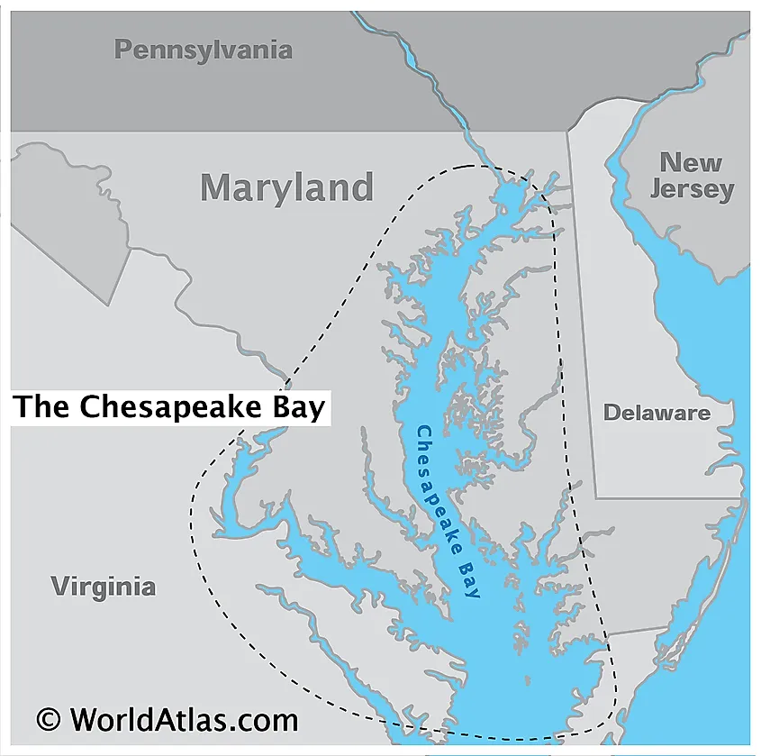
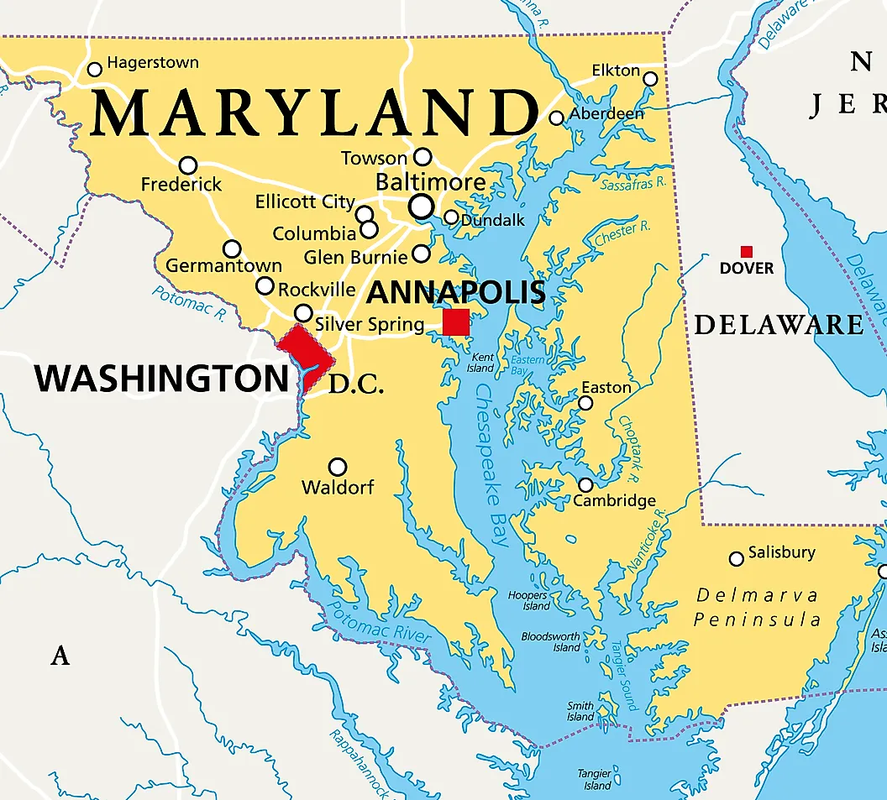
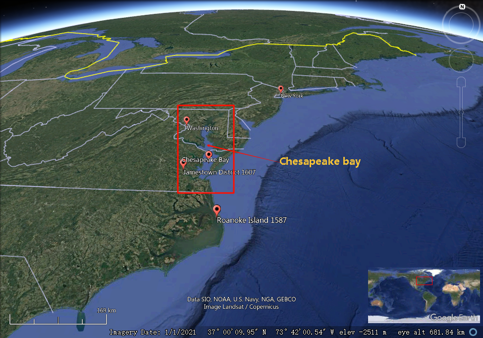
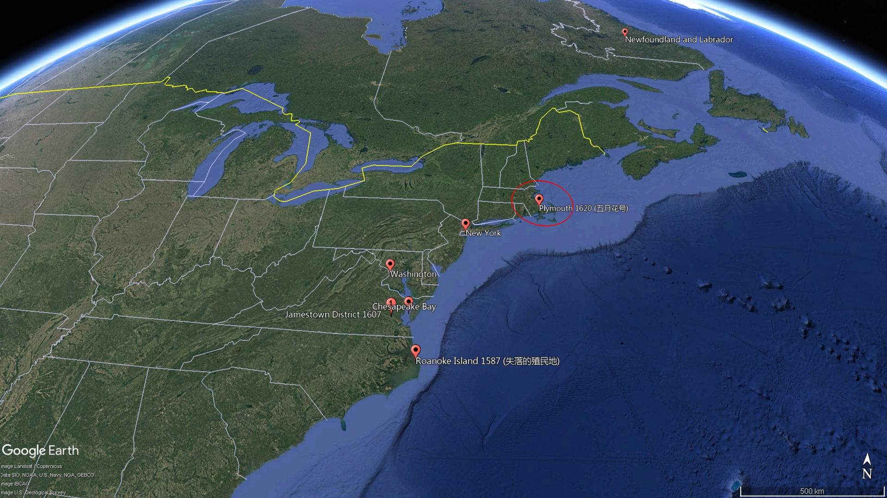
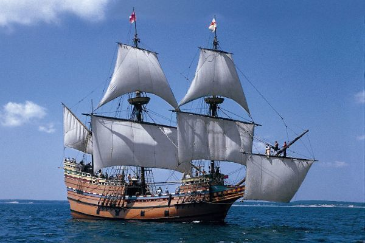

= American Pageant - 003 (1620-1700)
:toc: left
:toclevels: 3
:sectnums:
:stylesheet: ../../myAdocCss.css

'''

== 释义

What's going down 近来好吗, US history 美国历史 people?  +
Today in this video we're going to take a look at 看一看 the New England 新英格兰 colonies 殖民地 and the middle colonies 中部殖民地.   +
No matter which book you're using for APUSH 美国大学预修历史课程, this video is going to help you out /with all of the important stuff 重要内容.   +
Let's get started 让我们开始吧.

First important thing to keep in mind 记住 is /where are these New England colonies (n.) - and they're right here.   +
And as you can see, there's a couple of things that characterize (v.)以...为特征 this region.   +
Many of the people who are going to the New England colony /are going for religious motives 宗教动机.   +
*There's going to be* much more of a mix of both male and female settlers 男性与女性定居者.   +
Many people are coming over 过来(指某人即将到达或来访) as families, and they're going to form (v.) tight-knit (a.)亲密的，紧密的 communities 紧密联系的社区 /and they're going to have a mixed economy 混合经济.   +
And make sure you know about the differences /*between* the New England colonies *and* those in the Chesapeake region 切萨皮克地区 (Virginia and Maryland).

[.my1]
.案例
====
.Chesapeake region

Covering an area of 11,601 km2, _the Chesapeake Bay_ is the world’s third-largest estuary 河口；江口 /and the largest estuary in the United States.

切萨皮克湾面积为 11,601 平方公里 ，是世界第三大河口 ，也是美国最大的河口。

It is estimated that /over 150 major rivers and streams flow into the Bay （海或湖的）湾 /and `主` its 166,534 sq. km _drainage  排水系统；排水 basin_ 流域 `谓` covers (v.) portions 部分 of six US states: Maryland, Delaware, Virginia, Pennsylvania, West Virginia, and New York *as well as* the entire District of Columbia. Over 18 million people `谓` live (v.) in the Chesapeake Bay watershed （美）流域.

据估计，超过 150 条主要河流和溪流汇入该湾，其流域面积达 166,534 平方公里，覆盖美国六个州的部分地区：马里兰州、 特拉华州 、弗吉尼亚州、 宾夕法尼亚州 、 西弗吉尼亚州和纽约州以及整个哥伦比亚特区 。切萨皮克湾流域人口超过 1800 万。
====

The first of _the New England colonies_ to be founded 建立 is the Plymouth Colony 普利茅斯殖民地, and really it's a result of religious conflict 宗教冲突 in Europe.   +
Recall (v.)回想起；使想起 `主` _the Protestant 新教徒的 Reformation_ 新教改革 `谓` sparked (v.) dramatic changes 引发剧变 in Europe /and *led to* a rise of Puritanism 清教主义的兴起, and this happens (v.) in England *as well*.  +
And you get a group of people known as Puritans 清教徒, and their whole idea is `表`  they wanted to purify (v.)净化 the church.   +
They were harassed (v.)迫害 by the monarchy 君主制 over 在（某地）,那边的 in England.   +
The king felt (v.) `宾` they were a threat 威胁.   +
Many Puritans were arrested, and they had these new ideas *such as* predestination 预定论 -- that God `谓` already chose (v.) who *was saved* /before even being born.

[.my1]
.案例
====
.Plymouth Colony

.They were harassed by the monarchy *over in England*. 他们受到英格兰那边的君主制迫害。
"over"​​ 用来强调地理上的 ​​“在（某地）”​​ 或 ​​“那边的”​​，通常带有一定的距离感或对比意味。 +
"over in England"​​ = ​​“在英格兰那边” +

例 : +
- "My friend over in Japan `谓` sent me a gift."（我在日本那边的朋友给我寄了礼物。） +
- "The weather over in California `系` is great."（加州那边的天气很好。）

如果说话者或听众 ​​不在英格兰​​，"over" 能暗示 ​​“在另一个地方”​​（比如美国人在谈英国历史时）。 +

如果去掉 "over"，句子仍然成立：
"They were harassed by the monarchy in England."（他们在英格兰受到君主制的迫害。）
但加上 "over" 会让语气更自然，更像日常对话。

.predestination
[ U]the theory or the belief that everything that happens has been decided or planned in advance by God or by fate and that humans cannot change it 宿命论；命定说 +
-> pre-,在前，destine,注定，预定，词源同destiny.
====

One group of Puritans, the Pilgrims 朝圣者, were much more radical 激进的，极端的/hardcore (硬核的) 更激进/强硬.   +
These were separatists 分离主义者 who wanted *to break away from* 摆脱,脱离 the Anglican Church 英国国教.     +
They actually try to get to Virginia /but they get a little lost 有点迷路 (like most of the Europeans do /coming over to the new world) /and they *land* (v.) over there 到那个地方 in the Massachusetts Bay 马萨诸塞湾 /*at* what becomes (v.) known as Plymouth.   +
They're aboard 上（船、飞机、火车等） the Mayflower 五月花号 - you could see a replica 复制品 right there over near Boston.  +
And before they even get to the colony, they signed (v.)something 后定 called the Mayflower Compact 五月花号公约, and this was an agreement 后定 establishing a basic government 建立基本政府 *based upon* majority rule 多数决原则.   +
It established (v.) the basis for self-government 自治基础.

[.my1]
.案例
====
.the Mayflower

====

One of the key figures 关键人物 in the Plymouth Colony /is going to be a guy /by the name of William Bradford.   +
The colony's going to struggle (v.)艰难生存 in the beginning /*just like* our friends _over 那边 in Jamestown_ *did*, but not as much 但没有那么严重.   +
The weather is a little bit more favorable 更有利 - it's *not as* 不如；不及；没有……那么 hot, they don't have the mosquito problem 蚊虫问题, and they're going to get the help of a local Native American leader 原住民领袖 by the name of Squanto /who's going to help this colony survive (v.) by teaching them how to farm (v.)耕作 and hunt (v.)狩猎.   +
And of course the famous story - eventually they'll have (v.) the first Thanksgiving 第一次感恩节.

[.my1]
.案例
====
.like our friends over in Jamestown did, but not as much
"over" 在这里表示地理上的“那边”​​，指代另一个地方（与当前讨论的普利茅斯殖民地相对）。 +
"but not as much"​​ 表示 ​​“但困境程度不如詹姆斯敦”​​。"not as much"​​ = 程度较轻，需结合前文动词（此处是“struggle”）。

背景:​​ +
詹姆斯敦（1607年建立）初期遭遇饥荒、疾病，死亡率极高（“饥饿时期”）； +
普利茅斯（1620年建立）虽也艰难，但原住民帮助更多，死亡率较低。 +

.Thanksgiving
美国的感恩节历史由来可以追溯到1621年，著名的“五月花”号船满载不堪忍受英国国内宗教迫害的清教徒102人到达美洲，好心的印第安人不仅送给了他们许多生活必需品，还教他们怎样狩猎、捕鱼和种植玉米、南瓜，在印第安人的帮助下，移民们获得了丰收。在欢庆丰收的日子，为感谢印第安人的真诚馈赠和帮助，移民们邀请他们一同庆祝，感谢上苍赐予丰收果实，这就成为了美国历史上的第一个感恩节。

美国人通常称之为“第一感恩节”的活动, 是在1621年他们在新大陆有了第一次收获之后, 由朝圣者庆祝的。[4] 这次宴会持续了三天，据参会者爱德华温斯洛[5]所说，宴会有90个美洲原住民, 和53个朝圣者参加。[6]新英格兰殖民者习惯于**定期庆祝“感恩节” - 祷告感谢上帝的祝福，如军事胜利, 或干旱的结束。**

最初感恩节没有固定日期，由美国各州临时决定。直到1863年，**林肯总统宣布感恩节为全国性节日。1941年，美国国会正式将##每年11月第四个星期四, 定为“感恩节”。##感恩节假期一般会从星期四, 持续到星期天(共4天)。**除了美国、加拿大，世界上还有埃及、希腊等国家, 有自己独特的感恩节。

美国感恩节是一个美国人民每年在"11月的第四个周四"庆祝的感恩节的 一种的公共节日。它起源于"丰收节"。自1789年乔治·华盛顿宣布之后，感恩节一直在全国范围内的庆祝。 +
*在美国文化中，感恩节被认为是"秋冬假期"的开始，其中包括圣诞节和新年。*

传统的感恩节大餐, 一般会有烤火鸡、红莓酱、土豆泥、肉末馅饼、火腿、红薯等，饭后甜品通常是南瓜饼。**烤火鸡作为感恩节的传统主菜，**最开始是印第安人教美国人做"烤火鸡"充饥，而后这个传统一直保留沿用至今。
====

So the Pilgrims 清教徒 are the first landing 首次登陆 at Plymouth in 1620, but *later on* 稍后 /you get more Puritans coming over /and they're going to establish 建立 _the Massachusetts Bay Colony_.  +
Remember (v.) the Puritans want to reform (v.)改革 the Church - they don't want *to break away* 脱离.   +
They get a charter 特许状 from the King /to establish (v.) _the Massachusetts Bay Company_, and in 1629 /a Puritan 清教徒 by the name of John Winthrop `谓` receives a charter to establish (v.) that colony.   +
They are going to *land* (v.) in 1630 *in* what is today Boston.  +
And `主` the goal of _Winthrop and his Puritan followers_ `系` is *to*, as he said, *establish* (v.) and *to be as* "a city upon a hill 山巅之城."   +
Winthrop and his followers believed that /they had an agreement with God 与上帝的约定 to build (v.) this holy society 神圣社会 that *would serve as* a model 典范 for the rest of the world.   +
And so they're coming over here *with* these religious goals, and Winthrop is going to *serve as* their first governor 首任总督.

[.my1]
.案例
====
.Massachusetts Bay Company

_The Charter_ of _the Massachusetts Bay Company_ /was an English _royal charter_ /which formally incorporated (v.)包含，合并；组成公司 _the joint-stock company_ for the colonization of Massachusetts Bay.

*《马萨诸塞湾公司宪章》 是一份英国皇家特许状 ，正式成立了一家股份制公司， 负责马萨诸塞湾的殖民。*

The colony was to be settled /between the Charles River and the Merrimack River in New England. The Massachusetts Bay Company, like other colonial joint-stock companies, *was to be* a corporate entity *as well as* a governmental one. The first settlers of the colony `系` were Puritans /who sought (v.) to create (v.) a society *based on* their religious beliefs *unfettered 无拘无束的；被除去脚镣的 from* _the Royal Anglican government_ 英国圣公会政府 of the Kingdom of England.  +
The settlers were to be shareholders 股东，投资者；股民, with `主` all those 后定 wishing (v.) *to emigrate (v.) to* New England `谓` required (v.)  *to buy (v.) shares*. This agreement was formulated (v.)规划；用公式表示；明确地表达 in Cambridge /and *came to be known as* the Cambridge Agreement.[3][4]

该殖民地位于新英格兰查尔斯河,与梅里马克河之间。**与其他殖民地股份公司一样，马萨诸塞湾公司既是政府实体，也是法人实体。殖民地的首批定居者是清教徒 ，他们寻求创建一个基于自身宗教信仰、不受英格兰王国皇家圣公会政府束缚的社会。#定居者将成为股东，所有希望移民新英格兰的人, 都必须购买股份。#**该协议在剑桥制定，后来被称为《 剑桥协议》 。

Unlike other colonial companies 后定 `主` whose presiding members `谓` resided (v.) and met (v.) in England, `主` the governors and other colonial officials `谓` *moved to* New England *as well*. The government *consisted of* 由……组成 a Governor 州长，省长，总督, Deputy 副手，副职 Governor, _a council 委员会，理事会；政务委员会，地方议会 of assistants_ 助理 who would provide (v.) legal counsel and jurisprudence, and a General Court of delegates 后定 elected from each town.[5][6]

**与其他殖民地公司（其主席成员居住在英格兰并在英国开会）不同，总督和其他殖民地官员也迁往新英格兰。**政府由总督 、 副总督 、提供法律顾问和法理依据的助理委员会 ，以及由各镇选出的代表组成的总法院组成。 [ 5 ] [ 6 ]

Voting rights in the colony were to be for only men of the Puritan church. Once settled in what is now Boston, the delegates formed a quasi-democratic and theocratic state based on the Laws of Moses.[7]

**殖民地的投票权, 原本只属于清教徒男子。**在如今的波士顿定居后，代表们根据摩西律法, 建立了一个准民主的神权国家。 [ 7 ]

The charter served as _the constitution of the colony_. It was revoked by an English court in 1684, but continued to serve as a *de facto* 实际上的 constitution /until the creation of _the Dominion 主权，统治权；支配；领土 of New England_ in 1686. Following the 1689 Boston revolt and collapse of the dominion, it again served as the governing document /until the issuance of _the royal charter_ for _the Province of Massachusetts Bay_ in 1692.

**该宪章被视为殖民地的宪法。**1684 年，它被英国法院撤销，但其事实上的宪法一直有效，直至 1686 年"新英格兰自治领"成立 。1689 年波士顿起义爆发 ，自治领瓦解后，它再次成为殖民地的统治性文件，直至 1692 年"马萨诸塞湾省皇家宪章"颁布。

.the Massachusetts Bay Colony

image:/img/the Massachusetts Bay Colony.jpg[,70%]

image:/img/the Massachusetts Bay Colony 3.jpg[,100%]

image:/img/the Massachusetts Bay Colony 2.png[,100%]

The Massachusetts Bay Colony (1628–1691), more formally the Colony of Massachusetts Bay, was an English settlement on the east coast of North America around Massachusetts Bay, one of the several colonies later reorganized as the Province of Massachusetts Bay. The lands of the settlement were in southern New England, with initial settlements on two natural harbors and surrounding land about 15.4 miles (24.8 km) apart—the areas around Salem and Boston, north of the previously established Plymouth Colony. The territory nominally administered by the Massachusetts Bay Colony covered much of central New England, including portions of Massachusetts, Maine, New Hampshire, and Connecticut.

马萨诸塞湾殖民地 （1628-1691），**是后来重组为"马萨诸塞湾省"的几个殖民地之一。**殖民地的土地位于新英格兰南部，*最初的定居点位于两个天然良港, 及其周围相距约 15.4 英里（24.8 公里）的土地上 —— 即"塞勒姆"和"波士顿"周围的地区*，位于先前建立的"普利茅斯殖民地"以北。 +
"马萨诸塞湾殖民地"名义上管理的领土, 覆盖了"新英格兰"中部的大部分地区，包括马萨诸塞州 、 缅因州 、 新罕布什尔州和康涅狄格州的部分地区。

The Massachusetts Bay Colony was founded 建立；创立 by the owners of the Massachusetts Bay Company, including investors 后定 in the failed  失败的 _Dorchester Company_, which had established a short-lived 短暂的，短期的 settlement on _Cape Ann_ 安妮角 in 1623. The colony began in 1628 and was the company's second attempt at colonization. It was successful, with about 20,000 people migrating to New England in the 1630s. The population was strongly Puritan and was governed largely by a small group of leaders strongly influenced by Puritan teachings. It was the first slave-holding colony in New England, and its governors were elected by an electorate limited to freemen who had been formally admitted to the local church. As a consequence, the colonial leadership showed little tolerance for other religious views, including Anglican, Quaker, and Baptist theologies.

马萨诸塞湾殖民地, 是由"马萨诸塞湾公司"的所有者建立的，其中包括破产的"多切斯特公司"的投资者.
该公司曾于 1623 年, 在安角建立了一个短暂的定居点。殖民地始于 1628 年，是该公司第二次殖民尝试。它的成功之处在于，*17 世纪 30 年代约有 20,000 人移居到新英格兰 。##殖民地居民是虔诚的清教徒 ，##主要由一小群深受清教教义影响的领导人统治。这是新英格兰第一个奴隶制殖民地. ##其总督由仅限于正式加入当地教会的自由民的选民, 选举产生。因此，殖民地领导层对其他宗教观点，##包括英国国教 、 贵格会 和浸信会神学，#几乎没有宽容。#*

The colonists had good relationships with the local Native Americans; however, they did join their neighbor colonies in the Pequot War (1636–1638) and King Philip's War (1675–1678). After that, most of the Indians in southern New England made peace treaties with the colonists or were sold into slavery after King Philip's War (apart from the Pequot tribe, whose survivors were largely absorbed into the Narragansett and Mohegan tribes following the Pequot War).

殖民者与当地美洲原住民, 关系良好；然而，他们在佩科特战争 （1636-1638 年）和菲利普国王战争 （1675-1678 年）中, 加入了邻近殖民地。此后，*新英格兰南部的大多数印第安人, 要么与殖民者签订了和平条约，要么在"菲利普国王战争"后被卖为奴隶*（ 佩科特部落除外，其幸存者在佩科特战争后, 大部分被纳拉干西特部落, 和莫希干部落吸收）。

Political differences with England after the English Restoration led to the revocation of the colonial charter in 1684. King James II established the Dominion of New England in 1686 to bring all of the New England colonies under firmer crown control. The Dominion collapsed after the Glorious Revolution of 1688 deposed James, and the Massachusetts Bay Colony reverted to rule under its revoked charter until 1691, when a new charter was issued for the Province of Massachusetts Bay. This new province combined the Massachusetts Bay territories with those of the Plymouth Colony and proprietary holdings on Nantucket and Martha's Vineyard. Sir William Phips arrived in 1692 bearing the charter and formally took charge of the new province, when the colony, beginning in Salem Village, was coming to grips with the witch trials crises.

*#英国复辟后，与英国的政治分歧, 导致 1684 年"殖民特许状"被撤销。1686 年， 詹姆斯二世国王建立了"新英格兰自治领" ，将所有新英格兰殖民地, 置于英国王室更牢固的控制之下。#* +
##**1688 年光荣革命废黜詹姆斯后，自治领瓦解，马萨诸塞湾殖民地根据被撤销的特许状, 恢复统治. 直到 1691 年颁发了"马萨诸塞湾省的新特许状"。**##这个新省, 将"马萨诸塞湾地区"与"普利茅斯殖民地", 以及楠塔基特岛和玛莎葡萄园岛的专有财产, 合并。 威廉·菲普斯爵士于 1692 年带着"特许状"来到这里，正式掌管这个新省，当时，从塞勒姆村开始的殖民地, 正努力应对女巫审判危机。

Plymouth Colony would remain separate from Massachusetts Bay Colony until the creation of the Province of Massachusetts Bay.

在马萨诸塞湾省成立之前， 普利茅斯殖民地一直与马萨诸塞湾殖民地分离。
====

Religion is extremely important /in the New England colonies.   +
In fact, education was required - they established Harvard University 哈佛大学 to train (v.) Puritan ministers 清教牧师.   +
But important to note (v.): religious freedom 宗教自由 was reserved (v.)预约；保留，贮备；拥有（某种权利等） only for Puritans.   +
Church membership 教会成员资格 was a requirement 必要条件 for participation 参加，参与 in politics 政治参与.   +
In fact, in all the New England towns /you had *not only* schools *but also* the church *and* the town hall meeting 市政厅会议.   +
The _town hall meeting_ becomes an important part of _direct democracy_ 直接民主 /in _Colonial America_ 殖民时期的美国 and especially _the New England colonies_.   +
All _churchgoing (a.)经常上教堂的；经常去做礼拜的 males_ 参加教会的男性 *could participate in* this form of direct democracy.

And in the New England colonies /we have a mixed economy 混合经济 of both agriculture 农业 and commerce 商业.   +
The weather was much cooler *up 向北 there*, so they're not going to rely on 依赖 cash crops 经济作物 like we're going to see in the Chesapeake or the South.   +
Now keep in mind that /`主` religious toleration 宗教宽容 `系` was not something that *was practiced* in the New England colonies, and `主` people 后定 who expressed  (v.)表达 _religious dissent_ (（与官方的）不同意见，异议) 宗教异议,宗教异见 `谓` *were* very often quickly *dealt with* 迅速处理.

[.my1]
.案例
====
.The weather was much cooler up there
​"up"​​ 是一个表示 ​​地理方位或相对位置​​ 的副词，用来强调 ​​"新英格兰殖民地（New England colonies）位于更北边（纬度更高）的地方"​​。 +
The weather was much cooler *up there* 新英格兰殖民地那边气候凉爽得多 （*"up" = "那边"，隐含北方*）

*在英语中，​​"up"​​ 常用来表示 ​​"向北"​​（尤其在地图上，北方通常在上方）。*
例如： +
- "I’m *traveling up* to Canada."（我要**北上**去加拿大。） +
- "Boston is up north /compared to New York."（波士顿在纽约的北边。）

"up there" = 在那边（北方）​​：
这里的 ​​"there"​​ 指代前文提到的 ​​"New England colonies"​​（今美国东北部，如马萨诸塞、康涅狄格等），而 ​​"up"​​ 强调这些殖民地 ​​比切萨皮克（Chesapeake）或南方（South）更靠北​​。

为什么用 "up" 而不用 "north"？​​ +
​​口语习惯​​：
*英语母语者在描述南北方向时，常用 ​​"up/down"​​ 替代 ​​"north/south"​​，更自然流畅。* +
例如： +
- "It’s colder *up in Maine*."（缅因州那边更冷。） +
- "They *went down to* Florida for the winter."（他们**南下**去往佛罗里达过冬。） +
- "*Up in Alaska*, the winters are extreme."
（在阿拉斯加那边，冬天极其寒冷。） +
- "Prices are higher *up in the city*."
（城市那边的物价更高。） <- 这里的 ​​"up"​​ 并非必须翻译，但理解其 ​​"向北" 的方位暗示,​​ 能帮助掌握句子逻辑
====

One such individual `系` is Roger Williams. He questioned 质疑 the Puritan leadership 清教领导层 of the colony - he questioned the leaders and the doctrine 教义, and he *called for* _the complete separation_ of church and state 政教完全分离. And he also criticized (v.) the colony's treatment of Native Americans 对待原住民的方式. He felt (v.) the colonies should *pay* (v.) the natives *for* their land (what a crazy idea).  +
And because of his questioning 盘问，询问 of the colony, he *is banished* (v.)驱逐，流放 from the Massachusetts Bay Colony - he'*s kicked out* 驱逐,踢出去 - and he *goes off* 离开，离去 to form (v.) his own colony *known as* Providence 地名（美国罗得岛州的首府）,  Rhode Island 罗德岛州.   +
This is going to be a really important colony (you could see it /right there on the map) /because it's the first colony with complete religious freedom 完全的宗教自由.

[.my1]
.案例
====
.Providence
image:/img/Providence.jpg[,70%]
====

Another individual (n.) you should know about `系` is Anne Hutchinson.   +
She does something *worse than* Roger Williams - she's a woman /and she *speaks out* 坦率地表达意见,公开反对.   +
She challenged (v.) _the accepted (a.)公认的，为公众所接受的 role of women_ 女性既定角色 within the church /by *openly speaking out against* church leaders.   +
And just like Roger, she *is also kicked out of* the Massachusetts Bay Colony.

Make sure you know about the relationship between the colonists 殖民者 and Native Americans 美洲原住民.   +
*As* the New England colonies *grow* (v.) (you're going to see (v.) all the different ones /which will eventually form (v.), they're inevitably  不可避免地，必然地 going to *come into contact with* 接触 Native people.   +
There is a massacre 大屠杀 that *takes place* in the 1630s *called* the Pequot War 佩科特战争 where the New England colonists *nearly wipe out* 几乎消灭 the Pequot tribe 佩科特部落.   +
And *you could see* [in that illustration] *them* attacking a Pequot village.

`主` One of the things the colonists do `系` is they form (v.) something *called* _the New England Confederation_ 新英格兰联盟 in 1643, and this is a military alliance 军事联盟 of _all the New England colonies_ except Rhode Island.   +
And it's intended (a.) *to defend* (v.)保卫 the New England colonies *against* potential threats 潜在威胁.   +
And the threats were many -- we got** not only** Native American threats /*but* you have the presence 存在 of _the Dutch 荷兰人的存在 a little bit further south_ and also _the French out in the west_.  +
England's in a civil war 内战 - there's _all sorts of problems_ 各种各样的问题 in England /so the colonies are kind of left (v.) *to fend (v.)自谋生计，照顾自己 for themselves* 自生自灭.   +
And so _the New England Confederation_ is an example of colonial unity 殖民地团结 *having a common purpose* 共同目标 后定 which is _the defense of the colonies_.

[.my2]
因此，新英格兰联邦是殖民地团结的一个例子，它有一个共同的目的，那就是保卫殖民地。

[.my1]
.案例
====
.New England Confederation
新英格兰联合殖民地 ，通常称为新英格兰邦联 ，是 1643 年 5 月英国内战期间由马萨诸塞湾 、 普利茅斯 、 塞布鲁克 （康涅狄格州）和纽黑文等新英格兰殖民地组成的邦联联盟。**其主要目的是团结清教徒殖民地，支持公理会，并防御美洲原住民, 和荷兰新尼德兰殖民地的侵袭。**这是殖民地统一漫漫征程上的第一个里程碑.

17 世纪 80 年代初，在多项殖民宪章被撤销后，邦联解散。

**新英格兰邦联注定只能维持不到四十年。它的历史，如同其他邦联一样，充斥着不和——最强大的一方不断侵占较弱的成员，所有成员也无视"全体成员达成的一致意见"。**然而，联盟的主要目标还是实现了。

image:/img/New England Confederation.jpg[,70%]

.FEND FOR YOURˈSELF
to take care of yourself without help from anyone else照料自己；自谋生计

====

A really important war you should know about `系` is King Philip's War 菲利普王战争 (or Metacom's War - Metacom was his Native American name).   +
Metacom was the leader of the tribe, and he starts (v.) *organizing (v.) a resistance* 组织抵抗 - an alliance of native tribes 原住民部落联盟 to try *to remove* (v.) the Puritan settlements 清教徒定居点 *from* his territory.  +
This time, unlike during the Pequot War, King Philip or Metacom has weapons 武器 - you could see that in the image.   +
They're armed - they have these trade guns 贸易火枪 /so they could fight back 反击 and have a shot 有一战之力,有机会.   +
But unfortunately for King Philip, he's eventually killed /and the resistance is crushed 镇压.   +
Significant about King Philip's War: it is the last of _the major Native American resistance_ (n.) to the New England colonies.  +
And `主` *not only is it* the increasing (a.) population of the colonies, *but* diseases `谓` are causing (v.) _cultural and demographic (a.)人口的，人口统计的 changes_ 文化人口结构变化 for the native people in the New England region.

[.my1]
.案例
====
.they have these trade guns /so they could fight back and have a shot.
"have a shot"双关语处理为"有一战之力"，兼顾字面和隐喻
====

Moving out of the New England colonies, make sure you know about the middle colonies 中部殖民地 - and we really call these _the "Bread Basket" colonies_ 面包篮殖民地 /because they're going to produce a lot of the food for the colonists.

[.my1]
.案例
====
.middle colonies
中部殖民地：美国历史上的一个地区，位于新英格兰殖民地和南部殖民地之间，包括纽约  New York、新泽西  New Jersey、宾夕法尼亚 Pennsylvania ,和特拉华 Delaware  四个殖民地。

中部殖民地是英属美洲十三个殖民地中的一个，**位于"新英格兰殖民地"和"南部殖民地之间"。**与切萨皮克湾殖民地一起，这一地区大致构成了如今的中大西洋各州 。

**在英国控制该地区之前，该地区的大部分地区曾是荷兰"新尼德兰殖民地"的一部分。英国在 1664 年左右与荷兰的战争中占领了该地区的大部分地区，**被征服的大部分土地成为了纽约省 。 约克公爵和英国国王后来将这些土地的所有权授予他人，这些土地后来成为了新泽西省和宾夕法尼亚省 。特拉华殖民地后来从威廉·佩恩建立的宾夕法尼亚州分离出来。

后来的定居者包括各种新教教派的成员，他们在**中部殖民地受到成文的"宗教自由法"的保护。这种宽容, 与其他英国殖民地的情况不同，非常不寻常。**

image:/img/middle colonies 3.jpg[,49%]
image:/img/middle colonies.svg[,49%]
image:/img/middle colonies 2.jpg[,49%]

image:/img/middle colonies 4.jpg[,100%]

====

The first one is actually inhabited 占据,有人居住的 by the Dutch - and before it becomes New York, it was originally _a Dutch colony_ called New Amsterdam 新阿姆斯特丹 (you could see [there in the purple 紫色] 后定 _some of the territory 后定 Holland controlled_ (v.) and _what their colony **looked like**_ 你可以看到, 紫色部分是荷兰控制的领土和他们的殖民地).  +
Unfortunately for the Dutch, they did not have a firm grasp 牢固控制 on their colony, and Charles II sends a military expedition 军事远征 /and *grants* (v.) [专利]授予；同意；承认 the area *to* his brother James, the Duke 公爵；（尤指旧时欧洲部份地区小公国的）君主 of York.  +
The territory of New Amsterdam is going to become New York, and it's going to remain a _very religious (a.) and ethnically diverse_ (a.)不同的，各式各样的  colony 它仍将是一个宗教信仰和种族多元化的殖民地.

Another important colony is Pennsylvania 宾夕法尼亚, founded in 1681 by William Penn as a refuge 避难所 for Quakers 贵格会教徒. + 

He wanted to create a "holy experiment 神圣实验". +

The group Quakers was actually known as the Religious Society of Friends (Quakers was their nickname). + 

They're pacifists 和平主义者, they were treated very poorly in England, and so William Penn wants to establish this colony and the crown grants him a block of land 一块土地. + 
 This is a proprietorship 业主殖民地. + 
 Penn creates a very liberal colony 自由殖民地 - there is representative assembly 代议制议会 (people are voting for representation), he seeks to treat the Native Americans very fairly by buying land from them rather than just taking it. + 
 There is widespread religious toleration 广泛的宗教宽容 and freedom in Pennsylvania, and certain rights are extended to women as well - they have a right to be active in the church and to even be preachers 传教士 (things that did not happen in the New England colonies). + 

Some key things about the middle colonies to keep in mind is they are going to be demographically, religiously, and ethnically diverse 人口、宗教和种族多元化. + 
 So you got a mix of people in this area whether it be the Dutch, the Quakers, Protestants 新教徒, Puritans, and so on. + 
 And their economics are like I said - "Bread Basket" - they're going to be producing food especially wheat and corn, but they're also going to be involved in trade 贸易 and other things. + 

Now that we've broken down 分析完 all the different regions of the colonies, make sure you understand some colonial policy 殖民政策. + 
 Remember the colonies are there because of this economic theory known as mercantilism 重商主义 - the colonies exist to enrich 使富裕 the mother country 母国 (in this case England). + 
 However, in this early period you have this thing called salutary neglect 有益的忽视. + 
 England was involved in its own internal conflicts 内部冲突 such as the English Civil War, and so they're going to be largely indifferent to 漠不关心 the colonies - they're going to kind of be letting them do their own thing 放任自流 for a big chunk of this time. + 

There are some exceptions though - we have some policies that are put in place 实施, some mercantile laws 商业法律 such as the Navigation Acts 航海条例. + 
 And this is really England trying to keep watch over 监管 its colonies. + 
 The Navigation Acts did things like: 1) trade must be carried only on English or colonial ships 英国或殖民地船只; 2) trade had to pass through English ports 英国港口 before it can move on to other places such as France; and 3) certain enumerated goods 特定列举商品 (certain goods that are spelled out) from the colonies could be exported only to England (and it starts off with tobacco, but other goods are only allowed to be traded with England). + 

There is very loose enforcement 松散执法 in the beginning - in fact, smuggling 走私 was a major problem. + 
 The colonists were very often trading with the French and the Dutch and others. + 
 But later on, the English are going to try to deal with that problem - stay tuned 敬请期待. + 
 There are going to be instances where England's going to try to clamp down on 压制 the colonies. + 
 You could see that whole region in the green is going to be something called the Dominion of New England 新英格兰自治领 in 1686. + 
 This is implemented by England to increase royal control 加强王室控制 over the colonies, and the King sends over an individual by the name of Sir Edmund Andros to regulate and keep these colonies in check 约束. + 
 And he does a couple of things most of which are very unpopular - such as enforcing the Navigation Acts (which the colonies were largely ignoring), limiting the town hall meetings and other things. + 

And it's important to note the goals and interest of European leaders in England very often at times diverge from 与. + 
. + 
. + 
分歧 those of the colonists, and this led to mistrust 不信任 on both sides of the Atlantic. + 
 This Dominion of New England will eventually end with the Glorious Revolution 光荣革命 in 1688 which we'll take a look at next time. + 
 And until next time, I hope you learned a whole bunch of stuff 一大堆东西. + 
 And if you did, click like on the video, tell your friends about Joe's Productions, subscribe to the channel. + 
 If you have any questions or comments, post them in the comments section. + 
 Have a beautiful day. + 
 Peace!

'''

== 中文翻译

美国历史爱好者们，最近怎么样？今天这期视频我们将聚焦"新英格兰殖民地", 和中部殖民地。无论你使用哪本AP美国史教材，这个视频都会帮你梳理所有重要知识点。让我们开始吧！

首先要明确**"#新英格兰殖民地#"**的位置——就在这里。这个地区有几个显著特征：*##许多移民是出于宗教动机来到这里的，男女比例更为均衡，很多人举家迁徙并形成了紧密的社区，经济发展也呈现多元化。##请务必注意"新英格兰殖民"地与"切萨皮克地区"（弗吉尼亚和马里兰）的差异。*

*最早建立的是"普利茅斯殖民地"，这源于欧洲的宗教冲突。宗教改革运动催生了"清教主义"，英国也出现了主张"净化教会"的##清教徒群体。他们因"预定论"等新思想（认为上帝在出生前, 就已选定得救者）遭到英国王室迫害。##其中更激进的分离派（即朝圣者）试图脱离英国国教，他们原本计划前往弗吉尼亚，但1620年乘"五月花号"误抵马萨诸塞湾的普利茅斯。登陆前签署的《五月花公约》奠定了基于多数统治的自洽政府基础。 +
英国人不赞同政府理念, 可以跟这个国家断绝关系, 去海外建国. 中国人呢? 只能跳海? 道不行，乘桴浮于海? )*

**普利茅斯**的关键人物, 是威廉·布拉德福德。虽然初期与詹姆斯敦一样艰难，但得益于更温和的气候（没有蚊虫肆虐）和原住民斯宽托的农业指导，*殖民地最终存活下来，并诞生了第一"个感恩节"故事。*

1620年朝圣者登陆后，**更多清教徒于1630年在约翰·温斯罗普带领下, 建立"#马萨诸塞湾殖民地#"。温斯罗普立志打造"#山巅之城#"，要建立为世界典范的神圣社会。这里宗教氛围浓厚，创建了哈佛大学培养牧师，#但"宗教自由"仅限"清教徒"——只有教会成员才能参政。"市政会议"成为新英格兰"直接民主"的重要形式#，所有信教男性都可参与。**

*新英格兰实行"农业"与"商业"并重的混合经济。由于气候较冷，这里不像南方依赖经济作物。宗教异见者会遭严厉处置*：**罗杰·威廉姆斯因主张"政教分离"、**批评对待原住民的方式, *而被驱逐，后创建宗教完全自由的罗德岛"普罗维登斯殖民地"；安妮·哈钦森则因身为女性公开质疑教会权威, 同样遭驱逐。*

殖民者与原住民的关系日趋紧张：1630年代爆发"佩科特战争"，新英格兰联盟（1643年除罗德岛外, 各殖民地组成的军事同盟）共同防御荷兰、法国及原住民威胁。1675年菲利普王战争（原住民领袖"梅塔科姆"领导的武装抵抗）是原住民最后一次大规模抗争，最终以殖民者胜利告终。

中部殖民地被称为"面包篮"，主要生产粮食。**纽约原为荷兰殖民地"新阿姆斯特丹"，1664年被英国夺取并更名。** +
"宾夕法尼亚"由威廉·佩恩1681年建立，作为"贵格会"避难所, 实行"宗教宽容政策"：通过购买, 来获得原住民土地，允许女性担任牧师，设立"代议制议会"。

**早期英国因内战, 对殖民地实行"有益忽视"，但《航海条例》（要求殖民地贸易, 必须经英国船只和港口来运输）等重商主义政策, 逐渐引发矛盾。**1686年"新英格兰自治领"的设立（由埃德蒙·安德罗斯爵士强化王权控制）激化对立，直到1688年光荣革命才结束。这种母国与殖民地日益加深的信任危机，为后续历史埋下伏笔。

下期我们将探讨"光荣革命"的影响。如果觉得有帮助，请点赞视频、推荐给朋友并订阅频道。有任何问题欢迎留言。祝你有美好的一天！再见！

'''

== pure

What's going down, US history people? Today in this video we're going to take a look at the New England colonies and the middle colonies. No matter which book you're using for APUSH, this video is going to help you out with all of the important stuff. Let's get started.

First important thing to keep in mind is where are these New England colonies - and they're right here. And as you can see, there's a couple of things that characterize this region. Many of the people who are going to the New England colony are going for religious motives. There's going to be much more of a mix of both male and female settlers. Many people are coming over as families, and they are going to form tight-knit communities and they're going to have a mixed economy. And make sure you know about the differences between the New England colonies and those in the Chesapeake region (Virginia and Maryland).

The first of the New England colonies to be founded is the Plymouth Colony, and really it's a result of religious conflict in Europe. Recall the Protestant Reformation sparked dramatic changes in Europe and led to a rise of Puritanism, and this happens in England as well. And you get a group of people known as Puritans, and their whole idea is they wanted to purify the church. They were harassed by the monarchy over in England - the king felt they were a threat. Many Puritans were arrested, and they had these new ideas such as predestination - that God already chose who was saved before even being born.

One group of Puritans, the Pilgrims, were much more radical/hardcore. These were separatists who wanted to break away from the Anglican Church. They actually try to get to Virginia but they get a little lost (like most of the Europeans do coming over to the new world) and they land over there in the Massachusetts Bay at what becomes known as Plymouth. They're aboard the Mayflower - you could see a replica right there over near Boston. And before they even get to the colony, they signed something called the Mayflower Compact, and this was an agreement establishing a basic government based upon majority rule. It established the basis for self-government.

One of the key figures in the Plymouth Colony is going to be a guy by the name of William Bradford. The colony's going to struggle in the beginning just like our friends over in Jamestown did, but not as much. The weather is a little bit more favorable - it's not as hot, they don't have the mosquito problem, and they're going to get the help of a local Native American leader by the name of Squanto who's going to help this colony survive by teaching them how to farm and hunt. And of course the famous story - eventually they'll have the first Thanksgiving.

So the Pilgrims are the first landing at Plymouth in 1620, but later on you get more Puritans coming over and they're going to establish the Massachusetts Bay Colony. Remember the Puritans want to reform the Church - they don't want to break away. They get a charter from the King to establish the Massachusetts Bay Company, and in 1629 a Puritan by the name of John Winthrop receives a charter to establish that colony. They are going to land in 1630 in what is today Boston. And the goal of Winthrop and his Puritan followers is to, as he said, establish and to be as "a city upon a hill." Winthrop and his followers believed that they had an agreement with God to build this holy society that would serve as a model for the rest of the world. And so they're coming over here with these religious goals, and Winthrop is going to serve as their first governor.

Religion is extremely important in the New England colonies. In fact, education was required - they established Harvard University to train Puritan ministers. But important to note: religious freedom was reserved only for Puritans. Church membership was a requirement for participation in politics. In fact, in all the New England towns you had not only schools but also the church and the town hall meeting. The town hall meeting becomes an important part of direct democracy in Colonial America and especially the New England colonies. All churchgoing males could participate in this form of direct democracy.

And in the New England colonies we have a mixed economy of both agriculture and commerce. The weather was much cooler up there, so they're not going to rely on cash crops like we're going to see in the Chesapeake or the South. Now keep in mind that religious toleration was not something that was practiced in the New England colonies, and people who expressed religious dissent were very often quickly dealt with.

One such individual is Roger Williams. He questioned the Puritan leadership of the colony - he questioned the leaders and the doctrine, and he called for the complete separation of church and state. And he also criticized the colony's treatment of Native Americans. He felt the colonies should pay the natives for their land (what a crazy idea). And because of his questioning of the colony, he is banished from the Massachusetts Bay Colony - he's kicked out - and he goes off to form his own colony known as Providence, Rhode Island. This is going to be a really important colony (you could see it right there on the map) because it's the first colony with complete religious freedom.

Another individual you should know about is Anne Hutchinson. She does something worse than Roger Williams - she's a woman and she speaks out. She challenged the accepted role of women within the church by openly speaking out against church leaders. And just like Roger, she is also kicked out of the Massachusetts Bay Colony.

Make sure you know about the relationship between the colonists and Native Americans. As the New England colonies grow (you're going to see all the different ones which will eventually form), they're inevitably going to come into contact with Native people. There is a massacre that takes place in the 1630s called the Pequot War where the New England colonists nearly wipe out the Pequot tribe. And you could see in that illustration them attacking a Pequot village.

One of the things the colonists do is they form something called the New England Confederation in 1643, and this is a military alliance of all the New England colonies except Rhode Island. And it's intended to defend the New England colonies against potential threats. And the threats were many - we got not only Native American threats but you have the presence of the Dutch a little bit further south and also the French out in the west. England's in a civil war - there's all sorts of problems in England so the colonies are kind of left to fend for themselves. And so the New England Confederation is an example of colonial unity having a common purpose which is the defense of the colonies.

A really important war you should know about is King Philip's War (or Metacom's War - Metacom was his Native American name). Metacom was the leader of the tribe, and he starts organizing a resistance - an alliance of native tribes to try to remove the Puritan settlements from his territory. This time, unlike during the Pequot War, King Philip or Metacom has weapons - you could see that in the image. They're armed - they have these dead guns so they could fight back and have a shot. But unfortunately for King Philip, he's eventually killed and the resistance is crushed. Significant about King Philip's War: it is the last of the major Native American resistance to the New England colonies. And not only is it the increasing population of the colonies, but diseases are causing cultural and demographic changes for the native people in the New England region.

Moving out of the New England colonies, make sure you know about the middle colonies - and we really call these the "Bread Basket" colonies because they're going to produce a lot of the food for the colonists. The first one is actually inhabited by the Dutch - and before it becomes New York, it was originally a Dutch colony called New Amsterdam (you could see there in the purple some of the territory Holland controlled and what their colony looked like). Unfortunately for the Dutch, they did not have a firm grasp on their colony, and Charles II sends a military expedition and grants the area to his brother James, the Duke of York. The territory of New Amsterdam is going to become New York, and it's going to remain a very religious and ethnically diverse colony.

Another important colony is Pennsylvania, founded in 1681 by William Penn as a refuge for Quakers. He wanted to create a "holy experiment." The group Quakers was actually known as the Religious Society of Friends (Quakers was their nickname). They're pacifists, they were treated very poorly in England, and so William Penn wants to establish this colony and the crown grants him a block of land. This is a proprietorship. Penn creates a very liberal colony - there is representative assembly (people are voting for representation), he seeks to treat the Native Americans very fairly by buying land from them rather than just taking it. There is widespread religious toleration and freedom in Pennsylvania, and certain rights are extended to women as well - they have a right to be active in the church and to even be preachers (things that did not happen in the New England colonies).

Some key things about the middle colonies to keep in mind is they are going to be demographically, religiously, and ethnically diverse. So you got a mix of people in this area whether it be the Dutch, the Quakers, Protestants, Puritans, and so on. And their economics are like I said - "Bread Basket" - they're going to be producing food especially wheat and corn, but they're also going to be involved in trade and other things.

Now that we've broken down all the different regions of the colonies, make sure you understand some colonial policy. Remember the colonies are there because of this economic theory known as mercantilism - the colonies exist to enrich the mother country (in this case England). However, in this early period you have this thing called salutary neglect. England was involved in its own internal conflicts such as the English Civil War, and so they're going to be largely indifferent to the colonies - they're going to kind of be letting them do their own thing for a big chunk of this time.

There are some exceptions though - we have some policies that are put in place, some mercantile laws such as the Navigation Acts. And this is really England trying to keep watch over its colonies. The Navigation Acts did things like: 1) trade must be carried only on English or colonial ships; 2) trade had to pass through English ports before it can move on to other places such as France; and 3) certain enumerated goods (certain goods that are spelled out) from the colonies could be exported only to England (and it starts off with tobacco, but other goods are only allowed to be traded with England).

There is very loose enforcement in the beginning - in fact, smuggling was a major problem. The colonists were very often trading with the French and the Dutch and others. But later on, the English are going to try to deal with that problem - stay tuned. There are going to be instances where England's going to try to clamp down on the colonies. You could see that whole region in the green is going to be something called the Dominion of New England in 1686. This is implemented by England to increase royal control over the colonies, and the King sends over an individual by the name of Sir Edmund Andros to regulate and keep these colonies in check. And he does a couple of things most of which are very unpopular - such as enforcing the Navigation Acts (which the colonies were largely ignoring), limiting the town hall meetings and other things.

And it's important to note the goals and interest of European leaders in England very often at times diverge from those of the colonists, and this led to mistrust on both sides of the Atlantic. This Dominion of New England will eventually end with the Glorious Revolution in 1688 which we'll take a look at next time. And until next time, I hope you learned a whole bunch of stuff. And if you did, click like on the video, tell your friends about Joe's Productions, subscribe to the channel. If you have any questions or comments, post them in the comments section. Have a beautiful day. Peace!
'''
