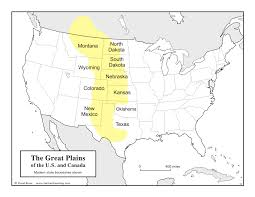
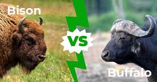
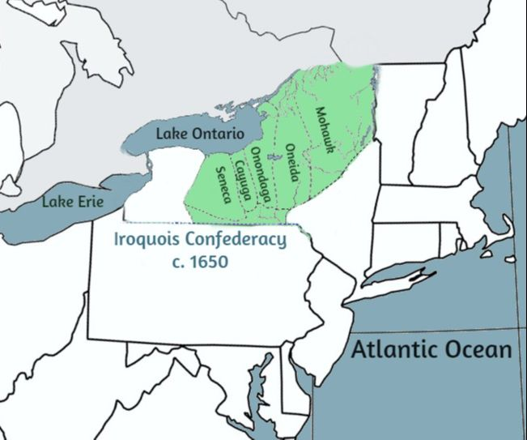
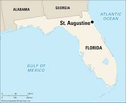

= American Pageant - 001 (1491-1607)
:toc: left
:toclevels: 3
:sectnums:
:stylesheet: ../../../myAdocCss.css

'''

== 释义

What's up 你好，出了什么事, ​​APUSH 美国大学先修课程历史​​ people?  +
Today, we're taking a look at Native American 美洲原住民 life 后定 pre-contact (a.)接触前时期,本地人与外来文化接触之前时期的 /and early colonization 殖民化.  +
No matter _which ​​APUSH​​ book_ you are using, this video is going to help you out /for the AP exam 大学先修课程考试.

And keep in mind: Over 10,000 years /before Columbus "discovered" America, people came to the Americas /via the ​​Bering Strait 白令海峡​​, and these individuals /we are going to know as Native Americans.  +
Native Americans developed a wide variety of social, political, and economic structures 社会政治经济结构 /based upon 基于 interactions 互动 with each other.  +
Very often, they were involved with *trade 贸易 with* nearby tribes 部落 /and their interactions with the environment 环境.

Although _Native American culture_ was very diverse (a.)多样化,不同的，各式各样的, many Native American religions /were very often connected to their relationship with nature, and this idea /was known as animism 万物有灵论—the belief /that nonhuman things (plants and animals) possess (v.) a spiritual essence 灵性本质.  +
So Native American religion was going to be very different than the Europeans /that are going to come over to conquer 征服.

In fact, the diversity  多样性 of Native American culture `系` is an important point to keep in mind, as Native Americans developed different and complex societies 复杂社会 /that both *transformed* and *adapted to* 适应 their diverse environments.  +
And as you could see in these two graphics, the different Native American _economic activity_ 经济活动 *as well as* _environmental ​​regions_ 区域​​.

Some examples *to kind of 在某种程度上；更或少地 keep in mind* 记住,牢记: You could see the Southwest Native American culture /seen in the example of _the ​​Pueblo Indians_ 普韦布洛印第安人​​.  +
They lived in arid  (a.) （土地或气候）干燥的，干旱的 land 干旱土地 —it was very dry —and they *relied on* irrigation 灌溉 /to grow (v.)​​maize 玉米​​ (or corn) and other agricultural products 农产品.  +
In fact, ​​maize​​ cultivation 种植 spread (v.) from _present-day Mexico_ /and headed (v.) north /and allowed for 使可能，提供可能性 large population growth 人口增长 in the American Southwest.

[.my1]
.案例
====
.arid
-> 来自词根ar, 同ard, 火，烧。
====

You also have the Great Basin 大盆地 and Great Plains 大平原 region (circled in the blue), and you could see this /in the lifestyle of the ​​Lakota Sioux 拉科塔苏族​​ Native American tribes.  +
There was a lack of natural resources 自然资源 in this region, which *led to* the growth of a nomadic (a.)游牧的；流浪的 lifestyle 游牧生活方式.  +
Native Americans in this region /very often moved around /searching for buffalo 水牛,野牛 or the bison 北美野牛.

[.my1]
.案例
====
.Great Plains

.buffalo
-> 源自葡萄牙语bufalo，一般指“水牛”（包括亚洲的和非洲的）。18世纪欧洲殖民者到北美时，把北美野牛( bison)和水牛混同起来，就将北美野牛也称为buffalo。尽管许多人认为这是一种误称，但buffalo一直作为北美野牛的俗称沿用至今。

====

And then, of course, you have the Atlantic coast 大西洋沿岸 /and the Northeast Native American cultures, represented with _the ​​Iroquois 易洛魁联盟​​ tribe_.  +
In this region, you see a mix of agriculture 农业 and a hunter-gatherer 采集狩猎的人，游猎采集部族成员 society 狩猎采集社会.  +
There is going to be 将会有 the establishment of permanent villages 永久村落 /in many of these areas, and you could see the influence of Native American tribes /such as _the ​​Iroquois​​ Confederation_ 易洛魁联盟 in the relationship with the French, the English, and the Dutch /in the years to come.

[.my1]
.案例
====
.Iroquois​​ Confederation

====

So why do these Europeans come to this supposed New World 新大陆? Well, you could break it down /into the three G's: gold 黄金, glory 荣耀, and God 上帝.  +
Many countries such as Spain and others /were looking for new sources of wealth 财富来源, new trade routes 贸易路线 to places (n.) such as Asia.  +
But you also have glory —wanting to increase the power and the status 地位 of *not just* individuals *but also* of countries.  +
And, of course, God: There was a desire 愿望，欲望 amongst many individuals and countries /to convert (v.)使皈依 the native population to Christianity 基督教.  +
And you need to understand the religious motives 宗教动机 of colonization.

Make sure you know about 1492 /and how it is _a big turning point_ 转折点 in history /with the arrival of Columbus /under the Spanish flag /and other Europeans that follow. This *leads to* a massive demographic 人口统计 and social changes /on both sides of the Atlantic. Both the Western Hemisphere 西半球 and Europe and Africa /are never going to be the same again.

In fact, the arrival of Columbus `谓` *sets off 出发，启程 something* 后定 known as the ​​Columbian Exchange 哥伦布大交换​​, and you could see it /in this graphic right there.  +
It is the transatlantic exchange 跨大西洋交流 of *not only* people *but* diseases 疾病, food, trade, ideas /between the Western Hemisphere, Africa, and Europe.

Some examples to keep in mind /are horses 后定 brought over from Europe by the Spaniards 西班牙人.  +
These are going to dramatically change (v.) life for Native Americans, especially on the Great Plains.  +
It's going to make people more mobile 流动的 /than ever before.  +
It's going to *lead to* new contact with new tribes /and _a whole host of_ 大量的，许多的 other consequences 后果.

Diseases such as ​​smallpox 天花​​, brought (v.) over from Europe, are going to lead to a massive population decline 人口下降 /as deadly epidemics 流行病 spread.  +
The lack of immunity 免疫力 to these diseases /is going to *lead to* an up to 90% death rate 死亡率 /amongst Native American people in some areas.

And food is also going to *play a big role* here. ​​ +
Maize​​ (or corn) from the Americas /is going to be brought (v.) over to Europe /for the first time, and this is going to fuel (v.)（给……）提供燃料，加油；刺激，加剧 a huge population increase 人口激增 /in parts of Europe.

It's important to note: The first countries to colonize (v.)  the Western Hemisphere /are going to be Spain and Portugal  葡萄牙.  +
They are going to divide up 分割 the New World /with the help of the Pope /with the ​​Treaty of Tordesillas 托尔德西里亚斯条约​​.  +
Spain and Portugal agreed *to divide up* the Western Hemisphere: Everything on the west of that line /will be Spain's, and everything to the east /will be Portugal's.

Spain's the first (n.) /to colonize (v.) what will become the United States.  +
In fact, they established the colony—the first permanent settlement 永久定居点 in North America —at St. Augustine in 1565 (what will become Florida).

[.my1]
.案例
====
.St. Augustine

圣奥古斯丁由西班牙殖民者于 1565 年建立，是现今美国本土上现存最古老的持续有人居住的欧洲人定居点。
====

In much of the Spanish Empire, you're going to see _the ​​encomienda 监护征赋制 system_ 监护征赋制​​, where Spanish colonists receive (v.) land with Native people, and basically, this is going to be a form of native slave labor 奴隶劳动 —*whether* it be in mining 采矿 (looking for resources such as silver) /*or* agriculture (and especially in the Caribbean for sugar).  +
The ​​encomienda system​​ is going to be a very profitable 盈利的，有利可图的 *yet* harsh 严酷的 economic system /in the Spanish Empire.

Another part of this system /was the Spanish sought (v.) *to convert* (v.) native people *to* Catholicism 天主教, and this was a huge part 重要组成部分 of Spanish colonization —and this will be very different /than what the British will do.

And throughout the Spanish Empire, you are going to see /the emergence 出现，显现；崭露头角 of _racially (ad.)人种上 mixed populations_ 混血人口 of European, native, and African descent 血统.  +
You're going to get the rise of ​​mestizos 梅斯蒂索人​​ (people of mixed  (v.) Indian and European heritage 遗产（指国家或社会长期形成的历史、传统和特色）) /and the rise of ​​mulattos 穆拉托人​​ (people of mixed (v.) white and black ancestry).

Another important point to note (v.)留意，注意: `主` Attempts to change (v.) Native American beliefs /`谓` *led to* resistance 抵抗 and conflict 冲突.  +
And on this map, you could *see later* on the missions 传教团 /后定 that are going to be established (v.) throughout the coast of California /*but also* in places /such as _present-day New Mexico_.

Native Americans are going to resist (v.)阻挡，抵制 this colonization. And in what is today New Mexico, a Native American leader (n.) /by the name of ​​Popé 波佩​​ /is going to lead (v.) a revolt 起义 /known as the ​​Pueblo Revolt in 1680 普韦布洛起义​​.  +
This revolt (n.)（对权威、规定、法律的）反抗，违抗；叛乱，造反 *leads to* the death of hundreds of Spanish colonists /and the destruction of Catholic churches 天主教堂 in the area, as Native Americans are rejecting (v.)拒绝，否决（提议、建议或请求）；摈弃，不接受（信仰或政治制度） this colonization.  +
This colonization 殖民；殖民地化 was very often *brought (v.) on* 引发，导致/by a belief (n.) in _white superiority_ 白人优越论 /in order to justify (v.) their subjugation 征服 of Native Americans.

But under ​​Popé's Revolt​叛乱，造反​ (or the Pueblo Revolt), this *forces* (v.) the Spanish *out* temporarily, and this revolt `谓` really shows (v.) that /native people strove (v.)努力；斗争 to maintain (v.) their political and cultural autonomy 自治.

And when the Spanish eventually returned to the region (they don't come back to the region until 1692), they are forced /to accommodate (v.)迁就 some aspects of native culture.  +
They are forced /to allow (v.) Native Americans /to continue (v.) some of their cultural practices 文化习俗.

Debates occurred (v.) /over how Native Americans should be treated (v.) /and how "civilized" (a.)文明的，开化的 they were *compared to* European standards.  +
And these debates `谓` actually occurred (v.) amongst the Spanish themselves.

You have ​​Juan Ginés de Sepúlveda 胡安·希内斯·德·塞普尔韦达​​, who wrote _Just (a.)正义的，公平的；应得的，合理的 Causes 原因；事业 /for War Against the Indians_, and in his writing, he justified (v.) Spanish colonization of the Americas.  +
He said that /this was a good thing —and obviously, if you're a Native American, you're not feeling these ideas.

Another Spaniard 西班牙人, ​​Bartolomé de las Casas 巴托洛梅·德·拉斯·卡萨斯​​, in 1552 wrote _A Short Account 描述，报道 of the Destruction 破坏，摧毁 of the Indies_, and he criticized (v.)批评；指责；评论 the Spanish treatment of the indigenous (a.)本土的，固有的 people 原住民 /and condemned (v.)（通常因道义上的原因而）谴责，指责 some of the things /done in the name of Spanish colonization.

Although Spain and Portugal `系` are the first ones to arrive, other European countries /are going to arrive.  +
And `主` the one /we're really going to get into in Video 2 /`系` is Protestant (a.n.)（与）新教（有关）的 England 新教英格兰, which will soon challenge (v.) Spanish colonization of North America.

You can see on the map: A variety of 各种各样的 European powers /are going to colonize (v.) present-day North America.  +
However, unlike the English colonists, the Spanish, the French, and Dutch /are going to attempt (v.) to exploit (v.) 开发 New World resources /and form (v.) more complex relationships with indigenous people.

So, although Spain and Portugal /were the first to form (v.) colonies /that use (v.) Native American (and later on African) slave labor /in areas such as agriculture and mining, it's important to note (v.) that /France, Holland (or the Dutch), and Spain /will trade (v.) and intermarry (v.) 通婚 with Native Americans, whereas England will not *be interested in* _these much more complex relationships_ 这些更复杂的关系.

Finally, all European countries/ are going to be seeking to colonize (v.) the New World /because of these ideas /known as mercantilism 重商主义. And mercantilism is an economic theory 经济理论 /that `主` _states colonies_ `谓` exist (v.) to enrich (v.)使富裕 the mother country —*to send* that money *over to* the "mama."  +
And so, this could be _in the form of_ access to _cheap raw materials_ 原材料 (such as sugar or tobacco) /and also to provide (v.) gold and silver.

So, whether or not we're talking about Spanish, French, or English colonization, it's important to know /mercantilism 重商主义 is driving them to expand.  +
That's going to do it /for this video 这就是这个视频的内容. If the video *helped you out*, make sure you click (v.) Like, *tell* all your friends *about* Joe Productions, and if you haven't already done so, subscribe to the channel.  +
If you have any questions or comments, put them below 把它们放在下面, and have a beautiful day. Peace!

'''

== 中文翻译

嘿，AP美国历史的同学们！今天我们要来看看哥伦布到达前, 美洲原住民的生活和早期殖民时期。不管你用哪本AP教材，这个视频都会帮你备考AP考试。记住：*在哥伦布"发现"美洲前一万多年，人们就已经通过白令海峡来到美洲，这些人就是我们所说的美洲原住民。*

美洲原住民根据彼此间的互动，发展出了各种各样的社会、政治和经济结构。他们经常与附近的部落进行贸易，并与环境互动。虽然美洲原住民文化非常多样化，但**许多原住民的宗教,** 往往与自然的关系密切相关，这种观念**被称为"万物有灵论"——相信非人类的事物（植物和动物）具有灵性本质。**因此美洲原住民的宗教, 将与前来征服的欧洲人非常不同。

事实上，美洲原住民文化的多样性, 是一个需要记住的重点，因为他们发展出了不同且复杂的社会，这些社会既改变, 又适应了他们多样的环境。从这两张图中你可以看到, 不同美洲原住民的经济活动以及环境区域。

一些需要记住的例子：
你可以看看西南部的普韦布洛印第安人。他们生活在干旱的土地上——那里非常干燥——他们依靠灌溉来种植玉米和其他农产品。事实上，**玉米种植从现在的墨西哥, 向北传播，**使得美国西南部的人口大幅增长。

还有大盆地和大平原地区（蓝色圈出部分），你可以从"拉科塔苏族部落"的生活方式中看到这一点。**这个地区缺乏自然资源，导致了游牧生活方式的兴起。**这个地区的原住民经常四处迁徙, 寻找水牛。

当然，还有大西洋沿岸和东北部的美洲原住民文化，**以"易洛魁联盟"为代表。在这个地区，你会看到农业和狩猎采集社会的混合。这些地区建立了永久性村落，**你可以看到像易洛魁联盟这样的原住民部落, 在未来与法国人、英国人和荷兰人的关系中的影响力。

*那么##为什么这些欧洲人要来到这个所谓的"新大陆"呢？你可以把它(原因)归结为三个G：黄金、荣耀和上帝。##西班牙等许多国家都在寻找新的财富来源，通往亚洲等地的新贸易路线。但也有荣耀——想要提高个人和国家的权力和地位。当然还有上帝：许多个人和国家都渴望让原住民皈依基督教。*

你需要了解殖民的宗教动机。一定要知道**1492年, **以及它如何**成为历史上的一个重要转折点——哥伦布在西班牙国旗下到来，**随后其他欧洲人也相继而来。这导致了大西洋两岸巨大的人口和社会变化。西半球、欧洲和非洲都将永远改变。

事实上，哥伦布的到来, 引发了一场被称为"哥伦布大交换"的事件，你可以在这张图中看到。这是西半球、非洲和欧洲之间跨越太平洋的人员、疾病、食物、贸易和思想的交流。

需要记住的一些例子：
**西班牙人从欧洲带来的马匹(犹如如今的火车)。这将极大地改变美洲原住民的生活，**特别是大平原地区的居民。*这将使人们比以往任何时候都更具流动性。这将导致与新部落的接触, 以及一系列其他后果。*

从欧洲带来的天花等疾病，随着致命流行病的传播，将导致人口大幅下降。对这些疾病缺乏免疫力, 将导致某些地区美洲原住民的死亡率高达90%。

食物也将在这里发挥重要作用。*来自美洲的玉米, 将首次被带到欧洲，这将促进欧洲部分地区人口的巨大增长。*

需要注意的是：*#最先殖民西半球的国家, 将是西班牙和葡萄牙。他们将在教皇的帮助下, 通过《托尔德西里亚斯条约》划分新大陆。西班牙和葡萄牙同意划分西半球：该线以西的一切归西班牙，以东的一切归葡萄牙。#*

**西班牙**是最早殖民"后来成为美国的这片土地的国家"。事实上，*他们在1565年, 建立了北美洲第一个永久定居点——圣奥古斯丁（即后来的"佛罗里达"）。*

*在西班牙帝国的许多地方，你会看到"监护征赋制"，西班牙殖民者获得包含原住民的土地，基本上，这将是一种"原住民奴隶劳动"的形式*——无论是在采矿（寻找银等资源）还是农业（特别是在加勒比地区的甘蔗种植）中。

"监护征赋制"将成为西班牙帝国中, 一个非常有利可图, 但严酷的经济体系。这个体系的另一部分是, *#西班牙人试图让原住民改信天主教，这是西班牙殖民的一个重要部分——这与英国人后来的做法将非常不同。#*

在整个西班牙帝国，你会看到欧洲人、原住民和非洲人后裔的混血人口的出现。你将看到梅斯蒂索人（印第安人和欧洲人混血）和穆拉托人（白人和黑人混血）的兴起。

另一个需要注意的重点：改变美洲原住民信仰的尝试, 导致了抵抗和冲突。在这张地图上，你可以看到后来在加利福尼亚海岸, 以及现在的新墨西哥等地, 建立的传教站。美洲原住民将抵抗这种殖民。

在今天的新墨西哥地区，一位名叫波佩的美洲原住民领袖, 将在1680年领导一场被称为"普韦布洛起义"的反抗。这场起义导致数百名西班牙殖民者死亡, 和该地区天主教堂被毁，因为美洲原住民正在抵制这种殖民。

这种殖民往往源于"白人优越"的信念，以证明他们对美洲原住民的征服是正当的。但在波佩起义（或称普韦布洛起义）下，这暂时迫使西班牙人离开，这场起义真正表明, 原住民努力保持他们的政治和文化自治。

*当西班牙人最终回到该地区时（他们直到1692年才回来），他们被迫迁就原住民文化的某些方面。他们被迫允许美洲原住民继续他们的一些文化习俗。*

关于应该如何对待美洲原住民, 以及他们与欧洲标准相比有多"文明"的争论出现了。这些争论实际上发生在西班牙人自己中间。

有胡安·希内斯·德·塞普尔韦达，他写了《对印第安人开战的正当理由》，在他的著作中，他为西班牙在美洲的殖民辩护。他说这是一件好事——显然，如果你是美洲原住民，你不会认同这些观点。

另一位西班牙人巴托洛梅·德·拉斯·卡萨斯, 在1552年写了《西印度毁灭述略》，他批评西班牙人对原住民的对待，并谴责一些以西班牙殖民名义所做的事情。

**虽然西班牙和葡萄牙是最先到达的，但其他欧洲国家也将到来。**我们将在视频2中重点讨论的**新教英格兰，很快将挑战西班牙在北美的殖民。**

你可以在地图上看到：各种欧洲列强, 将殖民现在的北美。*#然而，与英国殖民者不同，西班牙人、法国人和荷兰人将试图开发新大陆的资源，并与原住民建立更复杂的关系。#*

*#因此，虽然西班牙和葡萄牙是最先在农业和采矿等领域, 使用美洲原住民（后来是非洲人）奴隶劳动, 建立殖民地的国家，但需要注意的是，法国、荷兰（或荷兰人）和西班牙, 将与美洲原住民进行贸易和通婚. 而英国人对这些更复杂的关系不感兴趣。#*

最后，**#所有欧洲国家, 都将因为被称为"重商主义"的这些理念, 而寻求殖民新大陆。重商主义是一种经济理论，*认为殖民地的存在, 是为了使母国富裕——把钱送回"妈妈"那里。因此，这可能是以获取廉价原材料（如糖或烟草）的形式，也可能是提供金银的形式。**#

因此，无论我们谈论的是西班牙、法国还是英国的殖民，重要的是要知道, *"重商主义"正在推动他们扩张。*

这个视频就到这里。如果视频对你有帮助，请点击"喜欢"，告诉你的朋友们关于Joe Productions，如果还没有订阅频道，请订阅。如果你有任何问题或意见，请在下方留言，祝你有个美好的一天。再见！

'''

== pure

Here's the fully punctuated version with corrections (marked in ​​bold​​), maintaining all original content:

[Music]
What's up, ​​APUSH​​ people? Today, we're taking a look at Native American life pre-contact and early colonization. No matter which ​​APUSH​​ book you are using, this video is going to help you out for the AP exam. And keep in mind: Over 10,000 years before Columbus "discovered" America, people came to the Americas via the ​​Bering Strait​​, and these individuals we are going to know as Native Americans. Native Americans developed a wide variety of social, political, and economic structures based upon interactions with each other. Very often, they were involved with trade with nearby tribes and their interactions with the environment. Although Native American culture was very diverse, many Native American religions were very often connected to their relationship with nature, and this idea was known as animism—the belief that nonhuman things (plants and animals) possess a spiritual essence. So Native American religion was going to be very different than the Europeans that are going to come over to conquer. In fact, the diversity of Native American culture is an important point to keep in mind, as Native Americans developed different and complex societies that both transformed and adapted to their diverse environments. And as you could see in these two graphics, the different Native American economic activity as well as environmental ​​regions​​. Some examples to kind of keep in mind: You could see the Southwest Native American culture seen in the example of the ​​Pueblo Indians​​. They lived in arid land—it was very dry—and they relied on irrigation to grow ​​maize​​ (or corn) and other agricultural products. In fact, ​​maize​​ cultivation spread from present-day Mexico and headed north and allowed for large population growth in the American Southwest. You also have the Great Basin and Great Plains region (circled in the blue), and you could see this in the lifestyle of the ​​Lakota Sioux​​ Native American tribes. There was a lack of natural resources in this region, which led to the growth of a nomadic lifestyle. Native Americans in this region very often moved around searching for buffalo or the bison. And then, of course, you have the Atlantic coast and the Northeast Native American cultures, represented with the ​​Iroquois​​ tribe. In this region, you see a mix of agriculture and a hunter-gatherer society. There is going to be the establishment of permanent villages in many of these areas, and you could see the influence of Native American tribes such as the ​​Iroquois​​ Confederation in the relationship with the French, the English, and the Dutch in the years to come. So why do these Europeans come to this supposed New World? Well, you could break it down into the three G's: gold, glory, and God. Many countries such as Spain and others were looking for new sources of wealth, new trade routes to places such as Asia. But you also have glory—wanting to increase the power and the status of not just individuals but also of countries. And, of course, God: There was a desire amongst many individuals and countries to convert the native population to Christianity. And you need to understand the religious motives of colonization. Make sure you know about 1492 and how it is a big turning point in history with the arrival of Columbus under the Spanish flag and other Europeans that follow. This leads to a massive demographic and social changes on both sides of the Atlantic. Both the Western Hemisphere and Europe and Africa are never going to be the same again. In fact, the arrival of Columbus sets off something known as the ​​Columbian Exchange​​, and you could see it in this graphic right there. It is the transatlantic exchange of not only people but diseases, food, trade, ideas between the Western Hemisphere, Africa, and Europe. Some examples to keep in mind are horses brought over from Europe by the Spaniards. These are going to dramatically change life for Native Americans, especially on the Great Plains. It's going to make people more mobile than ever before. It's going to lead to new contact with new tribes and a whole host of other consequences. Diseases such as ​​smallpox​​, brought over from Europe, are going to lead to a massive population decline as deadly epidemics spread. The lack of immunity to these diseases is going to lead to an up to 90% death rate amongst Native American people in some areas. And food is also going to play a big role here. ​​Maize​​ (or corn) from the Americas is going to be brought over to Europe for the first time, and this is going to fuel a huge population increase in parts of Europe. It's important to note: The first countries to colonize the Western Hemisphere are going to be Spain and Portugal. They are going to divide up the New World with the help of the Pope with the ​​Treaty of Tordesillas​​. Spain and Portugal agreed to divide up the Western Hemisphere: Everything on the west of that line will be Spain's, and everything to the east will be Portugal's. Spain's the first to colonize what will become the United States. In fact, they established the colony—the first permanent settlement in North America—at St. Augustine in 1565 (what will become Florida). In much of the Spanish Empire, you're going to see the ​​encomienda system​​, where Spanish colonists receive land with Native people, and basically, this is going to be a form of native slave labor—whether it be in mining (looking for resources such as silver) or agriculture (and especially in the Caribbean for sugar). The ​​encomienda system​​ is going to be a very profitable yet harsh economic system in the Spanish Empire. Another part of this system was the Spanish sought to convert native people to Catholicism, and this was a huge part of Spanish colonization—and this will be very different than what the British will do. And throughout the Spanish Empire, you are going to see the emergence of racially mixed populations of European, native, and African descent. You're going to get the rise of ​​mestizos​​ (people of mixed Indian and European heritage) and the rise of ​​mulattos​​ (people of mixed white and black ancestry). Another important point to note: Attempts to change Native American beliefs led to resistance and conflict. And on this map, you could see later on the missions that are going to be established throughout the coast of California but also in places such as present-day New Mexico. Native Americans are going to resist this colonization. And in what is today New Mexico, a Native American leader by the name of ​​Popé​​ is going to lead a revolt known as the ​​Pueblo Revolt in 1680​​. This revolt leads to the death of hundreds of Spanish colonists and the destruction of Catholic churches in the area, as Native Americans are rejecting this colonization. This colonization was very often brought on by a belief in white superiority in order to justify their subjugation of Native Americans. But under ​​Popé's Revolt​​ (or the Pueblo Revolt), this forces the Spanish out temporarily, and this revolt really shows that native people strove to maintain their political and cultural autonomy. And when the Spanish eventually returned to the region (they don't come back to the region until 1692), they are forced to accommodate some aspects of native culture. They are forced to allow Native Americans to continue some of their cultural practices. Debates occurred over how Native Americans should be treated and how "civilized" they were compared to European standards. And these debates actually occurred amongst the Spanish themselves. You have ​​Juan Ginés de Sepúlveda​​, who wrote Just Causes for War Against the Indians, and in his writing, he justified Spanish colonization of the Americas. He said that this was a good thing—and obviously, if you're a Native American, you're not feeling these ideas. Another Spaniard, ​​Bartolomé de las Casas​​, in 1552 wrote A Short Account of the Destruction of the Indies, and he criticized the Spanish treatment of the indigenous people and condemned some of the things done in the name of Spanish colonization. Although Spain and Portugal are the first ones to arrive, other European countries are going to arrive. And the one we're really going to get into in Video 2 is Protestant England, which will soon challenge Spanish colonization of North America. You can see on the map: A variety of European powers are going to colonize present-day North America. However, unlike the English colonists, the Spanish, the French, and Dutch are going to attempt to exploit New World resources and form more complex relationships with indigenous people. So, although Spain and Portugal were the first to form colonies that use Native American (and later on African) slave labor in areas such as agriculture and mining, it's important to note that France, Holland (or the Dutch), and Spain will trade and intermarry with Native Americans, whereas England will not be interested in these much more complex relationships. Finally, all European countries are going to be seeking to colonize the New World because of these ideas known as mercantilism. And mercantilism is an economic theory that states colonies exist to enrich the mother country—to send that money over to the "mama." And so, this could be in the form of access to cheap raw materials (such as sugar or tobacco) and also to provide gold and silver. So, whether or not we're talking about Spanish, French, or English colonization, it's important to know mercantilism is driving them to expand. That's going to do it for this video. If the video helped you out, make sure you click Like, tell all your friends about Joe Productions, and if you haven't already done so, subscribe to the channel. If you have any questions or comments, put them below, and have a beautiful day. Peace!