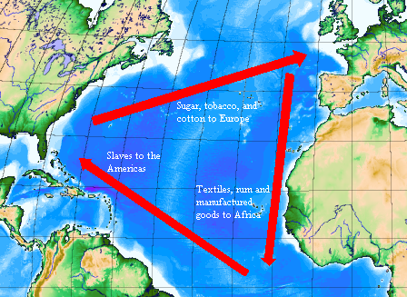

= American Pageant - 004 (1607-1775)
:toc: left
:toclevels: 3
:sectnums:
:stylesheet: ../../../myAdocCss.css

'''

== 释义

Welcome back to Joe's Productions 制作公司. + 
 Today we're going to break down 分析 English colonial 殖民地的 society 社会 -- *what was life like* in the colonies 殖民地? Politics 政治, religion 宗教, slavery 奴隶制 -- all that stuff we're going to cover (v.)涵盖 in this video. +

*Key point 要点 to keep in mind*: regional 区域的 differences 差异 existed (v.) between the British colonies 英国殖民地. +
 Remember (v.) /we have the New England region 新英格兰地区, the middle colonies 中部殖民地, the Chesapeake 切萨皮克地区, and the Lower South 下南部地区. +
 And there were reasons for these differences - who *came to* these colonies, why they came, and really important *you understand* (v.) _the environmental 环境的 and geographic 地理的 variations_ 变化 of these different regions *such as* climate 气候, natural resources 自然资源, and how this influenced (v.)影响 their development 发展. +
 And *as you can see* on the map right there, some of the different variations (v.) between these regions. +

And *real quick review* 快速回顾 - make sure you know the differences and similarities 相似之处 between the Chesapeake versus 对比 the New England colonies. +
 They love asking about this topic. + 
 So quick review of the New England region: remember there were largely 主要地 Puritan 清教徒的 religious motives 宗教动机 for colonization 殖民. + 
 And although these individuals (*whether* it be the Pilgrims 清教徒前辈移民 *or* the Puritans 清教徒) are coming over for religious motives, keep in mind they are not tolerant (a.)宽容的 of other religions. +
 They're going to develop a close-knit 紧密的, homogeneous 同质的,同种类的，同性质的 society 社会. +
 Settlements 定居点 are settled around towns 城镇. + 
 The life expectancy 预期寿命 is longer than the Chesapeake - it's also longer than what it was in England. + 
 It's a much more stable 稳定的 society *compared to* the Chesapeake region. +

[.my1]
.案例
====
在17世纪北美殖民时期，​​Pilgrims（清教徒分离派）​​和​​Puritans（清教徒）​​虽然都属于新教改革中的激进派，但存在重要区别：

[.my3]
[options="autowidth" cols="1a,1a,1a"]
|===
||Pilgrims（分离派）​ |​​Puritans（清教徒）

|​宗教立场不同
|Pilgrims（分离派）​​ +
*认为英国国教（Anglican Church）已彻底腐败，主张​​完全脱离国教​​，建立独立教会。因在英国遭受迫害，1608年逃往荷兰，1620年乘"五月花号"抵达普利茅斯（Plymouth Colony）。*
|Puritans（非分离派）​​ +
主张​​**改革而非脱离国教​​，希望"净化"（purify）国教**保留的天主教残余仪式。1630年代在约翰·温斯罗普（John Winthrop）带领下**建立马萨诸塞湾殖民地（Massachusetts Bay Colony），试图打造"山巅之城"（City upon a Hill）。**

|​​殖民动机差异​
|Pilgrims​​ +
首要目的是​​逃避宗教迫害​​，群体规模较小（约100人），以《五月花公约》建立自治基础。
|Puritans​​ +
兼具宗教与​​社会改革​​动机，移民规模更大（1630-1640年"大迁徙"约2万人），建立了更系统的神权政治。

|​对待异己的态度​
|
|两者都​​不宽容其他宗教​​，但Puritans更甚： +
驱逐罗杰·威廉姆斯（Roger Williams）等异见者 +
1692年塞勒姆女巫审判（Salem Witch Trials） +
而Pilgrims因自身曾是少数派，相对稍宽容（但仍排斥贵格会等）。
|===

====

There is going to be the importance of religion in the colonies 宗教在殖民地将会变得很重要. +
 Obviously family life is going to be key to the colonies and education 教育 - in fact they're going to require 要求 schools to be built. +
 And as you can see on that town map - schools, churches, you got it all right there. + 
 Town hall meetings 市政厅会议 are going to be a unique characteristic 独特特征 of the New England society - all adult _male 成年男性的 church members_ *could participate 参与 in* this direct democracy 直接民主. +
 Large number of immigrants 移民 are going to come to the New England colonies, and they're also going to have a very high birth rate 出生率 because you're going to have more of an equal distribution 平等分配 of men and women. + 
 There's not going to be big farming/no cash crops 经济作物 because of the long winters and short growing season 生长季节, so this area is going to have a mixed economy 混合经济 - you're going to have some agriculture 农业, trade 贸易, shipbuilding 造船业, and like I said, Boston's going *to play a key role* in the economic health 经济状况 of this region. +

Like we mentioned (v.), make sure you can *compare* (v.) the New England colonies especially *to* the Chesapeake (which is Virginia and Maryland). +
 But the southern colonies *shared* some characteristics 特征 *with* one another. +
 They are largely (especially in the beginning) a male-dominated 男性主导的 society. + 
 Remember `主` the first people to come to Jamestown `系` were men looking to get wealthy. +
 This region has a much warmer climate, longer growing season. + 
 Life was harsh - you have all sorts of diseases like malaria 疟疾, hot and humid 湿热, and you have a lower _birth rate_ /because there's less women in this region. +
 Whereas the New England colonies are a tight-knit 紧密团结的 society, the southern colonies/the southern plantation 种植园 colonies are going to have _a defined (a.)轮廓分明的，外形清晰的 hierarchy_ 等级制度 of wealth and status 地位. +
 You're going to get the rise of the southern gentry (<英，旧>上流人士，贵族)绅士阶层 - so much wider gap 差距 *between* the wealthy *and* the poor /in the Chesapeake and the southern colonies. +

In fact, a big reason for that is the rise of the cash crop plantation economies. + 
 You know the southern planters 种植园主 are going to be the _top dogs_ 权势最高者,重要人物 in the colony - they're going to dominate (v.)主导 *not only* the economics *but also* the politics of the region. +
 So in the Chesapeake you get the importance of tobacco, remember in South Carolina you get rice, and even down in the British West Indies 英属西印度群岛 you have sugar cane 甘蔗. +
 There are fewer cities that develop (v.) in the south obviously /because of _the agricultural nature_ of the economy 南方发展的城市较少，这显然是由于南方经济的农业性质. +
 But it's important to keep in mind /the labor system 劳动制度 -- `主` slavery `谓` existed (v.)  everywhere in the 13 British colonies, but you're going to have this transition 转变 *from* indentured (a.)受契约束缚的 servants 契约仆役 *to* slavery /especially after Bacon's Rebellion 培根起义. +

And there's a lot of different reasons for this transition to slavery - make sure you know them: 1) there's an abundance 丰富 of land; 2) there's a shortage 短缺 of _indentured servants_ that are coming over to the new world; 3) there's no way to enslave (v.)奴役 the native population (they would just *run away* or attack (v.) or *die of disease*); and 4) there's European demand (n.) for colonial goods. +
 So the transition *gets made* 转变逐渐发生,最后就变成了 to African slavery. +

[.my1]
.案例
====
.the transition gets made to African slavery
*"gets made" = "is made"（被做出/被实现）*  +
#*"get" + 过去分词​:​ 是一种非正式"被动语态"*#（类似 "The decision got approved" ≈ "The decision was approved"）。 +
*#这里强调 ​​“转变逐渐发生”​​ 的动态过程，而非静态事实。#*

"to African slavery" = “转向非洲奴隶制”​​ +
"to"​​ 表示转变的方向或结果。

"the transition gets made to African slavery"​​ +
≈ ​​“（社会/经济）逐渐转向非洲奴隶制”​​ +
（强调这一转变是被动发生的，而非主动选择.）​"gets made"​​ 暗示殖民者 ​​“不得不”​​ 转向非洲奴隶制，而非主动规划。
====

In fact, in South Carolina, the majority of the population is going to *be made up of* 由……组成 African slaves. +
 And throughout the south, slavery is going to play a much larger role in the southern economy. +

So _a little bit more explanation_ about slavery in colonial America. +
 One is the triangular trade route 三角贸易路线 - this is a three-part trade route (n.)路线，航线 forming a triangle. +
 Slaves and goods are moving from Africa to the Caribbean 加勒比海地区 and to the colonies, and you could see some of those goods that are brought between those regions. + 
 Also very often /goods would be going to Europe as well. +
 `主` Slaves 后定 brought over 带来 largely from West Africa `谓` are going to experience (v.) something horrendous (a.)可怕的；惊人的, dehumanizing (a.)丧失人性的,使人变得不像人的 called _the Middle Passage_ 中段航程. +
 You could see the conditions 后定 that _these individuals **were brought over in**_ - it was all about *maximizing (v.) profit* 最大化利润 /and *bringing* large numbers of people *to* the new world. +

[.my1]
.案例
====
.triangular trade route

====

Keep in mind /slavery  奴隶制 in North America was race-based 基于种族的 - it was based upon ideas and perceptions 观念 of superiority 优越性, and slaves were considered property 财产. +
 Slave culture is going to develop (v.) as a blend 混合 of African and American traditions - blending (v.) these two kind of cultures together /to create a truly unique African-American culture. +
 You'll see this in African-American religion, song, and so on. + 
 It's important to note that /there's a variety of tribes 部落 being brought over from different parts of Africa, and they're not just going to the 13 colonies 他们不只是要去13个殖民地. +
 As you can see on this graphic right there, the vast majority 绝大多数 of slaves are going to be going to the Caribbean islands and also to Brazil. +
 But slavery in British North America, although 虽然，尽管 much smaller, is going to play a huge role in colonial society. +

There are going to be some attempts 尝试 at rebellion 反抗 -- `主` the most famous and one of the few `系` was the Stono Uprising 斯托诺起义 in 1739 South Carolina. +
 `主` Slaves along the Stono River `谓` tried to get to Spanish Florida /where they were promised freedom, but unfortunately the rebellion was defeated /and it *contributed to* stricter (a.) laws - black codes/slave codes 黑人法典/奴隶法典 that regulated (v.)规范 the movement and the freedoms of slaves in the colonies. +
 In spite of the fact that 尽管事实是 there were few rebellions, it's important to note (v.) that /there was different forms of resistance 抵抗. +
 Resistance to slavery was common /and it took the form of _work slowdowns_ (减速，放缓) 消极怠工, running away, faking (v.) illness 装病 and other things /to kind of disrupt (v.)破坏,中断，扰乱 the slave system. +

Aside from 除了……之外 the issue 议题，争论点 of slavery, religion created (v.) kind of problems in the colonies. +
 And one of the big things was `主` the religious passion 宗教热情 `谓` was fading 消退 in the New England colonies -- fewer and fewer people were having a conversion 皈依;转变，转换；（宗教或信仰的）改变, so `主` less Puritans practicing `谓` means (v.) the colony is losing (v.) its original mission 最初使命. +
** To deal with** this, the Halfway Covenant 半途契约 was passed in 1662 in the New England colonies, and it said /individuals could become _partial 部分的 church members_ even if they did not have a conversion. +
 And `主` the idea behind this `系` was to lessen (v.)减少 the Puritan practices - they're going to be less strict /in order to increase (v.) church membership (会员身份，会籍)教会会员, and it was successful at doing so. +

And as we talk about religion in this issue of religious practice, it's important to note that religious freedom 宗教自由 -- the Massachusetts Bay Colony 马萨诸塞湾殖民地 did not allow (v.) freedom of religion, but some _religious toleration_ 宗教宽容 existed (v.) in a few British colonies. +
 For example, you saw Pennsylvania with the Quakers 贵格会教徒, Rhode Island (_separation of church and state_ 政教分离 with Roger Williams), and Maryland with its Catholic population extended (v.) religious toleration *but only to* Christians. +
 And _religious freedom_ is going to be a key cornerstone 基石，支柱 of the new nation, so there are traditions established (v.) during the colonial period. +

A real wacky (a.)古怪的 event happens (v.) in 1692 in Salem, Massachusetts -- it's _the Salem Witch 巫婆，巫师 Trials_ 塞勒姆审巫案. +
 During the trials 审判, 19 people are hung (v.) /and one person was even *pressed (v.) to death* 压死 (that's a scene in one of the museums in Salem - gruesome (a.)可怕的；阴森的 stuff). +
 Most of the accused 被告 were from the money-making class, and `主` the people who were accusing them `系` were farmers. 大多数被指控的人都来自赚钱阶层，而指控他们的人都是农民。 +
 And really what you see in Salem is /`主` it  `谓`  reflects (v.) a growing tension 紧张 over _the changing nature of the colony_ 殖民地不断变化的性质 *from* _a religious (a.) kind of_ motives *to* a profit-driven commercialism 商业主义. +
 So you see the tension /*between* the rich *and* the poor in colonial New England. +

[.my2]
你在塞勒姆看到的, 是它反映了一种日益增长的紧张局势. 这种紧张局势, 是由于殖民地性质的变化, 从一种宗教动机, 转变为一种利润驱动的商业主义。

Speaking of religion 说到宗教, `主` a really important event that all colonies experienced `系` was the Great Awakening 大觉醒运动. +
 Many people were tired of 厌倦了 the boring sermons (n.)布道，讲道 that were traditionally practiced (v.) throughout the colonies, and _the Great Awakening_ was a religious revival 宗教复兴 in the 1730s-40s that spread (v.) throughout the colonies. +
 This is the spread of _religious feeling_ throughout the colonies 这是宗教情感在整个殖民地的传播 -- many people *convert （使）皈依 to* different religions. +
 And some key figures 关键人物,重要数字 you should know about: one, Jonathan Edwards - he sparks (v.)引发 _the Great Awakening_ with his sermons  布道. +
 He basically said /God was angry at human sinfulness 罪恶, and his most famous sermon "Sinners 罪人 in the Hands of an Angry God" - some scary 骇人的，恐怖的 stuff. +

[.my1]
.案例
====
.the Great Awakening

The Great Awakening was a series of religious revivals in American Christian history. Historians and theologians identify three, or sometimes four, waves of increased religious enthusiasm between the early 18th century and the late 20th century. Each of these "Great Awakenings" was characterized by widespread revivals led by evangelical Protestant ministers, a sharp increase of interest in religion, a profound sense of conviction and redemption on the part of those affected, an increase in evangelical church membership, and the formation of new religious movements and denominations.

**大觉醒是美国基督教历史上一系列的宗教复兴运动 。**历史学家和神学家认为，*在 18 世纪初至 20 世纪末之间，宗教热情曾有过三次，有时是四次的浪潮。每一次“大觉醒”都以以下特点为特征：由福音派新教牧师领导的广泛复兴运动，人们对宗教的兴趣急剧增加，受影响人群产生了深刻的信念和救赎感 ，福音派教会成员数量增加，以及新的宗教运动和教派的形成。*

.Sinners in the Hands of an Angry God
“Sinners in the Hands of an Angry God” 是一篇非常著名的布道词（sermon），由清教徒传教士 Jonathan Edwards（乔纳森·爱德华兹） 于1741年发表。这句话字面意思是： +
“处在愤怒之神手中的罪人” +

意思是说：人类因为罪恶（sinfulness）而激怒了上帝，而上帝正紧紧抓着这些罪人——随时可能因为他的愤怒将他们抛入地狱（这是比喻，形象地表达上帝的愤怒和人类的危险处境）。 +
在这篇布道词中，Edwards 用了很多恐吓性语言来唤醒人们的宗教热情。他描绘人类如同悬挂在深渊上方的蜘蛛，随时可能掉入地狱，除非你悔改,并皈依神的救赎。

这种风格正是“大觉醒运动”（Great Awakening）中典型的宗教复兴式传教风格，目的是激发信徒的恐惧感和宗教情绪，促使人悔改。
====

Another figure is George Whitefield - he introduced _a new energized （使）充满热情；给（某人）增添能量 style_ of _evangelical (a.)福音的 preaching_ (讲道；说教，劝诫)福音派. +
 George Whitefield led (v.) many revival meetings 复兴会 where sinners professed (v.)宣称；断言 *being saved* /and conversions *took place* out on the frontier 边疆. +

[.my2]
另一个人物是乔治·怀特菲尔德——他引入了一种新的充满活力的福音布道风格。乔治·怀特菲尔德（George Whitefield）领导了许多复兴聚会，罪人在那里宣称自己得救了，在边远地区也发生了皈依。

[.my1]
.案例
====
.George Whitefield
In 1740, Whitefield traveled to British North America where he preached a series of Christian revivals that became part of the Great Awakening. His methods were controversial, and he engaged in numerous debates and disputes with other clergymen.

1740 年，怀特菲尔德前往英属北美， 在那里他宣讲了一系列基督教复兴运动 ，这些运动后来成为 “大觉醒” 运动的一部分。他的布道方法颇具争议，他与其他牧师进行了无数次辩论和争执。

Whitefield received widespread recognition during his ministry; he preached at least 18,000 times to perhaps ten million listeners in the British Empire. Whitefield could enthrall large audiences through a potent combination of drama, religious eloquence, and patriotism. He used the technique of evoking strong emotion, then using the vulnerability of his enthralled audience to preach.[3]

怀特菲尔德在传道生涯中获得了广泛的认可；他至少布道 18000 次，在大英帝国拥有约一千万听众(称得上古代网红)。怀特菲尔德能够将戏剧性、宗教雄辩和爱国主义完美结合，从而吸引大批听众。他善于激发听众强烈的情感，然后利用听众的脆弱性进行布道。
====

A key part of the Great Awakening was this idea that /`主` ordinary people with faith and belief in God `谓` could understand the gospels 福音 without the church ministers 牧师 telling them what to believe. +
 This divided (v.)使分离；（使）分开 people - New Lights 新光派 were supporters of the Great Awakening, Old Lights 旧光派 were against this new style of preaching 讲道；说教，劝诫. +
 And `主` the impact of the Great Awakening `系` was huge. +
 You *have* new universities *forming* such as Dartmouth, Princeton, Brown - some of _the Ivy League 常春藤盟校 universities_ today - they *start off 起初是…，最初是 as* religious-based institutions. +
 This *leads to* greater religious independence and diversity (多样性) 这导致了更大的宗教独立性和多样性 -- you *have* all sorts of new churches *forming* (you could see on the map the different colors with the different types of churches throughout the colonies). +
 And as a result, this strengthened (v.) calls (n.) for _separation of church and state_ 这加强了政教分离的呼声 -- if you have lots of different religions, you can't have any one church (教派，教会) 后定 supported by the state. 如果你有很多不同的宗教，你就不可能有一个由国家支持的教会。 +

And finally, this is the first mass movement 群众运动 shared (v.) amongst all of the colonists. +
 This _Great Awakening_ spread (v.) throughout the colonies -- it did not matter (v.) your social status 社会地位, your region, and it happened throughout. +
 And so this was a shared experience. + 
 And key to this is `表` people *are changing (v.) the way* they view (v.) authority 权威 - common people are making their own decisions *with regard to* 关于，就……而言 religion, and later on `主` this resistance 抵制；抵抗 to established (v.) authority `谓` will be extended (v.) towards the British. +
 So *keep in mind* all of the impacts of the Great Awakening. +

We've already mentioned the idea of mercantilism 重商主义 - remember (v.) there were various mercantile (a.)贸易的，商业的 laws 贸易法令 that were passed (v.) /*to regulate* (v.)规范 colonial trade /and *to benefit (v.) England*. +
 And you have _the Navigation Acts_ 航海条例, the Molasses Act 糖蜜法案. and `主` _the basic principle_ behind mercantilism 重商主义 `系` was that `主` nations such as England `谓` should become (v.) self-sufficient 自给自足 /and the colony should enrich (v.)使富裕 the mother country 母国. +
 However, the goals and interests of European leaders (for example in England) _at times_ 有时候 *diverge (v.)分歧 from* those of colonial citizens.

[.my2]
然而，欧洲领导人（例如英国）的目标和利益有时与殖民地公民的目标和利益大相径庭。 +

In other words, many colonists did not like these laws *such as* the Navigation Acts. +
 Luckily, there was this period of _salutary (a.)有益的，有用的；有益健康的 neglect_ 有益的忽视 throughout the early 17th century /where the British had relative indifference (v.)漠不关心 to colonial governance 殖民统治 - they kind of just let (v.) them do their thing. +

There were some things 后定  that made the colonists smile (v.) over the mercantile (a.)贸易的，商业的  policies. +
[.my2]
有一些事情让殖民者对商业政策微笑。

For example, _colonial shipbuilding_ 造船业 developed (v.) especially in the New England colonies /*as a result of* these requirements 后定 that goods must travel (v.) in *either* British *or* colonial ships. +
** As a result of** England being their "mama," the colonists were provided protection of the British military 殖民者得到了英国军队的保护, and `主` mercantile policies `谓` provided (v.) Chesapeake tobacco farmers 烟草种植者 `双宾` a monopoly 垄断 in England (remember (v.) certain enumerated goods 列举商品 could only be sold (v.) to England - tobacco was one of them). +

However, there were some reasons to be mad  生气的，气愤的 -- some bad things about mercantilism  重商主义. +
 It restricted (v.) development of colonial manufacturing 制造业 (they had to buy (v.) the goods from British manufacturing, so therefore the economy of the colonies did not diversify (v.)（使）多样化). +
 Very often they had to buy higher-priced manufactured goods from England, and farmers had to accept (v.) lower prices for their enumerated 枚举 crops. +
 So although they had a guaranteed (a.) market 有保障的市场, they could not sell them to the highest buyer, and this was *no bueno* 不好 in the minds of many colonists. +

[.my1]
.案例
====
.no bueno
不好：源自西班牙语，用于表示某事物不好或不理想。
====

`主` Resentment 不满 over laws (n.)后定 imposed (v.)强加 from a distant government in London `谓` *did lead to* times of resistance. +

[.my2]
对遥远的伦敦政府强加给殖民地的法律的不满, 确实导致了多次抵抗。

Recall (v.) `主` England `谓` attempted (v.) *to integrate* (v.)整合 the colonies *into* _a coherent 连贯的, hierarchical 等级制的 imperial structure_ 帝国结构 with the Dominion 统治（权）；管辖；支配;领土；版图 of New England 新英格兰自治领. +

[.my2]
回想一下，英国试图将殖民地整合成一个连贯的，等级分明的帝国结构，包括新英格兰自治领。

Sir Edmund Andros *came over*, started enforcing (v.) the Navigation Act, trying to bring (v.) more money over to London, and eventually that *falls apart* 破碎，崩溃 in 1688 with the Glorious Revolution 光荣革命. +
 Basically under the Glorious Revolution, there is an overthrow 推翻 of James II /and `主` William and Mary `谓` take the throne 王位. +

[.my2]
在光荣革命时期，詹姆斯二世被推翻，威廉和玛丽继承了王位。

And *this is important* in the colonies *for a couple of reasons*: one, over in England /*they put limits on* the power of the monarchy (君主制) 在英格兰他们限制了君主的权力, and the colonists (once the Glorious Revolution *takes place*) they *rebel (v.) against* the Dominion of New England. +
 Colonists successfully resisted (v.) some English policies. +
 However, it's important to note (v.) that /the big turning point 转折点 will happen (v.) in 1763 _at the end of_ the Seven Years' War 七年战争 - check out the next video. +

And finally, colonial politics. + 
 There was the gradual 逐渐的，渐进的 development of _democratic institutions_ 民主制度 in the colonies, and colonial experiences (v.) with self-government 自治. +
 And *you're going to see this* in various examples we covered in previous videos such as the Mayflower Compact 五月花号公约, the town hall meetings, the House of Burgesses 弗吉尼亚议会, the elected representative assemblies 代表会议 in places like Pennsylvania. +
** Keep in mind** many people were still excluded 排除的 - for example there were _property requirements_ 财产要求 or _religious qualifications_ 宗教资格, and England ultimately 最终，最后；根本上，最重要地 was still *in charge* (负责，掌管，管理) 英格兰最终仍是统治者. +
 So in the colonies /there wasn't widespread (a.) democratization 民主化 taking place - there was a ruling (a.)统治的，支配的 colonial elite 统治精英 that was usually *made up of* _the wealthy_ or _people in the powerful in the church_. +
 But the colonies are beginning to develop (v.) different political institutions. +

`主` An example of colonial political life 后定 evolving (v.) during this time `谓` can be seen in the Zenger case 曾格案 in 1733, which advanced (v.)发展，进步 the freedom of the press 新闻自由. +
 And basically what happened -- that `主` newspaper that you see right there `谓` was printed by John Peter Zenger, and he printed a newspaper 后定 that was critical (a.)批评的；批判性的；挑剔的 of the royal governor 皇家总督 in New York. +
 And that led (v.) some people to get that face you see right there. +
 As a result of this newspaper, he is charged 控告，指控 with libel 诽谤, but the jury 陪审团 ruled (v.) that `表`  _`主` Zenger `系` was not guilty_. +

And what happens is `表` in the Zenger case /you see that `主` the courts *rule (v.) that* `宾` you could *be critical (a.) of* elected officials /if the statements were true. +

[.my2]
在曾格案中，你可以看到法院裁定，如果言论属实，你可以批评民选官员。

And although this case does not allow (v.) full freedom of the press, *it does establish (v.) principles* 确立原则 后定 that allow (v.) people *to be critical of* those in power - something that's going to be very key to a healthy democracy. +

And `主` the last thing *to keep in mind* `系` is there was ethnic diversity 种族多样性 of the colonies *as well*. +
 `主` Most of the people who came over `系` were from England, but you get a growing group of people coming from other parts of the world. +
 We've already mentioned `宾` the large African population in South Carolina (forcibly brought here /because of slavery). +
 We also have the huge amount of people from England (many of them Puritans up in this region), but you also get a growing Scots-Irish 苏格兰-爱尔兰人 population in places like Pennsylvania. + 
 And as you can see on this map, `主` the people that settled (v.) the 13 colonies `谓` came from all sorts of different ethnic （有关）种族的，民族的 groups 族群. +

That's going to do it for this video. + 
 Thank you for watching. + 
 If the video helped you out, click like. + 
 If you have any questions or comments, post them below. + 
 And if you haven't already done so, tell all your friends about Joe Productions and make sure you subscribe 订阅. + 
 Have a beautiful night. + 
 Peace!

'''

== 中文翻译

欢迎回到乔伊制作。今天我们要解析英国殖民社会的方方面面——殖民地的真实生活是怎样的？政治、宗教、奴隶制——所有这些内容, 我们都将在本期视频中涵盖。

**#关键要记住：英国各殖民地之间, 存在地区差异。#**记住我们有新英格兰地区、中部殖民地、切萨皮克地区, 和南方低地。**#这些差异存在的原因包括：来到这些殖民地的人是谁、他们为什么来，以及非常重要的——你要理解这些不同地区, 在环境和地理上的差异，比如气候、自然资源，以及这些因素如何影响了它们的发展。#**正如你在地图上看到的，这些地区之间存在一些不同的差异。

快速回顾一下——确保你知道切萨皮克地区和"新英格兰"殖民地的异同。他们很喜欢考这个话题。所以快速回顾**"#新英格兰地区#"：**记住, **殖民的主要动机是##清教徒##的宗教原因。**虽然这些人（无论是朝圣者还是清教徒）是出于宗教动机而来，**#但要记住他们对其他宗教并不宽容。# 他们将发展出一个紧密团结、同质化的社会。**定居点围绕城镇建立。**这里的预期寿命, 比"切萨皮克地区"更长——也比"英格兰本土"更长。**相比切萨皮克地区，这是一个更加稳定的社会。

**宗教在这些殖民地非常重要。显然"家庭生活"是殖民地的核心，教育也是——事实上他们要求建立学校。正如你在城镇地图上看到的——学校、教堂，应有尽有。#"市政会议"将成为新英格兰社会的独特特征——所有成年男性教会成员, 都可以参与这种"直接民主"。#**大量移民将来到新英格兰殖民地，而且由于男女比例更加均衡，这里的出生率也非常高。**#由于漫长的冬季和短暂的生长季节，这里不会有大规模农业/经济作物种植，因此这个地区将发展混合经济——会有一些农业、贸易、造船业，#**正如我所说，*波士顿将在该地区的经济健康中发挥关键作用。*

正如我们提到的，确保你能将新英格兰殖民地, 与切萨皮克地区（即弗吉尼亚, 和马里兰）进行比较。但南方殖民地彼此之间, 也有一些共同特征。这里主要是（尤其是在初期）一个男性主导的社会。记住, **第一批来到詹姆斯敦的人, 是"为了致富"的男性。**这个地区气候更温暖，生长季节更长。生活很艰苦——这里有各种疾病如疟疾，炎热潮湿，而且**由于女性较少，出生率较低。** +
**新英格兰殖民地是一个紧密团结的社会，而南方殖民地/南方种植园殖民地, 将形成明确的财富和地位等级制度。**南方绅士阶层将崛起——切萨皮克和南方殖民地的贫富差距, 要大得多。

事实上，**造成这种情况的一个重要原因, 是经济作物"种植园经济"的兴起。**你知道**#南方种植园主, 将成为殖民地的顶层人物——他们不仅将主导经济，还将主导该地区的政治。#**所以在切萨皮克地区烟草很重要，记住南卡罗来纳有水稻，甚至在不列颠西印度群岛还有甘蔗。**由于经济的农业性质，南方发展的城市较少。**但要记住劳动制度——*奴隶制在所有13个英国殖民地都存在，但你会看到从契约仆役向奴隶制的转变，尤其是在培根叛乱之后。*

*向奴隶制转变, 有很多不同的原因—*—确保你知道这些：**1）土地丰富；2）来到新世界的"契约仆役"短缺；3）无法奴役"原住民"（他们会逃跑、反抗或死于疾病）；4）欧洲对殖民地商品的需求。**因此转向了非洲奴隶制。事实上，在南卡罗来纳，大部分人口将由非洲奴隶构成。在整个南方，奴隶制将在南方经济中扮演更重要的角色。

再稍微详细解释一下殖民时期美洲的奴隶制。一个是三角贸易路线——这是一个由三部分组成的三角形贸易路线。奴隶和商品, 从非洲运往加勒比地区和殖民地，你可以看到这些地区之间运输的一些商品。通常商品也会运往欧洲。从西非运来的奴隶将经历一种可怕、非人化的过程，称为"中途航道"。你可以看到这些人被运送的条件——一切都是为了最大化利润，将大量人口运往新世界。

记住, 北美的奴隶制是基于种族的——它基于优越性的观念和认知，奴隶被视为财产。奴隶文化将发展为非洲和美洲传统的融合——将这两种文化融合在一起，创造出真正独特的非裔美国人文化。你会在非裔美国人的宗教、歌曲等方面看到这一点。重要的是要注意到，从非洲不同地区带来了各种部落的人，他们不仅来到13个殖民地。正如你在这张图表上看到的，*绝大多数奴隶, 将被运往"加勒比群岛"和"巴西"。但"英属北美"的奴隶制虽然规模小得多，却将在殖民地社会中扮演重要角色。*

会有一些反抗的尝试——最著名也是为数不多的一次是1739年南卡罗来纳的斯托诺起义。斯托诺河沿岸的奴隶, 试图逃往西班牙佛罗里达，那里承诺给他们自由，但不幸的是起义被镇压，并导致了更严格的法律——黑人法典/奴隶法典，规范殖民地奴隶的行动和自由。*尽管起义很少，但重要的是要注意到存在不同形式的抵抗。对奴隶制的抵抗很常见，表现为怠工、逃跑、装病等方式, 来破坏奴隶制度。*

除了奴隶制问题，宗教在殖民地也造成了一些问题。**#一个重要的问题是, 宗教热情在"新英格兰殖民地"逐渐消退#——越来越少的人经历宗教皈依，**因此清教徒实践减少, **意味着殖民地正在失去其最初的使命。**为了解决这个问题，1662年新英格兰殖民地通过了《半途契约》，规定即使没有经历皈依，个人也可以成为部分教会成员。这样做的目的是放宽清教实践——**为了增加教会成员，他们将不那么严格，**而且这样做是成功的。

在我们讨论宗教实践这个问题时，重要的是要注意"宗教自由"——**马萨诸塞湾殖民地不允许宗教自由，但在一些英国殖民地存在宗教宽容。**例如，你看到贵格会的宾夕法尼亚、罗德岛（罗杰·威廉姆斯实行"政教分离"），以及天主教徒为主的马里兰, 对基督徒实行宗教宽容。宗教自由将成为新国家的基石，因此在殖民时期就建立了一些传统。

1692年在马萨诸塞的塞勒姆, 发生了一件非常古怪的事件——塞勒姆审巫案。在审判期间，19人被绞死，一人甚至被压死（这是塞勒姆某个博物馆的场景——非常可怕）。大多数被告来自富裕阶层，而指控他们的人是农民。你在塞勒姆看到的, 实际上反映了殖民地的性质, 从"宗教动机"向"利润驱动的商业主义"转变过程中, 日益紧张的矛盾。所以你看到了殖民地"新英格兰地区", 贫富之间的紧张关系。

说到宗教，所有殖民地都经历的一个非常重要的事件是"大觉醒运动"。许多人对殖民地传统的枯燥布道感到厌倦，大觉醒运动是1730-40年代, 席卷各殖民地的宗教复兴运动。这是宗教情感在整个殖民地的传播——许多人改信不同的宗教。你应该知道一些关键人物：乔纳森·爱德华兹——他用他的布道引发了大觉醒运动。他基本上说, 上帝对人类罪恶感到愤怒，他最著名的布道是《愤怒上帝手中的罪人》——有些可怕的内容。另一个重要人物是乔治·怀特菲尔德——他引入了一种新的充满活力的福音布道风格。乔治·怀特菲尔德领导了许多复兴集会，罪人在会上宣称得救，在边疆地区发生了皈依。

**"大觉醒运动"的一个关键理念是，有信仰的普通人, 无需教会牧师告诉他们该信什么，就能理解福音。**这使人们分裂——新光派支持大觉醒运动，旧光派反对这种新的布道风格。*大觉醒运动的影响巨大。新大学成立*，如达特茅斯、普林斯顿、布朗——今天的一些常春藤大学——它们最初都是基于宗教的机构。这导致了更大的宗教独立性和多样性——各种新教会成立（你可以在地图上看到, 不同颜色代表殖民地的不同类型教会）。因此，*#这加强了"政教分离"的呼声#——如果有许多不同的宗教，就不能让任何一个教会得到国家的支持。*

最后，这是所有殖民者共享的第一个大规模运动。大觉醒运动席卷所有殖民地——无论你的社会地位、所在地区如何，它都发生了。因此这是一种共同的经历。**关键在于人们正在改变他们对权威的看法——普通人在宗教方面自己做决定，**后来这种对既定权威的抵抗, 将延伸到对英国的态度上。所以记住大觉醒运动的所有影响。

我们已经提到了重商主义的概念——记住, **通过了各种重商主义法律, 来规范殖民地贸易, 并使英国受益。**有《航海条例》、《糖蜜法案》，**重商主义的基本原则, 是像英国这样的国家应该自给自足，殖民地应该使母国富裕。**然而，欧洲领导人（例如在英国）的目标和利益, 有时与殖民地居民不同。换句话说，许多殖民者不喜欢《航海条例》这样的法律。幸运的是，*#在17世纪早期有一段"有益的忽视"时期，英国对殖民地的治理相对漠不关心——他们基本上让殖民地自行其是。#*

有一些事情让殖民者对"重商主义政策"感到满意。例如，由于要求货物必须由英国或殖民地船只运输，殖民地的造船业, 特别是新英格兰殖民地的造船业, 得到了发展。由于英国是他们的"母亲"，殖民者得到了英国军队的保护，*重商主义政策为切萨皮克的烟草种植者, 提供了在英国的垄断（记住, 某些列举商品, 只能卖给英国——烟草就是其中之一）。*

然而，也有一些让人愤怒的理由——**##重商主义的一些弊端。它限制了殖民地"制造业"的发展（他们必须从英国购买制造品，因此殖民地的经济没有多样化）。##他们经常不得不从英国购买价格更高的制造品，农民不得不接受列举作物较低的价格。所以尽管他们有保障的市场，但不能卖给最高出价者，**这在许多殖民者看来是不好的。

对来自遥远的伦敦政府的法律的不满, 确实导致了反抗时期。回想英国试图通过"新英格兰自治领"将殖民地整合成一个连贯的、等级制的帝国结构。埃德蒙·安德罗斯爵士到来，开始执行《航海条例》，试图将更多钱带回伦敦，最终这一切在1688年光荣革命中瓦解。基本上在光荣革命下，詹姆斯二世被推翻，威廉和玛丽继位。这对殖民地很重要有几个原因：一，在英格兰他们限制了君主的权力，殖民者（一旦光荣革命发生）反抗新英格兰自治领。**殖民者成功抵制了一些英国政策。**然而，重要的是要注意到: 重大转折点将发生在1763年七年战争结束时——请看下一期视频。

最后，殖民地政治。**殖民地逐渐发展了民主制度，殖民者有了自治的经验。**你会在我们之前视频中提到的各种例子中看到这一点，**如《五月花公约》、市政会议、弗吉尼亚议会、宾夕法尼亚等地的民选代表议会。**记住许多人仍然被排除在外——例如有财产要求或宗教资格限制，而且最终英国仍然掌权。所以**#在殖民地并没有广泛的民主化——有一个统治殖民地的精英阶层，通常由富人或教会中有权势的人组成。但殖民地开始发展不同的政治制度。#**

这一时期殖民地政治生活演变的一个例子, 是1733年的曾格案，它推动了新闻自由。基本上发生的事情是——你看到的报纸是由约翰·彼得·曾格印刷的，他印刷了一份批评纽约皇家总督的报纸。这导致一些人露出你看到的那种表情。由于这份报纸，他被控诽谤，但陪审团裁定曾格无罪。在曾格案中, 你看到**法院裁定, 如果陈述属实，可以批评民选官员。尽管这个案件没有实现完全的"新闻自由"，但它确立了"允许人们批评当权者"的原则**——这对健康的民主非常关键。

最后**要记住的是殖民地的种族多样性。**大多数来的人来自英格兰，但也有越来越多的人来自世界其他地区。我们已经提到了南卡罗来纳的大量非洲人口（由于奴隶制被迫来到这里）。我们还有大量来自英格兰的人（其中许多是这个地区的清教徒），但你也会看到宾夕法尼亚等地越来越多的苏格兰-爱尔兰人。正如你在这张地图上看到的，*定居13个殖民地的人来自各种不同的种族群体。*

本期视频就到这里。感谢观看。如果视频对你有帮助，请点赞。如果有任何问题或意见，请在下方留言。如果还没有，请告诉你的朋友们关于乔伊制作，并确保订阅。祝你有个美好的夜晚。再见！

'''

== pure

Welcome back to Joe's Productions. Today we're going to break down English colonial society - what was life like in the colonies? Politics, religion, slavery - all that stuff we're going to cover in this video.

Key point to keep in mind: regional differences existed between the British colonies. Remember we have the New England region, the middle colonies, the Chesapeake, and the Lower South. And there were reasons for these differences - who came to these colonies, why they came, and really important you understand the environmental and geographic variations of these different regions such as climate, natural resources, and how this influenced their development. And as you can see on the map right there, some of the different variations between these regions.

And real quick review - make sure you know the differences and similarities between the Chesapeake versus the New England colonies. They love asking about this topic. So quick review of the New England region: remember there were largely Puritan religious motives for colonization. And although these individuals (whether it be the Pilgrims or the Puritans) are coming over for religious motives, keep in mind they are not tolerant of other religions. They're going to develop a close-knit, homogeneous society. Settlements are settled around towns. The life expectancy is longer than the Chesapeake - it's also longer than what it was in England. It's a much more stable society compared to the Chesapeake region.

There is going to be the importance of religion in the colonies. Obviously family life is going to be key to the colonies and education - in fact they're going to require schools to be built. And as you can see on that town map - schools, churches, you got it all right there. Town hall meetings are going to be a unique characteristic of the New England society - all adult male church members could participate in this direct democracy. Large number of immigrants are going to come to the New England colonies, and they're also going to have a very high birth rate because you're going to have more of an equal distribution of men and women. There's not going to be big farming/no cash crops because of the long winters and short growing season, so this area is going to have a mixed economy - you're going to have some agriculture, trade, shipbuilding, and like I said, Boston's going to play a key role in the economic health of this region.

Like we mentioned, make sure you can compare the New England colonies especially to the Chesapeake (which is Virginia and Maryland). But the southern colonies shared some characteristics with one another. They are largely (especially in the beginning) a male-dominated society. Remember the first people to come to Jamestown were men looking to get wealthy. This region has a much warmer climate, longer growing season. Life was harsh - you have all sorts of diseases like malaria, hot and humid, and you have a lower birth rate because there's less women in this region. Whereas the New England colonies are a tight-knit society, the southern colonies/the southern plantation colonies are going to have a defined hierarchy of wealth and status. You're going to get the rise of the southern gentry - so much wider gap between the wealthy and the poor in the Chesapeake and the southern colonies.

In fact, a big reason for that is the rise of the cash crop plantation economies. You know the southern planters are going to be the top dogs in the colony - they're going to dominate not only the economics but also the politics of the region. So in the Chesapeake you get the importance of tobacco, remember in South Carolina you get rice, and even down in the British West Indies you have sugar cane. There are fewer cities that develop in the south obviously because of the agricultural nature of the economy. But it's important to keep in mind the labor system - slavery existed everywhere in the 13 British colonies, but you're going to have this transition from indentured servants to slavery especially after Bacon's Rebellion.

And there's a lot of different reasons for this transition to slavery - make sure you know them: 1) there's an abundance of land; 2) there's a shortage of indentured servants that are coming over to the new world; 3) there's no way to enslave the native population (they would just run away or attack or die of disease); and 4) there's European demand for colonial goods. So the transition gets made to African slavery. In fact, in South Carolina, the majority of the population is going to be made up of African slaves. And throughout the south, slavery is going to play a much larger role in the southern economy.

So a little bit more explanation about slavery in colonial America. One is the triangular trade route - this is a three-part trade route forming a triangle. Slaves and goods are moving from Africa to the Caribbean and to the colonies, and you could see some of those goods that are brought between those regions. Also very often goods would be going to Europe as well. Slaves brought over largely from West Africa are going to experience something horrendous, dehumanizing called the Middle Passage. You could see the conditions that these individuals were brought over in - it was all about maximizing profit and bringing large numbers of people to the new world.

Keep in mind slavery in North America was race-based - it was based upon ideas and perceptions of superiority, and slaves were considered property. Slave culture is going to develop as a blend of African and American traditions - blending these two kind of cultures together to create a truly unique African-American culture. You'll see this in African-American religion, song, and so on. It's important to note that there's a variety of tribes being brought over from different parts of Africa, and they're not just going to the 13 colonies. As you can see on this graphic right there, the vast majority of slaves are going to be going to the Caribbean islands and also to Brazil. But slavery in British North America, although much smaller, is going to play a huge role in colonial society.

There are going to be some attempts at rebellion - the most famous and one of the few was the Stono Uprising in 1739 South Carolina. Slaves along the Stono River tried to get to Spanish Florida where they were promised freedom, but unfortunately the rebellion was defeated and it contributed to stricter laws - black codes/slave codes that regulated the movement and the freedoms of slaves in the colonies. In spite of the fact that there were few rebellions, it's important to note that there was different forms of resistance. Resistance to slavery was common and it took the form of work slowdowns, running away, faking illness and other things to kind of disrupt the slave system.

Aside from the issue of slavery, religion created kind of problems in the colonies. And one of the big things was the religious passion was fading in the New England colonies - fewer and fewer people were having a conversion, so less Puritans practicing means the colony is losing its original mission. To deal with this, the Halfway Covenant was passed in 1662 in the New England colonies, and it said individuals could become partial church members even if they did not have a conversion. And the idea behind this was to lessen the Puritan practices - they're going to be less strict in order to increase church membership, and it was successful at doing so.

And as we talk about religion in this issue of religious practice, it's important to note that religious freedom - the Massachusetts Bay Colony did not allow freedom of religion, but some religious toleration existed in a few British colonies. For example, you saw Pennsylvania with the Quakers, Rhode Island (separation of church and state with Roger Williams), and Maryland with its Catholic population extended religious toleration but only to Christians. And religious freedom is going to be a key cornerstone of the new nation, so there are traditions established during the colonial period.

A real wacky event happens in 1692 in Salem, Massachusetts - it's the Salem Witch Trials. During the trials, 19 people are hung and one person was even pressed to death (that's a scene in one of the museums in Salem - gruesome stuff). Most of the accused were from the money-making class, and the people who were accusing them were farmers. And really what you see in Salem is it reflects a growing tension over the changing nature of the colony from a religious kind of motives to a profit-driven commercialism. So you see the tension between the rich and the poor in colonial New England.

Speaking of religion, a really important event that all colonies experienced was the Great Awakening. Many people were tired of the boring sermons that were traditionally practiced throughout the colonies, and the Great Awakening was a religious revival in the 1730s-40s that spread throughout the colonies. This is the spread of religious feeling throughout the colonies - many people convert to different religions. And some key figures you should know about: one, Jonathan Edwards - he sparks the Great Awakening with his sermons. He basically said God was angry at human sinfulness, and his most famous sermon "Sinners in the Hands of an Angry God" - some scary stuff. Another figure is George Whitefield - he introduced a new energized style of evangelical preaching. George Whitefield led many revival meetings where sinners professed being saved and conversions took place out on the frontier.

A key part of the Great Awakening was this idea that ordinary people with faith and belief in God could understand the gospels without the church ministers telling them what to believe. This divided people - New Lights were supporters of the Great Awakening, Old Lights were against this new style of preaching. And the impact of the Great Awakening was huge. You have new universities forming such as Dartmouth, Princeton, Brown - some of the Ivy League universities today - they start off as religious-based institutions. This leads to greater religious independence and diversity - you have all sorts of new churches forming (you could see on the map the different colors with the different types of churches throughout the colonies). And as a result, this strengthened calls for separation of church and state - if you have lots of different religions, you can't have any one church supported by the state.

And finally, this is the first mass movement shared amongst all of the colonists. This Great Awakening spread throughout the colonies - it did not matter your social status, your region, and it happened throughout. And so this was a shared experience. And key to this is people are changing the way they view authority - common people are making their own decisions with regard to religion, and later on this resistance to established authority will be extended towards the British. So keep in mind all of the impacts of the Great Awakening.

We've already mentioned the idea of mercantilism - remember there were various mercantile laws that were passed to regulate colonial trade and to benefit England. And you have the Navigation Acts, the Molasses Act, and the basic principle behind mercantilism was that nations such as England should become self-sufficient and the colony should enrich the mother country. However, the goals and interests of European leaders (for example in England) at times diverge from those of colonial citizens. In other words, many colonists did not like these laws such as the Navigation Acts. Luckily, there was this period of salutary neglect throughout the early 17th century where the British had relative indifference to colonial governance - they kind of just let them do their thing.

There were some things that made the colonists smile over the mercantile policies. For example, colonial shipbuilding developed especially in the New England colonies as a result of these requirements that goods must travel in either British or colonial ships. As a result of England being their "mama," the colonists were provided protection of the British military, and mercantile policies provided Chesapeake tobacco farmers a monopoly in England (remember certain enumerated goods could only be sold to England - tobacco was one of them).

However, there were some reasons to be mad - some bad things about mercantilism. It restricted development of colonial manufacturing (they had to buy the goods from British manufacturing, so therefore the economy of the colonies did not diversify). Very often they had to buy higher-priced manufactured goods from England, and farmers had to accept lower prices for their enumerated crops. So although they had a guaranteed market, they could not sell them to the highest buyer, and this was no bueno in the minds of many colonists.

Resentment over laws imposed from a distant government in London did lead to times of resistance. Recall England attempted to integrate the colonies into a coherent, hierarchical imperial structure with the Dominion of New England. Sir Edmund Andros came over, started enforcing the Navigation Act, trying to bring more money over to London, and eventually that falls apart in 1688 with the Glorious Revolution. Basically under the Glorious Revolution, there is an overthrow of James II and William and Mary take the throne. And this is important in the colonies for a couple of reasons: one, over in England they put limits on the power of the monarchy, and the colonists (once the Glorious Revolution takes place) they rebel against the Dominion of New England. Colonists successfully resisted some English policies. However, it's important to note that the big turning point will happen in 1763 at the end of the Seven Years' War - check out the next video.

And finally, colonial politics. There was the gradual development of democratic institutions in the colonies, and colonial experiences with self-government. And you're going to see this in various examples we covered in previous videos such as the Mayflower Compact, the town hall meetings, the House of Burgesses, the elected representative assemblies in places like Pennsylvania. Keep in mind many people were still excluded - for example there were property requirements or religious qualifications, and England ultimately was still in charge. So in the colonies there wasn't widespread democratization taking place - there was a ruling colonial elite that was usually made up of the wealthy or people in the powerful in the church. But the colonies are beginning to develop different political institutions.

An example of colonial political life evolving during this time can be seen in the Zenger case in 1733, which advanced the freedom of the press. And basically what happened - that newspaper that you see right there was printed by John Peter Zenger, and he printed a newspaper that was critical of the royal governor in New York. And that led some people to get that face you see right there. As a result of this newspaper, he is charged with libel, but the jury ruled that Zenger was not guilty. And what happens is in the Zenger case you see that the courts rule that you could be critical of elected officials if the statements were true. And although this case does not allow full freedom of the press, it does establish principles that allow people to be critical of those in power - something that's going to be very key to a healthy democracy.

And the last thing to keep in mind is there was ethnic diversity of the colonies as well. Most of the people who came over were from England, but you get a growing group of people coming from other parts of the world. We've already mentioned the large African population in South Carolina (forcibly brought here because of slavery). We also have the huge amount of people from England (many of them Puritans up in this region), but you also get a growing Scots-Irish population in places like Pennsylvania. And as you can see on this map, the people that settled the 13 colonies came from all sorts of different ethnic groups.

That's going to do it for this video. Thank you for watching. If the video helped you out, click like. If you have any questions or comments, post them below. And if you haven't already done so, tell all your friends about Joe Productions and make sure you subscribe. Have a beautiful night. Peace!

'''
