= American Pageant - 005 (1608-1763)
:toc: left
:toclevels: 3
:sectnums:
:stylesheet: ../../../myAdocCss.css

'''

== 释义

What's going down 发生什么事 everyone? Thank you for checking out 查看 another Joe's Productions video. +
 Today we're going to break down 分析,拆开,分解 the European rivalries 竞争 in North America /and really one of the most important wars you should know about -- the French and Indian War 法国-印第安人战争. +
 No matter which book you're using for APUSH (美国历史先修课程), this video is going to help you out with these topics. +

[.my1]
.案例
====
.French and Indian War
**##法国-印第安人战争 （1754-1763）是七年战争的一个战场 ，##这场战争使大英帝国的北美殖民地与法国的北美殖民地对立起来，双方都得到了各个美洲原住民部落的支持。**战争开始时，法国殖民地约有 6 万定居者，而英国殖民地则有 200 万。寡不敌众的法国人尤其依赖他们的原住民盟友。

尽管双方都有土著人民参战，但这仍然是美国对这场战争的标准名称。**#这场战争还引发了"七年海外战争"，这是一场规模更大的法国和英国之间的冲突，但并未涉及美国殖民地；#**一些历史学家将法国-印第安人战争与七年海外战争联系起来，但**大多数美国居民认为它们是两场独立的冲突**——其中只有一场涉及美国殖民地， 美国历史学家通常使用传统名称。

**战争爆发两年后，即 1756 年，英国向法国宣战，开启了世界范围的"七年战争"。**许多人认为法国-印第安人战争仅仅是这场冲突在美国的战场；然而，**在美国，法国-印第安人战争被视为一场独立的冲突，与任何欧洲战争无关。 **

在欧洲，法国-印第安人战争被合并为"七年战争"，并未单独命名。*##“七年”指的是欧洲发生的事件，从 1756 年（法国-印第安人战争爆发两年后）正式宣战，到 1763 年签署和平条约。##相比之下，美洲的法国-印第安人战争，从 1754 年的朱蒙维尔峡谷战役到 1760 年攻占蒙特利尔，基本上在六年内结束。*

战斗主要发生在新法兰西和英国殖民地之间的边境. 1758 年至 1760 年间，**英国军队发动了一场夺取法属加拿大的战役。**他们成功占领了周边殖民地的领土，并最终占领了魁北克市 （1759 年）。第二年，英国在蒙特利尔战役中获胜，*法国根据 《巴黎条约》（1763 年） 割让加拿大。*

**法国还将其密西西比河以东的领土, 割让给英国; 并将密西西比河以西的法属路易斯安那, 割让给其盟友西班牙，**以补偿西班牙割让给英国的西班牙属佛罗里达 （西班牙曾将佛罗里达割让给英国，以换取归还古巴哈瓦那）。*#法国在加勒比海以北的殖民地范围, 缩小到圣皮埃尔和密克隆群岛，确立了英国在北美的主导殖民地位。#*

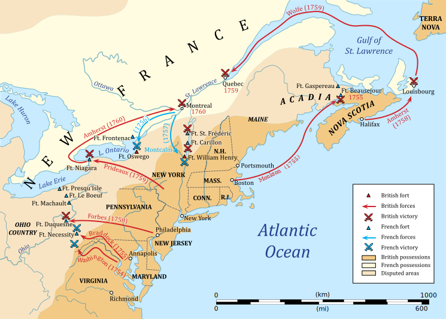

====

So who are England's colonial rivals 殖民对手 in North America? The big one is France. + 
 The father of New France 新法兰西 is Samuel de Champlain - he founded 建立 Quebec 魁北克 in 1608 (one year after Jamestown). + 
 You could see it right there on the map, and `主`  all that area in the blue `系` is eventually going to be part of New France. +
 They have a couple 两三个 of different motives 动机 for colonization, and `主` the first key one `系` is they're going to be very active (a.) in the fur trade 毛皮贸易 economy, and they're going to need _very close relations_ 非常亲密的关系 with the native people /in order to maintain (v.)维持 this trade. +

[.my1]
.案例
====
New France

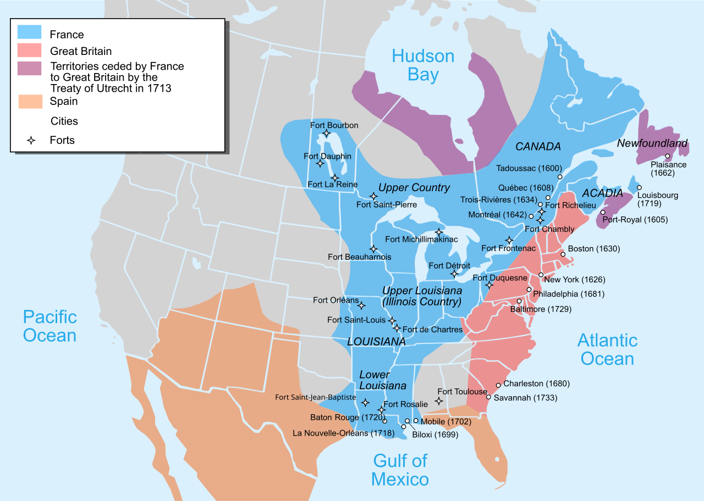

.Quebec
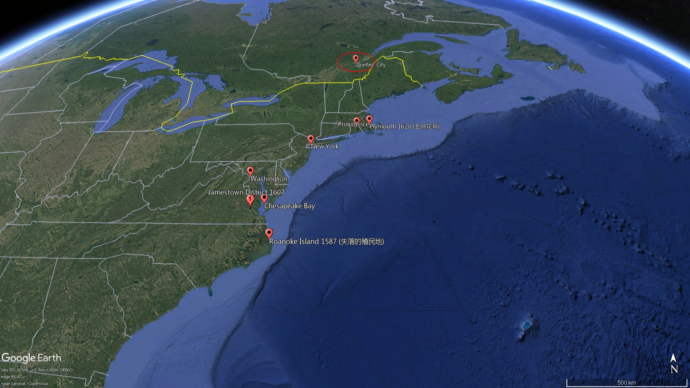

====

You're also going to see the arrival of _Catholic 罗马天主教的 Jesuit 耶稣会信徒 missionaries_ (传教士；工作人员) 耶稣会传教士 - their goal is to convert (v.)使皈依 the native people to Catholicism 天主教. +
 We already mentioned the Dutch 荷兰人 - they're not a really big colony, they're rather small. + 
 They're engaged in 从事 trade/commerce 商业, very diverse (a.)多样化的 colony (`主` more than half the people `系` were not even Dutch), and *as a result* the English take over 接管 that colony /and _New Amsterdam_ becomes New York. +

Spain is also attempting (v.) settlements 定居点 /but very important to keep in mind /when you're talking about New Spain in North America -- it's going to be very sparsely (ad.)稀疏地；贫乏地 populated 人口稀少的. +
 There's mainly going to be (as you could see on the map right there) some forts 堡垒 such as that in St. Augustine 圣奥古斯丁, but no major settlements 定居点，殖民地 /because the bulk of 大部分的 Spanish colonization will *take place* 发生、举行 in Latin America 拉丁美洲. +

[.my1]
.案例
====
.St. Augustine
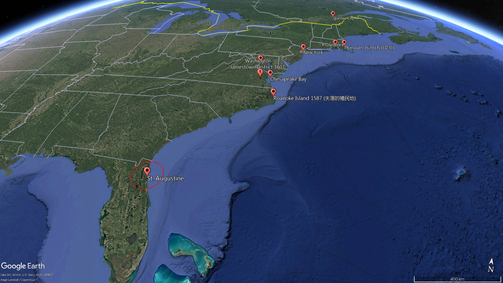

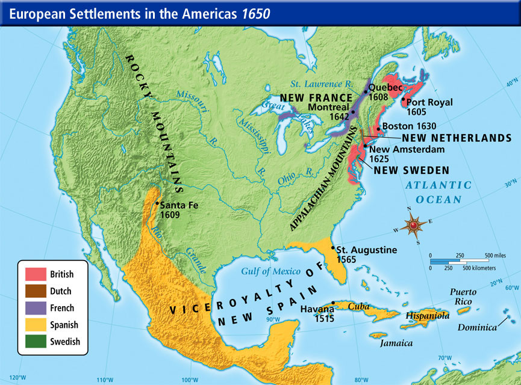

====

Some key differences between the French, Dutch and Spanish colonies versus (v.)对比 the British (make sure you know about these):

There are much fewer European settlers 欧洲移民 when it comes to the French, the Dutch and the Spanish -- they don't bring the massive number of people that the English did in their 13 colonies. +

[.my2]
*说到法国人、荷兰人和西班牙人，这些欧洲国家在北美殖民地中的移民要少得多——他们没有像英国人那样带来大量英国人口到13个殖民地中。*

The French, the Dutch and the Spanish are going to have much more extensive 广泛的 trade alliances 贸易联盟 with American Indians, especially *with regard to* 关于 fur *to be* exported 出口 to Europe, whereas （表示对比）但是，然而 in the English colonies /not a lot of trade *going down* 发生. +

Finally, intermarriage 通婚 was much more common /*between* the French and the Spanish *and* Native Americans /*than* it was with the British - very *rare (a.) to have* intermarriage between British and Native American people. +

[.my1]
.案例
====
.rare
(a.)~ (for sb/sth to do sth)~ (to do sth)not done, seen, happening, etc. very often稀少的；稀罕的 +
•It's extremely rare (a.) for it to be this hot in April.四月份就这样炎热是极其罕见的。 +
•It is rare (a.)to find (v.) such loyalty these days.这样忠心耿耿，在今天非常少见。
====

So in the early 18th century, that's how the continent looked 这就是北美大陆的情形样子 between really France, Spain and England. +
 And there's going to be three _colonial wars_ 后方 that occurred *prior to* 在...之前，先于 the big one - the French and Indian War. +
 And *you don't really need to know* all the details for these wars, but let me just mention (v.): you have _King William's War_ 威廉王之战, you have _Queen Anne's War_ 安妮女王之战, and you have _King George's War_ 乔治王之战 (they're all named (v.) after the king 后定 that they (指战争) *took place* during 它们都是以发生的国王的名字命名的). +

And all of them really are world wars 世界大战 - they start over 遍及 in Europe, they spread (the fighting *spreads (v.) to* America and other places), and you got all sorts of things happening 各种各样的事情都在发生. +
 Georgia is attacked by Spain /during one of these wars (James Oglethorpe 殖民地乔治亚省创始人 defends (v.)保卫 the colony), but these wars are secondary 次要的 in the Americas - they're mainly fought (v.) over in Europe. +
 At stake 处于危险中 is control of the West Indies 西印度群岛 (very lucrative (a.)利润丰厚的 trade in that region) but also North America - the 13 colonies and Canada. +

[.my1]
.案例
====
.West Indies
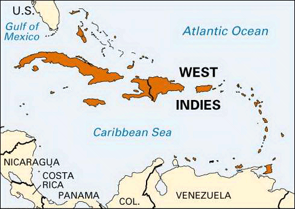
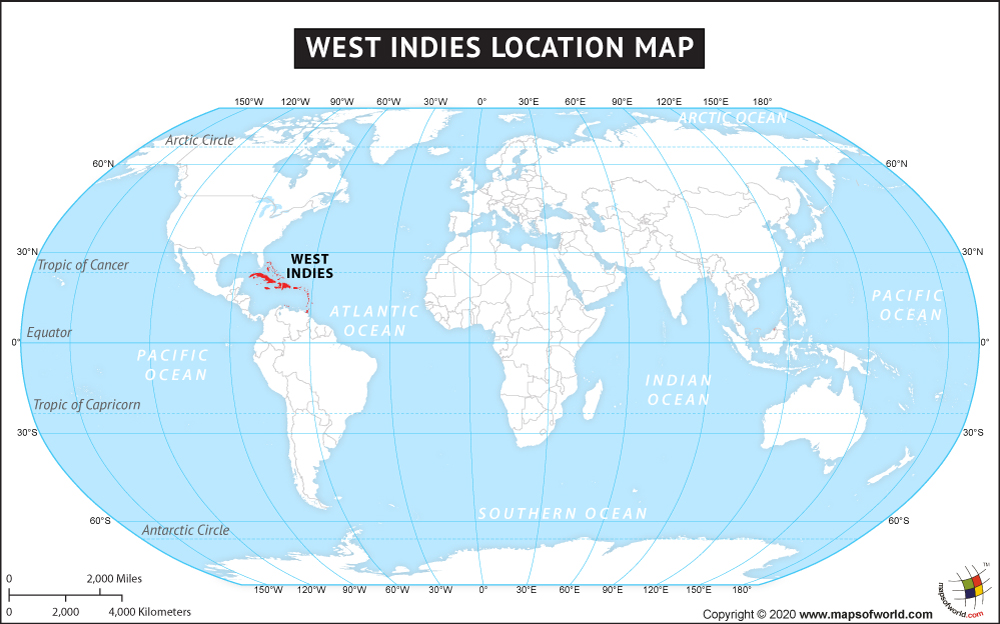

The West Indies is an island subregion of the Americas, surrounded by the North Atlantic Ocean and the Caribbean Sea, which comprises 13 independent island countries and 19 dependencies in three archipelagos: the Greater Antilles, the Lesser Antilles, and the Lucayan Archipelago.

**西印度群岛是美洲的一个岛屿次区域 ，被北大西洋和加勒比海环绕，**由 13 个独立岛国和三个群岛的 19 个属地组成： 大安的列斯群岛 、 小安的列斯群岛和卢卡亚群岛 。

Thinking he had landed on the easternmost part of the Indies in the Eastern world when he came upon the New World, Columbus used the term Indias to refer to the Americas, calling its native people Indios (Indians). To avoid confusion between the known Indies of the Eastern Hemisphere and the newly discovered Indies of the Western Hemisphere, the Spanish named the territories in the East Indias Orientales (East Indies) and the territories in the West Indias Occidentales (West Indies). Originally, the term West Indies applied to all of the Americas.

**哥伦布发现新大陆时，以为自己登陆的是东方世界"印度群岛"的最东端，于是用 Indias （印度）一词来指代美洲 ，并称其原住民为 Indios（印第安人） 。#为了避免东半球已知的印度群岛, 与西半球新发现的印度群岛混淆， 西班牙人将"东印度群岛"的领土命名为 Orientales（东印度群岛） ，将"西印度群岛"的领土命名为 Occidentales（西印度群岛） 。#**最初， “西印度群岛” 一词适用于整个美洲 。

The Indies from both regions were further distinguished depending on the European world power to which they belong. In the East Indies, there were the Spanish East Indies and the Dutch East Indies. In the West Indies, the Spanish West Indies, the Dutch West Indies, the French West Indies, the British West Indies, and the Danish West Indies.

这两个地区的印度群岛, 又根据其所属的欧洲世界强国而进一步划分。 东印度群岛包括"西班牙东印度群岛"和"荷属东印度群岛" 。西印度群岛包括西班牙西印度群岛 、 荷属西印度群岛 、 法属西印度群岛 、 英属西印度群岛, 和丹麦西印度群岛 。

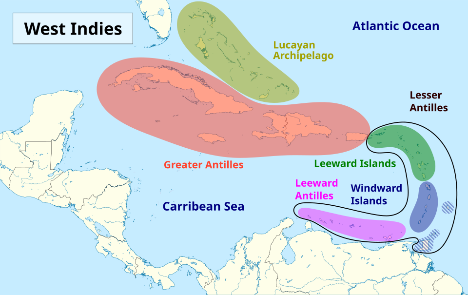

.East Indies

东印度群岛 (或简称印度群岛 ) 是大航海时代历史叙述中使用的术语。  +
*#"印度群岛"广义上指东方或东半球的各种土地，特别是葡萄牙探险家在"好望角航线"发现后不久, 在印度洋及其周围发现的岛屿和大陆 。# +
狭义上，该术语指"马来群岛"* ，包括今天的菲律宾群岛 、 印度尼西亚群岛 、 婆罗洲和新几内亚 。从历史上看，该术语在大航海时代m 用来指印度次大陆和印度支那半岛, 以及马来群岛的陆地海岸 。

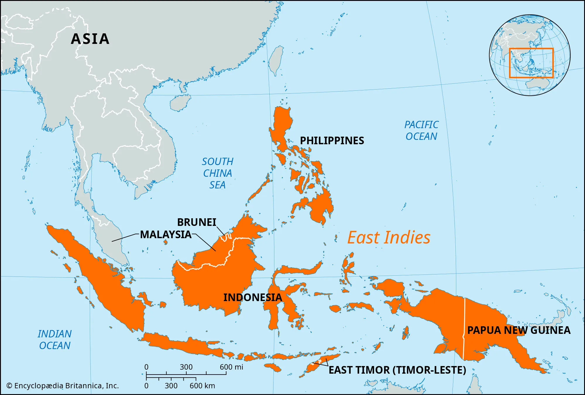

During the era of European colonization, territories of the Spanish Empire in Asia were known as the Spanish East Indies for 333 years before the American conquest and later the independence of the Philippines. Dutch occupied colonies in the area were known for about 300 years as the Dutch East Indies until Indonesian independence. The East Indies may also include the former French Indochina, former British territories Brunei, Hong Kong and Singapore and former Portuguese Macau and Timor. It does not, however, include the former Dutch New Guinea, which is geographically considered to be part of Melanesia.

*#在欧洲殖民时期， 西班牙帝国在亚洲的领土, 被称为"西班牙东印度群岛" ，持续了 333 年，直到美国征服和菲律宾独立。#*  +
##**荷兰在该地区占领的殖民地, 被称为"荷属东印度群岛".约 300 年，直到印度尼西亚独立 。**## +
东印度群岛可能还包括前法属印度支那 、前英国领土文莱 、 香港和新加坡以及前葡属澳门和帝汶 。但它不包括前荷属新几内亚 ，后者在地理上被认为是美拉尼西亚的一部分。
====

So these wars are going to have consequences 后果 in different regions. + 
 And as I already mentioned, the first three wars were mainly fought in Europe. + 
 While these wars are taking place, there is this concept known as salutary neglect 有益的忽视, and this basically means the British policy of avoiding strict enforcement 严格执行 of their laws and regulations 法规. + 
 So things like the Navigation Acts 航海条例 are not being strictly enforced, and that's because England's preoccupied with 忙于 other issues both internally 内部地 and externally 外部地. + 
 And in the words of Michael Jackson, salutary neglect meant the colonies were being "just left alone. + 
"

`主` Another important development that's occurring `系`  is colonists 殖民者 后定 looking for new land 后定 *headed (v.)朝向 west* across _the Appalachian Mountains_ 阿巴拉契亚山脉. +
 And _the Appalachian Mountains_ kind of *run (v.) along* 沿着...延伸 the east coast, and they're moving (v.) further away （时间或空间上）离开（某距离），在（某距离）处 from British control /and they're also moving (v.) into territory 领土 后定 claimed by France. +
 And that's going to really be the kind of backdrop 背景 for the situation 后定 that occurs (v.) in 1754 in the Ohio Valley 俄亥俄河谷. +

So as colonists are moving into this Ohio Valley, both the British and the French start (v.) building forts 堡垒，[军]要塞 in this region (you could see those forts on the map). +
 You have a French fort called Fort Duquesne 迪凯纳堡, you have the British also building forts, and really the French are building forts in the Ohio Valley /to try to stop these colonial settlements. +

And what ends up happening is `表`  `主` *a war `谓` begins* when a Virginian 弗吉尼亚州的人 by the name of George Washington fights (v.) against the French and their (指法国人) Native American allies 盟友. +
 The governor of Virginia sends (v.) a small militia 民兵 under George Washington's leadership, and he and his men *engage in* 参与 a battle between the French and their native allies, and this sparks (v.)引发,冒火花；产生电火花 the French and Indian War. +

This is a hugely important war - the French and Indian War (or the Seven Years' War 七年战争 as it's known (v.) in Europe). +
 It will last (v.) for (you'll never guess it) seven years, and it will have a dramatic impact 重大影响 on the relationship between the colonies and England. +
 You could see on the map the before and the after. 你可以在地图上看到前后的情况. +

Before we *take a look at* `主` why this radical transformation 彻底转变 `谓` *takes place*, it's important to keep in mind that /initially 最初 the war was a disaster 灾难 for the British and the colonists. +
 The French and their Indian allies are *kicking (v.) butt* (屁股) 占据上风,彻底击败、占据绝对优势​​. +
 In order to try to deal with the war effort, an _Albany 城市名 plan_ or meeting is called. +
 The British wanted to coordinate (v.)协调 the war effort between them and the colonies, and they wanted to help promote (v.)促进，提倡 colonial defense 殖民防御 (remember `主` these 13 colonies `系` were very kind of independent (a.)自治的，独立的 from one another - how do we fight (v.) together?). +

[.my1]
.案例
====
.Kicking butt
意思是 ​​“打得对手落花流水”​​ 或 ​​“占据绝对优势”​​，通常用来形容一方在竞争、比赛或战斗中表现极强，完全压制对方。

*"kick"（踢） + "butt"（屁股）*→ 字面意思是“踢屁股”，但实际含义与中文的 ​​“吊打”​​、“暴揍”类似。 +
在战争、体育比赛或任何竞争中，如果一方 ​​"is kicking butt"​​，就表示他们 ​​“完全占据上风，让对手毫无招架之力”​​。 +

近义词：dominating, crushing, winning decisively（主导、碾压、大获全胜）。

其他类似表达：​​

[.my3]
[options="autowidth" cols="1a,1a"]
|===
|Header 1 |Header 2

|"Getting their butts kicked"​​（被动形式）：
|"The British *were getting their butts kicked*."
→ ​​“英军被揍得找不着北。”​

|​"Getting wrecked"​​（被彻底击败）：
|"The colonists *got wrecked* in the early battles."
→ ​​“殖民者在初期战斗中惨败。”​

|更正式的说法:
|"The French forces *overwhelmingly dominated* 压倒性支配 the early stages of the war."
→ ​​“法军在战争初期占据绝对优势。”​
|===

.Albany plan

来自北大西洋几个殖民地的二十多名代表聚集在一起，计划与"法印战争"（1754-1763）有关的防御措施. 本杰明·富兰克林（48岁）和宾夕法尼亚州代表提出"奥尔巴尼联盟计划", 建议十三个殖民地建立一个统一政府. 虽然该计划被否决，但它是《邦联条例》和《美国宪法》的先驱。

The Plan represented one of multiple 多个的，多种的 early attempts to form (v.) a union of the colonies "under one government *as far as* 在…范围内,到…程度 might be necessary for defense and other general important purposes."  The plan was rejected but it was a forerunner for the Articles of Confederation and the United States Constitution. +
该计划是早期多次尝试之一，旨在建立一个殖民地联盟，​​‘在防御和其他重要共同事务所需的范围内，实行统一政府’​​。

这里的 ​​"as far as"​​ 并非表示“就…而言”（如 "as far as I know"），而是表示 ​​“在…范围内”​​ 或 ​​“到…程度”​​，强调 ​​某种限度或条件​​。

*"under one government as far as might be necessary..."​​
= ​​“在必要时（的范围内）实行统一政府”​*​ +
​​*"as far as"​​ 限定了统一政府的适用范围：​​仅针对防御和其他重要事务​​，而非完全中央集权。* +
类似中文的 ​​“在…前提下”​​ 或 ​​“仅限于…情况”​​。

该计划（1754年《奥尔巴尼联盟计划》）提议殖民地部分联合，但​​各殖民地不愿完全放弃自治权​​。
​​"as far as necessary"​​ 体现了妥协：统一政府仅针对共同防御（如对抗法国和印第安人）等有限事务，其他事务仍由各殖民地自主。

对比 as far as 其他常见用法​:
[.my3]
[options="autowidth" cols="1a,1a"]
|===
|Header 1 |Header 2

|​表示范围/限度
|The union would operate ​​*as far as​​ necessary*.	联盟仅在必要范围内运作。

|表示程度​
|He helped ​​*as far as​​ possible*. 他尽力提供了帮助。

|就…而言
|*As far as I know*, the plan was rejected. 据我所知，计划被拒绝了。
|===

====

So representatives 代表 from seven colonies meet (v.) in Albany, New York in 1754 /at this intercolonial 殖民地间的 meeting 殖民地间会议, and they got to figure out 找到答案，解决 how are we going to beat France? And they also have another purpose in meeting 后定 which is `表` *to get* the powerful Iroquois tribe 易洛魁部落 *out of neutrality* (中立)脱离中立  (this tribe was very prominent (a.)突出的,重要的 in the New York area) /and they want to get them on the side of the British and the colonists. +

[.my1]
.案例
====
.Albany
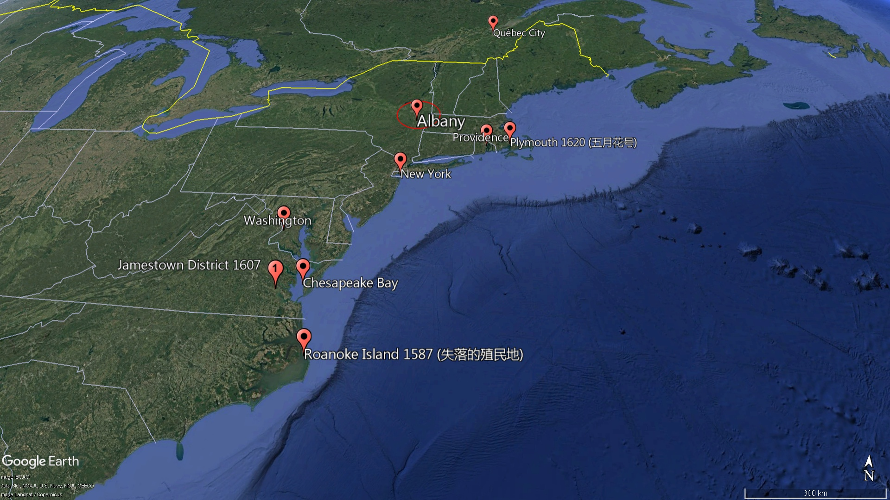
====

Ben Franklin *plays a key role* at this Albany conference - he develops _the Albany Plan of Union_ 奥尔巴尼联盟计划, and this was really intended to help coordinate (v.) troop movements 军队调动 /and to collect (v.) taxes 征税 /and ultimately to promote (v.) colonial unity 殖民统一. +
 His famous "Join or Die" 不联合即死亡 political cartoon 政治漫画 is one of the earliest (if not the first) in colonial America. +

[.my1]
.案例
====
.Join or Die
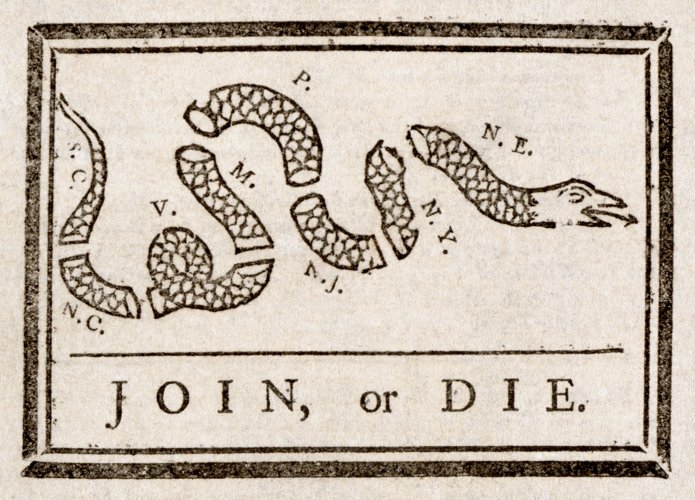

====

And in spite of 尽管 it being really awesome 让人惊叹的，令人敬畏的；非常棒的，极佳的 and stressing (v.)强调 the importance of unity, `主` colonial jealousy (n.)嫉妒 and a tradition of *not working together* `谓` led to the plan *being rejected* 拒绝 (the colonists basically saying "No thank you, we don't really want to work together"). +
 *What is important* though about the Albany Plan is `表`  `主` *it `谓` established (v.) a precedent 先例 for* later meetings in cooperation 合作. +
 And ironically enough 具有讽刺意味的是, `主` later on these colonies `谓` will be meeting (v.)后定 to discuss (v.) _**not** France *but rather* 而是 resistance (n.)抵抗 against England._ +

Eventually the war *starts (v.) turning* (v.) in the favor of the British and the colonists. 最终，战争开始向有利于英国和殖民者的方向发展。 +
 You got a guy _by the name of_ William Pitt 后定 who starts doing some things, and `主` the continent, which once looked like this in 1750, `谓` *looks like this* following the Treaty of Paris 巴黎条约 in 1763. +

[.my2]
这片大陆在1750年时是这样的，但在1763年《巴黎条约》签订之后，看起来就变成这样了。

What happened to France?

1763 is a hugely important year - it is the official year of the Peace of Paris 巴黎和约. + 
 England gains (v.)获得；增加；赚得 French territory 领土 all the way *from* Canada *down 在南部，向南方 into* Florida (which was acquired (v.)获得 from Spain). +
 They also take French land *from* the Appalachian Mountains *all the way to* the Mississippi River 密西西比河. +
 You do see Spain acquiring (v.) French territory 后定 west of the Mississippi River 密西西比河以西的法国领土, and France *is effectively kicked out of* 被赶出 North America (they do maintain (v.)保留 a small colony over here in Haiti - a very profitable colony -- *more on that* 更多信息 a little bit later 稍后会详细介绍). +

Once again, this is a huge turning point 转折点 - England established (v.) supremacy 霸权 of North America. +
 Big idea: 1763 *not only* is the Treaty of Paris, *but it also* is the start of a lot of drama 戏剧性事件. +
 Salutary neglect 有益的忽视 *will come to an end* following the French and Indian War in the year (you guessed it) 1763. +

`主` The colonists who *had grown accustomed to* 逐渐习惯于 _a large measure of 很大程度上 autonomy 自治_ (freedom *to do* as they wanted) /`谓` are now going to find (v.)发现，发觉 England assuming (v.)呈现（外观、样子）；显露（特征）;承担（责任）；就（职）；取得（权力） direct control 直接控制 over the colonies. +
 A lot of things are going to change (v.) in 1763 because, as I said, it is a turning point in the relationship between the colonies and England. +

[.my1]
.案例
====
.assume
[ VN] ( formal ) to take or begin to have power or responsibility承担（责任）；就（职）；取得（权力） +
SYN take +
•The court assumed responsibility for the girl's welfare.法庭承担了保障这个女孩福利的责任。 +
•Rebel forces have assumed control of the capital.反叛武装力量已控制了首都。
====

One of the big things that's going to change `系` is England will emerge from 从...中摆脱 the war (the Seven Years' War) with massive debt 巨额债务, and this will *lead to* a whole host of 大量的，许多的 taxes *being passed*. +
 England's going to seek (v.) to consolidate (v.)巩固 their imperial control 帝国控制 over the North American colonies, and `主` _one of the ways_ they're going to do this `系` is through 以，凭借 taxes (*we'll cover (v.) that* in our next video). +

Another key thing that happens (v.) in 1763 `系`  is Pontiac's Rebellion 庞蒂亚克起义. +
 And remember (v.) the native people lost (v.) a valuable trading partner /when France *was kicked out* (England'*s not really trading with* the native people like France was). +
`主`  *Not only* that, *but* native people `谓` have to worry about colonists *moving into their land* at a much more rapid pace 更快的速度. +

As a result, Pontiac's Rebellion *takes place*. +
 Pontiac was an Ottawa chief 渥太华酋长 - he forged (v.)建立,锻造（金属） a western confederation 西部联盟 /and he *rebels (v.)造反；反抗 against* colonists encroaching (v.)渐渐渗入 on 侵占 native land. +
 This rebellion takes place throughout the frontier 边疆 /as _colonial settlements_ are attacked. +
 There is horrible violence 后定 *taking place* throughout the frontier, and some colonists *take matters into their own hands* 自己处理问题,亲自处理问题. +

[.my1]
.案例
====
.Pontiac's War
庞蒂亚克战争 （又称庞蒂亚克阴谋或庞蒂亚克起义 ）, 是在1763年由一个印第安人联盟发起的，**他们在法国和印第安人的战争（1754-1763）之后, 对英国在大湖地区的统治感到不满。**来自不同原住民部落的战士联合起来，试图将英国士兵和定居者驱逐出该地区。这场战争是以奥达瓦族领导人"庞蒂亚克"的名字命名的，庞蒂亚克是这场冲突中最杰出的土著领导人。

北美边境的战争非常残酷；杀害战俘、攻击平民以及其他暴行随处可见。

The British government sought to prevent further racial violence by issuing _the Royal Proclamation of 1763_, which created a boundary between colonists and Natives.

英国政府颁布了 1763 年皇家宣言 ，试图防止进一步的种族暴力，该宣言在殖民者和原住民之间划定了界限。官员们在英国殖民地和阿巴拉契亚山脉以西的美洲印第安人土地之间, 划定了边界，创建了一个广阔的 “印第安人保留地” ，从阿巴拉契亚山脉延伸到密西西比河 ，从佛罗里达延伸到魁北克 。通过禁止殖民者侵入印第安人的土地，英国政府希望避免更多类似庞蒂亚克战争的冲突。

the Royal Proclamation of 1763 +
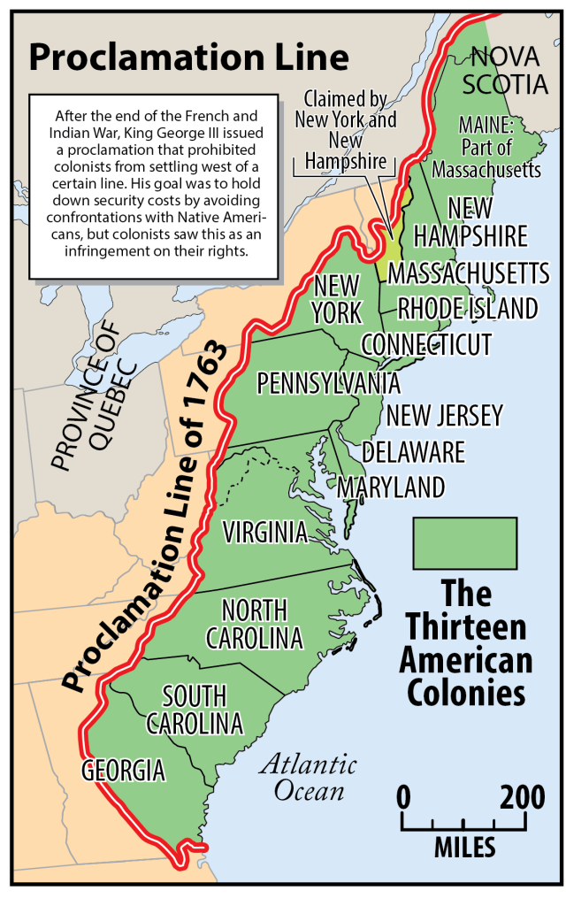

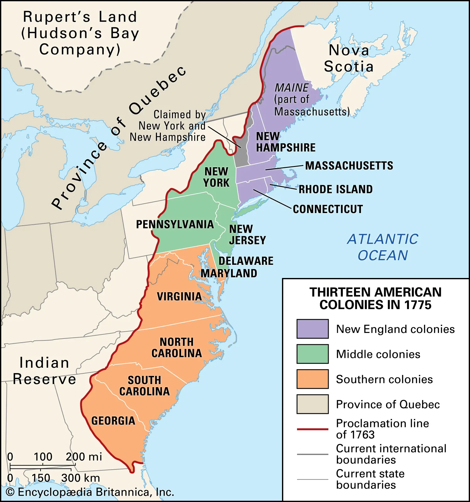

The effects of Pontiac's War were long-lasting. Because the Proclamation officially recognized that indigenous people had certain rights to the lands they occupied, it has been called a Native American "Bill of Rights," and still informs the relationship between the Canadian government and First Nations. For British colonists and land speculators, however, the Proclamation seemed to deny them the fruits of victory—western lands—that had been won in the war with France. This created resentment, undermining colonial attachment to the Empire and contributing to the coming of the American Revolution.

*庞蒂亚克战争的影响是深远的。#由于《宣言》正式承认原住民对其所占土地拥有某些权利，它被称为美洲原住民的“权利法案”，至今仍影响着加拿大政府与原住民之间的关系。 然而，对于英国殖民者和土地投机者来说，《宣言》似乎剥夺了他们在与法国的战争中赢得的胜利果实——西部土地。这引发了怨恨，削弱了殖民地对帝国的依恋，并促成了美国独立战争的爆发。#*

For American Indians, Pontiac's War demonstrated the possibilities of pan-tribal cooperation in resisting Anglo-American colonial expansion. Although the conflict divided tribes and villages,[181] the war also saw the first extensive multi-tribal resistance to European colonization in North America,[182] and the first war between Europeans and American Indians that did not end in complete defeat for the Indians.[183] The Proclamation of 1763 ultimately did not prevent British colonists and land speculators from expanding westward, and so Indians found it necessary to form new resistance movements.

对于美洲印第安人来说，庞蒂亚克战争展示了"泛部落合作"抵抗英美殖民扩张的可能性。尽管这场冲突分裂了部落和村庄， [ 181 ] 但这场战争也见证了北美首次"大规模的多部落抵抗欧洲殖民统治"的斗争， [ 182 ] *也是欧洲人与美洲印第安人之间, 第一次没有以印第安人彻底失败而告终的战争。* [ 183 ]​​ 1763 年的《1763 年宣言》最终未能阻止英国殖民者和土地投机者向西扩张，因此印第安人发现有必要组建新的抵抗运动。

====

And this is where you have the Paxton Boys 帕克斯顿男孩(是宾夕法尼亚州最具侵略性的殖民者) -- these were western Pennsylvania colonists (they're mainly Scots-Irish immigrants 苏格兰-爱尔兰移民) /and they start (v.)  randomly attacking (v.) native people. +
 They're a vigilante group 治安维持团体 - they start demanding that the colonial government do something about these attacks. + 
 And the Paxton Boys eventually march to Philadelphia demanding the government address their grievances 不满 (they want protection). + 

In this process though 可是，然而, they start murdering (v.) innocent 无辜的 native people who had nothing to do with Pontiac's Rebellion. +
 Eventually the British are forced *to send in* 派遣 additional troops 增派部队 to stop (v.) Pontiac's rebellion /and to protect (v.) the colonists (you could see `主` the huge increase of troops `谓` *taking place* especially in the Ohio Valley *all the way 一直到 up 向上,向北方 into* Canada). +
 And of course, troops cost money. + 

Eventually Pontiac's Rebellion is defeated, and this *leads* (v.) (Pontiac's Rebellion leads) *to* the British passing (v.) a very important act (n.) called _The Proclamation 正式的公告，宣言 Act of 1763_ (1763年公告令). +
 This was intended to prevent (v.) hostilities 敌对行动 between Native Americans and colonists, but *it's going to create (v.) bitter  味苦的；激烈的，充满敌意的；愤愤不平的 feelings* 怨恨. +
 Remember (v.) `主` all this `谓` used to be France's - now it's England's. +

Here's what it did: it *prohibited* (v.)禁止 colonists *from* mov**ing** (v.) west of the Appalachian Mountains. +
 It basically *drew (v.) a line* that said "colonists you cannot *go past* this line." +
The British felt that `宾`  if they move (v.) west that (重复指代前面的条件（if they move west）) this would lead to conflict /and cost (v.) the crown 王室 more money. +
 And colonists were angry and openly defied (v.)公然违抗 the British policy - they are moving west *regardless of* 不管 this proclamation 正式的公告. +

[.my1]
.案例
====
.if they move west *that* this would lead to conflict
在口语或非正式写作中，有时会 ​​冗余地保留 "that"​​，用于强调或衔接前后分句的逻辑关系。 +
这里的 ​​"that"​​ 可以理解为 ​​重复指代前面的条件（if they move west）​​，相当于： +
"The British felt that /[if they move west], ​​[then] that​​ [= moving west] would lead to conflict."
（英国人认为，[如果他们西迁]，​​[那么] 这种行为​​会导致冲突。）

这种用法类似于中文口语中重复的“那个”——虽然不严谨，但能增强表达节奏感。

是否可以省略第二个 "that"？​​
​​完全可以！​​ 以下两种表达均正确，但第二种更简洁：
​​带 "that"​​（口语化/冗余）： +
"The British felt that /if they move west *​​that​​* this would lead to conflict."
​​不带 "that"​​（更标准）： +
"The British felt that /if they move west, this would lead to conflict."

====

And this is creating (v.) more and more tension 紧张, and it's really important you know the differences between the British and the colonists' views following the French and Indian War. +

In the minds 在某人心中,思想中 of  the British:

- They were disappointed in 对...失望 the colonial military contributions 军事贡献 to the French and Indian War. +
They felt that /the colonists were unable and unwilling (a.)不愿意 to defend (v.) themselves on the frontier.

- The war started (v.) in North America (unlike those other three wars).  +
And the outcome 结果 benefited (v.) the colonists /so they should help pay (v.) for it (and that's going to *lead to* new taxes and also policies 政策，方针，策略 such as the Proclamation Act of 1763)

- Wars were expensive -- you need troops (n.) in North America /so the colonists should pay (v.) their fair share 公平份额. +
Don't *forget* as well 也；同样地 *that* /the war marks (v.) the end of _salutary neglect_. so `主` that `谓` means (v.) the enforcement 执行，实施 of _the Navigation Acts_ and other laws 后定 the colonists *were used to not abiding (v.) by* 遵守

And *as a result* following the war, the British are going to assume (v.)承担（责任）；就（职）；取得（权力） direct control over the colonies

In the minds of the colonists:

They felt /they had contributed to 贡献于 the defense of the colonies in all four of the wars. +
They felt they fought bravely 勇敢地. +
And they wanted access to 获得 the new frontier land /since the French are gone
/And the British policies were violating 侵犯 their liberties 自由. +
So you could see `主` this tension `谓` starting to build up 积累. +
 However, it's important to note (v.) `主` intercolonial disunity 殖民地间的不团结 `谓` remains (v.)  strong. +
 The colonists are not *calling for* or even discussing (v.) independence 独立 yet, but the tensions are starting to mount (v.)加剧,上升；增强，加剧. +

That's going to do it for today 今天就到这里. +
 I hope you learned a whole bunch (一群；大量), and if you did, click like on the video, tell your friends about the channel, and make sure you subscribe. +
 And if you're ever in Pittsburgh, Pennsylvania (home of the Steelers 钢人队), check out the site of the original Fort Duquesne - the French fort in the Ohio Valley. + 
 Until next time, have a beautiful day. + 
 Peace!

'''

== 中文翻译

大家好！感谢大家收看又一期乔的制作视频。今天我们将分析北美洲的欧洲列强之间的竞争，以及一场你们应该了解的最重要的战争——法国和印第安人战争。无论你们使用哪本APUSH教材，这个视频都将帮助你们理解这些主题。

那么，*英国在北美洲的殖民对手是谁呢？最主要的是法国。*“新法兰西之父”是萨缪尔·德·尚普兰——他在1608年（詹姆斯敦建立一年后）建立了魁北克。你们可以在地图上看到它，所有蓝色区域最终都将成为新法兰西的一部分。*他们(法国人)有几个不同的殖民动机，第一个关键动机, 是他们将非常积极地参与毛皮贸易经济，他们需要与当地居民保持非常密切的关系才能维持这种贸易。*

你们还将看到, 天主教耶稣会传教士的到来——他们的目标是将当地居民皈依天主教。我们已经提到了荷兰人——他们不是一个真正庞大的殖民地，他们相当小。他们从事贸易/商业，是一个非常多元化的殖民地（超过一半的人甚至不是荷兰人），结果英国人接管了那个殖民地，新阿姆斯特丹变成了纽约。

*##西班牙也在尝试建立定居点，##但当你们谈论北美洲的"新西班牙"时，#非常重要的一点是——它的人口将非常稀少。主要会有一些堡垒#*（正如你们在地图上看到的那样），例如圣奥古斯丁的堡垒，*#但没有主要的定居点，因为西班牙殖民的大部分将发生在拉丁美洲。#*

*法国、荷兰和西班牙殖民地, 与英国殖民地之间的一些主要区别*（务必了解这些）：

**#就法国、荷兰和西班牙而言，欧洲定居者要少得多——他们不像英国在其13个殖民地那样带来大量人口。法国、荷兰和西班牙, 将与美洲印第安人建立更广泛的贸易联盟，#**特别是关于出口到欧洲的毛皮，**#而在英国殖民地，"贸易往来"不多。#** +
最后，**法国人和西班牙人, 与美洲印第安人之间的通婚, 比英国人要普遍得多——英国人和美洲印第安人之间的通婚非常罕见。**因此，在18世纪初，大陆在法国、西班牙和英国之间的分布就是这样的。在法国和印第安人战争（French and Indian War）这场大战之前，还发生了三次殖民战争。你们不必了解这些战争的所有细节，但请允许我提一下：你们有威廉国王战争（King William’s War），安妮女王战争（Queen Anne’s War），以及乔治国王战争（King George’s War）（它们都以发生时的国王的名字命名）。

**#所有这些, 实际上都是世界大战——它们起源于欧洲，蔓延开来（战斗蔓延到美洲和其他地方），#**各种各样的事情都发生了。乔治亚在其中一场战争中, 遭到西班牙的袭击（詹姆斯·奥格尔索普保卫了殖民地），**但##这些战争在美洲是次要的——它们主要在欧洲进行。##**关键在于对西印度群岛（该地区贸易非常有利可图）以及北美洲——13个殖民地和加拿大的控制权。

因此，这些战争将在不同地区产生影响。正如我已经提到的，前三次战争主要在欧洲进行。在这些战争发生的同时，存在着一种被称为**“#有益的忽视#**”（salutary neglect）的概念，**这基本上##是指英国避免严格执行其法律和法规的政策。因此，《航海法案》（Navigation Acts）等并没有得到严格执行，##**这是因为英国正忙于国内和国外的其他问题。用迈克尔·杰克逊的话来说，*“有益的忽视”意味着殖民地“只是被放任自流”。*

另一个正在发生的重要发展是，**寻求新土地的殖民者越过阿巴拉契亚山脉, 向西迁移。**阿巴拉契亚山脉, 大致沿着东海岸延伸，**他们正在远离英国的控制，并且也正在进入法国声称拥有的领土。**这将真正成为1754年俄亥俄河谷事件的背景。

*随着殖民者迁入俄亥俄河谷，英国人和法国人都开始在该地区修建堡垒*（你们可以在地图上看到这些堡垒）。你们有一个法国堡垒叫"杜肯堡"（Fort Duquesne），英国人也在修建堡垒，实际上**法国人在俄亥俄河谷修建堡垒, 是为了阻止这些殖民定居点。**

最终发生的是，当一位名叫乔治·华盛顿的弗吉尼亚人, 与法国及其美洲印第安盟友作战时，战争开始了。弗吉尼亚州州长派遣了一支由"乔治·华盛顿"领导的小型民兵，他和他的部下与法国及其当地盟友发生了一场战斗，这引发了法国和印第安人战争。(虽然叫 French and Indian War/Seven Years' War, 1754–63, 但**实际上是英国和法国之间的战争.**)

这是一场极其重要的战争——法印战争（在欧洲被称为"七年战争"）。它将持续（你们猜不到）七年，并将对北美殖民地与母国英国之间的关系, 产生巨大影响。你们可以在地图上看到战前和战后的情况。

在我们分析这种彻底转变发生的原因之前，重要的是要记住，战争初期对英国人和殖民者来说是一场灾难。法国及其印第安盟友占尽优势。为了应对战争，召开了奥尔巴尼会议（Albany Congress）或制定了奥尔巴尼计划（Albany Plan）。英国希望协调他们和殖民地之间的战争努力，他们希望帮助促进殖民地的防御（记住**这13个殖民地彼此之间非常独立**——我们如何共同作战？）。

*因此，来自七个殖民地的代表, 于1754年在纽约奥尔巴尼举行的这次殖民地间会议上会面，他们必须弄清楚, 我们如何击败法国？他们会议的另一个目的, 是让强大的"易洛魁部落"（这个部落在纽约地区非常突出）摆脱中立，他们希望让这个部落站在英国人和殖民者一边。*

*本杰明·富兰克林,* 在这次奥尔巴尼会议中发挥了关键作用——他制定了奥尔巴尼联邦计划（Albany Plan of Union），这实际上旨在帮助协调军队调动、征税, 并最终促进殖民地的团结。*他著名的“不联合，毋宁死”（Join or Die）政治漫画是殖民地美国最早的漫画之一（如果不是第一个的话）。*

尽管它非常棒, 并强调了团结的重要性，**但殖民地之间的嫉妒和不合作的传统, 导致该计划被拒绝（殖民者基本上说“不，谢谢，我们真的不想合作”）。然而，奥尔巴尼计划的重要性在于, 它为后来的合作会议, 奠定了先例。**具有讽刺意味的是，后来这些殖民地将开会讨论的不是法国，而是对英国的反抗。

最终，战争开始转向对英国人和殖民者有利的方向。一位名叫威廉·皮特的人开始采取一些措施，曾经在1750年看起来像这样的北美大陆，在1763年巴黎条约签订后变成了这样。法国怎么了？

**1763年**是一个极其重要的年份——它**是"巴黎和约"**正式签订的年份。**英国获得了从加拿大一直到佛罗里达（从西班牙获得）的法国领土。他们还夺取了从阿巴拉契亚山脉, 一直到密西西比河的法国土地。**你们确实看到西班牙获得了密西西比河以西的法国领土，而**法国实际上被逐出了北美洲**（他们确实在这里的"海地"保留了一个小殖民地——一个非常有利可图的殖民地——稍后会详细介绍）。

再次强调，**这是一个巨大的转折点——英国确立了在北美洲的霸权。**重要观点：1763年不仅是巴黎条约签订的年份，也是许多戏剧性事件的开始。*#在"法印战争"结束后（你们猜对了）的1763年，“有益的忽视”将结束。#*

*##曾经习惯于享有很大程度"自治"（自由地做他们想做的事）的殖民者, 现在将发现英国正在直接控制殖民地。##1763年将发生许多变化*，因为正如我所说，这是殖民地与英国关系的一个转折点。

**将要改变的一件大事, 是##英国将带着巨额债务, 从战争（七年战争）中脱身，这将导致一系列"税收"的通过。##**英国将寻求巩固其对北美殖民地的帝国控制，他们采取的一种方式是通过税收（我们将在下一个视频中介绍）。

1763年发生的另一件关键事件, 是庞蒂亚克叛乱（Pontiac’s Rebellion）。**记住，#当法国被逐出后，当地居民失去了一个重要的贸易伙伴（英国不像法国那样真正与当地居民进行贸易）。#**不仅如此，当地居民还必须担心殖民者以更快的速度迁入他们的土地。

结果，庞蒂亚克叛乱爆发了。庞蒂亚克是一位渥太华部落酋长——他建立了一个西部联盟，并反抗"侵占当地土地的殖民者"。这场叛乱遍布边疆，殖民地定居点遭到袭击。整个边疆地区都发生了可怕的暴力事件，一些殖民者开始自行采取行动。

这就是帕克斯顿男孩（Paxton Boys）出现的地方——他们是宾夕法尼亚西部殖民者（主要是苏格兰-爱尔兰移民），他们开始随意袭击当地居民。他们是一个治安维持会组织——他们开始要求殖民地政府对这些袭击采取行动。帕克斯顿男孩最终游行到费城，要求政府解决他们的不满（他们想要保护）。

然而，在这个过程中，他们开始谋杀与庞蒂亚克叛乱无关的无辜当地居民。*最终，英国被迫派遣更多军队来镇压庞蒂亚克叛乱, 并保护殖民者（你们可以看到军队数量的大幅增加，尤其是在俄亥俄河谷一直到加拿大）。#当然，军队需要花钱。#*

**最终，庞蒂亚克叛乱被镇压，这导致（庞蒂亚克叛乱导致）英国通过了一项非常重要的法案，称为1763年公告（The Proclamation Act of 1763）。这旨在防止美洲印第安人与殖民者之间的敌对行动，**但它将造成痛苦的情绪。记住，所有这些, 以前都是法国的——现在是英国的了。

*它是这样规定的：##禁止殖民者迁往"阿巴拉契亚山脉"以西。##它基本上划了一条线，说“殖民者，你们不能越过这条线。”#英国人认为，如果他们向西迁移，这将导致冲突, 并花费王室更多的钱。殖民者很生气，公开蔑视英国的政策——他们不顾这项公告，仍然向西迁移。#*

这正在造成越来越多的紧张局势，了解"法印战争"后的英国人和殖民者观点的差异, 是非常重要的。

*在英国人看来：*
**他们对殖民地在"法印战争"中的军事贡献, 感到失望。##他们(英国母国)认为, 北美殖民者无力且不愿在边疆自卫(相当于美国耗费资金来保护欧洲, 但欧洲自己不愿花钱来提高自己军费一样)。##战争起源于北美洲（不像其他三次战争）。##战争的结果使殖民者受益，因此他们应该帮助支付费用（这将导致新的税收, ##以及诸如1763年公告之类的政策）。##战争耗资巨大——你们需要在北美洲驻扎军队，因此殖民者应该支付他们应有的份额。##别忘了，#战争标志着“有益的忽视”的结束#（这意味着执行《航海法案》和其他殖民者过去习惯于不遵守的法律）。#因此，战争结束后，英国将直接控制殖民地。#**

*在北美的殖民者看来：*
他们认为, 他们在所有四次战争中, 都为保卫殖民地做出了贡献。他们认为自己是英勇作战的。**法国人走了，他们想要获得新的边疆土地。但英国的约束政策侵犯了他们的自由。**因此，你们可以看到这种紧张局势开始积聚。*然而，##重要的是要注意，殖民地之间的不团结状态仍然很强。##殖民者尚未呼吁甚至讨论独立，但紧张局势正在加剧。*

今天就到这里。我希望你们学到了很多东西，如果学到了，请点赞这个视频，告诉你们的朋友这个频道，并确保你们订阅了。如果你们有机会去宾夕法尼亚州匹兹堡（钢人队的主场），去看看俄亥俄河谷最初的法国堡垒——杜肯堡的遗址。下次再见，祝你们度过美好的一天。再见！

'''

== pure

What's going down everyone? Thank you for checking out another Joe's Productions video. Today we're going to break down the European rivalries in North America and really one of the most important wars you should know about - the French and Indian War. No matter which book you're using for APUSH, this video is going to help you out with these topics.

So who are England's colonial rivals in North America? The big one is France. The father of New France is Samuel de Champlain - he founded Quebec in 1608 (one year after Jamestown). You could see it right there on the map, and all that area in the blue is eventually going to be part of New France. They have a couple of different motives for colonization, and the first key one is they're going to be very active in the fur trade economy, and they're going to need very close relations with the native people in order to maintain this trade.

You're also going to see the arrival of Catholic Jesuit missionaries - their goal is to convert the native people to Catholicism. We already mentioned the Dutch - they're not a really big colony, they're rather small. They're engaged in trade/commerce, very diverse colony (more than half the people were not even Dutch), and as a result the English take over that colony and New Amsterdam becomes New York.

Spain is also attempting settlements but very important to keep in mind when you're talking about New Spain in North America - it's going to be very sparsely populated. There's mainly going to be (as you could see on the map right there) some forts such as that in St. Augustine, but no major settlements because the bulk of Spanish colonization will take place in Latin America.

Some key differences between the French, Dutch and Spanish colonies versus the British (make sure you know about these):

There are much fewer European settlers when it comes to the French, the Dutch and the Spanish - they don't bring the massive number of people that the English did in their 13 colonies.
The French, the Dutch and the Spanish are going to have much more extensive trade alliances with American Indians, especially with regard to fur to be exported to Europe, whereas in the English colonies not a lot of trade going down.
Finally, intermarriage was much more common between the French and the Spanish and Native Americans than it was with the British - very rare to have intermarriage between British and Native American people.
So in the early 18th century, that's how the continent looked between really France, Spain and England. And there's going to be three colonial wars that occurred prior to the big one - the French and Indian War. And you don't really need to know all the details for these wars, but let me just mention: you have King William's War, you have Queen Anne's War, and you have King George's War (they're all named after the king that they took place during).

And all of them really are world wars - they start over in Europe, they spread (the fighting spreads to America and other places), and you got all sorts of things happening. Georgia is attacked by Spain during one of these wars (James Oglethorpe defends the colony), but these wars are secondary in the Americas - they're mainly fought over in Europe. At stake is control of the West Indies (very lucrative trade in that region) but also North America - the 13 colonies and Canada.

So these wars are going to have consequences in different regions. And as I already mentioned, the first three wars were mainly fought in Europe. While these wars are taking place, there is this concept known as salutary neglect, and this basically means the British policy of avoiding strict enforcement of their laws and regulations. So things like the Navigation Acts are not being strictly enforced, and that's because England's preoccupied with other issues both internally and externally. And in the words of Michael Jackson, salutary neglect meant the colonies were being "just left alone."

Another important development that's occurring is colonists looking for new land headed west across the Appalachian Mountains. And the Appalachian Mountains kind of run along the east coast, and they're moving further away from British control and they're also moving into territory claimed by France. And that's going to really be the kind of backdrop for the situation that occurs in 1754 in the Ohio Valley.

So as colonists are moving into this Ohio Valley, both the British and the French start building forts in this region (you could see those forts on the map). You have a French fort called Fort Duquesne, you have the British also building forts, and really the French are building forts in the Ohio Valley to try to stop these colonial settlements.

And what ends up happening is a war begins when a Virginian by the name of George Washington fights against the French and their Native American allies. The governor of Virginia sends a small militia under George Washington's leadership, and he and his men engage in a battle between the French and their native allies, and this sparks the French and Indian War.

This is a hugely important war - the French and Indian War (or the Seven Years' War as it's known in Europe). It will last for (you'll never guess it) seven years, and it will have a dramatic impact on the relationship between the colonies and England. You could see on the map the before and the after.

Before we take a look at why this radical transformation takes place, it's important to keep in mind that initially the war was a disaster for the British and the colonists. The French and their Indian allies are kicking butt. In order to try to deal with the war effort, an Albany plan or meeting is called. The British wanted to coordinate the war effort between them and the colonies, and they wanted to help promote colonial defense (remember these 13 colonies were very kind of independent from one another - how do we fight together?).

So representatives from seven colonies meet in Albany, New York in 1754 at this intercolonial meeting, and they got to figure out how are we going to beat France? And they also have another purpose in meeting which is to get the powerful Iroquois tribe out of neutrality (this tribe was very prominent in the New York area) and they want to get them on the side of the British and the colonists.

Ben Franklin plays a key role at this Albany conference - he develops the Albany Plan of Union, and this was really intended to help coordinate troop movements and to collect taxes and ultimately to promote colonial unity. His famous "Join or Die" political cartoon is one of the earliest (if not the first) in colonial America.

And in spite of it being really awesome and stressing the importance of unity, colonial jealousy and a tradition of not working together led to the plan being rejected (the colonists basically saying "No thank you, we don't really want to work together"). What is important though about the Albany Plan is it established a precedent for later meetings in cooperation. And ironically enough, later on these colonies will be meeting to discuss not France but rather resistance against England.

Eventually the war starts turning in the favor of the British and the colonists. You got a guy by the name of William Pitt who starts doing some things, and the continent that once looked like this in 1750 following the Treaty of Paris in 1763 looks like this. What happened to France?

1763 is a hugely important year - it is the official year of the Peace of Paris. England gains French territory all the way from Canada down into Florida (which was acquired from Spain). They also take French land from the Appalachian Mountains all the way to the Mississippi River. You do see Spain acquiring French territory west of the Mississippi River, and France is effectively kicked out of North America (they do maintain a small colony over here in Haiti - a very profitable colony - more on that a little bit later).

Once again, this is a huge turning point - England established supremacy of North America. Big idea: 1763 not only is the Treaty of Paris, but it also is the start of a lot of drama. Salutary neglect will come to an end following the French and Indian War in the year (you guessed it) 1763.

The colonists who had grown accustomed to a large measure of autonomy (freedom to do as they wanted) are now going to find England assuming direct control over the colonies. A lot of things are going to change in 1763 because, as I said, it is a turning point in the relationship between the colonies and England.

One of the big things that's going to change is England will emerge from the war (the Seven Years' War) with massive debt, and this will lead to a whole host of taxes being passed. England's going to seek to consolidate their imperial control over the North American colonies, and one of the ways they're going to do this is through taxes (we'll cover that in our next video).

Another key thing that happens in 1763 is Pontiac's Rebellion. And remember the native people lost a valuable trading partner when France was kicked out (England's not really trading with the native people like France was). Not only that, but native people have to worry about colonists moving into their land at a much more rapid pace.

As a result, Pontiac's Rebellion takes place. Pontiac was an Ottawa chief - he forged a western confederation and he rebels against colonists encroaching on native land. This rebellion takes place throughout the frontier as colonial settlements are attacked. There is horrible violence taking place throughout the frontier, and some colonists take matters into their own hands.

And this is where you have the Paxton Boys - these were western Pennsylvania colonists (they're mainly Scots-Irish immigrants) and they start randomly attacking native people. They're a vigilante group - they start demanding that the colonial government do something about these attacks. And the Paxton Boys eventually march to Philadelphia demanding the government address their grievances (they want protection).

In this process though, they start murdering innocent native people who had nothing to do with Pontiac's Rebellion. Eventually the British are forced to send in additional troops to stop Pontiac's rebellion and to protect the colonists (you could see the huge increase of troops taking place especially in the Ohio Valley all the way up into Canada). And of course, troops cost money.

Eventually Pontiac's Rebellion is defeated, and this leads (Pontiac's Rebellion leads) to the British passing a very important act called The Proclamation Act of 1763. This was intended to prevent hostilities between Native Americans and colonists, but it's going to create bitter feelings. Remember all this used to be France's - now it's England's.

Here's what it did: it prohibited colonists from moving west of the Appalachian Mountains. It basically drew a line that said "colonists you cannot go past this line." The British felt that if they move west that this would lead to conflict and cost the crown more money. And colonists were angry and openly defied the British policy - they are moving west regardless of this proclamation.

And this is creating more and more tension, and it's really important you know the differences between the British and the colonists' views following the French and Indian War.

In the minds of the British:

They were disappointed in the colonial military contributions to the French and Indian War
They felt that the colonists were unable and unwilling to defend themselves on the frontier
The war started in North America (unlike those other three wars)
And the outcome benefited the colonists so they should help pay for it (and that's going to lead to new taxes and also policies such as the Proclamation Act of 1763)
Wars were expensive - you need troops in North America so the colonists should pay their fair share
Don't forget as well that the war marks the end of salutary neglect (so that means the enforcement of the Navigation Acts and other laws the colonists were used to not abiding by)
And as a result following the war, the British are going to assume direct control over the colonies
In the minds of the colonists:

They felt they had contributed to the defense of the colonies in all four of the wars
They felt they fought bravely
And they wanted access to the new frontier land since the French are gone
And the British policies were violating their liberties
So you could see this tension starting to build up. However, it's important to note intercolonial disunity remains strong. The colonists are not calling for or even discussing independence yet, but the tensions are starting to mount.

That's going to do it for today. I hope you learned a whole bunch, and if you did, click like on the video, tell your friends about the channel, and make sure you subscribe. And if you're ever in Pittsburgh, Pennsylvania (home of the Steelers), check out the site of the original Fort Duquesne - the French fort in the Ohio Valley. Until next time, have a beautiful day. Peace!

'''
