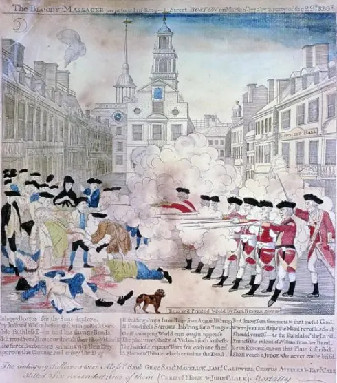
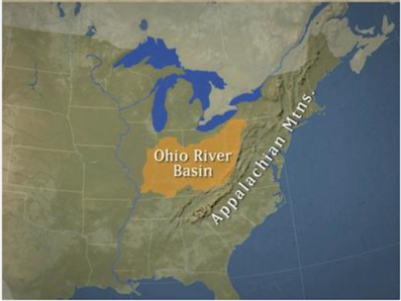
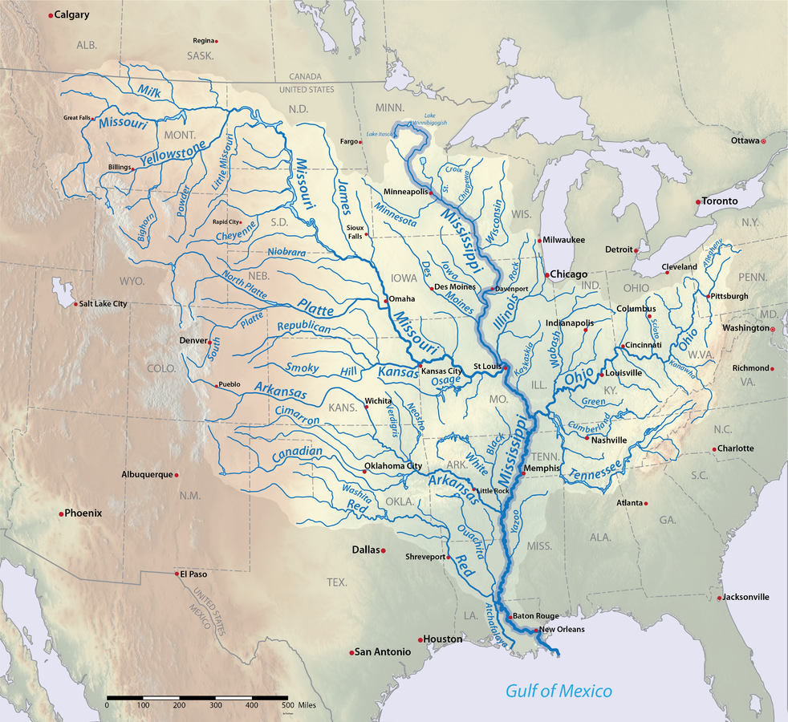
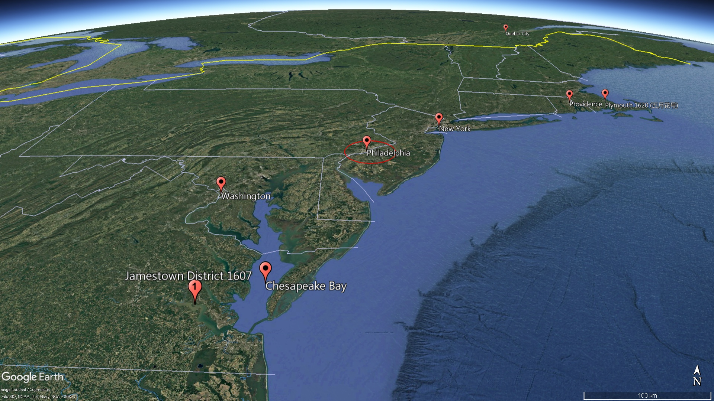

= American Pageant - 006 (1763-1775)
:toc: left
:toclevels: 3
:sectnums:
:stylesheet: ../../../myAdocCss.css

'''

== 释义

What's up 怎么了 history people? Today we're taking a look at a very important topic - the road to 通往 the American Revolution 美国革命. + 
 What really happened between 1763 and 1775 /when fighting breaks out 爆发? Now keep in mind 1763 is a huge turning point 转折点 - England gets a major expansion 扩张 of its territory by defeating France, but it comes *at a great cost* 代价巨大. +

Quick rundown (解释；描述) 快速回顾:

- Remember (v.) the end of the Seven Years' War (the French & Indian War)
- England's in debt 负债
- _Salutary neglect_ 有益的忽视 *comes to an end* (they're not going to have a hands-off (a.)不干涉的；不插手的 approach 不干涉政策 to the colonies)
- They need *to deal (v.) with* that debt
- Pontiac's Rebellion 庞蒂亚克起义 causes (v.) a lot of concern for England /because they have to use (v.) their military to crush (v.)镇压 that native resistance
- And they want to prevent (v.) colonists from moving west, so they issued (v.)  _the Proclamation Act of 1763_

Really the first of _a series of acts_ that England's going to impose 强加 on the colonies, and all sorts of things are happening /following the end of the French and Indian War. +

[.my2]
这是英国对殖民地实施的一系列行动中的第一步，随着法印战争的结束，各种各样的事情都发生了。

In fact, you get the Two Georges - King George III 乔治三世 and his prime minister 首相 George Grenville (over there on the right) 后定 *advocated (v.)拥护，支持，提倡 for*  acts /to increase (v.) revenue 税收 /and to consolidate (v.)巩固 colonial control. +
 No more _salutary neglect_. +

So what do we mean (v.) by consolidating (v.) imperial control 帝国控制? Well you get:

_The Sugar Act 糖税法 in 1764_ -- it's passed (v.) on sugar *to raise (v.) revenue*. +
 This is the first act 后定 intended *to raise (v.) revenue* (remember (v.) there were other acts previously like _the Molasses 糖蜜，糖浆 Act of 1733_  which the colonists _often times_  (ad.)时常地，经常地 ignored (v.) or evaded (v.)逃避). +

*Along with* the Sugar Act, you get the British stricter enforcement 更严格的执行 of _the Navigation Acts_ 航海条例 (which were *being completely ignored* (v.)). +

There's a crackdown 打击，镇压,严厉打击 on the colonies - you're not going to be smuggling (v.)走私 like you were. +

In fact, violators 违法者 would be tried (v.)审理，审判 in _vice-admiralty 海军部；海事法庭 courts_ 海事法庭, and these courts really *caused (v.) a lot of anger* in the colonies /because *the crown 王国政府，王国 appointed (v.)任命 the judges* /and there was no juries 陪审团. +
 So you get a lot of colonial opposition 反对 early on 在早期 -- *not only* to _the Proclamation of 1763_ /*but* to _the Sugar Act_ and to _old acts_ being more strictly enforced 以及更严格地执行旧法案. +

You also get _the Quartering （士兵、服务人员等的）营房，宿舍，住房;给…提供食宿 Act_ 驻营法案 in 1765 /which required (v.) colonists *to provide (v.) food* and *housing (v.) for British soldiers*. +
 _In the minds of_ England, this was only fair -- these soldiers are over in North America protecting (v.) these colonies, and so therefore they're going to have to pay (v.) their fair share 公平份额. +
 This also *causes (v.) anger* in the colonies. +

But the big one - the one you better know about - is _the Stamp Act 印花税法案 in 1765_. +
 This *placed* a tax (it's the first _direct tax_ 直接税, meaning (v.) the tax is collected from those who use the good) *on* a variety of legal documents 法律文件 and items - everything *from* newspapers *to* advertisements *to* pamphlets 小册子 *to* legal documents. +
 `主` Anybody 后定 using (v.) any of those items `谓` had to pay (v.) this stamp tax. +

This really angered (v.) the colonial elite 精英 (the wealthy), especially in _the middle class_ and _the commercial class_ /because they're the ones producing (v.) these items. +
 And so you get a lot of opposition （强烈的） 反对，反抗 from _the Stamp Act_. +
 One of the big arguments from the colonists was `表` this was passed (v.) without consent 同意 of the colonial legislators 立法者 (remember (v.) `主` different colonies like Virginia `谓` have the House of Burgesses 弗吉尼亚议会). +
 They say: "We didn't *vote (v.) for* these taxes, therefore we're being taxed (v.) without proper representation 代表权. +
"

And you get _a whole bunch of_ colonial responses (n.) to the Stamp Act. +
 For example:

In _the House of Burgesses_ 下议院, Patrick Henry (a very influential colonial leader) issues (v.) something called _the Virginia Resolves_ 弗吉尼亚决议, reiterating (v.)重申，反复说 "no taxation *without representation* 无代表不纳税. +
"
He talks about `主` only the colonial legislator `谓` could tax (v.) the colonies. +

He'*s heavily influenced* (v.) by _Enlightenment 启蒙运动 ideas_ coming over from Europe. +

They'*re accustomed (a.) to* a tradition of self-rule 自治传统 (the colonies have been kind of doing their own thing for a very long time). +

Now England *responds to* these charges /*with* something very important called _virtual representation_ 虚拟代表制, and they basically say: "You are British citizens, colonists, therefore you *are represented* by Parliament 议会. +
" And the colonists *don't buy it* 不接受,不买账. +

You have other responses:

The Stamp Act Congress 印花税法案大会 -- this meets (v.)开会，会晤 in New York /and `主` representatives (n.)代表 from nine colonies `谓` meet (v.) to oppose (v.)反抗，阻碍 British policies (especially the Stamp Act).  +

[.my2]
他们在纽约开会，来自九个殖民地的代表开会, 反对英国的政策（尤其是印花税法案） +

This is a move (n.) towards intercolonial unity 殖民地间团结 (the colonies are meeting (v.), they're working together). +

This is _the first organized (a.) resistance_ 有组织的抵抗 amongst the colonies to British policy. +

Now it's important *to keep in mind* /intercolonial disunity 不团结 remains (v.). +
`主`  _Organizations/secret societies_ like the Sons of Liberty 自由之子 and also the Daughters of Liberty 自由之女 `谓` formed (v.). +
 The Sons of Liberty were a more radical group /because of their attacks on royal officials 皇家官员 (_their tarring (v.)用沥青涂抹，用柏油铺盖 and feathering_  (羽毛) (v.)涂柏油粘羽毛  后定 that *was used* (v.) to harass (v.)骚扰 tax collectors), but they were very influential 有影响力的，有势力的 in organizing (v.) the boycotts 抵制活动. +

Various colonists were issuing (v.)宣布，发布;（尤指通过正式文件）将…诉诸法律 non-importation agreements (不进口协议) 各个殖民地都在签署非进口协议 (you could see a list of people who violated (v.) _those agreements 后定 against British imports_ 谁违反了那些"反对英国进口"的协议), and this was _the most effective form_ of resistance to British policies. +
 There's a huge drop in trade - in fact `主` many British merchants over in England `谓` are demanding Parliament 英国议会（包括下议院和上议院） repeal (v.)废除 the Stamp Act /because they were losing tons of money /as a result of 作为结果 these boycotts. +

This is a grassroots movement 草根运动 - you have _a variety 各式各样 of people_ in colonial society *taking part in* it (it's not just the colonial elite). +
 And *as a result of* this failure to actually  实际上，事实上 generate (v.) revenue 产生税收 for the crown 由于未能真正为王室创造收入, Parliament 英国议会（包括下议院和上议院） voted (v.) to repeal (v.) the Stamp Act (it wasn't raising the money 筹集资金, so you might as well 不妨，还是……为好 repeal (v.) the darn (a.)（非正式，加强语气）该死的 thing). +

[.my1]
.案例
====
.darn
(a.)( also darned )
( also darned ) ( informal ) used as a mild swear word, to emphasize sth （加强语气）该死的，讨厌的 +
•Why don't you *switch* the darn (a.) thing *off* /and listen to me! 把那讨厌的东西关掉，专心听我讲话好不好！
====

But you still have that dilemma 困境 - you still need *to pay off 偿还债务；清偿欠款 the debt* from the French and Indian/Seven Years' War. +
 After the Stamp Act was repealed, Parliament does pass (v.) something called _the Declaratory (a.)宣言的；公布的 Act_ 宣告法案 in 1766, and it basically is saying (v.) to the colonies: "We still have the power, we still have the authority over you, we could still tax (v.) you. +
" So don't get all giddy (a.)(头晕的；眼花的；令人眼花缭乱的；轻浮的;（高兴或激动得）发狂，举止反常)得意忘形 and happy and _things of that nature_ 类似的事物 . +

[.my1]
.案例
====
.giddy
1.[ not usually before noun]feeling that everything is moving and that you are going to fall 头晕；眩晕 +
SYN dizzy +
•When I looked down from the top floor, *I felt giddy*. 我从顶楼朝下看时感到头晕目眩。

2.[ not usually before noun]~ (with sth)so happy and excited that you cannot behave normally （高兴或激动得）发狂，举止反常 +
•*She was giddy* with happiness. 她高兴得忘乎所以。

3.[ usually before noun]making you feel as if you were about to fall 令人眩晕的；使人头昏眼花的 +
•The kids were pushing the roundabout *at a giddy speed*. 孩子们推动着旋转平台快得令人眩晕。

( figurative) +
•the giddy heights of success 令人目眩的巨大成功 +

4.( old-fashioned) ( of people人 ) not serious 轻率的；轻浮的；不稳重的 +
SYNsilly
•Isabel's giddy young sister 伊莎贝尔轻浮的小妹

-> 来自god, 神，引申义鬼神附体，眩晕，参照 enthusiasm.
====

They still need to raise (v.) revenue 税收 -- they still need to find a way to get that coin 硬币，金属货币, get that money. +
 And Charles Townshend becomes the new _Chancellor （英国）财政大臣 of the Exchequer_ (n.财源；国库；财政部) 财政大臣 (basically the money guy 有钱人), and he proposed (v.)提议；计划 his own revenue plan - this *is* of course *named after* him, the Townshend Acts 汤森法案, which puts a tax on imports such as paper, tea, glass and other items. +

[.my1]
.案例
====
.exchequer
-> 词源同cheque,支票，帐目，帐目表，因形似棋盘而得名，后用来指财政部。ex误认为是前缀ex-, 因而产生的拼写讹误。拼写演变参照chess,check.
====

This created a lot of controversy 争议 because `主` the money raised by the acts `谓` would be used to pay (v.) royal officials in the colonies (previously their salaries were paid by the colonial assemblies (立法机构；会议；议会) 殖民地议会). +
 And if you're a colonist, you *feel like* if they're getting paid by officials in England, they're going to rule (v.)统治，管辖 in favor of 支持；赞同；偏向于 the English /*versus* 与……相对，与……相比 the colonists' interests. +
 So you have _once again_ tension mounting 紧张加剧. +

Another part that really angered (v.) people/*did this* kind of like 某种程度上像是,可以说是一种 shock to a lot of colonists: the British could *search* (v.) private homes *for* goods /by getting _a writ (n.)令状；文书；法院命令 of assistance_ (帮助，援助)协助令 (rather than *having to* get a warrant 搜查令). +
 They could *search for* smuggled or illegal goods /with just a simple _writ of assistance_ 搜查令状. +
 And as you could see, shock spread (v.) amongst the colonists. +

[.my1]
.案例
====
.Another part that really angered people / *did this* kind of like shock to a lot of colonists +
"did this kind of like..."​​ ≈ ​​"某种程度上像是……"​​ 或 ​​"可以说是一种……"​​ +
用于 ​​补充说明前文​​（angered people），同时 ​​弱化语气​​，避免绝对化表述。 +
- ​did this​​：指代前文提到的 ​​“angered people”​​（激怒民众）这一行为。 +
- kind of like​​：口语中表示 ​​“有点像”“某种程度上”​​（= somewhat, in a way）。 +
- shock​​：强调殖民者的反应不仅是愤怒，更是 ​​“震惊”​​（因搜查令的侵犯性）。 +

这一政策不仅激怒了民众，某种程度上也让许多殖民者感到震惊。

"did this kind of like shock"​​ ≈ ​​“某种程度上像是一种震惊”​

====

There was resistance to the Townshend Acts tax (not to *the same* degree *as* the Stamp Act /since `主` this `系` was an indirect tax 间接税 paid by merchants), but there is still some. +
 Really important to know `系` is John Dickinson writes (v.) "Letters from a Farmer in Pennsylvania 宾夕法尼亚农民来信. +
" In his writing, he talks about that .these taxes are against English law /and that `主` colonists as British subjects 臣民 `谓` have rights as individuals. +

He uses a lot of the ideas /coming over from the Enlightenment 启蒙运动 /to once again denounce (v.)谴责 the taxes imposed by Parliament. +
 Of course England argues (v.) that /the colonists are represented with virtual representation, but this does not quiet (v.)（使）平静，安静；<美>消除，减轻（恐惧），平息（抱怨） the anger amongst many colonists. +

Colonists once again created non-importation ("we're not going to buy any British goods") and non-consumption agreements 不消费协议, and it really has a huge blow 打击 on British trade. + 
 Colonists are boycotting British goods. + 
 You have the Daughters of Liberty (a group 后定  *made up of* 由……组成，由……构成 colonial women 由殖民地妇女组成的团体) organizing (v.) spinning bees 纺织聚会 where they would *rather* 宁愿；更喜欢 make their own clothes *than* purchase (v.) those sold by British merchants. +

And you have a whole variety of groups mobilizing (v.)动员 including women, artisans 工匠, laborers 劳工 and so on. +
 Unfortunately for the British, England was losing more money *than* it was generating by these taxes /because of all the colonial resistance. +
 And as a result (rather than continue to lose (v.) money), the Townshend duties 关税 are repealed (v.) in 1770. +
 England *backs down* 退缩，让步 again 再次让步. +

Now around this same time 大约在同一时期, tensions are really high. +
 There's a lot of troops in the Boston area. + 
 An incident occurs (v.) in early 1770, and that is of course the Boston Massacre 波士顿惨案. +
 What happens is British troops *open fire* 开火 near the customs house 海关大楼 on a group of colonists (some would call it a mob 暴民), and this event *leads to* the death of five colonists. +

[.my1]
.案例
====
.the Boston Massacre

====

Paul Revere uses this engraving 雕刻,版画 (you see right there) as pro-colonial propaganda 亲殖民地宣传, kind of 在某种程度上；更或少地 showing the British soldiers gunning down 枪杀 these innocent colonists. +
 The reality was much more complicated. + 
 In fact, John Adams (one of the preeminent 杰出的 colonists at the time, second president of the United States) actually defends the British soldiers against murder charges 谋杀指控 /because he feels (v.) it's the right thing to do. +

Following this massacre, there is kind of 在某种程度上；更或少地,有点儿,有几分 a chill moment 冷静期 - no one wants people to die. +
 You know there's no calls for independence at this point (so keep that in mind). + 
 You do have the colonists once again meeting (v.) again, and this is the Committees 委员会 of Correspondence (信件，信函；通信) 通讯委员会. +
 They're led by Samuel Adams (another prominent colonist), and they're used to keep up 坚持，维持 communication and resistance amongst the colonists to British policies. +

This is another example/another movement towards intercolonial unity - they're exchanging (v.)交换；交流 letters, they're talking. +
 But once again, no independence. + 
 From around 1770 to 1773, there's no real big protest going on, but that all changed with tea time. + 

The Tea Act 茶叶法案 was passed in 1773 once again by Parliament, and it gave a monopoly 垄断 to a British company -- the British East India Company 英国东印度公司. +
 The company was near bankruptcy 破产, and Parliament kind of wanted to *bail* (v.)（从…中）往外舀水 them *out* 救助. +
 *In spite of the fact 尽管事实是 that* the British tea was still cheaper *than* smuggled tea, the colonists were still *opposed to* it /because the principle -- they *have not consented* (v.同意，答应)至今未同意 to be taxed 他们不同意被征税. +

[.my1]
.案例
====
."They have not consented to be taxed" vs. "They didn't consent to be taxed" 的区别​

[.my3]
[options="autowidth" cols="1a,1a"]
|===
|Header 1 |Header 2

|They have not consented to be taxed. （现在完成时）
|强调 ​​*“至今未同意”​​，暗示从过去到现在一直如此，且可能持续到未来。* +
隐含：殖民者 ​​从未​​ 同意被征税，且这种态度仍在持续。

|They didn't consent to be taxed.​（一般过去时）
|*仅陈述 ​​“过去未同意”​​，不涉及现在或未来的态度。* +
可能暗示：过去某个具体时间点（如通过《茶叶法案》时）未同意，但未说明后续是否改变。
|===

原文用 ​​"have not consented"​​ 更合适，因为： +
殖民者对征税的反对是 ​​长期原则​​（principle），而非一次性事件。
强调 ​​“未经同意”的持续状态​​，与“无代表不征税”（No taxation without representation）的政治主张一致。 +
若用 ​​"didn't consent"​​，可能弱化这种原则性立场，更像在描述单一历史事件（如某次抗议）。

在原文中，​​"have not consented"​​ 更准确，因其呼应殖民者 ​​长期反对征税​​ 的核心原则。若改为 ​​"didn't consent"​​，会丢失“持续反对”的隐含意义。
====

They still oppose (v.) the Tea Act, and once again `主` that idea that Parliament could tax (v.) the colonies `系` was unfathomable (a.)难以理解的；莫测高深的 for them. +
 We all know (v.) how this story ends (v.) /because in 1773 you have the event *known (v.) famously as* the Boston Tea Party 波士顿倾茶事件. +
 `主` Members of _the Sons of Liberty_ (some of them loosely 不精确地 *dressed up 装扮成 as* Native Americans 美洲原住民；美洲印第安人) `谓` board (v.) some ships /and *dumped* (v.)（尤指在不合适的地方）丢弃，扔掉，倾倒 tea *into* Boston Harbor. +

[.my1]
.案例
====
.unfathomable
( formal ) +
1.too strange or difficult to be understood 难以理解的；莫测高深的 +
•an unfathomable mystery (n.难以理解（或解释）的事物，奥秘；神秘的人（或事物）) 难以解释的奥秘 +

2.if sb has an unfathomable expression, it is impossible to know what they are thinking （表情）难以琢磨的，微妙的 +
====

This event was *not without controversy* (争议) 并非没有争议. +
 Not only *was* the British _East India Company_/Parliament in England and the crown 王国政府；王国;王位；王权 *mad* (a.)生气的，气愤的, but also some colonists resisted (v.)阻挡，抵制 the action /because this was a destruction (n.)破坏，摧毁 of private property 私有财产 ("no no no you don't do that"). +
 *That was considered (v.) too radical* 激进 by some 后定 even in the colonies. +

_As a result of_ the Boston Tea Party, England/Parliament passes (v.) _the Coercive (a.)强制的，胁迫的 Acts_ 强制法案 in 1774, and these acts `系` are really intended 为……打算（或设计）的；故意的 to be punitive 惩罚性的 - they're intended to punish (v.) the colonies ("we're going to spank (v.)（用手掌）打屁股 their butts 屁股"). +
 And they do a variety of things to accomplish (v.) this goal:

Boston Port was closed (v.) until the property 所有物，财产 *was paid for* (_in fact_ you could see by 1775 where the British troops are being sent -- a huge amount of them are in the Boston area -- that's where `主` a lot of this early protest (n.)抗议，反对 `谓` was taking place) +
It drastically (ad.)（动作或变化）猛烈地，力度大地 ；极其，非常 reduced (v.) the power of the Massachusetts legislature 立法机构 +
It banned (v.) the _town hall meetings_ 市政厅会议,市民大会 (that kind of _big democratic institution_ in the New England colonies 新英格兰殖民地的那种大型民主机构) -- they are banned. +
_The Quartering Act_ was expanded (v.) (so once again for British troops are being sent over, the colonists 殖民地居民 were expected *to provide for* 供养，赡养：为（某事物或某人）提供生活所需 them 指英军) +

Royal officials *accused 控告，指控 of* a crime would be put on trial in England *rather than* the colonies. +
And the colonists were outraged (a.)愤怒; 义愤填膺的；愤慨的，气愤的 by this /because they felt this would not ensure (v.)确保，保证 _justice would be served_ 正义必将得到伸张. +
 The colonists were outraged (a.) and called (v.) _the Coercive Acts_ `宾补` _the Intolerable Acts_ 不可容忍法案. +
 So if you see Intolerable Acts/Coercive Acts, they're the same thing. + 

The colonists *respond to* the Intolerable Acts *by a decree (n.)法令，政令；裁定，判决 known as* the Suffolk Resolves 萨福克决议. +
 This *was made* by a county（美国的）县 in Boston, and it called on 号召 the colonies to boycott (v.) British goods /until __the Intolerable Acts __were repealed 废止；撤销. +
 So tensions are mounting (v.) again /between England and the colonies. +

Now `主` something 后定 that *has nothing at all to do with* the colonies /but yet *stirs up* 搅拌、搅动;激起、引起、挑起 trouble 引发麻烦 nonetheless 然而，尽管如此 `系` is _the Quebec Act 魁北克法案 in 1774_. +

[.my2]
现在有一件事与殖民地毫无关系，但却引起了麻烦，那就是1774年的魁北克法案。

It's England trying to figure out 找到答案，解决 what to do with the Canadian lands 后定 they acquired from France as a result of the Seven Years' War. +
 There's _something like_ 接近，大约 60,000 French subjects （尤指君主制国家的）国民，臣民 in Canada, and England needs to figure out _what to do with them_ in the territory that they got. +

So here's what they do _under the Quebec Act_:

- It *extended* (v.) the boundary of Quebec *into* the Ohio Valley (so you could see the before and the after)
- Roman Catholicism 罗马天主教 was established as the official religion
- The government was allowed to operate (v.) without _representative assemblies_ 代表议会 (no _colonial legislators_ 立法者 or _trial  审判，审理 by jury_ 陪审团审判)

Now all of these things were kind of _the way France ran (v.) its colony anyhow_ (管怎样，无论如何) 这些都是法国统治殖民地的方式, and England continues to allow it to occur. +
 From the colonists' perspective, they are *pissed 撒尿 off* 愤怒,使生气；使厌烦:

[.my1]
.案例
====
.the Ohio Valley

====

The colonists claim (v.) `主` the land in the Ohio Valley `系` was for them (remember that kind of sparked (v.)引发，触发；产生火花（电火花）；点燃 the war) - "How dare they allow (v.) these French Catholic Canadians 天主教的加拿大人 to have that land?" +

Protestant colonists 新教的殖民者 are not happy about Catholicism 天主教；天主教义 *being* kind of *granted* (v.)（尤指正式地或法律上）同意，准予，允许 free reign 自由发展,自由发挥，不受约束 in this territory (remember (v.) there was a lot of anti-Catholic feelings 反天主教情绪 in the colonies) +

And they're worried that /England will try to take away 拿走,带走 representative government in the colonies (they already saw their _town hall meetings_ and their legislators *being shut down* -- is this _what's going to happen_ permanently?) +

Many colonists *view* the Quebec Act *as* a direct attack on them, and once again it's another thing /that *adds to* the pressure and the tension between the two sides. +

And as a result of all this tension (and really _as a result of_ the Intolerable Acts), you get the First Continental Congress 第一届大陆会议 meeting (n.)  in 1774. +
 `主` All colonies except Georgia (they're too far, they're not interested) `谓` *send* representatives to meet (v.) in Philadelphia in September of 1774. +

[.my1]
.案例
====
.Philadelphia

费城由英国贵格会教徒 、 宗教自由倡导者威廉·佩恩于 1682 年建立，并作为殖民时代宾夕法尼亚省的首府。 随后，**它在美国独立战争和独立战争中发挥了历史性的重要作用。它作为美国开国元勋们的中心会议场所，主办了第一届大陆会议 (1774 年) 和第二届大陆会议 ，**在会上，开国元勋们组建了大陆军 ，选举乔治·华盛顿为其指挥官，并于 1776 年 7 月 4 日通过了《 独立宣言》 。

1787 年，美国独立战争结束，**美国获得独立后，在费城召开的费城制宪会议上， 美国宪法获得批准。** +

**费城一直是美国最大的城市，直到 1790 年。**从 1775 年 5 月 10 日至 1776 年 12 月 12 日，*费城曾作为美国的第一个首都，* 此后又四次成为首都 ，直到 1800 年，新首都华盛顿特区建成。
====

You get a diverse 不同的，各式各样的 group of people coming together -- you got Patrick Henry, Sam Adams, John Adams, George Washington. +
 And this is another example of colonial unity. + 
 This is largely made up of 由……组成，由……构成 the colonial elites. +
 They disagreed about things 他们在一些事情上意见不一致, but _for the most part_ they wanted to repair their relationship with England. +

They wanted to figure out how *to respond to* their perceived 感知到的；感观的 violations 被侵犯 of their liberties, but they want *to bring* the relationship between the English and the colonies *back to* the way it was pre-1763. +
 It's important to note (v.) /they're not *calling for* independence - this was not a movement towards independence (not yet). +

They adopted (v.)采纳，接受；正式通过 _the Declaration 声明，表白 of Rights and Grievances_ (抱怨，不平) 权利与不满宣言 in which once again they talk about _taxation without representation_ 无代表则无税. +
 They said: "Parliament, you have the right to regulate (v.)（用规则条例）控制，管理 commerce 贸易, but you can't be doing these other things. 你们不应该继续这样做"  +
But King George dismisses (v.)不考虑，不理会, 驳回 these grievances. +

[.my1]
.案例
====
.taxation without representation
无代表不纳税, 无代表则无税, 无代表无税：指在没有代表参与的情况下对人民征税, 是不公正的。

."You can’t be doing these other things" vs. "You can’t do these other things" 的区别​

[.my3]
[options="autowidth" cols="1a,1a"]
|===
|Header 1 |Header 2

|You can’t be doing these other things.
|*强调 ​​“正在进行的、持续的行为”​​，带有 ​​“你们不应该继续这样做”​​ 的劝阻或批评意味。* +
​​隐含语气​​：议会 ​​已经在做这些事​​，而殖民者要求他们 ​​立即停止​​。

|You can’t do these other things.
|*单纯陈述 ​​“你们无权做这些事”​​，是一种更普遍的禁止或规则声明。* +
​​隐含语气​​：更中性，可能指 ​​未来或一般情况下的限制​​，*不强调当前正在发生的行为。*
|===

原文用 "can’t be doing" 更贴切的原因​​：
殖民者在《权利与不满宣言》中 ​​直接回应英国议会已经实施的政策​​（如征税），因此用 ​​进行时​​ 强调 ​​“你们现在正在越权”​​。
带有 ​​抗议、不满​​ 的情绪，暗示议会的行为 ​​必须立即停止​​。

若改为 "can’t do"：
更像在陈述一条 ​​抽象的法律原则​​（如“议会无权征税”），而弱化了 ​​对当前具体行为的指责​​。
语气更正式、冷静，可能缺少原文的 ​​紧迫感和对抗性​​

类似用法:

- "*You can’t be smoking* here!"​​
（“你不能在这儿抽烟！”→ *对方正在抽，要求立刻停止。*）
- "You can’t smoke here."​​
（“这儿禁止抽烟。”→ 一般性规则，未特指当下行为。）

====

They endorsed (v.)支持，赞同 the Suffolk Resolves 决定，决心. +
 They created the Association 协会，社团，联盟 (which sounds (v.) really official) to coordinate  (v.)协调，配合 an economic boycott amongst  在……当中 the colonies. +
 And they also start (v.) making military preparations 军事准备 (remember there's a lot of British soldiers especially in the Boston area), so they're getting ready to defend themselves *in case* things get even worse. +

And finally, they plan (v.) to meet again in May of 1775. +
 So what's the response of England? Well King George III dismisses (v.)不考虑，不理会；驳回 their grievances. +
 He declares (v.) Massachusetts in rebellion 叛乱, and more troops are sent to North America to try *to get* these colonists *in check* 控制,受控制的；受抑制的. +

And that *leads* (v.) us *to* the opening shots 第一枪 of the American Revolution at Lexington and Concord 列克星敦和康科德. +
 `主` The first fights of the American Revolution `谓` actually occur (v.) well over a year before independence is even declared. +
 And here's the background:

`主` British troops led (v.)领导 by General Gage 盖奇将军 `谓` leave Boston to seize (v.)夺取 colonial weapons /and to try to arrest (v.) _rebel leaders_ Sam Adams and John Hancock. +
 As they're heading out of Boston 当他们离开波士顿时, they head to 朝着某个地方前进 a place called Lexington. +
 And the Minutemen （美国革命时期的）即召民兵,一分钟人 (which is what the colonial militia 民兵 were called) they'*re warned* by two individuals 个人；个体 -- Paul Revere and William Dawes -- *that* the British are coming. +

And at Lexington, `主` the "shot 后定 *heard (v.) round the world*" (枪声响彻世界) 震惊世界的枪声 `谓` takes place /as British soldiers kill (v.)  eight colonists in April of 1775. +
 Now once again (just like the Boston Massacre), no one really knows (v.) kind of 在某种程度上；更或少地 all the details -- there's the British side, there's the colonists' side, and there's probably somewhere in the middle some truth there. +

But nonetheless, eight colonists are killed. + 
 Once again notice (v.) the date - April 1775. +
 We will not declare (v.) independence until July of 1776. +
 No one anticipated (v.)预期，预料 this fighting to occur (v.) at this moment, but it does. +

In fact, another battle *took place* at Concord /as the British troops are marching back to Boston. +
 They're attacked by colonial militia - they're shot (v.) at -- and they're shocked /because the colonial militia are fighting them and they're holding their ground 坚守阵地. +
 And we have the start of fighting of the American Revolution. + 

In our next video, we'll take a look at how we actually end up 最终成为 declaring independence. +
 But until next time, make sure if the video helped you out /you click like. +
 If you haven't already done so, subscribe. + 
 If you have any questions, post them in the comments. + 
 And have a beautiful day. + 
 Peace!

'''

== 中文翻译

历史爱好者们，大家好！今天我们要看看一个非常重要的话题——通往美国独立战争的道路。1763年到1775年之间到底发生了什么，最终导致了战争爆发？*请记住，1763年是一个巨大的转折点——英国通过打败法国大幅扩展了自己的领土，但这也付出了沉重的代价。*

快速回顾：

- *记住七年战争（即法印战争）结束.  英国债台高筑, 他们需要解决那笔债务*
- *“有益的忽视”（英国对殖民地的不干涉政策）结束了（他们不再对殖民地采取放任态度）*
- 彭提亚克的起义让英国非常担忧，因为他们必须动用军队来镇压印第安人的抵抗
- 英国想阻止殖民者向西迁移，于是发布了1763年《公告法案》.
这实际上是一系列英国即将对殖民地施加的法案中的第一个。法印战争结束后，各种事情接踵而至。事实上，你会看到**“两位乔治”——乔治三世国王, 和他的首相乔治·格伦维尔（在右边）, 支持通过法案来增加收入, 并加强对殖民地的控制。对殖民地不再有“有益的忽视”。**

那么，我们所说的"加强帝国控制", 是什么意思？你会看到：

**1764年通过了《糖税法》——对糖征税, 以增加财政收入。**这是第一个真正为了增加财政收入而设立的法案（记住，此前还有1733年的《糖蜜法案》，殖民者经常无视或逃避这个法案）。 +
*随着《糖税法》的出台，英国也开始更严格地执行《航行法案》（这些法律之前被彻底无视）。
对殖民地的打压开始了——你不能再像以前那样走私了。*
实际上，*##违法者将被送到"海事法庭"受审，##这种法院让殖民地人非常愤怒，因为##法官是由王室任命的，而且没有陪审团。##所以殖民地人早期就对很多事情表示反对——不仅反对1763年的《公告法案》，还反对《糖税法》和对以前法案的更严格执行。*

*1765年又通过了《驻军法案》，要求殖民地人, 为英国士兵提供食物和住所。英国人认为这是合理的——这些士兵在北美保护殖民地，所以殖民地就该为此承担一部分责任。这同样引起了殖民地人的愤怒。*

但最重要的一个——你一定要了解的——是1765年的**《印花税法》。这是一种税（这是第一种“直接税”，也就是说, 税是直接从"使用相关物品的人"手中征收的），适用于##各种法律文件和物品——从报纸到广告、宣传册、法律文件等等。任何使用这些物品的人, 都得缴纳"印花税"。##**

这让殖民地的精英阶层（有钱人），尤其是中产阶级和商业阶层极其愤怒，因为这些人正是这些物品的生产者。因此你会看到对《印花税法》的大量反对。*殖民者最主要的论点之一是，#这项税是在没有殖民地"议会"同意的情况下通过的#（记住，不同的殖民地，比如弗吉尼亚，有自己的议会*，如伯吉斯议会）。*他们说：“#我们没有投票决定这些税，因此我们是被无代表的情况下被征税的。#”* (*无代表, 不纳税*)

殖民地人对《印花税法》有很多回应。例如：

在伯吉斯议会，帕特里克·亨利（一位非常有影响力的殖民地领袖）发布了所谓的《弗吉尼亚决议》，*重申##“无代表，不纳税”的原则。##*
他强调，#*只有殖民地的立法机关, 才有权对殖民地征税。*#
他深受来自欧洲的启蒙思想影响。 +
*殖民地人习惯了自治的传统（殖民地长期以来基本上都是自行其是）。
##而英国对这些指控的回应, ##是一个非常重要的概念，##叫做“虚拟代表制”，##他们基本上是##说：“你们是英国公民，殖民者，因此你们在议会中是被代表的。”但殖民地人并不买账。##*

还有其他回应：

*《印花税会议》——这个会议在纽约召开，来自九个殖民地的代表聚集在一起, 反对英国政策（尤其是《印花税法》）。* 这是迈向殖民地之间团结的一步（殖民地开始聚在一起，共同合作）。*这是殖民地人第一次有组织地反对英国政策。但要记住，殖民地之间仍然存在不团结的情况。*  +
*像“自由之子”以及“自由之女”这样的组织/秘密社团相继成立。“自由之子”是一个更激进的组织，他们攻击王室官员（比如用焦油和羽毛羞辱收税员），但他们在组织抵制活动方面非常有影响力。*

*很多殖民者签署了“非进口协议”(如同美国提高对英关税, 贸易抵制, 不进口英国货)*（你可以看到违反该协议的殖民者名单，列出了那些继续进口英国商品的人），*而这正是对英国政策最有效的抵抗方式。贸易额大幅下降——实际上很多在英国本土的商人要求议会废除《印花税法》，因为这些抵制让他们损失惨重。*

这是一场“草根运动”——殖民地社会各阶层的人都参与其中（不仅仅是精英阶层）。而**由于未能为英国王室带来实际财政收入，议会最终投票废除了《印花税法》**（既然赚不到钱，还不如干脆废了这倒霉玩意儿）。

*但问题依然存在——他们仍然需要偿还法印战争/七年战争所积下的债务。《印花税法》废除后，议会于1766年通过了《声明法案》，基本上是告诉殖民地：“我们依然拥有权力，我们依然对你们拥有主权，我们依然有权对你们征税。”所以不要太得意忘形。*

他们仍然需要增加收入——他们仍然需要搞到钱。而**查尔斯·汤森成为新的财政大臣（就是管钱的人），他提出了自己的税收计划——当然，这被称为《汤森法案》，对进口商品如纸张、茶叶、玻璃等征税。**

这引起了极大争议，**因为这些税收, 将用于支付殖民地中王室官员的薪资（以前这些薪水是由殖民地议会支付的）。而##如果你是殖民者，你会觉得这些官员如果由英国付钱，那他们就会偏袒英国政府的利益, 而不是殖民者的利益。##**所以紧张局势再次升级。

**还有一件事让很多人感到愤怒/震惊：英国政府可以凭借“一纸搜查令”就搜查私人住宅（不再需要获取搜查令）。他们可以仅凭这种“搜查令”查找走私或非法商品。**可以想象，这一措施在殖民地引发了极大震惊。

**殖民者对《汤森法案》的抵抗, 并没有像对《印花税法》那样激烈（#因为这是一种间接税，由商人缴纳#），但仍然存在。**一个非常重要的事件是约翰·迪金森撰写了《宾夕法尼亚农民来信》。*他在文中指出，#这些税违反了英国法律，而殖民者作为英国臣民, 也拥有作为个人的权利。#*

*##他大量引用了来自启蒙时代的思想，再次谴责议会强加的税收。英国当然还是用“虚拟代表制”来辩解(犹如中国说, "党代表人民的利益", 哪代表了?)，说殖民地人已经被代表了，##但这并没有平息殖民者的愤怒。*

*殖民者再次发起了“不进口”和“不消费协议”（我们不会买任何英国商品），这对英国贸易造成了沉重打击。殖民地人抵制英国商品。“自由之女”们（由殖民地女性组成的团体）组织了“纺纱大赛”，她们宁愿自己纺织衣服也不愿购买英国商人销售的商品。(即购买国货, 抵制英国货)*

还有各种各样的团体动员起来，包括女性、工匠、劳工等等。不幸的是，*对于英国来说，由于殖民地的反抗，英国因这些税收失去的金钱比赚到的还多。最终（为了不再亏钱），1770年《汤森税》被废除。英国再次让步。*

**就在这段时间，局势非常紧张。波士顿地区驻扎了大量英军。**1770年初发生了一起事件，也就是著名的**“波士顿大屠杀”。**事情是这样的：*英军在海关大楼附近向一群殖民者开火（有些人称这是一群暴民），这起事件造成5位殖民者死亡。*

保罗·里维尔使用了这幅版画（你现在就能看到）作为亲殖民地的宣传工具，展示英军正在枪杀这些无辜的殖民者。*而现实情况要复杂得多。事实上，约翰·亚当斯（当时最杰出的殖民者之一，美国第二任总统）实际上为这些英国士兵辩护，反对谋杀指控，因为他认为这是正确的做法。*

*这场大屠杀之后，局势有些缓和——没人希望人们因此丧命。要知道这时还没有人呼吁独立（记住这一点）。殖民者再次开始聚会，这一次是“通讯委员会”。由塞缪尔·亚当斯（另一位杰出的殖民者）领导，这个组织的作用是: 保持殖民地之间就英国政策进行沟通和抵抗。*

这又是一个例子/又一次推动殖民地间团结的行动——他们互相写信，彼此沟通。但再次强调，没有提到独立。*从大约 1770 年到 1773 年，并没有发生太大规模的抗议活动，但这一切在“喝茶时间”发生了变化。*

*1773 年，##英国议会再次通过《茶叶法案》，赋予一家英国公司——东印度公司——茶叶贸易的垄断权。##这家公司几乎要破产了，议会想要对其进行财政救助。#尽管英国的茶比走私茶还便宜，殖民者仍然反对它，因为这关乎一个原则——他们并未同意被征税。#*

他们仍然反对《茶叶法案》，再一次因为**#他们无法接受"议会有权向殖民地征税"的观念。#**我们都知道这段历史如何发展：1773 年，发生了著名的**“波士顿倾茶事件”。“自由之子”组织的成员（其中一些人打扮成印第安人）登上几艘船，将茶叶倒入波士顿港。**

**这个事件并非毫无争议。**不只是东印度公司、英国议会和国王愤怒，还有一些殖民者也反对这种做法，*因为这属于毁坏私人财产*（“不不不，你不能这么干”）。即使在殖民地内部，也有人认为这种做法过于激进。

*作为回应，英国议会于 1774 年通过了《强制法案》，这些法案本质上是惩罚性的——目的是要惩罚殖民地（“我们要打他们屁股”）。他们采取了一系列措施来达到这个目的：*

*波士顿港被关闭，直到茶叶被赔偿*（实际上你可以看到到 1775 年，*大量英军被派往波士顿地区——那里是早期抗议的核心区域*）

- *马萨诸塞议会的权力被大幅削弱*
- *禁止召开镇议会（这是新英格兰殖民地一个重要的民主制度）——被全面取缔*
- *《驻军法》扩大适用范围（再次要求殖民者为英军提供食宿）*
- *被控犯罪的皇家官员将被送往英国受审，而不是在殖民地*

**殖民者对此极为愤怒，**因为他们认为这种方式无法确保正义的实现。*他们怒称这些《强制法案》为“不可容忍法案”。所以如果你看到“不可容忍法案/强制法案”，那是同一回事。*

**殖民者对“不可容忍法案”的回应, 是一个名为《萨福克决议》的声明。它是由波士顿附近的一个县发布的，呼吁殖民地在这些法案被废除前, 抵制英国商品。**因此，英殖之间的紧张关系再次升级。

接下来这件事虽然和殖民地本身没关系，但却仍然引发了很大风波，那就是** 1774 年的《魁北克法案》。英国需要解决从法国手中获得的加拿大领土问题——这些是七年战争的战利品。当时加拿大大约有 6 万名法国人，英国需要决定如何管理这些人和土地。**

*因此，《魁北克法案》规定：*

- 魁北克的边界, 向南延伸至俄亥俄河谷（你可以看到延伸前后的地图）
- *罗马天主教, 被定为官方宗教*
- *政府可以在没有"代议制议会"的情况下运作（没有殖民地议员或陪审团审判）*

*##这一切其实都是法国殖民时期的惯常做法，而英国允许这种方式继续实行。##从殖民者的角度来看，他们气炸了：*

- *殖民者认为俄亥俄河谷的土地本来就是他们的*（记得战争最初就是因争夺这片土地爆发的）——“他们怎么能让这些法国天主教徒拥有我们的土地？”
- *新教殖民者对"天主教在该地区获得自由活动权"十分不满（记得当时殖民地存在强烈的反天主教情绪）*
- *他们担心英国会在殖民地废除代议制度（他们已经看到镇议会和立法机构被关闭了——难道这是永久性的？）*

许多殖民者把《魁北克法案》视为对他们的直接攻击，这再次加剧了双方之间的压力与紧张。

**所有这些紧张局势（尤其是“不可容忍法案”）导致了## 1774 年“第一届大陆会议”的召开。##**除了佐治亚之外的所有殖民地都派代表于 1774 年 9 月齐聚费城。

你会看到一群多元背景的人, 汇聚在一起——帕特里克·亨利、山姆·亚当斯、约翰·亚当斯、乔治·华盛顿。他们代表殖民地的团结。*这群人大多数是殖民地精英。他们在某些方面存在分歧，#但总体来说，他们希望修复与英国的关系。#*

他们希望找出应对"自由受侵犯"的方法，但**#他们想让英殖关系回到 1763 年之前的状态。重要的是要记住：他们不是在要求独立——这还不是一场独立运动（还没到那一步）。#**

**他们通过了《权利与不满宣言》，再次提到“无代表不纳税”。**他们说：“议会有权管理贸易，但不能做这些其他事情。” 但国王乔治对这些不满置之不理。

他们支持了《萨福克决议》，成立了一个听起来很正式的组织——“协会”（The Association），用来协调殖民地之间的经济抵制。他们还开始进行军事准备（记得波士顿地区有大量英军），为可能恶化的局势做准备。

最后，*他们计划于 1775 年 5 月再次召开会议。那么英国的回应是什么？乔治三世否决了他们的诉求。他宣布马萨诸塞州处于叛乱状态，并派遣更多部队前往北美，以控制这些殖民者。*

**##这就引出了美国独立战争的第一枪——"列克星敦"与"康科德"之战。##实际上，美国独立战争的首次战斗, 比正式宣布独立早了一年多。**背景如下：

**英国军队由"盖奇将军"率领, 离开波士顿，目的是缴获殖民地的武器, 并逮捕反叛领导人**山姆·亚当斯和约翰·汉考克。他们从波士顿出发前往列克星敦。而民兵（殖民地的民兵组织被称为“分钟人”）得到了两个人的预警——保罗·里维尔和威廉·道斯告诉他们：“英国人来了”。

*在列克星敦，“震惊世界的一枪”响起，英国士兵在 1775 年 4 月打死了 8 名殖民者。再次强调（就像波士顿大屠杀一样），#没有人确切知道当时的全部细节——有英国方面的说法，也有殖民者的说法#，而事实大概介于两者之间。*

但无论如何，**8 名殖民者被杀。再次注意时间——1775 年 4 月。#而直到 1776 年 7 月，美国才宣布独立。#**没人预料到这时就会发生战斗，但它确实发生了。

事实上，**在英军返回波士顿的途中，在"康科德"又发生了战斗。**殖民民兵向他们开火，英军大吃一惊，因为这些民兵居然与他们交火，并坚守阵地。美国独立战争的战火正式点燃。

在下一个视频中，我们将看看美国是如何最终宣布独立的。但在那之前，如果这个视频对你有帮助，请点击“点赞”。如果你还没有订阅，赶快订阅吧。如果你有任何问题，请在评论区留言。祝你拥有美好的一天。再见！Peace!

'''

== pure

What's up history people? Today we're taking a look at a very important topic - the road to the American Revolution. What really happened between 1763 and 1775 when fighting breaks out? Now keep in mind 1763 is a huge turning point - England gets a major expansion of its territory by defeating France, but it comes at a great cost.

Quick rundown:

Remember the end of the Seven Years' War (the French & Indian War)
England's in debt
Salutary neglect comes to an end (they're not going to have a hands-off approach to the colonies)
They need to deal with that debt
Pontiac's Rebellion causes a lot of concern for England because they have to use their military to crush that native resistance
And they want to prevent colonists from moving west, so they issued the Proclamation Act of 1763
Really the first of a series of acts that England's going to impose on the colonies, and all sorts of things are happening following the end of the French and Indian War. In fact, you get the Two Georges - King George III and his prime minister George Grenville (over there on the right) advocated for acts to increase revenue and to consolidate colonial control. No more salutary neglect.

So what do we mean by consolidating imperial control? Well you get:

The Sugar Act in 1764 - it's passed on sugar to raise revenue. This is the first act intended to raise revenue (remember there were other acts previously like the Molasses Act of 1733 which the colonists often times ignored or evaded).
Along with the Sugar Act, you get the British stricter enforcement of the Navigation Acts (which were being completely ignored).
There's a crackdown on the colonies - you're not going to be smuggling like you were.
In fact, violators would be tried in vice-admiralty courts, and these courts really caused a lot of anger in the colonies because the crown appointed the judges and there was no juries. So you get a lot of colonial opposition early on - not only to the Proclamation of 1763 but to the Sugar Act and to old acts being more strictly enforced.

You also get the Quartering Act in 1765 which required colonists to provide food and housing for British soldiers. In the minds of England, this was only fair - these soldiers are over in North America protecting these colonies, and so therefore they're going to have to pay their fair share. This also causes anger in the colonies.

But the big one - the one you better know about - is the Stamp Act in 1765. This placed a tax (it's the first direct tax, meaning the tax is collected from those who use the good) on a variety of legal documents and items - everything from newspapers to advertisements to pamphlets to legal documents. Anybody using any of those items had to pay this stamp tax.

This really angered the colonial elite (the wealthy), especially in the middle class and the commercial class because they're the ones producing these items. And so you get a lot of opposition from the Stamp Act. One of the big arguments from the colonists was this was passed without consent of the colonial legislators (remember different colonies like Virginia have the House of Burgesses). They say: "We didn't vote for these taxes, therefore we're being taxed without proper representation."

And you get a whole bunch of colonial responses to the Stamp Act. For example:

In the House of Burgesses, Patrick Henry (a very influential colonial leader) issues something called the Virginia Resolves, reiterating "no taxation without representation."
He talks about only the colonial legislator could tax the colonies.
He's heavily influenced by Enlightenment ideas coming over from Europe.
They're accustomed to a tradition of self-rule (the colonies have been kind of doing their own thing for a very long time).
Now England responds to these charges with something very important called virtual representation, and they basically say: "You are British citizens, colonists, therefore you are represented by Parliament." And the colonists don't buy it.

You have other responses:

The Stamp Act Congress - this meets in New York and representatives from nine colonies meet to oppose British policies (especially the Stamp Act).
This is a move towards intercolonial unity (the colonies are meeting, they're working together).
This is the first organized resistance amongst the colonies to British policy.
Now it's important to keep in mind intercolonial disunity remains. Organizations/secret societies like the Sons of Liberty and also the Daughters of Liberty formed. The Sons of Liberty were a more radical group because of their attacks on royal officials (their tarring and feathering that was used to harass tax collectors), but they were very influential in organizing the boycotts.

Various colonists were issuing non-importation agreements (you could see a list of people who violated those agreements against British imports), and this was the most effective form of resistance to British policies. There's a huge drop in trade - in fact many British merchants over in England are demanding Parliament repeal the Stamp Act because they were losing tons of money as a result of these boycotts.

This is a grassroots movement - you have a variety of people in colonial society taking part in it (it's not just the colonial elite). And as a result of this failure to actually generate revenue for the crown, Parliament voted to repeal the Stamp Act (it wasn't raising the money, so you might as well repeal the darn thing).

But you still have that dilemma - you still need to pay off the debt from the French and Indian/Seven Years' War. After the Stamp Act was repealed, Parliament does pass something called the Declaratory Act in 1766, and it basically is saying to the colonies: "We still have the power, we still have the authority over you, we could still tax you." So don't get all giddy and happy and things of that nature.

They still need to raise revenue - they still need to find a way to get that coin, get that money. And Charles Townshend becomes the new Chancellor of the Exchequer (basically the money guy), and he proposed his own revenue plan - this is of course named after him, the Townshend Acts, which puts a tax on imports such as paper, tea, glass and other items.

This created a lot of controversy because the money raised by the acts would be used to pay royal officials in the colonies (previously their salaries were paid by the colonial assemblies). And if you're a colonist, you feel like if they're getting paid by officials in England, they're going to rule in favor of the English versus the colonists' interests. So you have once again tension mounting.

Another part that really angered people/did this kind of like shock to a lot of colonists: the British could search private homes for goods by getting a writ of assistance (rather than having to get a warrant). They could search for smuggled or illegal goods with just a simple writ of assistance. And as you could see, shock spread amongst the colonists.

There was resistance to the Townshend Acts tax (not to the same degree as the Stamp Act since this was an indirect tax paid by merchants), but there is still some. Really important to know is John Dickinson writes "Letters from a Farmer in Pennsylvania." In his writing, he talks about that these taxes are against English law and that colonists as British subjects have rights as individuals.

He uses a lot of the ideas coming over from the Enlightenment to once again denounce the taxes imposed by Parliament. Of course England argues that the colonists are represented with virtual representation, but this does not quiet the anger amongst many colonists.

Colonists once again created non-importation ("we're not going to buy any British goods") and non-consumption agreements, and it really has a huge blow on British trade. Colonists are boycotting British goods. You have the Daughters of Liberty (a group made up of colonial women) organizing spinning bees where they would rather make their own clothes than purchase those sold by British merchants.

And you have a whole variety of groups mobilizing including women, artisans, laborers and so on. Unfortunately for the British, England was losing more money than it was generating by these taxes because of all the colonial resistance. And as a result (rather than continue to lose money), the Townshend duties are repealed in 1770. England backs down again.

Now around this same time, tensions are really high. There's a lot of troops in the Boston area. An incident occurs in early 1770, and that is of course the Boston Massacre. What happens is British troops open fire near the customs house on a group of colonists (some would call it a mob), and this event leads to the death of five colonists.

Paul Revere uses this engraving (you see right there) as pro-colonial propaganda, kind of showing the British soldiers gunning down these innocent colonists. The reality was much more complicated. In fact, John Adams (one of the preeminent colonists at the time, second president of the United States) actually defends the British soldiers against murder charges because he feels it's the right thing to do.

Following this massacre, there is kind of a chill moment - no one wants people to die. You know there's no calls for independence at this point (so keep that in mind). You do have the colonists once again meeting again, and this is the Committees of Correspondence. They're led by Samuel Adams (another prominent colonist), and they're used to keep up communication and resistance amongst the colonists to British policies.

This is another example/another movement towards intercolonial unity - they're exchanging letters, they're talking. But once again, no independence. From around 1770 to 1773, there's no real big protest going on, but that all changed with tea time.

The Tea Act was passed in 1773 once again by Parliament, and it gave a monopoly to a British company - the British East India Company. The company was near bankruptcy, and Parliament kind of wanted to bail them out. In spite of the fact that the British tea was still cheaper than smuggled tea, the colonists were still opposed to it because the principle - they have not consented to be taxed.

They still oppose the Tea Act, and once again that idea that Parliament could tax the colonies was unfathomable for them. We all know how this story ends because in 1773 you have the event known famously as the Boston Tea Party. Members of the Sons of Liberty (some of them loosely dressed up as Native Americans) board some ships and dumped tea into Boston Harbor.

This event was not without controversy. Not only was the British East India Company/Parliament in England and the crown mad, but also some colonists resisted the action because this was a destruction of private property ("no no no you don't do that"). That was considered too radical by some even in the colonies.

As a result of the Boston Tea Party, England/Parliament passes the Coercive Acts in 1774, and these acts are really intended to be punitive - they're intended to punish the colonies ("we're going to spank their butts"). And they do a variety of things to accomplish this goal:

Boston Port was closed until the property was paid for (in fact you could see by 1775 where the British troops are being sent - a huge amount of them are in the Boston area - that's where a lot of this early protest was taking place)
It drastically reduced the power of the Massachusetts legislature
It banned the town hall meetings (that kind of big democratic institution in the New England colonies) - they are banned
The Quartering Act was expanded (so once again for British troops are being sent over, the colonists were expected to provide for them)
Royal officials accused of a crime would be put on trial in England rather than the colonies
And the colonists were outraged by this because they felt this would not ensure justice would be served. The colonists were outraged and called the Coercive Acts the Intolerable Acts. So if you see Intolerable Acts/Coercive Acts, they're the same thing.

The colonists respond to the Intolerable Acts by a decree known as the Suffolk Resolves. This was made by a county in Boston, and it called on the colonies to boycott British goods until the Intolerable Acts were repealed. So tensions are mounting again between England and the colonies.

Now something that has nothing at all to do with the colonies but yet stirs up trouble nonetheless is the Quebec Act in 1774. It's England trying to figure out what to do with the Canadian lands they acquired from France as a result of the Seven Years' War. There's something like 60,000 French subjects in Canada, and England needs to figure out what to do with them in the territory that they got.

So here's what they do under the Quebec Act:

It extended the boundary of Quebec into the Ohio Valley (so you could see the before and the after)
Roman Catholicism was established as the official religion
The government was allowed to operate without representative assemblies (no colonial legislators or trial by jury)
Now all of these things were kind of the way France ran its colony anyhow, and England continues to allow it to occur. From the colonists' perspective, they are pissed off:

The colonists claim the land in the Ohio Valley was for them (remember that kind of sparked the war) - "How dare they allow these French Catholic Canadians to have that land?"
Protestant colonists are not happy about Catholicism being kind of granted free reign in this territory (remember there was a lot of anti-Catholic feelings in the colonies)
And they're worried that England will try to take away representative government in the colonies (they already saw their town hall meetings and their legislators being shut down - is this what's going to happen permanently?)
Many colonists view the Quebec Act as a direct attack on them, and once again it's another thing that adds to the pressure and the tension between the two sides.

And as a result of all this tension (and really as a result of the Intolerable Acts), you get the First Continental Congress meeting in 1774. All colonies except Georgia (they're too far, they're not interested) send representatives to meet in Philadelphia in September of 1774.

You get a diverse group of people coming together - you got Patrick Henry, Sam Adams, John Adams, George Washington. And this is another example of colonial unity. This is largely made up of the colonial elites. They disagreed about things, but for the most part they wanted to repair their relationship with England.

They wanted to figure out how to respond to their perceived violations of their liberties, but they want to bring the relationship between the English and the colonies back to the way it was pre-1763. It's important to note they're not calling for independence - this was not a movement towards independence (not yet).

They adopted the Declaration of Rights and Grievances in which once again they talk about taxation without representation. They said: "Parliament, you have the right to regulate commerce, but you can't be doing these other things." But King George dismisses these grievances.

They endorsed the Suffolk Resolves. They created the Association (which sounds really official) to coordinate an economic boycott amongst the colonies. And they also start making military preparations (remember there's a lot of British soldiers especially in the Boston area), so they're getting ready to defend themselves in case things get even worse.

And finally, they plan to meet again in May of 1775. So what's the response of England? Well King George III dismisses their grievances. He declares Massachusetts in rebellion, and more troops are sent to North America to try to get these colonists in check.

And that leads us to the opening shots of the American Revolution at Lexington and Concord. The first fights of the American Revolution actually occur well over a year before independence is even declared. And here's the background:

British troops led by General Gage leave Boston to seize colonial weapons and to try to arrest rebel leaders Sam Adams and John Hancock. As they're heading out of Boston, they head to a place called Lexington. And the Minutemen (which is what the colonial militia were called) they're warned by two individuals - Paul Revere and William Dawes - that the British are coming.

And at Lexington, the "shot heard 'round the world" takes place as British soldiers kill eight colonists in April of 1775. Now once again (just like the Boston Massacre), no one really knows kind of all the details - there's the British side, there's the colonists' side, and there's probably somewhere in the middle some truth there.

But nonetheless, eight colonists are killed. Once again notice the date - April 1775. We will not declare independence until July of 1776. No one anticipated this fighting to occur at this moment, but it does.

In fact, another battle took place at Concord as the British troops are marching back to Boston. They're attacked by colonial militia - they're shot at - and they're shocked because the colonial militia are fighting them and they're holding their ground. And we have the start of fighting of the American Revolution.

In our next video, we'll take a look at how we actually end up declaring independence. But until next time, make sure if the video helped you out you click like. If you haven't already done so, subscribe. If you have any questions, post them in the comments. And have a beautiful day. Peace!

'''
