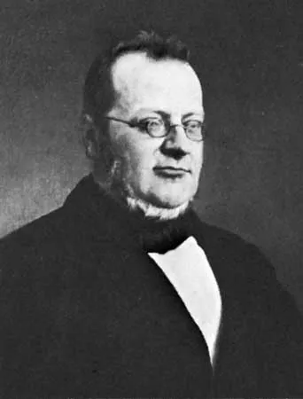

= 7.3 National UNIFICATIONS and Diplomatic Tensions
:toc: left
:toclevels: 3
:sectnums:
:stylesheet: ../../myAdocCss.css

'''

== 释义

You may have noticed that _the time period_ we're studying, namely 即；也就是 1815 to 1914, *ends* (v.) right *as* _World War One_ begins. Well sir, that assumes (v.)假设；假定 /I know (v.) _what any date means_ (v.), and that is a large assumption 假设. _Fair enough_ 有道理；说得对;行吧, but I only mentioned it /because `主` everything _we're going to talk about in this video_ `系` is really *setting the stage for* 为…做好准备 that worldwide cataclysm （突然降临的）大灾难，大灾变，大动乱. So *that means* (v.) /we need to talk about the Crimean War 克里米亚战争, German and Italian unification 统一, and the tensions 紧张局势 in the Balkans 巴尔干半岛. So if that's what you're studying, then this video is for you. Let's go get them brain cows milked. +

[.my2]
你们可能已经注意到，我们正在研究的时期，即1815年至1914年，正好在第一次世界大战开始时结束。先生，这是假设我知道任何日期的历史意义，这是一个很大的假设(这个假设可有点大胆啊)。有道理，但我提到它, 只是因为我们在这个视频中要讨论的一切. 都是在为世界范围的大灾难做准备。这意味着我们需要讨论克里米亚战争，德国和意大利的统一，以及巴尔干半岛的紧张局势。如果这就是你正在学习的，那么这个视频就是为你准备的。我们去挤牛奶吧。

[.my1]
.title
====
.cataclysm
-> #cata-, 向下。-clysm, 冲洗，流#，词源可能同flow, flood. 原指大洪水。
====

Okay, so let's begin with the Crimean War, which began in 1853. There's a lot to digest (v.)理解；领会；消化 in this video, so if you want _fill-in-the-blank 填空 note guides_ to follow along 理解，明白, check the link in the description. +

So _prior to_ 在…之前 this war, remember (v.) that /Europe enjoyed about 50 years of peace -- 插入语 *depending on* who you talk to -- during _the Concert of Europe_. But _the Crimean War_ would be a major conflict 冲突 that would *bring* that peace *to an end*. It was a war *that started (v.) over* religious tension 紧张局势 in the Ottoman Empire 奥斯曼帝国, which _by this point_ had begun to decline (v.)衰落 as a major power in Europe. +

[.my2]
在克里米亚战争爆发前，欧洲曾享有大约50年的和平时期——当然具体年份取决于你问谁——这段和平得益于"欧洲协调"机制（Concert of Europe）。但克里米亚战争将成为终结这段和平的重大冲突。这场战争的导火索是奥斯曼帝国内部的宗教紧张局势，而此时的奥斯曼帝国已开始衰落，逐渐失去其欧洲主要强国的地位。

See, the Ottoman Sultan 苏丹, under pressure from Napoleon III in France, granted (v.)授予；准予 special privileges 特权 to Roman Catholics 罗马天主教徒 living in Jerusalem. And Russia wanted those same privileges *extended to* Orthodox Christians 东正教徒, but *due to* 由于，因为 some bullying (n.)霸凌;欺凌；恃强凌弱;恃强欺弱的行为 from France, they weren't. +

[.my1]
.title
====
.bully
-> #来自 brother# 昵称。原指老大哥，起保护作用，但也可随时以大欺小。

英语单词bully最初的本意是lover（情人），来自荷兰语boel（情人，兄弟），可能是中古荷兰语broeder（兄弟）的指小形式，也就是“小情郎、情哥哥”的意思。后来词义变为“欺凌弱小者”，可能是因为bully一词在历史上常常用来表示妓女的情人及保护人、皮条客。这些男人自然不是什么好货色，往往是一些地痞流氓，喜欢欺凌弱小。因此bully一词才产生了“欺凌弱小者”的含义。 +
但它的初始含义并未完全消失，还可以用来表示“极好的”，如口语bully for you。

bully：['bʊlɪ] n.欺凌弱小者，恶霸，恶棍，拉皮条的人  +
vt.欺压，威吓. vi.横行霸道  +
adj.极好的.  +
adv.很，十分  +
bully for you：很好，我赞同你
====

Additionally 此外, there were political motives 动机 as well. Both France and Russia, though 虽然，尽管 they were combatants 参战者；战斗人员 in this war, had a similar desire -- namely 即；也就是 to weaken (v.) the Ottoman Empire, which was already growing weak 它已经变得越来越弱了 /because of various nationalist movements 民族主义运动. Additionally, Russia wanted access to 有权使用；接近 the Crimean Peninsula 克里米亚半岛, which was _a prime 主要的；首要的 warm-water port_ 暖水港 for shipping (v.) and receiving. +

So _long story short_ 长话短说, the war broke out. On one side was Russia, all by their lonesome (a.)孤独的；寂寞的;独自地. Now Russia didn't want to fight (v.) alone, so they called up 召集 their ally 盟友 Austria, who summarily 迅速地；立即地 *declared (v.) neutrality* 中立 and refused to help the Russians. +

On the other side of the war `系` were the Ottomans, supported by Britain and France. Ultimately 最终, Russia lost (v.) this war /and was humiliated (v.)羞辱；使丢脸 on the world stage 世界舞台. But *it's* the consequences 后果 of this war *that* are more important for our purpose. +

[.my2]
但对我们的目的来说, 更重要的是这场战争的结果意义。

By *breaking up* 瓦解；分裂 and *rearranging* (v.)重新安排 _the relationships of power_ 权力关系格局 among various European states, the Crimean War effectively 有效地 broke up _the Concert of Europe_, which had kept (v.) _the peace_ and _the balance of power_ 权力平衡 since its inception (n.)（机构、组织等的）开端，创始. +

[.my2]
通过打破和重新安排欧洲各国之间的权力关系，克里米亚战争有效地打破了自成立以来, 一直保持"和平"与"权力平衡"的"欧洲协调"。

Second, Britain and Russia largely *turned (v.) inward* 转向国内 and *withdrew from* 退出 continental affairs 欧洲大陆事务 after the war. And that absence 缺席；不在 created (v.) the conditions /in which `主` _leaders in Germany and Italy_ `谓` could seek (v.) the unification of their states. And well, you know, I reckon 认为；估计 we ought to talk about that now. +

Remember that /during this period, Italy was a conglomeration 混合物；聚集物 of many different states. But there had been movements  运动 for _the unification of those states_ for a long time, but none of them were successful. `主` What they really needed `系` was _a strong ruler_ from _a strong state_ *to push* (v.)  unification *through* 使通过；使得到批准. And _spoiler (n.)剧透 alert_ 剧透警告 -- they got one. +

[.my2]
记住，在这一时期，意大利是许多不同国家的集合体。但长期以来, 它们一直有"统一这些国家"的运动，但都没有成功。他们真正需要的是一个来自强大国家的强大统治者, 来推动统一进程。剧透一下，他们拥有了一个(这样的人)。 +
他们真正需要的，是一个来自强大城邦的强势统治者来​​ ​​*推动统一大业​​* ​​。剧透警告——他们确实找到了这么一个人。

[.my1]
.title
====
.conglomerate
-> #con-, 强调。-glom, 球，块，词源同global,# agglomerate.

.push sth←→ˈthrough
(v.) to get a new law or plan officially accepted 使通过；使得到批准
• The government *is pushing the changes through* before the election. 政府正努力推动，要在选举前促成这些变革。

.to push unification through
此处的 ​​"push unification through"​​ 中的 ​​through​​ 是副词，与动词 ​​push​​ 构成短语动词（phrasal verb），意思是 *​​“强力推动（某事）完成/实现”​​，强调克服阻力达成目标的过程。*

​​"push through" 的常见含义​​：
在政治/社会语境中，通常指 ​​*“排除阻力，使（法案、计划等）通过或落实”*​​。 +
例句：
The government *pushed the reforms through* despite opposition.
（政府不顾反对，强行推动了改革。）

意大利各邦长期未能统一（none of them were successful），因此需要 ​​一个强势统治者​​ 来 ​​“强力推进统一进程”​​（push unification through），即克服分裂势力、外交障碍等阻力，最终完成统一。

​​through 的核心意象​​：
原义是“穿过”，这里引申为 ​​“突破障碍，抵达终点”​​，类似中文的 ​​“贯彻到底”​​ 或 ​​“促成”​​。

====

Let me introduce you to Count Cavour 加富尔伯爵, who became _prime minister_ 首相；总理 of _the Piedmont (a.)山麓的 region_ 皮埃蒙特地区 of Italy in 1852. And 强调句 *it was* the Piedmont region *that* `主` the nationalists 民族主义者 of the Italian peninsula 意大利半岛 `谓` looked *to lead (v.) the way* 期待能领导道路 for unification of its various regions. +

[.my2]
让我向您介绍​​加富尔伯爵​​（Count Cavour）——他于1852年成为意大利皮埃蒙特地区的首相。而​​正是这个皮埃蒙特地区​​，被意大利半岛的民族主义者们视为统一各邦的引领者。

[.my1]
.title
====
.Count Cavour

加富尔 ，是意大利政治家 、 商人 、 经济学家和贵族 ，也是意大利统一运动的领军人物。他在意大利统一运动中显示出灵活熟练的外交手段。生前带领皮德蒙-萨丁尼亚王国完成了大部分的意大利统一.
====

Now Cavour was a shrewd (a.)精明的；敏锐的 politician 政治家 `主` whose _infrastructure 基础设施 programs_ in Piedmont `谓` generated (v.)产生；创造 the kind of wealth /that allowed him to assemble (v.)组建；集结 a massive 大规模的 army. And that army helped (v.) him significantly. But Cavour still *faced (v.) a couple of giant obstacles* 障碍 to the unifying (n.) of the Italian peninsula, and those obstacles were named (v.) Austria 奥地利 and France. +

You see, Austria and France controlled (v.) these regions right here. And if you've learned anything about European geopolitics 地缘政治 by now, it's this: ain't nobody 没有人 want *to give up* what they control. So `主` any plan of Italian unification `谓` would have to figure out 弄清楚；想出 how *to wrest* (v.)用力拧；夺取；抢夺 those regions *from* French and Austrian influence. +

So Cavour *promised* (v.) Napoleon III *that* /if he helped him *drive* (v.) the Austrians *out of* northern Italy, then France could keep _what they held on the Italian peninsula_, *along with* a couple other territories 领土. Needless to say 不用说, it didn't really *work out* 成功，顺利进行. You don't really need to know all the details, but you should know that /Napoleon didn't do _all that he said he would_ 拿破仑并没有做到他所说的一切, and that enraged (v.)激怒；使大怒 Cavour. +

But in the middle of his rage, something providential (a.)天缘巧合的；及时的；适时的;幸运的；天佑的 happened (v.). The northern Italian regions had been taken over 接管 by nationalists, and they agreed to join (v.) Piedmont. So northern Italy is unified. +

[.my1]
.title
====
.providential
-> 词根词缀： #pro-前 + -vid-看见# + -ent形容词词尾 + -ial形容词词尾 +
来自providence,##上帝，神，苍天。##引申词义天赐的，及时的等。
====

Now what about southern Italy? And for that, let me introduce you to Giuseppe Garibaldi 朱塞佩·加里波第. While all this was going on in the north, similar events were occurring (v.) in southern Italy /under the military leadership of Garibaldi. He was a masterful 技艺高超的；熟练的 military leader /and led (v.) his men -- called the Red Shirts 红衫军 -- to unify (v.) the southern region. +

[.my1]
.title
====
.Giuseppe Garibaldi
image:/img/Giuseppe Garibaldi.webp[,20%]

He is considered to be one of Italy's "fathers of the fatherland", along with _Camillo Benso di Cavour_, King _Victor Emmanuel II_ and _Giuseppe Mazzini_. +
他与卡米洛·奔索·德·加富尔 、 维克托·伊曼纽尔二世国王,  和朱塞佩·马志尼并称为意大利的“ 国父 ”。

加里波第也因其在南美和欧洲的军事行动, 而被称为“两个世界的英雄”。
====

After uniting the regions of southern Italy, he gave over sovereignty 主权 to the ruler of northern Italy, Victor Emmanuel II. And at this point, almost the entire Italian peninsula was unified, with the exception of 除…之外 Rome, which was still occupied by France. +

Okay, now let's turn the corner and look at the movement for German unification. Remember that during the revolution of 1848, one of the desires of the revolutionaries 革命者 was a unified Germany. But their revolution got stamped out 扑灭；镇压, and that dream would have to wait. +

What they needed was a strong ruler from a strong state to lead the unification. And spoiler alert -- they got it with the rise of Otto von Bismarck 奥托·冯·俾斯麦. Now Bismarck was a master of what's known as realpolitik 现实政治. This is a way of political maneuvering 政治操纵 that saw practical results. +

In other words, instead of asking what is the right or moral thing to do in this situation, the practitioner 从业者；实践者 of realpolitik asks what is the best action for me to take in order to get what I want. It's a very Machiavellian 马基雅维利式的；不择手段的 way of looking at things. +

Now Bismarck was the chancellor 首相；总理 of Prussia 普鲁士, and Prussia was the most powerful German state at that time. And so Bismarck, like Cavour in Italy, introduced reforms aimed at increasing Prussia's wealth -- most notably 尤其；特别 bulking up 增强；扩大 the Prussian army. +

And hey, if you got an army, you're gonna need some wars. And so there were three key wars that Bismarck used to unify Germany. +

First was the Prussian-Danish War of 1864. In the north, there were two German provinces 省份 controlled by Denmark. The people in these provinces were German and spoke German, and so Bismarck aimed to take back those territories 领土 and make them properly German. +

In order to do this, he got Austria to agree to help in the cause, and they were almost immediately successful. As a result, one province went to Prussia, and the other went to Austria. But Bismarck had no interest in Austrian rule over German provinces. This was just a practical measure 实际措施 that led him to the next stage. Remember realpolitik. +

The second war was the Austro-Prussian War 普奥战争, which began in 1866. Before this war broke out, Bismarck skillfully 熟练地 negotiated non-interference treaties 互不干涉条约 with major European powers like Russia and Britain, because he didn't want them joining the cause and messing with 干扰；弄乱 his plan. +

And so once that was settled, Bismarck provoked 激起；引发 a little fighting between the two provinces that brought Prussia and Austria into the war. And what Bismarck thought is that if a regional struggle 地区性冲突 broke out, then the German states would be forced to choose sides between Prussia and Austria. +

And that is exactly what happened. Most of the northern German states supported Prussia and not Austria. But those German states started to line up behind 支持；站在…一边 Prussia. Well baby, that's starting to smell like unification stew 统一的局面. +

But that stew isn't ready yet, because the southern German provinces were still outside the fray 冲突；争斗. But Bismarck engineered 策划；密谋 a third war called the Franco-Prussian War 普法战争 in 1870. And here, behold 看；瞧 the realpolitik master at work. +

Bismarck thought that the best way to unify the southern German states to the north was to fight a common enemy, and that would be France. But at that point, there was no reason to go to war. So if there's no reason to go to war, well, maybe don't go to war. +

Nah man, this is Otto von Bismarck we're talking about. If there aren't legitimate 合法的；合理的 reasons to go to war, so what? So what Bismarck did is falsify 伪造 a document in which a Prussian diplomat 外交官 insulted Napoleon III, and then accidentally leaked 泄露 it to France. +

And apparently 显然；似乎 Napoleon had an ego 自尊心；自负 about as fragile 脆弱的；易碎的 as a fart in the wind, and so for that slight 轻蔑；侮辱, he went ahead and declared war on Prussia. And it worked exactly how Bismarck had planned. All the German provinces rallied to 团结；集合 Prussia's defense and defeated France. +

As a result, Kaiser Wilhelm I was crowned king of Germany, and the unification was complete. Now in 1871, Bismarck was appointed as the chancellor of the united German state, and his main goal during that time was to strengthen Germany. +

For our purposes in this video, one of the most significant things he did was to create alliances 联盟 with other states. He did this because he knew France was still saucy 愤愤不平的；生气的 about their loss in the Franco-Prussian War, and Bismarck wanted to be sure that Germany stood strong against France should they seek to retaliate 报复. +

The first alliance you should know about is the Three Emperors' League 三皇同盟, which included Germany, Austria-Hungary, and Russia. The idea behind this partnership 合作；伙伴关系 is that the three states would control Eastern Europe, especially the Balkans, which were becoming increasingly unstable 不稳定的 -- on which more in a moment. +

Once the Three Emperors' League collapsed in 1887, a new alliance was formed between Russia and Germany called the Reinsurance Treaty 再保险条约. They promised each other they would remain neutral 中立的 if either got involved in a war, unless that war was Germany versus France or Russia versus Austria. +

And then after relations deteriorated 恶化 with Russia, Bismarck established the Triple Alliance 三国同盟, which included Germany, Austria-Hungary, and Italy. I hope that sounds at least a little familiar, because that's the alliance that will go to World War One. +

Anyway, the point of these alliances, from Bismarck's point of view, is to increasingly isolate 孤立 France, who was Germany's chief rival 主要对手. And it worked. +

And what you really need to remember by the time Bismarck was dismissed as chancellor in 1890 is that Europe was a collection of mutually antagonistic 相互对立的；相互敌对的 alliances, which is going to make negotiation 谈判；协商 and flexibility 灵活性 between these two sides almost impossible. +

Now as I mentioned before, while all this is going on, there is growing unrest 动荡；不安 in the Balkans, which was largely driven by a growing nationalist sentiment 民族主义情绪. Bismarck saw this and organized the Congress of Berlin 柏林会议 in 1878 in order to solve this problem. +

At the Congress were the major powers of Europe, and really their decisions didn't consider the nationalist desires for self-rule 自治 in the Balkans -- only considered the balance of power between the great powers. And in doing so, the Congress only increased the tension in the Balkans. +

To understand this, you really need to understand that this region was multi-ethnic 多民族的, and as nationalist movements spread across Europe, these folks too wanted to unite under their own states and be free of Austrian or Russian or Ottoman rule. +

Needless to say 不用说, in two wars known as the First and Second Balkan Wars 第一次和第二次巴尔干战争, the alliances that I mentioned in the last point lit up 活跃起来 and had the great powers of Europe fighting on different sides of the Balkan wars. And those battles cemented 巩固；加强 the divisions which would eventually lead to World War One. +

All right, that's a lot, but you can click here to keep reviewing for unit 7 of AP Euro. If you want help getting an A in your class and a five on your exam in May, then click right here and grab my AP Euro review pack, which will make all your dreams come true. I'll catch you on the flip-flop. I'm Heimler. +

'''

== 中文释义

你可能已经注意到，**我们正在研究的时间段，也就是1815年至1914年，正好在"第一次世界大战开始"时结束。**嗯，先生，这是假设我知道任何日期的意义，这是一个很大的假设。说得有道理，但我提到这一点, **是因为我们在这个视频中要谈论的一切, 实际上都为那场全球性的大灾难奠定了基础。**所以这意味着我们需要谈"论克里米亚战争"（Crimean War）、德国和意大利的统一，以及巴尔干半岛（Balkans）的紧张局势。所以如果你正在学习这些内容，那么这个视频就是为你准备的。让我们开始充实知识吧。  +

好的，那么让我们从1853年开始的"克里米亚战争"说起。这个视频中有很多内容需要消化，所以如果你想要填空式的笔记来跟进，查看描述中的链接。  +

所以在这场战争之前，请记住，*#在"欧洲协调"（Concert of Europe）期间，欧洲享受了大约50年的和平#*——这取决于你和谁交谈。**#但克里米亚战争将是一场重大冲突，它将结束那种和平。#**这是一场因奥斯曼帝国（Ottoman Empire）的宗教紧张局势而引发的战争，而此时奥斯曼帝国作为欧洲的一个主要大国已经开始衰落。  +

看，奥斯曼苏丹（Ottoman Sultan）在法国拿破仑三世（Napoleon III）的压力下，给予居住在耶路撒冷（Jerusalem）的罗马天主教徒特殊特权。而俄罗斯希望"东正教"基督徒也能享有同样的特权，但由于法国的一些施压，他们没有得到这些特权。  +

此外，还有政治动机。**法国和俄罗斯虽然是这场战争中的交战国，但他们有一个相似的愿望——即削弱奥斯曼帝国，**而奥斯曼帝国由于各种民族主义运动已经日益衰弱。此外，**俄罗斯想要获得克里米亚半岛（Crimean Peninsula），那是一个重要的暖水港，**有利于航运和物资接收。  +

长话短说，**战争爆发了。一方是俄罗斯，**他们孤立无援。俄罗斯不想独自作战，所以**他们召唤了盟友奥地利，但奥地利立即宣布中立，**拒绝帮助俄罗斯。  +

**战争的另一方是奥斯曼帝国，得到了英国和法国的支持。最终，俄罗斯输掉了这场战争，**并在世界舞台上蒙羞。但对我们来说，*这场战争的后果更为重要。*  +

通过打破和重新安排欧洲各国之间的权力关系，*#克里米亚战争有效地瓦解了"欧洲协调"，而欧洲协调自成立以来一直维持着和平与"权力平衡"。#*  +

其次，**#英国和俄罗斯在战后基本上转向国内，退出了欧洲大陆的事务。而这种缺席, 为德国和意大利的领导人寻求"国家统"一创造了条件。#**嗯，你知道，我想我们现在应该谈谈这个问题。  +

记住，在这个时期，意大利是由许多不同的邦国组成的联合体。但长期以来一直有统一这些邦国的运动，只是都没有成功。他们真正需要的, 是一个来自强大邦国的强大统治者, 来推动统一。剧透一下——他们找到了这样一个人。  +

让我给你介绍加富尔伯爵（Count Cavour），他在1852年成为意大利皮埃蒙特地区（Piedmont）的首相。意大利半岛（Italian peninsula）的民族主义者, 指望皮埃蒙特地区来引领各个地区的统一。  +

加富尔是一位精明的政治家，他在皮埃蒙特的基础设施建设项目, 创造了财富，使他能够组建一支庞大的军队。这支军队对他帮助很大。但**加富尔在统一意大利半岛的过程中, 仍然面临着两个巨大的障碍，那就是奥地利和法国。**  +

你看，**奥地利和法国控制着这些地区。**如果你对欧洲地缘政治有所了解，就会知道：没有人愿意放弃他们所控制的东西。所以**任何意大利统一的计划, 都必须想办法从法国和奥地利的影响下夺回这些地区。**  +

**#所以加富尔向拿破仑三世承诺，如果他(拿破仑)帮助(意大利)将奥地利人赶出意大利北部，那么法国可以保留他们在意大利半岛上的领地, 以及其他几个地区。#**不用说，事情并没有真正按照计划进行。你不需要了解所有细节，但你应该知**道拿破仑没有兑现他的承诺，**这激怒了加富尔。  +

但在他愤怒的时候，一些幸运的事情发生了。*意大利北部地区被"民族主义者"接管，他们同意加入皮埃蒙特。所以意大利北部实现了统一。*  +

那么意大利南部呢？为此，让我给你介绍朱塞佩·加里波第（Giuseppe Garibaldi）。当北部发生这些事情的时候，在加里波第的军事领导下，*意大利南部也发生了类似的事件。他是一位出色的军事领袖，他带领他的“红衫军”（Red Shirts）统一了南部地区。*  +

在统一了意大利南部地区后，他将主权交给了意大利北部的统治者维克托·伊曼纽尔二世（Victor Emmanuel II）。**在这个时候，除了罗马（Rome），几乎整个意大利半岛都实现了统一，而罗马当时仍被法国占领。**  +

*但##多亏了1870年讨厌的"普法战争"（Franco-Prussian War），拿破仑三世从意大利中部撤军去其他地方作战。就在那时，维克托·伊曼纽尔占领了中部地区，意大利统一完成。##*  +

好的，现在让我们转向德国统一运动。记住，在1848年的革命中，革命者的愿望之一, 是实现德国的统一。但他们的革命被镇压了，这个梦想不得不等待。  +

他们需要的是一个来自强大邦国的强大统治者, 来领导统一。剧透一下——随着奥托·冯·俾斯麦（Otto von Bismarck）的崛起，他们找到了这样的人。**俾斯麦是“现实政治”（realpolitik）的大师。**这是一种追求实际结果的政治策略。  +

换句话说，*#"现实政治"的践行者, 不会问"在这种情况下什么是正确或符合道德的事情"，而是会问"为了得到自己想要的东西，采取什么行动是最好的"。这是一种非常"马基雅维利式"的看待事物的方式。#*  +

俾斯麦是普鲁士（Prussia）的首相，而普鲁士是当时德国最强大的邦国。所以俾斯麦就像意大利的加富尔一样，推行了旨在增加普鲁士财富的改革——最显著的是扩充普鲁士军队。  +

嘿，如果你有一支军队，就需要打一些战争。所以**俾斯麦通过三场关键战争, 来实现德国的统一。**  +

**第一场是1864年的"普丹战争"（Prussian-Danish War）。在北部，有两个由丹麦控制的德国省份。**这些省份的人民是德国人，说德语，**所以俾斯麦旨在夺回这些领土，**使其真正成为德国的一部分。  +

*为了做到这一点，##他让奥地利同意帮忙，##而且他们几乎立刻就成功了。结果，##一个省份归普鲁士，另一个归奥地利。但俾斯麦对奥地利统治德国省份不感兴趣。这只是##一个实际的措施，#引领他进入下一个阶段。记住"现实政治"#*。  +

第二场战争, *是1866年开始的##"普奥(普鲁士 vs 奥地利)战争"（Austro-Prussian War）。在这场战争爆发之前，俾斯麦巧妙地与俄罗斯和英国等欧洲主要大国谈判, 达成"互不干涉条约"，因为他不想让他们加入并打乱他的计划。##*  +

所以**一旦这些条约确定下来，俾斯麦挑起了两个省份之间的一点冲突，从而使普鲁士和奥地利卷入战争。俾斯麦认为，如果地区冲突爆发，那么德国各邦将被迫在普鲁士和奥地利之间选择立场(选择到底帮谁, 帮哪一边)。**  +

**事情确实如此。大多数德国北部的邦国, 支持普鲁士而不是奥地利。这些德国邦国开始支持普鲁士。**嗯，宝贝，这开始有点统一的味道了。  +

*但这场“炖菜”还没有准备好，因为德国南部的省份仍然置身于冲突之外。但俾斯麦策划了第三场战争，即1870年的"普法战争"*（Franco-Prussian War）。在这里，看看现实政治大师的杰作。  +

**#俾斯麦认为，将德国南部各邦, 与北部统一的最佳方式, 是与一个共同的敌人作战，而这个敌人就是法国 (用外地, 来团结内部矛盾)。#**但在那时，没有理由开战。所以如果没有理由开战，嗯，也许就不应该开战。  +

不，伙计，我们说的是奥托·冯·俾斯麦。如果没有正当理由开战，那又怎样呢？所以**俾斯麦伪造了一份文件，在这份文件中，一位普鲁士外交官侮辱了拿破仑三世(激将法. 没有条件, 就创造条件, 也要开战)，然后不小心将其泄露给了法国。**  +

*显然，拿破仑的自尊心像"风中的屁"一样脆弱，所以因为这个小小的侮辱，他向普鲁士宣战。事情完全按照俾斯麦的计划进行。所有德国省份都团结起来保卫普鲁士，并打败了法国。*  +

结果，威廉一世（Kaiser Wilhelm I）加冕为德国皇帝，**德国统一完成。**1871年，俾斯麦被任命为统一后的德国的首相，他当时的主要目标是加强德国。  +

就我们这个视频的内容而言，**他做的最重要的事情之一, 是与其他国家结盟。**他这样做, 是**因为他知道法国仍然对在"普法战争"中的失败耿耿于怀，俾斯麦希望确保德国在法国寻求报复时, 能够强大地应对。**  +

你应该知道的**第一个联盟, 是"三皇同盟"（Three Emperors' League），成员包括德国、奥匈帝国（Austria-Hungary）和俄罗斯。**这个联盟**背后的想法是，这三个国家将控制东欧，尤其是巴尔干半岛，**而巴尔干半岛正变得越来越不稳定——我们马上会谈到这一点。  +

*1887年"三皇同盟"解体后，俄罗斯和德国之间形成了新的联盟，即《再保险条约》（Reinsurance Treaty）。他们相互承诺，如果任何一方卷入战争，除非是德国与法国,  或俄罗斯与奥地利之间的战争，否则双方将保持中立。*  +

然后在与俄罗斯的关系恶化后，俾斯麦建立了三国同盟（Triple Alliance），成员包括德国、奥匈帝国和意大利。我希望这听起来至少有点熟悉，因为就是这个联盟参与了第一次世界大战。  +

不管怎样，**从俾斯麦的角度来看，这些联盟的目的, 是越来越孤立法国，**法国是德国的主要竞争对手。而且这确实起作用了。  +

*当俾斯麦在1890年被解除首相职务时，你真正需要记住的是，#欧洲是由"相互对抗的联盟"组成的，这使得双方之间的谈判和灵活性, 几乎不可能实现 (为第一次世界大战, 埋下了伏笔)。#*  +

正如我之前提到的，在这一切发生的同时，**巴尔干半岛的动荡日益加剧，这在很大程度上是由不断增长的"民族主义情绪"推动的。**俾斯麦看到了这一点，并在1878年组织了柏林会议（Congress of Berlin）来解决这个问题。  +

**欧洲的主要大国都参加了这次会议，#实际上他们的决定没有考虑巴尔干半岛上"民族主义者"对"自治"的渴望——只考虑了大国之间的权力平衡。#**这样做只会加剧巴尔干半岛的紧张局势。  +

要理解这一点，你真的需要明白, *#这个地区(巴尔干半鸟)是"多民族"的，随着"民族主义"运动在欧洲蔓延，这些人也希望在自己的国家下实现统一，摆脱奥地利、俄罗斯或奥斯曼帝国的统治。#*  +

不用说，*在被称为"第一次和第二次巴尔干战争"的两场战争中，我刚才提到的那些联盟活跃起来，欧洲的大国在巴尔干战争中, 站在不同的立场上作战。这些战斗巩固了那些分歧，最终导致了第一次世界大战的爆发。*  +

好的，内容很多，但你可以点击这里继续复习美国大学预修课程欧洲历史第七单元。如果你想在课堂上得A，并在五月份的考试中得5分，点击这里获取我的美国大学预修课程欧洲历史复习资料包，它会让你所有的梦想成真。我们下次再见。我是海姆勒。  +

'''

== pure

You may have noticed that the time period we're studying, namely 1815 to 1914, ends right as World War One begins. Well sir, that assumes I know what any date means, and that is a large assumption. Fair enough, but I only mentioned it because everything we're going to talk about in this video is really setting the stage for that worldwide cataclysm. So that means we need to talk about the Crimean War, German and Italian unification, and the tensions in the Balkans. So if that's what you're studying, then this video is for you. Let's go get them brain cows milked.

Okay, so let's begin with the Crimean War, which began in 1853. There's a lot to digest in this video, so if you want fill-in-the-blank note guides to follow along, check the link in the description.

So prior to this war, remember that Europe enjoyed about 50 years of peace -- depending on who you talk to -- during the Concert of Europe. But the Crimean War would be a major conflict that would bring that peace to an end. It was a war that started over religious tension in the Ottoman Empire, which by this point had begun to decline as a major power in Europe.

See, the Ottoman Sultan, under pressure from Napoleon III in France, granted special privileges to Roman Catholics living in Jerusalem. And Russia wanted those same privileges extended to Orthodox Christians, but due to some bullying from France, they weren't.

Additionally, there were political motives as well. Both France and Russia, though they were combatants in this war, had a similar desire -- namely to weaken the Ottoman Empire, which was already growing weak because of various nationalist movements. Additionally, Russia wanted access to the Crimean Peninsula, which was a prime warm-water port for shipping and receiving.

So long story short, the war broke out. On one side was Russia, all by their lonesome. Now Russia didn't want to fight alone, so they called up their ally Austria, who summarily declared neutrality and refused to help the Russians.

On the other side of the war were the Ottomans, supported by Britain and France. Ultimately, Russia lost this war and was humiliated on the world stage. But it's the consequences of this war that are more important for our purpose.

By breaking up and rearranging the relationships of power among various European states, the Crimean War effectively broke up the Concert of Europe, which had kept the peace and the balance of power since its inception.

Second, Britain and Russia largely turned inward and withdrew from continental affairs after the war. And that absence created the conditions in which leaders in Germany and Italy could seek the unification of their states. And well, you know, I reckon we ought to talk about that now.

Remember that during this period, Italy was a conglomeration of many different states. But there had been movements for the unification of those states for a long time, but none of them were successful. What they really needed was a strong ruler from a strong state to push unification through. And spoiler alert -- they got one.

Let me introduce you to Count Cavour, who became prime minister of the Piedmont region of Italy in 1852. And it was the Piedmont region that the nationalists of the Italian peninsula looked to lead the way for unification of its various regions.

Now Cavour was a shrewd politician whose infrastructure programs in Piedmont generated the kind of wealth that allowed him to assemble a massive army. And that army helped him significantly. But Cavour still faced a couple of giant obstacles to the unifying of the Italian peninsula, and those obstacles were named Austria and France.

You see, Austria and France controlled these regions right here. And if you've learned anything about European geopolitics by now, it's this: ain't nobody want to give up what they control. So any plan of Italian unification would have to figure out how to wrest those regions from French and Austrian influence.

So Cavour promised Napoleon III that if he helped him drive the Austrians out of northern Italy, then France could keep what they held on the Italian peninsula, along with a couple other territories. Needless to say, it didn't really work out. You don't really need to know all the details, but you should know that Napoleon didn't do all that he said he would, and that enraged Cavour.

But in the middle of his rage, something providential happened. The northern Italian regions had been taken over by nationalists, and they agreed to join Piedmont. So northern Italy is unified.

Now what about southern Italy? And for that, let me introduce you to Giuseppe Garibaldi. While all this was going on in the north, similar events were occurring in southern Italy under the military leadership of Garibaldi. He was a masterful military leader and led his men -- called the Red Shirts -- to unify the southern region.

After uniting the regions of southern Italy, he gave over sovereignty to the ruler of northern Italy, Victor Emmanuel II. And at this point, almost the entire Italian peninsula was unified, with the exception of Rome, which was still occupied by France.

But thanks to that pesky Franco-Prussian War in 1870, Napoleon III withdrew his troops from central Italy to go fight elsewhere. And that's when Victor Emmanuel claimed the central region, and Italian unification was complete.

Okay, now let's turn the corner and look at the movement for German unification. Remember that during the revolution of 1848, one of the desires of the revolutionaries was a unified Germany. But their revolution got stamped out, and that dream would have to wait.

What they needed was a strong ruler from a strong state to lead the unification. And spoiler alert -- they got it with the rise of Otto von Bismarck. Now Bismarck was a master of what's known as realpolitik. This is a way of political maneuvering that saw practical results.

In other words, instead of asking what is the right or moral thing to do in this situation, the practitioner of realpolitik asks what is the best action for me to take in order to get what I want. It's a very Machiavellian way of looking at things.

Now Bismarck was the chancellor of Prussia, and Prussia was the most powerful German state at that time. And so Bismarck, like Cavour in Italy, introduced reforms aimed at increasing Prussia's wealth -- most notably bulking up the Prussian army.

And hey, if you got an army, you're gonna need some wars. And so there were three key wars that Bismarck used to unify Germany.

First was the Prussian-Danish War of 1864. In the north, there were two German provinces controlled by Denmark. The people in these provinces were German and spoke German, and so Bismarck aimed to take back those territories and make them properly German.

In order to do this, he got Austria to agree to help in the cause, and they were almost immediately successful. As a result, one province went to Prussia, and the other went to Austria. But Bismarck had no interest in Austrian rule over German provinces. This was just a practical measure that led him to the next stage. Remember realpolitik.

The second war was the Austro-Prussian War, which began in 1866. Before this war broke out, Bismarck skillfully negotiated non-interference treaties with major European powers like Russia and Britain, because he didn't want them joining the cause and messing with his plan.

And so once that was settled, Bismarck provoked a little fighting between the two provinces that brought Prussia and Austria into the war. And what Bismarck thought is that if a regional struggle broke out, then the German states would be forced to choose sides between Prussia and Austria.

And that is exactly what happened. Most of the northern German states supported Prussia and not Austria. But those German states started to line up behind Prussia. Well baby, that's starting to smell like unification stew.

But that stew isn't ready yet, because the southern German provinces were still outside the fray. But Bismarck engineered a third war called the Franco-Prussian War in 1870. And here, behold the realpolitik master at work.

Bismarck thought that the best way to unify the southern German states to the north was to fight a common enemy, and that would be France. But at that point, there was no reason to go to war. So if there's no reason to go to war, well, maybe don't go to war.

Nah man, this is Otto von Bismarck we're talking about. If there aren't legitimate reasons to go to war, so what? So what Bismarck did is falsify a document in which a Prussian diplomat insulted Napoleon III, and then accidentally leaked it to France.

And apparently Napoleon had an ego about as fragile as a fart in the wind, and so for that slight, he went ahead and declared war on Prussia. And it worked exactly how Bismarck had planned. All the German provinces rallied to Prussia's defense and defeated France.

As a result, Kaiser Wilhelm I was crowned king of Germany, and the unification was complete. Now in 1871, Bismarck was appointed as the chancellor of the united German state, and his main goal during that time was to strengthen Germany.

For our purposes in this video, one of the most significant things he did was to create alliances with other states. He did this because he knew France was still saucy about their loss in the Franco-Prussian War, and Bismarck wanted to be sure that Germany stood strong against France should they seek to retaliate.

The first alliance you should know about is the Three Emperors' League, which included Germany, Austria-Hungary, and Russia. The idea behind this partnership is that the three states would control Eastern Europe, especially the Balkans, which were becoming increasingly unstable -- on which more in a moment.

Once the Three Emperors' League collapsed in 1887, a new alliance was formed between Russia and Germany called the Reinsurance Treaty. They promised each other they would remain neutral if either got involved in a war, unless that war was Germany versus France or Russia versus Austria.

And then after relations deteriorated with Russia, Bismarck established the Triple Alliance, which included Germany, Austria-Hungary, and Italy. I hope that sounds at least a little familiar, because that's the alliance that will go to World War One.

Anyway, the point of these alliances, from Bismarck's point of view, is to increasingly isolate France, who was Germany's chief rival. And it worked.

And what you really need to remember by the time Bismarck was dismissed as chancellor in 1890 is that Europe was a collection of mutually antagonistic alliances, which is going to make negotiation and flexibility between these two sides almost impossible.

Now as I mentioned before, while all this is going on, there is growing unrest in the Balkans, which was largely driven by a growing nationalist sentiment. Bismarck saw this and organized the Congress of Berlin in 1878 in order to solve this problem.

At the Congress were the major powers of Europe, and really their decisions didn't consider the nationalist desires for self-rule in the Balkans -- only considered the balance of power between the great powers. And in doing so, the Congress only increased the tension in the Balkans.

To understand this, you really need to understand that this region was multi-ethnic, and as nationalist movements spread across Europe, these folks too wanted to unite under their own states and be free of Austrian or Russian or Ottoman rule.

Needless to say, in two wars known as the First and Second Balkan Wars, the alliances that I mentioned in the last point lit up and had the great powers of Europe fighting on different sides of the Balkan wars. And those battles cemented the divisions which would eventually lead to World War One.

All right, that's a lot, but you can click here to keep reviewing for unit 7 of AP Euro. If you want help getting an A in your class and a five on your exam in May, then click right here and grab my AP Euro review pack, which will make all your dreams come true. I'll catch you on the flip-flop. I'm Heimler.

'''