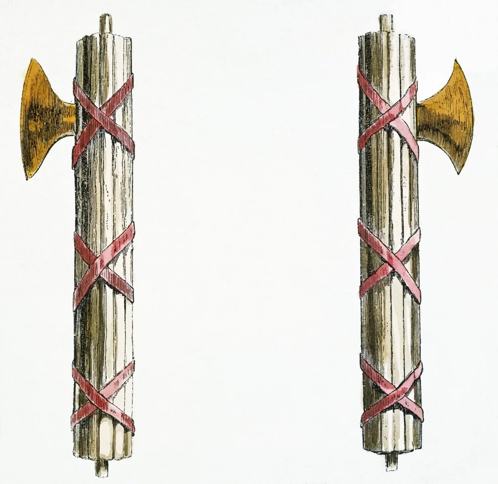

= 8.6 Fascism and Totalitarianism in EUROPE
:toc: left
:toclevels: 3
:sectnums:
:stylesheet: ../../myAdocCss.css

'''

== 释义

Okay, so World War One was fought, at least by American President Woodrow Wilson's reckoning 估计；估算, to make the world safe for democracy. But that didn't really work out 解决，成功，顺利进行 too well /because in the years between the two World Wars, totalitarian 极权主义的 governments sprang up 涌现；出现 dang (ad.)该死地；十足地（等于damn） near 几乎；将近 everywhere in Europe. And so we need to figure out 弄清楚，弄明白 why that is. If you're ready to get them brain cows milked with a healthy dose of right and left-wing extremism 极端主义, let's get to it. +

So `主` Woodrow Wilson's desire (n.)  for democracy to flourish (v.)繁荣；兴盛 after World War One `系` was not going to be a thing 成为现实,实现. Instead, `主` what we see /in several places across Europe `系` is the rise of fascist 法西斯主义的 states. And let me define that /before going on.  +
For a definition, let's consult 查阅；咨询 the man /who was most associated with the term, namely the Italian fascist Benito Mussolini. `主` His chosen (a.) symbol for fascism `系` was a bundle of sticks 棍；树枝 and an axe. `主` What that represented `系` was a group of people bound to the authority of a single powerful leader. So ultimately, fascism 法西斯主义 is a political philosophy 哲学；哲学体系，思想体系 /that emphasizes (v.) obedience 服从；顺从 to an authoritarian 独裁的；专制的 leader /and which leverages (v.)利用 all the resources of the state /to fulfill (v.)the leader's ambition. +

[.my1]
.title
====
.So `主` Woodrow Wilson’s desire for democracy to flourish after World War One `系` was not going to be a thing.

这里的 ​​"going to be a thing"​​ 是一个英语口语表达，意思是 ​​“成为现实/实现”​​ 或 ​​“持续存在/流行”​​。

伍德罗·威尔逊希望一战结束后民主能够繁荣发展，但这并没有成为现实（或‘未能实现’）。

1.
​​#*"a thing"​​ 在口语中常指 ​​“存在、流行或成功的事物”​​。*# +
- "Are self-driving cars going to be a thing in the future?"（自动驾驶汽车未来会普及吗？）

2.
​​#*"not going to be a thing"​​ 则表示 ​​“不会发生/不会成功/不会成为现实”​​。*#

.Fasces
束棒（古罗马表示权威的象征）

N-PLURAL(in ancient Rome) one or more bundles of rods containing an axe with its blade protruding; a symbol of a magistrate's power (古罗马)法西斯; 中间插着一把斧头的束棒，斧头刀刃向外；象征着古罗马行政官员的权威

====

Now `主` we here in the 21st century `谓` are trained to think of fascism as a bad thing, and just to be clear, I agree -- like nobody wants to live (v.) under the rule of an authoritarian (a.)独裁主义的；权力主义的 turd 粪便；可鄙的人. But to Europeans in the inter-war years, fascism was an attractive option, and we need to understand why.  +
The first reason was the proliferation （数量的）激增，剧增;扩散；蔓延 of World War One bitterness 怨恨；痛苦. Many European societies *were deeply divided* along class lines (在阶级层面上)许多欧洲社会都因阶级界线,而严重分裂 in the post-war years /because of the immense 巨大的；极大的 need for wartime production. The working class *grew in power* /during the war /while _middle class power and influence_ declined /because of the suffering of _consumer industry_ 消费行业. +

[.my2]
第一个原因是, 第一次世界大战遗留下来的怨恨情绪的蔓延。在战后时期，许多欧洲社会因战时生产的需求, 而沿着阶级界限产生了严重的分裂。战争期间, 工人阶级的势力增强，而中产阶级的权力和影响力, 则因消费品行业的遭受重创而下降。

[.my1]
.title
====
在两次世界大战之间的欧洲，第一次世界大战对社会经济结构产生了深远影响，尤其体现在阶级力量的此消彼长上。

第一次世界大战对工人阶级力量的增强, 主要源于以下几个方面：

- 战争对劳动力的巨大需求：**战争期间，军事工业和重工业对工人的需求急剧增加。**工厂需要生产武器、弹药、军服和其他军需品。这种巨大的需求**使得工人成为了不可或缺的生产力。**

- *工会力量的增长：由于工人变得稀缺和重要，他们的议价能力显著提高。工会利用这一优势为工人争取更高的工资、更好的工作条件和更强的政治话语权。各国政府和企业为了维持生产稳定，也更愿意与工会合作。*

- 战后，工人阶级政党（如英国工党、德国社民党）在政治上的话语权扩大，甚至参与执政。

相比之下，中产阶级的力量和影响力则有所减弱：

- 消费品产业的萎缩：*战争时期，经济重心, 从消费品生产（如服装、家具、娱乐等）转向军工生产。这使得依赖这些产业的中产阶级企业家、店主和专业人士的经济基础, 受到严重冲击。*

- *通货膨胀的影响：战争和战后普遍出现的通货膨胀, 侵蚀了中产阶级的储蓄和固定收入。与能够通过工会争取更高工资的工人不同，中产阶级的收入增长往往跟不上物价上涨的速度，导致他们的经济状况恶化。*

阶级矛盾激化为法西斯主义铺路​​

- ​​中产阶级的“被剥夺感”​​：
战后经济危机（如1929年大萧条）进一步挤压**中产阶级，他们将不满指向两方面：** +
•
​​上层​​：*谴责金融资本家和“国际犹太财阀”*（反犹主义的温床）； +
•
​​下层​​：*恐惧工人阶级革命*（如俄国十月革命后欧洲多国爆发罢工），*认为工会和左翼政党“威胁私有财产和社会秩序”。* +
(#*也就是说, 中产阶级要走中间路线, 严格警惕"极左"(工人运动)和"极右"(财阀寡头)*. 这是对的.#)

- ​​法西斯主义的“阶级调和”言论​​： +
*法西斯政党*（如意大利墨索里尼、德国纳粹）利用中产阶级的恐慌，*宣称要​​“超越阶级斗争”​​，承诺打击大资本、镇压工人运动、恢复“稳定的社会等级”。这种口号对绝望的中产阶级极具吸引力。*
====

There was also bitterness 苦味；苦难；怨恨 among gender lines 性别界限 as well. Many women had gone to work /while their men were off fighting, and many of them cherished 珍视；珍爱 their newfound (a.)新发现的；新得到的 sense of importance 重要性意识 to working society. But for the most part, when the men returned, women were expected to go back home /and live their days making their husbands sandwiches, and that _to many women_ was _no bueno_  (好) (西班牙语直译)不好（=not good）. +

[.my2]
​​性别之间的对立情绪同样存在。许多女性在男性外出作战时投身工作，并珍视这种 newfound（新获得的）对社会的重要性。但多数情况下，当男性归来后，女性被迫回归家庭，终日为丈夫做三明治——对许多女性来说，这简直“no bueno”（糟糕透顶）。​​

[.my1]
.title
====
.sense of importance
重要性意识：指一个人对事物、观点或行为的重要性的认识和感知。 +
Newfound sense of importance​​：
“新获得的重要性”，指女性通过参与社会生产实现自我价值，体会到独立和经济自主的意义。

====

The second reason people were open to fascist states `系` was the rise of communism 共产主义，共产主义理论（或制度）. Many folks in Europe feared (v.) communism, especially in Russia, represented a fearful situation /should it come to dominate (v.) other states in Europe. And just hold on to 紧紧抓住或保持某物，不放手或不失去它 that /for a second 先拿着它一会儿 -- we'll talk about it more later. +

The third reason people were open to fascist states `系`  was economic instability 不稳定. Recall (v.)回想；回忆起 in the last video /we talked about the devastating 毁灭性的 economic effects of the Great Depression. Huge percentages 很大比例的 of the population were *out of work* 失业, and inflation 通货膨胀 was out of control. There seemed to be *no way out of it* 似乎没有出路了. *It's hard to overestimate* (高估；过分估计)无论如何高估都不为过 the insecurity  不安全，无把握 后定说明 such a condition caused (v.) among the average European.  +
So when strong fascist leaders styled (v.)把…设计（或缝制、做）成某种式样 themselves as saviors 救世主 from these conditions /and put the blame 归咎于 for those conditions in all the right places /and tapped into 利用；挖掘 a powerful sense 强烈的情绪 of victimization 受害；牺牲；欺骗 that people felt, for many people /`主` that `谓` seemed like a no-brainer 无需动脑筋的事；容易作的决定. +

[.my2]
这种情况给普通欧洲人带来的不安全感, 怎么估计都不为过。因此，当强大的法西斯领导人把自己塑造成救世主的形象，把责任推到所有"正确"的地方，并利用"人们感受到的"强烈的受害感"时，对许多人来说，这似乎是不需要思考的。

[.my1]
.title
====
.put the blame in all the right places
是一个带有 ​​反讽（irony）​​ 意味的表达.

- 字面意思​​：
“把责任归咎于‘正确的地方’”（仿佛法西斯领袖明察秋毫，精准定位了问题根源）。
- ​​实际含义​​（反讽）：
法西斯分子 ​​将经济危机归咎于“替罪羊”群体​​（如犹太人、共产主义者、少数族裔等）。所谓“right places”其实是 ​​“符合民众偏见的目标”​​，但非真正的原因。 +
法西斯提供的“答案”简单直接（如“犹太银行家操控经济”“共产党人破坏稳定”），​​恰好迎合了大众已有的仇恨或恐惧​​。

====

Okay, so let's start with the birthplace 出生地,发源地 of fascism proper 确切地说 and consider Mussolini's Italy. So `主` all the social difficulties I just mentioned `系` were present in Italy in the 1920s -- like high unemployment, severe _war debt_, etc. -- and the Italian government was not able to effectively *deal with* these problems. So Benito Mussolini, who started his career as a left-wing socialist, *changed* his position *to* _extreme right-wing fascism_ /because he saw that by championing 拥护；支持 those ideals /he and his followers could gain power in Italy. He spoke ardently (ad.)热情地；热烈地 against communism, at least _all of his language_ with _a healthy dose of_ 剂健康的量;大量的、充沛的（常含强调或调侃意味） Italian nationalism. +

[.my1]
.案例
====
.ardent
-> ardent = ard（燃烧）+ent（形容词后缀）→燃烧的→热情的 词源解释：ard←拉丁语ardere（燃烧）←原始印欧词根##as（燃烧、发光）## 同源词：ardor（热情），arson（纵火），#ash（灰烬）#，arid（干旱的） 衍生词：ardency（热心、热烈）

.at least all of his language with _a healthy dose_ of Italian nationalism.

"a healthy dose of" 译是“一剂健康的量”，但实际使用时通常带有​​“大量的、充沛的（常含强调或调侃意味）”​​的含义。类似中文说“十足的……”“浓厚的……”，甚至略带反讽的“满满的……”。例如：

- The speech included a healthy dose of exaggeration.
（演讲充满了夸张。）

====

So by 1922, after threatening (v.) to march on 行军,继续前进 Rome /with his army of fascists 法西斯主义的支持者, the king of Italy made Mussolini the prime minister of Italy.  +
Now only a few years later, the Italian parliament granted (v.)授予；准予 Mussolini dictatorial 独裁的；专政的 powers for a year, which as you can probably guess 你可能猜到了, he never gave up. So now Mussolini is _in total control of_ Italy /and worked quickly to establish a totalitarian (a.)极权主义的 fascist state.

And how did he do it? Well first, he used modern technology and propaganda (n.)宣传 to spread (v.) his message to all Italians. These messages glorified (v.)赞美；颂扬 war, exposed (v.)揭露，揭发 the dangers of democracy and communism 揭露民主和共产主义的危险, and most of all 最重要的是；尤其是, 首先 demonstrated (v.) how fascism was the answer to _the political and economic instability_ of the post-war world.  +
For anyone /who was disillusioned (v.a.)使幻想破灭;幻想破灭的；失望的 by the state of post-war Europe, especially for those countries /who had lost the war, these appeals 呼吁；恳请 made a whole lot of sense. 这些呼吁非常有意义。 +

A second, Mussolini *made use of* a secret police /which in Italy was known as the Blackshirts 黑衫党（意大利法西斯党的成员）. For Mussolini, violence was key to squashing (v.)压软（或挤软、压坏、压扁等）；把…压（或挤）变形;镇压；压制 any dissent 异议；反对 to his message and plan.
Many of the members of the secret police `系` were students and war veterans 战争老兵 who were eager to use (v.) violence in an unrestricted 无限制的；不受约束的 way.  +
And `主` one of their favorite ways to keep people in line 使遵守秩序,让人们守规矩 `系` was by giving dissenters _horse doses_ 马的剂量,指极大的用量​​ of _castor 蓖麻 oil_ 蓖麻油. If you don't know what that is, it's basically _a naturally occurring 天然存在的（非人工合成） diuretic_ (n.a.)利尿剂 /which in small doses, you know, gets things moving down.  But the secret police would *pour* (v.) whole bottles of this stuff *into* people's mouths, and that would have them suffering from violent diarrhea (n.)腹泻 for days, which was *not only* inconvenient /*but* could often *lead to death* through dehydration 脱水. So you know, that's fun. +

[.my2]
他们最爱的‘管教’方式之一，就是给异见者灌下超大剂量的蓖麻油。蓖麻油本身是一种天然泻药，少量服用可以‘通便’，但秘密警察会整瓶强灌，让人连续数天严重腹泻，不仅痛苦难忍，还可能脱水致死——真是‘妙趣横生’啊。

[.my1]
.案例
====
.squash
(v.) 1.~ sth (against sth) : to press sth /so that it becomes soft, damaged or flat, or changes shape 压软（或挤软、压坏、压扁等）；把…压（或挤）变形 +
[ VN] +
•The tomatoes at the bottom of the bag had been squashed. 袋底的西红柿给压烂了。 +
•He *squashed his nose* against the window. 他趴在窗户上，把鼻子都挤扁了。 +
[ VN-ADJ] +
•*Squash your cans flat* /before recycling. 把饮料罐压扁了再送去回收。 +

2.[ + adv./prep.] to push sb/sth or yourself into a space /that is too small（使）挤进；塞入 +
[ V]
•We all squashed into the back of the car. 我们都挤到了汽车后部。 +
[ VN] +
•How many people are they going to try and squash into this bus? 他们打算把多少人塞进这辆公共汽车？ +
•She was squashed between the door and the table. 她被挤在门和桌子中间。 +

3.[ VN] to stop sth from continuing; to destroy sth /because it is a problem for you 打断；制止；去除；粉碎 +
SYN quash +
•*to squash a plan/an idea/a revolt* 使计划落空；否定想法；镇压反叛 +
•If parents don't answer children's questions, their natural curiosity will be squashed. 如果父母不回答孩子的问题，就会挫伤他们好奇的天性。 +
•The statement was an attempt /to squash the rumours. 这份声明旨在辟谣。

image:/img/squash.jpg[,15%]

.diarrhea
-> #dia-, 穿过，整个的。-rrh, 流#，词源同gonorrheal, rhythm. 用于指##腹泄##，比较diabetes.

.horse doses of castor oil
horse dose 直译是“马的剂量”，指​极大的用量​​（马比人体型大得多，给马用的剂量对人来说必然过量）。

.it’s basically a naturally occurring diuretic (n.)

naturally occurring：天然存在的（非人工合成）。 +
diuretic：利尿剂（促进排尿的药物/物质）。

蓖麻油中的​​"蓖麻油酸"（ricinoleic acid）​​会刺激肠道，但大剂量时, 也会导致电解质失衡和脱水（类似利尿剂的效果）。

.diuretic
-> #dia-, 穿过。-ur, 尿#，词源同urine, urinate. 比较diabetic. #即导尿的，利尿的#。

.castor
image:/img/castor.jpg[,15%]

蓖bì麻油（castor oil）是由蓖麻种子提炼而来的植物油. *##人体食用后有强烈的"通便"效果，##长时间接触可能引发皮肤炎。*

工业用途: *蓖麻油具有耐高温与润滑的特性*，在二战时期，精制后的蓖麻油被广泛利用作为内燃机的润滑剂，惟**因容易氧化、油污, 以及不耐严寒的问题，现已被其他的矿物油所取代.**

*医疗用途: 泻剂、排空大肠内容物.* +
在20世纪10年代末至20年代初，意大利法西斯黑衫军和社会主义分子街头战斗时，惩罚之一是逼他们喝蓖麻油。

.gets things moving down.
字面指“让东西往下移动”，实际指​​促进肠道蠕动、引发腹泻​​。直白版：“导致腹泻”

墨索里尼的黑衫军常用​​灌蓖麻油​​作为羞辱和折磨手段：
小剂量蓖麻油是温和泻药. 但​​强行灌入整瓶​​会导致：剧烈腹泻、脱水甚至死亡。公开受刑者失禁，达到​​心理摧残​​的目的。
====

But despite Mussolini's tactics 策略；手段, Italy never fully came (v.) entirely under his control. `主` The Italian monarchy 君主制；君主政体 and the armed forces `谓` retained 保留；保持 some degree of independence. But if you want an example of a fascist state /which gained (v.) entire control over the state -- and I know that you do -- then let's go visit (v.) Germany during the interwar years. +

The next fascist state to emerge (v.) `系`  was in Germany /under the leadership of supreme (a.)最高的，至高无上的 historical turd 粪便；可鄙的人 Adolf Hitler. And again, after World War One,  maybe Germany, more than any other European nation, suffered (v.) terror (n.)惊恐；恐惧；惊骇 /because they received the most severe punishments from the Treaty of Versailles. Their economy *went down the toilet* 被冲进马桶, and they were humiliated 羞辱；使丢脸 on the international stage. And because the Weimar government could not address (v.)处理；解决 these problems, many German people were ripe (n.)对……来说时机成熟 for  the extremist 极端主义的 policies 政策，方针 of Adolf Hitler. +

[.my1]
.案例
====
.go down the toilet
字面意思​​：字面上指“被冲进马桶”，即像垃圾或废物一样被丢弃。

比喻用法​​： +
形容 ​​*经济崩溃*​​（如原文中德国因《凡尔赛条约》陷入恶性通胀和萧条）。 +
也可形容 ​​计**划、投资、机会等彻底失败**​​例：His career *went down the toilet* after the scandal.他的事业在丑闻后彻底毁了。

====

Now early in his life, Hitler developed deeply rooted (a.)根深蒂固的 racialist 种族主义的 ideas, most notably 明显地，显著地；尤其，特别 a virulent (a.)恶毒的；恶意的 anti-Semitism 反犹主义, which is to say 意即 a hatred (n.)仇恨，憎恨，敌意 of the Jews. By the 1920s, Hitler had gained control of the National Socialist German Workers Party, which _for short_ 作为缩写形式  was known as the Nazi Party 纳粹党. Throughout 自始至终，贯穿整个时期 the beginning of the '20s, the Nazis gained more and more power in Germany, and by the beginning of the 1930s, Hitler, like Mussolini, convinced 使确信，使信服；说服，劝服 the parliament /to grant (v.) him emergency  (a.)紧急情况下的；应急的 dictatorial powers 紧急独裁权力, and like Mussolini, he never gave them up. +

So with Hitler in power, he used many of the same tactics 方法，策略，手法 as Mussolini /to stay in power /but was much more effective /in his use of those tactics. Hitler used the radio, video, and television /to broadcast his speeches, which were positively 赞成地；积极地;明确地；明白无误地 overflowing (v.) with 充满 nationalist messages, anti-Semitic claims 要求，请求权, and plans (n.) to restore (v.) the glory of Germany. 这些演讲充满了民族主义信息、反犹太主义主张和恢复德国荣耀的计划。  +
In fact, Hitler had his own _propaganda minister_ 宣传部长 named Joseph Goebbels 约瑟夫·戈培尔 -- that Goebbels -- who harnessed (v.)利用 the power of film /to get Hitler in front of the eyes of Germans across the country. `主` #Filming# (v.)拍摄（成影片） _Hitler's powerful speeches_ /and  _his adoring 崇拜的；敬慕的 fans_ 后定说明 *lined up* 排成一行 to greet (v.)欢迎，迎接  him /in downtown 市中心的，商业区的 parades 游行；陈列；检阅 /`谓` #had a way# of making Hitler's appeal seem (v.) universal  普遍的，全体的. +

[.my2]
事实上，希特勒还任命了自己的宣传部长约瑟夫·戈培尔——就是那个戈培尔——他利用电影的力量让希特勒出现在全国各地德国人的面前。拍摄希特勒的有力演讲, 以及他那些崇拜者在市中心游行中迎接他的场景，有一种让希特勒的影响力看起来具有普遍性的效果。

[.my1]
.案例
====
.Joseph Goebbels
image:/img/Bundesarchiv_Bild_146-1968-101-20A,_Joseph_Goebbels.jpg[,30%]

于 1933 年至 1945 年担任帝国宣传部长。 他是阿道夫·希特勒最亲密和最忠实的追随者之一，以其出色的公开演讲技巧和强烈的反犹主义而闻名.

希特勒自杀身亡后 。根据希特勒的遗嘱 ，戈培尔接任德国总理 ，他只担任了一天。第二天，戈培尔和他的妻子玛格达用氰化物毒死了他们的六个孩子，之后他们也自杀了。

Like other Nazi Party officials, Goebbels had to deal with Hitler's leadership style /of *giving* contradictory (a.)相互矛盾的，对立的 orders *to* his subordinates 属下, while *placing* them *into* positions /where their duties and responsibilities overlapped (a.)重叠，重叠的. In this way, Hitler fostered (v.) 培养，促进 _distrust, competition, and infighting_ 团体内部的争权夺利；内讧 among his subordinates /to consolidate (v.)使巩固，使加强 and maximise (v.) his own power.

与其他纳粹党官员一样，戈培尔不得不应对##**希特勒的领导风格：他给下属下达相互矛盾的命令，同时又将他们安排在职责重叠的职位上。 通过这种方式，希特勒在下属中培养不信任、竞争和内讧，以巩固和最大化自己的权力。**##

Meanwhile, the Nazi Party began passing (v.) laws /to marginalise (v.)排斥；忽视；使处于社会边缘；使脱离社会发展进程 Jews /and remove (v.) them from German society. The Law for _the Restoration of the Professional Civil Service_ 恢复专业公务员制度, passed (v.) on 7 April 1933, forced (v.) all non-Aryans to retire (v.) from the legal profession and civil service. Similar legislation soon *deprived* (v.)剥夺，使丧失；革职 Jewish members *of* other professions of their right to practise.

**纳粹党开始通过法律，将犹太人边缘化，并将其驱逐出德国社会。1933 年 4 月 7 日通过的 《恢复专业公务员法》 强制所有非雅利安人退出法律职业和公务员队伍。**类似的立法很快剥夺了其他职业的犹太成员的执业权利。

在一个被称为 “Gleichschaltung” （协调）的过程中，**纳粹党迅速将生活的各个方面, 置于党的控制之下。所有民间组织，**包括农业团体、志愿者组织和体育俱乐部，**的领导层都被纳粹同情者或党员取代(犹如中共掌控一切大小组织,包括企业中, 都有党委书记)。**到 1933 年 6 月，几乎唯一不受纳粹党控制的组织, 是军队和教会。

.gemini的介绍:
约瑟夫·戈培尔（Joseph Goebbels）是第二次世界大战中纳粹德国的核心人物，也是希特勒最亲密的盟友之一。他曾担任**国民教育与宣传部部长**，被公认为是纳粹宣传机器的**总设计师**和**首席执行官**。

戈培尔擅长利用当时最先进的媒体工具——广播和电影——来传播纳粹意识形态。**他坚信“谎言重复一千遍就是真理”，**通过精心策划的集会、演讲和媒体宣传，成功地将希特勒塑造成德国的救世主，同时煽动民众对犹太人、共产主义者以及其他“非雅利安人”的仇恨。

**他的宣传策略非常有效，在纳粹掌权的初期，他通过控制新闻、艺术和文化，为纳粹政权创造了一个几乎没有反对声音的环境。**他最著名的宣传口号之一是“全民总体战”（Totaler Krieg），旨在动员所有德国人，为战争贡献一切力量，直到取得最终胜利。

在希特勒自杀后，戈培尔曾短暂地接替他担任德国总理，但仅一天后，他便在柏林的元首地堡中与妻子玛格达一同自杀。玛格达在此之前毒死了他们的六个孩子，以避免他们生活在一个没有纳粹主义的世界里。

总的来说，戈培尔是一个极具争议性的人物。他被认为是现代政治宣传的先驱，但他的才华却被用于邪恶的目的。

他是一个集才华、极端主义、反人类罪行于一身的复杂人物。

其才华在于: **他将现代宣传手法推向了前所未有的邪恶高度。#他创造了许多至今仍被研究的宣传原则，#**例如**“大谎言”（the big lie, 即洗脑），即通过重复一个巨大的谎言，让人们相信它是真的。**他还利用广播、电影、报纸等一切可用媒体，构建了一个完全受控的信息环境，让民众只听到纳粹的声音。

====

Now Hitler also *made use of* a secret police known as the Schutzstaffel （德）纳粹党卫军；党卫队, or SS _for short_ 作为缩写形式. The SS *introduced* _no small_ 不小的 amount of terror *to* anyone who opposed (v.)反抗，阻碍 Hitler in his policies 党卫军给任何反对希特勒政策的人,带来了不小的恐怖, and all of it was organized by a guy named Heinrich Himmler 海因里希·希姆莱. And I *pray 祈祷 to* the good Lord in heaven /*that* I am not somehow 以某种方式（或方法） *related to* this guy /because he was the worst. Himmler was the architect 建筑师；设计师；缔造者 of murder and oppression 压迫；压制, the organizer of _concentration 集中，聚集 camps_ 集中营, and the main proponent 支持者；拥护者 of purifying (v.)净化；提纯 the races of Germany. So I'm not even going *to look for* a family connection there 所以我甚至不打算在那里寻找家庭联系 -- like I think I'd rather not know 我宁愿不知道. +

[.my1]
.案例
====
.Schutzstaffel
image:/img/Schutzstaffel.png[,15%]

.Heinrich Himmler
image:/img/Heinrich Himmler.jpg[,30%]

gemini介绍:  +
海因里希·希姆莱（Heinrich Himmler）是纳粹德国最核心的人物之一，也是**大屠杀（Holocaust）的主要策划者和执行者**。他曾担任**党卫队（Schutzstaffel，简称SS）**的最高指挥官，掌控着纳粹德国强大的内部安全和警察力量。

早期生涯与崛起

希姆莱在慕尼黑的一户中产阶级家庭长大。他性格内向、缺乏魅力，但极度勤奋、有条理且忠诚。1923年，他参与了希特勒发动的“啤酒馆政变”，虽然政变失败，但他的忠诚得到了希特勒的赏识。

1929年，希姆莱被任命为**党卫队**的负责人。当时党卫队还只是一个小型组织，负责希特勒的个人安保。在他领导下，党卫队迅速壮大，从一个普通组织发展成了庞大的帝国，不仅包括**盖世太保（Gestapo）**等秘密警察，还拥有自己的军队——**武装党卫队（Waffen-SS）**。

权力与恐怖的象征

希姆莱的权力来自他对**恐怖和种族灭绝的系统化实施。**他将纳粹的种族理论推向极致，坚信“雅利安人”是最优越的种族，而犹太人、罗姆人、斯拉夫人等则是必须被清除的“劣等”种族。 +
**他**负责管理**集中营和灭绝营**网络。起初，这些营地主要用来关押政治犯，但在希姆莱的命令下，它们逐渐演变成了系统性大规模屠杀犹太人和其他受害者的场所。他不仅是“最终解决方案”的**总设计师**，还监督了大部分屠杀行动的执行。

结局

**随着战争的失败，希姆莱试图与盟军进行秘密谈判以换取自己的生命，但他的计划很快被曝光，希特勒因此将他视为叛徒并剥夺了他的所有职务。** +
1945年5月，希姆莱在逃亡过程中被英军逮捕。在被拘留期间，**他服毒自杀，逃脱了纽伦堡审判的惩罚。**他的死标志着纳粹政权中一位最关键、最邪恶的角色的落幕。
====

Now while all this is going on in Italy and Germany, similar episodes （人生的）一段经历；（小说的）片段，插曲;（电视连续剧或无线电广播剧的）一集 were occurring in Spain. Because of the economic and political turmoil (n.)动荡；混乱 in the years right after the war, Spain went into a tailspin (n.)（飞机的）尾旋，尾螺旋;恶化的局势;迅速下降；混乱. There the Great Depression ultimately *led to* the lapse 小错；（尤指）记错，过失，疏忽;行为失检；（平时表现不错的人一时的）失足 of parliamentary democracy 议会民主制, and that is when competing (a.) factions 派别；派系 began (v.) fighting for dominance 统治；控制. By 1936, a group of leftists 左派；左翼份子 called the Popular Front 人民阵线 *took control*, and their group represented (v.) the interest of workers and communists. +

[.my2]
在那里，大萧条最终导致了议会民主的消亡，也就是在那时，相互竞争的派系开始争夺统治地位。到1936年，一群被称为人民阵线的左翼分子控制了政权，他们的组织代表了工人和共产主义者的利益。

[.my1]
.案例
====
.tailspin
a situation /in which a pilot *loses (v.) control of* an aircraft /and it spins (v.)旋转；暴跌 /as it falls (v.) quickly towards the ground, with the back making (v.) larger circles *than* the front（飞机的）尾旋，尾螺旋

image:/img/tailspin.jpg[,15%]
====

Now `主` the one group who vehemently 激烈地；；暴烈地；竭尽全力地 opposed this new government `系` was the Spanish Army, led by General Francisco Franco. He led a violent uprising 起义；暴动 against the Popular Front /and *installed* （常以正式仪式）使就职，任命 himself *as* the head of state, and this forcible 强制的；强迫的 seizure of power 夺取政权 *led directly to* the Spanish Civil War /between Franco and the Popular Front.  +
`主` Now `主` the reason /the Civil War is relevant (a.)紧密相关的；切题的 to what we're talking about here /`系` is *not just* that _Franco was another fascist-like dictator_ 独裁者；专横的人, *but* `主` the Spanish Civil War `谓` represented (v.) a kind of _testing ground_ 试验场 for World War II. And here's what I mean: because fascist dictators love (v.) to see other fascist dictators *come to power*, Franco gained (v.) the support for his cause /from both Hitler and Mussolini. +

[.my2]
内战之所以与我们正在讨论的内容有关，并不仅仅是因为佛朗哥是另一位类似法西斯的独裁者，还因为西班牙内战是第二次世界大战的一个试验场。我的意思是：因为法西斯独裁者都喜欢看到其他法西斯独裁者上台执政，所以佛朗哥从希特勒和墨索里尼那里获得了支持，以推进自己的事业。

[.my1]
.案例
====
.vehement
-> 来自 vehicle,交通工具，引申词义快速的，迅疾的，激烈的。

====

"Franco, let me ask you something: how do you feel about explosive （局势）一触即发的，爆炸性的 diarrhea (n.腹泻) 爆发性腹泻?"
"I love it."
"All right, I'm in. I'm in." +

However, the Popular Front didn't receive (v.) _nearly as much_ 几乎同样多的 support from the Western democracies of Europe, and ultimately Franco won (v.) that war /and ruled (v.) Spain without rival 对手；竞争者. And I said this war was a testing ground for World War II, and that's because Hitler and Mussolini *observed* (v.) with great relish 享受，乐趣;愉快；高兴 *that* /when fascism asserted (v.) itself 显示自身的力量 in Europe, Western democracies 西方民主国家 did almost nothing to oppose (v.) it. And that will be a useful bit of information /that they will *put* right *in* their pockets 希特勒将此英法的软弱行为看在眼里,“收入囊中”，为日后侵略铺路 /and come back to in the second half of the 1930s. +

[.my2]
我曾提到，这场战争是二战的“试验场”——因为希特勒和墨索里尼兴致勃勃地观察到：当法西斯主义在欧洲抬头时，西方民主国家几乎未加阻拦。这一“有用情报”被他们牢记于心，并在1930年代后半段卷土重来（指纳粹德国扩张侵略）。

[.my1]
.案例
====
.the Popular Front didn’t receive _nearly as much_ support /from the Western democracies

​"nearly as much"​​ 的核心含义是 ​​“几乎同样多的”​​，但本句要结合前面的否定结构 ​​"didn't"​​ 理解，*整体表达 ​​“远不及/远远少于”​​ 的对比含义。*

nearly​​ = 几乎、差不多（接近某个程度） +
as much​​ = 和…一样多（用于不可数名词，此处指“支持”） +
#*not nearly as much​​ = 远不如…多*# +
人民阵线“没有获得接近同等程度的支持” → 即西方民主国家的支持力度​​远远不足​​。 +

​​"not nearly as much"​​ 是英语中常见的​​否定比较结构​​，*语气比单纯说 ​​"less"​​ 更强，强调差距极大。*

对比： +
- The Popular Front received _less_ support.（仅陈述“更少”） +
- The Popular Front didn’t receive _nearly as much_ support.（强调“少得可怜/几乎无支持”）

在原句中，​​"not nearly as much"​​ 暗含对西方民主国家（英法）的谴责： +
•人民阵线（反法西斯力量）本应获得更多支持，但实际得到的​​微乎其微​​。 +
•与法西斯势力（佛朗哥）获得的援助（来自希特勒、墨索里尼）形成鲜明对比，突显西方​​绥靖政策（Appeasement）的失败​​。
====

But totalitarian 极权主义的 governments are not only being installed in Western Europe. Eastern Europe *jumped in* on the fascist party too. Recall that `主` several new states `谓` were created in the East /after World War One, and they *were established as* parliamentary democracies 议会民主制. But those democracies *suffered* (v.) _first of all_ *with* all the same economic problems plaguing (v.)困扰；折磨 the rest of the continent 欧洲大陆的其他地方, and _second of all_ because democracy was a very new thing to them, and it is difficult to establish such a system /in the midst of a deep economic slump （价格、销售额、利润等的）突然下跌；（经济的）不景气，萧条;衰退. You just want someone *to come in* and solve all your problems, and that is how fascist and authoritarian governments were installed in Poland, Hungary, Romania, and other states as well. +

And *speaking of* 说起，提到 authoritarian governments, let's *check in 看看…的情况,把目光转向 with* Russia, now officially known as the Soviet Union. Last time we visited, the Russian Revolution was freshly （通常后接过去分词）刚刚，新近 over, and Lenin had turned Russia into a communist state. It's important to know here /that while right-wing fascists despise (v.)鄙视；厌恶 communism, the Communist Soviet Union was very similar /in a lot of ways, which is to say /authoritarianism 专制主义；独裁主义 is just *as likely* _on the left wing_ *as it is* _on the right_. Anyway, after Lenin died, Joseph Stalin *rose to power* 掌权，上台 in his place. And I know that /I said that _Himmler was the worst_, but this guy is also the worst -- like there's just so many worst /in this video. +

[.my2]
说到专制政府，咱们来看看俄国吧，如今它已正式更名为苏联。上次我们探访时，俄国革命刚刚结束，列宁将俄国变成了一个共产主义国家。在此需要说明的是，尽管右翼法西斯分子憎恶共产主义，但共产主义的苏联, 在很多方面却与之颇为相似，也就是说，**专制主义在左翼和右翼中出现的可能性, 是相同的。**总之，列宁去世后，约瑟夫·斯大林接替了他的位置掌权。而且我知道我曾说希姆莱是最糟糕的，但这家伙也是最糟糕的——就像这段视频里糟糕的人数太多了。

[.my1]
.案例
====
.let’s check in with Russia
​​check in with​​ 原义指“（短暂）联系某人”或“报到”（如酒店入住、工作签到），但在此引申为：​​“看看…的情况”, “把目光转向…”​​（切换话题到俄罗斯）,​“快速回顾/更新信息”.​
====

Stalin was responsible for *sending* over a million political dissidents 持不同政见者 *to* _forced labor camps_ 劳改营 called gulags 古拉格集中营, and he had no qualms  (n.)良心之谴责；不安;疑虑 about *allowing* torture 酷刑；折磨 *to gain* (v.) false confessions (自白，招供) 虚假供词 *out of* his enemies.

Anyway, after consolidating (v.)巩固；加强 party power under himself, Stalin implemented (v.)实施；执行 a Five-Year Plan 五年计划, and the goal of this `系` was to rapidly modernize (v.) -- which is to say industrialize (v.)工业化 -- the Soviet Union. The truth is /`主` the growth of Soviet industrialization during this period `系` was staggering 令人震惊的；难以想象的. You know, that's a good thing, right? Not so much.  +

`主` The consequences of that Five-Year Plan `系` were devastating (a.)毁灭性的，极具破坏力的；令人极为震惊的 to the Russian people. Millions of workers flooded (v.) into these new industrial centers, and because Stalin wasn't much interested in *providing* decent housing *for* them, they lived (v.) in squalid (a.)肮脏的；污秽的 conditions. But don't worry, their wages were rapidly decreasing (v.)（使）减少，（使）降低 as well. And why? Well, because Stalin told them /through an elaborate 详尽的；精心策划的 propaganda campaign /they were working for the progress of the socialist utopia 乌托邦；理想国 后定说明 promised them in the revolution. +

[.my2]
因为斯大林通过精心策划的宣传活动告诉他们，他们是在为革命中承诺的社会主义乌托邦的进步, 而努力。

[.my1]
.案例
====
.Gulag
古拉格是苏联的一个强迫劳动营制度。 古拉格这个词最初仅指约瑟夫·斯大林统治期间负责管理"强迫劳动营"的苏联秘密警察部门，从 20 世纪 30 年代到 50 年代初，但在英语文学中，*该术语被广泛用于整个苏联时代的强迫劳动制度。*

学者们逐渐达成共识，在 1930 年至 1953 年间经过古拉格集中营的 1400 万名囚犯, 和经过古拉格聚居区的 400 万名囚犯中，大约有 150 万至 170 万名囚犯在那里丧生或在获释后不久死亡。

image:/img/Gulag.jpg[,100%]

Archival researchers have found "no plan of destruction" of the Gulag population and no statement of official intent to kill them, and prisoner releases vastly exceeded the number of deaths in the Gulag.  This policy can partially be attributed to the common practice of releasing prisoners who were suffering from incurable diseases as well as prisoners who were near death.

档案研究人员发现，古拉格没有“消灭人口的计划”，也没有官方声明有意杀死他们，而且囚犯获释的人数远远超过古拉格的死亡人数。 这一政策的部分原因是，监狱里普遍存在释放身患不治之症和濒死囚犯的做法。

斯大林去世后不久，苏联当局就开始废除古拉格制度。斯大林死后立即实施了大规模大赦 ，但只适用于非政治犯和被判处最高五年监禁的政治犯。 +
此后不久， 尼基塔·赫鲁晓夫当选为中央第一书记 ，启动了 “去斯大林化” 和 “赫鲁晓夫解冻” 进程，引发了大规模释放和康复政治犯的行动。六年后，即 1960 年 1 月 25 日，赫鲁晓夫解散了古拉格制度的残余管理机构，制度正式废除。

在俄罗斯联邦 ，判处罪犯劳动教养的法律做法仍然存在，但其能力已大大削弱。

一些历史学家估计，1929 年至 1953 年间，有 1400 万人被关押在古拉格劳动营（1918 年至 1929 年期间的估计数字更难计算）。 [ 21 ] 历史学家奥兰多·费吉斯的另一项计算则表明，1928 年至 1953 年间，古拉格共有 2500 万人被关押。 [ 22 ] 另有 600-700 万人被驱逐到苏联偏远地区，400-500 万人被送往劳动殖民地 ，另外还有 350 万人已经在或曾经被送往劳动定居点 。

尽管在古拉格集中营中随时都能发现大量政治犯，但大多数囚犯并非政治犯。*轻微犯罪, 以及对苏联政府和官员的玩笑, 可判处监禁。*
*#古拉格集中营中约有一半政治犯是“通过行政手段”监禁的，即未经法院审判；#* +
官方数据显示，1921 年至 1953 年间，秘密警察调查的案件中判处监禁的人数超过 260 万。
====

Not only that, but after the first Five-Year Plan failed, `主` criticism 批评，批判 against Stalin `谓` reached a fever pitch (（感情、活动等的）程度，力度；（事物的）最高点;（尤指乐音的）音高) 高度紧张；狂热状态, and many in the Communist Party called for 要求，需要 his removal, not least 尤其，特别是 of which was the luminary (n.)发光体；杰出人物；名人 of Lenin's regime  （尤指独裁的）政府，政权, Leon Trotsky.  +
In response, Stalin authorized (v.)批准；授权 the Great Purge 大清洗, which was a systematic 系统的；有条理的 removal of all Stalin's enemies from the state, which eventually *filtered down to* some Russian citizens as well. The Purge was carried out 实施 by Stalin's secret police, who imprisoned (v.)关押，监禁, tortured, and executed (v.)处决 those who disagreed with Stalin. +

[.my2]
不仅如此，在第一个五年计划失败后，对斯大林的批评达到了白热化，许多共产党人要求他下台，其中包括列宁政权的杰出人物列夫·托洛茨基。

Okay, click here to keep reviewing Unit 8 of AP Euro, and click here to grab my AP Euro review pack, which has everything you need to get an A in your class and a five on your exam in May. I'll catch you on the flip-flop. Heimler out. +

'''

== 中文释义

好的，第一次世界大战（World War One）的爆发，至少在美国总统伍德罗·威尔逊（Woodrow Wilson）看来，是为了使世界对民主安全。但这并没有真正奏效，因为**在两次世界大战之间的几年里，"极权主义"政府几乎在欧洲各地涌现。**因此，我们需要弄清楚这是为什么。如果你准备好用大量的"左右翼极端主义"来挤压你大脑里的奶牛，让我们开始吧。 +

因此，伍德罗·威尔逊（Woodrow Wilson）希望在第一次世界大战后"民主蓬勃发展"的愿望, 并没有实现。相反，我们在欧洲的几个地方看到的是**法西斯国家的崛起。**在继续之前，让我先定义一下。关于定义，让我们咨询与这个术语最相关的人，即意大利法西斯贝尼托·墨索里尼（Benito Mussolini）。他为**"#法西斯主义#"**选择**的象征, 是一捆棍子和一把斧头。这##代表了一群人受制于一个强大的领导人的权威。##**因此，最终，法西斯主义是一种政治哲学，*它强调服从一个独裁的领导人，并利用国家的所有资源, 来实现领导人的野心(中国)。* +

现在我们 21 世纪的人们被训练成认为, 法西斯主义是一件坏事，并且明确地说，我同意——没有人愿意生活在一个独裁混蛋的统治下。但是对于两次世界大战之间的欧洲人来说，法西斯主义是一个有吸引力的选择，我们需要理解为什么。第一个原因是第一次世界大战（World War One）后遗留的痛苦情绪的蔓延。由于战时生产的巨大需求，**许多欧洲社会在战后几年里沿着阶级界限严重分裂。**战争期间工人阶级的力量壮大，而由于消费工业的衰落，中产阶级的力量和影响力下降。 +

**性别界限之间也存在痛苦。许多妇女在她们的男人去战斗时去工作，她们中的许多人珍惜她们新获得的对工作社会的归属感。但大多数情况下，当男人回来时，妇女们被期望重新回到家里，**每天为她们的丈夫做三明治，这对许多妇女来说是不可接受的。 +

**人们对"法西斯国家"持"开放态度"的第二个原因, 是共产主义的兴起。**欧洲的许多人害怕共产主义，尤其是在俄国，如果它统治欧洲其他国家，那将是一种可怕的局面。请稍等一下——我们稍后会更多地讨论它。 +

人们对法西斯国家持开放态度的**第三个原因, 是经济不稳定。**回想一下上一个视频，我们讨论了大萧条（Great Depression）带来的毁灭性经济影响。很大比例的人口失业，通货膨胀失控。似乎没有摆脱困境的方法。很难高估这种状况给普通欧洲人带来的不安全感。**因此，当强大的法西斯领导人将自己塑造成这些状况的救星，**并将这些状况的责任归咎于所有正确的地方，并利用人们感受到的强烈的"受害者意识"时，*对许多人来说，这似乎是显而易见的选择。* +

好的，让我们从法西斯主义真正的发源地开始，考虑墨索里尼（Mussolini）的意大利。**我刚才提到的所有社会困难, 在 1920 年代的意大利都存在——比如高失业率、严重的战争债务等等——而意大利政府无法有效地处理这些问题。**因此，贝尼托·墨索里尼（Benito Mussolini），他的职业生涯始于"左翼社会主义者"，将他的立场转变为"极右翼法西斯主义"，因为他看到通过拥护这些理想，他和他的追随者可以在意大利获得权力。他强烈反对共产主义，至少他的所有言论都带有强烈的意大利民族主义色彩。 +

因此，到 1922 年，在威胁要率领他的法西斯军队进军罗马之后，意大利国王任命墨索里尼（Mussolini）为意大利首相。仅仅几年后，**意大利议会授予墨索里尼（Mussolini）为期一年的独裁权力，**正如你可能猜到的，**他从未放弃过。**因此，现在墨索里尼（Mussolini）完全控制了意大利，并迅速建立了一个极权主义的法西斯国家。他是怎么做到的？首先，他利用现代技术和宣传, 将他的信息传播给所有意大利人。这些信息美化战争，揭露民主和共产主义的危险，最重要的是展示了法西斯主义是如何解决战后世界政治和经济不稳定的答案。对于任何对战后欧洲的状况感到失望的人，特别是对于那些战败的国家来说，这些呼吁非常有道理。 +

其次，墨索里尼（Mussolini）利用了一支秘密警察，在意大利被称为黑衫党（Blackshirts）。对于墨索里尼（Mussolini）来说，暴力是镇压任何对其信息和计划异议的关键。**许多秘密警察的成员, 是渴望以不受限制的方式使用暴力的学生和退伍军人。**他们最喜欢的维持秩序的方式之一就是给异议者大量蓖麻油（castor oil）。如果你不知道那是什么，它基本上是一种天然的利尿剂，小剂量服用可以促进肠道蠕动。但是秘密警察会把整瓶这种东西倒进人们的嘴里，这会导致他们几天都遭受剧烈的腹泻，这不仅不方便，而且常常会导致脱水而死亡。所以你知道，这很有趣。 +

但是尽管墨索里尼（Mussolini）采取了这些策略，**意大利从未完全在他的控制之下。意大利王室和军队保留了一定程度的独立性。**但是如果你想要**一个完全控制国家的法西斯国家的例子**——我知道你想要——那么让我们去看看两次世界大战期间的**德国**。 +

下一个出现的法西斯国家是在阿道夫·希特勒（Adolf Hitler）这个历史超级混蛋领导下的德国。同样，在第一次世界大战（World War One）之后，德国可能比任何其他欧洲国家都遭受了更大的恐怖，因为他们受到了"凡尔赛条约"（Treaty of Versailles）最严厉的惩罚。他们的经济一落千丈，在国际舞台上颜面扫地。由于魏玛政府（Weimar government）无法解决这些问题，许多德国人民都容易接受阿道夫·希特勒（Adolf Hitler）的极端主义政策。 +

在早年，希特勒（Hitler）形成了根深蒂固的"种族主义"思想，最显著的是一种恶毒的"反犹太主义"（anti-Semitism），也就是说对犹太人的仇恨。到 1920 年代，希特勒（Hitler）控制了国家**"社会主义德国工人党"**（National Socialist German Workers Party），*简称"纳粹党"*（Nazi Party）。在 20 年代初，纳粹党（Nazis）在德国获得了越来越大的权力，到 *1930 年代初，希特勒（Hitler）像墨索里尼（Mussolini）一样，说服议会授予他紧急独裁权力*，并且像墨索里尼（Mussolini）一样，他从未放弃这些权力。 +

因此，希特勒（Hitler）掌权后，他使用了许多与墨索里尼（Mussolini）相同的策略来维持权力，但在使用这些策略方面效率更高。希特勒（Hitler）利用广播、视频和电视播放他的演讲，这些演讲充满了民族主义信息、反犹太主义的主张, 以及恢复德国荣耀的计划。事实上，希特勒（Hitler）有他自己的**宣传部长约瑟夫·戈培尔**（Joseph Goebbels）——就是那个戈培尔——他利用电影的力量将希特勒（Hitler）展现在全国德国人的眼前。拍摄希特勒（Hitler）充满力量的演讲, 以及他狂热的粉丝在市中心游行中排队迎接他的场面，有一种使希特勒（Hitler）的吸引力看起来是普遍性的方式。 +

现在希特勒（Hitler）也利用了一支被称为**“党卫队”（Schutzstaffel），简称 SS 的秘密警察。**党卫队（SS）**对任何反对希特勒（Hitler）及其政策的人都施加了巨大的恐怖，这一切都由一个名叫海因里希·希姆莱（Heinrich Himmler）的人组织。**我向上帝祈祷，我与这个人没有任何关系，因为他太坏了。希姆莱（Himmler）是谋杀和压迫的策划者，**集中营的组织者，以及净化德国种族的主要倡导者。**所以我甚至不会去寻找家庭联系——我想我宁愿不知道。 +

**当意大利和德国发生这一切时，类似的情节也发生在西班牙。**由于战后初期的经济和政治动荡，西班牙陷入了困境。在那里，**大萧条（Great Depression）最终导致"议会民主制"的崩溃，这时相互竞争的派别开始争夺统治权。**到 1936 年，一个名为"人民阵线"（Popular Front）的左翼团体, 夺取了控制权，他们的团体代表了工人和共产主义者的利益。 +

现在，有一个团体强烈反对这个新政府，那就是由**弗朗西斯科·佛朗哥将军**（General Francisco Franco）领导的西班牙军队。他领导了一场反对人民阵线（Popular Front）的暴力起义，并**自封为国家元首，而这种强行夺取权力的行为, 直接导致了佛朗哥（Franco）和"人民阵线"（Popular Front）之间的西班牙内战**（Spanish Civil War）。现在，内战与我们在这里讨论的内容相关的原因, 不仅仅在于佛朗哥（Franco）是另一个类似法西斯的独裁者，而且西班牙内战（Spanish Civil War）代表了第二次世界大战（World War II）的一种试验场。我的意思是：因为法西斯独裁者喜欢看到其他法西斯独裁者上台，所以**佛朗哥（Franco）从希特勒（Hitler）和墨索里尼（Mussolini）那里都获得了对其事业的支持。** +

“佛朗哥（Franco），我问你一件事：你觉得'爆炸性腹泻'怎么样？”
“我喜欢。”
“好吧，我加入了。我加入了。” +

然而，**人民阵线（Popular Front）并没有得到欧洲西方民主国家的大力支持，最终佛朗哥（Franco）赢得了那场战争，并独自统治了西班牙。**我说这场战争是第二次世界大战（World War II）的试验场，那是因为**希特勒（Hitler）和墨索里尼（Mussolini）兴高采烈地观察到，当法西斯主义在欧洲抬头时，西方民主国家几乎没有采取任何行动来反对它。**这将是一个有用的信息，他们会把它放在口袋里，并在 1930 年代后半期再次利用它。 +

但是"极权主义政府"不仅仅在西欧建立起来。**东欧也加入了法西斯主义的行列。**回想一下，**第一次世界大战（World War One）后在东方建立了一些新的国家，它们被建立为"议会民主制"。但是这些民主国家, **首先**遭受了**困扰整个大陆的同样的**经济问题，其次是##因为民主对他们来说是一个非常新的事物，在严重的经济衰退时期建立这样一个制度是很困难的。你只想有人来解决你所有的问题，这就是##法西斯主义和##独裁政府##在波兰（Poland）、匈牙利（Hungary）、罗马尼亚（Romania）和其他国家##能建立起来的原因 (即, 人民会有病乱投医, 寄希望于有一个"神"(强人)来解决他们的困境)##。** +

说到独裁政府，让我们来看看俄国，现在正式称为"苏维埃社会主义共和国联盟"（Soviet Union）。上次我们访问时，俄国革命（Russian Revolution）刚刚结束，列宁（Lenin）已将俄国变成了一个共产主义国家。这里重要的是要知道，**#虽然"右翼法西斯主义者"鄙视"共产主义"，但共产主义的苏维埃社会主义共和国联盟（Communist Soviet Union）在很多方面都非常相似，也就是说，左翼和右翼都可能出现独裁主义。#**无论如何，在列宁（Lenin）去世后，约瑟夫·斯大林（Joseph Stalin）取代了他的位置。我知道我说过希姆莱（Himmler）是最坏的，但是这个人也是最坏的——就像这个视频里有很多最坏的人一样。 +

**斯大林（Stalin）负责将一百多万政治异见者, 送往古拉格（gulags）强制劳动营，**并且毫不犹豫地允许使用酷刑, 从他的敌人那里获得虚假的供词。无论如何，在巩固了他在党内的权力之后，*斯大林（Stalin）实施了五年计划*（Five-Year Plan），其目标是迅速实现苏维埃社会主义共和国联盟（Soviet Union）的现代化——**也就是说，工业化。**事实是，在此期间, 苏维埃社会主义共和国联盟（Soviet Union）的工业化增长是惊人的。你知道，这是件好事，对吧？没那么简单。五年计划（Five-Year Plan）的后果对俄罗斯人民来说是毁灭性的。**数百万工人涌入这些新的工业中心，由于斯大林（Stalin）对为他们提供像样的住房并不太感兴趣，他们生活在肮脏的环境中。**但是别担心，*##他们的工资也在迅速下降。##为什么？嗯，因为斯大林（Stalin）通过精心策划的宣传运动告诉他们，他们正在为革命中承诺的社会主义乌托邦的进步而工作(在割人民的韭菜)。* +

不仅如此，**在第一个五年计划（Five-Year Plan）失败后，对斯大林（Stalin）的批评达到了白热化的程度，共产党内的许多人呼吁罢免他，**其中最引人注目的是列宁（Lenin）政权的杰出人物列昂·托洛茨基（Leon Trotsky）。**作为回应，斯大林（Stalin）授权进行了大清洗（Great Purge），这是系统地清除国家中所有斯大林（Stalin）敌人的行动，**最终也波及了一些俄罗斯公民。清洗由斯大林（Stalin）的秘密警察执行，他们监禁、折磨和处决那些不同意斯大林（Stalin）的人。 +

到现在为止，毫无疑问，极权主义国家经常利用他们的秘密警察部队, 来压制政治异议。此外，**在列宁（Lenin）时期，出现了一个富有的地主群体，称为富农（kulaks），他们雇用农民耕种他们的土地。**然而，*斯大林（Stalin）认为，这样一个阶级的人只不过是肮脏的资本家*，在苏维埃社会主义共和国联盟（Soviet Union）中没有地位。因此，**他实施了一项集体化（collectivization）计划，其中土地从这些地主手中夺走，置于国家权力控制之下。**这种情况发生在许多地方，但**后果最严重的是在乌克兰（Ukraine），**乌克兰是苏维埃社会主义共和国联盟（Soviet Union）*最主要的粮食生产地。* +

**由于乌克兰的富农（Ukrainian kulaks）如此深切地憎恨斯大林（Stalin）的集体化（collectivization）计划，并努力抵抗和破坏它，斯大林（Stalin）采取了一项政策，导致仅在乌克兰地区就有大约 700 万人遭受饥饿和死亡。**乌克兰人将这一事件称为“饥饿大屠杀”（Holodomor），意思是死亡。**斯大林（Stalin）实际上切断了他们的食物供应，逮捕、折磨或处决任何为自己保留食物的农民，并阻止乌克兰人离开他们的地区到其他地方购买面包。**这是苏维埃社会主义共和国联盟（Soviet Union）集体化（collectivization）和斯大林（Stalin）残酷地试图巩固个人权力的真正毁灭性结果。 +

好的，点击这里继续复习 AP 欧洲史第八单元，点击这里获取我的 AP 欧洲史复习包，其中包含您在课堂上获得 A 和五月份考试中获得五分所需的一切。我稍后会再见。海姆勒走了。 +

'''

== pure

Okay, so World War One was fought, at least by American President Woodrow Wilson's reckoning, to make the world safe for democracy. But that didn't really work out too well because in the years between the two World Wars, totalitarian governments sprang up dang near everywhere in Europe. And so we need to figure out why that is. If you're ready to get them brain cows milked with a healthy dose of right and left-wing extremism, let's get to it.

So Woodrow Wilson's desire for democracy to flourish after World War One was not going to be a thing. Instead, what we see in several places across Europe is the rise of fascist states. And let me define that before going on. For a definition, let's consult the man who was most associated with the term, namely the Italian fascist Benito Mussolini. His chosen symbol for fascism was a bundle of sticks and an axe. What that represented was a group of people bound to the authority of a single powerful leader. So ultimately, fascism is a political philosophy that emphasizes obedience to an authoritarian leader and which leverages all the resources of the state to fulfill the leader's ambition.

Now we here in the 21st century are trained to think of fascism as a bad thing, and just to be clear, I agree -- like nobody wants to live under the rule of an authoritarian turd. But to Europeans in the inter-war years, fascism was an attractive option, and we need to understand why. The first reason was the proliferation of World War One bitterness. Many European societies were deeply divided along class lines in the post-war years because of the immense need for wartime production. The working class grew in power during the war while middle class power and influence declined because of the suffering of consumer industry.

There was also bitterness among gender lines as well. Many women had gone to work while their men were off fighting, and many of them cherished their newfound sense of importance to working society. But for the most part, when the men returned, women were expected to go back home and live their days making their husbands sandwiches, and that to many women was no bueno.

The second reason people were open to fascist states was the rise of communism. Many folks in Europe feared communism, especially in Russia, represented a fearful situation should it come to dominate other states in Europe. And just hold on to that for a second -- we'll talk about it more later.

The third reason people were open to fascist states was economic instability. Recall in the last video we talked about the devastating economic effects of the Great Depression. Huge percentages of the population were out of work, and inflation was out of control. There seemed to be no way out of it. It's hard to overestimate the insecurity such a condition caused among the average European. So when strong fascist leaders styled themselves as saviors from these conditions and put the blame for those conditions in all the right places and tapped into a powerful sense of victimization that people felt, for many people that seemed like a no-brainer.

Okay, so let's start with the birthplace of fascism proper and consider Mussolini's Italy. So all the social difficulties I just mentioned were present in Italy in the 1920s -- like high unemployment, severe war debt, etc. -- and the Italian government was not able to effectively deal with these problems. So Benito Mussolini, who started his career as a left-wing socialist, changed his position to extreme right-wing fascism because he saw that by championing those ideals he and his followers could gain power in Italy. He spoke ardently against communism, at least all of his language with a healthy dose of Italian nationalism.

So by 1922, after threatening to march on Rome with his army of fascists, the king of Italy made Mussolini the prime minister of Italy. Now only a few years later, the Italian parliament granted Mussolini dictatorial powers for a year, which as you can probably guess, he never gave up. So now Mussolini is in total control of Italy and worked quickly to establish a totalitarian fascist state. And how did he do it? Well first, he used modern technology and propaganda to spread his message to all Italians. These messages glorified war, exposed the dangers of democracy and communism, and most of all demonstrated how fascism was the answer to the political and economic instability of the post-war world. For anyone who was disillusioned by the state of post-war Europe, especially for those countries who had lost the war, these appeals made a whole lot of sense.

A second, Mussolini made use of a secret police which in Italy was known as the Blackshirts. For Mussolini, violence was key to squashing any dissent to his message and plan. Many of the members of the secret police were students and war veterans who were eager to use violence in an unrestricted way. And one of their favorite ways to keep people in line was by giving dissenters horse doses of castor oil. If you don't know what that is, it's basically a naturally occurring diuretic which in small doses, you know, gets things moving down. But the secret police would pour whole bottles of this stuff into people's mouths, and that would have them suffering from violent diarrhea for days, which was not only inconvenient but could often lead to death through dehydration. So you know, that's fun.

But despite Mussolini's tactics, Italy never fully came entirely under his control. The Italian monarchy and the armed forces retained some degree of independence. But if you want an example of a fascist state which gained entire control over the state -- and I know that you do -- then let's go visit Germany during the interwar years.

The next fascist state to emerge was in Germany under the leadership of supreme historical turd Adolf Hitler. And again, after World War One, Germany maybe more than any other European nation suffered terror because they received the most severe punishments from the Treaty of Versailles. Their economy went down the toilet, and they were humiliated on the international stage. And because the Weimar government could not address these problems, many German people were ripe for the extremist policies of Adolf Hitler.

Now early in his life, Hitler developed deeply rooted racialist ideas, most notably a virulent anti-Semitism, which is to say a hatred of the Jews. By the 1920s, Hitler had gained control of the National Socialist German Workers Party, which for short was known as the Nazi Party. Throughout the beginning of the '20s, the Nazis gained more and more power in Germany, and by the beginning of the 1930s, Hitler, like Mussolini, convinced the parliament to grant him emergency dictatorial powers, and like Mussolini, he never gave them up.

So with Hitler in power, he used many of the same tactics as Mussolini to stay in power but was much more effective in his use of those tactics. Hitler used the radio, video, and television to broadcast his speeches, which were positively overflowing with nationalist messages, anti-Semitic claims, and plans to restore the glory of Germany. In fact, Hitler had his own propaganda minister named Joseph Goebbels -- that Goebbels -- who harnessed the power of film to get Hitler in front of the eyes of Germans across the country. Filming Hitler's powerful speeches and his adoring fans lined up to greet him in downtown parades had a way of making Hitler's appeal seem universal.

Now Hitler also made use of a secret police known as the Schutzstaffel, or SS for short. The SS introduced no small amount of terror to anyone who opposed Hitler in his policies, and all of it was organized by a guy named Heinrich Himmler. And I pray to the good Lord in heaven that I am not somehow related to this guy because he was the worst. Himmler was the architect of murder and oppression, the organizer of concentration camps, and the main proponent of purifying the races of Germany. So I'm not even going to look for a family connection there -- like I think I'd rather not know.

Now while all this is going on in Italy and Germany, similar episodes were occurring in Spain. Because of the economic and political turmoil in the years right after the war, Spain went into a tailspin. There the Great Depression ultimately led to the lapse of parliamentary democracy, and that is when competing factions began fighting for dominance. By 1936, a group of leftists called the Popular Front took control, and their group represented the interest of workers and communists.

Now the one group who vehemently opposed this new government was the Spanish Army, led by General Francisco Franco. He led a violent uprising against the Popular Front and installed himself as the head of state, and this forcible seizure of power led directly to the Spanish Civil War between Franco and the Popular Front. Now the reason the Civil War is relevant to what we're talking about here is not just that Franco was another fascist-like dictator, but the Spanish Civil War represented a kind of testing ground for World War II. And here's what I mean: because fascist dictators love to see other fascist dictators come to power, Franco gained the support for his cause from both Hitler and Mussolini.

"Franco, let me ask you something: how do you feel about explosive diarrhea?"
"I love it."
"All right, I'm in. I'm in."

However, the Popular Front didn't receive nearly as much support from the Western democracies of Europe, and ultimately Franco won that war and ruled Spain without rival. And I said this war was a testing ground for World War II, and that's because Hitler and Mussolini observed with great relish that when fascism asserted itself in Europe, Western democracies did almost nothing to oppose it. And that will be a useful bit of information that they will put right in their pockets and come back to in the second half of the 1930s.

But totalitarian governments are not only being installed in Western Europe. Eastern Europe jumped in on the fascist party too. Recall that several new states were created in the East after World War One, and they were established as parliamentary democracies. But those democracies suffered first of all with all the same economic problems plaguing the rest of the continent, and second of all because democracy was a very new thing to them, and it is difficult to establish such a system in the midst of a deep economic slump. You just want someone to come in and solve all your problems, and that is how fascist and authoritarian governments were installed in Poland, Hungary, Romania, and other states as well.

And speaking of authoritarian governments, let's check in with Russia, now officially known as the Soviet Union. Last time we visited, the Russian Revolution was freshly over, and Lenin had turned Russia into a communist state. It's important to know here that while right-wing fascists despise communism, the Communist Soviet Union was very similar in a lot of ways, which is to say authoritarianism is just as likely on the left wing as it is on the right. Anyway, after Lenin died, Joseph Stalin rose to power in his place. And I know that I said that Himmler was the worst, but this guy is also the worst -- like there's just so many worst in this video.

Stalin was responsible for sending over a million political dissidents to forced labor camps called gulags, and he had no qualms about allowing torture to gain false confessions out of his enemies. Anyway, after consolidating party power under himself, Stalin implemented a Five-Year Plan, and the goal of this was to rapidly modernize -- which is to say industrialize -- the Soviet Union. The truth is the growth of Soviet industrialization during this period was staggering. You know, that's a good thing, right? Not so much. The consequences of that Five-Year Plan were devastating to the Russian people. Millions of workers flooded into these new industrial centers, and because Stalin wasn't much interested in providing decent housing for them, they lived in squalid conditions. But don't worry, their wages were rapidly decreasing as well. And why? Well, because Stalin told them through an elaborate propaganda campaign they were working for the progress of the socialist utopia promised them in the revolution.

Not only that, but after the first Five-Year Plan failed, criticism against Stalin reached a fever pitch, and many in the Communist Party called for his removal, not least of which was the luminary of Lenin's regime, Leon Trotsky. In response, Stalin authorized the Great Purge, which was a systematic removal of all Stalin's enemies from the state, which eventually filtered down to some Russian citizens as well. The Purge was carried out by Stalin's secret police, who imprisoned, tortured, and executed those who disagreed with Stalin.

By now it should go without saying that totalitarian states made frequent use of their secret police forces to silence political dissent. Additionally, during Lenin's time, a wealthy group of landowners called kulaks emerged and employed peasants to work their land. Stalin, however, believed that such a class of people were nothing but dirty capitalists and had no place in the Soviet Union. So he implemented a plan of collectivization in which land was taken from these landowners and placed under the authority of the state. And this happened in many places, but the consequences were most severe in Ukraine, which was the Soviet Union's most abundant producer of grain.

Because the Ukrainian kulaks so deeply resented Stalin's collectivization program and worked hard to resist and undermine it, Stalin responded with a policy that would lead to the starvation and death of something like 7 million people in the Ukraine region alone. It was an event that the Ukrainians dubbed the Holodomor, which means death. Stalin literally cut off their food supply, arrested, tortured, or executed any farmer who withheld food for themselves, and blocked Ukrainians from leaving their region to buy bread elsewhere. It was a truly devastating result of Soviet collectivization and Stalin's ruthless attempts to consolidate power under himself.

Okay, click here to keep reviewing Unit 8 of AP Euro, and click here to grab my AP Euro review pack, which has everything you need to get an A in your class and a five on your exam in May. I'll catch you on the flip-flop. Heimler out.

'''