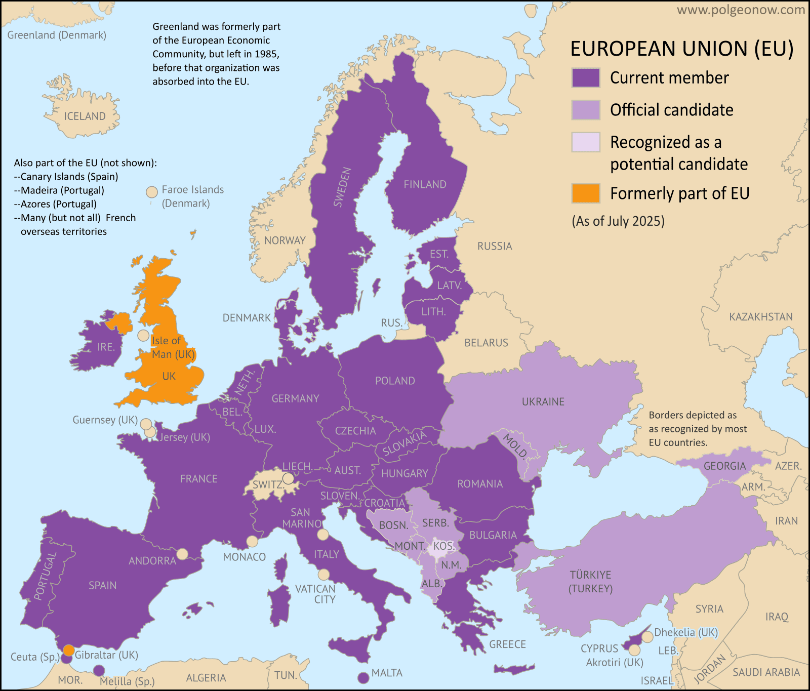

= 9.10 The EUROPEAN UNION
:toc: left
:toclevels: 3
:sectnums:
:stylesheet: ../../myAdocCss.css

'''

== 释义

Now back at the beginning of AP Euro, Europe was basically united by Jesus. The Roman Catholic Church basically held Europe together （使）保持团结 socially and politically. But then the Protestant Reformation 新教改革 occurred, and since then /Europe just fought each other _ad nauseam_ (ad.)令人厌烦地,令人作呕地；不厌其烦地. But in this video, we're going to see /how in the 20th century -- after 500 years of fighting -- Europe finally came together again /with the establishment of the European Union. So if you're ready to get them brain cows milked, let's get to it. +

[.my1]
.案例
====
.ad nauseam
(ad.)( from Latin) if a person says or does sth ad nauseam , they say or do it again and again so that it becomes boring or annoying 令人厌烦地 +
•Sports commentators repeat the same phrases ad nauseam. 体育解说员翻来覆去说着同样的词语，真叫人腻烦。

-> ##前缀ad-, 去，往。词根 naus, 船，海，##同nautical,航海的。此处指##晕船，呕吐##，后##厌烦##。

====

Now it's no surprise /that after two giant _world wars_, European states would *be looking for* a way /not to get embroiled in 卷入；陷入 another giant war. In other words, `主` what we've been doing `谓` hasn't worked 我们一直在做的都没起作用, so let's figure out something else /that might lead to peaceful cooperation 合作，协作 among European states. Now eventually /this push will lead to the establishment of the European Union, but first /let's consider the steps /it took to get there. +

And _as with_ 正如；与……一样；就……来说 so many other things, `主` the steps to cooperation `系` were at first economic. When the United States decided  to pump 注入；投入 13 billion dollars into the rebuilding of Europe /_under the auspices 赞助；保护；预兆 of_ 在…帮助（或支持、保护）下 the Marshall Plan 马歇尔计划, that money came with a stipulation 规定；条款 -- namely that /that money be spent cooperatively 合作地. So for example, France couldn't take Marshall Plan funds and build up a big military /and go (v.) *blow up* 爆炸，炸毁 Germany. No, these funds were granted to European states /who agreed to give each other a warm hug 温暖的拥抱. +

And speaking of warm hugs, if you're feeling cold and alone with this national 国家的，全国的 AP exam coming up, then you might want to find your way /to the embrace of my AP Euro review pack, which is everything /you need to absolutely crush 击败；战胜 that exam. Link in the description.

Anyway, the first real step toward further economic cooperation `系` was the establishment of the Organization for European Economic Cooperation 欧洲经济合作组织, which was the body that organized _the disbursement 支出；支付 and spending_ of the Marshall Plan funds. It worked out pretty well. +

[.my1]
.案例
====
.disburse
(v.) [ VN] ( formal ) to pay money to sb from a large amount that has been collected for a purpose （从资金中）支付，支出

-> ##dis-, 不，非，使相反。-burse, 钱包，##词源同pure, bursary. #即把钱从钱包拿出来，支付。#
====

`主` The next significant step into _the economic unification 统一 of Europe_ `谓` came from the formation 构成；形成 of the European Coal and Steel Community 欧洲煤钢共同体, which was formed in 1951. It was an agreement between six states /to integrate (v.)使一体化；使融合 their steel and coal operations, and those six states included France, West Germany, Italy, Belgium, the Netherlands, and Luxembourg. The economic union was quickly profitable 盈利的，有利可图的 for all of them involved, and the idea was that /if member nations were tied together economically, it would therefore be unthinkable 不可思议的；难以想象的 for them to go to war with one another. +

image:/img/the European Coal and Steel Community.png[,100%]

So as these independent nations *worked together* to become a kind of singular economic bloc 经济集团, they began reaping (v.)收割，获得；收获 fabulous 极好的；巨大的 profits /as a result of their cooperation. Because this worked so well, the six member nations *signed a treaty* in 1957 /to expand the relationship to include goods beyond coal and steel, and the result was _the Common Market_ 共同市场, which was similarly successful. Over the course of 在一段时间内，经过一段时间 the 20th century, more European nations joined this cooperative (n.a.)合作性组织, and  `主` the integration 一体化 of various state economies into a single European economy `谓` was slowly occurring. +

This agreement meant that /trade restrictions 贸易限制 between European states were almost nil 零；没有, and _in light of_ 鉴于；由于 this cooperation, the economic agreement later expanded (v.) into allowing citizens 市民，城镇居民；公民 of all of those states /to travel (v.) freely between them without the need of a passport. And that *brings* us *to* 1993 (这就把我们带到了1993年) when the Maastricht Treaty 马斯特里赫特条约 was signed, which officially created the European Union. It was originally signed by 12 countries, and there were more to come. +

But this wasn't just an economic integration 一体化 of Europe -- it also had political ramifications 影响；后果 as well. Because `主` the economic blending 融合,（使）混合，调和 of Common Market nations `谓` had gone so well, the European Union added some political blending as well. And once the EU was a reality 一旦欧盟成为现实, they established seven bodies /that would *make policy for* EU member nations, including a parliament 议会, an executive body 执行机构, a group of ministers who considered issues like defense and foreign policy. +

Additionally, an international currency 国际货币 called the euro 欧元 was introduced to member nations. No longer would the French use the franc 法郎 or the Italians use the lira 里拉 -- now everyone was using the euro. And this further knit (v.)编织；针织；机织;（使）紧密结合，严密，紧凑 together 使紧密结合；使团结 the member nations. But not everything is _puppies and rainbows_ (小狗和彩虹)美好的事物 when it comes to membership in the European Union, and `主` every problem they face `谓` basically comes down to a tension 紧张关系;矛盾，冲突 /that exists along a single axis 轴线；核心问题. And the question is: how do we balance (v.) questions of national sovereignty 国家主权 *versus* 与……相比；而 responsibilities to the union? +

[.my2]
但欧盟成员资格并非​​尽是美好​​，而它们面临的每个问题，本质上都可归结为一条核心矛盾：​​如何平衡国家主权与对联盟的责任？​

On the one hand, national sovereignty 国家主权 is the idea /that each state is its own state with its own interests, and they don't want to give up their distinction 独特性；特殊性 to this union. On the other hand, each state is a member of a union /which is arguably 可以说；按理说 *stronger* economically and politically *than* they would be alone -- or at least, you know, that's how the argument goes. +

[.my2]
一方面，国家主权意味着每个国家都是独立的、拥有自身利益的国家，它们不想放弃这种独立性而加入这个联盟。另一方面，每个国家都是联盟的成员，而这个联盟在经济和政治方面, 显然比它们(各国)单独存在时更强大——至少，这就是人们所提出的观点。

Perhaps `主` the most recent visible manifestation 表现；显示 of this tension `谓` came with Great Britain's exit (n.) from the European Union in 2016, known as Brexit 英国脱欧. There were a lot of factors that drove (v.) this decision, but one of the major driving factors 驱动因素 was the EU's very _favorable 有利的；良好的；赞成的 policies_ towards immigration. Many Brits were growing tired of 厌倦，对……感到厌烦 the growing (a.) immigrant population -- that'd be fair 是公平的,说得通. Great Britain was always an uncomfortable 令人不舒服的；（处境、事实等）令人不快的，棘手的 member of the EU, and `主` talks (n.) about leaving `谓` had begun occurring /almost as soon as they joined. +

[.my2]
或许这种紧张关系最近的明显表现, 就是英国于 2016 年退出欧盟，这一事件被称为“脱欧”。导致这一决定的因素有很多，但其中一个重要因素是, 欧盟对移民的非常有利的政策。许多英国人对不断增加的移民人口感到厌倦。英国一直是欧盟中一个不太受欢迎的成员国，有关脱离欧盟的讨论, 几乎从加入欧盟之初就开始出现了。

[.my1]
.案例
====
.Brexit
英国脱欧（Brexit）

为什么要脱欧？ 主要可以归结为以下几个核心问题：

- 主权与控制权争议：这是脱欧派最核心的论点。他们认为，**欧盟的法律凌驾于英国法律之上，**导致英国丧失了对自身法律、边境和贸易政策的控制权。**脱欧派呼吁“拿回控制权”（Take Back Control），**主张英国应该重新成为一个完全主权独立的国家。

- 移民问题：**#欧盟的人员自由流动原则, 允许所有欧盟公民, 在成员国之间自由工作和生活。这导致大量来自东欧国家的移民涌入英国，#**给公共服务（如医疗和教育）带来了压力，也让一些英国人担心本地就业市场受到冲击。*#脱欧派承诺，脱欧后英国将能控制移民数量。#*

- 对欧盟官僚体系的不满：*#许多英国人认为欧盟是一个庞大、低效且不民主的官僚机构，其决策过程缺乏透明度。他们认为，英国的利益常常被忽视，而要服从布鲁塞尔（欧盟总部）的指令。#*

- 脱欧派认为，英国可以摆脱欧盟的束缚，在全球范围内与美国、澳大利亚等国达成独立的贸易协议。这种“全球英国”战略的成效仍在观察中。

- 经济负担：**英国作为欧盟成员国，每年需要缴纳一笔可观的“会费”。**脱欧派宣传称，这笔钱可以用于投资英国自己的国民医疗服务体系（NHS）。**虽然欧盟成员国身份也带来了巨大的经济利益，**但“会费”的说法在民众中获得了广泛共鸣。

影响：

- 苏格兰独立运动再起：**苏格兰在公投中大多数人投票支持留欧。脱欧结果让苏格兰民族党重新燃起了独立的希望，认为苏格兰应该脱离英国，重新加入欧盟。**这威胁到了英国的统一。
====

2025年的欧盟: +

[.my1]
.案例
====
.瑞士为什么没有加入欧盟?

image:/img/switzerland.png[,100%]

[.my3]
[options="autowidth" cols="1a,1a"]
|===
|Header 1 |Header 2

|公投结果
|1992 年，瑞士政府曾申请加入 欧洲经济区（EEA），这被视为迈向欧盟的第一步。结果公投中，50.3% 的选民否决了（非常接近，但最终拒绝）。之后瑞士政府虽然提交过欧盟入盟申请（1992 年），但在 2016 年正式撤回，表明不再追求加入。

瑞士国内的分歧: +
-> 德语区居民（经济强、接近德国）对欧盟相对更开放； +
-> 法语区、意大利语区, 则更担心被大国（尤其是德国）主导的欧盟同化； +
整体来说，保守派、乡村地区更反对入盟；城市、国际化地区稍微支持一些。

|拒绝入欧的考量
|- **瑞士的历史和政治传统, 使其对任何形式的"超国家组织", 都抱有极大的警惕。**瑞士公民也曾在多次公投中拒绝加入欧盟：

- 强大的主权传统：#*瑞士是一个以"直接民主"著称的国家，公民可以直接通过"公投"决定国家重大事务。瑞士人非常珍视他们的主权，担心加入欧盟后，国家的决策权将受到限制，不再能自主决定法律和政策。*#

- *瑞士本身经济强劲，不依赖欧盟补贴，因此缺乏“必须加入”的动力。* +
瑞士地处欧洲交通枢纽，本身人口不多（约 900 万），但外籍居民比例很高（约 25%）。
*欧盟成员国之间 人员自由流动，会让更多欧盟移民进入瑞士，加大就业、社会保障和住房压力。*
这一点在瑞士国内争议极大，也是公投多次否决入盟的重要原因。

- 银行业和金融独立性：瑞士是全球最重要的金融中心之一，*##其银行业以严格的隐私保护著称。##一些人担心，#加入欧盟会迫使瑞士放弃其独特的金融法规，从而损害其作为国际金融中心的地位。#*

- 历史中立性：##**瑞士自拿破仑战争以来, 就一直保持"军事中立"，**##这种中立是其国家身份的核心。许多瑞士人担心，*##加入欧盟可能会迫使他们在国际冲突中采取立场，##从而破坏其长期坚持的中立政策。*

|瑞士的替代方案：双边协定
|代替入盟，瑞士与欧盟签署了 上百项双边协定，涵盖：自由贸易, 人员流动, 运输, 科研合作（瑞士也参与 EU 的科研项目 Horizon）. 这样既能保持紧密经济联系，又能保持政治独立。

瑞士虽然不是欧盟成员，但通过一系列 "双边协定"，已经几乎享受了欧盟单一市场的好处（比如人员、货物、资本、服务自由流动——只是程度有限）。

一句话, **瑞士与欧盟在 经济上深度绑定，但在 政治、法律和主权 上坚决保持距离。**它选择了“经济一体化 + 政治独立化”的模式。

|===

+

.挪威为什么没有加入欧盟?

image:/img/Norway.png[,100%]

[.my3]
[options="autowidth" cols="1a,1a"]
|===
|Header 1 |Header 2

|公投结果
|挪威公民曾两次（1972年和1994年）在公投中, 以微弱优势否决了加入欧盟。虽然政府和精英阶层大多支持入盟，但普通民众一直不愿意。

|拒绝加入欧盟的考量原因：
|- 渔业和石油资源：**挪威拥有丰富的渔业和北海石油资源，**这是其经济的支柱。*欧盟的共同渔业政策和能源政策, 要求成员国分享资源管理权。挪威人担心，加入欧盟将意味着失去对自己自然资源的控制权，从而损害本国的经济利益。* +
.. 挪威是全球主要的 石油和天然气出口国，北海油气田带来巨额财富。
.. *#挪威设立了世界最大的 主权财富基金（Government Pension Fund Global），国民福利优厚。#*
.. *#因为经济独立性强，挪威不像一些小国那样“必须依靠欧盟市场和补贴”。#*
.. 很多人担心：加入欧盟后，挪威可能要上缴更多资源（比如渔业和石油政策会受欧盟控制），损害本国利益。

- 富裕的生活水平：由于石油和天然气出口带来的巨大财富，**挪威的人均收入和生活水平远高于欧盟平均水平。许多挪威人担心加入欧盟后，需要分摊对贫困成员国的援助，**并可能面临更高的通货膨胀。

- 民主和主权：一些挪威人认为，*加入欧盟, 意味着将权力移交给布鲁塞尔的官僚机构，从而削弱本国议会的立法权。* +
挪威人强调 主权独立 与 民主自治。*#欧盟很多决策来自布鲁塞尔，普通民众的直接影响力较小。挪威人觉得自己的声音在欧盟里可能被淹没，特别是作为一个只有 500 多万人口的小国。#*

- 文化与认同 : 挪威人普遍认为自己是 北欧国家，在文化和社会制度上更接近瑞典、丹麦、冰岛，而不是布鲁塞尔的欧盟核心国家（德国、法国）。  有一定“外围文化认同”，觉得**加入欧盟可能会稀释本国独特的社会模式（高福利、直接民主、环保政策）。**

|现状 —— “半个欧盟成员”
|尽管如此，挪威仍是**欧洲经济区（EEA）**的成员国，这意味着它必须遵守欧盟的单一市场规则，包括人员、商品、服务和资本的自由流动。

虽然没加入欧盟，但挪威并不是完全独立在外：
挪威是 欧洲经济区（EEA）成员，和冰岛、列支敦士登一起加入。
因此，挪威 几乎全面进入欧盟单一市场（人员、货物、资本、服务自由流动）。
挪威也需要 遵守大量欧盟法规，但 没有投票权。
这被称为 “fax democracy”（传真民主）：布鲁塞尔立法后，挪威只能“照单全收”。
|===

.冰岛为什么没有加入欧盟?

尽管冰岛在2009年曾正式申请加入，但在五年后又主动撤回了申请。

[.my3]
[options="autowidth" cols="1a,1a"]
|===
|Header 1 |Header 2

|渔业资源的控制权
|这是冰岛决定不加入欧盟的最主要原因。

经济命脉：**渔业是冰岛的经济支柱，**占其出口收入的很大一部分。冰岛人认为，对国家渔业资源的控制权至关重要，这是国家主权的核心体现。 +
欧盟的共同渔业政策：*#欧盟奉行"共同渔业政策"（Common Fisheries Policy，简称CFP），要求成员国将渔业管理权移交给欧盟，统一管理捕鱼配额、捕鱼区域, 和渔船数量。#* +

冰岛的立场：**冰岛人担心，加入欧盟意味着他们将失去对本国渔业资源的独家控制权，不得不与欧盟其他成员国分享其丰富的渔场。**他们认为，这会严重损害其经济基础，并且危及本国渔民的生计。*因此，在历次民意调查中，渔业问题都是反欧盟情绪的核心。*

|农业政策的顾虑 :
|特殊地理环境：*冰岛的农业生产受限于严酷的气候和火山地质，成本较高。*  +
欧盟的共同农业政策：欧盟的共同农业政策（Common Agricultural Policy）鼓励自由竞争，而**冰岛人担心，其高成本的本地农产品, 将无法与欧盟其他国家更廉价的进口产品竞争。**

|主权与独立的坚持
|独立历史：**冰岛直到1944年, 才完全脱离丹麦获得独立。** 许多冰岛人认为，*加入欧盟, 意味着将权力移交给布鲁塞尔的官僚机构，从而削弱本国议会的立法权，这与冰岛的民主传统相悖。*
|===

2008年金融危机后的“短暂”申请: +
尽管冰岛长期对加入欧盟持保留态度，但在2008年全球金融危机中，冰岛的银行体系遭受重创，国家经济濒临崩溃。
为了寻求经济上的稳定和进入更大的单一市场，冰岛于2009年正式提出加入欧盟的申请，并希望能够使用欧元以稳定本国货币。

公众反对与撤回：然而，随着冰岛经济逐渐恢复，以及对欧盟渔业政策的担忧重新占据主导，民意开始强烈反对加入。2013年新政府上台后，于2015年正式撤回了入盟申请。

.#Copenhagen criteria 哥本哈根标准 <- 入欧盟的条件#

*欧盟的扩张过程非常严格，被称为“哥本哈根标准”。这个标准要求所有新成员国在政治、经济和法律方面都必须达到高水平。*

哥本哈根标准是欧洲联盟在1993年设定的一套基本准则，旨在规范和指导那些希望加入欧盟的国家的入盟进程。*#这些标准, 确保了新成员国在加入欧盟前，其政治、经济和法律体系, 都与欧盟的核心价值观和运作模式相符。#*

这些标准于1993年, 在丹麦首都哥本哈根举行的"欧洲理事会"会议上确立，因此得名。

标准内容 +
哥本哈根标准主要分为三个部分，涵盖了政治、经济和法律领域：

[.my3]
[options="autowidth" cols="1a,1a"]
|===
|Header 1 |Header 2

|1.政治标准
|这是最核心、也是最重要的标准。**它要求候选国必须具备稳定的民主制度，保障法治、人权以及对少数群体的保护。**具体而言，包括：

- 民主制度的稳定：国家拥有稳定的机构，*#能够保障民主和法治的运行。#*
- *#尊重人权：保障公民的言论自由、集会自由、新闻自由等基本权利，并废除死刑。#*
- 保护少数群体：**保障少数族裔**的文化、语言和政治权利，防止歧视。
- *打击腐败：建立有效机制来打击腐败和有组织犯罪，#确保政府的透明和廉洁。#*

|2.经济标准
|这部分标准要求候选国必须拥有一个** functioning  运行，起作用 market economy**（有效的市场经济），并且有能力 withstand the competitive pressure （抵御欧盟单一市场的竞争压力）。具体而言，包括：

- *市场经济的建立：##政府控制经济的程度要低，##价格和贸易由市场决定。*
- 健全的经济体制：具备稳定的宏观经济环境，能够有效应对外部竞争。
- 与欧盟的融合：经济结构必须能够与欧盟的单一市场进行有效融合。

|3.法律标准
|这部分标准要求, 候选国必须具备 the ability *to take on* the obligations of membership（*承担成员国义务的能力*）。这主要涉及：

- 法律体系的调整：*##候选国必须将其国内法律体系, 调整到与欧盟法律（被称为 Acquis Communautaire）相一致。欧盟法律包括从"环境"、"消费者保护", 到"竞争政策"##等35个不同的章节。*
- 行政和司法能力：必须建立起强大的行政和司法机构，以**有效执行和实施欧盟法律。**
|===

哥本哈根标准的影响: +

- 规范了入盟进程：哥本哈根标准, 为欧盟的扩张提供了一个清晰、可衡量的框架。*它让欧盟能够系统地评估每一个申请国，#确保新成员国的加入, 不会削弱欧盟的整体稳定和价值观。#*
- **推动了改革：##为了满足这些标准，许多候选国被迫进行深刻的政治、经济和社会改革。##这些改革**有助于这些国家自身的发展，并**使其民主制度和经济体制更加健全。**
- 解释了入盟的缓慢：*对于像巴尔干国家这样的地区，哥本哈根标准解释了为什么它们的入盟进程如此漫长。这些国家面临着法治不健全、腐败严重、经济落后以及历史遗留的民族冲突等挑战，要完全满足标准需要巨大的努力和时间。*

====

Okay, click here to keep reviewing for Unit 9 of AP Euro, and click here to grab my AP Euro review pack, which is everything you need to get an A in your class and a five on your exam in May. I'll catch you on the flip flop. I'm Laura. +

'''

== 中文释义

在AP欧洲史的开篇，欧洲基本上是由耶稣维系在一起的。罗马天主教会基本上在社会和政治层面将欧洲凝聚起来。但随后"新教改革"发生了，从那以后，欧洲各国就陷入了令人厌烦的相互争斗之中。但在这个视频里，我们将看到在20世纪，在经历了500年的争斗之后，欧洲最终又通过"欧盟"（the European Union）的建立重新走到了一起。所以如果你准备好获取知识，那就开始吧。 +

毫不奇怪，**#在经历了两次世界大战之后，欧洲各国开始寻找一种避免卷入另一场大战的方法。#**换句话说，我们之前所做的并没有奏效，所以让我们找出其他能让欧洲各国实现和平合作的办法。最终，**#这种努力导致了"欧盟"的建立，#**但首先让我们看看实现这一目标所经历的步骤。 +

和许多其他事情一样，**走向合作的第一步, 是先经济层面的。**当美国根据马歇尔计划（the Marshall Plan）决定向欧洲重建投入130亿美元时，这笔钱有一个规定 —— 即这些钱要以"合作"的方式使用。例如，法国不能拿着马歇尔计划的资金, 来扩充军队然后去攻打德国。不，这些资金是提供给那些同意相互友好合作的欧洲国家的。 +

说到友好合作，如果你因为即将到来的全国AP考试而感到孤独无助，那么你可能想要投入我的AP欧洲史复习资料包的怀抱，它包含了你在考试中取得优异成绩所需的一切。简介里有链接。不管怎样，**迈向进一步经济合作的第一个真正步骤, 是建立"欧洲经济合作组织"（the Organization for European Economic Cooperation），这个组织负责马歇尔计划资金的分配和使用。**效果相当不错。 +

**欧洲经济统一的下一个重要步骤, 是欧"洲煤钢共同体"（the European Coal and Steel Community）的成立，**它于1951年成立。这是六个国家之间的一项协议，目的是整合它们的钢铁和煤炭业务，这六个国家包括法国、西德（West Germany）、意大利、比利时、荷兰和卢森堡。这个经济联盟让所有参与国迅速获利，*#其理念是，如果成员国在经济上相互绑定，那么它们相互开战将是不可想象的 (中美经济互相深层绑定, 就不太可能开战. 脱钩, 则容易开战)。#* +

所以当这些独立的国家合作成为一个单一的经济集团时，它们开始从合作中获得巨大的利润。因为这种合作效果很好，六个成员国在1957年签署了一项条约，**将合作关系, 扩展到煤炭和钢铁之外的商品领域，结果就是"共同市场"（the Common Market）的建立，**共同市场也取得了成功。在20世纪的进程中，更多的欧洲国家加入了这个合作组织，各个国家的经济逐渐整合为单一的欧洲经济。 +

**这项协议意味着欧洲各国之间的"贸易限制"几乎消失了，**鉴于这种合作，**后来的经济协议进一步扩展，允许所有这些国家的公民在彼此之间自由旅行, 而无需护照。**这就说到了**1993年，《马斯特里赫特条约》（the Maastricht Treaty）签署，正式创建了欧盟。**最初有12个国家签署了该条约，后来还有更多国家加入。 +

**但这不仅仅是欧洲的经济一体化 —— 它也有政治方面的影响。**因为共同市场国家的经济融合进展得非常顺利，*##欧盟也在"政治"上进行了一些融合。##一旦欧盟成为现实，他们建立了七个机构，为欧盟成员国制定政策，#这些机构包括一个议会、一个执行机构，以及一群负责国防和外交政策等问题的部长。#* +

此外，一种名为"欧元"（the euro）的国际货币被引入到成员国中。法国人不再使用法郎，意大利人不再使用里拉 —— 现在每个人都使用欧元。这进一步将成员国紧密联系在一起。**但在欧盟成员国的问题上，**并非一切都那么美好，*他们面临的每个问题基本上都归结为一个核心矛盾。#问题是：我们如何平衡国家主权问题, 与对联盟的责任呢 (集集权与分权的平衡, 正如美国各州与联邦的关系, 如何平衡)？#* +

*一方面，国家主权的概念, 是每个国家都是独立的，有着自己的利益，它们不想放弃自己的独特性而融入联盟。另一方面，每个国家都是联盟的成员，从理论上讲，联盟在经济和政治上比单个国家更强大 —— 至少，争论是这样的。* +

这种矛盾最近最明显的表现, 是**英国在2016年决定退出欧盟，即 “脱欧”**（Brexit）。促成这一决定的因素有很多，但**一个主要因素是欧盟非常宽松的移民政策。许多英国人对不断增长的移民人口感到厌倦，**这也是合理的。英国在欧盟中一直是一个不太自在的成员国，几乎从加入欧盟起就开始有退出的讨论。 +

不管怎样，英国脱欧, 是成员国在"维护自身独立和身份"的愿望, 与"统一的政治经济体系带来的好处"之间, 矛盾的一个很好的例子。所以由于移民问题, 以及一系列其他过于复杂在此不做详述的因素，英国在2020年正式脱离了欧盟。 +

好的，点击这里继续复习AP欧洲史第9单元，点击这里获取我的AP欧洲史复习资料包，它包含了你在课堂上得A、在五月的考试中得5分所需的一切。回头见。我是劳拉（Laura）。 +

'''

== pure

Now back at the beginning of AP Euro, Europe was basically united by Jesus. The Roman Catholic Church basically held Europe together socially and politically. But then the Protestant Reformation occurred, and since then Europe just fought each other ad nauseam. But in this video, we're going to see how in the 20th century -- after 500 years of fighting -- Europe finally came together again with the establishment of the European Union. So if you're ready to get them brain cows milked, let's get to it.

Now it's no surprise that after two giant world wars, European states would be looking for a way not to get embroiled in another giant war. In other words, what we've been doing hasn't worked, so let's figure out something else that might lead to peaceful cooperation among European states. Now eventually this push will lead to the establishment of the European Union, but first let's consider the steps it took to get there.

And as with so many other things, the steps to cooperation were at first economic. When the United States decided to pump 13 billion dollars into the rebuilding of Europe under the auspices of the Marshall Plan, that money came with a stipulation -- namely that that money be spent cooperatively. So for example, France couldn't take Marshall Plan funds and build up a big military and go blow up Germany. No, these funds were granted to European states who agreed to give each other a warm hug.

And speaking of warm hugs, if you're feeling cold and alone with this national AP exam coming up, then you might want to find your way to the embrace of my AP Euro review pack, which is everything you need to absolutely crush that exam. Link in the description. Anyway, the first real step toward further economic cooperation was the establishment of the Organization for European Economic Cooperation, which was the body that organized the disbursement and spending of the Marshall Plan funds. It worked out pretty well.

The next significant step into the economic unification of Europe came from the formation of the European Coal and Steel Community, which was formed in 1951. It was an agreement between six states to integrate their steel and coal operations, and those six states included France, West Germany, Italy, Belgium, the Netherlands, and Luxembourg. The economic union was quickly profitable for all of them involved, and the idea was that if member nations were tied together economically, it would therefore be unthinkable for them to go to war with one another.

So as these independent nations worked together to become a kind of singular economic bloc, they began reaping fabulous profits as a result of their cooperation. Because this worked so well, the six member nations signed a treaty in 1957 to expand the relationship to include goods beyond coal and steel, and the result was the Common Market, which was similarly successful. Over the course of the 20th century, more European nations joined this cooperative, and the integration of various state economies into a single European economy was slowly occurring.

This agreement meant that trade restrictions between European states were almost nil, and in light of this cooperation, the economic agreement later expanded into allowing citizens of all of those states to travel freely between them without the need of a passport. And that brings us to 1993 when the Maastricht Treaty was signed, which officially created the European Union. It was originally signed by 12 countries, and there were more to come.

But this wasn't just an economic integration of Europe -- it also had political ramifications as well. Because the economic blending of Common Market nations had gone so well, the European Union added some political blending as well. And once the EU was a reality, they established seven bodies that would make policy for EU member nations, including a parliament, an executive body, a group of ministers who considered issues like defense and foreign policy.

Additionally, an international currency called the euro was introduced to member nations. No longer would the French use the franc or the Italians use the lira -- now everyone was using the euro. And this further knit together the member nations. But not everything is puppies and rainbows when it comes to membership in the European Union, and every problem they face basically comes down to a tension that exists along a single axis. And the question is: how do we balance questions of national sovereignty versus responsibilities to the union?

On the one hand, national sovereignty is the idea that each state is its own state with its own interests, and they don't want to give up their distinction to this union. On the other hand, each state is a member of a union which is arguably stronger economically and politically than they would be alone -- or at least, you know, that's how the argument goes.

Perhaps the most recent visible manifestation of this tension came with Great Britain's exit from the European Union in 2016, known as Brexit. There were a lot of factors that drove this decision, but one of the major driving factors was the EU's very favorable policies towards immigration. Many Brits were growing tired of the growing immigrant population that'd be fair. Great Britain was always an uncomfortable member of the EU, and talks about leaving had begun occurring almost as soon as they joined.

Regardless, Brexit is a good example of the tension between member states' desire to maintain their independence and identity and the benefits of a unified political economic system. So because of the immigration issue and a whole host of other factors that are too complicated to get into here, the United Kingdom officially left the EU in 2020.

Okay, click here to keep reviewing for Unit 9 of AP Euro, and click here to grab my AP Euro review pack, which is everything you need to get an A in your class and a five on your exam in May. I'll catch you on the flip flop. I'm Laura.

'''