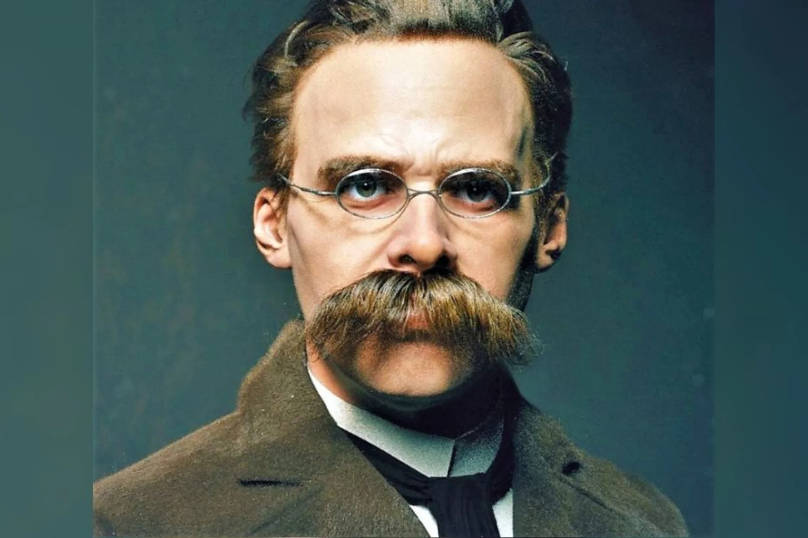
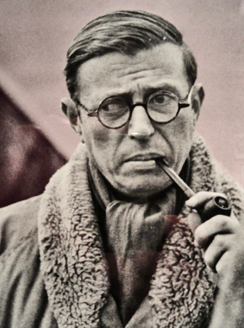
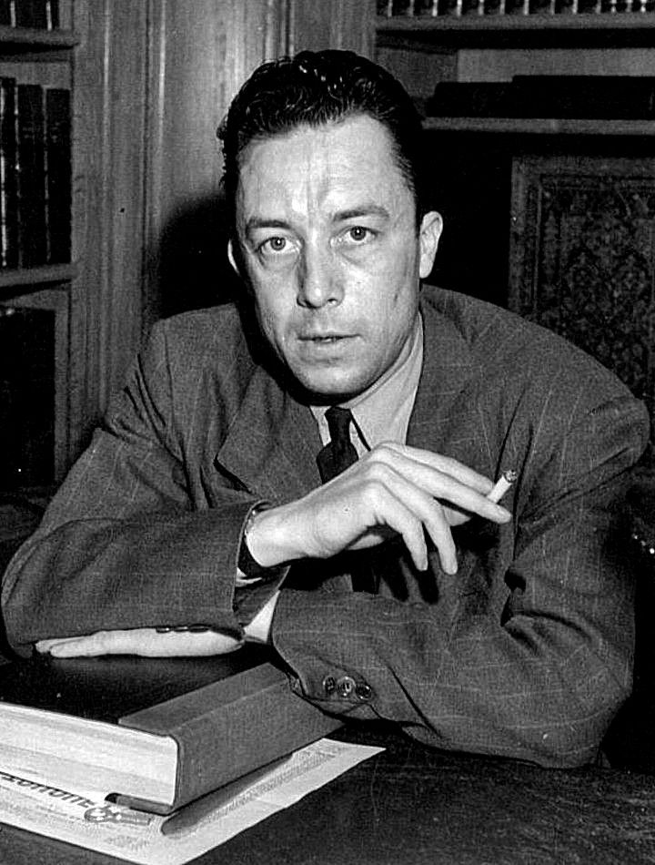
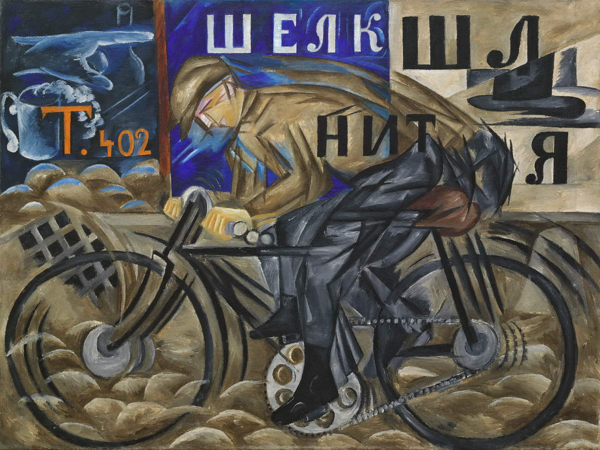

= 9.14 Cultural, Artistic, & Demographic 人口的，人口统计的 TRENDS 趋势，动态 in Modern Europe
:toc: left
:toclevels: 3
:sectnums:
:stylesheet: ../../myAdocCss.css

'''

== 释义

Oh my goodness  天哪，啊呀（用作“上帝”的替代语，表示吃惊或愤怒等）, it is the last video of the entire AP Euro curriculum 课程. But I'll tell you goodbye /and shed a single tear 流下一滴眼泪 at the end of the video. For now, we need to talk about the 20th and the 21st century culture, arts, and demographic (a.)人口的，人口统计的 trends 人口趋势. So if you're ready to get them brain cows milked one last time, let's get to it. +

[.my1]
.title
====
.demography
-> 词根词缀：## -demo-人民 + -graph-写,画## + -y → 记录人口

====

Now if you remember all the way back to 一直回到 Unit 8, I mentioned that /before World War One /everyone was like "science 科学!", but after World War One /everyone was like "science?" You see, for centuries /science was dominated by a narrative 叙述；故事 of progress -- the world is getting better and better /because of our scientific progress. And at the turn of the 20th century, humanity 人类 was about to enter a perfect world /thanks to science. That illusion 幻想；错觉 had been destroyed /on the battlefields of both World Wars. Scientific progress could be used to destroy huge swaths 细长的列；收割的刈痕；收割的宽度;大片；大量 of humanity. So the result of both of those world wars `系` was a decreased confidence 战争带来的结果, 就是人类下降的信心/that science could solve all our problems. +

And so /the philosophy 哲学 of the age began to reflect this disillusionment 幻灭；失望 with the world /and engendered 产生；引起 a strong reaction against Enlightenment rationalism 启蒙理性主义. The first development came /in the rise of existentialism 存在主义. This is a philosophy that assumed 假定；认为 the world was absurd 荒谬的 /and that `主` meaning `谓` had to be found /in spite of 尽管、不管、虽然 that absurdity 荒谬. Friedrich Nietzsche was kind of the poster boy 典型人物 for this manner of thinking. His reckoning 观点；估计: God was dead /and Europeans had killed him, and thus *now that* God was dead, life was inherently 本质上 meaningless. +

[.my2]
于是，那个时代的哲学, 开始反映出人们对世界的这种失望情绪，并引发了对启蒙理性主义的强烈反对。第一个发展就是存在主义的兴起。这是一种认为世界是荒谬的、并认为即便如此, 仍需寻找意义的哲学。弗里德里希·尼采就是这种思维方式的代表人物。他的观点是：上帝已经死亡，欧洲人将他杀害了，因此既然上帝已经死亡，那么生活本身就毫无意义。

[.my1]
.title
====
.Existentialism 存在主义

**存在主义（Existentialism）是一战后兴起的一股重要哲学思潮。#它最核心的观点是：存在先于本质（existence precedes essence）。#**

这句话听起来有点抽象，我们可以这样理解：

- **本质（Essence）：指的是事物的固有特性、**预先设定的目的或身份。*比如，#一把锤子的本质是“用来敲打钉子”，它的功能和意义在被创造出来时就已经确定了。#*

- *存在（Existence）：指的是一个人的实际存在、他的生命本身。*

*#存在主义认为，对人类来说，情况正好相反。我们被“抛掷”到这个世界上，没有预设的本质或目的。一个人首先是存在的，然后在他的一生中通过自己的选择和行动，才逐渐创造出自己的本质和意义。(人生没有意义, 是我们赋予它意义.) 因此，人是完全自由的，必须为自己的所有选择负责。#*

**#存在主义者普遍认为世界是荒谬（Absurd）和无意义（Meaningless）的。#**当人们意识到生命没有预定的神圣蓝图或目的时，会感到一种深深的焦虑和绝望。*但存在主义并不止步于此，#它要求人们直面这种荒谬感，并在其中创造出自己的意义。#*

以下是几位重要的存在主义思想家：

[.my3]
[options="autowidth" cols="1a,1a"]
|===
|Header 1 |Header 2

|弗里德里希·尼采（Friedrich Nietzsche）
|

虽然他早于一战，但他的思想奠定了存在主义的基础。*他提出了“上帝已死”的著名论断，认为随着宗教信仰的衰落，传统的道德和意义来源已经消失。但这并不是一个悲剧，而是一个机遇。现在，人类必须自己成为价值的创造者，通过“超人”精神来克服虚无主义。*

尼采的“超人”（德语：Übermensch，直译是“超越人类”）理论，是他哲学中的核心概念之一，但经常被误解。简单来说，它不是指拥有超能力或身体强壮的人，而**是一种精神境界和理想人格。**

*“超人”是尼采为人类设定的一种理想目标，旨在克服虚无主义（Nihilism）并重新创造价值。*

为什么需要“超人”？ +
要理解“超人”，必须先理解尼采的著名论断：#*“上帝已死”。这不意味着上帝真的死了，而是指在19世纪末的欧洲，传统的宗教信仰和神圣的道德基础, 已经衰落，不再能为人们提供生活的意义和价值。*# +
*当“上帝”这个终极的意义来源消失后，人类进入了一个危险的虚无主义时代。人们会感到生命是空洞、无意义的，因为所有的价值都失去了根基。*

尼采认为，面对这种精神危机，人类有两种选择：

- 沉沦为“末人”（Last Man）：尼采眼中的“末人”是那些安于现状、追求平庸舒适生活、缺乏创造力和激情的平庸之辈。他们不愿承担创造新价值的责任，只求安稳度日。尼采对此感到厌恶，他认为这是人类精神的退化。

- 成为“超人”：这是另一条道路，也是尼采的理想。*#超人能够勇敢地直面“上帝已死”带来的虚无，并承担起自己创造新价值的责任。#*

“超人”的核心特质: +
“超人”的精髓在于自我超越和意志力。他具备以下几个重要特质：

- 克服虚无主义：*超人不是被虚无压垮，而是将其视为创造新意义的起点。#他明白没有预设的真理，所以他必须自己成为真理的创造者。#*

- “永恒轮回”的肯定：这是尼采提出的一个思想实验：**假设你被告知，你一生中的每一个瞬间——所有的痛苦、快乐、错误和成功——都将无休止地、精确地重复下去。如果你能**以一种喜悦和肯定的态度接受并**拥抱这个事实，**那么你就是“超人”。这要求你热爱自己的命运（amor fati），并为自己所做的每一个选择感到自豪。

- 超越传统的道德观：##**超人会打破奴隶道德（如怜悯、服从、谦卑），并创造出新的、更具生命力的主-人道德（如力量、骄傲、自我肯定）。(即不是被动受别人影响的人, 而是主动掌握自己命运的人.)**## 这并不是说超人是邪恶的，而是他不受传统道德束缚，为自己制定规则。

- #*强大的生命意志（Will to Power）：超人以"权力意志"为动力，这是一种追求力量、成长、自我扩张和创造的内在冲动。这种力量不是为了压迫他人，而是为了实现自己的潜能，成为自己人生的主宰。*#

总而言之，**“超人”是一种对生命和自身潜能的完全肯定。它是对平庸和虚无的终极反抗，**是人类精神自我超越的最高境界。尼采认为，每一个个体都有成为超人的可能性，只要他愿意直面世界的荒谬，并勇敢地为自己的人生赋予新的意义和价值。

|让-保罗·萨特（Jean-Paul Sartre）
|

他是二战后法国存在主义的领军人物。他相信**人是“注定要自由”的，没有逃避责任的可能。**他认为，**我们所有的选择都在定义我们是谁，**也同时在为全人类树立榜样。这种绝对的自由和责任感，正是导致“存在的焦虑”的原因。

让-保罗·萨特的核心思想：存在先于本质: +
让-保罗·萨特（Jean-Paul Sartre）是20世纪最重要的存在主义哲学家之一，#*他的核心思想可以用一句名言来概括：“存在先于本质”（existence precedes essence）。*#

这句话是理解他所有理论的关键。我们可以这样来理解它：

- 本质（Essence）： 一个事物的本质是它的固有特性、预设的目的或功能。例如，一把刀的本质就是“用来切割”，它的用途和属性在被制造出来时就已经确定了。
- 存在（Existence）： 一个人的存在, 是指他作为个体实际活在世上的事实。

萨特认为，对人类来说，这个顺序是颠倒的。*人类并非被创造出来以服务某个预设的目的（比如服从上帝）。一个人首先是存在于世的，然后在他的一生中，通过自己的选择、行动和经历，才逐渐创造出自己的本质和意义。* +
*#因此，你不是天生就是“胆小鬼”或“英雄”，你是因为你的选择和行动，才变成了“胆小鬼”或“英雄”。#*

核心观点与推论: +
从“存在先于本质”这一核心思想，萨特推导出了几个关键的概念：

1. 绝对的自由与责任: +
既然我们没有预设的本质，我们就拥有绝对的自由。我们必须为自己做出的每一个选择负责，因为这些选择定义了我们是谁。萨特认为，人是“注定要自由”（condemned to be free）的。这种自由不是一种享受，而是一种沉重的负担，因为你无法逃避选择和责任。

2. 存在的焦虑（Anguish）:  +
当一个人意识到"自己对所有选择负有绝对责任"时，会感到一种深刻的焦虑（Anguish）。这种焦虑不是因为害怕后果，而是因为意识到, 我们所做的选择不仅定义了自己，也在无形中为全人类树立了榜样。例如，当一个男人选择结婚时，他实际上在说：“在我的选择下，男人就应该结婚。”这种巨大的责任感, 就是焦虑的来源。

3. 弃绝（Forlornness）:  +
萨特认为，**由于“上帝已死”，不再有任何神圣的道德准则, 或预设的人类本性, 来指导我们的行动，我们是“被弃绝”（forlorn）的。我们独自面对世界，**没有任何借口或理由来为自己的选择开脱。*我们必须自己去创造道德，并为之负责。*

4. 坏信念（Bad Faith） :  +
这是萨特用来描述人们逃避自由和责任的行为。当我们试图说服自己，我们的行为是由外部力量（比如基因、社会环境或命运）决定的，而不是我们自由选择的结果时，我们就陷入了坏信念。萨特认为，这是对我们自身自由的欺骗，是人性的一种基本弱点。

萨特哲学的影响: +
萨特的思想在二战后产生了巨大影响，它深刻地塑造了存在主义文学和哲学。它告诉我们，生命本身是荒谬和无意义的，但我们不应因此绝望。相反，我们应该勇敢地承担起创造意义的责任，通过每一个自由的选择来塑造自己的人生。萨特的哲学不是让人感到无助，而是鼓励人们成为自己人生的主宰。

|阿尔贝·加缪（Albert Camus）
|

**他将世界描述为“荒谬的”，即人类对意义的渴望, 与宇宙的冷漠无情之间的冲突。**在加缪的代表作《西西弗神话》中，他提出了著名的##**西西弗斯**##形象——##**一个被惩罚永远推石上山的人。**##加缪认为，##**虽然这个任务是无意义的，但西西弗斯通过反抗命运和接受自己的处境，找到了人生的尊严和意义。**##他认为，我们必须像西西弗斯一样，在对荒谬的清醒认知中，找到反抗和活下去的理由。

*阿尔贝·加缪（Albert Camus）的哲学核心可以用一个词来概括：荒谬（Absurd）。* +
他的理论不像萨特那样是一套完整的"形而上学"体系，而更像是在追问一个基本的人类困境：在没有神、没有永恒意义的宇宙中，我们该如何生活？

荒谬的来源: +
加缪认为，“荒谬”并不是世界或人类本身固有的属性，而是人类对意义的强烈渴望, 与宇宙的永恒沉默和冷漠之间的冲突。

- 人类的渴望： 人类天生就渴望理解世界，寻找一个可以解释一切的终极意义、一个可以遵循的道德准则，以及一个超越死亡的希望。
- 宇宙的沉默： 然而，宇宙对我们所有的问题都保持沉默。它既不仁慈，也不敌对，它只是纯粹的、无意义的、冷漠的存在。

*当人类用理性的光芒去探寻世界的意义时，他发现的只是黑暗和空虚。这种巨大的落差，就是加缪所说的“荒谬”。*

三种回应方式: +
面对这种荒谬，加缪提出了三种常见的应对方式，并对它们进行了分析：

- **自杀（Suicide）：**这是最直接的回应，通过消灭自己来结束荒谬带来的痛苦。但**#加缪认为这是一种逃避，它并没有解决荒谬本身，而是消灭了体验荒谬的人。(没有去解决问题, 而是解决提出问题的人. )#**他称之为“哲学上的自杀”，因为它承认了荒谬，但却放弃了斗争。

- 信仰的飞跃（Leap of Faith）：*通过皈依宗教或其他超自然信仰，将希望寄托于一个更高层次的意义上。加缪认为，##这同样是一种逃避。它不是直面荒谬，而是通过接受一种"不理性的信念"来否认荒谬，从而获得心灵的慰藉。##他称之为“哲学上的自杀”，因为它放弃了理性。*

- 反抗与自由（Revolt and Freedom）：*这是加缪推崇的唯一正确的回应。既然我们无法消除荒谬，那我们就应该勇敢地、清醒地与之共存。*

核心理论：反抗、自由与激情: +
加缪的核心思想在于如何通过反抗（Revolt）来拥抱荒谬：

- 反抗（Revolt）：这并非指暴力革命，而是一种持续不断的、精神上的反抗。*我们清醒地意识到生命的无意义，但我们拒绝屈服。这种反抗赋予了生命尊严和价值。*

- 自由（Freedom）：一旦我们放弃了寻找终极意义的希望，我们就获得了真正的自由。我们不再被任何外部准则（如宗教教条或社会规则）束缚。我们可以随心所欲地去思考、去行动，因为我们知道，生命本身就是它唯一的价值。#*注意: 这并不是说人要放弃所有道德原则, 而是说, 我们因此能获得一种内在的自由, 借此,我们能创造出属于我们自己(个人)的道德原则。*# +
#*因此，加缪所说的“自由”，是一种在没有预设道德的世界里，勇敢地承担起创造和遵守自己道德原则的责任。*# +
+
加缪的哲学强烈强调对他人的责任和团结。他认为，我们都是被“抛掷”到这个荒谬世界中的“同伴”。既然我们都身处同样的困境，那么就应该相互帮助、相互支持。这种同情心和团结是加缪道德观的核心，也是他反对暴力和压迫的主要原因。

- 激情（Passion）：既然生命只有一次，我们应该以最饱满的激情去体验每一个瞬间。活得最精彩的人，不是活得最长的人，而是体验最深的人。

“西西弗神话”：荒谬英雄的形象: +
加缪在《西西弗神话》中用了一个完美的例子来阐释他的哲学：西西弗斯。 +
西西弗斯被众神惩罚，永远将一块巨石推上山顶，但石头在到达山顶后又会滚落下来。这个任务是无意义的、永恒的。

然而，*加缪认为，##当西西弗斯走下山坡去重新推石头##的那个瞬间，他就是自由的。#他清楚地知道自己的命运，但他没有放弃，而是继续前行。他通过这种清醒的、无止境的反抗，赋予了自己的生命以尊严。#* +
加缪总结道：“我们必须想象西西弗斯是幸福的。”因为他已经成为了自己命运的主人，#*他的快乐来自于对荒谬的彻底接受与不懈反抗。*#
|===

存在主义深刻地影响了文学、艺术、心理学和流行文化。它强调个体的重要性、自由意志和个人责任，为现代人面对一个充满不确定性和无意义感的世界，提供了寻找方向和力量的哲学工具。*它告诉我们，尽管生活本身没有预设的意义，但我们可以通过自己的行动、激情和选择，来为它赋予意义。*
====

Okay, now the second development came along in the 1950s /and it was called postmodernism 后现代主义. It reacted against Enlightenment certainty 确定性 /by pointing out that _all truth was relative_ 相对的. In other words, every different culture has unique ways of seeing _the world_ /and _values 后定说明 by which `主` it `谓` interacts (v.)互动；相互作用 with the world_. Therefore, postmodern philosophers 哲学家 would say that /no one culture or one thinker has the corner 垄断,独占 on absolute truth (绝对真理) 垄断了绝对真理,独占了绝对真理 /because `主` all truth claims 真理主张 `谓` are culturally conditioned 受文化制约的. +

[.my2]
好的，接下来在20 世纪 50 年代出现了第二个发展，它被称为后现代主义。它对启蒙运动所秉持的"绝对真理观念"提出了质疑，指出所有的真理都是相对的。换句话说，每个不同的文化, 都有其独特的"看待世界"的方式, 以及"与世界互动"所遵循的价值观。因此，后现代哲学家会说，没有一种文化或一位思想家, 能够独占绝对真理，因为所有的真理主张, 都是受到文化条件制约的。

[.my1]
.title
====
.no one culture or one thinker `谓` has the corner on absolute truth
"Has the corner on absolute truth"​​ 是一个英语习语。
这里的 ​​"corner"​​ 不是指“角落”，而是取了一个非常特定的商业/经济含义：​​“垄断”​​或“独占”。

##**"To have a corner on something"​​ 或 ​​"to corner the market"​​ 的意思是“完全控制某种商品或资源的供应”，从而拥有对其的垄断权和定价权。**##这个说法源于商业行为，指通过收购等手段, 控制市场上绝大部分的某种商品。

所以，​​"has the corner on absolute truth"​​ 的意思是：
​​“垄断了绝对真理”​​ 或 ​​“独占了绝对真理”​​。
====

So in both these philosophical developments 在这两种哲学发展中, you can see that /the old Enlightenment rationalism 理性主义；唯理主义 was no longer reigning (v.)统治；支配 supreme (a.)(最高的，至高无上的) 占主导地位. But that shouldn't tempt (v.)引诱，诱惑；怂恿 you to believe that /Europeans were throwing away 扔掉 their religion _left, right, and center_ 到处,四面八方. It is true /that Europe grew more secular (a.)非宗教的，世俗的；现实世界的 over the course of the 20th and 21st centuries, but it is also true /that organized religion 有组织的宗教 continued *to play a significant role* in European social and cultural life /_in spite of_ the many challenges it faced. +

[.my2]
因此，在这两场哲学发展过程中，我们可以看到，旧的启蒙理性主义已不再占据绝对主导地位。但这并不应让你认为欧洲人彻底抛弃了他们的宗教信仰。的确，在 20 世纪和 21 世纪期间，欧洲变得更加世俗化，但同样真实的是，尽管面临诸多挑战，有组织的宗教在欧洲的社会和文化生活中仍发挥着重要作用。

[.my1]
.title
====
.throwing away their religion left, right, and center
​​#*"left, right, and center" 这个短语是一个​​强调副词​​，意思是：
​​“到处”、“四面八方”、“毫无节制地”、“频繁地”、“在一切场合”。*#​​
它用来描述一种行为发生的范围极广、频率极高、程度极其猛烈，几乎到了不加选择和无法控制的地步。

所以，整句话 ​​"throwing away their religion left, right, and center"​​ 的意思是：
​​“正在肆无忌惮地、大规模地、随时随地地抛弃他们的宗教信仰。”​

If you do something _left, right, and centre_,  It's a phrase /that just means _everywhere or all the time._ 这个词组的**意思是"无处不在"或"无时不在"。**

Examples  示例:

- I'm not surprised the cafe closed. It's been losing customers _left and right_ /over the past couple of years. 我对这家咖啡馆关门一点也不意外。过去几年里，它的顾客一直在不断流失。
- You can't miss that new film; they've been promoting it _left, right, and centre_.
你一定不能错过那部新电影；他们一直在到处宣传它。

.secular
-> 来自拉丁语 saecularis,现时的，现世的，来自 saeculum,现时，现世，可能来自 PIE*se,播种， 耕种，#词源同 seed,semen.#-cul,-culum,工具格后缀，词源同 oracle,hibernacle.比喻用法，即相 比于神和宗教的永恒，#种子只有一次生命过程，引申词义世俗的，非宗教的。#
====

For example, in the 20th century /the church had to contend (v.)竞争；争夺 with 应对；处理 totalitarian  (a.)极权主义的 governments 极权政府, and their responses were mixed. In Germany, Dietrich Bonhoeffer founded 建立；创立 _the Confessing Church_ 认信教会 which was exceedingly 非常 vocal (a.)直言不讳的，大声表达的;嗓音的，发声的，歌唱的 in its criticism 批评，批判 of Nazi policies, especially their anti-Jewish policy 反犹政策. But for his suspected (a.) participation in _an assassination attempt_ against Hitler, Bonhoeffer was executed 处决 in the waning (a.)（月亮）渐亏的；逐渐减弱或变小的 days of the war. +

[.my2]
例如，在 20 世纪，教会不得不应对极权主义政府的统治，而它们的应对措施则各不相同。在德国，迪特里希·博胡费尔创立了“忏悔教会”，该教会对纳粹政策（尤其是其反犹政策）的批评极为强烈。但由于他被怀疑参与了对希特勒的暗杀企图，博胡费尔在战争末期被处决。

But it was a different story over in Italy. When Mussolini rose to power, he understood that /he needed the support of the Catholic Church in Rome. So he recognized the independence of Vatican City 梵蒂冈城 /and proclaimed Catholicism 天主教 as the official religion of Italy. In response, the pope encouraged the faithful 信徒 to support the fascist government 法西斯政府. +

Over in Poland, the church had to contend with Soviet communist repression 苏联共产主义的镇压. In 1980, a group known as Solidarity 团结工会 was founded, which was essentially a Polish _trade union_ (工会) 波兰工会 that existed outside Warsaw （波兰首都）. The Soviets tried their hardest to crush this opposition 反对派 /but could not. And in 1978, `主` a Catholic cardinal 红衣主教 from Poland `谓` was elected pope of the Catholic Church, taking the name John Paul II. Being sympathetic (a.)同情的 with the goals of Solidarity （波兰的）团结工会, the pope financially supported their efforts to undermine (v.)逐渐削弱（损害）；故意破坏（某人）的形象（或威信）；在……下面挖，（尤指）从根基处损坏 the Soviet communist regime （尤指独裁的）政府，政权；（机构、公司、经济等的）管理制度，组织方法 in Poland. +

So those are _a couple examples of_ how the church responded to totalitarianism 极权主义. But since we're talking about religion 宗教信仰；宗教，教派, I need to tell you that /the Catholic Church underwent (v.)经验；遭遇 a massive 大量的，大规模的 reform movement 大规模的改革运动 in the 1960s /at the Second Vatican Council 第二次梵蒂冈大公会议. You'll also hear _this called (v.) Vatican II_, but you know it's the same thing -- don't get confused.  +
The purpose 目的，意图；目标 of this council 地方议会；会议；（教会的）集会 was essentially to update the church /to respond to the modern world. One of the most significant changes was `表` the allowance (n.) of priests /to say the mass 做弥撒 in vernacular 本地话，方言 languages 本国语言 rather than in Latin. Additionally, the church made resolutions 决议 to live (v.) _on friendlier terms_ 以更友好的方式 with other sects of Christianity 基督教教派, namely Protestants 新教徒 and Eastern Orthodox Christians 东正教基督徒. Ultimately these sweeping (a.) reforms 全面改革 led to a revival 复兴 of Catholicism /in various parts of Europe. +

[.my2]
这些就是教会应对极权主义的一些例子。但既然我们是在谈论宗教，那么我得告诉你们，在 20 世纪 60 年代，天主教会于"第二次梵蒂冈大公会议"期间, 进行了大规模的改革运动。你们也会听到这个会议被称为“梵蒂冈二大”，但其实是一回事——别搞混了。这次会议的主要目的是更新教会，以适应现代社会。其中最重要的变化之一是允许牧师用通俗语言而非拉丁语, 来主持弥撒。此外，教会还做出了与基督教其他教派（主要是新教徒和东正教徒）建立更友好关系的决议。最终，这些大规模的改革, 在欧洲各地推动了天主教的复兴。

[.my1]
.title
====
.mass
弥撒是天主教和东正教举行的一种祭祀仪式，在中文里也被称为“感恩祭”，其名称来源于拉丁语“Missa”，意为“派遣”或“散会”。**弥撒以不流血的方式重现了耶稣在十字架上的牺牲，**通过祝圣的**面包和葡萄酒来象征耶稣的圣体和圣血，**信徒参与仪式并领受圣体圣血，以纪念和参与耶稣的救赎行动。

弥撒的主要内容和意义:

- 祭献天主：
弥撒是圣教会祭献天主的大礼，*信徒通过这个仪式向上主表达敬爱、感恩、祈求和赎罪。*
- 纪念耶稣的晚餐与牺牲：
*弥撒是纪念耶稣在最后晚餐中建立圣体圣事的仪式，并且重演了他在十字架上的牺牲。*
- 圣体圣血的转化：
*在弥撒中，牧师祝圣了饼和酒，使其实质上转化成为耶稣的圣体和圣血，信徒通过领受它们，与耶稣合而为一，获得救赎。*
- 信徒的参与和合一：
弥撒是教会的核心礼仪，信徒借此机会聚会，聆听《圣经》、听神父讲道，并与教会的其他成员一同敬拜天主和为世界祈祷。

弥撒通常包含以下五个主要部分: +
- 进堂式：礼仪的开始部分。 +
- 圣道礼仪：主要是诵读《圣经》和神父的讲道。 +
- 圣祭礼仪：包括祝圣面包和葡萄酒，并在此过程中进行圣体圣血的奉献。 +
- 领圣体礼：信徒领受祝圣后的饼（圣体）和酒（圣血）。 +
- 礼成式：仪式的结束部分。 +
====

Now I already mentioned /how philosophy and science were leading the way in *questioning (v.) and undermining* (v.) objective knowledge 客观知识 during the 20th century. 哲学和科学是如何引领质疑和颠覆客观知识的。 The arts followed _that same path_ as well. Remember in Unit 7 we talked about the rise of cubism 立体主义 around the turn of the 20th century. In this movement, the subject of the paintings became almost nonsensical 无意义的. It was a style /that depicted 描绘 three-dimensional objects 三维物体 in two dimensions 二维. Pablo Picasso was probably the most famous of these artists. +

And then came the Italian and Russian artistic movement /known as futurism 未来主义, in which /artists emphasized (v.)强调 -- you know -- the future. They emphasized the future of Italy and Russia /in order to free them from their recently checkered (a.)与失败并存的（过去或历史、事业）;多变的；有不同颜色方格图案的；多波折的 past 动荡的过去. For example, here's a painting from the Russian futurist Natalia Goncharova, and you can see _the finger pointing (v.) backwards_ while the cyclist 骑自行车的人 defiantly 大胆地 pedals (v.)踩（自行车等的）踏板 into the future. +

[.my2]
随后出现了被称为“未来主义”的意大利和俄罗斯的艺术运动，在这一运动中，艺术家们强调——你知道的——未来。他们强调意大利和俄罗斯的未来，以使它们摆脱刚刚过去的混乱不堪的过去。例如，这是俄罗斯未来主义画家娜塔莉亚·贡查罗娃的一幅画作，你可以看到手指向后指去，而骑车的人则坚定地朝着未来骑行。

[.my1]
.title
====
.chequered
(a.)( BrE ) ( NAmE BrE check·ered )
1.*~ past/history/careera* : person's past, etc. that contains both successful and not successful periods 成功与失败并存的（过去或历史、事业） +
2.having a pattern of squares of different colours 有不同颜色方格图案的

.Natalia Goncharova

====

Then came Dadaism 达达主义, which was a response to the felt purposelessness 无目的性 of life /after `主` two world wars `谓` had devastated 摧毁 the European continent. If life was devoid (a.)缺乏，完全没有 of purpose 缺乏目的, so too /should art be devoid (a.) of purpose. Case in point 例证: Marcel Duchamp's famous Dada 达达主义 piece （艺术、音乐、戏剧、文学的）一部作品 called Fountain 喷泉；喷射. If you're thinking "Wait, that's just a urinal 尿壶；小便池 -- that's not art," exactly! It is a satirical 讽刺性的 commentary 注释；解释；评注；评论 on the meaninglessness of Western aesthetic 审美的，美学的 values 西方美学价值. +

[.my2]
后来出现了达达主义，这是对两次世界大战摧毁欧洲大陆后, 人们感到生活毫无目的的回应。如果生活缺乏目的，那么艺术也应该缺乏目的。马塞尔·杜尚著名的达达主义作品《喷泉》就是一个很好的例子。如果你在想“等等，那只是一个小便池——那不是艺术”，那就对了！这是对西方审美价值毫无意义的讽刺评论。

Then came the artistic movement known as surrealism 超现实主义. The idea here is that /as Sigmund Freud had exposed _the chaotic 混乱的 and unrefined 未提炼的；粗俗的 interior 内部的，里面的;内心的，本质的 worlds_ of human beings, art ought to reflect those same realities. For example, the most famous of the surrealists 超现实主义艺术家 was Salvador Dalí, and here you can see his painting called The Persistence 继续存在，维持 of Memory 记忆的永恒. I mean /this looks like something out of a dreamscape 梦境. And apparently he meant _the melting clocks_ would be a kind of commentary 评论；说明，写照 on the disturbing 令人不安的，引起恐慌的 relativity （物理）相对论；相对性of time. +

But it wasn't only the visual arts 视觉艺术 /that changed over the course of the 20th century. So too did architecture 建筑. For example, the Bauhaus School of Architecture 包豪斯建筑学派 emerged in Germany /during the interwar years 两次世界大战之间的时期. Their goal was to design (v.) structures based on their function 功能 /and *to focus not on* useless conventions 习俗；常规；惯例of form 形式上无用的惯例. And so you can see here /that their buildings lacked ornamentation 装饰 but instead *looked like* boxes of steel and glass. +

And literature 文学 also *got caught up 被卷入,卷入到 in* the changes as well. As you might expect 期待；预计 by this point 正如你此刻可能预料的那样, writers began challenging the forms /that had *been handed down* 传承,传给后世. The Irish novelist 爱尔兰小说家 James Joyce *made popular* 使……流行 a new form of composition 创作形式 called _stream of consciousness_ 意识流. The idea here was to reproduce (v.)再生产；再制造；使再次发生；再现 _on the page_ a character's actual thoughts 这里的想法是,在纸上重现一个角色的真实想法, `主` #which# /_in the case of_ 关于；就…而言；在…情况下 humans `谓` /`谓` #occur# (v.) _in rapid succession_ 迅速连续地, 接连不断地 without punctuation 标点 or conventions 惯例 of composition 成分；构成；组合方式;作曲；创作. `主` The thoughts of the characters 人物角色的思想 in Ulysses 尤里西斯（希腊神话中男子名，也是爱尔兰意识流文学作家詹姆斯·乔伊斯小说名） `谓` are presented (v.) in this fashion （做事的）方式, jumping *from* one idea *to* the next /seemingly without any connection. +

[.my2]
而文学也同样卷入了这场变革。正如你们此刻可能预料的那样，作家们开始挑战那些传承已久的文学形式。爱尔兰小说家詹姆斯·乔伊斯推广了一种名为"意识流"的新写作手法——其核心是在书页上再现人物真实的思维流动。正如人类真实的思维活动那样，这种写作方式以快速接连涌现的方式呈现思想，摒弃了标点符号和传统写作规范。在《尤利西斯》中，人物思绪就以这种方式呈现：从一个念头跳到另一个看似毫无关联的想法。

[.my1]
.title
====
.get caught up in something
to become involved in something, often without wanting to
====

Or take the German writer Franz Kafka, who challenged old conventions /by *combining* elegant writing *with* elements of fantastical imagination (奇幻的想象) 幻想的元素. His most known work -- and probably one /you've had to read in school -- was The Metamorphosis (变形；质变) 变形记, in which /the protagonist 主人公 wakes up from his sleep /only to realize that /he's been mysteriously transformed into a giant cockroach 蟑螂. +

[.my2]
再以德国作家弗朗茨·卡夫卡为例，他打破了传统的写作模式，将优雅的文笔, 与奇幻的想象元素相结合。

Okay, now `主` yet another 又一个 significant change in the 20th and 21st centuries `谓` came _in the forms of_ consumerism 消费主义 and a baby boom 婴儿潮. _In terms of_ consumerism 消费主义, `主` the disposable 可支配的，可自由使用的 income 可支配收入 of the average European `谓` significantly increased during this time /thanks to `主` World War II #factories# /后定说明 that had perfected (v.) their workflow 工作流，工作流程 with the production of munitions 军火 /`谓` #began# (v.) *cranking 用曲柄转动（或启动） out* 大量地快速制造；（尤指）粗制滥造 consumer products _like mad_ 疯狂地. Thus `主` the middle class folks `谓` were enjoying the fruits 成果，收益 of a growing economy. They were able to spend money on things /and make their lives more comfortable -- like you know, `主` electricity 电力 and cars and _indoor plumbing_ 室内管道系统 and plastics 塑料 and _clothing 后定说明 made from synthetic fibers_ 合成纤维. +

好的，20世纪和21世纪又出现了另一项重大变化，那就是消费主义以及婴儿潮的出现。就消费主义而言，由于二战期间工厂完善了生产流程，开始大量生产军用物资，从而也生产出了大量消费品，因此欧洲普通民众的可支配收入大幅增加。于是，中产阶级人士享受到了经济不断增长带来的成果。他们能够花钱购买各种物品，让自己的生活更加舒适——比如你所知道的电力、汽车、室内管道、塑料制品, 以及用合成纤维制成的衣物。

Simultaneously 同时地, in the post-war years /there was a massive baby boom, which is to say /the population exploded 激增. Several European governments encouraged the baby boom /by investing in pronatalist (a.n.)鼓励提高人口出生率的；多生育主义者的 policies 鼓励生育政策, which is to say /policies that encourage (v.) people to have babies. These policies included _paid (a.)（工作等）有偿的，付费的 maternity (a.n.)怀孕的，产妇的;母性，母亲身份；妇产科 leave_ 带薪产假 and _tax credits_ 税收抵免(政府为鼓励个人或企业在特定领域进行投资或采取特定行为, 而提供的一种税收优惠政策) for each child born.  +
Now `主` this increase `谓` occurred more sharply 鲜明地，明显地 in Western countries *than* it did _in_, say, _the Soviet Union_, and *that had many different causes* 这有很多不同的原因, most of which *went back to* 追溯到,存在于（某个特定时期） the massive deaths 后定说明 *racked (v.)使痛苦不堪；使受折磨 up* 累积；聚集（某物）；累计（得分） as a result of the war. +

[.my2]
这种人口增长, 在西方国家的发生程度, 要高于例如苏联这样的国家，其背后存在多重原因，其中最主要的是战争造成的大规模人口损失所带来的后续影响。

Now it's also going to be important for you to know that /during this period, several groups fought (v.) for an expansion of civil rights 公民权利. Since I have a whole video outlining (v.)概述，略述；勾勒，描画……的轮廓 the women's rights movement of the 20th century, here I'll just *focus on* gay and lesbian civil rights movements 男女同性恋者的公民权利运动.

[.my2]
由于我有专门视频详述20世纪的女权运动，这里就重点讲讲同性恋民权运动。

Now to be clear 现在澄清一下, prior to these movements /homosexuality 同性恋 was outlawed 被取缔,被宣布为非法的 in almost all European states. And while many groups fought (v.) to overturn these, I just want to introduce you to the most famous of them /known as _the Homosexual Front for Revolutionary Action_ 同性恋革命行动阵线, which occurred in France in 1971.  +
They began their movement /by interrupting (v.)打断；插嘴 a radio broadcast /in which a Catholic priest was *arguing against* 反驳、反对某种观点、想法、信念等 the acceptance of homosexuality. They broke in 闯入或打断, pounded 反复击打；连续砰砰地猛击 his head on the desk, and then shouted (v.) into the microphone /that there was nothing wrong with them /and that `主` the policies against gays and lesbians `谓` needed to be overturned. Not surprisingly, the radio station quickly cut (v.) the microphones /and called the police. But `主` this and other movements across Europe like it `谓` fought for the equality of LGBTQ people in the 20th and 21st century. In some places like France /they won many victories, but in other places -- especially in Eastern Europe -- they faced stiff opposition 强烈反对. +

Now not everybody was happy about the expansion of consumerism in the 20th century, mainly *composed of* 由……组成 those /who *came of age* 成年 during the 60s 主要由60年代成年的人组成. `主` The counterculture 反主流文化（60和70年代美国青少年中盛行的一种思想） movement `谓` *railed (v.)抱怨，责骂;铁轨 against* the cultural conformity (（对社会规则的）遵从，遵守)文化整合 that consumerism created. Additionally, they protested **not only** the conformity caused by consumerism /*but* the growing inequality between the rich and poor /that it engendered (v.)产生，引起. And the high water mark of the counterculture movement was the revolts of 1968. All across Europe — and actually all across the world — /students led (v.) protests 抗议，反对 against inequality, the war in Vietnam, the abuses 滥用；虐待；暴行 of capitalism, and oppressive (a.)（社会、法律、习俗等）压迫的，暴虐的，不公的  government.

[.my2]
并非所有人, 都对20世纪消费主义的扩张感到欣喜——尤其是那些在60年代成长起来的一代人。反文化运动猛烈抨击消费主义造成的文化趋同现象。此外，他们不仅抗议消费主义导致的社会同质化，更反对由此加剧的贫富差距。这场运动的高潮是1968年的全球反抗浪潮：从欧洲到整个世界，学生们带头抗议社会不公、越南战争、资本主义的弊端以及高压统治。

[.my1]
.title
====
.rail
-> 来自拉丁语 ragere,怒吼，责骂，可能来自拟声词。
====

One of the most notable examples `谓` occurred in France in May of 1968. In that case, `主` a group of students influenced by New Left ideologies 新左派意识形态 `谓` protested conservative policies 保守政策 in their university. It *led to* violent clashes 碰撞,冲突 with the police /in which property was destroyed /and many students were injured. A couple days later, a _general strike_ 总罢工 of 10 million workers joined the protest, and the French government looked _as if_ it could *fall to* (指政权"被推翻/垮台于") those protesters. Ultimately, the government made some reforms /as 同样地 did the university 政府与校方实施改革, and the movement *fizzled (v.)（火等）发出嘶嘶声 out* （顺利开始）结果失败，终成泡影；虎头蛇尾.

[.my2]
最著名的案例是1968年5月的法国"五月风暴"。受新左派思想影响的学生们在校内抗议保守政策，最终与警方爆发激烈冲突，导致财产损毁, 及多名学生受伤。数日后，上千万工人加入总罢工声援，法国政府一度岌岌可危。最终政府与校方实施改革，运动逐渐平息。

[.my1]
.title
====
.the government made some reforms /as did the university
这是英语中典型的倒装省略结构：
完整形式：the government made some reforms /as the university made (reforms) +
"as"表示"同样地"，"did"替代前文的"made reforms"避免重复
====

And that, my friends, is the end of the curriculum. I cannot tell you how grateful I am 我无法表达我的感激之情 /that _you have all come around_ 来访 /and endured (v.) my goofy (a.)傻瓜的，愚笨的 jokes. I'm proud of you /for _getting this far_ 到达这个程度(已经取得了某种进展或成就，通常经历了一些困难或挑战), and when you go to take that AP exam in May, just know that /there is a bald, bearded, gap-toothed (a.)牙齿间隙大的，牙齿不齐全的 man *cheering 欢呼 you on*. I'll see you next year. Heimler out. +

[.my2]
朋友们，课程到此全部结束。衷心感谢大家一路忍受我那些傻气的玩笑, 并坚持到最后。我为你们能完成全部课程感到骄傲！当你们五月参加AP考试时，请记住有个秃顶、留胡子、门牙漏风的大叔会为你们加油。明年再见！海姆勒下线。

'''

== 中文释义

哦，天哪，这是整个AP欧洲史课程的最后一个视频了。不过我会在视频结尾和大家道别，还可能会流下一滴眼泪。现在，我们需要谈谈20世纪和21世纪的文化、艺术以及人口趋势。所以，如果你准备好最后一次获取知识，那就开始吧。 +

如果你还记得第8单元的内容，我提到过在第一次世界大战之前，每个人都热衷于 “科学！”，但在第一次世界大战之后，每个人都开始质疑 “科学？”。你看，几个世纪以来，科学一直被一种"进步"的叙事所主导 —— 因为我们的科学进步，世界变得越来越好。**#在20世纪初，由于科学，人类以为能即将进入一个完美的世界。但这种幻想在两次世界大战的战场上破灭了。科学进步被用来消灭大量的人类(科技是把双刃剑, 能被用来制造福利, 也能被暴君用来毁灭人类)。#**所以，这两次世界大战的结果是，人们对科学能够解决我们所有问题的信心下降了。 +

因此，这个时代的哲学开始反映出对世界的这种幻灭，并引发了对"启蒙理性主义"的强烈反对。第一个发展是**"存在主义"的兴起。这是一种哲学，它认为世界是荒谬的，并且尽管世界荒谬，但意义仍需被找到。**弗里德里希·尼采（Friedrich Nietzsche）可以说是这种思维方式的代表人物。他的观点是：上帝已死，是欧洲人杀死了上帝，因此，既然上帝已死，生命在本质上是没有意义的。 +

好的，第二个发展出现在20世纪50年代，这就是**"后现代主义"。它通过指出"所有的真理都是相对的"，来反对启蒙运动所坚信的确定性。换句话说，每一种不同的文化, 都有其独特的看待世界的方式, 和与之互动的价值观。因此，后现代主义哲学家会说，没有一种文化或一个思想家能垄断绝对真理，因为所有关于真理的主张, 都受到文化的制约。** +

所以，从这两种哲学发展中可以看出，旧的启蒙理性主义不再占据主导地位。但这并不意味着欧洲人就完全抛弃了他们的宗教。诚然，在20世纪和21世纪，欧洲变得更加世俗化，但尽管面临许多挑战，有组织的宗教, 在欧洲的社会和文化生活中仍然发挥着重要作用。 +

例如，**在20世纪，教会不得不应对"极权政府"，它们的反应各不相同。**在德国，迪特里希·朋霍费尔（Dietrich Bonhoeffer）创立了"认信教会"（the Confessing Church），该教会强烈批评纳粹政策，尤其是纳粹的反犹政策。但由于被怀疑参与了刺杀希特勒的行动，朋霍费尔在战争即将结束时被处决了。 +

但在意大利，情况有所不同。*墨索里尼（Mussolini）上台后，他明白自己需要罗马天主教会的支持。所以他承认了梵蒂冈城（Vatican City）的独立，并宣布天主教为意大利的官方宗教。作为回应，教皇鼓励信徒支持法西斯政府。* +

**在波兰，教会不得不应对苏联共产主义的压迫。**1980年，一个名为 “团结工联”（Solidarity）的组织成立了，它本质上是一个华沙以外的波兰工会。苏联竭尽全力镇压这一反对力量，但未能成功。1978年，一位来自波兰的天主教红衣主教, 当选为天主教教皇，取名为约翰·保罗二世（John Paul II）。*这位教皇同情"团结工联"的目标，在经济上支持他们削弱波兰苏联共产主义政权的努力。* +

这些就是教会应对"极权主义"的几个例子。但既然我们在谈论宗教，我需要告诉你，天主教会在20世纪60年代的第二次梵蒂冈大公会议（the Second Vatican Council）上, 经历了一场大规模的改革运动。你可能也听说过它被称为 “梵二会议”（Vatican II），但要知道它们指的是同一件事 —— 别搞混了。这次大公会议的目的, 本质上是让教会与时俱进，以应对现代世界。其中一个最重要的改变, 是允许牧师用本国语言, 而不是拉丁语来做弥撒。此外，教会还做出决议，要与基督教的其他教派，即新教徒和东正教徒，建立更友好的关系。最终，这些全面的改革, 导致了天主教在欧洲各地的复兴。 +

我已经提到过在20世纪，哲学和科学是如何引领人们质疑和削弱客观知识的。艺术也走上了同样的道路。还记得在第7单元我们谈到了20世纪初"立体主义"的兴起。在这个运动中，绘画的主题几乎变得荒谬。这是一种用二维形式描绘三维物体的风格。巴勃罗·毕加索（Pablo Picasso）可能是这些艺术家中最著名的。 +

然后出现了意大利和俄罗斯的艺术运动，即"未来主义"（futurism），在这个运动中，艺术家们强调 —— 你懂的 —— 未来。他们强调意大利和俄罗斯的未来，以便使它们摆脱近期复杂的历史。例如，这是俄罗斯未来主义画家娜塔莉亚·冈察洛娃（Natalia Goncharova）的一幅画，你可以看到画中手指指向后方，而骑自行车的人则大胆地向未来骑行。 +

接着出现了**"达达主义"（Dadaism），这是对两次世界大战摧毁欧洲大陆后, 人们感受到的生活无意义的一种回应。如果生活是没有目的的，那么艺术也应该是没有目的的。**一个典型的例子是马塞尔·杜尚（Marcel Duchamp）著名的达达主义作品《泉》（Fountain）。如果你在想 “等等，那只是一个小便池 —— 那不是艺术”，没错！这是对西方"审美价值无意义"的一种讽刺性评论。 +

然后出现了**"超现实主义"**（surrealism）艺术运动。其理念是，由于西格蒙德·弗洛伊德（Sigmund Freud）**揭示了人类混乱且未经雕琢的内心世界，艺术也应该反映这些现实。**例如，超现实主义画家中最著名的是萨尔瓦多·达利（Salvador Dalí），你可以看看他的画作《记忆的永恒》（The Persistence of Memory）。我的意思是，**这幅画看起来就像是梦境中的景象。**显然，他用融化的时钟, 来评论令人不安的时间相对性。 +

但在20世纪，不仅仅是视觉艺术发生了变化。*建筑也发生了变化。例如，包豪斯建筑学派（the Bauhaus School of Architecture）在两次世界大战之间的德国兴起。他们的目标是根据建筑的功能来设计建筑，而不是关注那些无用的形式传统。所以你可以看到，他们的建筑没有装饰，看起来就像是钢铁和玻璃构成的盒子。* +

文学也卷入了这些变化之中。正如你可能预料到的，**作家们开始挑战那些传承下来的形式。**爱尔兰小说家詹姆斯·乔伊斯（James Joyce）使一种叫做**"意识流"**的新创作形式流行起来。其理念是在书页上**重现一个人物的真实想法，而人类的真实想法是快速连续出现的，**没有标点符号或传统的写作规范。《尤利西斯》（Ulysses）中人物的想法就是以这种方式呈现的，*从一个想法跳到另一个想法，看似毫无关联。* +

再比如德国作家弗朗茨·卡夫卡（Franz Kafka），他将优雅的写作与奇幻的想象元素相结合，挑战了旧的传统。他最著名的作品 —— 可能也是你在学校里不得不读的作品 —— 是《变形记》（The Metamorphosis），在这部作品中，主人公从睡梦中醒来，却发现自己神秘地变成了一只巨大的蟑螂。 +

好的，在20世纪和21世纪，另一个重大变化, 体现在消费主义和婴儿潮方面。就消费主义而言，由于第二次世界大战期间, 那些完善了生产流程的工厂开始疯狂生产消费品，普通欧洲人的"可支配收入"在这一时期大幅增加。因此，中产阶级享受着经济增长带来的成果。他们有能力花钱购买各种东西，让自己的生活更加舒适 —— 比如电力、汽车、室内管道设施, 以及合成纤维制成的服装。 +

与此同时，在战后时期出现了大规模的婴儿潮，也就是说人口激增。一些欧洲国家的政府, 通过推行鼓励生育的政策, 来推动婴儿潮的出现，这些政策包括"带薪产假", 和对每个出生孩子的税收抵免。这种人口增长, 在西方国家比在苏联等国家更为明显，这有很多原因，其中大部分原因可以追溯到战争导致的大量人员死亡。 +

还有一点很重要，你需要知道，在这一时期，一些团体为扩大公民权利而斗争。由于我已经有一个完整的视频概述了20世纪的女权运动，在这里我将重点介绍"同性恋"权利运动。需要明确的是，在这些运动之前，同性恋在几乎所有欧洲国家都是非法的。虽然有许多团体为推翻这些禁令而斗争，但我只想向你介绍其中最著名的组织，即 “革命行动同性恋阵线”（the Homosexual Front for Revolutionary Action），它于1971年在法国成立。他们的运动始于打断一个广播节目，在那个节目中，一位天主教牧师在反对接受同性恋。他们闯入节目，把牧师的头按在桌子上，然后对着麦克风大喊他们没有错，针对同性恋的政策需要被推翻。不出所料，广播电台迅速切断了麦克风并报警。但在20世纪和21世纪，这样的运动, 以及欧洲其他类似的运动, 都在为男女同性恋、双性恋和跨性别者（LGBTQ）的平等而斗争。在像法国这样的一些地方，他们取得了许多胜利，但在其他地方 —— 尤其是在东欧 —— 他们面临着强烈的反对。 +

在20世纪，并不是每个人都对"消费主义"的扩张感到高兴，主要是那些在60年代成年的人。反主流文化运动, 强烈反对消费主义所带来的文化一致性。此外，他们不仅抗议消费主义导致的"文化一致性"，还抗议消费主义造成的贫富差距日益扩大。反主流文化运动的高潮是1968年的一系列反抗活动。在整个欧洲 —— 实际上在全世界 —— 学生们领导了反对不平等、反对越南战争、反对资本主义的弊端, 以及"反对压迫性政府"的抗议活动。 +

其中一个最引人注目的例子, 发生在1968年5月的法国。在那次事件中，一群受"新左派"意识形态影响的学生, 抗议他们大学的保守政策。这导致了与警察的暴力冲突，冲突中财产被破坏，许多学生受伤。几天后，1000万工人举行大罢工，加入了抗议行列，法国政府似乎即将被这些抗议者推翻。最终，政府和大学都进行了一些改革，这场运动逐渐平息。 +

朋友们，这就是本课程的结尾了。我无法表达我对你们一直以来陪伴并忍受我那些傻傻的笑话的感激之情。我为你们能学到这里而感到骄傲，当你们参加五月份的AP考试时，请记住，有一个光头、留着胡子、牙齿有缝隙的人在为你们加油。明年再见。海姆勒（Heimler）下线了。 +

'''

== pure

Oh my goodness, it is the last video of the entire AP Euro curriculum. But I'll tell you goodbye and shed a single tear at the end of the video. For now, we need to talk about the 20th and the 21st century culture, arts, and demographic trends. So if you're ready to get them brain cows milked one last time, let's get to it.

Now if you remember all the way back to Unit 8, I mentioned that before World War One everyone was like "science!", but after World War One everyone was like "science?" You see, for centuries science was dominated by a narrative of progress -- the world is getting better and better because of our scientific progress. And at the turn of the 20th century, humanity was about to enter a perfect world thanks to science. That illusion had been destroyed on the battlefields of both World Wars. Scientific progress could be used to destroy huge swaths of humanity. So the result of both of those world wars was a decreased confidence that science could solve all our problems.

And so the philosophy of the age began to reflect this disillusionment with the world and engendered a strong reaction against Enlightenment rationalism. The first development came in the rise of existentialism. This is a philosophy that assumed the world was absurd and that meaning had to be found in spite of that absurdity. Friedrich Nietzsche was kind of the poster boy for this manner of thinking. His reckoning: God was dead and Europeans had killed him, and thus now that God was dead, life was inherently meaningless.

Okay, now the second development came along in the 1950s and it was called postmodernism. It reacted against Enlightenment certainty by pointing out that all truth was relative. In other words, every different culture has unique ways of seeing the world and values by which it interacts with the world. Therefore, postmodern philosophers would say that no one culture or one thinker has the corner on absolute truth because all truth claims are culturally conditioned.

So in both these philosophical developments, you can see that the old Enlightenment rationalism was no longer reigning supreme. But that shouldn't tempt you to believe that Europeans were throwing away their religion left, right, and center. It is true that Europe grew more secular over the course of the 20th and 21st centuries, but it is also true that organized religion continued to play a significant role in European social and cultural life in spite of the many challenges it faced.

For example, in the 20th century the church had to contend with totalitarian governments, and their responses were mixed. In Germany, Dietrich Bonhoeffer founded the Confessing Church which was exceedingly vocal in its criticism of Nazi policies, especially their anti-Jewish policy. But for his suspected participation in an assassination attempt against Hitler, Bonhoeffer was executed in the waning days of the war.

But it was a different story over in Italy. When Mussolini rose to power, he understood that he needed the support of the Catholic Church in Rome. So he recognized the independence of Vatican City and proclaimed Catholicism as the official religion of Italy. In response, the pope encouraged the faithful to support the fascist government.

Over in Poland, the church had to contend with Soviet communist repression. In 1980, a group known as Solidarity was founded, which was essentially a Polish trade union that existed outside Warsaw. The Soviets tried their hardest to crush this opposition but could not. And in 1978, a Catholic cardinal from Poland was elected pope of the Catholic Church, taking the name John Paul II. Being sympathetic with the goals of Solidarity, the pope financially supported their efforts to undermine the Soviet communist regime in Poland.

So those are a couple examples of how the church responded to totalitarianism. But since we're talking about religion, I need to tell you that the Catholic Church underwent a massive reform movement in the 1960s at the Second Vatican Council. You'll also hear this called Vatican II, but you know it's the same thing -- don't get confused. The purpose of this council was essentially to update the church to respond to the modern world. One of the most significant changes was the allowance of priests to say the mass in vernacular languages rather than in Latin. Additionally, the church made resolutions to live on friendlier terms with other sects of Christianity, namely Protestants and Eastern Orthodox Christians. Ultimately these sweeping reforms led to a revival of Catholicism in various parts of Europe.

Now I already mentioned how philosophy and science were leading the way in questioning and undermining objective knowledge during the 20th century. The arts followed that same path as well. Remember in Unit 7 we talked about the rise of cubism around the turn of the 20th century. In this movement, the subject of the paintings became almost nonsensical. It was a style that depicted three-dimensional objects in two dimensions. Pablo Picasso was probably the most famous of these artists.

And then came the Italian and Russian artistic movement known as futurism, in which artists emphasized -- you know -- the future. They emphasized the future of Italy and Russia in order to free them from their recently checkered past. For example, here's a painting from the Russian futurist Natalia Goncharova, and you can see the finger pointing backwards while the cyclist defiantly pedals into the future.

Then came Dadaism, which was a response to the felt purposelessness of life after two world wars had devastated the European continent. If life was devoid of purpose, so too should art be devoid of purpose. Case in point: Marcel Duchamp's famous Dada piece called Fountain. If you're thinking "Wait, that's just a urinal -- that's not art," exactly! It is a satirical commentary on the meaninglessness of Western aesthetic values.

Then came the artistic movement known as surrealism. The idea here is that as Sigmund Freud had exposed the chaotic and unrefined interior worlds of human beings, art ought to reflect those same realities. For example, the most famous of the surrealists was Salvador Dalí, and here you can see his painting called The Persistence of Memory. I mean this looks like something out of a dreamscape. And apparently he meant the melting clocks would be a kind of commentary on the disturbing relativity of time.

But it wasn't only the visual arts that changed over the course of the 20th century. So too did architecture. For example, the Bauhaus School of Architecture emerged in Germany during the interwar years. Their goal was to design structures based on their function and to focus not on useless conventions of form. And so you can see here that their buildings lacked ornamentation but instead looked like boxes of steel and glass.

And literature also got caught up in the changes as well. As you might expect by this point, writers began challenging the forms that had been handed down. The Irish novelist James Joyce made popular a new form of composition called stream of consciousness. The idea here was to reproduce on the page a character's actual thoughts, which in the case of humans occur in rapid succession without punctuation or conventions of composition. The thoughts of the characters in Ulysses are presented in this fashion, jumping from one idea to the next seemingly without any connection.

Or take the German writer Franz Kafka, who challenged old conventions by combining elegant writing with elements of fantastical imagination. His most known work -- and probably one you've had to read in school -- was The Metamorphosis, in which the protagonist wakes up from his sleep only to realize that he's been mysteriously transformed into a giant cockroach.

Okay, now yet another significant change in the 20th and 21st centuries came in the forms of consumerism and a baby boom. In terms of consumerism, the disposable income of the average European significantly increased during this time thanks to World War II factories that had perfected their workflow with the production of munitions began cranking out consumer products like mad. Thus the middle class folks were enjoying the fruits of a growing economy. They were able to spend money on things and make their lives more comfortable -- like you know, electricity and cars and indoor plumbing and plastics and clothing made from synthetic fibers.

Simultaneously, in the post-war years there was a massive baby boom, which is to say the population exploded. Several European governments encouraged the baby boom by investing in pronatalist policies, which is to say policies that encourage people to have babies. These policies included paid maternity leave and tax credits for each child born. Now this increase occurred more sharply in Western countries than it did in, say, the Soviet Union, and that had many different causes, most of which went back to the massive deaths racked up as a result of the war.

Now it's also going to be important for you to know that during this period, several groups fought for an expansion of civil rights. Since I have a whole video outlining the women's rights movement of the 20th century, here I'll just focus on gay and lesbian civil rights movements. Now to be clear, prior to these movements homosexuality was outlawed in almost all European states. And while many groups fought to overturn these, I just want to introduce you to the most famous of them known as the Homosexual Front for Revolutionary Action, which occurred in France in 1971. They began their movement by interrupting a radio broadcast in which a Catholic priest was arguing against the acceptance of homosexuality. They broke in, pounded his head on the desk, and then shouted into the microphone that there was nothing wrong with them and that the policies against gays and lesbians needed to be overturned. Not surprisingly, the radio station quickly cut the microphones and called the police. But this and other movements across Europe like it fought for the equality of LGBTQ people in the 20th and 21st century. In some places like France they won many victories, but in other places -- especially in Eastern Europe -- they faced stiff opposition.

Now not everybody was happy about the expansion of consumerism in the 20th century, mainly composed of those who came of age during the 60s. The counterculture movement railed against the cultural conformity that consumerism created. Additionally, they protested not only the conformity caused by consumerism but the growing inequality between the rich and poor that it engendered. And the high water mark of the counterculture movement was the revolts of 1968. All across Europe -- and actually all across the world -- students led protests against inequality, the war in Vietnam, the abuses of capitalism, and oppressive government.

One of the most notable examples occurred in France in May of 1968. In that case, a group of students influenced by New Left ideologies protested conservative policies in their university. It led to violent clashes with the police in which property was destroyed and many students were injured. A couple days later, a general strike of 10 million workers joined the protest, and the French government looked as if it could fall to those protesters. Ultimately, the government made some reforms as did the university, and the movement fizzled out.

And that, my friends, is the end of the curriculum. I cannot tell you how grateful I am that you have all come around and endured my goofy jokes. I'm proud of you for getting this far, and when you go to take that AP exam in May, just know that there is a bald, bearded, gap-toothed man cheering you on. I'll see you next year. Heimler out.

'''