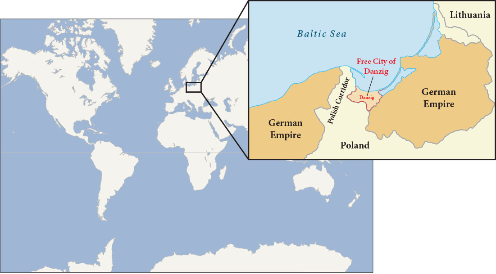
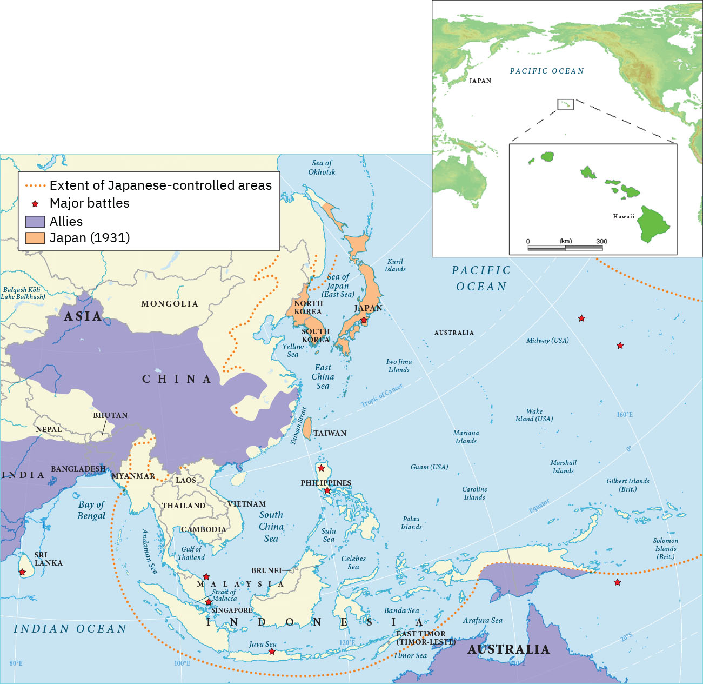

= 2-04. 国际秩序 (二战)
:toc: left
:toclevels: 3
:sectnums:
:stylesheet: ../../myAdocCss.css

'''

== 二战过程

=== 为获得”生存空间”, 德国吞并波兰, 二战正式开始 (1939.9)

To the east of Germany, the Treaty of Versailles had created an independent Poland and *awarded* (v.)授予，颁发；判给，裁定 parts of Germany *to* Poland in the process. This “Polish Corridor 通道，过道；（一国领土通过他国境内的）走廊；狭长地带,” in an area where many Polish people already lived, was intended to give Poland access to a port 港口, and the German city of Danzig (Gdańsk), bordering (v.)和…毗邻；与…接壤 it, was made a semi-independent city-state 城邦 with its own parliament. Poland was a prime target of the Nazis as they looked for Lebensraum （德）生存空间.

[.my2]
在德国东部，"凡尔赛条约"建立了一个独立的波兰，并在此过程中将德国的部分领土划归波兰。这条“波兰走廊”位于许多波兰人已经居住的地区，旨在让波兰能够进入一个港口，而与其接壤的德国城市"但泽"（Gdańsk）则成为一个半独立的城邦，其自己的议会。 波兰是纳粹寻找"生存空间"的首要目标。

[.my1]
.title
====
.Polish Corridor
波兰走廊.

[.my3]
[options="autowidth" cols="1a,1a"]
|===
|Header 1 |Header 2

|地理位置
|是德国在1919年根据凡尔赛条约割让予波兰的一块狭长领土，现在是波兰的领土. 在北端，走廊的宽度仅仅有40公里长，将"东普鲁士"与德国其他领土分开。

image:/img/Polish Corridor.png[,80%]

image:/img/Gdansk.png[,100%]

重要港口"但泽"（今"格但斯克"）的居民绝大多是德国人，如果公投，必然导致它归于德国，于是国际联盟在没有准许公投的情况下，把该港变为受它保护的"但泽自由市"。 +
不过为了减少对"但泽"的依赖，波兰在附近建立了新的海港"Gdynia 格丁尼亚"。

|其存在的目的
|当时领土分配是基于三项考虑, 其中之一是: 政经原因. 波兰人认为，**如果新独立的波兰没有延伸至波罗的海的海岸线，他便会在经济、以至政治上依赖德国。**英国与法国都希望借着波兰来制衡德国，故支持。

|对德国的影响
|- 由于德国领土被一分为二，东普鲁士的经济发展被严重阻碍。
- 所有二战前的德国政府，都拒绝根据凡尔赛条约下的德国东部边界。
|===

.Lebensraum
生存空间.源自德国地理学家"拉采尔", 提出的"国家有机体"学说. 他利用生物学概念, 与当时流行的"社会达尔文主义"结合，

====

Access to the Sea. The twenty-mile-wide Polish Corridor was meant to give Poland access to a port after World War I, separating two parts of Germany in order to do so.

[.my2]
出海通道。二十英里宽的波兰走廊, 原本是为了让波兰在第一次世界大战后能够进入港口，从而将德国分为两部分。

The lessons learned from Hitler’s violation （对法律、协议、原则等的）违背，违反 of the Munich Pact 慕尼黑公约 spurred （尤指用马刺）策（马）加速;鞭策；激励；刺激；鼓舞 Britain and France to take action to protect Poland.

They have also been invoked 援引，援用（法律、规则等作为行动理由） by world leaders ever since 从那时起一直, whenever the aggression of one nation threatens (v.) ① the sovereignty 主权，最高统治权，主权国家 or ② the territorial integrity (完整；完好)领土完整 of another. Using the example of Munich to warn against _the perils 事故；风险 of allowing one nation to invade another without opposition_, whether it be Hitler’s Germany or Putin’s Russia, is known as invoking 提及，援引（某人、某理论、实例等作为支持） the Munich Analogy 类比；比拟；比喻.

[.my2]
希特勒违反"慕尼黑条约"的教训, 促使英国和法国采取行动, 保护波兰。 +
从那时起，每当一个国家的侵略威胁到另一个国家的主权或领土完整时，世界领导人就会援引这些原则。以慕尼黑事件为例来警告，不管一个国家是希特勒的德国, 还是普京的俄罗斯，允许一个国家侵略另一个国家而不反对它, 是很危险的，这被称为"援引慕尼黑类比"。

The key to whether Germany could *be boxed (v.) in* 围困；拦挡;阻挡；阻碍 was the attitudes of Stalin and the Soviet Union 苏联. As early as the summer of 1938, Stalin began to think of making some sort of deal with Germany.

[.my1]
.title
====
.box (v.) sb/sth ˈin
(1)to prevent sb/sth from being able to move by surrounding them with people, vehicles, etc. 围困；拦挡 +
• Someone had parked behind us and boxed us in.有人把车停在我们后面，困住了我们。

(2)[ usually passive] ( of a situation处境 ) to prevent sb from doing what they want by creating unnecessary problems 阻挡；阻碍 +
• She felt boxed in by all their petty rules.她觉得被他们的琐碎规章束缚住了手脚。

====

Stalin, aware of Hitler’s musings (n.)沉思；冥思；冥想 in his book _Mein Kampf_ 我的奋斗, understood the long-term threat Germany posed and sought to buy time to prepare for possible war. For his part, Hitler wanted to avoid Germany’s World War I mistake of fighting on two fronts simultaneously 同时地. The result was _the German- Soviet Nonaggression 不侵略，不侵犯 Pact_ of August 23, 1939.

In this pact, Germany and the USSR agreed not to attack one another or to assist other nations in attacking the other. Included in the agreement were secret protocols (n.)条约草案；议定书；（协议或条约的）附件 that essentially 本质上，根本上；大体上，基本上 divided eastern Europe between Germany and the Soviet Union. Lithuania, Latvia, Estonia, and parts of eastern Poland were allocated (v.)拨…（给）；划…（归）；分配…（给） to the USSR as a reward for cooperating with Germany in the dismemberment 肢解；分割 of Poland.

Seeing the pact 条约，协议，公约 as an ominous (a.)预兆的，不吉利的 green light 准许；许可；绿灯 for a German eastward thrust 猛推；刺；戳；插, 强攻，挺进, two days later Britain signed a mutual defense agreement with Poland.

[.my2]
====
德国能否被围困，关键在于斯大林和苏联的态度。早在1938年夏天，斯大林就开始考虑与德国达成某种协议。斯大林从希特勒的著作《我的奋斗》中, 认识到德国将构成长期威胁，并寻求争取时间, 为可能的战争做好准备。

就希特勒而言，他希望避免德国在一战中"同时在两条战线上作战"的错误。结果就是 1939 年 8 月 23 日签订了"德苏互不侵犯条约"。

在该条约中，德国和苏联同意互不攻击，也不协助其他国家攻击对方。该协议中包含的秘密协议, 基本上将东欧划分为德国和苏联。立陶宛、拉脱维亚、爱沙尼亚, 和波兰东部部分地区, 被分配给苏联，作为"与德国合作来瓜分波兰"的奖励。

两天后，英国与波兰签署了共同防御协议，该协议为德国东进打开了不祥的绿灯。
====

image:/img/German- Soviet Nonaggression Pact 2.webp[,50%]

image:/img/German- Soviet Nonaggression Pact.webp[,100%]

All things seemed ready for the German onslaught (n.)攻击；猛攻, which was launched on September 1, 1939. Britain and France fulfilled 实现；完成；履行，执行；使满足 their commitment to Poland and declared war #on# Germany, forming the partnership 伙伴关系;合作关系；合作 known as the Allies, but not #on# the Soviet Union.

About two weeks later, Soviet forces invaded Poland from the east. Crushed from two sides, Poland essentially ceased （使）停止，终止，结束 to exist. The European fires of World War II had been ignited.

[.my2]
1939 年 9 月 1 日， 德国发起猛烈的进攻，一切似乎都准备好了。英国和法国履行了对波兰的承诺，向德国宣战，形成了被称为"同盟国"的伙伴关系，但没有对苏联宣战。 +
大约两周后，苏联军队从东部入侵波兰。波兰从两侧被压垮， 基本上不复存在。第二次世界大战的欧洲战火已被点燃。

[.my1]
.title
====
.onslaught
-> on,在上，向上，-slaught,攻击，屠杀，词源同slay,slaughter.
====

'''

=== 法德边境, 静坐战争 (1939-1940冬)

The British quickly discovered there was no practical 真实的，实际的；（计划、方法等）切实有效的，切实可行的 way to render (v.)使成为，使处于某种状态；给予，提供 much assistance 帮助，援助 to the Poles. Instead, they relied on the French to engage 与……交战，开战;与…建立密切关系；尽力理解 the Germans. But the French felt they could not sustain (v.)维持，保持 an offensive (n.)（军事）进攻，攻势 against Germany’s western front. They preferred to prepare their defenses for an eventual (a.)最终的，结局的 German offensive against France. Britain joined the French by deploying 部署，调度（军队或武器） the British Expeditionary 远征的；探险的；讨伐的 Force (BEF) to defend the French-Belgian border. By then, Poland was already lost and had been *folded 把…调入；拌入 into* Hitler’s plans of dominating 支配；统治 Europe.

[.my1]
.title
====
.render
[ VN-ADJ] ( formal ) to cause sb/sth to be in a particular state or condition 使成为；使变得；使处于某状态 +
SYN make +
• to render sth harmless/useless/ineffective 使某事物无害╱无用╱无效

(v.)~ sth (to sb/sth) | ~ (sb) sth :( formal ) to give sb sth, especially in return for sth or because it is expected 给予；提供；回报
[ VNVNN]
• to render a service to sb 给某人提供服务

.fold (v.) sth in |fold sth into sth
( in cooking 烹饪 ) to add one substance to another and gently mix them together 把…调入；拌入 +
• *Fold (v.) in* the beaten egg whites. 调入打好的蛋白。

====

During the winter of 1939–1940, little action took place on the French-German border *save for* 除……之外;保存；存盘 a few clashes 冲突 of patrols 巡逻队 and reconnaissance (n.)侦察；勘测 units. That period of waiting has sometimes been *referred to as* 被称为 _the Phony 伪造的，假的 War_ or, derisively 嘲弄地；嘲笑地, as the sitzkrieg 胶着战；长期战 (“sitting war”).

[.my2]
英国人很快发现, 没有切实可行的方法能向波兰人提供大量援助。取而代之，他们依靠法国人来与德国人交战。 但是法国人觉得他们无法维持对德国西线的进攻。他们更愿意为德国对法国的最终进攻做好防御准备。英国加入了法国的行列，部署了英国远征军（BEF）来保卫法国和比利时的边界。那时，波兰已经失守，并被纳入希特勒称霸欧洲的计划之中。 +
1939 年至 1940 年冬季，除了巡逻和侦察部队的几次冲突外，法德边境几乎没有什么行动。这段等待时期, 有时被称为“虚假战争”，或者被嘲笑为“静坐战争”。

[.my1]
.title
====
.reconnaissance
-> 来自 re-, 再，重新，con-,表强调，-gn,知道，了解，词源同 know,note.-ss,过去分词格，-ance,名词后缀。 拼写比较 renaissance.引申词义侦察。
====

'''

=== 德国进军挪威, 丹麦 (1940.4.09)

The German advance (n.) westward began with some forays 突袭，短暂的尝试;（改变职业、活动的）尝试 into Norway and Denmark to the north on April 9, 1940. Not wanting to provoke (v.)激起；引起;挑衅；激怒 German invasions, both Belgium and the Netherlands declared neutrality (n.)中立，中立状态. This disadvantaged (v.)使处于不利地位 the British and French, since they were then not allowed to coordinate 协调，配合 defenses with Dutch and Belgian forces or station  (v.)派驻；使驻扎 troops in their territory  领土，版图，领地.

[.my2]
德国向西进军, 始于 1940 年 4 月 9 日对北部的挪威和丹麦的进攻。为了避免德国的入侵，比利时和荷兰都宣布中立。这使英国和法国处于不利地位，因为他们不被允许与荷兰和比利时军队协调防御，也不允许在他们的领土上驻军。

[.my1]
.title
====
如果开头写成 The Germans' advance (n.) westward ... 也是正确的.
两种表达的比较： +
The German advance westward: 这是"名词短语"作主语，强调的是“德国的推进”这个动作本身。 +
The Germans' advance westward: 这是"所有格形式的名词短语"作主语。, 强调的是“德国人”这个主语，是他们发起了向西的推进。
====

'''

=== 奥斯威辛集中营 (1940.4)

Auschwitz in western Poland was the largest of the death camps, originally constructed in 1940 to hold Polish political prisoners. It became a death camp in 1941 when Polish and Soviet prisoners were executed there.

That same year, a new camp (known as Auschwitz II or Birkenau) was built nearby. Its main purpose was to kill Jewish people who were brought on freight (n.)（海运、空运或陆运的）货物；货运 trains from all over Europe. Other camps also existed at Auschwitz, including labor camps where prisoners worked for the chemical company I.G. Farben.

[.my1]
.title
====
.freight
[ U]goods that are transported by ships, planes, trains or lorries/trucks; the system of transporting goods in this way （海运、空运或陆运的）货物；货运 +
• to send goods by air freight空运货物 +
• a freight business货运公司 +
====

Some 1.3 million people were sent to Auschwitz-Birkenau before Heinrich Himmler 人名 , the leader of the SS 党卫队, ordered the camp closed and evacuated in January 1945 as the Soviet army rapidly *advanced （为了进攻、威胁等）前进，行进 on* it. Of these 1.3 million, 1.1 million would die there. The vast majority, nearly one million, were Jewish (a.)犹太人的.

[.my2]
====
波兰西部的"奥斯威辛集中营"是最大的死亡营，最初建于 1940 年，用于关押波兰政治犯。 1941 年，波兰和苏联囚犯被处决，这里成为死亡营。

同年，附近建立了一个新营地（称为"奥斯威辛二号"或"比克瑙"）。其主要目的是杀害从欧洲各地通过货运火车运来的犹太人。奥斯威辛集中营还存在其他营地， 包括劳改营，囚犯在那里为化学公司I.G.法本（I.G. Farben）工作。

1945 年 1 月，随着苏联军队迅速向该集中营推进，党卫军领导人海因里希·希姆莱(Heinrich Himmler) 下令关闭并清空该集中营. 而在此之前，有约 130 万人被送往奥斯威辛-比克瑙集中营。这130万人中，有110万人会死在那里。其中绝大多数（近百万）是犹太人。
====

[.my1]
.title
====
.The vast majority were Jewish(a.).
在英语中，形容词有时可以充当名词，尤其是在指代一类人时。这里 "were Jewish" 使用形容词 Jewish 是为了指代“犹太人”这一群体。这种用法被称为 adjectival noun，在上下文清晰的情况下，形容词作为补语或谓语补充信息，可以不需要显性名词。例如： +
The rich 表示“有钱人” +
The elderly 表示“老年人” +
在你的例子中，Jewish 作为形容词已经足够明确地指代“犹太人”群体，不需要额外的名词。
====

'''

=== 德国进军法国 (1940.5)

The Germans then launched their full westward offensive on May 10, 1940. Within *a matter of* 只有几个小时、几分钟（或几英寸、几米等）之多；不多于 weeks, German troops had overrun 泛滥；横行；肆虐 western Europe, storming 突袭；攻占 through the Netherlands, Luxembourg, and Belgium and into France, avoiding the Maginot 马其诺 Line, a system of fortifications 防御工事 and weapons installations 设施；装置 that had been built on the French border in the 1930s in order to protect France from another German invasion.

[.my2]
1940年5月10日，德国人开始全面向西进攻。在几周内，德国军队占领了西欧，突袭了荷兰、卢森堡和比利时，进入法国，避开了马其诺防线。马其诺防线是20世纪30年代为保护法国免遭德国再次入侵而, 在法国边境修建的防御工事和武器设施系统。

'''

=== 英法 敦刻尔克撤退, 保留住军队主力 (1940.6)

Early in the morning of May 23, 1940, the British commander in France, seeing the perils 严重危险;祸害；险情 of his position, gave the order to begin a withdrawal toward Dunkirk on the French coast. Eventually, this *culminated (v.)（以某种结果）告终；（在某一点）结束 in* the extraordinary (a.)异乎寻常的，令人惊奇的；非凡的，卓越的 #evacuation# 撤离，疏散 across the English Channel #of# much of the BEF and thousands of French and other Allied forces between June 15 and 25 using every British boat capable of crossing the Channel. The retreat saved 200,000 troops.

[.my2]
1940年5月23日清晨，在法国的英国指挥官，看到了自己的处境的危险，下令开始向法国海岸的敦刻尔克撤退。最终，6 月 15 日至 25 日期间， 英国远征军的大部分人员, 以及数千名法国和其他盟军部队, 使用每艘能够穿越英吉利海峡的英国船只， 从英吉利海峡进行了非同寻常的疏散。这次撤退拯救了20万军队。(保存有生力量，而不是像国民党在淞沪会战中被日军吃掉精锐主力)

[.my1]
.title
====
.culminate
(v.) ~ (in/with sth) : ( formal ) to end with a particular result, or at a particular point（以某种结果）告终；（在某一点）结束 +
- Months of hard work culminated (v.) in success.几个月的艰辛工作终于取得了成功。 +
-> 来自拉丁语culmen,顶点，词源同hill,column.
====

'''

=== 贝当出任法国总理, 与德国合作 (1940.6)

French prime minister Paul Reynaud resigned rather than sign the armistice 停战，休战；休战协议 agreement with Germany in June 1940. Instead, Marshall Philippe Pétain, a hero of World War I, became the prime minister of a truncated 截短，缩短，删节（尤指掐头或去尾） French government based in Vichy 城市名, France, that, although nominally (ad.)名义上地；有名无实地independent, cooperated with Germany.

[.my2]
1940 年 6 月，法国总理保罗·雷诺, 没有与德国签署停战协定，而是选择辞职。取而代之，第一次世界大战英雄菲利普·贝当元帅, 出任法国维希政府的总理. 这个政府虽然名义上是独立的，但与德国合作。
[.my1]

.title
====
.truncate
[ VN][ usually passive] ( formal ) to make sth shorter, especially by cutting off the top or end 截短，缩短，删节（尤指掐头或去尾）
•My article was published in truncated form. 我的文章以节录的形式发表了。
====

'''

=== 德意日 <三国公约> (1940.9)

The remarkable success of the German blitzkrieg 闪电战；突然袭击 in Europe during the summer of 1940 presented 把…交给；颁发；授予 the Japanese military with some significant strategic opportunities. For instance, the isolation of European colonies in Asia might make them ripe (a.)(水果或庄稼)成熟的,时机成熟的；适宜的 for seizing. Consequently, to provide for mutual defense and perhaps to frighten (v.)使惊吓，使惊恐 the United States away from giving more substantial assistance 实质性协助 against them, Japan joined Germany and Italy in the defensive military alliance 防御性军事同盟 called the Tripartite (a.)由三部分组成的；分成三部分的；三方的 Pact in September 1940.

(Japan and Germany had earlier signed the Anti-Comintern 共产国际 Pact against the Soviet Union, which Japan saw as a rival 竞争对手，敌手 for dominance (n.)优势，支配地位 in Asia, in 1936, and Italy had joined in a year later. Japan had *parted (v.)离开；分别 ways with* 离开；分手；断绝关系  Germany in 1939, however, when the German-Soviet Nonaggression Pact was signed, and a new agreement was thus in order 为了达到特定的目标或结果.)

[.my2]
1940 年夏天，德国在欧洲的闪电战取得了巨大成功，为日本军队提供了一些重要的战略机遇。例如， 欧洲在亚洲的殖民地被孤立，可能会让它们成为被夺取的时机。因此，为了提供共同防御，或许也是为了吓唬美国，使其不再向他们提供更多实质性援助，日本于 1940 年 9 月与德国和意大利一起组成了防御性军事联盟，称为“三国公约” 。 +
(早在1936年，日本和德国曾签署了反共产国际协定, 以对抗苏联——日本认为苏联是其在亚洲称霸的竞争对手，而意大利则于一年后加入。然而，在1939年德国与苏联签署《德苏互不侵犯条约》后，日本与德国分道扬镳，因此需要达成一项新的协议。)

'''

=== 英德空战 (1940 秋), 使德国终究无法入侵英国本土

Hitler planned *to finish off* 杀死，彻底摧毁（已严重受伤或受损的人或事物） Britain with a cross-channel invasion using air and submarine bases in both Norway, which had surrendered 投降，让与；屈服 in June  六月 1940, and northern France. Through the late summer and into the fall of 1940, the Battle of Britain raged  六月 in the skies over Britain as a duel 决斗 between the German Luftwaffe 纳粹德国空军 and the Royal Air Force (RAF). The Germans initially *focused* their attacks *on* shipping (n.)（总称）船舶；航运，运输；运费 in the English Channel and then began to bomb (v.) weapons-production facilities 设施；工具，设备.

Aided 帮助 in part by the innovation of radar, which gave some advance 预先的；事先的 warning of German onslaughts 攻击；猛攻, the RAF prevailed 获胜.

[.my1]
.title
====
.prevail
-> pre-,在前，领先，-vail,价值，.力量，词源同avail,value.即在力量上超过，胜利，引申词义盛行，流行等。
====

When the Luftwaffe shifted its focus from military to civilian targets, particularly the bombing of London, it inadvertently 无意地，不经意地 gave the British the opportunity to rebuild their airfields  飞机场 and defense plants 工厂 and assemble (v.)装配；组装 more planes.

[.my2]
希特勒计划利用 1940 年 6 月投降的挪威和法国北部的空军和潜艇基地，通过跨海峡入侵, 来消灭英国。 从夏末, 到 1940 年秋天，不列颠之战在英国上空激烈进行，是德国空军和英国皇家空军(RAF) 之间的对决。德国人最初将攻击重点放在英吉利海峡的航运上，然后开始轰炸武器生产设施. 英国皇家空军取得了胜利，这在一定程度上得益于雷达的创新. 当德国空军将重点从军事目标, 转向民用目标时，特别是对伦敦的轰炸，无意中给了英国人重建机场和国防工厂, 以及组装更多飞机的机会。

'''

=== 德国空军失败后, 德国转向用潜艇封锁英国 (1940夏开始)

With the Luftwaffe struggling 奋斗；努力；争取 in the summer of 1940, `主` the responsibility 责任，负责 for subduing (v.)制伏；征服；控制 England `谓` increasingly fell to the German submarine fleet, on the theory that England could be starved 挨饿，饿死 to death.

[.my2]
1940 年夏天，德国随着其空军陷入困境，征服英国的责任越来越多地落到了德国潜艇舰队身上，因为他们认为英国可能会被封锁饿死。

'''

=== 美国的战略, 先击败意大利和德国, 再对付日本 → D计划 (欧洲优先, 1940)

Britain and the United States planned early in the war *to focus on* defeating 击败；战胜 Italy and Germany before Japan but left the Soviet Union to battle Germany alone.

Beginning in 1938 and through the spring of 1941, U.S. military leaders produced several plans of action *in the event of* 万一,如果（某事）发生 war with the Axis powers. Immediately 立即，马上 after winning an unprecedented  前所未有的，史无前例的 third term in 1940, Roosevelt was briefed (v.)给（某人）指示；向（某人）介绍情况;向（辩护律师）提供案情摘要 by his _chief 首要的，主要的;领袖，首领 of naval operations_ 海军作战部长, Admiral Harold R. Stark, who advised him that the best military strategy was “Plan D” —a Europe First plan. This *focused* the United States and Britain *on* defeating Germany and Italy first and adopting 采纳，采用 a defensive posture （坐或立的）姿势；态度，立场 against Japan if it entered the war.

[.my2]
英国和美国在战争初期, 计划集中精力在日本之前先击败意大利和德国，但让苏联只与德国作战。 +
从 1938 年开始一直到 1941 年春，美国制定了数项对轴心国的行动计划。 1940 年史无前例地赢得第三个任期后，罗斯福立即听取了海军作战部长"哈罗德·R·斯塔克"上将的简报，后者建议他最好的军事战略是“D 计划”——欧洲优先计划。这使得美国和英国的重点, 是首先击败德国和意大利，如果日本参战，则对日本采取防御姿态。

'''

=== 苏联的备战 (1939-1941)

The defeat 击败，战胜 of Poland removed a buffer 起缓冲作用的人（物） between German-occupied and Soviet territory. When Germany invaded Poland on September 1, 1939, Stalin began to take steps to prepare the USSR for what might happen next.

At the end of 1939, he launched the “Winter War” against Finland to obtain territory near Leningrad 列宁格勒 (the city formerly known as St. Petersburg or Petrograd) that would bolster 增强，激励；巩固（地位） Soviet defenses.

image:/img/Leningrad.webp[,100%]

In April 1941, the Soviets signed a Neutrality 中立，中立状态 Pact with Japan, freeing both nations from the prospect 可能性；希望;前景；展望；设想 of a multiple-front war.

The Kremlin 克里姆林宫 in Moscow received _a continuous stream 小河，小溪；一连串，源源不断（的事情) of_ intelligence warning of an impending 即将发生的，逼近的；悬挂的 invasion. After receiving one such report outlining 概述，略述；勾勒，描画……的轮廓 German battle plans, Stalin called up 召集；召唤 half a million reservists 预备役军人；后备军战士. Yet, fearing to provoke 激起，激励，刺激；挑衅 the Germans into action, he was cautious (a.)小心的，谨慎的 with his forces.

[.my2]
====
波兰的失败, 消除了德国占领区和苏联领土之间的缓冲区。 1939 年 9 月 1 日德国入侵波兰时，斯大林开始采取措施, 让苏联做好应对接下来可能发生的事情的准备:

1939年底，他对芬兰发动了“冬季战争”， 以获得"列宁格勒"（该城市以前称为"圣彼得堡"或"彼得格勒"）附近的领土，以加强苏联的防御。

1941 年 4 月，苏联与日本签署了中立条约，使两国摆脱了多线战争的前景。

莫斯科克里姆林宫不断收到有关即将发生入侵的情报警告。在收到一份概述德国作战计划的报告后，斯大林召集了五十万预备役军人。 然而，由于担心激怒德国人采取行动，他对使用自己的部队非常谨慎。
====

'''

=== 意大利入侵非洲, 英国反击, 德国帮忙意大利 (1940-1941)

Mussolini decided to expand his African holdings and in August 1940 occupied British Somaliland 地名, threatening the British in Egypt. The British counterattacked 反击，反攻. Losing ground in Africa from June through December 1940, Mussolini turned his eyes on 把目光转向 the Balkans 巴尔干半岛地区. In October 1940, expecting 期待,企盼 an easy victory, Italian units invaded Greece but were badly defeated.

image:/img/Somaliland 2.webp[,48%]
image:/img/Somaliland.jpg[,48%]

[.my1]
.title
====
.Balkans
巴尔干半岛.

[.my3]
[options="autowidth" cols="1a,1a"]
|===
|Header 1 |Header 2

|地理位置
|- 用以描述欧洲的东南隅位于"亚得里亚海"和"黑海"之间的陆地. 约55万平方公里. 目前，广义的巴尔干半岛共有11个国家，总面积为47.6万平方公里.
- 南临地中海重要航线，东有”博斯普鲁斯海峡“和”达达尼尔海峡“， 扼黑海的咽喉，战略位置极为重要。
- 南欧相邻地中海的三大半岛，从东向西分别为: 巴尔干半岛、意大利半岛（亚平宁半岛）、伊比利亚半岛。

image:/img/Balkan_Peninsula.png[,50%]

|名称来历
|该地区的名称, 来自于巴尔干山脉。

|现有国家
|大部分现有的巴尔干民族国家, 出现于19世纪到20世纪初。他们分别从"奥斯曼帝国"或"奥匈帝国"独立后，成为独立国家。

|相关术语
|南斯拉夫在1991年解体，从此“巴尔干”一词开始带有负面意义，如“Balkanisation /Balkanization *巴尔干化*”。*意思是: 一个较大的国家或地区, 分裂成较小的国家或地区的过程，这些国家或地区关系紧张, 甚至处于敌对状态.*

下图是奥匈帝国位置: +
image:/img/Austro-Hungarian Empire.webp[,100%]

|===

====

To forestall (v.)预先阻止；在（他人）之前行动；先发制人 further disaster  灾难，灾害；祸患, Hitler dispatched 派遣；调遣；派出 General Erwin Rommel and his Afrika Korps 非洲军团 to duel (v.)决斗 with the British in northeast North Africa. *Not only* did Germany wish to support its Italian ally, *but it also* sought 寻求 to gain control of the Suez Canal and guarantee (v.)确保，保证；担保 its access to Middle Eastern oil, which would be crucial 至关重要的；关键性的 in winning the war. To further aid (v.) his faltering 不太有效的，不太成功的;踌躇的，犹豫的；摇晃的，蹒跚的； ally and deal with an anti-German uprising 起义，暴动；升起 in Yugoslavia 南斯拉夫, Hitler postponed (v.)延迟；延期；展缓 his invasion of the Soviet Union by several weeks and invaded Greece on April 6, 1941.

[.my2]
墨索里尼决定扩大其非洲领土，并于 1940 年 8 月占领"英属索马里兰"，威胁埃及的英国人。英国人发起反击。 1940 年 6 月至 12 月，墨索里尼在非洲节节败退，他将目光投向了巴尔干地区。 1940 年 10 月，意大利军队本以为能轻松获胜，于是入侵希腊，但遭到惨败。 +
为了防止进一步的灾难，希特勒派埃尔文·隆美尔将军和他的非洲军团, 在北非东北部与英国人决斗。德国不仅希望支持其盟友意大利， 还寻求控制苏伊士运河, 并保证其获得中东石油，这对赢得战争至关重要。为了进一步援助他摇摇欲坠的盟友(意大利), 并应对南斯拉夫的反德起义，希特勒将入侵苏联的时间推迟了几周，并于 1941 年 4 月 6 日入侵希腊。

[.my1]
.title
====
.Yugoslavia
image:/img/Yugoslavia.png[,50%]

[.my3]
[options="autowidth" cols="1a,1a"]
|===
|Header 1 |Header 2

|存续时间
|是1918年至2003年, 存在于南欧"巴尔干半岛"上的国家。

|历史
|- 冷战期间，约瑟普·布罗兹·铁托领导下的南斯拉夫, 并不投靠美国或苏联任何一方，参与组建了不结盟运动。
- 1963年随着新宪法颁布，"地方自治权"逐渐扩大. 之后, 各共和国权力提升。使得各个共和国离心力增强。
- 1991年至1992年间，除了"塞尔维亚"和"黑山"之外的其他民族国家, 纷纷从南斯拉夫独立，原联邦政体也因此而逐渐解体。
- 塞尔维亚和黑山两国, 在1992年重新组织成立了"南斯拉夫联盟共和国"，希望能够成为原联邦的继承者。然而由于新边界的划分问题，导致了前南各国之间, 爆发了连续十年之久的南斯拉夫内战。
- 在2003年南斯拉夫联盟共和国, 重组成为更为松散的邦联，并易名为"Serbia and Montenegro 塞尔维亚和黑山"，南斯拉夫也随之成为历史名词。

|===

.postpone
-> post-后 + -pon-放置 + -e → 把事情向后方
====

'''

=== 德国入侵苏联 (1941.6) → 巴巴罗萨行动

Betraying the German-Soviet Nonaggression Pact, he assembled 聚集；集合；收集 the largest land-invasion force in world history, more than three million troops, including contributions from countries with their own grievance 不满，不平;委屈，冤情 against the Soviet Union such as Finland, Romania, Hungary, Yugoslavia, Italy, Slovakia, and Spain. Operation Barbarossa began on June 22, 1941, leading the Soviet Union to formally join the Allies in opposing 反对（计划、政策等）；抵制；阻挠 Germany.

[.my2]
(希特勒)他背叛《德苏互不侵犯条约》，组建了世界历史上规模最大的陆地入侵部队，超过300万军队，其中包括芬兰、罗马尼亚、匈牙利、南斯拉夫、意大利、斯洛伐克和西班牙等对苏联有不满的国家的军队。巴巴罗萨行动于1941年6月22日开始，导致苏联正式加入同盟国对抗德国。

[.my1]
.案例
====
.Operation Barbarossa
巴巴罗萨行动. 是德国入侵苏联所使用的作战代号. 行动于1941年6月22日展开.

====

The speed of the German attack was greater than anticipated 预期，预料, and within weeks, Belorussia 白俄罗斯, Lithuania, Latvia, and Estonia had been occupied by the German army, which was called the Wehrmacht 国防军（纳粹德国） (“defense power”).

By August, the Germans had captured Kyiv 基辅(乌克兰首都), an industrial center that contained a large portion （某物的）一部分； of the Soviet economic infrastructure 基础设施 at that time. By November, Hitler had gone farther into Russia than Napoleon had. The German army stood at the gates of Leningrad, on the outskirts 市郊，郊区 of Moscow, and on the Don River 顿河.

[.my2]
德国进攻的速度比预想的要快，几周之内， 白俄罗斯、立陶宛、拉脱维亚, 和爱沙尼亚, 就被德国军队占领，这支军队被称为国防军（“国防力量”）。 +
到八月，德国人占领了基辅，这是一个工业中心，其中包含了当时苏联大部分经济基础设施。到了十 一月，希特勒已经比拿破仑更深入地进入俄罗斯了。德军驻扎在"列宁格勒"城门、"莫斯科"郊区, 和"顿河"河畔。

image:/img/Moscow.jpg[,100%]

[.my1]
.案例
====
.St.Petersburg
圣彼得堡，旧名彼得格勒、列宁格勒，是俄罗斯的联邦直辖市.  +
1712-1918年间, 为俄罗斯帝国的首都. +
为俄罗斯在"波罗的海"一带的重要港口和军事基地。

"圣彼得堡"是"波罗的海舰队"的根据地，也是俄罗斯在"波罗的海"沿岸的唯一军港. 然而俄罗斯海军一旦从"圣彼得堡"出港，会面临芬兰、爱沙尼亚、拉脱维亚、立陶宛、瑞典、丹麦、波兰等国北约军队的围堵，相较于"摩尔曼斯克"与"海参崴"等少有敌人威胁的港湾，不适合以海军力量进行突破.

image:/img/St.Petersburg.jpg[,100%]

.Murmansk
摩尔曼斯克. 港口终年不冻. +
北部港口"北摩尔曼斯克"为俄罗斯最重要核潜艇基地，受北大西洋暖流作用，该港是俄为数不多终年不冻港，亦为北方舰队司令部。

image:/img/Murmansk.jpg[,100%]

.Vladivostok
海参崴. 是俄罗斯太平洋沿岸最大的港口. 俄罗斯"太平洋舰队"的司令部所在地. +
符拉迪沃斯托克, 是仅次于"哈巴罗夫斯克"（伯力）的俄罗斯远东地区第二大城市.

1860年，清朝与俄罗斯帝国签订《中俄北京条约》，将该地割让给俄国.

image:/img/Vladivostok.jpg[,100%]

====

But serious problems arose (v.) that came back to haunt the Germans. The speed of the advance had strained (v.)尽力；竭力；使劲;过度使用；使不堪承受 the delivery 递送，投递 of supplies. The force advancing on Moscow needed nearly thirty train shipments 运输；运送；装运;运输的货物 of fuel each day to maintain its pace, but by November, it was receiving only three. In August, a shortage of clean water had spread dysentery  痢疾 and cholera 霍乱 among the troops. When the late summer rains came, German soldiers found that they could neither drive fast (because of mud) nor keep themselves and their equipment dry. Once the Russian winter began, it became so cold that bread rations （食品、燃料等短缺时的）配给量，定量;（给战士或食品短缺地区的人提供的）定量口粮 froze and had to be chopped into portions with axes 斧头.

[.my2]
但严重的问题再次困扰着德国人。前进的速度, 使得"物资的运送"变得紧张。向莫斯科挺进的部队, 每天需要近三十列火车运送燃料, 才能维持其速度，但到了 11 月，它只收到了三列。八月份，由于清洁水的短缺，痢疾和霍乱在部队中蔓延。当夏末的雨来临时，德国士兵发现他们既不能开快车（因为泥泞）， 也不能保持自己和装备干燥。俄罗斯的冬天一开始，天气就变得非常寒冷，口粮面包都结冰了，必须用斧头切成小块。

[.my1]
.案例
====
.dysentery
-> dys-, 不好的。-enter, 肠，词源同enteritis.

痢lì疾
[.my3]
[options="autowidth" cols="1a,1a"]
|===
|Header 1 |Header 2

|症状
|指的是导致**带血的腹泻的"肠胃炎"**，具体说主要是"肠（特别是大肠）发炎"。 +
其他的症状有: **发热、腹痛、"里急后重"(形容便秘时的一种症状。患者感觉急需大便, 而无法顺利排出；可用16个字概括：“腹痛窘迫，时时欲便。肛门重坠，便出不爽”。)等，脱水**为最常见的并发症。

|病原体
|依传染性的致病生物体不同, 而分为"细菌性"痢疾、"阿米巴"痢疾，也有其他更少数的病因。

|传播途径
|痢疾“病从口入”，**一般和被粪便污染的食品和水源有关，**可以通过洗手、煮熟食物等食品安全措施防止。
|===

.cholera
霍乱.
[.my3]
[options="autowidth" cols="1a,1a"]
|===
|Header 1 |Header 2

|症状
|典型症状为连续数日**"严重水泻"**。可能合并有"呕吐"、"肌肉抽搐"的现象.

|病原体
|是由"霍乱弧菌"的某些致病株, 感染小肠, 而导致的"**急性腹泻**疾病"。

|传播途径
|霍乱弧菌, 最主要通过被"含有该细菌的人类粪便, 污染的水或食物"传播. +
未经彻底烹饪的海鲜也是一个常见的传播途径。
|===
====

The siege of Leningrad lasted 872 days and was one of the longest and deadliest 最致命的 in world history. In early 1942, nearly 100,000 people in the city starved to death each month, and some of the remaining residents resorted (v.)求助于，诉诸于 to cannibalism (n.)食人；嗜食同类；残忍的行为 to survive. Overall, a million and a half people perished (v.)死亡；毁灭. Facing this, Stalin seems to have momentarily  片刻地，短暂地 faltered 蹒跚；摇晃；犹豫；畏缩. By the end of 1941, his head of security was instructed to send feelers 触角，触须;试探者 to the Germans through _the Bulgarian (a.)保加利亚（人）的 ambassador to Moscow_, broaching 开始谈论，引入（尤指令人尴尬或有异议的话题） the possibility of peace.

[.my2]
"列宁格勒"围困持续了 872 天，是世界历史上持续时间最长、伤亡最惨重的围困之一。 1942年初，该市每个月有近10万人饿死，一些剩下的居民靠吃人肉来生存。总共有150万人丧生。面对这一点， 斯大林似乎一时动摇了。 1941 年底，他的安全负责人, 奉命通过"保加利亚"驻莫斯科大使, 向德国人发出试探，提出和平的可能性。

[.my1]
.案例
====
.broach
-> 来自拉丁词brocca, 针，刺。原指刺开，挑明话题。最终可能同break.
====

'''

=== 大西洋宪章 (丘吉尔, 罗斯福, 1941.8)

With the war expanding into the plains 平地，平原 of Russia, Churchill requested a face-to-face meeting with Roosevelt, who secretly sailed to Newfoundland in August 1941 for the purpose. This conference was the first of what have since become commonplace (a.)平凡的；普通的；普遍的 events in diplomacy —summit meetings of the heads of state.

The two leaders produced the Atlantic Charter, a recasting  重铸;改动；重组；改写 of the principles articulated (v.)明确表达；清楚说明;用关节连接；联结；铰接 in _Woodrow Wilson_’s Fourteen Points (1918) into eight major points that reflected British and U.S. goals for a postwar world, though 虽然，尽管 not the Soviet Union’s goals for Europe. It insisted on the unconditional surrender of the Axis nations —Germany, Italy, and Japan —renounced (v.)放弃，宣布放弃（权利、地位、信仰等）；断绝关系 any territorial expansion, and affirmed the right of self-determination 民族自决；自我决定. There would be freedom of the seas, reduced barriers to free trade, and promotion  促进，提倡 of social welfare through economic cooperation. Peace would be promoted 促进；推动 through the disarmament 裁减军备 of aggressor nations.

[.my2]
随着战事扩展到俄罗斯平原，丘吉尔要求与罗斯福进行面对面的会面，罗斯福为此于 1941 年 8 月秘密航行至纽芬兰。这次会议, 是后来成为外交领域司空见惯的"国家元首峰会"的第一次会议。 +
两位领导人制定了《大西洋宪章》 ，将伍德罗·威尔逊的十四点（1918）中阐述的原则重新改写为八个要点，反映了英国和美国对战后世界的目标，但不是苏联对欧洲的目标。它坚持轴心国——德国、意大利和日本 ——无条件投降，放弃任何领土扩张行为，并承认"自决权"。令航海自由、降低贸易壁垒、通过经济合作促进社会福利。通过解除侵略国的武装,促进和平。

[.my1]
.案例
====
.Newfoundland

image:/img/Newfoundland.png[,100%]

.renounce
-> re-,向后，往回，-nounc,说话，通知，词源同 announce,denounce.即收回已经说过的话，引申 词义声明放弃，摒弃。
====

'''

=== 德国在占领莫斯科前, 却将军力转向中东和中亚的石油. (1941.8)

In August 1941, given the initial success of the German invasion and poised (v.)保持（某种姿势）；抓紧；使稳定 to capture Moscow, Hitler delayed the advance to decide strategy. The German general staff 全体员工，全体雇员;（军队的）全体参谋人员 wanted to drive directly for Moscow and take it before winter. Hitler, however, *diverted* 使转向；使绕道；转移 a significant 显著的，相当数量的 part of his forces *to* the south.

Both Allied and Axis thinkers had long recognized the strategic military importance of oil. For some time prior 先前的，事先的;在前面的 to the war, the British government had interjected 插话，打断 itself into the politics of Iraq, Persia, Afghanistan, and Egypt for this reason. The Germans too had taken a keen (a.)渴望的，热衷的；着迷的；热情的 interest in the Middle East and central Asia in the 1930s.

[.my2]
1941年8月，鉴于德国入侵取得了初步成功，并准备占领莫斯科，希特勒推迟了进攻，以决定战略。德国总参谋部想直接开车去莫斯科，在冬天来临之前占领它。然而，希特勒却把他的大部分部队调往南方。 +
同盟国和轴心国的思想家, 很早就认识到石油的战略军事重要性。战前一段时间，英国政府也因此插手伊拉克、波斯、阿富汗和埃及的政治。德国人在 20 世纪 30 年代也对中东和中亚产生了浓厚的兴趣。

To block (v.) potential German access to Iranian oil, the British first demanded _the possibly pro-German Shah_ 旧时伊朗国王的称号 expel (v.)把……开除（或除名）；驱逐；排出（空气、水、气体等） Germans and sever (v.)切开；割断;断绝；中断 ties with Berlin. Taking no chances, British and Soviet forces then invaded Iran in August 1941. Iranian (a.) resistence (n.)抵抗，反抗 collapsed in a couple of days, and Reza Shah was forced to abdicate  退位；放弃（责任） in favor of 支持；赞同；偏向于 his son Mohammad Reza Pahlavi. The Germans were expelled 驱逐出境, and the Allied occupation lasted until 1946.

During those years, Iran became a funnel 漏斗 through which much Allied aid, especially from the United States, was delivered  投递，运送 to Stalin as he struggled to hold out 坚持，持续 against the Wehrmacht.

[.my2]
为了阻止德国获得伊朗的石油，英国首先要求可能亲德的国王, 驱逐德国人, 并断绝与柏林的关系。英国和苏联军队不顾一切地于 1941 年 8 月入侵伊朗。几天之内伊朗的抵抗就崩溃了，礼萨·沙阿被迫退位， 让位给他的儿子穆罕默德·礼萨·巴列维。德国人被驱逐，盟军的占领一直持续到 1946 年。 +
在那些年里，伊朗成为一个漏斗，许多盟军的援助，特别是来自美国的援助，通过这个漏斗被运送到斯大林， 当他正在努力抵抗德国国防军时。

By 1939, the global supply of oil was in the hands of seven oil conglomerates 联合大公司；企业集团;合成物；组合物；聚合物 —none of which were German. Consequently, Germany was heavily reliant on Romanian and Soviet oil between 1939 and 1941. The oil fields in the Soviet Republic of Azerbaijan, one thousand kilometers from Stalingrad, looked like a possible solution, so the German army moved to capture (v.)俘获，捕获；夺取，占领 the city of Baku, the center of the Soviet oil-drilling industry. Thus, `主` *both* winter *and* the German drive 驾驶；开车 for oil `谓` saved Moscow.

到 1939 年，全球石油供应, 掌握在七家石油集团手中，里面没有一家是德国石油集团。因此，德国在 1939 年至 1941 年间, 严重依赖"罗马尼亚"和"苏联"土地上的石油。距离斯大林格勒 1000 公里的"阿塞拜疆"苏维埃共和国的油田, 看起来是一个可能的解决方案，因此德军转而去夺取苏联石油钻探工业中心"巴库市"。因此，"冬天的来临"和"德国转向对石油的渴求", 拯救了莫斯科。

[.my1]
.案例
====
.conglomerate
-> con-, 强调。-glom, 球，块，词源同global, agglomerate.
====

'''

=== ★(美国宣战) 美国对日本禁运能源, 日本即启动南进政策 → 美国参战 (1941.12.08)

Trying to pressure the Japanese into ceasing their aggression, in August 1941 the United States imposed sanctions 处罚，惩罚 including an embargo 禁运，贸易禁运 on oil and gas sales to Japan. This action further reinforced 加强；巩固；（使）更结实 Japan’s plan to turn to the South Pacific to absorb the natural resources of the crumbling 破碎的 European imperial regimes （尤指未通过公正选举的）统治方式，统治制度，政权，政体 and the Philippines, a U.S. colony. Seeing the United States as a soft enemy unwilling to make the sacrifices needed to win a war, Japan planned a surprise assault  （军事）袭击，攻击 on the naval base at Pearl Harbor, Hawaii, while last-ditch (a.)作最后努力（或尝试）的；孤注一掷的 efforts at a diplomatic settlement （解决争端的）协议，和解 between Tokyo and Washington were taking place. The United States wanted Japan to ultimately withdraw from China, to which it would not agree, and Japan felt the United States would not be open to further negotiations. Its leaders decided they had to move against 对抗；与……作对 the United States while they still could.

[.my2]
为了迫使日本停止侵略，美国于 1941 年 8 月实施了制裁，禁止向日本销售石油和天然气。日本即向南洋夺取资源.

[.my1]
.案例
====
.regime
1.a method or system of government, especially one that has not been elected in a fair way （尤指未通过公正选举的）统治方式，统治制度，政权，政体 +
• a fascist/totalitarian/military, etc. regime 法西斯、极权主义、军事等政权 +
• an oppressive/brutal regime 压迫民众的╱残暴的政权

2.a method or system of organizing or managing sth 组织方法；管理体制 +
• Our tax regime is one of the most favourable in Europe.我们的税收管理体制是欧洲最受欢迎的税收体制之一。

====

The following day, Congress 美国国会 voted unanimously 全体一致地,无异议地 to declare war on Japan. A few days later, following Germany’s and Italy’s declarations 声明 of war against the United States, the country entered the war in Europe *as well* 也；同样地 on the side of the Allies. Following the attack on Pearl Harbor, China also joined the Allies, but it did not join in the fighting in Europe.

[.my1]
.案例
====
.unanimous
-> un-,一，词源同 unit,-anim,呼吸，词源同 animal,animate.引申词义一致同意。
====

Leadership 领导，领导地位 of the troops fell to Dwight D. Eisenhower, who *was rapidly promoted* (v.)提升,晋级 through the ranks 逐级晋升 *to become* ① a key aide 助理，助手 to _Chief of Staff_ 总参谋长；参谋总长 George C. Marshall ② and _commanding (a.)指挥的；居高临下的；威风凛凛的 general_ of the European _theater 战场；战区 of operations_.

image:/img/语法-001.svg[,100%]

[.my2]
(日本偷袭珍珠港后)第二天，美国国会一致投票决定对日宣战。几天后，德国和意大利对美国宣战，美国即加入同盟国一边的欧洲战争。珍珠港事件后，中国也加入了同盟国。 +
(美国)部队的指挥权落到了德怀特·D·艾森豪威尔手中，他被迅速提拔，逐级晋升，成为参谋长乔治·C·马歇尔的重要助手，并担任欧洲战区的指挥官。

[.my1]
.案例
====
.Dwight D. Eisenhower
image:/img/Dwight D. Eisenhower.webp[,30%]

二战期间，担任盟军在欧洲最高指挥官. +
第34任美国总统. 任期: 1953年1月20日—1961年1月20日

.George Catlett Marshall, Jr.
乔治·C·马歇尔.  +
1939年任美国"陆军参谋长".

image:/img/George Catlett Marshall, Jr.jpg[,30%]

====

'''

=== 日本入侵菲律宾 (1941.12)

When the Japanese invaded the Philippines beginning in December 1941, the limited 有限的 U.S. and Filipino forces *put up* （在战斗、竞赛中）显示，表现 stiff 困难的；艰难的；严厉的；激烈的 resistance 反对，抵制；抵抗 in jungle fighting. Outnumbered (v.)（在数量上）压倒，比…多, however, they surrendered （被迫）放弃，交出 their positions on the Bataan Peninsula 巴丹半岛 on April 9, 1942. The command headquarters 司令部，指挥部 surrendered at Corregidor 岛名 Island nearly a month later. The resulting (a.)因而发生的，作为结果的 sixty-mile forced march to an internment 拘留；收容 camp led to the deaths of more than a quarter of the estimated eighty thousand Allied prisoners and became known as the Bataan Death March.

Over the course 过程；道路 of 在...的过程中 the war, the Japanese held approximately 140,000 Allied troops under severe conditions at various camps in _the Greater East Asia Co-Prosperity 繁荣，成功 Sphere_ and on the Japanese home islands. By the end of the war, as many as thirty thousand had perished 死亡；毁灭 there.

[.my2]
1941 年 12 月，日本入侵菲律宾时，美国和菲律宾有限的军队, 在丛林战斗中进行了顽强抵抗。然而， 由于寡不敌众，他们于1942年4月9日放弃了在巴丹半岛的阵地。近一个月后，指挥部在科雷希多岛投降。由此导致的60英里被迫行军到一个拘留营，导致约8万盟军囚犯中超过四分之一的人死亡，并被称为"巴丹死亡行军"。 +
在整个战争过程中，日本在大东亚共荣圈和日本本土的各个营地中, 关押了约 14 万盟军，条件十分恶劣。到战争结束时，多达三万人在那里丧生。

[.my1]
.案例
====
.Bataan Peninsula
image:/img/Bataan Peninsula.png[,80%]

.Corregidor Island
image:/img/Corregidor Island.jpg[,80%]

====

'''

=== 德国"万湖会议" (1942.1) → 讨论了“犹太人问题”的解决方案

The concentration camps were simultaneously 同时地 labor and death camps. In January 1942 at the Wannsee Conference 万湖会议, the Final Solution to the “Jewish question” was discussed. It was decided that German state policy would be to eliminate 排除；清除；消除;消灭，干掉（尤指敌人或对手） European Jewish people by working them to death, starving them, or otherwise exterminating (v.)灭绝；根除；消灭；毁灭 them. They were persecuted （尤指宗教或政治信仰的）迫害 in place or sent to death camps.

[.my2]
集中营同时是劳工营和死亡营。1942年1月，"万湖会议"讨论了“犹太人问题”的最终解决方案。会议决定，德国的国家政策将是消灭欧洲犹太人，方法是把他们劳动致死、饿死, 或以其他方式消灭他们。他们被"就地迫害", 或送往"死亡集中营"。

'''

=== 毒气室 (1942)

Other gas chambers （作特定用途的）房间，室 were constructed at Belzec, Sobibor, and Treblinka in 1942, and arriving prisoners deemed unsuitable for work were usually sent almost directly to the “showers 淋浴站,” actually gas chambers. The systematic implementation 实施，执行 of these policies `谓` required the collaboration 合作，协作；勾结 of tens of thousands of people from across Europe, which *culminated （以某种结果）告终；（在某一点）结束;达到顶点 in* the murder of more than six million Jewish people and at least three million members of other minority groups, including gay and Roma 罗姆人,吉卜赛人 people, communists 共产党员, socialists, and Jehovah’s 耶和华 Witnesses, before the war was over.

[.my1]
.案例
====
.culminate
[ V]~ (in/with sth) : ( formal ) to end with a particular result, or at a particular point （以某种结果）告终；（在某一点）结束 +
•Months of hard work culminated in success. 几个月的艰辛工作终于取得了成功。
•Their summer tour will culminate at a spectacular concert in London. 在伦敦举行的一场精彩的音乐会将为他们的夏季巡回演出画上句号。

-> 来自拉丁语culmen,顶点，词源同hill,column.

.Roma
[ pl.] the Romany people 吉卜赛人；吉普赛人
罗姆人（罗姆语：Roma），旧称吉卜赛人. 起源于印度北部，散居全世界的非定居民族。

[.my3]
[options="autowidth" cols="1a,1a"]
|===
|Header 1 |Header 2

|民族来源
|较通行的看法是，"罗姆人"最早是生活在"印度西北部".

|名称来历
|“吉卜赛/吉普赛”译自英语“Gypsy”，罗姆人初到欧洲时，当地人认为罗姆人来自"埃及"，于是许多地区以"埃及人"称呼（英语：“Egyptian”）称呼，之后由于音变成为"吉卜赛人"。不少人认为“Gypsy”这个名称有歧视意义, 而应避免使用.

|其社群特色
|罗姆人最初离开家园的原因和确切时间无从考证. 15-16世纪，罗姆人已散布于全欧洲。*罗姆人从未建立过自己的国家，而且他们恪守其民族传统，刻意与主流社会保持距离，因此在多国都被看作是“次等民族”。* (#*一直在迁徙, 从未建国, 就相当于一直在租房, 从没买房一样, 到最后只会被各个房东赶走.*#)

|历史
|15世纪末，神圣罗马帝国取消罗姆人的“保护证”，下令驱逐所有境内的罗姆人，违者格杀勿论。不仅神圣罗马帝国驱逐罗姆人，其他欧洲国家也纷纷采取同样的驱逐政策，**当时反罗姆人的理由大致是：传染黑死病、鼠疫、霍乱、偷窃、行巫术，他们甚至被认为替土耳其人当间谍，还被当作犹太人的亲戚，以上都是敌视他们的罪名。从此，罗姆人就不断地从一地迁往另一地，**栖息的地方总是在隐蔽的荒乡僻野。
|===

.Jehovah’s Witnesses
耶和华见证人. 是不认可三位一体的基督教系新兴宗教, 普遍被基督教宗派视为异端。 +
该教派认为整个世界都是被魔鬼（撒但）所控制。较突出的主张包括拒服兵役、拒绝输血、拒绝庆祝圣诞节、拒绝赌博、拒绝庆祝生日等等. +

- *耶和华见证人认为其自身反对偶像崇拜，因此不使用十字架、拒绝庆祝圣诞节和复活节、拒绝庆祝生日等等。*
- 耶和华见证人信徒, 禁戒血，不食用血或带血的肉，也完全拒绝献血与输血。
- 耶和华见证人认为耶稣基督, 已经在1914年在天上登基做王，从那以后世界就处于末期状态.

====

Historians disagree about how many died in the camps, and the true number will likely never be known.

[.my2]
1942 年，贝乌热茨、索比堡, 和特雷布林卡, 还修建了其他毒气室，抵达后被认为不适合工作的囚犯, 通常几乎直接被送往“淋浴室”，实际上是毒气室。这些政策的系统实施, 需要欧洲各地数万人的合作，最终导致在战争结束前，超过600万犹太人, 以及至少300万其他少数群体成员被杀害，这些群体包括同性恋者、罗姆人、共产主义者、社会主义者, 和耶和华见证人。 +
历史学家对于集中营中究竟有多少人死亡, 存在分歧，而真实数字可能永远无法得知。

'''

=== 大东亚共荣圈

Five months into 1942, the Japanese had *gathered* a significant portion of Burma 缅甸, Malaya and the Straits 海峡 Settlements 英属海峡殖民地, Indonesia, French Indochina, and the Philippines *into* the Greater East Asia Co-Prosperity Sphere.

Japan in the Pacific Theater 战场；战区. Between 1937 and 1942, Japan launched attacks against and gained control of 获得控制 far-flung (a.)遥远的；分布广的；广泛的 territory throughout East Asia, Southeast Asia, and the Pacific.

[.my2]
1942 年 5 个月后，日本人将缅甸、马来亚和海峡殖民地、印度尼西亚、法属印度支那和菲律宾的大部分地区, 纳入大东亚共荣圈。 +
日本在太平洋战区。 1937 年至 1942 年间，日本对东亚、东南亚和太平洋地区的广大领土发动攻击, 并控制了这些领土。

[.my1]
.案例
====
.far-flung
(a.)1.a long distance away 遥远的 +
•expeditions to the far-flung (a.) corners of the world 去世界偏远地方的探险

2.spread over a wide area 分布广的；广泛的 +
•a newsletter that helps to keep all our far-flung graduates in touch 使我们分布在各地的毕业生保持联系的通讯
====

The extent 程度；范围，长度 of the area under control and the size of the captive population `谓` presented governance issues, while geography severely strained (v.)使紧张;过度使用；使不堪承受 communication 交流,通讯 and transportation 交通运输系统 networks. Puppet 木偶；傀儡 regimes were an attempt to solve (v.) some of these problems, such as the collaborationist 通敌叛国的，勾结敌人的 regime （尤指独裁的）政府，政权 in China under Wang Jingwei in 1940, the Ba Maw government in Burma during the Japanese occupation, and the administration of José P. Laurel in the defeated Philippines.

[.my2]
控制区域的范围和圈养人口的规模, 带来了治理问题; 而地理因素也给通讯和交通网络, 带来了严重的压力。傀儡政权就是解决其中一些问题的尝试，例如 1940 年汪精卫领导下的中国通敌政权、日本占领期间的缅甸巴莫政府, 以及战败菲律宾的若泽·P·劳雷尔政府。

[.my1]
.案例
====
.collaborationist
-> collaborative合作的，协作的
====

'''

