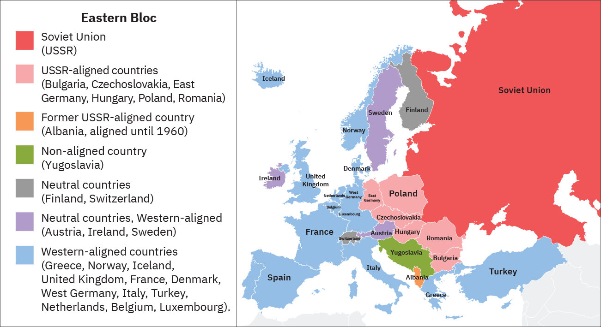

= 2-05. 国际秩序 (冷战)
:toc: left
:toclevels: 3
:sectnums:
:stylesheet: ../../myAdocCss.css

'''

==  Bretton Woods system 布雷顿森林货币体系 (1944.7) → 决定建立: 国际货币基金组织 , 国际复兴开发银行

For more than five years after they met in Newfoundland and produced the Atlantic Charter’s plan for the end of the conflict, Roosevelt and Churchill exchanged more than 1,700 letters and messages and held many high-level meetings to closely coordinate their efforts at every level.

At a specialized conference held at Bretton 地名 Woods, New Hampshire, in 1944, representatives of forty-four Allied countries together hammered out 敲定，达成 _the International Bank for Reconstruction 重建；改造；复原;修复；修理 and Development_ and _the International Monetary 货币的，金融的 Fund_ 基金，专款；资金, both intended to secure economic security 保障，保证；安全 and stability after the war.

[.my2]
罗斯福和丘吉尔在纽芬兰会面, 并制定了《大西洋宪章》结束冲突的计划，五年多来，他们交换了 1,700 多封信件和电文，并举行了许多高层会议，密切协调各个层面的努力。 +
1944年，在新罕布什尔州"布雷顿森林"举行的一次专门会议上，44个盟国的代表, 共同敲定了"国际复兴开发银行"和"国际货币基金组织"， 旨在确保战后的经济安全和稳定。

Just as it did after World War I, immense (a.)极大的；巨大的 hope prevailed after World War II that genuine 真的；名副其实的 and lasting peace might arise. The future of the globe itself seemed to hang (v.) in the balance 悬而未决 if humans could not avoid using violence to solve their problems.

[.my2]
正如第一次世界大战后一样，第二次世界大战后人们普遍抱有巨大的希望，认为真正持久的和平可能会出现。如果人类无法避免使用暴力来解决问题，那么地球本身的未来似乎就悬而未决.

'''

== 建立联合国 (期望能保证世界和平的新秩序)

Attempts took place 发生 across the globe to achieve some form of just and lasting peace. One glimmer 微光；闪光；少许 of hope was the United Nations, an international body agreed to by the Allied leaders during wartime conferences and finally established in New York City in April 1945.

The United Nations was pledged (v.)保证；诺言；誓约 *to “save* succeeding (a.)随后的，接着的 generations （统称）一代人;世代 *from* the scourge 祸害；祸根；灾害;鞭子 of war, which twice in our lifetime has brought untold (a.)难以形容的（大、恶劣等） sorrow 悲伤，悲痛 to mankind, and to reaffirm (v.)再肯定，重申；再断言 faith in fundamental human rights, in the equal rights of men and women and of nations large and small ... to promote social progress and better standards of life in larger freedom.”

[.my2]
全球各地都在努力实现某种形式的公正, 和持久和平。一线希望是"联合国"，这是一个由盟军领导人在战时会议期间, 同意成立的国际机构，最终于 1945 年 4 月在纽约市成立。联合国誓言要“免后世再遭在我们有生之年曾两次给人类带来难以言表的灾难的战祸，并重申对基本人权、男女平等、大小国家平等的信念……在更大的自由中促进社会进步, 和更好的生活水平。”

In many ways, World Wars I and II were only temporary interruptions in a centuries-long process of global integration 结合；融合；一体化. This process is often called globalization.

[.my2]
(另外,) 从很多方面来说，第一次世界大战和第二次世界大战, 只是长达几个世纪的全球一体化进程中的暂时中断。这一过程通常被称为”全球化”.

'''

==  冷战 (1945-1991)

===  丘吉尔宣布: 冷战的铁幕落下 (1946.3)

At the Moscow Conference of 1944, which U.S. president Franklin Roosevelt did not attend, Prime Minister Winston Churchill agreed to let Stalin install Soviet-allied 结盟的，联盟的 communist parties to control the governments of Romania and Bulgaria, which had been German allies during the war. In exchange, Stalin promised to leave control of the Balkans 巴尔干半岛地区 to the British.

[.my1]
.案例
====
image:/img/Romania.jpg[,100%]
====

By the time the victorious 胜利的，获胜的 Allies met in Potsdam in the summer of 1945 to finalize (v.)最后决定，敲定；结束谈判，完成协议（或安排） plans to partition (v.)分割，分裂（国家） Germany and its capital city of Berlin, Churchill no longer wished Stalin to exercise 行使；运用；使用 so much power in Eastern Europe. He warned the new U.S. president, Harry Truman, who was unaware (a.) #of# what *had been agreed to* at the Moscow Conference, #of# the danger of allowing the Soviets to control the region. But Stalin then consolidated 使加强；使巩固 his grip on Eastern Europe by placing a pro-Soviet government in power in Poland.

[.my2]
在美国总统富兰克林·罗斯福没有出席的1944 年莫斯科会议上，英国首相温斯顿·丘吉尔同意, 让斯大林建立由"同苏联结盟的共产党"来控制罗马尼亚, 和保加利亚政府，这两个国家在战争期间曾是德国的盟友。作为交换，斯大林承诺, 将"巴尔干半岛"的控制权交给英国。 +
1945 年夏天，获胜的同盟国在"波茨坦"会面，敲定分割德国及其首都柏林的计划时，丘吉尔不再希望斯大林在东欧行使如此大的权力。他警告新任美国总统哈里·杜鲁门(Harry Truman) ，让苏联控制该地区的危险，当时杜鲁门并不知道莫斯科会议上达成的协议。 但斯大林随后通过在波兰建立亲苏政府, 来巩固他对东欧的控制。

In March 1946, in a speech in Fulton, Missouri, Churchill warned his audience that “an iron curtain” had cut Europe in two, trapping (v.)卡住；夹住；绊住；缠住;使落入险境；使陷入困境;把…逼进，迫使…进入（不能逃脱的地方） half the continent under Soviet domination. This division of the world into United States–allied and Soviet-allied halves 两等份（half 的复数形式）  characterized (v.)是…的特征；以…为典型 the Cold War, a contest for ideological, social, economic, technological, and military supremacy that lasted until the collapse of the Soviet Union in 1991. The war was “cold” because it did not include actual fighting between U.S. and Soviet forces. (A “hot” war is a conflict in which countries engage in armed conflict with one another.)

[.my2]
1946 年 3 月，丘吉尔在"密苏里州"富尔顿发表演讲时, 警告观众，“铁幕”已将欧洲一分为二，将半个大陆置于苏联的统治之下。冷战将世界划分为美国盟国和苏联盟国两半，这是一场意识形态、社会、经济、 技术和军事霸权的争夺，一直持续到 1991 年苏联解体。之所以称为"冷"，是因为它不包括美苏之间的实际军事战争。 （“热”战争是指国家之间发生武装冲突。）

[.my1]
.案例
====
.trap
(v.) [ often passive] to keep sb in a dangerous place or bad situation that they want to get out of but cannot 使落入险境；使陷入困境 +
• Help! I'm trapped! 救命啊！我给困住了！

2.to force sb/sth into a place or situation that they cannot escape from, especially in order to catch them 把…逼进，迫使…进入（不能逃脱的地方） +
• The escaped prisoners were eventually trapped in an underground garage and recaptured. 越狱逃犯终于给追逼到地下汽车库，再次被捕。

====

The chief strategy of the United States in the Cold War was containment  控制，抑制；（对他国力量的）遏制 —an effort to confine Soviet influence to Eastern Europe.

[.my2]
美国在冷战时期的主要战略, 是"遏制"——努力将苏联的影响力限制在东欧。

'''

=== 捷克斯洛伐克 (1948), 匈牙利 (1949), 被共产党掌控

The splintering （使）裂成碎片 of Europe that Churchill described deepened in 1948, when a government composed of 组成，构成 both communists and non-communists in Czechoslovakia was toppled 倾覆，推翻 and replaced by an allcommunist government 后定 loyal (a.) to Moscow. In 1949, Hungary also came under the control of a communist party *closely allied with* the Soviet Union.

[.my2]
丘吉尔所描述的欧洲分裂, 在 1948 年进一步加深，捷克斯洛伐克"由共产党人和非共产党人组成的联合政府"被推翻，取而代之的是忠于莫斯科的"全共产党政府(一党专政)"。 1949年，匈牙利也受到与苏联密切结盟的共产党的控制。

'''

===  西德成立 (1949.5-1990.10)

`主` The tensions between the United States and the Soviet Union that had built up slowly through the later 1940s `谓` came to a head 顶端；上端 in 1948.

Believing a strong Germany was vital 至关重要的，必不可少的 to Europe’s economic recovery and a necessary bulwark 壁垒；保障；防波堤 against the spread of communism, the United States, Britain, and France planned to reunify 使重新统一；再统一 the three zones of Germany they had occupied since the end of World War II. United, these zones would dwarf (v.)使显得矮小，使相形见绌 the Soviet zone in size, population, and wealth and, by sharing a single currency, play a major role in Europe’s postwar economy.

The Western Allies unified their occupation zones to form the new country of the Federal Republic of Germany, usually referred to as West Germany, with the city of Bonn as its capital.

[.my2]
====
美苏之间在 20 世纪 40 年代后期逐渐形成的紧张关系, 在 1948 年达到了顶峰。

美国相信, 强大的德国对于欧洲经济复苏至关重要，也是抵御"共产主义蔓延"的必要堡垒。英国和法国计划重新统一"二战结束后占领的德国三个地区"。联合起来，这些地区在面积、人口和财富上, 将使苏联占领区相形见绌，并且通过共享单一货币，在欧洲战后经济中发挥重要作用。

西方盟国统一了其占领区，成立了新国家"德意志联邦共和国"，通常称为"西德"，以"波恩市"为首都。
====

[.my1]
.案例
====
.Bonn
1949年到1990年波恩是联邦德国（西德）首都. 当前波恩还驻有6个联邦部门，其他政府部门在此也仍有办事机构，这使得波恩成为德国第二大政治中心。 +
1996年开始, 联合国的"环境和发展事务组织"也驻在这里.

image:/img/Bonn.jpg[,100%]

====

'''

===  苏联封锁柏林

The Soviet Union hoped to keep Germany disunited and weak and thus objected 反对，提出异议. In March 1948, it withdrew from the Allied Control Council that coordinated Allied actions in Germany.

In June, the United Kingdom and the United States introduced a new currency, the Deutschemark 德国马克, into their zones as well as into the western portions of Berlin they controlled, in order to dispense 分配；分发 _Marshall Plan_ funds. Infuriated (v.)使极为生气；使大怒；激怒, the Soviet Union cut off all ground routes into West Berlin. No food or fuel could enter the city by road, railroad, or canal. The Soviets planned to starve the Western Allies out, forcing them to abandon their sections 部分；部门 of Berlin and thus their toehold 初步的地位；立足点;（攀登时可放进脚去的）小立足点，小支撑点 within the Soviet zone.

[.my2]
苏联希望德国继续分裂、软弱，因此(对统一西德)表示反对。 1948 年 3 月，它退出了能协调盟军在德国行动的"盟军控制委员会"。 +
6月，英国和美国在其管辖区, 以及其控制的柏林西部地区, 引入了一种新货币——德国马克， 以分配"马歇尔计划"资金。愤怒的苏联切断了通往西柏林的所有地面路线。任何食物或燃料, 都不能通过公路、铁路或运河进入城市。苏联计划让西方盟军挨饿，迫使他们放弃柏林部分地区，从而放弃在苏联地区的立足点。

'''

===  (西方) 布鲁塞尔条约 (1948)

The Western Allies then took another step to guard against potential Soviet aggression. In 1948, Belgium, France, Luxemburg, the Netherlands, and the United Kingdom had signed the Treaty of Brussels, forming a military alliance for purposes of protection against the Soviet Union.

[.my2]
随后, 西方盟国又采取了另一步骤, 来防范苏联潜在的侵略。 1948年，比利时、法国、卢森堡、荷兰和英国, 签署了《布鲁塞尔条约》 ，结成军事联盟，以抵御苏联。

[.my1]
.案例
====
.the Treaty of Brussels
布鲁塞尔条约. 该条约规定了成员国之间军事、经济、社会和文化合作的组织, 以及共同防御条款。 防范二战结束后德国或苏联可能的侵略。后,西欧的防务责任, 交给北约.
====

'''

===  北约成立 (1949)

In 1949, shortly before 不久之前 the Berlin blockade ended, the United States joined those nations as well as Canada, Portugal, Italy, Denmark, Norway, and Iceland to form the North Atlantic Treaty Organization (NATO), an alliance for military assistance and mutual defense. Should one of the member nations be attacked, the others agreed to come to its aid.

[.my2]
1949 年，柏林封锁结束前不久，美国与这些国家以及加拿大、葡萄牙、意大利、丹麦、挪威和冰岛, 一起成立了"北大西洋公约组织" (NATO) ，这是一个军事援助和共同防御的联盟。如果其中一个成员国受到攻击，其他国家同意提供援助。

image:/img/NATO.jpg[,100%]

'''

===  苏联掌握原子弹 (1949.8.29)

In 1949, the Soviet Union detonated （使）爆炸；引爆；起爆 an atomic bomb, ending the U.S. monopoly (n.)垄断；专营服务 on nuclear weapons.

[.my2]
1949年，苏联引爆了原子弹，结束了美国对核武器的垄断。

[.my1]
.案例
====
.detonate
-> de-, 向下，强调。-ton, 打雷，爆炸，词源同thunder, astonish. 即爆掉，引爆。
====

'''

===  (美国) 掌握氢弹 (1952)

In 1952 the United States took the next step, one opposed (v.)反对（计划、政策等）；抵制；阻挠 by some of the same atomic scientists who had worked on the Manhattan Project during World War II, and developed the hydrogen 氢，氢气 bomb, testing it on the Pacific atoll 环礁 of Eniwetok in 1952.

[.my2]
1952 年，美国采取了下一步行动，开发了氢弹，并于 1952 年在太平洋埃尼威托克环礁上进行了测试，但遭到了二战期间参与曼哈顿计划的一些原子科学家的反对 (科学家在政治上往往是短视的)。

'''

===  朝鲜战争 (1950.6-1953.7)

On August 15, 1945, the nation of Korea, which had been occupied by Japan during World War II and had been a Japanese colony for many years before that, was divided in half at the thirty-eighth parallel (n.)纬线，纬圈;平行的 of latitude 纬度；纬度地区. The United States assumed 承担（责任）；就（职）；取得（权力） responsibility for disarming 解除武装；使息怒 the southern part of the Korean peninsula, and the Soviet Union took on the task of disarming the northern half.

[.my2]
1945 年 8 月 15 日，朝鲜这个国家在二战期间被日本占领，在此之前多年一直是日本的殖民地，在北纬38度线, 被一分为二。美国承担了对"朝鲜半岛南部"解除武装的责任，苏联承担了对"朝鲜半岛北半部"解除武装的任务。

[.my1]
.案例
====
注意: 这里的 the thirty-eighth parallel of latitude 可以更简洁地改为 the thirty-eighth latitude.
====

At the Moscow Conference held in December 1945, the United Kingdom, the United States, and the Soviet Union agreed that they and China would jointly 共同地；连带地 govern Korea for a period of five years, after which it would be reunified and given its independence.

Not long after 之后不久 the Moscow Conference, `主` talks between the United States and the Soviet Union on how best to reunify Korea `谓` broke down. The two sides were too far apart ideologically (ad.)思想上；意识形态上, so in 1947 the United States *handed* the problem of Korean reunification *over to* 把某事物╱某人正式交给（某人） the United Nations (UN).

[.my2]
1945年12月举行的"莫斯科会议"上，英、美、苏三国商定，与中国共同治理朝鲜五年，之后朝鲜便能统一并独立。"莫斯科会议"后不久，美国和苏联之间关于"如何最好地统一朝鲜"的谈判破裂了。双方在意识形态上差距太大，因此美国于1947年, 将"朝鲜统一问题"交给了联合国。

[.my1]
.案例
====
.hand sb/sth←→ˈover (to sb)
to give sth/sb officially or formally to another person 把某事物╱某人正式交给（某人） +
•He handed over a cheque for $200 000. 他交出了一张20万元的支票。 +
•They handed the weapons over to the police. 他们把武器交给了警方。

====

The UN General Assembly 联合国大会 called for elections to be held in Korea, and a Temporary Commission on Korea was formed.

North Korea therefore refused to participate in the election. Given this opposition 考虑到这种反对意见, in May 1948 elections to a Constitutional 宪法的 Assembly 议会，代表大会 were held only in South Korea. A constitution 宪法，章程 was drafted, and the authoritarian 独裁主义的；权力主义的 anti-communist Syngman Rhee 李承晚 was elected president in July. In August, Rhee (姓)李 proclaimed the establishment of the Republic of Korea (ROK). Ten days later elections were held in North Korea, and a separate government for the new Democratic People’s Republic of Korea was established with communist 共产主义者 Kim Il-sung 金日成 as its leader.

[.my2]
联合国大会呼吁在韩国举行选举，并成立了"朝鲜问题临时委员会"。北朝鲜拒绝参加选举。鉴于这种反对，1948 年 5 月只在韩国举行了"制宪会议"的选举。宪法起草完成，专制的反共人士李承晚, 于七月当选总统。 8月，李承晚宣布成立"大韩民国"（ROK）。十天后，朝鲜自己举行了选举，新的"朝鲜民主主义人民共和国"成立了一个独立的政府，以共产党人金日成为领导人。

The Soviet Union withdrew its forces from Korea, and the United States moved most of its troops out as well. Without the forces of the two superpowers, border clashes occurred between North and South Korean troops from 1948 to 1950.

On June 25, 1950, the Korean People’s Army (KPA) of North Korea invaded South Korea, confident (a.)（性格，态度）自信的，充满信心的 of welcome 相信会受到欢迎. The ROK troops were unable to halt （使）停止行进；阻止，中断 their advance, and within two days Seoul, the capital of South Korea, had fallen.

[.my2]
苏联从朝鲜撤军，美国也将大部分军队撤出。没有了两个超级大国的军队，朝鲜和韩国军队在1948年至1950 年间发生了边境冲突。 +
1950年6月25日，朝鲜人民军满怀信心入侵韩国。韩军无力阻挡，两天之内，韩国首都首尔沦陷。

image:/img/0057.jpg[,50%]

The United States was taken by surprise. South Korea was not considered of vital 至关重要的，必不可少的 importance to U.S. security. However, Japan was, and President Truman, in keeping with 与……保持一致 the domino 多米诺骨牌 theory, believed a stable 稳定的，牢固的 non-communist Korea was necessary to protect Japan.

Unwilling to see another Asian country fall to communism, he also feared `主` U.S. reluctance to respond `谓` would send a signal to the Soviet Union that it was free to act aggressively in Europe, the area of greatest U.S. interest.

[.my2]
美国大吃一惊。之前韩国并不被认为对美国安全至关重要。然而，日本是这样的. 杜鲁门总统根据"多米诺骨牌理论"，认为一个稳定的"非共产主义的朝鲜", 对于保护日本是必要的。 +
除了不愿意看到另一个亚洲国家陷入共产主义，他还担心, 美国不愿做出回应, 会向苏联发出一个信号，表明苏联就可以在欧洲这一美国最感兴趣的地区, 随意采取侵略行动。

[.my1]
.案例
====
.domino theory
多米诺骨牌理论. 该理论最早由"艾森豪威尔"提出，他指假如中南半岛落入共产党的控制，其他东南亚国家, 都会出现多米诺骨牌效应，逐渐被共产党赤化 (因为共产主义就想着输出革命)，因此多米诺骨牌理论成为日后美国强烈介入他国的原因。

Walt Whitman Rostow and the then Prime Minister of Singapore Lee Kuan Yew have argued that `主` the U.S. intervention in Indochina, by giving the nations of ASEAN 东南亚国家联盟（东盟） time to consolidate (v.)使巩固，使加强 and engage in economic growth, `谓` prevented a wider domino effect.

沃尔特·惠特曼·罗斯托和时任新加坡总理李光耀认为，美国对印度支那的干预, 为东盟国家提供了巩固和参与经济增长的时间，从而防止了更广泛的多米诺骨牌效应。

Lee Kuan Yew argued that "there is a tendency in the U.S. Congress not to want to export (v.) jobs.  But we have to have the jobs if we are to stop Communism.  We have done that, moving *from* simple *to* more complex skilled labor.  If we stop this process, it will do more harm *than* you can every [sic] repair with aid.  Don't cut off imports from Southeast Asia."

李光耀指出，“**美国国会有一种'不愿输出就业机会'的倾向(即不愿工厂转移到外国, 不愿给其他国家提供工作机会, 来剥夺美国工人的就业机会)。但是如果我们要阻止共产主义，我们(指东南亚人)就必须要有工作。**我们已经做到了，从简单的技术劳动力, 转向更复杂的技术劳动力。如果我们停止这一进程，它所造成的伤害, 将比你(美国)通过援助所能修复的更大 (*即贫穷的状况, 会令激进的共产主义更容易被穷人接受*)。不要切断从东南亚的进口。”

====

Accordingly 相应地，因此，所以, Truman approached 接洽；建议；要求;（在距离或时间上）靠近，接近 the United Nations asking for a condemnation 谴责 of North Korea’s actions and requesting the assistance of member nations 成员国 in South Korea’s defense.

The UN Security Council responded quickly. It condemned North Korea’s invasion of South Korea, and after a brief debate 讨论，辩论, on June 27 it issued Resolution 决议，正式决定 83, calling on the UN’s members to resist (v.)阻挡，抵制；抵抗，回击 North Korean aggression.

The Security Council’s actions could have been prevented by a veto 否决权；拒绝认可，禁止 of one its five permanent members: China, France, the Soviet Union, the United Kingdom, and the United States. However, since the Nationalists’ 民族主义者 loss in the Chinese civil war, the United States had insisted that China’s seat on the council belonged to Taiwan, not to the People’s Republic of China, and the Soviet Union had boycotted 抵制，拒绝参与,拒绝购买 the council’s meetings in protest. It was thus unable to stop the resolution from passing.

[.my2]
====
因此，杜鲁门向联合国求助，要求谴责朝鲜的行为，并请求成员国为韩国的防务提供援助。

联合国安理会迅速做出反应。它谴责朝鲜入侵韩国，并在短暂辩论后, 于6月27日发布第83号决议，呼吁联合国成员国抵制朝鲜的侵略。

安理会的行动, 本可以通过其五个常任理事国（中国、法国、苏联、英国和美国）之一的"否决权"来阻止。然而，自从中国国民党在内战中失败后，美国坚持认为中国在该委员会的席位, 应属于台湾，而不是中华人民共和国，而苏联则抵制该委员会的会议(苏联缺席安理会), 以示抗议。因此它无法阻止该决议的通过。
====

The United States suspected the invasion of South Korea had been a ploy 计谋；策略；手法；花招 by the Soviets to test the U.S. response to an act of armed communist aggression. But Stalin had in fact warned Kim against it. Unwilling to start a war with the United States in Asia, he advised Kim to seek assistance not from Moscow but from Mao.

[.my2]
美国怀疑, "朝鲜入侵韩国"是苏联的一个策略，目的是测试美国对共产主义武装侵略行为的反应。但斯大林事实上已警告金正恩不要这样做。由于不愿在亚洲与美国卷入开战，斯大林建议金正恩不要向莫斯科寻求援助，而是向毛泽东寻求援助.

The situation was reversed 逆转，彻底改变 in September 1950 when U.S. troops led by General Douglas MacArthur landed behind KPA lines at Incheon. Seoul was swiftly retaken 再夺取；重获（遗失或失去的东西）, and Rhee returned to power.

With his original objective 目的，目标 met (v.), MacArthur was given a new goal: to reunify Korea under Rhee’s control if possible —and if the attempt did not lead to Chinese or Soviet intervention. Despite a warning by China that its forces would enter the war should （表示可能）假如，万一 the thirty-eighth parallel be crossed, MacArthur’s forces, with permission  同意，许可 from the UN, did just that, chasing 追赶 KPA troops northward toward the Yalu River, North Korea’s border with China.

[.my2]
1950 年 9 月，当道格拉斯·麦克阿瑟 (Douglas MacArthur ) 将军率领的美军, 在"仁川"的人民军防线后方登陆时，情况发生了逆转。首尔很快被夺回，李承晚重新掌权。 +
在实现了最初的目标后，麦克阿瑟被赋予了一个新的目标：如果可能的话，在李承晚的控制下, 统一朝鲜——前提是如果这一尝试不会导致中国或苏联的干预的话。尽管中国警告说，如果越过三八线，中国军队将参战，但麦克阿瑟的军队在联合国的许可下, 还是这么做了，将朝鲜人民军军队, 向北追击至朝鲜与中国的边界鸭绿江。

China’s forces entered the fray (n.)打斗，竞争，争辩（尤指激烈或视为检验能力的） in Korea, crossing the Yalu River on October 19, 1950. By December, Chinese and North Korean forces had *sent* UN and U.S. troops *into* retreat 撤军，撤兵；后退, back across the thirty-eighth parallel into South Korea.

[.my1]
.案例
====
.the fray : [ sing.] a fight, a competition or an argument, especially one that is exciting or seen as a test of your ability 打斗，竞争，争辩（尤指激烈或视为检验能力的） +
•They were ready for the fray. 他们准备好了争斗。 +
•to enter/join the fray 加入争辩 +
•At 71, he has now retired from the political fray. 他现年71岁，已经退出了政治角逐。
====

A cease-fire proposed 提议；计划 by the UN was rejected by the Chinese forces, and fighting raged 猛烈地继续；激烈进行 through the harsh  (a.)（环境）恶劣的，艰苦的 Korean winter. By July 1951, the war had turned into a deadly 极度的；十足的；彻底的 stalemate (n.)僵局；陷于困境 near where it began, along the thirty-eighth parallel. Both sides, exhausted 筋疲力尽的；耗尽的，枯竭的, began to discuss peace on July 10. Negotiations dragged on for two years as the two sides fought to gain as much territory as possible before a cease-fire was finally proclaimed 宣告，公布.

On July 27, 1953, the Korean Armistice (n.)停战，休战 Agreement was signed. To prevent the recurrence  重现，复发 of hostilities, a Korean Demilitarized 解除武装 Zone was established, roughly along the thirtyeighth parallel, to be patrolled 巡逻 by North and South Korean forces, and U.S. troops remained in South Korea as a deterrent (n.)威慑，遏制 to future North Korean aggression.

[.my2]
====
原本可能前往台湾的中国军队, 现在进入了朝鲜战场，并于 1950 年 10 月 19 日跨过鸭绿江。到了 12 月，中国和朝鲜军队已将联合国和美国军队击退，穿过北纬三十八度线进入韩国。

联合国提出的停火协议, 遭到中国军队的拒绝，朝鲜的严冬里战火不断。到 1951 年 7 月，战争在战争爆发地附近（沿北纬三十八度线）陷入了致命的僵局。双方都精疲力尽， 于 7 月 10 日开始讨论和平。 但双方为了在宣布停火前, 先争夺到尽可能多的领土，使谈判又拖延了两年，最终才宣布停火。

1953年7月27日，"朝鲜停战协定"签署。为了防止敌对行动再次发生，大约沿着北纬三十八度线建立了"非军事区"，由朝鲜和韩国军队巡逻，美军则留在韩国，以威慑朝鲜未来可能的侵略。
====

Like many of the proxy (n.)代理人；受托人；代表 wars of the Cold War, in which the troops of nations allied with the United States and the Soviet Union *faced off* 对峙，对抗 against one another rather than risk (v.) direct conflict between the superpowers.

[.my2]
与冷战时期的许多"代理人战争"一样，与美国和苏联结盟的国家的军队, 相互对峙，而不是冒超级大国之间发生直接冲突的风险。

China also suffered as a result of the Korean War. Now *regarded* 认为，把……看作 by the United States and Western Europe *as* an aggressor nation, it too found (v.) itself isolated and dependent (a.)依赖的，依靠的 on the Soviet Union for assistance.

[.my2]
中国也因朝鲜战争, 而深受其害。现在，它被美国和西欧视为侵略国，它也发现自己被孤立(封锁), 并只能依赖苏联的援助。

'''

===  东南亚条约组织 成立 (1954) → 提高人民经济, 以降低穷人对共产主义的吸引力

In 1954, the United States joined Britain, France, Thailand, Pakistan, the Philippines, Australia, and New Zealand to form the Southeast Asia Treaty Organization (SEATO) to prevent the expansion of communism in Southeast Asia. The organization had no capacity to mobilize troops, however, and focused largely on trying to improve standards of living in the region, in the hope of making communism less attractive.

[.my2]
1954年，美国与英国、法国、泰国、巴基斯坦、菲律宾、澳大利亚和新西兰, 组成"东南亚条约组织" （SEATO） ，以防止共产主义在东南亚扩张。然而，该组织没有能力动员军队，主要任务是致力于提高该地区的生活水平，希望降低共产主义的吸引力。

'''

=== (苏联) 华约成立 (1955.05)

In 1955, when West Germany also joined NATO, the Soviet Union formed a military and political alliance of its own, _the Warsaw Treaty Organization_ or the Warsaw Pact. Its other members were the communist nations of Eastern Europe: Albania, Bulgaria, Czechoslovakia, Hungary, Poland, Romania, and the German Democratic Republic (East Germany), formerly the Soviet occupation zone.

[.my2]
1955年，当西德也加入"北约"时，苏联也成立了自己的军事和政治联盟，即"华沙条约组织"或"华约"。它的其他成员是东欧共产主义国家：阿尔巴尼亚、保加利亚、捷克斯洛伐克、匈牙利、波兰、罗马尼亚, 和德意志民主共和国（东德）（前苏联占领区）。

[.my1]
.案例
====
.the Warsaw Pact
image:/img/the Warsaw Pact.png[,100%]
====

The Cold War in Europe. After West Germany joined NATO in 1955, the Soviet Union and other nations formed their own alliance, resulting in the creation of the Eastern Bloc 东欧集团.

Yugoslavia, although a communist nation and considered part of this bloc, had officially divorced (v.)分离；脱离;离婚 itself from Soviet control *prior (a.)先前的；较早的；在前的 to* the Warsaw Pact.

[.my2]
欧洲冷战。 1955年西德加入北约后，苏联和其他国家组成了自己的联盟 ，最终形成了东欧集团。 +
南斯拉夫虽然是一个共产主义国家, 并被视为该集团的一部分，但在"华沙条约"之前已正式脱离苏联的控制。

'''

===  越南战争, 最终北越统一南方 (1955－1975)

Following the end of World War II, France wished to reclaim (v.)取回；拿回；要求归还 control of Vietnam, which had been its colony before being seized by Japan in 1940. However, the Vietnamese nationalist group the Viet Minh 越盟, led by _Ho Chi Minh_, wished to seize the opportunity of Japan’s surrender to proclaim their country’s independence.

Following its defeat in 1954 at the Battle of Dien Bien Phu 地名, France granted （尤指正式地或法律上）同意，准予，允许 independence to Vietnam, Laos, and Cambodia. According to the Geneva  日内瓦(瑞士城市) Accords 协议；条约, the peace treaty ending the war, Vietnam was divided along the seventeenth parallel of latitude with the assumption 假定，假设 that, following national elections 全国大选 in 1956, it would be reunified.

The Geneva Accords. As a result of the 1954 Geneva Accords, the French colony of Indochina was divided into separate nations: Laos, Cambodia, the Democratic Republic of Vietnam (North Vietnam), and the Republic of Vietnam (South Vietnam). North and South Vietnam were to be reunified following national elections.

[.my2]
====
第二次世界大战结束后，法国希望收回对 1940年被日本占领之前, 曾是其殖民地的"越南"的控制权。然而，以胡志明为首的越南民族主义团体"越盟", 希望抓住日本投降这个机会，宣告国家独立。

1954年在"奠边府战役"中失败后，法国授予越南、老挝和柬埔寨独立。根据结束战争的和平条约《日内瓦协议》 ，越南沿第十七纬度划分，并假设在 1956 年全国选举后，越南将重新统一。 +
日内瓦协议。 1954 年《日内瓦协议》的结果是，法国殖民地"印度支那", 被分为几个独立的国家：老挝、柬埔寨、越南民主共和国（北越）, 和越南共和国 （南越）。北越和南越将在全国选举后再实现统一。
====

image:/img/0058.jpg[,60%]

[.my1]
.案例
====
.Dien Bien Phu

[.my3]
[options="autowidth" cols="1a,1a"]
|===
|Header 1 |Header 2

|发生时间
|1954年

|结局
|法国战败

|影响
|- 在法国国内，受到"奠边府战役"败局的影响，主战派的法国总理下台，主和派的出任法国总理。
- 在战役结束后紧接进行的日内瓦谈判中，在国际调停下，法国承认"印度支那"殖民地国家独立. 法国对越南自1884年"东京远征"以来70年的殖民统治, 至此结束。(「東京」一詞是舊時對"越南北部"的稱呼。因此, 北部灣, 也称東京灣 Gulf of Tonkin)
- 越南暂时以纬度17度, 划分为两部，于两年内，越南举行选举，实现统一。
- 法国把南越势力范围交给美国统治。由此引发了长达二十年越南战争，南北越直到1976年才得以统一。
|===

====

Ho Chi Minh governed the North. The South was governed by a figurehead 有名无实的领导人；傀儡;（过去的）艏饰像, the emperor Bao Dai, and his prime minister, Ngo Dinh Diem is a strong anticommunist.

Ngo Dinh Diem 吴廷琰 had no intention of relinquishing （尤指不情愿地）放弃 power, however; he argued that South Vietnam had not signed the Geneva Accords and so was not bound by them. In reality, he was a ruthless politician who allowed no opposition （强烈的） 反对，反抗；对手，竞争者;反对党.

[.my2]
====

北方由胡志明统治。南方由傀儡皇帝保大, 和他的总理吴庭艳统治, 而吴庭艳是一位强烈的反共主义者. +
然而，吴庭艳无意放弃权力。他辩称，南越尚未签署《日内瓦协议》，因此不受其约束。事实上，他是一位残酷的政治家，不允许任何反对派存在.
====

[.my1]
.案例
====
.figurehead
a large wooden statue, usually representing a woman, that used to be fixed to the front end of a ship （过去的）艏饰像 /有名无实的领导人；傀儡

image:/img/figurehead.jpg[,15%]
====

The country was afterward governed by a succession 连续不断的人（物） of leaders; none were effective or earned the loyalty of the population. All were maintained in power by the United States, which proved willing to support any politician promising to take a hard line 采取强硬路线 against communism and continue the war against North Vietnam.

[.my2]
(南越"吴廷琰"被暗杀后, )该国后来由一系列领导人统治。没有一个是有效的, 或赢得了民众的忠诚。所有这些领导人都依靠美国来维持其权力，事实证明, 美国愿意支持任何"承诺对共产主义采取强硬路线, 并继续对北越发动战争"的政客。

By the early 1970s, the United States was seeking a way to escape 逃离 the situation in Vietnam. President Richard Nixon did not wish to simply withdraw, however. Instead, a peace agreement would have to be reached. North Vietnam had been reluctant to negotiate on U.S. terms.

[.my2]
到 20 世纪 70 年代初，美国正在寻找摆脱越南局势的方法。然而，理查德·尼克松总统并不想简单地退出。相反，必须达成"和平协议"。而北越一直不愿按照美国的条件进行谈判.

In Mao’s eyes, he himself, not Khrushchev 赫鲁晓夫, should be the leader of world communism. Indeed, far from 远离，远非 being anti-imperialist  反帝国主义的,反帝国主义者, the Soviets had created their own empire in Europe.

The United States was eager to capitalize on the Sino-Soviet split in hopes of securing several advantages. In 1972 Nixon visited China, the first sitting U.S. president to do so, and met with Mao.

[.my2]
在毛泽东看来，世界共产主义的领导人应该是他本人，而不是赫鲁晓夫。事实上，苏联非但没有"反帝国主义"，反而在欧洲建立了自己的帝国。 +
美国急于利用中苏分裂，希望获得多项优势。 1972年，尼克松访华，成为首位访华的美国在任总统， 并会见了毛泽东。

`主` This effort 后定 to improve U.S. relations with China `谓` threatened to isolate the Soviet Union, so in turn the Soviets agreed to hold a Moscow Summit meeting between Brezhnev 勃列日涅夫 and Nixon in May 1972.

The United States then used the Soviet desire for closer relations to exert (v.)运用，施加（影响） pressure on North Vietnam. In March 1972, after the North launched an offensive against the South, Nixon threatened *to call off* 取消；停止进行 the Moscow Summit if the Soviets did not force North Vietnam to the peace table.

In the end, the United States’ efforts to extricate （使）摆脱，脱离，脱出 itself from the war were successful. At the peace talks in Paris, North Vietnam and the United States agreed to the U.S. withdrawal from South Vietnam in 1973.

[.my2]
改善美中关系的努力, 可能会孤立苏联，因此苏联同意于 1972 年 5 月举行"勃列日涅夫"和"尼克松"的莫斯科峰会。 +
美国随后利用苏联希望建立更密切关系的愿望, 来对北越施加压力。1972 年 3 月，北越对南方发动攻势后，尼克松威胁称，如果苏联不迫使北越回到和平谈判桌上，他将取消"莫斯科峰会"。最终，美国摆脱"越南战争"的努力, 获得了成功。 1973年，在巴黎和谈中，北越和美国同意, 美国从南越撤军。

[.my1]
.案例
====
.extricate
(v.)to escape or enable sb to escape from a difficult situation（使）摆脱，脱离，脱出 +
•He had managed to extricate himself from most of his official duties.他终于摆脱了大部分公务。

2.to free sb/sth or yourself from a place where they/it or you are trapped解救；救出；挣脱 +
•They managed to extricate the pilot from the tangled control panel.他们设法把困在控制盘里的飞行员救了出来。

-> ex-, 向外。-tric, 烦琐，琐事，词源同trick, intricate. 即脱离琐事。
====

The war continued until 1975, however, when North Vietnam defeated South Vietnam, and the country was reunified under a communist government.

[.my2]
然而，战争一直持续到1975年，最终北越击败了南越，国家在共产党政府的领导下实现了统一.

'''

===  不结盟运动, 不加入美苏任何一集团中 → 万隆会议 (1955. 4)

In April 1955 representatives 代表 from twenty-nine such countries in Asia and Africa gathered at a conference in Bandung 万隆, Indonesia. Their goal was to be able to rely on one another as they strove 努力；奋斗；力争；力求 to industrialize （使）工业化 and avoid the need to turn to Europe, the United States, or the Soviet Union for assistance. This aim formed the basis for the Non-Aligned 不结盟的；中立的 Movement, an attempt by newly independent nations to stay out of the orbit 轨道；势力范围 of either the Western or the Eastern Bloc.

[.my2]
1955 年 4 月，来自亚洲和非洲 29 个此类国家的代表, 齐聚印度尼西亚"万隆"召开会议。他们的目标是在努力实现工业化的过程中, 能够相互依赖，避免向欧洲、美国或苏联寻求援助。这一目标构成了"不结盟运动"的基础，新独立的国家, 试图远离西方或东方集团的轨道。

[.my1]
.案例
====
.Bandung
Bandung Conference 万隆会议. +

[.my3]
[options="autowidth" cols="1a,1a"]
|===
|Header 1 |Header 2

|时间
|1955年

|会议讨论内容
|- 促进亚非国家之间的经济文化交流
- 争取民族独立
- 保卫世界和平

提出了处理国际关系的十项原则, 包括:

- 尊重基本人权、尊重《联合国宪章》的宗旨和原则。
- 按照《联合国宪章》，通过如谈判、调停、仲裁或司法解决等"和平方法", 以及有关方面自己选择的任何其他"和平方法", 来解决一切国际争端。
- 尊重正义和国际义务。
- 不使用集体防御的安排, 来为任何一个大国的特殊利益服务；任何国家不对其他国家施加压力。
- 不以侵略行为, 或侵略威胁, 或使用武力, 来侵犯任何国家的领土完整或政治独立。
- 不干预或干涉他国内政。
- 促进相互的利益和合作。

|意义
|- 是有史以来, 亚非国家第一次在没有殖民国家参加的情况下, 讨论"亚非事务"的大型国际会议.
- 共同抵制美国与苏联的殖民主义, 和新殖民主义活动，间接促成"不结盟运动"。

|对中国的影响
|万隆会议的"亚非团结"基调, 是由印度总理尼赫鲁定下的。而当时中华人民共和国, 尚未获得世界上大多数国家的承认。尼赫鲁提议将中国介绍给世界，并且不顾万隆会议其他创始国的反对，邀请周恩来出席了万隆会议。

一些国家的代表, 当着中国代表的面攻击共产主义，又怀疑中国对邻国“搞‘颠覆’活动”。对此, 周恩来提出“求同存异”的方针("我们不是来吵架的, 是来求同，而不是立异的")。(中国的输出革命, 已经违反了十项原则)

万隆召开期间，美国通过英国驻北京代办杜维廉, 与中国代表团接触，想要解决美国在中国被关押人员问题。周恩来声明愿意与美国谈判, 缓和远东局势的问题，以此结束了已持续近8个月的第一次台海危机，并**开启了此后16年"美国与中国的协商渠道"。 -- ##即1955年至1970年期间，在中美两国没有外交关系期间，两国通过各自在日内瓦(瑞士)、华沙(波兰)的大使，进行会谈, 以保持某种联络与沟通##的途径。** 1970年后，美国开始正式接触中国，并以其他渠道代替会谈。
|===

====

'''

===  波兰十月革命, 半成功 (1956.10)

Joseph Stalin died in 1953. In February 1956, at the Twentieth 第二十 Congress of the Soviet Communist Party, Khrushchev denounced  谴责；揭发 the late (a.)已故的 Stalin and accused him of crimes against the Soviet people. He then *embarked 从事，着手，开始（新的或艰难的事情） on* an aggressive process of de-Stalinization, changing Stalin-era policies such as censorship 审查，检查，审查制度 of the arts, releasing many whom Stalin had jailed for political reasons, dissolving 使（固体）溶解;（使）消失，消散 the special tribunals 法院 that had convicted  证明……有罪；宣判（某人）有罪 them, removing Stalin’s name from public buildings, and *taking* monuments  纪念碑 to him *down* 拆除，拆卸.

[.my2]
约瑟夫·斯大林 (Joseph Stalin) 于 1953 年去世。1956年2月，(苏联新任领导人)赫鲁晓夫, 在苏共第二十次代表大会上, 痛斥已故斯大林，指责他犯有危害苏联人民的罪行。然后，他开始了积极的"去斯大林化"进程，改变了斯大林时代的政策，例如艺术审查制度，释放了许多因政治原因被斯大林监禁的人，解散了对他们定罪的特别法庭，从公共建筑中删除了斯大林的名字，并拆除他的纪念碑。

In the Eastern Bloc 集团，阵营 countries, this signaled (v.)发信号；发暗号；示意;标志；表明；预示 the beginning of a political thaw 解冻时期，融化季节；（敌对国家之间）关系缓和. In June 1956, workers in the Polish city of Poznan rioted 暴动，骚乱 to protest (v.)（公开）反对，抗议 food shortages and poor housing *along with* other grievances 不平的事；委屈；抱怨；牢骚. In the autumn, protests (n.)抗议，反对；抗议活动 began in other cities as well. They had a distinctly 清楚地，明白地；明显地 nationalistic 民族主义的；国家的 character 品质；特色，特征 and called for *such* changes *as* _the expulsion 驱逐；开除 of the Soviet army from Poland_ and _the removal of Russian language classes from Polish schools’ curricula_ 课程,课程体系.

[.my2]
在东欧集团国家，这标志着政治解冻的开始。 1956 年 6 月，波兰波兹南市的工人们爆发骚乱，抗议食品短缺、住房条件恶劣, 以及其他不满。秋天，其他城市也开始了抗议活动。他们具有明显的民族主义特征，并呼吁进行诸如"将苏联军队驱逐出波兰", 以及"从波兰学校课程中删除俄语课程"等变革。

[.my1]
.案例
====
.Poznan
是波兰最古老的城市之一，也是该国重要的历史、经济和文化中心。

image:/img/Poznan.jpg[,100%]
====

In October, Władysław Gomułka, who called for governmental reforms, was made the leader of the Polish Communist Party and thus 因此 the leader of Poland. After Gomułka *assured* Khrushchev *that* he had no intention of ending communism or Poland’s relationship with the Soviet Union, Khrushchev agreed that reforms could take place. Accordingly, the collectivization 集体化 of Polish agriculture was ended, Soviet advisers  顾问 were sent home, political prisoners were released, and greater freedom was given to the Roman Catholic Church.

[.my2]
10月，呼吁政府改革的"瓦迪斯瓦夫·哥穆尔卡", 被任命为波兰共产党领导人，从而成为波兰领导人。在"哥穆尔卡"向赫鲁晓夫保证, 他无意结束"共产主义"或"波兰与苏联的关系"后， 赫鲁晓夫同意可以进行改革。因此，波兰农业的集体化结束了，苏联顾问被遣送回国，政治犯被释放，罗马天主教会获得了更大的自由。

'''

===  1956年匈牙利的革命, 被苏联镇压 (1956.10.23 -11.04)

The success of the Poles 波兰人 inspired others. On October 23, 1956, students marched through the streets of Budapest 匈牙利首都, Hungary, demanding among other things the removal of Stalinist symbols 符号；象征；标志, improvements in wages, economic reforms, and the removal of Soviet troops from the country.

The State Security 保卫部门；保安部门 Police opened fire on students who gathered outside the main radio station 广播电台 to read their demands on the air, and several were killed. An uprising 起义，暴动；升起 began, with angry citizens fighting both the police and Soviet troops. As protesters attacked the parliament building, Ernő Gerő, the head of the ruling Hungarian Working People’s Party and leader of the country, fled along with his prime minister, András Hegedüs.

[.my2]
波兰人的成功, 激励了其他人。 1956 年 10 月 23 日，学生在匈牙利"布达佩斯"街头游行，要求消除斯大林主义标志、提高工资、经济改革, 以及从该国撤出苏联军队等。 +
国家安全警察, 向"聚集在主要广播电台外宣读要求的学生"开枪，造成数人死亡。起义开始了，愤怒的公民, 与警察和苏联军队作战。当抗议者袭击议会大楼时，执政的匈牙利"劳动人民党"党魁, 兼国家领导人"埃尔诺·格尔诺", 与总理"安德拉斯·赫格杜斯"一起逃离。

[.my1]
.案例
====
.Budapest
布达佩斯，是匈牙利首都. 也是该国主要的政治、商业、运输中心, 和最大的城市.

image:/img/Budapest.jpg[,100%]
====

Imre Nagy, a reformer, took office as prime minister. Unlike Gomułka, Nagy did not wish to institute 建立，制定（体系、政策等）；开始；实行 internal reforms while otherwise remaining loyal to Moscow. On October 28, he called for a cease-fire, dissolved 解散；解除（婚姻关系或业务协议）the State Security Police, and demanded that Soviet troops leave Budapest. On November 1, Nagy announced that Hungary was no longer a member of the Warsaw Pact and would remain neutral in international affairs.

[.my2]
改革家"伊姆雷·纳吉"就任总理。与"哥穆尔卡"不同，纳吉不希望在保持对莫斯科忠诚的同时进行内部改革。 10月28日，他呼吁停火，解散国家安全警察，并要求苏联军队离开布达佩斯。 11月1 日，纳吉宣布, 匈牙利不再是华约成员国，在国际事务中保持中立。

Three days later, Soviet forces entered Hungary to join those 后定 the USSR had been on the point of 正要…的时候；在…之际 withdrawing until Nagy’s announcement. Khrushchev may have feared that Nagy’s declaration of Hungarian neutrality threatened the security of the Soviet Union. He may also have wished to demonstrate 证明；证实 his resolve 决心；坚定的信念 #to# more conservative 保守的；保守派的 communists and #to# the leaders of the other Soviet states. Some argue that `主` the Western Bloc’s failure to intervene  `谓` emboldened (v.)使有胆量，使有信心 him.

The uprising 起义，暴动 came to an end on November 10 after about 2,500 Hungarians had been killed, and the communist government was reestablished 重新建立，恢复 under János Kádár. Approximately twenty thousand Hungarians were arrested and another 200,000 fled the country. Soviet troops were permanently 永久地 stationed 驻扎，部署 in Hungary, and Nagy was tried and executed in 1958.

[.my2]
三天后，苏联军队进入匈牙利，与"纳吉"宣布之前的"苏联准备撤军的部队"会合。赫鲁晓夫可能担心, 纳吉宣布匈牙利中立, 会威胁到苏联的安全。他可能还希望向更保守的共产主义者, 和其他苏联国家的领导人, 展示他的决心。一些人认为，西方集团未能进行干预, 让他更加大胆。 +
约 2,500 名匈牙利人被杀后，起义于 11 月 10 日结束，亚诺什·卡达尔 (János Kádár) 领导下的共产主义政府得以重建。大约两万名匈牙利人被捕，另有二十万人逃离该国。苏联军队永久驻扎在匈牙利，纳吉于 1958 年受审, 并被处决。

The United States did not become involved in the events in Hungary, a decision Khrushchev later mocked 嘲笑；（模仿）嘲弄.

[.my2]
美国没有介入匈牙利的事件，赫鲁晓夫后来嘲笑了这一决定。

'''

===  黎巴嫩 (1958)

In 1958, the United States enforced 强制执行，强行实施（法律或规定） the Eisenhower Doctrine by sending nearly fifteen thousand troops to Lebanon *at the request of* 应某人的请求 its Christian president, Camille Chamoun, to protect his government from political opponents, some of whom were pro-communist. Opposition was led by Lebanon’s Sunni 逊尼派教徒 Muslim majority, who had supported Lebanon’s joining the United Arab Republic when Chamoun 人名 had refused to do so. U.S. forces remained in Lebanon for three months while Chamoun finished his term.

This diversion 转向；转移；偏离 of U.S. attention `谓` convinced 使确信，使信服 China that it could resume 重新开始；（中断后）继续 bombing Jinmen and Mazu without risking a response, precipitating 使突然陷入（某种状态）;使…突然降临；加速（坏事的发生） the Second Taiwan Strait Crisis.

[.my2]
1958年，美国应黎巴嫩的基督教总统"卡米尔·夏蒙"的要求，向黎巴嫩派遣了近一万五千名士兵，以执行"艾森豪威尔主义"，以保护其政府免受政治对手（其中一些人是亲共产主义）的侵害。反对派是以黎巴嫩占多数的"逊尼派"穆斯林为首，他们在夏蒙拒绝加入"阿拉伯联合共和国"时, 支持黎巴嫩加入"阿拉伯联合共和国"。夏蒙任期结束时，美军在黎巴嫩停留了三个月。 +
美国注意力的转移, 让中国相信，它可以恢复轰炸金门和马祖，而不必冒"美国做出回应"的风险，从而引发了第二次台海危机。

[.my1]
.案例
====
.Lebanon
黎巴嫩. +
1975年4月，黎巴嫩"基督教"和"伊斯兰教"两方爆发内战。1990年，各方签署 Taif Agreement 结束内战.

image:/img/Lebanon.jpg[,100%]
====
'''

===  柏林墙建立 (1961-1989)

The capitalist  资本主义的 part of the old German capital was a thorn （玫瑰之类植物的）刺，棘刺 in Khrushchev’s side. Not only did its prosperity 繁荣，成功 arouse (v.) discontent among the residents of the communist eastern districts, but `主` the openness 开放；未遮盖 allowed there `谓` enabled many people from East Germany —and elsewhere in the Eastern Bloc —to escape to freedom.

[.my2]
德国旧首都的资本主义部分, 是赫鲁晓夫的眼中钉。它的繁荣, 不仅引起了共产主义东部地区居民对自己政府的不满，而且其交通开放性, 使得许多来自东德和东欧集团其他地区的人们, 能够逃亡到自由的西方控制区。

On the evening of August 12–13, 1961, East German troops erected 建立；竖立 a barbed 有倒钩的 wire fence 铁丝网围栏 to divide the western part of Berlin from the eastern. In the days that followed, cement (n.)水泥 walls went up *as well* to stop the free passage from east to west.

[.my1]
.案例
====
.barbed
image:/img/barbed.jpg[,15%]
====

On October 22, a dispute 争论，辩论，纠纷 erupted between the United States and the Soviet Union regarding the free passage of U.S. government employees between East and West Berlin. The United States maintained that, in keeping with 与…保持一致 agreements reached at Potsdam at the end of World War II, members of the Allies could travel (v.) freely throughout Berlin.

[.my2]
1961年8月12日至13日晚，东德军队竖起铁丝网，将柏林西部与东部分开。接下来的日子里，水泥墙也拔地而起，阻止了从东到西的自由通道。 10月22日，美国和苏联, 就美国政府雇员在东柏林和西柏林之间的自由通行问题, 爆发争端。美国坚称，根据二战结束时在"波茨坦"达成的协议，盟军成员可以在柏林各地自由旅行。

The Berlin Wall separated the residents of East and West Berlin from 1961 until it was destroyed in 1989.

[.my2]
柏林墙从 1961 年起, 将东柏林和西柏林的居民分隔开，直到 1989 年被摧毁。

'''

===  古巴导弹危机 (1962.10.16 - 10.28)

Earlier that year, the United States had placed missiles in Turkey. Khrushchev was angered (v.)使发怒；激怒, but now he offered Kennedy a way out of the Cuban stalemate 僵局；陷于困境: if the missiles in Turkey were removed, those in Cuba would be too. Kennedy accepted the offer.

[.my2]
(the Cuban Missile Crisis 古巴导弹危机时,) 那年早些时候，美国在土耳其部署了导弹。赫鲁晓夫很生气，但现在他向肯尼迪提供了一条摆脱古巴僵局的出路：如果土耳其的导弹被拆除，古巴的导弹也会被拆除。肯尼迪接受了这个提议。

Following the standoff 僵持, a direct telephone hotline was established between Washington and Moscow to enable instant communications between the leaders of the two rival nations.

The dangers of nuclear war did not necessarily diminish (v.)减弱，降低，减少, however. Thwarted (v.)阻止；阻挠；对…构成阻力 in their attempt to place (v.) nuclear missiles in Cuba, the Soviets focused on the development of intercontinental 洲际的；大陆间的 ballistic 弹道的；射击的 missiles, which could strike 击，撞 the United States from Europe.

[.my2]
对峙之后，华盛顿和莫斯科之间, 建立了直接电话热线，以便两个敌对国家的领导人之间, 能够进行即时通信。然而，核战争的危险并不一定减少。苏联在古巴部署"核导弹"的尝试遭到挫败，转而专注于开发"洲际弹道导弹"，这种导弹可以从欧洲打击美国。

In China, Mao Zedong *had criticized* 批评；指责；评论 the Soviets *for* being insufficiently 不够地；不能胜任地 supportive (a.)支持的，拥护的，给予帮助的 of socialist revolution around the world. So `主` Khrushchev’s willingness 乐意，意愿 to back down 退缩，让步 when confronted by the United States and to seemingly abandon (v.) Cuba `谓` gave credence 可信性；真实性 to Mao’s claims. It also improved Mao’s position within the Chinese Communist Party. The humiliation 耻辱，蒙羞；丢脸的事 of the Soviets now weakened the position of those members, such as Liu Shaoqi and Deng Xiaoping.

Conversely 相反地，反过来说, Khrushchev’s power was seriously damaged by the Cuban Missile Crisis, and two years later he was forced from office.

[.my2]
在中国，毛泽东曾批评苏联对世界各地社会主义革命的支持不够。因此，赫鲁晓夫在美国面前做出让步, 并看似放弃古巴的意愿, 似乎证实了毛泽东对苏联看法的主张。这也提高了毛泽东在中国共产党内的地位。苏联的屈辱, 现在削弱了刘少奇和邓小平等成员的地位。 +
(与毛泽东的威望提升) 相反，赫鲁晓夫的权力因古巴导弹危机而严重受损，两年后被迫下台。

'''

===  捷克斯洛伐克的改革, 被苏联镇压 (1968)

Tensions flared in Europe yet again in 1968 when Czechoslovakia, like Poland and Hungary before it, sought to loosen its ties to the Soviet Union. Early in the year, the country’s conservative leader Antonín Novotný was replaced by Alexander Dubček. Dubček instituted economic reforms and ended government censorship.

As Czechs called for even greater reforms, the Soviet Union became alarmed, as it had in Poland and Hungary in 1956. Fearing that changes in Czechoslovakia would stimulate calls for reform elsewhere in the Eastern Bloc or in the Soviet republics themselves—and confident the United States would not intervene, just as it had failed to do before—the new Soviet leader Leonid Brezhnev ordered an invasion of Czechoslovakia on August 20, 1968.

By early 1969, resistance had largely disappeared, and the Soviet Union replaced Dubček with the conservative Gustáv Husák, who reversed Dubček’s reforms. Censorship was restored, and government control increased again.

[.my2]
====
1968年，欧洲的紧张局势再次爆发，当时捷克斯洛伐克, 像之前的波兰和匈牙利一样，试图放松与苏联的关系。 今年年初，该国保守派领导人安东尼·诺沃特尼 (Antonín Novotný),  被亚历山大·杜布切克 (Alexander Dubček) 取代。"杜布切克"实施了经济改革, 并结束了政府审查制度。

当捷克人呼吁进行更大规模的改革时，苏联感到震惊，就像 1956 年对波兰和匈牙利那样。担心捷克斯洛伐克的变化, 会刺激东欧集团其他地方, 或苏联加盟共和国本身的改革呼声，并相信美国国家不会进行干预，就像它以前未能做到的那样——新任苏联领导人"列昂尼德·勃列日涅夫"于 1968 年 8 月 20 日下令入侵捷克斯洛伐克。

到 1969 年初，抵抗已基本消失，苏联用保守派"古斯塔夫·胡萨克", 取代了"杜布切克", "胡萨克"推翻了"杜布切克"的改革。 审查制度恢复，政府控制再次加强。
====

'''

===  柬埔寨的共产主义政权”红色高棉”的大清洗

Throughout 自始至终；贯穿整个时期 much of the war in Vietnam, Cambodia 柬埔寨 had been neutral 中立的. In 1970, however, its ruler Prince Sihanouk was deposed 罢免，废黜 by one of his generals 将军, Lon Nol, who favored the United States. Sihanouk then allied himself with the Cambodian communist group, the Khmer 高棉人；高棉语 Rouge 胭脂. In 1975, after years of fighting, the Khmer Rouge overthrew (v.)推翻，打倒 the government of Lon Nol.

[.my2]
在"越南战争"的大部分时间里，柬埔寨一直保持中立。然而，1970 年，其统治者西哈努克亲王, 被他的一位亲美将军"朗诺" (Lon Nol)废黜。西哈努克随后与柬埔寨共产主义组织"红色高棉"结盟。 1975年，经过多年的战斗，红色高棉推翻了朗诺政府。

[.my1]
.案例
====
.rouge
-> 来自法语 rouge,红颜料，来自拉丁语 ruber,红色的，来自 PIE*reudh,红色的，词源同 red,ruby. 字母 b,g 音变，比较 rabid,rage.
====

Under the rule of _Pol Pot_ 人名, the Khmer Rouge leader and an admirer 钦佩者；赞赏者 of Mao Zedong, Cambodia *embarked 从事，着手，开始（新的或艰难的事情） on* a program to rebuild itself as the perfect communist state.

The Khmer Rouge seized (v.) private property and forced (v.) city dwellers 居民 to relocate （使）搬迁，迁移 to the countryside. The population was made to labor (v.)劳动；努力；苦干 in work camps 劳动营地 and on collective farms, and some died *as a result of* disease and starvation. Those who were unable to work were killed. The Khmer Rouge also carried out 履行；实施；执行；落实 a deliberate 故意的，蓄意的 campaign of extermination (n.)消灭；根绝 against professionals 专家, intellectuals 知识分子 (which could mean anyone who wore glasses), Christians, Muslims, Buddhist monks, and people of Chinese, Thai, and Vietnamese ancestry 血统;（统称）祖宗，祖先.

By the time `主` the killing `谓` ended with the invasion of Cambodia by Vietnam in 1978, some three million people, approximately one-quarter of Cambodia’s population, had died.

[.my2]
====
在红色高棉领导人和毛泽东崇拜者, "波尔布特"的统治下，柬埔寨开始实施一项将自己重建为完美共产主义国家的计划。

红色高棉夺取私人财产, 并迫使城市居民搬迁到农村。人们被迫在工作营和集体农场劳动，有些人因疾病和饥饿而死亡。那些无法工作的人被杀害。 红色高棉还对专业人士、知识分子（可能指任何戴眼镜的人）、基督徒、穆斯林、佛教僧侣, 以及中国人、泰国人和越南人, 进行了蓄意的灭绝运动。

1978 年越南入侵柬埔寨，屠杀结束时，已有约 300 万人（约占柬埔寨人口的四分之一）死亡。
====

[.my1]
.案例
====
.Pol Pot
波尔布特. 于1963年至1997年期间是"红色高棉"的实际最高领导人. +
1963年至1981年间担任柬埔寨共产党总书记，1976年至1979年间担任民主柬埔寨总理。波尔布特 将柬埔寨变为一党制共产主义国家，并实施了红色高棉大屠杀。

波尔布特曾多次前往中国进行军政训练.

1960年代，北越军队进入柬埔寨境内袭击南越。由于柬埔寨国家元首"诺罗敦·西哈努克"对北越及越共游击队的纵容，引起柬埔寨军方的不满。 +
1970年3月，在西哈努克前往欧洲、苏联及中国访问的时候，金边爆发了反越的大规模游行示威。首相朗诺关闭"西哈努克港"，要求当地驻扎的所有北越军队, 在72小时内撤离。 朗诺宣布罢免西哈努克，不再实行君主制. 朗诺宣布高棉共和国正式成立，自任总统。这次政变促成了西哈努克与红色高棉的合作。

在中共的协调下，波尔布特与西哈努克合作，共同对抗亲美的"高棉共和国"政权. +
1975年4月, 红色高棉在北越、越共和中共的协助下, 占领柬埔寨首都金边，取得了胜利, 并掌握实权. 随后，红色高棉则获得了中国的大量援助.

波尔布特实行农业集体化，将所有城市居民强行驱赶到农村的"集体农场"劳动、效仿中国实行“大跃进”，并屠杀了大量“新政府的敌人”，还以“大清洗”的名义, 将柬共中央高层领导, 以及军队的总参谋部, 几乎屠杀殆尽. +
直至1979年初，罹难者有大约150万人到300万人，而当时柬埔寨只有800万人口。此屠杀事件，被历史学家称为"红色高棉大屠杀"（又称“柬埔寨种族灭绝”）.

对外关系上，由于柬埔寨与越南的宿怨，且越南在中苏交恶中支持苏联，波尔布特奉行"反苏亲中"的外交政策。

1978年12月，越南全面入侵柬埔寨. 越南撤军后，波尔布特则拒绝参加由柬埔寨过渡时期"联合国权力机构"举行的1993年大选，也拒绝让红色高棉游击队缴械，引发红色高棉内讧。
====

'''

===  美苏<战略武器限制谈判> (1972)

In the West there were new hopes for peace as the Cold War showed signs of thawing 融化；熔化. At the 1972 Moscow Summit, the United States and the USSR signed the Strategic Arms Limitations Treaty (SALT). A relaxation of tensions between the United States and the Soviet Union that included trade agreements and additional arms-reduction 军备削减 talks.

[.my2]
随着冷战出现解冻迹象，西方出现了新的和平希望。在 1972 年莫斯科峰会上，美国和苏联签署了《战略武器限制条约》(SALT). 美国和苏联之间的紧张局势有所缓和，其中包括贸易协定, 和额外的军备削减谈判。

'''

===  赫尔辛基协议 (1975)

In 1975, the United States and the Soviet Union, along with Canada and all the countries of Europe, except for Albania, signed the Helsinki Accords 协议，条约. The United States and its allies pledged 保证；诺言；誓约 to respect the borders of Eastern Bloc countries and to refrain (v.)克制，避免 from intervening in their internal affairs. The Soviet Union promised to respect human rights.

[.my2]
1975年，美国、苏联、加拿大, 以及除"阿尔巴尼亚外"的所有欧洲国家签署了《赫尔辛基协议》 。美国及其盟国承诺尊重东欧集团国家的边界 ，不干涉其内政。苏联承诺尊重人权。

In the CSCE terminology （某学科的）术语, there were four groupings  组群 or baskets 篮子. In the first basket, the "Declaration on Principles 行为准则，规范；原则 Guiding Relations between Participating States" (also known as "The Decalogue 摩西的十诫") enumerated 列举；枚举 the following 10 points:

-> 1.  +
- Respect for human rights and fundamental 根本的，基本的；必需的，必不可少的 freedoms, including the freedom of thought 思想自由, conscience 良知，良心, religion or belief +
- Equal rights and self-determination of peoples +
- Fulfillment (n.)履行；实行 in good faith 诚意；善意 of obligations 义务；债务 under international law

-> 2.  +
- Peaceful settlement 解决；处理 of disputes +
- Refraining (v.)克制 from the threat 威胁，恐吓 or use of force

-> 3. +
- Co-operation among States +
- Sovereign 有主权的；完全独立的 equality, respect for the rights inherent in sovereignty 主权，最高统治权 +
- Inviolability 不可侵犯；神圣 of frontiers 边疆 +
- Non-intervention in internal affairs +
- Territorial 领土的 integrity (n.)完整；完好 of states

[.my2]
====
在 CSCE 术语中，有四个分组或篮子。第一个篮子里的《关于指导参与国关系的原则宣言》（又称《十诫》）列举了以下10点：

-> 建立共同价值观: +
- 尊重人权和基本自由，包括思想、良心、宗教或信仰自由 +
- 人民的平等权利和自决 +
- 真诚履行国际法义务 +

-> 用和平手段来解决矛盾, 而不用武力 +
- 和平解决争端 +
- 避免威胁或使用武力 +

-> 有钱大家合作赚, 不干涉人家家事 +
- 国家间合作 +
- 主权平等，尊重主权固有权利 +
- 不干涉内政 +
- 边界不可侵犯 +
- 国家领土完整 +
====

In the months *leading up to* 是…的先导；是导致…的原因 the conclusion 签订；达成；缔结 of negotiations and signing of the Helsinki Final Act, the American public, in particular `主` Americans of Eastern European descent 血统；祖籍；祖先；出身 `谓` voiced their concerns that the agreement would mean the acceptance of Soviet domination 控制，统治 over Eastern Europe and forced incorporation 合并 of the Baltic States into the USSR.

[.my1]
.案例
====
.lead ˈup to sth
to be an introduction to or the cause of sth 是…的先导；是导致…的原因
•the weeks leading up to the exam 临近考试的几个星期 +
•the events leading up to the strike 导致罢工的事件
====

President Ford  stated definitively 决定性地；最后地 that US policy on the Baltic States would not change, but would be strengthened since the agreement denies the annexation 合并，吞并 of territory in violation of international law and allows for the peaceful change of borders.

[.my2]
在谈判结束, 和签署《赫尔辛基最后文件》之前的几个月里，美国公众，特别是有东欧血统的美国人表达了他们的关切，认为该协议(如不干涉内政等,)将意味着接受苏联对东欧的统治，并迫使波罗的海国家并入苏联。 +
福特总统明确表示，美国对波罗的海国家的政策不会改变，只会加强，因为该协议否认违反"国际法"吞并领土，并允许和平改变边界.

The Helsinki documents `谓` involve political and moral commitments 后定 aimed at lessening (v.)减轻，减少；变小 tensions and opening further (ad.)更远地，再往前地；进一步 the lines 路线；路径；渠道;种类；类型 of communication between peoples of East and West. ... We are not *committing* ourselves *to* anything beyond what we are already committed to #by# our own moral and legal standards 法律标准 and #by# more formal treaty agreements such as the United Nations Charter and Declaration of Human Rights. ... If it all fails, Europe will be no worse off than it is now. If _even a part of it_ succeeds, the lot the people in Eastern Europe will be that much better, and the cause of freedom will advance at least that far.

[.my1]
.案例
====
.the lot the people in Eastern Europe will be *that* much better.
这里的 “that” 是副词，用来表示程度，相当于“so”或“to that extent”。它的作用是强调变化的幅度，即“改善的程度”——暗示一旦这些承诺取得成功，东欧人民的生活会好得多。因此，“that much better” 意思是“更加美好”“更加改善”。
====

His reassurances （能消除疑虑等的）肯定，保证 had little effect. During the general election 大选, the Democratic nominee Jimmy Carter attacked the Accords as a legitimation 合法化 of the "Soviet domination 控制，统治 of Eastern Europe."

[.my2]
(福特总统说:) 赫尔辛基文件涉及旨在缓解紧张局势, 并进一步开放东西方人民之间沟通渠道的政治和道义承诺。 ......我们不会承诺任何超出我们自己的道德和法律标准以及更正式的条约协议（例如《联合国宪章》和《人权宣言》）所承诺的内容。 ……如果这一切都失败了，欧洲的情况也不会比现在更糟。如果其中一部分成功的话，东欧人民的命运就会好得多，自由事业至少也会前进那么远。 +
但福特的保证收效甚微。在大选期间，民主党候选人吉米·卡特攻击该协议是“苏联统治东欧”的合法化。

In practice, the Soviet government significantly 有重大意义地；显著地；明显地 curbed the rule of law 法治, civil liberties, protection of law and guarantees (n.)保证；担保 of property. The Soviet Union signed legally-binding 具有法律约束力的 human rights documents, but they were *neither* widely known 被...所知 or accessible to people living under Communist rule, *nor* were they taken seriously by the Communist authorities 当局，官方；官方机构.

[.my2]
在实践中，苏联政府严重限制了法治、公民自由、法律保护和财产保障。苏联签署了法律-具有约束力的人权文件，但这些文件既没有为生活在共产党统治下的人们所广泛了解或接触，也没有受到共产党当局的认真对待。

[.my1]
.案例
====
.Helsinki Accords
赫尔辛基协议.

[.my3]
[options="autowidth" cols="1a,1a"]
|===
|Header 1 |Header 2

|签约时间
|1975年8月，在芬兰首都"赫尔辛基"举行了“欧洲安全与合作会议”，共35个国家（包括美国、加拿大，与除阿尔巴尼亚、安道尔外的全部欧洲国家）签署了这项协议。

|内容
|内容可分为四大部分。 +
第一类包括十项原则，内容涉及政治和军事问题，领土完整与定义边界，和平解决争端和建立互相信任措施。

-> 建立共同价值观: +
- 尊重人权和基本自由，包括思想自由、良知、宗教和信仰。 +
- 平等和人民自决。 +

-> 用和平手段来解决矛盾, 而不用武力 +
- 确认和平解决争端原则。 +
- 抑制威胁或使用武力。

-> 有钱大家合作赚, 不干涉人家家事 +
- 不干预内部事务。 +
- 国与国互相合作。 +
- 在"国际法"下诚信履行义务。 +

第二部分专注于经济问题，如贸易和科技合作。 +
第三部分强调人权，包括移民自由，文化交流和出版自由。 +
第四部分是正式实施细节与后续讨论，旨在改善西方国家与社会主义国家的关系。

|意义
|The Helsinki Accords, however, were not binding 因为 as they did not have treaty status that would have to be ratified (v.)批准 by parliaments.

然而，《赫尔辛基协议》不具有约束力，因为它们不具有必须由议会批准的条约地位。
|===

====

'''

===  波兰工人成立”团结工会” (1980)

In Poland in 1980, shipyard 造（修）船厂，船坞；造船业，修船业 workers under the leadership of labor activist Lech Wałęsa formed a trade union 工会 and went on strike 罢工 to protest government policies. Within a year, one-third of Poland’s population had joined the Solidarity (n.)团结一致 union. The Polish government tried to suppress (v.)（尤指用武力）镇压，压制 the movement and banned the union, but its ten million members could not be silenced 使沉默. Pope 罗马教皇 John Paul II, himself a Pole and an opponent of communism, called upon 请求，要求，要（某人做某事） the Polish church to support the workers.

[.my2]
1980年，波兰造船厂工人, 在劳工活动家"莱赫·瓦文萨"的领导下, 成立了工会，并举行罢工, 抗议政府政策。一年之内，三分之一的波兰人口加入了"团结工会"。波兰政府试图镇压该运动, 并取缔该工会，但其一千万会员却无法被压制。教皇约翰·保罗二世本人是波兰人，也是共产主义的反对者，他呼吁波兰教会支持工人。

[.my1]
.案例
====
.Solidarity union
团结工会. 是波兰的一个工会联合会，也是华沙条约签约国中, 第一个被国家认可的独立工会。主张非暴力的反抗模式.
====

'''

===  东欧剧变 (1989年前后系列革命, 共产主义的垮台)

When the new leader of the Soviet Union, Mikhail Gorbachev, came to power in 1985, discontent was simmering in the Soviet Union and in the countries of Eastern Europe. Shortages of food and other goods were making people angry.

[.my2]
1985年苏联新领导人"戈尔巴乔夫"上台后，苏联和东欧国家的不满情绪不断发酵。食品和其他商品的短缺, 让人们感到愤怒。

In 1988, protests 抗议，反对 broke out again in Poland, and strikes swept the country. The Polish government was forced to negotiate with Solidarity leaders and make concessions 让步；妥协 to them, including free elections for some government offices.

In 1989, Hungary and East Germany opened their borders, allowing their citizens to come and go freely. Berliners 柏林人 climbed atop 在……顶上 the wall that divided their city and began to tear it down.

People in Bulgaria and Czechoslovakia called for changes in their government as well.

Gorbachev informed other members of the Soviet government that he did not intend to use military might to maintain control of Eastern Europe.

In 1990, Germany was reunified.

[.my2]
1988年，波兰再次爆发抗议活动，罢工席卷全国。波兰政府被迫与"团结工会"领导人谈判, 并向他们做出让步，包括一些政府职位的自由选举。 +
1989年，匈牙利和东德开放边境，允许其公民自由出入。柏林人爬上分隔城市的城墙, 并开始将其拆除。 +
保加利亚和捷克斯洛伐克人民也呼吁改变政府。 +
戈尔巴乔夫告诉苏联政府其他成员，他不打算使用军事力量来维持对东欧的控制。 +
1990年，德国统一.

'''

===  戈尔巴乔夫的改革, 也将苏联解题, 冷战结束 (1991.12)

Gorbachev realized the need for reform in the Soviet Union. He cut military spending and encouraged the beginnings of private enterprise. As part of his reform efforts, Gorbachev also encouraged glasnost (n.)公开性；公开化 or openness, allowing those who were angry to be *critical (a.)批评的；批判性的；挑剔的 of* the government.

But `主` the reforms 后定 Gorbachev initiated 开始，发起；开创 to save the Soviet Union `谓` eventually tore it apart. The Soviet republics 共和国，共和政体 also wanted their independence.

[.my2]
戈尔巴乔夫意识到, 苏联需要进行改革, 他削减军费开支, 并鼓励私营企业的兴起。作为改革努力的一部分，戈尔巴乔夫还鼓励开放，允许那些愤怒的人批评政府。但戈尔巴乔夫为拯救苏联而发起的改革, 最终导致了苏联的解体。苏维埃各加盟共和国, 也希望独立.

[.my1]
.案例
====
.glasnost
(n.) 公开性；公开化（指戈尔巴乔夫于20世纪80年代, 在苏联倡导的允许公开讨论国家所面临问题的政策）

.critical
(a.)~ (of sb/sth) : expressing disapproval of sb/sth and saying what you think is bad about them 批评的；批判性的；挑剔的 +
- Tom's parents were highly critical (a.) of the school. 汤姆的父母对学校提出了强烈的批评。

====

In August 1991, conservative 保守的；保守派的 members of the Communist Party attempted to remove Gorbachev from power, only to be foiled (v.)挫败，阻止，制止（非法活动等） by the actions of Boris Yeltsin, the president of _the Russian republic_. Acting together, Yeltsin and the presidents of the Soviet republics of Belarus 白罗斯 and Ukraine voted in December 1991 to dissolve the Soviet Union. The Cold War was at an end.

[.my2]
1991年8月，共产党保守派成员试图推翻戈尔巴乔夫，但被俄罗斯共和国总统"鲍里斯·叶利钦"的行动挫败。 1991年12月，叶利钦与白俄罗斯和乌克兰苏维埃共和国总统, 共同投票决定解散苏联。冷战结束了。

'''

==  冷战时的国家间经济援助

===  The Marshall Plan 马歇尔计划 (1948) → 目的: ①人民在经济上富裕, 是抵抗共产主义极端思想的最好武器. ② 美国对西欧的经济投资, 有助于美国GDP的持续发展, 而非萎缩.

The U.S. effort to combat the expansion of communism also led to the creation of the European Recovery Program, named the Marshall Plan for Secretary of State George C. Marshall.

In 1947, Marshall called for economic assistance to rebuild postwar Europe. Realizing the attractions 吸引；吸引力 of communism to impoverished 贫困的，赤贫的, war-ravaged (遭受严重破坏的；因疾病（或变老）容貌受损的)受战争蹂躏的 Europeans, Congress approved the Economic Cooperation 合作，协作 Act in 1948 to pump an eventual 最终的，结局的 total of $12 billion into Europe’s economy (about $147 billion today). The funds were vital in assisting 帮助；协助；援助 Western Europe as a whole to rebuild their infrastructure and restore their industrial capacity.

Because necessary materials often needed to be purchased from the United States, `主` aid given through the Marshall Plan `谓` also helped ensure that the U.S. economy did not slide into an economic depression *now that* 既然，由于 the war had ended.

[.my2]
美国打击共产主义扩张的努力, 还导致了"欧洲复苏计划"的制定，国务卿乔治·C·马歇尔将其命名为“马歇尔计划” 。 +
1947年，马歇尔呼吁提供经济援助, 以重建战后欧洲。意识到共产主义会对贫困、饱受战争蹂躏的欧洲人产生的吸引力，国会于 1948 年批准了《经济合作法案》，最终为欧洲经济, 注入了总计 120 亿美元的资金（今天约为 1,470 亿美元）。这些资金对于协助整个西欧重建基础设施, 和恢复工业能力, 至关重要。 +
由于必需的物资往往需要从美国购买，通过"马歇尔计划"提供的援助, 也有助于确保美国经济不会在二战结束后陷入经济萧条。

'''

===  (苏联)莫洛托夫计划

U.S. aid was offered to all European nations, including Germany and the Soviet Union. Stalin, however, rejected it and forbade (v.)禁止 Eastern Europe’s communist-governed states within the Soviet sphere of influence to accept it. Instead, the USSR proposed the Molotov Plan, which gave aid to and established trade agreements with the communist nations of Eastern Europe: Bulgaria, Czechoslovakia, Hungary, Poland, Romania, and the Soviet zone in Germany that later became the German Democratic Republic, commonly known as East Germany.

[.my2]
美国向所有欧洲国家提供援助，包括德国和苏联。然而斯大林拒绝了它，并禁止苏联势力范围内的东欧共产主义国家接受它。相反，苏联提出了"莫洛托夫计划"，该计划向东欧共产主义国家提供援助, 并与其建立了"贸易协定"：保加利亚、捷克斯洛伐克、匈牙利、波兰、罗马尼亚, 以及德国境内的苏联占领区（后来成为"德意志民主共和国"）被称为东德。

'''

=== (美国) 第四点计划 (1949) → 美国向亚非拉, 提供经济援助, 以降低他们滑入共产主义极端思想的可能性

Finally, in 1949, the United States developed the Point Four Program to provide technical assistance to industrializing (v.)使工业化 countries in Latin America, Africa, and Asia for improving their standard of living.

[.my2]
最后，1949年，美国制定了“第四点计划”，向拉丁美洲、非洲和亚洲的工业化国家, 提供技术援助，以提高他们的生活水平。

[.my1]
.title
====
.Point Four Program
[.my3]
[options="autowidth" cols="1a,1a"]
|===
|Header 1 |Header 2

|时间
|美国总统哈利·S·杜鲁门, 1949年1月宣布对“发展中国家”进行技术援助的的“第四点计划”（Point Four Program）

|内容
|将美国的援助范围扩充到发展中国家. 不同于马歇尔计划，此项计划并没有鼓励"经济援助"，而是利用美国所掌握的"专业技术"，尤其是农业、工业、卫生等领域的专业技术，为其他国家提供"科技发展援助"。

|目的
|遏制共产主义
|===

====

The Cold War between West and East was fought on many fronts 活动领域；阵线 with many strategies. Both sides provided aid and technical assistance to countries in Latin America, Asia, and Africa, many of which had been European colonies until the end of World War II. Through such aid, the United States hoped to contain the spread of communism by *depriving* 剥夺；使丧失；使不能享有 countries *of* an economic reason for *aligning* (v.)排整齐；校准；（尤指）使成一条直线;公开支持（某组织、意见、人） themselves *with* the Soviet Union. Communism was attractive to many poor people.

[.my2]
东西方之间的冷战, 是在多条战线上进行的，采取了多种策略。双方向拉丁美洲、亚洲和非洲国家, 提供援助和技术援助，其中许多国家在二战结束前一直是欧洲殖民地。美国希望通过此类援助，剥夺各国与苏联结盟的经济理由，从而遏制共产主义的蔓延。因为共产主义对许多穷人有吸引力.

'''

