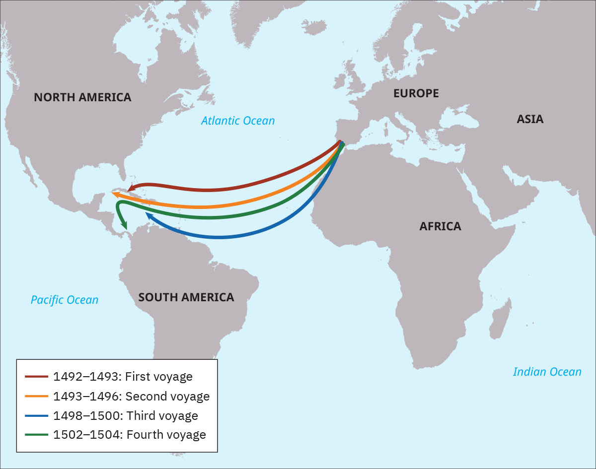

= 4-03 西班牙
:toc: left
:toclevels: 3
:sectnums:
:stylesheet: myAdocCss.css

'''

== 哥伦布, 1492 出发

In 1492, Christopher Columbus, in the employ of Queen Isabella and King Ferdinand of Spain, ventured out into the Atlantic in search of an oceanic route to India.

1492年，克里斯托弗·哥伦布, 在西班牙女王伊莎贝拉和国王斐迪南的雇佣下，冒险进入大西洋， 寻找通往印度的海洋航线 (  to compete with the Portuguese 与葡萄牙人竞争)。

The Voyages of Columbus. Christopher Columbus made four voyages between 1492 and 1504, all to the Caribbean. This was the beginning of European colonialism in the Americas.

哥伦布的航行。克里斯托弗·哥伦布在 1492 年至 1504 年间, 进行了四次航行，全部到达加勒比海。这是欧洲在美洲殖民主义的开始。

When Columbus arrived, the Indigenous population of the entire Western Hemisphere likely numbered around seventy-five million (compared to Europe’s population of probably around seventy million), although historians’ estimates vary greatly.

当哥伦布到达时，整个西半球的土著人口数量, 可能约为七千五百万（而欧洲的人口可能约为七千万），尽管历史学家的估计差异很大。

'''

==  哥伦布对美洲原住民的看法

They neither carry nor know anything of arms, for I showed them swords, and they took them by the blade and cut themselves through ignorance. They have no iron. They should be good servants and intelligent, for I observed that they quickly took in what was said to them, and I believe that they would easily be made Christians, as it appeared to me that they had no religion.

These people are very simple as regards the use of arms. With fifty men they can all be subjugated and made to do what is required of them.

(代表西班牙的) 克里斯托弗·哥伦布 (Christopher Columbus) 于 1492 年写道: 他们既不携带武器，也不知道任何武器，因为我向他们展示了剑，他们拿着剑，因无知而割伤了自己。他们没有铁. 他们应该是好的仆人和聪明人，因为我观察到, 他们很快就接受了我们对他们说的话，我相信他们很容易成为基督徒，因为在我看来他们没有宗教信仰。(人善被人欺. 人家第一时间就已经在判断你, 进行比较, 并定位下你与他们的地位高低.) 这些人在使用武器方面非常简单. 只要有五十个人，他们就可以被征服, 并迫使他们做"我们要求他们做的事情"。

'''

==  麦哲伦, 1519 出发

Ferdinand Magellan also dreamed of finding a route to the Spice Islands. He planned, however, to discover a westward route by sailing west from Portugal, instead of taking the long route eastward around the tip of Africa and through the Indian Ocean.

When the Portuguese king declined to fund the exploratory voyage, Magellan approached the king of Spain, who provided him with the funds and ships he needed. The crew came from many countries, which was common aboard ships at that time.

费迪南德·麦哲伦(葡萄牙人)也梦想找到一条通往香料群岛的航线。然而，他计划从葡萄牙向西航行，探索一条向西的航线，而不是"绕非洲一角、穿过印度洋向东走很长的航线"。

当葡萄牙国王拒绝资助这次探险航行时，麦哲伦找到了西班牙国王，西班牙国王为他提供了所需的资金和船只。

In 1519, with a fleet of five ships and a crew of two hundred seventy, Magellan departed from Spain. He crossed the Atlantic and sailed around the southern tip of South America.

On March 6, 1521, with their fresh water nearly exhausted after three months spent crossing the Pacific, they sighted Guam, and not long after, they made landfall in the Philippines.

1519 年，麦哲伦率领一支由五艘船, 和 270 名船员组成的舰队离开西班牙。他横渡大西洋，绕过南美洲南端.  +
1521年3月6日，他们在横渡太平洋三个月后淡水几乎耗尽的情况下，终于看到了关岛，不久之后，他们在菲律宾登陆。

'''

==  发现 (墨西哥)阿兹特克帝国 (1519)

In 1519, the conquistador Hernán Cortés landed at Potonchan on the Yucatán Peninsula and marched north to the interior of Mexico, where he encountered the powerful Aztec Empire.

1519年，征服者埃尔南·科尔特斯, 在尤卡坦半岛的波通昌登陆，向北进军墨西哥内陆，在那里遇到了强大的"阿兹特克帝国"。

'''

==  发现 (南美洲) 印加帝国 (1526)

Cortés’s exploits in Mexico were soon matched by those of another Spanish adventurer, Francisco Pizarro, who conquered the Inca Empire in South America.

科尔特斯在墨西哥(发现"阿兹特克帝国")的功绩, 很快被另一位西班牙冒险家弗朗西斯科·皮萨罗的功绩相媲美，后者征服了南美洲的"印加帝国"。

'''

==  到达日本 (1549)

The Portuguese were soon followed by the Spanish in 1549, and on the heels of the Portuguese and Spanish came the Dutch and the English.

1549 年，西班牙人紧随葡萄牙人(1543)之后而来 (到达日本)，紧接着葡萄牙人和西班牙人之后, (日本)又出现了荷兰人和英国人。

'''

==  控制菲律宾 (1571)

In 1571, the Spanish established the city of Manila, which became their capital in the East Indies.

1571年，西班牙人建立了马尼拉市，成为他们在东印度群岛的首都。

'''

==  大萧条时, 西班牙的”共和国”政体, 被”法西斯主义”推翻

In Spain, a military dictatorship was instituted in 1924. After it ended in 1930, a republic was established that quickly sought to modernize the nation. It tried to eliminate the Catholic Church’s dominant role in society and politics and attempted other changes such as land redistribution and the institution of voting rights for women and more liberal divorce laws.

西班牙于 1924 年建立了"军事独裁统治"。1930 年"军事独裁统治"结束后，建立了共和国，并迅速实现国家现代化。它试图消除"天主教会"在社会和政治中的主导地位，并尝试其他变革，例如土地重新分配, 和妇女投票权制度, 以及更自由的"离婚法"。

However, a serious military coup erupted in 1936. Fascists calling themselves Nationalists had co-opted much of the Spanish military. The popular general Francisco Franco, former head of Spain’s military academy, was opposed to Republican ideologies. British, French, and other European powers pursued a policy of nonintervention. The League of Nations also failed to take action.

Franco’s brand of fascism and his revulsion of popular democracy, liberal ideals, secularism, feminism, and communism were similar to those of Mussolini and Hitler.

然而，1936 年爆发了一场严重的军事政变。自称为"民族主义者"的法西斯分子, 收编了大部分西班牙军队. 受欢迎的西班牙军事学院前院长"弗朗西斯科·佛朗哥"将军, 反对"共和主义"意识形态。然而，英国、法国和其他欧洲大国, 奉行不干涉政策. "国际联盟"也没有采取行动。

佛朗哥的法西斯主义, 以及他对"大众民主、自由主义理想、世俗主义、女权主义和共产主义"的厌恶, 与墨索里尼和希特勒相似。

'''