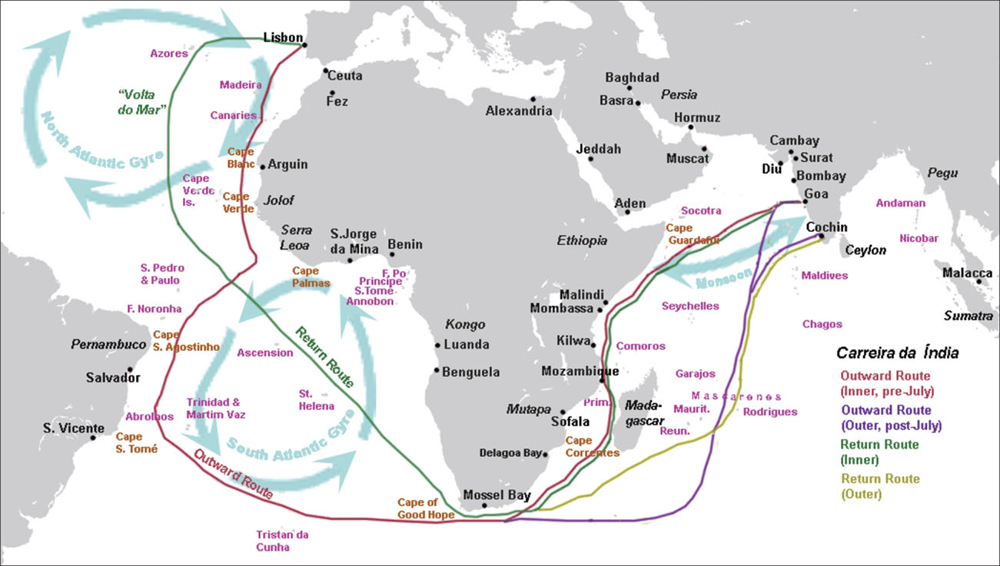

= 4-04 葡萄牙
:toc: left
:toclevels: 3
:sectnums:
:stylesheet: myAdocCss.css

'''

In 1341, the Portuguese sailed to the Canary Islands in the Atlantic. This was only the beginning of their exploration and conquest.

1341年，葡萄牙人航行到大西洋的"加那利群岛"。这只是他们探索和征服的开始。

== 占领摩洛哥的休达城 (1415)

In 1415, John I, grandson of Afonso IV, dispatched Portuguese forces to capture the city of Ceuta in Morocco. John hoped that control of a port on the North African coast would open that continent to both conquest and trade. To further cement his control of the region, he requested papal recognition of his efforts.

1415年，阿方索四世的孙子约翰一世, 派遣葡萄牙军队攻占摩洛哥的休达城。约翰希望, "控制北非海岸的一个港口"将使非洲大陆向征服和贸易开放。为了进一步巩固他对该地区的控制，他请求教皇承认他的努力。

'''

==  葡萄牙国王得到教皇认可, 夺取穆斯林在非洲的土地 (1418)

In April 1418, Pope Martin V granted the Portuguese king the right to all African lands taken from Muslim rulers.

1418 年 4 月，教皇马丁五世, 授予葡萄牙国王"从穆斯林统治者手中夺取的所有非洲土地"的权利。

'''

==  葡萄牙获得教皇认可, 拥有"博哈多尔角"以南非洲的独家贸易权. (1455)

The Portuguese claim to the riches of African trade was affirmed in 1455 in the Romanus Pontifex, a papal decree issued by Pope Nicholas V that granted Portugal exclusive rights to trade in Africa south of Cape Bojador, on the coast of Morocco.

1455 年，教皇尼古拉斯五世颁布的教皇法令《Romanus Pontifex 》, 确认了葡萄牙对非洲贸易财富的主张，该法令授予葡萄牙在摩洛哥海岸"博哈多尔角"以南的非洲, 进行贸易的专有权。

'''

==  Treaty of Alcáçovas 条约 (1479)

Under the terms of the 1479 Treaty of Alcáçovas, Portugal had renounced any claim to the Spanish throne and granted Spain control of the Canary Islands. In exchange, Portugal received the coast of Guinea in Africa, which was rich in gold, and all islands in the Atlantic south of the Canaries. This included not only those territories Portugal already controlled (Madeira, the Azores, and Cape Verde) but also any that might be discovered in the future.

根据 1479 年《阿尔卡索瓦斯条约》的条款，葡萄牙放弃了对西班牙王位的任何要求，并授予西班牙对加那利群岛的控制权。但作为交换，葡萄牙获得了盛产黄金的非洲几内亚海岸, 以及加那利群岛以南的所有大西洋岛屿。这不仅包括葡萄牙已经控制的领土（马德拉、亚速尔群岛和佛得角），还包括未来可能发现的任何领土。

'''

==  the Treaty of Tordesillas 条约 (1494)

Word of Columbus’s discoveries on behalf of the Spanish alarmed and angered the Portuguese. Spain’s claim to the Caribbean islands Columbus had explored  seemed to violate both the treaty and the pope’s decree.

"哥伦布代表西班牙人进行发现"的消息震, 惊并激怒了葡萄牙人。西班牙对"哥伦布探索的加勒比岛屿"的主权主张, 似乎违反了该条约(即 Alcáçovas 条约)和教皇的法令。

In 1494, following Columbus’s landing in the Caribbean, Spain and Portugal signed the Treaty of Tordesillas, ratifying Pope Alexander VI’s decision that all non-Christian lands west of a line drawn one hundred leagues west of the Cape Verde Islands off the coast of Africa, which Portugal already claimed, were to belong to Spain. Non-Christian lands east of the line were given to Portugal.

(经过谈判,) 西班牙和葡萄牙签署了《托尔德西里亚斯条约》，确认了教皇亚历山大六世的决定：即在非洲海岸佛得角群岛（Cape Verde Islands）以西100里格, 处划一条线.  该线以西的非基督教土地, 归西班牙所有， 除了葡萄牙已经宣称拥有的佛得角群岛外. 而该线以东的非基督教土地, 则归葡萄牙所有。

Treaty of Tordesillas. This Spanish map from 1622 shows in red the vertical dividing line described in the Treaty of Tordesillas. It cuts north to south through the Atlantic Ocean and across the eastern portion of Brazil. All land to the right of the line was deemed to belong to Portugal, and all land to the left to Spain.

托德西拉斯条约。这幅 1622 年的西班牙地图, 以红色显示了《托德西拉斯条约》中规定的垂直分界线。它从北向南穿过大西洋, 并穿过巴西东部。线右侧的所有土地, 均被视为属于葡萄牙; 线左侧的所有土地, 均属于西班牙。

Thus, when the explorer Pedro Álvares Cabral landed on the eastern coast of South America in 1500, he was able to claim it for Portugal.

因此，当探险家佩德罗·阿尔瓦雷斯·卡布拉尔(Pedro Álvares Cabral) 于 1500 年登陆南美洲东海岸时，他就能够为葡萄牙占领此地。

'''

==  达伽马 → 绕过非洲南端"好望角"，到达印度 (1497出发, 1498到达印度)

In 1498, da Gama sailed north along the east coast of Africa and from there across the Indian Ocean to the southwestern coast of India, where he landed in the port of Calicut (Kozhikode) in what is today the state of Kerala.

1498年，达伽马沿非洲东海岸向北航行，穿过印度洋到达印度西南海岸，在卡利卡特（科泽科德）港 （即今天的喀拉拉邦）登陆 。

The “India Run.” Working for Portugal, Vasco da Gama sailed north along the east coast of Africa and across the Indian Ocean to Calicut, in the southern Indian province of Kerala, establishing what became the typical sea route to India, the carreira da Índia, or “India Run.” Da Gama’s success in reaching India led to future expeditions.

“印度航程”。瓦斯科·达·伽马为葡萄牙工作，沿着非洲东海岸向北航行，穿过印度洋到达印度南部喀拉拉邦的卡利卡特，建立了通往印度的典型海上航线，即“印度航线” 。达伽马成功到达印度，为以后的探险活动奠定了基础。(因为为其他后来探险者, 指明了航路怎么走)

Da Gama had come to India on a quest to find an all-water route to Southeast and East Asia, the source of spices, silks, porcelains, and other Asian goods. Europeans had had access to such luxuries for centuries, but they were expensive. They had to be carried overland, which limited the amounts that could be brought to Europe, and they also passed through the hands of many intermediaries between their point of origin and their European consumers.

Finding an all-water route to the source was intended to eliminate these problems, and the nation that did so stood to become very wealthy.

Before the voyages of the Portuguese, trade with Asia had been monopolized by northern Italian merchants, especially the Venetians, to the envy of merchants in other countries. Da Gama hoped to change this.

达伽马来到印度是为了寻找一条通往东南亚和东亚的全水路航线，那里是香料、丝绸、瓷器和其他亚洲商品的来源地。几个世纪以来，欧洲人一直能享受到这样的奢侈品，但它们价格昂贵。它们必须通过陆路运输，这限制了可以带到欧洲的数量，而且它们还在原产地和欧洲消费者之间经过了许多中间商之手。

寻找一条通往水源的全水路的目的是为了消除这些问题，而这样做的国家将会变得非常富有。

在葡萄牙人远航之前，与亚洲的贸易一直被意大利北部商人，尤其是威尼斯人垄断，令其他国家的商人羡慕不已。达伽马希望改变这一点。

Reports of the marvelous wealth of India and the riches amassed by Portuguese merchants encouraged the Europeans of other nations to seek their fortunes in the Indian Ocean.

印度的惊人财富, 和葡萄牙商人积累的财富的报道, 鼓励其他国家的欧洲人到印度洋寻找财富。

'''

==  Treaty of Zaragoza 条约 (1529)

Hoping to lay claim to the riches of Asia, Spain then argued that the line dividing the Atlantic continued to the other side of the globe, bisecting the Pacific and giving the Spanish the right to territories in Asia as well. Portugal objected and turned to the Vatican again for help. In 1514, Pope Leo X declared that the line described in the Treaty of Tordesillas allocated territories in the Atlantic but not the Pacific. Spain had no claim to the lands of Asia.

(葡萄牙探索者到达印度后,) 为了获得亚洲的财富，西班牙随后辩称，大西洋的分界线, 一直延伸到地球的另一边， 将太平洋一分为二，西班牙也有权获得亚洲的领土。葡萄牙表示反对，并再次向梵蒂冈求助。 1514 年，教皇利奥十世宣布《托德西拉斯条约》中描述的分界线, 分配的是"大西洋"而非"太平洋"的领土。西班牙对亚洲土地没有任何主权要求。

To settle their claims to the islands, in 1529 Portugal and Spain signed the Treaty of Zaragoza, dividing the Pacific Ocean between them. The treaty awarded the Maluku Islands to Portugal with the understanding that should Spain wish to claim them it could, but it would have to compensate Portugal for its loss. Spain did not have the money to do so, and this fact, along with a convenient marriage of the Spanish and Portuguese kings to one another’s sisters, led Spain to abandon its claim to the Malukus.

为了解决对这些岛屿的主权要求，葡萄牙和西班牙在1529年签署了《萨拉戈萨条约》（Treaty of Zaragoza），瓜分了太平洋。该条约将马鲁古群岛划归葡萄牙，并规定如果西班牙希望对其提出主权要求，它可以这样做，但它必须赔偿葡萄牙的损失。西班牙没有钱这么做，再加上西班牙国王和葡萄牙国王彼此的姐妹结婚，使得西班牙放弃了对马鲁古群岛的主权。

In the treaties of Zaragoza and Tordesillas, two of the world’s nations divided the globe between them, never questioning their right to do so and turning repeatedly to the pope to give God’s sanction to their claims.

在萨拉戈萨和托德西拉斯条约中，世界上的两个国家瓜分了地球，从不质疑自己这样做的权利，并一再请求教皇批准他们的主张。

Unsurprisingly, however, the world’s other nations ignored both treaties.

England and the Netherlands, which had become Protestant nations during the Reformation, felt no need to abide by papal decrees, nor did France, though it remained Roman Catholic. As the French king Francis I explained, “The sun shines for me as it does for others.”

然而，毫不奇怪的是，世界上其他国家都无视这两项条约。 +
在宗教改革期间成为新教国家的英格兰和荷兰, 觉得没有必要遵守(天主教)教皇的法令. +
法国也没有必要遵守，尽管它仍然是罗马天主教。正如法国国王弗朗西斯一世所解释的那样：“阳光照耀着我，就如同它照耀着别人一样。”

'''

==  到达日本 (1543)

In 1543, Portuguese ships arrived in Japan. It was the logical end point of a route that had taken them around the coast of Africa, eastward through the Indian Ocean, and into the Pacific. They wished to trade. They also wished to win converts for the Roman Catholic Church, as they had done elsewhere in Asia.

1543年，葡萄牙船只抵达日本。这是他们绕过非洲海岸，向东穿过印度洋，进入太平洋的路线的逻辑终点。他们希望进行贸易。他们还希望为罗马天主教会赢得皈依者，就像他们在亚洲其他地方所做的那样。

'''