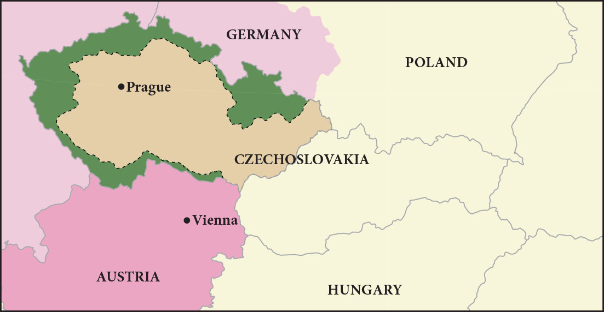

= 4-08 德国
:toc: left
:toclevels: 3
:sectnums:
:stylesheet: myAdocCss.css

'''

== 日耳曼邦联 (1815-1866)

In predominantly German-speaking lands, an alliance of thirty-nine sovereign states known as the Germanic Confederation emerged as a replacement for the former Holy Roman Empire in 1815. Because each of the member states retained political autonomy, the Germanic Confederation lacked executive power or centralized authority. The main goal of the Confederation, however, was not to replace the governmental powers of its member states but rather to create a unified defense against France and Russia.

Although it eventually succumbed to the Austrian Empire in 1866, the Confederation laid the groundwork for the nationalism that inspired German unification in 1871 and the creation of the modern nation-state of Germany.

1815 年，在以德语为主的地区，由 39 个主权国家组成的联盟（称为"日耳曼联邦"）出现，取代了前"神圣罗马帝国"。由于每个成员国都保留政治自治权，"日耳曼邦联"缺乏"行政权"或"中央集权"。然而，联邦的主要目标, 不是取代其成员国的政府权力，而是建立一个针对法国和俄罗斯的统一防御体系。

尽管联邦最终于 1866 年屈服于奥地利帝国，但它为民族主义奠定了基础。这个民族主义, 激发了1871 年德国统一, 和现代德意志民族国家的创建.

'''

==  德意志统一 (德意志帝国, 1871)

Bismarck’s efforts culminated in the formation of a unified Germany, and on January 18, 1871, he was appointed Imperial Chancellor of the German Empire.

俾斯麦的努力, 最终促成了统一德国的形成，并于1871年1月18日, 被任命为德意志帝国总理 。

Germany Unified. This map depicts the unified German nation in 1871 and the patchwork of previously autonomous states that merged under the principles of nationalism to form a single country.

德国统一。这幅地图描绘了 1871 年统一的德意志民族以及以前的自治国家 在民族主义原则下合并形成一个国家的拼凑而成。

image:/img/0046.jpg[,50%]

'''

==  首次提出殖民地需求 (1880 年代)

The view that imperial strength should be devoted to colony building was still very much in place in the late 1800s.

1800 年代末，"帝国力量应该投入殖民地建设"的观点, 仍很盛行。

Germany came late to the scramble for colonies, delayed by a number of factors. Until 1871, it consisted of a variety of German-speaking states and kingdoms in northern and central Europe, none wealthy or powerful enough to establish colonies. Once unified as a country in 1871, it still did not possess the ocean-going navy needed to trade with and defend colonies, and its first chancellor, Otto von Bismarck, in office from 1871 until 1890, initially had no interest in an overseas empire.

But by the 1880s he had changed his mind.

由于多种因素的影响，德国在争夺殖民地方面姗姗来迟。 1871 年之前，它由北欧和中欧的多个德语国家和王国组成，但没有一个富裕或强大到足以建立殖民地。 1871年统一为一个国家后，它仍然不具备远洋海军, 来与殖民地进行贸易, 和保卫殖民地. 而且其第一任总理奥托·冯·俾斯麦（1871年至1890 年在位）最初对海外帝国也没有兴趣。

但到了 1880 年代，他改变了主意。

'''

==  在太平洋上获取殖民地

Germany began to look to the Pacific as a place where it could establish itself as a colonial power. The United States, Britain, France, Japan, and the Netherlands already held extensive territory in the Pacific. Germany soon claimed part of New Guinea, part of the Solomon Islands, and the Marshall Islands.

In 1899, Germany’s growing power in the Pacific led to the partitioning of the Samoan Islands with the United States.

Germany also gained some of the smaller island groups—Palau, Caroline Islands, and Mariana Islands—by the beginning of the twentieth century.

德国开始将太平洋, 视为一个可以将自己建立为殖民国家的地方。但美国、英国、法国、日本和荷兰, 已经在太平洋拥有大片领土。德国很快就宣称对"新几内亚"的部分地区、"所罗门群岛"的部分地区, 和"马绍尔群岛"的部分地区拥有主权。  +
1899年，德国在太平洋地区实力的增强, 导致它与美国瓜分了"萨摩亚群岛"。 +
到二十世纪初，德国还获得了一些较小的岛屿群——帕劳群岛、加罗林群岛, 和马里亚纳群岛。

'''

==  在非洲获取殖民地

When Germany went in search of African colonies, there was not much left. In Africa, Germany staked its claim to regions scattered across the continent that had not already been colonized by France and England.

Germany took a portion of East Africa and Southwest Africa, which had a large border with the British colonies. Togoland and the Cameroons also became part of the German colonial empire.

当德国寻找非洲殖民地时，留给它的已所剩无几。在非洲，德国对分散在非洲大陆上, 尚未被法国和英国殖民的地区, 提出了主权要求. 德国占领了东非和西南部非洲的一部分，这些地区与英国殖民地有很大的边界。"多哥兰"和"喀麦隆"也成为德国殖民帝国的一部分.

German Colonies in 1914. This map shows the regions around the world that Germany had claimed as colonies by the beginning of World War I.

1914 年的德国殖民地。这张地图显示了第一次世界大战开始时, 德国声称为属于自己殖民地的世界各地地区。

image:/img/0050.jpg[,100%]

'''

==  一战后, 凡尔赛条约, 对德国的限制

=== 经济上的赔款

Other provisions of the treaty were designed to weaken Germany. Great Britain and France wanted Germany to literally pay for it, so they began a painstaking financial accounting. Every destroyed house or building was assigned a monetary value. Every lost military and civilian life was assessed an amount based on what that person’s future earnings might have been. These reparations totaled over $30 billion in 1919 dollars. (For context, a loaf of bread cost about 9 cents at the time.) Wilson hoped to persuade the other Allied leaders to abandon this course but was unable to.

凡尔赛条约的其他条款, 旨在削弱德国。英国和法国希望德国真正付出代价，因此他们开始进行艰苦的财务核算。每一座被摧毁的房屋或建筑物, 都被赋予了货币价值。每一位丧生的军人和平民的生命, 都会根据该人"未来的收入"进行评估。按 1919 年美元计算，这些赔款总额超过 300 亿美元。 （作为背景，当时一条面包的价格约为 9 美分。）威尔逊希望说服其他盟军领导人放 弃这一路线，但未能成功.

World War I devastated the world’s economies. The reparations owed by Germany were the means by which Britain and France planned to deal with their own debt, but they also created an economic house of cards that could easily tumble down.

但英法想用德国的赔款, 来作为自己还外债的资金来源, 这本身就创造了一个很容易倒塌的经济纸牌屋.

In essence, U.S. banks were loaning money to Germany that it was using to pay Britain and France, which in turn used that money to pay back their own debts to the United States.

从本质上讲，美国银行向德国借钱，德国用这些钱, 来支付对英国和法国的费用，而英国和法国又用这笔钱, 偿还自己欠美国的债务。(也就是说, 英法让德国去借入钱, 来还给英法. 就相当于德国要还两份钱, 分别给英法和美国. 给英法的那份也是从美国借入的, 就相当于德国要还给美国两份钱. )

'''

===  军事上的限制

One of the clearest punishments the treaty inflicted on Germany was restrictions on its military capacity. The Allied powers hoped that limiting the might of the German Army would limit its aggressiveness. The method of enforcing these limits was not resolved in Paris, however, and it arose as a real issue in the 1930s.

该条约对德国最明显的惩罚之一, 是限制其军事能力。盟军希望通过限制德国陆军的力量, 来限制其侵略性。(对中共也应该限制其军事能力, 才能保持两岸维持现状和保持和平.) 然而， 执行这些限制的具体方法, 并未在巴黎得到解决，这在 20 世纪 30 年代成为一个真正的问题。

'''

===  领土上的丧失

Germany was also shrunk, losing 13 percent of the territory it had held in Europe before the war.

- The Saar region was to be administered by the League of Nations.
- The Rhineland in the west (the Rhine River Valley) became a demilitarized zone.
- Germany also lost western territory to both France (Alsace-Lorraine, previously seized by Germany) and Belgium.
- In the east, German lands and the port of Danzig (now Gdańsk) were given to Poland. Other lands went to Lithuania and the new country of Czechoslovakia. As a result, Germany lost about one-tenth of its population, approximately 6.5 million people.

It also had to give up its colonies in Asia and Africa.

德国的国土面积也随之缩小，失去了"它在战前欧洲所占领土"的 13%。

- 萨尔地区将由"国际联盟"托管。
- 西部的莱茵兰（莱茵河谷）成为"非军事区"。
- 德国还失去了西部领土给法国（阿尔萨斯-洛林，之前被德国占领）和比利时。
- 在东部，德国的土地和但泽港（现格达斯克）被割让给波兰。其他土地则归"立陶宛"和新国家"捷克斯洛伐克"所有。

结果，德国失去了大约十分之一的人口，大约有 650 万人。

它还必须放弃在亚洲和非洲的殖民地。

'''

==  魏玛共和国, 面临的困难, 人民对政府失望, 并开始支持”极端主义思想”来解决困境 → 法西斯

=== 反民主势力对魏玛共和国的攻击和夺权

The country’s political parties had forced the kaiser to abdicate in favor of a new constitutional government, the Weimar Republic. Many Germans therefore believed civilian politicians were responsible for their defeat in the war. In 1919, monarchists, socialists, and communists began to disrupt politics and violently contest for control of the streets in Berlin and elsewhere.

(第一次世界大战的失败, ) 德国的政党迫使"德皇"退位，转而建立新的宪政政府——魏玛共和国。许多德国人认为"平民政治家"应对他们在战争中的失败负责。1919年，君主主义者、社会主义者和共产主义者, 开始破坏政治，并在柏林和其他地方激烈争夺街头的控制权。

chatgpt的解释: 这里的“文职官员”（civilian politicians）指的是魏玛共和国成立之后上台的平民政府，而不是德皇在位期间的官员。尽管德国在第一次世界大战中失败是发生在德皇威廉二世掌权时期，但在战争结束后，德皇被迫退位，魏玛共和国成立。这种过渡导致了许多德国人，尤其是保守派、军国主义者和民族主义者，将战败的责任转嫁给了新成立的平民政府和那些参与停战协议的文职官员。他们认为是这些政治家签署了对德国不利的《凡尔赛条约》，从而“背叛”了德国，使得战败和战后经济崩溃更加严重。

'''

===  一战后的赔款困难

John Maynard Keynes, the creator of Keynesian economics, was a British economist at the Paris Peace Conference in 1919. He was so unsettled by the potential financial repercussions of the treaty’s terms that he wrote a book contending the large reparations would mean economic ruin for Germany, endangering the entire European economy. His predictions were soon borne out.

凯恩斯认为, 巨额赔款将意味着德国的经济毁灭，危及整个欧洲经济。他的预言很快就得到了证实。

Germany faced numerous problems as the 1920s began. It was not only blamed for the war, but its foreign financial assets had also been seized under the treaty, further compromising its economic power, and it had been physically diminished when many rich industrial areas were cut away from its territory. Thus, one of the immediate problems facing the new democratic Weimar Republic government was finding a way to pay the reparations.

德国的外国金融资产被没收, 及许多富裕的工业区从其领土上被割去, 使德国经济削弱. 因此，新的民主魏玛共和国政府, 面临的首要问题之一, 就是如何支付赔款。

The first payment came due in 1921, but Germany was unable to fund the full amount, and the unresolved issue about how to enforce the treaty terms resurfaced. The next year, 1922, Germany defaulted on its payments to France and Britain. In response, French and Belgian troops occupied the Ruhr Valley, the center of German iron, coal, and steel production, as a means to force repayment.

第一次付款于 1921 年到期，但德国无法全额提供资金，关于如何执行条约条款中的"悬而未决的问题", 再次浮出水面。第二年，即 1922 年，德国拖欠了对法国和英国的付款。作为回应，法国和比利时军队占领了德国钢铁、煤炭和钢铁生产中心"鲁尔河谷"，作为强制偿还的手段。

To reach an immediate solution, Germany began simply printing more money. But this created an inflationary cycle, and the economy soon proved incapable of keeping up with the hyperinflation that resulted. Holding a job seemed ludicrous when pay could not keep up with a rate of inflation that increased by the day. The entire German middle class saw their savings disappear, and with their money went their support of the government.

为了立即解决问题，德国开始印更多的钱。但这造成了通货膨胀周期，很快事实证明经济无法跟上由此产生的恶性通货膨胀。当工资跟不上日益增长的通货膨胀率时，继续工作似乎是可笑的。整个德国中产阶级的储蓄都消失了，他们对政府的支持也随之消失。

Poor decisions by Germany’s Weimar Republic contributed to growing public frustration with the new democratic government. Many political groups attempted to use the country’s economic problems to catapult themselves to political power. Among these was the National Socialists or Nazi Party, whose members favored a more authoritarian government. One man who joined the group in the early 1920s was Adolf Hitler.

德国魏玛共和国的糟糕决定, 导致公众对新的民主政府越来越不满。许多政治团体试图利用该国的经济问题大做文章, 来为自己夺取政治权力。其中包括"国家社会主义者", 或"纳粹党"，其成员赞成更专制的政府。阿道夫·希特勒是 20 年代初加入该组织的人之一.

'''

===  解决大萧条问题的困难

The Great Depression put as many as four million Germans out of work. Hitler and the Nazis claimed that Jewish bankers and business owners had caused the Great Depression. The Nazis were becoming the largest party in the legislature. President Paul von Hindenburg was therefore pressured to appoint Hitler chancellor in January 1933.

大萧条导致多达 400 万德国人失业，希特勒和纳粹声称, 犹太银行家和企业主造成了大萧条. 纳粹正在成为"立法机构"中最大的政党。因此，"保罗·冯·兴登堡"总统被迫于 1933 年 1 月任命希特勒为总理。

'''

==  美国对德国债务的重新安排 (道斯计划, 1924.  杨计划 1929)

In 1924, the United States intervened by arranging the Dawes Plan, by which Germany’s installment payments were lowered but set to increase in the future as its economy rebounded. Foreign banks, many in the United States, also loaned Germany money to stabilize its inflationary economy. This enabled Germany to make its payments, but it also meant taking on more debt.

1924年，美国进行干预，制定了"道斯计划"，降低了德国的分期付款额，但随着其经济的复苏，未来的分期付款将会增加。外国银行（其中许多位于美国）也向德国提供贷款，以稳定其通货膨胀的经济。这使得德国能够支付债务，但也意味着承担更多债务。

Reparations continued to present an extreme economic hardship for Germany. In 1929, the United States announced a new proposal. The Young Plan stretched German reparations across a fiftynine– year payment schedule, slightly lowered the total to $29 billion, and arranged hundreds of millions of dollars’ worth of additional loans.

赔款继续给德国带来极度的经济困难。1929年，美国宣布了一项新提案。"杨计划"将德国的赔款延长到了五十九年的付款期限，将总额略微降低至 290 亿美元，并安排了价值数亿美元的额外贷款。
Germany continued to make payments until 1932, when the worldwide Great Depression made it untenable to continue. Later agreements canceled more of the remaining debt, and the last payment was finally made in 2010. In all, Germany paid only about one-eighth of the total.

德国继续付款直到 1932 年，当时全球范围内的大萧条, 使其无法继续下去。后来的协议取消了更多的剩余债务，最后一次付款终于在2010年支付。总共，德国只支付了总额的八分之一左右。

'''

==  希特勒被人民拥上台

In 1923, he decided to launch a takeover of the state government in Munich. The planned Beer Hall Putsch (so named because the targeted politicians were to be kidnapped at a beer hall) failed, and Hitler and many supporters were arrested. Over the next year in jail, Hitler wrote the book Mein Kampf (“My Struggle”), in which he outlined his plan for the Nazis to achieve political power and their goals for the resurgence of Germany. These goals included the uniting of German-speaking peoples under one government and an expansion eastward in search of Lebensraum or “living space.”

1923 年，希特勒决定接管慕尼黑州政府。计划中的啤酒馆政变（之所以如此命名，是因为目标政客将在啤酒馆被绑架）失败，希特勒和许多支持者被捕。在狱中的第二年，希特勒写下了《我的奋斗》一书，在书中他概述了纳粹获得政治权力的计划, 以及他们复兴德国的目标。这些目标包括将德语民族团结在一个政府的领导下，以及向东扩张以寻找“生存空间”。

Just a month after he became chancellor, an arsonist set the German Reichstag building in Berlin ablaze. The crime was falsely blamed on a Dutch communist and communist instigators in general.

The climate of crisis convinced conservative members of parliament to temporarily grant Hitler emergency powers through the Enabling Act passed in March 1933. Hitler was then able to rule essentially without the involvement of parliament or any constitutional limitations. In 1934, he declared himself führer (“leader”), fusing the offices of president and chancellor into one all-powerful role.

就在希特勒成为总理一个月后(1933)，一名纵火犯点燃了柏林的德国国会大厦。这一罪行被错误地归咎于荷兰共产主义者, 和一般的共产主义煽动者。

危机气氛, 促使保议会的保守派议员，在1933年3月通过《授权法案》，暂时授予希特勒紧急权力。随后希特勒基本上可以在没有议会参与或任何宪法限制的情况下, 进行统治。1934年，他宣布自己为元首（“领袖”），将总统和总理的职位合二为一，成为一个全能的角色。

'''

==  纳粹对德国的统治

=== 一党制

Hitler banned all political parties other than the Nazis, making Germany a oneparty state.

希特勒取缔了纳粹以外的所有政党，使德国成为"一党制"国家。

'''

=== 控制媒体宣传

All newspapers and media were Nazi controlled.

所有报纸和媒体, 都受到纳粹控制

'''

===  教育系统

The educational system was reorganized. All teachers were required to join the Nazi Teacher’s Alliance and use prescribed Nazi textbooks in their teaching.

Outside the classroom, German children were organized into tiered levels of youth organizations, culminating in the Hitler Youth for boys and the League of German Girls. For boys, the focus was on militaristic training, while girls were taught racial hygiene (the perceived need to bear children with certain traits) and the domestic skills to be good housewives and mothers.

教育系统进行了重组. 所有教师都被要求加入"纳粹教师联盟"，并在教学中使用规定的纳粹教科书。

在课堂之外，德国儿童被组织成不同层次的青年组织，最终形成了男孩希特勒青年团, 和德国女孩联盟。对于男孩来说，重点是军国主义训练，而女孩则接受种族卫生教育（认为需要生育具有某些特征的孩子）, 和家庭技能，以成为优秀的家庭主妇和母亲。

'''

===  秘密警察机构 → Gestapo 盖世太保

The various German security and secret police agencies were combined to create the Gestapo, which became the main dispatcher of violence and enforcer of order.

德国各个安全和秘密警察机构, 合并成立了"盖世太保"，它成为暴力的主要调度者, 和秩序的执行者。

'''

=== 领导层

Hermann Göring became the second most powerful Nazi leader, in charge of organizing the national economy and commanding the German air force, the Luftwaffe.

Heinrich Himmler transformed the paramilitary militia, the Schutzstaffel (SS), from a small force of 290 to over a million strong and was responsible for promoting German culture and institutions and overseeing the enforcement of Nazi racial policies.

赫尔曼·戈林，成为纳粹第二大领导人，负责组织国民经济, 并指挥德国空军德国空军。

海因里希·希姆莱 (Heinrich Himmler) 将准军事民兵"党卫队"(SS)从一支 290 人的小部队, 发展为超过 100 万人，负责推广德国文化和制度，并监督"纳粹种族政策"的执行。

'''

=== 限制犹太人

Laws were passed limiting job opportunities and social activities for Jewish people.

通过法律, 限制犹太人就业机会和社会活动.

'''

===  处理失业问题 → 让人们去搞基建, 参军

The Nazis assured the electorate that they were the only ones who could solve Germany’s economic problems and promised to restore its international prestige.

Hitler set out to provide jobs to all who needed them with a massive infrastructure program. The work week was expanded to sixty hours; workers could not strike or even ask for raises, but unemployment declined.

纳粹向选民保证，他们是唯一能够解决德国经济问题的人，并承诺恢复国际威望。

希特勒着手通过一项大规模的基础设施计划, 为所有需要的人提供就业机会。每周工作时间延长至六十小时；工人们不能罢工，甚至不能要求加薪，但失业率却下降了。

Those not working in an industrial capacity could find a place in the ever-expanding Germany military. Ignoring the limits imposed by the Versailles Treaty, Hitler swelled the German Army to nearly a million soldiers, calling the need to provide employment an emergency that must be met. However, there was little international will for such intervention. It could very well mean military engagement, and in the throes of the Depression, none of the former Allied nations were interested. Nor was there any popular support in these nations for such actions.

那些不从事工业工作的人, 则可以在不断扩张的德国军队中找到一席之地。希特勒无视《凡尔赛条约》的限制，将德国军队扩充至近百万士兵，并称"提供就业"是必须满足的紧急需要。然而，国际上几乎没有意愿进行这种干预。这很可能意味着军事介入，而在大萧条的阵痛中，没有一个前战胜国对此感兴趣。这些国家也没有民众支持这些行动。

Through employment programs and deficit spending (spending based on borrowing money rather than on raising money through taxation), the economic problems in Germany did begin to turn around under Hitler’s government. The unemployment rate dropped from a high of approximately 30 percent to about 10 percent.

通过就业计划, 和赤字支出（基于"借入钱"而不是通过"税收", 来筹集资金的支出），德国的经济问题在希特勒政府的领导下确实开始得到扭转。失业率从约30%的高位, 下降至约10%。

'''

== 占领非军事区 Rhineland (1936.3) ← 英法绥靖

By the 1930s, some in Britain and elsewhere had come to view Hitler as a deeply patriotic German seeking merely to serve the interests of his battered nation. Others saw him and his politics as potentially dangerous and unsettling to European stability.

The British government did, however, negotiate with Germany to contain the size of the German navy, and France sought a Treaty of Mutual Assistance with the Union of Soviet Socialist Republics (USSR).

Using the French-Soviet cooperation as an excuse, in March 1935 Hitler publicly announced that Germany had already secretly begun to rearm in defiance of the Treaty of Versailles. On March 2, 1936, about three thousand German troops reoccupied the Rhineland, a part of Germany demilitarized by the Treaty. France feared protesting this too strongly because it did not want and was not ready to fight another war. The British public did not see the move as overtly hostile.

20 世纪 30 年代，对希特勒, 英国等有一些人认为他只是个爱(德)国者. 而另一些人则认为他对欧洲有潜在危险. 为此, 英国还是做了准备, 与德国谈判, 以遏制德国海军的规模.  同时, 法国则与苏联签订互助条约.  (犹如三国志, "资本主义"与"共产主义", 都视"法西斯主义"为竞争对手. 不同的主义都视非己的意识形态, 为敌人.)

1935年3月，希特勒以"法苏在合作"为借口，公开宣布德国已无视《凡尔赛条约》，并秘密开始重新武装。

1936 年 3 月 2 日，德军重新占领了莱茵兰，这本是德国根据条约"非军事化"的地区。法国担心抗议过于强烈，因为它不想也没有准备好打另一场战争。英国公众则并不认为此举具有明显的敌意。

'''

==  将奥地利合并到德国中 (1938.3)

Though the Versailles Treaty specifically prohibited unification of Austria with Germany, Hitler moved to accomplish this anyway. Austria’s prime minister attempted to stave off unification by calling for a referendum in March, but the next day Hitler preemptively sent troops into Austria. When the referendum was held, the people voted for union with Germany.

Flush with his victory over Austria, Hitler continued to “gather the German people,” and his eyes turned to those portions of Czechoslovakia called the Sudetenland, containing some three million ethnic Germans, including many who had been folded into that nation by the Treaty of Versailles.

尽管《凡尔赛条约》明确禁止"奥地利"与"德国"统一，但希特勒还是采取了行动来实现这一目标。奥地利总理试图在三月份呼吁举行全民公投, 来阻止统一，但第二天希特勒就先发制人地向奥地利派遣军队。 公投举行时，人们投票支持与德国合并。(都军事占领该国了，当然支持公投合并了)

希特勒因战胜奥地利而喜悦兴奋，他继续“聚集德国人民”，他的目光转向了"捷克斯洛伐克"的苏台德地区，那里居住着大约三百万德意志人，其中许多人是根据《凡尔赛条约》被收归这个国家的。

'''

==  德国吞并苏台德地区 ← 慕尼黑条约 (1938.9), 绥靖政策

The Sudetenland. Inhabited largely by German speakers, the Sudetenland wrapped around the northern, western, and southern edges of Czechoslovakia, where that nation bordered Germany and Poland.

苏台德区。苏台德地区主要居住着讲德语的人，环绕着捷克斯洛伐克的北部、西部和南部边缘，该国与德国和波兰接壤。

The Czechoslovaks, in the only real democracy created by the Treaty of Versailles, pinned their hopes for defense against Germany on the western nations and on treaties for mutual defense signed with France in the 1920s and early 1930s. Sudeten Germans had organized their own Nazi Party, however, and began agitating to join Germany.

By 1938, it seemed that Britain and France were most concerned with avoiding another major war, so to defuse the situation, the Czechoslovak government granted the Sudeten Germans self-government. Tensions grew.

捷克斯洛伐克人在《凡尔赛条约》所创造的唯一真正的民主国家中，将防御德国的希望, 寄托在西方国家, 以及1920年代和1930年代初与法国签署的"共同防御条约"上。然而，"苏台德"地区的德国人组织了自己的纳粹党，并开始鼓动加入德国。

到了 1938 年，英国和法国似乎最关心的, 是避免另一场重大战争，因此为了缓和局势，"捷克斯洛伐克政府"授予"苏台德地区的德国人"以自治权。但紧张局势依然加剧。

As Hitler pressed for full inclusion of the Sudetenland in Germany and war seemed on the horizon, British prime minister Neville Chamberlain flew to Germany to meet with him. Hitler seemed prepared for war. Instead, Chamberlain proposed to hold a general conference to address the crisis over the Sudetenland, and Hitler agreed.

The Munich Conference was attended by Chamberlain, Hitler, French prime minister Édouard Daladier, and Mussolini (ostensibly a neutral party but one who had already assured Hitler of his support). On September 30, they produced the Munich Pact, in which Czechoslovakia granted territorial concessions to Germany, Poland, and Hungary in what has since been called appeasement. The hope of Great Britain and France was that Hitler would be satisfied and cease to be aggressive. The alternative meant fighting Germany, which neither government wanted.

当希特勒敦促将"苏台德地区"完全纳入德国，战争似乎一触即发时，英国首相内维尔·张伯伦飞往德国与他会面。希特勒似乎已经做好了战争准备。然而，张伯伦提议召开一次会议来解决苏台德地区的危机，希特勒同意了。

张伯伦、希特勒、法国总理爱德华·达拉第, 和墨索里尼（表面上是中立党，但已经向希特勒保证将给于支持）,  出席了"慕尼黑会议"。9月30日，他们签订了《慕尼黑条约》（Munich Pact），捷克斯洛伐克向德国、波兰和匈牙利作出领土让步，这后来被称为"绥靖政策"。英国和法国的希望是, 希特勒会满意, 并停止侵略。 另一种则选择意味着与德国作战，而这是两国政府都不希望发生的。

The Western world had not yet decided which was the greater threat to world peace, a fascist Germany or the communist Soviet Union. Some political conservatives in England and France hoped for a German alliance against the Soviets, as did Hitler.

The British military was not confident of its preparedness for war, and the isolationist policy of the United States diminished the hope of any aid from Washington. With anxiety growing in London over Britain’s possessions in Asia and Japanese aggressions there, domestic support for negotiated solutions was widespread among liberals, and a bargain with Hitler seemed a reasonable policy.

In the ensuing weeks, German troops entered the relinquished areas, and by the spring of 1939, Germany had gone on to absorb the rest of Czechoslovakia.

西方世界尚未决定, "法西斯德国"和"共产主义苏联"哪个对世界和平构成更大的威胁。英国和法国的一些政治保守派, 希望与德国结盟, 来对抗苏联，希特勒也是如此希望的。

英国军方对其战备能力缺乏信心，而美国的"孤立主义政策", 也削弱了华盛顿提供援助的希望。随着伦敦对"英国在亚洲的领土, 和日本在亚洲的侵略"的焦虑日益加剧，国内自由派, 普遍支持通过谈判来解决德国问题，与希特勒讨价还价, 似乎是一个合理的政策。

在接下来的几周内，德国军队进入了被对手放弃的地区，到 1939 年春天，德国已经吞并了"捷克斯洛伐克"的其余地区。

'''

== 二战后, 美国重建德国经济

The Soviets exacted retribution on the Germans largely by removing and transporting back to the Soviet Union virtually anything they considered useful to rebuilding their own industrial sector destroyed by the war. Thus, the Soviet occupation zone, which became the communist satellite of East Germany, was left with little to sustain itself. The western Allies, wanting relief from the burden of supporting destitute Germans and their largely destroyed economy, began to rebuild Germany’s industries in their occupation zones.

苏联对德国的报复, 主要是把他们认为有助于重建"被战争摧毁的工业部门"的几乎所有东西, 都运回了苏联。因此，东德的苏联占领区, 几乎没有什么可以维持的了。西方盟国开始重建德国的工业, 以减轻对德国扶贫的经济负担。

The right-wing dictatorships in Spain and Portugal, by staying out of the actual conflict, were able to avoid the reconstructive policies and action of the Allies.

西班牙和葡萄牙的右翼独裁政权, 通过不介入实际战争，能够避免战后盟军对他们的"重建"政策和行动。

'''