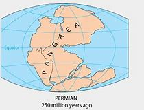

= eco 2020-5-16
:toc:

---

== Unemployment insurance 失业保险 词汇解说

(eco 2020-5-16 / United States / Welfare and work: The jobless market)

Inefficiencies 效率低；无效率；无能 *bedevil*(v.)长期搅扰 America’s response to soaring joblessness

America’s welfare system *is creaking* 嘎吱作响（开门或踩上木地板等时发出的声音）

May 16th 2020 |

1. Unemployment insurance 失业保险

1. bedevil : v. [ VN ] ( formal ) to cause a lot of problems for sb/sth over a long period of time 长期搅扰 +
=> 前缀be-, 强调。devil, 魔鬼。
- Inefficiencies *bedevil* America’s response to soaring joblessness 美国对失业率飙升做出的应对, 深受政策实施的低效率影响

EILEEN SHEPPARD *has been cutting hair professionally* for 20 years. Now 39, she *lives in* a small town in upstate 在（或向）州的乡野地区（尤指北部） New York, and *lost her livelihood* 赚钱謀生的手段；生计  when Andrew Cuomo, the state’s governor, *shut down* hair salons and other personal-care 个人护理；个人护理用品 businesses on March 20th. Millions *have found themselves* in a similar position, *pushing* America’s unemployment rate *to* an 80-year high (see left-side chart). As elsewhere, New York’s computer systems *could not handle* the rush of applications *for* unemployment insurance (UI). Ms Sheppard *spent hours* each day *refreshing* the site, which *kept crashing* and *losing* the information she had entered, while *trying to care for* her son, who *was* out of school (her husband *was* at his job (hours away)). She *eventually managed to apply*, but nearly two months [after she *lost* her job] she *has received* no money -- just a letter with further application instructions 用法说明；操作指南.

1. upstate : ( US ) in or to a part of a state that is far from its main cities, especially a northern part 在（或向）州的乡野地区（尤指北部） +
=> 来自美国地理位置分布，其诸多州的北部都远离海平面，以山地地区居多，后词义通用化。
- upstate New York 纽约的北部

1. livelihood : n. [ usually sing.U ] a means of earning money in order to live 赚钱謀生的手段；生计 +
=>  live(=life)生命 + -ly(y变i)形容词词尾 + -hood名词词尾
- a means/source of livelihood 生计；生活来源
- she *lives in* a small town in upstate New York, and *lost her livelihood* when Andrew Cuomo, the state’s governor, *shut down* hair salons and other personal-care businesses on March 20th. +
现年39岁的她, 住在纽约州北部的一个小镇上。3月20日，纽约州州长安德鲁•科莫(Andrew Cuomo)关闭了发廊和其他个人护理业务，让她失去了生计。

1. personal-care  个人护理；个人护理用品

1. her husband *was* at his job (hours away) 她的丈夫在几个小时以外的地方上班。

1. instruction : n. [ Cusually pl. ] *~ (to do sth)~ (that...)* something that sb tells you to do SYN order 指示；命令；吩咐 / instructions [ pl. ] *~ (on how to do sth)* detailed information on how to do or use sth SYN directions 用法说明；操作指南
- to ignore/carry out *sb's instructions* 忽视╱执行某人的命令
- She *eventually managed to apply*, but nearly two months [after she *lost* her job] she *has received* no money -- just a letter with further application instructions. +
她最终设法申请了失业保险，但在失业近两个月后，她没有收到任何钱——只是一封附有进一步申请说明的信。

So rapid a rise in unemployment *would stress* any country’s UI system. Some, such as Britain’s, *have coped surprisingly well*. America’s has not. The federal government *funds* the administration of these benefits *through* grants(n.)（政府、机构的）拨款 *tied(v.)束缚；约束；限制 [in part] to* how much each state *paid* in UI claims(n.) in the previous year. America’s long economic expansion *left* its system *woefully(ad.)糟糕的；严重的；不合意的 underfunded*(a.)资金不足的；缺乏资金的. So although `主` the weekly $600 top-up(n.)附加付款 that Congress *approved* in late March `系` *is* nominally generous, millions of people *have not had* their money. Preliminary(a.)预备性的；初步的；开始的 data *analysed* by The Economist *suggest that* `主` up to 15m Americans who *applied for* UI in March and April `谓` *had not received money* by the start of May.

1. grant : n. *~ (to do sth)* a sum of money that is given by the government or by another organization to be used for a particular purpose （政府、机构的）拨款
- *student grants* (= to pay for their education) 学生助学金

1.tie : v. [ VN ] [ usually passive ] *~ sb (to sth/to doing sth)* to restrict sb and make them unable to do everything they want to 束缚；约束；限制
- *to be tied* by a contract 受合同的约束
- The federal government *funds* the administration of these benefits *through* grants(n.) *tied(v.) [in part] to* how much each state *paid* in UI claims(n.) in the previous year. +
联邦政府通过拨款来为这些补助金的管理提供资金，部分取决于每个州在前一年中, 支付了多少失业保险金的申请。

1. woeful : a. [ usually before noun ] very bad or serious; that you disapprove of 糟糕的；严重的；不合意的
- She displayed *a woeful ignorance of the rules*. 她对这些条例表现出可悲的无知。

1. underfunded : a. ( of an organization, a project, etc. 机构、项目等 ) not having enough money to spend, with the result that it cannot function well 资金不足的；缺乏资金的
- seriously/chronically underfunded 严重╱长期缺乏资金
- America’s long economic expansion *left* its system *woefully underfunded*(a.). 美国长期的经济扩张, 导致其金融体系的资金严重不足。

1. top-up : n. a payment that you make to increase the amount of money, etc. to the level that is needed 附加付款
- Students will have to pay *top-up fees* (= fees that are above the basic level). 学生必须交附加费用。
- So although `主` the weekly $600 top-up(n.) that Congress *approved* in late March `系` *is* nominally generous, millions of people *have not had* their money.  +
因此，尽管国会在3月底批准的每周600美元的增资计划, 在名义上很慷慨，但仍有数百万人没有拿到钱。

1. preliminary : /prɪˈlɪmɪneri/  a. *~ (to sth)* happening before a more important action or event 预备性的；初步的；开始的 +
=> pre-,在前，早于，-limin,界限，门槛，开端，词源同limit.引申词义初步的，初期的。 +
- *preliminary results*/findings/enquiries 初步结果╱发现╱调查
- Preliminary(a.) data *analysed* by The Economist *suggest that*...  《经济学人》分析的初步数据显示...

`主` *Compounding* 使加重；使恶化;复合物；混合物 these administrative problems `系` *are* looming political battles. `主` The $600 booster 帮助（或激励、改善）…的事物 *expires* （因到期而）失效，终止；到期 at the end of July. Worries(n.) that America’s UI system *is* too generous and *discourages* 阻拦；阻止；劝阻;使灰心；使泄气；使丧失信心 work `谓` *are growing* on the right.

1. compound : v.
[ often passive ] to make sth bad become even worse by causing further damage or problems 使加重；使恶化 /n. a thing consisting of two or more separate things combined together 复合物；混合物  +
=> com-, 强调。-pon, 放置，词源同opponent, position. 即放在一起的。
- *The problems were compounded*(v.) by severe food shortages. 严重的食物短缺使问题进一步恶化

1. booster : n. a thing that helps, encourages or improves sb/sth 帮助（或激励、改善）…的事物 /
( also ˈbooster rocket ) a rocket that gives a spacecraft extra power when it leaves the earth, or that makes a missile go further 助推火箭
- *a morale/confidence booster* 士气╱信心的激励

1. discourage : v. *~ sth~ sb from doing sth* to try to prevent sth or to prevent sb from doing sth, especially by making it difficult to do or by showing that you do not approve of it 阻拦；阻止；劝阻 / *~ sb (from doing sth)* to make sb feel less confident or enthusiastic about doing sth 使灰心；使泄气；使丧失信心
- I leave a light on when I'm out *to discourage burglars*. 我出门时开着灯以防夜盗闯入
- The $600 booster *expires* at the end of July. `主` Worries(n.) that America’s UI system *is* too generous and *discourages* work `谓` *are growing* on the right. +
600美元的资助款, 将于7月底到期。右翼人士越来越担心, 美国的失业保险申请体系过于慷慨，阻碍了工作的恢复。

*Like* much else in America, UI *is less* 与其说 one system *than* 不如说 dozens, *held together* with some federal glue. It *is intended* to replace(v.)  a share of lost wages 工资损失 while a recipient 受方；接受者 *looks for work*. Democrat-run states in the north-east *tend to be more generous* than Republican-run southern states, but overall, pre-pandemic America *had* perhaps the rich world’s stingiest(a.)小气的；吝啬的 system. The average payout in 2019 *was equivalent to* about 40% of previous earnings. Tough rules *ensured that* only those diligently 勤奋地；勤勉地 seeking work *would be granted*(v.)（尤指正式地或法律上）同意，准予，允许 welfare （政府给予的）福利, and payouts *were* strictly time-limited(a.).

1. less...than... :  比…少，不如…多; /与其…不如…
- I regard him *less* as my teacher *than* as my friend. 与其说我把他当作老师，不如说我是把他当作朋友。 +
注：表示此义时, 与可与 more…than结构替换(但要注意词序的变化)。

1. recipient :  /rɪˈsɪpiənt/ n. ( formal ) a person who receives sth 受方；接受者
- *Like* much else in America, UI *is less* one system *than* dozens, *held together* with some federal glue. It *is intended* to replace(v.)  a share of lost wages while a recipient *looks for work*. +
就像美国其他地方一样，失业保险与其说是一个系统，还不如说是几十个系统，它们由联邦政府的胶水粘在一起的。该系统存在的目的, 是为了领受者在找工作时(失业期间), 能弥补一部分损失的收入。

1. stingy : /ˈstɪndʒi/ a. ( informal ) not given or giving willingly; not generous, especially with money 小气的；吝啬的 +
=> sting,刺，叮，蜇，-y,形容词后缀。俚语。
- Democrat-run states in the north-east *tend to be more generous* than Republican-run southern states, but overall, pre-pandemic America *had* perhaps *the rich world’s stingiest(a.) system*. +
民主党控制的东北部州, 往往比共和党控制的南部州更慷慨，但总的来说，在疫情大流行之前，美国的医疗体系可能是富裕国家中最吝啬的。

1. diligently : adv. 勤奋地；勤勉地 +
=> di-, 分开，散开，来自dis-变体。-lig, 选择，词源同collect, eligible. 即选出，甄选，引申为勤勉，勤奋。

1. grant : v. [ often passive ] ~ sth (to sb/sth)~ (sb) sth to agree to give sb what they ask for, especially formal or legal permission to do sth （尤指正式地或法律上）同意，准予，允许
- My request *was granted*. 我的请求得到批准。
- The average payout in 2019 *was equivalent to* about 40% of previous earnings. Tough rules *ensured that* only those diligently seeking work *would be granted*(v.) welfare, and payouts *were* strictly time-limited(a.).  +
2019年的失业保险金平均支付额, 只相当于之前收益的40%左右。严格的规定, 确保了只有那些勤奋工作的人才能获得失业金福利，而且发放也有严格的时期限制。

1. welfare : n. practical or financial help that is provided, often by the government, for people or animals that need it （政府给予的）福利
- welfare provision/services/work 福利供给╱机构╱工作

Now America *may have* the world’s most generous system. Work-search requirements *have been waived* 放弃（权利、要求等） -- rightly so, since people *should be* at home *rather than* pounding(v.)咚咚地走;反复击打；连续砰砰地猛击 the pavement （马路边的）人行道 -- and states *have extended* time limits on payouts. Workers *deemed* 认为；视为；相信 ineligible(a.)不合格的；不符合资格的  for ordinary UI, because they *are* self-employed(a.), business owners or *have* an irregular 不正常的；不合乎常规的;不规则的；无规律的；紊乱的 work history, *can now apply for* benefits. And the extra $600 a week *means that* some *can expect* a hefty(a.)很大的；超出一般的；可观的;大而重的 pay rise (see right-side chart). Goldman Sachs, a bank, *estimates that* three-quarters of laid-off 被解雇的 workers *are* in line *to receive benefits*(n.) that *exceed* their former wage. Payments *may be* slow to arrive, but workers *will in theory receive* back-pay 欠薪 when their claims *are finally processed*.

1. waive : /weɪv/ a. [ VN ] to choose not to demand sth in a particular case, even though you have a legal or official right to do so 放弃（权利、要求等） +
=> 来自 waif,摇摆，舍弃，扔弃。
- Now America *may have* the world’s most generous system. Work-search requirements *have been waived*(v.) -- rightly so, since people *should be* at home *rather than* pounding(v.) the pavement -- and states *have extended* time limits on payouts. +
现在, 美国的失业保险体系, 可能是世界上最慷慨的了。要求找工作的前提已经被放弃——这是对的，因为人们应该呆在家里，而不是在外面到处走动(砰砰地走在人行道上) -- 各州也延长了支付的时间长度。

1. pound : v. *~ (away) (at/against/on sth)* to hit sth/sb hard many times, especially in a way that makes a lot of noise 反复击打；连续砰砰地猛击 /[ V + adv./prep. ] to move with noisy steps 咚咚地走

1. pavement : n. ( BrE ) [C] ( NAmE also side·walk ) a flat part at the side of a road for people to walk on （马路边的）人行道

1. deem :v.( not usually used in the progressive tenses 通常不用于进行时 ) ( formal ) [ V (that)VN to inf ] to have a particular opinion about sth 认为；视为；相信 +
=> 词源同doom，裁定，判决，后词义弱化为认为，视为。 +
- *She deemed it prudent* not to say anything. 她认为什么都不说是明智的。
- `主` Workers *deemed* ineligible(a.) for ordinary UI, because they *are* self-employed(a.), business owners or *have* an irregular work history, `谓` *can now apply for* benefits. +
原本那些被视为不符合失业保险金申请的人, 如个体经营者、企业主, 或有不合常规的工作史的人, 如今都能申请福利金了.

1. ineligible :  /ɪnˈelɪdʒəbl/  a. *~ (for sth/to do sth)* not having the necessary qualifications to have or to do sth 不合格的；不符合资格的 +
=> e-, 向外。-leg, 收集，选出，词源同college, eligible. 即选出来的，优秀的，优雅的。
- *ineligible for* financial assistance 无资格得到财政援助

2. irregular : /ɪˈreɡjələr/  a. not normal; not according to the usual rules 不正常的；不合乎常规的 / not happening at times that are at an equal distance from each other; not happening regularly 不规则的；无规律的；紊乱的
- *an irregular practice* 不合常规的做法
- His behaviour *is highly irregular*. 他的行为很不正常。
- *irregular meals* 不定时的进食
- He visited his parents *at irregular intervals* . 他不定期地看望父母。

1. hefty : a. ( of an amount of money 钱的数额 ) large; larger than usual or expected 很大的；超出一般的；可观的 /( of a person or an object 人或物体 ) big and heavy 大而重的 +
=> 来自heft,举起，搬动，词源同heavy.
- They sold it easily and *made a hefty(a.) profit*. 他们毫不费力地卖掉了它，得到了一笔可观的利润
- And the extra $600 a week *means that* some *can expect* a hefty(a.) pay rise. 另外，每周600美元的额外收入, 意味着一些人可以期待大幅加薪。
- three-quarters of laid-off workers *are* in line *to receive benefits*(n.) that *exceed* their former wage. Payments *may be* slow to arrive, but workers *will in theory receive* back-pay when their claims *are finally processed*. +
四分之三的下岗工人, 将获得超过他们以前工资的福利金。这笔钱可能会延迟抵达，但理论上讲，当他们的要求最终得到处理时，工人们会收到补发的福利金。

1.  back-pay :  N-UNCOUNT Back pay is money which an employer owes an employee for work that he or she did in the past. 欠薪
-  He will receive *$6,000 in back pay*.
他将收到$6000的欠薪。

The creation of some odd economic incentives *was*, to an extent, unavoidable. The states’ UI systems *are* archaic(a.)早已过时的；陈旧的, *relying on* programming languages *devised* 发明；设计；想出 as long ago as 1959, *making* it impossible *to tailor* 专门制作；订做 payouts *more sharply*. Hence 因此；由此 the flat 不景气的；萧条的；生意清淡的;瘪了的；撒了气的  $600-a-week boost, which *is, roughly*, the difference between the national average weekly wage 全国的平均周薪 in 2019 ($970) and the average unemployment payout 平均失业津贴 that year ($370). `主` *Giving* some workers *more money* than they had earned in a job `谓` *may not be* the best use of public resources, but the people who benefit most *are likely to be* among America’s poorest. And `主` the money *thus “wasted”*(about $80bn, on the highly unrealistic 不切实际的；不实事求是的 assumption that 30m workers *are* on the programme [for an entire year]) `谓` *would amount to* just 3% of America’s total fiscal 财政的；国库的；国家岁入的 stimulus(（使生物产生反应的）刺激，刺激物) 财政刺激.

1. archaic :  /ɑːrˈkeɪɪk/ a. very old-fashioned 早已过时的；陈旧的
- *The system is archaic* and unfair and needs changing. 这个制度早已过时而且不公平，需要改变。

1. devise : [ VN ] to invent sth new or a new way of doing sth 发明；设计；想出
- *A new system has been devised* to control traffic in the city. 控制城市交通的新系统已经设计出来。

1. tailor : v. ~ sth to/for sb/sth to make or adapt sth for a particular purpose, a particular person, etc. 专门制作；订做 / n. （尤指为顾客个别定制男装的）裁缝 +
=> tail切 + -or名词词尾,人
- Most travel agents are prepared *to tailor* travel arrangements to meet individual requirements. 为了满足个别需要，大多数旅行社都愿意做出专门的旅游安排。
- The creation of some odd economic incentives *was*, to an extent, unavoidable. The states’ UI systems *are* archaic(a.), *relying on* programming languages *devised* as long ago as 1959, *making* it impossible *to tailor* payouts *more sharply*. +
在某种程度上，创造一些奇怪的经济刺激方式是不可避免的。美国的失业保险计算机系统非常陈旧，依赖于早在1959年就设计出来的编程语言，因此不可能大幅度的调整程序, 以应对(大幅增长的)支出。

1. hence : ad. ( formal ) for this reason 因此；由此
- We suspect they are trying to hide something, *hence* the need for an independent inquiry. 我们怀疑他们在企图隐瞒什么事，因此有必要进行独立调查。
- Hence the flat $600-a-week boost, which *is, roughly*, the difference between the national average weekly wage in 2019 ($970) and the average unemployment payout that year ($370). +
因此，每周600美元的工资增幅，大致相当于2019年全国平均周薪(970美元)和当年平均失业救济金(370美元)之间的差额。

1. stimulus : n. something that produces a reaction in a human, an animal or a plant （使生物产生反应的）刺激，刺激物
- sensory/verbal/visual stimuli 感官╱言语╱视觉刺激
- And `主` the money *thus “wasted”*(about $80bn, on the highly unrealistic assumption that 30m workers *are* on the programme for an entire year) `谓` *would amount to* just 3% of America’s total *fiscal stimulus*(n.). +
而由此“浪费”的资金(约800亿美元，基于一种极不现实的假设，即有3000万工人一整年都在该计划中), 将仅占美国财政刺激总额的3%。

*Back to* work

Anyone *hoping to game* the benefits system *is* likely to be disappointed. Regulations *are designed* to foil(v.) 挫败，阻止，制止（非法活动等） people who *quit a job* in order to *pick up* 拿起；举起；提起;接收（信号、声音、图像等） an unemployment cheque. *Having to quarantine*(v.)（对动物或人）进行检疫，隔离 because of `主` household illness /or care for a dependant 受扶养者（尤指孩子）；靠他人生活者 with covid-19 `谓` *will not cause* anyone *to lose* their UI; `主` *refusing to work* [*out of* （表示原因）因为，出于 a general fear of illness] `谓` *will*. `主` Some reopening states, including Iowa, Ohio and Texas, `谓` *encourage* employers *to report* workers who *refuse* a job offer, *disqualifying* 使不合格；使不适合；取消（某人）的资格 them *from* benefits.

1. foil : v.  [ VN ] [ often passive ] to stop sth from happening, especially sth illegal; to prevent sb from doing sth 挫败，阻止，制止（非法活动等） +
=> 来自拉丁语fullo, 踩，特指洗衣，浣纱，词源同defile, full(漂洗衣物)。引申词义挫败。
- to foil(v.) a plan/crime/plot 挫败计划╱犯罪╱阴谋
- Anyone *hoping to game* the benefits system *is* likely to be disappointed. Regulations *are designed* to foil(v.) people who *quit a job* in order to *pick up* an unemployment cheque. +
任何想玩弄福利制度的人都可能会失望。法规被指定, 以阻止那些仅为了领取失业支票而辞职的人。

1. quarantine :/ˈkwɔːrəntiːn/  v. [ VN ] to put an animal or a person into quarantine （对动物或人）进行检疫，隔离 +
=> 来自拉丁语quadraginta,四十，来自quadr-,四，-gin,十，词源同ten,dean.现词义来自17世纪意大利威尼斯港对来自瘟疫区的商品和货物实行的四十天隔离检验以确保瘟疫不会入境。
- `主` *Having to quarantine*(v.) because of household illness or care for a dependant(n.) with covid-19 `谓` *will not cause* anyone *to lose* their UI; *refusing to work* out of a general fear of illness *will*.  +
因为家人生病, 或为了照顾感染冠状病毒的家属, 而不得不进行隔离，不会导致任何人失去失业保险资格；但出于对疾病的普遍恐惧而拒绝去工作, 则会造成失业保险金领取资格的丧失。

1. dependant : n.( BrE ) ( NAmE BrE de·pend·ent ) a person, especially a child, who depends on another person for a home, food, money, etc. 受扶养者（尤指孩子）；靠他人生活者

1. 一些重新复工开放的州，包括爱荷华州、俄亥俄州和德克萨斯州，鼓励雇主们举报那些拒绝工作的工人，使他们失去领取失业保险金的资格。

Some economists *want* the government *to do more* to encourage(v.)  employers *to reduce* working hours *rather than* laying people off （因工作不多而）解雇 -- especially useful when businesses *are allowed to reopen* but *face* weak demand. With such programmes, *explains* Annelies Goger of the Brookings Institution, a think-tank, workers “*don’t get the message that* they’*ve lost* their jobs. They *get the message that* things are on pause.” Just over half of American states *have* short-term-work 短期工作 programmes, with UI *covering* the lost hours, but take-up(n.)（福利等的）领受率 *had been* low. [Since the pandemic *began*] take-up(n.)（福利等的）领受率 *has increased*, and Michigan *has expanded* its programme; workers in the schemes *remain eligible 有资格的；合格的；具备条件的 for* supplemental 增补性的；补充性的；额外的；外加的 benefits. Katharine Abraham at the University of Maryland *points to* research *suggesting that* `主` merely raising(v.) employers’ awareness 知道；认识；意识；兴趣 of such programmes `谓` *could make* a big difference.

1. take-up : n. [ Using. ] the rate at which people accept sth that is offered or made available to them （福利等的）领受率
- a low take-up of government benefits 政府救济金的低领取率
- Just over half of American states *have* short-term-work programmes, with UI *covering* the lost hours, but take-up *had been* low. +
美国有超过一半的州, 有短期工作计划，失业保险金会覆盖损失了工作时间，但该保险金的使用率一直很低。

1. [Since the pandemic *began*] take-up(n.) *has increased*, and Michigan *has expanded* its programme; workers in the schemes *remain eligible for* supplemental benefits. +
自疫情大流行开始以来，失业保险金的领取率就开始增加，密歇根州也扩大了其计划; 参加该计划的人, 仍有资格获得追加的福利金。

1. awareness : n. ~ (of sth)~ (that...) knowing sth; knowing that sth exists and is important; being interested in sth 知道；认识；意识；兴趣
- `主` merely raising(v.) employers’ awareness of such programmes `谓` *could make* a big difference. 仅仅提高雇主对此类项目的认识，就可能产生重大影响。

Another option *would be* to prolong(v.) the more generous unemployment system *past* July. Michael Bennet, a Democratic senator from Colorado, *has proposed* extending(v.) the current level of federal UI *until* the public-health emergency *ends*, and then *gradually reducing* benefits. But [at some point] such payouts *will hinder* the economic recovery, [in particular] the reallocation 再分配 of workers from declining sectors *to* up-and-coming(a.)有前途的；前程似锦的 ones. Some research *has indicated 表明；显示（信息）;暗示;指出 that* a reduction in unemployment benefits in 2014-15 *helped* kick-start(v.)促使…开始；使（项目）尽快启动;用脚踏启动（摩托车） America’s pre-pandemic jobs boom.

1. Another option *would be* to prolong(v.) the more generous unemployment system *past* July. Michael Bennet, a Democratic senator from Colorado, *has proposed* extending(v.) the current level of federal UI *until* the public-health emergency *ends*, and then *gradually reducing* benefits. +
另一种选择是, 将更为慷慨的失业制度延长至7月份以后。来自科罗拉多州的民主党参议员迈克尔•班纳特(Michael Bennet)提议，将目前的联邦医疗保险, 延长至公共卫生紧急状况结束后，然后再逐步减少福利。

1. reallocation : n. 再分配

1.  up-and-coming : a. likely to be successful and popular in the future 有前途的；前程似锦的
- up-and-coming(a.) young actors 前程似锦的年轻演员
- But [at some point] such payouts *will hinder* the economic recovery, [in particular] the reallocation of workers from declining sectors *to* up-and-coming(a.) ones. +
但在某种程度上，这样的支出, 将会阻碍经济复苏，尤其是阻碍工人从衰退性行业转向复苏行业的重新分配。

1. kick-start : v.  to do sth to help a process or project start more quickly 促使…开始；使（项目）尽快启动 /用脚踏启动（摩托车）
- Some research *has indicated that* a reduction in unemployment benefits(n.) in 2014-15 *helped* kick-start(v.) America’s pre-pandemic jobs boom. +
一些研究表明，2014-15年时的减少失业救济, 帮助开启了美国在疫情大流行之前所拥有的就业繁荣。

Most probably, the unemployment system *will return to* its pre-pandemic ways [sooner rather than later]. Lindsey Graham, a Republican senator, *has said* the $600-a-week programme *would be extended* “over our dead bodies”. The economy *is reopening* and bosses *are looking for* workers. Congressional Republicans *have pressed for* 催促；敦促；逼迫;不断要求 broader protections for employers, *similar to* those *given* by President Donald Trump *to* the meat industry, which *would shield* them *from* liability （法律上对某事物的）责任，义务 for covid-related deaths *provided* 如果；假如；在…条件下 they *follow* minimum federal safety standards. Democrats *may reluctantly fall in 集合；列队 line* in exchange for more state and local aid(n.) in the next round of relief （给灾区或交战地区人民提供的）救济，救援物品;救济金. Before long 不久以后, many American workers *will face* unpalatable 令人不快的；难以接受的; 难吃的；不可口的 choices.

1. *press for sth* : to keep asking for sth 不断要求  SYN demand; push for
- They continued *to press for a change* in the law. 他们不断要求修改这项法律。

1. provided : conj. ( also pro·vid·ing ) used to say what must happen or be done to make it possible for sth else to happen SYN if 如果；假如；在…条件下
- We'll buy everything you produce, *provided* of course the price is right. 当然了，倘若价格合适，我们将采购你们的全部产品。
- Congressional Republicans *have pressed* for broader protections for employers, *similar to* those *given* by President Donald Trump *to* the meat industry, which *would shield* them *from* liability for covid-related deaths [在...前提条件下 *provided* they *follow* minimum federal safety standards]. +
经济正在重新开放，老板们正在寻找工人。国会共和党人一直在施压，要求为雇主提供更广泛的保护，类似于唐纳德·特朗普(Donald Trump)总统给予肉类行业的保护，这将保护他们免受与冠状病毒相关的死亡的责任，前提是他们遵守最低联邦安全标准。

1. *fall in* : if soldiers fall in , they form lines 集合；列队
- The sergeant ordered his men *to fall in*. 中士命令士兵集合。
- Democrats *may reluctantly fall in line* in exchange for more state and local aid(n.) in the next round of relief. Before long, many American workers *will face* unpalatable choices.

1. unpalatable :  /ʌnˈpælətəbl/  a. ( of facts, ideas, etc. 事实、意见等 ) unpleasant and not easy to accept 令人不快的；难以接受的 /not pleasant to taste 难吃的；不可口的 +
=> 来自拉丁语palatum,腭，上嘴唇。
- Only then *did I learn the unpalatable truth*. 直到那时我才得知令人难以接受的真相。
- *unpalatable food* 难吃的食物
- Democrats *may reluctantly fall in line* in exchange for more state and local aid(n.) in the next round of relief. Before long, many American workers *will face* unpalatable choices. +
民主党人可能会不情愿地加入进来，以换取在下一轮救援中获得更多的州和地方援助。不久，许多美国工人将面临令人不快的选择(即减少失业金救济, 促进他们重返工作岗位)。

---

== Unemployment insurance

(eco 2020-5-16 / United States / Welfare and work: The jobless market)

Inefficiencies bedevil America’s response to soaring joblessness

America’s welfare system is creaking

May 16th 2020 |

EILEEN SHEPPARD has been cutting hair professionally for 20 years. Now 39, she lives in a small town in upstate New York, and lost her livelihood when Andrew Cuomo, the state’s governor, shut down hair salons and other personal-care businesses on March 20th. Millions have found themselves in a similar position, pushing America’s unemployment rate to an 80-year high (see left-side chart). As elsewhere, New York’s computer systems could not handle the rush of applications for unemployment insurance (UI). Ms Sheppard spent hours each day refreshing the site, which kept crashing and losing the information she had entered, while trying to care for her son, who was out of school (her husband was at his job (hours away)). She eventually managed to apply, but nearly two months [after she lost her job] she has received no money -- just a letter with further application instructions.

So rapid a rise in unemployment would stress any country’s UI system. Some, such as Britain’s, have coped surprisingly well. America’s has not. The federal government funds the administration of these benefits through grants(n.) tied(v.) [in part] to how much each state paid in UI claims(n.) in the previous year. America’s long economic expansion left its system woefully underfunded(a.). So although `主` the weekly $600 top-up(n.) that Congress approved in late March `系` is nominally generous, millions of people have not had their money. Preliminary(a.) data analysed by The Economist suggest that `主` up to 15m Americans who applied for UI in March and April `谓` had not received money by the start of May.

`主` Compounding these administrative problems `系` are looming political battles. `主` The $600 booster expires at the end of July. Worries(n.) that America’s UI system is too generous and discourages work `谓` are growing on the right.

Like much else in America, UI is less one system than dozens, held together with some federal glue. It is intended to replace(v.)  a share of lost wages while a recipient looks for work. Democrat-run states in the north-east tend to be more generous than Republican-run southern states, but overall, pre-pandemic America had perhaps the rich world’s stingiest(a.) system. The average payout in 2019 was equivalent to about 40% of previous earnings. Tough rules ensured that only those diligently seeking work would be granted(v.) welfare, and payouts were strictly time-limited(a.).

Now America may have the world’s most generous system. Work-search requirements have been waived -- rightly so, since people should be at home rather than pounding(v.) the pavement -- and states have extended time limits on payouts. Workers deemed ineligible(a.) for ordinary UI, because they are self-employed(a.), business owners or have an irregular work history, can now apply for benefits. And the extra $600 a week means that some can expect a hefty(a.) pay rise (see right-side chart). Goldman Sachs, a bank, estimates that three-quarters of laid-off workers are in line to receive benefits(n.) that exceed their former wage. Payments may be slow to arrive, but workers will in theory receive back-pay when their claims are finally processed.

The creation of some odd economic incentives was, to an extent, unavoidable. The states’ UI systems are archaic(a.), relying on programming languages devised as long ago as 1959, making it impossible to tailor payouts more sharply. Hence the flat $600-a-week boost, which is, roughly, the difference between the national average weekly wage in 2019 ($970) and the average unemployment payout that year ($370). `主` Giving some workers more money than they had earned in a job `谓` may not be the best use of public resources, but the people who benefit most are likely to be among America’s poorest. And `主` the money thus “wasted”(about $80bn, on the highly unrealistic assumption that 30m workers are on the programme for an entire year) `谓` would amount to just 3% of America’s total fiscal stimulus.

Back to work

Anyone hoping to game the benefits system is likely to be disappointed. Regulations are designed to foil(v.) people who quit a job in order to pick up an unemployment cheque. Having to quarantine(v.) because of household illness or care for a dependant with covid-19 will not cause anyone to lose their UI; refusing to work out of a general fear of illness will. Some reopening states, including Iowa, Ohio and Texas, encourage employers to report workers who refuse a job offer, disqualifying them from benefits.

Some economists want the government to do more to encourage(v.)  employers to reduce working hours rather than laying people off -- especially useful when businesses are allowed to reopen but face weak demand. With such programmes, explains Annelies Goger of the Brookings Institution, a think-tank, workers “don’t get the message that they’ve lost their jobs. They get the message that things are on pause.” Just over half of American states have short-term-work programmes, with UI covering the lost hours, but take-up(n.) had been low. [Since the pandemic began] take-up(n.) has increased, and Michigan has expanded its programme; workers in the schemes remain eligible for supplemental benefits. Katharine Abraham at the University of Maryland points to research suggesting that `主` merely raising(v.) employers’ awareness of such programmes `谓` could make a big difference.

Another option would be to prolong(v.) the more generous unemployment system past July. Michael Bennet, a Democratic senator from Colorado, has proposed extending(v.) the current level of federal UI until the public-health emergency ends, and then gradually reducing benefits. But [at some point] such payouts will hinder the economic recovery, [in particular] the reallocation of workers from declining sectors to up-and-coming(a.) ones. Some research has indicated that a reduction in unemployment benefits in 2014-15 helped kick-start(v.) America’s pre-pandemic jobs boom.

Most probably, the unemployment system will return to its pre-pandemic ways [sooner rather than later]. Lindsey Graham, a Republican senator, has said the $600-a-week programme would be extended “over our dead bodies”. The economy is reopening and bosses are looking for workers. Congressional Republicans have pressed for broader protections for employers, similar to those given by President Donald Trump to the meat industry, which would shield them from liability for covid-related deaths provided they follow minimum federal safety standards. Democrats may reluctantly fall in line in exchange for more state and local aid(n.) in the next round of relief. Before long, many American workers will face unpalatable choices.

---

== Covid nostra 词汇解说

(eco 2020-5-16 / International / Crime and covid-19: Covid nostra)

The pandemic *is creating fresh opportunities for* organised crime

And governments *are not paying attention*

May 16th 2020 | JOHANNESBURG, ROME AND SÃO PAULO

KARACHI 巴基斯坦港市 IS AMONG Asia’s most crime-ridden 充满（某种不良事物）的；满是…的 cities. And yet in eight days in March, after covid-19 *forced* it *into* lockdown, not a single car *was reported stolen*. El Salvador 中美洲一国家, which *has* one of the world’s highest murder rates, *enjoyed* four homicide （蓄意）杀人罪-free days in the same month. Many countries *have reported* tumbling （价格或数量）暴跌，骤降;（使）跌倒，摔倒，滚落，翻滚下来 crime rates, 因为 *as* `主` crooks(n.)骗子, *along with* everyone else, `谓` *have shut themselves away*. Italy *was* the first European country *to lock down*, on March 9th. Even before then, many people *were working* from home. The number of crimes *reported* in Italy between March 1st and March 22nd *dropped* by 64% *compared with* the same period in 2019.

1. KARACHI : /kə'rɑ:tʃi/ （巴基斯坦港市）

1. ridden : /ˈrɪdn/  a. ( usually in compounds 通常构成复合词 ) full of a particular unpleasant thing 充满（某种不良事物）的；满是…的
- *crime-ridden* : adj. 犯罪猖獗的；充满犯罪行为的
- KARACHI IS AMONG Asia’s *most crime-ridden cities*. 卡拉奇是亚洲犯罪最猖獗的城市之一。
- a *disease-ridden* slum 疾病流行的贫民窟
- a *class-ridden* society 等级森严的社会
- She was *guilt-ridden* at the way she had treated him. 她为过去那样对待他而深感内疚。

1. El Salvador （中美洲一国家）

1. homicide :  /ˈhɑːmɪsaɪd/ n. ( law 律 ) the crime of killing sb deliberately （蓄意）杀人罪 +
=> 来自拉丁语homo,人，-cid,杀，词源同herbicide.
- El Salvador, which *has* one of the world’s highest murder rates, *enjoyed* four homicide-free days in the same month.  +
萨尔瓦多是世界上谋杀率最高的国家之一，同月中有四天没有人被谋杀。

1. tumble :  /ˈtʌmbl/ v. to fall rapidly in value or amount （价格或数量）暴跌，骤降 / to fall downwards, often hitting the ground several times, but usually without serious injury; to make sb/sth fall in this way （使）跌倒，摔倒，滚落，翻滚下来 +
=> 来自古英语 tumbian,跳舞，跳跃，翻滚，来自 Proto-Germanic*tumona,旋转，转动，词源同 tumbler,tumbrel.-le,表反复。引申诸相关词义。
- He slipped and *tumbled down the stairs*. 他脚一滑滚下了楼梯。
- The price of oil *is still tumbling*. 油价仍在急遽下跌。

1. crook : ( informal ) a dishonest person 骗子
- Many countries *have reported* tumbling crime rates, 应为 as crooks(n.), *along with* everyone else, *have shut themselves away*. +
许多国家都报告了犯罪率的下降，因为骗子和其他人一样，都把自己隔离了起来了。

“I *would not be surprised* if crime statistics, which *are dominated by* less serious crimes *like* theft and various kinds of street crime, *were* to go down, [at least] temporarily,” *says* Jürgen Stock, secretary-general 秘书长 of Interpol 国际刑警组织, the world policing body. But government figures *reflect* only reported crime -- and `主` *not* all crime `系` *is* reported, especially when `主` lawbreaking(n.)违反法律, *along with* much else, `谓` *has gone* indoors. The Italian figures *showed* a drop of 44% in domestic 家用的；家庭的；家务的 violence. Police *reckon* that *is* because many victims *dare not call* to report(v.) assaults while their assailants 攻击者；行凶者 *are within earshot* 听力所及之范围.

1. secretary-general : n. N-COUNT The secretary-general of an international political organization is the person in charge of its administration. 秘书长
- the United Nations *Secretary-General*. 联合国秘书长。
- “I *would not be surprised* if crime statistics, which *are dominated by* less serious crimes *like* theft and various kinds of street crime, *were* to go down, at least temporarily,” *says* Jürgen Stock, secretary-general of Interpol, the world policing body. +
世界警察组织国际刑警组织(Interpol)秘书长于尔根•斯托克(Jurgen Stock)表示:“如果犯罪统计数据下降(至少是暂时下降)，我不会感到意外。犯罪统计数据主要由盗窃和各种街头犯罪等不那么严重的犯罪活动构成。”

1. Interpol  : n.   /ˈɪntəpɒl/ [ sing.+sing./pl.v. ] an international organization that enables the police forces of different countries to help each other to solve crimes 国际刑警组织

1. lawbreaking : n. 违反法律, adj. 违反法律的

1. domestic : a. [ only before noun ] used in the home; connected with the home or family 家用的；家庭的；家务的
- the growing problem of *domestic violence* (= violence between members of the same family) 日趋严重的家庭暴力问题
- The Italian figures *showed* a drop of 44% in domestic violence. Police *reckon* that *is* because many victims *dare not call* to report(v.) assaults while their assailants *are* within earshot. +
意大利的数据显示家庭暴力下降了44%。警方认为，这是因为许多受害者不敢打电话报案，而袭击者就在他们的听力范围内。

1. assailant : n.  /əˈseɪlənt/  ( formal ) a person who attacks sb, especially physically 攻击者；行凶者

1. earshot :  /ˈɪrʃɑːt/  n. 听力所及之范围 +
*OUT OF EARSHOT (OF SB/STH)* : too far away to hear sb/sth or to be heard 在听力范围之外
*WITHIN EARSHOT (OF SB/STH)* : near enough to hear sb/sth or to be heard 在听力范围之内

Meanwhile Gun Violence Archive 档案；档案馆；档案室, an NGO 非政府组织（独立于政府或商界的慈善机构、协会等） *based* in Washington, DC, *counted* more than 2,000 deaths by shooting in America between March 1st and April 19th—a 6% *increase over* the average in the same period during the past three years. That *echoes* 重复，附和（想法或看法） what *happened* in the 1918-19 flu pandemic. According to Barry Latzer, an emeritus(a.)（常指大学教师）退休后保留头衔的，荣誉退休的 professor at the John Jay College of Criminal Justice 刑事司法学院 in New York, murders(n.) in 1918 *increased* in each of the five worst-affected states. Sheltering [in place] *shortens* （使）变短，缩短 tempers 脾气；易怒的性情;心情；情绪；心境. It *also makes it easier* for gangsters 匪徒；歹徒；土匪 *to locate* 找出…的准确位置；确定…的准确地点 enemies and rivals.

1. archive :  /ˈɑːrkaɪv/  ( also arch·ives [ pl. ] ) a collection of historical documents or records of a government, a family, a place or an organization; the place where these records are stored 档案；档案馆；档案室

1. NGO : non-governmental organization (a charity, association, etc. that is independent of government and business) 非政府组织（独立于政府或商界的慈善机构、协会等）

1.  echo :  v. to repeat an idea or opinion because you agree with it 重复，附和（想法或看法） /to repeat what sb else has just said, especially because you find it surprising （尤因感到意外而）重复…话，模仿
- This is a view *echoed* by many on the right of the party. 这是党内许多右翼分子都重复过的观点。
- Meanwhile Gun Violence Archive, an NGO *based* in Washington, DC, *counted* more than 2,000 deaths by shooting in America between March 1st and April 19th—a 6% *increase over* the average in the same period during the past three years. That *echoes* what *happened* in the 1918-19 flu pandemic.  +
与此同时，总部位于华盛顿特区的非政府组织“枪支暴力档案”(Gun Violence Archive)统计，在3月1日至4月19日期间，美国有超过2000人死于枪击，比过去三年同期的平均水平上升了6%。这与1918-19年流感大流行时的情形类似。

1. emeritus :  /ɪˈmerɪtəs/  a. used with a title to show that a person, usually a university teacher, keeps the title as an honour, although he or she has stopped working （常指大学教师）退休后保留头衔的，荣誉退休的 +
=> emeritus荣誉头衔
e-, 向外。-mer, 服务，部分，词源同merit, polymer.原指服完兵役的老兵，或尽得自己应尽职责的人，后用于退休教授荣誉头衔。
- According to Barry Latzer, *an emeritus(a.) professor* at the John Jay College of Criminal Justice in New York, murders(n.) in 1918 *increased* in each of the five worst-affected states. +
根据纽约约翰杰伊刑事司法学院的名誉教授Barry Latzer的说法，1918年，在五个受影响最严重的州中，每一个州的谋杀案件都有所增加。

1. College of Criminal Justice 刑事司法学院

1. shorten : v. ~ (sth to sth) to make sth shorter; to become shorter （使）变短，缩短
- Injury problems *could shorten his career*. 受伤的问题有可能缩短他的职业生涯。

1. gangster : n.  a member of a group of violent criminals 匪徒；歹徒；土匪

1. locate : v. [ VN ] to find the exact position of sb/sth 找出…的准确位置；确定…的准确地点
- The mechanic *located the fault immediately*. 机修工立即找到了出故障的地方。
- Sheltering in place *shortens* tempers. It *also makes it easier* for gangsters *to locate* enemies and rivals. +
庇护在一个地方会让人脾气暴躁。这也使歹徒更容易找到敌人和对手。

Most worrying, says Mr Stock, *is* the potential(n.)可能性；潜在性;潜力；潜质 for covid-19 *to create* the ideal conditions *for* the spread of serious, organised crime. The pandemic *is encouraging* organised criminals *to put* old skills *to* new use. `主` The global economic depression (that *looks likely to follow*) `谓` *will offer* them a chance *to extend* their reach(n.)波及范围；影响范围  *deep into* the legitimate 合法的；法律认可的；法定的 economy. “`主` The potential(n.) for problems (*arising* from this) 这个问题的潜在可能性 `系` *is* without precedent 先前出现的事例；前例；先例,” *frets*(v.)苦恼；烦躁；焦虑不安 another international law-enforcement official.

1. potential : n. *~ (for/for doing sth)* the possibility of sth happening or being developed or used 可能性；潜在性 / qualities that exist and can be developed 潜力；潜质
- *the potential* for change 变革的可能性

1. reach : n. [ sing.U ] the limit to which sb/sth has the power or influence to do sth 波及范围；影响范围
- Such matters *are beyond the reach of the law*. 这样的事情不受法律的管辖。
- `主` The global economic depression that *looks likely to follow* `谓` *will offer* them a chance *to extend* their reach(n.) 宾补 *deep into* the legitimate economy. +
全球经济衰退很可能会随之而来，这将为他们提供一个机会，将他们的触角深入合法经济。

1. precedent :  /ˈpresɪdənt/ n. [ CU ] a similar action or event that happened earlier 先前出现的事例；前例；先例 /[ CU ] an official action or decision that has happened in the past and that is seen as an example or a rule to be followed in a similar situation later 可援用参考的具体例子；实例；范例 +
=>  pre-前,先 + -ced-行走 + -ent名词词尾
- *There is no precedent* for a disaster of this scale. 这种规模的灾难是空前的。
- The ruling *set a precedent for* future libel cases. 这项裁决为今后的诽谤案提供了判例。

1. fret : v. *~ (about/over sth)* ( especially BrE ) to be worried or unhappy and not able to relax 苦恼；烦躁；焦虑不安 +
=> 来自Proto-Germonic*fra-etan, 吞噬，吃尽，fra-, 完全的，词源同per-,  etan, 吃，词源同eat. 用来指魔鬼或维京海盗，后用于心理含义，指焦虑紧张等。
- *Fretting about it* won't help. 苦恼于事无补。
- “`主` The potential for problems *arising* from this `系` *is* without precedent,” *frets*(v.) another international law-enforcement official. +
“由此产生的潜在问题, 是前所未有的，”另一位国际执法官员忧虑道。

New scams 欺诈；诈财骗局 *are already proliferating*(v.)迅速繁殖（或增殖）；猛增, some ingeniously 精巧的；新颖独特的；巧妙的 simple. On March 16th the South African Reserve Bank *issued* a statement *denying that* it *had sent* collectors *house-to-house*(ad.)挨家挨户地 to recover(v.)找回；寻回；找到 banknotes 纸币 [*in case* they *had been contaminated* with covid-19]. Sales of counterfeit(a.)(钱币及商品)伪造的；仿造的；假冒的, often substandard(a.)不达标的；不合格的, drugs *have surged*. In March Operation Pangaea 泛大陆，泛古陆, *co-ordinated 使协调；使相配合 by* Interpol 国际刑警组织 and involving police forces(n.) in 90 countries, *led to* more than 100 arrests(n.)逮捕；拘捕 worldwide and the seizure(n.)起获；没收；充公；起获的赃物；没收的财产 of potentially dangerous pharmaceuticals(n.)药物 *worth* more than $14m. Brazilian drugs gangs (short(a.) of cash) *are robbing* more banks.

1. scam : /skæm/ n. ( informal ) a clever and dishonest plan for making money 欺诈；诈财骗局 +
=> 俚语，可能缩写自 scamp,流氓，骗子。

1. proliferate :  /prəˈlɪfəreɪt/  v. [ V ] to increase rapidly in number or amount 迅速繁殖（或增殖）；猛增 +
SYN multiply +
=> 来自拉丁语proles,子孙，后代，-fer,带来，生育，词源同bear,bring.后用于生物学指繁殖，增殖。
- Books and articles on the subject *have proliferated* over the last year. 过去一年以来，论及这一问题的书和文章大量涌现。 +

1. ingenious : /ɪnˈdʒiːniəs/ a. ( of an object, a plan, an idea, etc. 物体、计划、思想等 ) very suitable for a particular purpose and resulting from clever new ideas 精巧的；新颖独特的；巧妙的 /( of a person 人 ) having a lot of clever new ideas and good at inventing things 心灵手巧的；机敏的；善于创造发明的 +
=> 来自拉丁语ingenium,天生的品质，能力，来自in-,进入，使，内在，-gen,生育，出生，词源同gene,engine.即出生就具有的，后引申词义陪明的，灵巧的，精巧的。
- *an ingenious device* 精巧的装置
- *She's very ingenious* when it comes to finding excuses. 她很善于找借口。
- New scams *are already proliferating*(v.), some ingeniously simple. 新的骗局已经在激增，其中一些简单精妙。

1. house-to-house : adj. 挨家挨户的 /adv. 挨家挨户地 / n. 挨家挨户的征收（或调查等）

1. recover : v. *~ sth (from sb/sth)* to get back or find sth that was lost, stolen or missing 找回；寻回；找到
- The police *eventually recovered the stolen paintings*. 警方最终追回了失窃的油画。
- On March 16th the South African Reserve Bank *issued* a statement *denying that* it *had sent* collectors *house-to-house*(ad.) to recover(v.) banknotes [*in case* they *had been contaminated* with covid-19]. +
3月16日，南非储备银行发表了一份声明，否认曾派人挨家挨户收集钞票，以防钞票被covid-19病毒污染。

1. banknote n. 纸币
- forged (= illegally copied) banknotes 伪钞

1. counterfeit : /ˈkaʊntərfɪt/ a. ( of money and goods for sale 钱币及商品 ) made to look exactly like sth in order to trick people into thinking that they are getting the real thing 伪造的；仿造的；假冒的 +
=> 来源于拉丁语中由前缀contra-(相反,相对)和基本动词facere(做,作)组成的contrafacere(伪造), 进入古法语为contrefaire,在盎格鲁-诺曼底语中为countrefeter,进入英语为counterfeit。 词根词缀： counter-相反,相对 + feit(= -fac- )做,作
- Are you aware *these notes are counterfeit*(a.)? 你觉察到这些钞票是伪造的吗？
- Sales of counterfeit(a.), often substandard(a.), drugs *have surged*. 假药(通常是不合格的)的销量激增。

1. substandard : a. not as good as normal; not acceptable 不达标的；不合格的 +
SYN inferior
- *substandard goods* 次货

1. Pangaea :  /pænˈdʒiːə/  ( geology 地 ) an extremely large area of land which existed millions of years ago, made up of all the present continents 泛大陆，泛古陆（原始大陆，由现在的所有大陆组成） +
=> 地理名词。来自pan-,全部，所有，-gaea,陆地，大地，词源同Gaia,geology. +

1. coordinate : v. [ VN ] to organize the different parts of an activity and the people involved in it so that it works well 使协调；使相配合 / to make the different parts of your body work well together 使（身体各部分）动作协调；协同动作
-  They appointed a new manager *to coordinate the work of the team*. 为协调这个队的工作，他们任用了一位新经理。

1. Interpol : n.  /ˈɪntərpoʊl/ [ sing.+sing./pl.v. ] an international organization that enables the police forces of different countries to help each other to solve crimes 国际刑警组织 +
=> Blend of *international +‎ police*, a syllabic abbreviation. +
image:../../+ img_单词图片/i/Interpol.jpg]

1. arrest : n. the act of arresting sb 逮捕；拘捕

1. seizure :  /ˈsiːʒər/  n.[ UC ] ~ (of sth) the use of legal authority to take sth from sb; an amount of sth that is taken in this way 起获；没收；充公；起获的赃物；没收的财产 /] ~ (of sth) the act of using force to take control of a country, town, etc. 夺取；占领；控制 +
=> seize,夺取，占领，-ure,名词后缀。引申词义疾病突然发作。
- The court ordered(v.) *the seizure(n.) of his assets*. 法庭下令没收其财产。
- *the army's seizure*(n.) of power 军队对政权的夺取
- In March Operation Pangaea, *co-ordinated by* Interpol and involving police forces in 90 countries, *led to* more than 100 arrests(n.) worldwide /and the seizure(n.) of potentially dangerous pharmaceuticals(n.) *worth* more than $14m. +
今年3月，在国际刑警组织(Interpol)的协调下，90个国家的警察部队参与了Pangaea行动，在全球范围内逮捕了100多人，查获了价值逾1400万美元的潜在危险药品。
-  Yet seizures(n.) between February and April *were* up by 10%. 然而在2月到4月间，缴获量上升了10%。

1. pharmaceutical :  /ˌfɑːrməˈsuːtɪkl/ n. [ usually pl. ] ( technical 术语 ) a drug or medicine 药物

1. Brazilian drugs gangs (short(a.) of cash) *are robbing* more banks. 资金短缺的巴西贩毒团伙正在抢劫更多的银行。

Meanwhile the urgent need(n.) for personal protective equipment (PPE) *has opened up* 发展；开始发生；出现;（使某事物）成为可能，可得到，可达到 a new field for ineffective 无效果的；不起作用的；不奏效的, overpriced 价格太高的；过于昂贵的 or even non-existent goods. Two factors *have helped* the criminals: the waiving 放弃（权利、要求等） of normal procurement （尤指为政府或机构）采购，购买 controls(n.) 由于 *by* governments desperate(a.)（因绝望而）不惜冒险的，不顾一切的，拼命的;非常需要；极想；渴望 *to protect* their health workers; and the impossibility of *arranging(v.) face-to-face meetings*(n.) between customers and suppliers. In the most elaborate 复杂的；详尽的；精心制作的 scam 欺诈；诈财骗局 [so far], a group of fraudsters 犯欺诈罪者；犯欺骗罪者 *succeeded* in getting(v.) the authorities in Germany’s most populous region, North Rhine-Westphalia 莱因-威斯特伐利亚（德国地名）, *to part(v.) with* 放弃，交出（尤指不舍得的东西） €2.4m ($2.6m). The money *was* a down-payment 首付款 for 10m masks. More than 50 vehicles *were lined up* to import(v.) the fictitious (a.)虚构的；虚假的 masks from the Netherlands before the ruse 诡计；骗术 *was discovered*. It *involved* a website *registered* in Spain, an intermediary(n.)中间人；调解人 in Ireland and a firm in the Netherlands with a website that *turned out to have been cloned* by the scammers 诈骗犯; 骗子. With the help of financial institutions in three countries, investigators *managed to block* the payments, including €500,000 on its way to Nigeria 尼日利亚（位于非洲）.

1. *open sth up /open up* : (1) to become or make sth possible, available or able to be reached （使某事物）成为可能，可得到，可达到 /(4) to develop or start to happen or exist; to develop or start sth 发展；开始发生；出现
- *Exciting possibilities were opening up for her* in the new job. 新工作为她带来了令人兴奋的发展前途。
- *A division has opened up* between the two ministers over the issue. 两位部长在这个问题上出现了分歧。

1. overpriced : a. too expensive; costing more than it is worth 价格太高的；过于昂贵的
- *ridiculously overpriced*(a.) designer clothes 贵得离谱的名牌衣服
- Meanwhile the urgent need(n.) for personal protective equipment (PPE) *has opened up* a new field for *ineffective, overpriced(a.) or even non-existent goods*. +
与此同时，对个人防护装备的迫切需要为无效、价格过高甚至不存在的物品的出现, 开辟了可能性。

1. waive : /weɪv/  v. [ VN ] to choose not to demand sth in a particular case, even though you have a legal or official right to do so 放弃（权利、要求等） +
=> 来自 waif,摇摆，舍弃，扔弃。
- He pleaded guilty to the murders of three boys and *waived his right to appeal*.
他对杀害了3个男孩的罪行表示认罪伏法，并放弃上诉的权利。

1. procurement : n. [ U ] ( formal ) the process of obtaining supplies of sth, especially for a government or an organization （尤指为政府或机构）采购，购买 +
=> 来自拉丁语procurare,关心，照看，管理，看护，来自pro-,向前，代表，-cur,关切，照看，词源同cure,pedicure.引申词义得到，获得，特指费尽心力取得。
-  Russia was cutting *procurement of new weapons* "by about 80 percent," he said.
他说俄罗斯正“以大约百分之八十的幅度”削减新武器的补给。
- Two factors *have helped* the criminals: the waiving(n.) of normal procurement controls(n.) 由于 *by* governments desperate(a.) *to protect* their health workers; and the impossibility of *arranging* face-to-face meetings(n.) between customers and suppliers. +
有两个因素帮助了这些罪犯: 1.政府不顾一切地保护他们的医护工作者，而放弃了正常应该做的采购控制; 2.无法在客户和供应商之间安排面对面的会议。

1. by : used before particular nouns without the , to say that sth happens as a result of sth *（置于不带the的名词前，表示原因）由于*
- They met *by chance*. 他们不期而遇。
- I did it *by mistake*. 我误做了这事

1. desperate : a. feeling or showing that you have little hope and are ready to do anything without worrying about danger to yourself or others （因绝望而）不惜冒险的，不顾一切的，拼命的 /[ not usually before noun ] *~ (for sth)~ (to do sth)* needing or wanting sth very much 非常需要；极想；渴望 +
=> de-离开,分离 + -sper-希望 + -ate形容词词尾
- *He was so desperate(a.) for a job* he would have done anything. 他当时太想找份工作了，什么事都愿意干。

1. elaborate : a. /ɪˈlæbərət/  [ usually before noun ] very complicated and detailed; carefully prepared and organized 复杂的；详尽的；精心制作的 +
=>  e-出,向外 + -labor-工作 + -ate动词词尾 → 辛苦做出的
- elaborate designs 精心的设计

1. fraudster : /ˈfrɔːdstə(r)/ n. ( BrE ) a person who commits fraud 犯欺诈罪者；犯欺骗罪者

1. *part with sth* : to give sth to sb else, especially sth that you would prefer to keep 放弃，交出（尤指不舍得的东西）
- Make sure you read the contract before *parting with any money*. 一定要注意先看清合约再交钱。
- In the most elaborate scam [so far], a group of fraudsters *succeeded* in getting(v.) the authorities in Germany’s most populous region, North Rhine-Westphalia, *to part(v.) with* €2.4m ($2.6m). The money *was* a down-payment for 10m masks. +
在迄今为止最精心复杂的骗局中，一群诈骗者成功地让德国人口最多的地区北莱茵-威斯特伐利亚的当局, 拿出240万欧元(260万美元)。这笔钱是1000万个口罩的首付款。

1. down-payment : N-COUNT If you make a down payment on something, you pay only a percentage of the total cost when you buy it. You then finish paying for it later, usually by paying a certain amount every month. 首付款

1. fictitious : /fɪkˈtɪʃəs/  a. invented by sb rather than true 虚构的；虚假的
All the places and characters in my novel *are fictitious* (= they do not exist in real life) . 我小说中的人物和地点纯属虚构。

1. ruse :  /ruːz/ n.  a way of doing sth or of getting sth by cheating sb 诡计；骗术 +
=> 来自古法语 ruse,诡计，恶做剧，来自 reuser,躲避，逃避，欺骗，词源同 rouse.
- More than 50 vehicles *were lined up* to import(v.) the fictitious(a.) masks from the Netherlands before the ruse *was discovered*. +
在这个诡计被发现之前，有50多辆车排队等待着从荷兰进口这些假面具。

1. intermediary : /ˌɪntərˈmiːdieri/ a. n. ~ (between A and B) a person or an organization that helps other people or organizations to make an agreement by being a means of communication between them SYN mediator, SYN go-between 中间人；调解人
- to play *an intermediary(a.) role* in the dispute 担任纠纷中的调解人
- It *involved* a website *registered* in Spain, an intermediary(n.) in Ireland and a firm in the Netherlands with a website that *turned out to have been cloned* by the scammers. +
其中包括一家在西班牙注册的网站、一家在爱尔兰的中介公司, 和一家在荷兰的公司，该公司的网站后来被证明是骗子们克隆的。

1. With the help of financial institutions in three countries, investigators *managed to block* the payments, including €500,000 on its way to Nigeria. +
在三个国家金融机构的帮助下，调查人员设法阻止了支付，其中包括正在发往尼日利亚的50万欧元。

Making out like (masked) bandits(n.)土匪

That attempted (犯罪等)未遂的 sting(n.)（罪犯诈骗钱财的）骗局，诡计;（警察为抓捕罪犯而设的）圈套  *reflects* an explosion in cybercrime since the lockdowns *began*. [On the night of March 12th] the Czech 捷克的 Republic’s second-largest hospital, the University Hospital in Brno, *was hit* by a ransomware 勒索软件 attack (in which the target *is prevented from* accessing(v.) files until a payment *is made*). Urgent surgical operations *had to be postponed* and patients *redirected to* other hospitals. Several other medical facilities *have experienced* similar attacks since the start of the covid-19 emergency, according to Interpol.

1. bandit : /ˈbændɪt/  n. a member of an armed group of thieves who attack travellers 土匪 +
=> 来自词根ban,说话，命令，词源同phone. -it, 拉丁语过去分词后缀。指被禁止入城的人，被官方宣称非法的人。
- Making out like (masked) bandits(n.)

1. attempted : a. ( of a crime, etc. 犯罪等 ) that sb has tried to do but without success 未遂的
- *attempted rape*/murder/robbery 强奸╱谋杀╱抢劫未遂

1. sting : n. [ C ] ( especially NAmE ) a clever plan by criminals to cheat people out of a lot of money （罪犯诈骗钱财的）骗局，诡计 /[ C ] ( NAmE ) a clever secret plan by the police to catch criminals （警察为抓捕罪犯而设的）圈套
- *a sting operation* to catch heroin dealers in Detroit 在底特律设圈套抓捕海洛因贩子的行动
- That attempted sting(n.) *reflects* an explosion in cybercrime since the lockdowns *began*. 这一未遂的骗局, 反映出自封锁开始以来，网络犯罪呈爆炸式增长。

1. Czech  :/tʃek/ adj. 捷克的；捷克人的；捷克语的；捷克文化的 /n. 捷克人；捷克语

But more traditional organised criminal activities *have been hampered* 妨碍；阻止；阻碍 by the lockdowns. Protection rackets(n.)诈骗(钱财)；勒索, prostitution 卖淫；为娼；当男妓 rings(n.)（尤指秘密的或非法的）团伙，帮派，集团, illegal gambling and the drugs trade *all depend on* people *being able to move around freely*. *So do* imprisoned bosses of organised crime groups if they are to continue to control their businesses. This is a particular challenge(n.) for the Brazilian drugs gangs, many of whose leaders *are jailed*. Lincoln Gakiya, a prosecutor 公诉人；检察官;原告律师；控方律师 for the state of São Paulo, *says* visiting(v.) family members *often convey* 表达，传递（思想、感情等） ;传送；运送；输送 notes and information. Now incarcerated 监禁；关押；禁闭 bosses *have to rely on* infrequent appearances by their lawyers *to communicate with* their subordinates 下级；部属.

1. racket : n. [ C ] ( informal ) a dishonest or illegal way of getting money 诈骗；勒索 /
[ sing. ] ( informal ) a loud unpleasant noise 喧哗；吵闹 /（网球、羽毛球等的）球拍
=> 拟声词，模仿叽叽喳喳的声音，并由此引申词义混水摸鱼，放烟雾弹，诈骗等。昔日英国扒手在扒窃时往往在街上制造骚动，以转移被扒者的注意力。
- *a protection/extortion/drugs, etc. racket* 收取保护费、敲诈、贩毒等勾当 +
- Stop making that *terrible racket*! 别吵啦！ +
- Protection rackets(n.), prostitution rings(n.), illegal gambling and the drugs trade *all depend on* people *being able to move around freely*. *So do* imprisoned bosses of organised crime groups if they are to continue to control their businesses. +
收保护费、卖淫、非法赌博和毒品交易, 这些犯罪活动都必须建立在人们能自由活动的基础上。如果那些被监禁的有组织犯罪集团的老板们, 想继续控制他们的生意，他们也会这么做。  +

1. prostitution :n. /ˌprɑːstɪˈtuːʃn/ the work of a prostitute 卖淫；为娼；当男妓 / *~ of sth* ( formal ) the use of your abilities on sth of little value 才能的滥用（或糟蹋） +
=> 来自拉丁语prostituere,卖淫，来自pro-,向前，-stit,站立，词源同stand,institute.字面意思即站在前面，引申词义买卖，供挑选等。
- Many women *were forced into prostitution*. 许多妇女被迫为娼。

1. ring : n. [ C ] a group of people who are working together, especially in secret or illegally （尤指秘密的或非法的）团伙，帮派，集团
- a spy ring 间谍网
- a drugs ring 贩毒集团

1. prosecutor : a public official who charges sb officially with a crime and prosecutes them in court 公诉人；检察官 /a lawyer who leads the case against a defendant in court 原告律师；控方律师 +
=> pro-前 + -secut-跟随 + -e → 追踪→告发
- *the public/state prosecutor* 公诉人；州检察官

1. convey : /kənˈveɪ/ v. *~ sth (to sb)* to make ideas, feelings, etc. known to sb SYN communicate 表达，传递（思想、感情等） /~ sb/sth (from...) (to...) ( formal ) to take, carry or transport sb/sth from one place to another 传送；运送；输送 +
=> con-, 强调。-vey, 路，移动，词源同via, way.
- Please *convey(v.) my apologies to* your wife. 请向你的妻子转达我的歉意。

1. incarcerate  : /ɪnˈkɑːrsəreɪt/ v. [ VN ] *~ sb (in sth)* ( formal ) to put sb in prison or in another place from which they cannot escape 监禁；关押；禁闭 +
=> in-,进入，使，-carcer,围，监狱，词源同carceral,circle.
- Lincoln Gakiya, a prosecutor for the state of São Paulo, *says* visiting family members *often convey* notes and information. Now incarcerated bosses *have to rely on* infrequent appearances by their lawyers *to communicate with* their subordinates. +
圣保罗州检察官Lincoln Gakiya说，探亲的家庭成员经常传递信息和记录。如今，身陷囹圄的犯罪集团老板们不得不依靠律师偶尔露面与下属沟通。

1. subordinate :  /səˈbɔːrdɪnət/ n. a person who has a position with less authority and power than sb else in an organization 下级；部属 +
=> sub-,在下，-ordin,安排，顺序，词源同 order,ordinary.引申词义隶属的，从属的。
- the relationship between *subordinates and superiors* 上下级关系

Extortion 勒索(钱财等) *provides* many criminal groups *with* a regular 规则的；有规律的；间隙均匀的；定时的 flow of cash. It is especially important to the street gangs, or maras (源自美洲中部并在美国活动的)马拉犯罪团伙, of Central America. But `主` *collecting cash* during a pandemic `系`*is* tricky. `主` Data *quoted by* the Global Initiative against Transnational 跨国的；多国的 Organised Crime *comparing* 比较；对比 March 2020 *with* the same month last year `谓` *showed* 9% and 17% *falls* in extortion 勒索 incidents *registered by* police in Guatemala and El Salvador (though most *are not reported*). In Honduras the decline *was* 80%. According to the FNAMP, an anti-gang unit in the country, Honduran gang leaders *have warned* transport 运输；运送；输送；搬运 firms *that* {once the quarantine *ends*, protection money *will have to be paid retrospectively* 回顾的；涉及以往的}.

1. Extortion : /ɪkˈstɔːrʃn/ N-UNCOUNT Extortion is the crime of obtaining something from someone, especially money, by using force or threats. 勒索

1. regular : a. following a pattern, especially with the same time and space in between each thing and the next 规则的；有规律的；间隙均匀的；定时的
- regular breathing 均匀的呼吸
- Extortion *provides* many criminal groups *with* a regular(a.) flow of cash. 敲诈勒索为许多犯罪集团提供了规律长存的现金流。

1. mara :  N one of several organized criminal gangs of Central American origin also operating in the US (源自美洲中部并在美国活动的)马拉犯罪团伙

1. But `主` *collecting cash* during a pandemic `系`*is* tricky. `主` Data *quoted by* the Global Initiative against Transnational Organised Crime *comparing* March 2020 *with* the same month last year `谓` *showed* 9% and 17% *falls* in extortion 勒索 incidents *registered by* police in Guatemala and El Salvador (though most *are not reported*).  +
但在流感大流行期间筹集资金(收取保护费)并非易事。全球打击跨国有组织犯罪行动(Global Initiative against Transnational有组织犯罪)引用的数据显示，2020年3月与去年同期相比，危地马拉和萨尔瓦多警方记录的敲诈案件, 分别下降了9%和17%(尽管大多数案件没有报告)。

1. transport : n. ( especially BrE ) [U] ( NAmE BrE also trans·por·ta·tion ) the activity or business of carrying goods from one place to another using lorries/trucks, trains, etc. 运输；运送；输送；搬运 /v. to take sth/sb from one place to another in a vehicle （用交通工具）运输，运送，输送
- The goods were damaged *during transport*. 货物在运输期间受损。

1. retrospective : /ˌretrəˈspektɪv/ a. thinking about or connected with sth that happened in the past 回顾的；涉及以往的 /
( also less frequent formal also retro·active ) ( of a new law or decision 新的法律或决定 ) intended to take effect from a particular date in the past rather than from the present date 有追溯效力的；溯及既往的 +
=> retro-向后 + -spect-看 + -ive形容词词尾
- *retrospective legislation* 有追溯效力的立法
- In Honduras the decline *was* 80%. According to the FNAMP, an anti-gang unit in the country, Honduran gang leaders *have warned* transport firms *that* once the quarantine *ends*, protection money *will have to be paid retrospectively*. +
洪都拉斯(警方记录的敲诈案件)下降了80%。据该国反帮派组织FNAMP称，洪都拉斯黑帮头目警告运输公司，一旦隔离结束，保护费将会被追缴。

The biggest money-spinner(n.)(纺线者；纺纱工)赚大钱的东西；摇钱树 for most organised crooks 骗子 *is* the drugs trade. Mr Stock *says* early reports(n.) *suggest* the global business, *estimated* at around $500bn, *has been disrupted* -- but only temporarily and partially. “For many cartels(n.)卡特尔，企业联盟（通过统一价格、防止竞争来增加共同利润） and syndicates(n.)辛迪加；企业联合组织；财团；私人联合会 it’*s not* a big problem”, he *explains*, “because of the money that is available [at that level]. They *have* immense 极大的；巨大的 liquidity.”

1.  money-spinner : n. ( BrE informal ) something that earns a lot of money 赚大钱的东西；摇钱树 / spinner : n. a person who spins thread 纺线者；纺纱工
- The biggest money-spinner(n.) for most organised crooks *is* the drugs trade. 对于大多数有组织的骗子来说，最大的摇钱树就是毒品交易。

1. cartel : /kɑːrˈtel/ n. [ C+sing./pl.v. ] a group of separate companies that agree to increase profits by fixing prices and not competing with each other 卡特尔，企业联盟（通过统一价格、防止竞争来增加共同利润） +
=> 词源同card, chart.代指在纸上签署的合作协议。

1. syndicate : /ˈsɪndɪkət/  a group of people or companies who work together and help each other in order to achieve a particular aim 辛迪加；企业联合组织；财团；私人联合会 +
=> syn-,一起，-dic,说话，命令，-ate,名词后缀。用于指财团或企业联合组织。

1. immense : a. extremely large or great 极大的；巨大的 +
SYN enormous +
=> im-,不，非，-mens,测量，词源同meter,measurable.即没法测量的，巨大的。
- There is still *an immense amount of work* to be done. 还有非常非常多的工作没有做。
- *The benefits are immense*. 效益是极大的。
- “For many cartels(n.) and syndicates(n.) it’*s not* a big problem”, he *explains*, “because of the money that is available [at that level]. They *have* immense(a.) liquidity.” +
“对于许多卡特尔和辛迪加来说，这不是一个大问题，”他解释道，“因为在这个水平上有足够的资金。他们拥有巨大的流动性。”

`主` The opium 鸦片 *harvest* 收割（庄稼）；捕猎（动物、鱼） in Afghanistan that *supplies* nearly all the world’s heroin `谓` *has been largely unaffected*. Coca 古柯（热带灌木，叶子用于制作可卡因） farmers in Colombia, the world’s largest cultivator 耕种者；种植者；栽培者, *have just had* their best year on record, though [in Peru] a shortage of imported chemical precursors （尤指经新陈代谢形成另一种物质的）前体，前质;先驱；先锋；前身 *has made it* harder *to produce* cocaine. The closure of pharmaceutical 制药的；配药的；卖药的 plants(n.) in China *threatened* the supply of precursors （尤指经新陈代谢形成另一种物质的）前体，前质;先驱；先锋；前身 *used* in the production of methamphetamines 冰毒中的主要成分; 甲基苯丙胺；脱氧麻黄碱, but the interruption *was* temporary.

1. harvest v. [ V VN ] to cut and gather a crop; to catch a number of animals or fish to eat 收割（庄稼）；捕猎（动物、鱼）

1. coca :  /ˈkəʊkə/  [ U ] a tropical bush whose leaves are used to make the drug cocaine 古柯（热带灌木，叶子用于制作可卡因）

1. cultivator : a person who cultivates (= grows crops on) the land 耕种者；种植者；栽培者

1. precursor : n. *~ (of/to sth)* ( formal ) a person or thing that comes before sb/sth similar and that leads to or influences its development 先驱；先锋；前身 /precursor，英语单词，名词，意思是“先驱，前导；*（尤指经新陈代谢形成另一种物质的）前体，前质*；前兆”。
- Coca farmers in Colombia, the world’s largest cultivator, *have just had* their best year on record, though [in Peru] a shortage of imported chemical precursors *has made it* harder *to produce* cocaine. +
世界上最大的古柯种植者在哥伦比亚, 他们刚刚度过了有记录以来最好的一年，尽管在秘鲁，进口化学前体的短缺, 使得生产可卡因更加困难。

1. methamphetamine : /ˌmeθæmˈfetəmiːn/ N a variety of amphetamine used for its stimulant action 冰毒中的主要成分; 甲基苯丙胺；脱氧麻黄碱（中枢兴奋药，等于 meth，Speed） +
- The closure of pharmaceutical plants(n.) in China *threatened* the supply of precursors *used* in the production of methamphetamines, but the interruption *was* temporary. +
中国制药厂的关闭威胁到了用于生产甲基苯丙胺的前体的供应，但这种中断是暂时的。

The next stage in the supply chain -- wholesale(a.)大规模的;批发的；趸售的 distribution -- *has been distorted* 使变形；扭曲；使失真. But gangs *are already adapting*. `主` Syndicates that *rely on* drugs *smuggled [on flights]*, such as Nigerian gangs in South Africa, `谓` *have been hit hard*. Two members of Mexico’s Sinaloa cartel 卡特尔，企业联盟（通过统一价格、防止竞争来增加共同利润） *told* Reuters 路透社 *that* far fewer drugs *are being transported* in cars across the border *into* the United States since it *was shut* on March 21st. Syndicates *seem to be using* tunnels and drones 无人驾驶飞机;雄蜂  *instead*. Officials in Brazil *have reported that* `主` traffickers (尤指毒品的) 非法买卖者 in cocaine, which *enters* from Colombia and Peru *on its way to* Europe and Africa, `谓` *are switching* consignments 装运的货物；运送物;发送；投递；递送 *from* land routes and *onto* boats *travelling down* the Amazon. *With* maritime(a.)海的；海事的；海运的；船舶的  and air traffic *greatly diminished*, it *is* even harder *to get* drugs *out of Brazil*. Yet seizures(n.)起获；没收；充公；起获的赃物；没收的财产;夺取；占领；控制  between February and April *were* up by 10%. Elvis Secco of the Brazilian Federal Police’s drugs and organised crime unit *says* traffickers  (尤指毒品的) 非法买卖者 *are offloading* 卸下；卸货 their stockpiles 囤聚的物资 and *taking more risks*, which *partly explains* why more narcotics 致幻毒品；麻醉品 *are being impounded* (警察、法庭等)暂时没收；扣押.

1. wholesale : a. connected with goods that are bought and sold in large quantities, especially so they can be sold again to make a profit 批发的；趸售的 /( especially of sth bad 尤指负面的事物 ) happening or done to a very large number of people or things 大规模的
- *wholesale prices* 批发价格
- *the wholesale slaughter* of innocent people 对无辜人民的大屠杀

1. distort : v. to change the shape, appearance or sound of sth so that it is strange or not clear 使变形；扭曲；使失真 /
to twist or change facts, ideas, etc. so that they are no longer correct or true 歪曲；曲解 +
=> dis-, 加强，完全的。-tort, 弯曲，词源同turn, contort. 即完全弯曲的，扭曲的。
-  a fairground mirror *that distorts your shape* 露天游乐场的哈哈镜
- The next stage in the supply chain -- wholesale(a.) distribution -- *has been distorted*. But gangs *are already adapting*.  +
供应链的下一阶段——批发并分销——已经被破坏扭曲了。但是黑帮已经开始适应了。

1. Reuters : ['rɔɪtəz] n. 路透社 +

1. drone :  /droʊn/ n. 无人驾驶飞机 /a male bee that does not work 雄蜂 /[ usually sing. ] a continuous low noise 嗡嗡声
- Syndicates *seem to be using* tunnels and drones *instead*. 犯罪集团似乎转而使用隧道和无人机(来运送毒品)。

1. trafficker : N-COUNT A trafficker in particular goods, especially drugs, is a person who illegally buys or sells these goods. (尤指毒品的) 非法买卖者 +
=> 来自意大利语 traffico,买卖，交易，来自 trafficare,买卖，交易，词源不详。可能来自 tra-,转 移，-fic,做，制造，词源同 fact,efficient.后引申词义交通，并成为主要词义。

1. consignment :  /kənˈsaɪnmənt/ n. [ C ] a quantity of goods that are sent or delivered somewhere 装运的货物；运送物 / [ U ] the act of sending or delivering sb/sth 发送；投递；递送 +
=> con-, 强调。-sign, 记号，标记。
- a consignment of medicines 运送的一批药物
- Officials in Brazil *have reported that* traffickers(n.) in cocaine, which *enters* from Colombia and Peru *on its way to* Europe and Africa, *are switching* consignments *from* land routes and *onto* boats *travelling down* the Amazon. +
巴西官员报告称，从哥伦比亚和秘鲁进入欧洲和非洲的可卡因走私者，正将货物从陆路转移到沿亚马逊河航行的船只上。 +

1. maritime : a.  /ˈmærɪtaɪm/ connected with the sea or ships 海的；海事的；海运的；船舶的
- a maritime museum 海洋博物馆
- *With* maritime(a.) and air traffic *greatly diminished*, it *is* even harder *to get* drugs *out of Brazil*. 随着海上和空中交通的大幅减少，将毒品运出巴西变得更加困难。

1. offload : v. 卸下；卸货 / [ VN ] *~ sth/sb (on/onto sb)* to get rid of sth/sb that you do not need or want by passing it/them to sb else 把（担子等）转移（给别人）；减轻（负担）；卸（包袱）
-  It's nice to have someone *you can offload your problems onto*. 你有个能分忧的人真是不错。

1. stockpile : a large supply of sth that is kept to be used in the future if necessary 囤聚的物资 / v. [ VN ] to collect and keep a large supply of sth 大量储备
- the world's *stockpile of nuclear weapons* 全世界的核武器储备

1. narcotic : /nɑːrˈkɑːtɪk/ n. a powerful illegal drug that affects the mind in a harmful way. Heroin and cocaine are narcotics . 致幻毒品；麻醉品 /( medical 医 ) a substance that relaxes you, reduces pain or makes you sleep 麻醉性镇痛药；镇静剂；麻醉药 +
=> 来自古希腊语ναρκόω("Ι benumb 使迟钝，呆滞，失去活力"), 来自νάρκη("numbness, torpor").
- *a narcotics agent* (= a police officer investigating the illegal trade in drugs) 缉毒警察

1. impound : v. ( of the police, courts of law, etc. 警察、法庭等 ) to take sth away from sb, so that they cannot use it 暂时没收；扣押 +
=> im-,进入，使，pound,兽栏。即关在栏子里面，引申词义扣押。
- *The car was impounded by the police* after the accident. 那辆车在发生车祸之后被警察扣留了。
- Elvis Secco of the Brazilian Federal Police’s drugs and organised crime unit *says* traffickers *are offloading* their stockpiles and *taking more risks*, which *partly explains* why more narcotics *are being impounded*. +
巴西联邦警察毒品和有组织犯罪部门的埃尔维斯·塞科(Elvis Secco)表示，毒贩正在卸下库存，冒着更大的风险，这在一定程度上解释了为什么越来越多的毒品被扣押。

Cocaine prices in Europe and America *have risen accordingly*. But that *also reflects* the difficulties of retail 零售 distribution, the link in the supply chain that *has probably had to be adjusted most*. In Naples last month police dogs *found* 89 packages *stuffed 填满；装满；塞满；灌满 with* narcotics *waiting to be dispatched* from a courier （递送包裹或重要文件的）信使，通讯员，专递公司 depot （大宗物品的）贮藏处，仓库. The drugs *had been ordered* on the darknet. The courier （递送包裹或重要文件的）信使，通讯员，专递公司 firm *had no idea of* its role.

1. retail : n. [ U ] the selling of goods to the public, usually through shops/stores 零售
- The recommended *retail price* is ￡9.99. 建议零售价为9.99英镑。
- But that *also reflects* the difficulties of retail distribution, the link in the supply chain that *has probably had to be adjusted most*.  +
但这也反映了零售分销的困难，供应链中的这一环节, 可能是最需要调整的。

1. stuff : v.  *~ A (with B) / ~ B (in, into, under, etc. A)* to fill a space or container tightly with sth 填满；装满；塞满；灌满 /[ VN + adv./prep. ] to push sth quickly and carelessly into a small space 把…塞进（或填进）
- The fridge *is stuffed to bursting*. 冰箱满得都快撑破了。
- In Naples last month police dogs *found* 89 packages *stuffed with* narcotics 致幻毒品；麻醉品 *waiting to be dispatched* from a courier depot 快递公司的仓库. The drugs *had been ordered* on the darknet. The courier firm *had no idea of* its role.  +上个月在那不勒斯，警犬发现了89个装满毒品的包裹，它们正等着从一个快递站发出。毒品是在暗网上订购的。快递公司不知道自己的角色。

1. courier : /ˈkʊriər/ n. a person or company whose job is to take packages or important papers somewhere （递送包裹或重要文件的）信使，通讯员，专递公司 +
=> 来自词根cur, 跑，词源同course, current. +
]

1. depot :   /ˈdiːpoʊ/  a place where large amounts of food, goods or equipment are stored （大宗物品的）贮藏处，仓库  /( NAmE ) a small station where trains or buses stop 火车小站；公共汽车小站 +
=> 来自deposit的法语拼写形式，引申词义放置，仓库。拼写比较entrepot, compote.
- *an arms depot* 军械库

[Shortly afterwards] Interpol *told* its 194 members *that* drug-dealers *were also using* the cover of food deliveries(n.)传送；递送；交付 *to sell* their wares. In Ireland police *found* 8kg of cocaine and two handguns *hidden* in pizza boxes. In the Cape Flats 开普平原, a sprawl 蔓延；杂乱无序地拓展 of townships on the outskirts 郊区，市郊 of Cape Town, gangs *are delivering* drugs *along with* food parcels 包裹；小包. Heroin prices there *rose initially* because of a mix of profiteering 牟取暴利 and new delivery fees 投递费;快递费用;运输费用 (they *have now returned to normal*). [In Lesotho] `主` *getting* heroin *direct to* your door `谓` *costs* 200-500 rand ($11-27), *on top of* 而且，还（描述不愉快的事情） the usual 1,200 rand 兰特（南非共和国货币单位） per gram.

1. delivery : n. [ UC ] the act of taking goods, letters, etc. to the people they have been sent to 传送；递送；交付
- *a delivery van* 厢式送货车
- Please pay *for goods on delivery* (= when you receive them) . 请货到付款。
- Allow 28 days *for delivery* . 请留出28天送货时间。
- [Shortly afterwards] Interpol *told* its 194 members *that* drug-dealers *were also using* the cover of food deliveries(n.) *to sell* their wares. +
不久之后，国际刑警组织告诉它的194个成员国，毒贩也在利用食物运送的掩护, 来销售他们的毒品货物。

1. Cape Flats 开普平原

1. outskirt n. 郊区，市郊
- In the Cape Flats, a sprawl of townships on the outskirts of Cape Town, gangs *are delivering* drugs *along with* food parcels. +
在开普平原, 位于开普敦(南非西南部港市)郊区, 有着杂乱无章的一些小镇，帮派在那运送毒品和食品包裹。

1. profiteering :  /ˌprɑːfɪˈtɪrɪŋ/  n. [ U ] ( disapproving ) the act of making a lot of money in an unfair way, for example by asking very high prices for things that are hard to get 牟取暴利 +
=> 来自profit,利润，收益，-eer,人。词义贬义化。

1. rand : [ C ] the unit of money in the Republic of South Africa 兰特（南非共和国货币单位）

1. *on top of sth/sb* :in addition to sth 除…之外 / *On top of it/that* : 而且，还（描述不愉快的事情）
- He gets commission *on top of his salary*. 他除了薪金之外还拿佣金。
- We missed our flight, and *on top of that* we had to wait seven hours for the next one. 我们没赶上航班，而且下一班还得再等7个小时。
- Heroin prices there *rose initially* because of a mix of profiteering and new delivery fees (they *have now returned to normal*). [In Lesotho] `主` *getting* heroin *direct to* your door `谓` *costs* 200-500 rand ($11-27), *on top of* the usual 1,200 rand per gram. +
那里的海洛因价格最初上涨, 是因为暴利和新的送货费的缘故(现在已经恢复正常)。在莱索托，将海洛因直接送货上门的运送费是200-500兰特(11-27美元)，另外还要付通常的每克1200兰特的价格。

The Cape Town gangs *are* among several around the world that *are making* a big show of charity 慈善；赈济；施舍 during the pandemic. Mobsters 暴徒；犯罪分子；匪徒 *have been reported* delivering(v.) food to the needy(a.)缺乏生活必需品的；贫困的 in Mexico and Italy. In El Salvador and Brazil they *have enforced* curfews 宵禁令；宵禁时间. In Japan yakuza (日本)八九三黑帮  *have offered* to disinfect(v.)给…消毒 a quarantined cruise liner 远洋邮轮.

But even where such initiatives 主动性；积极性；自发性;倡议；新方案 *are not used as* a cover for drug peddling 兜售，宣传，传播（思想、消息）, their effects *are* [*anything but* 根本不，决不] benign. They *enhance* gangsters’ popularity and image(n.) as latter-day （旧时的人或物的）现代翻版的 Robin Hoods. They *guarantee* future votes for the politicians whom mobsters *sponsor*. And they *realise* 实现；将…变为现实 one of the fundamental aims(n.) of a true mafia 小集团；小帮派；团伙；社会黑帮;黑手党: *delegitimising*(v.)使…无效的; 使…不合法的 the state by *displacing* official authority. A gang that *enforces* a lockdown *is doing* the job of the police; one that *distributes food to* the destitute(a.)困的；贫穷的；赤贫的, that of government welfare （政府给予的）福利;（个体或群体的）幸福，安全与健康 bodies.

1. charity : [ U ] the aim of giving money, food, help, etc. to people who are in need 慈善；赈济；施舍
- The Cape Town gangs *are* among several around the world that *are making* a big show of charity(n.) during the pandemic. +
疫情大流行期间, 在世界各地有好些个黑帮团伙在搞大型慈善秀, 开普敦的犯罪团伙只是其中之一。

1. mobster : /ˈmɒbstə(r)/  a member of a group of people who are involved in organized crime 暴徒；犯罪分子；匪徒 +
=> -mob-移动→到处迁移的人 + -ster名词词尾

1. needy : a. ( of people 人 ) not having enough money, food, clothes, etc. 缺乏生活必需品的；贫困的  +
/( of people 人 ) not confident, and needing a lot of love and emotional support from other people 缺乏自信的；需要精神支持的  +
/ *the needy* [ pl. ] people who do not have enough money, food, etc. 穷困的人

1. curfew :  /ˈkɜːrfjuː/ n. a law which says that people must not go outside after a particular time at night until the morning; the time after which nobody must go outside 宵禁令；宵禁时间 +
=> 来自cuevr, 同cover,遮盖，feu, 同focus, 火，火炉，焦点。晚间定时**灭火熄灯**就寝的这一规定，“灭火熄灯”就寝的这种晚钟就是curfew一词的原始意义。究其根源curfew并非固有的英语词，它源自古法语couvrefew‘*cover- fire*’。我们如今使用的curfew已不再作此义解，其词义已引申为“戒严”，“宵禁”。
- The army *imposed a dusk-to-dawn curfew*. 军队强制实行黄昏至黎明的宵禁。
- In El Salvador and Brazil they *have enforced curfews*(n.). 在萨尔瓦多和巴西，他们实行宵禁。

1. yakuza : やくざ N a Japanese criminal organization involved in illegal gambling, extortion, gun-running, etc (日本)八九三黑帮 +
=> "Yakuza"（日语：ヤクザ） 是日本社会里从事暴力或有组织犯罪活动的人士或团体，统一称为极道（ごくどう）。 "Yakuza" 的名称是来自日本纸牌游戏花札（玩法一说是“おいちょかぶ”）的一个最坏组合“八九三”。
- In Japan yakuza *have offered* to disinfect(v.) a quarantined cruise liner. 在日本，黑帮已经提出对一艘被隔离的游轮进行消毒。

1. peddle : v. to spread an idea or story in order to get people to accept it 兜售，宣传，传播（思想、消息） /to try to sell goods by going from house to house or from place to place 挨户销售；巡回销售 +
=> 可能来自拉丁语pedis,脚，词源同foot,biped.用于指古代走街串巷的小贩。
- He worked as a door-to-door salesman *peddling cloths and brushes*. 他的工作是上门推销抹布和刷子。
- *to peddle* illegal drugs 贩卖毒品
- *to peddle* malicious gossip 散布恶意的流言飞语
- But even where such initiatives *are not used as* a cover for *drug peddling*, their effects *are* anything but benign. They *enhance* gangsters’ popularity and image(n.) as latter-day Robin Hoods. +
但是，即使这样的倡议不被用作兜售毒品的掩护，它们的影响也绝不是良性的。他们提高了黑帮分子的知名度，提升了他们作为现代罗宾汉(Robin Hoods)的形象。

1. latter-day : a. [ only before noun ] being a modern version of a person or thing in the past （旧时的人或物的）现代翻版的
- *a latter-day Robin Hood* 当代的罗宾汉

1. realize : [ VN ] to achieve sth important that you very much want to do 实现；将…变为现实 /( not used in the progressive tenses 不用于进行时 ) to understand or become aware of a particular fact or situation 理解；领会；认识到；意识到
- *She never realized* her ambition of becoming a professional singer. 她从**未能实现**成为一名职业歌手的志向。
- They *guarantee* future votes for the politicians whom mobsters *sponsor*. And they *realise* one of the fundamental aims of a true mafia: *delegitimising*(v.) the state by *displacing* official authority. +
他们保证了黑道集团赞助的政客们未来的选票。他们还实现了一个真正的黑手党的基本目标:通过取代官方权威来让国家失去合法性。

1. mafia : /ˈmæfiə/ the Mafia [ sing.+sing./pl.v. ] a secret organization of criminals, that is active especially in Sicily, Italy and the US 黑手党（尤其活跃于意大利西西里以及美国） /mafia [ C+sing./pl.v. ] a group of people within an organization or a community who use their power to get advantages for themselves 小集团；小帮派；团伙；社会黑帮

1. delegitimize : /,diːlɪ'dʒɪtɪ,maɪz/ V to make invalid, illegal, or unacceptable 使…无效的; 使…不合法的

1. destitute : /ˈdestɪtuːt/  a. without money, food and the other things necessary for life 贫困的；贫穷的；赤贫的 / *the destitute* [ pl. ] people who are destitute 穷人；贫民 +
=> de-, 不，非，使没有。-stit, 站，词源同stand, institute.即使无立足之地，引申义贫困。
- A gang that *enforces* a lockdown *is doing* the job of the police; one that *distributes food to* the destitute(a.), that of government welfare bodies. +
一个执行封锁政策的团伙, 正在做着警察分内的工作; 分发食物给赤贫的人，而这是政府福利机构做的事。

1. welfare : n. practical or financial help that is provided, often by the government, for people or animals that need it （政府给予的）福利 /the general health, happiness and safety of a person, an animal or a group （个体或群体的）幸福，安全与健康
- *welfare provision/services/work* 福利供给╱机构╱工作

A deep or prolonged depression *will open up rich opportunities* for crooks 骗子 *in* at least three areas. High unemployment *will make it easier* for mobsters *to recruit* people. Government recovery schemes *will give them* a chance *to muscle in* 强行干涉；粗暴干涉 on juicy(a.)有吸引力的；报酬丰厚的；令人满足的;多汁的；汁液丰富的 public contracts. And lower corporate profits *will make it easier* for mafias 小集团；小帮派；团伙；社会黑帮 *to take over 接替；接任；接管；接手;控制，接管（政党、国家等） businesses* that *can then be used* to launder(v.) 洗（钱）;洗熨（衣物） illicit 非法的；违法的 gains.

1. *muscle(v.) in (on sb/sth)* : ( informal disapproving ) to involve yourself in a situation when you have no right to do so, in order to get sth for yourself 强行干涉；粗暴干涉
- Government recovery schemes *will give them* a chance *to muscle in* on juicy(a.) public contracts. 政府的复苏计划, 将使他们有机会强行获得利润丰厚的公共合同。

1. juicy : a. ( informal ) attractive because it will bring you a lot of money or satisfaction 有吸引力的；报酬丰厚的；令人满足的 /
( approving ) containing a lot of juice and good to eat 多汁的；汁液丰富的
- *a juicy prize* 丰厚的奖品
- A deep or prolonged depression *will open up rich opportunities* for crooks *in* at least three areas. High unemployment *will make it easier* for mobsters *to recruit* people. Government recovery schemes *will give them* a chance *to muscle in* on juicy(a.) public contracts. And lower corporate profits *will make it easier* for mafias *to take over businesses* that *can then be used* to launder(v.) illicit gains. +
深度或长期的经济萧条, 至少会在三个方面为骗子提供大量的机会。1.高失业率将使暴徒更容易招募人员。2.政府的复苏计划将使他们有机会强行获得利润丰厚的公共合同。3.此外，企业利润下降将使黑手党更容易接管企业，然后利用这些企业洗黑钱。

1. *take over (from sb) /take sth over (from sb)* : (1) to begin to have control of or responsibility for sth, especially in place of sb else 接替；接任；接管；接手 /(2) to gain control of a political party, a country, etc. 控制，接管（政党、国家等） +
/*take sth over* : to gain control of a business, a company, etc., especially by buying shares 接收，接管（企业、公司等，尤指通过购买股份）
- The army is threatening *to take over* if civil unrest continues. 军方扬言如果内乱继续就实行军管。
- CBS Records *was taken over by Sony*. 哥伦比亚广播公司的唱片公司已被索尼公司收购。

1. launder :  /ˈlɔːndər/ v. ( formal ) to wash, dry and iron clothes, etc. 洗熨（衣物） /
to move money that has been obtained illegally into foreign bank accounts or legal businesses so that it is difficult for people to know where the money came from 洗（钱）
- *freshly laundered* sheets 刚洗的被单

1. illicit :  /ɪˈlɪsɪt/  a. not allowed by the law SYN illegal 非法的；违法的 / 洗（钱） /not approved of by the normal rules of society 违背社会常规的；不正当的
- an illicit love affair 不正当的风流韵事

In Italy, after the financial crisis, some firms *accepted loans* [at below-market rates] *in return for* taking [onto the books （企业的）账簿 -- or the board] -- a mafioso (who then *began* to give the orders). According to the chief of the Italian police, Franco Gabrielli, his officers in the regions (*worst hit by* covid-19) *have already come across* 偶然发现; 偶然遇见 men *carrying* cash-stuffed briefcases 公文包；公事包 that *may be* part of the Italian mafias’ version of “helicopter money”. The risk *is that* `主` politicians *already struggling to cope with* the effects of the pandemic `谓` *will shove* 乱放；随便放；胡乱丢；随手扔 its implications 可能的影响（或作用、结果） for the underworld 黑社会；黑道；犯罪集团 *to* the back of their minds and the bottom of their agendas.

1. 在意大利，金融危机之后，一些公司接受了低于市场利率的贷款，作为回报，他们将一个黑手党纳入账目, 甚至进入董事会，然后这个黑手党就开始发号施令。

1. books : [ pl. ] the written records of the financial affairs of a business （企业的）账簿
SYN accounts
- *to do the books* (= to check the accounts) 查账

1.  *come across*  : PHRASAL VERB If you come across something or someone, you find them or meet them by chance. 偶然发现; 偶然遇见
- According to the chief of the Italian police, Franco Gabrielli, his officers in the regions *worst hit by* covid-19 *have already come across* men *carrying* cash-stuffed briefcases that *may be* part of the Italian mafias’ version of “helicopter money”. +
根据意大利警察局长Franco Gabrielli的说法，他手下的警察, 在covid-19疫情最严重的地区, 已经遇到过携带现金的人，这些现金可能是意大利黑手党“直升机撒钱”计划的一部分。

1. shove :   /ʃʌv/  v. [ VNusually + adv./prep. ] ( informal ) to put sth somewhere roughly or carelessly 乱放；随便放；胡乱丢；随手扔 /to push sb/sth in a rough way 猛推；乱挤；推撞 +
=> 词源同 shovel,shuffle.可能相关于 PIE*skek,摇动，晃动，词源同 shake,shock.
- He came over and *shoved a piece of paper into my hand*. 他走过来往我手里塞了一张纸条。
- The risk *is that* `主` politicians *already struggling to cope with* the effects of the pandemic `谓` *will shove* its implications for the underworld *to* the back of their minds and the bottom of their agendas. +
风险在于，已经疲于应对疫情大流行影响的政客们，会把黑社会这样做"慈善"的潜在影响, 推到脑后, 塞入议事日程的底部。
+

1. implication : n. [ Cusually pl. ] ~ (for/of sth) a possible effect or result of an action or a decision 可能的影响（或作用、结果） /
[ CU ] something that is suggested or indirectly stated (= sth that is implied) 含意；暗指
- They failed to consider *the wider implications of their actions*. 他们没有考虑到他们的行动会产生更广泛的影响。
- *The implication in his article is that* being a housewife is greatly inferior to every other occupation. 他那篇文章的含意是，当家庭主妇远远不如所有其他职业。

1. underworld : n. the people and activities involved in crime in a particular place 黑社会；黑道；犯罪集团  +
/*the underworld* ( in myths and legends , for example those of ancient Greece 神话、传说中的 ) the place under the earth where people are believed to go when they die 阴间；冥府；阴曹地府

---

== Covid nostra

(eco 2020-5-16 / International / Crime and covid-19: Covid nostra)

The pandemic is creating fresh opportunities for organised crime

And governments are not paying attention

May 16th 2020 | JOHANNESBURG, ROME AND SÃO PAULO

KARACHI IS AMONG Asia’s most crime-ridden cities. And yet in eight days in March, after covid-19 forced it into lockdown, not a single car was reported stolen. El Salvador, which has one of the world’s highest murder rates, enjoyed four homicide-free days in the same month. Many countries have reported tumbling crime rates, 应为 as crooks(n.), along with everyone else, have shut themselves away. Italy was the first European country to lock down, on March 9th. Even before then, many people were working from home. The number of crimes reported in Italy between March 1st and March 22nd dropped by 64% compared with the same period in 2019.

“I would not be surprised if crime statistics, which are dominated by less serious crimes like theft and various kinds of street crime, were to go down, at least temporarily,” says Jürgen Stock, secretary-general of Interpol, the world policing body. But government figures reflect only reported crime -- and not all crime is reported, especially when `主` lawbreaking(n.), along with much else, `谓` has gone indoors. The Italian figures showed a drop of 44% in domestic violence. Police reckon that is because many victims dare not call to report(v.) assaults while their assailants are within earshot.

Meanwhile Gun Violence Archive, an NGO based in Washington, DC, counted more than 2,000 deaths by shooting in America between March 1st and April 19th—a 6% increase over the average in the same period during the past three years. That echoes what happened in the 1918-19 flu pandemic. According to Barry Latzer, an emeritus(a.) professor at the John Jay College of Criminal Justice in New York, murders(n.) in 1918 increased in each of the five worst-affected states. Sheltering in place shortens tempers. It also makes it easier for gangsters to locate enemies and rivals.

Most worrying, says Mr Stock, is the potential(n.) for covid-19 to create the ideal conditions for the spread of serious, organised crime. The pandemic is encouraging organised criminals to put old skills to new use. `主` The global economic depression that looks likely to follow `谓` will offer them a chance to extend their reach(n.) deep into the legitimate economy. “`主` The potential for problems arising from this `系` is without precedent,” frets(v.) another international law-enforcement official.

New scams are already proliferating(v.), some ingeniously simple. On March 16th the South African Reserve Bank issued a statement denying that it had sent collectors house-to-house(ad.) to recover(v.) banknotes [in case they had been contaminated with covid-19]. Sales of counterfeit(a.), often substandard(a.), drugs have surged. In March Operation Pangaea, co-ordinated by Interpol and involving police forces in 90 countries, led to more than 100 arrests(n.) worldwide and the seizure(n.) of potentially dangerous pharmaceuticals(n.) worth more than $14m. Brazilian drugs gangs (short(a.) of cash) are robbing more banks.

Meanwhile the urgent need(n.) for personal protective equipment (PPE) has opened up a new field for ineffective, overpriced or even non-existent goods. Two factors have helped the criminals: the waiving of normal procurement controls(n.) 由于 by governments desperate(a.) to protect their health workers; and the impossibility of arranging(v.) face-to-face meetings(n.) between customers and suppliers. In the most elaborate scam [so far], a group of fraudsters succeeded in getting(v.) the authorities in Germany’s most populous region, North Rhine-Westphalia, to part(v.) with €2.4m ($2.6m). The money was a down-payment for 10m masks. More than 50 vehicles were lined up to import(v.) the fictitious(a.) masks from the Netherlands before the ruse was discovered. It involved a website registered in Spain, an intermediary(n.) in Ireland and a firm in the Netherlands with a website that turned out to have been cloned by the scammers. With the help of financial institutions in three countries, investigators managed to block the payments, including €500,000 on its way to Nigeria.

Making out like (masked) bandits(n.)

That attempted sting(n.) reflects an explosion in cybercrime since the lockdowns began. [On the night of March 12th] the Czech Republic’s second-largest hospital, the University Hospital in Brno, was hit by a ransomware attack (in which the target is prevented from accessing(v.) files until a payment is made). Urgent surgical operations had to be postponed and patients redirected to other hospitals. Several other medical facilities have experienced similar attacks since the start of the covid-19 emergency, according to Interpol.

But more traditional organised criminal activities have been hampered by the lockdowns. Protection rackets(n.), prostitution rings(n.), illegal gambling and the drugs trade all depend on people being able to move around freely. So do imprisoned bosses of organised crime groups if they are to continue to control their businesses. This is a particular challenge for the Brazilian drugs gangs, many of whose leaders are jailed. Lincoln Gakiya, a prosecutor for the state of São Paulo, says visiting family members often convey notes and information. Now incarcerated bosses have to rely on infrequent appearances by their lawyers to communicate with their subordinates.

Extortion provides many criminal groups with a regular flow of cash. It is especially important to the street gangs, or maras, of Central America. But `主` collecting cash during a pandemic `系`is tricky. `主` Data quoted by the Global Initiative against Transnational Organised Crime comparing March 2020 with the same month last year `谓` showed 9% and 17% falls in extortion incidents registered by police in Guatemala and El Salvador (though most are not reported). In Honduras the decline was 80%. According to the FNAMP, an anti-gang unit in the country, Honduran gang leaders have warned transport firms that once the quarantine ends, protection money will have to be paid retrospectively.

The biggest money-spinner(n.) for most organised crooks is the drugs trade. Mr Stock says early reports(n.) suggest the global business, estimated at around $500bn, has been disrupted -- but only temporarily and partially. “For many cartels(n.) and syndicates(n.) it’s not a big problem”, he explains, “because of the money that is available [at that level]. They have immense liquidity.”

`主` The opium harvest in Afghanistan that supplies nearly all the world’s heroin `谓` has been largely unaffected. Coca farmers in Colombia, the world’s largest cultivator, have just had their best year on record, though [in Peru] a shortage of imported chemical precursors has made it harder to produce cocaine. The closure of pharmaceutical plants(n.) in China threatened the supply of precursors used in the production of methamphetamines, but the interruption was temporary.

The next stage in the supply chain -- wholesale(a.) distribution -- has been distorted. But gangs are already adapting. `主` Syndicates that rely on drugs smuggled [on flights], such as Nigerian gangs in South Africa, `谓` have been hit hard. Two members of Mexico’s Sinaloa cartel told Reuters   路透社 that far fewer drugs are being transported in cars across the border into the United States since it was shut on March 21st. Syndicates seem to be using tunnels and drones instead. Officials in Brazil have reported that `主` traffickers in cocaine, which enters from Colombia and Peru on its way to Europe and Africa, `谓` are switching consignments from land routes and onto boats travelling down the Amazon. With maritime(a.) and air traffic greatly diminished, it is even harder to get drugs out of Brazil. Yet seizures(n.) between February and April were up by 10%. Elvis Secco of the Brazilian Federal Police’s drugs and organised crime unit says traffickers are offloading their stockpiles and taking more risks, which partly explains why more narcotics are being impounded.

Cocaine prices in Europe and America have risen accordingly. But that also reflects the difficulties of retail distribution, the link in the supply chain that has probably had to be adjusted most. In Naples last month police dogs found 89 packages stuffed with narcotics waiting to be dispatched from a courier depot. The drugs had been ordered on the darknet. The courier firm had no idea of its role.

[Shortly afterwards] Interpol told its 194 members that drug-dealers were also using the cover of food deliveries(n.) to sell their wares. In Ireland police found 8kg of cocaine and two handguns hidden in pizza boxes. In the Cape Flats, a sprawl of townships on the outskirts of Cape Town, gangs are delivering drugs along with food parcels. Heroin prices there rose initially because of a mix of profiteering and new delivery fees (they have now returned to normal). [In Lesotho] `主` getting heroin direct to your door `谓` costs 200-500 rand ($11-27), on top of the usual 1,200 rand per gram.

The Cape Town gangs are among several around the world that are making a big show of charity during the pandemic. Mobsters have been reported delivering(v.) food to the needy(a.) in Mexico and Italy. In El Salvador and Brazil they have enforced curfews. In Japan yakuza have offered to disinfect(v.) a quarantined cruise liner.

But even where such initiatives are not used as a cover for drug peddling, their effects are anything but benign. They enhance gangsters’ popularity and image(n.) as latter-day Robin Hoods. They guarantee future votes for the politicians whom mobsters sponsor. And they realise one of the fundamental aims of a true mafia: delegitimising(v.) the state by displacing official authority. A gang that enforces a lockdown is doing the job of the police; one that distributes food to the destitute(a.), that of government welfare bodies.

A deep or prolonged depression will open up rich opportunities for crooks in at least three areas. High unemployment will make it easier for mobsters to recruit people. Government recovery schemes will give them a chance to muscle in on juicy(a.) public contracts. And lower corporate profits will make it easier for mafias to take over businesses that can then be used to launder(v.) illicit gains.

In Italy, after the financial crisis, some firms accepted loans at below-market rates in return for taking onto the books -- or the board -- a mafioso who then began to give the orders. According to the chief of the Italian police, Franco Gabrielli, his officers in the regions worst hit by covid-19 have already come across men carrying cash-stuffed briefcases that may be part of the Italian mafias’ version of “helicopter money”. The risk is that `主` politicians already struggling to cope with the effects of the pandemic `谓` will shove its implications for the underworld to the back of their minds and the bottom of their agendas.

