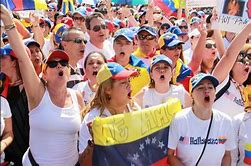
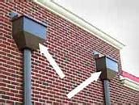
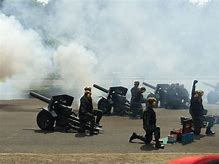
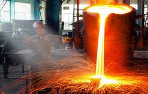
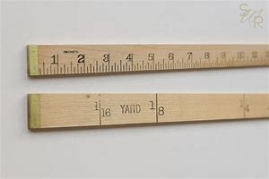
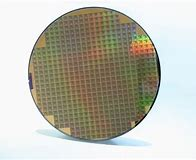

= eco 2020-5-23
:toc:

---

== To hell with （表示愤怒或厌恶，不再在乎）见鬼去吧，随便 experts  词汇解说

(eco 2020-5-23 / United States / The Centres for Disease Control and Prevention: Handcuffing an institution )

How the world’s premier(a.)首要的；最著名的；最成功的；第一的 public-health agency *was handcuffed* 用手铐铐住（某人）；把（某人）铐在（某物、某人）上

The CDC *has been absent 缺席；不参加；不在 with leave* during the spread of covid-19

May 23rd 2020 |

1. *TO HELL WITH SB/STH* : ( informal ) used to express anger or dislike and to say that you no longer care about sb/sth and will take no notice of them （表示愤怒或厌恶，不再在乎）见鬼去吧，随便
- ‘*To hell with him*,’ she thought, ‘I'm leaving.’ “让他见鬼去吧，”她想，“我走了。”
- *To hell with* experts 让专家们见鬼去吧

1. premier  /prɪˈmɪr,prɪˈmjɪr/ a.  ( sport 体 ) ( BrE ) [ only before noun ] most important, famous or successful 首要的；最著名的；最成功的；第一的 +
=> 来自中古法语premier,第一的，首要的，来自拉丁语primariuss,第一的，一流的，词源同prime,primary.后用于指首要，总理。
- one of the country's *premier chefs* 国家名厨之一
- the Premier League/Division 超级联赛

1. handcuff : v. [ VN ] [ usually passive ] to put handcuffs on sb or to fasten sb to sth/sb with handcuffs 用手铐铐住（某人）；把（某人）铐在（某物、某人）上
- How the world’s premier(a.) public-health agency *was handcuffed*.  世界上最重要的公共卫生机构是如何被戴上手铐的

IN 2014 TOM FRIEDEN, the head of the Centres for Disease Control and Prevention (CDC), *appeared almost daily* to brief(v.)给（某人）指示；向（某人）介绍情况 the public *about* the Ebola virus, the last pandemic *to hit* the United States before the coronavirus. His agency *formulated 制订；规划；构想；准备 policy* for *dealing with* Ebola, and also *embodied* 具体表现，体现，代表（思想或品质） it. The CDC *trained* 6,500 people in America and 25,000 in West Africa *to look after* victims. `主` The vaccine that *finally treated* the disease `谓` *was tested* in a CDC laboratory. The end of the outbreak *confirmed* the agency *as* the world’s leading public-health body.

1. brief :  /briːf/ v. *~ sb (on/about sth)* to give sb information about sth so that they are prepared to deal with it 给（某人）指示；向（某人）介绍情况
- The officer *briefed her on* what to expect. 长官简要向她说了一下可能遇到的情况。
- TOM FRIEDEN, the head of the Centres for Disease Control and Prevention (CDC), *appeared almost daily* to brief(v.) the public *about* the Ebola virus, the last pandemic *to hit* the United States before the coronavirus. +
美国疾病控制与预防中心(CDC)主任汤姆·弗里登(TOM FRIEDEN)几乎每天都向公众介绍埃博拉病毒。这是在冠状病毒出现之前美国发生的最后一次大流行。

1. formulate : v. to create or prepare sth carefully, giving particular attention to the details 制订；规划；构想；准备
[ VN ]
- *to formulate a policy*/theory/plan/proposal 制订政策；创立理论；构想计划；准备建议
- His agency *formulated policy* for *dealing with* Ebola, and also *embodied* it. 他的机构制定了应对埃博拉的政策，并体现了这些政策。

1. embody : v. to express or represent an idea or a quality 具体表现，体现，代表（思想或品质）
- a politician *who embodied the hopes of black youth* 代表黑人青年希望的政治家

*Contrast*(v.)对比；对照 that *with* what has happened during the coronavirus outbreak. On May 17th a senior White House official, the director of trade policy, *said* the CDC “*really let* the country *down*” 不能帮助，不能支持（某人）；使失望. The administration *gutted* 损毁（建筑物或房屋的）内部;取出…的内脏（以便烹饪） CDC guidelines *telling* restaurants, child-care centres and others *how to reopen*, *reducing* them *from* more than 50 pages *to* six. The CDC *has been muzzled* 压制，钳制（言论）；使缄默;（给狗）戴口套, says Jeremy Konyndyk of the Centre for Global Development, a think-tank. It *has held* no public briefings since mid-March. Meanwhile, `主` the first testing kits that the World Health Organisation *is distributing* `谓` *came from* Germany.

1. contrast : v. [ VN ] *~ (A and/with B)* to compare two things in order to show the differences between them 对比；对照 +
=> contra-, 相对，相反。-st, 站，词源同stand. 即相对而站进行比较。
- It is interesting *to contrast* the British legal system *with* the American one. 把英国的法制与美国的加以对比很有意思。 +
[ V ] *~ (with sth)* to show a clear difference when close together or when compared （靠近或作比较时）显出明显的差异，形成对比
- Her actions *contrasted sharply with* her promises. 她的行动与她的诺言相差甚远。
- *Contrast*(v.) that *with* what has happened during the coronavirus outbreak. 这与冠状病毒爆发时的情况形成了对比。

1. *let sb down* : to fail to help or support sb as they had hoped or expected 不能帮助，不能支持（某人）；使失望
- I'm afraid *she let us down badly*. 很遗憾，她让我们大失所望。
- the CDC “*really let* the country *down*”. 疾病控制与预防中心“真的让国家失望了”。

1. gut : v. [ usually passive ] to destroy the inside or contents of a building or room 损毁（建筑物或房屋的）内部 /to remove the organs from inside a fish or an animal to prepare it for cooking 取出…的内脏（以便烹饪）
- The house *was completely gutted*. 这房子里的东西全部被毁。
- The administration *gutted* CDC guidelines *telling* restaurants, child-care centres and others *how to reopen*, *reducing* them *from* more than 50 pages *to* six. +
美国政府, 将疾控中心发布的指导餐馆、儿童看护中心和其他机构如何重新开业的指导方针, 删除，从50多页减少到6页。

1. muzzle :  /ˈmʌzl/ v. to prevent sb from expressing their opinions in public as they want to 压制，钳制（言论）；使缄默 /[ usually passive ] to put a muzzle over a dog's head to prevent it from biting people （给狗）戴口套 +
=> 来自古法语musel,口鼻，猪鼻，狗鼻，可能来自拉丁语morsus,咬，词源同mordant,morsel.引申词义给狗，马等动物带的口套，以及枪口等。
- They accused the government of *muzzling(v.) the press*. 他们指责政府压制新闻自由。 +
image:../../+ img_单词图片/m/muzzle.jpg[100,100]

1. It *has held* no public briefings since mid-March. Meanwhile, `主` the first testing kits that the World Health Organisation *is distributing* `谓` *came from* Germany. +
自3月中旬以来，它(美国疾病控制与预防中心)没有举行公开简报。与此同时，世界卫生组织正在分发的第一批来自德国的检测试剂盒。

What *used to be* America’s most prestigious(a.)有威望的；声誉高的 public-health body *has been relegated 使贬职；使降级；降低…的地位 to* one voice among many in the clamour 喧闹声；嘈杂声；吵闹 of the White House. The result *is* to squander(v.)浪费，挥霍（金钱、时间等） expertise 专门知识；专门技能；专长, *compound* 使加重；使恶化 confusion about who, if anyone, *is in charge of* the federal response to the virus and *make* the reopening of the country *riskier* than it need be.

1. prestigious :  /preˈstiːdʒəs/  a.[ usually before noun ] respected and admired as very important or of very high quality 有威望的；声誉高的 +
=> 来自法语prestige,欺骗，骗术，幻术，变戏法
- a prestigious university 名牌大学

1. relegate :  /ˈrelɪɡeɪt/ v. *~ sb/sth (to sth)* to give sb a lower or less important position, rank, etc. than before 使贬职；使降级；降低…的地位 +
=> re-,向后，往回，-leg,送出，词源同 legate,delegate.引申词义降级，贬职。
- *She was then relegated to* the role of assistant. 随后她被降级做助手了。
- *He relegated the incident to the back of his mind*. 他将这个事件抛到了脑后。
- What *used to be* America’s most prestigious(a.) public-health body *has been relegated to* one voice among many in the clamour of the White House. +
曾经是美国最负盛名的公共卫生机构，如今在白宫的喧嚣中被降格为其中一个声音。

1. clamour /ˈklæmər/ n. a loud noise especially one that is made by a lot of people or animals 喧闹声；嘈杂声；吵闹 /~ (for sth) a demand for sth made by a lot of people 民众的要求 +
=> From Latin clāmor ‎(“a shout, cry”), from clāmō ‎(“cry out, complain”)
- the clamour of the market 市场上鼎沸的人声
- *The clamour for her resignation* grew louder. 民众要求她辞职的呼声越来越高。 +

1. squander :  /ˈskwɑːndər/ v.[ VN ] *~ sth (on sb/sth)* to waste money, time, etc. in a stupid or careless way 浪费，挥霍（金钱、时间等） +
=> 词源不详，可能来自拟声词根 squ-,挤，压，模仿挤压湿物体时发出的吧唧声。比较 splurge, 挥霍，浪费。
- He *squandered(v.) all his money* on gambling. 他把自己所有的钱都糟蹋在赌博上了。
- The result *is* to squander(v.) expertise 专门知识；专门技能；专长, *compound* confusion about who, if anyone, *is in charge of* the federal response to the virus and *make* the reopening of the country *riskier* than it need be. +
这样做的结果是浪费了专业知识，让人们更加困惑，到底是谁(如果有的话)负责联邦政府对病毒的应对，并令美国重新开放的风险更大。

1. compound v.  [ often passive ] to make sth bad become even worse by causing further damage or problems 使加重；使恶化 / *be compounded of/from sth* ( formal ) to be formed from sth 由…构成（或形成） +
=> com-, 强调。-pon, 放置，词源同opponent, position. 即放在一起的。
- *The problems were compounded* by severe food shortages. 严重的食物短缺使问题进一步恶化。

America *is slowly passing* its peak of infection. As it does so, Donald Trump *is signalling that* governors *should take the lead* in reopening states. In public-health terms, however, states *play(v.) only a secondary role*; state and city public-health departments *mostly do* routine things *such as* providing vaccines for children and hygiene 卫生 certificates(n.)证明；证明书 for restaurants. *Combating* an emergency 应对紧急情况, by *running* laboratories or *conducting* epidemiological 流行病学的 research, *is financed* by the federal government; 55% of state and local public-health spending *comes from* federal sources. In public health, therefore, the CDC *is* by far the most important agency and state health departments *depend upon* it. Some *are seeing* sharp falls(n.) *in* the number of people *testing positive* for the virus, including New York and New Jersey. They *may be* in relatively good shape 状况；情况. But in parts of the South and Midwest, the number of new cases or hospitalisations 住院治疗 *is rising*. Here, the diminishing 贬低；贬损；轻视;减少；（使）减弱，缩减；降低 of the CDC *may imperil*(v.)使陷于危险；危及 recovery.

1. America *is slowly passing* its peak of infection. As it does so, Donald Trump *is signalling that* governors *should take the lead* in reopening states. +
美国正在慢慢度过感染的高峰期。与此同时，唐纳德·特朗普(Donald Trump)发出信号，要求各州州长在重新开放各州的问题上发挥主导作用。

1. hygiene :  /ˈhaɪdʒiːn/ [ U ] the practice of keeping yourself and your living and working areas clean in order to prevent illness and disease 卫生 +
=> 词源同young,age, gwie,生命，词源同vital,zoo. 后引申词义卫生。
- food hygiene 食品卫生
- *personal hygiene* 个人卫生
- hygiene certificates 卫生证书

1. epidemiological : /ˌepɪˌdiːmiəˈlɑːdʒɪkl/ adj. 流行病学的
-  epidemiological research 流行病学研究

1. shape : the physical condition of sb/sth 状况；情况
- *What sort of shape* was the car in after the accident? 这车出过事故以后状况如何？
- Some *are seeing* sharp falls(n.) *in* the number of people *testing positive* for the virus, including New York and New Jersey. They *may be* in relatively good shape. +
包括纽约和新泽西在内的一些城市发现, 病毒检测呈阳性的人数急剧下降。它们的状况可能相对较好。

1. hospitalisation :  /,hɒspɪtəlaɪ'zeɪʃən/ n. 住院治疗（等于hospitalization）

1. imperil :  /ɪmˈperəl/ v. [ VN ] ( formal ) to put sth/sb in danger 使陷于危险；危及
- But in parts of the South and Midwest, the number of new cases or hospitalisations *is rising*. Here, the diminishing of the CDC *may imperil*(v.) recovery. +
但在南部和中西部部分地区，新病例或住院人数正在上升。在这方面，疾病控制和预防中心的削弱, 可能危及复苏。

How was the agency *brought* so low? On February 5th, the CDC *sent to* state laboratories a testing kit for covid-19 that it *had been working on* 努力改善（或完成） at headquarters. *Something was wrong with* one of the reagents 试剂 /and state labs *could not get* the test *to work*. The Food and Drug Administration (FDA), which *regulates* medical devices, including tests, then *dithered* 犹豫不决；踌躇 for three weeks before *allowing* private and university laboratories *to work on the problem*, which they *soon fixed*. But when tests *did become* available, the CDC *restricted* them *to* a handful of Americans. By the time the rules *were relaxed*, the CDC *had missed* the vital first stages of the epidemic; community transmission *was* rife(a.)（坏事）盛行，普遍.

1. reagent : /riˈeɪdʒənt/ n. ( chemistry 化 ) a substance used to cause a chemical reaction, especially in order to find out if another substance is present 试剂 ; 常用于测试某一成分是否存在 +
=> re-向后;相反 + -ag-做,行动 + -ent名词词尾
- How was the agency *brought* so low? On February 5th, the CDC *sent to* state laboratories a testing kit for covid-19 that it *had been working on* at headquarters. *Something was wrong with* one of the reagents /and state labs *could not get* the test *to work*. +
为什么CDC的级别变得这么低? 2月5日，美国疾病控制与预防中心向国家实验室发送了一套covid-19检测设备，这套设备是该中心总部一直在研制的。其中一种试剂出了问题，国家实验室无法用来进行测试。

1. *work on sth* : to try hard to improve or achieve sth 努力改善（或完成）
- You need to *work on* your pronunciation a bit more. 你需要再加把劲改进发音

1. dither : /ˈdɪðər/ v.  *~ (over sth)* to hesitate about what to do because you are unable to decide 犹豫不决；踌躇 +
=> 来自古英语didderen变体，踌躇，蹒跚。词源可能同dawdle, diddle, doodle, doddle.
- *She was dithering over* what to wear. 她拿不定主意穿什么好。

1. rife :  /raɪf/ a. if sth bad or unpleasant is rife in a place, it is very common there （坏事）盛行，普遍 / *~ (with sth)* full of sth bad or unpleasant 充斥，充满（坏事） +
=> 词源同 river,rift.通常用于形容坏事的盛行。
- It is a country *where corruption is rife*. 这是个腐败成风的国家。

1. 美国食品和药物管理局(FDA), 负责监管医疗设备, 包括检测, 其犹豫了三周，才允许私人和大学实验室, 来解决这个问题，并很快解决了这个问题。但是，当测试确实可用时，疾病控制中心将其限制用在少数美国人身上。当这些规定放松时，疾病控制和预防中心已经错过了疫情最关键的第一阶段; 社区传播已经很普遍。 +
(疾病预防控制中心最终于2月5日开始向州和地方卫生实验室发送试剂盒。但是在2月12日，它表明由于一种试剂存在问题，几个实验室难以验证测试结果。原则上，全国许多医院和学术实验室都有能力自行进行测试。但是目前，未经FDA批准，他们不允许这样做。)

The agency *was* at fault. But so *were* others: the FDA and the head of the Department of Health and Human Services, who *has* political responsibility. `主` President Trump, who *is taking* hydroxychloroquine 羟化氯喹, an anti-malarial 疟疾的 drug *not approved* against the coronavirus, `谓` *hardly needs* an excuse 借口；理由；辩解 *to ignore* medical science. But whoever *was* at fault, the episode *widened* a gap of distrust between the CDC and the White House.

1. hydroxychloroquine : /hai,drɔksi'klɔ:rəkwi:n/ n. [药] 羟化氯喹

1. malarial : /məˈleriəl/ ADJ You can use malarial to refer to things connected with malaria or areas which are affected by malaria. 疟疾的

1. 特朗普总统正在服用羟基氯喹(一种未经批准用于治疗冠状病毒的抗疟疾药物)，他对医学的忽视几乎不需要借口。但不管是谁的错，这一事件扩大了CDC和白宫之间的不信任。

According to the Washington Post, Deborah Birx, co-ordinator 协调人, 统筹人 of the White House’s coronavirus task-force (执行特定任务的)工作组, says “There is nothing from the CDC I can trust.” The administration *has set up* a parallel 平行的 data-gathering operation, *asking* a private company *to provide* statistics on hospital capacity, covid-19 deaths and so on, which the CDC *already has*. Marc Lipsitch of the Harvard Chan School of Public Health *talks of* “the handcuffing 手铐;用手铐铐住 of a great institution”.

There is a second explanation for the CDC’s marginalisation 边缘化: money. Though the agency’s own budget *has been protected*, a wider squeeze on public-health funding *has undermined*  从根基处破坏；挖…的墙脚;逐渐削弱（信心、权威等）；使逐步减少效力 its ability *to help* states.

1. co-ordinator 协调人, 统筹人

1. task-force : N-COUNT A task force is a group of people working together on a particular task. (执行特定任务的)工作组
- co-ordinator of the White House’s coronavirus task-force.  白宫冠状病毒特别工作组的协调人

1. parallel : a. *~ (to/with sth)* two or more lines that are parallel to each other are the same distance apart at every point 平行的
- parallel lines 平行线
- The administration *has set up* a parallel data-gathering operation 政府已经自行去做了一个(与CDC)平行的数据收集工作

1. marginalisation : /,ma:dʒinəlai'zeiʃən/ n. 边缘化
- There is a second explanation for the CDC’s marginalisation: money. CDC被边缘化的第二个原因是:钱。

Public health *is* chronically 长期地；慢性地；习惯性地 under-funded 经费不足的. In 2018 America *spent* less than $300 per person *on* it, *compared with* over $10,000 on all health care, according to the Trust 受托基金机构；受托团体 for America’s Health (TFAH), a not-for-profit group. In the decade to 2017 在截至2017年的10年里, jobs in public health *fell* by 50,000.

1. under-funded :ADJ An organization or institution that is underfunded does not have enough money to spend, and so it cannot function properly. 经费不足的
- Public health *is* chronically under-funded(a.). 公共卫生长期资金不足。

1. trust : [ C ] ( law 律 ) an organization or a group of people that invests money that is given or lent to it and uses the profits to help a charity 受托基金机构；受托团体
- the Trust for America’s Health (TFAH), a not-for-profit group. 非营利组织美国健康信托(TFAH)

Mr Trump *has proposed* cutting(v.) the CDC’s budget each year by between 10% and 20%, but Congress *has protected* the agency. The CDC’s budget *has been flat* since 2016, and this year emergency-spending bills *will provide* an extra $6bn over the next five years. However, the two main programmes for *helping* state and local health-care systems *prepare for* emergencies, Public Health Emergency Preparedness 准备好的状态；愿意 and the Hospital Preparedness Programme, *have been cut by over 50%* in real terms since 2003. This *has forced* states *to scale back* 按比例缩减，相应缩减 emergency preparation /and *left* the CDC *bearing* more of that burden.

1. The CDC’s budget *has been flat* since 2016 自2016年以来，CDC的预算一直持平

1. preparedness :  /prɪˈperdnəs/  n. *~ to do sth* ( formal ) the state of being ready or willing to do sth 准备好的状态；愿意
- I was surprised by *his preparedness* to break the law. 我对他打算以身试法感到惊讶。
- The troops are *in a state of preparedness*. 军队处于备战状态。
-  Public Health Emergency Preparedness /and the Hospital Preparedness Programme 公共卫生应急准备方案和医院应急方案

It *is struggling*. Though the agency *continues to churn out* （粗制滥造地）大量生产，大量炮制;剧烈搅动；（使）猛烈翻腾 advice -- its website *has had* 1.2bn clicks since the start of the epidemic -- John Auerbach of TFAH, who *has worked* in state and city health departments for decades, *says* departments *can no longer get the help* they need *from* the CDC. Instead, they *are turning to* less-reliable and often-conflicting advice, *producing* a muddle 混乱；乱七八糟;（局面）一团糟，混乱 of different rules.

1. *churn sth out* : ( informal often disapproving ) to produce sth quickly and in large amounts （粗制滥造地）大量生产，大量炮制 / churn : v. ~ (sth) (up) if water, mud, etc. churns , or if sth churns it (up) , it moves or is moved around violently 剧烈搅动；（使）猛烈翻腾
- the agency *continues to churn out* advice. CDC机构在不断地提供建议.

1. muddle : n.
a state of confusion in which things are untidy 混乱；乱七八糟 /*~ (about/over sth)* a situation in which there is confusion about arrangements, etc. and things are done wrong （局面）一团糟，混乱
SYN mess +
=> 来自mud,泥浆，-le,表反复。引申词义搅混，使困惑，杂乱。
- My papers are *all in a muddle* . 我的文件混乱不堪。
- There followed *a long period of confusion and muddle*. 接下来是很长一段时间的困惑和混乱。
- departments *can no longer get the help* they need *from* the CDC. Instead, they *are turning to* less-reliable and often-conflicting advice, *producing* a muddle of different rules. +
各政府部门不再能从疾控中心获得他们需要的帮助。取而代之的是，他们正在转向不太可靠且经常相互冲突的建议，产生了混乱的不同规则。

The combination of financial pressure and White House indifference(n.)漠不关心；冷淡；不感兴趣；无动于衷 *has scuppered* 使泡汤；使成泡影; (船的)排水孔; 排水管 any chance (America had) *to produce* a national strategy for covid-19. In the past the CDC *would have been central* to that effort. Now, it *is competing with* a White House task-force  (执行特定任务的)工作组 and a group *headed by* the president’s son-in-law 女婿 *for* Mr Trump’s fitful 断断续续的；一阵阵的；间歇的 attention. The institution with the largest concentration of scientific expertise *has been sidelined*(v.)把…排除在核心之外；使靠边;使退出比赛，使下场（尤指由于受伤）, and state health departments *are getting* flawed advice.

1. indifference : n. *~ (to sb/sth)* a lack of interest, feeling or reaction towards sb/sth 漠不关心；冷淡；不感兴趣；无动于衷
- Their father *treated them with indifference*. 他们的父亲对他们漠不关心。
-

1. scupper : /ˈskʌpər/ v. [ VN ] ( BrE informal ) to cause sb/sth to fail 使泡汤；使成泡影 /N a drain or spout allowing water on the deck of a vessel to flow overboard (船的)排水孔; 排水管
SYN foil
- The residents' protests *scuppered his plans* for developing the land. 居民的抗议使他开发这片土地的计划泡了汤。 +
- The combination of financial pressure and White House indifference(n.) *has scuppered* any chance (America had) *to produce* a national strategy for covid-19. +
财政压力和白宫的漠不关心, 使任何美国能制定应对covid-19的国家战略的机会, 都化为了泡影。 +

1. son-in-law : the husband of your daughter 女婿

1. fitful : a. happening only for short periods; not continuous or regular 断断续续的；一阵阵的；间歇的 +
=> 来自fit, 一阵痉挛。
- a fitful night's sleep 夜间时睡时醒
- Now, it *is competing with* a White House task-force and a group *headed by* the president’s son-in-law *for* Mr Trump’s fitful attention. +
现在，它正在与一个白宫特别工作组, 和一个由总统的女婿领导的小组, 争夺特朗普断断续续的注意力。

1. sideline :  /ˈsaɪdlaɪn/ v. to prevent sb from having an important part in sth that other people are doing 把…排除在核心之外；使靠边 /to prevent sb from playing in a team, especially because of an injury 使退出比赛，使下场（尤指由于受伤） +
=> side,边，侧，line,线，职业。比喻用法。
- The vice-president *is increasingly being sidelined*(v.). 副总统被日益排挤到权力中心之外。
- The institution with the largest concentration of scientific expertise *has been sidelined*(v.), and state health departments *are getting* flawed advice. +
当科学专业知识最集中化的机构, 被边缘化了，国家卫生部门就只能得到有缺陷的建议了。

---

== To hell with experts

(eco 2020-5-23 / United States / The Centres for Disease Control and Prevention: Handcuffing an institution )

How the world’s premier(a.) public-health agency was handcuffed 

The CDC has been absent with leave during the spread of covid-19

May 23rd 2020 |

IN 2014 TOM FRIEDEN, the head of the Centres for Disease Control and Prevention (CDC), appeared almost daily to brief(v.) the public about the Ebola virus, the last pandemic to hit the United States before the coronavirus. His agency formulated policy for dealing with Ebola, and also embodied it. The CDC trained 6,500 people in America and 25,000 in West Africa to look after victims. `主` The vaccine that finally treated the disease `谓` was tested in a CDC laboratory. The end of the outbreak confirmed the agency as the world’s leading public-health body.

Contrast(v.) that with what has happened during the coronavirus outbreak. On May 17th a senior White House official, the director of trade policy, said the CDC “really let the country down”. The administration gutted CDC guidelines telling restaurants, child-care centres and others how to reopen, reducing them from more than 50 pages to six. The CDC has been muzzled, says Jeremy Konyndyk of the Centre for Global Development, a think-tank. It has held no public briefings since mid-March. Meanwhile, `主` the first testing kits that the World Health Organisation is distributing `谓` came from Germany.

What used to be America’s most prestigious(a.) public-health body has been relegated to one voice among many in the clamour of the White House. The result is to squander(v.) expertise, compound confusion about who, if anyone, is in charge of the federal response to the virus and make the reopening of the country riskier than it need be.

America is slowly passing its peak of infection. As it does so, Donald Trump is signalling that governors should take the lead in reopening states. In public-health terms, however, states play(v.) only a secondary role; state and city public-health departments mostly do routine things such as providing vaccines for children and hygiene certificates(n.) for restaurants. Combating an emergency, by running laboratories or conducting epidemiological research, is financed by the federal government; 55% of state and local public-health spending comes from federal sources. In public health, therefore, the CDC is by far the most important agency and state health departments depend upon it. Some are seeing sharp falls(n.) in the number of people testing positive for the virus, including New York and New Jersey. They may be in relatively good shape. But in parts of the South and Midwest, the number of new cases or hospitalisations is rising. Here, the diminishing of the CDC may imperil(v.) recovery.

How was the agency brought so low? On February 5th, the CDC sent to state laboratories a testing kit for covid-19 that it had been working on at headquarters. Something was wrong with one of the reagents /and state labs could not get the test to work. The Food and Drug Administration (FDA), which regulates medical devices, including tests, then dithered for three weeks before allowing private and university laboratories to work on the problem, which they soon fixed. But when tests did become available, the CDC restricted them to a handful of Americans. By the time the rules were relaxed, the CDC had missed the vital first stages of the epidemic; community transmission was rife(a.).

The agency was at fault. But so were others: the FDA and the head of the Department of Health and Human Services, who has political responsibility. President Trump, who is taking hydroxychloroquine, an anti-malarial drug not approved against the coronavirus, hardly needs an excuse to ignore medical science. But whoever was at fault, the episode widened a gap of distrust between the CDC and the White House.

According to the Washington Post, Deborah Birx, co-ordinator of the White House’s coronavirus task-force, says “There is nothing from the CDC I can trust.” The administration has set up a parallel data-gathering operation, asking a private company to provide statistics on hospital capacity, covid-19 deaths and so on, which the CDC already has. Marc Lipsitch of the Harvard Chan School of Public Health talks of “the handcuffing of a great institution”.

There is a second explanation for the CDC’s marginalisation: money. Though the agency’s own budget has been protected, a wider squeeze on public-health funding has undermined its ability to help states.

Public health is chronically under-funded. In 2018 America spent less than $300 per person on it, compared with over $10,000 on all health care, according to the Trust for America’s Health (TFAH), a not-for-profit group. In the decade to 2017, jobs in public health fell by 50,000.

Mr Trump has proposed cutting(v.) the CDC’s budget each year by between 10% and 20%, but Congress has protected the agency. The CDC’s budget has been flat since 2016, and this year emergency-spending bills will provide an extra $6bn over the next five years. However, the two main programmes for helping state and local health-care systems prepare for emergencies, Public Health Emergency Preparedness and the Hospital Preparedness Programme, have been cut by over 50% in real terms since 2003. This has forced states to scale back emergency preparation /and left the CDC bearing more of that burden.

It is struggling. Though the agency continues to churn out advice -- its website has had 1.2bn clicks since the start of the epidemic -- John Auerbach of TFAH, who has worked in state and city health departments for decades, says departments can no longer get the help they need from the CDC. Instead, they are turning to less-reliable and often-conflicting advice, producing a muddle of different rules.

The combination of financial pressure and White House indifference(n.) has scuppered any chance (America had) to produce a national strategy for covid-19. In the past the CDC would have been central to that effort. Now, it is competing with a White House task-force and a group headed by the president’s son-in-law for Mr Trump’s fitful attention. The institution with the largest concentration of scientific expertise has been sidelined(v.), and state health departments are getting flawed advice.

---

== Immaculate 无误的；无过失的 misconceptions 词汇解说

(eco2020-5-23 /Business /  Chip wars: Immaculate misconceptions)

America’s latest salvo(n.)齐射；齐投；奇袭 against Huawei *is aimed at* chipmaking in China

It may *push* the industry *out of* America, too

May 21st 2020 | HONG KONG

1. immaculate  /ɪˈmækjələt/ a. containing no mistakes 无误的；无过失的 /extremely clean and tidy 特别整洁的 +
=> im-,不，非，maculate,有污点的，有瑕疵的。
- an immaculate performance 完美的演出
- an immaculate uniform/room 整洁的制服╱房间
- Immaculate misconceptions 完美的误解

1. salvo  /ˈsælvoʊ/ n. the act of firing several guns or dropping several bombs, etc. at the same time; a sudden attack 齐射；齐投；奇袭 +
=> 来自意大利语 salva,敬礼，致敬，鸣枪，鸣炮，来自拉丁语 salve,欢呼，祝健康（比较汉语 万岁万岁万万岁），祈使格于拉丁语 salvare,救护，使安全，祝健康，来自 PIE*sol,完整的， 词源同 solid,save,salute.其原义为一种鸣枪欢迎仪式，类似于现在的国家元首访问鸣礼炮，后 词义通用化，用于指任何形式的同时鸣枪或鸣炮。
- *The first salvo*(n.) exploded(v.) a short distance away. 第一批投下的炸弹在不远处爆炸。 +
- America’s latest salvo(n.) against Huawei *is aimed at* chipmaking in China. 美国攻击华为, 其目标是针对中国的芯片制造 +

AMERICA *HAS it in for* 跟某人过不去 Huawei -- and *not just because* some of its politicians *fear* the Chinese giant’s networking gear （某种活动的）设备，用具，衣服 *lets* spooks 间谍；特工;鬼 in Beijing *eavesdrop(v.)偷听，窃听（其他人谈话） on* customers’ communications. The firm, a world leader in futuristic(a.)极其现代的；未来派的 5G telecoms, *also symbolises*(v.)象征；是…的象征；代表 China’s technological and economic ascent. President Donald Trump *does not like it* [one bit]. William Barr, his attorney-general 总检察长；首席检察官, *has warned that* America *risks*(v.) “*surrendering* dominance” *to* China if it *cannot “blunt*(v.)使减弱；使降低效应;使（尖端、刃）变钝 Huawei’s drive” to 5G supremacy 至高无上；最大权力；最高权威；最高地位.

1. *have it in for sb* :( informal ) to not like sb and be unpleasant to them 跟某人过不去
- AMERICA *HAS it in for* Huawei. 美国跟华为过不去

1. eavesdrop  /ˈiːvzdrɑːp/ [ V ] *~ (on sb/sth)* to listen secretly to what other people are saying 偷听，窃听（其他人谈话） +
=> 其中eave是单词“屋檐”，-drop和drip（水滴）同源；它的本义是指，下雨天，屋檐落下的雨滴和房屋外壁之间的区域；其实就是指会有人在屋檐下偷听屋内的谈话。eave（屋檐）和over（在上方）同源，屋檐就位于房屋的上方。
- We caught him *eavesdropping* outside the window. 我们撞见他正在窗外偷听。
- AMERICA *HAS it in for* Huawei -- and *not just because* some of its politicians *fear* the Chinese giant’s networking gear *lets* spooks in Beijing *eavesdrop(v.) on* customers’ communications. +
不仅仅是因为它的一些政客担心, 这家中国巨头的网络设备, 会让北京的间谍, 窃听其客户的通讯。

1. futuristic  /ˌfjuːtʃəˈrɪstɪk/ a. extremely modern and unusual in appearance, as if belonging to a future time 极其现代的；未来派的
- futuristic design 极其新潮的设计

1. symbolize v. [ VN ] to be a symbol of sth 象征；是…的象征；代表
- The use of light and dark *symbolizes good and evil*. 用光明与黑暗来象征善与恶。
- The firm, a world leader in futuristic(a.) 5G telecoms, *also symbolises*(v.) China’s technological and economic ascent. +
该公司(华为)是未来5G电信的全球领导者，也象征着中国的技术和经济崛起。

1. attorney-general : N a country's chief law officer and senior legal adviser to its government 首席检察官 /attorney : ( especially NAmE ) a lawyer, especially one who can act for sb in court 律师（尤指代表当事人出庭者） +
=> 前缀at-同ad-. -torn同turn, 转。转向顾客的，代表当事人利益的人。

1. blunt  /blʌnt/ v. to make sth weaker or less effective 使减弱；使降低效应 /to make a point or an edge less sharp 使（尖端、刃）变钝
- Age hadn't blunted his passion for adventure. 岁月没有冲淡他的冒险激情。
- William Barr, his attorney-general, *has warned that* America *risks*(v.) “*surrendering* dominance” *to* China if it *cannot “blunt*(v.) Huawei’s drive” to 5G supremacy. +
美国总检察长威廉•巴尔(William Barr)警告称，如果美国不能“削弱华为在5G领域的霸主地位”，就有“将主导地位拱手让给”中国的风险。

1. supremacy  /suːˈpreməsi/ n. *~ (over sb/sth)* a position in which you have more power, authority or status than anyone else 至高无上；最大权力；最高权威；最高地位
- the battle for *supremacy in the region* 争夺地区霸权的较量

`主` An earlier attempt at blunting, which *made* it illegal *to sell* American-made components *to* Huawei, *including* advanced computer chips *on* which the Chinese firm *relies*, `系` *was not* the knock-out 破坏 blow the White House hoped it to be. Chipmakers *were able keep shipping* Huawei semiconductors *from* factories outside America. So on May 15th the Trump administration *extended* its restrictions *from* chips *to* the tools *used to make* them -- many of which *come from* America. *So long as* 只要 big microprocessor producers, like Taiwan Semiconductor Manufacturing Company (TSMC), *use* American-made equipment, they *will no longer be able to forge* 锻造；制作 Huawei-designed chips anywhere in the world.

1. knock-out : PHRASAL VERB If something *is knocked out* by enemy action or bad weather, it is destroyed or stops functioning because of it. 破坏

1. so long as 只要; “as/so long as”的变体 : only if 只要
- We'll go *as long as* the weather is good. 只要天气好我们就去。

1. forge : v.  to shape metal by heating it in a fire and hitting it with a hammer; to make an object in this way 锻造；制作
- *So long as* big microprocessor producers, like Taiwan Semiconductor Manufacturing Company (TSMC), *use* American-made equipment, they *will no longer be able to forge*(v.) Huawei-designed chips anywhere in the world. +
只要像台积电(TSMC)这样的大型微处理器生产商, 使用了美国制造的(芯片制造)设备，它们就无法在世界任何地方, 来生产华为设计的芯片。

In a press conference on May 18th a reticent(a.)寡言少语；不愿与人交谈；有保留 Huawei *said that* the new rule *put* its survival *at risk*. Three days later President Xi Jinping *vowed to invest* $1.4trn by 2025 *to increase* China’s tech independence. Yet *as with* 正如；与…一样；就…来说 America’s original restrictions, the latest blast 爆炸；（爆炸引起的）气浪，冲击波 in the Sino-American chip war *may not end up* having the intended effect.

1. reticent  /ˈretɪsnt/ a. *~ (about sth)* unwilling to tell people about things 寡言少语；不愿与人交谈；有保留 +
=> 来自拉丁语 reticere,保持安静，来自 re-,表强调，tacere,安静，词源同 tacit.引申词义寡言少语 的。
SYN reserved uncommunicative
- She was shy and *reticent*. 她羞怯而寡言少语。
- *He was extremely reticent about* his personal life. 他对自己的个人生活讳莫如深。
- a reticent(a.) Huawei 沉默寡言的华为

1. as with 正如；与…一样；就…来说
- Yet *as with* America’s original restrictions, the latest blast in the Sino-American chip war *may not end up* having the intended effect. +
然而，正如美国最初的限制措施一样，这个中美芯片战争的最新冲击波, 可能最终不会产生预期的效果。

1. blast : n. an explosion or a powerful movement of air caused by an explosion 爆炸；（爆炸引起的）气浪，冲击波

*Playing dirty* 用诈术, 作弊, 耍猫腻，耍花招 in the clean room

The new rule *may miss* its target *entirely*. Huawei *pays* contract manufacturers 合约制造商 *to assemble* its phones and base stations 基站. `主` The chips that TSMC *makes* for Huawei `谓` *are sent to* those companies, *not to* the Chinese firm, *for* integration 结合；整合；一体化. Finished products *are usually sent directly to* Huawei’s customers. Huawei *need not touch* the blacklisted chips [at any point]. This *may get* Huawei *off the hook* （使）摆脱困境，逃避惩罚. Some lawyers *note that* the new restriction *does not seem to apply to* items *sent to* third parties and *not destined(a.)开往；运往；前往;预定；注定；（尤指）命中注定 for* Huawei, even where these *are being supplied* [at Huawei’s direction].

1. play dirty 用诈术, 作弊, 耍猫腻，耍花招
- *Playing dirty* in the clean room 在干净的房间里玩脏活

1. contract manufacturer 合约制造商
- Huawei *pays* contract manufacturers *to assemble* its phones and base stations.  华为向合同承包制造商支付组装手机和基站的费用。

1. integration : n.  [ UC ] the act or process of combining two or more things so that they work together (= of integrating them) 结合；整合；一体化
- The aim is *to promote(v.) closer economic integration*. 目的是进一步促进经济一体化。
- `主` The chips that TSMC *makes* for Huawei `谓` *are sent to* those companies, *not to* the Chinese firm, *for* integration. +
台积电为华为生产的芯片被送到这些公司(签订了合同的承包制造商)，而不是这家中国公司，用于整合。

1. *get (sb) off the hook / let sb off the hook* :
to free yourself or sb else from a difficult situation or a punishment （使）摆脱困境，逃避惩罚
- Huawei *need not touch* the blacklisted chips [at any point]. This *may get* Huawei *off the hook*. +
华为在任何时候都不需要碰列入黑名单的芯片。这可能会让华为摆脱困境。

1. destined : a.   /'dɛstɪnd/ *~ for sth /~ to do sth* having a future which has been decided or planned at an earlier time, especially by fate 预定；注定；（尤指）命中注定 / *~ for* on the way to or intended for a place 开往；运往；前往
- *We seem destined*(a.) never to meet. 我们似乎是命中注定无缘相见。
- goods *destined(a.) for Poland* 运往波兰的货物
- Some lawyers *note that* the new restriction *does not seem to apply to* items *sent to* third parties and *not destined(a.) for* Huawei, even where these *are being supplied* [at Huawei’s direction]. +
一些律师指出，新的限制似乎不适用于发送给第三方而不是运往华为的物品，即使这些物品是按照华为的指示供应的。

*Even if* the legal experts are wrong, the rule *will be difficult* to enforce: the clean rooms of Asian chip foundries 铸造厂；玻璃厂 *are hard* to monitor. More important, the $412bn semiconductor industry *is so* globalised *that* even the long arm of American law *will struggle to pin it down* 按住；使动弹不得. The likelier upshot 最后结果；结局 of the new export controls *may be* to drive(v.) a portion 部分;一份 of America’s chipmaking industry from its shores 国家（尤指濒海国家）.

1. foundry :  /ˈfaʊndri/ a factory where metal or glass is melted and made into different shapes or objects 铸造厂；玻璃厂 +
- the clean rooms of Asian chip foundries *are hard* to monitor.  亚洲芯片代工厂的洁净室很难监控。

1. *pin sb down* : to make sb unable to move by holding them firmly 按住；使动弹不得
- Two men *pinned him down* until the police arrived. 两个人按住他直到警察赶来。
- the $412bn semiconductor industry *is so* globalised *that* even the long arm of American law *will struggle to pin it down*. +
规模达4120亿美元的半导体行业的全球化程度如此之高，就连美国法律的“长臂”也难以对其加以限制。

1. upshot : n. [ sing. ] the final result of a series of events 最后结果；结局 +
=> 来自射箭行话，最后一射，引申词义结局。其中up含有“末尾”或“结尾”之意，近似于The time is up（时间到了）和The jig’s up（一切都完了，成功已无望）两句中的up含义。
- *The upshot of it all was that* he left college and got a job. 事情的结局是，他离开学院参加了工作。
- The likelier upshot of the new export controls *may be* to drive(v.) a portion of America’s chipmaking industry from its shores. +
更有可能的结果是，新的出口管制, 可能会将美国芯片制造业的一部分从美国本土驱逐出去。

1. shores [ pl. ] ( especially literary ) a country, especially one with a coast 国家（尤指濒海国家）
- foreign shores 外国

The industry’s geographic scope *was already becoming broader* -- and less American -- over time. One crude yardstick （好坏或成败的）衡量标准；准绳;码尺 for this *is* to track(v.) where its physical assets *sit*, as *recorded* in the filings 存档；归档 of public tech businesses (see chart). The top dozen global semiconductor firms, for example, now *have* only 20% of their plant in America. Asian firms, such as TSMC, SMIC and Samsung, mostly *locate* their factories *at home*. American chipmakers, meanwhile, and many suppliers, *have been diversifying geographically* for years, *says* Dan Hutcheson of VLSI, a consultancy -- partly *in pursuit of* cheap labour, partly *to protect against* natural 自然的；天然的;正常的；自然的；意料之中的 disasters.

1. yardstick  /ˈjɑːrdstɪk/ n. a standard used for judging how good or successful sth is （好坏或成败的）衡量标准；准绳 /( especially NAmE ) a ruler for measuring one yard 码尺 +
=> yard,码，stick,棍，引申词义准绳，标准。比较 canon,gauge.
- Exam results are not *the only yardstick* of a school's performance. 考试结果不是衡量学校水平的唯一标准。 +
- One crude yardstick for this *is* to track(v.) where its physical assets *sit*, as *recorded* in the filings of public tech businesses (see chart). +
一个粗略的衡量标准是，追踪其有形资产的去向，如上市科技企业的备案文件所记录的那样(见图表)。 +

1. American chipmakers, meanwhile, and many suppliers, *have been diversifying geographically* for years. 美国芯片制造商和许多供应商, 多年来一直在进行(工厂选址)地域的多元化.

*Consider* Intel, which *makes* chips of its own design *for* customers (among them Huawei) that *assemble* electronic devices. In 2019 the American giant *had* 宾 over 35% of its $55bn in physical assets, a rough proxy （测算用的）代替物，指标 for manufacturing capacity 制造能力, 生产能力, 宾补 abroad. Some $8bn-worth *sat* in Israel and another $4bn in Ireland. Industry insiders *report that* China-bound shipments from both places *have increased* since America’s Huawei-baiting 攻击;嘲笑...的信仰 *began*. Intel *also has* more than $5bn in assets in China, its biggest market. *All told* 总之, 总共, 合计, $20bn of its $72bn in revenues last year *came from China*.

1. proxy : ( technical 术语 ) *~ for sth* ( formal ) something that you use to represent sth else that you are trying to measure or calculate （测算用的）代替物，指标 / *~ (for sb)* a person who has been given the authority to represent sb else 代理人；受托人；代表
- The number of patients on a doctor's list was seen as *a good proxy* for assessing how hard they work. 医生诊单上的病人数, 被看作是衡量他们工作努力程度的可靠指标。
- In 2019 the American giant *had* 宾over 35% of its $55bn in physical assets, a rough proxy for manufacturing capacity, 宾补 abroad. +
2019年，这家美国巨头550亿美元的实物资产中, 有超过35%, 身处国外(在国外建厂)，实物资产能粗略代表其生产能力。

1. *physical asset* 实物资产, 实体资产

1. *manufacturing capacity* 制造能力, 生产能力

1. -baiting  : COMB in N-UNCOUNT You use *-baiting* after nouns to refer to *the activity of attacking a particular group of people* or **laughing at their belief**s. 表示“攻击”，“嘲笑...的信仰” +
/ COMB in N-UNCOUNT *Badger-baiting*, *bear-baiting*, and *bull-baiting* involve making these animals fight dogs, while making sure that the animals are unable to defend themselves properly. 表示“放狗去斗”(熊、牛等)
- Industry insiders *report that* China-bound shipments from both places *have increased* since America’s Huawei-baiting *began*. +
业内人士报告说，自从美国开始以华为为敌人以来，两地运往中国的发货量都有所增加。

1. all told 总之, 总共, 合计
- *All told*, $20bn of its $72bn in revenues last year *came from China*. 总体而言，该公司去年720亿美元的营收中, 有200亿美元来自中国。

Another example *is* Analog Devices, a smaller American firm which *makes* radio-frequency 射频；无线电频率 chips *on which* Huawei *relies heavily* for the assembly of telecoms base stations 电信基站. It, too, *is spread around*: half of its assets *sit* in the Philippines, Ireland, Singapore and Malaysia. Perhaps that *might make it easier* for the firm *to explore the option* of *making* its Huawei-bound chips in non-American facilities.

1. telecoms base stations 电信基站
- Another example *is* Analog Devices, a smaller American firm which *makes* radio-frequency chips *on which* Huawei *relies heavily* for the assembly of telecoms base stations.  +
另一个例子是模拟设备公司，这是一家规模较小的美国公司，生产无线电频率芯片，华为在电信基站的组装中严重依赖于这些芯片。

Geographic complexity *has made it hard* for America’s government *to stop* chipmakers’ kit *from* reaching(v.) Huawei. Hence the new focus on chipmaking tools, many of which *are still made* in America and *so easier* for Washington *to control*. `主` Applied Materials 公司名, *based in* California, *builds* kit *used* to etch(v.) patterns into silicon, `谓` *has* 90% of its assets in the United States. `主` Lam Research, an American maker equipment *used by* TSMC and others *to process* silicon wafers 薄片, `谓` *has* 88% of its $1.1bn plant *at home*.

1. wafer /ˈweɪfər/ ~ (of sth) a very thin piece of sth 薄片 /a thin crisp light biscuit/cookie, often eaten with ice cream 威化饼，薄脆饼（常与冰激凌同吃）
- Lam Research, an American maker equipment *used by* TSMC and others *to process* silicon wafers, *has* 88% of its $1.1bn plant *at home*. +
Lam Research公司是一家美国制造商，台积电和其他公司用来加工硅片的设备，其11亿美元的工厂中有88%在国内。 +

`主` One big unknown *surrounding* the new Huawei rule -- which the chip industry’s lawyers *are busily unpacking* 分析；剖析 -- `系` *is* `主` whether, under it, equipment (*manufactured*(v.) at American firms’ overseas facilities) `谓` *counts as* “American”. If so, `主` advanced chipmaking factories that *rely on* such kit *to fabricate* 制造；装配；组装 cutting-edge 先进的，尖端的 chips for Huawei, as TSMC does, `谓` *will need* alternative suppliers. The American toolmakers’ Japanese rivals, such as Tokyo Electron and Hitachi High-Technologies, *suddenly find themselves* with a new geopolitical competitive edge （微弱的）优势.

1. unpack : [ VN ] to separate sth into parts so that it is easier to understand 分析；剖析
- *to unpack a theory* 剖析一个理论
- `主` One big unknown *surrounding* the new Huawei rule -- which the chip industry’s lawyers *are busily unpacking* -- `系` *is* `主` whether, under it, equipment (*manufactured*(v.) at American firms’ overseas facilities) `谓` *counts as* “American”. +
围绕着对华为新规定的一个巨大的未知因素是，在这个规则下，在美国公司的海外工厂中生产的设备, 是否算是“美国的”。芯片行业的律师们正忙于分析这一规则。

1. fabricate : v. ( technical 术语 ) to make or produce goods, equipment, etc. from various different materials 制造；装配；组装
- If so, `主` advanced chipmaking factories that *rely on* such kit *to fabricate* cutting-edge chips for Huawei, as TSMC does, `谓` *will need* alternative suppliers. +
如果是这样的话，像台积电这样依赖此类设备(即美国企业的海外工厂生产的设备)为华为制造尖端芯片的先进芯片制造工厂，将需要其它供应商(台积电不能使用美国企业制造的工具来生产芯片)。

1. edge : [ sing. ] ~ (on/over sb/sth) a slight advantage over sb/sth （微弱的）优势
- They have the edge on us. 他们略胜我们一筹。
- The American toolmakers’ Japanese rivals, such as Tokyo Electron and Hitachi High-Technologies, *suddenly find themselves with a new geopolitical competitive edge*(n.). +
美国工具制造商的日本竞争对手，如东京电子和日立高科技，突然发现自己拥有新的地缘政治竞争优势。

Another mystery *relates to* an announcement (*made* just as `主` the new American measures against Huawei `谓` *were being unveiled*). On May 15th TSMC *confirmed* it *would build* a $12bn chip factory in Arizona, *to be up* and *running* by 2024. Why *would* the Taiwanese firm, which *gets* 15% of its revenue *from* Huawei, *agree* to pour(v.) billions into America *just as* its new host(n.)主人;东道主 [in effect] *deprived* 剥夺；使丧失；使不能享有 it *of* a big customer? It *may be currying(v.)讨好；奉承；拍马屁 favour with* the administration, *hoping to avert*(v.)防止，避免（危险、坏事）;转移目光；背过脸 sanctions 制裁 against more Chinese customers. Observers *point to* another possibility. TSMC *could equip* the Arizona foundry 铸造厂；玻璃厂 *with* American gear *from* its existing factories, *freeing space* in its Taiwanese operations *for* brand(v.)给（牲畜）打烙印 new non-American kit that *can freely serve* Chinese customers. TMSC *did not respond to* a request for comment.

1. Another mystery *relates to* an announcement (*made* just as `主` the new American measures against Huawei `谓` *were being unveiled*). +
另一个谜团, 与美国的一项声明有关, 当时, 美国宣布了对华为要采取的新措施。

1. host : a country, a city or an organization that holds and arranges a special event 东道主；主办国（或城市、机构） /a person who invites guests to a meal, a party, etc. or who has people staying at their house 主人
- Why *would* the Taiwanese firm, which *gets* 15% of its revenue *from* Huawei, *agree* to pour(v.) billions into America *just as* its new host(n.) [in effect] *deprived* it *of* a big customer? +
这家从华为获得15%收入的台湾公司(台积电), 为什么会同意向美国投资数十亿美元，而它的新东家实际上却剥夺了它的一个大客户(华为)?

1.  curry : v./ˈkʌri/ : *curry favour (with sb)*
( disapproving ) to try to get sb to like or support you by praising or helping them a lot 讨好；奉承；拍马屁 / n. a S Asian dish of meat, vegetables, etc. cooked with hot spices, often served with rice 咖喱菜
-

1. avert : v. to prevent sth bad or dangerous from happening 防止，避免（危险、坏事） / *~ your eyes, gaze, face (from sth)* to turn your eyes, etc. away from sth that you do not want to see 转移目光；背过脸 +
=> 前缀a-同ab-, 从，从...离开。词根vert, 转，见convert, 皈依。
- A disaster *was narrowly averted*. 及时防止了一场灾难
- It *may be currying(v.) favour with* the administration, *hoping to avert*(v.) sanctions against more Chinese customers. +
它(台积电)可能在讨好美国政府，希望避免对其更多中国的客户实施制裁。

1. 观察人士指出了另一种可能性。台积电可以为亚利桑那州的代工厂配备现有工厂的美国设备，为其台湾业务腾出空间，让全新的非美国设备可以免费为中国客户提供服务。TMSC没有回复记者的置评请求。

Even if that *is not* TSMC’s intention, workarounds 应变方法；变通方法 *are bound to proliferate*(v.)迅速繁殖（或增殖）；猛增. On May 18th the boss of Samsung Electronics *toured* 在…旅游；在…巡回演出（或做宣传广告等） his company’s new chip factory in Xian, a city in central China. The South Korean firm, which *plans to invest* $115bn *in* its chipmaking business over the next decade, *has made it clear that* it *will not ignore* China. America’s export controls *may prompt it* to *kit out* （为特定活动而）使某人装备起来 its foundries *with* equipment that *will not fall foul of* （因做错事或不法行为）与…发生麻烦，与…产生纠葛，冒犯 Sino-American geopolitics.

1. workaround : /ˈwɜːrkə-raʊnd/ ( computing 计 ) a way in which you can solve or avoid a problem when the most obvious solution is not possible 应变方法；变通方法

1. proliferate :  /prəˈlɪfəreɪt/ [ V ] to increase rapidly in number or amount 迅速繁殖（或增殖）；猛增
SYN multiply +
=> 来自拉丁语proles,子孙，后代，-fer,带来，生育，词源同bear,bring.后用于生物学指繁殖，增殖。
- Books and articles on the subject *have proliferated* over the last year. 过去一年以来，论及这一问题的书和文章大量涌现。
- Even if that *is not* TSMC’s intention, workarounds *are bound to proliferate*(v.). 即使这不是台积电的本意，变通办法也必然会大量出现。

1. tour : v. to travel around a place, for example on holiday/vacation, or to perform, to advertise sth, etc. 在…旅游；在…巡回演出（或做宣传广告等）
- the boss of Samsung Electronics *toured* his company’s new chip factory in Xian.  三星电子的老板参观了西安的新芯片工厂。

1. *kit sb out/up (in/with sth)* : [ usually passive ] ( BrE ) to give sb the correct clothes and/or equipment for a particular activity （为特定活动而）使某人装备起来
- *They were all kitted out* in brand-new ski outfits. 他们配备齐全，包括全新的滑雪服装。

1. *fall foul of sb/sth* : to get into trouble with a person or an organization because of doing sth wrong or illegal （因做错事或不法行为）与…发生麻烦，与…产生纠葛，冒犯
- *to fall foul of* the law 触犯了法律
- America’s export controls *may prompt it* to *kit out* its foundries *with* equipment that *will not fall foul of* Sino-American geopolitics. +
美国的出口管制, 可能会促使其(三星), 为铸造厂配备那些不会与中美地缘政治冲突的设备。

Chip-industry insiders *report that* semiconductor equipment *is already being marketed* 推销；促销 inside China *as* “EAR free” -- *meaning* Chinese buyers *need not worry about* the “export administration regulations” that the Trump administration *is using* to attack Huawei. A person close to American toolmakers *says* some of them *are thinking about* moving(v.) their patents abroad *to rebuild* operations *from scratch* 从头开始；从零开始 away from America’s jurisdiction 司法权；审判权；管辖权;管辖区域；管辖范围, *in order to circumvent* 设法回避；规避;绕过；绕行；绕道旅行 present and future anti-Chinese restrictions. Mr Trump’s attempt *to de-Sinify*(v.)去中国化 the semiconductor industry *may do* more *to de-Americanise* it *[instead]*.

1. markete : [ VN ] *~ sth (to sb) (as sth)* to advertise and offer a product for sale; to present sth in a particular way and make people want to buy it 推销；促销
- *It is marketed* as a low-alcohol wine. 它作为一种低度酒投放市场。
- semiconductor equipment *is already being marketed* inside China *as* “EAR free”.  半导体设备, 已经在中国国内以“EAR free”的名义来销售.

* from scratch* : (1) without any previous preparation or knowledge 从头开始；从零开始 /(2) from the very beginning, not using any of the work done earlier 从头（做起）；从零开始 /scratch  （皮肤或物体表面上的）划痕，划伤
-  They decided to dismantle the machine and *start again from scratch*. 他们决定拆掉机器，从头再来。
- some of them *are thinking about* moving(v.) their patents abroad *to rebuild* operations *from scratch* away from America’s jurisdiction, *in order to circumvent* present and future anti-Chinese restrictions. +
其中一些制造商正考虑将专利转移到海外，以便在不受美国管辖的情况下重建业务，以规避目前和未来的反华限制。

1. jurisdiction :   /ˌdʒʊərɪsˈdɪkʃn/  n. [ UC ] *~ (over sb/sth) /~ (of sb/sth) (to do sth)* the authority that an official organization has to make legal decisions about sb/sth 司法权；审判权；管辖权 /[ C ] an area or a country in which a particular system of laws has authority 管辖区域；管辖范围

1. circumvent :  /ˌsɜːrkəmˈvent/ v. to find a way of avoiding a difficulty or a rule 设法回避；规避 / to go or travel around sth that is blocking your way 绕过；绕行；绕道旅行 +
=> circum-,圈，周围，-vent,走，词源同advent,venue.
- They found a way of *circumventing the law*. 他们找到了规避法律的途径。 +
image:../../+ img_单词图片/c/circumvent.jpg[100,100]

1.  Sinify : vt. 使中国化（等于Sinicize）, de为英语前缀，前缀de-来自拉丁语，意为"away from"，所以这个前缀的意义之一就是"离开"、"出"。
- Mr Trump’s attempt *to de-Sinify*(v.) the semiconductor industry *may do* more *to de-Americanise* it *[instead]*. +
特朗普试图让半导体行业去中国化，可能反而会让半导体行业去美国化。

---

== Immaculate misconceptions

(eco2020-5-23 /Business /  Chip wars: Immaculate misconceptions)

America’s latest salvo(n.) against Huawei is aimed at chipmaking in China

It may push the industry out of America, too

May 21st 2020 | HONG KONG

AMERICA HAS it in for Huawei -- and not just because some of its politicians fear the Chinese giant’s networking gear lets spooks in Beijing eavesdrop(v.) on customers’ communications. The firm, a world leader in futuristic(a.) 5G telecoms, also symbolises(v.) China’s technological and economic ascent. President Donald Trump does not like it [one bit]. William Barr, his attorney-general, has warned that America risks(v.) “surrendering dominance” to China if it cannot “blunt(v.) Huawei’s drive” to 5G supremacy.

`主` An earlier attempt at blunting, which made it illegal to sell American-made components to Huawei, including advanced computer chips on which the Chinese firm relies, `系` was not the knock-out blow the White House hoped it to be. Chipmakers were able keep shipping Huawei semiconductors from factories outside America. So on May 15th the Trump administration extended its restrictions from chips to the tools used to make them -- many of which come from America. So long as big microprocessor producers, like Taiwan Semiconductor Manufacturing Company (TSMC), use American-made equipment, they will no longer be able to forge Huawei-designed chips anywhere in the world.

In a press conference on May 18th a reticent(a.) Huawei said that the new rule put its survival at risk. Three days later President Xi Jinping vowed to invest $1.4trn by 2025 to increase China’s tech independence. Yet as with America’s original restrictions, the latest blast in the Sino-American chip war may not end up having the intended effect.

Playing dirty in the clean room

The new rule may miss its target entirely. Huawei pays contract manufacturers to assemble its phones and base stations. `主` The chips that TSMC makes for Huawei `谓` are sent to those companies, not to the Chinese firm, for integration. Finished products are usually sent directly to Huawei’s customers. Huawei need not touch the blacklisted chips [at any point]. This may get Huawei off the hook. Some lawyers note that the new restriction does not seem to apply to items sent to third parties and not destined(a.) for Huawei, even where these are being supplied [at Huawei’s direction].

Even if the legal experts are wrong, the rule will be difficult to enforce: the clean rooms of Asian chip foundries are hard to monitor. More important, the $412bn semiconductor industry is so globalised that even the long arm of American law will struggle to pin it down. The likelier upshot of the new export controls may be to drive(v.) a portion of America’s chipmaking industry from its shores.

The industry’s geographic scope was already becoming broader -- and less American -- over time. One crude yardstick for this is to track(v.) where its physical assets sit, as recorded in the filings of public tech businesses (see chart). The top dozen global semiconductor firms, for example, now have only 20% of their plant in America. Asian firms, such as TSMC, SMIC and Samsung, mostly locate their factories at home. American chipmakers, meanwhile, and many suppliers, have been diversifying geographically for years, says Dan Hutcheson of VLSI, a consultancy -- partly in pursuit of cheap labour, partly to protect against natural disasters.

Consider Intel, which makes chips of its own design for customers (among them Huawei) that assemble electronic devices. In 2019 the American giant had 宾over 35% of its $55bn in physical assets, a rough proxy for manufacturing capacity, 宾补 abroad. Some $8bn-worth sat in Israel and another $4bn in Ireland. Industry insiders report that China-bound shipments from both places have increased since America’s Huawei-baiting began. Intel also has more than $5bn in assets in China, its biggest market. All told, $20bn of its $72bn in revenues last year came from China.

Another example is Analog Devices, a smaller American firm which makes radio-frequency chips on which Huawei relies heavily for the assembly of telecoms base stations. It, too, is spread around: half of its assets sit in the Philippines, Ireland, Singapore and Malaysia. Perhaps that might make it easier for the firm to explore the option of making its Huawei-bound chips in non-American facilities.

Geographic complexity has made it hard for America’s government to stop chipmakers’ kit from reaching(v.) Huawei. Hence the new focus on chipmaking tools, many of which are still made in America and so easier for Washington to control. `主` Applied Materials, based in California, builds kit used to etch(v.) patterns into silicon, `谓` has 90% of its assets in the United States. `主` Lam Research, an American maker equipment used by TSMC and others to process silicon wafers, `谓` has 88% of its $1.1bn plant at home.

`主` One big unknown surrounding the new Huawei rule -- which the chip industry’s lawyers are busily unpacking -- `系` is `主` whether, under it, equipment (manufactured(v.) at American firms’ overseas facilities) `谓` counts as “American”. If so, `主` advanced chipmaking factories that rely on such kit to fabricate cutting-edge chips for Huawei, as TSMC does, `谓` will need alternative suppliers. The American toolmakers’ Japanese rivals, such as Tokyo Electron and Hitachi High-Technologies, suddenly find themselves with a new geopolitical competitive edge.

Another mystery relates to an announcement (made just as `主` the new American measures against Huawei `谓` were being unveiled). On May 15th TSMC confirmed it would build a $12bn chip factory in Arizona, to be up and running by 2024. Why would the Taiwanese firm, which gets 15% of its revenue from Huawei, agree to pour(v.) billions into America just as its new host(n.) [in effect] deprived it of a big customer? It may be currying(v.) favour with the administration, hoping to avert(v.) sanctions against more Chinese customers. Observers point to another possibility. TSMC could equip the Arizona foundry with American gear from its existing factories, freeing space in its Taiwanese operations for brand(v.) new non-American kit that can freely serve Chinese customers. TMSC did not respond to a request for comment.

Even if that is not TSMC’s intention, workarounds are bound to proliferate(v.). On May 18th the boss of Samsung Electronics toured his company’s new chip factory in Xian, a city in central China. The South Korean firm, which plans to invest $115bn in its chipmaking business over the next decade, has made it clear that it will not ignore China. America’s export controls may prompt it to kit out its foundries with equipment that will not fall foul of Sino-American geopolitics.

Chip-industry insiders report that semiconductor equipment is already being marketed inside China as “EAR free” -- meaning Chinese buyers need not worry about the “export administration regulations” that the Trump administration is using to attack Huawei. A person close to American toolmakers says some of them are thinking about moving(v.) their patents abroad to rebuild operations from scratch away from America’s jurisdiction, in order to circumvent present and future anti-Chinese restrictions. Mr Trump’s attempt to de-Sinify(v.) the semiconductor industry may do more to de-Americanise it [instead].

