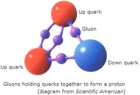

= eco 2020.07
:toc:

---

== 基础知识 : 基本粒子

---

== 07. Finding new physics will require a new particle collider

`主` What it *should look like* /and where it *should be built* `系` *are* uncertain

发现新的物理现象需要一个新的粒子对撞机 +
它应该是什么样子，应该建在哪里, 都是不确定的

Jan 2nd 2020 | GENEVA 日内瓦（瑞士西南部城市）

DEEP UNDER the countryside north of Geneva, *straddling*(`=straddle : to cross, or exist on both sides of, a river, a road or an area of land 跨过，横跨（河流、道路或一片土地）;/骑；跨坐；分腿站立`) the Franco-Swiss border, `主` one of the most advanced scientific machines ever built `谓` *has been banging*(`=bang  碰撞；磕`) subatomic(`= smaller than, or found in, an atom 亚原子的；比原子小的；原子内的`) particles *together* for more than a decade.

====
- straddle => 改写自 stride,大步，阔步，跨，张开，-le,表反复。引申词义骑，横跨等。 +

- 强子(Hadron)是一种亚原子粒子，*所有受到"强相互作用"影响的亚原子粒子都被称为强子。* 强子，包括重子和介子。 +
按现代的粒子物理学中的标准模型理论而言，*强子是由夸克、反夸克和胶子组成的。胶子是量子色动力学中的基本粒子，它将夸克连在一起，强子是这些连接的产物。*
====

This device, the Large Hadron 强子 Collider (LHC), *accelerates* （使）加速，加快 beams of protons 质子 (members of a class(`=a group of people, animals or things that have similar characteristics or qualities 种类；类别；等级`) of particle called hadrons) [in opposite directions] [around a 27km ring] until they *reach* almost the speed of light.

====
- proton => proto-,原始的，最早的，-on,物理名词后缀，来自electron.
====

Powerful magnets 磁铁,磁体 then *force* these protons 质子 into head-on(`=in which the front part of one vehicle hits the front part of another vehicle 迎头相撞的；正面相撞的`) collisions, *causing* the energy (they carry) *to be converted* -- *as described by* Einstein’s best-known equation, E=mc2 -- *into matter*.

And what matter! For `主` *sorting [through* the ejecta  (火山喷发或流星陨落时的)喷出物 from the collisions] `谓` *gives* physicists fleeting(a.)(`=lasting only a short time 短暂的；闪现的`) glimpses of the fundamental building blocks(`=*building blocks* [ pl. ] parts that are joined together in order to make a large thing exist 组成部分；构成要素`) of the universe /and the forces (that *bind* or *repel*(`=if one thing repels another, or if two things repel each other, an electrical or magnetic force pushes them apart 排斥；相斥;/to drive, push or keep sth away 推开；赶走；驱除`) them).

在日内瓦北部横跨法瑞边境的乡村深处，十多年来，有史以来建造的最先进的科学机器之一, 一直在将亚原子粒子碰撞在一起。这个设备，即大型强子对撞机(LHC)，可以加速质子束(一类称为强子的属于粒子类的成员)绕着27公里的环, 向相反的方向加速，直到它们几乎达到光速。然后，强大的磁铁迫使这些质子发生正面碰撞，导致它们携带的能量被转换成物质--正如爱因斯坦最著名的方程E=mc2所描述的那样。那又有什么关系呢！因为通过对碰撞中喷出的物质进行分类，物理学家们可以短暂地瞥见宇宙的基本构件，以及束缚或排斥它们的力。

The LHC *belongs to* the world’s leading particle-physics 粒子物理学 laboratory, CERN(`=欧洲核子研究委员会（Conseil Europeen pour la Recherche Nucleaire）`).

It is the latest(n.) [in a long line(`=a series of people, things or events that follow one another in time 按时间顺序排列的人（或物、事件）；家系；家族`) of increasingly(`=more and more all the time 越来越多地；不断增加地`) sophisticated(`=(of a machine, system, etc. 机器、体系等) clever and complicated in the way that it works or is presented 复杂巧妙的；先进的；精密的`) machines *built* over the past century by researchers *intent*(a.)(`=*~ on/upon sth /~ on/upon doing sth* : ( formal ) determined to do sth, especially sth that will harm other people 决心做（尤指伤害他人的事）;/*~ on/upon sth* :  giving all your attention to sth 专心；专注`) *on* finding out how the universe truly works].

====
- line :  a series of people, things or events that follow one another in time 按时间顺序排列的人（或物、事件）；家系；家族 +
-> She came from *a long line of doctors*. 她来自一个医生世家。 +
-> This novel is the latest of *a long line of thrillers* that he has written. 这部小说是他写的系列惊险小说中最近出版的一部。
====

The result of this effort *has been* one of the most successful, most tested scientific ideas of all time: the Standard Model of particle physics (see chart).

LHC, 属于世界领先的粒子物理实验室——欧洲核子研究中心。在过去的一个世纪里，科学家们建造了一系列越来越复杂的机器，试图找出宇宙的真实运行方式，而LHC是其中最新的一台机器。这一努力的结果, 是希望证实有史以来最成功的、也最受考验的科学思想之一: 粒子物理学的标准模型(见图表)。

High standards 高标准

The Standard Model *is not*, however, a theory of everything. It *leaves* many things unexplained.

So, even though `主` their multi-billion-franc 法郎 toy at CERN `谓` *has* at least two more decades of collisions *left to run*, physicists *are already considering* what *comes next*.

That *means* `宾` *building* a yet more powerful machine that *can reach* yet(`=*~ worse, more importantly, etc.* : used to emphasize an increase in the degree of sth (= how bad, important, etc. it is) （强调程度的增加）更`) higher energies, and thus *generate* yet heavier and more interesting particles.

====
- yet : *~ worse, more importantly, etc.* : used to emphasize an increase in the degree of sth (= how bad, important, etc. it is) （强调程度的增加）更 +
-> a recent and *yet* more improbable theory 一个新近提出的但更加不切实际的理论
====

And `主` *building* that machine `谓` *means*, in turn, `宾` *building* the political will *to pay for it* /and *deciding* {where it *will be constructed*}.

This *might be* at CERN, or perhaps in Japan, or maybe in China -- a prospect(`=*~ (of sth/of doing sth)* : an idea of what might or will happen in the future 前景；展望；设想`) (*unwelcome to* the current primus(a.)第一的 inter pares(`=*primus inter pares* : first among equals 同辈中之首席;同事中居首位者；（团体的）发言人`) of the field, America).

====
- *primus inter pares* : Princeps "第一"，但是通常地翻译为"第一公民". 是罗马皇帝的正式头衔. 这个字"Princeps"来自 *第一元老("Primus inter pares" 元老院的首席)。*
====

然而，标准模型并不是万能的理论。它留下了许多无法解释的东西。因此，尽管他们在欧洲核子研究中心的这个价值数十亿的玩具, 至少还有20年的碰撞时间，但物理学家们已经在考虑接下来该怎么做。这意味着需要建造一台更强大的机器，它可以达到更高的能量，从而产生更重、更有趣的粒子。而建造这台机器, 反过来又意味着, 需要建立"愿意支付这台机器"的政治意愿，并决定它在哪里建造。这个地点, 可能是在欧洲核子研究中心，也可能是在日本，或在中国 -- 这一前景对目前该领域最重要的国家 -- 美国来说, 是不欢迎的。

The Standard Model *is* a quantum-mechanical 量子力学的 description of all known elementary(a.)(`=of the most basic kind 基本的`) particles 基本粒子: *from* the quarks 夸克（理论上一种比原子更小的基本粒子） (*inside* protons 质子 and neutrons 中子), *via*(`=through a place 经由，经过（某一地方）`) the electrons 电子 (that *orbit* atomic nuclei 核心，核子；原子核), *to* the photons 光子 (that *carry* electromagnetic 电磁的 force and also *light up* the universe).

[Unlike Einstein’s General Relativity 广义相对论, its rival  竞争对手 for the laurels(`=laurel : honour and praise given to sb because of sth that they have achieved 荣誉；赞誉；荣耀;/月桂灌木；月桂树`) of “most important theory in physics”], `主` it `系` *is not* the product of the musings(n.)(`=musing : a period of thinking carefully about sth or telling people your thoughts about it 沉思；冥想；诉说想法`) of a lone genius.

Though `主` the name `谓` *goes back only to* 1975, `主` the substance(`= the most important or main part of sth 主旨；要点；实质；基本内容`) of the model `谓` *was developed [bit by bit] by* tens of thousands of scientists *working* for more than 80 years *on* hundreds of experiments around the world.

`主` The final piece of the jigsaw 拼图；拼板玩具, the Higgs boson 希格斯玻色子, which *gives* mass *to certain* other particles /and thus *ties* the model *together*, `谓` *was predicted by* theoreticians(`=同theorist, 理论家，精通于理论的人`) in 1964 and *found by* the LHC in 2012.

标准模型, 是对所有已知基本粒子的量子力学式描述：已知基本粒子包括: 从质子和中子内部的夸克，到围绕原子核运行的电子，再到携带电磁力并照亮宇宙的光子。 “物理学中最重要的理论”这个荣誉, 由爱因斯坦的广义相对论, 和标准模型来竞争. 但与广义相对论不同的是，标准模型并非是一个孤独的天才沉思的产物。虽然这个名字可以追溯到1975年，但这个模型的基础理论, 是由数以万计的科学家, 在世界各地经过数百次实验后，在80多年的时间里一点一滴地发展起来的。拼图的最后一块是希格斯玻色子，它赋予某些其他粒子质量，从而将模型联系在一起。理论家在1964年预测了希格斯玻色子，2012年大型强子对撞机则发现了希格斯玻色子。

The discovery of the Higgs, though, *was supposed to be*(`=to be generally believed or expected to be/do sth 一般认为；人们普遍觉得会`) a beginning as well as an end, 因为 for the Standard Model now *needs to be extended into* something bigger.

It *does not*, for example, *include* gravity. That is the province(`=a person's particular area of knowledge, interest or responsibility 知识（或兴趣、职责）范围；领域`) of General Relativity.

Dark matter *is* also absent. This is a substance, invisible but *detectable by* its gravitational(`=connected with or caused by the force of gravity 引力的；重力引起的`) effects, that *makes up*(`=to form sth 形成；构成`) 27% of the universe -- over five times as much as the so-called normal matter of stars, planets, people and so on.

And it *does not include* dark energy, a thing of unknown nature(`= the basic qualities of a thing 基本特征；本质；基本性质`) which *constitutes* the remaining 68% of reality and somehow *acts to push* everything else (in the cosmos) *[apart]*.

然而，希格斯粒子的发现虽然是一个终点, 它也被认为是一个开始，因为现在, 标准模型需要被扩展成更大的东西。例如，它没包括进重力, 重力还属于广义相对论的范畴中。它也没含进暗物质, 这是一种肉眼不可见, 但却可以通过引力效应能检测到的物质，占宇宙构成的27% -- 是那些所谓正常的物质的5倍多. 正常物质, 即构成了恒星、行星、人体等的物质。它也没包括进暗能量，这是一种性质未知的东西，它构成了宇宙中剩余的68%，并以某种方式, 将宇宙中的其他一切物质推开 (暗能量被认为是导致宇宙加速膨胀的力量)。

The Standard Model *does include* antimatter(`=matter that is made up of antiparticles 反物质（由反粒子组成）`). But it *predicts that* equal amounts of matter and antimatter *should have emerged* at the beginning of time and, by now, these *should have annihilated*(`=annihilate : to destroy sb/sth completely 消灭；歼灭；毁灭;/to defeat sb/sth completely 彻底击败`) one another 彼此，互相.

Since this *evidently(ad.)显然，明显地 has not happened* -- matter *being common* these days, and antimatter 反物质 *vanishingly 难以察觉地；消遁似地；趋于零地 rare* 稀少的；稀罕的 -- that prediction *is* in need of serious re-evaluation 再评估; 重新评价.

====
- annihilate => 前缀an-同ad-. 词根nil, 零，词源同no，见nihilism, 虚无主义。 科幻片<湮灭>(遗落的南境)的英文, 就是 Annihilation‎
====

其实, 标准模型的确包含有反物质。但它的预测是，等量的物质和反物质, 应该在宇宙时间之初就已经出现了，到目前为止，它们应该都已经相互湮灭了。由于这种情况显然没有发生 -- 如今的物质很普遍，但反物质却非常罕见 —— 因此这一预测需要认真的被重新评估。

`主` Each of these inadequacies(n.)(`=inadequacy : the state of not being enough or good enough 不充分；不足；不够`) `谓` *points to* physical laws, particles and forces (*yet to be discovered*) -- mysteries (which `主` physicists `谓` *had expected* 预料；预期；预计 that the LHC *would have started cracking(`=excellent 优秀的；出色的；极好的；顶呱呱的/爆裂声；噼啪声`) open* by now). But it *has not*.

====
- cracking : a.  ( BrE informal ) excellent 优秀的；出色的；极好的；顶呱呱的 +
-> She's *in cracking form* at the moment. 她这会儿状态好极了。 +
-> We set off *at a cracking pace (= very quickly)* . 我们迅速地出发了。
====

That *suggests* {`主` their hypotheses(`=hypothesis : an idea or explanation of sth that is based on a few known facts but that has not yet been proved to be true or correct （有少量事实依据但未被证实的）假说，假设; /guesses and ideas that are not based on certain knowledge （凭空的）猜想，猜测`) about what *lies* beyond the Standard Model, which *were* the basis of those expectations, `谓` *must be wrong*}.

这些不足之处中的每一个, 都指向着尚未被发现的物理定律、粒子和力-- 这些谜团, 物理学家们曾期望大型强子对撞机现在已经开始破解了。但事实并非如此。这表明他们关于标准模型之外的东西的假设, 肯定是错误的，而这些假设是这些预期的基础。

The weightiest(`= weighty 的最高级: important and serious 严重的；重要的；重大的;/heavy 重的；沉重的`) expectation 期望；指望 *was placed on the shoulders of* an elegant idea called supersymmetry 超对称性.

This theory, *developed* over the past 50 years, *is* a way of *removing [from* the Standard Model] a lot of things (*known* [in the trade(`=*the trade* [ sing.+sing./pl.v. ] : a particular area of business and the people or companies that are connected with it 同业；同行；同人`)] *as* fudge 法奇软糖，乳脂软糖（用糖、黄油和牛奶制成） factors(`=factor : a particular level on a scale of measurement 系数`) 经验系数; 容差系数).

最大的期望, 被寄托在了一种被称为"超对称"的优雅思想的身上。这一理论已经存在了超过50年. 该理论, 能用于将众多的"容差系数"从标准模型中删除出去. "容差系数"是业内的叫法.

====
- *the trade* [ sing.+sing./pl.v. ] : a particular area of business and the people or companies that are connected with it 同业；同行；同人 +
-> a *trade magazine*/journal 行业杂志╱期刊 +
-> They offer(v.) discounts to *the trade* (= to people who are working in the same business) . 他们对同行业的人给予折扣。

- fudge (1)法奇软糖，乳脂软糖（用糖、黄油和牛奶制成） +
(2) *a fudge* [ sing. ] ( especially BrE ) a way of dealing with a situation *that does not really solve the problems* but is intended to appear to do so 敷衍，装模作样（没有真正解决问题）
-> This solution is *a fudge* [rushed in to win cheers at the party conference]. 这个解决方案是为了赢得党的会议的赞誉而仓促搞出来的表面文章。

- factor : +
-> a suntan lotion with *a protection factor*(`=a particular level on a scale of measurement 系数`) of 10 防护系数为10的防晒油
====

A fudge factor *is* an arbitrary(`=not seeming to be based on a reason, system or plan and sometimes seeming unfair 任意的；武断的；随心所欲的`) value that *makes* a model *work*, but which itself *defies*(`=defy : *~ belief, explanation, description, etc.* :  to be impossible or almost impossible to believe, explain, describe, etc. 不可能，无法（相信、解释、描绘等）;/违抗；反抗；蔑视`) deeper explanation.

In the Standard Model, many such fudges(n.)敷衍，装模作样（没有真正解决问题）;不太令人满意的折中方案 *can be erased [by `谓` introducing*, for each and every Standard Model particle, `宾` a heavier “supersymmetric” 超对称的 partner (that *has not yet been seen*)).

`主` The putative(`= believed to be the person or thing mentioned 推定的；认定的；公认的`) superpartners of the electron and quark, for example, `谓` *are known as* the selectron 超电子 and squark 超夸克.

====
- putative => 来自拉丁语putare,计算，判断，思考，词源同compute,repute.
====
"容差系数"是一个任意的值，它虽然可以使标准模型工作，但这个容差系数为什么是这个值, 你却无法对它做解释。在标准模型中，可以通过为每个标准模型粒子引入一个更重的“超对称”伙伴(虽然它还没有被试验证实存在), 来消除许多的"容差系数"的这种任意值。例如，电子和夸克的超对称伙伴, 被称为超电子和超夸克。

Supersymmetry *might also eradicate*(`=*~ sth (from sth)* : to destroy or get rid of sth completely, especially sth bad 根除；消灭；杜绝`) one more of the Standard Model’s inadequacies 不足； 缺陷.

`主` The supersymmetric partners of another type of Standard Model particle, the neutrino 中微子, `系` *would be* things *called* neutralinos 超中性子. And neutralinos 超中性子 *are* plausible(`=reasonable and likely to be true 看似有道理的；可信的`) candidates 候选人；申请者 *to be* the components(`=one of several parts of which sth is made 组成部分；成分；部件`) of which dark matter *is composed*.

====
- eradicate => e-, 向外。-rad, 根，词源同radish, root.即连根拔起，根除。
- Neutralino : 超中性子（英语：Neutralino），又译"中性微子"，是一种由超对称所预测的假想粒子。
- 最后一句其实是这样的 : neutralinos *are* plausible candidates (*to be* the components (*of* which dark matter *is composed*)). 即 ->  dark matter *is composed of* which(=指components).
====
超对称性理论, 还可能消除标准模型中存在的另一个缺陷。另一个标准模型的粒子——中微子, 它的超对称性伙伴，被称为"超中性子"。而"超中性子"可能是构成暗物质的组成部分。

Unfortunately, after almost a decade of increasingly energetic collisions at the LHC, nothing new *has emerged* beyond the Higgs itself. No hidden dimensions. No unexplained phenomena. No supersymmetric particles. [As a result] supersymmetry *has*, for many physicists, *lost* its lustre(`=the shining quality of a surface 光泽；光辉;/the quality of being special in a way that is exciting 荣光；光彩；荣耀`).

[And of the myriad(n./a.)(`=an extremely large number of sth 无数；大量`) alternatives jostling(v.)（在人群中）挤，推，撞，搡; 争夺；争抢 *to take its place*], `主` no one `谓` *knows* {`主` which, if any, `系` *might be* closest to the truth}.

====
- myriad => 来自希腊语myrias,大量的，无数的，一万，可能来自PIE meu,流动，流出，水流，词源同 emanate(`=to produce or show sth 产生；表现；显示`), marine(`=海的；海产的；海生的`). 即由流动的水引申词义丰饶的，许多的，无数的。需注意的是，该词在古希腊语为单个词所表示的最大数。词义演变比较abundant.
====
不幸的是，在LHC经历了近10年的越来越高能量的撞击试验之后，除了希格斯粒子本身之外，没有任何其他的新发现。没有隐藏的维度。没有原因不明的现象出现。没有超对称粒子。因此，对许多物理学家来说，超对称性已经失去了它的光泽。在无数的替代方案中，没有人知道哪一个(如果有的话)最接近事实真相。

This *is* all a headache for the practitioners(`=a person who works in a profession, especially medicine or law （尤指医学或法律界的）从业人员`) of particle physics -- a field in which experiments 实验；试验 *are* notoriously 众所周知地；声名狼藉地；恶名昭彰地 expensive /and *take* decades *to build*.

It *is* also confusing, because physicists *had come to expect that* they *could more or less predict* what they *would see* next in their machines. Eugene Wigner, an American theoretical physicist of the 20th century, *called* this expectation “the unreasonable effectiveness of mathematics in the natural sciences”, and it *began* with the discovery of positrons 正电子；阳电子, the antimatter 反物质（由反粒子组成） equivalent(n.)(`=*~ (of/to sth)* : a thing, amount, word, etc. that is equivalent to sth else 相等的东西；等量；对应词`) of electrons.

这对于粒子物理学的实践者来说, 都是一个令人头疼的问题——众所周知，粒子物理学领域的实验耗资巨大，而且试验设备需要几十年的时间才能建立起来。这也是令人困惑的，因为物理学家们已经开始预期他们或多或少地可以预测他们在他们的机器上接下来会看到什么。20世纪的美国理论物理学家尤金·威格纳(Eugene Wigner), 将这种期望称为“数学在自然科学中不可思议的有效性”，它始于正电子(相当于电子的反物质)被发现的那一年。

Positrons 正电子；阳电子 *were predicted* in the 1920s by a formula that *lies* at the bedrock(`=a strong base for sth, especially the facts or the principles on which it is based 牢固基础；基本事实；基本原则;/基岩（松软的沙、土层下的岩石）`) of the Standard Model.

`主` This formula, *called* the Dirac equation 狄拉克方程 after its creator, Paul Dirac, `谓` *suggested* the existence of electrons with positive charges 正电荷 as well as the familiar negatively 带阴电荷的带负电的 charged sort 种类；类别；品种.

Thus(`=in this way; like this 以此方式；如此；这样`) *predicted*, they *were sought and found*. `主` Confidence in the prophetic(a.)(`=correctly stating or showing what will happen in the future 正确预言的；有预见的`) power of maths `谓` *was then confirmed* over and over again, *up to* the triumphant 高奏凯歌的；大获全胜的；巨大成功的 discovery of the long-predicted Higgs. But the failure of supersymmetry *has dented*(`=dent : to damage sb's confidence, reputation, etc. 损害，伤害，挫伤（信心、名誉等）; /使凹陷；使产生凹痕`) that confidence [*badly*].

====
- thus : ad. +
-> Many scholars *have argued [thus]*(`=in this way; like this 以此方式；如此；这样`). 许多学者都这样论证过。 +
-> He is the eldest son and *thus*(`=as a result of sth just mentioned 因此；从而；所以`) heir to the title. 他是长子，因此是这个封号的继承人。
====

正电子是在20世纪20年代, 由一个建立在标准模型基础上的公式, 预测出来的。这个公式，以它的创造者保罗·狄拉克的名字, 命名为狄拉克方程，暗示了带正电荷的电子, 和我们熟悉的带负电荷的电子, 同时存在。就像预测的那样，它们最终被找到了。对数学预言能力的信心, 也被一次又一次地肯定，直到大获全胜地发现了长期预测中的希格斯玻色子。但在超对称性上的失败, 却严重打击了这种信心。

Regardless of the details, though, the consensus(n.)一致的意见；共识 *is* that {`主` the route *to finding* physics (beyond the Standard Model) `谓` *runs through* the Higgs boson itself}.

This *means* `宾` *examining* and *characterising*(`=characterize : to describe or show the qualities of sb/sth in a particular way 描述，刻画，表现（…的特征、特点）`) that object [in exquisite(`=delicate and sensitive 微妙的；雅致的；敏锐的；敏感的;/extremely beautiful or carefully made 精美的；精致的`) detail].

Physicists *do not know*, for example, if it *is* truly an elementary particle with no internal structure (like an electron or a quark) /or *is* a composite(`=something made by putting together different parts or materials 合成物；混合物；复合材料`) of smaller objects (*in the way* that protons and neutrons *are made of* three quarks each).

It *is* even possible that {`主` what *has been identified as* the Higgs `系` *is not* actually the particle *predicted by* the Standard Model -- but, rather, a different particle (*from* an as-yet-unknown 至今仍未知的 theory) (that *happens to have* the Higgs’s predicted mass)}.

不管细节如何，人们的共识是，找到超越标准模型的物理学的途径, 是通过希格斯玻色子本身。这意味着要仔细地研究和描述那个物体的细节。例如，物理学家不知道它究竟是一个没有内部结构的基本粒子(比如电子或夸克)，还是由更小的物体组成的复合物(比如质子和中子分别由三个夸克组成)。甚至有可能，被确认为希格斯的粒子, 实际上并不是标准模型预测的粒子，而是来自另一种尚不知名理论的不同粒子，该粒子恰好具有希格斯的预测质量而已。

Measure for measure

针锋相对地，以牙还牙; 一报还一报

Annoyingly 恼人地；烦人地；令人不快地, [while the LHC *can now reliably 可靠地 produce* what most people *still do assume* *are* Higgs bosons], its instruments 器械；仪器；器具 *cannot easily make* the precision measurements 测量 (*needed to identify* cracks 缝隙；狭缝 in the Standard Model that *would point to* {which of supersymmetry’s rivals *looks most promising*(`=showing signs of being good or successful 有希望的；有前途的；有出息的`)}).

`主` One reason for this `谓` *lies in* the protons 质子 that the collider *uses as* its raw material. Because protons *are made of* quarks, which *are held together* by further particles *called* gluons 胶子, a proton-proton collision *actually involves* six quarks and multiple gluons, and *is* thus incredibly messy.

令人恼火的是，虽然LHC现在可以可靠地产生大多数人仍然认为是希格斯玻色子的粒子，但它的仪器无法轻易地进行所需的精确测量，以识别标准模型中的裂缝，从而指出超对称的对手中哪个看起来最有希望。原因之一在于对撞机使用的质子作为其原材料。因为质子是由夸克构成的，而夸克又被称为胶子的粒子聚合在一起，所以质子与质子的碰撞实际上包含了六个夸克和多个胶子，因此非常混乱。
====
- gluon : 胶子, 是传递夸克(Quark)之间强相互作用的粒子（规范玻色子）。带电粒子间的电磁相互作用是通过交换光子而实现的；与此类比，*夸克之间的强相互作用, 是通过交换胶子而实现的*.  +
*胶子之间也有强相互作用，胶子本身可放出或吸收胶子。* +
描述夸克及胶子间强相互作用的理论, 叫"量子色动力学"（QCD）。

====

There *is*, though, a way *to cut through*(`=*cut through sth* : to make a path or passage through sth by cutting 开辟（出路或通道）`) that mess: *use* electrons 电子 instead. Since electrons *are* truly elementary(a.)(`=of the most basic kind 基本的`), collisions (*involving* them) *are* cleaner *than* those between protons.

But there *is* a price 代价 to pay. Electrons *have* about a two-thousandth of the mass 质量 of protons, and proportionately(ad.)(`=increasing or decreasing in size, amount or degree according to changes in sth else 成比例的；相应的；相称的`) less kinetic(a.)(`=of or produced by movement 运动的；运动引起的`) energy 动能 [at a given speed].

`主` *To make* them energetic enough(a.) *to yield*(`= to produce or provide sth, for example a profit, result or crop 出产（作物）；产生（收益、效益等）；提供`) Higgs bosons `谓` *will thus require* a new machine.

====
- kinetic => 单词movie（电影）和move（移动）同源，本义是“运动的图片”，这也是电影最初的原理；同样地，cinema（电影院）也和“运动”相关，kinetic（运动的；动力学的）与之同源。这里涉及到c、k通转，再如曾经发过的porcelain（瓷器）和pork（猪肉）的同源关系。
====
不过，有一种方法可以解决这个问题:使用电子。由于电子是真正的基本粒子(不可再切分)，所以它们之间的碰撞, 比质子之间的碰撞要干净得多。但这是要付出代价的。电子的质量大约是质子质量的千分之二，在给定速度下，其动能也相应地更小。因此，要使它们有足够的能量产生希格斯玻色子，就需要一台新机器。

`主` *Building* an electron collider (*or rather* 更精确地说，倒不如说, in practice, a machine that *collides* electrons *with* positrons 正电子) *to follow* the LHC `谓` *would have* historical precedent(n.)(`=a similar action or event that happened earlier 先前出现的事例；前例；先例`) 历史前例.

====
- precedent => pre-前,先 + -ced-行走 + -ent名词词尾 +
-> *historical precedents* 历史前例 +
-> There is *no precedent* for a disaster of this scale. 这种规模的灾难是空前的。
====

At CERN, in 1983, `主` a hadron 强子（参与强相互作用的基本粒子） machine *called* the Super Proton Synchrotron  同步加速器, with a circumference 周长 of 7km, `谓` *was used to find* particles *called* the W and Z bosons  玻色子; 即基本粒子, which *are involved* in a phenomenon *known as* the weak nuclear force 弱核力.

Subsequently 随后, at the same laboratory, the Large Electron-Positron 负电子与正电子 (LEP) collider *began operating* in 1989 *to characterise*(`=to describe or show the qualities of sb/sth in a particular way 描述，刻画，表现（…的特征、特点）`) and *understand* those newly discovered bosons [in detail].

`主` The circular 圆形的；环形的 27km tunnel *built for* the LEP `谓` now *houses*(`=to provide a place for sb to live 给（某人）提供住处; /是（某物）的贮藏处（或安置处）；收藏；安置`) the LHC.

在LHC之后, 来新建造一台电子对撞机(或者更确切地说，在实践中，一台能让电子与正电子碰撞的机器), 将会开启历史先例了。1983年，在欧洲核子研究中心(CERN)，一台名为“超级质子同步加速器”(Super Proton Synchrotron)的强子机器, 被用来寻找被称为W和Z的玻色子的粒子，这两个粒子涉及一种被称为弱核力的现象。随后，在同一间实验室，大型正负电子对撞机(LEP), 于1989年开始运作，以详细描述和了解这些新发现的玻色子。为LEP建造的27公里圆形隧道, 现在是大型强子对撞机(LHC)的放置地。

*Continuing* this pattern, one group of physicists at CERN `谓` *proposes* `宾` *building* a new machine [there] 目的状 *to accelerate* electrons and positrons [around a 100km tunnel that *would extend* [beneath 在（或往）…下面；在（或往）…下方 the Jura mountains].

This Future Circular Collider (FCC) *would produce* collisions [at energies of a whopping(a.)(`= very big 巨大的；很大的`) 365 giga 千兆；十亿 electron volts (GeV), in the units *used by* physicists *to measure* both the energy and the mass of subatomic 亚原子的；原子内的 particles].

It *would produce* millions of Higgs bosons [over a period of several decades]. Such a Higgs “factory” *would let* physicists *pin down*(`=*pin sth down* : to explain or understand sth exactly 确切说明（或理解）;/to find sb and make them answer a question or tell you sth you need to know 找某人查问；使说清楚;/按住；使动弹不得`) the precise details of the particle.

====
- pin down +

====

继续这一模式，欧洲核子研究中心的一组物理学家提议, 在那里建造一台新机器，围绕着一条100公里长的隧道, 来加速电子和正电子，这条隧道将延伸到汝拉山下。这台未来的圆形对撞机(FCC), 将在高达365千兆瓦电子伏特(GeV)的能量下产生碰撞，这是物理学家用来测量亚原子粒子能量和质量的单位。它将在几十年内产生数百万个希格斯玻色子。这样的希格斯“工厂”可以让物理学家确定粒子的精确细节。

Higgs bosons *are* unstable. They *decay*(`=to become less powerful and lose influence over people, society, etc. （力量、影响等）衰弱，衰退，衰减;/（使）腐烂，腐朽`)  *into* pairs of other particles [almost as soon as they *are created*].

The Standard Model *predicts that* {[around 60% of the time] this *will create* a bottom quark and its antimatter equivalent}.

[A further 21% of the time] a pair of W bosons *will emerge*, and 9% of Higgs-boson decays *should end up with* a pair of gluons (the other 10% *will result in* yet further combinations).

[By *making* enormous numbers of Higgs bosons /and then *measuring* the precise rates (at which `主` bottom quarks, W bosons, gluons and other elementary particles `谓` *emerge*)], those running 管理，经营；运行 the FCC *would be able to watch for*(`=*watch for sb/sth* : to look and wait for sb/sth to appear or for sth to happen 观察等待（某人出现或发生某事）`) discrepancies(`=discrepancy : a difference between two or more things that should be the same 差异；不符合；不一致`) *from* the Standard Model’s predictions.

*The more* Higgses created, *the more statistical 统计的；统计学的 power* `主` the results `谓` *will have*, and *the more confident* `主` researchers `谓` will be (that `主` any deviations 背离；偏离；违背 from Standard Model predictions (which they *measure*) `谓` *actually represent* something real).

希格斯玻色子是不稳定的。它们几乎一产生就会衰变成成对的其他粒子。标准模型预测，在大约60%的时间里，这将产生一个底夸克和它的反物质当量。另外21%的情况下会出现一对W玻色子，9%的希格斯玻色子衰变会产生一对胶子(另外10%会产生更多的组合)。通过制造大量的希格斯玻色子，然后测量底夸克、W玻色子、胶子和其他基本粒子出现的精确速率，FCC的管理者将能观察到与标准模型预测的差异。希格斯玻色子创造的越多，结果所带来统计力量, 就越强大，研究人员就越有信心，他们测量的任何与标准模型预测的偏差实际上都代表了一些真实的东西。

====
- The+形容词/副词的比较级+主语+谓语 +
 the +形容词/副词的比较级+主语+谓语 +

1. the more...the more...结构其实是一个 从句+主句 的结构: +
*第一个the more...相当于一个"原因状语从句"*, 是从省略了表示原因的连词as等进化而来的(也可理解成是省略了if的条件状语从句); *第二个the more...引导的是主句.* +
-> *The thicker* a mammal's skin is(从句), *the less hair* it has(主句). +
= As a mammal's skin is thicker(从句), it has less hair(主句).

2. the more 后面的谓语, 如果是be动词的话, 可以省略, 这一点对于前后两个都适用. *特别当主谓语是 it is时, 常同时省略.* +
-> What size box do you want? -- *The bigger, the better*.  +
= 其实就是 The bigger *it is*, the better *it is*

3. 第二个the more后面可以使用"倒装", 而第一个后面却不行. (因为 *只有主句才能倒装,从句绝不能倒装!* 如果继续深究第二个the more后面什么时候用倒装时, 可认为 *如果主语长,谓语动词短时, 为避免头重脚轻, 主谓语倒装.*
====

The FCC *would build* on CERN’s decades of experience with circular colliders, and *might seem like* the LHC’s natural successor(`=a person or thing that comes after sb/sth else and takes their/its place 接替者；继任者；接替的事物；后继的事物`).

But a rival group of physicists *disagree*. Though circular colliders *have ruled* the roost （鸟类的）栖息处 for a long time, they *have* a problem.

[When charged particles 带电粒子 (protons 质子；氢核, electrons, positrons 正电子 etc) *move [in a circle]]* they *emit* energy, *known as* synchrotron 同步加速器 radiation 辐射, in the form of X-rays.

*The faster* the particles go(v.), *the more energy* they lose(v.). At full power, the FCC *could emit* (ie, *waste*) around 100 megawatts 百万瓦特 of synchrotron radiation.

`主` The only way *to compensate for* this, and thus *ensure* the particles (inside) *collide* [at the maximum energy], `系` *would be* to pump(v.)用泵（或泵样器官等）输送 in more electricity, which *would drive up*(`=*drive sth up/down* :to make sth such as prices rise or fall quickly 抬高（或压低）；使上升（或下跌）`) the cost of *operating* the machine.

借助于数十年的, 欧洲核子研究中心使用环形对撞机的经验, FCC可能成为大型强子对撞机的天然继承者。但另一群对立的物理学家却并不赞同。虽然环形对撞机已经统治了很长一段时间，但它们有一个问题。当带电粒子(质子、电子、正电子等)沿圆周运动时，它们会以x射线的形式发射能量，即同步辐射。粒子运动得越快，它们失去的能量越多。在全功率的情况下，FCC可以释放(即浪费)大约100兆瓦的同步辐射。为了弥补这一缺陷，从而确保内部粒子以最大能量碰撞，唯一的方法是输入更多的电，但这将推高操作机器的成本。

The rival group therefore *propose* to sidestep(v.)(`=to avoid answering a question or dealing with a problem 回避，规避（问题等）;/to avoid sth, for example being hit, by stepping to one side 横跨一步躲过；侧移一步闪过`) the hegemony(`=control by one country, organization, etc. over other countries, etc. within a particular group 支配权；霸权`) of rings [*altogether*], with a different successor to the LHC: a linear(a.)(`=of or in lines 线的；直线的；线状的; /able to be represented by a straight line on a graph 线性的`) collider.

====
- hegemony => 来自希腊语hegemon,领导者，来自PIE sag,寻找，寻求，探路者，词源同seek,sagacious.引申词义领导权，支配权，霸权。
====

This *would accelerate* electrons and positrons [*from* opposite ends of a straight track 轨道;（移动的）路径，路线，方向] /and *let them meet* [in the middle].

Two such *are* on offer(`=*on offer*: that can be bought, used, etc. 提供的；可买到；可使用; /(especially BrE) on sale at a lower price than normal for a short period of time 短期内打折销售；削价出售`).

CERN’s proposal *is* the Compact Linear Collider.

A second *is* the diplomatically 在外交上；靠外交途径；圆滑地；婉转地 named International Linear Collider, which *would probably be built* in Japan.

因此，这群的物理学家提议, 选择LHC的另一个不同的继承者—— 线性对撞机 —— 来完全回避掉环形对撞机的支配。线性对撞机, 将使电子和正电子从一条直线轨道的两端加速，并让它们在中间相遇。目前有两个可供的选择: 一是欧洲核子研究中心提议的紧凑型线性对撞机。第二个有着圆滑的名字 -- 国际直线对撞机，它可能会在日本建造。

Unlike a ring, a linear collider *can be constructed [in stages]*, which *helps with* budgeting 安排开支; 编制预算.

Both designs *would, though, end up* 最终成为；最后处于 about 50km long if *brought*(`=to make sb/sth move in a particular direction or way 使朝（某方向或按某方式）移动`) *to* completion.

They *would have* collision energies of a tera 兆 electron volt (1TeV 万亿电子伏, or 1,000 GeV(`=十亿电子伏特（Giga - electron volts）`)) or more, and *would operate as* Higgs factories 工厂 -- *turning out*(`=*turn sb/sth out* : to produce sb/sth 制造；生产；以（…装束等）出现`) many millions of these bosons.

与环形对撞机不同的是，线性对撞机可以分阶段建造，这有助于预算。不过，如果这两种设计最终都能完成，它们的长度都将达到50公里左右。它们的碰撞能量达到万亿电子伏特(1TeV，或1000gev)或更高，将会成为制造希格斯粒子的工厂——产生数百万个这样的玻色子。

If particle physics *went down* the linear-collider route, `主` which of these machines *would come out* （太阳、月亮或星星）出现，露出 on top `系` *is* moot(a.)(`=*a moot point/question* : a matter about which there may be disagreement or confusion 悬而未决的事；有争议的问题`).

On the face of things(`=*on the face of it* : 表面上看`), the International Linear Collider *is* ahead. Physicists from around the world *have spent years* working on the proposal and, in 2013, they *secured* （尤指经过努力）获得，取得，实现 Japan’s support *to build it* in Honshu 本州（日本中部最大的岛屿）.

After that, however, progress *slowed*, and as yet 至今仍 there *has been* no decision on whether the project *will go ahead*.

`主` The Science Council of Japan, which *advises* the government *on* such matters, `谓` *is still evaluating* the scheme. It *is* expected *to make* its intentions *clear* in February.

CERN, meanwhile, *seems more interested in* building a new ring. The Compact Linear Collider’s supporters(n.) in the organisation *are* a minority(`=the smaller part of a group; less than half of the people or things in a large group 少数；少数派；少数人`).

如果粒子物理学, 沿着线性对撞机的路线发展下去，这些机器中哪一台会胜出, 还没有定论。从表面上看，国际直线对撞机处于领先地位。来自世界各地的物理学家花了数年时间研究这一提议，并在2013年获得了日本的支持，在本州建造这一设施。然而，在那之后，进展放慢了，到目前为止还没有决定该项目是否继续进行。为政府提供此类咨询的日本科学理事会(Science Council of Japan), 仍在评估这一计划。预计日本将在2月份明确其意图。与此同时，欧洲核子研究中心(CERN)则似乎对建造一个新的环形对撞机更感兴趣。因为紧凑型线性对撞机的支持者, 在该组织中占少数。

While the old Great Powers of physics *argue about* what to do next, though, they *may find* themselves *outflanked*(`=outflank : to move around the side of an enemy or opponent, especially in order to attack them from behind 包抄；侧翼包围`).

====
- outflank => out-,向外，flank,边，侧翼。引申词义包抄。
====

For China *is moving into* the field [at breakneck(a.)(`= very fast and dangerous 飞速惊险的`) speed]. Under the leadership of Wang Yifang, head of the Institute of High Energy Physics in Beijing, the country *has been training* young scientists and *building* an impressive research infrastructure.

Its flagship(`=the most important product, service, building, etc. that an organization owns or produces （某组织机构的）最重要产品，最佳服务项目，主建筑物，王牌;/旗舰`) proposal *is* the Circular Electron-Positron Collider (CEPC), *conceived*(`=*~ (of) sth (as sth)* : to form an idea, a plan, etc. in your mind; to imagine sth 想出（主意、计划等）；想象；构想；设想`) *by* Dr Wang after the discovery of the Higgs boson and which *has now been through* several stages of technical design.

然而，当老牌的物理学强国就下一步该做什么争论不休时，他们可能会发现自己被包抄了。因为中国正以惊人的速度进入这一领域。在北京高能物理研究所所长王贻芳的领导下，中国一直在培养年轻科学家，并建立了令人印象深刻的基础研究设施。它的旗舰方案是, 在人们发现希格斯玻色子后, 由王博士构想的"环形正负电子对撞机"(CEPC)，目前已经经过了几个阶段的技术设计。

The latest iteration(n.)(`=the process of repeating a mathematical or computing process or set of instructions again and again, each time applying it to the result of the previous stage 迭代`) *proposes*(v.)提议；建议 a $5bn machine optimised(`=*optimize* : to make sth as good as it can be; to use sth in the best possible way 使最优化；充分利用`) *to create* and *study* Higgs bosons.

It *would sit* in a tunnel with a circumference 周长 of 100km and *achieve* collisions [at energies *reaching* around 240GeV].

In its specification(`=a detailed description of how sth is, or should be, designed or made 规格；规范；明细单；说明书`), it *is not* so far away from CERN’s FCC. [Though the project *is being developed by* Chinese scientists, some of whom *have worked* at CERN], Dr Wang *has also drawn on*(`=*draw on/upon sth* : to use a supply of sth that is available to you 凭借；利用；动用`) advice, support and critical feedback *from* other particle physicists around the world.

最新迭代后的计划是, 提议建造一个50亿美元的机器，优化后能用于创造和研究希格斯玻色子。它将位于一个周长为100公里的隧道中，在能量达到240亿电子伏左右时实现碰撞。在它的规范中，它离CERN的FCC相差并不大。虽然这个项目是由中国科学家开发的，其中一些科学家曾在欧洲核子研究中心工作，但王博士也从世界各地其他粒子物理学家那里获取建议、支持和批评反馈。

`主` *Whether or not* Dr Wang’s project *gets* a green light `谓` *will depend on* how the government *decides* {*to weigh* its value *against* other proposed scientific-research facilities 设施；设备 it *might build*}.

One rival, for example, *is* a demonstration(`=an act of showing or explaining how sth works or is done 示范；示范表演；演示`) nuclear-fusion(`=the process or result of joining two or more things together to form one 融合；熔接；结合`) 核聚变 power plant.

If the government *does give* the collider the go-ahead(n.)(`=permission for sb to start doing sth 批准；许可`), part of its calculation 计算;算计  *will surely be* the increased visibility and prestige 威信；声望；威望 (that *comes from* *being able to build and operate* such a technologically advanced machine).

China *has* ambitions *to become* a world leader in science, and *there is no doubt* a particle accelerator *would help* it *achieve* that goal.

王博士的项目能否获得批准，将取决于政府如何权衡该对撞机的价值, 和可建造的其他拟议科研设施的价值。例如，它的一个竞争性项目就是"示范性的核聚变发电厂"。如果政府确实给了对撞机建造的许可，它(指中国政府)计算(决定这么做)的一部分, 肯定是, 能够建造和操作这样一台技术先进的机器, 可以增加中国在世界上的可见性和声望。中国有雄心成为世界科技的领导者，毫无疑问，粒子加速器能够帮助中国实现这一目标。

In [with the new]

(`=out with the old, in with the new 去旧迎新`)

China *could certainly afford* Dr Wang’s collider, though it *would need* to import(v.) a lot of accelerator scientists *to beef up*(`=*beef sth up* : to make sth bigger, better, more interesting, etc. 使更大（或更好、更有意思等）`) its capability *to build and operate* such a machine.

If that *did happen*, CERN’s 欧洲核子研究委员会 plans for a circular collider *would look* superfluous(a.)(`=more than you need or want 过剩的；过多的；多余的`).

But *as* CERN’s own history *shows*, big scientific projects *tend to work best* [when `主` *access to* the machine and its results `系` *is* `表` *as* open and internationally collaborative(a.)合作的；协作的；协力的 *as possible*].

Dr Wang *says* he *would welcome* money, talent and in-kind(a.)以货贷款；以实物（援助）；非现金的 contributions 捐款；捐资 *from* other countries. If the CEPC *became* the world’s most powerful accelerator, those countries *would no doubt jump at the chance*(`=*jump at sth* : to accept an opportunity, offer, etc. with enthusiasm 迫不及待地接受，欣然接受（机会、建议等）`) *to join in*. Except one, that is: America.

中国当然可以负担得起王博士的对撞机，尽管它需要引进大量的加速器领域的科学家, 来增强其制造和操作这样一台机器的能力。如果这种情况真的发生了，欧洲核子研究中心的环形对撞机计划, 就显得多余了。但是，正如欧洲核子研究中心自身历史所表明的那样，大型科学项目要想发挥出最佳效果, 必须尽可能地鼓励国际合作, 并对世界其他研究人员开放其机器和研究成果。王表示，他欢迎来自其他国家的资金、人才和实物捐赠。如果CEPC成为了世界上最强大的加速器，这些国家无疑会抓住机会加入此项目。除了一个国家外 -- 美国。

America *is* home *to* a thriving  欣欣向荣的，兴旺发达的 community of particle physicists, and they *have garnered*(`=garner : to obtain or collect sth such as information, support, etc. 获得，得到，收集（信息、支持等）`) many of the Nobel prizes (*handed out*(`=*hand sth out (to sb)* : to give a number of things to the members of a group 分发某物`)) over the second half of the 20th century *for* the prediction and testing of various bits(`=a part of sth larger （事物的）一部分，一段`) of the Standard Model.

====
- garner => 来自granary的拼写变体，词源同grain, 原指谷仓。后用做动词，指收集。
====

American government scientists *are*, however, *currently banned from* collaborating with their Chinese counterparts, and federal funding agencies *will not pay for* academics (*to work* in China) -- a restriction that *would apply to* the CEPC, *should it be built*. Yet, if China *went ahead* with its accelerator, `主` the centre of gravity of fundamental physics, and probably the next set of Nobel prizes for that topic, `谓` *would surely move* there.

美国拥有者蓬勃发展的粒子物理学家群体，在20世纪下半叶, 他们曾因成功预测和证实了标准模型的不同组成部分, 而获得了许多诺贝尔奖。然而目前, 美国政府禁止他们的的科学家与中国的同行合作，联邦资助机构也不会为在中国工作的学者支付费用——如果CEPC建成，这一限制也适用于CEPC。然而，如果中国继续推进它的加速器，基础物理学的重心，以及可能的下一届诺贝尔奖，肯定会转移到那里。

The big holes in modern physics *will not be solved* by a single machine, however. `主` All the groups (*proposing* 提议 post-LHC electron-positron colliders) `谓` *are also working* on plans 计划 *for* what *comes* [after a couple of decades of *using* them *to study* the details of Higgs bosons].

The FCC team *proposes* {① eventually *ripping*(v.)(`=to remove sth quickly or violently, often by pulling it 猛地扯开；突然拉开`) that machine *from* its 100km tunnel, just as the LEP *was ripped from* its, and ② *replacing* it, some time in the 2050s or later, *with* a hadron 强子 collider *operating* at 100TeV}.

In China Dr Wang’s team *has begun work on* a similar idea, in which a Super Proton-Proton Collider *would sit* in the tunnel *alongside* the previously built electron-positron collider.

然而，现代物理学的大漏洞, 不是一台机器就能解决的。在大型强子对撞机(lhc)后, 所有提出建造正负电子对撞机的团体，也都在研究未来几十年的计划，并利用它们来研究希格斯玻色子的细节。FCC团队打算最终将这台机器从100公里长的隧道中剥离出来，就像LEP从隧道中剥离出来一样，并在2050年或更晚的某个时候，用一台运行在100TeV的强子对撞机(hadron collider)取代它。在中国，王博士的团队已经开始了类似的想法，在隧道中放置一个超级质子-质子对撞机，与之前建造的正负电子对撞机并排。

Some physicists, though, *are* impatient. They *argue that* the cautious(a.)小心的；谨慎的, step-by-step approach *should be abandoned*. [Instead of *making* precise measurements of the Higgs boson *using* electron-positron machines], researchers *should embrace* a 100TeV hadron machine *as soon as possible*, and *see* what *happens*.

Their argument *is that* the uncertainty (which now *abounds* in the field) *makes* it risky *to focus only on* an electron-positron collider, as this *might end up* unable to operate(v.) at high-enough energies *to push deep into* the territory of new physics.

Moreover, [as detectors *improve* /and `主` the algorithms (*used to seek* the most useful data *from* collisions) `谓` *get more sophisticated*], the problem of hadron colliders’ messy output *could disappear*. Hadron colliders *will, however 无论如何,不管怎样, always maintain* their superiority 优越（性）；优势 in *pushing forward* the energy barrier(`=a particular amount, level or number which it is difficult to get past 难以逾越的数量（或水平、数目）；关口; /屏障；障碍物`) 能障;能量位垒 *to finding* new physics.

然而，一些物理学家却缺乏耐心。他们认为，应该放弃谨慎的、按部就班的做法。他们称, 研究人员不应使用负电子-正电子仪器来对希格斯玻色子进行精确测量，而应尽快上马100TeV强子机器，看看会发生什么。他们的论点是，目前该领域存在大量的不确定性，因此只关注正负电子对撞机是有风险的，因为它最终可能无法以足够高的能量运行，从而无法深入到新物理学的领域。此外，随着探测器的改进, 和从碰撞中寻找最有用数据的算法变得更加复杂，强子对撞机输出杂乱的问题, 可能会得到解决。无论如何, 在推进能量壁垒以发现物理学新的领域方面, 强子对撞机将始终保持着优势。

*As* Jon Butterworth, a member of the team that *discovered* the Higgs boson in 2012, *puts*(`=to express or state sth in a particular way 说；表达`) it, “My whole career *there’s been* a very clear road map of what we *need to do next* /and now *there isn’t one*. We’ve *outgrown*(`=outgrow : to grow taller, larger or more quickly than another person 比…长得高（或大、快）;/长得穿不下（衣服）；增长得容不进（某地）`) our road map. Experiment *is* ahead of the theory. It’s an interesting and difficult time.”

True. But then 不过；然而；但另一方面, `主` *making maps* rather than *following them* `系` *is* surely `表` what exploration *is* about.

正如2012年发现希格斯玻色子的团队成员乔恩·巴特沃斯(Jon Butterworth)所说，"我的整个职业生涯都有一个非常清晰的路线图，告诉我们下一步需要做什么，但现在没有了。我们已经超越了我们的路线图。实验在理论之前。这是一个有趣和困难的时期。" 的确如此, 但话又说回来，绘制地图而不是跟着地图走, 才是探险的真正意义。

---

== 07. Finding new physics will require a new particle collider 纯净版

`主` What it *should look like* /and where it *should be built* `系` *are* uncertain

Jan 2nd 2020 | GENEVA

DEEP UNDER the countryside north of Geneva, *straddling* the Franco-Swiss border, one of the most advanced scientific machines ever built *has been banging* subatomic particles *[together]* for more than a decade. This device, the Large Hadron Collider (LHC), *accelerates* beams of protons (members of a class of particle called hadrons) [in opposite directions] around a 27km ring until they *reach* almost the speed of light. Powerful magnets then *force* these protons *into* head-on collisions, *causing* the energy they carry *to be converted* -- as described by Einstein’s best-known equation, E=mc2 -- *into* matter. And what matter! For `主` *sorting through* the ejecta from the collisions `谓` *gives* physicists fleeting glimpses of ① the fundamental building blocks of the universe and ② the forces that *bind* or *repel* them.

The LHC *belongs to* the world’s leading particle-physics laboratory, CERN. It is the latest [in a long line of increasingly sophisticated machines (*built* over the past century *by* researchers *intent on* finding out how the universe *truly works*)]. The result of this effort *has been* one of the most successful, most tested scientific ideas of all time: the Standard Model of particle physics (see chart).

High standards

The Standard Model *is not*, however, a theory of everything. It *leaves* many things unexplained. So, even though their multi-billion-franc toy at CERN *has* at least two more decades of collisions *left to run*, physicists *are already considering* what comes next. That *means* building(v.) a yet more powerful machine that *can reach* yet higher energies, and thus *generate* yet heavier and more interesting particles. And `主` building(v.) that machine `谓` *means*, in turn, *building* the political will(n.) to pay for it /and *deciding* where it will be constructed. This *might be* at CERN, or perhaps in Japan, or maybe in China -- a prospect (*unwelcome to* the current primus inter pares of the field, America).

The Standard Model *is* a quantum-mechanical description of all known elementary particles: *from* the quarks (inside protons and neutrons), *via* the electrons (that *orbit* atomic nuclei), *to* the photons (that *carry* electromagnetic force /and also *light up* the universe). Unlike Einstein’s General Relativity, its rival for the laurels of “most important theory in physics”, it *is not* the product of the musings of a lone genius. Though the name *goes back only to* 1975, the substance of the model *was developed bit by bit by* tens of thousands of scientists *working* for more than 80 years *on* hundreds of experiments around the world. `主` The final piece of the jigsaw, the Higgs boson, which *gives mass to* certain other particles /and thus *ties* the model together, `谓` *was predicted* by theoreticians in 1964 /and *found* by the LHC in 2012.

The discovery of the Higgs, though, *was supposed to be* a beginning *as well as* an end, for the Standard Model now *needs to be extended into* something bigger. It *does not*, for example, *include* gravity. That *is* the province of General Relativity. Dark matter *is* also absent. This *is* a substance, invisible but *detectable* by its gravitational effects, that *makes up* 27% of the universe -- over five times *as much as* the so-called normal matter of stars, planets, people and so on. And it *does not include* dark energy, a thing of unknown nature which *constitutes* the remaining 68% of reality and somehow *acts to push* everything else in the cosmos *[apart]*.

The Standard Model *does include* antimatter. But it *predicts that* equal amounts of matter and antimatter *should have emerged* at the beginning of time and, by now, these *should have annihilated* one another. Since this evidently *has not happened* -- matter *being common* these days, and antimatter *vanishingly rare* -- that prediction *is* in need of serious re-evaluation.

Each of these inadequacies(n.) *points to* physical laws, particles and forces (yet *to be discovered*) -- mysteries (which physicists *had expected that* the LHC *would have started* cracking open by now). But it *has not*. That *suggests* `主` their hypotheses about what *lies beyond* the Standard Model, which *were* the basis of those expectations, `谓` *must be* wrong.

The weightiest expectation *was placed* [on the shoulders of an elegant idea *called* supersymmetry]. `主` This theory, *developed* over the past 50 years, `系` *is* a way of *removing [from* the Standard Model] a lot of things *known* [in the trade] *as* fudge factors. A fudge factor *is* an arbitrary value that *makes a model work*, but which itself *defies* deeper explanation. In the Standard Model, many such fudges *can be erased* [by *introducing*, for each and every Standard Model particle, a heavier “supersymmetric” partner that *has not yet been seen*]. `主` The putative superpartners of the electron and quark, for example, `谓` *are known as* the selectron and squark.

Supersymmetry *might also eradicate* one more of the Standard Model’s inadequacies. The supersymmetric partners of another type of Standard Model particle, the neutrino, *would be* things *called* neutralinos. And neutralinos *are* plausible candidates (*to be* the components (*of* which dark matter *is composed*)).

Unfortunately, after almost a decade of increasingly energetic collisions at the LHC, nothing new *has emerged* beyond the Higgs itself. No hidden dimensions. No unexplained phenomena. No supersymmetric particles. [As a result] supersymmetry *has*, for many physicists, *lost* its lustre. [And of the myriad alternatives *jostling(v.) to take its place*], no one *knows* {`主` which, if any, `系` *might be* closest to the truth}.

This *is* all a headache for the practitioners of particle physics -- a field (in which experiments *are* notoriously expensive /and *take decades to build*). It *is* also confusing, because physicists *had come to expect that* {they *could [more or less] predict* what they *would see next* in their machines}. Eugene Wigner, an American theoretical physicist of the 20th century, *called* this expectation “the unreasonable effectiveness of mathematics in the natural sciences”, and it *began with* the discovery of positrons, the antimatter equivalent of electrons.

Positrons *were predicted* in the 1920s *by* a formula (that *lies* at the bedrock of the Standard Model). This formula, *called* the Dirac equation *after* its creator, Paul Dirac, *suggested* {the existence of electrons with positive charges *as well as* the familiar negatively charged sort}. Thus predicted, they *were sought and found*. Confidence in the prophetic power of maths *was then confirmed* over and over again, *up to* the triumphant discovery of the long-predicted Higgs. But the failure of supersymmetry *has dented* that confidence *badly*.

Regardless of the details, though, the consensus *is that* {`主` the route *to finding* physics beyond the Standard Model `谓` *runs [through* the Higgs boson itself]}. This *means* {*examining and characterising* that object [in exquisite detail]}. Physicists *do not know*, for example, if it *is* truly an elementary particle with no internal structure (like an electron or a quark) or *is* a composite of smaller objects (in the way that protons and neutrons *are made of* three quarks each). *It* is even possible {*that* `主` what *has been identified as* the Higgs `系` *is not* actually the particle (*predicted by* the Standard Model—but), rather, a different particle (*from* an as-yet-unknown theory) that *happens to have* the Higgs’s predicted mass}

Measure for measure

Annoyingly, while the LHC *can now reliably produce* {what most people *still do assume* *are* Higgs bosons}, its instruments *cannot easily make* the precision measurements (*needed to identify* cracks (in the Standard Model) that *would point to* `主` which of supersymmetry’s rivals `系` *looks* most promising). One reason for this *lies in* the protons (that the collider *uses as* its raw material). Because protons *are made of* quarks, which *are held together* [by further particles *called* gluons], a proton-proton collision *actually involves* six quarks and multiple gluons, and *is* thus incredibly messy.

There *is*, though, a way *to cut through* that mess: *use* electrons instead. Since electrons *are* truly elementary, collisions (*involving* them) *are* cleaner *than* those between protons. But there *is* a price to pay. Electrons *have* ① about a two-thousandth of the mass of protons, and ② proportionately less kinetic energy [at a given speed]. `主` *To make* them energetic(a.) enough(ad.) *to yield* Higgs bosons `谓` *will thus require* a new machine.

`主` *Building* an electron collider (or rather, in practice, a machine that *collides* electrons *with* positrons) *to follow* the LHC `谓` *would have* historical precedent. At CERN, in 1983, `主` a hadron machine *called* the Super Proton Synchrotron, with a circumference of 7km, `谓` *was used to find* particles called the W and Z bosons, which *are involved* in a phenomenon *known as* the weak nuclear force. Subsequently, at the same laboratory, `主` the Large Electron-Positron (LEP) collider `谓` *began* operating(v.) in 1989 *to characterise* and *understand* those newly discovered bosons in detail. `主` The circular 27km tunnel *built for* the LEP `谓` now *houses* the LHC.

Continuing this pattern, one group of physicists at CERN *proposes* building a new machine there to accelerate electrons and positrons around a 100km tunnel that *would extend* beneath the Jura mountains. This Future Circular Collider (FCC) *would produce* collisions at energies of a whopping 365 giga electron volts (GeV), in the units used by physicists to measure both the energy and the mass of subatomic particles. It *would produce* millions of Higgs bosons over a period of several decades. Such a Higgs “factory” *would let* physicists *pin down* the precise details of the particle.

Higgs bosons are unstable. They *decay into* pairs of other particles almost as soon as they are created. The Standard Model *predicts that* around 60% of the time this will create a bottom quark and its antimatter equivalent. A further 21% of the time a pair of W bosons will emerge, and 9% of Higgs-boson decays should end up with a pair of gluons (the other 10% will result in yet further combinations). By making enormous numbers of Higgs bosons and then measuring the precise rates at which bottom quarks, W bosons, gluons and other elementary particles emerge, those running the FCC would be able to watch for discrepancies from the Standard Model’s predictions. The more Higgses created, the more statistical power the results will have, and the more confident researchers will be that any deviations from Standard Model predictions which they measure actually represent something real.

The FCC would build on CERN’s decades of experience with circular colliders, and might seem like the LHC’s natural successor. But a rival group of physicists disagree. Though circular colliders have ruled the roost for a long time, they have a problem. When charged particles (protons, electrons, positrons etc) move in a circle they emit energy, known as synchrotron radiation, in the form of X-rays. The faster the particles go, the more energy they lose. At full power, the FCC could emit (ie, waste) around 100 megawatts of synchrotron radiation. The only way to compensate for this, and thus ensure the particles inside collide at the maximum energy, would be to pump in more electricity, which would drive up the cost of operating the machine.

The rival group therefore propose to sidestep the hegemony of rings altogether, with a different successor to the LHC: a linear collider. This would accelerate electrons and positrons from opposite ends of a straight track and let them meet in the middle. Two such are on offer. CERN’s proposal is the Compact Linear Collider. A second is the diplomatically named International Linear Collider, which would probably be built in Japan.

Unlike a ring, a linear collider can be constructed in stages, which helps with budgeting. Both designs would, though, end up about 50km long if brought to completion. They would have collision energies of a tera electron volt (1TeV, or 1,000 GeV) or more, and would operate as Higgs factories—turning out many millions of these bosons.

If particle physics went down the linear-collider route, which of these machines would come out on top is moot. On the face of things, the International Linear Collider is ahead. Physicists from around the world have spent years working on the proposal and, in 2013, they secured Japan’s support to build it in Honshu. After that, however, progress slowed, and as yet there has been no decision on whether the project will go ahead. The Science Council of Japan, which advises the government on such matters, is still evaluating the scheme. It is expected to make its intentions clear in February. CERN, meanwhile, seems more interested in building a new ring. The Compact Linear Collider’s supporters in the organisation are a minority.

While the old Great Powers of physics argue about what to do next, though, they may find themselves outflanked. For China is moving into the field at breakneck speed. Under the leadership of Wang Yifang, head of the Institute of High Energy Physics in Beijing, the country has been training young scientists and building an impressive research infrastructure. Its flagship proposal is the Circular Electron-Positron Collider (CEPC), conceived by Dr Wang after the discovery of the Higgs boson and which has now been through several stages of technical design.

The latest iteration proposes a $5bn machine optimised to create and study Higgs bosons. It would sit in a tunnel with a circumference of 100km and achieve collisions at energies reaching around 240GeV. In its specification, it is not so far away from CERN’s FCC. Though the project is being developed by Chinese scientists, some of whom have worked at CERN, Dr Wang has also drawn on advice, support and critical feedback from other particle physicists around the world.

Whether or not Dr Wang’s project gets a green light will depend on how the government decides to weigh its value against other proposed scientific-research facilities it might build. One rival, for example, is a demonstration nuclear-fusion power plant. If the government does give the collider the go-ahead, part of its calculation will surely be the increased visibility and prestige that comes from being able to build and operate such a technologically advanced machine. China has ambitions to become a world leader in science, and there is no doubt a particle accelerator would help it achieve that goal.

In with the new

China could certainly afford Dr Wang’s collider, though it would need to import a lot of accelerator scientists to beef up its capability to build and operate such a machine. If that did happen, CERN’s plans for a circular collider would look superfluous. But as CERN’s own history shows, big scientific projects tend to work best when access to the machine and its results is as open and internationally collaborative as possible. Dr Wang says he would welcome money, talent and in-kind contributions from other countries. If the CEPC became the world’s most powerful accelerator, those countries would no doubt jump at the chance to join in. Except one, that is: America.

America is home to a thriving community of particle physicists, and they have garnered many of the Nobel prizes handed out over the second half of the 20th century for the prediction and testing of various bits of the Standard Model. American government scientists are, however, currently banned from collaborating with their Chinese counterparts, and federal funding agencies will not pay for academics to work in China—a restriction that would apply to the CEPC, should it be built. Yet, if China went ahead with its accelerator, the centre of gravity of fundamental physics, and probably the next set of Nobel prizes for that topic, would surely move there.

The big holes in modern physics will not be solved by a single machine, however. All the groups proposing post-LHC electron-positron colliders are also working on plans for what comes after a couple of decades of using them to study the details of Higgs bosons. The FCC team proposes eventually ripping that machine from its 100km tunnel, just as the LEP was ripped from its, and replacing it, some time in the 2050s or later, with a hadron collider operating at 100TeV. In China Dr Wang’s team has begun work on a similar idea, in which a Super Proton-Proton Collider would sit in the tunnel alongside the previously built electron-positron collider.

Some physicists, though, are impatient. They argue that the cautious, step-by-step approach should be abandoned. Instead of making precise measurements of the Higgs boson using electron-positron machines, researchers should embrace a 100TeV hadron machine as soon as possible, and see what happens. Their argument is that the uncertainty which now abounds in the field makes it risky to focus only on an electron-positron collider, as this might end up unable to operate at high-enough energies to push deep into the territory of new physics. Moreover, as detectors improve and the algorithms used to seek the most useful data from collisions get more sophisticated, the problem of hadron colliders’ messy output could disappear. Hadron colliders will, however, always maintain their superiority in pushing forward the energy barrier to finding new physics.

As Jon Butterworth, a member of the team that discovered the Higgs boson in 2012, puts it, “My whole career there’s been a very clear road map of what we need to do next and now there isn’t one. We’ve outgrown our road map. Experiment is ahead of the theory. It’s an interesting and difficult time.” True. But then, making maps rather than following them is surely what exploration is about.

---

