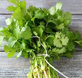
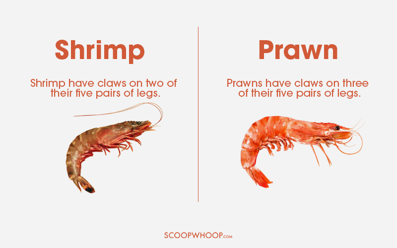
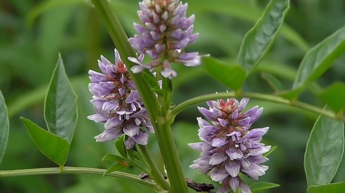

= eco 2020.09-10
:toc:

---

== 09. Many Han Chinese don’t mind the gulag 古拉格（集中营） for their Uighur neighbours

Yet it *will aggravate* ethnic 种族的；人种的 strife(n.)(`=angry or violent disagreement between two people or groups of people 冲突；争斗；倾轧`) for years to come

====
- strife => 来自 strive 的动词形式。词性比较 proof,prove.
====

Jan 11th 2020 | URUMQI

许多汉族人并不介意他们的维族邻居身处古拉格中 +
然而，这将在未来几年加剧种族冲突

THE DISTRICT of Erdaoqiao 二道桥 in Urumqi, the capital of the far western region of Xinjiang, *looks very similar to* many urban(`=connected with a town or city 城市的；都市的；城镇的`) areas of China.

Its streets *are filled with* luxury cars *competing for* space with frantic(a.)(`=done quickly and with a lot of activity, but in a way that is not very well organized 紧张忙乱的；手忙脚乱的`) food-delivery scooters 小型摩托车. Many buildings *are* new, *built* with steel, glass and cookie-cutter(a.)(`=If you describe something as having a *cookie-cutter* approach or style, you mean that the same approach or style is always used and not enough attention is paid to individual differences. 千篇一律的`) uniformity(`=If there is *uniformity* in something such as a system, organization, or group of countries, the same rules, ideas, or methods are applied in all parts of it. 统一性`).

新疆最西部的首府乌鲁木齐, 其二道桥区，与中国的许多城市地区非常相似。这里的街上到处都是豪华轿车和疯狂的送餐摩托车。许多建筑物都是新建的，用钢材、玻璃, 体现着千篇一律的统一风格。

No visible evidence *remains* of the riots here in July 2009, the country’s bloodiest ethnic clashes in decades.

They *involved* battles between Uighurs, the Turkic 突厥语（即土耳其语）-speaking, predominantly(`=mostly; mainly 主要地；多数情况下`) Muslim group indigenous(a.)(`= *~ (to...)* :  (formal)  belonging to a particular place rather than coming to it from somewhere else 本地的；当地的；土生土长的`) to Xinjiang, and ethnic-Han Chinese who *make up* more than 90% of China’s population.

The spark(`=an action or event that causes sth important to develop, especially trouble or violence 诱因；导火线;/火花；火星`) *was* a protest by Uighurs *against* the killing of two Uighur factory-workers by a mob in southern China.

Of more than 200 people who *were killed* on the first day of the violence in Erdaoqiao and other areas of Urumqi, many *were* Han. Later, Han crowds *gathered* in the streets, hungry(a.)(`=*~ (for sth)* : having or showing a strong desire for sth 渴望得到；渴求`) for revenge.

The city *stewed*(`=stew : to think or worry about sth 思考；担忧;/炖；煨`) for days in a miasma(n.)(`=a mass of air that is dirty and smells unpleasant 污浊难闻的空气`) of anger and fear.

====
- stew => 词源同 stove(`=（用于取暖的）炉子，火炉`). 后由泡澡引申词义炖，煨。
- miasma => 来自拉丁语miasma,有毒气体，来自希腊语miasma,污染，弄脏，来自PIE mai,弄脏，污染，污泥涂沫，词源同 mole(鼹鼠).
====

2009年7月的暴乱, 没有留下明显的证据，这是该国几十年来最血腥的种族冲突。这些冲突, 涉及维吾尔族和汉族之间的冲突。维吾尔族讲突厥语，主要是居住在新疆的穆斯林群体，汉族占中国人口的90%以上。导火索是维族人抗议中国南方一群暴徒杀害两名维族工厂工人。乌鲁木齐二道桥等地第一天发生的暴力事件, 造成了200多人死亡，其中很多是汉人。后来，汉族人聚集在街上，渴望复仇。这座城市在愤怒和恐惧的气氛中, 煎熬了好几天。

Urumqi today *is* calm, but its ethnic contours(`=contour : the outer edges of sth; the outline of its shape or form 外形；轮廓`) `系` *remain* distinct(a.)(`=easily or clearly heard, seen, felt, etc. 清晰的；清楚的；明白的；明显的`).

Erdaoqiao *is still known as* a Uighur area. Its Uighur-run shops *sell* steaming(a.)(`=very hot 非常热的`) bowls of noodles and stewed(`=stew : to cook sth slowly, or allow sth to cook slowly, in liquid in a closed dish 炖；煨`) lamb, circular(`=shaped like a circle; round 圆形的；环形的；圆的`) flatbreads 烤饼;干面饼, colourful bolts(n.)(`=bolt : a long piece of cloth wound in a roll around a piece of cardboard 一匹（布）`) of fabric and religious articles.

In other parts of the city, the residents *are* mainly Han people, who *make up* three-quarters of Urumqi’s population and *dominate*(`=to control or have a lot of influence over sb/sth, especially in an unpleasant way 支配；控制；左右；影响`) its economy.

The city’s tallest building *is* a 229-metre office tower that *belongs to* a state bank *based* 2,000km to the east, in Beijing -- a city that *seems* a world away from Xinjiang’s Uighur culture.

今天的乌鲁木齐很平静，但其民族特征依然鲜明。二道桥至今仍被称为维吾尔地区。维族人经营的商店, 出售热气腾腾的面条、炖羊肉、圆形面饼、五颜六色的织物和宗教用品。在乌鲁木齐的其他地区，居民主要是汉人，他们占乌鲁木齐人口的四分之三，并主导着该市的经济。这座城市最高的建筑, 是一座229米高的办公大楼，隶属于一家国有银行，该银行位于北京以东2000公里处-- 这座城市似乎与新疆的维吾尔文化相去甚远.

Urumqi is a Han bastion(`=a group of people or a system that protects a way of life or a belief when it seems that it may disappear 堡垒；捍卫者; /（军事）堡垒；防御工事`), but in Xinjiang [as a whole(`=*as a whole* : as one thing or piece and not as separate parts 作为一个整体；总体上`)] there *are* about 10m Uighurs and around 9m Han people.

They *are divided not only by* culture *but also by* geography. Han people *mainly live in* the north where Urumqi *is located*. Uighurs *are concentrated in* the much poorer south, in ancient oasis （沙漠中的）绿洲 towns *such as* Kashgar and Hotan. Between north and south *is* the vast Taklimakan desert (see map).

乌鲁木齐是汉族的堡垒，但在整个新疆，大约有1000万维吾尔人和900万汉人。他们不仅被文化，而且被地理分隔。汉人主要居住在乌鲁木齐所在的北方。维吾尔人主要集中在较贫穷的新疆南部，在喀什和和田等古老的绿洲城镇。在北部和南部之间是广阔的塔克拉玛干沙漠(见地图)。

[*To understand* why officials in Xinjiang *began building* a gulag 古拉格（集中营） in 2016 in which they *have incarcerated*(`=incarcerate : *~ sb (in sth)* : (formal) to put sb in prison or in another place from which they cannot escape 监禁；关押；禁闭`) an estimated 1m people, mostly Uighurs], *it* is important *to understand* the nature of this ethnic divide.

====
- incarcerate => in-,进入，使，-carcer,围，监狱，词源同carceral,circle.
====

The riots in 2009 *made* Han people more suspicious of Uighurs. The government’s draconian(a.)(`=extremely cruel and severe 德拉古式的；严酷的；残忍的`) reaction *has made* Uighurs more resentful(a.)(`=*~ (of/at/about sth)* :  feeling bitter or angry about sth that you think is unfair 感到气愤的；憎恨的；愤慨的`).

`主` The prison camps(`=*prison camp* : a guarded camp where prisoners, especially prisoners of war or political prisoners, are kept 集中营；战俘营`), *euphemistically 委婉地；婉言地 known as* vocational(a.)(`=connected with the skills, knowledge, etc. that you need to have in order to do a particular job 职业的；职业技术的；业务知识的`) training centres, `谓` are evidence(n.) *that* this divide *has become* even more institutionalised(v.)(`=to make sth become part of an organized system, society or culture, so that it is considered normal 使成惯例；使制度化;/ 将（生活不能自理的人）送到收容机构（或社会福利机构）`).

That *suggests that* the Uighurs’ suffering *will last* a very long time.

要理解新疆官员为何在2016年开始建造古拉格集中营(gulag)，他们在那里关押了大约100万人，其中多数是维吾尔人，则必须先了解两族间种族分裂的本质。2009年的骚乱, 让汉族人更加怀疑维吾尔族人。政府的严厉反应, 又让维吾尔人更加愤怒。被委婉地称为职业培训中心的劳改营，就反映出两族间的民族分离, 变得更加制度化. 这表明，维吾尔人的痛苦还将持续很长时间。

Uighurs *are put in* camps *for* such things *as* being overtly 明显地；公开地，公然地 pious(a.)(`=having or showing a deep respect for God and religion 虔诚的；虔敬的`) Muslims or *too fond of*(`=*fond of (doing) sth* : finding sth pleasant or enjoyable, especially sth you have liked or enjoyed for a long time 喜爱（尤指长期喜爱的事物）`) their Uighur traditions.

The authorities 当局，官方 *say* this *has helped curb*(`=to control or limit sth, especially sth bad 控制，抑制，限定，约束（不好的事物）`) terrorism.

They *say* there *were* thousands of terrorist attacks in Xinjiang in the 15 years before the facilities(`=facility : buildings, services, equipment, etc. that are provided for a particular purpose 设施；设备`) *were built*, and *none* since.

But the mass internment(`=Internment is the practice of putting people in prison for political reasons. 政治拘禁;拘留；收容`) of Uighurs *is* certain(a.) *to have increased* their bitterness 苦味；苦难；怨恨 towards Xinjiang’s Han rulers.

维吾尔人被关进营地，因为他们要么是明显虔诚的穆斯林，要么是太喜欢他们的维吾尔传统。当局称这有助于遏制恐怖主义。他们说，在这些设施建成之前的15年里，新疆发生了数千起恐怖袭击，但从设施建成以后, 就再也没有发生过。但大规模拘留维吾尔人, 肯定会增加他们对新疆汉人统治者的怨恨。

`主` *Assessing*(`=assess : *~ sb/sth (as sth)* : to make a judgement about the nature or quality of sb/sth 评估，评定（性质、质量）`) the camps’ impact on public opinion in Xinjiang `系` *is* difficult.

Foreign journalists who visit the region *are closely watched*, often by several plainclothes 穿便衣的 agents who *follow* them by car and on foot.

There are small “convenience(n.)(`=the quality of being useful, easy or suitable for sb 方便；适宜；便利`) police stations” at many intersections 十字路口；交叉路口；交点. In between *are* endless arrays of surveillance(n.)（对犯罪嫌疑人或可能发生犯罪的地方的）监视 cameras, many capable  有能力；有才能 of facial 面部的 recognition.

`主` Access(n.) to most buildings and businesses(`=a commercial organization such as a company, shop/store or factory 商业机构；企业；公司；商店；工厂`) -- *ranging*(`=*range : ~ (from A to B)* : to include a variety of different things in addition to those mentioned 包括（从…到…）之间的各类事物`) *from* large hotels and shopping centres *to* bookshops and hole-in-the-wall(`=A *hole-in-the-wall business* is a business, especially a restaurant, that operates from very small premises. 小饭馆; 小店; /A *hole-in-the-wall machine* is a machine built into the wall of a bank or other building, which allows people to take out money from their bank account by using a special card. 自动取款机`) restaurants -- `谓` *is controlled* with X-ray scanners and metal detectors.

When *buying* petrol, customers *must submit*(`=*~ (yourself) (to sb/sth)* : to accept the authority, control or greater strength of sb/sth; to agree to sth because of this 顺从；屈服；投降；不得已接受`) *to* a vehicle search, facial 面部的 scan and identity check.

评估这些营地对新疆公众舆论的影响, 是困难的。访问该地区的外国记者, 受到严密监视，经常有几名便衣特工, 开车或步行跟踪他们。许多十字路口, 都有小型的“便利派出所”。在它们之间是无穷无尽的监控摄像头阵列，其中许多都能进行面部识别。从大型酒店和购物中心, 到书店和餐馆，大多数建筑物和企业的出入, 都是由x射线扫描仪, 和金属探测器控制的。购买汽油时，顾客必须进行车辆搜索、面部扫描和身份检查。

*It* is clear *that* this blanket(a.)(`=including or affecting all possible cases, situations or people 包括所有情形（或人员）的；总括的；综合的; /毯子；毛毯`) security 保护措施；安全工作 *is mainly aimed at* monitoring(v.) Uighurs and *deterring*(`=*deter : ~ sb (from sth/from doing sth)* : to make sb decide not to do sth or continue doing sth, especially by making them understand the difficulties and unpleasant results of their actions 制止；阻止；威慑；使不敢`) any attempt by them *to protest(v.)（公开）反对；抗议 or stage*(v.)组织；筹划 attacks.

Travellers on the region’s highways *are frequently stopped* at checkpoints where `主` armed officers with truncheons 警棍, helmets and body armour((军舰、坦克等的）装甲，防弹钢板)(`=*body armour* 防弹服，胸甲，防弹背心（警察等穿）`)) `谓` *search* their vehicles. Uighurs *are sometimes subjected*(`=subject : *~ sth (to sth)* : (formal) to bring a country or group of people under your control, especially by using force 使臣服；使顺从；（尤指）压服`) *to* further questioning(v.) and checks(v.). Han motorists(`=motorist : a person driving a car 驾车者；开汽车的人`) *are often waved 挥手指引，挥手示意（方向） through*.

====
- truncheon => 来自拉丁语 truncus,树干，词源同 trunk.-on,小词后缀。字面意思即小树干，引申词义警棍。
====

很明显，这种地毯式的安全措施, 主要是为了监视维吾尔人，阻止他们抗议或发动袭击的任何企图。该地区公路上的旅行者, 经常在检查站被拦下，带着警棍、头盔和防弹衣的武装警察, 搜查他们的车辆。维族人有时会受到进一步的询问和检查。汉族驾车者经常被挥手放行。

The clampdown(n.)(`=sudden action that is taken in order to stop an illegal activity 严禁，制止，取缔（非法活动）`) of recent years *targets*(v.) the Uighurs’ faith. Some mosques 清真寺 *have been shut or bulldozed*(`=bulldoze : to destroy buildings, trees, etc. with a bulldozer （用推土机）推倒，铲平`).

At others, domes 穹顶；圆屋顶, crescents(n.)(`=crescent : a curved shape that is wide in the middle and pointed at each end 新月形；月牙形`) and other Islamic features *have been removed* to make them look(v.) more “*sinified*”(v.)(`=使中国化(等于 Sinicize)`).

====
- bulldoze => bull, 牛。doze, 给予，见donate，捐赠，给予。即给不听话的牛一顿打。
- crescent => 来自PIE ker , 创造，生长，词源同create。-esce, 表起始。最早指月相由亏转盈的阶段，但后来错误的用来指这一阶段的形状。
====

Officials *have stepped up*(`=*step sth up* : to increase the amount, speed, etc. of sth 增加，提高（数量、速度等）;/*step up* : to come forward 走上前去`) controls(n.) over places of worship （对上帝或神的）崇拜，敬仰，礼拜, for example by *barring* the teaching of children.

They *have banned* many forms of observance 宗教（或传统节日）的仪式, such as women’s full-head coverings and big beards on men. Officials and students *have been banned from* observing(v.)(`=to obey rules, laws, etc. 遵守（规则、法律等）`) the Muslim holy month of Ramadan 回历九月，斋月，莱麦丹月（斋月期间，穆斯林从日出到日落禁食）.

====
- observance => 来自observe,遵行，遵守。
- Ramadan => 来自阿拉伯语 Ramadan,热月，斋月，来自 ramida,燃烧的，炙烤的。 +
- 穆斯林斋 : 指伊斯兰历的9月，阿拉伯语叫"拉马丹"。
====

近年来的镇压, 针对的是维吾尔人的信仰。一些清真寺已经被关闭或被推平。在另一些地方，圆顶、新月形和其他伊斯兰特色被移除，以使它们看起来更“中国化”。官员们已经加强了对宗教场所的控制，例如禁止儿童接受宗教教育。他们也禁止了许多形式的宗教仪式，比如不准妇女全罩头, 和不准男人蓄大胡子。官员和学生也被禁止过穆斯林神圣的斋月活动。

Many Han people in Xinjiang *say* they *are not bothered* by the intrusive(a.)(`=too noticeable, direct, etc. in a way that is disturbing or annoying 侵入的；闯入的；侵扰的；烦扰的`) security. “We’*re all used to*(`=*used to sth/to doing sth* :  familiar with sth because you do it or experience it often 习惯于；适应`) it, and in fact *we like it* because we *know* it keeps us safe,” *says* a woman surnamed Chen, who seven years ago *moved from* China’s interior *to* Turpan, a city *close to* Urumqi, where she *runs* an electronics shop.

许多在新疆的汉族人表示，他们对这种侵扰性的保安措施, 并不担忧。“我们都习惯了，事实上我们喜欢它，因为它能让我们安全，”一位姓陈的女士说。她七年前从中国内地搬到乌鲁木齐附近的吐鲁番，在那里开了一家电子产品店。

Some Han people in Xinjiang *have roots* in the region *going back* much further than Ms Chen’s -- *to* the 1950s, *soon after* the Communists *seized* power in Beijing.

[At that time] Mao *sent* about 175,000 *demobilised*(`=demobilize : to release sb from military service, especially at the end of a war （尤指战后） 使退伍，使复员`) Han soldiers *to settle* in the then overwhelmingly 压倒性地；不可抵抗地 Uighur  维吾尔人;维吾尔语；维吾尔族 area, *build* farms and *help guard*(v.) the region’s borders *with*(`=in opposition to sb/sth; against sb/sth 与…对立；反对`)  Soviet-controlled Central Asia.

====
- demobilize => de-, 不，非，使相反。mobilize, 动员，征召入伍。
====
新疆的一些汉族人的历史, 要比陈女士早得多，他们的历史可以追溯到20世纪50年代，在共产党夺取北京政权后不久。当时，毛派了大约17.5万名复员的汉族士兵, 到当时还是维吾尔人占绝大多数的新疆地区定居，他们在那里修建农场，并帮助守卫新疆边界, 以放卫当时被苏联控制的中亚地区。

They *became* members of what *was named* the Xinjiang Production and Construction Corps (the bingtuan 兵团, in Chinese).

This sprawling(a.)(`=spreading in an untidy way 蔓延的；杂乱无序伸展的`) organisation, *part* state-run firm and *part* paramilitary(`=helping the official army of a country 辅助军事的；准军事的`) force, *has since emerged* to dominate(v.)(`=to control or have a lot of influence over sb/sth, especially in an unpleasant way 支配；控制；左右；影响`) Xinjiang’s agriculture, *leaving little room for* Uighurs *to compete*.

It *controls* vast tracts(`=tract : an area of land, especially a large one 大片土地；地带`) of land, *on* which it *produces* a large share 一份 of China’s cotton and tomatoes 番茄; 西红柿, often *using* migrant Han workers (*brought in* from other parts of China).

====
- tract => 来自拉丁语 tractus,跑道，路径，来自拉丁语 trahere,拖，拉，使移动，来自 PIE tragh,拖，拉， 使移动，来自 PIE dhragh,拉，拉出，词源同 draw,tract.引申词义一片土地，地带，道，束等。
====

It *is also involved in* construction 建筑；建造；施工, property dealing 产权交易 and the oil industry (other large, Han-dominated, state-owned firms *control* most of this). In recent years its share of Xinjiang’s GDP *has risen* (see chart).

他们后来成为了新疆生产建设兵团的成员。这是个庞大的组织，半国有企业性质，半准军事部队性质. 自那以后, 它开始主导新疆的农业，几乎没有给维吾尔人留下竞争的空间。该公司控制着大片土地，并用从中国其他地区引入的汉族农民工, 来生产着占中国很大一部分产量比例的棉花和番茄。它还涉足建筑业、房地产交易和石油行业(其他由汉人主导的大型国有企业, 都控制着大部分这样的行业)。近年来，它创造的产出,在新疆GDP中所占的份额, 有所上升(见图表)。

The bingtuan *resembles*(`=resemble : to look like or be similar to another person or thing 看起来像；显得像；像`) a state-within-a-state. Nine of Xinjiang’s 28 cities *are directly under* its control. They *have* bingtuan-run police forces, hospitals, television stations and newspapers. Their populations *are* mainly Han people who often *have little interaction 相互作用，相互影响；交流 with* Uighurs and *do not know* their language (most Uighurs in cities *speak* Mandarin 中文普通话). It *amounts to*(`=to be equal to or the same as sth 等于；相当于`) an informal apartheid(n.)种族隔离 system.

这种兵团, 就像是国中之国。在新疆28个城市中，有9个直接受其(兵团)控制。他们有自己的警察部队、医院、电视台和报纸。他们的人口主要是汉族人，他们与维吾尔人很少接触，也不懂他们的语言(大多数城市里的维吾尔人说普通话)。它就相当于一种非正式的种族隔离制度。

Many of Xinjiang’s Han residents *resent*(v.)(`=to feel bitter or angry about sth, especially because you feel it is unfair 愤恨；感到气愤；愤愤不平`) *being seen*, at least by some Uighurs, *as* interlopers(`=a person who is present in a place or a situation where they do not belong SYN intruder 闯入者；干涉者`).

====
- interloper => inter-,在内，在中间，相互，-lop,跑，跳，词源同leap,elope.引申词义闯入者。
====

A bank worker in Turpan 吐鲁番, who *gives* his surname 姓氏 as Zhao, *says* his grandfather *came* in 1958 from Hebei, a province *surrounding* Beijing, and *endured* 忍耐；忍受 harsh conditions *to help develop* the region and *establish* his family there. “We *are* Xinjiang people, my whole family, and this place *is* our place, too,” he says.

Mr Zhao *admits that* he *regards* Uighurs *as* “backward 落后的；进步缓慢的”, “untrustworthy” and “violent”. Such views *are commonly and frankly 坦率地；直率地 expressed* by Han people in Xinjiang.

许多新疆的汉族居民, 不愿被视为闯入者，至少一些维吾尔人是这么认为他们的。吐鲁番一位姓赵的银行职员说，他的祖父1958年时, 从北京周边的河北省, 来到吐鲁番，并且忍受了艰苦的条件, 来帮助发展该地区的经济. 他们在那里建立家庭。“我们是新疆人，我们全家都是，这里也是我们的家，”他说。赵承认，他认为维吾尔人是“落后的”、“不值得信任的”、“暴力的”。这种观点在新疆的汉族人中的表述中, 非常坦率和普遍。

[When Chen Quanguo, an ethnic 民族的；种族的 Han who *took over* as Xinjiang’s Communist Party’s chief in 2016 (that post  职位；（尤指）要职 *is, in effect, reserved for* Han Chinese)], he *would have heard* such opinions, too.

The Han people who *marched through* the streets of Urumqi in 2009, *armed with* axes, crowbars 铁撬棍 and meat cleavers 砍肉刀；剁肉刀, *were not only angry about* the Uighurs’ violence. They *were also furious*(a.)(`=*~ (with sb) /~ (at sth/sb) /~ (that...)* :  very angry 狂怒的；暴怒的`) *at* the government *for* failing(v.) to do enough to protect them.

Among such people, Mr Chen *may have enjoyed* some support for his gulag古拉格（集中营）-building project, although official documents *leaked to* the New York Times last year *suggested that* some local officials *resented*(`=to feel bitter or angry about sth, especially because you feel it is unfair 愤恨；感到气愤；愤愤不平`) his clampdown(n.)(`=sudden action that is taken in order to stop an illegal activity 严禁，制止，取缔（非法活动）`).

The documents *revealed that* thousands of officials in Xinjiang, both Uighur and Han, *were punished for* resisting(v.), including the Han leader of one southern county who *was jailed* for *trying to slow* the detentions(`=the state of being kept in a place, especially a prison, and prevented from leaving 拘留；扣押；监禁`) and *shield* 保护某人或某物（免遭危险、伤害或不快） Uighur officials.

当2016年担任新疆自治区党委书记(这一职位实际上是为汉人保留的)的汉族人, 陈全国，他也会听到这样的观点。2009年，在乌鲁木齐街头游行的汉人们, 手持斧头、撬棍和切肉刀, 他们不仅是对维吾尔人对汉人的暴力行为感到愤怒, 还对当地政府未能采取足够措施来保护他们, 而感到愤怒。陈书记可能很享受这些人中的一些, 对他的古拉格(gulag)建设项目给予支持。尽管去年泄露给《纽约时报》(New York Times)的中国官方文件显示，一些地方官员, 对陈的镇压行动感到不满，这些文件显示，新疆有数千名维吾尔族和汉族官员, 因反抗而受到惩罚，其中包括南部一个县的汉族领导人，他因为试图延缓执行拘留和庇护了维吾尔族官员, 而被判入狱。

Mr Chen’s critics(`=a person who expresses disapproval of sb/sth and talks about their bad qualities, especially publicly 批评者；挑剔的人`) *are* right.

Far from(`=*far from sth/from doing sth* : almost the opposite of sth or of what is expected 几乎相反；远非`) *reducing* 减少，缩小（尺寸、数量、价格等） the mutual 相互的；彼此的 animosities(n.)(`=animosity : a strong feeling of opposition, anger or hatred 仇恨；愤怒；敌意；憎恶`) between the groups, the harsh and dehumanising 非人性化的 treatment of the Uighurs *seems more likely to fuel*(`=to increase sth; to make sth stronger 增加；加强；刺激;/给…提供燃料`) even greater resentment(`= a feeling of anger or unhappiness about sth that you think is unfair 愤恨；怨恨`) of Han rule.

If that *results* in more violent protests, Han people in turn *will become* more hostile towards the Uighurs. With his gulag, Mr Chen *has ensured that* ethnic conflict in Xinjiang *will haunt* China long into the future.

====
- animus => 来自词根anim, 呼吸，风，灵魂，有生命。该词指强烈的感情，词义发生反转，强烈的敌对情绪。
====

陈的批评者是对的。对维吾尔人的粗暴和非人性化对待，不但没有降低这些群体之间的相互仇恨，反而似乎更有可能激起维吾尔人对汉人统治的更大怨恨。如果这将导致更多暴力方式的抗议，汉族人也会反过来对维族人怀有更大的敌意。有了古拉格，陈确保了新疆的民族冲突将长期困扰中国。

---

== 09. Many Han Chinese don’t mind the gulag for their Uighur neighbours 纯净版

Yet it will aggravate ethnic strife for years to come
Jan 11th 2020 | URUMQI

THE DISTRICT of Erdaoqiao in Urumqi, the capital of the far western region of Xinjiang, *looks very similar to* many urban areas of China. Its streets *are filled with* luxury cars *competing for* space with frantic food-delivery scooters. Many buildings *are* new, *built*(v.) with steel, glass and cookie-cutter uniformity.

No visible evidence *remains* of the riots here in July 2009, the country’s bloodiest ethnic clashes in decades. They *involved* battles between Uighurs, the Turkic-speaking, predominantly Muslim group indigenous(a.) to Xinjiang, and ethnic-Han Chinese who *make up* more than 90% of China’s population. The spark *was* a protest by Uighurs *against* the *killing of two Uighur factory-workers by a mob in southern China. Of more than 200 people who *were killed* on the first day of the violence in Erdaoqiao and other areas of Urumqi, many *were* Han. Later, Han crowds *gathered* in the streets, *hungry(a.) for* revenge. The city *stewed* for days in a miasma of anger and fear.

Urumqi today *is* calm, but its ethnic contours *remain* distinct(a.). Erdaoqiao *is still known as* a Uighur area. Its Uighur-run shops *sell* steaming bowls of noodles and stewed lamb, circular flatbreads, colourful bolts of fabric and religious articles. In other parts of the city, the residents *are* mainly Han people, who *make up* three-quarters of Urumqi’s population and *dominate* its economy. The city’s tallest building *is* a 229-metre office tower that *belongs to* a state bank *based* 2,000km to the east, in Beijing -- a city that *seems* a world away from Xinjiang’s Uighur culture.

Urumqi *is* a Han bastion, but in Xinjiang [as a whole] there *are* about 10m Uighurs and around 9m Han people. They *are divided not only by* culture *but also by* geography. Han people mainly *live* in the north where Urumqi *is located*. Uighurs *are concentrated* in the much poorer south, in ancient oasis towns such as Kashgar and Hotan. Between north and south *is* the vast Taklimakan desert (see map).

*To understand* why officials in Xinjiang *began building* a gulag in 2016 *in* which they *have incarcerated* an estimated 1m people, mostly Uighurs, *it* is important *to understand* the nature of this ethnic divide. The riots in 2009 *made* Han people *more suspicious of* Uighurs. The government’s draconian reaction *has made* Uighurs *more resentful*. The prison camps, euphemistically *known as* vocational training centres, *are* evidence that this divide *has become* even more institutionalised. That *suggests that* the Uighurs’ suffering *will last* a very long time.

Uighurs *are put in* camps for *such* things *as* being overtly pious(a.) Muslims or *too fond of* their Uighur traditions. The authorities *say* this *has helped* curb(v.) terrorism. They *say* there *were* thousands of terrorist attacks in Xinjiang in the 15 years before the facilities *were built*, and *none* since. But the mass internment of Uighurs *is certain* to have increased(v.) their bitterness towards Xinjiang’s Han rulers.

*Assessing* the camps’ impact on public opinion in Xinjiang *is* difficult. Foreign journalists who *visit* the region *are closely watched*, often by several plainclothes agents who *follow* them by car and on foot. There *are* small “convenience police stations” at many intersections. In between *are* endless arrays of surveillance cameras, many capable of facial recognition. `主` Access(n.) to most buildings and businesses -- *ranging from* large hotels and shopping centres *to* bookshops and hole-in-the-wall restaurants -- `谓` *is controlled* with X-ray scanners and metal detectors. When *buying* petrol, customers *must submit to* a vehicle search, facial scan and identity check.

*It* is clear *that* this blanket security *is mainly aimed at* monitoring(v.) Uighurs and *deterring* any attempt by them *to protest* or *stage* attacks. Travellers on the region’s highways *are frequently stopped* at checkpoints where armed officers with truncheons, helmets and body armour *search* their vehicles. Uighurs *are sometimes subjected to* further questioning and checks. Han motorists *are often waved through*.

The clampdown of recent years *targets* the Uighurs’ faith. Some mosques *have been shut or bulldozed*. At others, domes, crescents and other Islamic features *have been removed* to make them look(v.) more “*sinified*”. Officials *have stepped up* controls over places of worship, for example by *barring* the teaching of children. They *have banned* many forms of observance, such as women’s full-head coverings and big beards on men. Officials and students *have been banned from* observing(v.) the Muslim holy month of Ramadan.

Many Han people in Xinjiang *say* they *are not bothered by* the intrusive security. “We’*re all used to* it, and in fact *we like it* because we *know* it keeps us safe,” *says* a woman *surnamed* Chen, who seven years ago *moved from* China’s interior *to* Turpan, a city *close to* Urumqi, where she *runs* an electronics shop.

Some Han people in Xinjiang *have roots* in the region *going back* much further than Ms Chen’s -- *to* the 1950s, soon after the Communists *seized power* in Beijing. At that time Mao *sent* about 175,000 demobilised Han soldiers *to settle* in the then overwhelmingly Uighur area, *build farms* and *help guard* the region’s borders with Soviet-controlled Central Asia. They *became* members of what was named the Xinjiang Production and Construction Corps (the bingtuan, in Chinese). This sprawling organisation, part state-run firm and part paramilitary force, *has since emerged* to dominate(v.) Xinjiang’s agriculture, *leaving little room for* Uighurs *to compete*. It *controls* vast tracts of land, *on* which it *produces* a large share of China’s cotton and tomatoes, often *using* migrant Han workers *brought in* from other parts of China. It *is also involved in* construction, property dealing and the oil industry (other large, Han-dominated, state-owned firms *control* most of this). In recent years its share of Xinjiang’s GDP *has risen* (see chart).

The bingtuan *resembles* a state-within-a-state. Nine of Xinjiang’s 28 cities *are* directly under its control. They *have* bingtuan-run police forces, hospitals, television stations and newspapers. Their populations *are* mainly Han people who often *have little interaction with* Uighurs and *do not know* their language (most Uighurs in cities *speak* Mandarin). It *amounts to* an informal apartheid system.

Many of Xinjiang’s Han residents *resent*(v.) *being seen*, at least by some Uighurs, *as* interlopers. A bank worker in Turpan, who *gives* his surname *as* Zhao, *says* his grandfather *came* in 1958 *from* Hebei, a province *surrounding* Beijing, and *endured* harsh conditions *to help develop* the region and *establish* his family there. “We *are* Xinjiang people, my whole family, and this place *is* our place, too,” he says. Mr Zhao *admits that* he *regards* Uighurs *as* “backward”, “untrustworthy” and “violent”. Such views *are commonly and frankly expressed* by Han people in Xinjiang.

When Chen Quanguo, an ethnic Han who *took over* as Xinjiang’s Communist Party’s chief in 2016 (that post *is*, in effect, *reserved for* Han Chinese), he *would have heard* such opinions, too. `主` The Han people who *marched* through the streets of Urumqi in 2009, *armed with* axes, crowbars and meat cleavers, `谓` *were not only angry about* the Uighurs’ violence. They *were also furious at* the government for *failing* to do enough to protect them. Among such people, Mr Chen *may have enjoyed* some support for his gulag-building project, although official documents *leaked to* the New York Times last year *suggested that* some local officials *resented* his clampdown. The documents *revealed that* thousands of officials in Xinjiang, both Uighur and Han, *were punished* for *resisting*, including the Han leader of one southern county who *was jailed* for *trying to slow* the detentions and *shield* Uighur officials.

Mr Chen’s critics *are* right. Far from *reducing* the mutual animosities between the groups, the harsh and dehumanising treatment of the Uighurs *seems more likely to fuel* even greater resentment of Han rule. If that *results in* more violent protests, Han people in turn *will become* more hostile towards the Uighurs. With his gulag, Mr Chen *has ensured that* ethnic conflict in Xinjiang *will haunt* China long into the future.

---

== 10. What a museum of disgusting food reveals about human nature

Visitors *receive* a sick 呕吐物 bag *in lieu*(`=*IN LIEU (OF STH)* : instead of 替代`) *of* a ticket

====
- lieu => 来自古法语lieu,地方，位置，来自拉丁语locus,地方，词源同location.引申词义代替，放置。
====

恶心的食物博物馆揭示了人性 +
游客会收到一个呕吐袋来代替门票

Jan 11th 2020 | MALMÖ

IT *IS* A hands-on(a.)(`=doing sth rather than just talking about it 动手的；实际操作的`), tongues舌头-out experience.

At the Museum of Disgusting(`=extremely unpleasant 极糟的；令人不快的`) Food in Malmö, in Sweden, `主` all the world’s great cuisines(`=a style of cooking 烹饪；风味;/（通常指昂贵的饭店中的）饭菜，菜肴`) `谓` *are represented*.

Each exhibit *is considered* a delicacy 精美的食物；佳肴 somewhere, but *strikes*(`=strike : *~ sb (as sth)* :  to give sb a particular impression 给（某人以…）印象；让（某人）觉得`) many unaccustomed  不习惯；不适应 palates 上颚;味觉 *as* revolting(a.)(`=extremely unpleasant 令人作呕的；极其讨厌的`).

Visitors *are invited* ① to handle(v.)(`=to touch, hold or move sth with your hands （用手）触，拿，搬动`) a raw bull’s penis 阴茎 and ② *sip*(`=*~ (sth) /~ (at sth)* : to drink sth, taking a very small amount each time 小口喝；抿`) liquor(`=strong alcoholic drink 烈性酒; /any alcoholic drink 含酒精饮料`) with dead mice(`=老鼠（mouse的复数）`) in it.

====
- cuisine => 词源同 cook, culinary.
- liquor => 来自liquid,液体，汁液。后该词词义固定为烈性饮料，特指烈酒。
====
这是一种要亲自动手, 并令人吐舌头的体验。在瑞典马尔默的恶心食物博物馆，世界上所有的美食都有呈现。每件展品都被认为是某个地方的美食，但会令许多不习惯它们的人感到恶心。参观者被邀请触摸生牛的阴茎，并啜饮里面有死老鼠的酒。

Nordic(a.)(`=of or connected with the countries of Scandinavia, Finland and Iceland 斯堪的纳维亚的；北欧国家的; /北欧人的；有北欧民族特征的`) cuisine 烹饪；风味;（通常指昂贵的饭店中的）饭菜，菜肴 *is well represented*.

====
- Nordic => 词源同north,北方。
====

The meat of the Greenland shark *has* toxically 有毒地 high levels of urea 尿素；脲. It *will make* you *woozy*(a.)(`=feeling unsteady, confused and unable to think clearly 眩晕的；头昏的；晕头胀脑的`) unless first *left* to rot(v.) （使）腐烂 and then *hung* to dry.

====
- woozy => 来自 oozy 拼写变体，泥泞的，引申词义晕头胀脑的。
====

Icelanders 冰岛人 *eat* small cubes 立方形的东西（尤指食物） of hakarl 冰岛干鲨,臭鲨鱼, *as* they *call* it, [from toothpicks 牙签].

`主` The late(a.)(`=no longer alive 已故的`) Anthony Bourdain, a globetrotting(a.)(`=travelling in many countries all over the world 环球旅行的；周游世界的`) chef(`=a professional cook, especially the most senior cook in a restaurant, hotel, etc. 厨师；（尤指餐馆、饭店等的）主厨，厨师长`), `谓` *called it* “the single(a.)(`=used to emphasize that you are referring to one particular person or thing on its own （特指某人或事物）`) worst, most disgusting and terrible-tasting thing” he *had ever eaten*.

Others *have likened it to* “*chewing on* a urine-soaked 湿透的，浸透的 mattress 床垫”.

====
- hakarl : 冰岛干鲨. 是将鲨鱼肉发酵后切成小片, 有腐肉的臭味. 被福布斯评选排行全球十大恶心食品之一。

- late : a. (of a person 人) no longer alive 已故的 +
-> her *late(a.) husband* 她已故的丈夫

- globetrotting =>  环球旅行（globetrot 的现在分词）. 来自 globe 和 trot(`=to move forward at a speed that is faster than a walk and slower than a canter 快步；疾走；小跑
`) 的组合词。

- single : a. *used to emphasize that you are referring to one particular person or thing on its own* （特指某人或事物） +
-> Unemployment is *the single most important factor* in the growing crime rates. 失业是犯罪率日益上升最重要的一个因素。 +
-> We eat rice *every single day* . 我们天天吃米饭。
====

北欧美食在这里得到了很好的体现。格陵兰鲨鱼肉中的尿素含量, 高得惊人。它会让你头昏眼花，除非先让它腐烂，然后挂起来晾干。冰岛人用牙签吃一小块他们称之为冰岛干鲨的东西。已故的安东尼·波登(Anthony Bourdain)是一位周游世界的厨师，他称这是他吃过的“最糟糕、最恶心、味道可怕的东西”。还有人把它比作“像是在嚼尿湿的床垫”。

At the entrance, everyone *is issued with* a sick bag *in lieu of* a ticket. “5 days since the last vomit 呕吐;呕吐物” *reads*(`=to have sth written on it; to be written in a particular way 写着；写成`) a blackboard nearby.

At the bottom *is* a running(a.)(`=used after a number and a noun such as ‘year’ ‘day’ or ‘time’, to say that sth has happened in the same way several times, without a change （置于数字和year、day或time等名词后，表示同样的事一再重复）连续; /lasting a long time; continuous 持久的；连续不断的`) total of `主` how many chundering 呕吐（澳俚）incidents `谓` *have occurred* since the museum *opened* in 2018.

The most sensitive(a.)敏感的；过敏的 visitor *was* a Belgian 比利时的;比利时人 journalist who *threw up*(`=*throw up* : to vomit 呕吐`) ten times. Onlookers 观众 *were* impressed(a.)(`=*~ (by/with sb/sth)* :  feeling admiration for sb/sth because you think they are particularly good, interesting, etc. （对…）钦佩，敬仰，有深刻的好印象`). “I *would have given up* after *maybe vomiting* three times,” *says* Andreas Ahrens, the museum’s director(`=one of a group of senior managers who run a company 董事；理事；经理`).

====
- running : a. +
(1) used after a number and a noun such as ‘year’ ‘day’ or ‘time’, *to say that sth has happened in the same way several times, without a change* （置于数字和year、day或time等名词后，表示同样的事一再重复）连续 +
-> It was *the third day running* that the train had been late. 列车已经连续三天晚点了。 +
-> No party has won an election [*four times running*]. 没有一个政党在选举中连续四次获胜。 +
(2) [ only before noun ] *lasting a long time; continuous* 持久的；连续不断的 +
-> *a running argument* 持久的争论 +
-> His old raincoat *became a running joke* (= people kept laughing at it) . 他那件旧雨衣一直被人取笑。
====

在入口处，每个人都领到了一个呕吐袋, 用来代替门票。“举上一次呕吐事件后第5天”附近的一块黑板上写着。最下面是记录着自2018年开馆以来发生的一系列呕吐事件。最敏感的来访者是一位比利时记者，他吐过十次。这令旁观者都印象深刻。“我可能呕吐三次后就放弃了，”博物馆馆长安德里亚斯·阿伦斯(Andreas Ahrens)说。

A serious message *lurks*(`=when sth unpleasant or dangerous lurks , it is present but not in an obvious way 潜在；隐藏着`) behind the grossness(n.)(`= very unpleasant 令人不快的；令人恶心的；使人厌恶的`).

Disgust *is* a necessary emotion. Without it, our ancestors *would have eaten* rotten food and *died*. But more than any other feeling, it *is culturally conditioned*(`=condition : *~ sb/sth (to sth/to do sth)* : to train sb/sth to behave in a particular way or to become used to a particular situation 训练；使习惯于；使适应; /to have an important effect on sb/sth; to influence the way that sth happens 对…具有重要影响；影响（某事发生的方式）`).

Everyone *experiences* disgust; but `主` what *disgusts* you `谓` *depends [in large measure*(`=a particular amount of sth, especially a fairly large amount SYN degree （一定的）量，程度`)*] on* `宾` what you *are used to* /and what the people around you *deem* repellent(a.)(`=*~ (to sb)* : (formal) very unpleasant; causing strong dislike 让人很不愉快；令人厌恶`).

====
- lurk => 来自中古英语luren,等待，潜藏，埋伏，词源同lour,lower(天空变暗，变阴沉),lurch.

- condition : v. +
(1) *~ sb/sth (to sth/to do sth)* : to train sb/sth to behave in a particular way or to become used to a particular situation 训练；使习惯于；使适应 +
-> Patients *can become conditioned to* particular forms of treatment. 病人会习惯某些治疗方式。 +
(2) *to have an important effect on sb/sth; to influence the way that sth happens* 对…具有重要影响；影响（某事发生的方式） +
-> Gender roles *are often conditioned* by cultural factors. 文化因素, 常常对性别的角色, 有着重要的影响。

- repellent : a. *~ (to sb)* : ( formal ) *very unpleasant; causing strong dislike* 让人很不愉快；令人厌恶 +
=> 来自 repel,击退，驱逐。比喻用法。 +
-> Their political ideas *are repellent(a.) to most people*. 他们的政治观点令大多数人反感。
====

粗鄙的背后隐藏着严肃的信息。厌恶是一种必要的情绪。没有它，我们的祖先就会吃腐烂的食物而死。但与其他感觉相比，它更受文化制约。每个人都厌恶的经历;但是，你讨厌什么在很大程度上取决于你习惯了什么，以及你周围的人认为什么令人讨厌。

Many East Asians, for example, *find* any strong cheese 奶酪；干酪 *horrid*(a.)(`=very unpleasant or unkind 非常讨厌的；很不友好的`), *let alone* 更不必说 Stinking(a.)(`=having a very strong, unpleasant smell 臭的；发恶臭的；十分难闻的`) Bishop(`=a senior priest in charge of the work of the Church in a city or district 主教`), a British delicacy (they *are invited to sniff*(`=*~ (at) (sth)* :  to breathe air in through the nose in order to discover or enjoy the smell of sth （吸着气）嗅，闻`) at the museum’s “altar(`=a holy table in a church or temple （教堂、庙宇的）圣坛，祭坛，祭台`) of cheese”).

A Chinese tourist 旅行者，观光客 *tasted* a Danish cheese called Gamle Oles Farfar (Old Ole’s （挪、丹、美）奥利（人名） Grandfather) “and *couldn’t speak* for several minutes”, *recalls* Mr Ahrens.

====
- horrid : a. ( old-fashioned informal ) ( especially BrE ) *very unpleasant or unkind* 非常讨厌的；很不友好的 +
-> a horrid child 很讨人厌的孩子 +
-> *a horrid smell* 恶臭 +
-> Don't be so horrid(a.) to your brother. 别对你弟弟那么凶。

- stink => stink的同源词是stench（臭气），这就很像drink（喝）和drench（浸湿）同源一样。 它音似单词sting（刺），臭味是一种刺激性的气味。

- altar => 词根al, 滋养。此处用于宗教义，指祭祀神灵。同时，受词根alt强化，alt, 高。
====

例如，许多东亚人发现，任何浓烈的奶酪都很难吃，更不用说散发着臭味的主教奶酪了，这是一种它们被邀请在博物馆的“奶酪祭坛”闻一闻的英国美食。阿伦斯回忆说，一位中国游客品尝了一种名叫Gamle Oles Farfar(老奥勒的祖父)的丹麦奶酪，“好几分钟都说不出话来”。

Sometimes the idea of a dish *is* more repellent(a.)(`= very unpleasant; causing strong dislike 让人很不愉快；令人厌恶`) than the reality.

Many foreigners *recoil* 反冲；产生后坐力(`=*~ (from sth/from doing sth) /~ (at sth)* : to react to an idea or a situation with strong dislike or fear 对…作出厌恶（或恐惧）的反应`) *from* balut 某菜名, a snack(`= a small meal or amount of food, usually eaten in a hurry 点心；小吃；快餐`) from the Philippines that *consists of*  由…组成（或构成） a duck egg with a partly grown embryo 胚胎 inside.

It *is not* that they *dislike* the taste of egg or unhatched(a.)未孵化的；没实现的 duck -- they *just hate* the thought of it.

*The same is true of*(`=*be true of* 对…一样，对…也是真的;/ *the same is true of* 这也适用于…，…也是如此`) san-nakji: a Korean delicacy of live octopus 章鱼, *chopped up*(`=*chop sth (up) (into sth)* : to cut sth into pieces with a sharp tool such as a knife 切碎；剁碎；砍；劈`) and *eaten* while *still moving*, with sesame 芝麻 oil and chilli 辣椒（经常在干后制成辣椒粉） sauce.

Westerners *are not used to* food (that *squirms*(`=to move around a lot making small twisting movements, because you are nervous, uncomfortable, etc. （因紧张、不舒服等）动来动去，来回扭动，坐卧不宁;/蠕动`)). (It *is* also perilous(`=very dangerous 危险的；艰险的`): the writhing 翻滚，打滚；因剧痛扭动/蠕动；盘绕 tentacles 触角；触手；触须 *choke*(v.)（使）窒息，哽噎 *to death*(n.) several people each year.)

====
-recoil : v. *~ (from sb/sth) /~ (at sth)* to move your body quickly away from sb/sth because you find them or it frightening or unpleasant 退缩；畏缩 +
*~ (from sth/from doing sth) /~ (at sth)* : to react to an idea or a situation with strong dislike or fear 对…作出厌恶（或恐惧）的反应 +
=> 来自古法语 reculer,向后移动，*来自 re-,向后，往回，culer-,后面，来自拉丁语 culus,底部，屁*

- snack => 来自中古荷兰语 snacken,抓，抢，狗咬，拼写变体自 snappen,抓，抢，*词源同 snap. 后引申词 义点心，小吃。*

- squirm => 来自拟声词根 *squ-,挤，压，模仿挤压湿物体时发出的吧唧声。* 引申比喻义来回扭动，不安。
====

有时候，一道菜的想法比现实更令人反感。许多外国人不喜欢吃balut，这是一种来自菲律宾的小吃，里面有一个半成熟的鸭蛋胚胎。这并不是说他们不喜欢鸡蛋或未孵出的鸭子的味道——他们只是讨厌这种想法。同样的道理也适用于san-nakji:这是一种韩国美食，将活章鱼剁碎，边吃边动，配上芝麻油和辣椒酱。西方人不习惯蠕动的食物。(这也很危险:扭动的触须每年会噎死几个人。)

Alcohol *can make* anything *easier to swallow*.

A Chinese rice spirit(`= (especially BrE) a strong alcoholic drink 烈酒`) 米酒 with seal 海豹, deer and dog penis *tastes*(`= *~ (of sth)* to have a particular flavour 有…味道`) *simply of* booze(n.)(`= alcoholic drink 酒精饮料`).

So *does* Bavergall, a schnapps （谷物酿制的）烈酒 *flavoured*(`=flavour : *~ sth (with sth)* : to add sth to food or drink to give it more flavour or a particular flavour 给（食物或饮料）调味；加味于`) *with* beavers’ 海狸 anal(a.)(`=connected with the anus 肛门的`) glands(n.)(`=gland : an organ in a person's or an animal's body that produces a substance for the body to use. There are many different glands in the body. 腺`).

Connoisseurs(`=Connoisseur : an expert on matters involving the judgement of beauty, quality or skill in art, food or music 鉴赏家；鉴定家；行家`), however, *insist that* it *matters* which beaver you use.

“It *has to be* the northern European beaver. The American beaver’s anal gland *is* no good,” *deadpans*(v.)(=`面无表情地表达、表演或行动; / adj. without any expression or emotion; often pretending to be serious when you are joking 面无表情的；不带感情色彩的；假装正经的`) Mr Ahrens.

====
- booze => *beer的变体，z音使语气更强烈。*
- schnapps => 一种荷兰产的杜松子酒，来自德语 Schnaps, *字面意思即一口闷，一口干，词源同 snap,猛抓， 痛饮* ，拟声词。字母-s-在德语和依地语音变为-sch-.引申词义烈酒。
- anal => 来自PIE ano, 圆形，环形，同anus, 肛门。
- connoisseur => 来自法语。*con-, 强调 ，-noiss, 知道，了解，词源同know*, cognizance, renaissance.
- deadpan => dead, 死的。pan, 俚语义，脸。
====

酒精能使任何东西更容易吞咽。一种有海豹、鹿和狗鞭的中国米酒，喝起来简直是酒味十足。还有巴佛格尔(Bavergall)，一种用海狸的肛门腺调味的杜松子酒。然而，鉴赏家们坚持认为, 你用哪种海狸很重要。“肯定是北欧海狸。美国海狸的肛门腺不好，”阿伦斯先生面无表情地说。

Readers digest(`=a short report containing the most important facts of a longer report or piece of writing; a collection of short reports 摘要；概要；文摘；汇编`)

读者文摘

Visitors *usually see* [at least] one exhibit （一件）展览品，陈列品 they *regard as* a comfort food.

Americans *wonder* why Pop-Tarts 果酱吐司饼干（家乐氏公司旗下一个饼干品牌） and Twinkies 夹馅面包 *are included*.

`主` A Maasai 马赛人（东非游牧民族）tourist, *seeing* a film of his fellow Maasai *puncturing*  在…上扎孔（或穿孔）；（被）刺破 a cow’s neck, *tapping*  轻敲；轻拍；轻叩 the warm blood and *drinking* bowls of it *mixed with* raw milk, `谓` *harrumphed （表示不同意而）干咳 that* this *was not* disgusting(a.) at all, but what he *had grown up with*.

游客通常至少会看到一个令他们熟悉舒服的食物。美国人想知道为什么果酱吐司饼干和夹馅面包也包括在内。一名马赛人游客看了一段他的同伴刺破牛脖子、轻拍出温热的血液、并混合着生牛奶喝下几碗. 他抱怨说，这根本不恶心，这就是伴随他长大的。

That, says Mr Ahrens, *is* the point. When people *recognise that* disgust *depends [in part] on* upbringing(a.)(`=the way in which a child is cared for and taught how to behave while it is growing up 抚育；养育；教养；培养`), they *can learn to overcome* it, at least some of the time. They *can open* themselves *to* new experiences. And maybe, just maybe, they *might learn to be more tolerant of* people from unfamiliar cultures. “Our aim *is* to open people’s minds,” he *says*.

阿伦斯先生说，这就是问题的关键。当人们意识到, "厌恶感"在某种程度上取决于你从小受过什么教育时，他们可以尝试学会克服它，至少在某些时候是这样。他们可以尝试新的体验。或许，只是有可能，他们能够学会对来自陌生文化的人更加宽容。“我们的目标是, 放开人们的思想，”他说。

Disgust *is influenced* by genes. Women *are more prone*(a.)(`=*~ to sth/to do sth* : likely to suffer from sth or to do sth bad 易于遭受；有做（坏事）的倾向;/有做…倾向的；易于遭受…的`) *to it* than men, especially when pregnant(a.) and therefore *endangering* 使遭危险；危及；危害 two lives(`=生命（life的复数）`) if they *eat* something poisonous(a.)引起中毒的；有毒的.

Partly for genetic 遗传的；基因的 reasons, East Asians and Europeans *are more likely* than Middle Easterners *to think* coriander 芫荽；香菜 (cilantro) tastes soapy(a.)(`=tasting or feeling like soap 有肥皂味的；摸着像肥皂的; /full of soap; covered with soap 满是肥皂的；涂满肥皂的`) rather than heavenly(a.)(`=very pleasant 十分舒适的；很愉快的；美好的;/天国的；天堂的;/天空的`).

Some people *detest*(`=(not used in the progressive tenses 不用于进行时) to hate sb/sth very much 厌恶；憎恨；讨厌`) cucumbers 黄瓜, a trait(n.)(`=a particular quality in your personality （人的个性的）特征，特性，特点`) which *seems to run* in families.

A Korean-language Facebook page for cucumber-haters *has* 100,000 followers.

====
- prone => 来自拉丁语pronus,向前弯的，向前倾的，*来自pro,向前*，来自PIE per,向前，穿过，词源同ford,forth.

- coriander 香菜 +

- detest => e-, 向下，强调。-test, 见证，词源同attest, contest.即诅咒，召唤上帝来见证不共戴天的仇恨，极端憎恶，原词义通用化。
====

厌恶感, 是受基因影响的。女性比男性更容易受此影响，尤其是在怀孕期间，因此如果她们吃了有毒的东西，就会危及两个人的生命。部分是由于遗传原因，东亚人和欧洲人比中东人更可能认为香菜(芫荽)尝起来像肥皂味而不是美味。有些人讨厌黄瓜，这似乎是家族遗传的特征。一个面向仇视黄瓜者的韩语Facebook页面, 竟然有10万粉丝。

*It* would be wrong *to assume, however, that* disgust *is genetically programmed* 计划；规划；安排 and therefore immutable 不可改变的；永恒不变的. It *is* more complex than that.

Val Curtis, the author of “Don’t Look, Don’t Touch, Don’t Eat: the Science behind Revulsion”(n.)(`=*~ (at/against/from sth)* : ( formal ) a strong feeling of disgust or horror 嫌恶；恶心；惊恐`), *argues that* it is part of the “behavioural immune system”.

People *learn* from family and friends *not to eat* certain things. Babies *learn* from their mothers’ facial expressions whether a snack *is considered* nasty(a.)(`=very bad or unpleasant 极差的；令人厌恶的；令人不悦的;/dangerous or serious 危险的；严重的`) or nice.

Taboos 文化或宗教习俗方面的）禁忌，忌讳，戒律 *are thus passed* from generation to generation. `主` Any prohibition （尤指通过法律的）禁止，阻止;禁令；禁律 that *helps* a group *avoid* sickness `系` *is likely(a.) to spread* -- *don’t eat* unfamiliar foods, always *wash your hands* after *defecating* 排便, and so on.

====
- revulsion => 来自拉丁语 revellere,拉掉，拔起，来自 re-,向后，离开，vellere,拉，拔，词源同 vulture(`=秃鹰，秃鹫；贪婪的人`), .-s, 过去分词格。后用于心理含义指嫌恶，恶心。

- defecate => de-, 向下，离开。feces, 粪便。引申义排便。
====

然而，如果认为厌恶感是由基因决定的，因此就不可改变，那就错了。它其实更复杂。瓦尔•柯蒂斯是《不要看，不要摸，不要吃: 恶心感背后的科学》一书的作者，他认为, 恶心感是“行为免疫系统”的一部分。人们是向家人和朋友来学习不要吃某些东西的。婴儿通过母亲的面部表情来判断食物是好还是坏。禁忌就这样代代相传。比如那些任何有助于避免疾病传播的禁令 —— 不要吃陌生的东西，便后一定要洗手，等等。

Such customs *can morph*(`=to change, or make sb/sth change into sth different （使）变化；（使）改变; /（使）变形（利用电脑动画制作使图像平稳变换）`) *into* rituals(`=ritual : a series of actions that are always performed in the same way, especially as part of a religious ceremony 程序；仪规；礼节；（尤指）宗教仪式; /something that is done regularly and always in the same way 习惯；老规矩`) (many religions *include* ritual washing), and then *into* moral injunctions(`=*~ (against sb)* : an official order given by a court which demands that sth must or must not be done （法院的）强制令，禁制令; /a warning or an order from sb in authority 警告；指令；命令`).

Outsiders 外人；局外人 who *fail to observe*(`=to obey rules, laws, etc. 遵守（规则、法律等）`) local customs *can then be seen not only as* dirty *but also as* morally suspect. Many cultures *have long tagged* outsiders *as* “unclean” or “impure”(`=不纯的；不洁的；有杂质的; /morally bad, especially because they are connected with sex 道德败坏的；（尤指）淫乱的`).

====
- morph => 缩写自metamorphosis,变形，改变。后用于电影术语图像平衡变换。
- injunction => in-,进入，使，-junct,连接，插入，词源同join,junction.引申词义嘱咐，命令，后用于指法院禁制令。比较enjoin.
====
这样的习俗, 可以演变成仪式(许多宗教包括仪式洗涤)，然后演变成道德戒律。不遵守当地习俗的外人, 不仅会被视为肮脏的，而且在道德上也令人怀疑。长久以来，许多文化都将局外人贴上“不洁净”或“不纯洁”的标签。

[In English] the word “disgust” (from the Latin gustare, “to taste”) *has* two meanings.

It *can signify*(v.)(`=to do sth to make your feelings, intentions, etc. known 表达，表示，显示（感情、意愿等）`) visceral(a.)(`= relating to the viscera 内脏的；脏腑的`) revulsion(`=*~ (at/against/from sth)* : (formal) a strong feeling of disgust or horror 嫌恶；恶心；惊恐`), of the sort 种类；类别；品种 *provoked by* a rotting corpse （尤指人的）死尸，尸首.

Or it *can denote*(v.)(`=to be a sign of sth 标志；预示；象征;/represent 表示；意指`) moral abhorrence(n.)(`=a feeling of strong hatred, especially for moral reasons （尤指因道德原因的）憎恨，厌恶，憎恶`), of the sort one *might feel* for incest(n.)乱伦；血亲相奸 or crucifixion(n.)钉死在十字架上;十字架苦像（耶稣受难的画像或艺术品）.

====
- signify : v. +
(1) *to do sth to make your feelings, intentions, etc. known* 表达，表示，显示（感情、意愿等） +
-> He nodded *to signify(v.) that* he agreed. 他点头表示同意。 +
(2) *to be a sign of sth* 表示；说明；预示 +
-> This decision *signified(v.) a radical change* in their policies. 这个决定表明了他们的政策发生了根本的变化。

- corpse => 来自词根corp，身体，见corporeal.
====
在英语中，单词“恶心”(来自拉丁语gustare，“品尝”)有两个意思。它可以表示内心的厌恶，就像腐烂的尸体引起的厌恶感一样。或者，它可以表示道德上的憎恶，就像人们可能会对乱伦或钉死在十字架上感到的那样。

*As* Carolyn Korsmeyer *writes* in “*Savouring*(v.)(`=savour : to enjoy the full taste or flavour of sth, especially by eating or drinking it slowly 品味；细品；享用; /to enjoy a feeling or an experience thoroughly 体会；体味；享受`) Disgust: the Foul(a.)(`= very evil or cruel 邪恶的；残忍的;/(especially BrE) very unpleasant; very bad 很令人不快的；很坏的`) and the Fair(a.)(`=(especially BrE) quite good 相当好的；不错的;/*~ (to/on sb)* : acceptable and appropriate in a particular situation 合理的；恰当的；适当的`) in Aesthetics”(`=the aesthetic qualities and ideas of sth 美感；审美观`), `主` the two categories(`=category : a group of people or things with particular features in common （人或事物的）类别，种类`) `系` “*are not always easy to separate*”.

Many people *feel physically sick* when *contemplating*(v.)(`=contemplate : to look at sb/sth in a careful way for a long time 端详；凝视;/to think about whether you should do sth, or how you should do sth 考虑；思量；思忖`) something they *find* morally repugnant(a.)(`=*~ (to sb)* : ( formal ) making you feel strong dislike or disgust 使嫌恶；使反感；不得人心`).

====
- repugnant : a. *~ (to sb)* : ( formal ) *making you feel strong dislike or disgust* 使嫌恶；使反感；不得人心 +
=> re-,向后，往回，-pugn,拳头，词源同 pugnacious,puncture.比喻用法。 +
-> We found his suggestion *absolutely repugnant*(a.). 我们觉得他的建议绝对不得人心。 +
-> The idea of eating meat *was repugnant(a.) to her*. 一想到吃肉她就想吐。
====

Several exhibits in the museum *might provoke*(`=to cause a particular reaction or have a particular effect 激起；引起；引发`) this reaction: `主` the video of farmers *force-feeding* geese(`=鹅（goose复数）`) *to make* their livers(`= 肝脏（liver的复数）`) *expand* `谓` *will strike* many *as* cruel 残酷的；残忍的, and therefore *disgusting*; *as will* the Chinese table (with a vice 台钳；老虎钳 *to hold* a live monkey still while diners （尤指餐馆的）就餐者 *scoop* 用勺儿舀；用铲儿铲 *out* its brains).

The conflation(`=to put two or more things together to make one new thing 合并；合成；混合`) of disgusting and immoral *extends beyond* food.

Most obviously, `主` traditionalists 传统主义者 who *consider* gay sex *sinful* `谓` often *deem* it repulsive(a.)(`=causing a feeling of strong dislike; very unpleasant 令人厌恶的；令人反感的；十分讨厌的;/(physics 物) causing repulsion (= a force that pushes away) 引起排斥的；斥力的`), too.

正如卡洛琳•科斯迈耶(Carolyn Korsmeyer)在《品味厌恶:美学中的美与恶》(sav: the Foul and the Fair in aesthetic)一书中所写的那样，这两个类别“并不总是容易区分”。许多人在思考他们认为道德上令人反感的事情时，会感到身体不适。 +
博物馆里的几件展品, 可能会引起这样的反应: 农民强行喂鹅, 使其肝脏扩张的视频, 会让很多人觉得残忍，因此很恶心; 中国的餐桌上也会有一把虎钳，在用餐者挖出猴脑的时候，虎钳会把一只活猴子固定住。恶心和不道德的结合, 已经超出了食物的范畴。 +
最明显的是，那些认为同性性行为是有罪的传统主义者, 也常常认为它令人厌恶的。

Not only `主` *do* “immoral” things `谓` *disgust* people; sometimes, disgust *can affect* their moral judgments.

In one experiment, Thalia Wheatley of the National Institutes of Health 国立卫生研究院 and Jonathan Haidt of the University of Virginia *took* a group of people who *were susceptible*(a.)(`=*~ (to sb/sth)* : very likely to be influenced, harmed or affected by sb/sth 易受影响（或伤害等）；敏感；过敏`) *to* hypnosis 催眠状态.

====
- hypnosis => hypno-,睡觉，催眠，-osis,情况，疾病征兆。引申词义催眠，催眠状态。许普诺斯（Hypnos）是希腊神话中的睡神.
====

They *were hypnotised*(`=hypnotize : to produce a state of hypnosis in sb 对（某人）施催眠术`) *to feel* a brief pang(n.)(`=a sudden strong feeling of physical or emotional pain 突然的疼痛（或痛苦）；一阵剧痛`) of disgust [when they *read* an everyday 每天的；每日发生的；日常的 word, either “take” or “often”].

Then they *read* accounts(n.)(`=a written or spoken description of sth that has happened 描述；叙述；报告`) of theft, bribery(n.)行贿；受贿；贿 or incest(n.)乱伦；血亲相奸, and *were asked* how morally outrageous(a.)(`=very shocking and unacceptable 骇人的；无法容忍的;/very unusual and slightly shocking 反常的；令人惊讶的`) they *thought* each incident *was*.

When an account of an offence(n.)(`=*~ (against sb/sth)* : an illegal act SYN crime 违法行为；犯罪；罪行`) *included* one of the words that *triggered* disgust, the participants *condemned it more severely*.

Other experiments *have shown that* `主` people who *are easily disgusted* `谓` *make* harsher moral judgments [when *subjected*(`=*subject sb/sth to sth* : to make sb/sth experience, suffer or be affected by sth, usually sth unpleasant 使经受；使遭受`) *to* disgusting(v.) stimuli 刺激物, such as a sticky 黏（性）的 desk or foul(`=dirty and smelling bad 肮脏恶臭的；难闻的`) smells].

====
- outrageous => 来自outrage,愤怒，愤慨。
====

不但做“不道德”的事, 会令人厌恶;有时，厌恶的感观感觉, 也会影响他们的道德判断。 +
在一项实验中，美国国立卫生研究院的Thalia Wheatley和弗吉尼亚大学的Jonathan Haidt, 对一组容易受到催眠影响的人, 进行了研究。他们在被催眠后，就让他们阅读每一个日常的普通单词, 比如“take” 或 “often”, 同时, 给他们施加一阵令人会产生厌恶感的短暂刺激. 之后, 就给他们阅读关于盗窃、贿赂或乱伦的报道，并询问他们, 这每一个有罪的行为, 令他们有多无法容忍? 结果证明, 当报道中含有会令人引起厌恶的用词时, 被试者就会更加严厉地谴责它。 +
其他的实验表明，容易感到厌恶感的人, 在受到令人作呕的刺激时，比如黏糊糊的桌子, 或难闻的气味时，会做出更严厉的道德判断。

Taste tests

口味测试

Another finding *is that* `主` people who *are* more easily disgusted `系` *are more likely*(a.) *to be* socially conservative(a.)保守的.

A study by Xiaowen Xu of the College of William and Mary 威廉与玛丽学院 in Virginia and others *found* evidence that “disgust-sensitive people *extend* their preference(n.)(`= *~ (for sb/sth)* a greater interest in or desire for sb/sth than sb/sth else 偏爱；爱好；喜爱`) for order 秩序;条理 (in the physical environment (eg, *tidying up*(`=*tidy (sth) (up)* : ( especially BrE ) to make sth look neat by putting things in the place where they belong 使整洁；使整齐 ；使有条理；整理`) one’s room)) *to* the sociopolitical 社会政治的 environment (eg, *strengthening* traditional norms).”

Woo-Young Ahn of Virginia Tech 弗吉尼亚理工大学 and others *found that* by scanning(v.) brain responses to a single disgusting image (such as a mutilated(`=mutilate : to damage sb's body very severely, especially by cutting or tearing off part of it 使残废；使残缺不全；毁伤`) body), they *could make* accurate predictions about a subject’s(`=a person or thing being used to study sth, especially in an experiment 接受试验者；实验对象`) political ideology(`=a set of beliefs, especially one held by a particular group, that influences the way people behave 意识形态；观念形态`).

====
- the College of William and Mary : 威廉与玛丽学院. 是美国历史第二悠久的高等院校(1693年)，建校时间仅次于1636年建立的哈佛大学。
- mutilate => 来自拉丁语mutilus,使残的，可能来自PIE*mai,砍，切，词源同 maim, mangle. 引申词义使残废。
====

另一项发现是，更容易会产生恶心感的人, 也更有可能是社会保守主义者。弗吉尼亚的威廉与玛丽学院的 Xiaowen Xu 等人研究发现，有证据表明，“对厌恶感敏感的人, 会将他们对物理环境中的秩序(如整理房间)的偏好, 延伸到社会的政治环境上(如强化传统规范)。” 弗吉尼亚理工大学的 Woo-Young Ahn 等人发现，通过扫描大脑对单独的恶心图像(比如残损的身体)所作出的反应，他们可以准确预测一个被试的政治意识形态。

`主` People who *are highly sensitive to* disgust `系` *are especially likely* to oppose(v.)反对（计划、政策等）；抵制；阻挠 immigration 外来移民.

*This is true* even after *controlling for* education, income and political ideology.

`主` A possible explanation, *suggest* Lene Aarøe and Michael Bang Petersen of Aarhus 奥尔胡斯（丹麦港口城市） University and Kevin Arceneaux of Temple （非基督教的）庙宇，寺院，神殿 University 费城的天普大学, `系` *is that* because disgust *evolved as* a defence mechanism against sickness, it *prompts*(`=to make sb decide to do sth; to cause sth to happen 促使；导致；激起`) people *to shun*(`= to avoid sb/sth 避开；回避；避免`) unfamiliar stimuli 刺激物 and unfamiliar people.

“`主` Those who *are prone*(a.) 有做…倾向的；易于遭受…的 *to* experience(v.) disgust `谓` *unconsciously tag* immigrants *as* bearers(`=a person who has sth with them or is the official owner of sth, such as a document 持有者；正式持有人；持票人`) of pathogens(`=pathogen : a thing that causes disease 病原体`) and *experience* strong motivations *to avoid* them,” they *argue*(`=*~ (for/against sth) /~ (for/against doing sth)* : to give reasons why you think that sth is right/wrong, true/not true, etc., especially to persuade people that you are right 论证；说理；争辩`).

====
- shun => 来自古英语 scunian,逃避，避免，隐藏，词源不详。可能最终来自 PIE*skeu,隐藏，遮蔽，*词源同 hide, shame.*
- pathogen =>  patho-,疾病的，-gen,产生，原，词源同antigen.
====

那些最容易产生(具有敏感性)厌恶感的人, 尤其可能反对移民。即使将他们的教育、收入, 和政治意识形态考虑在内，也是如此。 奥尔胡斯大学的 Lene Aarøe 和 Michael Bang Petersen, 与天普大学的 Kevin Arceneaux 说, 一种可能的原因解释, 是"厌恶感"是人类所进化出的一种疾病防御机制, 它能刺激人们回避那些他们不熟悉的东西和陌生人.  +
他们论证道, 那些易于感觉到厌恶感的人, 会无意识的给外来移民, 贴上"病原体携带者"的标签，并会产生强烈的动机, 以回避他们.

There *is* a logic to this. Foreigners *have* in the past *been* a source of germs 微生物；细菌；病菌 *to* which the locals *lack* resistance(n.)(`= *~ (to sth)* : the power not to be affected by sth 抗力；抵抗力`) -- just *ask* Native Americans.

But these days `主` a vague(`=not having a clear shape 不清楚的；模糊的；朦胧的`) feeling(n.) that foreigners *are* yucky(a.)(`=disgusting or very unpleasant 讨厌的；令人生厌的；令人厌恶的`) `系` *is*, *to put it mildly*(`=*TO PUT IT MILDLY* : used to show that what you are talking about is much more extreme, etc. than your words suggest 说得委婉些；说得好听一点`), a less reliable(`=that can be trusted to do sth well; that you can rely on 可信赖的；可依靠的`) guide (*to* whether they *are carrying* pathogens(`=a thing that causes disease 病原体`)) *than*, say, *testing* them.

====
- yucky : a. disgusting or very unpleasant 讨厌的；令人生厌的；令人厌恶的 +
-> *yucky food* 难以下咽的食物
- pathogen => patho-,疾病的，-gen,产生，原，词源同antigen.
====
这是有逻辑的。外国人在过去一直是细菌携带者的来源，而当地人对此却缺乏抵抗力 —— 问问印第安人就知道了。但如今, 委婉的说, 相比于直接检测他们, 那种"认为外国人是讨厌的"的模糊的感觉, 是一种不那么可靠的判断他们是否是携带了病原体的方法.

Modern medicine *allows*(`=to make sth possible 使可能`) people *to interact with* strangers [with minimal risk of death].

[When `主` Donald Trump, a germophobe(n.)(`=someone who has a fear of germs (= small organisms that cause disease) that is so strong that it is not normal or reasonable 洁癖者`) who *uses* hand sanitiser 消毒杀菌剂 after *touching* others, `谓` *talks of* “tremendous(a.)(`=very great 巨大的；极大的`) infectious(a.)(`=*an infectious disease* can be passed easily from one person to another, especially through the air they breathe 传染性的，感染的（尤指通过呼吸）`) disease ... *pouring* 使（液体）连续流出；倾倒；倒出; 涌流；倾泻；喷发 across the border”], he *is making* an emotionally powerful case(`=*case (for/against sth)* : a set of facts or arguments that support one side in a trial, a discussion, etc. （在审判、讨论等中支持一方的）论据，理由，辩词`) for immigration restrictions, but *not* a rational(a.)(`=able to think clearly and make decisions based on reason rather than emotions 理智的；清醒的`) one.

现代医学使人们与陌生人接触时, 所带来的疾病风险, 降到了最低.  +
唐纳德·特朗普(Donald Trump), 是一个有洁癖的人. 他会在接触他人后, 用洗手液洗手. 当他谈到“巨大数量的传染病…… 涌入边境”时，他为移民限制政策, 提供一个情感上的强有力的理由，但却不是一个理性的理由。

`主` The squeamishness(`=easily upset, or made to feel sick by unpleasant sights or situations, especially when the sight of blood is involved 易心烦意乱的；易恶心的；神经脆弱的;/易心烦意乱的人；神经脆弱的人`) that *evolved* （使）逐渐形成，逐步发展，逐渐演变;进化；进化形成 *in* more hazardous(a.)(`=involving risk or danger, especially to sb's health or safety 危险的；有害的`) times `系` *is ill*(ad.)(`=badly; not in an acceptable way 差劲；不足`) *suited to* the present.

====
- ill : ad.  badly; not in an acceptable way 差劲；不足 +
-> They live in an area *ill(ad.) served by public transport*. 他们住在公共交通条件很差的地区。
====

It *makes* people *shun*(v.)(`=to avoid sb/sth 避开；回避；避免`) experiences that *might enrich* their lives, such as *trying* outlandish(`=strange or extremely unusual 古怪的；极不寻常的；奇特的`) dishes, *learning from* other cultures or *dating* people with different skin colours.

Mr Ahrens *is alarmed*(a.)(`=*~ (at/by sth)* : anxious or afraid that sth dangerous or unpleasant might happen 担心；害怕`) *at* the spread of xenophobia(n.)(`=a strong feeling of dislike or fear of people from other countries 仇外，惧外（对外国人的厌恶或惧怕）`) in his native country.

The Sweden Democrats, a party that *says* mass immigration *has created* “a Sweden where women *are gang-raped*(v.)(`=gang-rape : 轮奸`) and girls *are mutilated*”(v.)(`=mutilate : to damage sb's body very severely, especially by cutting or tearing off part of it 使残废；使残缺不全；毁伤`), *came first* in a national opinion poll(`=An *opinion poll* involves asking people's opinions on a particular subject, especially one concerning politics. 民意测验`) in November, with 24% support, against the ruling party’s 执政党 22%.

====
- xenophobia => xeno-,外国人，-phobia,仇视，词源同 claustrophobia.
====

从更危险的远古时期进化出来的"厌恶感", 其实不太适合当今的生活。它会使人们回避掉那些可能丰富他们生活的新体验，比如去品尝异国菜肴，学习其他的文化, 或与不同肤色的人约会。Ahrens先生, 对仇外情绪在他国家中的蔓延程度, 感到震惊。瑞典民主党, 声称大规模的移民, 使瑞典成了一个"妇女被轮奸、女孩被致残"的国家. 因此它在11月的全国民意调查中, 支持度名列首位, 达到24%. 击败了当前的执政党, 后者支持率为22%.

The Museum of Disgusting Food *will probably not change* how people *vote*. And there *is* no cure(n.)(`=*~ (for sth)* a medicine or medical treatment that cures an illness 药；药物；疗法`) for a heightened 提高，升高 sense of disgust.

But people *can learn to overcome* their revulsion(`=*~ (at/against/from sth)* : ( formal ) a strong feeling of disgust or horror 嫌恶；恶心；惊恐`) for specific 特定的 things, especially if they *see* other members of their group *doing so*.

*This is true* for trivial(a.)(`=not important or serious; not worth considering 不重要的；琐碎的；微不足道的`) things (like food) -- the British *have largely overcome* their traditional horror of garlic 蒜；大蒜; the Japanese, their horror of mild(a.)(`=not strong, spicy or bitter 不浓的；淡味的`) cheese 淡味奶酪.

*It is also true* of more consequential(`=important; that will have important results 重要的；将产生重大结果的`) things.

`主` The proportion 比例；倍数关系 of people in rich countries who *think* that homosexuality 同性恋 *is* disgusting `谓` *has collapsed*(`=to decrease suddenly in amount or value （突然）降价，贬值；暴跌;/（突然）倒塌，坍塌`) in the past two decades, for example.

*[So] has* the proportion who *object*(`=*~ (to sb/sth) /~ (to doing sth/to sb doing sth)* : to say that you disagree with, disapprove of or oppose sth 不同意；不赞成；反对`) *to* inter-racial 种族间的 marriage. People *can learn to love* -- or at least *tolerate* -- things they *once found revolting(a.)(作为宾补)*. But they *have to make an effort* to be open-minded.

恶心食物博物馆, 可能不会改变人们在投票时的倾向。这种强烈的厌恶感是无法治愈的。但是，人们可以学会克服对特定事物的反感，尤其是当他们看到自己的团队中的其他成员这样做的时候。对于食物这样的小事来说, 这的确能做到 -- 英国人已经很大程度上克服了他们对大蒜的传统恐惧; 而日本人，克服了他们对淡味奶酪的不适 。 +
在更重要的事情上, 也能如此。例如，在过去20年里，富裕国家中认为同性恋令人厌恶的人的比例, 已经大幅下降。反对异族通婚者比例, 也已经下降。 +
人们可以学会去爱——或至少学会容忍——那些他们曾经感到厌恶的事物。但他们首先必须努力保持开放的心态。

In this spirit, your correspondent 记者；通讯员 *approached*(`=to come near to sb/sth in distance or time （在距离或时间上）靠近，接近`) the museum’s tasting(n.)品尝 bar. Thirteen disgusting foods *were laid out* for *sampling*(v.)(`=sample : to try a small amount of a particular food to see what it is like; to experience sth for a short time to see what it is like 尝；品尝；尝试；体验`).

He *tried* them all /and *liked* more than half, especially the *fermented*(`=ferment : to experience a chemical change because of the action of yeast or bacteria, often changing sugar to alcohol; to make sth change in this way （使）发酵;通常把糖变成酒精`) mini-shrimps(`=a small shellfish that can be eaten, like a prawn but smaller. Shrimps turn pink when cooked. 虾；小虾`) and the sauerkraut(`= (a type of green vegetable) that is preserved in salt water and then cooked cabbage （酸）泡菜`) juice.

Some dishes, such as weevils(`=weevil : a small insect with a hard shell, that eats grain, nuts and other seeds and destroys crops 象鼻虫，象甲，豆象（吃谷物、坚果和种子，危害作物的小甲虫）`) and dung （尤指大型动物的）粪 beetles 甲虫(`=dung beetle 蜣螂；屎壳郎; 金龟子科`) , *were* inoffensive(a.)(`=not likely to offend or upset anyone 不会冒犯人的；不讨人嫌的`) but dull.

本着这种精神，本记者来到了博物馆的品尝吧台。13种恶心的食物被摆出来供人品尝。他品尝了所有的一切，有超过一半的菜还算喜欢，尤其是发酵的小虾和酸菜汁。有些菜，比如象鼻虫和蜣螂，虽然不令人讨厌，但味道单调。
====
- prawn 一词专用于"淡水虾"类，而shrimp专指"海水或淡咸水虾"类。 +

- sauerkraut => 来自德语 Sauerkraut,酸白菜，酸泡菜，来自 sauer,酸的，*词源同 sour* ,Kraut,白菜，蔬菜。

- weevil => 来自 PIE webh, *编织，穿梭，快速移动，词源同 weave, web*. 原用于指各种小甲虫，后特别指 象鼻虫。
====

Only one food *made* him choke （使）窒息，哽噎 : Icelandic(a.)(`=Something that is Icelandic belongs or relates to Iceland, to its people, or to its language. 冰岛的; 冰岛人的; 冰岛语的`) “devil” salted 用盐腌制（食物） liquorice 甘草（用于制药或糖果）；甘草糖.

The sensation(`= a feeling that you get when sth affects your body 感觉；知觉`) *was like* what one *imagines* a slug 缓步虫；蛞蝓(kuò yú) *might feel* being force-fed(v.)(`=给…强行喂食(force-feed的过去式和过去分词)`) salt by a vindictive(a.)(`=trying to harm or upset sb, or showing that you want to, because you think that they have harmed you 想复仇的；报复性的；怀恨的`) gardener.

It *was* awful and overwhelming(a.)(`=very great or very strong; so powerful that you cannot resist it or decide how to react 巨大的；压倒性的；无法抗拒的`). Your correspondent 记者；通讯员 *took a bag home* for his children. They *have not yet forgiven* him.

只有一种食物令他窒息:冰岛的“魔鬼”咸甘草。那种味觉感观, 你可以想象成一个鼻涕虫被一个怀恨在心的园丁强迫吃盐的感觉。这是可怕的和压倒性的体验。本记者就带了一袋回家给孩子们吃, 到现在他们还没有原谅我。
====
- liquorice : n. a firm black substance with a strong flavour, obtained from the root of a plant, used in medicine and to make sweets/candy; a sweet/candy made from this substance 甘草（用于制药或糖果）；甘草糖 +

- slug : 鼻涕虫, 蛞蝓. +
雌雄同体，外表看起来像没壳的蜗牛. 将食盐或白砂糖洒在蛞蝓身上，数分钟之后会因身体大量脱水而导致死亡。

- vindictive => 来自 vindicate,提供证据，反驳指责，后引申词义指复仇，报复。
====

---

== 10. What a museum of disgusting food reveals about human nature 纯净版

Visitors *receive* a sick bag *in lieu of* a ticket

Jan 11th 2020 | MALMÖ

IT *IS* A hands-on(a.), tongues-out experience. At the Museum of Disgusting Food in Malmö, in Sweden, all the world’s great cuisines *are represented*. Each exhibit *is considered* a delicacy somewhere, but *strikes* many unaccustomed palates *as* revolting(a.). Visitors *are invited* to handle(v.) a raw bull’s penis /and sip liquor with dead mice in it.

Nordic(a.) cuisine *is well represented*. The meat of the Greenland shark *has* toxically high levels of urea. It *will make* you woozy(a.) [unless first *left(v.) to rot(v.)* and then *hung(v.) to dry*]. Icelanders *eat* small cubes of hakarl, as they call it, from toothpicks. The late(a.) Anthony Bourdain, a globetrotting chef, *called* it “the single worst, most disgusting and terrible-tasting thing” he *had ever eaten*. Others *have likened it to* “*chewing on* a urine-soaked mattress”.

At the entrance, everyone *is issued* with a sick bag *in lieu of* a ticket. “5 days since the last vomit” *reads* a blackboard nearby. At the bottom *is* a running total of how many chundering incidents *have occurred* since the museum *opened* in 2018. The most sensitive visitor *was* a Belgian journalist who *threw up* ten times. Onlookers *were impressed*. “I *would have given up* after maybe *vomiting* three times,” says Andreas Ahrens, the museum’s director.

A serious message *lurks* behind the grossness. Disgust *is* a necessary emotion. Without it, our ancestors *would have eaten* rotten food and *died*. But more than any other feeling, it *is culturally conditioned*. Everyone *experiences* disgust; but what disgusts you *depends [in large measure] on* what you *are used to* and what the people around you *deem* repellent(a.).

Many East Asians, for example, *find* any strong cheese *horrid*, *let alone* Stinking Bishop, a British delicacy they *are invited* *to sniff* [at the museum’s “altar of cheese”]. A Chinese tourist *tasted* a Danish cheese called Gamle Oles Farfar (Old Ole’s Grandfather) “and *couldn’t speak* for several minutes”, *recalls* Mr Ahrens.

[Sometimes] the idea of a dish *is more repellent(a.) than* the reality. Many foreigners *recoil from* balut, a snack from the Philippines that *consists of* a duck egg with a partly grown embryo inside. *It is not that* they *dislike* the taste of egg or unhatched duck -- they just *hate* the thought of it. *The same is true of* san-nakji: a Korean delicacy of live octopus, *chopped up* and *eaten* while still moving, with sesame oil and chilli sauce. Westerners *are not used to* food(n.) (that *squirms*). (It is also perilous(a.): the writhing(a.) tentacles `谓` *choke(v.) to death* several people each year.)

Alcohol *can make* anything *easier to swallow*. A Chinese rice spirit with seal, deer and dog penis *tastes [simply] of* booze(n.). So *does* Bavergall, a schnapps *flavoured with* beavers’ anal glands. Connoisseurs, however, *insist that* it *matters* which beaver you use. “It *has to be* the northern European beaver. The American beaver’s anal gland *is* no good,” *deadpans*(v.) Mr Ahrens.

Readers digest

Visitors usually *see* [at least] one exhibit they *regard as* a comfort food. Americans *wonder* why Pop-Tarts and Twinkies *are included*. `主` A Maasai tourist, *seeing* a film of his fellow Maasai *puncturing* a cow’s neck, *tapping* the warm blood and *drinking* bowls of it *mixed with* raw milk, `谓` *harrumphed that* this *was not* disgusting at all, but what he *had grown up with*.

That, *says* Mr Ahrens, *is* the point. When people *recognise that* {disgust *depends [in part] on* upbringing}, they *can learn to overcome* it, at least some of the time. They *can open themselves to* new experiences. And *maybe*, just maybe, they *might learn to be more tolerant of* people from unfamiliar cultures. “Our aim *is* to open people’s minds,” he says.

Disgust *is influenced* by genes. Women *are more prone to it* than men, especially [when pregnant(a.) and therefore *endangering* two lives if they *eat* something poisonous]. Partly for genetic reasons, East Asians and Europeans *are more likely* than Middle Easterners *to think* coriander (cilantro) *tastes soapy*(a.) rather than heavenly(a.). Some people *detest* cucumbers, a trait which *seems* to run in families. A Korean-language Facebook page for cucumber-haters *has* 100,000 followers.

*It* would be wrong *to assume, however, that* disgust *is genetically programmed* and therefore immutable. It is more complex than that. Val Curtis, the author of “Don’t Look, Don’t Touch, Don’t Eat: the Science behind Revulsion”, *argues that* it *is* part of the “behavioural immune system”. People *learn from* family and friends `宾` *not to eat* certain things. Babies *learn from* their mothers’ facial expressions `宾` whether a snack *is considered* nasty or nice. Taboos *are thus passed from generation to generation*. Any prohibition that *helps* a group *avoid* sickness *is likely to spread* -- *don’t eat* unfamiliar foods, always *wash your hands* after *defecating*, and so on.

Such customs *can morph into* rituals (many religions *include* ritual washing), and then *into* moral injunctions. Outsiders who *fail to observe* local customs *can then be seen not only as* dirty *but also as* morally suspect. Many cultures *have long tagged* outsiders *as* “unclean” or “impure”.

In English the word “disgust” (from the Latin gustare, “to taste”) *has* two meanings. It *can signify* visceral(a.) revulsion, of the sort *provoked by* a rotting corpse. Or it *can denote* moral abhorrence, of the sort (one *might feel* for incest or crucifixion).

As Carolyn Korsmeyer *writes* in “Savouring Disgust: the Foul and the Fair in Aesthetics”, the two categories “*are not* always easy *to separate*”. Many people *feel physically sick* when *contemplating* something they find morally repugnant. Several exhibits in the museum *might provoke* this reaction: `主` the video of farmers *force-feeding* geese *to make* their livers *expand* `谓` *will strike* many *as* cruel, and therefore *disgusting*; *as will* the Chinese table (with a vice *to hold* a live monkey [still while diners *scoop out* its brains]). The conflation of disgusting and immoral *extends [beyond food]*. Most obviously, `主` traditionalists who *consider* gay sex *sinful* `谓` often *deem* it repulsive, too.

Not only *do* “immoral” things *disgust* people; sometimes, disgust *can affect* their moral judgments. In one experiment, Thalia Wheatley of the National Institutes of Health /and Jonathan Haidt of the University of Virginia *took* a group of people who *were susceptible to* hypnosis. They *were hypnotised* to feel(v.) a brief pang of disgust when they *read* an everyday word, either “take” or “often”. Then they *read* accounts(n.) of theft, bribery or incest, and *were asked* how morally outrageous they *thought* each incident was. When an account of an offence *included* one of the words that *triggered* disgust, the participants *condemned it more severely*. Other experiments *have shown that* `主` people who *are* easily disgusted `谓` *make* harsher moral judgments [when *subjected to* disgusting stimuli, such as a sticky desk or foul smells].

Taste tests

Another finding *is that* `主` people who *are more easily disgusted* `系` *are more likely(a.) `表` to be* socially conservative(a.). A study by Xiaowen Xu of the College of William and Mary in Virginia and others *found* evidence that “disgust-sensitive people *extend* their preference for order in the physical environment (eg, tidying up one’s room) *to* the sociopolitical environment (eg, *strengthening* traditional norms).” Woo-Young Ahn of Virginia Tech and others *found that* by *scanning* brain responses to a single disgusting image (such as a mutilated body), they *could make accurate predictions* about a subject’s political ideology.

People who are highly sensitive to disgust *are especially likely*(a.) to oppose(v.) immigration. *This is true* even after *controlling for* education, income and political ideology. `主` A possible explanation, *suggest* Lene Aarøe and Michael Bang Petersen of Aarhus University and Kevin Arceneaux of Temple University, `系` *is that* because disgust *evolved as* a defence mechanism against sickness, it *prompts* people *to shun* unfamiliar stimuli and unfamiliar people. “`主` Those who *are prone*(a.) to experience(v.) disgust `谓` *unconsciously tag*(v.) immigrants *as* bearers of pathogens /and *experience* strong motivations *to avoid* them,” they *argue*.

*There is a logic* to this. Foreigners *have [in the past] been* a source of germs *to which* the locals *lack resistance* -- just *ask* Native Americans. But these days `主` a vague feeling (that foreigners *are* yucky) `系` *is*, *to put it mildly*, a less reliable guide (*to* whether they are carrying(v.) pathogens) [*than*, say, *testing* them]. Modern medicine *allows* people *to interact with* strangers [with minimal risk of death]. When Donald Trump, a germophobe who *uses* hand sanitiser after *touching* others, *talks of* “tremendous infectious disease ... *pouring* across the border”, he *is making* an emotionally powerful case for immigration restrictions, but *not* a rational one.

`主` The squeamishness that *evolved* in more hazardous times `系` *is ill suited to* the present. It *makes* people *shun* experiences that *might enrich* their lives, such as *trying* outlandish dishes, *learning from* other cultures or *dating* people with different skin colours. Mr Ahrens *is alarmed(a.) at* the spread of xenophobia in his native country. `主` The Sweden Democrats, a party that *says* {mass immigration *has created* “a Sweden where women *are gang-raped* and girls *are mutilated*”}, `谓` *came first* in a national opinion poll in November, with 24% support, *against* the ruling party’s 22%.

The Museum of Disgusting Food *will probably not change* how people *vote*. And *there is no cure* for a heightened sense of disgust. But people *can learn* to overcome their revulsion for specific things, especially if they *see* other members of their group *doing so*. *This is true* for trivial things like food -- the British *have largely overcome* their traditional horror of garlic; the Japanese, their horror of mild cheese. *It is also true of* more consequential things. `主` The proportion of people in rich countries who *think that* homosexuality is disgusting `谓` *has collapsed* in the past two decades, for example. *So has* the proportion who *object to* inter-racial marriage. People *can learn `宾` to love* -- or at least *tolerate* -- things (they once *found* revolting(a.)宾补). But they *have to make an effort* to be open-minded.

In this spirit, your correspondent *approached* the museum’s tasting bar. Thirteen disgusting foods *were laid out* for *sampling*. He *tried them all* and *liked* more than half, especially the fermented mini-shrimps and the sauerkraut juice. Some dishes, such as weevils and dung beetles, *were inoffensive* but dull. Only one food *made him choke*: Icelandic “devil” salted liquorice. The sensation *was like* what one *imagines* a slug *might feel* being force-fed(v.) salt by a vindictive gardener. It *was* awful and overwhelming. Your correspondent *took a bag home* for his children. They *have not yet forgiven* him.

---

