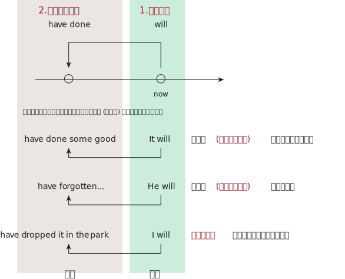

= ++ 此书我语法上的笔记
:toc: left
:toclevels: 3
:sectnums:
:stylesheet: ../../../myAdocCss.css

'''

倒数上去处理, 002-09 未完

== 介词后+ 名/动名词

=== sample

[.small]
[options="autowidth" cols="1a,1a"]
|===
|Header 1 |Header 2

|`主` #Caldwell#, who accepted bribes 贿赂；行贿财物 and *was suspected (v.) of*  running brothels 妓院 and *associating with*  pirates 海盗, `谓` #did not speak# _the Hakka 客家人 dialect_ 方言 `后定说明` spoken by many of Hong Kong’s Chinese residents.  +

[.my2]
考德威尔收受贿赂，并且被怀疑经营妓院、勾结海盗，但他却不会说香港许多华人居民所讲的客家话。
|我问:

这里的三个动词,  +
accepted 用了 -ed 是表示被动吗 (被接受贿赂)?   +
running 用了 -ing 是表示主动吗 (主动开妓院)?  +
associating 用了 -ing 是表示主动吗 (主动和海盗有联系)?
|===

▶ DeepSeek

[.small]
[options="autowidth" cols="1a,1a"]
|===
|Header 1 |Header 2

|who *accepted* bribes
|accepted 不是被动，是“一般过去时”. 这里 accepted 是谓语动词. +

如果是"被动语态", 必须是 be + 过去分词 (如 was accepted)。这里只有 accepted，前面没有 be动词 (was, is等)。

|and was suspected of *running* brothels and *associating with* pirates
|#*这两个 -ing 形式 跟在介词 of后面*# (suspected #of# runn**ing**... and associat**ing**...)。##**介词后面必须接"名词性成分"，**##所以这里的 running 和 associating"**#是动名词#**" (Gerund)，相当于名词，表示“经营妓院”和“与海盗交往”这两件事情。
|===

所以, 这三个动词都是主动语态, 而非"被动语态". 如果是被动语态, 就要说成下面这样:

[.small]
[options="autowidth" cols="1a,1a"]
|===
|主动 |被动

|who *accepted* bribes
|who *was accepted* bribes

|*running* brothels
|*being run* brothels

|*associating with*  pirates
|*being associated with* pirates
|===

'''

== sample

Foreign firms generally had _strict, though often unwritten, rules_ (n.) about their employees *becoming (动名词)  involved with* Chinese women.  +

[.my2]
外资公司通常有严格的、尽管往往是非书面的规定，禁止其员工与中国女性谈恋爱 / 发生亲密关系。

[.my1]
.案例
====
.我问:这里为什么用的是 becoming  这种 ing 形式?

[.my3]
[options="autowidth" cols="1a,1a"]
|===
|Header 1 |Header 2

|▶ DeepSeek:
|这里使用 becoming​ 是因为 about是一个介词，而介词后面必须接"名词"或"动名词"（即 -ing形式）。 +
becoming involved with Chinese women 是一个"动名词短语"，整体**充当介词 about的宾语**。

|▶ Gemini:
|rules (n.) about _their employees becoming (动名词) involved with Chinese women_.

- 为什么用了 becoming (带ing) ? 因为前面的核心词是 about。在英语语法中，介词（如 about, in, of, for 等）后面如果需要接动词，这个动词必须变成 -ing 形式（即"动名词"），作为该介词的宾语。

- 那中间的 their employees 是干嘛的？这在语法上叫作动名词的复合结构。 +
如果你说 rules about becoming involved，意思是不管谁卷入都不行。 +
加上 their employees，是明确了"谁"卷入这件事。 +

|▶ ChatGPT:
|这里的 becoming，不是“现在分词”, 而是充当 "动名词"（gerund）。关键原因只有一个：前面有介词 about。 +
*介词后面如果接动词，这个动词必须变成 -ing 动名词形式。*

注意： becoming involved with Chinese women 不是单纯的“成为”， +
而是一个固定表达：be involved with someone 意思是：“和某人有恋爱或亲密关系”。
|===

很多学习者会把 -ing 一律理解成“现在进行”，其实那只是其中一种功能。英语里的 -ing 形式有三种常见角色： +
1.谓语（进行时） +
2.动名词（像名词一样使用） +
3.现在分词做状语 ( 给整个句子补充背景信息，相当于一个被压缩的状语从句。) +

下面来说说第三种:  +
现在分词状语, 描述的是主句主语所处的情境、原因、时间或结果。

它有几种常见语义:

[.my3]
[options="autowidth" cols="1a,1a"]
|===
|Header 1 |Header 2

|时间（when / after）
|#Having finished# his work, he went home. +
= #After he had finished# his work, he went home. +
这里用 having finished 是因为动作先发生。

|原因（because / since）
|#Knowing the risks#, she refused the offer. +
= #Because# she knew the risks, she refused the offer.

|结果（thus / thereby）
|The policy lowered (v.) tariffs, #encouraging# foreign trade. +
= The policy lowered tariffs, #and# this encouraged foreign trade.

|条件
|#Turning left#, you will see the station. +
≈ #If# you turn left, you will see the station.

|伴随情况
|He sat at the table, #reading# a newspaper. +
≈ He sat at the table #while# he was reading a newspaper.
|===

这里有一个非常重要的原则，几乎所有语法书都会强调： +
#*分词状语的"逻辑主语", 必须和"主句主语"一致。*#

如：

- #Walking down# the street, #he# saw an old friend. +
这里 “walking” 的人是 he。

- 如果写成：
✗ #Walking down# the street, #the trees# looked beautiful. +
就变成"树在走路"了，这叫 dangling participle（悬垂分词）。

一个简单的区分方法是：
如果 -ing 短语可以改写成 when / because / after 从句，
那它大概率是 分词做状语。

#*英语语言像在做信息压缩：将时间关系、因果关系都被折叠进一个小小的 -ing 里。*#

====

'''

== -ing 现在分词 : 表(同步)伴随, 结果

=== sample

[.small]
[options="autowidth" cols="1a,1a"]
|===
|Header 1 |Header 2

|Gutzlaff’s weak command 控制；管辖；指挥 of 对……的掌握；精通程度 Chinese `谓` led him to mistranslate (v.)误译；错译 government proclamations 公告；宣言；声明, sometimes *resulting in* _violent, even fatal 致命的；灾难性的, altercations_ (n.)争吵；争辩；冲突 between the colonial government and the Chinese community.
|我问: 这里为什么用的是 -ing形式的 *resulting in* violent, 而不是 *resulted in* violent ?
|===

▶ DeepSeek:

用 *resulting in* , 其实是"现在分词短语"作结果状语.

为什么用 resulting in(现在分词) 而不是 resulted in(谓语动词)？ +
两者的区别在于句子结构和逻辑重心：

[.small]
[options="autowidth" cols="1a,1a"]
|===
|Header 1 |Header 2

|如果使用 resulted in：
|Gutzlaff’s weak command... led him to mistranslate..., and #(it) sometimes *resulted in*# violent... altercations...

##**这会将 resulted 升级为另一个并列的谓语动词。**##句子结构变成：A led to​ B, and​ (A) resulted in​ C。

#*逻辑上，这会暗示有这两个独立的事件:*# "A -> 导致了B",  和 "A -> 导致了C", #*即 B 和 C 是独立不相关的两个事件.*# 但事实上, 原文中, B 和 C 是有因果关系的, 并非是独立不相干的关系.

|使用 resulting in(现在分词短语)：
|这**在语法上明确将 resulting in...标记为状语，修饰前面的整个主句事件**（即“他的中文差, 导致他误译”这件事）。

#*即它建立了一个递进的因果链： +
A(中文差) -> 导致了B(误译) -> 进而又导致了C(争吵矛盾)*#

因此, resulting in...强调“\(C) 冲突”是前一个动作 ((B) mistranslate) 所自然而然引发的、附带产生的后续结果，而非与“(B) 误译”并列的独立结果。
|===

总结：-ing 现在分词短语,作结果状语:

- 形式：#*主句 (陈述主要事件), resulting in + 名词​ (表示该事件所导致的自然结果)。*#
- 功能：表示主句所述动作或情况所直接、必然引发的后续结果或影响。这种结果往往是非预期的、负面的或伴随性的。

例:

- The earthquake struck (v.) the city, *destroy##ing##* countless buildings. (地震袭击了城市，摧毁了无数建筑。) — “摧毁”是“地震袭击”的直接、伴随性结果。
- He made a critical error in judgment, *cost##ing##* the company millions. (他判断上犯了一个严重错误，让公司损失了数百万。) — “损失”是“犯错”导致的直接后果。

.我又问: 如果 -ing 现在分词能作"结果状语", 那么 -ed 过去分词, 能做"结果状语"么?

▶ DeepSeek:

##**-ed 过去分词（done）通常不能独立作“结果状语”，但它可以作“伴随状语”**##或“方式状语”。

##**虽然这两者（-ing 作结果 vs. -ed 作伴随）在中文翻译上可能都译成“导致……”，但在英语语法逻辑上，-ing 强调“主动产生”，-ed 强调“被动承受”。**##这是你刚才那句 resulting in violent altercations 绝不能换成 resulted in 的根本原因。 +

#*-ed 分词作状语时，通常描述"主句宾语所处的状态"，或者描"述动作发生时的背景环境"。它不表示“导致新结果”，而是表示“在……状态下完成动作”。*#

#**结构：S + V + O, + done...(O 是 done 的逻辑主语，且 O 与 done 是被动关系)
**#

例句对比:

[.small]
[options="autowidth" cols="1a,1a"]
|===
|#-ing# 现在分词 (doing), #表"结果"#​ |#-ed# 过去分词 (done)​,#表"伴随/方式"#

|##其逻辑主语​是: "主句的主语##或整个事件"
|#其逻辑主语​是: 主句的宾语#​ (极少数是主语)

|- He fired the gun, #*killing*# a bird. +
他开了一枪，打死了一只鸟。 +

(他用 -ing) ##**killing是结果状语。逻辑主语是 He。**##动作：他开枪 → 导致​ 鸟死了（主动产生新事件）。
|- He fired the gun, #*aimed*# at the bird. +
他开了一枪，枪口瞄准了那只鸟。 +

(他用 -ed) #*aimed是伴随状语。逻辑主语是 the gun*#​ (枪被瞄准)。动作：他##**开枪时，枪是处于被瞄准状态的**##（描述工具状态）。 +

|
|- The boy ran out of the house, #*followed*# by his dog. +
男孩跑出屋子，后面跟着他的狗。  +

(经典 -ed 伴随) #*followed 的逻辑主语是 the boy*#​ (男孩被狗跟随)。动作：#*男孩跑出来，同时伴随着“被狗跟”这个状态。*#
|===

'''

=== sample

[.small]
[options="autowidth" cols="1a,1a"]
|===
|Header 1 |Header 2

|When Bowring proposed (v.) a bill 法案；议案 in 1856 /allowing Chinese to practice 从事；执业 law, `主` #a European member# of _the Legislative Council_  `谓`  #objected# 反对；不赞成, #arguing that# /the Chinese “are _a peculiar 独特的；怪异的 race_ of people, and ... are generally crafty (a.)狡猾的；狡诈的, corrupt (a.), mendacious (a.)撒谎的；不诚实的, and deficient (a.)缺乏的；不足的 in those qualifications 资格；条件 which are needed in _a trustworthy 可靠的；值得信赖的 legal adviser_.” +
|a European member ... `谓`  objected, #arguing# that …

我问: 这里  arguing that  中的 -ing现在分词, 不是表示结果 那它表示什么?
|===

▶ DeepSeek:

这里的 arguing that...​ 绝对不是结果状语。它表示的是伴随情况或方式，具体来说，是解释性伴随状语。

#*虽然我们之前说过, -ing 可以表示"结果状语". 但在本句中, objected(反对)​ 和 arguing(争辩)​ 是同步发生的。这位议员不可能先“反对”（拍桌子喊“我不同意！”），然后过一会儿才“争辩说中国人狡猾”。他一定是在反对的那一刻，同时说出了这番理由。因此，这是"伴随"，不是"结果"。*#

[.small]
[options="autowidth" cols="1a,1a"]
|===
|Header 1 |Header 2

|-ing 表结果
|- He mistranslated, *resulting in*​ a fight. (先“误译”，后“导致”打架)。

在时间上，结果状语​ (resulting in) 是表示主句动作完成之后， 才发生的后续、自然结果（时间有先后）。

|-ing 表伴随
|- a European member ... `谓`  objected (v.), #arguing# that …

时间上, objected 和 arguing 是同时关系.

##**为了体现这种“伴随方式”，翻译时最好用“并”、“同时”**## 或冒号“：”来连接。

当宝宁（Bowring）在 1856 年提出一项法案（该法案允许华人执业法律）时，立法局的一位欧洲籍成员表示反对，##**并争辩说**##中国人“是一个特殊的种族，……普遍狡猾、腐败、虚伪，且缺乏那些（被需要的）素质（这些素质是一位可信赖的法律顾问所必需的）。”
|===

'''

== 倒装 : only+状语”位于句首时，其后要用部分倒装

=== sample

[.small]
[options="autowidth" cols="1a,1a"]
|===
|Header 1 |Header 2

|#*Only*# after 1883, when Governor Bowen convinced 说服 the Colonial Office 殖民部 to let him nominate (v.)提名；推荐 three _unofficial Legislative Council members_, one of whom would be Chinese, #*was there*# always a Chinese member on the Legislative Council.  +

[.my2]
直到1883年，鲍文总督说服殖民地办事处允许他提名三名非官方的立法会议员，其中一名将是中国人，立法会才一直有一名华人议员。
|was there always a Chinese member on the Legislative Council. 这里was there 为什么要用倒装?
|===

这里使用倒装, 是因为句子以 “Only after 1883”​ 这个表示时间的状语开头。

#*在英语中，当句首状语由 “only + 副词/介词短语/从句”​ 构成时，句子通常需要采用"部分倒装"结构。也就是说，助动词（如 was）要提到主语（there）之前。*#

- 正常语序（逻辑顺序）：
There was always a Chinese member on the Legislative Council /only after 1883. +
（直到1883年之后，立法局才一直有华人成员。）

- 倒装语序（为了强调时间状语）：
*Only after 1883​ /was there* always a Chinese member... +
（强调“直到1883年”这个时间点之后，情况才发生改变。）

'''

=== sample

And only after `主`  the Chinese members of the Legislative Council `谓`   #*had assured*#  the governor #*of*# Chinese support /倒装 *#were#* _British subjects of Chinese extraction_ 血统；出身 *#allowed#* to register   for the Defence Reserve.  +

[.my2]
并且，只有在立法局的华人议员, 向总督保证华人会提供支持之后，具有华人血统的英国臣民, 才被允许登记加入防务预备队。

[.my1]
.案例
====
.And #only# after ... #were# _British subjects of Chinese extraction_ #allowed#
...

#*only + 状语置于句首 → 主句部分要倒装: 助动词 /be 动词 / 情态动词 提到主语前面。*#

例: +
- #Only# then /#did# I realize the truth.
只有到那时我才明白真相。 +
- #Only# in this way /#can# you solve the problem.
只有用这种方法你才能解决问题。 +
- #Only# after he apologized /#did# she forgive him.
只有在他道歉之后，她才原谅了他。

.assure sb. of sth. 向某人保证某事

本句: #had assured# the governor #of# Chinese support
向总督保证华人的支持

又例: +
- I #assure# you #of# my honesty.
我向你保证我的诚实。 +
- They #assured# us #of# their help.
他们向我们保证会提供帮助。
====

'''

== 倒装: as do/does/did + 主语" ，表达“与……情况相同

=== sample

[.small]
[options="autowidth" cols="1a,1a"]
|===
|Header 1 |Header 2

|After 1845, the registrar general 户籍总监；总务官 had the right to enter (v.) any house `后定说明`  inhabited 居住于；栖居于 by Chinese; all Chinese households 家庭；户 *had to be registered* (v.)登记；注册 with the government, #as did# Chinese servants 仆人；佣人 working for Europeans.  +

[.my2]
1845年以后，登记官有权进入任何华人居住的房屋；所有的中国家庭都必须在政府登记，为欧洲人工作的中国仆人也是如此。
|我问: 这里 as did Chinese servants working for Europeans. 用了倒装么 (as do/does/did + 主语),  为什么?
|===

▶ DeepSeek:

确实使用了倒装结构。 这是一种常见的、为了避免重复而采用的"比较状语从句倒装"。

[.small]
[options="autowidth" cols="1a,1a"]
|===
|Header 1 |Header 2

|倒装过程还原：
|正常语序 (不省略，不优美)：as Chinese servants working for Europeans also had to be registered.

为避免重复，用助动词 did替代前面相同的谓语部分：#as Chinese servants# working for Europeans also #did#. (此处的 did替代了 had to be registered)

为强调“同样”, 并符合##*“as + 助动词 + 主语”的倒装习惯*##，将助动词 did提前到主语 Chinese servants之前，形成倒装：#as did Chinese servants# working for Europeans.

|为什么用倒装？
|避免重复，使行文简洁：这是最主要的功能。*从句的主语 (Chinese servants) 和主句的主语 (all Chinese households) 不同，但谓语部分 (had to be registered) 完全相同。用助动词 did替代整个谓语，再用倒装结构引出新的主语.*

#*这种 "as do/does/did + 主语" 的结构, 在学术、法律、历史等正式文体中非常常见，用以表达“与……情况相同”。*#

例:

- He is an excellent student, #as is his sister#.​ (他是个优秀的学生，他姐姐也是。)
- The company expanded (v.) rapidly last year, #as did its main competitor#.​ (该公司去年扩张迅速，其主要竞争对手同样如此。)
- She enjoys (v.) classical music, #as do I#.​ (她喜欢古典音乐，我也喜欢。)
|===

▶ gemini:

是的，这里使用了 部分倒装 (Partial Inversion)。 +
#*具体结构是：as + 助动词 (do/does/did/have/can) + 主语。*#

为什么要倒装？

- 避免重复： 为了承接前句的谓语动词，避免再说一遍 had to be registered。 即 did 是一个代动词，它代替了前文提到的动作：had to be registered。

- 句式平衡： *##在 as 引导的这种"比较或类比从句"中，##如果主语*（Chinese servants working for Europeans）*比较长，把动词 did 放在前面会让句子读起来更稳重，不会“头重脚轻”。*

- 正常语序  ...#as# Chinese servants #did#.
- 倒装语序  ...#as did# Chinese servants...

又例:

- He believed in the project, #*as did*# most of his colleagues. (他相信这个项目，他的大多数同事也是如此。) +
→ #did 代替了 believed。#

- The city was beautiful, #*as were*# the surrounding mountains. (这座城市很美，周围的山脉也是如此。) +
→ 这里##因为前文是 was，所以后面用 were 匹配复数主语。##

'''

== 倒装 / as + be + 主语 :​表示“也…”或“和…一样”

Chinese were generally excluded from 被排除在...之外 most of these activities, #as 如同 were most Eurasians# (as late as the 1940s, for example, Chinese and Eurasians could not join the Cricket Club).  +

[.my1]
.案例
====
.这里 as were most Eurasians​ 使用了倒装结构。

[.my3]
[options="autowidth" cols="1a,1a"]
|===
|Header 1 |Header 2

|▶ DeepSeek:
|这是一个典型的 #*as + be/助动词 + 主语*#​ 的倒装句式，#*用于表示“也…”或“和…一样”。*# +
为了强调这种“相似性”，英语习惯将 be动词（或助动词）提前，形成倒装。

这种倒装主要有两个作用： +
- 避免重复：省略了与主句相同的谓语动词 excluded，使句子更简洁。 +
- 强调相似性：通过倒装，将 as和 were放在句首，强调了“欧亚混血人”与“中国人”处于完全相同的处境。

又例:

- He is a doctor, #as is his wife#.​ （他是一名医生，他妻子也是。）
- She works very hard, #as do all her colleagues#.​ （她工作非常努力，她的所有同事也是如此。）

|▶ ChatGPT:
|这叫做 “so/neither/as 引导的附和倒装” 的一种变体，用来避免重复前面的内容。

*这种结构其实和下面这些表达是同一类逻辑： +
So did I. +
Neither did he. +
As did many others.* +

例如：He opposed the plan, *as did several other members*. +
展开就是：several other members also opposed the plan.

又如：

- The policy angered many merchants, *as did the new tax law*.
这项政策激怒了许多商人，新税法也是如此。

- The reform failed to satisfy workers, *as did the previous proposal*.
这项改革没能让工人满意，之前的提案也是如此。
|===

====

'''

== 虚拟语气

=== insist (v.) sb do (必须用原形)

[.small]
[options="autowidth" cols="1a,1a"]
|===
|Header 1 |Header 2

|The two *denounced* 谴责；指责 the strikers *as* selfish 自私的 and ignorant 无知的, #insisting# that /the colonial government #ban# 禁止 all unions and #not “retreat# 退却；让步 one inch.”
|我问: 这里 ban 和 retreat  为什么不写成 to ban 和 to retreat ?

|===

▶ DeepSeek:

[.small]
[options="autowidth" cols="1a,1a"]
|===
|Header 1 |Header 2

|1.因为 动词 insist后接宾语从句时，需要使用"虚拟语气"。
|#*动词 insist意为“坚持要求、坚决主张”，当它表示坚持某个要求、主张或决定（而非坚持某个事实）时，其后所接的 that宾语从句必须使用 虚拟语气。 +
虚拟语气的形式是：(should) + 动词原形。 +
在正式英语，尤其是美式英语中，should常常被省略，直接使用动词原形。*#

原句结构： +
...insisting [​ that the colonial government ban​(v.) all unions /and (should) not “retreat”​(v.) one inch ].

|2.用 to do 的话, 语义也不准确
|insist在此表示“坚决要求”（一个未发生的动作），这触发了虚拟语气的使用规则。#*不定式 to do虽然也表示未发生，但它常用于表示"(可做可不做的)目的、意图"或将来的动作，而不具备"虚拟语气"所要求的"强制性(必须做)"、主张性含义。*#

所以, 使用 to do 不定式会削弱“坚持要求”的强制性和正式性。虚拟语气 (should) ban 有“必须禁止、务须禁止”的强制性期望。
|===

在翻译时，需要把这种“要求、必须”的虚拟语气含义译出: +
这两人谴责罢工者自私无知，并##坚决主张（要求）##​ 殖民政府##必须##取缔所有工会，且不得“后退一寸”。

▶ 网上的说明

https://barshai.org/thoughts/mastering-the-subjunctive-mood-in-english/

#*这种后面必须用"动词原形"的虚拟语气, 除了insist 外, 还有哪些动词? 还有以下这些含有"建议/要求/命令/敦促"意思的:*#

- (v.) #*suggest, advise, propose, recommend, order, demand, insist, require, urge, command*#
- (a.) #*important, necessary, essential, vital (至关重要的，必不可少的), urgent, desirable (令人向往的，值得拥有的；可取的；性感的), imperative (极重要的，必要的；命令的，强制的；祈使的), mandatory (强制性的，义务的)*#

即: 虚拟语气有两种:

虛擬語氣 第①种 : +
##**用於表達"必要、重要、願望、建議、命令、要求"等非實際或不確定的情況。句中名詞子句的動詞, 通常使用"原形"，即使其主語是第三人稱單數。**## +
例如：”It is #crucial# that he #be# present.。

除此之外，不管虛擬語氣的主要子句的時態，名詞子句只用動詞原形。

以下列出使用虛擬語氣的常見形容詞：

- #重要的(關鍵的)#：important, imperative, vital, crucial, critical
- #必要的#：essential, necessary, mandatory (強制的)
- #迫切的#：urgent
- #建議的(明智的)#：advisable, wise
- #期盼與願望#：desirable (理想的, 令人渴望的), preferable (更好的、更可取的)
- #評斷#：beneficial (有益的), fitting (適當的), proper (適當的), right (正確的), good (好的)

- #建議# – suggest (建議) / propose (提議) / advise (勸告) / recommend (推薦)
- #要求# – ask / demand / require / request
- #堅持# – urge (力勸, 催促) / insist (堅持) / persist
- #命令# – command / order
- #規定# – rule / stipulate
- #偏好、期望、希望# – prefer (較喜歡) / expect (期望)

例:

[.small]
[options="autowidth" cols="1a,1a"]
|===
|Header 1 |Header 2

|表建議的例句
|- I #suggest# that you #take# a vacation. 我建議你去度假。
- He #proposes# that we #meet# earlier to discuss the plan. 他建議我們早點見面來討論計劃。
- She #proposed# that the committee #consider# a new approach. 她建議委員會考慮一種新的方法。
- She #advised# that he #take# a break from work. 她建議他暫時放下工作休息一下。
- I #recommend# that you #read# this book for more insight into the topic. 我推薦你閱讀這本書，以深入了解這個話題。

|表要求的例句：
|- The regulations #require# that all employees #be# trained annually. 規定要求所有員工每年接受培訓。
- The situation #requires# that we #act# with caution. 情況要求我們謹慎行事。
- She #asked# that he #arrive# no later than 10 AM. 她要求他最遲在上午 10 點到達。
- The protestors #demanded# that the law #be# changed. 抗議者要求改變法律。
- He #demands# that the work #be# completed by the end of the day. 他要求工作在一天結束前完成。
- She #requests# that guests not #wear# shoes inside the house. 她請求客人在屋內不要穿鞋。

|表堅持的例句：
|- They #insisted# that she #attend# the meeting. 他們堅持讓她參加會議。
- They #insist# that we #be# present at the meeting. 他們堅持要我們出席會議。
- The doctor #urges# that he #quit# smoking immediately. 醫生強烈建議他立即戒煙。
- They #urge# that we #act# now to prevent further damage. 他們催促我們現在就採取行動，以防止進一步的損害。

|表命令與規定的例句：
|- The judge #orders# that the evidence #be# presented immediately. 法��命令立即呈現證據。
- The commander #ordered# that the troops #withdraw# at once. 指揮官命令部隊立即撤退。
- She #suggests# that he #take# a vacation. 她建議他去度假。
- They #insisted# that she #attend# the meeting. 他們堅持讓她參加會議。

|表偏好的例句：
|
- I #prefer# that you not #mention# this matter to anyone. 我希望你不要向任何人提及此事。
- He #prefers# that we #handle# the situation ourselves. 他希望我們自己處理這種情況。
- We #expect# that she #be# present at the meeting. 我們期望她出席會議。
- The company #expects# that all employees #adhere# to the code of conduct. 公司期望所有員工遵守行為準則。
|===

- It is #important# that he #be# on time.
- It is #critical# that they #find# a solution to the problem soon.
他們盡快找到問題的解決方案, 至關重要。
- It is #mandatory# that he #report# to the office by 9 AM.
他必須在上午 9 點之前到辦公室報到。
- It is #urgent# that they #evacuate# the building as soon as possible.
當務之急是他們盡快撤離大樓。
- It is #imperative# that the government #act# quickly to resolve the crisis.
政府迅速行動解決危機是迫切的。
- It is #advisable# that they #reserve# their tickets in advance.
建議他們提前預訂門票。
- It is #wise# that they #consult# a lawyer before signing the contract.
他們在簽署合同前諮詢律師是明智的。
- It is #desirable# that he #submit# his application early.
他最好儘早提交申請。
- It is #preferable# that you #arrive# before noon.
您最好在中午之前到達。
- It is #fitting# that they #be# recognized for their hard work.
他們因為辛勤的工作而被認可, 是適當的(與期望、情境或常理是相符合的)。
- It is #proper# that he #apologize# for his mistake.
他為自己的錯誤道歉是適當的(與遵守社會規範、禮儀或行為準則有關)。
- It is #right# that she #receive# fair treatment.
她得到公平待遇是正確的(偏重於道德上或法律上的正義和公平)。
- It is #good# that we #be# aware of environmental issues.
我們意識到環境問題是件好事。
- It is #beneficial# that students #participate# in extracurricular activities.
學生參加課外活動是有益的。

虛擬語氣 第②种: +
假設語氣 – “如果……會怎樣”的句型。有幾種類型，包括表示條件句，現在非事實、過去非事實條件與未來非事實的假設(實際上發生的事跟自己所說的相反)，根據if子句的類型，時態和形式會有所不同，可能涉及過去式、過去完成式、未來式等。

- I wish I were a bird.

'''

=== sample

[.small]
[options="autowidth" cols="1a,1a"]
|===
|Header 1 |Header 2

|But the seamen always insisted that /the strike was economic and not political (although this was a common justification 正当理由；辩护 for strikes, in Hong Kong and elsewhere, and Su Zhaozheng and Lin Weimin later joined the Chinese Communist Party). +

[.my2]
但海员们始终坚称，此次罢工是出于经济诉求，而非政治目的（尽管这在香港及其他地区是罢工的常见说辞，而苏兆征与林伟民后来也加入了中国共产党）。
|我问: 这里  insisted that the strike was  中, insisted 不是虚拟语气吗? 后面为什么不用动词原形 be, 而用了 was?
|===

▶ DeepSeek:

它揭示了 insist这个词的两种不同含义，以及随之而来的两种完全不同的语法规则。
#*核心区别在于：insist在这里的含义是“坚称、坚称一个事实”，而不是“坚持要求”。*#

insist有两个主要意思，分别对应两种不同的从句结构：

[.samll]
[options="autowidth" cols="1a,1a,1a"]
|===
|insist的含义 |语法结构 (that 从句)|

|1.坚持要求​ (提出主张或命令)
|虚拟语气：insist that sb **(should) do** sth
|坚持（要求）…必须做某事

(坚持要求 → 虚拟语气)：

- The leader #insisted# that​ the meeting #be​# postponed. +
领导坚持要求会议必须推迟。(这是一个命令或要求)

|2.坚称事实​ (申明一个观点或事实)
|陈述语气：insist that sth **is/was** ...
|坚称（认为）…是…

(坚称事实 → 陈述语气)：

- The leader #insisted# that​ the meeting #was​# unproductive. +
领导坚称，那次会议是没有成效的。(这是一个观点或事实陈述)

|===

如何快速判断用哪种语气？
一个简单的判断方法是：看 insist后面的内容是否为一个可以“执行”的“动作”或“命令”。

- 如果是动作/命令​ (如“禁止工会”、“推迟会议”、“加工资”)，则用虚拟语气 (动词原形)。因为这是在要求某人去做某事。
- 如果是状态/事实/观点​ (如“罢工是经济性的”、“会议没成效”、“他是无辜的”)，则用陈述语气 (正常时态)。因为这是在陈述一个情况。

'''

=== sample

"Until localization 本地化；本土化 was _the order of the day_ 当日议程,流行的事物；风尚, in the 1980s," concludes David Faure, "`主` #no Hong Kong Chinese#, _however_ well educated _and however_ well established 地位稳固的；事业成功的 in his or her own profession, `谓` #could reasonably 合理地；明智地 have seen that# /he or she could *have gone very far* in government service."

[.my2]
大卫・福尔总结道：“在 20 世纪 80 年代本地化成为主流之前，任何香港华人，无论受过多么良好的教育，在自己的专业领域多么有建树，都很难指望自己能在政府部门有多大的发展。”

[.my1]
.案例
====
.我问: 这句话里, 既然 could reasonably have seen that  这里的"看到"这个动作, 是发生再1980之前,  而1980已经是"过去时"了, 那么"过去的过去", 不是应该用 had seen that 么? 为什么这里还是用了 have seen that   ?

▶ DeepSeek:

#*这里使用 “could have seen”,​因为它属于虚拟语气（Subjunctive Mood）中的"对过去的虚拟"（Past Unreal Conditional），而不是单纯的"过去完成时"。*#

虚拟语气用来表达与事实相反的情况、假设或愿望。在这句话中，作者想表达的是： +
“在1980年代之前，没有一个香港华人（无论多优秀）能够（在当时）预见到,自己能在政府中走得很远。” +

**这里的“预见到”并不是一个真实发生过的动作，**而是一种基于当时条件的推测或可能性。由于这种可能性在当时并未实现（他们实际上没看到），*所以必须用虚拟语气。*

“could have seen”​ 在这里表达的是对过去能力的否定推测。意思是：在当时（1980年代之前）的条件下，他们不可能（在当时）预见到未来的发展。*如果换成 had seen，意思就变成了“他们已经看到了”，这与作者想表达的“没看到”或“不可能看到”完全相反。*

-had seen：描述事实（已经看到了）。  +
- could have seen：描述假设（本可以看到，但没看到. 因为当时没有本地化政策）。

====

'''

== 虚拟语气 / Should have done : 用来表达"对过去发生的事情的评价、建议、批评或遗憾"。  核心含义：你本应该做，但你实际却没做.

Why did the British resistance *fall apart* 破碎，崩溃,失败 so quickly? A better question might be, given the overwhelming 势不可挡的；巨大的 strength  of the Japanese forces, why did Hong Kong not fall (v.) even earlier?  +

Although critics 批评者；评论家 later complained 报怨 that /the British should have put up a stiffer 更强硬的；更顽强的 resistance, `主` both regular troops  and volunteers  `谓` followed Churchill’s orders to fight to the end.  +

[.my2]
英国的抵抗为何瓦解得如此迅速？考虑到日军的绝对优势，一个更恰当的问题或许是，香港为何没有更早沦陷？尽管后来有批评者抱怨英国人本应进行更顽强的抵抗，但正规军和志愿者,都遵照丘吉尔的命令战斗到了最后一刻。

[.my1]
.案例
====
.我问: 这里 the British should have put up a stiffer resistance 为什么用的是 should #have put up#  而不是  should  #put up# ?

▶ DeepSeek:

这里使用 should **#have put up（虚拟语气）#**而不是 should *put up（一般现在时）*，是因为这句话是在回顾历史、进行事后评论，#*表达一种“本应做但实际没做”的遗憾或批评。*#

如果这里用 should put up，意思就变成了“英军现在应该进行更顽强的抵抗”，这显然不符合历史事实（因为战斗早已结束）。

#*“Should have done” 是英语中一个非常高频且重要的语法结构，它属于"虚拟语气"的一种，专门用来表达"对过去发生的事情的评价、建议、批评或遗憾"。*#

#*核心含义：本应做，但实际没做*#

这个结构最核心的意思是：说话人认为在过去某个时间点，某人“本应该”做某事，但事实上这件事并没有发生。

所以, should + have + 过去分词 (done) : 是在假设过去（Hypothetical Past）。它描述的是一个与过去事实相反的假设情况。

例:

[.my3]
[options="autowidth" cols="1a,1a"]
|===
|Header 1 |Header 2

|- #You should have finished#​ your homework yesterday. (你昨天本应该完成作业的。)
|批评与责备 (Criticism & Blame).  +
这是最常见的用法，表示对过去未做某事的不满或指责。

|- #I should have studied​ harder# for the exam. (我本应该为考试更努力学习的。)
|遗憾与后悔 (Regret) +
表达说话人对自己或他人过去行为的后悔，认为当时有更好的选择。

|- #He should have taken​ the train#; it would have been faster. (他本应该坐火车的，那样会更快。)
|建议与推断 (Suggestion & Deduction) +
表示对过去情况的推测，或者给出一个“事后诸葛亮”式的建议。
|===

对比:

[.my3]
[options="autowidth" cols="1a,1a,1a,1a"]
|===
|结构|时间指向|含义|例句

|Should do​
|现在/将来​
|表示**现在或将来应该做**的事（建议、义务）。
|You #should go​ to bed# early. (你应该早点睡觉。)

|Should have done​
|过去​
|表示**过去本应该做,但没做**的事（遗憾、批评）。
|You #should have gone​ to bed# early. (你昨晚本应该早点睡的。)
|===

我又问: 那么假如某人是"在 昨天后悔前天的事", 即并非"在今天后悔昨天", 也是用 Should have done 而不是用 Should had done 么?

是的，##**完全正确。无论你是在“今天后悔昨天”，还是在“昨天后悔前天”，只要是站在某个时间点去后悔更早之前发生的事，都必须使用 should have done，**##绝对不能用 should had done。

*为什么不能用 “should had done”？ 因为##情态动词（can, could, may, might, must, shall, should, will, would）后面, 必须接"动词原形"。##* 用 should had done 就是个语法错误.

所以, 无论你站在哪个“现在”去回望，只要那个动作发生在你回望的时间点之前，就必须用 have done。

例:

[.my3]
[options="autowidth" cols="1a,1a"]
|===
|Header 1 |Header 2

|今天后悔昨天
|时间：今天是3月12日，后悔3月11日没学习。

句子：#I should have studied#​ yesterday.
（站在3月12日，后悔3月11日的事。）

|昨天后悔前天
|昨天（3月11日）后悔前天（3月10日）没学习。

句子：I thought #I should have studied#​ the day before.
（站在3月11日，后悔3月10日的事。虽然主句动词 thought是过去式，但从句依然保持 should have studied不变。）
|===

====

'''

== was/were doing

=== sample

[.small]
[options="autowidth" cols="1a,1a"]
|===
|Header 1 |Header 2

|By the 1870s, graduates 毕业生 *were acquiring (v.)获得；习得 jobs* with local trading houses 商行；商号；交易行, in the Chinese treaty ports 通商口岸, in Japan, and in the United States.

[.my2]
到19世纪70年代，毕业生在当地贸易公司、中国通商口岸、日本和美国找到了工作。
|我问: 这里为什么用了  were acquiring 进行时?
|===

▶  +
强调“正在获得”的过程. *作者想表达的是，在 19 世纪 70 年代这个时间段里，毕业生们 ##正在陆续地、持续地​ 获得##这些工作机会*。这不仅仅是一个“他们找到了工作”的静态结果，而是一个 动态的、正在发生​ 的趋势。

- 如果用 acquired​ (一般过去时)：只表示“他们获得了工作”，是一个 "完成"​ 的动作，不强调过程。
- 用 were acquiring​ (过去进行时)：表示“他们 "正在"​ 获得工作”，描绘了当时毕业生就业市场 活跃​ 的场景，暗示这是一个 持续进行​ 的现象。

#*时间背景：By the 1870s​ (到 19 世纪 70 年代为止) 这个时间状语，通常与 "进行时"​ 或 "完成时"​ 搭配，表示到某个时间点为止，某个动作或状态 "一直在持续"​ 或 "正在发生"。*#

'''

=== was/were (not) doing (焦点在"事情的性质"(价值判断)) VS  did/didn't do (焦点在"事情的存在与否"(事实判断))

Stubbs _in particular_ 特别地,尤其,特别是 has often *been criticized for* not understanding (v.) the political situation in China *and for* failing to differentiate (v.)区分；辨别 between Chinese nationalism 民族主义 and Communism 共产主义, but #he was not necessarily exaggerating# 夸大；夸张 the extent 程度；范围 of these influences from Canton. +

[.my2]
尤其是 Stubbs，经常被批评不了解中国的政治局势，也未能区分中国民族主义与共产主义，但他对来自广州的这些影响程度的描述，未必是夸大其词。

[.my1]
.案例
====
.我问:这里为什么用的是 he was not necessarily exaggerating 而不是 he didn't necessarily exaggerat ?

▶ DeepSeek:

[.my3]
[options="autowidth" cols="1a,1a"]
|===
|Header 1 |Header 2

|did not exaggerate (一般过去时):
|仅仅陈述一个事实——“他没有夸大”。这是一个对行为结果的简单否定，不涉及行为过程或性质。

|was not exaggerating (过去进行时)：
|英语的进行时态, 常用来描述一个动作在特定背景下的"状态或性质"，而不仅仅是记录"动作的发生"。例如：

- You are not helping.(你这不是在帮忙。) →#** 描述“你现在的行为”性质上是“无益的”，而非单纯说“你没帮上忙”。**#
- He was not lying.(他当时没说谎。) → 强调“他当时说的话”在性质上是“真实的”，比 He didn't lie.更能捍卫他话语的性质。

- He was not exaggerating. #*将焦点从“他这个人是否做了夸大这件事”, 转移到“他所作出的那个具体判断/陈述的性质”上。*#
|===

又例:

[.my3]
[options="autowidth" cols="1a,1a"]
|===
|did（一般过去时） |was/were + doing（进行时）

|did/didn't do：##**客观陈述一个动作“做没做”。**##焦点是事实结果。
|was/were (not) doing：描述或定性一个动作“在当时是怎样的”。##**焦点是行为过程的性质、**##方式或即时状态，常带有主观评价色彩。

was/were (not) doing结构是英语中一个非常有力的工具，##**用于剥离行为本身，转而聚焦于行为的性质、**##意图或即时状态。在需要做出精细区分、定性评价或即时辩护的语境中（如学术批评、法律辩护、日常解释），它的表现力远超简单的一般过去时。

|- The witness #didn't lie#.​ (证人没有说谎。)
→ 客观陈述**“说谎”这个##动作没有发生##。**这是一个事实判断。
|- The witness #was not lying#.​ (证人当时没说谎。)
→ 描述“证人当时的陈述行为”的**#性质是#“诚实的”。**这是在为其证词的性质辩护。

|- In that remark, you didn't help.​ (你刚才那句话没帮上忙。)
→ 客观陈述“帮忙”这个##结果没有达成。##听起来更像一个中性的结果汇报。
|- In that remark, you were not helping.​ (你刚才那句话不是在帮忙。)
→ 评价“你说那句话的行为”*#性质上是#*“无益的、帮倒忙的”。焦点是言行的效果。

|- I #didn't complain#.​ (我没有抱怨。)
→ 只是陈述##“抱怨”这个动作没有发生。##缺乏对行为性质的即时界定。
|- #I wasn't complaining#, just stating a fact.​ (我不是在抱怨，只是在陈述事实。) → 定义自己“刚才说话的行为”的##性质是“陈述”而非“抱怨”。##这是在即时澄清意图。

|- He just #tried# to be funny.​ (他试了试想搞笑。)
→ 客观陈述他“尝试搞笑”这个事实，不涉及其行为在当下情境中的性质。
|- He #was just trying# to be funny.​ (他只是想搞笑一下。)
→ 解释他“当时行为”的意图和##性质是##“出于幽默”，可能为冒犯性言语开脱。

|- All those years, she #sacrificed# for the family.​ (那些年，她为家庭做出了牺牲。)
→ 客观陈述“牺牲”这个事实，评价意味较弱。
|-  All those years, she #was sacrificing# for the family.​ (那些年，她一直是在为家庭牺牲。)
→ 将“她多年的行为”##定性为##一种“牺牲”，带有强烈的情感认同和评价。

|- When you said nothing, you #agreed# by default.​ (你当时一言不发，就等于默认同意了。)
→ 逻辑上与右边句相同，但听起来更像一个逻辑推论的结果，而非对行为本身的即时定性。
|- When you said nothing, you #were agreeing# by default.​ (你当时一言不发，就等于默认同意了。)
→ 将“沉默”这个行为状态##定性为##“默认同意”。这是对行为法律/道德性质的判定。
|===

▶ Gemini :

[.my3]
[options="autowidth" cols="1a,1a"]
|===
|Header 1 |Header 2

|didn't exaggerate (一般过去时)： 听起来更像是在评价某**一个具体的、一次性的行为。**
|was not exaggerating (过去进行时/状态描述)：暗示司徒拔当时对广州形势的"*持续性判断*". exaggerating 在这里不仅是动词，#它更像是在描述一种**“程度的准确性”**。#

|He didn't exaggerate.  (#事实判断#) . 他没有说假话（非黑即白）。
|He was not exaggerating.  (#性质评估#) . 他的描述（在当时那种语境下）并不算过分。

|The doctor didn't exaggerate the illness. (他没说错。)
|The doctor was not exaggerating the danger. (医生当时的这种危机感/描述状态，并不是在夸张。)
|===

▶ ChatGPT:

有一个小语言感觉可以帮助理解： +
- #*exaggerate 更像一个“动作”，*# +
- #*而 exaggerating 更像一种“行为状态”。*#

所以： +
- He didn’t lie. （直接判断事实） +
- He wasn’t lying. （强调当时的行为状态） +

作者显然想表达第二种。

====

'''

== be to do 的意思之一: 带有强制性, "注定/必须做某事"

=== sample

The strike failed to change the political status  of Chinese in Hong Kong, but it showed the government that /#its Chinese subjects 国民；臣民 were to be taken seriously#.  +

[.my1]
.案例
====
.这里为什么写的是 its Chinese subjects #were# to be taken seriously. 而不是 its Chinese subjects #should# to be taken seriously?

▶ DeepSeek:

[.my3]
[options="autowidth" cols="1a,1a"]
|===
|Header 1 |Header 2

|were to be taken seriously(原文用法)
|be to do 结构。这里的 were是 be动词的过去式，与 to be taken(不定式的被动式) 结合，构成 be to do 的"过去时被动语态"。 +
性质：这是一个陈述句，描述一个事实或结果。

这个 #*be to do结构（在句中体现为过去时 were to be taken）, 它不表示“将要”（那是 will或 be going to的职责），而是表示“注定、必须、应该、计划”等带有必然性、义务性或计划性的意味。*#

were to be taken seriously (原文) +
含义：表示“注定/必须被认真对待”。

|should to be taken seriously(错误用法)
|结构：#*should是情态动词，后面必须接动词原形。*# 只能写成 should be taken seriously.

#should# be taken seriously (替代写法) +
含义：表示“应该被认真对待”。

逻辑：#*这通常表达一种主观的建议、义务或责任。如果使用 should，句子的意思会变成听起来像是在给政府提建议，而不是描述罢工产生的实际影响。*#

#**但原文想要强调的是：华人不是"建议应该"(should)被认真对待, 而是"必须"被认真对待(were to be taken seriously).
**#

|===

又例:

- *He was to become*​ a great leader.(他##注定##要成为伟大的领袖。) +
#*be to do：强调客观的、外部的必然性（如历史规律、命运安排、上级命令）。*#

- *He should become*​ a great leader.(他应该成为伟大的领袖。) +
#*should：强调主观的、内在的义务或建议（如道德责任、个人建议）。*#

[.my3]
[options="autowidth" cols="1a,1a"]
|===
|Header 1 |be to do结构表示 “必须/应该做”（即表示 命令、指示、义务​ 或 客观必然性）

|1.表示“命令/指示/规定” (Orders & Instructions)
|这种用法##**通常带有强制性，常见于官方文件、规章制度或上级对下级的指令。**##

- #You are to report to# the principal's office immediately.​
（你必须立刻去校长办公室报到。）
解析：这是明确的命令，相当于 You must report...

- #No one is to leave the building# until further notice.​
（在接到进一步通知之前，任何人不得离开这栋楼。）
解析：这是硬性规定，强调禁止。

- #The form is to be filled out# in black ink only.​
（表格必须只用黑色墨水填写。）
解析：这是对操作流程的硬性要求。

|2.表示“义务/责任” (Obligation & Duty)
|这种用法##**强调一种道义上或职责上的“应该”，带有强烈的必然性。**##

- #A man is to protect# his family.​
（男人就应该保护他的家人。）
解析：强调社会角色赋予的责任。

- #The truth is to be told#, no matter how painful it is.​
（真相必须被说出来，无论它多么令人痛苦。）
解析：强调客观道义上的必须。

|3.表示“客观必然/命中注定” (Destiny & Inevitability)
|这种用法常出现在历史叙述或文学作品中，#*表示事情注定会发生，带有一种“不得不”的意味。*#

- #He was to become# one of the greatest scientists of his time.​
（他##注定##要成为他那个时代最伟大的科学家之一。）
解析：描述历史人物的命运轨迹。

- Little did they know that #this decision was to change their lives forever#.​
（他们当时不知道，这个##决定##将彻底改变他们的一生。）
解析：表示后来发生的、不可避免的结果。

|4.表示“计划/安排” (Plans & Arrangements)
|虽然这层意思更偏向“计划”，但在正式语境下，计划往往也带有“必须执行”的意味。

- #The delegation is to arrive# at 10 a.m. tomorrow.​
（代表团定于明天上午10点抵达。）
解析：这是既定的日程安排，必须遵守。

|5.与 should的细微区别
|虽然 be to do有时可以翻译为“应该”，但它和 should的侧重点不同： +

- be to do：侧重于 外部规定、客观安排或必然结果（如命令、计划、命运）。 +
- should：侧重于 主观建议、道德劝告或个人意见（如“你应该好好学习”）。 +

例句对比： +
#You are to finish the work# by Friday.​ （这是老板的##命令##，你必须完成。） +
#You should finish the work# by Friday.​ （这是我给你的##建议##，你最好完成。） +
|===

在你的句子中：

- 使用 were to be taken 说明这是**历史发展的必然**（华人力量崛起，政府必须面对）。
- 如果使用 should be taken，则变成了对政府的**道德劝诫**（政府应该善待华人），这削弱了原文那种“大势所趋、不得不为”的强硬逻辑。

除了表示“注定/必须”，be to do 在不同语境下还有以下含义：

[.my3]
[options="autowidth" cols="1a,1a,1a,1a"]
|===
|Header 1 |中文释义||

|计划/安排​
|按计划将要做
|The meeting is to be held​ tomorrow. (会议定于明天举行。)
|强调事先的安排，比 will更正式。

|#*命令/指示​*#
|#*必须/应该做*#
|*You are to finish*​ this report by Friday. (你必须在周五前完成报告。)
|#*带有指令性，常见于规章制度。*#

|可能性​
|可能/可以
|How am I to know? (我怎么会知道？)
|常与 how, where, what等疑问词连用。
|===

▶ Gemini:

虽然 should be 和 were to be 翻译成中文可能都带有“应当、必须”的意思，但在这种历史叙述的语境下，**were to be 传达了一种“客观必然性”和“既定事实”**的重量感，*而不仅仅是主观建议。*

[.my3]
[options="autowidth" cols="1a,1a,1a"]
|===
| 表达方式 | 核心逻辑 | 语感分析

| should be | #道德或主观上的建议# | “政府以后‘应该’重视华人。”（这更像是一种呼吁或期望，不一定真的会发生）。
| were to be | #*客观现实下的必然结果*# | “政府意识到，华人‘#注定/必须#’被严肃对待。”（这是一种基于力量对比后的现实定论）。
|===
====

'''

=== sample

In response to 作为回应 so much pressure, in 1929 the Legislative   Council  passed (v.) an amendment 修正案；修订案 *stipulating 规定；明确要求 that* mui-tsai were to be registered (v.) and paid (v.) wages.  +

[.my1]
.案例
====
.mui-tsai were to be registered

这里的 were to be registered是一个 #*“be + to do”​ 结构，在这里表示 “法律或规定要求必须做某事”，相当于中文的 “须”、“应”​ 或 “必须”。*#

是不定式的被动形式，通常表示将来时间，指某个"被动动作", 在未来将被完成，常用于描述计划、安排或预期。它强调动作的**“被动性”和“将来性”，**即**“待办”、“即将被做”。**

- There is much work *to be done*.  (有许多工作要做)。

本句这种结构, 在描述法律、规章或正式指令时，*表示 “被规定/被要求去做”​ 或 “未来的安排/计划”。* +
这里的 were to be强调了 “法律强制力”​ 和 “未来的义务”。它不是简单的“将要被登记”，而是 “根据法律，她们**有义务**被登记”。

#*be to do（were to be registered）：带有 “指令性”​ 或 “计划性”，强调这是修正案 “规定”​ 的内容，是必须遵守的条款。*# +
在翻译时，为了体现这种 “法律强制”​ 的语气，建议使用 “须”、“应”​ 或 “必须”​ 等词：
====

'''

== 独立主格, 做状语

=== sample

[.small]
[options="autowidth" cols="1a,1a"]
|===
|Header 1 |Header 2

|In 1877 the police magistrate 地方治安官；法官 estimated (v.) that /only _one out of every six_ 每六人中就有一人 Chinese women in Hong Kong were either married or concubines 妾；姨太太, #the rest _being prostitutes_#.
|我问: 为什么用 the rest being prostitutes 而不是 the rest were prostitutes？

|===

▶ DeepSeek:

the rest being prostitutes 这是一个状语，用来补充说明前面主句的情况。它本身不是一个完整的句子，而是依附于主句存在的附加信息。

the rest being prostitutes 也是独立主格.  +
the rest (逻辑主语) + being (现在分词，表状态)。

因为在英语中，一个句子只能有一套主谓结构（这里是 the police magistrate estimated that...），不能再插入另一个完整的句子（如 the rest were...），否则就构成了串句错误 (Run-on Sentence)。*#这样就变成了两个独立的句子#*（The police `谓` magistrate estimated...和 The rest `系` were prostitutes...）#*，但中间却只用了一个逗号连接。这在标准英语语法中是错误的，必须用分号（;）或句号（.）断开，或者加上连接词（如 and）。*#

▶ gemini:

作者之所以不写 the rest were prostitutes，是因为他不想把这句话变成两个平等的句子，而是想让后半部分像一个**“补充挂件”**一样，紧紧跟随在前半部分的描述之后。

[.small]
[options="autowidth" cols="1a,1a"]
|===
|Header 1 |Header 2

|"独立主格"结构的"公式":
|#*[名词/代词] + [非谓语动词 / 形容词 / 副词 / 介词短语]*#

这种结构不需要连词（如 and），也不需要完整的谓语动词。它的作用是为前面的主句提供补充说明、背景信息或对比。

- 在 the rest _being prostitutes_ 中： +
The rest 是这个小结构的逻辑主语。 +
*Being 是现在分词，表示一种状态。*

|独立主格的“独立性”到底在哪里？
|它的“独立”主要体现在 逻辑主语 上。

请看这个对比：

- 普通分词短语：#Missing the bus#, I was late.
(逻辑主语是 I，必须和主句主语一致。)
- 独立主格：#The bus having left#, I had to walk.
(独立主格的主语是 The bus，主句主语是 I。它们各玩各的，互不干扰，这就是“独立”。)

|独立主格的作用
|#*独立主格在句子中通常充当“状语”，负责交代以下信息：*#

- 时间：The class over (课结束后) → we went to the canteen.
- 原因：There being no bus (因为没车了) → we took a taxi.
- 条件：Weather permitting (如果天气允许) → the game will be held.
- 伴随/状态：He stood there, his head down (他站在那，低着头).

|避坑指南
|1.*##千万别加连词：独立主格和主句之间只能用逗号。如果你加了 and，它就变成了“并列句”，##动词就得变回 were 或 was。*

- × The sun rising, and (错!) the fog disappeared.
- √ The sun rising, the fog disappeared.

2.#*动词不能是谓语：独立主格里的动词必须是“非谓语形式”（V-ing, V-ed 或 Being）。*#

- × The sun rose, the fog disappeared. (这叫“逗号连接两个句子”，是语法错误。)

下面才是正确的用法:

- *The sun rising*, the fog disappeared. (太阳升起，雾散了。) #名词 + V-ing#
- *The job finished*, we went home. (工作完成了，我们回家了。) #名词 + V-ed#
- He sat there, *his eyes red*. (他坐在那，眼睛红红的。) #名词 + Adj.#
- *The meeting over*, everyone left. (会议结束，大家都走了。) #名词 + Adv.#
- The boy ran,** a stick in hand**. (男孩跑着，手里拿着棍子。) #名词 + Prep#
|===

'''

== 独立主格中, 省略系动词

As the campaign *gained steam* (蒸汽,蒸汽动力) 壮大；增强势头 in Britain, _the Hong Kong Anti-Mui Tsai Society_ was founded   in 1921, its _organizing committee_ 委员会 almost all Chinese.  +

[.my1]
.案例
====
.这里 its organizing committee almost all Chinese 似乎没有谓语或系动词?

▶ DeepSeek:

its organizing committee almost all Chinese （其组织委员会几乎全是中国人） 确实是一个没有谓语动词的独立结构，这在英语语法中被称为 “独立主格结构” (Absolute Phrase)。

逻辑主语 (Nominative Absolute)：its organizing committee +
逻辑表语 (Predicative)：almost all Chinese +

语法本质：它省略了系动词 being。完整的写法应该是： +
its organizing committee (being) almost all Chinese

为什么可以省略系动词？ +
#*在"独立主格结构"中，being通常可以省略，尤其是在表示“伴随状态”或“补充说明”时。*#

**这个独立主格结构在句中充当 “伴随状语”，**用来补充说明主句主语 the Hong Kong Anti-Mui Tsai Society的细节。

又例:

- He stood there, _his hands (being) in his pockets_.
（他站在那里，双手插在口袋里。）
- _The meeting over_, we all went home.
（会议结束后，我们都回家了。）
- He entered the room, _his face (being) red with anger_.
（他走进房间，脸气得通红。）

总结：这是一个典型的 “名词 + 形容词” 型独立主格结构，省略了系动词 being，用来描述主句动作发生时的伴随状态。

▶ Gemini:

##**"独立主格结构"中省略"系动词"（通常为 be 或 being）常见于“名词/代词 + 形容词/副词/介词短语”结构，用于描写伴随状态、原因或时间。**##这种省略使句子更紧凑，##**逻辑主语与主句主语不一致，**##

- #All (being) ready#, we set off. 一切准备就绪，我们出发了。
- He sat there, #eyes (being) closed#. 他坐在那里，闭着眼睛。

#*独立主格由“独立主语 + 非谓语动词/形容词/副词/名词/介词短语”构成。当谓语部分是"系表结构"（系动词+表语）时，系动词常被省略。*#

省略 be 或 being 的常见结构:

[.my3]
[options="autowidth" cols="1a,1a"]
|===
|Header 1 |Header 2

|名词/代词 + 形容词
|- _All (being) ready_, we started. (全准备好了，我们出发了。)
-  She stood there, _her face (being) red_. (她站在那，脸红了。)

|名词/代词 + 介词短语
|- The teacher came in, _a book (being) in her hand_. (老师走进来了，手里拿着书。)
- He left, _his heart (being) at ease_. (他离开了，心很安宁。)

|名词/代词 + 副词
|- _The meeting (being) over_, we all went home. (会议结束了，我们都回家了。

|with/without 引导的独立主格
|#当使用 with 或 without 引导时，同样可以省略 being。#

-  _With all work done_ ( = With all work having been done), he went home. 所有工作完成后 ，他回家了。
-  She sat there _with her eyes closed_ ( = with her eyes being closed). 她闭着眼睛坐在那里
|===

====

'''

== 省略

=== sample

[.small]
[options="autowidth" cols="1a,1a"]
|===
|Header 1 |Header 2

|Des Voeux #argued that# /the colony’s security 安全；保障 *depended on* the health of its soldiers and police /#and that# `主` the system was the only way ① *to keep* girls *from* being sold into prostitution 卖淫；娼妓业, ② check (v.)抑制；控制 the spread of venereal 性病的 diseases, ③ and *keep* (v.) brothels 妓院 *from* spreading into the more respectable  parts of town.  +

[.my2]
Des Voeux辩称，殖民地的安全, 取决于其士兵和警察的健康状况，而这一制度是防止女孩被卖入娼门、遏制性病传播以, 及阻止妓院蔓延到镇上更体面区域 的唯一途径。
|我问:这句中, check  the spread of 和 and keep brothels from spreading 前面是不是省略了 to ? 完整的应该是 ** to check**  the spread of 和 *and to keep* brothels from spreading ? 这里为什么要省略to?
|===

▶ DeepSeek:

这里确实省略了 to，这是一种非常典型的并列结构省略。

原句的核心结构是：the only way *to do A, (to) do B, and (to) do C*.

A: to keep girls from being sold into prostitution +
B: (to) check the spread of venereal diseases +
C: (to) keep brothels from spreading into the more respectable parts of town

##**省略规则：当多个不定式（to do）由 and​ 或 or​ 连接，且它们共享同一个逻辑主语（这里是 the system）时，通常只在第一个不定式前保留 to，后面的 to​ 可以省略，**##使句子更简洁流畅。

虽然省略很常见，但在以下两种情况，通常建议把 to 写回来：

[.small]
[options="autowidth" cols="1a,1a"]
|===
|Header 1 |Header 2

|1.动作跨度太长
|如果第一个动作和第二个动作之间隔了十几个单词，读者可能忘了前面有个 to，这时补上 to 能提醒读者：“嘿，这还是那个‘方式’的一部分。”

|2.强调对比
|如果你想强调这两个动作是截然不同的两回事，重复 to 会更有力度。 即##**为了强调每一个动作的独立性和重要性，或者为了形成排比句式,以增强气势，通常会保留所有的 to。**## +

- The purpose of this program is *to educate* the public, *to raise* awareness, and *to promote* action.  +
#*保留三个 to, 强调了这三个目标是同等重要且并列的，而不是一个笼统的“目的”。*#
- He wanted *to live* and *to win*. (他不仅想活着，他还想赢。重复 to 表达了双重的决心。)

|3.当省略会导致歧义时（避免误读）
|如果省略 to后，后面的动词可能被误认为是句子的谓语动词（即主句的动词），或者与前面的介词结构混淆，则必须保留 to。
|===

'''

== 被动句, 还是系表句?

=== sample

[.small]
[options="autowidth" cols="1a,1a"]
|===
|Header 1 |Header 2

|By *asking for* permission *to form (v.) a society* to stop kidnapping, the Chinese elites were trying to distinguish (v.)区分；辨别 between kidnapping and the mui-tsai system, thus attempting to preserve (v.)保留；维护 a custom   in which _they  were `表` so heavily invested_ (a.). +

[.my2]
中国精英阶层请求获准建立一个制止绑架的社会，试图将"绑架"与“妹仔”制度区分开来，从而努力维护一种他们投入甚多的习俗。
|我问: 这里 they were so heavily invested. 为什么有个 were? 难道是被动么?  为什么不写成 they invested so heavily ?
|===

▶ DeepSeek:

[.small]
[options="autowidth" cols="1a,1a"]
|===
|Header 1 |Header 2

|这里是一个系表结构
|这里的 were invested​ 并不是被动语态，而是一个“系动词 + 形容词”​ 结构，表示一种状态。 +
invested：是过去分词转化来的形容词，意思是“投入的、涉入很深的”。

- They were invested (a.). (他们投入很深。)

原句 a custom in which they were `表` so heavily invested (a.)  +
应理解为： 一种他们（的利益）深陷其中/与之深度绑定的习俗。​ 或更通顺地译为：一种他们与之利害攸关的习俗。

这里的 were​ 是系动词，与形容词化的过去分词 invested​ 构成系表结构，*描述一种深度牵连的状态，而非被动语态，也非主动的“投资”行为。*

|为什么不写成 :
they `谓` invested (v.) so heavily ?
|这意为“他们主动地、在某个时间点投入了大量（金钱、精力等）”，*这描述的是一个"主动"的投资行为，而不是他们身处其中、与之利益捆绑的"持续状态"。*
|===

▶ gemini:

这里的 be invested in 并不是我们常说的“被投资”，而##**是一种形容词化的用法，**##表示**“投入了巨大的心力/利益”或“深度参与/利益攸关”**。

[.small]
[options="autowidth" cols="1a,1a"]
|===
| 表达方式 | 侧重点

| They were `表` so heavily invested (a.) (状态)
| ##**侧重于状态。**##强调他们此时此刻正处于一种“泥足深陷”或“利益紧绑”的局面中。

这里用 were invested 是为了表达：这群精英阶层已经和这个制度（妹仔制度 mui-tsai）利益捆绑得太深了，他们已经身处其中，无法轻易脱身。

| They `谓` invested (v.) so heavily (主动)
| ##**侧重于动作。**##强调他们“投入”了金钱或时间这个行为。
|===

想象一下你开了一家奶茶店，不仅投了钱，还花了三年心血，连全家人的生计都指望它。

- 如果说 "I invested (v.) in the shop"，就像是在说：“我往店里投了钱。”（听起来只是个买卖）
- 如果说 "I am heavily invested (a.) in the shop"，意思就是：“这家店就是我的命，我跟它是一体的。”（这是一种深度绑定的状态）

你可以把它看作系表结构。

'''

=== sample

[.small]
[options="autowidth" cols="1a,1a"]
|===
|Header 1 |Header 2

|After a series of studies on _whether 是否 the system constituted (v.)构成；组成 slavery_ 奴隶制, the matter *went to* the British _House of Lords_ 上议院, which agreed that /the colonial  government should not *interfere (v.)干涉；干预 with customs* #that were `表`  so deeply ingrained (a.)根深蒂固的;使根深蒂固 in Chinese society.# +
|我问:  这里 that *were so deeply ingrained*  in Chinese society 中, ingrained 这个词既可以做动词, 也可以做形容词, 那么 were  ingrained 是理解成"被动句"好, 还是理解成 "系表结构"好? 理由是什么?
|===

▶ grok:

(1). “deeply ingrained” 是固定搭配，几乎总是形容词用法. 又如:
“deeply ingrained habit / prejudice / belief / custom / tradition” +
“deeply ingrained in Chinese society / in our culture / in his character” +

*这个结构在现代英语里出现频率极高，母语者几乎不会把它理解成被动语态。*

(2). #*更重要的是，英国上议院讨论的重点不是“某人把习俗刻进了中国社会”，而是“这些习俗在中国社会里已经根深蒂固到难以撼动”的 状态。*#

(3). 语法测试（很直观的方法） +
可以把句子做以下替换测试，看是否自然：

- 原句部分 : customs that were so deeply _ingrained_

-> 把 ingrained 换成其他更明显的形容词, 我们来看看句子意思是否合理:

- customs that were so deeply _rooted (a.)根深蒂固的；生根的 / entrenched (a.)根深蒂固的；确立的，不容易改的 / established_ (a.)确立已久的，早已投入使用的

替换后, 意思也完全自然. → 能顺畅替换成其他形容词 → 说明原句本身就是系表结构.

-> 再替换成更明显的被动结构:

- customs that *were so deeply implanted / instilled / embedded* by someone 不自然，语义变了
- customs that *had been so deeply ingrained* 勉强，但很别扭

▶ gemini:

在这个句子中，##**作者并不是想表达“某人”在那个瞬间把习俗“植入”了社会，而是描述这些习俗已经存在了很久、已经成为了社会DNA的一部分。**##ingrained 在这里修饰 customs，描述其“不可磨灭”的属性。

▶ ChatGPT:

如果是纯形容词，通常会： +
- 不带典型动词搭配 +
- 不明显体现“被谁做”

- 如果是动作型被动，通常更自然的是：had been ingrained +
因为“被植入”是一个先发生的动作。
- 但这里用 simple past “were”，更符合：描述当时存在的状态 +

*英语里大量 V-ed 结构处于一个“灰色地带”*： +
The door is closed.（状态） +
The door was closed.（可能是动作，也可能是状态） +

*区分关键永远是：语境是否强调“发生了什么”, 还是强调“处于什么状态”*

'''

== would have been 用来表达一种与"过去事实"相反的假设或推测

=== sample

[.small]
[options="autowidth" cols="1a,1a"]
|===
|Header 1 |Header 2

|_Sedan-chair 轿子 carriers_ 搬运工；运送者 and _rickshaw 人力车；黄包车 pullers_ 拉车的人 refused to carry visiting (a.)访问的，参观的 American _Secretary of War_ William Taft (who, weighing (v.) more than three hundred pounds, #*would have been*# a very heavy load 重负；负荷；装载量 indeed) and his entourage 随行人员；随从.  +

[.my2]
轿夫和人力车夫, 拒绝搭载来访的美国战争部长威廉·塔夫脱（他体重超过300磅，确实会是一个非常沉重的负担）及其随行人员。 +
|我问: 这里为什么写成 would have been a very heavy load , 而不是 would be a very heavy load ?

|===

▶ DeepSeek:

[.small]
[options="autowidth" cols="1a,1a"]
|===
|Header 1 |Header 2

|① “would have been”：表示##**过去的可能性（但实际没发生）**##。
|#*这里使用 “would have been”​ 而不是 “would be”，是因为作者在描述一个基于历史事实的“反事实假设”。这种用法被称为 “虚拟语气”（Subjunctive Mood），用来表达一种与过去事实相反的假设或推测。*#

这句话的逻辑是：因为轿夫们拒绝了抬他，所以他实际上并没有被抬。 +
#*假设：如果轿夫们真的抬了他，那会是什么情况？
“would have been”​ 正是用来描述这种 “如果当时发生了，那就会是…”​ 的虚拟情况。它暗示了这件事实际上并没有发生。*#

例：

- If you had carried​ him, #it would have been#​ a heavy load. （如果你当时抬了他，那本来会是个重担。）—— 实际上没抬。
- If I had known you were in town, #I would have invited you# to dinner. 要是我当时知道你在城里，我本来会邀请你吃饭的。  <- 描述过去本可以做但没做的事，带有强烈的惋惜情绪。#*表示“遗憾”或“后悔”（最常见用法）*#
- #She would have been a great doctor# if she hadn't given up her studies. 如果她没有放弃学业，她##**本来会**##成为一名出色的医生。 <- 事实是“她放弃了学业”，所以“她没成为医生”。这是对过去选择的假设。

- Given the traffic jam, #he would have been late for the meeting# anyway. 考虑到堵车，他多半是开会迟到了。 <- *#表示“推测”或“判断”. 对过去某个不确定的情况进行逻辑推断，语气比“must have been”更委婉。#*
- #It would have been a disaster# if we had followed his advice. 要是我们当时听了他的建议，那绝对会是一场灾难。<- 事实是“我们没听他的建议”，所以避免了灾难。这是对过去另一种可能性的评价。(#*对过去某个未发生或未体验的事情进行评价*#)

- #I would have called you#, but my phone ran out of battery. 我**本来想**给你打电话的，但手机没电了。 <- 事实是“手机没电了”，所以“我没打电话”。前半句表达了我当时的意图。(#*表示“过去的意愿”. 描述过去本打算做但没做成的事。*#)

|② “would be”：表示##**"现在或将来"的可能性**##（可能发生，也可能不发生）。
|- 例：If you carry him, #it would be#​ a heavy load. （如果你抬他，那会是个重担。）—— 抬不抬还不确定。
|===

#*总之, “would have + 过去分词”​ 永远指向过去。它就像一台“时光机”，让我们回到过去，去想象一个与现实不同的平行世界。只要你想表达“本来可以…”、“要是…就好了”、“想必当时…”，这个结构就是你的首选。*#

▶ Gemini:

首先, would been 在英语语法中是不存在的。would 是一个情态助动词，它后面必须紧跟一个动词原形。

这里其实这涉及到了虚拟语气（Subjunctive Mood）.
在英语中，#*表示“过去本会……”或“当时可能是……”的结构是：would + have + 过去分词 (done/been)*#

- #It would have been# very heavy. 推测： “如果我刚才搬了，那本来会很沉的。” (事实： 你没搬那个箱子。)

回到原文： +
事实： 轿夫和黄包车夫拒绝了载他（所以他们并没有实际感受到那个重量）。而如果他们真的抬了，那对他们来说本来会是一个极其沉重的负担。

'''

== having done =  after sb. had done (表示先发生的一件事, 作为"还有一件后发生事情"的背景说明,或原因解释)

=== sample

[.small]
[options="autowidth" cols="1a,1a"]
|===
|Header 1 |Header 2

|Sun 孙中山 did not mention (v.) this part, but, #*having observed*# (先发生) 观察；目睹 the anti-French strikes   of 1884, #he knew# (后发生) that Hong Kong would provide a favorable   environment  for his revolutionary activities.
|我问: 这里having observed 这种语法形式, 表达的是什么意味?
|===

▶ ChatGPT:

[.small]
[options="autowidth" cols="1a,1a"]
|===
|Header 1 |Header 2

|having done <- 描述事情的背景情况
|现在分词的完成式, #*这种结构表示一个"已经完成的先行动作"，通常带有"原因"或"背景"意义。即有“先时性”​ 和 “因果逻辑”。*#

(#*-ing 往往表示同时发生, 但如果你要把该动作放到过去呢? 就用 -ing的完成时: having done*#)

Sun did not mention this part, but, #having observed# 观察；目睹 the anti-French strikes   of 1884,  he #knew# that Hong Kong would provide a favorable environment for his revolutionary activities.

因为##**他观察过1884年的反法罢工，所以他知道香港会成为有利的革命环境。也就是说：having observed → 表示"先发生的原因背景"**##

即时间线是:

------having observed (先观察.这个动作是作为后来事情的背景)-----he knew (后知道) --------------

|为什么不用普通的 observing？
|为什么不写成  #observing# (v.) the anti-French strikes of 1884,  #he knew that#...

如果写：observing the anti-French strikes of 1884 +
#*语义会变得模糊，因为 -ing 分词通常表示： +
- 1.同时发生 +
- 2.或一般背景*# +

*但作者想表达的是：先观察这个事件 → 然后形成认识. #这两件事是有时间先后顺序的. 所以要用 having done (A事件,背景事件)，明确表示：A已经完成，然后才发B动作。#*

可以把结构展开成完整句： +
- because he *had observed* the anti-French strikes of 1884 +
- 或者：after he *had observed* the anti-French strikes of 1884 +

所以：## *having observed = because / after he had observed*##

又例: +
- #Having finished# (先发生) his studies, he #returned to# China (后发生) .
= After he had finished his studies. +
- #Having read# (先发生) the report, she #changed# her opinion (后发生).
= After she had read the report. +
- #Having lost# (先发生) the war, the empire #collapsed# (后发生).
= After it had lost the war.

历史写作很喜欢这种 完成式分词， +
因为它能把一整句：Because he had observed… +
压缩成两个词：Having observed
|===

'''

=== sample

[.small]
[options="autowidth" cols="1a,1a"]
|===
|Header 1 |Header 2

|*#Having sent#* (先发生) more than two hundred thousand laborers 劳工；工人 *to* Europe during the war, China *#hoped#* (后发生) to regain (v.) control of the German concessions 租界 in Shandong.  +
|我问: Having sent 这个时态, 表达什么意味?
|===

“Having sent” 是现在分词的完成时态​ (Perfect Participle)，其核心作用是明确##**表达一个发生在主句动作之前的、且已完成的行为，并强调这两个动作之间的因果或时间先后关系。**##

*"#Having done#" 是英语中的非谓语动词"完成形式"（分词完成式），表示##该动作,在主句谓语动作之前,已完成，##具有##"主动"意义##。它常在句中作时间、原因状语，##强调动作的"先后顺序"或"因果关系"，##意为“（在）做完某事之后”或“由于做过某事”。*

#*它所描述的动作 (sent) 先于​ 主句动作 (hoped) 发生，并且是主句动作发生的原因或背景。*#

又例:

[.small]
[options="autowidth" cols="1a,1a"]
|===
|Header 1 |Header 2

|作时间状语（#*表先后*#）：表示##**主句动作发生在 having done 之后。**##
|- *Having finished his homework*, he went out to play. （做完作业后，他出去玩了。#*= After*# he had finished...）
做完作业后，他出去玩了。 （做完作业后，他出去玩了。=他完成后...）

|作原因状语（#*表因果*#）：表示##**因为之前完成了某事。**##
|- *Having lived here for years*, she knows the place well. （因为在这里住了很多年，她很了解这个地方。#*= Because*# she had lived...）

|作宾语（动名词完成式）：跟在某些动词或介词后。
|- He denied *having stolen the money*. （他否认偷过钱。）
|===

常见错误：尽量避免使用 "after having done"，在强调先后时，单独使用 "having done" 或 "after doing" 即可。

关键点：

- 动作顺序：having done 的动作发生早于谓语动作。
- 主动与被动：having done 是主动，被动形式为 having been done。
- 时间状语位置：通常放在句首，需注意主语一致性。

[.small]
[options="autowidth" cols="1a,1a"]
|===
|Header 1 |Header 2

|如果换成 Sending ...
|*Sending* (v.) more than two hundred thousand laborers..., China hoped... +
#*会模糊时间关系，可能暗示“派遣”与“希望”同时发生，削弱了“先贡献，后求回报”的因果逻辑。*#
|===

'''

== will have done

=== sample

[.small]
[options="autowidth" cols="1a,1a"]
|===
|Header 1 |Header 2

|Although any initial   sympathy for the strikers   *eventually   evaporated* 消失；消散, for many Europeans /the strike was a sobering 使清醒的；使冷静的；严重的;令人清醒的；发人深省的 experience.  +
“#It will have done# some good,” 它会有一些好处 an English-language newspaper argued, “if it teaches (v.) us that /we are living in _a wholly   different world_ from that `后定说明` which existed (v.) before the war.” +
|我问: 这里 It will have done some good 中用 will have done 语法上表达什么意味? 为什么不用其他时态?
|===

*It will have done* some good.

[.small]
[options="autowidth" cols="1a,1a"]
|===
|Header 1 |Header 2

|▶ ChatGPT:
|这里的 “It will have done some good” 看起来像个"未来完成时"，但它的味道其实比“未来”更微妙一点。##**英语里 "will have done" 有两种常见用法：① 一种是字面上的"未来完成时"（到未来某个时间点之前完成），② 另一种是"对已经发生的事情做一种推测或判断"。**##你的句子属于第二种，而且带一点修辞上的克制感。

先看语境。报纸是在评论一次已经发生的罢工。事情已经过去，人们在回头评价它的影响。按最直接的说法，可以写成：

- “It did some good.”

但这样太直截了当，像是在宣布一个确定结论。评论文章往往喜欢稍微退一步，用一种“理性推断”的语气。于是写成：

- “It will have done some good.”

语义其实接近：
“看来它多少还是起了一点作用。”
“它大概还是带来了一些好处。”

##**这种 will have done 表达的不是未来，而是一种"对过去结果的推断或判断"。**##

如果把句子完全展开成更白话一点的英语，大概是： +
It will have done some good /if it teaches us that we are living in a different world. +
意思是：如果这件事能让我们意识到世界已经变了，那么它至少还是有点好处的。

*这里的 if 其实说明：好处还不是确定的，而是一个可能产生的结果。*

这就是为什么作者不用别的时态。

#*如果写 did some good，语气太确定。 +
如果写 will do some good，就变成纯粹的未来预测。 +
而 will have done 给人的感觉是：事情已经发生，我们回头推断它的意义。*# +

又如：

- “*He will have forgotten* the appointment.”
*意思不是“他将会忘记”，而是：
他大概已经忘了。*

- “The delay *will have caused some inconvenience*.”
意思是：
这次延误想必带来了一些不便。

所以这种结构, 用来不把判断说死，而是用一种理性推断的口吻说出来。语言像一层礼貌的缓冲垫，让观点显得不那么武断。

|▶ Gemini:
|这里的 will have done 使用的是"将来完成时"（Future Perfect），但在这种引言语境下，它承载了比单纯“时间顺序”更复杂的修辞意味。

#*will have done 的核心逻辑是：站在未来的某一个时间点，回过头来看现在发生的事情，并对其影响下定论。*#

它的潜台词： “虽然现在这场罢工让我们很痛苦，但等这件事平息之后，##**当我们未来回想起这段日子时，我们会发现**##它终究还是产生了一些正面作用的。”

为什么不用其他时态？

-   It *does* some good.  (一般现在时) : 听起来像是在赞美罢工：“这件事现在就有好处。”（这显然不符合当时欧洲人对罢工的反感）。
-   It *will do* some good. (一般将来时) *听起来像是一个预言*：“它以后会起作用。”（语气比较生硬、单薄）。
-  It *will have done* some good. (将来完成时)  最为客观。 表达一种“事后看来（in retrospect）”的总结感，语气更加委婉,且具有前瞻性。

语法层面的“推测”功能:
在英语中，#*will have done*# 有时不仅仅指代时间，#*还带有一种“想必已经/想必届时会”的逻辑推测意味。*#

例:

- "*I will have dropped it* in the park."（**#想必我刚才#**一定是把钥匙掉在公园里了。）

这里的报纸评论也是类似：
“这场罢工##**想必最终会**##产生一些益处吧——只要它能让我们清醒过来。”

|▶ DeepSeek:
|这里 will have done并非字面意义上的“将来完成”（即到将来某个时间点已完成某事）。相反，**它是 “推测性 will”​ 与 “完成时”​ 的结合，#用于说话人在当下对一个已经发生的事件的结果、价值或意义, 进行推测、断言或评价。#**

#*为什么用“将来完成时”来评论过去？ +
这是一种特殊的修辞性用法。说话人将自己置于一个假想的未来回顾点，从这个视角来评判当下 (或刚刚过去) 的事件。它暗示： +
“当我们 (在未来) 回顾这件事时，我们将会认识到，它 (到那时) 已经产生了好的影响。”*#

- 肯定的推测：说话者 (报社) 确信罢工产生了一些积极后果。**will在这里表示"高度可能性"或"近乎肯定"的判断，类似 must have done，**但语气更委婉、更有预见性，而非事后的强力推断。
- **评价"已完成事件"的价值：**这是在事件发生后，对其长远价值或教训进行评估。相当于说 “我们可以断定/有理由相信，这件事已经产生了一些好的效果。”

与其它时态对比:

- It *did* some good.​ (一般过去时):
直接陈述事实，中性描述。

- It *has done* some good.​ (现在完成时):
#*强调对现在的影响。 而 will have done 则拉长了时间视角，强调了其影响的持续性和"未来"可验证性。*#

|===

'''

== other word

==== shall : 在法律英语中，shall用于表示强制性的规定或义务。

[.small]
[options="autowidth" cols="1a,1a"]
|===
|Header 1 |Header 2

|It also allowed any European “acting as a Sentry or Patrol /at any time *between* the hour of Eight in the Evening /*and* Sunrise” /to “fire (v.) upon, with intent or effect to kill 意图或结果致其死亡, any Chinaman /#whom# he shall _meet with_ 将要遇到 or _discover (v.) abroad_ 发现其在户外的 /#and whom# he shall have reasonable ground 有合理理由 *to suspect of* being so abroad _for an improper purpose_  (以那样的状态) 在户外是出于不当目的的 , #and `主` who# (指中国人) 状 being challenged by him 经欧洲人盘问后 /`谓` shall *neglect or refuse to make proper answer* 忽略或拒绝作出适当回答的 to his challenge”.

[.my2]
该法令也允许任何欧洲人（“在晚上八点, 至日出期间的任何时间, 担任岗哨或巡逻任务时”）可以“向任何华人（该华人是他将要遇到,或发现其在户外的，并且他有合理理由怀疑"其在户外是出于不当目的"的，并且该华人经他盘问后，忽略或拒绝作出适当回答的）开枪射击，意图或结果致其死亡”。
|
|===

##**这三个由 whom... and whom... and who...引导的定语从句，**##层层递进地规定了“可以射杀”的华人所必须同时满足的三个苛刻条件：1) 在户外被遇到；2) 被合理怀疑目的不轨；3) 经盘问后不配合。 它们共同修饰 any Chinaman. #*体现了法律条文为严密定义适用对象, 而牺牲可读性的特点。*#

[.]
[options="autowidth" cols="1a,1a"]
|===
|Header 1 |Header 2

|to “fire (v.) upon..., any Chinaman...”
|“向……开枪射击，……任何华人”​

|with intent or effect to kill
|意图或结果致其死亡。 +
法律术语，涵盖“主观故意杀人”和“客观致人死亡”两种情况。

|定语从句1 (修饰Chinaman)：whom he shall meet with or discover abroad
|(该华人) 是他将要遇到或发现其在户外的​ (限制性定语从句，设定条件)

- abroad：在此处是古旧用法，意为 “在户外、在外、不在室内”，而非“在国外”。
- shall：##**在法律英语中，shall用于表示强制性的规定或义务。**##此处三个 shall都用于定语从句中，表示“将会（遇到）”、“应有（合理理由）”、“应（忽略或拒绝）”，带有法律规定的确定性。

|定语从句2 (并列修饰Chinaman)：and whom he shall have reasonable ground to suspect of being so abroad for an improper purpose,
|并且 (该华人) 他有合理理由怀疑其 (以那样的状态) 在户外是出于不当目的的​ (并列定语从句，进一步设定条件)

|定语从句3 (并列修饰Chinaman)：and who being challenged by him shall neglect or refuse to make proper answer to his challenge.
|并且 (该华人) 经他盘问后，忽略或拒绝作出适当回答的。​ (并列定语从句，设定最终条件)

- being challenged：“在被盘问的情况下”。这是一个现在分词短语的"被动式"，作定语从句中的时间/条件状语。
- proper answer：适当的回答。指符合盘问者要求的回答，解释权在盘问者。
|===

我继续问: 这里的三个后置定语, 前面两个都用了 whom, 为何最后一个用的是who? 即 #who# being challenged by him ?

#*前两个用 whom （是who 的宾格），因为它们在从句中作宾语；最后一个用 who，因为它在从句中作主语。*#

[.]
[options="autowidth" cols="1a,1a"]
|===
|Header 1 |Header 2

|[定语从句1]：...any Chinaman #whom​# he shall meet with or discover abroad...
|- 结构：he(主语) + shall meet with or discover(谓语动词) + #whom​# (宾语)。
- 作用：*whom 是及物动词 meet with 和 discover的宾语。因此必须用宾格 whom。*

|[定语从句2]：...and #whom​# he shall have reasonable ground to suspect of being so abroad...
|- 结构：he(主语) + shall have reasonable ground to suspect(谓语) + whom​ (动词 suspect的宾语) + of being...(宾语补足语)。
- 作用：*whom是动词 suspect 的宾语。因此必须用宾格 whom。*

|[定语从句3]：...and `主` #who​# being challenged by him `谓` #shall neglect (v.) or refuse# to make proper answer...
|- *being challenged* by him​ 是一个现在分词短语的被动式，在从句中**作状语，表示“在被盘问的情况下”。**它修饰从句的主语，但不充当谓语。
- 从句的核心**谓语是：shall neglect (v.) or refuse to make...**
- #*这个核心谓语需要一个主语。这个主语就是关系代词 who。*#

从句的核心骨架其实是：#[who] shall neglect (v.) or refuse# to make proper answer...
|===

'''

=== consider (v.) doing sth

Kuomintang 国民党 leaders and their Soviet 苏联的 advisors `谓` even considered attacking (v.) the International Settlement in Shamian.  +

[.my1]
.案例
====
.我问:这里为什么是considered attacking 而没用 considered  to attack?

▶ ChatGPT:

#*因为 consider 只有两个不同结构：*#

- #*consider doing something 考虑做某事*# (consider 在“考虑做某事”这个意义上，英语几乎总是接 -ing。) +
They considered (v.) moving to Shanghai.

- #*consider someone/something to be…*#
认为某人/某物是…… +
They considered (v.) him to be unreliable.

[.my3]
[options="autowidth" cols="1a,1a"]
|===
|Header 1 |Header 2

|
|#*因为 consider 这个动词在表示“考虑做某事”时，英语有一个非常固定的搭配： +
consider + doing something*#

也就是说，consider 后面通常接动名词（-ing），而不是不定式 to do。

*这个小语法点其实也反映了英语的一种思维习惯： +
#-ing 形式常常表示一种“还停留在想法阶段”的动作#。*

所以： +
- consider *attacking* → 在脑子里权衡 +
- decide *to attack* → 已经下决心

|为什么不能说 considered to attack？
|因为 consider + to do 是错的,  在英语里它通常是另一种结构：

*consider + 宾语 + to do*

例如：

- They considered him to be a genius.
他们认为他是个天才。
- She is considered to be the best candidate.
她被认为是最佳候选人。

*这里的 to be 属于 宾语补足语结构，意思是“认为……是……”。*

但如果没有宾语，只写：
considered to attack +
语法就不成立，因为 to attack 没有依附对象。
|===

▶ DeepSeek:

动词 consider​ 表示“考虑、思考”时，后面如果要接一个动作，必须接动名词 (V-ing)​ 作宾语，不能接不定式 (to do)。

- consider"#*仅仅停留在思考评估阶段，尚未形成决定"，所以用表示“事情本身”的动名词 doing。*#
- 而decide/plan/hope都"#*表示思考后形成的确定意图或决定"，指向未来的具体行动，所以用表示“将要去做”的不定式 to do。*#

在您的句子中，国民党领导人只是在“考虑、评估”攻击租界这个想法，并未最终决定实施，因此必须用 considered attacking。
====

'''

=== of + 数字 : 这里的 of 用来引出后面的数字作为"总数量"(即做分母用)

Although the British War Office 英国陆军部 finally agreed to accept Chinese infantry 步兵 forces in October 1941, the minimum 最小的；最低的 height and weight restrictions 限制；约束 *kept* many of them *out*: #of# (引出总数量) the six hundred `后定说明`  who applied, only thirty-five were accepted.

[.my1]
.案例
====
.我问: 这里 of the six hundred 中的 of 是什么意思?

这里的 #*of​用于引出总数，强调“六百人”这个整体范围。*# 表示 “在……之中”​ 或 “从……中”， +

如: +
- #Of the 100 students#, 80 passed the exam.（在100名学生中，有80人通过了考试。） +
- #Of all the options#, this is the best.（在所有选项中，这是最好的。） +

为什么用 “of” 而不是 “from”？ +
虽然 “from” 也有“来自”的意思，但在这个语境下： +

- Of​ 强调 “包含关系”（六百人是一个集合，录取的三十五人包含在其中）。
- From​ 通常强调 “来源或起点”（如：He came from China. 他来自中国）。
====

'''

== with + 宾语 + -ed过去分词 ： 表示“伴随着...处于某种被动的状态”

=== sample

In 1939, Labour Officer  Butters reported that /_a tailoring  剪裁；裁缝业 establishment_ (机构；大型组织；企业；旅馆)服装加工店；制衣厂 was “*so* overcrowded *that* `主` #one male worker# `后定说明` engaged in 从事；忙于 ironing 熨烫 `谓` #was found# suspend##ed## (v.)悬挂；吊 from the roof on a beam 横梁 with his _ironing board_ 熨衣板 suspend##ed## (v.) in front of him.”

[.my1]
.案例
====
.我问:  这里为什么用的是  was found suspend##ed## from,  with his ironing board suspend##ed## 而不是 was found suspend##ing## from,  with his ironing board suspend##ing## ?

▶ DeepSeek:

这里使用 suspended（过去分词）而不是 suspending（现在分词），*是因为这两个动作（“工人被悬挂”和“熨衣板被悬挂”）都是"被动"发生的，而不是"主动"进行的。*

[.my3]
[options="autowidth" cols="1a,1a"]
|===
|Header 1 |Header 2

|was found suspended from the roof
|结构：#*find + 宾语 + -ed 过去分词 : 表示“发现某人/某物处于某种被动的状态”。*#

- He was found #dead#.（他被发现死了。）→ 死是被动的结果。
- He was found suspend##ed##.（他被发现被吊着。）→ 悬挂是被动的状态。

|with his ironing board suspended in front of him
|结构：#*with + 宾语 + -ed过去分词 ： 表示“伴随着...处于某种被动的状态”。*#

- He stood there _with his hands ti**ed**_.（他站在那里，双手被绑着。）
- He worked _with the board suspend**ed**_.（他工作，熨衣板被挂着。）
|===

为什么不能用 suspending？
如果强行使用 suspending，句子意思会变得非常奇怪：

- was found **suspending** from the roof：意味着工人被发现时，他正在主动地悬挂（某个东西）在屋顶上。这不符合逻辑，因为人不能“悬挂”一个动作。
- with his ironing board **suspending** in front of him：**意味着熨衣板自己正在主动地悬浮。**这听起来像熨衣板有了生命，自己在飘浮。

总结： +
*suspended 强调“被悬挂”的静态结果，而 suspending 强调“正在悬挂”的主动动作。*​ 在这个句子中，无论是工人还是熨衣板，都是被外力置于空中的，因此必须使用表示被动的过去分词 suspended。

▶ ChatGPT:

英语会用 -ed过去分词, 来表达"结果状态"。

语言在这里几乎像摄影一样：不是描述动作过程，而是直接把最终的姿态摆在你眼前。

[.my3]
[options="autowidth" cols="1a,1a"]
|===
|Header 1 |Header 2

|one male worker engaged in ironing *was found suspend##ed## from the roof*
|one male worker _engaged in ironing_ *was found suspended* from the roof +
这里的 was found suspended 不是在描述他“正在把自己挂起来”，而是在描述被发现时的状态。

所以逻辑其实是： the worker was in a suspended position

#*英语常用 -ed 过去分词 表示这种“处于某种状态”。*# 被发现时 是挂在屋顶梁上的状态。

类似的例子很多： +
He was found _lying on the floor_. （强调动作姿态） +
He was found _dead_. （状态） +
He was found _trapped in the building_. （状态） +

如果写成：✗ was found _suspending from the roof_  +
语义就变成："他 正在把自己悬挂起来". +
就像一个人正在执行动作：He is suspending (v.) the lamp.  +
这显然不符合语境。

|with his ironing board *suspended in front of him*
|这里的 #*with + 名词 + -ed过去分词*#,  是英语非常常见的 with-结构，#*用来描述"伴随状态"。*#

例： +
He sat there _with his arms crossed_. +
She stood _with the door closed_. 她关着门站着. +
The man was lying _with his eyes shut_. +

#*这些都不是"动作"，而是"状态"。*#

所以：with his ironing board suspended in front of him
意思是：他的熨衣板 吊在他面前。.

如果改成： +
✗ with his ironing board suspending +
语义就变成：熨衣板 正在悬挂某个东西
|===

====

'''
