= IETLS 雅思词汇真经 part 01
:toc: left
:toclevels: 3
:sectnums:
:stylesheet: ../../myAdocCss.css

'''

== part 1

==== smog, fume

[.small]
[options="autowidth" cols="1a,1a"]
|===
|Header 1 |Header 2

|smog
|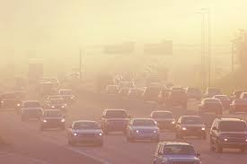
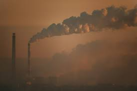

它是一个混合体，是​​多种污染物​​（如汽车尾气、工厂排放的fumes、臭氧等）在空气中经过化学反应后，与雾霾（fog）结合形成的。 +
*它是一个​​环境现象*​​，描述的是整个城市或地区的空气质量状况。 +
​​范围大​​：覆盖整个城市或区域，肉眼可见天空被一层灰黄色的雾气笼罩。

这是一个​​混成词 (Portmanteau)​​，由 ​​Sm​​oke (烟) + F​​og​​ (雾) 组合而成，非常形象地说明了它的构成。

常用搭配​​： +
​​Severe smog​​ (严重的雾霾) +
​​A layer of smog​​ (一层烟雾) +
​​Smog alert​​ (雾霾警报) +
​​Photochemical smog​​ (光化学烟雾) - 一种常见的现代城市烟雾类型。 +

常用搭配​​： +
​​Exhaust fumes​​ (汽车尾气) +
​​Toxic fumes​​ (有毒烟气) +
​​Inhale fumes​​ (吸入烟气) +
​​Fumes from...​​ (从...冒出的烟) +

|fume
|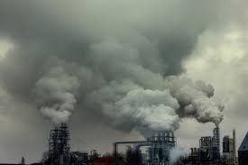

它特指从燃烧或化学反应中产生的、通常带有​​刺鼻气味和毒性​​的气体、烟雾或蒸汽。 +
*它是一个​​具体的排放物​​，强调从某个特定源头（如汽车、工厂、化学品）直接散发出来。*

- Smog (烟雾)​​：**是一种​​#大范围的空气污染#**现象​​，**是多种污染物（包括fumes）**在特定天气条件下**混合的​​结果​​。**
- ​​Fume (烟气)​​：**是指从##某个​​源头直接排放出##的、**通常有害的气体或烟雾​​，*是构成smog的​​成分之一​​。*

|===

'''

==== coast, shore, beach

[.small]
[options="autowidth" cols="1a,1a"]
|===
|Header 1 |Header 2

|coast
|Coast (海岸、海滨)
​​含义​​：
*这是​​地理学上的术语​​，#指的是​​海洋与陆地相接的整个边界区域​​。它描述的是一片相对广阔的​​陆地​​，而不是一条线。#* +
它的视角是​​从陆地向海看​​，或者在地图上看一整片区域。

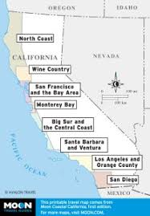

​​特点​​： +
- 与​​海洋 (ocean, sea)​​ 搭配使用。 +
- 范围最大，通常包括悬崖、城镇、沙滩等整个沿海地区。 +
- 常用作形容词，如 coastal city (沿海城市)。 +

​​例句​​：

- I live on the ​​coast​​, so I get to see the ocean every day. +
(我住在​​海岸​​边，所以每天都能看到大海。) -> 指沿海的那片区域。

- _The ​​coast​​ of California_ is very long and varied, with cliffs and beaches. +
(加利福尼亚的​​海岸线​​很长且变化多端，有悬崖和海滩。) -> 指整个沿海地带。

|shore
|Shore (岸、岸边)
​​含义​​：
*指​​任何大面积水体（如海、湖、大河）边缘的陆地​​。它是一个比 coast更通用、更小的概念。* +
它的视角是​​从水面向陆地看​​。当你游泳或乘船时，你朝着“岸”游去。

​​特点​​： +
可与​​海洋、湖泊、河流​​等搭配使用（the shore of the lake 湖岸）。 +
强调“水”与“陆地”的交界线及其附近区域。 +
*范围可大可小，但通常比 coast更具体，#指眼前能看到的那片岸#。* +

​​例句​​：

- After the storm, there were many shells *washed up* on the ​​shore​​. +
(风暴过后，很多贝壳被冲上了​​岸​​。) -> 指水边的那片地。

- We walked along _the ​​shore​​ of the Great Lakes_ for hours. +
(我们沿着五大湖的​​湖岸​​走了几个小时。)

|beach
|Beach (海滩)
​​含义​​：
*#特指​​由沙、卵石或小石子覆盖的平坦的 shore​​。它是 shore的一种。#* +
核心在于其​​材质和功能​​：*通常是人们进行休闲活动（如晒太阳、玩球、游泳）的地方。*

​​特点​​： +
**必须有​​沙或石子​​。岩石嶙峋的 shore不能叫 beach。 **+
与​​休闲、度假、玩耍​​紧密相关。 +
通常用于海洋，但大型湖泊的沙石岸边也可以叫 beach(如 a lake beach)。 +

​​例句​​：

- The children are building sandcastles on the ​​beach​​. +
(孩子们正在​​海滩​​上堆沙堡。) -> 特指有沙的那片岸。

- We spent the whole day relaxing on the sunny ​​beach​​. +
(我们在阳光明媚的​​海滩​​上放松了一整天。)

一个简单的场景帮你理解​​：

想象一个临海的度假胜地：

- 整个这个​​省/市​​的临海区域叫做 the ​​coast​​（海滨地区）。
- 你从酒店走到​​水边​​，你站的地方叫做 the ​​shore​​（岸边）。
- 你脚下​​那片金色的沙子​​区域，就是你铺毛巾晒太阳的地方，叫做 the ​​beach​​（海滩）。
|===

'''

==== stream, brook

[.small]
[options="autowidth" cols="1a,1a"]
|===
|Header 1 |Header 2

|stream
|**这是一个​​总称​​，涵盖了从非常小的涓涓细流, 到几乎可以称为小河（river）的流动淡水体。**它是三者中最​​通用、最科学​​的词汇。

特点 +
*​​规模范围广​​：可指代各种大小的溪流。* +
​​语体中性​​：用于日常对话、地理学、环境科学等任何语境，*没有特殊的感情色彩。* +

image:img/stream.jpg[,20%]

​​常用搭配​​： +
​​Mountain stream​​ (山涧) +
​​Stream of water​​ (水流) +
​​Go with the stream​​ (随波逐流 - 谚语) +

例句 +

- After the rain, the stream behind our house `谓` swelled (v.) and flowed (v.) faster. +
(雨后，我们屋后的溪流水位上涨，流得更快了。)

- The salmon swim (v.) upstream /to spawn (v.) in the stream /where they were born. +
(鲑鱼逆流而上，游回它们出生的溪流中产卵。)

|brook
|Brook (小溪)

**特指​​小型、清澈、通常较浅的溪流​​（stream）。**它的核心区别在于其​​语体色彩​​，它**充满了文学性和田园诗意，**听起来比 stream更悦耳、更古老。

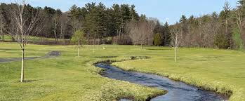

特点 +
​​规模小​​：*几乎总是形容小而迷人的溪流。* +
​​语体文学化​​：**常用于诗歌、文学作品、**古老的地名或为了营造一种宁静、自然的氛围。*在日常口语中较少使用。* +
​​意境优美​​：让人联想到潺潺的流水声、蜿蜒穿过森林或田野的宁静画面。 +

例句

- We found a peaceful spot /by _a babbling brook_ /to have our picnic. +
(我们在一条潺潺作响的小溪边, 找到了一个安静的地方野餐。) -> 营造宁静愉快的氛围。

- The poet wrote (v.) about _the gentle sound of the brook_ /winding (v.) through the valley. +
(诗人笔下写道，小溪蜿蜒穿过山谷，发出轻柔的声音。) -> 典型的文学用法。

一个简单的类比 +
想象一系列流动的水体：

- 最小的水沟或细流，你可以一步跨过，这很可能被称为一条 ​​brook​​ (尤其在意境描写中)。
- 几乎所有流动的淡水，只要还没大到被称为“河”(river)，都可以被叫做 ​​stream​​。Brook是 stream的一种。

|===

'''

==== humid, damp, moist

[.small]
[options="autowidth" cols="1a,1a"]
|===
|Header 1 |Header 2

|Humid (潮湿的)
|这个词​​*专门用于描述天气或大气中的湿度*​​，即空气中含有大量水蒸气。它**描述的是宏观的环境气候条件。**

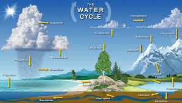

特点 +
​​主体是空气​​：永远与空气（air）、天气（weather）、气候（climate）或环境（environment）搭配。 +
​​中性描述​​：本身不直接包含好坏的评价，但高湿度通常让人感觉不适。 +

​​常用搭配​​： +
​​Humid air​​ (潮湿的空气) +
​​Humid weather​​ (潮湿的天气) +
​​Humid climate​​ (潮湿的气候) +
​​Humidifier​​ (加湿器) +

例句

- The summers in Tokyo /are hot and humid. +
(东京的夏天又热又潮湿。) -> 描述天气。

- It's not the heat /but _the humid air_ that makes me so uncomfortable. +
(不是热，而是潮湿的空气让我如此不舒服。)

| Damp (潮湿的；阴湿的)
|**这个词通常带有​​负面含义​​。**它描述的是一种令人不快的、轻微的潮湿，通常是因为吸水或被水浸湿所致，*常常伴随着一种阴冷、发霉的感觉。* +
​​​​ +

特点 +
​​令人不适​​：暗示一种不健康、不清爽的状态，可能与发霉、腐烂有关。 +
​​触感微凉​​：通常让人感觉到凉意。 +

​​常用搭配​​： +
​​Damp cloth​​ (湿布) +
​​Damp basement​​ (潮湿的地下室) +
​​Damp towel​​ (没完全干的毛巾) +
​​Feel damp​​ (摸起来潮潮的) +

例句 +

- The walls in the old house /were cold and damp (a.) to the touch. +
(老房子的墙壁摸起来又冷又湿。) -> 负面，不舒服。 +
- After the rain, the grass was still damp (a.). +
(雨后，草地仍然是湿漉漉的。) +

|moist (湿润的)
|*这个词通常带有​​正面或中性含义​​。它描述的是一种理想的、恰到好处的潮湿状态，既不过于干燥也不过于湿透。它在描述食物时非常常用。* +
​​​​ +

特点 +
​​令人愉悦​​：常用于描述理想的状态。 +
​​烹饪核心词汇​​：是描述蛋糕、肉类等食物口感时的最佳用词。 +

​​常用搭配​​： +
​​Moist cake​​ (湿润的蛋糕) - 最经典的用法 +
​​Moist soil​​ (湿润的土壤) - 对植物生长有益 +
​​Moist eyes​​ (湿润的眼眶) - 感动得热泪盈眶 +
​​Moisturizer​​ (保湿霜) - 同根词 +

例句 +

- This chocolate cake is incredibly moist and delicious. +
(这款巧克力蛋糕非常湿润可口。) -> 强烈的正面含义。 +
- *Keep the soil moist* /for the seeds to germinate (v.). +
(保持土壤湿润，种子才能发芽。) -> 描述理想状态。

'''

核心区别一句话概括： +
- ​​Humid​​：描述的是​​空气​​（atmosphere）的潮湿，指的是气候或环境中的高湿度。 +
- ​​Damp​​：通常带有​​负面含义​​，指令人不舒服、甚至可能有害的轻度潮湿，常伴有凉意。 +
- ​​Moist​​：通常带有​​正面或中性含义​​，指令人愉悦的、恰到好处的潮湿，常用于描述食物或土壤。 +

想象一个下雨天的场景： +
- 你感觉到​​空气​​很闷，身上粘粘的，这是 ​​humid​​。 +
- 你走进​​地下室​​，发现​​墙壁​​摸起来又冷又湿，可能有霉味，这是 ​​damp​​。 +
- 你回到家，妈妈给你一块刚烤好的​​蛋糕​​，口感松软又水润，这是 ​​moist​​。 +

|===

'''

==== tremble, shiver

[.small]
[options="autowidth" cols="1a,1a"]
|===
|Header 1 |Header 2

|Tremble (颤抖)
|**Tremble 强调的是一种更持久、更难以控制的颤抖，通常由内部状态引发，如强烈的情感或身体虚弱。**它描述的颤抖幅度可能更大，涉及的肌肉群更多。 +

主要起因 +
•   强烈情绪：恐惧 (fear)、焦虑 (anxiety)、紧张 (nervousness)、兴奋 (excitement)、愤怒 (rage)。 +
•   身体状态：虚弱 (weakness)、疾病 (illness)、帕金森等神经性疾病 (Parkinson's disease)、极度疲劳 (exhaustion)。 +

特点 +
•   **持续时间较长：颤抖可能持续一段时间，**与情绪或身体状态的持续时间有关。 +
•   *幅度可能较大：可能涉及手、腿、声音甚至全身的明显抖动。* +
•   难以控制：通常是一种不由自主的反应。 +

常用搭配 +
•   Tremble (v.) with fear/rage/excitement (怕/气/激动得发抖) +
•   Trembling (a.) voice/hands (颤抖的声音/双手) +

例句 +
- *His voice trembled (v.) with anger* /as he spoke.
(他说话时声音, 因愤怒而颤抖。) -> 情绪起因。 +
- She was *so* weak from the fever /*that* her hands trembled (v.) uncontrollably.
(她因发烧身体非常虚弱，双手不受控制地颤抖。) -> 虚弱起因。 +

|Shiver (发抖；打寒颤)
|Shiver 通常指的是一种快速、轻微、肌肉收缩式的颤抖，**像一阵寒意掠过身体。它最主要、最直接的起因是寒冷，**也可以是恐惧或厌恶引起的类似寒冷的反应。 +

主要起因 +
•   寒冷 (Cold)：这是最常见、最核心的原因。 +
•   瞬间的恐惧或预感：如听到可怕的故事或看到可怕的东西时“脊背发凉”的感觉。 +
•   厌恶 (Disgust)：有时强烈的厌恶, 也会引起类似寒颤的反应。 +

image:/img/Shiver.jpg[,20%]

特点 +
•   *持续时间较短：通常是一阵一阵的，像“打冷颤”。* +
•   幅度较小：是肌肉快速的收缩和放松，通常遍及全身。 +
•   *与寒冷强相关：一提到 shiver，首先联想到的就是冷。* +

常用搭配 +
•   Shiver (v.) with cold (冷得发抖) +
•   *Send* a shiver (n.) *down* one's spine (让人脊背发凉) +
•   The shivers (n.) (名词，指因发烧等引起的寒颤) +

例句 +
- I stood waiting for the bus, shivering (v.) in the icy wind.
(我站着等公共汽车，在寒风中发抖。) -> 寒冷是直接原因。 +
- A ghost story /that will *send a shiver down your spine*.
(一个会让你脊背发凉的鬼故事。) -> 恐惧引起类似寒冷的反应。 +

|===

想象一个寒冷的夜晚，你独自在家看一部恐怖电影： +
- 一阵冷风从窗户缝吹进来，你感到一阵寒意，不由自主地 ​​shiver​​（因寒冷而发抖）。 +
- 电影到了最可怕的场景，你因为极度恐惧而全身 ​​tremble​​（因恐惧而颤抖）。

​​结论​​：虽然两者都可因恐惧引起，但 shiver更像是因为恐惧而感到“发冷”的打颤，而 *tremble是情绪本身导致的更剧烈、更持久的抖动。​​"因冷而抖"几乎总是用 shiver。​*

'''

==== suburb, outskirts

[.small]
[options="autowidth" cols="1a,1a"]
|===
|Header 1 |Header 2

|Suburb (郊区)
|**Suburb 指的是一个独立的社区或区域，**它紧挨着大城市的中心区（市中心），*但行政上可能属于,也可能不属于该大城市。它通常是一个规划好的、以住宅为主的区域，居民通常通勤到市中心工作。* +

特点 +
•   社区感：*是一个功能完整的社区，拥有自己的住宅区、学校、商店、公园等。* +
•   居住性质：*主要是住宅区，环境通常比市中心更安静、绿化更好。* +
•   通勤关系：*与中心城市有强烈的通勤联系（人们去城里上班）。* +
•   可数名词：通常以复数形式出现（the suburbs），指代一片郊区；也可以指一个具体的郊区（a suburb）。 +

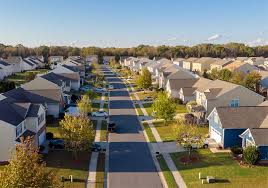

例句 +

- They decided to move to the suburbs to raise their children /because it's quieter and has better schools. +
(他们决定搬到郊区去抚养孩子，因为那里更安静，学校更好。) +
- Palo Alto is a famous suburb of San Francisco, known for its affluence (n.)富裕，富足 and tech companies. +
(帕洛阿尔托是旧金山一个著名的郊区，以其富裕和科技公司而闻名。) +

|Outskirts (郊外；周边地区)
|Outskirts 指的是一个城市或城镇最外围的区域，是建成区结束和**乡村开始的边界地带。**它不强调这是一个完整的社区，而更强调位置和距离——城市的边缘。 +

特点 +
•   边界感：*描述的是城市结束的地方，是城乡结合部。* +
•   过渡性：*这个区域可能比较杂乱，混合着城市和乡村的特点*（如仓库、零散的工厂、农田、未开发的土地）。 +
•   *距离感：强调“在城市的远端”。* +
•   仅用复数：这个词只有复数形式（the outskirts）。 +

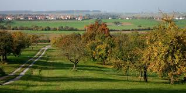

例句 +
- The airport is located on the outskirts of the city.
(机场坐落于城市的郊外。) -> 典型用法，指城市最外围。 +
- They found a small, cheap hotel on the outskirts of town.
(他们在城镇的边缘找到了一家便宜的小旅馆。) +
|===

想象一下从一个国家的首都中心出发： +
你首先会穿过​​市中心 (city center)​​。 +
然后你会经过一些​​内城区 (inner urban areas)​​。 +
接着你会到达规划良好、遍布住宅楼的 ​​suburbs(郊区)​​。 +
继续往外走，你会发现建筑越来越稀疏，开始出现仓库和零散的工厂，这就是城市的 ​​outskirts(郊外)​​。 +
穿过 outskirts，你就进入了​​乡村 (countryside)​​。 +

核心区别一句话概括： +
​​Suburb (郊区)​​：指​​紧邻大城市、规划良好、主要以住宅为主的区域​​，是城市有机组成部分，通常有明确的边界和社区感。 +
​​Outskirts (郊外/周边地区)​​：指​​城市最外围的边缘地带​​，是城市与乡村之间的过渡区域，强调“模糊的边界”和“距离感”。 +

*简单记：​​Suburb是“社区”，Outskirts是“边界”​​。*

'''

==== splendid, grand, magnificent

[.small]
[options="autowidth" cols="1a,1a"]
|===
|Header 1 |Header 2

|Splendid (极好的；辉煌的)
|这个词的核心在于“光彩”（splendor）和“卓越”。**它描述事物因其美丽、出色或高效, 而显得光彩夺目，给人带来极大的快乐或钦佩。**它常用于描述成就、想法、外观或体验。 +

侧重点 +
•   卓越与光彩：*因##品质极高##而显得耀眼。* +
•   愉悦感：常用于表达**对某事的高度赞同和喜悦。** +

常用搭配 +
•   A splendid idea/performance/victory (绝妙的主意/精彩的表演/辉煌的胜利) +
•   Splendid scenery (壮丽的景色) +
•   You look splendid! (你看起来光彩照人！) +
•   We had a splendid time. (我们玩得非常开心。) +

例句 +
- *That's a splendid idea!* It solves all our problems.
(真是个绝妙的主意！它解决了我们所有问题。) -> 强调卓越。 +
- *She looked splendid* in her evening gown.
(她穿着晚礼服看起来光彩照人。) -> 强调耀眼的外观。 +
- *We had a splendid holiday* in the countryside.
(我们在乡下度过了一个极其愉快的假期。) -> 强调愉悦的体验。 +

|Grand (宏伟的；重大的)
|**这个词的核心在于“宏大”和“庄严”。**它强调规模、范围或重要性，给人留下深刻印象，**有时甚至带有一丝威严和正式感。**它常用于描述建筑、计划、场合或人物。 +

侧重点 +
•   *#规模与气势#：物理上或概念上的宏大。* +
•   **#庄严与印象#：**旨在令人印象深刻，有时略显正式或陈旧。 +

常用搭配 +
•   A grand building/palace/hotel (宏伟的建筑/宫殿/酒店) +
•   Grand plan/scale (宏伟的计划/规模) +
•   Grand opening/ceremony (盛大的开幕/典礼) +
•   The Grand Canyon (科罗拉多大峡谷) - 经典例子 +

例句 +
- They live in _a grand house_ with dozens of rooms.
(他们住在一幢有几十个房间的宏伟宅邸里。) -> 强调规模。 +
- The wedding was _a grand affair_ with hundreds of guests.
(这场婚礼是一场有数百名宾客的盛大活动。) -> 强调场面宏大。 +
- *He had grand ambitions* for the company's future.
(他对公司的未来有着宏伟的抱负。) -> 强调重要性。 +

|Magnificent (壮丽的；极好的)
|**这是三者中语气最强、最富感情色彩的词。它描述的是极致的美、壮丽或崇高，其程度足以激发人们的惊叹、敬畏和深深的钦佩。**它常用于描述景色、建筑或艺术成就。 +

侧重点 +
•   *#极致与壮丽*#：美或好的最高级别，*近乎完美。* +
•   **#惊叹与敬畏#：**能激起强烈的情感反应。 +

常用搭配 +
•   A magnificent view/sunset (壮丽的景色/日落) +
•   Magnificent architecture/cathedral (宏伟的建筑/大教堂) +
•   A magnificent achievement (了不起的成就) +
•   A magnificent beast (雄伟的野兽，如狮子) +

例句 +
- We reached the top /and were rewarded with _a magnificent view_ of the valley.
(我们到达山顶， rewarded with a magnificent view of the valley.) -> 景色令人惊叹。 +
- The crown jewels are magnificent, adorned (v.)装饰；使生色 with huge diamonds and rubies.
(王冠珠宝华丽无比，镶嵌着巨大的钻石和红宝石。) -> 极致的美。 +
- The orchestra *gave a magnificent performance* of Beethoven's Ninth Symphony.
(乐团精彩地演奏了贝多芬的第九交响曲。) -> 极致的卓越。 +
|===

splendid、grand 和 magnificent 这三个词都属于“极好、壮丽”的语义场，但它们的侧重点和适用对象有微妙的区别。 +
核心区别一句话概括： +
•   Splendid：强调卓越的光彩、辉煌或给人带来的极度愉悦感，常用于事物带来的体验或外观。 +
•   Grand：强调宏大的规模、庄严的气势或给人留下的深刻印象，常用于建筑、计划或场合。 +
•   Magnificent：**是三者中语气最强的词，**强调极致的美、壮丽或崇高，几乎令人惊叹到肃然起敬。 +

想象一个国王： +
•   他提出了一个 splendid (绝妙的) 策略来赢得战争。 -> 卓越的、出色的。 +
•   他住在 grand (宏伟的) 宫殿里。 -> 规模宏大、气势庄严。 +
•   他加冕时身穿 magnificent (华丽的) 礼服，令人敬畏。 -> 极致的美，令人惊叹。 +

结论： +
•   想表达“太好了！”这种由衷的赞美，用 splendid。 +
•   想强调“大”和“有气势”，用 grand。 +
•   想表达“太震撼了！太美了！”这种极致的赞叹，用 magnificent。

'''

==== heaven, paradise

[.small]
[options="autowidth" cols="1a,1a"]
|===
|Header 1 |Header 2

|Heaven (天堂；天国)
|*Heaven* 是一个主要源于亚伯拉罕宗教（基督教、犹太教、伊斯兰教） 的概念。**它特指神（God）的居所，**是信仰中至高无上的、永恒的完美境界。*它与“地狱”（hell）形成二元对立。* +

特点
•   强烈的宗教性：其定义和内涵与特定教义紧密相连。 +
•   死后的归宿：通常被认为是虔诚的信徒或善良的灵魂在死后去往的地方。 +
•   神的居所：强调那是神所在的地方。 +
•   与“地狱”对立：其意义在与“地狱”的对比中得到强化。 +
•   *首字母常大写：当特指宗教意义上的天堂时，首字母 H 常大写（Heaven）。* +

例句 +
- Christians believe that /good people will *go to Heaven* after they die.
(基督徒相信好人死后会上天堂。) -> 典型的宗教语境。 +
- In the Lord's Prayer, it says: "...Our Father, who art (<古>be 的第二人称单数现在式) in Heaven..."
(在主祷文中，说道：“...我们在天上的父...”) +
- She looked up at the heavens /and gazed at the stars. (此处为小写)
(她仰望天空，凝视着繁星。) -> 小写时常用复数，指“天空”。 +

|Paradise (乐园；天堂；极乐)
|Paradise 一词源于古波斯语，原指“围起来的公园”，后来被多种文化采用。**它的含义更世俗化和多样化。**它可以指：
1.  宗教中理想化的天堂（与 Heaven 同义，但更侧重“乐园”之意）。
2.  人间的任何极致美好、快乐的地方。
3.  *一种极度幸福、满足的状态。* +

特点
•   **宗教色彩较弱：**虽然也有宗教用法，但**更常用来世俗化地形容极致的美好。** +
•   人间与死后皆可：*既可以指死后的乐园，也可以指人间的度假胜地或理想状态。* +
•   “完美”的象征：强调极致的快乐、美丽和满足感。 +
•   常用于比喻：如“购物天堂”、“潜水者的天堂”。 +

例句 +
- The island was _a tropical paradise_ /with white sandy beaches and crystal-clear water.
(那座岛屿是热带天堂，有白色的沙滩和清澈的海水。) -> 指人间的完美之地。 +
- Hawaii is a paradise for surfers.
(夏威夷是冲浪者的天堂。) -> 比喻用法，指理想场所。 +
- In the Bible, the Garden of Eden *is described as* a paradise.
(在《圣经》中，伊甸园被描述为一个乐园。) -> 宗教语境，指最初的完美境界。 +
|===

核心区别一句话概括： +
•   **Heaven：是一个具有强烈宗教色彩的术语，特指上帝或神祇的居所，**是善人死后灵魂的归宿，与“地狱”（hell）相对。 +
•   *Paradise：宗教色彩较弱，含义更广泛，可以指任何极乐、幸福、完美的地方或状态，既可以是在世的，也可以是死后的。* +

一个简单的类比 +
•   Heaven 就像一个只有最虔诚的人才能进入的独家神圣俱乐部，其成员资格有严格的教义规定。 +
•   Paradise 就像是一个对所有人开放的、无比美丽的五星级度假村，代表着完美、放松和极致的享受。 +

结论： +
在大多数情况下，如果你在讨论宗教信仰、来世，那么 Heaven 是更准确、更常用的词。
如果你只是想形容某个地方好得不可思议，让人极度快乐，无论是人间的还是想象中的，那么 Paradise 是更自然、更安全的选择。

'''

==== other

'''

[.small]
[options="autowidth" cols="1a,1a"]
|===
|Header 1 |Header 2

|
|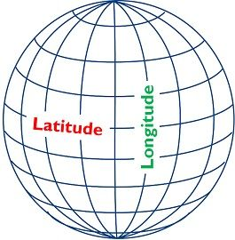

|
|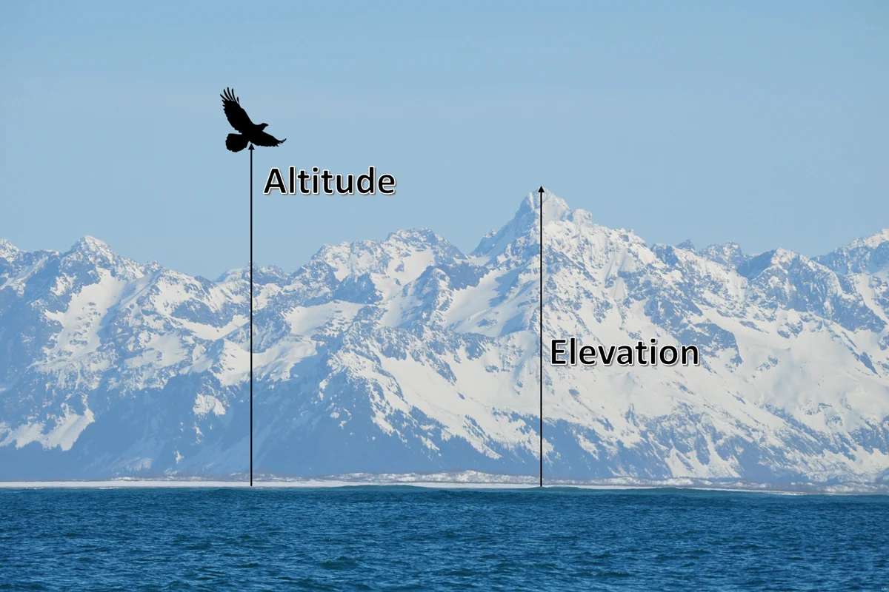

|quartz
|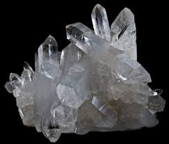

|hillside
|

|fringe
|

|===

'''

