= IETLS 雅思词汇真经 part 02
:toc: left
:toclevels: 3
:sectnums:
:stylesheet: ../../myAdocCss.css

'''

== part 2

==== stack, heap

[.small]
[options="autowidth" cols="1a,1a"]
|===
|Header 1 |Header 2

|Stack
|Stack描述的是一种​​有序的、通常呈垂直状的堆积方式​​。物品被精心地、一个压一个地放在一起，通常是为了节省空间、便于计数或整齐存放。*它暗示了一种​​#组织性和目的性#​​。*

常见搭配与场景 +
​​物品​​：A stack of books/plates/papers/pancakes/boxes (一摞书/一叠盘子/一沓文件/一叠 pancakes/一摞箱子) +
​​动作 (动词)​​：To stack (v.) the chairs after the meeting (会议后把椅子​​叠起来​​) +
​​意象​​：图书馆里整齐的书摞、厨房里洗好晾着的盘子、桌上待处理的文件。 +

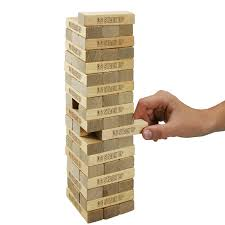

|Heap
|Heap描述的是一种​​**混乱的、无定形的聚集​​。东西被随意地、乱七八糟地扔在一起，形成一个堆。**它强调​​数量​​和​​*#混乱的状态​​，而非秩序。#*

常见搭配与场景 +
​​物品​​：_A heap of_ clothes/rubble/junk/laundry/metal (一​​堆​​衣服/瓦砾/垃圾/待洗的衣物/金属) +
​​状态​​：In a heap (瘫成一堆) +
​​抽象概念​​：_A heap of_ trouble (一大堆麻烦) +
​​意象​​：角落裡待洗的脏衣服、倒塌后的废墟、垃圾场。 +

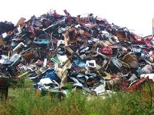
|===

核心区别一句话概括： +
Stack (堆叠)​​：强调​​#有序、整齐、垂直的堆积#​​，通常是为了高效存储或展示，带有​​刻意、稳定​​的意象。 +
Heap (堆积)​​：强调​​#杂乱无章、随意地扔在一起​​的堆#，通常是因为混乱或数量众多，带有​​无序、混乱​​的意象。 +

'''

==== fungus, mould

[.small]
[options="autowidth" cols="1a,1a"]
|===
|Header 1 |Header 2

|Fungus (真菌)
|#*Fungus 是一个科学上的总称，指的是一个独立的生物界*#（Kingdom Fungi）。这个界包含了种类繁多的生物，#*它们的共同特点是：不能进行光合作用，通过分泌酶, 来分解有机物质并吸收养分。*# +

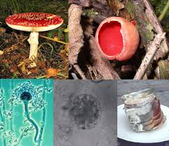

种类与例子 +
•   蘑菇 (Mushrooms)：大型真菌的子实体。 +
•   霉菌 (Mould/Mold)：微观真菌形成的菌落。 +
•   酵母 (Yeast)：单细胞的真菌，用于发酵。 +
•   伞菌 (Toadstools)：通常指有毒的蘑菇。 +
•   木耳 (Wood ear fungus)、松露 (Truffles) 等。 +

特点 +
•   是一个分类学术语，用法正式、科学。 +
•   涵盖范围极广，从单细胞生物到巨大的真菌网络。 +
•   复数形式为 fungi (常用) 或 funguses。 +

例句 +
- Penicillin is an antibiotic /derived (v.) from _the Penicillium fungus_.
(青霉素是一种从青霉菌中提取的抗生素。) -> 科学语境。 +
- Mushrooms and truffles  [植]松露；块菌 are both types of fungi.
(蘑菇和松露都是真菌的一种。) -> 总称。 +

|Mould (霉菌) (美式英语拼写为 mold)
|*##Mould 不是一种分类学术语，而是用来描述某些微观真菌的特定生长方式和形态。##当这些微小的真菌孢子在一个潮湿的表面落地生根时，会长成绒毛状、丝状或粉末状的菌落，这种可见的、通常令人讨厌的生长物就叫做 mould。* +

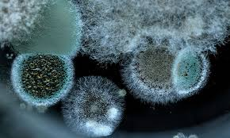

特点 +
•   是一种形态描述，而非严格的生物学分类。 +
•   *几乎总是与潮湿、腐败、食物变质等负面情境相关联。* +
•   *通常被视为需要清除的问题。* +
•   美式英语拼写为 mold。 +

常见场景与例子 +
•   食物发霉：The bread has mould on it. (面包长霉了。) +
•   潮湿环境：Mould grew (v.) on the walls of the damp bathroom. (潮湿浴室的墙上长了霉。) +
•   特定用途：Some moulds are used in cheese production (e.g., blue cheese). (一些霉菌用于奶酪生产，例如蓝纹奶酪。) +

例句 +
- Throw that cheese away; it's covered in green mould.
(把那奶酪扔掉，上面全是绿色的霉。) -> 典型的负面语境。 +
- The damp basement *had a musty (a.)发霉的；落伍的；冷淡的 smell* due to mould.
(潮湿的地下室因为霉菌, 而有股霉味。) +
|===

核心区别一句话概括： +
​​**Fungus (真菌)​​：是一个​​广泛的生物学分类术语​​，#指的是一大类真核生物界，#**包括酵母、霉菌、蘑菇等。 +
​​*Mould (霉菌)​​：是​​真菌的##一种特定##生长形态*​​，特指那些能形成肉眼可见的、绒毛状或粉末状菌落的微观真菌。 +

简单来说，​​所有的 mould都是 fungus，但并非所有的 fungus都是 mould。 +

'''

==== flower, blossom, bloom

[.small]
[options="autowidth" cols="1a,1a"]
|===
|Header 1 |Header 2

|Flower (花)
|动词：也可以作动词，意为“开花”，但不如 bloom 常用和文雅。

| Blossom (花；开花)
|这个词特指果树或观赏树木开的花（如樱花、桃花、苹果花、梨花）。*它强烈暗示这些花是##成簇、成片地开放##，形成一种##繁花似锦##的壮观景象。* +

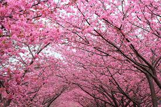

特点 +
•   与树木相关：几乎总是与树联系在一起。 +
•   集体概念：通常用复数形式 (blossoms) 或不可数形式 (in blossom) 来描绘整体的花海景象。 +
•   名词或动词：既可作名词，也可作动词。 +
•   **引申义：可以引申指“蓬勃发展”，**如：a blossoming friendship (一段蓬勃发展的友谊)。 +

例句 +

- `主` The cherry 樱桃；樱桃树 后定说明 _blossoms (v.) in Japan_ `系` are a famous tourist attraction.
(日本的樱花是著名的旅游景点。) -> 特指果树的花，且成片开放。 +
- The apple trees are _in blossom_ (n.) .
(苹果树正在开花。) -> 形容树木开花的整体状态。 +
- Her talent blossomed (v.) when she went to art school.
(她的天赋在她去上艺术学校时绽放了。) -> 引申义，表示发展、成长。 +

|Bloom (开花；花朵；茂盛时期)
|这个词侧重于开花的过程和花朵处于最佳的状态。它描绘的是花朵完全绽放、处于最美最鲜艳时刻的画面。它更具诗意，常用于文学描述中。 +

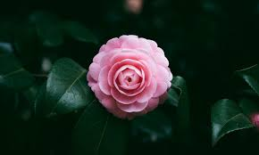

特点 +
•   强调状态与过程：**描述“盛开”这个##动作##**或**盛开的完美##状态##**。 +
•   不可数名词：通常说 in bloom (盛开着)，而不是 a bloom。 +
•   动词常用：*作动词非常普遍，比 flower 更优美。* +
•   *引申义：指“健康、活力的面貌”或“巅峰时期”*，如：the bloom of youth (青春年华)。 +

例句 +
- The roses are _in full bloom_.
(玫瑰正值盛花期。) -> 强调花朵盛开的最佳状态。 +
- These daffodils will bloom (v.) in the spring.
(这些水仙花会在春天开放。) -> 作动词，#强调开花的动作。# +
- She had _the bloom of health_ on her cheeks.
(她脸上有着健康的红晕。) -> 引申义，形容健康光泽。 +
|===

核心区别一句话概括： +
•   **Flower：是##最通用##的词，**指作为植物的生殖器官的花本身，或泛指开花植物。 +
•   *Blossom：通常指果树或观赏树开的花，并且常常##成片簇拥盛开##，强调“#花团锦簇#”的景象。* +
•  ** Bloom：更侧重于一朵花开放的##动作、过程##或状态，**强调“盛开”的动态美和巅峰状态。 +

'''

==== rot, decay

[.small]
[options="autowidth" cols="1a,1a"]
|===
|Header 1 |Header 2

|Rot (腐烂)
|Rot 是一个语气较强、更具象的词。**它专门描述##有机物（如木头、食物、植物组织）##在细菌或真菌作用下发生的分解过程。**这个过程通常伴随着难闻的气味、变色、发软和结构崩塌。 +

特点 +
•   具体且剧烈：强调一种令人不快的、可见的腐败过程。 +
•   常用于生物材料：木材 (wood)、食物 (food)、植物 (plants)、牙齿 (teeth)。 +
•   带有负面情感：常暗示疏忽、浪费或恶心。 +
•   动词和名词同形：既可作动词，也可作名词。 +

常见搭配 +
•   Rot (v.) away (烂掉) +
•   Root rot (植物根腐病) +
•   Dry rot (n.) (木材干腐病) +
•   The rot *set (v.)  in* (习语，指情况开始恶化) +

例句 +
- The fallen apples rotted on the ground.
(掉落的苹果在地上腐烂了。) -> 食物的腐烂。 +
- `主` The wood _in the old shed_ (n.)棚屋，小屋  `谓` *is rotting away* /due to dampness.
(旧棚屋的木头因为潮湿, 正在腐烂。) -> 木材的腐烂。 +
- Don't eat that; *it's gone to rot* (v.).
(别吃那个，已经坏了。) -> 作为名词，指腐烂状态。 +

|Decay (腐烂；衰败)
|Decay 是一个更中立、科学、抽象的术语。*它描述的是一个逐渐、自然发生的分解或退化过程。它不仅可以用于有机物，还可以用于无机物和抽象概念。* +

特点 +
•   广泛且正式：用于科学、医学、社会等正式语境。 +
•   过程自然缓慢：可以是一个自然的循环过程（如自然界分解），而不一定是负面的。 +

•适用范围广： +
    ◦   有机物：牙齿 (teeth)、尸体 (bodies)。 +
    ◦   无机物：放射性物质的衰变 (radioactive decay)、岩石的风化。 +
    ◦   *抽象概念：道德沦丧 (moral decay)、社会的衰败 (the decay of society)。* +

常见搭配 +
•   Tooth decay (蛀牙) - 非常常见的固定搭配 +
•   Radioactive decay (放射性衰变) +
•   Urban decay (城市衰败) +
•   Fall into decay (年久失修) +

例句 +
- Sugar is a major cause of _tooth decay_.
(糖是导致牙齿蛀牙的主要原因。) -> 科学/医学语境。 +
- The process of _radioactive decay_ (n.) `谓` releases (v.) energy.
(放射性衰变过程, 会释放能量。) -> 物理科学语境。 +
- The old mansion *had fallen into decay* /after years of neglect.
(这幢古老的豪宅, 在多年失修后, 已经破败不堪。) -> 指建筑物的破败。 +
|===

核心区别一句话概括： +
​​*Rot​​：通常指​​生物有机体（尤其是植物和食物）的腐烂*​​，过程更​​直观、剧烈​​，常伴有​​难闻的气味和明显的形态破坏​​。 +
​​Decay​​：*是一个更​​广泛、更正式​​的术语，既可指有机物的分解，也可指​​无机物的衰败​​（如金属、岩石），甚至抽象事物的衰落*，过程更​​缓慢、自然​​。 +

'''

==== massive, immense

[.small]
[options="autowidth" cols="1a,1a"]
|===
|Header 1 |Header 2

|Massive (巨大的；大量的)
|**Massive 的##核心含义与 mass（质量；团块）相关。它首先强调物理上##的重量、体积和实体规模。**引申开来，它也常用于形容规模、范围、强度或程度非常大的事物。 +

侧重点 +
•   物理实体：有形的、可触摸的、具有很大质量或体积的东西。 +
•   *#可量化#*：通常暗示这种“大”在某种程度上是可以衡量或感知的。 +
•   强度与影响：也常用于形容程度严重或影响深远的事情。 +

常见搭配 +
•   A massive building/rock (巨大的建筑/岩石) +
•   Massive (a.) support/attack (巨大的支持/猛烈的攻击) +
•   _Massive (a.) amounts of_ data (海量数据) +
•   A massive heart attack (严重的心脏病发作) +

例句 +

- The door was made of _massive oak_ /and was very heavy.
(这扇门由厚重的橡木制成，非常沉重。) -> 强调物理重量和实体。 +
- The company is investing _a massive amount of money_ in research.
(该公司正在投入巨额的资金进行研究。) -> 强调数量之大。 +
- The earthquake caused massive destruction.
(地震造成了巨大的破坏。) -> 强调程度和影响的严重性。 +

|Immense (巨大的；无边的)
|*Immense 的##核心含义是 immeasurable（无法测量的）。##它强调的不是物理重量，而是程度、范围或规模上的极端巨大，#以至于难以衡量或完全理解，常给人一种“浩瀚无垠”的感觉。#* +

侧重点 +
•   范围与程度：*更侧重于抽象的范围、程度或规模，而非物理重量。* +
•   难以估量：暗示这种“大”几乎是无限或超越常规尺度的。 +
•   情感色彩：常带有一种惊叹、敬畏或强调的意味。 +

常见搭配 +
•   Immense pressure/difficulty (巨大的压力/困难) +
•   Immense pleasure/pride (无比的快乐/自豪) +
•   Immense universe (浩瀚的宇宙) +
•   An immense amount of time (大量的时间) +

例句 +

- *She felt immense relief* /when she heard the good news.
(听到这个好消息，她感到无比的宽慰。) -> 强调抽象情感的强度。 +
- The project required _an immense amount of planning_.
(这个项目需要大量的规划。) -> 强调范围的广阔。 +
- They traveled across _the immense desert_.
(他们穿越了浩瀚无垠的沙漠。) -> 强调空间上的广阔无边，令人敬畏。 +
|===

核心区别一句话概括： +
​​Massive​​：强调​​*##物理上##的重量、体积、规模或强度上的“大”​​，通常更具体、更可量化。* +
​​Immense​​：*强调​​程度、范围或规模上的“巨大”​​，##常带有抽象或夸张的意味，##给人以强烈的印象。* +

'''

==== other

[.small]
[options="autowidth" cols="1a,1a"]
|===
|Header 1 |Header 2

|variation
|(n.)1. [ CU]~ (in/of sth) : a change, especially in the amount or level of sth（数量、水平等的）变化，变更，变异 + +
•
The dial records (v.) _very slight variations_ in pressure.该刻度盘能显示很微小的压力变化。 +
•
Currency _exchange rates_ 汇率 are always subject to variation. 货币的兑换率, 始終波动。 +
•
regional/seasonal variation (= depending on the region or time of year) 地区性╱季节性变化 +

2.
[ C]~ (on sth): a thing /that is different from other things in the same general group 变异的东西；变种；变体 +
•This soup is _a spicy (a.)加有香料的，辛辣的；刺激的，粗俗的 variation_ on a traditional favourite. 这种汤, 是在一种受欢迎的传统汤羹中, 加了香料。 +

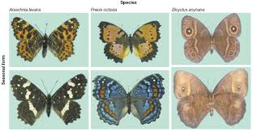

3.
[ C]( music 音)~ (on sth) : any of a set of short pieces of music based on a simple tune repeated in a different and more complicated form 变奏；变奏曲 +
•
_a set of variations_ on a theme by Mozart 以莫扎特某一乐曲为主题的一组变奏曲 +

( figurative) +
•
His numerous complaints are _all variations (n.) on a theme_ (= all about the same thing) .他的满腹牢骚说来道去, 都是为了一件事。 +

|reclaim
|[ VN]
1.~ sth (from sb/sth) to get sth back /or to ask to have it back /after it has been lost, taken away, etc.取回；拿回；要求归还 +
•You'll have to go to the police station /*to reclaim your wallet*.你得到警察局去认领你的钱包。 +
•The team *reclaimed* the title *from* their rivals.这个队从对手手中夺回了冠军。 +
——see also baggage reclaim +

2.#~ sth (from sth)# : to make land /that is naturally too wet or too dry /suitable to be built on, farmed, etc.开垦，利用，改造（荒地） +
•The site for the airport will *be reclaimed* from the swamp.这片湿地将会被开发来建机场。 +
•reclaimed marshland 被开发利用的沼泽地 +

3.[ usually passive] if a piece of land is reclaimed by desert, forest, etc., it turns back into desert, etc. after being used (v.) for farming or building 重新变为沙漠（或森林等）；沙化；荒漠化；抛荒 +

4.~ sth (from sth) : to obtain materials from waste products so that they can be used again 回收（废品中有用的东西） +
——see also recycle(1) +

5.~ sb (from sth) : *to rescue* (v.) sb *from* a bad or criminal way of life 挽救；感化；使纠正；使悔过自新 +
DERIVATIVES 派生词 +

rec·lam·ation[ U] /ˌrekləˈmeɪʃn/  /ˌrekləˈmeɪʃn/ +
n +
•_land reclamation_ 土地开垦 +

|pluck
|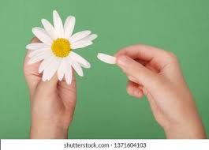

[ VN] ~ sth (out) : to pull out hairs with your fingers or with tweezers摘；拔 +
•She plucked out a grey hair.她拔掉了一根灰白头发。 +

( NAmE also also pick ) to play a musical instrument, especially a guitar , by pulling the strings with your fingers 弹，弹拨（乐器的弦） +
[ VN]
•to pluck the strings of a violin 弹拨小提琴的弦 +

[ VN] ~ sb (from sth) : to remove sb from a place or situation, especially one that is unpleasant or dangerous 解救；搭救 +
•Police plucked a drowning girl from the river yesterday. 昨天警方从河里救起了一名溺水少女。 +

1.#pluck (v.) sth out of the ˈair# +
to say a name, number, etc. without thinking about it, especially in answer to a question 脱口而出；随意回答 +
•I just *plucked a figure out of the air* and said : ‘Would ￡1 000 seem reasonable to you?’ **我随口说出一个数字**问道：“你看1 000英镑合适吗？” +

2.#pluck up (the) ˈcourage (to do sth)# +
to make yourself do sth /even though you are afraid to do it 鼓起勇气（做某事） +
•I finally *plucked up the courage* to ask her for a date. 我终于鼓起勇气约她出去。 +

|spade
|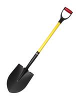

|rake
|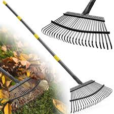

|terrace
|n.（风格相同、互相连接的）排屋；（尤指房屋或餐馆外的）露天平台，阳台；<英>（足球场的）阶梯看台；梯田，阶地；<英>排屋中的一栋房屋；（地质）沿岸阶地，阶面 +
v.使成阶地（或梯田）

|hay
|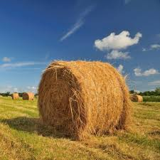

|straw
|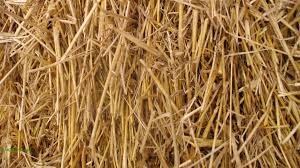
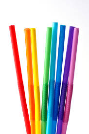

|reed
|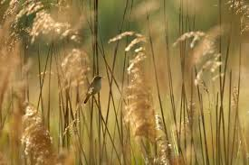

|thorn
|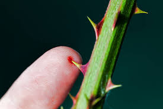

|weed
|1.
[ C]a wild plant growing where it is not wanted, especially among crops or garden plants 杂草，野草（尤指庄稼或花园中的） +
•The yard was overgrown with weeds. 这座庭院杂草丛生。 +
2.[ U]any wild plant without flowers /that grows in water /and forms a green floating mass 水草 +
3.the weed[ sing.] ( humorous) or cigarettes tobacco 烟草；烟叶；香烟；烟卷 +
•I wish I could give up the weed (= stop smoking). 但愿我能把烟戒掉。 +
4.[ U] ( informal ) the drug cannabis 大麻烟 +
5.[ C] ( BrE informal disapproving) a person with a weak character or body 懦弱的人；体弱的人

image:/img/weed.jpg[,15%]
image:/img/weed 2.jpg[,15%]

|vine
|image:/img/vine.jpg[,15%]

|violet
|image:/img/violet.jpg[,15%]

|tulip
|image:/img/tulip.jpg[,15%]
image:/img/tulip 2.jpg[,15%]

|reef
|image:/img/reef.jpg[,15%]

|alga
|藻类，海藻
image:/img/alga.jpg[,15%]

|===

'''

